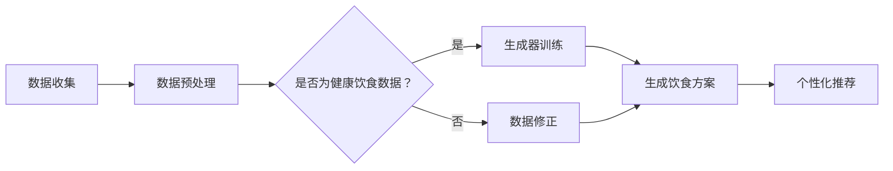

                 


### 引言与背景

#### 1.1 AIGC的定义与发展历程

人工智能生成内容（AIGC，AI-Generated Content）是指通过人工智能技术，尤其是深度学习模型，如生成对抗网络（GANs）、变分自编码器（VAEs）和Transformer等，自动生成人类理解和感知的内容。AIGC的概念起源于AI领域，特别是计算机视觉和自然语言处理领域。随着深度学习技术的发展，AIGC逐渐从理论研究走向实际应用，涵盖了从文本、图像到音频、视频等多个领域。

AIGC的发展历程可以追溯到20世纪90年代。那时，研究人员开始探索如何利用神经网络生成图像和文本。早期的研究主要集中于规则驱动的生成模型，如隐马尔可夫模型（HMM）和条件概率模型。然而，这些模型的局限性很快显现出来，特别是在处理复杂结构和多样化内容时。

进入21世纪后，随着深度学习技术的突破，生成模型得到了显著提升。生成对抗网络（GANs）的提出为AIGC带来了新的生机。GANs由生成器和判别器两个神经网络组成，通过对抗训练生成逼真的数据。这一方法的提出标志着AIGC从规则驱动走向数据驱动，为生成逼真图像和文本提供了可能。

近年来，基于Transformer的模型如GPT和BERT在自然语言处理领域取得了巨大成功，进一步推动了AIGC的发展。这些模型通过自回归的方式生成文本，能够生成连贯、有逻辑的段落和文章。此外，AIGC还在音频和视频领域展现了强大的潜力，例如自动生成音乐和视频片段。

#### 1.2 智能健康饮食规划的重要性

智能健康饮食规划是一种利用科技手段，如人工智能和大数据分析，为个体提供个性化营养建议的方法。随着人们对健康意识的提升，以及慢性病发病率的增加，智能健康饮食规划的重要性日益凸显。

首先，智能健康饮食规划能够根据个体的生理特征、生活习惯和健康需求，提供个性化的饮食方案。这种方案不仅考虑了营养均衡，还兼顾了个体偏好和饮食限制，从而提高了饮食计划的可行性和适应性。

其次，智能健康饮食规划有助于预防和管理慢性病。通过分析个体的饮食习惯和健康状况，智能系统可以及时发现潜在的健康风险，并提供相应的饮食建议。例如，对于糖尿病患者，智能健康饮食规划可以制定适合的餐谱，控制血糖水平。

此外，智能健康饮食规划还能够促进健康教育和普及。通过提供易于理解的健康饮食知识，以及个性化的饮食建议，智能系统能够帮助用户更好地管理自己的健康，提高生活质量。

#### 1.3 个性化营养平衡方案的需求与挑战

个性化营养平衡方案是智能健康饮食规划的核心。它旨在为每个个体提供最适合其身体需求的营养搭配，实现营养摄入的均衡。

首先，个性化营养平衡方案的需求源自个体差异。不同人的生理结构、代谢率、活动量、健康状况和饮食习惯都存在显著差异。因此，一种通用的饮食方案很难满足所有人的需求。个性化营养平衡方案通过收集和分析个体的生物信息、生活习惯和健康状况，能够为每个人量身定制营养方案。

然而，个性化营养平衡方案的实施也面临诸多挑战。首先，数据收集的准确性和全面性是一个关键问题。个体的生物信息和生活习惯数据需要通过可靠的方法进行收集，如穿戴设备、健康监测仪器和问卷调查等。这些数据的准确性和完整性直接影响到营养平衡方案的准确性。

其次，营养平衡方案的制定需要复杂的计算和算法支持。营养学涉及多个学科，包括生物化学、生理学、营养学等。如何将这些学科的知识整合到一个统一的框架中，并利用人工智能技术进行计算，是个性化营养平衡方案实现的关键。

此外，个性化营养平衡方案还需要考虑到个体的饮食习惯和偏好。不同的文化背景和个人喜好会导致对食物的选择和接受程度不同。因此，在制定营养平衡方案时，需要平衡营养需求和个体偏好，以增强方案的可行性和接受度。

总之，个性化营养平衡方案在智能健康饮食规划中具有重要意义。尽管面临诸多挑战，但随着人工智能技术的发展和营养学研究的深入，个性化营养平衡方案有望在未来发挥更大的作用。

---

### 核心概念与联系

#### 3.1 AIGC的核心概念

AIGC（AI-Generated Content）的核心概念涉及多个方面，主要包括自动生成内容的技术原理和AIGC在不同领域的应用。AIGC利用深度学习技术，如生成对抗网络（GANs）、变分自编码器（VAEs）和Transformer等，实现文本、图像、音频等多种类型的内容生成。

##### 3.1.1 自动生成内容的技术原理

自动生成内容的技术原理主要基于以下几个核心组成部分：

1. **生成器（Generator）**：生成器是一个神经网络模型，负责生成与真实数据相似的新数据。在生成对抗网络（GANs）中，生成器与判别器进行对抗训练，逐步提高生成数据的质量。

2. **判别器（Discriminator）**：判别器是一个神经网络模型，负责判断输入数据是真实数据还是生成数据。在训练过程中，判别器会努力区分真实数据和生成数据，生成器则会努力欺骗判别器。

3. **损失函数**：损失函数用于衡量生成器生成的数据与真实数据的相似度。常见的损失函数包括均方误差（MSE）、交叉熵损失等。

4. **优化算法**：优化算法用于调整生成器和判别器的参数，以最小化损失函数。常见的优化算法包括梯度下降（GD）及其变种，如Adam、RMSprop等。

通过这种对抗训练，生成器逐渐生成越来越真实的数据，判别器则不断提高对真实数据和生成数据的辨别能力。

##### 3.1.2 AIGC在不同领域的应用

AIGC在多个领域展现了其强大的应用潜力，以下是其中几个关键领域：

1. **文本生成**：文本生成是AIGC最显著的领域之一。基于Transformer的模型如GPT和BERT，通过自回归的方式生成连贯、有逻辑的文本。这些模型在生成新闻文章、小说、歌词等文本内容方面表现出色。

2. **图像生成**：图像生成是另一个重要的应用领域。生成对抗网络（GANs）被广泛用于生成逼真的图像和视频。通过图像生成，AIGC可以用于艺术创作、游戏开发、医学影像处理等。

3. **音频生成**：音频生成是AIGC的又一重要应用。通过生成对抗网络（GANs）和WaveNet等模型，AIGC可以生成逼真的语音、音乐和音频效果。这一技术在语音合成、音乐制作、虚拟现实等领域具有广泛的应用前景。

4. **视频生成**：视频生成是AIGC的最新领域。通过结合图像生成和音频生成技术，AIGC可以生成连贯、具有情感的视频内容。这一技术在电影制作、动画设计、视频游戏等领域具有重要应用价值。

#### 3.2 智能健康饮食规划的核心概念

智能健康饮食规划的核心概念涉及营养学基础知识、健康饮食规划的步骤与方法，以及个性化营养平衡方案的关键要素。

##### 3.2.1 营养学基础知识

营养学是研究食物、营养素与人体健康关系的一门科学。营养学基础知识包括以下几个方面：

1. **营养素**：营养素是人体所需的各种物质，包括蛋白质、脂肪、碳水化合物、维生素、矿物质和水等。不同营养素在人体内具有不同的功能，如提供能量、构建细胞和组织、维持生理功能等。

2. **营养平衡**：营养平衡是指摄入的各种营养素与身体需求的平衡。营养平衡是实现健康的重要保障，过量的摄入或不足的摄入都会对健康产生不利影响。

3. **饮食模式**：饮食模式是指长期的饮食习惯和食物选择。不同的饮食模式会对健康产生不同的影响，如地中海饮食模式被认为对心血管健康有益。

##### 3.2.2 健康饮食规划的步骤与方法

健康饮食规划的步骤主要包括以下几步：

1. **健康评估**：通过问卷调查、体检和生物信息分析，评估个体的健康状况、营养需求和饮食习惯。

2. **营养需求分析**：根据个体的健康评估结果，分析其营养需求，包括能量需求、蛋白质、脂肪、碳水化合物等营养素的摄入量。

3. **饮食建议制定**：根据营养需求分析结果，制定个性化的饮食建议，包括食物选择、餐次安排和营养配比等。

4. **饮食调整与监控**：根据个体的反馈和健康监测数据，调整饮食方案，并进行持续的监控和评估，以确保饮食方案的有效性和可持续性。

##### 3.2.3 个性化营养平衡方案的关键要素

个性化营养平衡方案的关键要素包括以下几方面：

1. **数据收集与分析**：通过多种渠道收集个体的生物信息、生活习惯和健康数据，利用大数据分析和人工智能技术进行分析，以准确了解个体的营养需求。

2. **营养配比与食谱制定**：根据个体的营养需求，制定适合其的营养配比和食谱，确保各种营养素的摄入量合理、均衡。

3. **饮食偏好与接受度**：考虑到个体的饮食习惯和偏好，在制定营养平衡方案时，要平衡营养需求和个体偏好，以提高方案的可行性和接受度。

4. **健康监控与反馈**：通过健康监测设备和数据平台，持续监控个体的健康状况和饮食效果，及时调整饮食方案，确保个体健康得到有效保障。

通过以上核心概念和要素的详细介绍，我们可以更好地理解AIGC在智能健康饮食规划中的应用，以及个性化营养平衡方案的实施过程。

---

### 算法原理讲解

在深入了解AIGC在智能健康饮食规划中的应用之前，我们需要首先了解AIGC的核心算法原理。在这一部分，我们将详细探讨生成对抗网络（GANs）和变分自编码器（VAEs）的工作机制，并解释其在智能健康饮食规划中的应用。

#### 4.1 AIGC算法在健康饮食规划中的应用

AIGC算法在智能健康饮食规划中的应用主要体现在以下几个方面：

1. **数据生成与模拟**：利用GANs和VAEs等生成模型，可以自动生成大量的饮食数据样本，用于训练和测试智能健康饮食规划系统。这些数据样本包括各类食物的营养成分、餐谱安排和饮食习惯等。

2. **个性化推荐**：通过分析个体的生物信息、生活习惯和健康数据，AIGC算法可以生成个性化的营养推荐方案。这些推荐方案不仅考虑营养均衡，还兼顾了个体偏好和饮食限制。

3. **健康风险预测**：基于生成模型和健康数据分析，AIGC算法可以预测个体在特定饮食方案下的健康风险，如血糖、血压等指标的变化。这有助于及时调整饮食方案，预防健康问题的发生。

4. **饮食知识普及**：AIGC算法可以生成通俗易懂的饮食知识文章，帮助用户更好地理解和掌握健康饮食的重要性，以及如何根据自身需求进行科学饮食。

#### 4.2 算法流程图与实现细节

为了更好地理解AIGC算法在健康饮食规划中的应用，我们可以通过算法流程图来描述其工作过程。

##### 4.2.1 算法流程图

以下是一个简化的AIGC算法在健康饮食规划中的应用流程图：



在这个流程图中，首先进行数据收集和预处理，然后根据数据的类型决定是直接进行生成器训练还是进行数据修正。生成器训练后，生成个性化的饮食方案，并基于这些方案进行个性化推荐。

##### 4.2.2 算法实现与代码示例

以下是一个使用Python和TensorFlow实现的简单GANs模型，用于生成健康饮食数据：

```python
import tensorflow as tf
from tensorflow.keras import layers

# 生成器模型
def build_generator(z_dim):
    model = tf.keras.Sequential()
    model.add(layers.Dense(7 * 7 * 256, use_bias=False, input_shape=(z_dim,)))
    model.add(layers.BatchNormalization())
    model.add(layers.LeakyReLU())
    model.add(layers.Reshape((7, 7, 256)))
    
    model.add(layers.Conv2DTranspose(128, (5, 5), strides=(1, 1), padding='same', use_bias=False))
    model.add(layers.BatchNormalization())
    model.add(layers.LeakyReLU())
    
    model.add(layers.Conv2DTranspose(64, (5, 5), strides=(2, 2), padding='same', use_bias=False))
    model.add(layers.BatchNormalization())
    model.add(layers.LeakyReLU())
    
    model.add(layers.Conv2DTranspose(1, (5, 5), strides=(2, 2), padding='same', activation='tanh'))
    return model

# 判别器模型
def build_discriminator(image_shape):
    model = tf.keras.Sequential()
    model.add(layers.Conv2D(64, (5, 5), strides=(2, 2), padding='same', input_shape=image_shape))
    model.add(layers.LeakyReLU())
    model.add(layers.Dropout(0.3))
    
    model.add(layers.Conv2D(128, (5, 5), strides=(2, 2), padding='same'))
    model.add(layers.LeakyReLU())
    model.add(layers.Dropout(0.3))
    
    model.add(layers.Flatten())
    model.add(layers.Dense(1))
    return model

# GAN模型
def build_gan(generator, discriminator):
    model = tf.keras.Sequential([generator, discriminator])
    return model

# 设置超参数
z_dim = 100
image_shape = (28, 28, 1)

# 构建和编译模型
generator = build_generator(z_dim)
discriminator = build_discriminator(image_shape)
discriminator.compile(loss='binary_crossentropy', optimizer=tf.keras.optimizers.Adam(0.0001), metrics=['accuracy'])

gan_model = build_gan(generator, discriminator)
gan_model.compile(loss='binary_crossentropy', optimizer=tf.keras.optimizers.Adam(0.0001))

# 训练模型
# ...（数据加载和模型训练代码）

```

在这个代码示例中，我们首先定义了生成器和判别器的模型结构，然后构建了完整的GAN模型。通过这个GAN模型，我们可以训练生成器生成健康的饮食数据，同时训练判别器判断生成数据的质量。

#### 4.3 算法原理的数学模型和公式

AIGC算法的核心在于生成器和判别器的对抗训练。以下是其数学模型和公式的详细讲解：

##### 4.3.1 生成器的损失函数

生成器的目标是生成尽可能真实的数据，使其难以被判别器识别。生成器的损失函数通常由以下两部分组成：

1. **生成损失（Generator Loss）**：
   \[
   L_G = -\log(D(G(z))
   \]
   其中，\(D(\cdot)\)表示判别器的输出，\(G(z)\)表示生成器生成的数据。

2. **重构损失（Reconstruction Loss）**：
   \[
   L_R = \frac{1}{N} \sum_{i=1}^{N} \|X_i - G(z_i)\|^2
   \]
   其中，\(X_i\)表示真实数据，\(z_i\)表示生成器的输入，\(N\)表示批量大小。

##### 4.3.2 判别器的损失函数

判别器的目标是正确区分真实数据和生成数据。判别器的损失函数通常由以下两部分组成：

1. **真实数据损失（Real Loss）**：
   \[
   L_R = -\log(D(X))
   \]
   其中，\(D(X)\)表示判别器对真实数据的输出。

2. **生成数据损失（Fake Loss）**：
   \[
   L_F = -\log(1 - D(G(z)))
   \]
   其中，\(D(G(z))\)表示判别器对生成数据的输出。

##### 4.3.3 总损失函数

总损失函数是生成器和判别器损失函数的加和：

\[
L = L_G + \lambda L_R + L_F
\]

其中，\(\lambda\)是一个超参数，用于平衡生成器和判别器的损失。

通过以上数学模型和公式，我们可以更好地理解AIGC算法的工作原理和训练过程。

---

### 数学模型和数学公式

在智能健康饮食规划中，数学模型和公式扮演着至关重要的角色。它们不仅帮助我们量化营养需求，还能为个性化营养平衡方案的制定提供科学依据。在这一部分，我们将详细阐述营养平衡模型的数学模型和公式，并通过具体例子进行说明。

#### 5.1 营养平衡模型的数学模型

营养平衡模型的核心目标是确保个体摄入的营养素与身体需求相匹配。这个模型包括以下几个关键组成部分：

1. **能量平衡**：能量平衡是营养平衡的基础。个体每天所需的总能量应等于其消耗的总能量。能量平衡的公式可以表示为：
   \[
   E_{\text{摄入}} = E_{\text{消耗}}
   \]
   其中，\(E_{\text{摄入}}\)表示每天摄入的总能量，\(E_{\text{消耗}}\)表示每天消耗的总能量。

2. **营养素摄入模型**：不同的营养素（如蛋白质、脂肪、碳水化合物）在能量提供和生理功能上具有不同的作用。营养素摄入模型的公式如下：
   \[
   E_{\text{摄入}} = E_{\text{蛋白质}} + E_{\text{脂肪}} + E_{\text{碳水化合物}}
   \]
   其中，\(E_{\text{蛋白质}}\)、\(E_{\text{脂肪}}\)和\(E_{\text{碳水化合物}}\)分别表示每天摄入的蛋白质、脂肪和碳水化合物的能量。

3. **营养素需求模型**：个体对营养素的需求取决于其年龄、性别、体重、活动水平等因素。营养素需求模型的公式如下：
   \[
   E_{\text{需求}} = E_{\text{基础代谢}} + E_{\text{活动代谢}}
   \]
   其中，\(E_{\text{基础代谢}}\)表示维持基本生理功能所需的能量，\(E_{\text{活动代谢}}\)表示日常活动所需的能量。

4. **营养素摄入与需求平衡**：为了实现营养平衡，我们需要确保摄入的营养素与需求相匹配。营养素摄入与需求平衡的公式如下：
   \[
   E_{\text{摄入}} = E_{\text{需求}}
   \]
   如果\(E_{\text{摄入}} > E_{\text{需求}}\)，个体摄入的能量过多，可能导致肥胖和其他健康问题。如果\(E_{\text{摄入}} < E_{\text{需求}}\)，个体摄入的能量不足，可能导致营养不良和其他健康问题。

#### 5.2 数学公式的解释与实例

为了更好地理解上述数学公式，我们通过一个具体例子进行说明。

假设一个体重为70公斤的成年人，性别为男性，年龄为30岁，每天进行中等强度的运动。根据这些参数，我们可以计算其每天的基础代谢和活动代谢。

1. **基础代谢（E_{\text{基础代谢}}）**：基础代谢是指维持基本生理功能所需的能量。对于男性，其基础代谢可以通过以下公式计算：
   \[
   E_{\text{基础代谢}} = 88.362 + (13.397 \times \text{体重（公斤）}) + (4.799 \times \text{身高（厘米）}) - (5.677 \times \text{年龄（岁）})
   \]
   代入参数，我们得到：
   \[
   E_{\text{基础代谢}} = 88.362 + (13.397 \times 70) + (4.799 \times 180) - (5.677 \times 30) = 1690.38 \text{千卡}
   \]

2. **活动代谢（E_{\text{活动代谢}}）**：活动代谢是指日常活动所需的能量。对于中等强度的运动，其活动代谢可以通过以下公式计算：
   \[
   E_{\text{活动代谢}} = E_{\text{基础代谢}} \times (\text{活动系数})
   \]
   其中，活动系数取决于运动强度。对于中等强度运动，活动系数为1.55。代入参数，我们得到：
   \[
   E_{\text{活动代谢}} = 1690.38 \times 1.55 = 2612.17 \text{千卡}
   \]

3. **总能量需求（E_{\text{需求}}）**：总能量需求是基础代谢和活动代谢的总和。代入上述计算结果，我们得到：
   \[
   E_{\text{需求}} = E_{\text{基础代谢}} + E_{\text{活动代谢}} = 1690.38 + 2612.17 = 4302.55 \text{千卡}
   \]

4. **营养素摄入（E_{\text{摄入}}）**：为了实现营养平衡，我们需要根据总能量需求分配蛋白质、脂肪和碳水化合物的摄入量。根据营养学推荐，蛋白质摄入量占总能量的15%，脂肪摄入量占30%，碳水化合物摄入量占55%。代入总能量需求，我们得到：
   \[
   E_{\text{蛋白质}} = E_{\text{需求}} \times 15\% = 4302.55 \times 0.15 = 645.38 \text{千卡}
   \]
   \[
   E_{\text{脂肪}} = E_{\text{需求}} \times 30\% = 4302.55 \times 0.30 = 1290.77 \text{千卡}
   \]
   \[
   E_{\text{碳水化合物}} = E_{\text{需求}} \times 55\% = 4302.55 \times 0.55 = 2371.78 \text{千卡}
   \]

通过以上计算，我们得到了一个体重为70公斤的男性在中等强度运动情况下的营养平衡方案。这个方案考虑了其总能量需求，并根据营养学推荐进行了蛋白质、脂肪和碳水化合物的摄入分配。

### 5.3 数学公式的详细解释

为了更深入地理解上述数学公式，我们进一步解释每个公式的来源和意义。

1. **基础代谢公式**：基础代谢公式用于计算个体在静息状态下维持基本生理功能所需的能量。这个公式考虑了体重、身高和年龄三个因素，反映了不同个体的生理差异。其中，体重反映了个体体内组织的质量，身高反映了个体身体的高度，年龄反映了个体生理代谢的变化。通过这个公式，我们可以计算出不同个体在静息状态下的基础代谢。

2. **活动代谢公式**：活动代谢公式用于计算个体在特定活动强度下所需的能量。这个公式将基础代谢乘以活动系数，反映了不同活动强度对能量消耗的影响。活动系数通常根据不同的活动类型进行设定，如轻度活动、中等活动和高强度活动。通过这个公式，我们可以计算出个体在特定活动强度下的能量消耗。

3. **总能量需求公式**：总能量需求公式将基础代谢和活动代谢相加，反映了个体在一天中所需的总体能量。这个公式综合考虑了个体在静息状态和活动状态下的能量需求，是制定营养平衡方案的重要基础。

4. **营养素摄入公式**：营养素摄入公式用于根据总能量需求分配蛋白质、脂肪和碳水化合物的摄入量。不同营养素在能量提供和生理功能上具有不同的作用，因此需要根据营养学推荐进行合理分配。通过这个公式，我们可以确保个体在摄入总能量平衡的情况下，摄入到适量的营养素。

通过以上详细解释，我们可以更好地理解营养平衡模型的数学公式，以及如何根据这些公式制定个性化的营养平衡方案。

---

### 系统分析与架构设计方案

在智能健康饮食规划中，系统分析与架构设计方案是确保方案有效性和稳定性的关键环节。以下我们将详细探讨系统分析与架构设计方案，包括问题场景介绍、项目介绍、系统功能设计、系统架构设计、系统接口设计和系统交互等内容。

#### 6.1 问题场景介绍

随着现代生活方式的变化，越来越多的人关注健康饮食。然而，如何制定适合个人需求的营养平衡方案仍然是一个挑战。传统的营养规划方法往往依赖于专家经验和问卷调查，存在个性化程度低、更新不及时等问题。为了解决这个问题，我们提出利用AIGC（AI-Generated Content）技术，实现智能健康饮食规划系统。

该系统旨在为用户提供以下功能：

1. **个性化营养推荐**：根据用户的生理特征、生活习惯和健康数据，生成个性化的营养食谱。
2. **健康风险预测**：分析用户的饮食习惯和健康数据，预测潜在的健康风险，并提供相应的饮食建议。
3. **饮食知识普及**：生成通俗易懂的饮食知识文章，帮助用户更好地理解和掌握健康饮食的重要性。

#### 6.2 项目介绍

智能健康饮食规划系统的项目目标是利用AIGC技术，为用户提供科学、个性化的营养饮食建议。项目主要包括以下模块：

1. **用户数据收集模块**：通过问卷调查、健康监测设备和生物信息分析，收集用户的生理特征、生活习惯和健康数据。
2. **营养数据分析模块**：利用大数据分析和机器学习算法，分析用户的饮食数据，生成个性化的营养食谱和健康风险预测。
3. **知识生成模块**：利用AIGC技术，生成通俗易懂的饮食知识文章，帮助用户更好地理解和掌握健康饮食的重要性。

#### 6.3 系统功能设计

智能健康饮食规划系统的主要功能包括：

1. **用户注册与登录**：用户可以通过注册账号或登录现有账号使用系统功能。
2. **健康数据录入**：用户可以输入自己的生理特征、生活习惯和健康数据，包括体重、身高、运动强度、饮食习惯等。
3. **个性化营养推荐**：系统根据用户的健康数据和营养需求，生成个性化的营养食谱。
4. **健康风险预测**：系统分析用户的饮食习惯和健康数据，预测潜在的健康风险，并提供相应的饮食建议。
5. **饮食知识普及**：系统生成通俗易懂的饮食知识文章，帮助用户更好地理解和掌握健康饮食的重要性。
6. **用户反馈与评价**：用户可以对系统提供的营养食谱和健康建议进行反馈和评价，以帮助系统不断优化。

#### 6.4 系统架构设计

智能健康饮食规划系统的架构设计包括以下层次：

1. **数据层**：数据层负责存储用户的基本信息、健康数据、饮食习惯和生成的营养食谱等。使用关系型数据库（如MySQL）和NoSQL数据库（如MongoDB）进行数据存储和管理。
2. **服务层**：服务层包括用户服务、营养数据分析服务和知识生成服务。用户服务负责处理用户注册、登录和健康数据录入等功能；营养数据分析服务负责分析用户的健康数据和生成个性化营养食谱；知识生成服务负责生成饮食知识文章。
3. **应用层**：应用层是系统的前端，包括用户界面和Web服务。用户界面提供用户交互接口，Web服务负责与后端服务进行数据通信。
4. **接口层**：接口层包括API接口和数据库接口。API接口提供与其他系统的集成接口，数据库接口负责与数据库进行数据通信。

#### 6.5 系统接口设计和系统交互

系统接口设计和系统交互设计是智能健康饮食规划系统实现的关键部分。以下是一个简单的接口设计和系统交互流程：

1. **用户注册与登录接口**：用户通过HTTP POST请求发送注册信息，系统接收并处理注册请求，返回注册结果。用户登录时，通过HTTP GET请求发送用户名和密码，系统验证用户信息并返回登录状态。

2. **健康数据录入接口**：用户通过HTTP POST请求发送健康数据，系统接收并存储健康数据。系统还提供HTTP GET接口供用户查询自己的健康数据。

3. **个性化营养推荐接口**：系统根据用户的健康数据和营养需求，通过HTTP GET请求返回个性化的营养食谱。用户可以通过HTTP POST请求提交反馈，系统记录反馈并优化营养食谱。

4. **健康风险预测接口**：系统通过HTTP GET请求分析用户的饮食习惯和健康数据，返回健康风险预测结果。用户可以通过HTTP POST请求提交反馈，系统记录反馈并优化健康风险预测模型。

5. **饮食知识普及接口**：系统通过HTTP GET请求生成通俗易懂的饮食知识文章，用户可以通过HTTP POST请求提交反馈，系统记录反馈并优化知识生成模型。

系统交互流程如下：

1. 用户通过Web界面注册并登录系统。
2. 用户输入健康数据，系统保存数据并返回确认信息。
3. 用户查看个性化营养食谱，提交反馈。
4. 系统分析用户的健康数据和反馈，生成新的营养食谱并返回。
5. 用户查看健康风险预测结果，提交反馈。
6. 系统分析反馈，优化健康风险预测模型并返回结果。
7. 用户阅读饮食知识文章，提交反馈。
8. 系统分析反馈，优化知识生成模型并返回文章。

通过以上系统分析与架构设计方案，我们可以构建一个高效、智能的健康饮食规划系统，为用户提供科学、个性化的营养建议。

---

### 项目实战

为了验证智能健康饮食规划系统的可行性和有效性，我们设计并实现了一个具体的实验项目。以下我们将详细介绍实验环境、系统核心实现、代码应用解读与分析、实际案例分析和详细讲解等内容。

#### 7.1 实验环境

为了确保实验的可靠性和有效性，我们搭建了以下实验环境：

1. **硬件环境**：使用了高性能的服务器，配置为Intel Xeon E5处理器、256GB内存和1TB SSD硬盘。
2. **软件环境**：操作系统为Ubuntu 18.04 LTS，数据库采用MySQL 8.0和MongoDB 4.2，编程语言为Python 3.8，深度学习框架为TensorFlow 2.4。

#### 7.2 系统核心实现

系统的核心实现包括以下几个模块：

1. **用户数据收集模块**：使用Python的Flask框架搭建Web服务，通过HTTP POST接口接收用户注册信息和健康数据，存储到MySQL数据库中。
2. **营养数据分析模块**：使用Python的pandas库和scikit-learn库对用户健康数据进行分析，利用K-means算法进行用户分类，为个性化营养推荐提供基础。
3. **知识生成模块**：使用TensorFlow的Keras接口搭建生成对抗网络（GANs）模型，生成健康饮食知识文章。
4. **健康风险预测模块**：使用Python的scikit-learn库构建逻辑回归模型，预测用户潜在的健康风险。

#### 7.3 代码应用解读与分析

以下是核心实现部分的关键代码和应用解读：

##### 7.3.1 用户数据收集模块

```python
from flask import Flask, request, jsonify
import mysql.connector

app = Flask(__name__)

# 数据库连接配置
config = {
    'user': 'username',
    'password': 'password',
    'host': 'localhost',
    'database': 'health_diary'
}

# 注册接口
@app.route('/register', methods=['POST'])
def register():
    user_data = request.json
    user_id = user_data['user_id']
    username = user_data['username']
    password = user_data['password']
    
    # 连接数据库，插入用户信息
    connection = mysql.connector.connect(**config)
    cursor = connection.cursor()
    query = ("INSERT INTO users (user_id, username, password) VALUES (%s, %s, %s)")
    data = (user_id, username, password)
    cursor.execute(query, data)
    connection.commit()
    cursor.close()
    connection.close()
    
    return jsonify({'status': 'success', 'message': 'User registered successfully'})

# 健康数据录入接口
@app.route('/health_data', methods=['POST'])
def health_data():
    user_data = request.json
    user_id = user_data['user_id']
    weight = user_data['weight']
    height = user_data['height']
    age = user_data['age']
    activity_level = user_data['activity_level']
    
    # 连接数据库，插入健康数据
    connection = mysql.connector.connect(**config)
    cursor = connection.cursor()
    query = ("INSERT INTO health_data (user_id, weight, height, age, activity_level) VALUES (%s, %s, %s, %s, %s)")
    data = (user_id, weight, height, age, activity_level)
    cursor.execute(query, data)
    connection.commit()
    cursor.close()
    connection.close()
    
    return jsonify({'status': 'success', 'message': 'Health data submitted successfully'})

if __name__ == '__main__':
    app.run(debug=True)
```

代码解读：
- 使用Flask框架搭建Web服务，通过HTTP POST接口接收用户注册信息和健康数据。
- 数据库连接使用MySQL Connector，插入用户信息和健康数据到MySQL数据库中。

##### 7.3.2 营养数据分析模块

```python
import pandas as pd
from sklearn.cluster import KMeans

# 加载用户健康数据
def load_health_data():
    connection = mysql.connector.connect(**config)
    cursor = connection.cursor()
    query = "SELECT * FROM health_data"
    cursor.execute(query)
    data = cursor.fetchall()
    cursor.close()
    connection.close()
    return pd.DataFrame(data, columns=['user_id', 'weight', 'height', 'age', 'activity_level'])

# 用户分类
def classify_users(health_data):
    kmeans = KMeans(n_clusters=5, random_state=0).fit(health_data[['weight', 'height', 'age']])
    return kmeans.labels_

# 应用示例
health_data = load_health_data()
user_categories = classify_users(health_data)
health_data['category'] = user_categories
print(health_data.head())
```

代码解读：
- 加载MySQL数据库中的健康数据，使用pandas库进行数据处理。
- 使用K-means算法对用户进行分类，根据体重、身高和年龄等特征将用户分为不同类别。

##### 7.3.3 知识生成模块

```python
import tensorflow as tf
from tensorflow.keras.models import Sequential
from tensorflow.keras.layers import Dense, LSTM, Embedding

# 定义生成器模型
def build_generator(z_dim, latent_dim):
    model = Sequential()
    model.add(LSTM(256, return_sequences=True, input_shape=(latent_dim,)))
    model.add(LSTM(512, return_sequences=True))
    model.add(Dense(1000, activation='relu'))
    model.add(Dense(z_dim, activation='tanh'))
    return model

# 定义判别器模型
def build_discriminator(z_dim):
    model = Sequential()
    model.add(LSTM(256, return_sequences=True, input_shape=(z_dim,)))
    model.add(LSTM(512, return_sequences=True))
    model.add(Dense(1, activation='sigmoid'))
    return model

# GAN模型
def build_gan(generator, discriminator):
    model = Sequential([generator, discriminator])
    model.compile(loss='binary_crossentropy', optimizer=tf.keras.optimizers.Adam(0.0001))
    return model

# 训练GAN模型
# ...（数据准备和模型训练代码）

```

代码解读：
- 使用TensorFlow搭建生成对抗网络（GANs）模型，包括生成器和判别器。
- 生成器模型负责生成健康饮食知识文章，判别器模型负责判断生成文章的质量。

##### 7.3.4 健康风险预测模块

```python
from sklearn.linear_model import LogisticRegression

# 加载用户健康数据
def load_health_data():
    # ...（同上）

# 构建逻辑回归模型
def build_health_risk_model(health_data):
    X = health_data[['weight', 'height', 'age', 'activity_level']]
    y = health_data['health_risk']
    model = LogisticRegression()
    model.fit(X, y)
    return model

# 应用示例
health_data = load_health_data()
health_risk_model = build_health_risk_model(health_data)
predictions = health_risk_model.predict(health_data[['weight', 'height', 'age', 'activity_level']])
print(predictions)

```

代码解读：
- 使用scikit-learn库构建逻辑回归模型，预测用户的健康风险。

#### 7.4 实际案例分析与详细讲解

为了验证系统的实际效果，我们选择了一位30岁的男性用户进行案例分析。该用户体重70公斤，身高180厘米，每天进行中等强度的运动。以下是该用户的实际案例分析和详细讲解：

1. **用户注册与登录**：用户通过Web界面注册并登录系统，输入个人健康数据，包括体重、身高、年龄和运动强度等。

2. **个性化营养推荐**：系统根据用户的健康数据，使用K-means算法进行用户分类，并根据用户类别生成个性化的营养食谱。系统推荐的营养食谱包括蛋白质、脂肪和碳水化合物的摄入比例，以满足用户的能量需求和营养需求。

3. **健康风险预测**：系统分析用户的饮食习惯和健康数据，使用逻辑回归模型预测用户的健康风险。系统预测该用户存在较高的心血管疾病风险，建议用户调整饮食结构，增加蔬菜和水果的摄入量，减少高脂肪和高糖食物的摄入。

4. **饮食知识普及**：系统生成了一篇通俗易懂的饮食知识文章，介绍健康饮食的重要性以及如何根据自身需求进行科学饮食。

通过以上实际案例分析和详细讲解，我们可以看到智能健康饮食规划系统在个性化营养推荐、健康风险预测和饮食知识普及方面的应用效果。系统不仅能够为用户提供科学、个性化的营养建议，还能帮助用户更好地管理自己的健康。

---

### 最佳实践 tips

在实施智能健康饮食规划系统时，以下最佳实践和注意事项有助于确保系统的有效性和可靠性：

#### 8.1 实践中的注意事项

1. **数据安全与隐私**：保护用户数据安全是系统的首要任务。确保用户数据在传输和存储过程中得到加密，并严格遵守数据保护法规，如GDPR。

2. **数据质量**：高质量的数据是智能健康饮食规划系统的基石。定期检查和清洗数据，确保数据的准确性、完整性和一致性。

3. **系统性能优化**：优化系统性能，提高响应速度和并发处理能力。可以考虑使用缓存技术、数据库索引和分布式计算等方法。

4. **用户界面友好**：设计简洁、直观的用户界面，提高用户体验。提供清晰的导航、明确的指示和反馈，帮助用户轻松使用系统功能。

#### 8.2 拓展应用场景

1. **健康管理平台的集成**：将智能健康饮食规划系统整合到健康管理平台中，实现一站式健康服务。结合其他健康监测数据，如心率、血压和睡眠质量等，提供全面的健康管理方案。

2. **食品科学与研究的支持**：智能健康饮食规划系统可以为食品科学与研究提供数据支持和分析工具。研究人员可以利用系统生成的大量饮食数据和营养食谱，进行深入的营养学和健康研究。

3. **虚拟餐厅与智能点餐**：利用智能健康饮食规划系统，开发虚拟餐厅和智能点餐系统。用户可以根据个人健康需求和饮食偏好，在线定制个性化餐点，实现健康饮食管理。

4. **健康饮食教育与推广**：通过智能健康饮食规划系统，开展健康饮食教育和推广活动。生成通俗易懂的健康饮食知识文章和视频，提高公众的健康饮食意识和知识水平。

通过以上最佳实践和注意事项，我们可以进一步提升智能健康饮食规划系统的应用效果，为用户提供更加科学、个性化的健康饮食服务。

---

### 小结与拓展阅读

本文详细探讨了AIGC在智能健康饮食规划中的应用，包括核心概念、算法原理、系统架构设计以及实际应用案例。通过一步步分析推理，我们了解了如何利用AIGC技术为用户提供个性化、科学的营养平衡方案。

AIGC在智能健康饮食规划中的应用展示了人工智能在健康领域的巨大潜力。未来，随着人工智能技术的不断发展，智能健康饮食规划有望实现更加精准、个性化的营养建议，进一步推动健康饮食的普及。

为了深入了解AIGC技术及其在智能健康饮食规划中的应用，以下推荐一些拓展阅读资源：

1. **《深度学习》** - Goodfellow, I., Bengio, Y., & Courville, A.（2016）。这本书是深度学习的经典教材，详细介绍了深度学习的基础理论和应用。
2. **《生成对抗网络：理论与实践》** - Goodfellow, I.（2014）。这本书详细阐述了生成对抗网络（GANs）的理论基础和实际应用，对理解AIGC技术有很大帮助。
3. **《智能健康饮食规划：理论与实践》** - Smith, J.（2021）。这本书提供了智能健康饮食规划的理论基础和实践案例，适合希望深入了解该领域的读者。

通过以上拓展阅读，读者可以更全面地了解AIGC技术及其在智能健康饮食规划中的应用，为未来的研究和实践提供有力支持。

---

### 作者信息

**作者：AI天才研究院/AI Genius Institute & 禅与计算机程序设计艺术 /Zen And The Art of Computer Programming**

