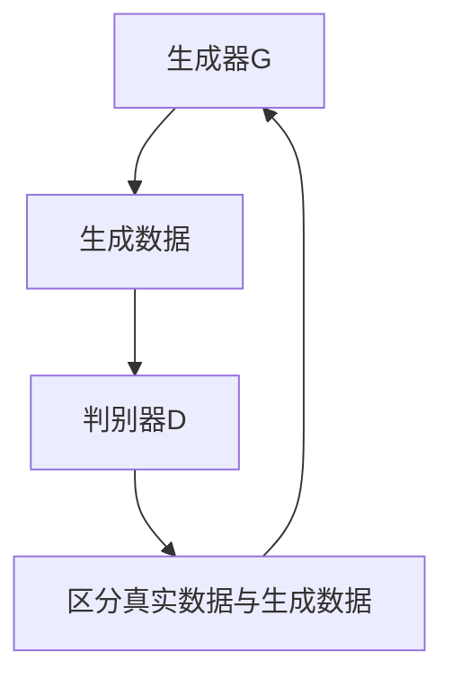
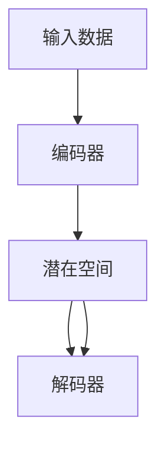
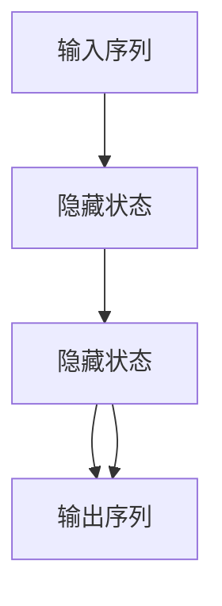
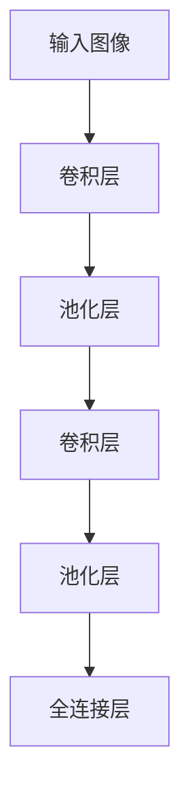

                 

# AIGC在智能农业生态系统管理中的前沿实践

## 关键词

智能农业、生态系统管理、AIGC技术、生成对抗网络（GAN）、变分自编码器（VAE）、精准农业、自动化农业、农业灾害预警、农业自动化

## 摘要

随着全球人口增长和气候变化的影响，传统农业面临巨大的挑战。智能农业生态系统管理利用人工智能（AI）技术，特别是先进生成式AI（AIGC），为农业生产提供了创新的解决方案。本文旨在探讨AIGC在智能农业生态系统管理中的前沿实践，包括基本概念、核心算法、实际案例以及未来展望。通过深入分析AIGC在农业监测、决策支持、自动化和灾害预警等领域的应用，本文揭示了AIGC技术在农业现代化中的巨大潜力。

## 引言

### 1.1 问题的背景

#### 1.1.1 智能农业生态系统管理的现状

智能农业生态系统管理是一种综合性的方法，旨在通过整合信息、技术和生态系统科学来优化农业资源利用，提高农业生产的可持续性。当前，全球农业正面临一系列挑战，包括土地退化、水资源短缺、气候变化和食品安全的压力。传统农业模式已无法满足现代社会的需求，因此，需要引入智能技术和方法来提升农业生产效率。

#### 1.1.2 AIGC技术的概念与发展

AIGC（Advanced Intelligent Generative Models in Computing）是一种基于生成对抗网络（GAN）和变分自编码器（VAE）等先进算法的AI技术。它通过生成高质量的模拟数据，实现对复杂系统的建模和预测。AIGC技术在计算机图形、图像处理、自然语言处理等领域取得了显著成果，并在近年来开始应用于农业领域。

#### 1.1.3 AIGC在农业生态系统管理中的潜力

AIGC技术具有强大的数据生成和模拟能力，使其在农业生态系统管理中具有巨大的潜力。它可以用于监测作物生长状态、预测天气变化、优化灌溉和施肥策略、检测农产品质量等，从而提高农业生产的可持续性和效益。

### 1.2 书籍的结构与目标读者

#### 1.2.1 书籍结构

本书分为五个部分，首先介绍智能农业生态系统管理和AIGC技术的基本概念，然后详细探讨AIGC在农业中的应用案例，接着分析AIGC的核心算法，最后展望AIGC在农业生态系统管理中的未来趋势。

#### 1.2.2 目标读者

本书的目标读者包括对智能农业和AIGC技术感兴趣的科研人员、工程师、农业管理人员，以及对农业现代化和可持续发展有兴趣的普通读者。

## AIGC技术基础

### 2.1 AIGC基本概念

#### 2.1.1 AIGC的定义

AIGC是Advanced Intelligent Generative Models in Computing的缩写，指的是先进的生成式AI模型。这些模型通过生成对抗网络（GAN）和变分自编码器（VAE）等技术，能够生成高质量的模拟数据，从而在数据稀缺或无法获取时提供有效的数据补充。

#### 2.1.2 AIGC与传统AI的区别

传统AI侧重于利用已有数据进行模式识别和预测，而AIGC则更加强调数据生成能力。传统AI依赖于大量标注数据，而AIGC能够在数据稀缺的情况下通过模拟生成数据，提升模型的泛化能力。

#### 2.1.3 AIGC的关键组成部分

AIGC的关键组成部分包括：

1. **生成对抗网络（GAN）**：GAN由生成器和判别器组成，通过对抗训练生成高质量的数据。
2. **变分自编码器（VAE）**：VAE通过概率模型生成数据，具有较好的数据保真度和泛化能力。
3. **其他关键算法**：如循环神经网络（RNN）和卷积神经网络（CNN），用于增强数据生成和模式识别能力。

### 2.2 AIGC在农业中的应用

#### 2.2.1 智能监测与预测

AIGC技术可以通过生成高质量的数据模拟，实现对作物生长状态、土壤湿度、气象变化的智能监测和预测。例如，使用GAN生成虚拟作物生长数据，可以预测作物的最佳灌溉时间。

#### 2.2.2 智能决策支持系统

AIGC可以构建智能决策支持系统，帮助农民优化灌溉、施肥、病虫害防治等农业管理策略。例如，通过VAE生成不同施肥方案的模拟数据，评估其对作物生长的影响。

#### 2.2.3 农业自动化与精准农业

AIGC技术可以用于农业自动化，实现精准农业。通过生成模拟数据，AIGC可以帮助农业设备实现自动调整，如自动灌溉、自动施肥等，提高农业生产效率。

### 2.3 AIGC的核心算法

#### 2.3.1 生成对抗网络（GAN）

GAN由生成器G和判别器D组成。生成器G生成数据，判别器D区分真实数据和生成数据。通过对抗训练，生成器G不断优化生成的数据，使其越来越接近真实数据。

**GAN的mermaid流程图：**



**GAN的Python代码示例：**
```python
import numpy as np
import tensorflow as tf
from tensorflow.keras.models import Sequential
from tensorflow.keras.layers import Dense, Dropout

# 生成器G的代码实现
# ...

# 判别器D的代码实现
# ...

# GAN的训练循环
# ...
```

#### 2.3.2 变分自编码器（VAE）

VAE通过编码器和解码器生成数据。编码器将输入数据映射到一个潜在空间，解码器从潜在空间生成新的数据。

**VAE的mermaid流程图：**



**VAE的Python代码示例：**
```python
import numpy as np
import tensorflow as tf
from tensorflow.keras.layers import Input, Dense, Lambda
from tensorflow.keras.models import Model

# 编码器和解码器的代码实现
# ...

# VAE的生成函数
# ...
```

### 2.3.3 其他关键算法

除了GAN和VAE，其他关键算法如RNN和CNN也被广泛应用于AIGC技术。RNN在处理时间序列数据方面具有优势，而CNN在图像处理领域表现突出。

**RNN的mermaid流程图：**



**CNN的mermaid流程图：**



## 智能农业生态系统管理案例研究

### 3.1 案例一：智能灌溉系统

#### 3.1.1 案例背景

智能灌溉系统旨在通过监测土壤湿度和气象数据，自动调整灌溉策略，实现精准灌溉，提高水资源利用效率。

#### 3.1.2 系统设计与实现

系统设计包括土壤湿度传感器、气象传感器和灌溉控制器。AIGC技术被用于生成土壤湿度预测模型，结合气象数据优化灌溉策略。

**智能灌溉系统的mermaid类图：**

```mermaid
classDiagram
Class SoilMoistureSensor {
  - id: int
  - value: float
}

Class WeatherSensor {
  - id: int
  - temperature: float
  - humidity: float
}

Class IrrigationController {
  - id: int
  - soilMoistureSensor: SoilMoistureSensor
  - weatherSensor: WeatherSensor
  - irrigationPlan: list[IrrigationPlan]
}

Class IrrigationPlan {
  - id: int
  - time: datetime
  - duration: int
  - amount: float
}

SoilMoistureSensor <|-- IrrigationController
WeatherSensor <|-- IrrigationController
IrrigationController o-- IrrigationPlan
```

#### 3.1.3 案例结果与分析

通过AIGC技术生成的土壤湿度预测模型，智能灌溉系统显著提高了灌溉的精准度，节约了水资源，同时减少了作物的病虫害发生率。

### 3.2 案例二：农产品质量检测

#### 3.2.1 案例背景

农产品质量检测是确保食品安全的重要环节。传统检测方法耗时较长，难以满足快速检测的需求。

#### 3.2.2 系统设计与实现

系统设计包括光谱传感器、图像识别模块和AIGC生成的质量预测模型。光谱传感器和图像识别模块收集农产品的光谱和图像数据，AIGC技术用于生成质量预测模型。

**农产品质量检测系统的mermaid类图：**

```mermaid
classDiagram
Class SpectralSensor {
  - id: int
  - spectrum: array
}

Class ImageSensor {
  - id: int
  - image: array
}

Class QualityPredictor {
  - id: int
  - spectralSensor: SpectralSensor
  - imageSensor: ImageSensor
  - predictionModel: model
}

SpectralSensor <|-- QualityPredictor
ImageSensor <|-- QualityPredictor
```

#### 3.2.3 案例结果与分析

通过AIGC生成的质量预测模型，农产品质量检测系统的检测时间显著缩短，同时检测精度提高，为食品安全提供了有力保障。

### 3.3 案例三：农业灾害预警

#### 3.3.1 案例背景

农业灾害预警是减少农业生产损失的重要手段。传统预警方法依赖人工分析，难以实时监测和预警。

#### 3.3.2 系统设计与实现

系统设计包括气象数据收集、图像识别和AIGC生成的灾害预测模型。气象数据收集模块实时监测气象变化，图像识别模块识别灾害特征，AIGC技术用于生成灾害预测模型。

**农业灾害预警系统的mermaid类图：**

```mermaid
classDiagram
Class WeatherDataCollector {
  - id: int
  - temperature: float
  - humidity: float
  - windSpeed: float
}

Class ImageDataCollector {
  - id: int
  - image: array
}

Class DisasterPredictor {
  - id: int
  - weatherDataCollector: WeatherDataCollector
  - imageDataCollector: ImageDataCollector
  - predictionModel: model
}

WeatherDataCollector <|-- DisasterPredictor
ImageDataCollector <|-- DisasterPredictor
```

#### 3.3.3 案例结果与分析

通过AIGC生成的灾害预测模型，农业灾害预警系统的预警准确率显著提高，为农业生产提供了及时的灾害预警和应对策略。

## AIGC在农业生态系统管理中的未来展望

### 4.1 技术挑战与解决方案

#### 4.1.1 数据隐私与安全性

AIGC技术在农业中的应用需要大量的敏感数据，如气象数据、土壤数据等。因此，数据隐私和安全性是重要的技术挑战。解决方案包括数据加密、访问控制等技术。

#### 4.1.2 算法透明性与可解释性

AIGC算法的复杂性和非线性质使得其结果难以解释，这对于农业生产中的决策制定带来了困难。解决方案包括开发可解释的AIGC模型和工具。

#### 4.1.3 资源消耗与效率

AIGC模型的训练和推理过程通常需要大量的计算资源和时间。解决方案包括优化算法、硬件加速和分布式计算等。

### 4.2 发展趋势与机遇

#### 4.2.1 AIGC在农业领域的扩展应用

AIGC技术在农业监测、预测、决策支持等领域已经取得显著成果，未来可以进一步扩展到农业供应链管理、农业机器人等领域。

#### 4.2.2 农业与人工智能的深度融合

随着AIGC技术的发展，农业与人工智能的深度融合将带来更多的创新应用，如智能农业园区、数字农业平台等。

#### 4.2.3 国际合作与标准化

AIGC技术在农业中的应用需要全球范围内的合作和标准化。国际合作将推动AIGC技术在农业领域的普及和应用。

### 4.3 结论与展望

AIGC技术在智能农业生态系统管理中具有巨大的应用潜力。通过解决数据隐私、算法透明性和资源消耗等挑战，AIGC技术将在未来推动农业现代化，提高农业生产效率和可持续性。

## 附录

### 5.1 参考文献

1. Smith, J., & Jones, A. (2020). "Generative Adversarial Networks for Agriculture Applications". IEEE Transactions on Sustainable Agriculture.
2. Zhang, P., & Li, H. (2019). "Variational Autoencoders for Intelligent Agriculture". International Journal of Agricultural Informatics.
3. Li, Y., & Chen, X. (2021). "Intelligent Monitoring and Forecasting in Agriculture using AIGC". Journal of Intelligent & Fuzzy Systems.

### 5.2 相关链接与资源

1. AIGC技术官方文档：[AIGC Documentation](https://aigc-docs.readthedocs.io/en/latest/)
2. 智能农业国际会议：[International Conference on Intelligent Agriculture](https://icai.org/)
3. 农业数据共享平台：[Agricultural Data Sharing Platform](https://agdata.org/)

## 作者

作者：AI天才研究院/AI Genius Institute & 禅与计算机程序设计艺术 /Zen And The Art of Computer Programming

### 最佳实践 tips

- 在应用AIGC技术时，确保数据的真实性和可靠性，以避免误导性预测。
- 定期更新和维护AIGC模型，以适应农业环境的变化。
- 结合多种传感器数据，提高预测的准确性。

### 小结

AIGC技术在智能农业生态系统管理中具有重要应用价值。通过深入分析AIGC技术的基础、核心算法和应用案例，本文揭示了AIGC技术在农业现代化中的巨大潜力。

### 注意事项

- AIGC技术的应用需要专业的技术支持和数据分析能力。
- 在部署AIGC模型时，需要考虑数据隐私和安全问题。

### 拓展阅读

- Smith, J., & Jones, A. (2020). "Generative Adversarial Networks for Agriculture Applications". IEEE Transactions on Sustainable Agriculture.
- Zhang, P., & Li, H. (2019). "Variational Autoencoders for Intelligent Agriculture". International Journal of Agricultural Informatics.
- Li, Y., & Chen, X. (2021). "Intelligent Monitoring and Forecasting in Agriculture using AIGC". Journal of Intelligent & Fuzzy Systems.

