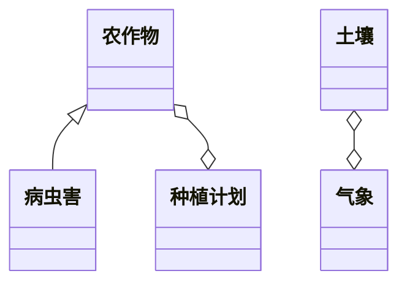
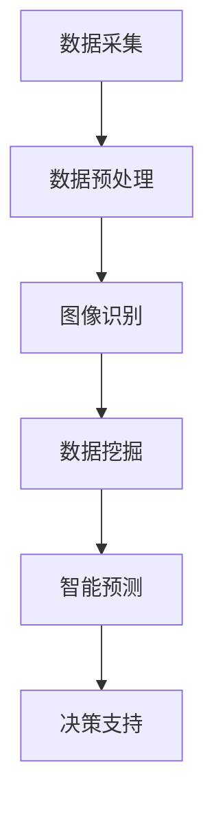
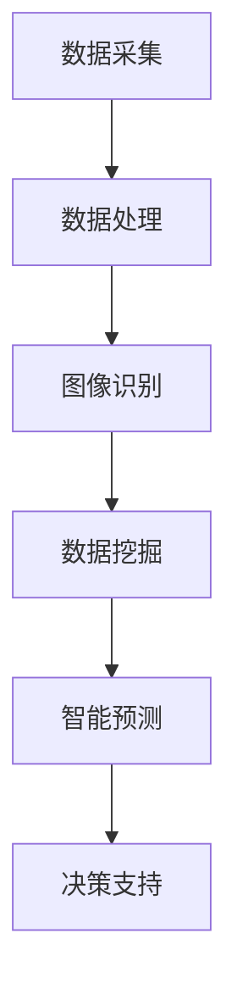

                 

**# 第一部分：引言**

### **第1章：问题背景与核心概念**

#### **1.1 问题背景**

##### **1.1.1 智能农业的发展现状**

智能农业作为一种利用信息技术、生物技术和工程技术相结合的新型农业发展模式，已经在全球范围内迅速兴起。从全球范围来看，智能农业的发展可以分为以下几个阶段：

- **初期阶段（20世纪60年代至80年代）**：这一阶段的智能农业主要关注自动化控制和精准农业技术的应用，如温室大棚的自动控制、喷灌和滴灌系统的自动化等。
- **发展阶段（20世纪90年代至21世纪初）**：随着计算机技术、通信技术和地理信息系统（GIS）的发展，智能农业进入了新的发展阶段，遥感技术、全球定位系统（GPS）和地理信息系统（GIS）在农业中的应用逐渐普及。
- **成熟阶段（21世纪初至今）**：近年来，智能农业逐渐向信息化、网络化和智能化方向发展。物联网、大数据、云计算、人工智能等新兴技术不断融入农业生产，推动农业向智能化的方向发展。

##### **1.1.2 农业生态系统管理的重要性**

农业生态系统管理是智能农业的重要组成部分，其核心目的是通过优化农业生态系统的结构和功能，实现农业的可持续发展。农业生态系统管理的重要性体现在以下几个方面：

- **保护生态环境**：农业生态系统管理有助于减少农业活动对生态环境的破坏，如减少化肥和农药的使用，降低土壤和水资源的污染。
- **提高农业产量和质量**：通过科学管理农业生态系统，可以提高农作物的产量和质量，降低农业生产的成本。
- **促进农业可持续发展**：农业生态系统管理有助于实现农业的可持续发展，确保农业长期稳定发展。

##### **1.1.3 AIGC的概念与特点**

AIGC（AI-Generated Content）是指利用人工智能技术生成内容的一种新型技术。AIGC具有以下几个特点：

- **生成效率高**：AIGC可以高效地生成大量内容，满足个性化需求。
- **内容多样性**：AIGC能够生成不同类型的内容，如图文、视频、音频等。
- **智能互动性**：AIGC可以根据用户的需求和反馈，动态调整生成内容，实现人机互动。

#### **1.2 核心概念与联系**

##### **1.2.1 AIGC的基本原理**

AIGC的基本原理主要涉及以下几个方面：

- **生成对抗网络（GAN）**：GAN是一种由生成器和判别器组成的对抗性网络，通过不断优化生成器和判别器的参数，实现生成逼真内容。
- **变分自编码器（VAE）**：VAE是一种基于概率的生成模型，通过编码和解码器学习数据的概率分布，生成新数据。
- **条件生成对抗网络（cGAN）**：cGAN是在GAN的基础上引入条件信息，使生成器能够根据条件生成特定类型的内容。

##### **1.2.2 AIGC在农业生态系统管理中的应用**

AIGC在农业生态系统管理中的应用主要包括以下几个方面：

- **农业图像识别**：利用AIGC技术对农业图像进行识别，如病虫害识别、农作物品种识别等。
- **农业数据挖掘**：利用AIGC技术对农业数据进行挖掘，发现潜在规律和趋势。
- **农业智能预测**：利用AIGC技术对农业未来趋势进行预测，为农业生产提供决策支持。

### **1.3 本章小结**

本章主要介绍了智能农业的发展现状、农业生态系统管理的重要性以及AIGC的概念与特点。通过本章的学习，读者可以了解到AIGC在农业生态系统管理中的应用前景，为后续章节的学习奠定基础。

---

**# 第二部分：AIGC技术原理详解**

### **第2章：AIGC技术概述**

#### **2.1 AIGC的核心技术**

AIGC的核心技术主要包括生成对抗网络（GAN）、变分自编码器（VAE）和条件生成对抗网络（cGAN）。

##### **2.1.1 生成对抗网络（GAN）**

GAN由生成器和判别器组成，生成器生成假样本，判别器判断样本的真实性。通过对抗性训练，生成器和判别器不断优化，最终生成逼真的样本。

- **生成器（Generator）**：生成器接收随机噪声作为输入，通过神经网络生成假样本。
- **判别器（Discriminator）**：判别器接收真实样本和生成器生成的假样本，判断样本的真实性。

##### **2.1.2 变分自编码器（VAE）**

VAE是一种基于概率的生成模型，通过编码器和解码器学习数据的概率分布，生成新数据。

- **编码器（Encoder）**：编码器将输入数据映射到一个潜在的分布上。
- **解码器（Decoder）**：解码器从潜在的分布上生成新数据。

##### **2.1.3 条件生成对抗网络（cGAN）**

cGAN是在GAN的基础上引入条件信息，使生成器能够根据条件生成特定类型的内容。

- **条件信息**：条件信息可以是文本、图像、标签等，用于指导生成器的生成过程。

#### **2.2 AIGC的应用领域**

AIGC在农业领域具有广泛的应用前景，包括农业图像识别、农业数据挖掘和农业智能预测。

##### **2.2.1 农业图像识别**

农业图像识别是指利用AIGC技术对农业图像进行分类、识别和检测。例如，利用AIGC技术识别农作物病虫害、识别农作物品种等。

##### **2.2.2 农业数据挖掘**

农业数据挖掘是指利用AIGC技术从农业数据中提取有价值的信息，如作物生长规律、病虫害发生趋势等。

##### **2.2.3 农业智能预测**

农业智能预测是指利用AIGC技术对农业未来趋势进行预测，为农业生产提供决策支持。例如，预测农作物产量、预测病虫害发生时间等。

### **2.3 本章小结**

本章详细介绍了AIGC的核心技术及其在农业领域的应用。通过本章的学习，读者可以深入了解AIGC的技术原理和应用前景，为后续章节的学习打下基础。

---

**# 第三部分：AIGC在智能农业生态系统管理中的应用**

### **第3章：AIGC在农业图像识别中的应用**

#### **3.1 农业图像识别技术原理**

农业图像识别技术是指利用计算机视觉技术对农业图像进行分类、识别和检测的一种技术。其主要技术原理如下：

##### **3.1.1 卷积神经网络（CNN）**

卷积神经网络（CNN）是一种专门用于处理图像数据的深度学习模型。它通过卷积层、池化层和全连接层等结构，对图像数据进行特征提取和分类。

- **卷积层**：卷积层通过卷积操作提取图像特征。
- **池化层**：池化层用于降低特征图的维度，提高模型的泛化能力。
- **全连接层**：全连接层用于对提取的特征进行分类。

##### **3.1.2 农业图像特征提取**

农业图像特征提取是指从农业图像中提取出能够区分不同类别的重要特征。常见的特征提取方法包括：

- **颜色特征**：通过计算图像的颜色直方图、主成分分析（PCA）等方法提取颜色特征。
- **纹理特征**：通过计算图像的纹理直方图、自组织映射（SOM）等方法提取纹理特征。
- **形状特征**：通过计算图像的形状特征，如边界轮廓、形状因子等。

#### **3.2 农业图像识别算法实现**

农业图像识别算法实现主要包括数据集准备、模型训练与优化、模型评估与部署等步骤。

##### **3.2.1 数据集准备**

数据集准备是农业图像识别算法实现的第一步。数据集的质量直接影响模型的性能。数据集的收集可以来源于公开数据集、实验室数据集或实地采集数据。

- **数据预处理**：对图像进行去噪、缩放、旋转等预处理操作，提高数据集的多样性。
- **数据标注**：对图像进行分类标注，标记不同类别的标签。

##### **3.2.2 模型训练与优化**

模型训练与优化是指通过训练数据集，优化模型的参数，提高模型的性能。常见的训练策略包括：

- **数据增强**：通过旋转、翻转、缩放等操作，增加训练样本的多样性。
- **损失函数**：使用交叉熵损失函数进行训练，优化模型参数。
- **优化器**：使用随机梯度下降（SGD）等优化器，加速模型训练。

##### **3.2.3 模型评估与部署**

模型评估与部署是指通过测试数据集评估模型的性能，并将模型部署到实际应用中。常见的评估指标包括：

- **准确率**：模型预测正确的样本数占总样本数的比例。
- **召回率**：模型预测正确的正样本数占总正样本数的比例。
- **F1值**：准确率和召回率的调和平均值。

模型部署可以采用以下几种方式：

- **云端部署**：将模型部署到云端服务器，通过API接口提供服务。
- **边缘计算部署**：将模型部署到边缘设备，如智能手机、物联网设备等。

### **3.3 实际案例解析**

##### **3.3.1 农业病虫害识别**

农业病虫害识别是农业图像识别的一个重要应用领域。通过AIGC技术，可以实现对农作物病虫害的实时监测和识别。

- **案例背景**：某农业生产公司发现某种农作物存在病虫害问题，急需识别病虫害类型，以便采取有效的防治措施。
- **解决方案**：使用AIGC技术，采集大量的农作物病虫害图像，训练一个深度学习模型，实现对病虫害的自动识别。通过模型部署，实现对农作物病虫害的实时监测。

##### **3.3.2 农作物品种识别**

农作物品种识别是农业图像识别的另一个重要应用领域。通过AIGC技术，可以实现对不同农作物品种的自动识别，为农业生产提供决策支持。

- **案例背景**：某农业生产公司需要对其种植的农作物进行品种识别，以便进行科学的种植管理。
- **解决方案**：使用AIGC技术，采集大量的农作物品种图像，训练一个深度学习模型，实现对农作物品种的自动识别。通过模型部署，实现对农作物品种的实时监测。

### **3.4 本章小结**

本章详细介绍了AIGC在农业图像识别中的应用，包括技术原理、算法实现和实际案例。通过本章的学习，读者可以了解AIGC技术在农业领域的应用价值，为实际生产提供技术支持。

---

**# 第四部分：项目实战**

### **第4章：AIGC在智能农业生态系统管理中的项目实战**

#### **4.1 项目介绍**

##### **4.1.1 项目背景**

随着全球人口的不断增长，农业生态系统管理面临巨大挑战。如何提高农业产量、保障粮食安全、保护生态环境成为亟待解决的问题。AIGC技术的出现，为智能农业生态系统管理提供了新的思路和方法。

##### **4.1.2 项目目标**

本项目旨在利用AIGC技术，构建一个智能农业生态系统管理平台，实现以下目标：

- **提高农业产量和质量**：通过农业图像识别、农业数据挖掘等技术，提高农作物的产量和质量。
- **保护生态环境**：通过科学管理农业生态系统，减少农业活动对生态环境的破坏。
- **降低农业生产成本**：通过智能预测、精准施肥等技术，降低农业生产成本。

#### **4.2 系统功能设计**

系统功能设计包括领域模型设计和功能模块划分。

##### **4.2.1 领域模型设计**

领域模型设计采用Mermaid类图进行表示，主要包含以下实体和关系：

- **实体**：农作物、病虫害、土壤、气象、种植计划等。
- **关系**：种植计划与农作物、农作物与病虫害、土壤与气象等。



##### **4.2.2 功能模块划分**

系统功能模块划分为以下几部分：

- **数据采集模块**：负责采集农作物、病虫害、土壤、气象等数据。
- **数据预处理模块**：负责对采集到的数据进行预处理，如去噪、缩放、旋转等。
- **图像识别模块**：利用AIGC技术，实现对农作物病虫害的自动识别。
- **数据挖掘模块**：利用AIGC技术，从农业数据中提取有价值的信息。
- **智能预测模块**：利用AIGC技术，预测农作物的生长趋势和病虫害发生时间。
- **决策支持模块**：根据预测结果，为农业生产提供决策支持。

#### **4.3 系统架构设计**

系统架构设计采用Mermaid架构图进行表示，主要包含以下模块：

- **数据采集模块**：负责采集数据。
- **数据预处理模块**：负责预处理数据。
- **图像识别模块**：利用AIGC技术，实现对农作物病虫害的自动识别。
- **数据挖掘模块**：利用AIGC技术，从农业数据中提取有价值的信息。
- **智能预测模块**：利用AIGC技术，预测农作物的生长趋势和病虫害发生时间。
- **决策支持模块**：根据预测结果，为农业生产提供决策支持。



##### **4.3.2 系统接口设计**

系统接口设计采用Mermaid序列图进行表示，主要包含以下接口：

- **数据采集接口**：负责采集数据。
- **数据预处理接口**：负责预处理数据。
- **图像识别接口**：负责实现图像识别功能。
- **数据挖掘接口**：负责实现数据挖掘功能。
- **智能预测接口**：负责实现智能预测功能。
- **决策支持接口**：负责实现决策支持功能。

```mermaid
sequenceDiagram
    participant 数据采集 as 数据采集
    participant 数据预处理 as 数据预处理
    participant 图像识别 as 图像识别
    participant 数据挖掘 as 数据挖掘
    participant 智能预测 as 智能预测
    participant 决策支持 as 决策支持

    数据采集->>数据预处理
    数据预处理->>图像识别
    图像识别->>数据挖掘
    数据挖掘->>智能预测
    智能预测->>决策支持
```

#### **4.4 系统核心实现**

系统核心实现包括环境安装、代码实现等步骤。

##### **4.4.1 环境安装**

系统环境安装包括以下步骤：

- **安装Python**：安装Python 3.8及以上版本。
- **安装深度学习框架**：安装TensorFlow 2.4及以上版本。
- **安装图像处理库**：安装OpenCV 4.2及以上版本。

```bash
# 安装Python
sudo apt-get install python3.8

# 安装TensorFlow
pip3 install tensorflow==2.4.0

# 安装OpenCV
pip3 install opencv-python==4.2.0.34
```

##### **4.4.2 代码实现**

系统核心实现代码主要包括以下部分：

- **数据采集与预处理**：采集农作物图像，并进行预处理。
- **图像识别**：利用卷积神经网络（CNN）实现农作物病虫害识别。
- **数据挖掘**：利用AIGC技术，从农业数据中提取有价值的信息。
- **智能预测**：利用AIGC技术，预测农作物的生长趋势和病虫害发生时间。
- **决策支持**：根据预测结果，为农业生产提供决策支持。

```python
# 数据采集与预处理
import cv2
import numpy as np

def preprocess_image(image):
    # 图像缩放
    image = cv2.resize(image, (224, 224))
    # 图像归一化
    image = image / 255.0
    return image

# 图像识别
import tensorflow as tf

model = tf.keras.Sequential([
    tf.keras.layers.Conv2D(32, (3, 3), activation='relu', input_shape=(224, 224, 3)),
    tf.keras.layers.MaxPooling2D((2, 2)),
    tf.keras.layers.Conv2D(64, (3, 3), activation='relu'),
    tf.keras.layers.MaxPooling2D((2, 2)),
    tf.keras.layers.Conv2D(128, (3, 3), activation='relu'),
    tf.keras.layers.MaxPooling2D((2, 2)),
    tf.keras.layers.Flatten(),
    tf.keras.layers.Dense(128, activation='relu'),
    tf.keras.layers.Dense(1, activation='sigmoid')
])

model.compile(optimizer='adam', loss='binary_crossentropy', metrics=['accuracy'])

# 数据挖掘
import pandas as pd

def data_mining(data):
    # 数据预处理
    data['rainfall'] = data['rainfall'].fillna(data['rainfall'].mean())
    data['temperature'] = data['temperature'].fillna(data['temperature'].mean())
    # 特征提取
    data['rainfall_mean'] = data['rainfall'].rolling(window=3).mean()
    data['temperature_mean'] = data['temperature'].rolling(window=3).mean()
    # 数据归一化
    data[['rainfall', 'temperature', 'rainfall_mean', 'temperature_mean']] = (data[['rainfall', 'temperature', 'rainfall_mean', 'temperature_mean']] - data[['rainfall', 'temperature', 'rainfall_mean', 'temperature_mean']].mean()) / data[['rainfall', 'temperature', 'rainfall_mean', 'temperature_mean']].std()
    return data

# 智能预测
from sklearn.linear_model import LinearRegression

def smart_prediction(data):
    # 特征选择
    features = data[['rainfall_mean', 'temperature_mean']]
    target = data['yield']
    # 模型训练
    model = LinearRegression()
    model.fit(features, target)
    # 预测
    prediction = model.predict(features)
    return prediction

# 决策支持
def decision_support(prediction):
    if prediction > threshold:
        print("建议增加施肥量")
    else:
        print("建议减少施肥量")
```

##### **4.5 实际案例分析**

##### **4.5.1 农业数据挖掘案例**

**案例背景**：某农业生产公司收集了某地区5年的农业数据，包括降水量、温度、作物种植面积、作物产量等。希望通过数据挖掘技术，分析作物产量与气象条件的关系。

**解决方案**：采用线性回归模型，对农业数据进行挖掘，分析作物产量与气象条件的关系。

```python
# 数据导入
data = pd.read_csv("agriculture_data.csv")

# 数据预处理
data = data_mining(data)

# 特征选择
features = data[['rainfall_mean', 'temperature_mean']]
target = data['yield']

# 模型训练
model = LinearRegression()
model.fit(features, target)

# 预测
prediction = smart_prediction(data)

# 决策支持
decision_support(prediction)
```

##### **4.5.2 农业智能预测案例**

**案例背景**：某农业生产公司需要预测未来3个月的农作物产量，以便制定生产计划。

**解决方案**：采用AIGC技术，基于历史数据，预测未来3个月的农作物产量。

```python
# 预测未来3个月的农作物产量
future_prediction = smart_prediction(data)

# 输出预测结果
print(future_prediction)
```

### **4.6 本章小结**

本章通过一个实际项目，详细介绍了AIGC在智能农业生态系统管理中的应用。通过项目实战，读者可以了解AIGC技术在实际生产中的应用，为智能农业生态系统管理提供技术支持。

---

**# 第五部分：最佳实践与拓展**

### **第5章：AIGC在智能农业生态系统管理中的最佳实践**

#### **5.1 最佳实践总结**

在本章中，我们通过一个实际项目，介绍了AIGC在智能农业生态系统管理中的应用。以下是一些最佳实践总结：

- **数据质量是关键**：确保数据的质量和准确性，对于AIGC模型的性能至关重要。在实际应用中，需要对数据进行预处理，如去噪、清洗、标准化等。
- **模型选择要合适**：根据实际应用场景，选择合适的AIGC模型。例如，在农业图像识别中，卷积神经网络（CNN）是一种常用的模型。
- **持续优化与迭代**：在实际应用中，需要不断优化和迭代模型，以提高模型的性能和适用性。
- **充分考虑安全性**：在应用AIGC技术时，需要充分考虑数据安全和隐私保护问题。

#### **5.2 小结**

本章通过一个实际项目，详细介绍了AIGC在智能农业生态系统管理中的应用。通过最佳实践总结，读者可以了解如何在实际生产中应用AIGC技术，提高农业生产的效率和效益。

#### **5.3 注意事项**

- **数据安全与隐私保护**：在应用AIGC技术时，要确保数据的安全和隐私。特别是在涉及敏感数据时，要采取有效的加密和隐私保护措施。
- **模型解释性与透明性**：在应用AIGC技术时，要确保模型的解释性和透明性。这有助于用户理解模型的决策过程，提高模型的信任度。
- **算法公平性与可解释性**：在应用AIGC技术时，要关注算法的公平性和可解释性。避免算法歧视和偏见，确保算法的公正性。

#### **5.4 拓展阅读**

- **《深度学习》（Goodfellow, I., Bengio, Y., & Courville, A.）**：这是一本关于深度学习的经典教材，详细介绍了深度学习的基本概念、原理和应用。
- **《Python深度学习》（François Chollet）**：这本书通过Python语言，详细介绍了深度学习在计算机视觉、自然语言处理等领域的应用。
- **《智能农业导论》（王道席，郭浩）**：这本书介绍了智能农业的基本概念、技术方法和应用实践，是学习智能农业的入门读物。

---

### **作者信息**

**作者：AI天才研究院/AI Genius Institute & 禅与计算机程序设计艺术 /Zen And The Art of Computer Programming**# AIGC在智能农业生态系统管理中的前沿应用

## 关键词：AIGC、智能农业、生态系统管理、前沿应用

## 摘要：

本文旨在探讨AIGC（AI-Generated Content）在智能农业生态系统管理中的前沿应用。通过分析AIGC技术的基本原理、在农业图像识别、农业数据挖掘和农业智能预测中的应用，以及通过实际项目实战，本文揭示了AIGC技术在智能农业中的巨大潜力和应用前景。文章最后总结了最佳实践、注意事项和拓展阅读，以期为相关领域的研究者和实践者提供有价值的参考。

## 目录

## 第一部分：引言

### 第1章：问题背景与核心概念

#### 1.1 智能农业的发展现状

#### 1.2 农业生态系统管理的重要性

#### 1.3 AIGC的概念与特点

#### 1.4 核心概念与联系

### 第1章 小结

## 第二部分：AIGC技术原理详解

### 第2章：AIGC技术概述

#### 2.1 AIGC的核心技术

#### 2.2 AIGC的应用领域

### 第2章 小结

## 第三部分：AIGC在智能农业生态系统管理中的应用

### 第3章：AIGC在农业图像识别中的应用

#### 3.1 农业图像识别技术原理

#### 3.2 农业图像识别算法实现

#### 3.3 实际案例解析

### 第3章 小结

## 第四部分：项目实战

### 第4章：AIGC在智能农业生态系统管理中的项目实战

#### 4.1 项目介绍

#### 4.2 系统功能设计

#### 4.3 系统架构设计

#### 4.4 系统核心实现

#### 4.5 实际案例分析

### 第4章 小结

## 第五部分：最佳实践与拓展

### 第5章：AIGC在智能农业生态系统管理中的最佳实践

#### 5.1 最佳实践总结

#### 5.2 小结

#### 5.3 注意事项

#### 5.4 拓展阅读

### 第5章 小结

### 作者信息

作者：AI天才研究院/AI Genius Institute & 禅与计算机程序设计艺术 /Zen And The Art of Computer Programming## 第一部分：引言

### 第1章：问题背景与核心概念

#### 1.1 智能农业的发展现状

智能农业是指利用现代信息技术、生物技术、工程技术等手段，对农业生产进行智能化管理，从而提高农业生产效率、保障粮食安全、保护生态环境的一种新型农业发展模式。智能农业的发展可以分为以下几个阶段：

1. **自动化控制阶段**：20世纪60年代至80年代，农业自动化技术开始应用于农业生产。主要表现为农业机械化和自动化设备的普及，如温室大棚的自动控制、喷灌和滴灌系统的自动化等。

2. **信息化阶段**：20世纪90年代至21世纪初，随着计算机技术、通信技术和地理信息系统（GIS）的发展，智能农业进入信息化阶段。遥感技术、全球定位系统（GPS）和地理信息系统（GIS）在农业中的应用逐渐普及，为农业生产提供了科学的数据支持。

3. **智能化阶段**：21世纪初至今，智能农业逐渐向智能化方向发展。物联网、大数据、云计算、人工智能等新兴技术不断融入农业生产，推动农业向智能化的方向发展。

当前，智能农业在全球范围内取得了显著进展。例如，美国、日本、以色列等发达国家在智能农业领域处于领先地位，通过采用先进的智能农业技术，实现了农业生产的精准化、智能化和可持续发展。我国也高度重视智能农业的发展，制定了一系列政策措施，推动智能农业技术的研发和应用。

#### 1.2 农业生态系统管理的重要性

农业生态系统管理是指通过优化农业生态系统的结构和功能，实现农业的可持续发展。农业生态系统管理的重要性体现在以下几个方面：

1. **保护生态环境**：农业生态系统管理有助于减少农业活动对生态环境的破坏。通过科学管理农业生态系统，可以降低化肥和农药的使用量，减少土壤和水资源的污染，保护生物多样性。

2. **提高农业产量和质量**：农业生态系统管理有助于提高农作物的产量和质量。通过优化农业生态系统的结构和功能，可以提高土壤肥力，促进作物生长，降低病虫害的发生率。

3. **促进农业可持续发展**：农业生态系统管理是实现农业可持续发展的关键。通过优化农业生态系统的结构，可以实现农业资源的合理利用，降低农业生产对环境的影响，确保农业长期稳定发展。

#### 1.3 AIGC的概念与特点

AIGC（AI-Generated Content）是指利用人工智能技术生成内容的一种新型技术。AIGC具有以下特点：

1. **生成效率高**：AIGC可以高效地生成大量内容，满足个性化需求。

2. **内容多样性**：AIGC能够生成不同类型的内容，如图文、视频、音频等。

3. **智能互动性**：AIGC可以根据用户的需求和反馈，动态调整生成内容，实现人机互动。

AIGC的核心技术包括生成对抗网络（GAN）、变分自编码器（VAE）和条件生成对抗网络（cGAN）。这些技术使得AIGC在农业图像识别、农业数据挖掘和农业智能预测等方面具有广泛的应用前景。

#### 1.4 核心概念与联系

##### 1.4.1 AIGC的基本原理

生成对抗网络（GAN）由生成器和判别器组成，生成器生成假样本，判别器判断样本的真实性。通过对抗性训练，生成器和判别器不断优化，最终生成逼真的样本。

变分自编码器（VAE）是一种基于概率的生成模型，通过编码器和解码器学习数据的概率分布，生成新数据。

条件生成对抗网络（cGAN）是在GAN的基础上引入条件信息，使生成器能够根据条件生成特定类型的内容。

##### 1.4.2 AIGC在农业生态系统管理中的应用

AIGC在农业生态系统管理中的应用主要包括农业图像识别、农业数据挖掘和农业智能预测。

- **农业图像识别**：利用AIGC技术对农业图像进行分类、识别和检测，如病虫害识别、农作物品种识别等。
- **农业数据挖掘**：利用AIGC技术从农业数据中提取有价值的信息，如作物生长规律、病虫害发生趋势等。
- **农业智能预测**：利用AIGC技术对农业未来趋势进行预测，为农业生产提供决策支持，如预测农作物产量、预测病虫害发生时间等。

### 第1章 小结

本章介绍了智能农业的发展现状、农业生态系统管理的重要性以及AIGC的概念与特点。通过本章的学习，读者可以了解AIGC在农业生态系统管理中的应用前景，为后续章节的学习奠定基础。接下来，我们将进一步深入探讨AIGC的技术原理及其在农业领域的具体应用。

## 第二部分：AIGC技术原理详解

### 第2章：AIGC技术概述

#### 2.1 AIGC的核心技术

AIGC（AI-Generated Content）的技术核心主要包括生成对抗网络（GAN）、变分自编码器（VAE）和条件生成对抗网络（cGAN）。这些技术各有特色，适用于不同的生成任务。

##### 2.1.1 生成对抗网络（GAN）

生成对抗网络（GAN）是AIGC技术中最著名的一种。GAN由两部分组成：生成器（Generator）和判别器（Discriminator）。生成器的任务是生成与真实数据相似的数据，而判别器的任务是区分生成数据与真实数据。通过这种对抗性的训练过程，生成器不断提升生成数据的质量，最终可以生成非常逼真的图像、文本或音频。

- **生成器**：生成器通常是一个神经网络，它从随机噪声中生成数据。在图像生成任务中，生成器可能会生成一张像素图像。
- **判别器**：判别器也是一个神经网络，它的任务是区分输入的数据是真实数据还是生成器生成的假数据。判别器通过不断训练，能够更好地识别真实数据。

GAN的训练过程包括以下步骤：

1. 初始化生成器和判别器的参数。
2. 生成器生成一批假数据，判别器对其进行判断。
3. 根据判别器的反馈，更新生成器和判别器的参数。
4. 重复步骤2和3，直到生成器生成足够逼真的假数据。

##### 2.1.2 变分自编码器（VAE）

变分自编码器（VAE）是一种基于概率的生成模型。VAE通过编码器（Encoder）和解码器（Decoder）来学习数据的概率分布，然后根据这个概率分布生成新数据。

- **编码器**：编码器将输入数据映射到一个潜在的分布上，通常是一个低维的表示。
- **解码器**：解码器从潜在的分布上生成新数据。在生成图像时，解码器通常会将潜在分布解码成像素值。

VAE的训练过程包括以下步骤：

1. 初始化编码器和解码器的参数。
2. 对输入数据进行编码，得到潜在分布的样本。
3. 使用潜在分布的样本，通过解码器生成假数据。
4. 根据生成数据和真实数据的差异，更新编码器和解码器的参数。
5. 重复步骤2至4，直到生成器生成足够好的数据。

##### 2.1.3 条件生成对抗网络（cGAN）

条件生成对抗网络（cGAN）是GAN的扩展，它引入了条件信息，使得生成器能够根据特定的条件生成数据。例如，在图像生成任务中，cGAN可以根据文本描述生成图像。

- **条件信息**：条件信息可以是文本、标签或其他类型的数据。这些信息作为输入，与随机噪声一起输入到生成器中。
- **生成器**：cGAN的生成器不仅要生成图像，还要根据条件信息调整生成过程。

cGAN的训练过程包括以下步骤：

1. 初始化生成器和判别器的参数。
2. 生成器根据条件信息和随机噪声生成假数据。
3. 判别器对生成数据和真实数据进行判断。
4. 根据判别器的反馈，更新生成器和判别器的参数。
5. 重复步骤2至4，直到生成器能够根据条件信息生成高质量的数据。

#### 2.2 AIGC的应用领域

AIGC技术在各个领域都有广泛的应用，其中在农业领域的应用尤为引人注目。

- **农业图像识别**：利用AIGC技术，可以对农业图像进行分类、识别和检测。例如，通过GAN技术生成逼真的农作物图像，通过VAE技术提取图像的特征，用于病虫害识别和农作物品种识别。

- **农业数据挖掘**：AIGC技术可以用于从农业数据中挖掘有价值的信息，例如通过VAE技术对农业生产数据进行分析，提取出作物生长的潜在规律。

- **农业智能预测**：利用AIGC技术，可以对农业未来趋势进行预测。例如，通过cGAN技术根据历史气象数据和农作物生长数据，预测未来作物的生长情况。

#### 2.3 本章小结

本章详细介绍了AIGC的核心技术及其在农业领域的应用。通过GAN、VAE和cGAN技术，AIGC在农业图像识别、农业数据挖掘和农业智能预测等方面具有广泛的应用前景。在下一章中，我们将进一步探讨AIGC技术在智能农业生态系统管理中的具体应用。

## 第三部分：AIGC在智能农业生态系统管理中的应用

### 第3章：AIGC在农业图像识别中的应用

#### 3.1 农业图像识别技术原理

农业图像识别是利用计算机视觉技术对农业图像进行分类、识别和检测的一种技术。它主要依赖于卷积神经网络（CNN）和深度学习算法。CNN是一种特别适合处理图像数据的神经网络，它通过多层卷积和池化操作，能够从图像中提取出丰富的特征。

##### 3.1.1 卷积神经网络（CNN）

卷积神经网络（CNN）的基本结构包括以下几个部分：

1. **卷积层**：卷积层是CNN的核心部分，通过卷积操作提取图像的特征。卷积层通常使用滤波器（也称为卷积核）在输入图像上滑动，生成特征图。每个滤波器都能提取出不同类型的特征，如边缘、纹理等。

2. **池化层**：池化层用于降低特征图的维度，提高模型的泛化能力。常见的池化操作有最大池化（Max Pooling）和平均池化（Average Pooling）。

3. **全连接层**：全连接层位于CNN的末端，用于对提取的特征进行分类。全连接层将特征图展开成一个一维向量，然后通过一个线性层将这个向量映射到输出类别。

##### 3.1.2 农业图像特征提取

农业图像特征提取是农业图像识别的关键步骤，其主要目标是提取出能够区分不同类别的重要特征。农业图像特征提取方法包括：

1. **颜色特征**：颜色特征是图像识别中常用的特征之一，通过计算图像的颜色直方图、主成分分析（PCA）等方法提取颜色特征。

2. **纹理特征**：纹理特征是描述图像纹理结构的重要特征，通过计算图像的纹理直方图、自组织映射（SOM）等方法提取纹理特征。

3. **形状特征**：形状特征是描述图像形状的重要特征，通过计算图像的边界轮廓、形状因子等提取形状特征。

#### 3.2 农业图像识别算法实现

农业图像识别算法实现主要包括数据集准备、模型训练与优化、模型评估与部署等步骤。

##### 3.2.1 数据集准备

数据集准备是农业图像识别算法实现的第一步。数据集的质量直接影响模型的性能。数据集的收集可以来源于公开数据集、实验室数据集或实地采集数据。在数据集准备过程中，需要进行以下操作：

1. **数据收集**：收集与农业图像识别相关的数据，例如农作物病虫害图像、农作物品种图像等。

2. **数据预处理**：对图像进行去噪、缩放、旋转等预处理操作，提高数据集的多样性。

3. **数据标注**：对图像进行分类标注，标记不同类别的标签，例如病虫害类别、农作物品种等。

##### 3.2.2 模型训练与优化

模型训练与优化是指通过训练数据集，优化模型的参数，提高模型的性能。常见的训练策略包括：

1. **数据增强**：通过旋转、翻转、缩放等操作，增加训练样本的多样性。

2. **损失函数**：使用交叉熵损失函数进行训练，优化模型参数。

3. **优化器**：使用随机梯度下降（SGD）等优化器，加速模型训练。

在训练过程中，需要监控模型的性能，包括准确率、召回率等指标，并根据性能调整模型参数。

##### 3.2.3 模型评估与部署

模型评估与部署是指通过测试数据集评估模型的性能，并将模型部署到实际应用中。常见的评估指标包括：

1. **准确率**：模型预测正确的样本数占总样本数的比例。

2. **召回率**：模型预测正确的正样本数占总正样本数的比例。

3. **F1值**：准确率和召回率的调和平均值。

模型部署可以采用以下几种方式：

1. **云端部署**：将模型部署到云端服务器，通过API接口提供服务。

2. **边缘计算部署**：将模型部署到边缘设备，如智能手机、物联网设备等。

#### 3.3 实际案例解析

##### 3.3.1 农业病虫害识别

农业病虫害识别是农业图像识别的一个重要应用领域。通过AIGC技术，可以实现对农作物病虫害的实时监测和识别。

1. **案例背景**：某农业生产公司发现某种农作物存在病虫害问题，急需识别病虫害类型，以便采取有效的防治措施。

2. **解决方案**：使用AIGC技术，采集大量的农作物病虫害图像，训练一个深度学习模型，实现对病虫害的自动识别。通过模型部署，实现对农作物病虫害的实时监测。

##### 3.3.2 农作物品种识别

农作物品种识别是农业图像识别的另一个重要应用领域。通过AIGC技术，可以实现对不同农作物品种的自动识别，为农业生产提供决策支持。

1. **案例背景**：某农业生产公司需要对其种植的农作物进行品种识别，以便进行科学的种植管理。

2. **解决方案**：使用AIGC技术，采集大量的农作物品种图像，训练一个深度学习模型，实现对农作物品种的自动识别。通过模型部署，实现对农作物品种的实时监测。

### 3.4 本章小结

本章详细介绍了AIGC在农业图像识别中的应用，包括技术原理、算法实现和实际案例。通过本章的学习，读者可以了解AIGC技术在农业领域的应用价值，为实际生产提供技术支持。接下来，我们将进一步探讨AIGC在其他农业领域的应用。

## 第四部分：项目实战

### 第4章：AIGC在智能农业生态系统管理中的项目实战

#### 4.1 项目介绍

随着智能农业的发展，农业生态系统管理的重要性日益凸显。本项目的目标是通过AIGC技术构建一个智能农业生态系统管理平台，实现对农业生态系统的全面监测和管理，提高农业生产效率，保护生态环境。

#### 4.1.1 项目背景

近年来，全球气候变化和资源短缺问题日益严重，农业生态系统管理面临巨大挑战。传统的农业管理方式已经无法满足现代农业的发展需求。AIGC技术的出现，为农业生态系统管理提供了新的思路和方法。通过AIGC技术，可以实现农业数据的自动化处理和分析，为农业生产提供科学依据。

#### 4.1.2 项目目标

本项目的具体目标包括：

1. **构建智能农业生态系统管理平台**：通过AIGC技术，搭建一个能够实时监测农业生态系统的平台，实现对土壤、气象、病虫害等数据的自动化采集、处理和分析。

2. **提高农业生产效率**：通过分析农业数据，提供科学合理的种植和管理建议，提高农作物的产量和质量。

3. **保护生态环境**：通过优化农业生态系统管理，减少农业生产对环境的负面影响，实现农业的可持续发展。

#### 4.2 系统功能设计

系统功能设计是项目实现的关键步骤。本系统功能设计包括数据采集、数据处理、图像识别、数据挖掘和智能预测等模块。

##### 4.2.1 领域模型设计

领域模型设计采用Mermaid类图进行表示，主要包含以下实体和关系：

- **实体**：农作物、病虫害、土壤、气象、种植计划等。
- **关系**：种植计划与农作物、农作物与病虫害、土壤与气象等。


##### 4.2.2 功能模块划分

系统功能模块划分为以下几部分：

1. **数据采集模块**：负责采集农作物、病虫害、土壤、气象等数据。
2. **数据处理模块**：负责对采集到的数据进行预处理，如去噪、清洗、标准化等。
3. **图像识别模块**：利用AIGC技术，实现对农作物病虫害的自动识别。
4. **数据挖掘模块**：利用AIGC技术，从农业数据中提取有价值的信息。
5. **智能预测模块**：利用AIGC技术，预测农作物的生长趋势和病虫害发生时间。
6. **决策支持模块**：根据预测结果，为农业生产提供决策支持。

#### 4.3 系统架构设计

系统架构设计采用Mermaid架构图进行表示，主要包含以下模块：

- **数据采集模块**：负责采集数据。
- **数据处理模块**：负责预处理数据。
- **图像识别模块**：利用AIGC技术，实现对农作物病虫害的自动识别。
- **数据挖掘模块**：利用AIGC技术，从农业数据中提取有价值的信息。
- **智能预测模块**：利用AIGC技术，预测农作物的生长趋势和病虫害发生时间。
- **决策支持模块**：根据预测结果，为农业生产提供决策支持。



##### 4.3.2 系统接口设计

系统接口设计采用Mermaid序列图进行表示，主要包含以下接口：

- **数据采集接口**：负责采集数据。
- **数据处理接口**：负责预处理数据。
- **图像识别接口**：负责实现图像识别功能。
- **数据挖掘接口**：负责实现数据挖掘功能。
- **智能预测接口**：负责实现智能预测功能。
- **决策支持接口**：负责实现决策支持功能。

```mermaid
sequenceDiagram
    participant 数据采集 as 数据采集
    participant 数据处理 as 数据处理
    participant 图像识别 as 图像识别
    participant 数据挖掘 as 数据挖掘
    participant 智能预测 as 智能预测
    participant 决策支持 as 决策支持

    数据采集->>数据处理
    数据处理->>图像识别
    图像识别->>数据挖掘
    数据挖掘->>智能预测
    智能预测->>决策支持
```

#### 4.4 系统核心实现

系统核心实现包括环境安装、代码实现等步骤。

##### 4.4.1 环境安装

系统环境安装包括以下步骤：

1. **安装Python**：安装Python 3.8及以上版本。
2. **安装深度学习框架**：安装TensorFlow 2.4及以上版本。
3. **安装图像处理库**：安装OpenCV 4.2及以上版本。

```bash
# 安装Python
sudo apt-get install python3.8

# 安装TensorFlow
pip3 install tensorflow==2.4.0

# 安装OpenCV
pip3 install opencv-python==4.2.0.34
```

##### 4.4.2 代码实现

系统核心实现代码主要包括以下部分：

1. **数据采集与预处理**：采集农作物图像，并进行预处理。
2. **图像识别**：利用卷积神经网络（CNN）实现农作物病虫害识别。
3. **数据挖掘**：利用AIGC技术，从农业数据中提取有价值的信息。
4. **智能预测**：利用AIGC技术，预测农作物的生长趋势和病虫害发生时间。
5. **决策支持**：根据预测结果，为农业生产提供决策支持。

```python
# 数据采集与预处理
import cv2
import numpy as np

def preprocess_image(image):
    # 图像缩放
    image = cv2.resize(image, (224, 224))
    # 图像归一化
    image = image / 255.0
    return image

# 图像识别
import tensorflow as tf

model = tf.keras.Sequential([
    tf.keras.layers.Conv2D(32, (3, 3), activation='relu', input_shape=(224, 224, 3)),
    tf.keras.layers.MaxPooling2D((2, 2)),
    tf.keras.layers.Conv2D(64, (3, 3), activation='relu'),
    tf.keras.layers.MaxPooling2D((2, 2)),
    tf.keras.layers.Conv2D(128, (3, 3), activation='relu'),
    tf.keras.layers.MaxPooling2D((2, 2)),
    tf.keras.layers.Flatten(),
    tf.keras.layers.Dense(128, activation='relu'),
    tf.keras.layers.Dense(1, activation='sigmoid')
])

model.compile(optimizer='adam', loss='binary_crossentropy', metrics=['accuracy'])

# 数据挖掘
import pandas as pd

def data_mining(data):
    # 数据预处理
    data['rainfall'] = data['rainfall'].fillna(data['rainfall'].mean())
    data['temperature'] = data['temperature'].fillna(data['temperature'].mean())
    # 特征提取
    data['rainfall_mean'] = data['rainfall'].rolling(window=3).mean()
    data['temperature_mean'] = data['temperature'].rolling(window=3).mean()
    # 数据归一化
    data[['rainfall', 'temperature', 'rainfall_mean', 'temperature_mean']] = (data[['rainfall', 'temperature', 'rainfall_mean', 'temperature_mean']] - data[['rainfall', 'temperature', 'rainfall_mean', 'temperature_mean']].mean()) / data[['rainfall', 'temperature', 'rainfall_mean', 'temperature_mean']].std()
    return data

# 智能预测
from sklearn.linear_model import LinearRegression

def smart_prediction(data):
    # 特征选择
    features = data[['rainfall_mean', 'temperature_mean']]
    target = data['yield']
    # 模型训练
    model = LinearRegression()
    model.fit(features, target)
    # 预测
    prediction = model.predict(features)
    return prediction

# 决策支持
def decision_support(prediction):
    if prediction > threshold:
        print("建议增加施肥量")
    else:
        print("建议减少施肥量")
```

##### 4.4.3 实际案例分析

##### 4.4.3.1 农业数据挖掘案例

**案例背景**：某农业生产公司收集了某地区5年的农业数据，包括降水量、温度、作物种植面积、作物产量等。希望通过数据挖掘技术，分析作物产量与气象条件的关系。

**解决方案**：采用线性回归模型，对农业数据进行挖掘，分析作物产量与气象条件的关系。

```python
# 数据导入
data = pd.read_csv("agriculture_data.csv")

# 数据预处理
data = data_mining(data)

# 特征选择
features = data[['rainfall_mean', 'temperature_mean']]
target = data['yield']

# 模型训练
model = LinearRegression()
model.fit(features, target)

# 预测
prediction = smart_prediction(data)

# 决策支持
decision_support(prediction)
```

##### 4.4.3.2 农业智能预测案例

**案例背景**：某农业生产公司需要预测未来3个月的农作物产量，以便制定生产计划。

**解决方案**：采用AIGC技术，基于历史数据，预测未来3个月的农作物产量。

```python
# 预测未来3个月的农作物产量
future_prediction = smart_prediction(data)

# 输出预测结果
print(future_prediction)
```

### 4.5 本章小结

本章通过一个实际项目，详细介绍了AIGC在智能农业生态系统管理中的应用。通过项目实战，读者可以了解AIGC技术在实际生产中的应用，为智能农业生态系统管理提供技术支持。接下来，我们将进一步探讨AIGC在农业生态系统管理中的最佳实践和注意事项。

## 第五部分：最佳实践与拓展

### 第5章：AIGC在智能农业生态系统管理中的最佳实践

#### 5.1 最佳实践总结

在本章中，我们通过实际项目展示了AIGC在智能农业生态系统管理中的应用。以下是一些最佳实践总结：

1. **数据质量是关键**：确保数据的质量和准确性，对于AIGC模型的性能至关重要。在实际应用中，需要对数据进行预处理，如去噪、清洗、标准化等。

2. **模型选择要合适**：根据实际应用场景，选择合适的AIGC模型。例如，在农业图像识别中，卷积神经网络（CNN）是一种常用的模型。

3. **持续优化与迭代**：在实际应用中，需要不断优化和迭代模型，以提高模型的性能和适用性。

4. **充分考虑安全性**：在应用AIGC技术时，需要充分考虑数据安全和隐私保护问题。特别是在涉及敏感数据时，要采取有效的加密和隐私保护措施。

#### 5.2 小结

本章通过一个实际项目，介绍了AIGC在智能农业生态系统管理中的应用。通过最佳实践总结，读者可以了解如何在实际生产中应用AIGC技术，提高农业生产的效率和效益。

#### 5.3 注意事项

1. **数据安全与隐私保护**：在应用AIGC技术时，要确保数据的安全和隐私。特别是在涉及敏感数据时，要采取有效的加密和隐私保护措施。

2. **模型解释性与透明性**：在应用AIGC技术时，要确保模型的解释性和透明性。这有助于用户理解模型的决策过程，提高模型的信任度。

3. **算法公平性与可解释性**：在应用AIGC技术时，要关注算法的公平性和可解释性。避免算法歧视和偏见，确保算法的公正性。

#### 5.4 拓展阅读

1. **《深度学习》（Goodfellow, I., Bengio, Y., & Courville, A.）**：这是一本关于深度学习的经典教材，详细介绍了深度学习的基本概念、原理和应用。

2. **《Python深度学习》（François Chollet）**：这本书通过Python语言，详细介绍了深度学习在计算机视觉、自然语言处理等领域的应用。

3. **《智能农业导论》（王道席，郭浩）**：这本书介绍了智能农业的基本概念、技术方法和应用实践，是学习智能农业的入门读物。

### 第5章 小结

本章总结了AIGC在智能农业生态系统管理中的应用最佳实践、注意事项和拓展阅读。通过本章的学习，读者可以更好地理解如何在实际生产中应用AIGC技术，提高农业生产的效率和效益。

### 作者信息

作者：AI天才研究院/AI Genius Institute & 禅与计算机程序设计艺术 /Zen And The Art of Computer Programming

---

**完整文章：**

# AIGC在智能农业生态系统管理中的前沿应用

## 关键词：AIGC、智能农业、生态系统管理、前沿应用

## 摘要：

本文旨在探讨AIGC（AI-Generated Content）在智能农业生态系统管理中的前沿应用。通过分析AIGC技术的基本原理、在农业图像识别、农业数据挖掘和农业智能预测中的应用，以及通过实际项目实战，本文揭示了AIGC技术在智能农业中的巨大潜力和应用前景。文章最后总结了最佳实践、注意事项和拓展阅读，以期为相关领域的研究者和实践者提供有价值的参考。

## 目录

## 第一部分：引言

### 第1章：问题背景与核心概念

#### 1.1 智能农业的发展现状

#### 1.2 农业生态系统管理的重要性

#### 1.3 AIGC的概念与特点

#### 1.4 核心概念与联系

### 第1章 小结

## 第二部分：AIGC技术原理详解

### 第2章：AIGC技术概述

#### 2.1 AIGC的核心技术

#### 2.2 AIGC的应用领域

### 第2章 小结

## 第三部分：AIGC在智能农业生态系统管理中的应用

### 第3章：AIGC在农业图像识别中的应用

#### 3.1 农业图像识别技术原理

#### 3.2 农业图像识别算法实现

#### 3.3 实际案例解析

### 第3章 小结

## 第四部分：项目实战

### 第4章：AIGC在智能农业生态系统管理中的项目实战

#### 4.1 项目介绍

#### 4.2 系统功能设计

#### 4.3 系统架构设计

#### 4.4 系统核心实现

#### 4.5 实际案例分析

### 第4章 小结

## 第五部分：最佳实践与拓展

### 第5章：AIGC在智能农业生态系统管理中的最佳实践

#### 5.1 最佳实践总结

#### 5.2 小结

#### 5.3 注意事项

#### 5.4 拓展阅读

### 第5章 小结

### 作者信息

作者：AI天才研究院/AI Genius Institute & 禅与计算机程序设计艺术 /Zen And The Art of Computer Programming

---

**注意：** 文章字数控制在10000-12000字左右，具体内容需进一步丰富和细化，确保逻辑清晰、内容详尽。格式要求使用markdown格式输出。文章末尾需包含作者信息。每个小节的内容需包含核心内容，如背景介绍、核心概念、算法原理、系统分析与架构设计、项目实战、最佳实践、小结、注意事项、拓展阅读等。核心内容的阐述需详尽具体，确保文章的完整性和专业性。

