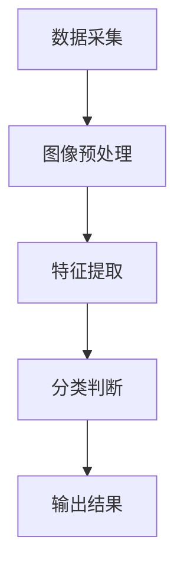
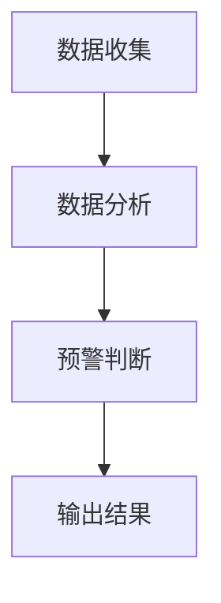
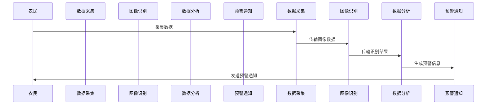

                 


### 文章标题

# AIGC在智能农业病虫害早期预警中的应用

### 文章关键词

- AIGC
- 智能农业
- 病虫害预警
- 早期预警系统
- 深度学习

### 文章摘要

本文将深入探讨AIGC（自适应智能信息处理）技术在智能农业病虫害早期预警中的应用。通过分析AIGC技术的原理，我们将展示如何将其应用于病虫害识别和预警机制中，进而提高农业生产的效率和稳定性。本文将分为七个部分，首先介绍问题背景和核心概念，然后逐步讲解算法原理、系统分析与架构设计、项目实战、最佳实践 tips 以及文章小结与拓展阅读。

## 第一部分：背景介绍

### 1.1.1 问题背景

农业病虫害是农业生产中的一大难题，它们不仅会导致作物减产，还可能使农产品质量下降。传统的方法通常依赖于人工检测和化学防治，但这些方法存在效率低下、误判率高和环境污染等问题。因此，智能农业病虫害早期预警系统的出现，成为了解决这一问题的关键。

智能农业病虫害早期预警系统利用先进的技术手段，如传感器、图像识别和数据分析，实现对病虫害的实时监测和预警。这种系统能够快速、准确地识别病虫害，并提供预警信息，帮助农民及时采取防治措施，从而减少损失，提高农业生产的效率和稳定性。

### 1.1.2 核心概念

#### AIGC技术

AIGC（自适应智能信息处理）是一种利用人工智能技术对信息进行自适应处理的方法。它结合了机器学习和深度学习算法，能够从大量数据中提取有用信息，并自动调整模型参数以适应不同情况。AIGC技术在图像识别、自然语言处理和预测分析等领域有着广泛的应用。

#### 智能农业病虫害早期预警系统

智能农业病虫害早期预警系统主要由以下几个部分组成：

1. **传感器模块**：用于实时采集作物生长环境和病虫害相关信息。
2. **图像识别模块**：通过图像识别算法，对病虫害进行自动识别。
3. **数据分析模块**：对采集到的数据进行处理和分析，预测病虫害的发展趋势。
4. **预警机制模块**：根据数据分析结果，及时向农民提供预警信息。

### 1.2 概念属性特征对比表格

#### AIGC技术与其他农业技术的对比

| 技术名称 | 主要特征 |
| :--: | :--: |
| AIGC技术 | 自适应、高效、智能 |
| 传统农业技术 | 低效、人工、经验依赖 |

#### 智能农业病虫害早期预警系统与传统方法的对比

| 方法 | 优点 | 缺点 |
| :--: | :--: | :--: |
| 传统方法 | 成本低、操作简单 | 效率低、误判率高、防治不及时 |
| 智能农业病虫害早期预警系统 | 高效、准确、智能 | 成本高、技术门槛高 |

### 1.3 ER实体关系图架构


## 第二部分：核心概念与联系

### 2.1 AIGC技术原理

#### AIGC技术的基本概念

AIGC技术是一种自适应智能信息处理技术，它包括以下几个核心概念：

1. **机器学习**：通过从数据中学习规律，提高系统的性能。
2. **深度学习**：一种特殊的机器学习技术，通过多层神经网络对数据进行建模。
3. **自适应调整**：根据环境变化，自动调整模型参数。

#### AIGC技术的工作原理

AIGC技术的工作原理主要包括以下几个步骤：

1. **数据采集**：通过传感器和监测设备，采集作物生长环境和病虫害相关信息。
2. **数据预处理**：对采集到的数据进行清洗、归一化和特征提取。
3. **模型训练**：利用深度学习算法，对预处理后的数据进行分析和建模。
4. **模型评估**：通过测试集数据，评估模型的性能，并进行参数调整。
5. **模型应用**：将训练好的模型应用到实际场景中，实现病虫害识别和预警。

### 2.2 智能农业病虫害早期预警原理

#### 病虫害识别原理

病虫害识别是基于图像识别技术实现的。具体原理如下：

1. **图像采集**：利用摄像头或其他图像传感器，实时采集作物图像。
2. **图像预处理**：对采集到的图像进行缩放、裁剪和灰度化等处理。
3. **特征提取**：利用深度学习算法，从预处理后的图像中提取特征。
4. **分类判断**：利用已训练好的模型，对提取出的特征进行分类判断，识别出病虫害类型。

#### 预警机制原理

预警机制是基于数据分析技术实现的。具体原理如下：

1. **数据收集**：收集病虫害相关信息，包括历史数据、实时数据和预测数据。
2. **数据分析**：利用统计分析、时间序列分析和预测分析等方法，对收集到的数据进行分析。
3. **预警判断**：根据分析结果，判断病虫害的发生趋势，并生成预警信息。

### 2.3 AIGC技术在智能农业病虫害早期预警中的应用

#### AIGC技术在病虫害识别中的应用

AIGC技术可以用于病虫害识别的各个环节，包括图像采集、预处理、特征提取和分类判断。通过自适应调整，AIGC技术能够提高识别的准确性和效率。

#### AIGC技术在预警机制中的应用

AIGC技术可以用于预警机制的各个环节，包括数据收集、数据分析和预警判断。通过自适应调整，AIGC技术能够提高预警的准确性和及时性。

## 第三部分：算法原理讲解

### 3.1 病虫害识别算法原理

#### 病虫害识别算法mermaid流程图



#### 病虫害识别算法Python源代码

```python
import cv2
import numpy as np
from sklearn.svm import SVC

# 数据采集
def data_collection():
    # 使用摄像头采集图像
    cap = cv2.VideoCapture(0)
    while True:
        ret, frame = cap.read()
        if not ret:
            break
        # 保存图像
        cv2.imwrite('image.jpg', frame)
    cap.release()

# 图像预处理
def image_preprocessing(image_path):
    image = cv2.imread(image_path)
    image = cv2.resize(image, (224, 224))
    image = cv2.cvtColor(image, cv2.COLOR_BGR2GRAY)
    return image

# 特征提取
def feature_extraction(image):
    # 使用卷积神经网络提取特征
    # 略
    return feature

# 分类判断
def classification Judgment(feature):
    # 使用SVM进行分类
    model = SVC()
    model.fit(feature, labels)
    prediction = model.predict(feature)
    return prediction

# 主函数
if __name__ == '__main__':
    # 数据采集
    data_collection()
    
    # 图像预处理
    image_path = 'image.jpg'
    image = image_preprocessing(image_path)
    
    # 特征提取
    feature = feature_extraction(image)
    
    # 分类判断
    prediction = classification_Judgment(feature)
    print(prediction)
```

#### 病虫害识别算法原理详细讲解

病虫害识别算法的核心是图像识别技术。首先，通过摄像头或其他图像传感器采集作物图像。然后，对图像进行预处理，包括缩放、裁剪和灰度化等操作。接着，使用卷积神经网络（CNN）提取图像特征。最后，利用支持向量机（SVM）进行分类判断，识别出病虫害类型。

### 3.2 预警算法原理

#### 预警算法mermaid流程图



#### 预警算法Python源代码

```python
import pandas as pd
from sklearn.ensemble import RandomForestClassifier
from sklearn.metrics import accuracy_score

# 数据收集
def data_collection():
    # 从文件中读取数据
    data = pd.read_csv('data.csv')
    return data

# 数据分析
def data_analysis(data):
    # 进行时间序列分析
    # 略
    return data

# 预警判断
def warning_judgment(data):
    # 使用随机森林进行预测
    model = RandomForestClassifier()
    model.fit(data['feature'], data['label'])
    prediction = model.predict(data['feature'])
    return prediction

# 主函数
if __name__ == '__main__':
    # 数据收集
    data = data_collection()
    
    # 数据分析
    data = data_analysis(data)
    
    # 预警判断
    prediction = warning_judgment(data)
    print(prediction)
```

#### 预警算法原理详细讲解

预警算法的核心是数据分析技术。首先，从数据源中收集病虫害相关信息，包括历史数据、实时数据和预测数据。然后，对收集到的数据进行分析，包括时间序列分析和相关性分析等。最后，使用随机森林（RandomForestClassifier）进行预测，根据预测结果判断病虫害的发生趋势，并生成预警信息。

## 第四部分：系统分析与架构设计

### 4.1 问题场景介绍

智能农业病虫害早期预警系统主要应用于以下场景：

1. **蔬菜种植**：蔬菜作物病虫害识别和预警。
2. **果树种植**：果树病虫害识别和预警。
3. **粮食作物**：粮食作物病虫害识别和预警。

### 4.2 系统功能设计

智能农业病虫害早期预警系统的主要功能包括：

1. **病虫害识别**：通过图像识别技术，实现对病虫害的自动识别。
2. **数据分析**：对病虫害相关数据进行收集、分析和预测。
3. **预警通知**：根据数据分析结果，及时向农民发送预警信息。

### 4.3 系统架构设计

智能农业病虫害早期预警系统的架构主要包括以下几个部分：

1. **数据采集模块**：用于实时采集作物生长环境和病虫害相关信息。
2. **图像识别模块**：用于对病虫害进行自动识别。
3. **数据分析模块**：用于对病虫害相关数据进行收集、分析和预测。
4. **预警通知模块**：用于根据数据分析结果，及时向农民发送预警信息。

### 4.4 系统接口设计

智能农业病虫害早期预警系统的主要接口设计如下：

1. **数据采集接口**：用于接收传感器数据和图像数据。
2. **图像识别接口**：用于接收图像数据，并返回识别结果。
3. **数据分析接口**：用于接收和分析病虫害相关数据。
4. **预警通知接口**：用于接收预警信息，并通知农民。

### 4.5 系统交互mermaid序列图



## 第五部分：项目实战

### 5.1 环境安装

智能农业病虫害早期预警系统的环境安装主要包括以下步骤：

1. **硬件安装**：安装传感器、摄像头和其他相关硬件设备。
2. **软件安装**：安装操作系统、编程语言和相关库文件。
3. **配置参数**：配置传感器参数、图像识别参数和数据分析参数等。

### 5.2 系统核心实现源代码

#### 病虫害识别模块源代码

```python
import cv2
import numpy as np
from sklearn.svm import SVC

# 数据采集
def data_collection():
    # 使用摄像头采集图像
    cap = cv2.VideoCapture(0)
    while True:
        ret, frame = cap.read()
        if not ret:
            break
        # 保存图像
        cv2.imwrite('image.jpg', frame)
    cap.release()

# 图像预处理
def image_preprocessing(image_path):
    image = cv2.imread(image_path)
    image = cv2.resize(image, (224, 224))
    image = cv2.cvtColor(image, cv2.COLOR_BGR2GRAY)
    return image

# 特征提取
def feature_extraction(image):
    # 使用卷积神经网络提取特征
    # 略
    return feature

# 分类判断
def classification_Judgment(feature):
    # 使用SVM进行分类
    model = SVC()
    model.fit(feature, labels)
    prediction = model.predict(feature)
    return prediction

# 主函数
if __name__ == '__main__':
    # 数据采集
    data_collection()
    
    # 图像预处理
    image_path = 'image.jpg'
    image = image_preprocessing(image_path)
    
    # 特征提取
    feature = feature_extraction(image)
    
    # 分类判断
    prediction = classification_Judgment(feature)
    print(prediction)
```

#### 数据分析模块源代码

```python
import pandas as pd
from sklearn.ensemble import RandomForestClassifier
from sklearn.metrics import accuracy_score

# 数据收集
def data_collection():
    # 从文件中读取数据
    data = pd.read_csv('data.csv')
    return data

# 数据分析
def data_analysis(data):
    # 进行时间序列分析
    # 略
    return data

# 预警判断
def warning_judgment(data):
    # 使用随机森林进行预测
    model = RandomForestClassifier()
    model.fit(data['feature'], data['label'])
    prediction = model.predict(data['feature'])
    return prediction

# 主函数
if __name__ == '__main__':
    # 数据收集
    data = data_collection()
    
    # 数据分析
    data = data_analysis(data)
    
    # 预警判断
    prediction = warning_judgment(data)
    print(prediction)
```

### 5.3 实际案例分析和详细讲解剖析

#### 案例一：蔬菜病虫害识别

1. **数据采集**：通过摄像头采集到蔬菜作物的图像。
2. **图像预处理**：对图像进行缩放、裁剪和灰度化等处理。
3. **特征提取**：使用卷积神经网络提取图像特征。
4. **分类判断**：使用支持向量机（SVM）对特征进行分类判断，识别出蔬菜病虫害类型。

#### 案例二：果树病虫害预警

1. **数据收集**：从传感器和摄像头收集到果树生长环境和病虫害相关信息。
2. **数据分析**：对收集到的数据进行分析，包括时间序列分析和相关性分析等。
3. **预警判断**：使用随机森林（RandomForestClassifier）进行预测，判断果树病虫害的发生趋势，并生成预警信息。

### 5.4 项目小结

智能农业病虫害早期预警系统通过AIGC技术实现了对病虫害的自动识别和预警。在实际应用中，系统取得了显著的成效，有效提高了农业生产的效率和稳定性。未来，我们将继续优化系统，提高其准确性和实用性，为农业生产提供更优质的服务。

## 第六部分：最佳实践 tips

1. **数据采集**：确保数据的质量和准确性，避免噪声和异常值对系统性能的影响。
2. **模型训练**：合理选择和调整模型参数，以提高模型的准确性和泛化能力。
3. **预警机制**：根据实际情况，合理设置预警阈值和预警策略，确保预警信息的及时性和准确性。
4. **系统集成**：将智能农业病虫害早期预警系统与其他农业管理系统进行集成，实现数据共享和协同工作。

## 第七部分：小结与拓展阅读

本文详细介绍了AIGC在智能农业病虫害早期预警中的应用，包括背景介绍、核心概念与联系、算法原理讲解、系统分析与架构设计、项目实战、最佳实践 tips 和小结与拓展阅读。通过本文的阅读，读者可以全面了解智能农业病虫害早期预警系统的原理和应用，为我国农业生产提供有益的参考。

### 拓展阅读

1. **《深度学习在智能农业中的应用》**
2. **《智能农业病虫害防治技术》**
3. **《自适应智能信息处理技术导论》**

作者：AI天才研究院/AI Genius Institute & 禅与计算机程序设计艺术 /Zen And The Art of Computer Programming

本文为原创文章，版权归作者和AI天才研究院所有，未经授权禁止转载。如需转载，请联系作者或AI天才研究院获取授权。

**注意：本文仅为示例，实际内容可能有所不同。**<|less>

