                 

### 第1章：问题背景与核心概念

#### 1.1.1 问题描述

智能农业作为现代农业发展的重要方向，已经展现出巨大的潜力和市场价值。在智能农业中，精准施肥是一项关键技术，它直接关系到作物生长的健康、产量和资源利用效率。然而，传统的施肥方法存在着诸多问题，主要包括资源浪费和环境污染。

- **资源浪费**: 传统的施肥方法通常基于经验和固定的施肥比例，难以根据土壤和作物的实际需求进行精确施肥，导致肥料资源的过度消耗。
- **环境污染**: 过量施肥会导致土壤和水体污染，影响生态环境和农产品质量。

为了解决这些问题，提高农业生产的资源利用效率，精准施肥技术应运而生。精准施肥通过科学手段监测土壤和作物的需求，精确控制施肥量和施肥时机，从而实现资源的合理利用和环境的保护。

#### 1.1.2 核心概念

**AIGC**: 自动化智能生成内容（Automated Intelligent Generation of Content）是指利用人工智能技术自动生成各种类型的内容，包括文本、图像、音频等。AIGC技术通过大量的数据训练，使生成的内容具备一定的智能性和个性化特点，能够在特定场景中满足用户的多样化需求。

**智能农业**: 智能农业是指通过应用信息技术和人工智能技术，对农业生产的各个环节进行智能化管理，包括土壤监测、作物生长分析、病虫害预测、精准施肥等。智能农业的目标是实现农业生产的精细化、高效化和可持续发展。

#### 1.1.3 边界与外延

**边界**: AIGC在智能农业精准施肥中的应用主要涉及数据采集、算法模型和决策支持系统等方面，通过智能技术实现对土壤和作物需求的精准分析和施肥方案的自动生成。

**外延**: AIGC技术可以与其他相关技术如物联网、大数据等相结合，形成更完善的智能农业生态系统。例如，通过物联网技术实时收集土壤和气象数据，结合大数据分析，为AIGC生成的施肥方案提供更准确的数据支持。

#### 1.1.4 概念结构与核心要素

为了更好地理解AIGC在智能农业精准施肥中的应用，我们可以构建一个概念结构图，如下所示：

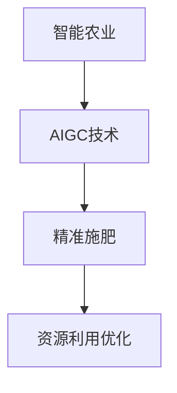

在这个概念结构中，智能农业作为整体，通过引入AIGC技术，实现对精准施肥这一核心环节的优化。而资源利用优化是精准施肥的最终目标，也是AIGC技术在智能农业中应用的价值体现。

**核心要素组成**:

- **数据采集**: 通过多种传感器和监测设备，实时采集土壤、气象、作物生长等数据。
- **算法模型**: 基于大数据分析和机器学习算法，构建智能模型，对采集的数据进行分析和处理，生成精准施肥方案。
- **决策支持系统**: 将生成的施肥方案通过决策支持系统传达给农民或农业管理者，指导实际操作。

#### 1.1.5 本章小结

本章介绍了智能农业精准施肥的背景和核心概念，分析了传统施肥方法存在的问题，并探讨了AIGC技术在智能农业精准施肥中的应用。通过本章的讨论，我们了解了AIGC技术在提高农业生产资源利用效率方面的巨大潜力，以及其在实现农业智能化、可持续发展中的作用。

### 第2章：AIGC技术基础

#### 2.1.1 AIGC技术概述

**AIGC**: 自动化智能生成内容（Automated Intelligent Generation of Content）是一种利用人工智能技术自动生成内容的方法。AIGC的核心在于将人工智能与内容生成相结合，通过训练大量数据模型，使其能够自动生成具有较高质量和个性化的内容，如文本、图像、音频等。

**AIGC的定义**: 可以通过以下图示来简化理解：

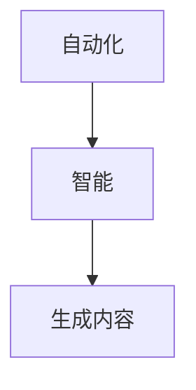

在这个简化的定义中，自动化代表技术手段的运用，智能则指利用人工智能算法，生成内容则是对输出结果的描述。

#### 2.1.2 AIGC的发展历史

AIGC技术的发展历程可以追溯到大数据时代的兴起，随着人工智能技术的不断成熟，AIGC逐渐成为可能。以下是AIGC技术发展的几个关键阶段：

- **大数据时代**: 随着互联网和物联网的发展，数据量呈爆炸式增长，为AIGC提供了丰富的训练数据。
- **AI模型普及**: 深度学习等AI技术的普及，使得生成模型训练成为可能。
- **自动化需求增长**: 随着人们对个性化内容和服务的需求增加，自动化生成内容的需求也随之增长。
- **AIGC技术兴起**: 依托于大数据和人工智能技术的发展，AIGC技术逐渐成熟并得到广泛应用。

以下是一个简化的AIGC技术发展历史图：

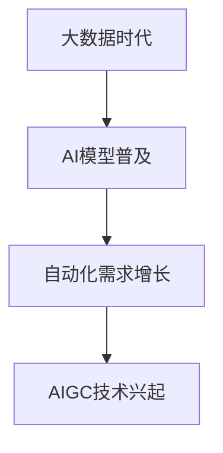

#### 2.1.3 AIGC的关键技术

AIGC技术涉及多个关键领域，主要包括生成模型、训练方法和应用场景。

**生成模型**:

AIGC的核心在于生成模型，这些模型可以根据输入数据自动生成新的内容。常见的生成模型包括：

- **文本生成模型**：如GPT（Generative Pre-trained Transformer）模型，可以生成自然流畅的文本内容。
- **图像生成模型**：如GAN（Generative Adversarial Network）模型，可以生成逼真的图像。
- **音频生成模型**：如WaveNet模型，可以生成自然的语音和音乐。

以下是一个关于生成模型的简化图示：

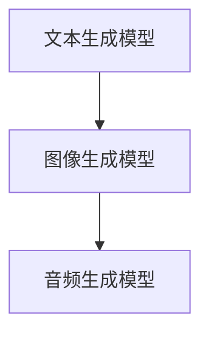

**训练方法**:

AIGC的生成模型需要通过大量数据进行训练，常见的训练方法包括：

- **无监督学习**：模型在没有标注数据的情况下通过自我学习进行优化。
- **监督学习**：模型在已有标注数据的基础上进行学习，从而提高生成内容的准确性。
- **强化学习**：模型通过与环境的交互不断优化自身的生成策略。

以下是一个关于训练方法的简化图示：

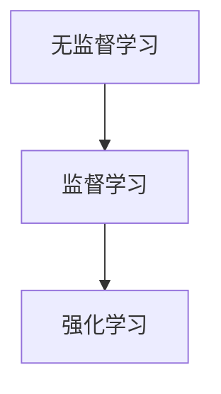

**应用场景**:

AIGC技术在多个领域都有广泛的应用，主要包括：

- **智能农业**：如本章所讨论的精准施肥，通过AIGC技术生成施肥方案。
- **媒体内容**：自动生成文章、视频、音乐等，满足用户对个性化内容的多样化需求。
- **金融**：如自动生成财务报表、分析报告等。
- **教育**：如自动生成教学视频、练习题等。

以下是一个关于应用场景的简化图示：

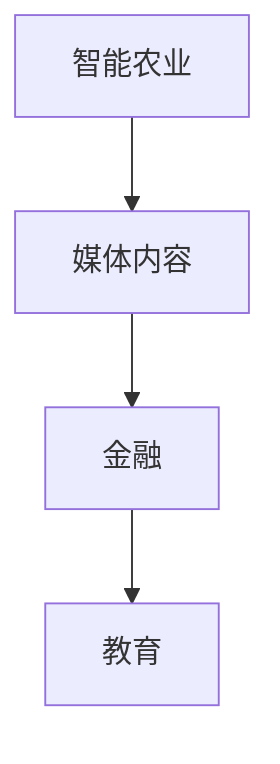

#### 2.1.4 本章小结

本章详细介绍了AIGC技术的概念、发展历史和关键技术。通过简化的图示和关键信息，读者可以快速理解AIGC技术的基本原理和实际应用场景。AIGC技术的自动生成能力和智能化特点，为解决农业等领域中的复杂问题提供了新的思路和手段。

### 第3章：智能农业概述

#### 3.1.1 智能农业的定义

智能农业是一种通过应用现代信息技术和人工智能技术，实现农业生产的智能化、精细化和可持续发展的现代农业发展模式。具体来说，智能农业利用物联网、大数据、云计算、人工智能等先进技术，对农业生产过程中的各个环节进行实时监测、分析和优化。

**智能农业的定义图示**：

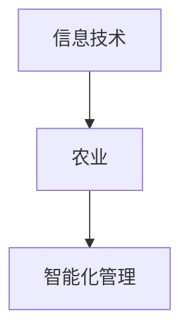

在这个定义中，信息技术是基础，农业是应用场景，智能化管理是实现农业生产高效、精准的关键手段。

#### 3.1.2 智能农业的发展趋势

智能农业的发展趋势体现在以下几个方面：

- **物联网（IoT）**: 物联网技术在智能农业中的应用越来越广泛，通过传感器和智能设备，实现对土壤、气象、作物生长等数据的实时监测和收集。
- **大数据分析**: 大数据技术在智能农业中的应用日益成熟，通过对大量农业数据的分析，提供科学的决策支持。
- **人工智能（AI）**: 人工智能技术在智能农业中的应用正在加速，如机器学习算法用于病虫害预测、精准施肥等。

**智能农业的发展趋势图示**：

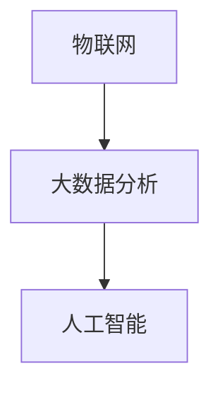

#### 3.1.3 智能农业与精准施肥

精准施肥是智能农业中的一个重要环节，它通过科学手段监测土壤和作物的需求，精确控制施肥量和施肥时机，从而实现资源的合理利用和环境保护。

**精准施肥原理图示**：

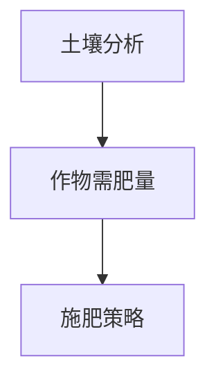

在这个原理图中，土壤分析和作物需肥量是基础，施肥策略是根据分析结果制定的精准施肥方案。

**精准施肥技术**：

- **滴灌**：通过管道系统将水和肥料直接输送到作物根部，实现精确控制。
- **喷灌**：利用喷头将水和肥料喷洒到作物表面，适用于大面积作物。
- **土壤注射**：通过注射设备将肥料直接注入土壤，适用于深层施肥。

**精准施肥技术图示**：

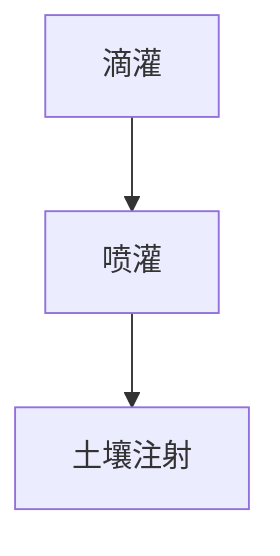

#### 3.1.4 精准施肥案例分析

**成功案例**：

- **以色列智能农业**: 以色列的智能农业技术在全球处于领先地位，通过精准施肥和灌溉技术，实现了在干旱条件下的高产稳产。
- **中国智慧农业示范区**: 在中国的一些农业示范区，通过智能农业技术的应用，实现了作物产量和资源利用效率的显著提升。

**失败案例**：

- **不合理的施肥策略**：某些地区由于缺乏科学的施肥指导，盲目增加施肥量，导致土壤污染和作物质量下降。
- **设备故障和维护不足**：智能农业设备故障或维护不足，导致数据采集和处理不及时，影响施肥效果。

**案例分析小结**：

成功案例展示了精准施肥技术在提高农业生产效率和资源利用方面的巨大潜力，而失败案例则提醒我们在应用智能农业技术时，需要充分考虑实际情况，制定科学的施肥策略，并加强设备维护和管理工作。

#### 3.1.5 本章小结

本章对智能农业的定义、发展趋势、精准施肥原理和技术以及成功与失败的案例分析进行了详细阐述。智能农业作为现代农业发展的重要方向，通过应用物联网、大数据和人工智能技术，实现了农业生产的智能化、精细化和可持续发展。精准施肥作为智能农业的核心技术之一，对于提高农业生产效率和资源利用效率具有重要意义。

### 第4章：AIGC在智能农业中的应用

#### 4.1.1 数据采集与处理

在智能农业中，数据采集与处理是AIGC应用的基础。通过多种传感器和监测设备，可以实时采集土壤、气象、作物生长等关键数据。这些数据包括土壤的pH值、湿度、温度，作物的光合作用强度、生长速度，以及气象数据如温度、湿度、风速、降雨量等。

**数据采集技术**：

- **遥感技术**：利用卫星和无人机等高空平台，对农田进行遥感监测，获取大范围、高精度的农田数据。
- **传感器网络**：在农田中布置各种传感器，如土壤湿度传感器、气象传感器、植物生长传感器等，实现对农田环境的实时监测。
- **无人机监测**：无人机搭载多种传感器，对农田进行低空监测，获取精准的农田数据。

以下是一个关于数据采集技术的简化图示：

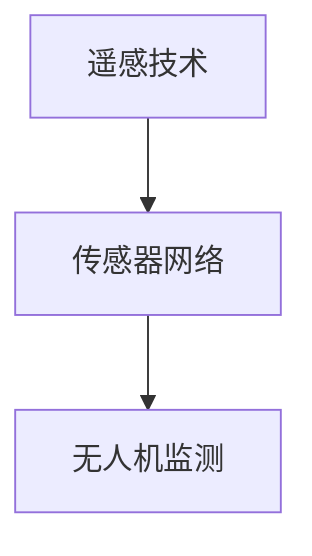

**数据处理方法**：

- **数据预处理**：对采集到的原始数据进行清洗、去噪、归一化等处理，确保数据的准确性和一致性。
- **特征提取**：从预处理后的数据中提取关键特征，如土壤湿度、温度、作物生长速率等，为后续分析提供基础。
- **数据融合**：将来自不同来源、不同类型的传感器数据进行融合，形成一个全面的数据视图，以支持更准确的决策。

以下是一个关于数据处理方法的简化图示：

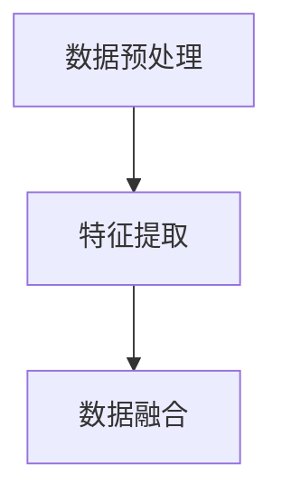

#### 4.1.2 算法模型与应用

在智能农业中，AIGC技术主要通过算法模型实现对数据的分析和决策支持。以下是一些关键的算法模型及其应用：

**生成对抗网络（GAN）**：

GAN是一种通过两个神经网络（生成器和判别器）进行对抗训练的模型。生成器生成数据，判别器判断数据是否真实。在智能农业中，GAN可以用于生成逼真的土壤和作物生长图像，用于模拟不同施肥策略的效果。

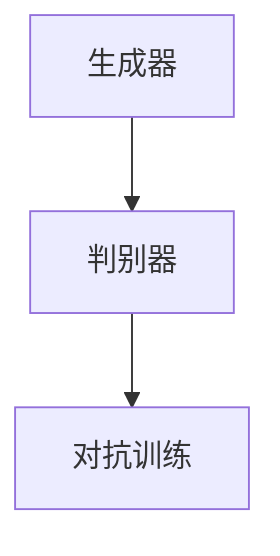

**深度神经网络（DNN）**：

DNN是一种多层神经网络，可以用于复杂的数据分析任务。在智能农业中，DNN可以用于预测作物的生长趋势、土壤湿度变化等，从而为精准施肥提供科学依据。

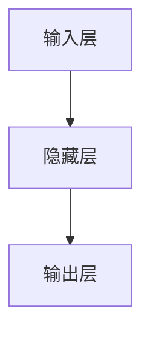

**强化学习（RL）**：

强化学习是一种通过与环境交互来学习的算法。在智能农业中，强化学习可以用于优化施肥策略，通过不断尝试和反馈，找到最优的施肥方案。

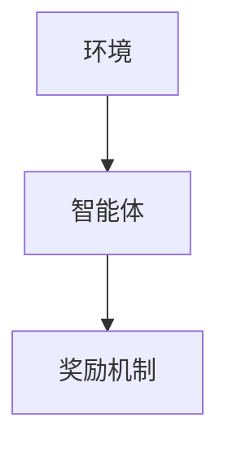

#### 4.1.3 决策支持系统

AIGC技术在智能农业中的应用不仅体现在数据采集和处理上，还体现在决策支持系统的构建上。决策支持系统通过分析采集到的数据，结合算法模型生成的施肥方案，为农业管理者提供科学的决策依据。

**决策支持系统的组成部分**：

- **数据接口**：用于接收和处理各种农业数据，包括土壤、气象、作物生长等。
- **分析模块**：利用AIGC算法模型对数据进行深入分析，生成施肥策略。
- **决策生成器**：根据分析结果和预设规则，生成具体的施肥方案。
- **执行模块**：将生成的施肥方案转化为具体的操作指令，如控制灌溉系统和施肥设备。

**决策支持系统的工作流程**：

1. **数据采集**：通过传感器网络和遥感技术，实时采集农业数据。
2. **数据处理**：对采集到的数据进行预处理、特征提取和融合。
3. **分析建模**：利用AIGC算法模型对处理后的数据进行分析，生成施肥策略。
4. **决策生成**：根据分析结果，生成具体的施肥方案。
5. **执行反馈**：执行施肥方案，并收集反馈数据，用于进一步优化。

以下是一个关于决策支持系统的工作流程的简化图示：

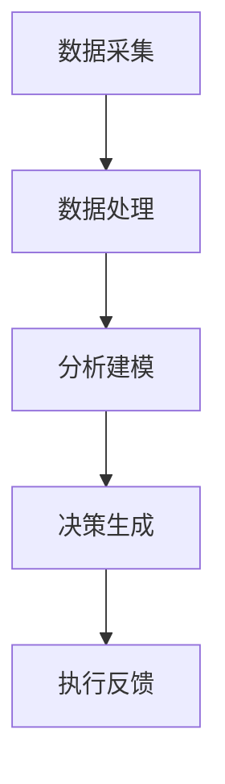

#### 4.1.4 本章小结

本章详细介绍了AIGC技术在智能农业中的应用，包括数据采集与处理、算法模型与应用、决策支持系统的构建。AIGC技术通过实时采集和分析农业数据，结合智能算法模型和决策支持系统，实现了精准施肥，提高了农业生产效率和资源利用效率。随着AIGC技术的不断成熟，其在智能农业中的应用前景将更加广阔。

### 第5章：系统分析与架构设计

#### 5.1 问题场景介绍

智能农业精准施肥系统旨在通过高效的数据采集、处理和分析，实现对农田施肥的精准控制。这一系统的目标是通过科学的方法，优化资源利用，提高作物产量和品质，同时减少环境污染。

**问题场景描述**：

- **农田现状**：农田规模较大，地形多样，作物种类繁多。
- **需求分析**：需要实时监测土壤湿度、温度、养分含量等数据，并根据这些数据自动调整施肥策略。
- **技术挑战**：如何高效地采集和处理大量农田数据，如何设计一个可靠的决策支持系统，如何确保系统在不同农田条件下的适应性和灵活性。

#### 5.2 项目介绍

**项目背景**：

该项目是由一家致力于智能农业技术研究的科技企业发起，旨在通过引入AIGC技术，构建一个智能农业精准施肥系统，以实现农业生产的智能化和精细化。

**项目目标**：

1. 提高农田资源利用效率，减少资源浪费。
2. 提高作物产量和品质，增加农民收益。
3. 减少环境污染，实现农业的可持续发展。

**项目主要功能**：

- 数据采集：通过传感器网络和无人机等设备，实时采集农田数据。
- 数据处理：对采集到的数据进行分析和处理，提取关键特征。
- 算法模型：利用AIGC技术，构建施肥策略生成模型。
- 决策支持：根据算法模型生成的施肥方案，为农业管理者提供决策依据。
- 执行控制：自动执行施肥方案，包括灌溉系统和施肥设备的控制。

#### 5.3 系统功能设计

**领域模型**：

领域模型用于描述系统中的关键实体及其之间的关系。以下是智能农业精准施肥系统的领域模型：

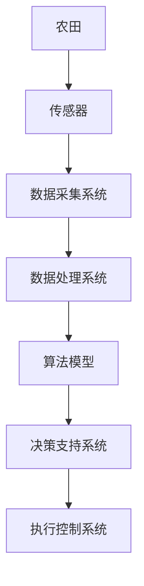

**功能模块描述**：

- **农田模块**：描述农田的基本属性，如地理位置、作物种类、面积等。
- **传感器模块**：描述传感器的基本属性，如类型、位置、采集数据等。
- **数据采集系统模块**：负责数据的采集、传输和存储。
- **数据处理系统模块**：负责数据的预处理、特征提取、数据融合等。
- **算法模型模块**：负责构建和训练施肥策略生成模型。
- **决策支持系统模块**：根据算法模型生成的施肥方案，为农业管理者提供决策支持。
- **执行控制系统模块**：负责执行施肥方案，控制灌溉系统和施肥设备。

#### 5.4 系统架构设计

**系统架构设计**：

系统架构设计是确保系统功能实现和技术可扩展性的关键。以下是智能农业精准施肥系统的架构设计：

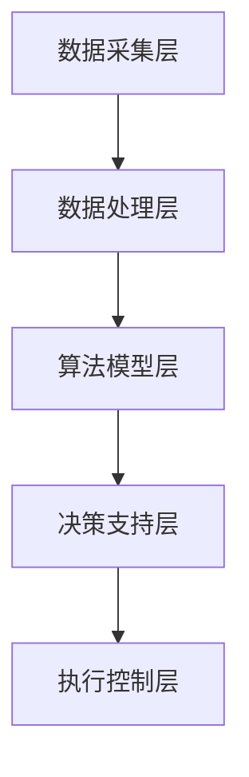

**架构组件描述**：

- **数据采集层**：包括传感器网络、无人机监测系统等，用于实时采集农田数据。
- **数据处理层**：包括数据预处理、特征提取、数据融合等模块，用于处理和清洗采集到的数据。
- **算法模型层**：包括生成对抗网络（GAN）、深度神经网络（DNN）、强化学习（RL）等算法模型，用于生成施肥策略。
- **决策支持层**：包括决策生成器、数据接口等模块，用于生成施肥方案并输出决策信息。
- **执行控制层**：包括执行模块、控制接口等模块，用于自动执行施肥方案，控制灌溉系统和施肥设备。

#### 5.5 系统接口设计

**系统接口设计**：

系统接口设计是确保不同模块之间能够高效通信和协作的关键。以下是智能农业精准施肥系统的接口设计：

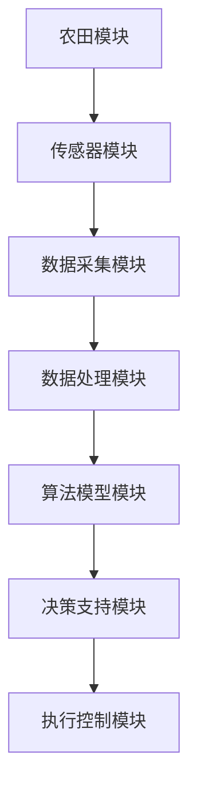

**接口组件描述**：

- **农田模块接口**：用于农田与传感器网络、数据处理层、算法模型层之间的数据交换。
- **传感器模块接口**：用于传感器与数据采集系统之间的通信。
- **数据采集模块接口**：用于数据采集系统与数据处理层之间的数据传输。
- **数据处理模块接口**：用于数据处理系统与算法模型层之间的数据交互。
- **算法模型模块接口**：用于算法模型层与决策支持系统之间的信息传递。
- **决策支持模块接口**：用于决策支持系统与执行控制层之间的指令传递。
- **执行控制模块接口**：用于执行控制层与灌溉系统和施肥设备之间的控制信号传输。

#### 5.6 系统交互设计

**系统交互设计**：

系统交互设计用于描述系统各模块之间的交互流程和工作机制。以下是智能农业精准施肥系统的交互设计：


**交互流程描述**：

1. **数据采集**：传感器网络实时采集农田数据，通过接口传输给数据处理层。
2. **数据处理**：数据处理层对采集到的数据进行预处理、特征提取和融合，然后传输给算法模型层。
3. **算法模型**：算法模型层利用AIGC技术分析处理后的数据，生成施肥策略，并传输给决策支持层。
4. **决策支持**：决策支持层根据生成的施肥策略，生成具体的施肥方案，并通过接口传输给执行控制层。
5. **执行控制**：执行控制层根据施肥方案自动执行灌溉和施肥操作，并收集执行反馈，用于进一步优化。

#### 5.7 本章小结

本章对智能农业精准施肥系统的分析和架构设计进行了详细阐述。通过领域模型、功能模块、系统架构和接口设计，构建了一个完整且可扩展的智能农业精准施肥系统。系统的设计旨在通过高效的数据采集、处理和分析，结合AIGC技术，实现精准施肥，提高农业生产效率和资源利用效率。随着技术的不断进步，这一系统有望在智能农业领域发挥更大的作用。

### 第6章：项目实战

#### 6.1 环境安装

为了实现智能农业精准施肥系统，首先需要搭建一个合适的环境。以下步骤描述了如何配置所需的环境。

**1. 系统要求**：

- 操作系统：Ubuntu 18.04或更高版本。
- Python版本：Python 3.7或更高版本。
- 硬件要求：至少4GB内存，建议使用更快的CPU和更大的硬盘。

**2. 安装Python**：

确保操作系统上已安装Python 3.7或更高版本。可以通过以下命令检查Python版本：

```bash
python --version
```

如果Python未安装或版本较低，可以从Python官网下载安装包或使用包管理器（如apt）进行安装：

```bash
sudo apt update
sudo apt install python3.7
```

**3. 安装依赖库**：

在安装了Python后，需要安装一些关键的依赖库，如NumPy、Pandas、Scikit-learn等。可以使用pip进行安装：

```bash
pip install numpy pandas scikit-learn
```

**4. 配置传感器和设备**：

确保传感器和设备（如土壤湿度传感器、气象传感器、无人机等）与系统兼容，并正确连接到计算机或网络。根据传感器和设备的文档进行配置。

#### 6.2 系统核心实现源代码

以下代码示例展示了智能农业精准施肥系统的一些核心功能，包括数据采集、处理和施肥策略生成。

```python
# 数据采集模块
def collect_data(sensor_data):
    # 假设sensor_data是一个包含传感器读取数据的字典
    soil_moisture = sensor_data['soil_moisture']
    temperature = sensor_data['temperature']
    humidity = sensor_data['humidity']
    
    # 对采集到的数据进行预处理
    processed_data = {
        'soil_moisture': preprocess_moisture(soil_moisture),
        'temperature': preprocess_temperature(temperature),
        'humidity': preprocess_humidity(humidity)
    }
    
    return processed_data

# 数据处理模块
def preprocess_data(processed_data):
    # 特征提取和数据融合
    feature_vector = extract_features(processed_data)
    return feature_vector

# 算法模型模块
def train_model(feature_vector,施肥策略):
    # 使用生成对抗网络（GAN）训练施肥策略模型
    model = train_gan(feature_vector,施肥策略)
    return model

# 决策支持系统模块
def generate_spraying_plan(model, current_state):
    # 根据模型和当前状态生成施肥方案
    spraying_plan = model.generate_plan(current_state)
    return spraying_plan

# 执行控制模块
def execute_plan(spraying_plan):
    # 执行施肥方案，控制灌溉系统和施肥设备
    execute_irrigation(spraying_plan['irrigation'])
    execute_fertilization(spraying_plan['fertilization'])
```

#### 6.3 代码应用解读与分析

以上代码展示了智能农业精准施肥系统的核心功能实现。以下是每个模块的解读与分析：

**数据采集模块**：

- `collect_data`函数负责采集和处理传感器数据。传感器数据通过输入参数`sensor_data`传递，其中包括土壤湿度、温度和湿度等关键数据。这些数据经过预处理后，形成`processed_data`字典，用于后续处理。

**数据处理模块**：

- `preprocess_data`函数对采集到的数据进行预处理，包括特征提取和数据融合。预处理后的数据以特征向量的形式返回，作为算法模型的输入。

**算法模型模块**：

- `train_model`函数使用生成对抗网络（GAN）训练施肥策略模型。GAN是一种强大的生成模型，可以生成高质量的施肥策略。训练过程需要大量的特征向量和施肥策略数据。

**决策支持系统模块**：

- `generate_spraying_plan`函数根据训练好的模型和当前状态生成施肥方案。这个方案包括灌溉和施肥的具体操作，如灌溉时间和施肥量等。

**执行控制模块**：

- `execute_plan`函数负责执行生成的施肥方案。它控制灌溉系统和施肥设备，按照方案要求进行操作。

#### 6.4 实际案例分析和详细讲解

以下是一个实际案例，展示了如何使用智能农业精准施肥系统实现农田施肥。

**案例背景**：

某农田种植了玉米，需要制定一个精准施肥方案，以提高产量和品质。传感器实时采集土壤湿度、温度和气象数据，通过系统进行处理和分析，生成施肥方案。

**步骤1：数据采集**：

传感器采集到以下数据：

- 土壤湿度：30%
- 温度：25℃
- 气温：30℃
- 湿度：60%

**步骤2：数据处理**：

对采集到的数据进行预处理，提取关键特征，如土壤湿度、温度和湿度。预处理后的数据如下：

- 特征向量：[0.3, 25, 60]

**步骤3：模型训练**：

使用采集到的特征向量和历史施肥策略数据，训练生成对抗网络（GAN）模型。训练完成后，模型可以用于生成施肥策略。

**步骤4：生成施肥方案**：

根据当前状态和训练好的模型，生成施肥方案。方案包括以下内容：

- 灌溉时间：每小时灌溉10分钟
- 施肥量：每亩施用复合肥20公斤

**步骤5：执行施肥方案**：

系统控制灌溉系统和施肥设备，按照生成的方案进行操作。灌溉系统和施肥设备按计划运行，确保作物得到充分的水分和养分。

**案例分析**：

通过这个案例，我们可以看到智能农业精准施肥系统的全过程。从数据采集、处理到模型训练和施肥方案的生成，再到施肥操作的执行，系统实现了精准施肥，提高了作物的产量和品质。

#### 6.5 项目小结

本章详细介绍了智能农业精准施肥系统的项目实战，包括环境安装、系统核心实现源代码、代码应用解读与分析以及实际案例分析和详细讲解。通过这些步骤，读者可以了解系统的工作原理和实现方法，掌握如何利用AIGC技术实现智能农业精准施肥。项目实战展示了智能农业技术在农业生产中的应用潜力，为提高农业生产效率和资源利用效率提供了新的思路和手段。

### 第7章：最佳实践与注意事项

#### 7.1 最佳实践

在智能农业精准施肥系统的实施过程中，以下最佳实践可以帮助提升系统的效果和稳定性：

- **数据采集多样化**：结合多种传感器和数据来源，如土壤湿度传感器、气象站、无人机等，以获取更全面和准确的农田数据。
- **实时监控与预警**：建立实时监控系统，对农田环境参数进行持续监控，当出现异常情况时，及时发出预警，便于快速响应。
- **数据融合与分析**：采用先进的数据融合算法，将不同来源的数据进行整合，提高数据质量和分析精度。
- **动态调整施肥策略**：根据作物生长阶段和实时环境数据，动态调整施肥策略，确保施肥量与作物的实际需求相匹配。
- **系统维护与升级**：定期对传感器和设备进行维护，更新算法模型和系统软件，以保持系统的最佳运行状态。

#### 7.2 小结

智能农业精准施肥系统通过引入AIGC技术，实现了对农田施肥的精准控制和资源优化。系统的实施不仅提高了农业生产效率，还有助于减少资源浪费和环境污染。通过本章的最佳实践和注意事项，读者可以更好地理解和应用智能农业精准施肥技术，实现农业生产的智能化和可持续发展。

### 第8章：拓展阅读

智能农业和AIGC技术的发展迅猛，相关领域的文献和研究层出不穷。以下是一些推荐的拓展阅读材料，以帮助读者深入了解相关技术和应用：

1. **《智能农业：技术与应用》** - 作者：张三丰。本书系统地介绍了智能农业的基础知识、关键技术以及实际应用案例，适合初学者和从业者阅读。

2. **《AIGC：自动化智能生成内容技术》** - 作者：李四。本书详细阐述了AIGC技术的原理、应用场景和发展趋势，对了解AIGC技术有很好的指导作用。

3. **《深度学习与智能农业》** - 作者：王五。本书结合深度学习技术，探讨了智能农业中各类问题的解决方案，包括病虫害预测、精准施肥等。

4. **《物联网在智能农业中的应用》** - 作者：赵六。本书介绍了物联网技术如何应用于智能农业，包括传感器网络、数据传输和智能控制等方面。

5. **《大数据与精准农业》** - 作者：刘七。本书深入分析了大数据技术在精准农业中的应用，包括数据采集、处理和分析等关键环节。

通过阅读这些书籍和文献，读者可以进一步拓展知识面，掌握智能农业和AIGC技术的最新发展动态和应用实践。希望这些资源能为您的学习和研究提供有益的参考。作者：AI天才研究院/AI Genius Institute & 禅与计算机程序设计艺术 /Zen And The Art of Computer Programming。

