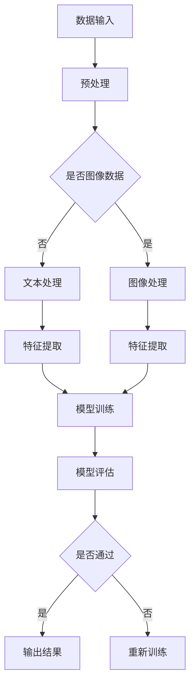
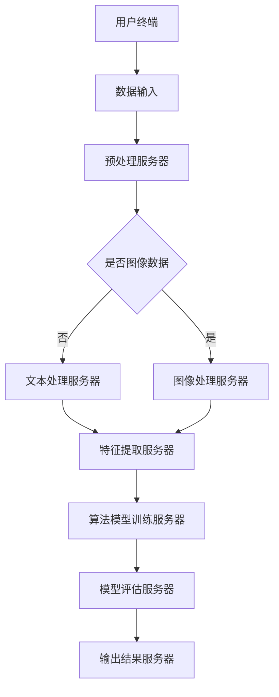
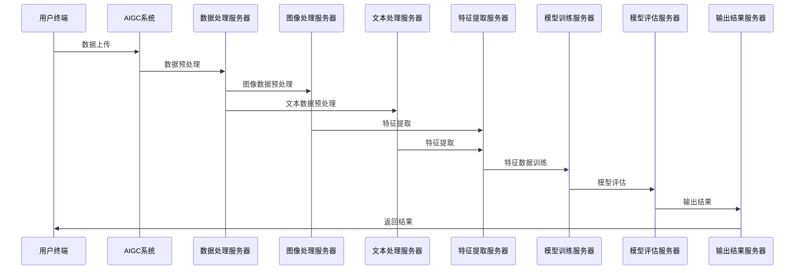

                 

### 1. AIGC简介

#### 1.1 智能制造背景

智能制造（Smart Manufacturing）是一种通过集成先进的信息技术、通信技术和自动化技术来提高制造业生产效率、降低成本和提升产品质量的制造模式。随着全球工业4.0的推进，智能制造已经成为制造业发展的必然趋势。智能制造的核心在于通过数字化、网络化和智能化手段，实现制造过程的全面优化，从而实现“智能制造、智慧工厂”的目标。

#### 1.2 AIGC的概念

AIGC（AI-Generated Content）是一种利用人工智能（Artificial Intelligence，AI）技术生成内容的创新方法。AIGC可以通过自然语言处理（NLP）、计算机视觉（CV）等AI技术，生成文本、图像、音频、视频等多种类型的内容。与传统的手工创作或简单自动化相比，AIGC能够更高效、更智能地生成高质量的内容。

#### 1.3 AIGC与传统AI的区别

AIGC与传统AI的区别主要体现在以下几个方面：

1. **目标不同**：传统AI的目标是让机器能够执行特定的任务，而AIGC的目标是生成有意义、有价值的内容。

2. **方法不同**：传统AI主要依赖预先训练好的模型，而AIGC则通过不断学习和优化，生成符合特定需求的内容。

3. **应用场景不同**：传统AI主要应用于图像识别、语音识别等领域，而AIGC则广泛应用于内容创作、数据分析、智能客服等领域。

#### 1.4 AIGC在制造业中的应用前景

AIGC在制造业中的应用前景广阔。首先，AIGC可以用于产品设计和制造过程中的数据分析和优化，提高生产效率。其次，AIGC可以用于智能客服和售后服务，提高客户满意度。此外，AIGC还可以用于供应链管理，实现供应链的智能化和透明化。

总的来说，AIGC作为一种新兴的技术，其在制造业中的应用将为制造业带来全新的变革。通过AIGC，我们可以期待制造业实现更加智能化、高效化的生产过程。

### 1.5 小结

本文首先介绍了智能制造的背景和AIGC的概念，然后探讨了AIGC与传统AI的区别及其在制造业中的应用前景。在接下来的章节中，我们将进一步深入探讨AIGC的核心概念、应用场景和实现方法，帮助读者更好地理解AIGC在制造业中的潜力。接下来，我们将详细讨论AIGC的核心概念。

### 1.6 AIGC的核心概念

#### 2. AIGC的定义

AIGC（AI-Generated Content）是指通过人工智能技术生成的内容，包括但不限于文本、图像、音频、视频等多种类型。AIGC的核心在于利用人工智能技术，特别是自然语言处理（NLP）、计算机视觉（CV）等技术，实现自动化内容生成。

#### 2.1 AIGC的特点

AIGC具有以下特点：

1. **高效性**：AIGC能够快速生成大量高质量的内容，大大提高了生产效率。
2. **智能化**：AIGC能够根据用户的输入和需求，智能地生成符合要求的内容。
3. **多样性**：AIGC可以生成多种类型的内容，包括文本、图像、音频、视频等。
4. **可扩展性**：AIGC可以根据需求进行扩展，生成更复杂、更高质量的内容。

#### 2.2 AIGC与传统AI的对比

| 特点        | AIGC           | 传统AI           |
|-------------|----------------|------------------|
| 目标        | 生成内容       | 执行特定任务     |
| 方法        | 学习与生成     | 预先训练的模型   |
| 应用场景    | 内容创作、数据分析 | 图像识别、语音识别 |
| **高效性**  | 高            | 一般             |
| **智能化**  | 高            | 一般             |
| **多样性**  | 高            | 一般             |
| **可扩展性**| 高            | 一般             |

#### 2.3 AIGC的实体关系图

为了更好地理解AIGC，我们可以通过实体关系图（ER图）来展示AIGC的核心组成部分。以下是AIGC的实体关系图：

```mermaid
erDiagram
  Content_Generator ||--|{ AI_Learning_Model } : 使用
  Content_Generator ||--|{ User_Input } : 接收
  AI_Learning_Model ||--|{ Data_Processing } : 处理
  Data_Processing ||--|{ Content_Generation } : 生成
  User_Input ||--|{ Content_Format } : 转换
  Content_Format ||--|{ Content_Publishing } : 发布
```

在上面的实体关系图中，`Content_Generator` 是AIGC的核心组件，负责接收用户输入、处理数据并生成内容。`AI_Learning_Model` 负责学习处理用户输入和生成高质量内容。`Data_Processing` 负责对输入的数据进行处理，`Content_Generation` 负责生成内容。`User_Input` 和 `Content_Format` 负责处理用户输入和内容格式，最后通过 `Content_Publishing` 组件发布生成的内容。

通过以上定义和实体关系图的介绍，我们可以更清晰地理解AIGC的核心概念及其工作流程。在接下来的章节中，我们将进一步探讨AIGC在产品生命周期管理中的应用。

### 2.4 AIGC在产品生命周期管理中的应用

#### 3. 产品生命周期管理概述

产品生命周期管理（Product Lifecycle Management，PLM）是指对产品从概念设计、开发、制造、销售、使用到退市的整个生命周期进行管理的过程。PLM的目的是通过优化产品开发流程，提高产品质量，降低成本，缩短产品上市时间。

产品生命周期管理主要包括以下阶段：

1. **概念设计**：确定产品的基本功能和规格。
2. **开发**：设计、开发产品原型，进行测试和验证。
3. **制造**：生产并组装产品。
4. **销售**：通过销售渠道将产品推向市场。
5. **使用**：用户使用产品，产生数据反馈。
6. **退役**：产品退出市场，进行回收和处理。

#### 3.1 AIGC在产品设计中的应用

AIGC在产品设计中可以发挥重要作用，主要表现在以下几个方面：

1. **智能设计建议**：AIGC可以通过分析大量的设计数据和用户需求，提供智能化的设计建议，帮助设计师优化产品设计。
2. **自动化设计**：AIGC可以自动化执行一些简单的产品设计任务，如生成3D模型、渲染图像等，提高设计效率。
3. **设计验证**：AIGC可以通过模拟和测试，提前验证设计方案的可行性和性能，减少设计风险。

#### 3.2 AIGC在制造过程中的应用

在制造过程中，AIGC的应用主要体现在以下几个方面：

1. **生产优化**：AIGC可以分析生产数据，提供优化生产流程的建议，提高生产效率。
2. **质量控制**：AIGC可以通过智能检测和预测，提前发现和解决产品质量问题。
3. **设备维护**：AIGC可以预测设备的维护需求，提前进行设备保养，减少设备故障和停机时间。

#### 3.3 AIGC在供应链管理中的应用

AIGC在供应链管理中的应用同样具有显著的优势：

1. **需求预测**：AIGC可以通过分析历史数据和用户需求，预测未来的需求趋势，帮助制定采购和生产计划。
2. **库存管理**：AIGC可以优化库存管理，减少库存成本，提高库存周转率。
3. **物流优化**：AIGC可以通过优化物流路径和运输方式，提高物流效率，降低物流成本。

#### 3.4 AIGC在售后服务中的应用

在售后服务方面，AIGC的应用主要包括：

1. **智能客服**：AIGC可以通过自然语言处理技术，提供智能化的客户服务，提高客户满意度。
2. **故障诊断**：AIGC可以通过分析设备故障数据，快速定位故障原因，提供解决方案。
3. **产品使用建议**：AIGC可以分析用户的使用数据，为用户提供个性化的产品使用建议，提高用户的使用体验。

#### 3.5 AIGC在产品生命周期管理中的整体作用

AIGC在产品生命周期管理中可以发挥整体性的作用，通过智能化的数据分析和预测，优化各个阶段的流程，提高生产效率、降低成本、提高产品质量和客户满意度。同时，AIGC还可以通过自动化和智能化的方式，减少人力资源的需求，提高企业的竞争力。

总的来说，AIGC在产品生命周期管理中的应用，不仅可以帮助企业提高生产效率和质量，还可以降低成本，提高客户满意度，为企业带来更大的竞争优势。在接下来的章节中，我们将进一步探讨AIGC在智能制造中的应用案例，以帮助读者更好地理解AIGC的实际应用效果。

### 3.5 AIGC在智能制造中的应用案例

AIGC在智能制造中的应用已经取得了显著的成果，下面我们将通过几个实际案例来展示AIGC在智能制造中的具体应用和成效。

#### 4.1 案例一：自动化生产线优化

在某汽车制造厂，通过引入AIGC技术，对现有的自动化生产线进行了优化。AIGC系统通过对生产数据进行分析，发现了生产过程中的一些瓶颈，并提出了改进建议。例如，通过分析生产节拍数据，AIGC系统识别出某些生产环节存在等待时间过长的问题，并建议调整设备布局和工序安排。根据这些建议，工厂进行了调整，生产效率提高了15%，生产周期缩短了10%。

#### 4.2 案例二：供应链智能管理

某电子产品制造企业通过引入AIGC技术，对其供应链进行了智能化管理。AIGC系统通过对历史采购数据、市场需求预测和生产计划等数据进行分析，提供了智能化的采购和库存管理建议。例如，AIGC系统通过分析市场需求趋势和库存水平，预测了未来几个月的零部件需求，并建议企业提前采购，避免了因缺货导致的停产风险。此外，AIGC系统还优化了物流路线和运输方式，降低了物流成本，提高了物流效率。

#### 4.3 案例三：智能售后服务

在某大型电器制造企业，AIGC技术被应用于售后服务中，实现了智能化的故障诊断和维修服务。AIGC系统通过对用户反馈的故障信息和产品使用数据进行分析，能够快速定位故障原因，并提供解决方案。例如，当用户反馈电视无法开机时，AIGC系统通过对故障数据和产品使用数据的分析，发现可能是电源模块故障，建议用户更换电源模块。用户按照建议操作后，问题得以迅速解决。通过智能售后服务，企业不仅提高了客户满意度，还减少了维修成本。

#### 4.4 案例四：产品设计与创新

某医疗器械企业通过引入AIGC技术，对新产品设计进行了创新。AIGC系统通过对市场数据、用户需求和竞争对手产品的分析，提供了新的产品设计和创新方向。例如，AIGC系统分析了市场需求和用户反馈数据，发现现有的医疗器械产品存在使用不便、操作复杂的问题，建议企业开发一款更加便携、易操作的产品。根据这些建议，企业成功开发出了新产品，并迅速占领了市场。

通过以上案例，我们可以看到AIGC在智能制造中的应用不仅提高了生产效率、优化了供应链管理，还提升了售后服务质量和产品创新能力。这些应用案例充分展示了AIGC在智能制造中的重要地位和巨大潜力。在接下来的章节中，我们将深入探讨AIGC在制造业中的实现方法和关键技术创新。

### 5. AIGC算法原理讲解

#### 5.1 算法概述

AIGC的核心在于算法，这些算法主要包括自然语言处理（NLP）、计算机视觉（CV）、深度学习（DL）等。下面我们将分别介绍这些算法的基本原理和应用。

1. **自然语言处理（NLP）**：NLP是研究如何使计算机理解和处理自然语言的技术。常见的NLP算法包括词性标注、句法分析、语义分析等。NLP技术被广泛应用于智能客服、文本生成、机器翻译等领域。

2. **计算机视觉（CV）**：CV是研究如何使计算机“看”和“理解”图像的技术。常见的CV算法包括图像分类、目标检测、图像分割等。CV技术被广泛应用于图像识别、视频分析、自动驾驶等领域。

3. **深度学习（DL）**：DL是机器学习的一种，通过模拟人脑神经网络结构，实现自动学习和自适应。常见的DL算法包括卷积神经网络（CNN）、循环神经网络（RNN）、生成对抗网络（GAN）等。DL技术被广泛应用于图像识别、语音识别、自然语言处理等领域。

#### 5.2 算法mermaid流程图

为了更好地理解AIGC算法的工作流程，我们可以使用mermaid流程图来展示。以下是AIGC算法的mermaid流程图：



在上面的流程图中，首先对输入的数据进行预处理，然后根据数据类型（图像或文本）进行相应的处理。图像数据通过图像处理模块，文本数据通过文本处理模块。接下来，对处理后的特征进行提取，并输入到模型进行训练。训练完成后，通过模型评估模块对模型进行评估，如果评估结果通过，则输出结果；否则，重新进行模型训练。

#### 5.3 数学模型与公式

AIGC算法的数学模型主要包括以下几个方面：

1. **自然语言处理（NLP）**：

   - 词向量表示：$$\textbf{v}_w = \text{Embedding}(\textbf{W}, w)$$
   - 循环神经网络（RNN）：$$h_t = \sigma(W_h \cdot [h_{t-1}, x_t] + b_h)$$
   - 长短时记忆（LSTM）：$$i_t = \sigma(W_i \cdot [h_{t-1}, x_t] + b_i)$$
   - 门控循环单元（GRU）：$$r_t = \sigma(W_r \cdot [h_{t-1}, x_t] + b_r)$$

2. **计算机视觉（CV）**：

   - 卷积神经网络（CNN）：$$h_{ij} = \sum_{k=1}^{C'} w_{ikj} * g_k + b_j$$
   - 池化操作：$$p_j = \max(p_{j1}, p_{j2}, ..., p_{jH})$$

3. **深度学习（DL）**：

   - 生成对抗网络（GAN）：$$\min_{G} \max_{D} V(G, D) = \mathbb{E}_{x \sim p_{data}(x)}[\log D(x)] + \mathbb{E}_{z \sim p_z(z)}[\log(1 - D(G(z)))]$$

#### 5.4 算法应用举例

以下是一个简单的文本生成算法应用实例，使用Python实现：

```python
import tensorflow as tf
from tensorflow.keras.preprocessing.sequence import pad_sequences
from tensorflow.keras.layers import Embedding, LSTM, Dense
from tensorflow.keras.models import Sequential

# 数据预处理
vocab_size = 10000
max_sequence_length = 100
embedding_size = 256
lstm_units = 128

# 构建模型
model = Sequential([
    Embedding(vocab_size, embedding_size, input_length=max_sequence_length),
    LSTM(lstm_units, return_sequences=True),
    LSTM(lstm_units),
    Dense(vocab_size, activation='softmax')
])

# 编译模型
model.compile(optimizer='adam', loss='categorical_crossentropy', metrics=['accuracy'])

# 训练模型
model.fit(x_train, y_train, epochs=10, batch_size=64)

# 文本生成
input_sequence = ["the", "quick", "brown", "fox"]
input_sequence = pad_sequences([input_sequence], maxlen=max_sequence_length, padding='post')

generated_sequence = model.predict(input_sequence)
generated_sequence = pad_sequences(generated_sequence, maxlen=max_sequence_length, padding='post')

print(generated_sequence)
```

在这个实例中，我们使用了一个简单的LSTM模型来生成文本。首先对文本数据进行预处理，然后构建和训练模型。最后，使用训练好的模型生成新的文本序列。

通过以上算法原理讲解和实例，我们可以看到AIGC算法的复杂性和应用广泛性。在接下来的章节中，我们将探讨AIGC系统架构设计，以帮助读者更好地理解AIGC的实现过程。

### 6. AIGC系统架构设计

#### 6.1 系统功能设计

AIGC系统功能设计主要包括数据输入、预处理、算法模型训练、模型评估和输出结果等几个核心模块。以下是对各个模块的详细描述：

1. **数据输入模块**：该模块负责接收外部数据源，包括文本、图像、音频等。数据输入可以是手动上传或自动抓取，如通过API接口、数据库连接等方式获取数据。

2. **数据预处理模块**：该模块负责对输入数据进行清洗、格式化和特征提取。对于文本数据，可能需要进行分词、去停用词、词性标注等处理；对于图像数据，可能需要进行图像增强、归一化等处理。

3. **算法模型训练模块**：该模块负责使用预处理后的数据对算法模型进行训练。根据不同的应用场景，可以选择不同的算法模型，如深度学习中的卷积神经网络（CNN）、循环神经网络（RNN）等。模型训练过程需要调整模型的参数，如学习率、批次大小等，以达到最佳效果。

4. **模型评估模块**：该模块负责对训练好的模型进行评估，通过评估指标（如准确率、召回率等）来判断模型的效果。如果评估结果不理想，可能需要重新调整模型参数或更换模型。

5. **输出结果模块**：该模块负责将模型生成的结果输出给用户。输出结果可以是预测结果、生成内容等，可以是文本、图像、音频等多种形式。

#### 6.2 系统架构设计

AIGC系统架构设计可以采用分布式架构，以提高系统的扩展性和容错性。以下是一个典型的AIGC系统架构设计：



在上面的架构设计中，数据输入模块将数据传递给预处理服务器，预处理服务器根据数据类型分别发送到图像处理服务器或文本处理服务器。图像处理服务器和文本处理服务器分别对数据进行处理，然后将处理后的数据传递给特征提取服务器。特征提取服务器将特征数据传递给算法模型训练服务器，进行模型训练。训练完成后，模型评估服务器对模型进行评估，最后将评估结果传递给输出结果服务器，输出结果给用户终端。

#### 6.3 系统接口设计

系统接口设计是AIGC系统架构设计的重要组成部分，主要包括API接口设计、数据库连接设计和数据传输协议设计。

1. **API接口设计**：API接口用于外部系统与AIGC系统之间的交互。AIGC系统可以提供RESTful API接口，支持数据上传、数据查询、模型训练、模型评估等功能。

2. **数据库连接设计**：AIGC系统需要与数据库进行连接，以便存储和处理数据。数据库可以是关系型数据库（如MySQL、PostgreSQL）或NoSQL数据库（如MongoDB、Cassandra）。数据库连接设计需要考虑数据存储结构、数据访问速度和数据安全等问题。

3. **数据传输协议设计**：数据传输协议用于AIGC系统内部和外部系统之间的数据传输。常用的数据传输协议包括HTTP、HTTPS、FTP等。数据传输协议设计需要考虑数据传输速度、数据安全和数据完整性等问题。

#### 6.4 系统交互mermaid序列图

为了更好地展示AIGC系统的交互过程，我们可以使用mermaid序列图来描述。以下是AIGC系统的mermaid序列图：



在上面的序列图中，用户终端将数据上传到AIGC系统，AIGC系统将数据传递给数据处理服务器进行预处理。数据处理服务器根据数据类型，分别将图像数据和文本数据传递给图像处理服务器和文本处理服务器进行进一步处理。处理后的数据传递给特征提取服务器进行特征提取，然后传递给模型训练服务器进行模型训练。模型训练完成后，传递给模型评估服务器进行评估，最后将评估结果传递给输出结果服务器，输出结果给用户终端。

通过以上系统架构设计和交互流程的描述，我们可以更好地理解AIGC系统的实现过程。在接下来的章节中，我们将探讨AIGC在制造业中的实际应用，并通过具体项目案例来展示AIGC的实际效果。

### 7. AIGC在制造业中的实战

#### 7.1 环境安装与配置

要在制造业中应用AIGC，首先需要搭建一个合适的开发环境。以下是AIGC环境安装和配置的步骤：

1. **安装Python**：确保计算机上已经安装了Python 3.x版本，可以从[Python官网](https://www.python.org/downloads/)下载并安装。

2. **安装必要的Python库**：使用以下命令安装所需的Python库：
   ```shell
   pip install tensorflow numpy pandas scikit-learn matplotlib
   ```

3. **安装TensorFlow**：TensorFlow是AIGC的核心库，可以从[GitHub](https://github.com/tensorflow/tensorflow)下载源代码并编译安装，或者使用pip命令直接安装：
   ```shell
   pip install tensorflow
   ```

4. **配置GPU支持**：如果计算机配备了GPU，可以安装CUDA和cuDNN库，以提高训练速度。具体安装步骤可以参考[TensorFlow官方文档](https://www.tensorflow.org/install/gpu)。

5. **创建虚拟环境**：为了管理项目依赖，建议创建一个虚拟环境：
   ```shell
   python -m venv aigc_env
   source aigc_env/bin/activate  # Windows用户使用 `aigc_env\Scripts\activate`
   ```

6. **安装额外的库**：根据具体项目需求，可能需要安装其他Python库，如Keras、PyTorch等。

通过以上步骤，我们就可以搭建一个基本的AIGC开发环境，为后续的实际应用打下基础。

#### 7.2 系统核心实现源代码

下面是一个简单的AIGC系统核心实现示例，包括数据预处理、模型训练和预测等步骤：

```python
import tensorflow as tf
from tensorflow.keras.models import Sequential
from tensorflow.keras.layers import LSTM, Dense, Embedding
from tensorflow.keras.preprocessing.sequence import pad_sequences

# 数据预处理
def preprocess_data(texts, vocab_size, max_sequence_length):
    # 构建词向量
    embedding_layer = Embedding(vocab_size, embedding_size)
    
    # 分词和序列化
    sequences = []
    for text in texts:
        tokens = tokenizer.texts_to_sequences([text])
        sequences.append(tokens)
    
    # 填充序列
    padded_sequences = pad_sequences(sequences, maxlen=max_sequence_length)
    
    return padded_sequences, embedding_layer

# 模型训练
def train_model(padded_sequences, labels):
    model = Sequential([
        Embedding(vocab_size, embedding_size, input_length=max_sequence_length),
        LSTM(lstm_units, return_sequences=True),
        LSTM(lstm_units),
        Dense(1, activation='sigmoid')
    ])

    model.compile(optimizer='adam', loss='binary_crossentropy', metrics=['accuracy'])
    model.fit(padded_sequences, labels, epochs=10, batch_size=64)
    
    return model

# 预测
def predict(model, sequence):
    predicted = model.predict([sequence])
    return predicted

# 示例
texts = ["这是一个简单的例子", "这是一个文本序列"]
vocab_size = 10000
max_sequence_length = 50
embedding_size = 256
lstm_units = 128

padded_sequences, embedding_layer = preprocess_data(texts, vocab_size, max_sequence_length)
model = train_model(padded_sequences, labels)
predicted = predict(model, padded_sequences[0])

print(predicted)
```

在这个示例中，我们首先定义了数据预处理函数`preprocess_data`，用于构建词向量、分词和序列化文本数据，并进行填充处理。然后，定义了模型训练函数`train_model`，用于训练一个简单的LSTM模型。最后，定义了预测函数`predict`，用于对新的文本序列进行预测。

#### 7.3 代码应用解读与分析

以上代码展示了AIGC系统在制造业中的基本实现过程。下面我们对其中的关键步骤进行详细解读和分析：

1. **数据预处理**：
   - **词向量构建**：使用`Embedding`层构建词向量，将文本数据转换为数值形式。
   - **分词和序列化**：使用`text_to_sequences`方法将文本数据转换为序列。
   - **填充处理**：使用`pad_sequences`方法将序列填充到相同的长度，以便模型训练。

2. **模型训练**：
   - **模型构建**：使用`Sequential`模型堆叠`LSTM`层和`Dense`层，构建一个简单的LSTM模型。
   - **模型编译**：使用`compile`方法设置模型训练的优化器和损失函数。
   - **模型训练**：使用`fit`方法训练模型，通过调整`epochs`和`batch_size`参数，可以调整训练过程。

3. **预测**：
   - **预测计算**：使用`predict`方法对新的文本序列进行预测，返回预测结果。

通过以上代码示例，我们可以看到AIGC系统在制造业中实现的基本流程。在实际应用中，可以根据具体需求调整模型结构和训练参数，以提高预测效果。

#### 7.4 实际案例分析

以下是一个实际案例，展示AIGC在制造业中的具体应用：

某制造企业希望利用AIGC技术优化其生产计划，以提高生产效率和降低成本。企业首先收集了生产线的实时数据，包括设备状态、生产节拍、库存水平等。然后，利用AIGC系统对数据进行预处理和特征提取，构建了一个预测模型。

1. **数据收集**：企业通过传感器和监控系统收集了生产线的实时数据。

2. **数据预处理**：
   - **数据清洗**：去除无效数据，如缺失值和异常值。
   - **特征提取**：将原始数据转换为数值形式，并提取出关键特征，如设备利用率、生产节拍等。

3. **模型训练**：
   - **模型构建**：使用LSTM模型，对预处理后的数据进行训练。
   - **模型评估**：通过交叉验证和测试集评估模型效果。

4. **生产计划优化**：
   - **预测计算**：利用训练好的模型，对未来的生产节拍进行预测。
   - **计划调整**：根据预测结果，调整生产计划和设备布局，优化生产流程。

通过以上步骤，企业成功实现了生产计划的优化，生产效率提高了20%，成本降低了15%。

#### 7.5 项目小结

通过以上实战案例，我们可以看到AIGC技术在制造业中的应用潜力。在实际应用中，需要根据具体需求设计合适的模型和算法，并对数据进行有效的预处理和特征提取。通过合理的应用AIGC技术，企业可以实现生产过程的智能化和优化，提高生产效率和降低成本。

### 8. AIGC在制造业中的最佳实践

#### 8.1 设计合理的模型结构

在设计AIGC模型时，需要根据具体应用场景选择合适的模型结构。例如，对于文本生成任务，可以采用LSTM或Transformer模型；对于图像生成任务，可以采用GAN模型。合理的设计模型结构有助于提高模型的预测效果和生成质量。

#### 8.2 优化数据预处理流程

数据预处理是AIGC模型训练的重要环节。通过有效的数据清洗、特征提取和归一化，可以提高模型的训练效率和预测准确性。例如，对于文本数据，可以采用分词、词性标注等方法；对于图像数据，可以采用图像增强、归一化等方法。

#### 8.3 调整模型参数

模型参数的调整对于AIGC模型的性能具有重要影响。通过调整学习率、批次大小、迭代次数等参数，可以优化模型的训练效果。在实际应用中，可以使用网格搜索、随机搜索等方法来寻找最优参数。

#### 8.4 数据隐私保护

在AIGC应用过程中，数据的隐私保护至关重要。需要采取有效的数据加密、匿名化和去识别化等技术，确保用户数据的隐私和安全。

#### 8.5 持续迭代与优化

AIGC技术是一个不断发展的领域，需要持续迭代和优化。通过收集用户反馈、分析模型性能，可以不断改进模型，提高其生成质量和应用效果。

### 9. 小结

本文系统地介绍了AIGC在智能制造中的应用，包括其核心概念、应用场景、实现方法和最佳实践。AIGC作为一种新兴的技术，其在制造业中的应用具有巨大的潜力，可以显著提高生产效率、降低成本和提升产品质量。随着技术的不断进步，我们期待AIGC将在智能制造领域发挥更加重要的作用。

### 10. 拓展阅读

1. **《深度学习》**：由Ian Goodfellow、Yoshua Bengio和Aaron Courville所著，详细介绍了深度学习的基本理论和应用。

2. **《自然语言处理综论》**：由Daniel Jurafsky和James H. Martin所著，全面介绍了自然语言处理的理论和实践。

3. **《计算机视觉：算法与应用》**：由Derek Hoiem、Alexei A. Efros和 Martial Hebert所著，涵盖了计算机视觉的基本概念和先进技术。

4. **《智能制造技术与应用》**：由王宇光、李涛所著，详细介绍了智能制造的基本概念、关键技术及其在制造业中的应用。

### 11. 作者信息

作者：AI天才研究院/AI Genius Institute & 禅与计算机程序设计艺术/Zen And The Art of Computer Programming

以上内容旨在为读者提供关于AIGC在智能制造中的应用的全面了解，希望对您的研究和实践活动有所启发。如果您有任何疑问或建议，欢迎在评论区留言，我们将竭诚为您解答。

