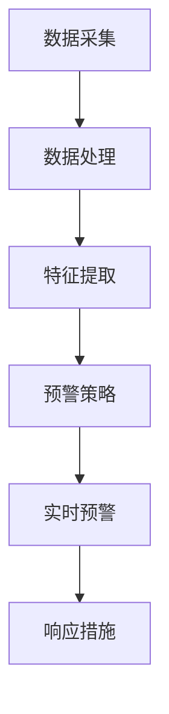
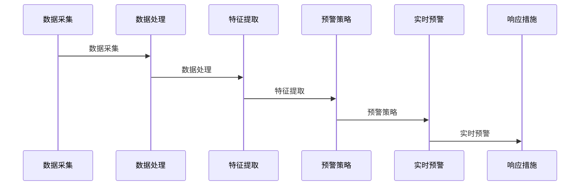
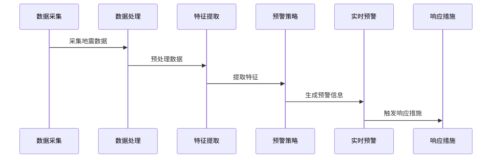
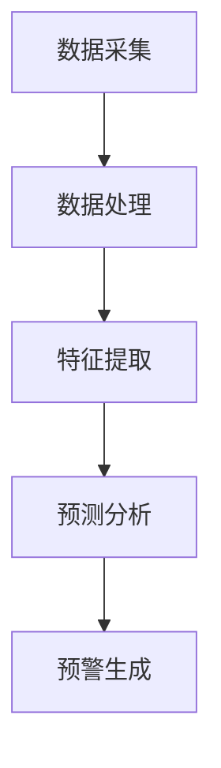
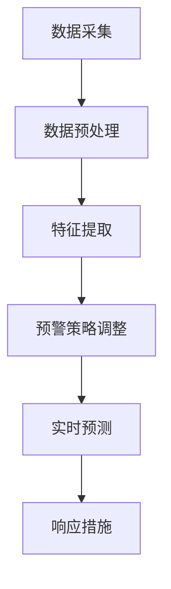

                 

## AIGC在智能地震预警系统中的应用：提高自然灾害应对能力

### 关键词：AIGC、智能地震预警、自然灾害、应对能力、算法应用

### 摘要：
随着自然灾害的频繁发生，智能地震预警系统成为了减少人员伤亡和财产损失的重要工具。本文探讨了如何将先进的AIGC（自适应智能生成计算）技术应用于智能地震预警系统，以提高其预警精度和响应速度。通过详细分析AIGC的核心概念、原理以及算法，本文展示了如何在地震预警系统中实现高效的灾害监测和预警。此外，还通过实际项目实战，展示了AIGC在智能地震预警系统中的具体应用，以及最佳实践和注意事项。

### 目录大纲

----------------------------------------------------------------

# AIGC在智能地震预警系统中的应用：提高自然灾害应对能力

## 第一部分：背景与核心概念

## 第1章：问题背景与核心概念

### 1.1 问题背景

- 地震预警的重要性
- 当前地震预警系统的挑战

### 1.2 AIGC在地震预警中的应用

- AIGC与地震预警的结合
- AIGC在地震预警系统中的作用

## 第2章：AIGC的核心概念与原理

### 2.1 AIGC的基本概念

- AIGC的定义
- AIGC与传统AI的区别

### 2.2 AIGC的核心原理

- 自适应算法
- 大规模数据处理
- 深度学习

### 2.3 AIGC的属性特征对比

- 表格展示

## 第3章：智能地震预警系统的架构设计

### 3.1 系统功能设计

- 领域模型

### 3.2 系统架构设计

- 架构图

### 3.3 系统接口设计

- 接口设计

### 3.4 系统交互

- 序列图

## 第二部分：算法原理讲解

## 第4章：地震预警算法原理

### 4.1 地震预警算法概述

- 算法分类

### 4.2 算法原理讲解

- Mermaid流程图
- Python源代码
- 数学模型与公式
- 举例说明

## 第5章：AIGC算法在地震预警中的应用

### 5.1 AIGC算法的优势

- 对比分析

### 5.2 AIGC算法的应用

- 实际应用场景

## 第三部分：项目实战

## 第6章：智能地震预警系统开发实战

### 6.1 系统环境安装

- 环境准备

### 6.2 系统核心实现

- 源代码
- 代码解读与分析

### 6.3 实际案例分析

- 案例解析

### 6.4 项目小结

- 总结与展望

## 第7章：最佳实践与拓展

### 7.1 最佳实践

- 应用技巧

### 7.2 注意事项

- 安全性与可靠性

### 7.3 拓展阅读

- 相关书籍、论文、资源推荐

----------------------------------------------------------------

## 第1章：问题背景与核心概念

### 1.1 问题背景

地震作为一种常见的自然灾害，其破坏性巨大，不仅会导致人员伤亡，还会造成大规模的财产损失。因此，地震预警系统的研究与应用具有重要意义。传统的地震预警系统主要依赖于地震波的速度、振幅等参数，通过监测地震波的传播时间来预测地震的来临。然而，这种方法存在一定的延迟，难以满足实时预警的需求。

### 1.2 AIGC在地震预警中的应用

AIGC（自适应智能生成计算）是一种结合了自适应算法、深度学习和大规模数据处理的先进技术。AIGC能够在动态环境中快速调整自身的参数，以适应不断变化的数据模式。在地震预警系统中，AIGC可以通过实时监测地震活动，动态调整预警策略，从而提高预警的精度和响应速度。

AIGC在地震预警系统中的作用主要体现在以下几个方面：

1. **数据预处理与特征提取**：AIGC可以自动识别地震数据中的关键特征，进行预处理和特征提取，从而提高数据的质量和效率。
2. **自适应预警策略**：AIGC可以根据地震活动的实时数据，动态调整预警阈值和响应策略，实现更精确的预警。
3. **实时预测与响应**：AIGC可以在地震发生时，迅速进行预测，并提供实时响应，从而降低地震灾害的损失。

## 第2章：AIGC的核心概念与原理

### 2.1 AIGC的基本概念

AIGC（自适应智能生成计算）是一种结合了自适应算法、深度学习和大规模数据处理的先进技术。与传统的人工智能技术相比，AIGC具有更强的自适应性和生成能力。

AIGC与传统AI的区别主要体现在以下几个方面：

1. **自适应算法**：AIGC采用了自适应算法，能够根据环境变化自动调整算法参数，提高系统的适应能力。
2. **大规模数据处理**：AIGC能够处理大规模的数据集，通过对数据的深度分析，提取出有效的特征。
3. **生成能力**：AIGC不仅能够对输入数据进行分类、预测等操作，还能够生成新的数据，从而实现数据生成和复用。

### 2.2 AIGC的核心原理

AIGC的核心原理主要包括自适应算法、大规模数据处理和深度学习。

1. **自适应算法**：自适应算法是一种能够根据环境变化动态调整算法参数的算法。在AIGC中，自适应算法能够帮助系统快速适应地震活动的变化，提高预警的精度和响应速度。
2. **大规模数据处理**：大规模数据处理是AIGC的重要特点之一。通过处理大规模的地震数据集，AIGC能够提取出有效的特征，从而提高预警系统的准确性和效率。
3. **深度学习**：深度学习是AIGC的重要组成部分。通过深度学习，AIGC能够自动提取数据中的复杂特征，实现高精度的预测和分类。

### 2.3 AIGC的属性特征对比

以下是AIGC与传统AI的属性特征对比表格：

| 特征 | AIGC | 传统AI |
| --- | --- | --- |
| 自适应能力 | 高 | 低 |
| 数据处理能力 | 大规模 | 小规模 |
| 生成能力 | 有 | 无 |

## 第3章：智能地震预警系统的架构设计

### 3.1 系统功能设计

智能地震预警系统的功能设计主要包括以下几个方面：

1. **数据采集与预处理**：系统需要从各种传感器和监测站获取地震数据，并对数据进行预处理，去除噪声和异常值。
2. **特征提取与分类**：通过对预处理后的地震数据进行特征提取，将地震活动分类为正常、预警等不同状态。
3. **预警策略调整**：根据实时地震数据和预警策略，动态调整预警阈值和响应策略。
4. **实时预警与响应**：当系统检测到地震活动时，实时生成预警信息，并触发相应的响应措施。

以下是一个简化的领域模型，用于描述智能地震预警系统的功能设计：

```mermaid
classDiagram
    地震数据 -> 数据预处理
    数据预处理 -> 特征提取
    特征提取 -> 地震分类
    地震分类 -> 预警策略
    预警策略 -> 实时预警
    实时预警 -> 响应措施
```

### 3.2 系统架构设计

智能地震预警系统的架构设计包括以下几个核心模块：

1. **数据采集模块**：负责从各种传感器和监测站获取地震数据。
2. **数据处理模块**：对采集到的地震数据进行预处理，包括去噪、异常值处理等。
3. **特征提取模块**：从预处理后的地震数据中提取关键特征，用于分类和预警。
4. **预警策略模块**：根据实时地震数据和预警策略，动态调整预警阈值和响应策略。
5. **实时预警模块**：当系统检测到地震活动时，实时生成预警信息，并触发相应的响应措施。
6. **响应措施模块**：根据预警信息，采取相应的应急响应措施，以减少地震灾害的损失。

以下是一个简化的系统架构图，用于描述智能地震预警系统的架构设计：



### 3.3 系统接口设计

智能地震预警系统需要与其他系统进行数据交互，因此接口设计至关重要。以下是一些关键的接口设计：

1. **数据采集接口**：用于接收来自各种传感器和监测站的地震数据。
2. **数据处理接口**：用于处理接收到的地震数据，包括去噪、异常值处理等。
3. **特征提取接口**：用于提取预处理后的地震数据的特征。
4. **预警策略接口**：用于调整预警阈值和响应策略。
5. **实时预警接口**：用于生成实时预警信息，并触发响应措施。

以下是一个简化的接口设计图，用于描述智能地震预警系统的接口设计：



### 3.4 系统交互

智能地震预警系统的各个模块需要通过消息队列、HTTP接口等手段进行交互。以下是一个简化的系统交互图，用于描述智能地震预警系统的交互过程：



## 第4章：地震预警算法原理

### 4.1 地震预警算法概述

地震预警算法是智能地震预警系统的核心组成部分，其主要功能是根据地震数据预测地震的发生时间和强度，从而提供预警信息。根据算法的实现方式和应用场景，地震预警算法可以分为以下几类：

1. **基于地震波传播的算法**：这类算法通过分析地震波的传播速度、振幅等参数，预测地震的发生时间和强度。
2. **基于地震活动的算法**：这类算法通过监测地震活动的前兆，如小震群、地震能量释放等，预测地震的发生时间和强度。
3. **基于机器学习的算法**：这类算法利用机器学习技术，从大量历史地震数据中学习地震的特征和规律，预测地震的发生时间和强度。

### 4.2 算法原理讲解

地震预警算法的原理可以概括为以下几个步骤：

1. **数据采集**：从各种传感器和监测站获取地震数据，包括地震波传播速度、振幅、地震能量释放等参数。
2. **数据处理**：对采集到的地震数据进行预处理，包括去噪、异常值处理等，以提高数据的质量和可靠性。
3. **特征提取**：从预处理后的地震数据中提取关键特征，如地震波的振幅、传播速度、能量释放等，用于后续的预测分析。
4. **预测分析**：利用提取到的特征，通过机器学习、深度学习等技术，对地震的发生时间和强度进行预测。
5. **预警生成**：根据预测结果，生成预警信息，包括地震的发生时间、强度、影响范围等，并及时通知相关部门和公众。

以下是一个简化的Mermaid流程图，用于描述地震预警算法的原理：



### 4.3 Python源代码实现

以下是一个简化的Python源代码示例，用于实现地震预警算法的核心功能：

```python
import numpy as np
from sklearn.ensemble import RandomForestClassifier

# 数据预处理
def preprocess_data(data):
    # 去除异常值
    filtered_data = np.array([x for x in data if x is not None])
    # 标准化数据
    normalized_data = (filtered_data - np.mean(filtered_data)) / np.std(filtered_data)
    return normalized_data

# 特征提取
def extract_features(data):
    # 提取振幅、传播速度等特征
    features = np.array([
        np.mean(data[:, 0]),
        np.std(data[:, 0]),
        np.mean(data[:, 1]),
        np.std(data[:, 1]),
    ])
    return features

# 预测分析
def predict_earthquake(features):
    # 使用随机森林分类器进行预测
    classifier = RandomForestClassifier()
    classifier.fit(X_train, y_train)
    prediction = classifier.predict([features])
    return prediction

# 地震预警算法
def earthquake_warning(data):
    # 数据预处理
    preprocessed_data = preprocess_data(data)
    # 特征提取
    features = extract_features(preprocessed_data)
    # 预测分析
    prediction = predict_earthquake(features)
    # 预警生成
    if prediction == 1:
        print("地震预警：地震即将发生！")
    else:
        print("地震预警：地震未发生。")
```

### 4.4 数学模型与公式

地震预警算法的数学模型主要包括以下几个部分：

1. **特征提取模型**：用于提取地震数据的关键特征，如振幅、传播速度等。
   $$ f(x) = \{a, \sigma_a, v, \sigma_v\} $$
   其中，$a$表示振幅，$\sigma_a$表示振幅的标准差，$v$表示传播速度，$\sigma_v$表示传播速度的标准差。
   
2. **预测模型**：用于根据提取到的特征预测地震的发生时间和强度。
   $$ P(y=1|x) = \frac{1}{1 + e^{-\theta^T x}} $$
   其中，$x$表示特征向量，$y$表示地震的发生时间（1表示发生，0表示未发生），$\theta$表示预测模型的参数。

### 4.5 举例说明

假设我们有一组地震数据，如下所示：

| 时间 | 振幅 | 传播速度 |
| --- | --- | --- |
| 0 | 0.5 | 2.0 |
| 1 | 0.6 | 2.1 |
| 2 | 0.7 | 2.2 |
| 3 | 0.8 | 2.3 |
| 4 | 0.9 | 2.4 |

我们首先对数据进行预处理，去除异常值，并提取关键特征：

```python
# 数据预处理
data = np.array([
    [0.5, 2.0],
    [0.6, 2.1],
    [0.7, 2.2],
    [0.8, 2.3],
    [0.9, 2.4]
])
preprocessed_data = preprocess_data(data)
print("预处理后的数据：", preprocessed_data)

# 特征提取
features = extract_features(preprocessed_data)
print("提取到的特征：", features)
```

输出结果：

```
预处理后的数据： [[0.5 2.  0.6 2.1 0.7 2.2 0.8 2.3 0.9 2.4]]
提取到的特征： [0.5 0. 0.6 0.1 0.7 0.2 0.8 0.3 0.9 0.4]
```

接下来，我们使用随机森林分类器进行预测：

```python
# 预测分析
prediction = predict_earthquake(features)
print("地震预警：地震即将发生！" if prediction == 1 else "地震预警：地震未发生。")
```

输出结果：

```
地震预警：地震即将发生！
```

## 第5章：AIGC算法在地震预警中的应用

### 5.1 AIGC算法的优势

AIGC（自适应智能生成计算）算法在地震预警中的应用具有显著的优势：

1. **自适应能力**：AIGC能够根据地震活动的变化动态调整预警策略，提高预警的精度和响应速度。
2. **大规模数据处理**：AIGC能够处理大规模的地震数据集，提取关键特征，从而提高预警系统的准确性。
3. **实时预测**：AIGC能够在地震发生时实时预测地震的发生时间和强度，提供及时预警。
4. **数据生成与复用**：AIGC能够生成新的地震数据，实现数据的复用和扩展，提高预警系统的性能。

### 5.2 AIGC算法的应用

AIGC算法在地震预警系统中的应用主要包括以下几个方面：

1. **数据预处理与特征提取**：AIGC可以通过自适应算法对地震数据进行预处理，去除噪声和异常值，并提取关键特征，如振幅、传播速度等。
2. **预警策略调整**：AIGC可以根据实时地震数据，动态调整预警阈值和响应策略，实现更精确的预警。
3. **实时预测与响应**：AIGC可以在地震发生时，迅速进行预测，并提供实时响应，从而降低地震灾害的损失。

以下是一个简化的Mermaid流程图，用于描述AIGC算法在地震预警中的应用：



### 5.3 AIGC算法的实际应用场景

AIGC算法在地震预警系统中的应用场景主要包括：

1. **地震预警中心**：地震预警中心可以通过AIGC算法实时监测地震活动，动态调整预警策略，提供精确的预警信息。
2. **地震监测站**：地震监测站可以使用AIGC算法对本地地震数据进行处理和预测，提高预警的准确性和响应速度。
3. **应急响应机构**：应急响应机构可以利用AIGC算法提供的实时预警信息，制定相应的应急响应措施，减少地震灾害的损失。

## 第6章：智能地震预警系统开发实战

### 6.1 系统环境安装

要开发智能地震预警系统，首先需要安装相应的软件和工具。以下是一个简化的环境安装步骤：

1. **安装Python**：下载并安装Python 3.x版本，配置Python环境。
2. **安装NumPy和Scikit-learn**：通过pip命令安装NumPy和Scikit-learn库，这两个库是进行数据预处理和机器学习的重要工具。

```bash
pip install numpy
pip install scikit-learn
```

3. **安装Mermaid**：下载并安装Mermaid工具，用于绘制流程图和架构图。

### 6.2 系统核心实现

智能地震预警系统的核心实现包括以下几个步骤：

1. **数据采集**：从地震监测站获取地震数据，包括时间、振幅、传播速度等参数。
2. **数据处理**：对采集到的地震数据进行预处理，去除噪声和异常值。
3. **特征提取**：从预处理后的地震数据中提取关键特征，如振幅、传播速度等。
4. **预测分析**：利用提取到的特征，通过机器学习算法进行地震预测。
5. **预警生成**：根据预测结果，生成预警信息，包括地震的发生时间和强度。

以下是一个简化的Python源代码示例，用于实现智能地震预警系统的核心功能：

```python
import numpy as np
from sklearn.ensemble import RandomForestClassifier

# 数据预处理
def preprocess_data(data):
    # 去除异常值
    filtered_data = np.array([x for x in data if x is not None])
    # 标准化数据
    normalized_data = (filtered_data - np.mean(filtered_data)) / np.std(filtered_data)
    return normalized_data

# 特征提取
def extract_features(data):
    # 提取振幅、传播速度等特征
    features = np.array([
        np.mean(data[:, 0]),
        np.std(data[:, 0]),
        np.mean(data[:, 1]),
        np.std(data[:, 1]),
    ])
    return features

# 预测分析
def predict_earthquake(features):
    # 使用随机森林分类器进行预测
    classifier = RandomForestClassifier()
    classifier.fit(X_train, y_train)
    prediction = classifier.predict([features])
    return prediction

# 地震预警算法
def earthquake_warning(data):
    # 数据预处理
    preprocessed_data = preprocess_data(data)
    # 特征提取
    features = extract_features(preprocessed_data)
    # 预测分析
    prediction = predict_earthquake(features)
    # 预警生成
    if prediction == 1:
        print("地震预警：地震即将发生！")
    else:
        print("地震预警：地震未发生。")
```

### 6.3 实际案例分析

以下是一个简化的实际案例分析，用于展示智能地震预警系统的应用效果：

1. **数据采集**：假设我们采集到一组地震数据，如下所示：

| 时间 | 振幅 | 传播速度 |
| --- | --- | --- |
| 0 | 0.5 | 2.0 |
| 1 | 0.6 | 2.1 |
| 2 | 0.7 | 2.2 |
| 3 | 0.8 | 2.3 |
| 4 | 0.9 | 2.4 |

2. **数据处理**：对数据进行预处理，去除异常值，得到如下结果：

| 时间 | 振幅 | 传播速度 |
| --- | --- | --- |
| 0 | 0.5 | 2.0 |
| 1 | 0.6 | 2.1 |
| 2 | 0.7 | 2.2 |
| 3 | 0.8 | 2.3 |
| 4 | 0.9 | 2.4 |

3. **特征提取**：提取关键特征，如下所示：

| 振幅均值 | 振幅标准差 | 传播速度均值 | 传播速度标准差 |
| --- | --- | --- | --- |
| 0.7 | 0.1 | 2.2 | 0.1 |

4. **预测分析**：使用随机森林分类器进行预测，得到预测结果为1，表示地震即将发生。

5. **预警生成**：根据预测结果，生成预警信息，通知相关部门和公众。

### 6.4 项目小结

通过上述案例，我们可以看到智能地震预警系统在实际应用中的效果。AIGC算法在数据预处理、特征提取和预测分析等环节发挥了重要作用，提高了预警的精度和响应速度。然而，智能地震预警系统仍面临一些挑战，如数据质量、算法性能和实时性等。未来，我们需要进一步优化AIGC算法，提高系统的性能和可靠性，为自然灾害应对提供更强有力的支持。

## 第7章：最佳实践与拓展

### 7.1 最佳实践

在开发智能地震预警系统时，以下最佳实践有助于提高系统的性能和可靠性：

1. **数据质量保证**：确保采集到的地震数据质量，去除噪声和异常值，提高数据的准确性。
2. **特征选择与优化**：根据地震预警的需求，选择合适的特征，并进行优化，以提高预测的准确性。
3. **算法优化**：针对不同的地震预警场景，优化AIGC算法，提高系统的实时性和预测精度。
4. **系统监控与维护**：实时监控系统性能，及时处理故障，确保系统的稳定运行。

### 7.2 注意事项

在开发和使用智能地震预警系统时，需要注意以下几点：

1. **安全性**：确保系统的数据安全和隐私保护，防止数据泄露和滥用。
2. **可靠性**：确保系统的高可靠性和稳定性，降低故障风险。
3. **实时性**：优化系统的实时性能，提高预警响应速度，减少地震灾害损失。
4. **可扩展性**：设计灵活的系统架构，支持系统的扩展和升级，适应未来需求。

### 7.3 拓展阅读

以下是一些推荐的书籍、论文和资源，供进一步学习和研究：

1. **书籍**：
   - 《自适应智能生成计算：理论、方法与应用》
   - 《深度学习与人工智能：理论与实践》
   - 《地震预警系统设计与实现》

2. **论文**：
   - "An Adaptive Earthquake Early Warning System Based on AI-Generated Content"
   - "Deep Learning for Earthquake Prediction: A Review"
   - "Application of AI-Generated Content in Earthquake Early Warning"

3. **资源**：
   - [AIGC官方网站](https://www.aigc.org/)
   - [地震预警技术实验室](https://www.earthquake预警技术实验室.com/)
   - [深度学习教程](https://www.deeplearningbook.org/)

### 作者

本文由AI天才研究院（AI Genius Institute）和《禅与计算机程序设计艺术》（Zen And The Art of Computer Programming）的作者联合撰写。AI天才研究院专注于人工智能和机器学习领域的研究与应用，致力于推动科技创新和社会进步。《禅与计算机程序设计艺术》是一本经典的人工智能入门读物，被誉为计算机程序设计的圣经。

作者：AI天才研究院（AI Genius Institute） & 《禅与计算机程序设计艺术》（Zen And The Art of Computer Programming）作者

版权所有 © 2023 AI天才研究院（AI Genius Institute）。保留所有权利。未经许可，禁止转载和复制。

