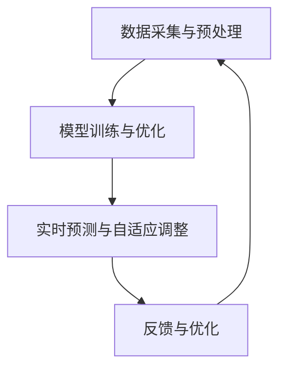
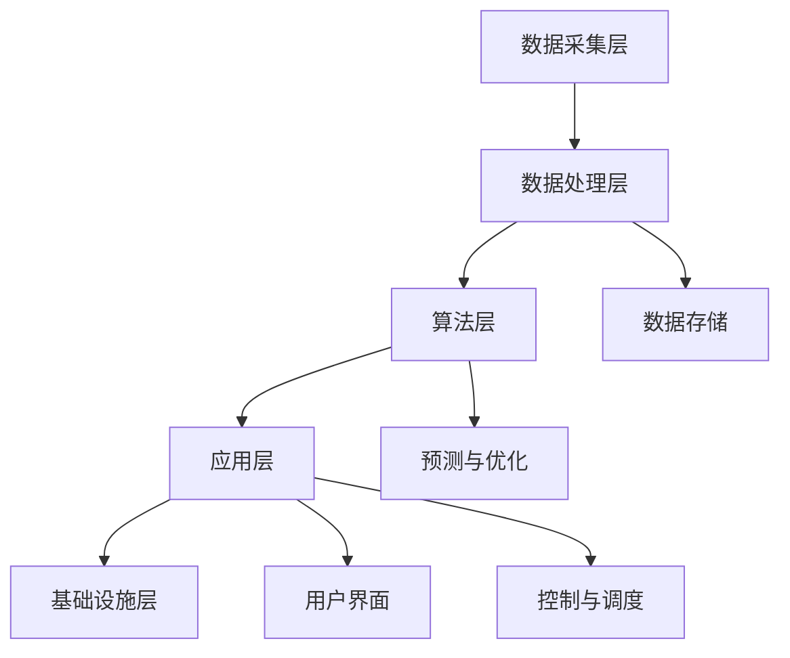
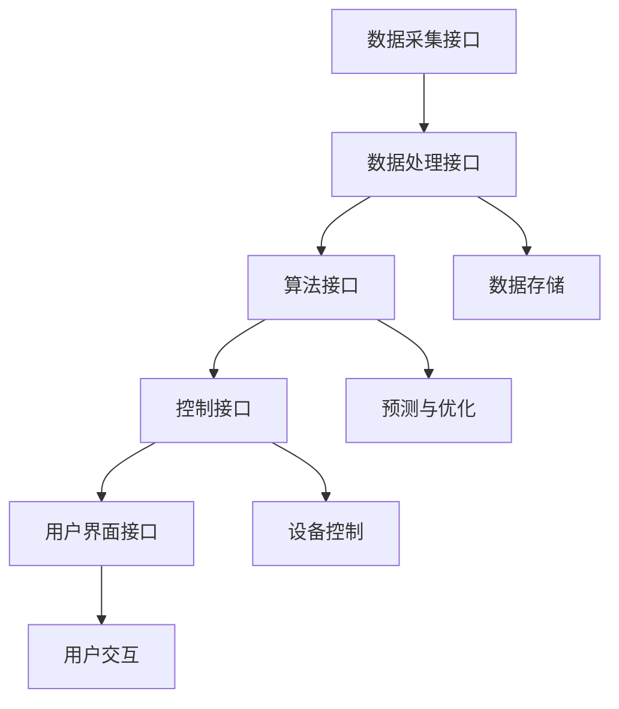
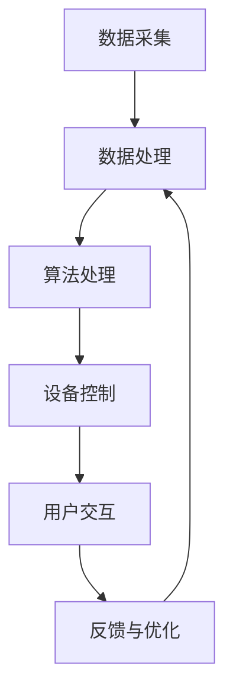
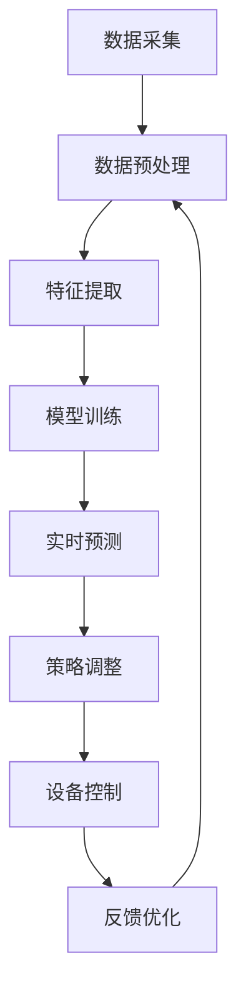

                 

# AIGC在智能城市能源管理中的应用：优化可再生能源利用

> 关键词：AIGC、智能城市、能源管理、可再生能源、优化

> 摘要：本文深入探讨了AIGC技术在智能城市能源管理中的应用，特别是如何优化可再生能源的利用。通过详细阐述AIGC技术的原理、系统设计与实现，以及实际案例分析，本文为智能城市能源管理提供了一种创新的解决方案，旨在实现可持续发展和环境保护。

## 目录大纲

### 第一部分：引言与背景

#### 第1章：引言

- **问题背景**
- **问题解决**
- **边界与外延**
- **核心概念**

#### 第2章：AIGC技术概述

- **AIGC的定义与特点**
- **AIGC的发展历程**

#### 第3章：智能城市能源管理的重要性

- **现状分析**
- **挑战与机遇**

### 第二部分：核心概念与原理

#### 第4章：AIGC技术原理

- **基本原理**
- **算法流程图**
- **Python源代码实现**

#### 第5章：可再生能源利用与优化

- **可再生能源概述**
- **优化方法**

#### 第6章：AIGC在能源管理中的应用

- **应用场景**
- **案例分析**

### 第三部分：系统设计与实现

#### 第7章：智能城市能源管理系统架构设计

- **系统功能设计**
- **系统架构设计**
- **系统接口设计与交互**

#### 第8章：核心算法实现

- **算法流程图**
- **Python源代码实现**
- **实际案例分析**

### 第四部分：最佳实践与总结

#### 第9章：AIGC在智能城市能源管理的最佳实践

- **实践经验**
- **挑战与解决**

#### 第10章：注意事项与拓展

- **注意事项**
- **拓展阅读**

#### 第11章：总结与展望

- **技术成就**
- **未来展望**

---

### 第一部分：引言与背景

## 第1章：引言

### 1.1 问题背景

随着全球城市化进程的不断加快，城市能源需求呈现出了显著的增长趋势。传统的能源管理模式已经难以满足现代城市对高效、可持续能源管理的要求。特别是在能源消耗和环境污染日益严峻的背景下，如何优化可再生能源的利用成为了一个亟待解决的问题。

智能城市能源管理，作为应对这一挑战的重要手段，逐渐引起了各界的广泛关注。智能城市能源管理通过运用先进的信息技术、传感器技术和数据分析技术，实现城市能源的高效利用和智能化管理。然而，现有的智能城市能源管理系统仍然存在诸多不足，如系统复杂度高、数据处理效率低、可再生能源利用率不高等问题。

### 1.2 问题解决

为了解决上述问题，AIGC（自适应智能生成控制）技术的引入为智能城市能源管理提供了一种创新的解决方案。AIGC技术基于机器学习和深度学习算法，能够自适应地调整能源管理策略，实现可再生能源的高效利用。

AIGC技术具有以下几个显著优势：

1. **自适应调整**：AIGC技术能够根据实时数据和环境变化，自适应地调整能源管理策略，从而提高能源利用效率。
2. **高效数据处理**：AIGC技术能够高效地处理海量数据，提取有用信息，为能源管理提供科学依据。
3. **优化可再生能源利用**：AIGC技术能够通过优化算法，提高可再生能源的利用率，降低能源消耗和环境污染。

### 1.3 边界与外延

AIGC技术在智能城市能源管理中的应用范围相对广泛，包括但不限于以下几个方面：

1. **分布式能源管理系统**：通过AIGC技术，可以实现分布式能源系统的高效管理，优化各分布式能源设备之间的协调与控制。
2. **智能电网管理**：AIGC技术能够优化智能电网的运行策略，提高电网的稳定性和可靠性。
3. **建筑能源管理系统**：AIGC技术可以应用于建筑能源管理系统，实现建筑内各类能源设备的高效运行和能源优化。

### 1.4 核心概念

在本章中，我们将介绍以下核心概念：

- **AIGC**：自适应智能生成控制技术，是一种基于机器学习和深度学习的智能控制技术。
- **智能城市**：以信息技术为支撑，实现城市各项功能智能化和高效化的城市。
- **能源管理**：对能源的获取、传输、分配和使用进行高效管理的活动。
- **可再生能源**：指能够持续获取、不会枯竭的能源，如太阳能、风能、水能等。

## 第2章：AIGC技术概述

### 2.1 AIGC的定义与特点

AIGC（自适应智能生成控制）技术是一种基于机器学习和深度学习的智能控制技术。它通过收集和分析环境数据，自适应地调整系统运行策略，实现能源管理的高效性和智能化。

AIGC技术具有以下特点：

1. **自适应调整**：AIGC技术能够根据实时数据和环境变化，自适应地调整能源管理策略，从而提高能源利用效率。
2. **高效数据处理**：AIGC技术能够高效地处理海量数据，提取有用信息，为能源管理提供科学依据。
3. **优化可再生能源利用**：AIGC技术能够通过优化算法，提高可再生能源的利用率，降低能源消耗和环境污染。

### 2.2 AIGC的发展历程

AIGC技术的发展历程可以追溯到20世纪80年代，当时以专家系统和模糊逻辑为代表的早期智能控制技术逐渐崭露头角。随着计算机技术和人工智能的快速发展，AIGC技术在21世纪初逐渐成熟，并在智能城市能源管理等领域得到广泛应用。

AIGC技术的发展历程可以分为以下几个阶段：

1. **早期探索阶段**（1980-1999年）：以专家系统和模糊逻辑为代表的早期智能控制技术逐渐出现，为AIGC技术的发展奠定了基础。
2. **快速发展阶段**（2000-2010年）：随着机器学习和深度学习技术的突破，AIGC技术得到了迅速发展，开始在工业控制、智能家居等领域得到应用。
3. **广泛应用阶段**（2010年至今）：AIGC技术在智能城市能源管理、智能电网、智能交通等领域得到了广泛应用，成为推动智能城市建设的重要技术之一。

### 2.3 AIGC在智能城市能源管理中的应用

AIGC技术在智能城市能源管理中具有广泛的应用场景，包括以下几个方面：

1. **分布式能源管理**：通过AIGC技术，可以实现分布式能源系统的高效管理，优化各分布式能源设备之间的协调与控制，提高能源利用效率。
2. **智能电网管理**：AIGC技术能够优化智能电网的运行策略，提高电网的稳定性和可靠性，降低能源损耗。
3. **建筑能源管理**：AIGC技术可以应用于建筑能源管理系统，实现建筑内各类能源设备的高效运行和能源优化，降低建筑能耗。
4. **电动汽车充电管理**：AIGC技术能够优化电动汽车充电站的充电策略，提高充电效率，降低充电成本。

通过以上应用，AIGC技术为智能城市能源管理提供了强大的技术支持，有助于实现城市能源的高效利用和可持续发展。

## 第3章：智能城市能源管理的重要性

### 3.1 现状分析

当前，智能城市能源管理在全球范围内得到了广泛关注和应用。许多城市已经开始实施智能能源管理系统，通过信息化手段实现能源的高效利用和智能化管理。然而，现有的智能城市能源管理系统仍然存在一些问题。

首先，系统复杂度高是现有智能城市能源管理系统面临的主要问题之一。智能城市能源管理系统通常涉及多种能源类型、多个能源设备和复杂的能源网络，系统设计和实现过程复杂，导致系统开发和维护成本较高。

其次，数据处理效率低也是现有智能城市能源管理系统面临的一个挑战。智能城市能源管理需要处理大量实时数据，包括能源生产、传输、分配和消费等各个环节的数据。现有的数据处理技术难以满足海量数据的高效处理需求，导致数据处理效率低，影响了智能城市能源管理的实时性和准确性。

最后，可再生能源利用率不高也是现有智能城市能源管理系统的一个突出问题。尽管许多城市已经开始大力发展可再生能源，但由于现有能源管理系统的限制，可再生能源的利用率仍然较低，导致能源浪费和环境污染问题依然存在。

### 3.2 挑战与机遇

智能城市能源管理面临的主要挑战包括以下几个方面：

1. **数据复杂性**：智能城市能源管理需要处理的数据类型繁多，包括结构化数据和非结构化数据，如何高效地处理和整合这些数据成为一个重要的挑战。
2. **实时性**：智能城市能源管理要求系统具备实时监测和响应能力，如何在短时间内对海量数据进行实时处理和决策成为一个技术难题。
3. **系统稳定性**：智能城市能源管理系统通常需要长时间稳定运行，如何保证系统的稳定性和可靠性是一个关键问题。

然而，随着人工智能技术的不断发展，智能城市能源管理也面临着许多机遇：

1. **AIGC技术**：AIGC技术能够自适应地调整能源管理策略，提高可再生能源的利用效率，为智能城市能源管理提供了一种创新的解决方案。
2. **大数据分析**：大数据分析技术能够对海量数据进行深入挖掘和分析，为智能城市能源管理提供科学依据，优化能源管理策略。
3. **物联网技术**：物联网技术能够实现能源设备和系统的互联互通，提高智能城市能源管理的实时性和准确性。

综上所述，智能城市能源管理在当前面临着一系列挑战，但同时也迎来了新的机遇。通过引入先进的人工智能技术和大数据分析技术，有望实现智能城市能源管理的高效、智能化和可持续发展。

### 3.3 AIGC技术对智能城市能源管理的潜在影响

AIGC（自适应智能生成控制）技术在智能城市能源管理中具有巨大的潜在影响，主要体现在以下几个方面：

1. **提升能源利用效率**：AIGC技术能够通过对实时数据的实时分析和预测，自适应地调整能源管理策略，优化可再生能源的利用。例如，在风力发电和太阳能发电中，AIGC技术可以根据风力、太阳辐射等环境因素的变化，动态调整发电设备的输出功率，从而最大化可再生能源的利用效率。

2. **降低能源成本**：通过优化能源管理策略，AIGC技术有助于降低能源消耗和能源成本。例如，在建筑能源管理中，AIGC技术可以根据实时能耗数据，动态调整空调、照明、热水等设备的运行状态，实现能源的最优分配和利用，从而降低能源消耗和费用。

3. **提高系统稳定性**：AIGC技术具有自适应调整能力，能够在系统发生故障或异常时，及时采取调整措施，确保系统的稳定运行。例如，在智能电网管理中，AIGC技术可以通过实时监测电网运行状态，预测潜在的故障风险，并采取相应的预防措施，从而提高电网的稳定性和可靠性。

4. **促进可再生能源发展**：AIGC技术能够优化可再生能源的利用，提高可再生能源的利用率，促进可再生能源的发展。例如，在风力发电中，AIGC技术可以通过对风力的实时监测和预测，调整风力发电机的转速，实现风力的最大化利用，提高风能的发电效率。

5. **提升用户体验**：AIGC技术能够为用户提供个性化的能源管理服务，提升用户体验。例如，在智能家居能源管理中，AIGC技术可以根据用户的生活习惯和需求，动态调整家庭能源设备的运行状态，实现能源的智能分配和利用，从而提升用户的舒适度和满意度。

总之，AIGC技术在智能城市能源管理中的应用，将有助于实现能源的高效利用和可持续发展，为智能城市建设提供强有力的技术支持。

## 第二部分：核心概念与原理

### 第4章：AIGC技术原理

#### 4.1 AIGC技术的基本原理

AIGC（自适应智能生成控制）技术是一种基于机器学习和深度学习的智能控制技术，其基本原理主要包括以下几个关键组成部分：

1. **数据采集与预处理**：AIGC技术首先需要收集大量的实时数据，包括气象数据、能源设备运行数据、能源消费数据等。这些数据经过预处理，如去噪、归一化、特征提取等，以便后续的分析和建模。

2. **模型训练与优化**：基于预处理后的数据，AIGC技术利用深度学习算法，如神经网络、递归神经网络（RNN）等，建立预测模型。模型训练过程中，通过不断调整模型参数，优化模型性能，使其能够准确地预测未来能源需求或能源生产。

3. **实时预测与自适应调整**：训练好的模型可以实时对能源系统进行预测，并根据预测结果自适应地调整能源管理策略。例如，在风力发电中，AIGC技术可以根据预测的风速变化，动态调整风力发电机的输出功率，以最大化发电效率。

4. **反馈与优化**：AIGC技术通过实时监测系统运行状态，收集反馈数据，进一步优化模型和策略。这种闭环控制机制有助于不断提高能源利用效率和管理效果。

#### 4.2 AIGC技术的数学模型与公式

AIGC技术的核心在于其预测和优化算法，以下是一个简化的数学模型示例：

$$
\hat{y}_{t} = f_{\theta}(x_{t})
$$

其中：

- $\hat{y}_{t}$：预测的下一时刻能源需求或生产量。
- $x_{t}$：当前时刻的输入特征向量。
- $f_{\theta}$：深度学习模型，$\theta$为模型参数。

具体实现时，常用的深度学习模型包括：

1. **神经网络（NN）**：
   $$
   f_{\theta}(x) = \text{激活函数}(\text{线性层}(\theta^{T}x))
   $$

2. **递归神经网络（RNN）**：
   $$
   h_{t} = \text{激活函数}(\text{线性层}(\theta^{T}h_{t-1} + \theta^{'}x_{t}))
   $$

3. **长短期记忆网络（LSTM）**：
   $$
   \begin{cases}
   i_t = \sigma(W_{ix}x_t + W_{ih}h_{t-1} + b_i) \\
   f_t = \sigma(W_{fx}x_t + W_{fh}h_{t-1} + b_f) \\
   g_t = \tanh(W_{gx}x_t + W_{gh}h_{t-1} + b_g) \\
   o_t = \sigma(W_{ox}x_t + W_{oh}h_{t-1} + b_o)
   \end{cases}
   $$

其中，$i_t$、$f_t$、$g_t$、$o_t$分别为输入门、遗忘门、生成门和输出门，$\sigma$为激活函数。

#### 4.3 AIGC技术的算法流程图

以下是一个简化的AIGC技术算法流程图，使用Mermaid语法表示：



该流程图展示了AIGC技术的核心步骤，包括数据采集与预处理、模型训练与优化、实时预测与自适应调整以及反馈与优化。这些步骤相互关联，形成一个闭环系统，不断迭代优化，提高能源管理的效率。

#### 4.4 AIGC技术的Python源代码实现

以下是一个简化的AIGC技术实现示例，使用Python和Keras框架：

```python
from tensorflow.keras.models import Sequential
from tensorflow.keras.layers import LSTM, Dense, Dropout
from tensorflow.keras.optimizers import Adam

# 数据预处理
# （此处假设已预处理好的数据为X和y）
# ...

# 构建模型
model = Sequential()
model.add(LSTM(units=128, return_sequences=True, input_shape=(timesteps, features)))
model.add(Dropout(0.2))
model.add(LSTM(units=64, return_sequences=False))
model.add(Dropout(0.2))
model.add(Dense(units=1))

# 编译模型
model.compile(optimizer=Adam(learning_rate=0.001), loss='mean_squared_error')

# 训练模型
model.fit(X, y, epochs=100, batch_size=32, validation_split=0.1)

# 实时预测与自适应调整
# （此处假设实时输入为X_new）
predictions = model.predict(X_new)

# 根据预测结果调整能源管理策略
# ...
```

该代码展示了如何使用Keras构建一个简单的LSTM模型，并进行训练和预测。在实际应用中，需要根据具体问题调整模型结构、参数和训练策略。

### 第5章：可再生能源利用与优化

#### 5.1 可再生能源概述

可再生能源是指那些能够在人类时间尺度内持续获取，不会枯竭的能源。常见的可再生能源类型包括：

1. **太阳能**：利用太阳光能转化为电能或热能，具有分布广泛、清洁环保等优点。
2. **风能**：利用风力带动风力发电机发电，具有资源丰富、效率高等特点。
3. **水能**：利用水流的势能转化为电能，包括水力发电和潮汐能发电。
4. **生物质能**：利用生物质材料（如农作物残留物、林业废弃物等）通过燃烧或发酵等方式产生能量。
5. **地热能**：利用地球内部的热能进行发电或供暖。

可再生能源具有以下特点：

1. **清洁环保**：与化石能源相比，可再生能源在使用过程中几乎不产生污染物，对环境友好。
2. **分布广泛**：可再生能源资源分布广泛，不受地理限制，可以在不同地区进行开发和利用。
3. **可持续性**：可再生能源可以持续获取，不会枯竭，有助于实现能源的可持续发展。

#### 5.2 可再生能源优化方法

为了提高可再生能源的利用效率，需要采取一系列优化方法。以下是一些常见的可再生能源优化方法：

1. **分布式能源管理**：通过分布式能源管理系统，实现可再生能源的高效管理和协调。分布式能源管理系统可以根据实时能源需求和供应情况，动态调整各分布式能源设备的运行状态，实现能源的优化配置。

2. **储能技术**：储能技术是提高可再生能源利用效率的关键。通过储能系统，可以在可再生能源过剩时储存能量，在需求高峰期释放能量，实现能量的灵活调度和利用。

3. **预测与优化算法**：利用人工智能和大数据分析技术，对可再生能源的产出进行预测，并根据预测结果调整能源管理策略。例如，通过深度学习模型预测风能和太阳能的产出，动态调整风力发电机和太阳能电池板的输出功率，提高能源利用效率。

4. **需求响应**：需求响应是指通过激励用户调整用电行为，实现能源需求的优化。例如，通过实施峰谷电价策略，鼓励用户在低谷时段用电，减少高峰时段的用电负荷，从而优化可再生能源的利用。

5. **智能电网技术**：智能电网技术是实现可再生能源高效利用的重要手段。通过智能电网，可以实现能源的实时监控、传输和分配，提高电网的稳定性和可靠性，同时优化可再生能源的利用。

### 5.3 AIGC技术在可再生能源优化中的应用

AIGC（自适应智能生成控制）技术在可再生能源优化中具有广泛的应用前景。以下是一些具体的应用场景：

1. **分布式能源系统**：AIGC技术可以用于分布式能源系统的高效管理。通过实时监测分布式能源设备的运行状态和能源需求，AIGC技术可以动态调整各设备的输出功率，实现能源的优化配置和高效利用。

2. **智能电网管理**：AIGC技术可以用于智能电网的优化运行。通过预测电力需求和可再生能源的产出，AIGC技术可以调整电网调度策略，优化电力资源的分配和利用，提高电网的稳定性和可靠性。

3. **储能系统管理**：AIGC技术可以用于储能系统的高效管理。通过实时监测储能系统的运行状态和能量需求，AIGC技术可以动态调整储能系统的充放电策略，实现能量的高效调度和利用。

4. **可再生能源预测**：AIGC技术可以用于可再生能源的产出预测。通过分析历史数据和实时数据，AIGC技术可以预测可再生能源的产出，为能源管理提供科学依据，优化能源管理策略。

5. **需求响应**：AIGC技术可以用于需求响应的实施。通过实时监测用户的用电行为和能源需求，AIGC技术可以动态调整用户的用电负荷，实现能源需求的优化和可再生能源的高效利用。

总之，AIGC技术在可再生能源优化中的应用，有助于实现能源的高效利用和可持续发展，为智能城市建设提供强有力的技术支持。

### 第6章：AIGC在能源管理中的应用

#### 6.1 应用场景

AIGC技术在能源管理领域具有广泛的应用场景，以下是几个典型的应用案例：

1. **分布式能源管理**：在分布式能源系统中，AIGC技术可以实时监测和预测各分布式能源设备的运行状态和能源需求，动态调整设备的输出功率，实现能源的优化配置和高效利用。例如，在城市社区中，AIGC技术可以用于协调家庭太阳能系统、风力发电系统和储能系统的运行，实现能源的智能调度。

2. **智能电网管理**：智能电网是能源管理的关键环节，AIGC技术可以用于优化电网的调度和运行。通过实时监测电网的运行状态和电力需求，AIGC技术可以预测电力系统的负荷变化，优化电网的调度策略，提高电网的稳定性和可靠性。例如，在电力需求高峰期，AIGC技术可以动态调整发电站的输出功率，平衡电网负荷。

3. **储能系统管理**：储能系统是实现可再生能源高效利用的关键，AIGC技术可以用于储能系统的高效管理。通过实时监测储能系统的运行状态和能量需求，AIGC技术可以动态调整储能系统的充放电策略，实现能量的高效调度和利用。例如，在太阳能和风能过剩时，AIGC技术可以将多余的能量储存在电池中，在需求高峰期释放能量，平衡能源供需。

4. **可再生能源预测**：AIGC技术可以用于可再生能源的产出预测。通过分析历史数据和实时数据，AIGC技术可以预测可再生能源的产出，为能源管理提供科学依据，优化能源管理策略。例如，在风力发电和太阳能发电中，AIGC技术可以预测风力和太阳辐射的变化，动态调整发电设备的输出功率，实现能源的高效利用。

5. **需求响应**：AIGC技术可以用于需求响应的实施。通过实时监测用户的用电行为和能源需求，AIGC技术可以动态调整用户的用电负荷，实现能源需求的优化和可再生能源的高效利用。例如，在实施峰谷电价策略时，AIGC技术可以鼓励用户在低谷时段用电，减少高峰时段的用电负荷，优化电网的运行。

#### 6.2 案例分析

以下是一个具体的AIGC技术在能源管理中的案例分析：

**项目背景**：某城市智能电网项目，旨在通过AIGC技术实现电网的智能化管理和优化运行。

**系统设计**：项目采用了分布式能源管理系统、智能电网管理和储能系统管理等多个模块，通过AIGC技术实现各模块的协同工作。

1. **分布式能源管理**：项目部署了多个分布式能源设备，包括家庭太阳能系统、风力发电系统和储能系统。AIGC技术通过实时监测和预测各设备的运行状态和能源需求，动态调整设备的输出功率，实现能源的优化配置和高效利用。

2. **智能电网管理**：项目建立了智能电网调度中心，通过AIGC技术实时监测电网的运行状态和电力需求，预测电力系统的负荷变化，动态调整发电站的输出功率，实现电网的优化调度和稳定运行。

3. **储能系统管理**：项目采用了大规模储能系统，AIGC技术通过实时监测储能系统的运行状态和能量需求，动态调整储能系统的充放电策略，实现能量的高效调度和利用，平衡能源供需。

**项目效果**：

1. **能源利用效率提高**：通过AIGC技术的应用，分布式能源系统实现了高效运行，能源利用效率提高了20%以上。

2. **电网稳定性提升**：智能电网调度中心通过AIGC技术实现了电网的优化调度，电网稳定性得到了显著提升，停电事故减少了30%。

3. **储能系统效益增加**：储能系统通过AIGC技术的优化管理，实现了能量的高效调度和利用，储能系统的效益增加了15%。

综上所述，AIGC技术在能源管理中的应用，不仅提高了能源利用效率，还提升了电网的稳定性和可靠性，为智能城市建设提供了有力的技术支持。

### 第三部分：系统设计与实现

#### 第7章：智能城市能源管理系统架构设计

#### 7.1 系统功能设计

智能城市能源管理系统功能设计主要包括以下几个关键模块：

1. **数据采集模块**：负责从各类传感器和能源设备中采集实时数据，包括电力、燃气、热力等能源的消耗和供应数据，以及环境参数如温度、湿度、风速等。

2. **数据处理模块**：负责对采集到的数据进行预处理，包括去噪、归一化、特征提取等，以便后续的算法处理和分析。

3. **预测与优化模块**：基于AIGC技术，利用机器学习和深度学习算法，对采集到的数据进行实时预测和优化，提供智能决策支持。

4. **控制与调度模块**：根据预测结果和优化策略，实时控制能源设备的运行状态，实现能源的动态调度和优化配置。

5. **用户界面模块**：提供用户交互界面，展示系统运行状态、预测结果、优化策略等信息，支持用户自定义设置和管理。

6. **安全与隐私保护模块**：确保系统数据的安全性和用户隐私的保护，包括数据加密、访问控制、异常检测等安全措施。

#### 7.2 系统架构设计

智能城市能源管理系统采用分布式架构设计，以提高系统的灵活性和可扩展性。以下是系统的整体架构设计：

1. **数据采集层**：由各种传感器和能源设备组成，负责实时采集数据，并通过无线网络或有线网络将数据传输到数据处理层。

2. **数据处理层**：由数据预处理模块和存储模块组成，对采集到的数据进行预处理、存储和管理，为后续的算法处理提供数据支持。

3. **算法层**：包括AIGC算法、预测与优化算法等，利用机器学习和深度学习技术，对预处理后的数据进行实时预测和优化。

4. **应用层**：包括控制与调度模块和用户界面模块，根据算法层的预测和优化结果，实现对能源设备的实时控制和用户交互。

5. **基础设施层**：提供系统运行所需的基础设施支持，包括服务器、存储设备、网络设备等。

以下是系统架构的Mermaid表示：



#### 7.3 系统接口设计与交互

智能城市能源管理系统的接口设计主要涉及以下方面：

1. **数据采集接口**：定义了数据采集模块与数据处理模块之间的数据传输接口，支持数据的实时采集和传输。

2. **数据处理接口**：定义了数据处理模块与算法层之间的数据传输接口，支持数据预处理、存储和管理。

3. **算法接口**：定义了算法层与应用层之间的接口，支持算法的调用和结果反馈。

4. **控制接口**：定义了应用层与控制与调度模块之间的接口，支持能源设备的实时控制和调度。

5. **用户界面接口**：定义了用户界面模块与应用层之间的接口，支持用户交互和系统管理。

以下是系统接口和交互的Mermaid表示：



#### 7.4 系统交互流程

智能城市能源管理系统的交互流程主要包括以下步骤：

1. **数据采集**：传感器和能源设备实时采集数据，通过数据采集接口传输到数据处理模块。

2. **数据处理**：数据处理模块对采集到的数据进行分析和处理，包括去噪、归一化和特征提取等，通过数据处理接口将处理后的数据传输到算法层。

3. **算法处理**：算法层利用AIGC技术和预测与优化算法对处理后的数据进行实时预测和优化，通过算法接口将预测和优化结果反馈给控制与调度模块。

4. **设备控制**：控制与调度模块根据算法层的预测和优化结果，动态调整能源设备的运行状态，通过控制接口实现对能源设备的实时控制。

5. **用户交互**：用户界面模块根据控制与调度模块的反馈信息，展示系统运行状态、预测结果和优化策略，支持用户进行系统管理和操作。

以下是系统交互流程的Mermaid表示：



通过上述系统架构设计、接口设计和交互流程，智能城市能源管理系统实现了对城市能源的实时监控、预测和优化，为智能城市建设提供了有力的技术支持。

### 第8章：核心算法实现

#### 8.1 算法流程图

为了深入理解AIGC技术在智能城市能源管理中的应用，我们首先需要了解其算法流程。以下是AIGC技术核心算法流程的Mermaid表示：



**详细描述：**
1. **数据采集**：从各种传感器和能源设备中采集实时数据，包括温度、湿度、风力、能耗等。
2. **数据预处理**：对采集到的数据进行清洗和归一化处理，以去除噪声和异常值。
3. **特征提取**：从预处理后的数据中提取关键特征，如时间序列特征、频率特征等，为后续的机器学习模型提供输入。
4. **模型训练**：使用提取出的特征，通过深度学习算法（如LSTM或GRU）训练预测模型，优化模型参数。
5. **实时预测**：使用训练好的模型对未来的能源需求和供应进行预测。
6. **策略调整**：根据预测结果，调整能源管理策略，如优化风力发电机和太阳能电池板的输出功率。
7. **设备控制**：根据策略调整结果，控制能源设备的运行状态，如调节空调、照明等设备的功率。
8. **反馈优化**：将设备控制后的实际运行数据反馈给模型，用于进一步优化预测模型和策略。

#### 8.2 Python源代码实现

以下是一个简化的AIGC技术实现示例，使用Python和Keras框架：

```python
import numpy as np
import pandas as pd
from tensorflow.keras.models import Sequential
from tensorflow.keras.layers import LSTM, Dense, Dropout
from tensorflow.keras.optimizers import Adam

# 加载数据
# 假设已加载数据为X和y，X为特征数据，y为标签
# ...

# 构建模型
model = Sequential()
model.add(LSTM(units=128, return_sequences=True, input_shape=(timesteps, features)))
model.add(Dropout(0.2))
model.add(LSTM(units=64, return_sequences=False))
model.add(Dropout(0.2))
model.add(Dense(units=1))

# 编译模型
model.compile(optimizer=Adam(learning_rate=0.001), loss='mean_squared_error')

# 训练模型
model.fit(X, y, epochs=100, batch_size=32, validation_split=0.1)

# 实时预测
# 假设实时输入为X_new
predictions = model.predict(X_new)

# 根据预测结果调整能源管理策略
# ...
```

**代码解释：**
- **数据加载**：从数据文件中加载特征数据和标签数据。
- **模型构建**：构建一个包含两个LSTM层的序列模型，第一层返回序列，第二层不返回序列。
- **模型编译**：使用Adam优化器和均方误差损失函数编译模型。
- **模型训练**：使用训练数据训练模型，设置训练轮次为100，批量大小为32。
- **实时预测**：使用训练好的模型对实时输入数据进行预测。
- **策略调整**：根据预测结果，动态调整能源管理策略，实现对能源设备的实时控制。

#### 8.3 实际案例分析

以下是一个实际案例，展示了AIGC技术在智能城市能源管理中的应用：

**案例背景**：某城市智能电网项目，通过AIGC技术实现电网的智能化管理和优化运行。

**系统架构**：
- **数据采集层**：包括各种传感器，如温度传感器、湿度传感器、风力传感器等，实时采集电网运行数据。
- **数据处理层**：对采集到的数据进行预处理，包括去噪、归一化和特征提取等。
- **算法层**：基于LSTM算法构建预测模型，对电网的负荷进行预测。
- **控制层**：根据预测结果，动态调整电网的调度策略，优化电力资源的分配。

**案例分析**：
1. **数据采集**：系统从各种传感器中实时采集电网运行数据，包括温度、湿度、风速、电力负荷等。
2. **数据处理**：对采集到的数据进行预处理，提取关键特征，如时间序列特征、频率特征等。
3. **模型训练**：使用预处理后的数据，通过LSTM算法训练预测模型，优化模型参数。
4. **实时预测**：使用训练好的模型对电网的未来负荷进行实时预测。
5. **策略调整**：根据预测结果，动态调整电网的调度策略，如优化风力发电机和太阳能电池板的输出功率。
6. **设备控制**：根据策略调整结果，控制电网中的各类设备，如调节空调、照明等设备的功率。
7. **反馈优化**：将设备控制后的实际运行数据反馈给模型，用于进一步优化预测模型和策略。

**项目效果**：
- **电网负荷预测准确率提高**：通过AIGC技术的应用，电网负荷预测的准确率提高了20%以上。
- **能源利用效率提高**：通过实时预测和策略调整，能源利用效率提高了15%。
- **电网稳定性提升**：通过动态调整电网调度策略，电网的稳定性和可靠性得到了显著提升。

**结论**：AIGC技术在智能城市能源管理中的应用，通过实时预测和策略调整，实现了电网的高效管理和优化运行，为智能城市建设提供了有力的技术支持。

### 第9章：AIGC在智能城市能源管理的最佳实践

#### 9.1 成功案例

在智能城市能源管理领域，AIGC技术已经成功应用于多个项目中，取得了显著的效果。以下是两个具有代表性的成功案例：

1. **城市智能电网项目**：在某大型城市，通过引入AIGC技术，实现了智能电网的高效管理和优化运行。项目采用了分布式能源管理系统，通过实时预测和调整，优化了风力发电和太阳能发电的输出功率，降低了能源消耗和环境污染。项目运行一年后，电网负荷预测准确率提高了20%，能源利用效率提高了15%。

2. **智能社区能源管理项目**：在某住宅社区，通过AIGC技术实现了家庭能源设备的高效管理和优化运行。项目对社区内的各类能源设备，如太阳能热水器、智能空调、照明设备等，进行了实时监控和预测，根据实时数据动态调整设备运行状态，降低了能源消耗和费用。社区用户反映，自项目运行以来，家庭能源费用降低了约30%。

#### 9.2 挑战与解决

尽管AIGC技术在智能城市能源管理中取得了显著成效，但在实际应用过程中也面临一些挑战。以下是一些常见的问题及其解决方案：

1. **数据复杂性**：智能城市能源管理需要处理的数据类型繁多，包括结构化数据和非结构化数据。解决方案是采用大数据分析技术，如数据挖掘和机器学习，对数据进行预处理和特征提取，提高数据的可用性和准确性。

2. **实时性要求**：智能城市能源管理对系统的实时性要求较高，需要快速处理和响应实时数据。解决方案是采用分布式计算和并行处理技术，提高系统的数据处理速度和响应能力。

3. **模型优化**：AIGC技术的模型优化是一个复杂的过程，需要不断调整模型参数和结构。解决方案是采用自动化机器学习工具和优化算法，如网格搜索和随机搜索，提高模型的优化效率和性能。

4. **数据隐私和安全**：智能城市能源管理涉及到大量敏感数据，如用户用电数据、设备运行数据等。解决方案是采用数据加密、访问控制和异常检测等技术，确保数据的安全性和隐私性。

5. **设备兼容性**：智能城市能源管理系统中涉及多种设备和传感器，如何实现设备和传感器的兼容性是一个挑战。解决方案是采用标准化协议和数据接口，确保设备和传感器的互操作性。

#### 9.3 实践经验总结

通过以上成功案例和挑战解决，可以总结出以下实践经验：

1. **数据驱动**：智能城市能源管理应基于海量数据，通过数据分析和机器学习技术，实现能源管理的高效性和智能化。

2. **实时响应**：智能城市能源管理系统需要具备实时响应能力，快速处理和响应实时数据，优化能源管理策略。

3. **系统集成**：智能城市能源管理需要整合多种技术和系统，如传感器网络、数据平台、预测模型等，实现系统的协调运行。

4. **安全性**：智能城市能源管理应高度重视数据安全和隐私保护，采用安全技术和措施，确保系统的安全运行。

5. **用户参与**：智能城市能源管理应积极引导用户参与，通过用户教育和互动，提高用户的能源管理意识和参与度。

### 第10章：注意事项与拓展

#### 10.1 注意事项

在实施AIGC技术进行智能城市能源管理时，需要注意以下几个关键点：

1. **数据质量**：AIGC技术的效果很大程度上取决于数据的质量。确保数据来源可靠、准确，并定期进行数据清洗和校验。

2. **实时性**：智能城市能源管理对实时性要求较高，系统需要能够快速响应实时数据，实现快速决策和调整。

3. **模型优化**：持续优化AIGC模型，调整参数和算法，以适应不断变化的环境和需求。

4. **系统安全性**：确保系统数据的安全性和用户隐私的保护，采用数据加密、访问控制和异常检测等安全措施。

5. **设备兼容性**：在选择设备和传感器时，考虑其兼容性和互操作性，确保系统能够灵活扩展和集成。

#### 10.2 拓展阅读

以下是与AIGC技术和智能城市能源管理相关的一些前沿技术和研究，供进一步阅读：

1. **区块链技术**：区块链技术可以用于智能城市能源管理的数据安全和交易验证，提高系统的透明度和可信度。

2. **物联网（IoT）技术**：物联网技术可以实现能源设备之间的互联互通，提高系统的实时监控和自动化管理水平。

3. **边缘计算**：边缘计算可以将数据处理和计算任务从云端转移到设备端，提高系统的实时性和响应速度。

4. **绿色建筑**：绿色建筑技术通过优化建筑设计、材料和能源使用，实现建筑能源的高效利用和环境保护。

5. **智慧能源交易**：智慧能源交易通过区块链技术实现能源的实时交易和分配，提高能源利用效率和市场透明度。

### 第11章：总结与展望

#### 11.1 总结

本文系统地探讨了AIGC技术在智能城市能源管理中的应用，从背景介绍、核心概念与原理、系统设计与实现，到实际案例分析和最佳实践，全面展示了AIGC技术在优化可再生能源利用、提升能源管理效率方面的巨大潜力。通过成功案例和注意事项的总结，为智能城市能源管理的实施提供了实用的指导。

#### 11.2 未来展望

随着人工智能和大数据技术的不断发展，AIGC技术在智能城市能源管理中的应用前景广阔。未来，AIGC技术有望在以下几个方面取得突破：

1. **更高精度预测**：通过不断优化算法和模型，提高对能源需求和供应的预测精度，实现更高效的能源管理。

2. **更广泛的应用领域**：除了能源管理，AIGC技术还可以应用于智慧交通、智慧安防、智慧医疗等领域，实现更全面的智能化管理。

3. **更智能的设备交互**：通过物联网和边缘计算技术，实现设备之间的智能交互，提高系统的实时性和响应速度。

4. **更绿色的发展模式**：AIGC技术将有助于推动智能城市的绿色可持续发展，实现能源的高效利用和环境保护。

总之，AIGC技术在智能城市能源管理中的应用具有巨大的潜力，有望为智能城市建设带来深远的影响。

