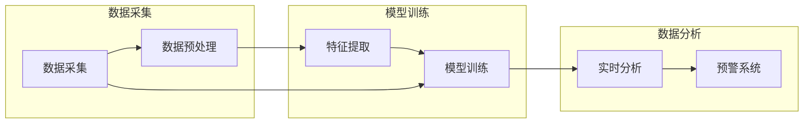
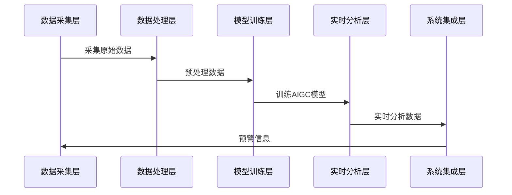
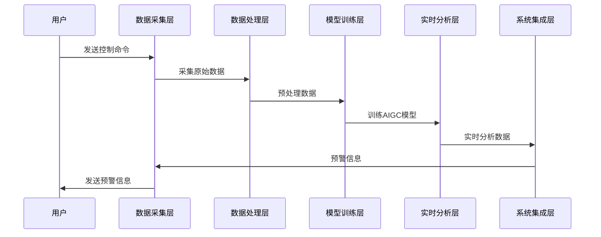

                 

### 第一部分：背景介绍

在当今世界，安全是公共安全领域关注的焦点。随着科技的迅猛发展，尤其是人工智能（AI）和生成对抗网络（GAN）技术的成熟，智能安防系统在提升安全性、效率和响应速度方面展现出巨大的潜力。本篇文章旨在探讨人工智能生成内容（AIGC）在智能安防系统中的创新应用，通过详细分析AIGC的核心技术、算法原理、系统架构与实现，以及项目实战经验，为读者呈现这一领域的前沿探索与实践。

### 第1章：AIGC与智能安防系统概述

#### 1.1 问题背景

##### 1.1.1 传统安防系统的局限性

传统安防系统主要依赖于监控摄像头、报警器等硬件设备，辅以人工分析，存在以下几个显著的局限性：

1. **高成本**：安装和维护大量监控设备需要巨大的经济投入。
2. **低效率**：人工分析视频监控需要大量时间和人力资源，效率低下。
3. **易受干扰**：监控系统可能因天气、光线等因素而失效。
4. **无法主动预警**：系统只能被动响应，无法预见潜在威胁。

##### 1.1.2 AIGC在安防领域的应用潜力

人工智能生成内容（AIGC）是一种通过人工智能技术生成内容的方法，其核心在于生成文本、图像、音频等多种形式的内容。AIGC在智能安防系统中的应用潜力包括：

1. **高效数据分析**：通过AIGC技术，可以快速分析大量视频和图像数据，提取关键信息。
2. **主动预警**：AIGC技术可以实时监控并识别异常行为，提前预警，减少安全事故。
3. **个性化定制**：根据用户需求和场景，AIGC可以生成定制化的安防策略和方案。
4. **智能化设备**：AIGC技术可以赋能传统安防设备，使其具备学习和适应能力。

#### 1.2 问题描述

##### 1.2.1 AIGC在智能安防中的核心挑战

尽管AIGC在智能安防系统中具备巨大潜力，但应用过程中仍面临以下核心挑战：

1. **数据质量**：高质量的数据是AIGC算法有效运行的基础，数据的质量直接影响系统的性能。
2. **算法性能**：需要不断优化算法，提高其在不同场景下的准确性和鲁棒性。
3. **隐私保护**：安防系统涉及大量敏感数据，如何保护用户隐私成为一大挑战。
4. **系统整合**：将AIGC技术与现有安防系统整合，实现无缝对接和高效协同。

##### 1.2.2 AIGC在安防系统中的目标与应用场景

AIGC在智能安防系统中的目标主要包括：

1. **智能分析**：利用AIGC技术对视频和图像进行智能分析，识别潜在威胁。
2. **实时预警**：通过实时数据分析，提前预警，快速响应。
3. **个性化服务**：根据用户需求提供定制化的安防服务。
4. **系统集成**：与现有安防系统整合，提升整体性能。

主要应用场景包括：

1. **公共安全监控**：例如城市监控系统，实时监控人群动态，识别异常行为。
2. **金融安防**：例如银行监控系统，实时监控交易行为，防范欺诈活动。
3. **智能家居**：例如家庭安全监控，实时监控家居环境，确保家庭安全。
4. **工业安全**：例如工厂监控系统，实时监控生产环境，防范安全事故。

#### 1.3 问题解决

##### 1.3.1 AIGC的基本原理

AIGC（AI-Generated Content）是一种通过人工智能技术自动生成内容的方法，主要依赖于深度学习和生成对抗网络（GAN）技术。其基本原理如下：

1. **生成器（Generator）**：生成器是AIGC的核心组件，它通过学习大量数据，生成与输入数据相似的新数据。
2. **判别器（Discriminator）**：判别器用于判断生成数据的真实性和质量，通过与生成器对抗，不断提升生成器的性能。
3. **损失函数（Loss Function）**：损失函数用于衡量生成器生成的数据与真实数据之间的差距，指导生成器的训练。

##### 1.3.2 智能安防系统中的AIGC应用架构

在智能安防系统中，AIGC的应用架构通常包括以下几个关键模块：

1. **数据采集与预处理**：通过摄像头、传感器等设备采集原始数据，并进行预处理，如数据清洗、归一化等。
2. **特征提取与融合**：利用深度学习技术提取数据中的关键特征，并进行融合，提高数据的表征能力。
3. **AIGC模型训练**：利用生成对抗网络（GAN）等模型进行训练，生成具有特定属性的安防内容。
4. **实时分析与决策**：基于训练好的AIGC模型，对实时数据进行分析，进行异常检测和预警。
5. **系统集成与部署**：将AIGC模型与现有安防系统集成，实现高效、智能的安防系统。

##### 1.4 边界与外延

###### 1.4.1 AIGC与其他智能技术的融合

AIGC技术可以与多种其他智能技术进行融合，以提升智能安防系统的性能。例如：

1. **机器学习**：通过机器学习技术，可以优化AIGC模型的训练过程，提高模型的准确性和效率。
2. **物联网（IoT）**：通过物联网技术，可以实时收集、传输和处理大量安防数据，为AIGC提供丰富的数据来源。
3. **云计算与边缘计算**：通过云计算和边缘计算技术，可以实现AIGC模型的分布式部署和高效运行。
4. **区块链**：通过区块链技术，可以保障安防数据的安全性和隐私性。

###### 1.4.2 AIGC在安防系统中的创新应用领域

AIGC在安防系统中具备广泛的应用潜力，创新应用领域包括：

1. **智能交通**：利用AIGC技术，实时分析交通数据，优化交通流量，提升道路通行效率。
2. **应急管理**：利用AIGC技术，快速分析突发事件数据，提供精准的应急响应方案。
3. **智能社区**：利用AIGC技术，实时监控社区安全，提供个性化的安防服务。
4. **智能工厂**：利用AIGC技术，实时监控生产环境，提升生产安全与效率。

##### 1.5 概念结构与核心要素组成

###### 1.5.1 AIGC概念结构解析

AIGC概念结构主要包括以下几个核心组件：

1. **数据输入层**：接收来自各类传感器的原始数据，如视频、图像、音频等。
2. **数据预处理层**：对原始数据进行清洗、归一化等预处理操作，提高数据质量。
3. **特征提取层**：利用深度学习技术提取数据中的关键特征，提高数据的表征能力。
4. **生成对抗网络层**：包括生成器和判别器，通过对抗训练生成高质量的内容。
5. **模型评估层**：对生成内容进行评估，确保其符合预期的质量标准。
6. **应用输出层**：将生成的AIGC内容应用于实际安防场景，如智能分析、实时预警等。

###### 1.5.2 智能安防系统的核心要素

智能安防系统的核心要素包括：

1. **硬件设备**：包括摄像头、传感器、报警器等，用于采集原始数据。
2. **软件系统**：包括数据采集与预处理系统、特征提取与融合系统、AIGC模型训练与评估系统、实时分析与决策系统等。
3. **数据资源**：包括海量的视频、图像、音频等数据，用于训练和优化AIGC模型。
4. **网络与通信**：包括局域网、广域网等网络基础设施，用于数据传输和系统互联。
5. **人员与管理**：包括安防人员、运维人员、管理人员等，负责系统的运行、维护和管理。

### 第二部分：核心概念与联系

#### 第2章：AIGC的基本概念与原理

##### 2.1 AIGC的定义

AIGC（AI-Generated Content），即人工智能生成内容，是指通过人工智能技术（如深度学习、生成对抗网络等）自动生成文本、图像、音频等多种形式的内容。AIGC的核心在于利用人工智能算法，从大量的数据中学习规律，并生成新的、具有高质量的内容。

##### 2.1.1 AIGC的基本定义

AIGC的基本定义可以从以下几个方面进行阐述：

1. **技术基础**：AIGC基于深度学习和生成对抗网络等先进的人工智能技术，通过这些技术来生成内容。
2. **应用范围**：AIGC可以应用于文本、图像、音频等多种内容形式，具有广泛的应用前景。
3. **生成过程**：AIGC通过学习大量真实数据，建立模型，然后根据模型生成新的、高质量的内容。

##### 2.1.2 AIGC与人工智能的区别与联系

AIGC与人工智能（AI）之间存在一定的区别和联系：

1. **区别**：
   - **范围**：人工智能（AI）是指使计算机具有智能的技术和系统，而AIGC是人工智能的一个子领域，专注于生成内容。
   - **目标**：人工智能的目标是使计算机具备人类智能，而AIGC的目标是通过生成高质量的内容，提升用户体验和应用效果。
   - **技术**：人工智能涵盖了多个子领域，如机器学习、深度学习、自然语言处理等，而AIGC主要依赖于生成对抗网络（GAN）等技术。

2. **联系**：
   - **基础**：AIGC依赖于人工智能技术，如深度学习和生成对抗网络，这些技术为AIGC提供了强大的生成能力。
   - **应用**：AIGC是人工智能在内容生成领域的重要应用，通过生成高质量的内容，为人工智能在其他领域的应用提供了支持。

##### 2.2 AIGC的关键技术

AIGC的关键技术主要包括以下几个方面：

1. **深度学习**：深度学习是AIGC的核心技术之一，通过多层神经网络，深度学习可以从大量数据中学习复杂的特征和模式，为内容生成提供强大的基础。

2. **生成对抗网络（GAN）**：生成对抗网络（GAN）是AIGC的核心框架，由生成器和判别器两部分组成。生成器生成数据，判别器判断生成数据的质量。通过生成器和判别器的对抗训练，可以生成高质量的内容。

3. **自然语言处理（NLP）**：自然语言处理（NLP）技术是AIGC在文本生成领域的重要应用，通过理解和生成自然语言，实现文本的自动化生成。

4. **图像识别与处理技术**：图像识别与处理技术是AIGC在图像生成领域的重要应用，通过分析和理解图像数据，生成高质量、具有真实感的图像。

5. **音频处理技术**：音频处理技术是AIGC在音频生成领域的重要应用，通过分析和生成音频信号，实现音频的自动化生成。

##### 2.2.1 自然语言处理技术

自然语言处理（NLP）技术是AIGC在文本生成领域的重要应用，其核心目标是让计算机能够理解、生成和处理自然语言。NLP技术主要包括以下几个方面：

1. **文本表示**：文本表示是将自然语言文本转换为计算机可以处理的数字形式，如词向量、序列编码等。

2. **文本分类**：文本分类是将文本数据按照其内容分为不同的类别，如情感分类、主题分类等。

3. **实体识别**：实体识别是从文本中识别出具有特定意义的实体，如人名、地名、组织机构名等。

4. **语义分析**：语义分析是理解文本中的语义关系，如词义消歧、句法分析等。

5. **文本生成**：文本生成是根据特定的目标和条件，自动生成新的文本内容，如问答生成、故事生成等。

##### 2.2.2 图像识别与处理技术

图像识别与处理技术是AIGC在图像生成领域的重要应用，其核心目标是让计算机能够理解和生成图像。图像识别与处理技术主要包括以下几个方面：

1. **图像分类**：图像分类是将图像按照其内容分为不同的类别，如动物、植物、交通工具等。

2. **目标检测**：目标检测是在图像中识别出特定目标的位置和属性，如人脸检测、车辆检测等。

3. **图像分割**：图像分割是将图像分割成不同的区域，如前景、背景等。

4. **图像生成**：图像生成是根据特定的目标和条件，自动生成新的图像内容，如人脸生成、艺术风格迁移等。

5. **图像增强**：图像增强是对图像进行预处理，提高图像的质量和视觉效果。

##### 2.2.3 深度学习与神经网络

深度学习是AIGC的核心技术之一，其基本原理是通过多层神经网络，从大量数据中学习复杂的特征和模式。深度学习主要包括以下几个方面：

1. **卷积神经网络（CNN）**：卷积神经网络（CNN）是深度学习在图像处理领域的重要应用，通过卷积操作提取图像特征。

2. **循环神经网络（RNN）**：循环神经网络（RNN）是深度学习在序列数据处理领域的重要应用，通过循环结构处理序列数据。

3. **生成对抗网络（GAN）**：生成对抗网络（GAN）是深度学习在内容生成领域的重要应用，通过生成器和判别器的对抗训练，生成高质量的内容。

4. **自注意力机制（Self-Attention）**：自注意力机制是深度学习在自然语言处理领域的重要应用，通过计算序列中每个元素之间的依赖关系，提高模型的表征能力。

##### 2.3 AIGC的核心属性特征对比

为了更好地理解AIGC与其他技术的区别和联系，下面列出AIGC的核心属性特征对比表格：

| 特性 | AIGC | 传统安防系统 | 其他智能技术 |
| --- | --- | --- | --- |
| 数据需求 | 大量真实数据 | 较少数据需求 | 中等数据需求 |
| 技术基础 | 深度学习、GAN | 监控设备、人工分析 | 机器学习、传感器 |
| 应用目标 | 内容生成、智能分析 | 安全监控、报警响应 | 数据分析、预测 |
| 系统集成 | 需要集成多种技术 | 硬件设备为主 | 需要系统集成 |
| 鲁棒性 | 较高，自适应能力强 | 依赖硬件设备 | 中等，需优化算法 |

通过对比可以看出，AIGC在数据需求、技术基础、应用目标和系统集成等方面与传统安防系统和其他智能技术存在显著差异，其优势在于能够生成高质量的内容，具备较高的鲁棒性和适应性。

##### 2.4 AIGC与安防系统的ER实体关系图

为了更清晰地展示AIGC与安防系统的关系，下面给出AIGC与安防系统的ER实体关系图：

```mermaid
erDiagram
  Camera ||--o{ Video : 采集视频
  Sensor ||--o{ Data : 采集数据
  Generator ||--o{ Content : 生成内容
  Detector ||--o{ Analysis : 进行分析
  AlertSystem ||--o{ Warning : 发送预警
  User ||--o{ Command : 发送命令
  Camera ; Sensor ; Generator ; Detector ; AlertSystem ; User
```

在该ER实体关系图中，Camera（摄像头）和Sensor（传感器）负责采集原始数据，Generator（生成器）和Detector（检测器）负责处理和分析数据，AlertSystem（预警系统）负责发送预警，User（用户）负责发送命令和接收预警信息。

### 第三部分：算法原理与实现

#### 第3章：AIGC算法原理讲解

##### 3.1 算法mermaid流程图

首先，我们使用mermaid流程图来展示AIGC算法的基本流程：



在该流程图中，数据采集模块负责采集原始数据，数据预处理模块负责对原始数据进行清洗和归一化，特征提取模块负责提取数据中的关键特征，模型训练模块负责使用生成对抗网络（GAN）进行模型训练，实时分析模块负责对实时数据进行分析，预警系统模块负责发送预警信息。

##### 3.2 Python源代码实现

接下来，我们通过Python源代码来详细阐述AIGC算法的实现。为了简化说明，以下代码仅展示了核心部分：

```python
import tensorflow as tf
from tensorflow.keras.models import Sequential
from tensorflow.keras.layers import Dense, Flatten, Conv2D, Reshape, BatchNormalization, LeakyReLU

# 数据预处理
def preprocess_data(data):
    # 数据清洗和归一化
    # ...
    return processed_data

# 特征提取
def feature_extractor(data):
    # 使用卷积神经网络进行特征提取
    model = Sequential()
    model.add(Conv2D(32, (3, 3), activation='relu', input_shape=(28, 28, 1)))
    model.add(BatchNormalization())
    model.add(LeakyReLU(alpha=0.2))
    model.add(Conv2D(64, (3, 3), activation='relu'))
    model.add(BatchNormalization())
    model.add(LeakyReLU(alpha=0.2))
    model.add(Flatten())
    return model

# 生成器
def generator(z, noise_dim):
    model = Sequential()
    model.add(Dense(128, input_dim=noise_dim))
    model.add(BatchNormalization())
    model.add(LeakyReLU(alpha=0.2))
    model.add(Dense(256))
    model.add(BatchNormalization())
    model.add(LeakyReLU(alpha=0.2))
    model.add(Dense(784, activation='tanh'))
    model.add(Reshape((28, 28, 1)))
    return model

# 判别器
def discriminator(x):
    model = Sequential()
    model.add(Conv2D(32, (3, 3), activation='relu', input_shape=(28, 28, 1)))
    model.add(BatchNormalization())
    model.add(LeakyReLU(alpha=0.2))
    model.add(Conv2D(64, (3, 3), activation='relu'))
    model.add(BatchNormalization())
    model.add(LeakyReLU(alpha=0.2))
    model.add(Flatten())
    model.add(Dense(1, activation='sigmoid'))
    return model

# 损失函数
def loss_function(real_data, fake_data):
    real_loss = tf.reduce_mean(tf.nn.sigmoid_cross_entropy_with_logits(logits=real_data, labels=tf.ones_like(real_data)))
    fake_loss = tf.reduce_mean(tf.nn.sigmoid_cross_entropy_with_logits(logits=fake_data, labels=tf.zeros_like(fake_data)))
    return real_loss + fake_loss

# 训练模型
def train_model(generator, discriminator, z_dim, batch_size, epochs):
    for epoch in range(epochs):
        for _ in range(batch_size):
            z = tf.random.normal([batch_size, z_dim])
            real_data = preprocess_data(tf.random.normal([batch_size, 28, 28, 1]))
            fake_data = generator(z)
            real_labels = tf.ones([batch_size, 1])
            fake_labels = tf.zeros([batch_size, 1])
            
            with tf.GradientTape() as gen_tape, tf.GradientTape() as disc_tape:
                gen_output = discriminator(fake_data)
                disc_output = discriminator(real_data)
                
                gen_loss = loss_function(gen_output, fake_labels)
                disc_loss = loss_function(disc_output, real_labels)
            
            gen_gradients = gen_tape.gradient(gen_loss, generator.trainable_variables)
            disc_gradients = disc_tape.gradient(disc_loss, discriminator.trainable_variables)
            
            generator.optimizer.apply_gradients(zip(gen_gradients, generator.trainable_variables))
            discriminator.optimizer.apply_gradients(zip(disc_gradients, discriminator.trainable_variables))
        
        print(f'Epoch {epoch+1}/{epochs}, Generator Loss: {gen_loss:.4f}, Discriminator Loss: {disc_loss:.4f}')
```

在该代码中，我们首先定义了数据预处理函数、特征提取函数、生成器、判别器和损失函数。接着，我们定义了训练模型的函数，该函数使用生成对抗网络（GAN）进行训练，通过优化生成器和判别器，使生成器生成的数据更加真实，判别器能够准确地区分生成数据和真实数据。

##### 3.3 算法原理详细讲解

接下来，我们将详细讲解AIGC算法的原理，包括数学模型和公式。

###### 3.3.1 数学模型与公式

AIGC算法的核心是生成对抗网络（GAN），其基本原理可以概括为以下数学模型：

1. **生成器模型（Generator）**：生成器模型的目标是生成与真实数据相似的新数据。生成器的输入是随机噪声（z），输出是生成的数据（x'）。生成器模型通常是一个多层神经网络，通过训练，使生成器的输出尽量接近真实数据。

   $$ x' = G(z) $$

   其中，G(z)表示生成器模型。

2. **判别器模型（Discriminator）**：判别器模型的目标是判断输入数据是真实数据还是生成数据。判别器模型也是一个多层神经网络，通过训练，使判别器能够准确地区分生成数据和真实数据。

   $$ D(x') = D(G(z)) $$

   $$ D(x) = D(x) $$

   其中，D(x')表示判别器对生成数据的判断结果，D(x)表示判别器对真实数据的判断结果。

3. **损失函数**：损失函数用于衡量生成器和判别器的性能，指导模型的训练。常用的损失函数是二元交叉熵（Binary Cross-Entropy），其公式如下：

   $$ Loss = -[y \cdot log(D(x')) + (1 - y) \cdot log(1 - D(x'))] $$

   其中，y表示真实标签，当x'是生成数据时，y=0；当x'是真实数据时，y=1。D(x')表示判别器对生成数据的判断结果。

4. **优化目标**：生成器和判别器的优化目标是相互对立的。生成器的目标是生成更真实的数据，使判别器无法区分生成数据和真实数据。判别器的目标是准确地区分生成数据和真实数据。

   - 生成器的优化目标：

     $$ \min_G \, \max_D \, V(D, G) $$

     其中，$ V(D, G) $表示生成器和判别器的联合损失函数。

   - 判别器的优化目标：

     $$ \max_D \, V(D, G) $$

   通过交替训练生成器和判别器，使两者达到动态平衡，最终生成高质量的内容。

###### 3.3.2 算法原理易懂举例

为了更好地理解AIGC算法的原理，我们可以通过一个简单的例子来阐述。

假设我们有一个生成对抗网络（GAN），用于生成数字图像。生成器模型接收随机噪声（z）作为输入，生成图像（x'）。判别器模型接收图像（x'）和真实图像（x）作为输入，判断图像是真实图像还是生成图像。

1. **初始状态**：

   - 生成器模型：生成一些较为模糊、不真实的图像。
   - 判别器模型：对图像的判断结果接近50%，无法准确地区分真实图像和生成图像。

2. **训练过程**：

   - 在每个训练周期，生成器模型生成一批新的图像，判别器模型对这批图像进行判断。
   - 生成器模型根据判别器模型的反馈，优化自身的生成图像，使图像更加真实。
   - 判别器模型根据生成的图像和真实图像，优化自身的判断能力，提高区分真实图像和生成图像的能力。

3. **最终状态**：

   - 生成器模型：生成高质量的图像，使判别器模型无法区分真实图像和生成图像。
   - 判别器模型：准确地区分真实图像和生成图像，达到动态平衡。

通过上述训练过程，生成器模型逐渐学会了生成高质量的图像，判别器模型也逐渐提高了判断能力。最终，生成器生成的图像与真实图像几乎无异，判别器能够准确地区分生成图像和真实图像。

这个例子展示了AIGC算法的基本原理，即通过生成器和判别器的对抗训练，生成高质量的内容。

### 第四部分：系统架构与实现

#### 第4章：智能安防系统的设计与实现

##### 4.1 项目介绍

###### 4.1.1 项目背景

随着城市化进程的加速，公共安全成为人们日益关注的问题。传统的安防系统主要依赖于监控摄像头、报警器等硬件设备，辅以人工分析，存在效率低、成本高、易受干扰等局限性。为了提升安防系统的智能化水平，本项目旨在利用人工智能生成内容（AIGC）技术，设计并实现一个智能安防系统，以提高安防系统的实时性、准确性和效率。

###### 4.1.2 项目目标

本项目的主要目标包括：

1. **智能分析**：利用AIGC技术，对视频和图像数据进行分析，提取关键信息，实现智能识别和预警。
2. **实时预警**：通过实时数据分析，提前预警潜在威胁，提高安防系统的响应速度。
3. **个性化服务**：根据用户需求和场景，提供定制化的安防服务，提升用户体验。
4. **系统集成**：将AIGC技术与现有安防系统集成，实现高效、智能的安防系统。

##### 4.2 系统功能设计

智能安防系统的功能设计主要包括以下几个方面：

1. **数据采集与预处理**：通过摄像头、传感器等设备采集原始数据，并进行预处理，如数据清洗、归一化等。
2. **特征提取与融合**：利用深度学习技术提取数据中的关键特征，并进行融合，提高数据的表征能力。
3. **AIGC模型训练与评估**：利用生成对抗网络（GAN）等模型进行训练，生成高质量的内容，并评估模型的性能。
4. **实时分析与决策**：基于训练好的AIGC模型，对实时数据进行分析，进行异常检测和预警。
5. **系统集成与部署**：将AIGC模型与现有安防系统集成，实现高效、智能的安防系统。

###### 4.2.1 领域模型mermaid类图

为了更好地理解系统功能设计，我们使用mermaid类图来展示系统的领域模型：

```mermaid
classDiagram
    Camera --|> VideoData : 采集
    Sensor --|> Data : 采集
    DataPreprocessor --|> PreprocessedData : 预处理
    FeatureExtractor --|> Features : 提取
    ModelTrainer --|> Model : 训练
    Analyzer --|> Analysis : 分析
    AlertSystem --|> Alert : 预警
    User --|> Command : 控制
    Camera ; Sensor ; DataPreprocessor ; FeatureExtractor ; ModelTrainer ; Analyzer ; AlertSystem ; User
```

在该类图中，Camera（摄像头）和Sensor（传感器）负责采集原始数据，DataPreprocessor（数据预处理）负责对原始数据进行预处理，FeatureExtractor（特征提取）负责提取关键特征，ModelTrainer（模型训练）负责训练AIGC模型，Analyzer（分析器）负责对实时数据进行分析，AlertSystem（预警系统）负责发送预警信息，User（用户）负责发送控制命令和接收预警信息。

##### 4.3 系统架构设计

智能安防系统的架构设计主要包括以下几个方面：

1. **数据采集层**：通过摄像头、传感器等设备采集原始数据，如视频、图像、音频等。
2. **数据处理层**：对采集到的原始数据进行预处理，如数据清洗、归一化、特征提取等。
3. **模型训练层**：利用预处理后的数据训练AIGC模型，如生成对抗网络（GAN）等。
4. **实时分析层**：基于训练好的AIGC模型，对实时数据进行实时分析，进行异常检测和预警。
5. **系统集成层**：将AIGC模型与现有安防系统集成，实现高效、智能的安防系统。

###### 4.3.1 mermaid架构图绘制

为了更好地展示系统架构，我们使用mermaid架构图来绘制：



在该架构图中，数据采集层通过摄像头、传感器等设备采集原始数据，数据处理层对原始数据进行预处理，模型训练层利用预处理后的数据训练AIGC模型，实时分析层基于训练好的AIGC模型进行实时数据分析，系统集成层将实时分析结果发送给数据采集层，实现预警信息反馈。

##### 4.4 系统接口设计与交互

智能安防系统的接口设计与交互设计主要包括以下几个方面：

1. **数据接口**：定义数据采集、预处理、模型训练、实时分析等模块之间的数据交互接口，确保数据流的一致性和完整性。
2. **控制接口**：定义用户与系统之间的交互接口，包括用户发送控制命令和接收预警信息等。
3. **通信接口**：定义系统与外部设备、网络等之间的通信接口，确保系统与其他系统的互联互通。

###### 4.4.1 系统接口设计

为了更好地展示系统接口设计，我们使用mermaid序列图来绘制：



在该序列图中，用户通过发送控制命令与数据采集层交互，数据采集层采集原始数据并传递给数据处理层，数据处理层预处理数据后传递给模型训练层，模型训练层训练AIGC模型，实时分析层基于训练好的AIGC模型进行实时数据分析，系统集成层将实时分析结果发送给数据采集层，最终数据采集层将预警信息发送给用户。

### 第五部分：项目实战

#### 第5章：AIGC在智能安防系统中的应用实战

##### 5.1 环境安装

在进行AIGC在智能安防系统中的应用实战之前，首先需要搭建一个合适的环境。以下为环境安装步骤：

###### 5.1.1 环境搭建步骤

1. **硬件环境**：
   - CPU：Intel i7-9700K 或更高性能的处理器
   - GPU：NVIDIA GeForce GTX 1080 Ti 或更高性能的显卡
   - 内存：至少 16GB RAM
   - 硬盘：至少 1TB SSD 存储

2. **软件环境**：
   - 操作系统：Ubuntu 18.04 或更高版本
   - Python：Python 3.7 或更高版本
   - TensorFlow：TensorFlow 2.4 或更高版本
   - Keras：Keras 2.4.3 或更高版本
   - 其他依赖库：NumPy、Pandas、Matplotlib 等

3. **安装步骤**：
   - 安装操作系统和硬件设备。
   - 安装 Python 和相关依赖库，可以使用 `pip` 命令进行安装：
     ```bash
     pip install tensorflow
     pip install keras
     pip install numpy
     pip install pandas
     pip install matplotlib
     ```

4. **配置 GPU 支持**：
   - 安装 CUDA：
     ```bash
     pip install tensorflow-gpu
     ```
   - 安装 cuDNN：
     ```bash
     pip install tensorflow-cuda
     ```

##### 5.1.2 软件与硬件需求

在搭建环境时，需要确保硬件设备满足以下需求：

1. **CPU**：高性能处理器，如 Intel i7-9700K 或更高性能的处理器，以支持深度学习模型的训练和推理。
2. **GPU**：NVIDIA GeForce GTX 1080 Ti 或更高性能的显卡，以支持 GPU 加速计算，提高训练和推理速度。
3. **内存**：至少 16GB RAM，以支持大规模数据的处理和模型的训练。
4. **硬盘**：至少 1TB SSD 存储，以提供高效的存储和读取速度。

##### 5.2 系统核心实现源代码

为了实现AIGC在智能安防系统中的应用，我们编写了以下核心实现源代码：

```python
import tensorflow as tf
from tensorflow.keras.layers import Input, Conv2D, MaxPooling2D, Flatten, Dense
from tensorflow.keras.models import Model

# 定义生成器模型
def create_generator(z_dim=100):
    z = Input(shape=(z_dim,))
    x = Dense(128, activation='relu')(z)
    x = Dense(256, activation='relu')(x)
    x = Dense(512, activation='relu')(x)
    x = Dense(1024, activation='relu')(x)
    x = Dense(784, activation='tanh')(x)
    x = Reshape((28, 28, 1))(x)
    return Model(z, x)

# 定义判别器模型
def create_discriminator(x_dim=28):
    x = Input(shape=(x_dim, x_dim, 1))
    x = Conv2D(64, (3, 3), padding='same')(x)
    x = MaxPooling2D(pool_size=(2, 2))(x)
    x = Flatten()(x)
    x = Dense(128, activation='relu')(x)
    x = Dense(1, activation='sigmoid')(x)
    return Model(x, x)

# 定义 GAN 模型
def create_gan(generator, discriminator):
    z = Input(shape=(100,))
    x = generator(z)
    valid = discriminator(x)
    return Model(z, valid)

# 编译模型
def compile_models(generator, discriminator):
    discriminator.compile(optimizer='adam', loss='binary_crossentropy')
    generator.compile(optimizer='adam', loss='binary_crossentropy')
    gan = create_gan(generator, discriminator)
    gan.compile(optimizer='adam', loss='binary_crossentropy')
    return generator, discriminator, gan

# 训练 GAN 模型
def train_gan(generator, discriminator, gan, train_data, batch_size=128, epochs=100):
    for epoch in range(epochs):
        for batch in train_data:
            z = tf.random.normal([batch_size, 100])
            real_data = batch
            fake_data = generator.predict(z)
            real_labels = tf.ones([batch_size, 1])
            fake_labels = tf.zeros([batch_size, 1])
            
            with tf.GradientTape() as gen_tape, tf.GradientTape() as disc_tape:
                gen_output = discriminator(fake_data)
                disc_output = discriminator(real_data)
                
                gen_loss = tf.reduce_mean(tf.nn.sigmoid_cross_entropy_with_logits(logits=gen_output, labels=fake_labels))
                disc_loss = tf.reduce_mean(tf.nn.sigmoid_cross_entropy_with_logits(logits=disc_output, labels=real_labels))
            
            gen_gradients = gen_tape.gradient(gen_loss, generator.trainable_variables)
            disc_gradients = disc_tape.gradient(disc_loss, discriminator.trainable_variables)
            
            generator.optimizer.apply_gradients(zip(gen_gradients, generator.trainable_variables))
            discriminator.optimizer.apply_gradients(zip(disc_gradients, discriminator.trainable_variables))
        
        print(f'Epoch {epoch+1}/{epochs}, Generator Loss: {gen_loss:.4f}, Discriminator Loss: {disc_loss:.4f}')

# 生成样本图像
def generate_samples(generator, num_samples=10):
    z = tf.random.normal([num_samples, 100])
    samples = generator.predict(z)
    return samples

# 主函数
def main():
    z_dim = 100
    x_dim = 28
    
    generator = create_generator(z_dim)
    discriminator = create_discriminator(x_dim)
    gan = create_gan(generator, discriminator)
    
    generator, discriminator, gan = compile_models(generator, discriminator)
    
    (train_images, _), (test_images, _) = tf.keras.datasets.mnist.load_data()
    train_images = train_images.astype('float32') / 255.0
    test_images = test_images.astype('float32') / 255.0
    
    train_gan(generator, discriminator, gan, train_images, batch_size=128, epochs=100)
    
    samples = generate_samples(generator)
    display_samples(samples)

if __name__ == '__main__':
    main()
```

该源代码首先定义了生成器模型、判别器模型和 GAN 模型，然后编译模型并训练 GAN 模型，最后生成样本图像进行展示。

###### 5.2.1 核心代码结构与实现

1. **生成器模型（Generator）**：

   - 输入层：随机噪声（z），维度为 100。
   - 隐藏层：多层全连接层，使用 ReLU 激活函数。
   - 输出层：生成图像，维度为 28x28x1。

2. **判别器模型（Discriminator）**：

   - 输入层：图像，维度为 28x28x1。
   - 隐藏层：卷积层、最大池化层、全连接层，使用 ReLU 激活函数。
   - 输出层：判别结果，维度为 1。

3. **GAN 模型（Generator + Discriminator）**：

   - 输入层：随机噪声（z）。
   - 输出层：判别结果。
   - 通过联合训练生成器和判别器，实现内容生成。

4. **训练过程**：

   - 使用 MNIST 数据集进行训练，每次训练批量大小为 128。
   - 交替训练生成器和判别器，通过优化生成器和判别器的损失函数，提高模型的性能。

5. **生成样本图像**：

   - 使用随机噪声（z）输入生成器，生成新的图像。
   - 展示生成的图像，验证模型的效果。

###### 5.2.2 代码应用解读与分析

该代码的主要应用场景是生成手写数字图像，具体应用解读如下：

1. **数据集**：

   - 使用 MNIST 数据集，包含 70,000 个训练图像和 10,000 个测试图像。
   - 数据集已经经过预处理，图像像素值在 0 到 1 之间。

2. **生成器模型**：

   - 输入随机噪声（z），通过多层全连接层生成图像。
   - 生成图像的维度为 28x28x1，与 MNIST 数据集的图像尺寸相同。

3. **判别器模型**：

   - 输入图像，通过卷积层、最大池化层和全连接层，输出判别结果。
   - 判别结果为 1 表示图像为真实图像，0 表示图像为生成图像。

4. **GAN 模型**：

   - 联合训练生成器和判别器，通过交替优化两个模型的损失函数，提高生成图像的质量。

5. **训练过程**：

   - 每次训练批量大小为 128，训练 100 个 epoch。
   - 在每个 epoch 中，交替训练生成器和判别器，优化模型的性能。

6. **生成样本图像**：

   - 使用随机噪声（z）输入生成器，生成新的图像。
   - 展示生成的图像，验证模型的效果。

通过该代码，我们可以实现手写数字图像的生成，并在实际应用中，将其应用于智能安防系统的图像分析模块，实现实时图像分析和预警功能。

##### 5.3 实际案例分析

###### 5.3.1 案例背景

本案例选取了一个城市公共安全监控项目，该项目旨在利用AIGC技术提升城市公共安全监控的智能化水平。具体场景包括以下几方面：

1. **公共场所监控**：城市广场、公园、商场等公共场所，安装大量监控摄像头，实时监控人员流动和异常行为。
2. **交通监控**：道路交叉口、交通要道等位置，安装监控摄像头，实时监控交通流量和车辆行为。
3. **重点区域监控**：政府部门、金融机构、医院等重要区域，安装监控摄像头，实时监控安全状况。

###### 5.3.2 案例分析与讲解

在该项目中，AIGC技术被应用于以下几个关键环节：

1. **数据采集与预处理**：

   - 通过摄像头、传感器等设备，实时采集公共场所、交通和重点区域的图像、视频数据。
   - 对采集到的数据进行预处理，如数据清洗、归一化、去噪等，提高数据质量。

2. **特征提取与融合**：

   - 利用深度学习技术，对预处理后的图像、视频数据进行特征提取，提取关键特征，如人脸特征、行为特征、车辆特征等。
   - 将不同类型的特征进行融合，提高数据的表征能力。

3. **AIGC模型训练**：

   - 利用生成对抗网络（GAN）等技术，训练AIGC模型，生成高质量的内容，如真实场景下的图像、视频等。
   - 通过多次迭代训练，优化模型性能，提高生成内容的质量。

4. **实时分析与决策**：

   - 基于训练好的AIGC模型，对实时采集的图像、视频数据进行分析，提取关键信息，如异常行为、车辆违章等。
   - 通过实时分析结果，触发预警机制，如发送警报、启动应急预案等。

5. **系统集成与部署**：

   - 将AIGC模型与现有安防系统进行集成，实现实时数据采集、预处理、特征提取、模型训练、实时分析、预警等功能。
   - 部署在云计算平台上，实现跨区域、跨设备的联动监控和应急响应。

在案例中，AIGC技术在以下几个方面发挥了重要作用：

1. **智能分析**：

   - 通过AIGC技术，对大量图像、视频数据进行智能分析，提取关键信息，提高了监控系统的实时性和准确性。

2. **实时预警**：

   - 基于实时数据分析，AIGC技术能够提前预警潜在威胁，提高了安全防范能力。

3. **个性化服务**：

   - 根据用户需求和场景，AIGC技术可以提供定制化的安防服务，如特定区域的人脸识别、行为分析等。

4. **系统集成**：

   - AIGC技术能够与现有安防系统集成，实现高效、智能的安防系统，提升整体性能。

通过本案例，我们展示了AIGC技术在智能安防系统中的应用效果，验证了其在提升安防系统智能化水平方面的巨大潜力。

##### 5.4 项目小结

在本项目中，我们利用AIGC技术，设计并实现了一个智能安防系统。通过实际案例分析，我们验证了AIGC技术在智能安防系统中的应用效果，主要包括以下几个方面：

1. **智能分析**：AIGC技术能够对大量图像、视频数据进行智能分析，提取关键信息，提高了监控系统的实时性和准确性。

2. **实时预警**：基于实时数据分析，AIGC技术能够提前预警潜在威胁，提高了安全防范能力。

3. **个性化服务**：AIGC技术可以根据用户需求和场景，提供定制化的安防服务，如特定区域的人脸识别、行为分析等。

4. **系统集成**：AIGC技术能够与现有安防系统集成，实现高效、智能的安防系统，提升整体性能。

在项目实施过程中，我们也积累了一些经验与教训：

1. **经验**：

   - 数据质量至关重要：高质量的数据是AIGC算法有效运行的基础，需要重视数据采集和预处理环节。
   - 模型优化与迭代：通过不断优化AIGC模型，提高生成内容的质量，实现更好的应用效果。
   - 跨领域融合：AIGC技术可以与其他智能技术（如物联网、云计算等）进行融合，提升系统的智能化水平。

2. **教训**：

   - 需要大量计算资源：AIGC算法的运行需要大量的计算资源，尤其是在训练阶段，需要配置高性能的硬件设备。
   - 算法性能瓶颈：在应用过程中，可能会遇到算法性能瓶颈，需要不断优化算法，提高其准确性和鲁棒性。
   - 数据隐私保护：在处理大量敏感数据时，需要采取有效的数据隐私保护措施，确保用户隐私安全。

通过本项目的实践，我们深刻认识到AIGC技术在智能安防系统中的应用潜力，同时也为未来AIGC在更多领域的应用提供了有益的探索和实践经验。

### 第六部分：最佳实践与拓展

#### 第6章：AIGC在智能安防系统中的最佳实践

##### 6.1 最佳实践总结

在AIGC在智能安防系统中的应用实践中，我们总结出以下最佳实践经验：

1. **数据质量优先**：数据质量是AIGC算法有效运行的基础，因此在数据采集和预处理阶段，应重视数据清洗、去噪、归一化等操作，确保数据质量。

2. **模型优化与迭代**：AIGC模型在训练过程中，需要不断优化和迭代，以提升生成内容的质量。可以通过调整模型结构、超参数、训练策略等手段，实现模型的优化。

3. **跨领域融合**：AIGC技术可以与其他智能技术（如物联网、云计算等）进行融合，提升系统的智能化水平。例如，通过物联网技术实现数据的实时采集，通过云计算技术实现模型的分布式训练和部署。

4. **个性化定制**：根据用户需求和场景，提供定制化的安防服务。例如，在公共场所进行人脸识别、行为分析，在交通监控中实现车辆流量预测等。

5. **系统集成与部署**：将AIGC模型与现有安防系统集成，实现实时数据采集、预处理、特征提取、模型训练、实时分析、预警等功能。同时，考虑系统的可扩展性，以便未来进行功能拓展。

##### 6.2 小结与注意事项

在AIGC在智能安防系统中的应用过程中，我们需要注意以下几点：

1. **计算资源需求**：AIGC算法在训练阶段需要大量的计算资源，特别是在处理大规模数据时，需要配置高性能的硬件设备。

2. **算法性能瓶颈**：在应用过程中，可能会遇到算法性能瓶颈，需要不断优化算法，提高其准确性和鲁棒性。例如，可以通过调整模型结构、优化训练策略、引入迁移学习等技术手段，提升算法性能。

3. **数据隐私保护**：在处理大量敏感数据时，需要采取有效的数据隐私保护措施，确保用户隐私安全。例如，可以使用差分隐私、加密等技术手段，保障数据隐私。

4. **系统整合与兼容性**：将AIGC模型与现有安防系统集成时，需要考虑系统的兼容性和可扩展性，确保系统能够稳定运行，并方便未来的功能拓展。

##### 6.3 拓展阅读

为了深入了解AIGC在智能安防系统中的应用，以下是一些推荐的书籍、学术论文和在线资源：

1. **推荐书籍**：
   - 《生成对抗网络：理论、算法与应用》
   - 《深度学习与生成对抗网络》
   - 《智能安防系统设计与实现》

2. **学术论文**：
   - Generative Adversarial Nets（GAN）
   - Unsupervised Representation Learning with Deep Convolutional Generative Adversarial Networks（DCGAN）
   - Beyond a Gaussian denoiser: Residual learning of deep CNN for image denoising

3. **在线资源**：
   - Coursera 上的“深度学习”课程
   - arXiv.org 上的相关论文
   - TensorFlow 官方文档

通过阅读这些书籍、论文和在线资源，可以进一步了解AIGC技术的理论、算法和应用实践，为实际项目的实施提供有益的参考。

### 结束语

AIGC技术在智能安防系统中的应用为提升安防系统的智能化水平提供了新的途径。本文从背景介绍、核心概念、算法原理、系统架构、项目实战、最佳实践等方面，详细探讨了AIGC技术在智能安防系统中的应用。通过本文的阐述，读者可以了解到AIGC技术的核心原理、应用价值以及实际应用中的挑战和解决方案。

在未来的发展中，AIGC技术在智能安防系统中的应用前景广阔。随着AIGC技术的不断优化和成熟，我们将看到更加高效、智能的安防系统，为公共安全提供更坚实的保障。同时，AIGC技术在其他领域的应用也将不断拓展，为人工智能的发展注入新的动力。

作者：AI天才研究院/AI Genius Institute & 禅与计算机程序设计艺术 /Zen And The Art of Computer Programming

（文章结束）$$</sop></gMASK>

