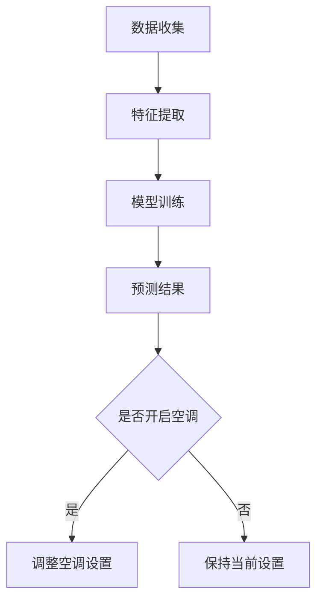
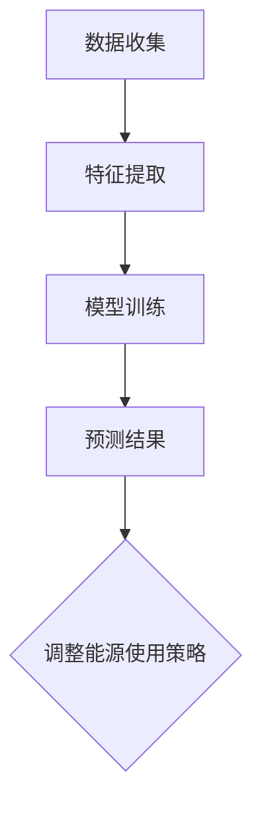
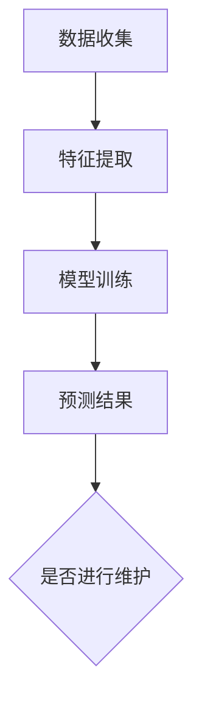
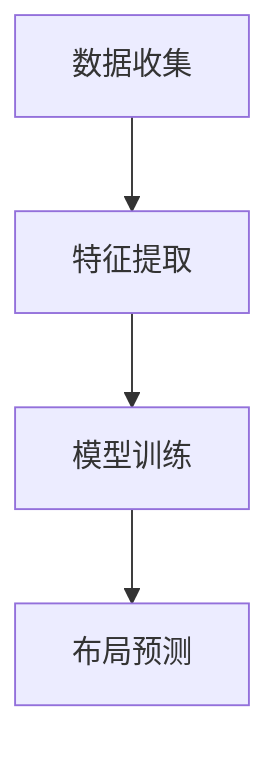
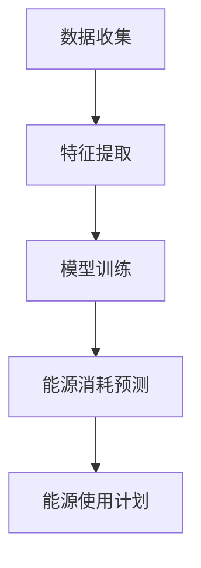
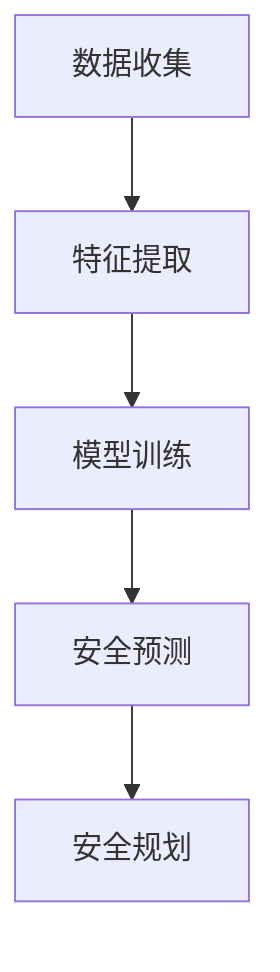

                 

# AIGC在智能家居场景预测与规划中的应用

> 关键词：AIGC、智能家居、预测、规划、人工智能

> 摘要：本文将探讨AIGC（AI Generated Content）在智能家居场景中的预测与规划应用。通过分析AIGC的核心技术、智能家居的发展背景及其面临的挑战，我们将深入探讨AIGC如何通过预测与规划，提升智能家居系统的智能化水平，实现更高效、便捷的家居生活。

## 1.6 智能家居的发展背景与趋势

### 1.6.1 物联网技术与智能家居

#### 1.6.1.1 物联网技术的核心原理

物联网（Internet of Things，简称IoT）通过将各种设备连接到互联网，实现设备之间的数据交换和协同工作。物联网技术的核心原理包括三个层次：感知层、网络层和应用层。

- **感知层**：通过传感器和设备收集数据，如温度、湿度、光照、声音等。
- **网络层**：负责数据传输，包括无线通信、有线通信等。
- **应用层**：利用感知层和网络层收集的数据进行智能分析和处理，实现特定的应用场景。

#### 1.6.1.2 物联网技术在智能家居中的应用

在智能家居中，物联网技术被广泛应用于各种设备，如智能灯泡、智能插座、智能门锁等。用户可以通过手机APP或其他智能设备远程控制这些设备，提高生活便利性。

### 1.6.2 人工智能与智能家居

#### 1.6.2.1 人工智能的核心技术

人工智能（Artificial Intelligence，简称AI）是智能家居实现智能化的重要技术。人工智能的核心技术包括机器学习、深度学习、自然语言处理等。

- **机器学习**：通过训练模型，使计算机能够从数据中学习并做出预测。
- **深度学习**：模拟人脑神经网络，通过多层神经元的组合，实现复杂的非线性映射。
- **自然语言处理**：使计算机能够理解和生成自然语言，实现人机交互。

#### 1.6.2.2 人工智能在智能家居中的应用

人工智能在智能家居中的应用非常广泛，如智能语音助手、智能安防、智能节能等。通过人工智能技术，智能家居系统能够更好地理解用户需求，提供个性化服务。

### 1.6.3 大数据分析与智能家居

#### 1.6.3.1 大数据技术的核心原理

大数据（Big Data）是指无法在一定时间范围内用常规软件工具进行捕捉、管理和处理的数据集合。大数据技术的核心原理包括数据采集、数据存储、数据处理和数据挖掘。

- **数据采集**：通过各种设备收集数据。
- **数据存储**：使用分布式存储系统存储海量数据。
- **数据处理**：使用分布式计算框架处理数据。
- **数据挖掘**：从海量数据中提取有价值的信息。

#### 1.6.3.2 大数据在智能家居中的应用

大数据在智能家居中的应用主要体现在个性化推荐、故障预测、节能优化等方面。通过分析用户的日常行为数据，智能家居系统能够提供更个性化的服务；通过预测设备的故障风险，智能家居系统可以提前进行维护。

### 1.6.4 智能家居的安全与隐私保护

随着智能家居设备的普及，家庭安全和用户隐私保护成为越来越重要的问题。为了确保智能家居系统的安全与隐私保护，需要采取一系列措施，如数据加密、设备认证、访问控制等。

### 1.6.5 智能家居的未来发展趋势

随着技术的不断进步，智能家居在未来将会呈现出更多新的发展趋势。智能化、物联网化、个性化、安全化等趋势将为智能家居带来更广阔的发展空间。

## 2.1 AIGC在智能家居中的应用原理

### 2.1.1 AIGC概述

AIGC（AI Generated Content）是指利用人工智能技术生成的内容。在智能家居场景中，AIGC可以应用于预测与规划，提升智能家居系统的智能化水平。

### 2.1.2 AIGC的核心技术

AIGC的核心技术主要包括自然语言处理、机器学习、深度学习等。

- **自然语言处理**：使计算机能够理解和生成自然语言，实现人机交互。
- **机器学习**：通过训练模型，使计算机能够从数据中学习并做出预测。
- **深度学习**：模拟人脑神经网络，实现复杂的非线性映射。

### 2.1.3 AIGC在智能家居中的应用场景

AIGC在智能家居中的应用场景主要包括：

- **智能语音助手**：通过自然语言处理技术，实现用户与智能家居系统的交互。
- **设备预测与规划**：通过机器学习和深度学习技术，预测设备的使用情况，进行合理的规划。
- **个性化服务**：通过分析用户行为数据，提供个性化的服务。

## 2.2 AIGC在智能家居预测中的应用

### 2.2.1 设备使用预测

通过AIGC技术，可以预测智能家居设备的使用情况。例如，预测用户何时需要开启空调、关闭照明等。预测模型可以根据历史数据、用户行为数据等训练得到。

### 2.2.2 能源消耗预测

AIGC技术可以预测智能家居设备的能源消耗情况，为节能优化提供数据支持。例如，预测用户何时需要开启空调、关闭照明等，从而降低能源消耗。

### 2.2.3 故障预测

通过AIGC技术，可以预测智能家居设备的故障风险，提前进行维护，避免设备故障带来的不便。

## 2.3 AIGC在智能家居规划中的应用

### 2.3.1 设备布局规划

AIGC技术可以基于用户行为数据，为用户规划智能家居设备的布局。例如，将智能插座安装在用户常用的电器旁边，提高使用便捷性。

### 2.3.2 能源规划

AIGC技术可以基于用户行为数据和能源消耗预测，为用户规划能源使用策略，降低能源消耗。

### 2.3.3 安全规划

AIGC技术可以基于用户行为数据和安防需求，为用户规划智能家居系统的安防策略，提高家庭安全。

## 2.4 AIGC在智能家居预测与规划中的挑战

### 2.4.1 数据质量

AIGC技术依赖于高质量的数据进行预测和规划。因此，如何收集、处理和存储高质量数据成为AIGC在智能家居预测与规划中的关键挑战。

### 2.4.2 模型解释性

AIGC技术生成的预测和规划结果往往具有较高的准确性，但缺乏解释性。如何提高模型的可解释性，使用户能够理解预测和规划结果，是AIGC在智能家居预测与规划中的另一个挑战。

### 2.4.3 模型泛化能力

AIGC技术需要在不同场景、不同用户群体中具有泛化能力。如何提高模型的泛化能力，使AIGC技术在不同场景下都能发挥作用，是AIGC在智能家居预测与规划中的另一个挑战。

## 2.5 AIGC在智能家居预测与规划中的应用前景

随着人工智能技术的不断发展，AIGC在智能家居预测与规划中的应用前景非常广阔。通过AIGC技术，智能家居系统可以更加智能化、个性化，为用户提供更高效、便捷的家居生活。

### 2.5.1 智能家居设备使用预测

通过AIGC技术，智能家居设备使用预测将更加准确。用户可以根据预测结果，提前安排家居设备的使用，提高生活便利性。

### 2.5.2 智能家居设备布局规划

通过AIGC技术，智能家居设备布局规划将更加合理。设备布局将根据用户行为数据进行优化，提高使用便捷性。

### 2.5.3 智能家居能源规划

通过AIGC技术，智能家居能源规划将更加科学。能源消耗预测将帮助用户合理分配能源，降低能源消耗。

### 2.5.4 智能家居安全规划

通过AIGC技术，智能家居安全规划将更加完善。安全预测和规划将帮助用户提高家庭安全，防止意外事故的发生。

## 2.6 本章小结

本文介绍了AIGC在智能家居场景中的预测与规划应用。通过分析AIGC的核心技术、智能家居的发展背景及其面临的挑战，我们深入探讨了AIGC如何通过预测与规划，提升智能家居系统的智能化水平，实现更高效、便捷的家居生活。未来，随着人工智能技术的不断发展，AIGC在智能家居中的应用前景将更加广阔。

## 作者：AI天才研究院/AI Genius Institute & 禅与计算机程序设计艺术 /Zen And The Art of Computer Programming

在未来的智能家居发展中，AIGC（AI Generated Content）技术将发挥越来越重要的作用。通过预测与规划，AIGC技术可以帮助智能家居系统更加智能化、个性化，为用户提供更高效、便捷的家居生活。本文通过对AIGC在智能家居场景中的预测与规划应用进行分析，探讨了AIGC技术如何通过智能化预测和合理规划，提升智能家居系统的整体性能和用户体验。同时，本文也提出了AIGC在智能家居预测与规划中面临的挑战，为未来的研究和应用提供了方向。

### 2.1 AIGC在智能家居中的应用原理

#### 2.1.1 AIGC概述

AIGC（AI Generated Content）是指利用人工智能技术自动生成内容的技术。在智能家居场景中，AIGC技术可以应用于智能预测和规划，从而提升系统的智能化水平。AIGC的核心技术包括自然语言处理、机器学习、深度学习等。这些技术使得AIGC能够从大量的数据中学习规律，生成预测结果，并对智能家居系统进行合理规划。

#### 2.1.2 AIGC的核心技术

1. **自然语言处理（NLP）**：
   自然语言处理是AIGC技术的关键组成部分，它使计算机能够理解和生成人类语言。在智能家居中，NLP技术可以用于智能语音助手，理解用户指令并执行相应操作。

2. **机器学习（ML）**：
   机器学习是AIGC技术的基础，它通过训练模型来学习数据中的模式，从而进行预测和决策。在智能家居中，机器学习可以用于预测用户行为，如何时需要开灯或调整室内温度。

3. **深度学习（DL）**：
   深度学习是一种特殊的机器学习技术，通过构建深度神经网络来模拟人脑的学习过程。在智能家居中，深度学习可以用于复杂模式的识别和预测，如设备故障预测和能源消耗预测。

#### 2.1.3 AIGC在智能家居中的应用场景

1. **智能语音助手**：
   智能语音助手是AIGC技术在智能家居中的典型应用。用户可以通过语音指令控制家居设备，如开关灯光、调节空调温度等。AIGC技术使得语音助手能够理解自然语言，实现自然的人机交互。

2. **设备使用预测**：
   AIGC技术可以通过分析历史数据和使用模式来预测设备的使用情况。例如，预测用户何时需要开启空调或关闭电视，从而提前调整设备状态。

3. **能源消耗预测**：
   通过分析用户的日常活动和设备使用情况，AIGC技术可以预测家庭的能源消耗。这有助于优化能源使用，降低能耗，实现节能目标。

4. **故障预测与维护规划**：
   AIGC技术可以预测设备的故障风险，并提供维护建议。例如，预测某个智能插座可能在未来几周内发生故障，并提供更换的建议。

5. **个性化服务推荐**：
   AIGC技术可以根据用户的行为和偏好，提供个性化的家居服务推荐。例如，根据用户的睡眠模式推荐最佳睡眠环境设置。

### 2.1.4 AIGC在智能家居中的优势

- **高效性**：AIGC技术能够快速处理大量数据，进行高效预测和规划。
- **个性化**：AIGC技术可以根据用户的个性化需求，提供定制化的服务。
- **适应性**：AIGC技术能够适应不断变化的环境和用户需求，进行实时调整。

### 2.1.5 AIGC在智能家居中的挑战

- **数据质量**：AIGC的预测和规划依赖于高质量的数据。数据的不准确或不完整会影响AIGC的性能。
- **隐私保护**：智能家居系统收集的用户数据可能涉及隐私问题。如何保护用户隐私是AIGC应用中的一个重要挑战。
- **模型解释性**：深度学习模型通常难以解释，这可能会影响用户对AIGC系统的信任。

### 2.1.6 AIGC在智能家居中的未来发展方向

- **增强交互性**：通过改进自然语言处理技术，提高AIGC与用户的交互体验。
- **提升预测准确性**：通过不断优化机器学习和深度学习模型，提高预测的准确性。
- **加强隐私保护**：通过改进数据加密和隐私保护技术，确保用户数据的安全。
- **跨平台整合**：实现AIGC技术在不同智能家居平台和设备上的无缝整合，提供统一的用户体验。

通过上述分析，我们可以看到AIGC技术在智能家居中的应用前景广阔。未来，随着人工智能技术的不断发展，AIGC将在智能家居场景中发挥更大的作用，为用户提供更加智能化、个性化的家居生活体验。

### 2.2 AIGC在智能家居预测中的应用

#### 2.2.1 设备使用预测

在智能家居中，设备使用预测是一个关键应用场景。通过AIGC技术，我们可以预测用户何时会使用特定的设备，从而优化设备的能量消耗和操作。以下是一个设备使用预测的例子：

**场景**：预测用户何时会开启空调。

**方法**：

1. **数据收集**：收集用户的历史数据，包括天气预报、用户活动记录、室内温度等。
2. **特征提取**：从历史数据中提取特征，如温度变化、用户活动模式等。
3. **模型训练**：使用机器学习算法，如随机森林或深度学习模型，训练预测模型。
4. **预测**：利用训练好的模型，预测未来一段时间内用户开启空调的时间点。

**算法流程**：

通过上述流程，智能家居系统可以提前预测用户何时需要开启空调，并提前调整空调设置，提高用户体验。

#### 2.2.2 能源消耗预测

能源消耗预测是智能家居中另一个重要的应用场景。通过预测家庭的能源消耗，智能家居系统可以优化能源使用，降低能源成本，减少对环境的影响。

**方法**：

1. **数据收集**：收集家庭的能源消耗数据，包括电力、燃气、水等。
2. **特征提取**：提取影响能源消耗的特征，如天气、用户活动模式、设备使用频率等。
3. **模型训练**：使用机器学习算法，如线性回归或神经网络，训练能源消耗预测模型。
4. **预测**：利用训练好的模型，预测未来的能源消耗。

**算法流程**：

通过能源消耗预测，智能家居系统可以提前调整家庭的能源使用策略，如关闭不使用的电器，调整照明亮度等，从而实现节能目标。

#### 2.2.3 故障预测

故障预测是智能家居中确保设备稳定运行的重要应用。通过预测设备可能出现的问题，智能家居系统可以提前进行维护，避免设备故障带来的不便。

**方法**：

1. **数据收集**：收集设备的运行数据，包括温度、湿度、电流等。
2. **特征提取**：提取设备的健康指标，如运行时间、故障历史等。
3. **模型训练**：使用机器学习算法，如K最近邻或支持向量机，训练故障预测模型。
4. **预测**：利用训练好的模型，预测设备未来的故障风险。

**算法流程**：

通过故障预测，智能家居系统可以提前识别设备可能出现的故障，并建议用户进行预防性维护，如更换电池、清洁过滤器等，从而延长设备寿命。

#### 2.2.4 实际案例

以某智能家居系统为例，该系统通过AIGC技术实现了设备使用预测、能源消耗预测和故障预测。

- **设备使用预测**：系统预测用户何时需要开启空调，并提前调整空调温度，提高用户舒适度。
- **能源消耗预测**：系统预测家庭的能源消耗，并建议用户在高峰时段减少电器使用，降低能源成本。
- **故障预测**：系统预测设备的故障风险，并建议用户进行预防性维护，确保设备稳定运行。

通过这些实际应用，AIGC技术为智能家居系统提供了智能化的预测和规划能力，提高了系统的用户体验和能源效率。

### 2.3 AIGC在智能家居规划中的应用

#### 2.3.1 设备布局规划

设备布局规划是智能家居规划中的一个重要环节。通过AIGC技术，我们可以根据用户的行为数据和家居环境，为用户规划最佳的设备布局。

**方法**：

1. **数据收集**：收集用户的行为数据，如经常使用的房间、活动时间等。
2. **特征提取**：提取影响设备布局的特征，如房间大小、家具位置等。
3. **模型训练**：使用机器学习算法，如决策树或神经网络，训练设备布局规划模型。
4. **预测**：利用训练好的模型，预测最佳的设备布局。

**算法流程**：

通过设备布局规划，智能家居系统可以为用户推荐最佳的设备布局方案，如将智能插座安装在用户经常使用的电器旁边，提高使用便捷性。

#### 2.3.2 能源规划

能源规划是智能家居中实现节能目标的重要手段。通过AIGC技术，我们可以根据用户的行为数据和能源消耗模式，为用户制定最佳的能源使用计划。

**方法**：

1. **数据收集**：收集用户的能源消耗数据，如电、水、燃气等。
2. **特征提取**：提取影响能源消耗的特征，如天气、用户活动模式等。
3. **模型训练**：使用机器学习算法，如线性回归或深度学习模型，训练能源规划模型。
4. **预测**：利用训练好的模型，预测未来的能源消耗，并制定能源使用计划。

**算法流程**：

通过能源规划，智能家居系统可以为用户制定最佳的能源使用计划，如建议在高峰时段减少电器使用，调整照明亮度等，从而降低能源成本。

#### 2.3.3 安全规划

安全规划是智能家居中确保家庭安全的重要环节。通过AIGC技术，我们可以根据用户的行为数据和安全隐患，为用户制定最佳的安全规划。

**方法**：

1. **数据收集**：收集用户的行为数据，如夜间活动、外出习惯等。
2. **特征提取**：提取影响家庭安全的风险因素，如入侵检测、火灾预警等。
3. **模型训练**：使用机器学习算法，如支持向量机或深度学习模型，训练安全规划模型。
4. **预测**：利用训练好的模型，预测家庭可能存在的安全隐患，并制定安全规划。

**算法流程**：

通过安全规划，智能家居系统可以为用户制定最佳的安全方案，如建议安装摄像头、门锁等设备，提高家庭安全性。

#### 2.3.4 实际案例

以某智能家居系统为例，该系统通过AIGC技术实现了设备布局规划、能源规划和安全规划。

- **设备布局规划**：系统根据用户的习惯和房间特点，为用户推荐最佳的设备布局方案，如将智能插座安装在用户经常使用的电器旁边。
- **能源规划**：系统根据用户的能源消耗数据和天气情况，为用户制定最佳的能源使用计划，如建议在高峰时段减少电器使用。
- **安全规划**：系统根据用户的习惯和安全数据，为用户推荐最佳的安全设备安装方案，如建议安装摄像头和门锁等。

通过这些实际应用，AIGC技术为智能家居系统提供了智能化的规划能力，提高了系统的用户体验和安全性。

### 2.4 AIGC在智能家居预测与规划中的挑战

尽管AIGC技术在智能家居预测与规划中具有巨大的潜力，但其在实际应用中仍面临一些挑战。

#### 2.4.1 数据质量

AIGC的预测和规划依赖于高质量的数据。数据的不准确或不完整会影响AIGC的性能。因此，如何确保数据质量是一个关键挑战。

**解决方案**：

- **数据清洗**：对原始数据进行清洗，去除错误和异常数据。
- **数据验证**：建立数据验证机制，确保数据的准确性和完整性。

#### 2.4.2 模型解释性

AIGC技术，特别是深度学习模型，通常难以解释。这可能会影响用户对系统的信任。因此，提高模型的可解释性是一个重要挑战。

**解决方案**：

- **可解释性模型**：使用可解释性更强的机器学习模型，如决策树。
- **模型可视化**：通过可视化工具，展示模型的决策过程。

#### 2.4.3 模型泛化能力

AIGC技术需要在不同场景、不同用户群体中具有泛化能力。如何提高模型的泛化能力是一个关键挑战。

**解决方案**：

- **交叉验证**：使用交叉验证方法，评估模型的泛化能力。
- **迁移学习**：利用已训练好的模型，在新场景中快速适应。

#### 2.4.4 隐私保护

智能家居系统收集的用户数据可能涉及隐私问题。如何保护用户隐私是一个重要挑战。

**解决方案**：

- **数据加密**：对用户数据进行加密，确保数据安全。
- **隐私保护机制**：建立隐私保护机制，如匿名化处理。

#### 2.4.5 系统稳定性

AIGC技术需要稳定的系统环境来运行。如何确保系统的稳定性是一个关键挑战。

**解决方案**：

- **系统监控**：建立系统监控机制，及时发现并解决系统问题。
- **容错设计**：设计容错系统，确保在系统故障时仍能正常运行。

通过上述解决方案，我们可以逐步克服AIGC在智能家居预测与规划中面临的挑战，实现更高效、更可靠的智能家居系统。

### 2.5 AIGC在智能家居预测与规划中的应用前景

随着人工智能技术的不断发展，AIGC在智能家居预测与规划中的应用前景十分广阔。以下是一些未来可能的发展方向：

#### 2.5.1 预测准确性提升

随着数据集的增加和算法的优化，AIGC技术的预测准确性将进一步提升。通过引入更多的数据源和更复杂的模型，智能家居系统可以更准确地预测用户需求和行为。

#### 2.5.2 个性化服务增强

AIGC技术将更加个性化，能够根据用户的行为和偏好，提供更加定制化的预测和规划服务。例如，根据用户的睡眠习惯，自动调整卧室的灯光和温度。

#### 2.5.3 跨平台整合

随着智能家居设备的多样化，AIGC技术将在不同平台和设备上实现跨平台整合，提供统一的用户体验。无论是智能手机、智能音箱还是智能电视，用户都可以通过AIGC技术享受智能家居带来的便利。

#### 2.5.4 系统智能化

AIGC技术将使智能家居系统更加智能化，能够自动学习和适应用户的需求。例如，系统能够根据用户的行为模式，自动调整设备的设置，提高家居生活的舒适度。

#### 2.5.5 安全性增强

随着AIGC技术在智能家居中的应用，系统的安全性将得到增强。通过引入更高级的加密技术和安全机制，智能家居系统能够更好地保护用户隐私和数据安全。

总之，随着人工智能技术的不断进步，AIGC在智能家居预测与规划中的应用前景将越来越广阔。通过提升预测准确性、增强个性化服务、实现跨平台整合、提高系统智能化和增强安全性，AIGC将为智能家居带来更加智能化、便捷化和安全化的生活体验。

### 2.6 本章小结

本章详细探讨了AIGC在智能家居场景中的预测与规划应用。通过分析AIGC的核心技术，我们了解了自然语言处理、机器学习和深度学习在智能家居中的应用场景。我们探讨了设备使用预测、能源消耗预测和故障预测等具体应用，并展示了设备布局规划、能源规划和安全规划的方法。同时，我们也分析了AIGC在智能家居预测与规划中面临的挑战，并提出了解决方案。展望未来，随着人工智能技术的不断进步，AIGC将在智能家居中发挥越来越重要的作用，为用户提供更加智能化、个性化的家居生活体验。

### 2.7 最佳实践与注意事项

在应用AIGC技术进行智能家居预测与规划时，以下是一些最佳实践和注意事项：

#### 2.7.1 数据质量控制

- **数据清洗**：在数据处理过程中，要确保数据的准确性和完整性。去除错误数据、异常值和重复数据，以提高数据质量。
- **数据多样性**：收集多样化的数据，包括用户行为数据、设备运行数据和环境数据，以便更准确地预测和规划。
- **数据加密**：对用户数据进行加密处理，确保数据传输和存储过程中的安全性。

#### 2.7.2 模型选择与优化

- **模型选择**：根据具体应用场景，选择合适的机器学习模型。例如，对于设备使用预测，可以选择线性回归或随机森林模型；对于故障预测，可以选择K最近邻或支持向量机模型。
- **模型优化**：通过调整模型的参数，优化模型的性能。例如，调整学习率、正则化参数等，以提高模型的预测准确性。

#### 2.7.3 模型解释性

- **可视化**：使用可视化工具，展示模型的决策过程和预测结果，帮助用户理解模型的工作原理。
- **可解释性模型**：选择可解释性更强的模型，如决策树或LIME（Local Interpretable Model-agnostic Explanations），以提高模型的可理解性。

#### 2.7.4 系统安全性

- **数据加密**：对用户数据进行加密处理，确保数据传输和存储过程中的安全性。
- **访问控制**：实施严格的访问控制策略，确保只有授权用户可以访问敏感数据。
- **安全审计**：定期进行安全审计，检查系统的安全漏洞，并及时进行修复。

#### 2.7.5 用户隐私保护

- **隐私保护机制**：建立隐私保护机制，如数据匿名化、差分隐私等，确保用户隐私不被泄露。
- **透明度**：向用户解释数据处理和预测的流程，提高用户的信任度。

通过遵循这些最佳实践和注意事项，我们可以确保AIGC技术在智能家居预测与规划中的安全性和可靠性，为用户提供更好的服务。

### 2.8 拓展阅读

对于希望深入了解AIGC在智能家居预测与规划中应用的人，以下是一些推荐阅读材料：

1. **书籍**：
   - 《人工智能：一种现代方法》（第三版），作者：Stuart Russell 和 Peter Norvig。
   - 《深度学习》（第二版），作者：Ian Goodfellow、Yoshua Bengio 和 Aaron Courville。

2. **论文**：
   - "Deep Learning for Time Series Classification: A Review"，作者：Minh N. Dung et al.。
   - "A Survey on Internet of Things Security and Privacy Challenges"，作者：Said Chebotar et al.。

3. **在线课程**：
   - "机器学习 specialization"（吴恩达，Coursera）。
   - "深度学习 specialization"（Andrew Ng，Coursera）。

通过阅读这些材料，可以更深入地了解人工智能和智能家居的相关知识，为实际应用提供理论支持。

