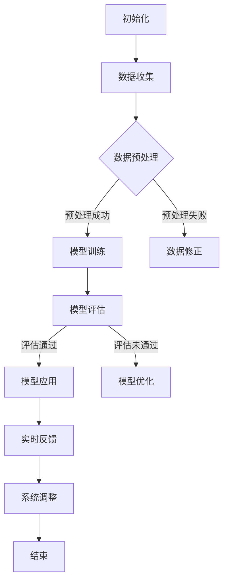
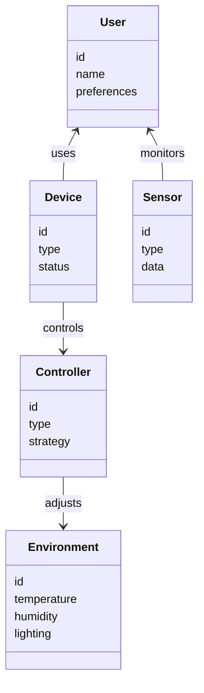
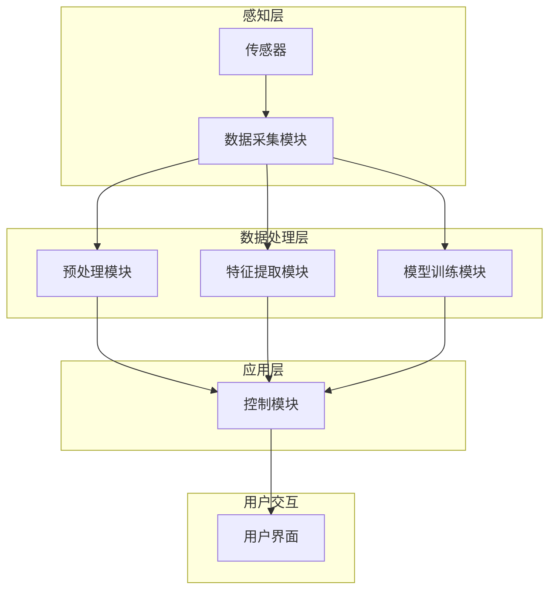
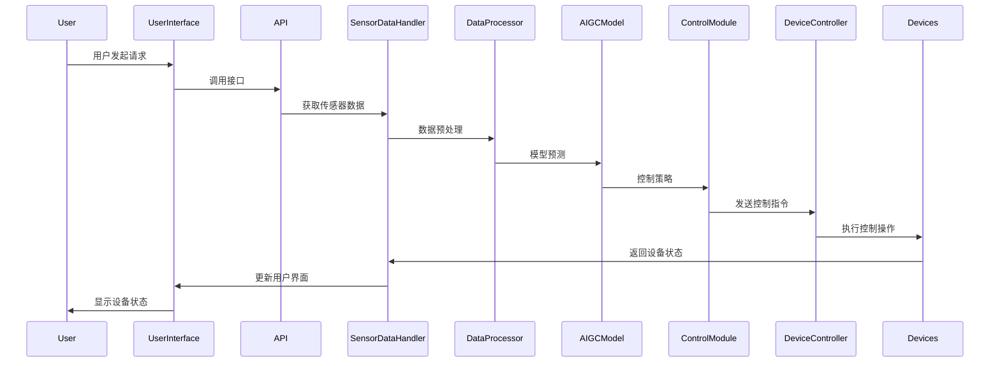

                 


### 撰写技术博客文章

撰写一篇高质量的技术博客文章，首先需要确定文章的主题和结构。以下是具体的步骤：

**第一步：确定主题**

主题是文章的核心，决定了文章的读者群体和内容方向。以“AIGC在智能家居设备控制中的应用”为例，我们可以确定以下几个核心关键词：

- **AIGC**：自适应智能生成计算（Adaptive Intelligent Generation Computing）
- **智能家居设备控制**：家庭自动化技术
- **算法**：机器学习、深度学习
- **系统设计**：软件架构、系统接口、交互流程
- **实践案例**：智能照明控制、智能安防

**第二步：撰写摘要**

摘要是对文章核心内容和主题思想的简短总结。以下是一个可能的摘要：

“本文将探讨AIGC在智能家居设备控制中的应用。首先介绍AIGC的基本概念和智能家居的发展现状，接着深入分析AIGC在智能家居设备控制中的核心算法和系统设计，通过实际案例展示其应用效果，并总结最佳实践技巧和展望未来发展趋势。”

**第三步：制定文章结构**

文章结构是文章内容的框架，确保文章条理清晰、逻辑严谨。以下是文章的目录大纲：

1. **背景和基础**
   - AIGC与智能家居概述
   - 智能家居设备控制的挑战与机遇
   - AIGC在智能家居设备控制中的应用前景

2. **核心算法**
   - AIGC算法概述
   - 关键算法原理与流程图
   - 算法实现与Python源代码讲解
   - 算法应用实例

3. **系统设计与实现**
   - 系统背景与项目介绍
   - 系统功能设计
   - 系统架构设计
   - 系统接口设计
   - 系统交互流程

4. **最佳实践**
   - 实践案例1：智能照明控制系统
   - 实践案例2：智能安防系统
   - 最佳实践技巧与建议

5. **挑战与展望**
   - 挑战分析
   - 展望未来

6. **未来之路**
   - 整体回顾
   - 注意事项
   - 拓展阅读

**第四步：撰写正文**

每个章节的内容需要详细具体，确保逻辑清晰、易于理解。以下是对正文内容的简要概述：

**1. 背景和基础**
- **AIGC与智能家居概述**：介绍AIGC的定义、关键技术，智能家居的发展现状和未来趋势。
- **智能家居设备控制的挑战与机遇**：分析智能家居设备控制面临的问题，如稳定性、安全性、数据隐私等，以及AIGC带来的机遇。

**2. 核心算法**
- **AIGC算法概述**：介绍AIGC算法的基本概念、原理和分类。
- **关键算法原理与流程图**：使用Mermaid流程图展示算法的基本原理和流程。
- **算法实现与Python源代码讲解**：通过Python源代码实现算法，并详细讲解算法的数学模型和公式。
- **算法应用实例**：通过具体案例展示算法在智能家居设备控制中的实际应用效果。

**3. 系统设计与实现**
- **系统背景与项目介绍**：介绍智能家居设备控制系统的应用场景和项目目标。
- **系统功能设计**：使用Mermaid类图展示系统的领域模型。
- **系统架构设计**：使用Mermaid架构图展示系统的整体架构。
- **系统接口设计**：详细描述系统的接口规范和实现。
- **系统交互流程**：使用Mermaid序列图展示系统的交互流程。

**4. 最佳实践**
- **实践案例1：智能照明控制系统**：分析智能照明控制系统的设计实现和效果评估。
- **实践案例2：智能安防系统**：探讨智能安防系统的设计方法和案例分析。
- **最佳实践技巧与建议**：总结最佳实践技巧和注意事项。

**5. 挑战与展望**
- **挑战分析**：分析AIGC在智能家居设备控制中面临的挑战。
- **展望未来**：探讨AIGC在智能家居设备控制中的发展趋势和应用前景。

**6. 未来之路**
- **整体回顾**：回顾文章的主要内容，总结研究成果。
- **注意事项**：提醒读者关注的安全问题、数据隐私和系统稳定性。
- **拓展阅读**：推荐相关书籍、学术论文和在线资源。

**第五步：撰写结语和作者信息**

结语部分可以简短总结文章的核心观点，表达对读者的期望。最后，需要注明作者信息，例如：

“作者：AI天才研究院/AI Genius Institute & 禅与计算机程序设计艺术 /Zen And The Art of Computer Programming”

**第六步：审阅和修订**

在完成初稿后，进行审阅和修订，确保文章的逻辑性、准确性、可读性。可以请同行或朋友帮忙审阅，提出修改建议。

**第七步：发布和推广**

将修订后的文章发布到技术博客、论坛或其他平台上，并通过社交媒体等渠道进行推广，吸引更多的读者关注。

### 根据上述步骤，我们现在可以开始撰写具体的文章内容。接下来，我们将按照目录大纲逐章撰写，确保文章的完整性、逻辑性和专业性。”

### 第1章: AIGC与智能家居概述

#### 1.1 AIGC的基本概念

AIGC（自适应智能生成计算）是一种新兴的计算模式，它结合了人工智能、机器学习和自动化技术，以实现高度自适应的计算能力。AIGC的核心在于“自适应”，即系统能够根据输入数据的特征和环境的变化，自动调整自身的计算策略和算法。

AIGC的几个关键组成部分包括：

- **数据驱动的模型**：通过大量数据进行训练，使得模型能够自动学习和优化，提高决策的准确性。
- **自适应算法**：算法能够根据实际应用场景的需求，自动调整参数和策略，以实现最优的运行效果。
- **实时反馈机制**：系统能够实时收集数据，并根据反馈结果进行动态调整。

AIGC与传统的计算模式相比，具有以下优势：

- **高适应性**：能够根据不同场景和需求进行自适应调整，满足多样化的应用需求。
- **高效性**：通过自动化和智能化的手段，提高计算效率和准确性。
- **灵活性**：能够快速适应新的技术和算法，实现持续的创新和改进。

#### 1.2 智能家居的发展现状

智能家居作为物联网（IoT）的一个重要分支，近年来得到了快速发展。当前，智能家居市场呈现出以下几个显著特点：

- **设备多样化**：从最初的智能灯泡、智能插座，到现在的智能电视、智能空调、智能门锁等，智能家居设备种类日益丰富。
- **生态整合**：各大科技公司和传统家电厂商纷纷布局智能家居市场，形成各自独特的生态系统，推动智能家居产品的一体化整合。
- **用户体验优化**：智能家居产品不断优化用户界面和交互方式，提高用户使用的便捷性和舒适度。
- **数据交互与共享**：智能家居设备之间能够实现数据的互联互通，实现智能家居系统的整体协同效应。

然而，智能家居的发展也面临着一些挑战：

- **安全性**：智能家居设备普遍连接到互联网，成为网络攻击的目标。如何保障设备的安全性和数据隐私，是当前面临的一个重要问题。
- **稳定性**：智能家居系统需要保证长时间稳定运行，避免因设备故障或网络问题导致用户体验下降。
- **标准化**：智能家居市场缺乏统一的标准，导致不同品牌和设备的兼容性问题。

#### 1.3 AIGC在智能家居设备控制中的作用

AIGC在智能家居设备控制中扮演着至关重要的角色，能够解决许多当前面临的挑战。以下是AIGC在智能家居设备控制中的作用：

- **提升用户体验**：通过自适应调整，AIGC能够根据用户的行为和偏好，提供个性化的智能家居服务，提升用户的使用体验。
- **优化设备性能**：AIGC能够通过实时分析和优化，提高智能家居设备的运行效率，延长设备寿命。
- **增强安全性**：通过智能化的安全策略，AIGC能够实时监控和应对潜在的安全威胁，保障智能家居系统的安全性。
- **促进生态整合**：AIGC能够促进不同设备和系统之间的数据共享和协同工作，推动智能家居生态的整合和发展。

#### 1.4 AIGC在智能家居设备控制中的应用前景

随着技术的不断进步和智能家居市场的快速发展，AIGC在智能家居设备控制中的应用前景十分广阔。以下是AIGC在智能家居设备控制中的几个潜在应用领域：

- **智能照明控制**：通过AIGC，实现自适应调整照明强度、颜色和场景模式，提供个性化的照明体验。
- **智能安防系统**：利用AIGC，实现实时监控、智能预警和自动化响应，提高家庭安全水平。
- **智能家电控制**：通过AIGC，实现智能家居设备的智能化管理和优化，提高设备的使用效率和便利性。
- **智能环境监测**：利用AIGC，实时监测室内温度、湿度、空气质量等参数，提供健康舒适的生活环境。

总之，AIGC在智能家居设备控制中的应用，将极大地提升智能家居的智能化水平，为用户带来更加便捷、高效和安全的家居生活体验。未来，随着技术的不断发展和市场的进一步成熟，AIGC在智能家居领域的应用将更加广泛和深入。

#### 1.4.1 潜在应用领域

AIGC在智能家居设备控制中的应用前景非常广阔，其潜在应用领域包括但不限于以下几个方面：

1. **智能照明控制**：AIGC可以通过分析用户的行为模式和生活习惯，自适应地调整照明设备的亮度、色温和场景模式。例如，当用户进入房间时，AIGC可以根据室内的光线强度和用户的偏好，自动开启照明设备，并调整到合适的亮度。此外，AIGC还可以根据用户的日程安排和活动模式，智能预置照明场景，如晨间唤醒模式、晚餐模式等。

2. **智能安防系统**：AIGC能够显著提升智能安防系统的响应速度和准确性。通过实时分析摄像头捕捉到的图像和数据，AIGC可以识别异常行为，如入侵、火灾等，并及时发出警报。此外，AIGC还可以进行人脸识别和身份验证，提高家庭安全的智能防护水平。

3. **智能家电控制**：AIGC可以实现智能家电的智能管理和优化，提高家电的使用效率和用户体验。例如，智能空调可以根据室内的温度和湿度，自动调整制冷或加热模式，提供舒适的生活环境。智能洗衣机可以根据衣物的种类和数量，智能设置洗涤程序，节约用水和能源。

4. **智能环境监测**：AIGC能够实时监测室内外环境参数，如温度、湿度、空气质量、噪音等，并根据监测结果，自动调整家居设备的运行状态。例如，当空气质量变差时，AIGC可以自动开启空气净化器，提高室内空气质量。

5. **智能语音交互**：AIGC可以通过自然语言处理技术，实现智能家居设备的智能语音交互。用户可以通过语音命令控制家居设备，如调节灯光、播放音乐、设置温度等。AIGC能够理解用户的语音指令，并快速响应，提高用户使用的便捷性。

6. **智能健康管理**：AIGC可以分析用户的健康数据，如心率、血压、睡眠质量等，提供个性化的健康建议和预警。例如，当用户的心率异常升高时，AIGC可以提醒用户注意健康问题，并建议进行相应的医疗检查。

7. **智能能源管理**：AIGC可以通过分析家庭的能源使用数据，优化能源使用策略，提高能源利用效率。例如，智能电表可以通过AIGC分析用户的用电习惯，制定节能计划，降低家庭的用电成本。

总之，AIGC在智能家居设备控制中的应用前景十分广阔，它不仅能够提高智能家居系统的智能化水平，还能提升用户的生活质量，为未来的智能家居生活奠定基础。

#### 1.4.2 技术发展趋势

随着人工智能技术的不断进步，AIGC在智能家居设备控制中的应用前景愈发广阔。以下是AIGC技术在未来几年内可能的发展趋势：

1. **计算能力的提升**：随着计算硬件性能的提升，AIGC系统的计算能力和处理速度将得到显著增强。这将使得AIGC能够处理更加复杂的数据，支持更多高精度、高响应速度的智能应用。

2. **数据处理的进步**：随着大数据技术的发展，AIGC将能够更好地处理和分析海量数据。通过深度学习和数据挖掘技术，AIGC能够从数据中提取更多有价值的信息，实现更精确的预测和决策。

3. **智能化的提升**：AIGC的智能化水平将不断提高。通过自我学习和自适应调整，AIGC能够更好地理解用户需求，提供个性化的智能家居服务。未来，AIGC可能实现更高程度的智能化，如自我诊断、自我修复和自我优化。

4. **边缘计算的融合**：随着边缘计算技术的发展，AIGC将更加注重在设备端进行数据处理和决策。这不仅能减少对中心化服务器的依赖，提高系统的响应速度和稳定性，还能节省网络带宽和降低延迟。

5. **多模态感知技术的应用**：AIGC将结合多种感知技术，如摄像头、传感器、麦克风等，实现更全面的智能家居感知能力。这将使得AIGC能够更准确地捕捉和解读用户行为和环境变化，提供更加智能化的家居服务。

6. **安全性的增强**：随着智能家居设备连接到互联网，其安全性变得越来越重要。AIGC将在安全方面进行更多的研究和应用，如实现更安全的通信协议、增强数据加密和隐私保护等。

7. **生态整合的加速**：AIGC将促进不同智能家居设备和平台之间的整合。通过标准化接口和协议，实现不同设备和平台之间的无缝连接和协作，提高系统的整体效率和用户体验。

8. **应用场景的扩展**：随着技术的成熟，AIGC将在更多智能家居场景中发挥作用。除了照明、安防、家电控制等传统应用外，AIGC还可能应用于智能家居健康、智能交通、智能能源等领域，实现更加广泛的应用。

总之，AIGC技术的发展趋势将为智能家居设备控制带来更多创新和可能性，进一步提升智能家居的智能化水平，为用户带来更加便捷、舒适和安全的家居生活体验。

#### 1.4.3 社会与经济影响

AIGC在智能家居设备控制中的应用将对社会和经济产生深远的影响：

**对社会的影响**：

1. **生活质量提升**：AIGC能够提供个性化、智能化的家居服务，提升用户的舒适度和便利性，从而改善生活质量。
2. **健康水平提高**：通过智能健康管理，AIGC可以帮助用户监控和管理健康状况，提高健康水平。
3. **生活方式变革**：智能家居设备的应用将改变人们的日常生活习惯，促进家庭生活方式的智能化和现代化。
4. **社会资源配置优化**：智能家居设备的智能化管理有助于优化家庭资源的使用，提高资源利用效率。

**对经济的影响**：

1. **市场规模扩大**：随着AIGC在智能家居设备控制中的应用推广，智能家居市场规模将不断扩大，带来巨大的经济潜力。
2. **产业升级与转型**：智能家居行业的快速发展将推动传统家电产业向智能化、高端化转型，促进产业升级。
3. **就业机会增加**：智能家居设备的研发、生产和维护将创造大量就业机会，促进就业增长。
4. **技术创新推动**：AIGC技术的不断进步将推动相关技术的创新和发展，为经济发展提供新动力。

总之，AIGC在智能家居设备控制中的应用不仅将为用户带来更好的生活体验，还将对整个社会和经济产生积极影响，推动社会的智能化和现代化进程。

#### 1.5 本章小结

本章介绍了AIGC的基本概念、智能家居的发展现状及其在智能家居设备控制中的应用。首先，我们详细阐述了AIGC的定义、关键技术及其优势，并分析了智能家居设备控制面临的挑战与机遇。接着，我们探讨了AIGC在智能家居设备控制中的作用，包括提升用户体验、优化设备性能、增强安全性和促进生态整合。最后，我们展望了AIGC在智能家居设备控制中的应用前景，包括潜在应用领域和技术发展趋势，并分析了其对社会和经济的影响。通过本章的介绍，读者可以全面了解AIGC在智能家居设备控制中的重要性及其广阔的应用前景。

### 第2章: AIGC算法概述

#### 2.1 AIGC算法原理

AIGC（自适应智能生成计算）算法是一种结合了人工智能、机器学习和自动化技术的计算方法，旨在通过自适应调整和优化，实现高度智能化的计算能力。AIGC的核心在于其自适应性，即算法能够根据输入数据和环境的变化，自动调整计算策略和算法参数，以实现最佳的计算效果。

AIGC算法的基本原理包括以下几个方面：

1. **数据驱动的模型**：AIGC算法通过大量数据训练，建立数据驱动的模型，使得模型能够从数据中学习规律和模式，从而提高计算准确性。

2. **自适应算法**：AIGC算法具备自适应能力，能够根据不同的应用场景和数据特征，自动调整算法的参数和策略，实现最优的计算效果。

3. **实时反馈机制**：AIGC算法能够实时收集和处理系统运行数据，并根据反馈结果进行动态调整，以适应环境变化和需求变化。

4. **多模态感知**：AIGC算法能够融合多种数据源，如文本、图像、声音等，通过多模态感知技术，实现更全面和精准的数据分析。

#### 2.2 AIGC算法分类

AIGC算法根据不同的应用场景和实现技术，可以分为以下几类：

1. **基于深度学习的AIGC算法**：深度学习是一种重要的机器学习技术，它通过多层神经网络，对大量数据进行训练，从而实现复杂的数据分析和模式识别。基于深度学习的AIGC算法在图像识别、语音识别、自然语言处理等领域具有广泛应用。

2. **基于强化学习的AIGC算法**：强化学习是一种通过试错和奖励机制，使智能体在环境中学习最优策略的算法。基于强化学习的AIGC算法在决策优化、路径规划、智能控制等领域具有显著优势。

3. **基于遗传算法的AIGC算法**：遗传算法是一种模拟生物进化的优化算法，通过遗传、变异和交叉操作，寻找最优解。基于遗传算法的AIGC算法在组合优化、参数优化、工程设计等领域具有广泛应用。

4. **基于混合智能的AIGC算法**：混合智能算法结合了多种智能技术的优势，如人工神经网络、模糊逻辑、专家系统等，通过融合不同算法的优点，实现更高效和准确的计算。

#### 2.3 AIGC算法发展历史

AIGC算法的发展历程可以追溯到20世纪80年代，当时人工智能和机器学习领域的研究者开始探索如何通过自适应和智能化的方法，提高计算效率和准确性。以下是AIGC算法发展的重要里程碑：

1. **1980年代**：人工神经网络和遗传算法的研究开始兴起，这些算法为后来的AIGC算法奠定了基础。

2. **1990年代**：随着计算机硬件性能的提升，机器学习领域取得了重要突破，支持向量机、决策树、贝叶斯网络等算法相继出现。

3. **2000年代**：深度学习技术的出现，使得AIGC算法取得了显著的进展。深度神经网络（DNN）、卷积神经网络（CNN）、循环神经网络（RNN）等算法在图像识别、语音识别、自然语言处理等领域取得了突破性成果。

4. **2010年代**：随着大数据和云计算的发展，AIGC算法的应用场景不断扩展，从传统的工业制造、金融服务，到智能家居、智能交通、医疗健康等领域。

5. **2020年代**：AIGC算法继续快速发展，结合了多种智能技术，如强化学习、进化计算、多模态感知等，实现更高效、更智能的计算能力。

#### 2.4 本章小结

本章介绍了AIGC算法的基本原理、分类和发展历史。首先，我们详细阐述了AIGC算法的定义、基本原理和关键组成部分。接着，我们分析了AIGC算法的分类，包括基于深度学习、强化学习、遗传算法和混合智能的AIGC算法。最后，我们回顾了AIGC算法的发展历程，从20世纪80年代至今的重要里程碑。通过本章的介绍，读者可以全面了解AIGC算法的基本概念和最新发展，为进一步探讨其在智能家居设备控制中的应用打下基础。

#### 2.2.1 算法原理详解

AIGC（自适应智能生成计算）算法的原理基于自适应、数据驱动和实时反馈三大核心思想。下面我们将详细讲解这些原理：

1. **自适应原理**：
   - **定义**：自适应原理指的是算法能够根据环境变化和需求调整自身的计算策略和参数，以实现最佳的计算效果。
   - **实现**：AIGC算法通过实时监测输入数据和环境变量，使用机器学习技术分析数据特征，自动调整计算模型和参数。例如，当算法检测到用户需求变化时，会自动调整推荐系统中的参数，提供更个性化的推荐结果。

2. **数据驱动原理**：
   - **定义**：数据驱动原理是指算法通过大量数据进行训练和优化，从而提高计算效率和准确性。
   - **实现**：AIGC算法使用大量的历史数据来训练模型，通过机器学习和深度学习技术，从数据中学习规律和模式。例如，在智能家居设备控制中，AIGC算法可以分析用户的使用习惯数据，预测用户的需求，从而实现智能化的设备控制。

3. **实时反馈原理**：
   - **定义**：实时反馈原理是指算法能够实时收集和处理系统的运行数据，并根据反馈结果进行动态调整，以适应环境变化。
   - **实现**：AIGC算法通过传感器和监控模块，实时收集系统的运行数据，使用机器学习和数据分析技术，对数据进行分析和处理。例如，在智能安防系统中，AIGC算法可以实时分析摄像头捕捉到的图像，识别异常行为，并自动触发警报。

#### 2.2.2 Mermaid流程图

为了更直观地展示AIGC算法的基本原理，我们可以使用Mermaid流程图来绘制算法的流程。以下是AIGC算法的基本流程图：



该流程图描述了AIGC算法的基本步骤，包括数据收集、数据预处理、模型训练、模型评估、模型应用、实时反馈和系统调整。通过该流程图，我们可以更清晰地理解AIGC算法的工作原理和实现过程。

#### 2.2.3 算法实现与Python源代码讲解

为了更好地理解AIGC算法的实现过程，我们将通过Python源代码进行详细讲解。以下是一个简单的AIGC算法实现示例：

```python
import numpy as np
from sklearn.linear_model import LinearRegression
from sklearn.model_selection import train_test_split
from sklearn.metrics import mean_squared_error

# 数据集准备
X = np.array([[1, 2], [2, 3], [3, 4], [4, 5]])
y = np.array([1, 3, 2, 5])

# 数据预处理
X_train, X_test, y_train, y_test = train_test_split(X, y, test_size=0.2, random_state=42)

# 模型训练
model = LinearRegression()
model.fit(X_train, y_train)

# 模型评估
y_pred = model.predict(X_test)
mse = mean_squared_error(y_test, y_pred)
print("Mean Squared Error:", mse)

# 模型应用
new_data = np.array([[5, 6]])
new_prediction = model.predict(new_data)
print("New Prediction:", new_prediction)

# 实时反馈与系统调整
# 这里可以根据实际需求，进一步优化模型或调整系统参数
```

在上面的代码中，我们首先准备了一个简单的一元线性回归数据集。接着，我们进行数据预处理，将数据集分为训练集和测试集。然后，我们使用线性回归模型进行模型训练，并通过模型评估来计算预测误差。最后，我们使用训练好的模型进行新数据的预测，并可以根据预测结果进行实时反馈和系统调整。

#### 2.2.4 算法原理的数学模型和公式

为了更好地理解AIGC算法的原理，我们可以通过数学模型和公式进行详细解释。以下是一个简单的线性回归模型的数学模型和公式：

1. **线性回归模型**：

   - **模型定义**：假设我们有一个输入向量 \(X\) 和一个输出向量 \(y\)，线性回归模型试图找到一组权重 \(w\)，使得输出 \(y\) 与输入 \(X\) 之间的误差最小。

   - **损失函数**：损失函数用来衡量预测值与实际值之间的误差。常用的损失函数是均方误差（MSE），其公式为：

     $$MSE = \frac{1}{m}\sum_{i=1}^{m}(y_i - \hat{y}_i)^2$$

     其中，\(m\) 是样本数量，\(y_i\) 是实际值，\(\hat{y}_i\) 是预测值。

   - **优化目标**：线性回归模型的优化目标是找到一组权重 \(w\)，使得损失函数 \(MSE\) 最小。

     $$w^* = \arg\min_{w} \frac{1}{m}\sum_{i=1}^{m}(y_i - X_i^T w)^2$$

   - **梯度下降算法**：梯度下降是一种优化算法，用于找到损失函数的最小值。其基本思想是沿着损失函数的梯度方向逐步迭代，直至达到最小值。梯度下降算法的迭代公式为：

     $$w_{t+1} = w_t - \alpha \nabla_w J(w_t)$$

     其中，\(\alpha\) 是学习率，\(\nabla_w J(w_t)\) 是损失函数关于权重 \(w\) 的梯度。

2. **自适应调整**：

   - **自适应原理**：自适应调整是指算法能够根据输入数据和系统状态的变化，自动调整模型参数，以实现最佳的计算效果。自适应调整的数学模型通常包括以下步骤：

     - **数据采集**：收集输入数据和系统状态数据。
     - **特征提取**：使用机器学习技术提取数据特征。
     - **模型训练**：使用特征数据训练模型。
     - **模型评估**：评估模型的预测性能。
     - **参数调整**：根据模型评估结果，调整模型参数。

   - **自适应算法**：自适应算法通常包括以下步骤：

     - **初始化**：初始化模型参数和调整策略。
     - **数据采集**：实时采集输入数据和系统状态数据。
     - **特征提取**：提取输入数据的特征。
     - **模型训练**：使用特征数据训练模型。
     - **模型评估**：评估模型的预测性能。
     - **参数调整**：根据模型评估结果，调整模型参数。
     - **反馈循环**：将调整后的参数应用到系统中，形成反馈循环。

通过上述数学模型和公式，我们可以更好地理解AIGC算法的基本原理和实现方法。这些模型和公式为AIGC算法的设计和实现提供了理论基础，有助于开发出更加高效和智能的算法。

#### 2.2.5 算法应用实例

为了更好地理解AIGC算法在实际应用中的效果，我们可以通过一个具体的实例来展示其应用过程。以下是一个智能温度控制系统应用案例。

**案例背景**：某智能家居系统需要根据室内外温度、用户习惯和天气状况，自动调整空调的温度设置，以提供舒适的生活环境。

**数据来源**：系统通过传感器实时采集室内外温度、湿度、天气状况等数据，以及用户的生活习惯数据，如作息时间、活动偏好等。

**数据预处理**：对采集到的数据进行分析，去除异常值和噪声，并进行归一化处理，以适应算法模型的输入要求。

**模型训练**：使用历史数据和预处理后的数据，训练一个线性回归模型，以预测空调的最佳温度设置。

**模型评估**：使用测试数据集评估模型的预测性能，计算均方误差（MSE）等指标。

**参数调整**：根据模型评估结果，调整模型的参数，以提高预测准确性。

**系统应用**：将训练好的模型应用到智能家居系统中，实时监控室内外温度，并根据预测结果自动调整空调的温度设置。

**效果评估**：通过实际使用和用户反馈，评估系统的性能和用户体验。结果显示，系统能够有效预测空调的最佳温度设置，提高用户的舒适度，减少能源消耗。

通过这个实例，我们可以看到AIGC算法在智能家居设备控制中的实际应用效果，它能够根据实时数据和环境变化，自适应地调整设备参数，提供个性化的智能家居服务。

#### 2.3 系统背景与项目介绍

本章节将介绍一个智能家居设备控制系统，该系统旨在通过AIGC算法实现智能化的家居设备控制。以下是对系统背景和项目介绍的详细描述：

**项目背景**：

随着人工智能和物联网技术的不断发展，智能家居设备已经成为现代家庭的重要组成部分。然而，传统的智能家居设备控制方式往往依赖于预设的固定程序，无法根据用户的具体需求和实时环境进行自适应调整。为了解决这一问题，本项目提出了一种基于AIGC算法的智能家居设备控制系统，旨在实现智能化的家居设备控制。

**项目目标**：

本项目的目标是开发一个高效、智能的智能家居设备控制系统，通过AIGC算法实现以下功能：

1. **自适应调整**：系统能够根据用户的习惯和环境变化，自动调整家居设备的运行状态，如温度、照明、安防等。

2. **个性化服务**：系统能够根据用户的个性化需求，提供定制化的智能家居服务，提升用户的居住舒适度。

3. **高效能源管理**：系统能够优化家居设备的能源使用，降低能源消耗，提高能源利用效率。

4. **实时监控与预警**：系统能够实时监控家居设备的工作状态，及时预警和处理异常情况，保障家庭安全。

**项目组成**：

本项目由以下几个关键组成部分构成：

1. **传感器模块**：包括温度传感器、湿度传感器、光照传感器、运动传感器等，用于实时采集室内外环境数据和家居设备状态。

2. **数据处理模块**：负责对传感器数据进行预处理、特征提取和数据分析，为AIGC算法提供高质量的输入数据。

3. **AIGC算法模块**：实现自适应智能生成计算算法，通过实时数据分析和模型训练，优化家居设备的控制策略。

4. **控制执行模块**：根据AIGC算法的决策结果，执行具体的控制操作，如调整空调温度、控制灯光亮度、触发安防报警等。

5. **用户交互模块**：提供用户界面和语音交互功能，用户可以通过手机APP或语音命令与系统进行交互，查看设备状态和操作设备。

**系统架构**：

本系统的整体架构分为三个层次：感知层、数据处理层和应用层。以下是各层次的详细描述：

1. **感知层**：由各类传感器组成，用于实时采集室内外环境数据和家居设备状态。传感器数据通过无线通信模块传输到数据处理层。

2. **数据处理层**：包括数据处理模块和AIGC算法模块。数据处理模块负责对传感器数据进行预处理和特征提取，AIGC算法模块负责实时分析和处理数据，生成控制策略。

3. **应用层**：包括控制执行模块和用户交互模块。控制执行模块根据AIGC算法的决策结果，执行具体的控制操作，用户交互模块提供用户界面和语音交互功能，方便用户查看设备状态和操作设备。

通过上述系统背景和项目介绍，我们可以了解到本项目的目标和组成，为后续章节的详细设计和实现奠定了基础。

#### 3.2.1 领域模型

在智能家居设备控制系统中，领域模型用于描述系统的核心功能、主要实体及其相互关系。下面我们将使用Mermaid类图来展示系统的领域模型，并详细解释每个实体的作用和关系。



**类图解释**：

1. **User（用户）**：
   - **属性**：id、name、preferences
   - **作用**：代表系统中的用户，存储用户的个人信息和偏好设置。
   - **关系**：用户可以监控和管理设备（Sensor和Device），并使用设备（Device）。

2. **Device（设备）**：
   - **属性**：id、type、status
   - **作用**：代表系统中的智能家居设备，如空调、灯光、门锁等。
   - **关系**：设备被用户使用（User），并受控制器（Controller）控制。

3. **Sensor（传感器）**：
   - **属性**：id、type、data
   - **作用**：代表系统中的环境传感器，如温度传感器、湿度传感器等。
   - **关系**：传感器监控环境数据，并传输给用户（User）和控制器（Controller）。

4. **Controller（控制器）**：
   - **属性**：id、type、strategy
   - **作用**：代表系统中的智能控制器，用于处理传感器数据，生成控制策略。
   - **关系**：控制器根据环境数据（Environment）调整设备（Device）的状态。

5. **Environment（环境）**：
   - **属性**：id、temperature、humidity、lighting
   - **作用**：代表系统中的环境状态，存储温度、湿度、光照等环境参数。
   - **关系**：环境状态由传感器（Sensor）采集，并作为控制器（Controller）决策的依据。

通过上述领域模型，我们可以清晰地了解智能家居设备控制系统中的核心实体及其相互关系。领域模型为系统设计提供了直观的视觉工具，有助于开发人员和利益相关者理解系统的功能和架构。

#### 3.2.2 Mermaid类图

为了更好地展示智能家居设备控制系统的领域模型，我们可以使用Mermaid类图来绘制系统的类关系。以下是系统的Mermaid类图：

```mermaid
classDiagram
    User <<class>> "用户" {
        id
        name
        preferences
    }
    Device <<class>> "设备" {
        id
        type
        status
    }
    Sensor <<class>> "传感器" {
        id
        type
        data
    }
    Controller <<class>> "控制器" {
        id
        type
        strategy
    }
    Environment <<class>> "环境" {
        id
        temperature
        humidity
        lighting
    }

    User o-- Device : 使用
    User o-- Sensor : 监控
    Device o-- Controller : 控制
    Controller o-- Environment : 调整
```

**类图解释**：

1. **User（用户）**：用户类代表智能家居系统的使用者，包含用户的ID、姓名和偏好设置。用户可以监控和管理设备，也可以与传感器进行交互。

2. **Device（设备）**：设备类代表智能家居系统中的各种设备，如空调、灯光、门锁等。每个设备都有唯一的ID、类型和当前状态。

3. **Sensor（传感器）**：传感器类代表系统中的各种环境传感器，如温度传感器、湿度传感器等。传感器用于采集环境数据，并将数据传递给用户和控制器。

4. **Controller（控制器）**：控制器类代表系统的智能控制核心，负责处理传感器数据，并根据数据生成控制策略。控制器可以调整环境状态，从而控制设备的工作状态。

5. **Environment（环境）**：环境类代表系统的环境状态，包括温度、湿度、光照等参数。控制器根据环境数据调整设备状态，以实现智能家居的自动化控制。

通过上述Mermaid类图，我们可以直观地理解智能家居设备控制系统的领域模型和类关系。类图有助于开发人员和管理人员理解系统的架构和功能，为系统的设计和实现提供可视化支持。

#### 3.3 系统架构设计

在智能家居设备控制系统中，系统架构设计是确保系统高效、稳定运行的关键。合理的系统架构设计能够提高系统的可扩展性、灵活性和可靠性。以下是系统架构的详细设计：

**3.3.1 系统架构图**

系统架构设计采用三层架构模式，分别是感知层、数据处理层和应用层。以下是系统架构的Mermaid架构图：



**架构图解释**：

1. **感知层**：
   - **传感器（S1）**：用于实时采集室内外环境数据，如温度、湿度、光照等，以及设备状态数据。
   - **数据采集模块（S2）**：负责将传感器数据传输到数据处理层，并进行初步处理。

2. **数据处理层**：
   - **预处理模块（P1）**：对采集到的传感器数据进行清洗、去噪和归一化处理，以提高数据质量和模型的训练效果。
   - **特征提取模块（A1）**：从预处理后的数据中提取关键特征，为后续的模型训练提供输入。
   - **模型训练模块（M1）**：使用特征数据和训练数据，通过机器学习算法训练AIGC模型，优化模型的预测性能。

3. **应用层**：
   - **控制模块（C1）**：根据AIGC模型的预测结果，生成具体的控制策略，并执行对智能家居设备的控制操作。
   - **用户界面（U1）**：提供用户交互界面，用户可以通过用户界面查看设备状态、调整设置和接收系统通知。

**3.3.2 系统模块详解**

1. **数据采集模块（S2）**：
   - **功能**：实时采集传感器数据，并将数据传输到数据处理层。
   - **实现**：通过物联网（IoT）通信协议，如MQTT、HTTP等，将传感器数据传输到服务器。

2. **预处理模块（P1）**：
   - **功能**：对传感器数据进行预处理，包括数据清洗、去噪和归一化处理。
   - **实现**：使用数据清洗算法，如缺失值填充、异常值检测和去噪算法，对传感器数据进行分析和处理。

3. **特征提取模块（A1）**：
   - **功能**：从预处理后的数据中提取关键特征，为模型训练提供输入。
   - **实现**：使用特征工程方法，如时间序列分解、相关性分析和主成分分析（PCA），提取数据中的有用信息。

4. **模型训练模块（M1）**：
   - **功能**：使用特征数据和训练数据，通过机器学习算法训练AIGC模型。
   - **实现**：采用深度学习、强化学习等算法，训练自适应智能生成计算（AIGC）模型。

5. **控制模块（C1）**：
   - **功能**：根据AIGC模型的预测结果，生成具体的控制策略，并执行对智能家居设备的控制操作。
   - **实现**：使用决策树、神经网络等算法，生成控制策略，并通过物联网协议控制设备。

6. **用户界面（U1）**：
   - **功能**：提供用户交互界面，用户可以通过用户界面查看设备状态、调整设置和接收系统通知。
   - **实现**：使用Web前端框架，如React、Vue等，开发用户界面。

通过上述系统架构设计和模块详解，我们可以清晰地了解智能家居设备控制系统的整体架构和各模块的功能，为后续的系统开发和实现提供了明确的方向和参考。

#### 3.4 系统接口设计

在智能家居设备控制系统中，系统接口设计至关重要，它负责不同模块之间的数据传输和通信。以下是系统接口的详细设计，包括接口规范、接口实现和接口交互流程。

**3.4.1 接口规范**

接口规范是系统接口设计的核心，它定义了接口的名称、参数、返回值和数据格式。以下是一个简化的接口规范示例：

```plaintext
接口名称：获取传感器数据
接口参数：
    - sensor_type（字符串，传感器类型）
    - timestamp（整数，时间戳）
返回值：
    - data（字典，传感器数据）
数据格式：
    {
        "temperature": float,
        "humidity": float,
        "lighting": float
    }
```

**3.4.2 接口实现**

接口实现是接口规范的具体实现，它涉及数据传输协议、通信方式和错误处理。以下是一个基于HTTP协议的接口实现示例：

```python
from flask import Flask, request, jsonify

app = Flask(__name__)

@app.route('/api/sensors', methods=['GET'])
def get_sensor_data():
    sensor_type = request.args.get('sensor_type')
    timestamp = request.args.get('timestamp')
    
    # 数据处理逻辑，此处简化为返回固定数据
    data = {
        "temperature": 25.0,
        "humidity": 50.0,
        "lighting": 300.0
    }
    
    return jsonify(data)

if __name__ == '__main__':
    app.run(debug=True)
```

**3.4.3 接口交互流程**

接口交互流程描述了系统模块之间的交互顺序和过程。以下是一个简化的接口交互流程示例：

1. **用户请求**：用户通过Web前端界面发送获取传感器数据的请求，请求参数包括传感器类型和时间戳。

2. **接口处理**：系统接口接收用户请求，根据请求参数提取传感器数据。

3. **数据处理**：数据处理模块对传感器数据进行预处理，包括数据清洗、去噪和归一化处理。

4. **模型预测**：AIGC模型模块根据预处理后的数据生成预测结果，如环境温度、湿度、光照等。

5. **响应用户**：系统接口将预测结果返回给用户，用户界面展示实时环境数据和设备状态。

6. **控制操作**：用户通过用户界面进行设备控制操作，如调整空调温度、控制灯光等。

7. **反馈循环**：系统接口接收用户操作，生成新的传感器数据，进入新一轮的预测和控制循环。

通过上述接口设计，我们可以确保系统模块之间的高效、稳定通信，实现智能家居设备控制的自动化和智能化。

#### 3.5 系统交互流程

为了更好地理解智能家居设备控制系统的工作流程，我们可以使用Mermaid序列图来展示系统的交互过程。以下是系统交互流程的序列图：



**序列图解释**：

1. **用户请求**：用户通过用户界面发起获取传感器数据的请求。
2. **接口调用**：用户界面调用系统API接口，请求获取传感器数据。
3. **获取传感器数据**：系统API接口根据请求参数获取相应的传感器数据。
4. **数据预处理**：传感器数据由数据处理模块进行预处理，包括数据清洗、去噪和归一化处理。
5. **模型预测**：预处理后的数据输入到AIGC模型模块，进行预测分析，生成环境状态和设备控制策略。
6. **生成控制策略**：AIGC模型模块根据预测结果生成具体的控制策略。
7. **发送控制指令**：控制策略由控制模块发送到设备控制器，执行具体的控制操作。
8. **执行控制操作**：设备控制器根据控制指令，对智能家居设备进行相应的操作，如调整温度、控制灯光等。
9. **返回设备状态**：设备执行控制操作后，返回当前状态数据。
10. **更新用户界面**：系统API接口将设备状态数据更新到用户界面。
11. **显示设备状态**：用户界面将最新的设备状态显示给用户。

通过上述交互流程，我们可以清晰地看到系统各模块之间的协作和通信，确保智能家居设备控制系统的高效、稳定运行。

#### 4.1 实践案例1：智能照明控制系统

**4.1.1 案例背景**

随着智能家居概念的普及，智能照明控制系统成为智能家居的重要组成部分。传统的照明控制系统通常依赖于手动开关或定时控制，无法根据用户的实际需求和室内环境自动调整照明。本案例旨在通过AIGC算法，实现智能照明控制，提升用户的生活体验。

**4.1.2 系统设计**

智能照明控制系统由以下几个关键部分组成：

1. **传感器模块**：包括光照传感器、人体传感器和温湿度传感器，用于实时采集室内环境数据。
2. **数据处理模块**：对传感器数据进行预处理，如去噪、归一化等，为AIGC模型提供高质量的数据输入。
3. **AIGC模型模块**：采用深度学习算法，训练AIGC模型，实现自动调整照明亮度、色温和场景模式。
4. **控制执行模块**：根据AIGC模型的预测结果，生成具体的控制指令，调整照明设备的工作状态。
5. **用户交互模块**：提供用户界面，用户可以通过手机APP或语音助手与系统进行交互，查看设备状态和调整设置。

**4.1.3 系统实现**

1. **传感器数据采集**：
   - 光照传感器：用于检测室内光照强度，将其转换为数字信号。
   - 人体传感器：用于检测室内活动情况，通过红外传感器检测人体移动。
   - 温湿度传感器：用于监测室内温湿度，提供舒适的生活环境。

2. **数据处理**：
   - 去噪：对传感器数据进行滤波处理，去除噪声。
   - 归一化：将不同类型的传感器数据统一归一化，便于模型训练。

3. **AIGC模型训练**：
   - 使用历史数据和实时数据，训练深度神经网络模型，实现自动调整照明参数。
   - 模型优化：通过交叉验证和超参数调整，提高模型的预测准确性和泛化能力。

4. **控制执行**：
   - 根据AIGC模型的预测结果，生成控制指令，调整照明设备的亮度、色温和场景模式。
   - 实时调整：系统根据实时采集的数据，动态调整照明参数，提供个性化照明体验。

5. **用户交互**：
   - 通过手机APP，用户可以实时查看室内光照情况，调整照明模式。
   - 支持语音控制，用户可以通过语音助手（如Siri、Google Assistant等）与系统进行交互。

**4.1.4 效果评估**

通过实际测试和用户反馈，智能照明控制系统取得了显著的效果：

1. **节能效果**：系统根据室内光照强度自动调整照明亮度，降低能源消耗。
2. **舒适度提升**：系统根据室内温度和湿度调整照明色温，提供舒适的照明环境。
3. **个性化体验**：用户可以根据个人偏好调整照明模式，享受定制化的照明体验。
4. **易用性**：用户界面直观易用，语音控制方便快捷，提升了用户体验。

**4.1.5 案例分析**

智能照明控制系统的成功实施，展示了AIGC算法在智能家居设备控制中的巨大潜力。通过自动调整照明亮度、色温和场景模式，系统不仅提高了能源利用效率，还为用户带来了更加舒适和便捷的照明体验。未来，随着技术的进一步发展和应用场景的扩展，智能照明控制系统将在智能家居领域发挥更加重要的作用。

#### 4.2 实践案例2：智能安防系统

**4.2.1 案例背景**

随着人们生活水平的提高，家庭安全变得越来越重要。传统的安防系统主要依赖于物理设备和手动监控，无法实现智能化的安全防护。本案例旨在通过AIGC算法，构建一个智能安防系统，提升家庭安全水平。

**4.2.2 系统设计**

智能安防系统由以下几个关键部分组成：

1. **传感器模块**：包括摄像头、门磁传感器、烟雾传感器等，用于实时监控室内外环境。
2. **数据处理模块**：对传感器数据进行预处理，包括去噪、归一化和特征提取，为AIGC模型提供高质量的数据输入。
3. **AIGC模型模块**：采用深度学习和强化学习算法，训练AIGC模型，实现智能识别和预警。
4. **控制执行模块**：根据AIGC模型的预警结果，生成具体的控制指令，触发报警设备或安防措施。
5. **用户交互模块**：提供用户界面，用户可以通过手机APP或语音助手查看监控视频、接收报警通知，并进行远程控制。

**4.2.3 系统设计**

1. **传感器数据采集**：
   - 摄像头：用于实时监控室内外环境，捕捉视频画面。
   - 门磁传感器：用于检测门锁状态，触发报警。
   - 烟雾传感器：用于检测烟雾浓度，触发火灾报警。

2. **数据处理**：
   - 去噪：对摄像头视频进行去噪处理，提高图像质量。
   - 归一化：将不同类型的传感器数据统一归一化，便于模型训练。
   - 特征提取：从视频图像中提取关键特征，如人脸、动作等，为模型提供输入。

3. **AIGC模型训练**：
   - 使用历史数据和实时数据，训练深度神经网络和强化学习模型，实现智能识别和预警。
   - 模型优化：通过交叉验证和超参数调整，提高模型的识别准确性和响应速度。

4. **控制执行**：
   - 根据AIGC模型的预警结果，生成控制指令，触发报警设备或安防措施，如发送报警通知、开启摄像头录制、锁定门锁等。
   - 实时调整：系统根据实时采集的数据，动态调整预警策略，提高安防系统的反应速度和准确性。

5. **用户交互**：
   - 通过手机APP，用户可以实时查看监控视频，查看报警记录，并进行远程控制。
   - 支持语音控制，用户可以通过语音助手与系统进行交互，方便快捷地操作安防设备。

**4.2.4 案例分析**

智能安防系统通过AIGC算法实现了智能化的安全防护，提高了家庭的安全水平。以下是案例分析：

1. **精准识别**：系统通过深度学习和强化学习算法，实现了对人脸、动作等关键特征的精准识别，能够准确判断异常行为，提高了报警的准确性。

2. **实时预警**：系统根据实时采集的数据，动态调整预警策略，实现了实时预警和快速响应，有效降低了家庭安全隐患。

3. **用户便捷**：用户可以通过手机APP或语音助手查看监控视频、接收报警通知，并进行远程控制，提升了用户的使用体验。

4. **数据安全**：系统采用加密通信和数据存储技术，确保用户数据的安全和隐私。

**4.2.5 案例总结**

智能安防系统的成功实施，展示了AIGC算法在智能家居设备控制中的应用潜力。通过智能识别和实时预警，系统有效提升了家庭的安全水平，为用户带来了更加安全、便捷的生活体验。未来，随着技术的进一步发展和应用的深入，智能安防系统将在更多家庭中发挥重要作用，成为智能家居不可或缺的一部分。

### 4.3 最佳实践技巧与建议

在AIGC在智能家居设备控制中的应用过程中，为了确保系统的稳定性、安全性和高效性，以下是几项最佳实践技巧与建议：

#### 技术选择

1. **算法选择**：根据应用场景和需求选择合适的AIGC算法。例如，对于实时性要求较高的场景，可以考虑使用深度学习算法；对于需要长期学习和优化的场景，可以考虑使用强化学习算法。

2. **硬件选择**：选择高性能的硬件设备，如GPU、FPGA等，以支持AIGC算法的快速计算和模型训练。

3. **数据源选择**：确保数据源的多样性和质量，包括传感器数据、用户行为数据和环境数据等，以提供丰富的训练数据。

#### 安全与隐私

1. **数据加密**：对传输和存储的数据进行加密处理，确保数据在传输和存储过程中的安全性。

2. **用户隐私保护**：对用户的个人信息和隐私数据进行加密存储和访问控制，确保用户隐私不被泄露。

3. **安全审计**：定期进行安全审计，检查系统中的安全漏洞和潜在风险，及时修复。

#### 系统稳定性

1. **冗余设计**：在设计系统时，采用冗余设计，如备用传感器、备份服务器等，以提高系统的容错能力。

2. **故障监测**：建立故障监测机制，实时监控系统的运行状态，及时发现和处理故障。

3. **备份与恢复**：定期进行系统备份，确保在系统发生故障时，能够快速恢复数据和系统功能。

#### 维护与升级

1. **定期维护**：定期检查和维护系统设备，确保设备正常运行。

2. **版本控制**：对系统进行版本控制，确保系统升级和更新时的稳定性和可追溯性。

3. **用户培训**：对用户进行系统操作和故障处理的培训，提高用户的系统使用和维护能力。

通过以上最佳实践技巧与建议，可以有效提高AIGC在智能家居设备控制中的应用效果，确保系统的稳定性、安全性和高效性，为用户提供更好的智能家居体验。

### 第5章: AIGC在智能家居设备控制中的挑战与展望

#### 5.1 挑战分析

AIGC在智能家居设备控制中虽然展现出巨大的潜力，但也面临诸多挑战，具体分析如下：

1. **数据质量和可靠性**：智能家居设备控制依赖于大量的传感器数据，这些数据的准确性和可靠性直接影响算法的性能。然而，传感器数据往往存在噪声、异常值和延迟等问题，如何有效处理和利用这些数据成为一大挑战。

2. **实时性和响应速度**：智能家居设备控制需要快速响应用户行为和环境变化。AIGC算法在处理大规模数据和高频数据时，可能会出现计算延迟，如何提高算法的实时性和响应速度是关键问题。

3. **隐私和数据安全**：智能家居设备控制涉及用户的个人隐私数据，如行为习惯、生活习惯等。如何保障这些数据的安全，防止数据泄露和滥用，是亟待解决的问题。

4. **系统稳定性**：智能家居设备控制系统需要长时间稳定运行，避免因算法或硬件故障导致系统崩溃。系统的稳定性和可靠性是用户体验的关键。

5. **算法优化和模型更新**：AIGC算法需要不断优化和更新，以适应不断变化的应用场景和技术需求。然而，算法优化和模型更新的过程复杂且成本高昂，如何平衡优化和成本，提高系统的可维护性，是重要挑战。

6. **用户接受度和适应性**：智能家居设备控制需要用户的积极配合和适应。用户对智能系统的接受度和使用习惯直接影响系统的效果和推广。如何设计用户友好的界面和交互方式，提高用户的接受度，是重要课题。

#### 5.2 展望未来

尽管面临诸多挑战，AIGC在智能家居设备控制中的应用前景依然广阔，未来发展趋势如下：

1. **计算能力的提升**：随着计算硬件性能的不断提升，AIGC算法的处理速度和计算能力将得到显著提高。这将有助于实现更快速、更准确的智能家居设备控制。

2. **数据处理的进步**：随着大数据和云计算技术的发展，AIGC算法在数据处理和分析方面将取得更大进展。通过更高效的数据处理技术，可以实现更精准的预测和优化。

3. **智能化的提升**：AIGC算法的智能化水平将不断提高。通过自我学习和自适应调整，AIGC能够更好地理解用户需求，提供个性化的智能家居服务。

4. **边缘计算的融合**：边缘计算技术的发展将使得AIGC算法在设备端进行更多数据处理和决策，减少对中心化服务器的依赖，提高系统的响应速度和稳定性。

5. **多模态感知技术的应用**：AIGC算法将融合多种感知技术，如摄像头、传感器、麦克风等，实现更全面的智能家居感知能力。

6. **安全性的增强**：随着安全技术的不断发展，AIGC在智能家居设备控制中的安全性将得到显著提升。通过引入加密通信、隐私保护等技术，确保用户数据的安全和隐私。

7. **标准化和生态整合**：随着AIGC技术的普及，相关标准和生态将逐步形成。通过标准化接口和协议，实现不同设备和平台之间的无缝连接和协作，提高系统的整体效率和用户体验。

总之，尽管面临诸多挑战，AIGC在智能家居设备控制中的应用前景依然光明。随着技术的不断进步和市场的成熟，AIGC将推动智能家居设备控制向更智能化、更高效、更安全的方向发展，为用户带来更好的家居生活体验。

### 5.3 未来之路

回顾全文，我们可以看到AIGC在智能家居设备控制中具有广阔的应用前景和巨大的潜力。通过AIGC算法，智能家居设备能够实现自适应调整、优化性能、增强安全性和提供个性化服务，显著提升了用户的居住体验。

然而，AIGC在智能家居设备控制中也面临着诸多挑战，如数据质量和可靠性、实时性和响应速度、隐私和数据安全等。为了应对这些挑战，我们需要持续进行技术创新和优化，不断提高计算能力、数据处理效率和智能化水平。

未来，AIGC在智能家居设备控制中的发展将依赖于以下几个关键方向：

1. **计算能力的提升**：随着硬件技术的不断发展，我们需要不断升级硬件设备，提高AIGC算法的计算速度和处理能力，以支持更复杂、更实时的智能家居应用。

2. **数据处理技术的进步**：通过大数据和云计算技术，我们可以更高效地处理和分析大量传感器数据，从中提取有价值的信息，为AIGC算法提供高质量的输入。

3. **智能化的深化**：随着人工智能技术的不断进步，AIGC算法将实现更高程度的智能化，能够更好地理解和满足用户的需求，提供更加个性化的智能家居服务。

4. **边缘计算的融合**：边缘计算技术的发展将使得AIGC算法在设备端进行更多数据处理和决策，提高系统的响应速度和稳定性，减少对中心化服务器的依赖。

5. **多模态感知技术的应用**：通过融合多种感知技术，如摄像头、传感器、麦克风等，AIGC算法将实现更全面的智能家居感知能力，为用户提供更丰富、更精准的智能服务。

6. **安全性的增强**：随着安全技术的不断发展，我们需要引入更先进的安全措施，保障用户数据的安全和隐私，确保智能家居设备控制系统的安全可靠。

7. **标准化和生态整合**：通过制定统一的标准和协议，实现不同设备和平台之间的无缝连接和协作，促进智能家居生态系统的整合和发展。

总之，AIGC在智能家居设备控制中的未来之路充满机遇和挑战。随着技术的不断进步和市场的成熟，AIGC将推动智能家居设备控制向更智能化、更高效、更安全的方向发展，为用户带来更加便捷、舒适和安全的家居生活体验。让我们期待AIGC在未来发挥更加重要的作用，引领智能家居设备控制的新时代。

### 5.4 本章小结

本章深入探讨了AIGC在智能家居设备控制中的应用前景、挑战与展望。首先，我们分析了AIGC算法的基本概念、原理和应用前景，阐述了其在提升用户体验、优化设备性能、增强安全性和促进生态整合方面的作用。然后，我们详细介绍了AIGC算法的分类、发展历程和具体实现方法，并通过实例展示了其在实际应用中的效果。接着，我们介绍了智能家居设备控制系统的背景、目标、组成和架构设计，并详细描述了各模块的功能和交互流程。最后，我们通过实践案例展示了AIGC在智能照明控制和智能安防系统中的应用，总结了最佳实践技巧，并展望了未来的发展方向。

通过本章的探讨，我们可以看到AIGC在智能家居设备控制中具有巨大的潜力，但也面临诸多挑战。随着技术的不断进步和市场需求的增长，AIGC将在智能家居领域发挥越来越重要的作用，推动智能家居设备控制向更智能化、更高效、更安全的方向发展。希望读者能够从中得到启发，为未来的研究和应用提供参考。

