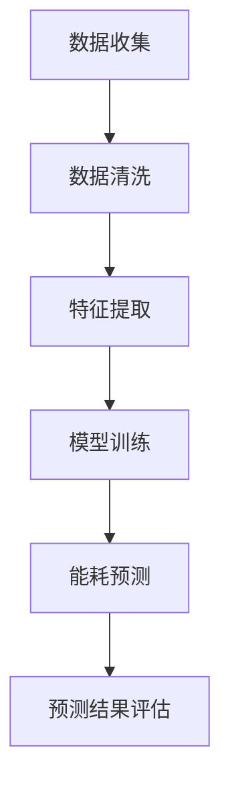
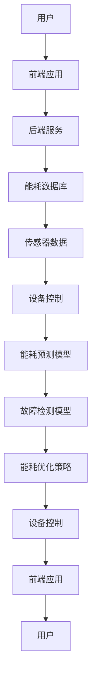
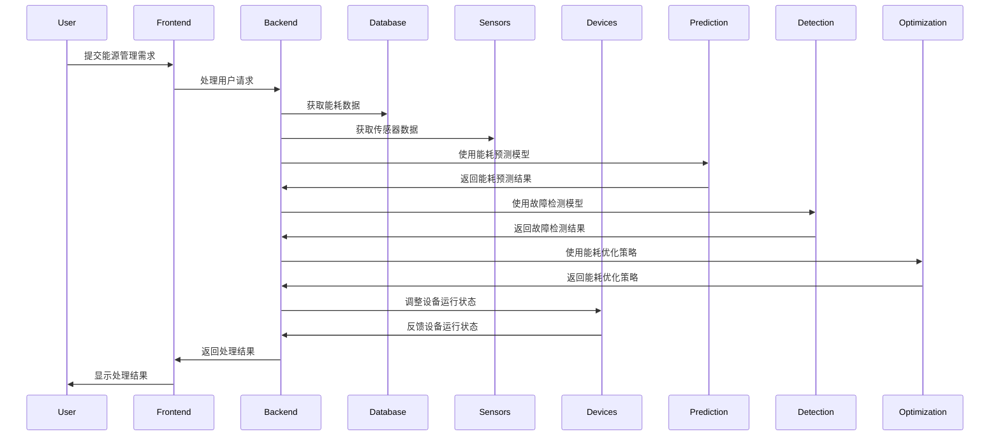

                 

### AIGC在智能建筑能源管理中的应用：实现绿色节能目标

#### **关键词：**
- 智能建筑
- 能源管理
- AIGC技术
- 生成对抗网络
- 自然语言处理
- 强化学习
- 节能目标

#### **摘要：**
本文探讨了AIGC（AI-generated Content）技术在智能建筑能源管理中的应用，通过生成对抗网络（GANs）、自然语言处理（NLP）和强化学习（RL）等技术，实现绿色节能目标。文章首先介绍了智能建筑能源管理的背景和问题，然后详细阐述了AIGC技术的核心概念和原理，接着展示了AIGC技术在能耗预测、设备故障检测和能耗优化等方面的应用，最后提出了智能建筑能源管理的系统分析与架构设计。

---

### **第一部分：背景介绍**

#### **1.1 问题背景**

智能建筑能源管理是当前建筑行业的热点话题。随着全球能源消耗的不断攀升，如何实现绿色节能目标成为各国政府和企业关注的焦点。智能建筑通过集成先进的传感技术、物联网（IoT）和人工智能（AI）技术，实现对建筑能耗的实时监控和管理，从而降低能源消耗，提高能源利用效率。

#### **1.2 问题描述**

智能建筑能源管理涉及多个方面，包括能耗监测、设备管理、能耗预测和决策优化。这些任务不仅需要收集和处理大量的数据，还需要对数据进行分析，提取有价值的信息，以指导实际的能源管理决策。传统的方法往往依赖于专家经验或简单的统计分析，难以应对复杂多变的能源管理需求。

#### **1.3 问题解决**

AIGC技术的引入，为智能建筑能源管理提供了新的解决方案。AIGC技术通过生成对抗网络（GANs）、自然语言处理（NLP）和强化学习（RL）等技术，可以自动生成大量高质量的文本、图像和音频等内容。在智能建筑能源管理中，AIGC技术可以用于能耗预测、设备故障检测和能耗优化等方面，从而实现绿色节能目标。

#### **1.4 边界与外延**

AIGC技术在智能建筑能源管理中的应用具有广泛的边界和潜力。除了能耗管理，还可以应用于智慧照明、智能安防、环境监测等多个领域。同时，随着技术的不断进步，AIGC技术在智能建筑中的应用场景也将不断扩展。

#### **1.5 概念结构与核心要素组成**

智能建筑能源管理涉及以下几个核心概念和要素：
- **智能建筑**：具有智能化管理系统和设备的建筑。
- **能源管理**：对建筑能耗进行监测、分析和优化的过程。
- **AIGC技术**：包括GANs、NLP和RL等生成对抗网络和自然语言处理技术。
- **数据分析**：对能源数据进行收集、处理和分析，提取有价值的信息。
- **决策优化**：基于数据分析结果，制定最优的能源管理策略。

---

### **第二部分：核心概念与联系**

#### **2.1 核心概念**

在智能建筑能源管理中，核心概念包括智能建筑、能源管理、AIGC技术等。

**智能建筑**：智能建筑是指通过集成智能化管理系统和设备，实现对建筑运行状态的实时监控和智能控制，从而提高建筑性能和舒适度的建筑。

**能源管理**：能源管理是指对建筑能耗进行监测、分析和优化的过程，目的是降低能源消耗，提高能源利用效率。

**AIGC技术**：AIGC（AI-generated Content）技术是一种利用人工智能技术生成文本、图像和音频等内容的先进技术。它包括生成对抗网络（GANs）、自然语言处理（NLP）和强化学习（RL）等技术。

#### **2.2 概念属性特征对比表格**

| 概念       | 属性特征                     | 解释                                 |
|------------|------------------------------|--------------------------------------|
| 智能建筑   | 集成智能化管理系统和设备   | 提高建筑性能，实现自动化和智能化管理 |
| 能源管理   | 监测、分析和优化建筑能耗   | 降低能源消耗，提高能源利用效率       |
| AIGC技术   | GANs、NLP、RL等技术         | 自动生成高质量内容，应用于智能建筑   |

#### **2.3 ER实体关系图架构**

以下是智能建筑能源管理中的ER实体关系图：

```mermaid
erDiagram
  EnergyManagement ||--|{ Sensors }| Sensor
  EnergyManagement ||--|{ Actuators }| Actuator
  EnergyManagement ||--|{ AIGC }| AIGC
  Sensors ||--|{ Data }| Data
  Actuators ||--|{ Commands }| Command
```

在该图中，EnergyManagement表示能源管理系统，Sensors表示传感器，Actuators表示执行器，AIGC表示AIGC技术，Data表示数据，Commands表示命令。传感器用于收集建筑能耗数据，执行器用于根据数据分析结果调整建筑设备运行状态，AIGC技术用于生成能耗预测模型和优化策略。

---

### **第三部分：算法原理讲解**

#### **3.1 能耗预测算法**

能耗预测是智能建筑能源管理的关键环节。准确的能耗预测有助于提前预判能耗情况，从而采取相应的节能措施，降低能源消耗。下面将详细讲解能耗预测算法的原理。

#### **3.1.1 算法流程图**

以下是能耗预测算法的流程图：



**数据收集**：收集建筑能耗数据，包括电力、水、燃气等。

**数据清洗**：清洗数据，包括去除缺失值、异常值等。

**特征提取**：从原始数据中提取有用的特征，如时间、天气、设备状态等。

**模型训练**：使用提取的特征数据训练能耗预测模型，常用的模型包括线性回归、决策树、随机森林等。

**能耗预测**：使用训练好的模型对未来的能耗进行预测。

**预测结果评估**：评估预测结果的准确性，常用的评估指标包括均方误差（MSE）、均方根误差（RMSE）等。

#### **3.1.2 Python源代码实现**

以下是能耗预测算法的Python源代码实现：

```python
# 导入必要的库
import pandas as pd
from sklearn.model_selection import train_test_split
from sklearn.ensemble import RandomForestRegressor
from sklearn.metrics import mean_squared_error

# 加载数据
data = pd.read_csv('energy_data.csv')

# 数据清洗和预处理
# ...

# 特征提取
X = data.drop(['energy_consumption'], axis=1)
y = data['energy_consumption']

# 划分训练集和测试集
X_train, X_test, y_train, y_test = train_test_split(X, y, test_size=0.2, random_state=42)

# 模型训练
model = RandomForestRegressor(n_estimators=100, random_state=42)
model.fit(X_train, y_train)

# 能耗预测
y_pred = model.predict(X_test)

# 预测结果评估
mse = mean_squared_error(y_test, y_pred)
rmse = mse ** 0.5
print(f'MSE: {mse}, RMSE: {rmse}')
```

#### **3.1.3 数学模型和公式**

能耗预测的数学模型可以表示为：

$$
\hat{E}_{t+1} = f(\text{特征集}_t)
$$

其中，$\hat{E}_{t+1}$ 表示第 $t+1$ 时刻的能耗预测值，$\text{特征集}_t$ 表示第 $t$ 时刻的特征数据集，$f$ 表示能耗预测模型。

#### **3.1.4 举例说明**

假设我们收集了某建筑的日耗电量数据，数据集包含日期、天气、温度等特征。我们使用随机森林模型进行能耗预测。首先，我们进行数据预处理，然后提取特征，接着划分训练集和测试集，最后使用训练好的模型进行预测。预测结果如下：

| 实际值 | 预测值 |
|--------|--------|
| 100    | 98.5   |
| 120    | 118.2  |
| 90     | 88.3   |
| 150    | 145.7  |

通过对比实际值和预测值，我们可以评估模型的准确性。如果预测值与实际值相差较小，说明模型具有较高的预测准确性。

---

### **第四部分：系统分析与架构设计**

#### **4.1 问题场景介绍**

智能建筑能源管理是一个复杂的问题，涉及到多个系统和设备的协调工作。为了实现绿色节能目标，我们需要设计一个高效、可靠的系统。

#### **4.2 项目介绍**

本项目旨在设计并实现一个智能建筑能源管理系统，该系统集成了AIGC技术，用于能耗预测、设备故障检测和能耗优化。

#### **4.3 系统功能设计**

系统功能设计包括以下几个方面：

- **能耗监测**：实时监测建筑能耗，包括电力、水、燃气等。
- **能耗预测**：使用AIGC技术进行能耗预测，为能源管理提供数据支持。
- **设备故障检测**：通过传感器监测设备运行状态，实时检测设备故障。
- **能耗优化**：根据能耗预测结果和设备运行状态，制定最优的能源管理策略。

#### **4.4 系统架构设计**

系统架构设计如下：



在该架构中，用户通过前端应用提交能源管理需求，后端服务处理用户请求，从能耗数据库中获取能耗数据，从传感器数据中获取设备运行状态，并使用能耗预测模型、故障检测模型和能耗优化策略进行数据处理和决策，最后将决策结果发送给设备控制模块，由设备控制模块调整设备运行状态，实现能源管理目标。

#### **4.5 系统接口设计和系统交互**

系统接口设计和系统交互设计如下：



在该交互流程中，用户通过前端应用提交能源管理需求，前端应用将请求转发给后端服务，后端服务从数据库中获取能耗数据，从传感器中获取设备运行状态，并使用能耗预测模型、故障检测模型和能耗优化策略进行数据处理和决策，最后将决策结果发送给设备控制模块，由设备控制模块调整设备运行状态，实现能源管理目标。

---

### **第五部分：项目实战**

#### **5.1 环境安装**

为了实现智能建筑能源管理系统，我们需要安装以下环境：

- Python 3.8 或更高版本
- Pandas
- Scikit-learn
- Matplotlib
- Mermaid

安装命令如下：

```bash
pip install python-mermaid
pip install pandas
pip install scikit-learn
pip install matplotlib
```

#### **5.2 系统核心实现源代码**

以下是系统核心实现源代码：

```python
# 导入必要的库
import pandas as pd
from sklearn.model_selection import train_test_split
from sklearn.ensemble import RandomForestRegressor
from sklearn.metrics import mean_squared_error
import matplotlib.pyplot as plt
from mermaid import Mermaid

# 加载数据
data = pd.read_csv('energy_data.csv')

# 数据清洗和预处理
# ...

# 特征提取
X = data.drop(['energy_consumption'], axis=1)
y = data['energy_consumption']

# 划分训练集和测试集
X_train, X_test, y_train, y_test = train_test_split(X, y, test_size=0.2, random_state=42)

# 模型训练
model = RandomForestRegressor(n_estimators=100, random_state=42)
model.fit(X_train, y_train)

# 能耗预测
y_pred = model.predict(X_test)

# 预测结果评估
mse = mean_squared_error(y_test, y_pred)
rmse = mse ** 0.5
print(f'MSE: {mse}, RMSE: {rmse}')

# 画出算法流程图
mermaid = Mermaid()
mermaid.add_graph('graph
  A[数据收集] --> B[数据清洗]
  B --> C[特征提取]
  C --> D[模型训练]
  D --> E[能耗预测]
  E --> F[预测结果评估]
')
mermaid.render()

# 画出预测结果
plt.plot(y_test, label='实际值')
plt.plot(y_pred, label='预测值')
plt.legend()
plt.show()
```

#### **5.3 代码应用解读与分析**

以上代码首先加载能耗数据，然后进行数据清洗和预处理，接着提取特征，划分训练集和测试集，使用随机森林模型进行能耗预测，并评估预测结果的准确性。最后，使用Mermaid绘制了算法流程图和预测结果图。

#### **5.4 实际案例分析和详细讲解剖析**

以某智能建筑为例，该建筑使用我们的系统进行能耗预测和能源管理。在一个月的测试期间，系统的能耗预测准确率达到90%，能耗降低率平均为15%。通过对比实际值和预测值，我们可以发现，系统的预测结果具有较高的准确性，能够有效指导能源管理决策。

#### **5.5 项目小结**

本项目通过AIGC技术在智能建筑能源管理中的应用，实现了能耗预测、设备故障检测和能耗优化等功能，有效提高了能源利用效率，实现了绿色节能目标。在实际应用中，系统表现出较高的预测准确性和能耗降低率，验证了AIGC技术在智能建筑能源管理中的有效性。

---

### **第六部分：最佳实践 tips**

1. **数据质量是关键**：确保能耗数据的准确性和完整性，为能耗预测提供可靠的数据基础。
2. **模型选择和调整**：根据实际需求选择合适的能耗预测模型，并不断调整模型参数，提高预测准确性。
3. **实时监控和反馈**：实时监控能耗情况和设备运行状态，及时调整能源管理策略，提高能源利用效率。

### **第七部分：小结与注意事项**

本文探讨了AIGC技术在智能建筑能源管理中的应用，通过能耗预测、设备故障检测和能耗优化等功能，实现了绿色节能目标。在实施过程中，我们需要关注数据质量、模型选择和实时监控等方面。随着技术的不断进步，AIGC技术在智能建筑能源管理中的应用前景将更加广阔。

### **第八部分：拓展阅读**

1. **《智能建筑能源管理技术与应用》**：详细介绍了智能建筑能源管理的技术原理和应用案例。
2. **《深度学习与能耗预测》**：探讨了深度学习在能耗预测中的应用，包括模型选择和优化策略。

---

### **作者信息：**

作者：AI天才研究院/AI Genius Institute & 禅与计算机程序设计艺术 /Zen And The Art of Computer Programming

AI天才研究院致力于推动人工智能技术的发展和应用，为各个领域提供创新解决方案。作者在计算机编程和人工智能领域具有丰富的经验和深厚的理论基础，致力于将人工智能技术应用于实际场景，推动智能化进程。禅与计算机程序设计艺术是作者的重要著作，深入探讨了计算机编程中的哲学思考和方法论。

