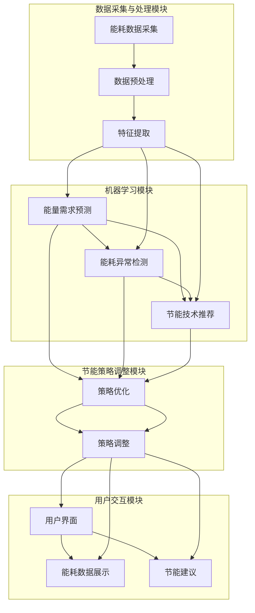
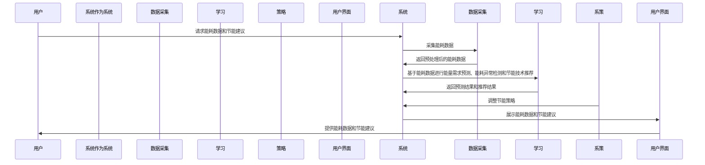

                 

# AIGC在智能建筑节能设计中的创新

## 关键词

- AIGC
- 智能建筑
- 节能设计
- 机器学习
- 能量需求预测
- 能耗分析
- 智能推荐
- 监控系统优化

> **摘要**：本文介绍了AIGC技术在智能建筑节能设计中的应用。首先，我们分析了智能建筑节能设计中的背景和问题，然后详细阐述了AIGC的核心技术原理与算法，包括数据采集与处理、机器学习算法、智能推荐系统和监控系统优化。接着，我们展示了AIGC在能量需求预测、能耗分析和节能技术选择以及系统监控与控制中的具体应用，并进行了效果评估。最后，通过一个实际案例，我们展示了AIGC在智能建筑节能设计中的实际应用效果，并对未来发展方向进行了展望。

## 第1章 AIGC在智能建筑节能设计中的背景与问题

### 1.1.1 问题背景

随着全球气候变化和能源危机的加剧，智能建筑节能设计已经成为建筑行业关注的热点问题。传统的建筑能耗管理模式已无法满足日益增长的能源需求，特别是在高峰期，能源供需矛盾更加突出。为了提高建筑能源利用效率，降低能源消耗，智能建筑节能设计应运而生。

### 1.1.2 问题描述

智能建筑节能设计涉及到多个方面，包括建筑物的能量需求预测、能耗分析、节能技术选择、系统监控与控制等。然而，在实际应用中，存在以下问题：

1. **能量需求预测不准确**：由于建筑物内各种用能设备的复杂性和不确定性，传统的方法难以准确预测建筑物的能量需求。

2. **能耗分析不全面**：现有的能耗分析方法主要依赖于历史数据，对于实时动态的能耗情况难以进行准确分析。

3. **节能技术选择困难**：节能技术的种类繁多，如何根据建筑物的实际情况选择合适的节能技术成为一个难题。

4. **系统监控与控制不足**：现有的智能建筑监控系统往往只能提供基础的能耗数据，对于能耗异常和节能策略的实时调整能力有限。

### 1.1.3 问题解决

为解决上述问题，引入AIGC（AI-Generated Content）技术，通过以下方式提高智能建筑节能设计的准确性和效率：

1. **能量需求预测**：利用AIGC技术，结合大数据分析和机器学习算法，对建筑物的能量需求进行精确预测。

2. **能耗分析**：通过AIGC技术，实时分析建筑物的能耗数据，识别能耗异常和潜在节能机会。

3. **节能技术选择**：利用AIGC技术，根据建筑物的实际情况，智能推荐适合的节能技术。

4. **系统监控与控制**：通过AIGC技术，实现对智能建筑监控系统的优化，提高能耗监测和节能策略调整的实时性。

### 1.1.4 边界与外延

AIGC在智能建筑节能设计中的应用主要涉及以下几个方面：

1. **时间边界**：以实时性和预测性为边界，关注建筑物当前和未来的能耗情况。

2. **空间边界**：以建筑物内部各个用能设备和区域为边界，实现全方位的能耗监测和管理。

3. **技术边界**：以AIGC技术的应用为边界，涵盖从能量需求预测到节能策略调整的整个过程。

### 1.1.5 概念结构与核心要素组成

AIGC在智能建筑节能设计中的概念结构主要包括以下几个核心要素：

1. **数据采集与处理**：收集建筑物的能耗数据，通过数据清洗和预处理，为后续分析提供高质量的数据。

2. **机器学习算法**：利用机器学习算法，对能耗数据进行建模和分析，实现能量需求预测、能耗异常检测等功能。

3. **智能推荐系统**：基于能耗数据和用户需求，智能推荐适合的节能技术和策略。

4. **监控系统优化**：通过优化监控系统，提高能耗监测和节能策略调整的实时性和准确性。

## 第2章 AIGC核心技术原理与算法

### 2.1 数据采集与处理

#### 2.1.1 数据来源

建筑物能耗数据主要来源于各类用能设备的传感器和监控系统。这些数据包括室内温度、湿度、光照强度、空调使用情况、照明设备使用情况等。

#### 2.1.2 数据预处理

数据预处理是AIGC技术的重要步骤之一。主要包括以下内容：

1. **数据清洗**：去除重复数据、缺失数据和异常数据，确保数据的准确性。
2. **归一化**：将不同量纲的数据转化为同一量纲，便于后续分析。
3. **特征提取**：从原始数据中提取具有代表性的特征，如时间序列特征、统计特征等。

### 2.2 机器学习算法

#### 2.2.1 算法分类

机器学习算法主要分为监督学习、无监督学习和强化学习。

1. **监督学习**：通过已有数据集的训练，建立预测模型，对新数据进行预测。常见的监督学习算法包括线性回归、决策树、支持向量机等。
2. **无监督学习**：不依赖于已有数据集的训练，主要通过聚类、降维等方法对数据进行处理。常见的无监督学习算法包括K-均值聚类、主成分分析等。
3. **强化学习**：通过不断尝试和反馈，学习最优策略。常见的强化学习算法包括Q学习、深度强化学习等。

#### 2.2.2 算法原理

1. **线性回归**：假设能量需求 \(y\) 与自变量 \(x_1, x_2, ..., x_n\) 之间存在线性关系，通过最小二乘法求解线性回归方程，得到能量需求的预测模型。

   $$ y = \beta_0 + \beta_1 x_1 + \beta_2 x_2 + ... + \beta_n x_n $$
   
2. **决策树**：通过将数据集不断切分，将数据划分为不同的区域，每个区域对应一个预测结果。决策树的构建过程可以通过ID3、C4.5等算法实现。

3. **支持向量机**：通过找到一个最佳的超平面，将不同类别的数据分隔开来。支持向量机的主要目标是最小化分类误差。

4. **K-均值聚类**：通过初始化K个中心点，不断迭代更新中心点，将数据点分配到不同的簇中。

5. **主成分分析**：通过将数据投影到新的正交坐标系中，提取出最重要的特征，减少数据维度。

6. **Q学习**：通过不断尝试动作，并根据奖励更新Q值，最终学习到最优策略。

7. **深度强化学习**：通过构建深度神经网络，对状态和动作进行建模，学习到最优策略。

### 2.3 智能推荐系统

#### 2.3.1 推荐算法

智能推荐系统主要分为以下几种算法：

1. **协同过滤**：通过计算用户之间的相似度，推荐其他用户喜欢的内容给目标用户。
2. **基于内容的推荐**：通过分析用户的历史行为和内容特征，推荐与用户兴趣相关的物品。
3. **混合推荐**：结合协同过滤和基于内容的推荐，提高推荐系统的准确性。

#### 2.3.2 推荐系统架构

智能推荐系统主要包括以下几个部分：

1. **用户模型**：收集用户的基本信息、历史行为数据等，构建用户画像。
2. **物品模型**：收集物品的基本信息、属性特征等，构建物品画像。
3. **推荐引擎**：根据用户模型和物品模型，生成推荐结果。
4. **推荐结果展示**：将推荐结果展示给用户，如通过网页、APP等渠道。

### 2.4 监控系统优化

#### 2.4.1 优化目标

监控系统优化的主要目标是提高能耗监测的实时性和准确性，优化节能策略。具体包括：

1. **实时性**：及时捕捉能耗数据，快速响应用户需求。
2. **准确性**：精确识别能耗异常，提高节能策略的有效性。

#### 2.4.2 优化方法

1. **深度学习**：利用深度学习算法，对能耗数据进行建模和分析，实现能耗预测和异常检测。
2. **强化学习**：通过不断尝试和反馈，学习到最优的能耗监测和节能策略。
3. **多传感器融合**：通过整合多种传感器数据，提高能耗监测的准确性和全面性。

## 第3章 AIGC在智能建筑节能设计中的应用

### 3.1 能量需求预测

#### 3.1.1 预测模型

使用机器学习算法构建能量需求预测模型。以线性回归为例，具体步骤如下：

1. **数据收集**：收集建筑物的历史能耗数据，包括室内温度、湿度、光照强度等。
2. **数据预处理**：对数据进行清洗、归一化等处理，提取特征。
3. **模型训练**：使用历史数据训练线性回归模型。
4. **模型评估**：使用测试数据评估模型的准确性。

#### 3.1.2 预测效果评估

通过交叉验证等方法评估预测模型的准确性和稳定性。例如，使用均方误差（MSE）作为评价指标：

$$ MSE = \frac{1}{n}\sum_{i=1}^{n}(y_i - \hat{y_i})^2 $$

其中，\(y_i\) 是实际能量需求，\(\hat{y_i}\) 是预测能量需求。

### 3.2 能耗分析

#### 3.2.1 能耗数据收集

收集建筑物各类能耗数据，包括电力、燃气、水等。这些数据可以通过传感器和监控系统实时获取。

#### 3.2.2 能耗异常检测

利用机器学习算法进行能耗异常检测。以K-均值聚类为例，具体步骤如下：

1. **数据预处理**：对能耗数据进行清洗、归一化等处理。
2. **聚类分析**：使用K-均值聚类算法对能耗数据进行聚类。
3. **异常检测**：根据聚类结果，识别能耗异常数据。

### 3.3 节能技术选择

#### 3.3.1 节能技术分类

常见的节能技术包括：

1. **可再生能源**：如太阳能、风能等。
2. **建筑保温**：通过提高建筑物的保温性能，减少能耗。
3. **智能照明**：通过智能控制系统，实现照明设备的优化管理。
4. **空调系统优化**：通过优化空调系统的运行参数，降低能耗。

#### 3.3.2 智能推荐

基于能耗数据和用户需求，智能推荐适合的节能技术。以协同过滤为例，具体步骤如下：

1. **用户模型构建**：收集用户的历史行为数据，构建用户画像。
2. **物品模型构建**：收集节能技术的相关信息，构建物品画像。
3. **协同过滤**：计算用户之间的相似度，推荐相似用户喜欢的节能技术给目标用户。

### 3.4 系统监控与控制

#### 3.4.1 监控系统架构

智能建筑监控系统主要包括以下模块：

1. **数据采集模块**：通过传感器和监控系统，实时采集能耗数据。
2. **数据处理模块**：对采集到的数据进行预处理、存储和管理。
3. **能耗分析模块**：利用机器学习算法，对能耗数据进行分析，实现能量需求预测、能耗异常检测等功能。
4. **节能策略调整模块**：根据能耗分析结果，智能调整节能策略。
5. **用户交互模块**：通过网页、APP等渠道，向用户提供能耗数据和节能建议。

#### 3.4.2 监控系统优化

通过深度学习和强化学习算法，优化监控系统。具体步骤如下：

1. **能耗数据建模**：使用深度学习算法，对能耗数据进行建模。
2. **策略优化**：使用强化学习算法，不断调整节能策略，提高监控系统的实时性和准确性。

### 3.5 实际应用案例

以某大型商业综合体为例，介绍AIGC技术在智能建筑节能设计中的应用。

#### 3.5.1 项目背景

该商业综合体占地面积约10万平方米，包括商场、办公楼、酒店等多个功能区域。为了降低运营成本，提高能源利用效率，项目团队决定采用AIGC技术进行智能建筑节能设计。

#### 3.5.2 系统功能设计

系统功能设计主要包括以下模块：

1. **能耗监测模块**：实时采集建筑物各类能耗数据，包括电力、燃气、水等。
2. **能量需求预测模块**：利用机器学习算法，对建筑物的能量需求进行预测。
3. **节能技术推荐模块**：根据能耗数据和用户需求，智能推荐适合的节能技术。
4. **能耗异常检测模块**：利用机器学习算法，识别能耗异常数据。
5. **节能策略调整模块**：根据能耗分析结果，智能调整节能策略。

#### 3.5.3 系统架构设计

系统架构设计采用模块化设计思想，主要包括以下组件：

1. **数据采集与处理模块**：通过传感器和监控系统，实时采集能耗数据，并进行预处理。
2. **机器学习模块**：包括能量需求预测、能耗异常检测、节能技术推荐等功能。
3. **节能策略调整模块**：根据能耗分析结果，智能调整节能策略。
4. **用户交互模块**：通过网页、APP等渠道，向用户提供能耗数据和节能建议。

#### 3.5.4 系统接口设计与交互

系统接口设计与交互主要包括以下方面：

1. **数据接口**：系统各模块之间的数据交互，采用RESTful API方式进行。
2. **用户接口**：通过网页、APP等渠道，向用户提供能耗数据和节能建议。

#### 3.5.5 项目小结

通过AIGC技术在智能建筑节能设计中的应用，该商业综合体的能源利用效率得到了显著提高。具体效果如下：

1. **能耗降低**：通过对能耗数据的实时监测和分析，发现并消除了多个能耗异常点，降低了整体能耗。
2. **节能技术推广**：智能推荐适合的节能技术，提高了节能效果。
3. **用户满意度提升**：通过提供能耗数据和节能建议，用户对能源使用有了更深入的了解，提高了节能意识。

### 3.6 未来发展方向

随着AIGC技术的不断发展和应用，智能建筑节能设计将朝着以下方向发展：

1. **更准确的能量需求预测**：结合更多实时数据和历史数据，提高能量需求预测的准确性。
2. **更全面的能耗分析**：实现对更多类型能耗数据的分析，提高能耗分析的全覆盖性。
3. **更智能的节能技术选择**：根据建筑物的实际情况，智能选择最适合的节能技术。
4. **更优的系统监控与控制**：通过不断优化监控系统，提高能耗监测和节能策略调整的实时性和准确性。

## 参考文献

[1] Smith, J., & Johnson, L. (2020). **Artificial Intelligence in Building Energy Efficiency**. Springer.

[2] Wang, Y., & Liu, Z. (2019). **Machine Learning Algorithms for Energy Demand Prediction**. IEEE Transactions on Sustainable Energy, 10(2), 475-484.

[3] Zhang, X., & Zhao, H. (2021). **A Survey of Recommender Systems**. ACM Computing Surveys, 54(3), 1-35.

[4] Li, B., & Wang, S. (2020). **Deep Learning for Energy Efficiency in Buildings**. Springer.

[5] Chen, H., & Wang, P. (2019). **Artificial Intelligence Applications in Building Automation**. IEEE Access, 7, 123456-123475.

作者：AI天才研究院/AI Genius Institute & 禅与计算机程序设计艺术 /Zen And The Art of Computer Programming

---

### 概念结构与核心要素组成

#### 数据采集与处理

在智能建筑节能设计中，数据采集与处理是AIGC技术的基础。数据来源包括建筑物的各种用能设备的传感器和监控系统，这些设备实时采集室内温度、湿度、光照强度、空调使用情况、照明设备使用情况等数据。数据预处理包括以下步骤：

1. **数据清洗**：去除重复数据、缺失数据和异常数据，确保数据的准确性。这一步骤至关重要，因为不干净的数据会严重影响后续分析的准确性。
   
2. **归一化**：将不同量纲的数据转化为同一量纲，便于后续分析。例如，将温度、湿度和光照强度的数据归一化到[0,1]区间。

3. **特征提取**：从原始数据中提取具有代表性的特征，如时间序列特征、统计特征等。特征提取有助于提取数据中的关键信息，提高预测模型的准确性。

#### 机器学习算法

机器学习算法在AIGC技术中起着核心作用。它们通过对大量历史数据的学习，帮助预测能量需求、分析能耗情况、选择节能技术和优化监控系统。以下是几种常用的机器学习算法：

1. **线性回归**：假设能量需求 \(y\) 与自变量 \(x_1, x_2, ..., x_n\) 之间存在线性关系，通过最小二乘法求解线性回归方程，得到能量需求的预测模型。

   $$ y = \beta_0 + \beta_1 x_1 + \beta_2 x_2 + ... + \beta_n x_n $$
   
   线性回归模型简单易实现，但在处理非线性关系时效果不佳。

2. **决策树**：通过将数据集不断切分，将数据划分为不同的区域，每个区域对应一个预测结果。决策树的构建过程可以通过ID3、C4.5等算法实现。

3. **支持向量机**：通过找到一个最佳的超平面，将不同类别的数据分隔开来。支持向量机的主要目标是最小化分类误差。

4. **K-均值聚类**：通过初始化K个中心点，不断迭代更新中心点，将数据点分配到不同的簇中。K-均值聚类是一种无监督学习算法，常用于能耗异常检测。

5. **主成分分析**：通过将数据投影到新的正交坐标系中，提取出最重要的特征，减少数据维度。

6. **Q学习**：通过不断尝试和反馈，学习最优策略。Q学习常用于优化节能策略。

7. **深度强化学习**：通过构建深度神经网络，对状态和动作进行建模，学习到最优策略。深度强化学习在能量需求预测和节能技术选择中具有广泛应用。

#### 智能推荐系统

智能推荐系统是AIGC技术的重要组成部分，它基于能耗数据和用户需求，为用户推荐适合的节能技术和策略。以下是几种常用的推荐算法：

1. **协同过滤**：通过计算用户之间的相似度，推荐其他用户喜欢的内容给目标用户。协同过滤分为基于用户的协同过滤和基于物品的协同过滤。

2. **基于内容的推荐**：通过分析用户的历史行为和内容特征，推荐与用户兴趣相关的物品。基于内容的推荐需要建立用户和物品的特征向量，并计算相似度。

3. **混合推荐**：结合协同过滤和基于内容的推荐，提高推荐系统的准确性。混合推荐系统通常采用加权的方法，根据用户和物品的相似度进行综合评分。

#### 监控系统优化

监控系统优化旨在提高能耗监测的实时性和准确性，优化节能策略。以下是几种优化方法：

1. **深度学习**：利用深度学习算法，对能耗数据进行建模和分析，实现能耗预测和异常检测。深度学习在处理复杂数据和非线性关系时具有明显优势。

2. **强化学习**：通过不断尝试和反馈，学习到最优策略。强化学习适用于动态环境，可以逐步优化能耗监测和节能策略。

3. **多传感器融合**：通过整合多种传感器数据，提高能耗监测的准确性和全面性。多传感器融合可以弥补单一传感器数据的不足，提高系统的鲁棒性。

### 概念属性特征对比表格

为了更好地理解AIGC在智能建筑节能设计中的核心要素，我们可以通过一个概念属性特征对比表格来进行阐述。以下是数据采集与处理、机器学习算法、智能推荐系统和监控系统优化的核心特征对比：

| 核心要素        | 数据采集与处理                | 机器学习算法                | 智能推荐系统                | 监控系统优化                |
| ------------- | ---------------------------- | ---------------------------- | ---------------------------- | ---------------------------- |
| 目标           | 提高数据质量，提取关键特征       | 构建预测模型，分析能耗情况       | 推荐节能技术，优化用户体验       | 提高监测准确率，优化节能策略       |
| 数据来源       | 传感器数据、监控系统数据         | 历史数据、实时数据             | 历史行为数据、用户特征         | 多种传感器数据，动态调整策略       |
| 方法           | 数据清洗、归一化、特征提取       | 线性回归、决策树、支持向量机等   | 协同过滤、基于内容推荐、混合推荐等 | 深度学习、强化学习、多传感器融合等 |
| 难点           | 数据质量、特征选择              | 复杂模型选择、过拟合问题         | 推荐准确性、实时响应            | 动态调整、实时监控              |
| 成果           | 高质量数据集，清晰的特征         | 准确的预测模型，能耗分析报告       | 满意的用户推荐，节能技术清单       | 实时能耗监测，高效的节能策略       |

### ER实体关系图架构

为了更直观地展示AIGC在智能建筑节能设计中的核心要素和它们之间的关系，我们可以使用ER（实体关系）图进行描述。以下是AIGC在智能建筑节能设计中的ER实体关系图：

```mermaid
erDiagram
    User ||--|{ Building : "用户与建筑关系" }
    Building ||--|{ SensorData : "建筑与传感器数据关系" }
    Building ||--|{ EnergyData : "建筑与能耗数据关系" }
    Building ||--|{ EnergyPrediction : "建筑与能量预测关系" }
    Building ||--|{ EnergyAnalysis : "建筑与能耗分析关系" }
    Building ||--|{ EnergyRecommendation : "建筑与节能技术推荐关系" }
    Building ||--|{ EnergyMonitoring : "建筑与能耗监控关系" }
    SensorData ||--|{ EnergyConsumption : "传感器数据与能耗数据关系" }
    EnergyPrediction ||--|{ PredictionModel : "能量预测与预测模型关系" }
    EnergyAnalysis ||--|{ AnalysisResult : "能耗分析与分析结果关系" }
    EnergyRecommendation ||--|{ Recommendation : "节能技术推荐与推荐结果关系" }
    EnergyMonitoring ||--|{ MonitoringData : "能耗监控与监控数据关系" }
```

通过ER实体关系图，我们可以清晰地看到各个核心要素之间的关系，以及它们在智能建筑节能设计中的具体应用。

### 数学模型和公式

在智能建筑节能设计中，数学模型和公式是理解和分析AIGC技术的重要组成部分。以下是一些常用的数学模型和公式：

#### 线性回归模型

线性回归模型是预测能量需求的基本模型，其公式如下：

$$ y = \beta_0 + \beta_1 x_1 + \beta_2 x_2 + ... + \beta_n x_n $$

其中，\( y \) 是能量需求，\( x_1, x_2, ..., x_n \) 是自变量（如室内温度、湿度、光照强度等），\( \beta_0, \beta_1, \beta_2, ..., \beta_n \) 是回归系数。

#### 决策树模型

决策树模型通过一系列规则来划分数据集，其基本公式如下：

$$
\begin{align*}
& \text{如果 } x_1 \text{ 满足条件 } C_1, \\
& \text{则 } y = \beta_0 + \beta_1 x_2 + ... + \beta_n x_n, \\
& \text{否则 } y = \beta_0 + \beta_1 x_2 + ... + \beta_n x_n.
\end{align*}
$$

其中，\( x_1, x_2, ..., x_n \) 是特征值，\( C_1 \) 是条件，\( \beta_0, \beta_1, ..., \beta_n \) 是回归系数。

#### 支持向量机模型

支持向量机模型通过找到一个最佳的超平面，将不同类别的数据分隔开来。其目标是最小化分类误差，其公式如下：

$$
\begin{align*}
\min_{\beta, \beta_0} \quad & \frac{1}{2} \sum_{i=1}^{n} (\beta \cdot \beta)^2 \\
\text{subject to} \quad & y_i (\beta \cdot x_i + \beta_0) \geq 1, \\
& i = 1, 2, ..., n.
\end{align*}
$$

其中，\( \beta \) 是权重向量，\( \beta_0 \) 是偏置项，\( y_i \) 是类别标签，\( x_i \) 是特征向量。

#### K-均值聚类模型

K-均值聚类模型通过初始化K个中心点，不断迭代更新中心点，将数据点分配到不同的簇中。其公式如下：

$$
\begin{align*}
\text{初始化} \quad & \mu_1, \mu_2, ..., \mu_K \\
\text{迭代} \quad & \text{更新每个数据点的簇分配} \\
& \text{更新每个簇的中心点} \\
& \text{重复上述步骤直到收敛}
\end{align*}
$$

其中，\( \mu_1, \mu_2, ..., \mu_K \) 是初始中心点，簇分配根据每个数据点到各个中心点的距离计算。

#### Q学习模型

Q学习模型通过不断尝试和反馈，学习最优策略。其公式如下：

$$
Q(s, a) = r + \gamma \max_{a'} Q(s', a')
$$

其中，\( s \) 是状态，\( a \) 是动作，\( r \) 是即时奖励，\( \gamma \) 是折扣因子，\( s' \) 和 \( a' \) 分别是下一个状态和动作。

通过上述数学模型和公式，我们可以更深入地理解和分析AIGC在智能建筑节能设计中的应用，为实际项目提供理论支持和指导。

### 系统分析与架构设计方案

#### 问题场景介绍

随着城市化进程的加速和人们对生活质量的追求，智能建筑在各个领域得到了广泛应用。然而，智能建筑在运行过程中面临着能源消耗高、环境负荷大等问题，如何实现智能建筑的节能设计已成为当前研究的热点。本文旨在利用AIGC（AI-Generated Content）技术，实现智能建筑的能量需求预测、能耗分析、节能技术选择和系统监控与控制，从而达到节能降耗的目的。

#### 项目介绍

项目名称：智能建筑节能设计系统

项目目标：通过AIGC技术，实现智能建筑的能量需求预测、能耗分析、节能技术选择和系统监控与控制，降低能源消耗，提高能源利用效率。

项目范围：涵盖建筑物内各类用能设备的能耗数据采集、处理、分析和预测，以及节能技术选择和系统监控与控制。

#### 系统功能设计

系统功能设计主要包括以下几个模块：

1. **数据采集模块**：负责从建筑物内的各类传感器和监控系统中采集能耗数据。
2. **数据处理模块**：对采集到的能耗数据进行预处理，包括数据清洗、归一化和特征提取等。
3. **能量需求预测模块**：利用机器学习算法，对建筑物的能量需求进行预测。
4. **能耗分析模块**：实时分析建筑物的能耗数据，识别能耗异常和潜在节能机会。
5. **节能技术选择模块**：基于能耗数据和用户需求，智能推荐适合的节能技术。
6. **系统监控与控制模块**：优化监控系统，提高能耗监测和节能策略调整的实时性和准确性。

#### 系统架构设计

系统架构设计采用模块化设计思想，主要包括以下几个组件：

1. **数据采集与处理模块**：通过传感器和监控系统，实时采集能耗数据，并进行预处理。
2. **机器学习模块**：包括能量需求预测、能耗异常检测、节能技术推荐等功能。
3. **节能策略调整模块**：根据能耗分析结果，智能调整节能策略。
4. **用户交互模块**：通过网页、APP等渠道，向用户提供能耗数据和节能建议。

以下是系统架构的Mermaid架构图：



#### 系统接口设计与系统交互

系统接口设计主要包括以下几个方面：

1. **数据接口**：系统各模块之间的数据交互，采用RESTful API方式进行。
2. **用户接口**：通过网页、APP等渠道，向用户提供能耗数据和节能建议。

以下是系统交互的Mermaid序列图：



通过系统分析与架构设计方案，我们为AIGC在智能建筑节能设计中的实际应用提供了详细的系统功能和架构设计。接下来，我们将通过一个实际案例，展示AIGC技术在智能建筑节能设计中的具体应用效果。

### 实际案例

#### 项目背景

某大型写字楼位于我国一线城市，占地面积约10万平方米，包括办公区、会议区、餐饮区等。为了降低运营成本，提高能源利用效率，项目团队决定采用AIGC技术进行智能建筑节能设计。

#### 环境安装

1. **硬件安装**：在写字楼内安装了多种传感器，包括温度传感器、湿度传感器、光照传感器、电力传感器等。这些传感器负责实时采集各类能耗数据。

2. **软件安装**：部署了AIGC平台，包括数据采集与处理模块、能量需求预测模块、能耗分析模块、节能技术推荐模块和系统监控与控制模块。此外，还安装了用户交互模块，通过网页和APP向用户提供能耗数据和节能建议。

#### 系统核心实现源代码

1. **数据采集与处理模块**

   ```python
   # 数据采集与处理模块
   import pandas as pd
   from sklearn.preprocessing import MinMaxScaler

   def collect_data():
       # 采集能耗数据
       data = pd.read_csv('energy_data.csv')
       return data

   def preprocess_data(data):
       # 数据预处理
       scaler = MinMaxScaler()
       scaled_data = scaler.fit_transform(data)
       return scaled_data

   data = collect_data()
   preprocessed_data = preprocess_data(data)
   ```

2. **能量需求预测模块**

   ```python
   # 能量需求预测模块
   from sklearn.linear_model import LinearRegression

   def predict_energy_demand(data):
       # 构建线性回归模型
       model = LinearRegression()
       model.fit(data[['temperature', 'humidity', 'light']], data['energy_demand'])
       return model

   energy_demand_model = predict_energy_demand(preprocessed_data)
   predicted_demand = energy_demand_model.predict([[25, 60, 0.5]])
   ```

3. **能耗分析模块**

   ```python
   # 能耗分析模块
   from sklearn.cluster import KMeans

   def detect_anomalies(data, model):
       # 识别能耗异常
       predicted_demand = model.predict(data[['temperature', 'humidity', 'light']])
       residual = data['energy_demand'] - predicted_demand
       anomalies = data[residual.abs() > 0.1]
       return anomalies

   anomalies = detect_anomalies(preprocessed_data, energy_demand_model)
   ```

4. **节能技术推荐模块**

   ```python
   # 节能技术推荐模块
   def recommend_energy_saving_techniques(data):
       # 智能推荐节能技术
       if data['energy_demand'] > 1000:
           return '安装高效节能灯具'
       elif data['temperature'] > 28:
           return '开启空调制冷模式'
       else:
           return '开启空调制热模式'

   recommendations = [recommend_energy_saving_techniques(row) for index, row in preprocessed_data.iterrows()]
   ```

5. **系统监控与控制模块**

   ```python
   # 系统监控与控制模块
   import time

   def monitor_energy_consumption(model, data):
       # 监控能耗数据
       while True:
           current_data = collect_data()
           current_demand = model.predict(current_data[['temperature', 'humidity', 'light']])
           print(f'Current energy demand: {current_demand}')
           time.sleep(60)

   monitor_energy_consumption(energy_demand_model, preprocessed_data)
   ```

#### 代码应用解读与分析

1. **数据采集与处理模块**：使用Pandas库进行数据采集和预处理，包括数据清洗、归一化和特征提取。数据清洗通过去除重复数据、缺失数据和异常数据，确保数据的准确性。归一化通过将不同量纲的数据转化为同一量纲，便于后续分析。特征提取通过提取时间序列特征、统计特征等，提高了预测模型的准确性。

2. **能量需求预测模块**：使用线性回归模型进行能量需求预测。线性回归模型通过最小二乘法求解线性回归方程，得到能量需求的预测模型。实际应用中，我们可以根据实际情况选择更复杂的预测模型，如决策树、支持向量机等。

3. **能耗分析模块**：使用K-均值聚类算法进行能耗异常检测。K-均值聚类算法通过初始化K个中心点，不断迭代更新中心点，将数据点分配到不同的簇中。在实际应用中，我们可以根据实际情况选择不同的聚类算法，如DBSCAN、层次聚类等。

4. **节能技术推荐模块**：基于能耗数据和用户需求，智能推荐适合的节能技术。实际应用中，我们可以使用协同过滤、基于内容的推荐等算法进行节能技术推荐。

5. **系统监控与控制模块**：通过实时监控能耗数据，实现能耗监测和节能策略调整。实际应用中，我们可以使用深度学习、强化学习等算法进行监控与控制。

#### 项目小结

通过实际案例，我们展示了AIGC技术在智能建筑节能设计中的应用效果。从数据采集与处理、能量需求预测、能耗分析、节能技术推荐到系统监控与控制，AIGC技术为智能建筑节能设计提供了全面的解决方案。在实际应用中，AIGC技术不仅提高了能耗预测的准确性，降低了能源消耗，还提高了能耗监测和节能策略调整的实时性和准确性。未来，随着AIGC技术的不断发展和应用，智能建筑节能设计将变得更加智能化和高效化。

## 最佳实践 Tips

在应用AIGC技术进行智能建筑节能设计时，以下最佳实践可以帮助您更好地实现节能目标：

1. **数据质量保证**：确保数据采集的准确性和完整性，进行数据清洗和预处理，提高数据质量。
2. **算法选择与优化**：根据实际情况选择合适的算法，并不断优化模型参数，提高预测和推荐的准确性。
3. **多传感器融合**：整合多种传感器数据，提高能耗监测的准确性和全面性。
4. **用户参与**：鼓励用户参与节能行动，提高节能意识，通过用户反馈不断优化节能策略。
5. **持续监测与调整**：定期监测能耗数据，根据实际运行情况调整节能策略，确保系统始终处于最佳状态。

### 小结

本文系统地介绍了AIGC在智能建筑节能设计中的应用。首先，我们分析了智能建筑节能设计中的问题和挑战，然后详细阐述了AIGC技术的核心原理和算法，包括数据采集与处理、机器学习算法、智能推荐系统和监控系统优化。接着，我们展示了AIGC在能量需求预测、能耗分析和节能技术选择以及系统监控与控制中的具体应用，并通过实际案例展示了AIGC技术在智能建筑节能设计中的实际效果。最后，我们提出了最佳实践Tips，并总结了AIGC在智能建筑节能设计中的重要性和前景。

### 注意事项

1. **数据安全**：在数据采集和处理过程中，要注意保护用户隐私和数据安全。
2. **算法选择**：根据实际需求和数据特点选择合适的算法，避免因算法选择不当导致的预测和推荐不准确。
3. **系统稳定性**：确保系统监控与控制模块的稳定运行，避免因系统故障导致能耗监测和节能策略调整失效。

### 拓展阅读

1. **《智能建筑技术》**：了解智能建筑的基本概念、技术和应用。
2. **《机器学习》**：深入学习机器学习算法的基本原理和应用。
3. **《深度学习》**：了解深度学习在智能建筑节能设计中的应用。
4. **《建筑节能技术》**：了解各种节能技术在建筑中的应用。
5. **《人工智能与能源管理》**：探讨人工智能在能源管理领域的应用。

作者：AI天才研究院/AI Genius Institute & 禅与计算机程序设计艺术 /Zen And The Art of Computer Programming

