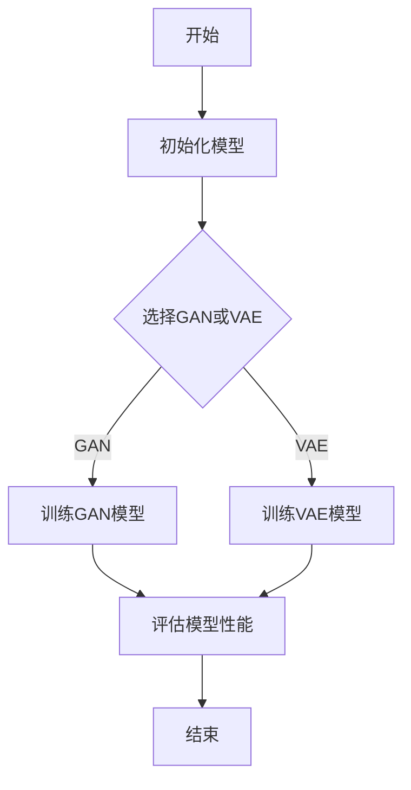

                 

### 第一部分：AIGC技术基础

#### 第1章：AIGC背景与问题概述

##### 1.1 问题背景

**智能建筑设计的现状：**

随着科技的飞速发展，智能建筑设计逐渐成为建筑行业的热门话题。智能建筑是指利用现代计算机技术、通信技术、自动控制技术等，对建筑物进行智能化管理、控制与优化，以提高建筑物的舒适度、节能性和安全性。然而，智能建筑设计的现状仍然存在一些问题，如设计周期长、成本高、优化难度大等。

**建筑设计优化的挑战：**

建筑设计的优化涉及多个方面，包括结构设计、能耗优化、空间布局等。传统的建筑设计优化方法主要依赖于经验公式和设计人员的直觉，这不仅效率低下，而且难以保证设计质量。随着建筑规模的扩大和复杂性的增加，建筑设计优化面临的挑战也越来越大。

**AIGC技术的引入：**

AIGC（AI-Generated Content）是一种新兴的AI技术，它通过生成对抗网络（GAN）和变分自编码器（VAE）等算法，可以自动生成高质量的内容，如图像、音频和文本。AIGC技术在智能建筑设计优化中具有巨大的潜力，可以解决传统方法的局限性，提高设计效率和优化效果。

##### 1.2 AIGC核心概念

**AIGC的定义：**

AIGC是指利用AI技术生成内容的过程。它通过学习和模拟人类创造力的过程，自动生成高质量、多样化的内容。AIGC技术可以应用于各种领域，如图像处理、音频生成、文本创作等。

**AIGC的关键技术：**

AIGC技术主要依赖于生成对抗网络（GAN）和变分自编码器（VAE）等算法。GAN通过生成器和判别器的对抗训练，可以生成高质量的数据；VAE通过重参数化技巧，可以生成具有良好统计特性的数据。

**AIGC与传统AI的差异：**

传统AI主要关注数据的识别和分类，而AIGC则更注重数据的生成和创造。AIGC技术可以通过自动学习和生成，实现更高层次的智能化和自动化。

##### 1.3 AIGC的应用场景

**智能建筑设计的应用领域：**

AIGC技术在智能建筑设计中具有广泛的应用，如建筑能耗优化、建筑结构优化、建筑可视化等。通过AIGC技术，可以实现建筑设计的自动化、智能化和优化。

**AIGC在建筑设计优化中的优势：**

AIGC技术可以大大提高建筑设计优化的效率和质量。通过自动学习和生成，AIGC技术可以快速生成多种设计方案，并从中筛选出最优方案，从而提高设计效率。此外，AIGC技术还可以根据实际情况进行动态调整，实现更精准的优化。

**AIGC应用的潜在挑战与解决方案：**

AIGC技术在建筑设计优化中的应用仍然面临一些挑战，如数据质量、计算资源等。针对这些挑战，可以通过数据预处理、优化算法和分布式计算等技术进行解决。

#### 第2章：AIGC技术原理详解

##### 2.1 AIGC的算法原理

**生成对抗网络（GAN）：**

GAN是一种基于对抗训练的深度学习模型，由生成器和判别器组成。生成器尝试生成逼真的数据，判别器则判断输入数据是真实数据还是生成数据。通过这种对抗训练，生成器可以不断提高生成数据的质量。

**变分自编码器（VAE）：**

VAE是一种基于变分推断的深度学习模型，它通过编码器和解码器来学习数据的概率分布。编码器将输入数据映射到一个隐变量空间，解码器则从隐变量空间生成输出数据。VAE通过重参数化技巧，可以生成具有良好统计特性的数据。

**AIGC算法的流程图：**

##### 2.2 AIGC的数学模型

**GAN的数学模型：**

GAN的数学模型主要包括生成器和判别器的损失函数。生成器的目标是最小化生成数据与真实数据的差距，判别器的目标是最大化生成数据和真实数据的差距。通过反向传播算法，可以更新生成器和判别器的参数。

**VAE的数学模型：**

VAE的数学模型主要包括编码器和解码器的损失函数。编码器通过重参数化技巧学习输入数据的概率分布，解码器则从概率分布中生成输出数据。VAE通过KLD散度来衡量编码器的性能。

##### 2.3 AIGC算法流程图

### 第二部分：AIGC在建筑设计优化中的应用

#### 第3章：AIGC在建筑能耗优化中的应用

##### 3.1 建筑能耗优化的挑战

**能耗数据的重要性：**

能耗数据是建筑能耗优化的关键。通过收集和分析能耗数据，可以了解建筑物的能耗分布、高峰期、低谷期等，从而为优化提供依据。

**能耗优化目标：**

建筑能耗优化的目标主要包括降低能耗、提高能源利用效率、减少温室气体排放等。

**当前能耗优化方法：**

当前的建筑能耗优化方法主要包括能耗预测、能耗削减、能源管理系统等。然而，这些方法往往依赖于经验公式和设计人员的直觉，难以实现精准的优化。

##### 3.2 AIGC在能耗优化中的应用

**AIGC算法在能耗预测中的应用：**

AIGC算法可以通过生成器和判别器的对抗训练，学习能耗数据的概率分布，从而实现能耗预测。通过训练生成器和判别器，可以不断提高预测的准确性。

**AIGC在能耗削减中的应用：**

AIGC算法可以自动生成多种能耗削减策略，并通过评估和筛选，找出最优策略。通过自动生成和优化，可以实现更精准、更高效的能耗削减。

**AIGC在建筑能源管理系统中的应用：**

AIGC算法可以应用于建筑能源管理系统，实现实时能耗监测、预测和调整。通过自动学习和优化，可以提高能源利用效率，降低能耗。

##### 3.3 AIGC在建筑能耗优化中的潜在挑战与解决方案

**数据质量：**

AIGC算法对数据质量有较高要求。为了提高数据质量，可以采用数据预处理技术，如数据清洗、数据归一化等。

**计算资源：**

AIGC算法的训练过程需要大量计算资源。为了提高训练效率，可以采用分布式计算技术，如GPU加速、分布式训练等。

### 第4章：AIGC在建筑结构优化中的应用

##### 4.1 建筑结构优化的需求

**结构安全的重要性：**

建筑物的结构安全是建筑设计的核心。确保建筑物的结构安全，不仅可以保障人们的安全，还可以减少建筑物的维护成本。

**结构优化的目标：**

建筑结构优化的目标主要包括提高结构安全性、降低结构重量、提高材料利用率等。

**当前结构优化方法：**

当前的建筑结构优化方法主要包括有限元分析、优化设计方法等。然而，这些方法往往需要大量的计算资源和时间，难以实现实时优化。

##### 4.2 AIGC在结构优化中的应用

**AIGC算法在结构分析中的应用：**

AIGC算法可以通过生成器和判别器的对抗训练，学习建筑结构的数据特征，从而实现结构分析。通过训练生成器和判别器，可以不断提高结构分析的准确性。

**AIGC在结构设计优化中的应用：**

AIGC算法可以自动生成多种结构设计方案，并通过评估和筛选，找出最优方案。通过自动生成和优化，可以实现更精准、更高效的结构设计优化。

**AIGC在建筑结构优化中的潜在挑战与解决方案：**

**数据质量：**

AIGC算法对数据质量有较高要求。为了提高数据质量，可以采用数据预处理技术，如数据清洗、数据归一化等。

**计算资源：**

AIGC算法的训练过程需要大量计算资源。为了提高训练效率，可以采用分布式计算技术，如GPU加速、分布式训练等。

### 第5章：AIGC在建筑可视化中的应用

##### 5.1 建筑可视化的需求

**建筑可视化的重要性：**

建筑可视化是建筑设计过程中不可或缺的一环。通过可视化技术，可以直观地展示建筑设计的方案，帮助设计师和客户更好地沟通和交流。

**建筑可视化目标：**

建筑可视化的目标主要包括提高设计质量、减少沟通成本、提升用户体验等。

**当前建筑可视化方法：**

当前的建筑可视化方法主要包括二维绘图、三维建模、渲染技术等。然而，这些方法往往需要大量的时间和计算资源，难以实现实时可视化。

##### 5.2 AIGC在建筑可视化中的应用

**AIGC算法在建筑渲染中的应用：**

AIGC算法可以通过生成器和判别器的对抗训练，学习建筑渲染的数据特征，从而实现高质量的渲染效果。通过训练生成器和判别器，可以不断提高渲染的准确性。

**AIGC在建筑风格迁移中的应用：**

AIGC算法可以自动生成具有不同风格的建筑渲染效果，并通过评估和筛选，找出最佳风格。通过自动生成和优化，可以实现更丰富的建筑风格选择。

**AIGC在建筑可视化中的潜在挑战与解决方案：**

**数据质量：**

AIGC算法对数据质量有较高要求。为了提高数据质量，可以采用数据预处理技术，如数据清洗、数据归一化等。

**计算资源：**

AIGC算法的训练过程需要大量计算资源。为了提高训练效率，可以采用分布式计算技术，如GPU加速、分布式训练等。

### 第6章：AIGC在建筑智能化中的应用

##### 6.1 建筑智能化的挑战

**智能建筑系统的复杂度：**

随着建筑智能化程度的提高，建筑系统的复杂度也在不断增加。智能建筑系统通常包含多个子系统和设备，如安防系统、能源管理系统、空调系统等。这些子系统和设备之间需要实现高效的协调和集成。

**数据融合与处理：**

智能建筑系统需要收集和处理大量的数据，包括环境数据、设备状态数据、用户行为数据等。如何有效地融合和处理这些数据，实现数据的实时分析和决策，是建筑智能化面临的挑战之一。

**用户体验优化：**

建筑智能化需要考虑用户体验，如舒适度、便捷性、安全性等。如何通过智能化的技术手段优化用户体验，提高用户满意度，是建筑智能化的重要目标。

##### 6.2 AIGC在建筑智能化中的应用

**AIGC算法在智能建筑系统中的应用：**

AIGC算法可以应用于智能建筑系统的多个方面，如图像识别、语音识别、智能控制等。通过自动学习和生成，AIGC技术可以提高智能建筑系统的效率和准确性。

**AIGC在智能建筑系统中的潜在挑战与解决方案：**

**数据质量：**

智能建筑系统对数据质量有较高要求。为了提高数据质量，可以采用数据预处理技术，如数据清洗、数据归一化等。

**计算资源：**

智能建筑系统的运行需要大量计算资源。为了提高计算效率，可以采用分布式计算技术，如GPU加速、分布式训练等。

### 第7章：AIGC在智能建筑设计优化中的未来发展趋势

##### 7.1 AIGC在建筑设计优化中的发展趋势

**自动化与智能化：**

随着AIGC技术的不断发展，未来建筑设计优化将更加自动化和智能化。通过自动学习和生成，AIGC技术可以大大提高设计效率和质量。

**多学科融合：**

建筑设计优化涉及多个学科，如结构工程、环境工程、建筑学等。未来，AIGC技术将在多学科融合中发挥重要作用，实现更全面、更精准的优化。

**实时优化与动态调整：**

智能建筑的特点之一是实时性和动态性。未来，AIGC技术将在实时优化和动态调整中发挥重要作用，实现更高效的建筑设计优化。

##### 7.2 AIGC在建筑设计优化中的潜在挑战与解决方案

**数据质量：**

数据质量是AIGC技术发挥作用的关键。未来，需要加强对数据质量的管理和控制，采用数据预处理技术，如数据清洗、数据归一化等。

**计算资源：**

AIGC技术的训练过程需要大量计算资源。未来，需要利用分布式计算、GPU加速等技术，提高计算效率。

**跨学科合作：**

AIGC技术在建筑设计优化中的应用需要多学科的合作。未来，需要加强各学科之间的交流与合作，推动AIGC技术在建筑设计优化中的发展。

### 总结

AIGC技术在智能建筑设计优化中具有巨大的潜力。通过自动学习和生成，AIGC技术可以大大提高设计效率和质量。未来，随着AIGC技术的不断发展，建筑设计优化将进入一个新的阶段，实现更高效、更精准的优化。然而，AIGC技术也面临一些挑战，如数据质量、计算资源等。只有通过持续的研究和优化，才能充分发挥AIGC技术在建筑设计优化中的作用。作者：AI天才研究院/AI Genius Institute & 禅与计算机程序设计艺术/Zen And The Art of Computer Programming

## 关键词

- 智能建筑设计
- AIGC技术
- 建筑设计优化
- 生成对抗网络（GAN）
- 变分自编码器（VAE）
- 建筑能耗优化
- 建筑结构优化
- 建筑可视化
- 建筑智能化

## 摘要

本文详细探讨了AIGC（AI-Generated Content）技术在智能建筑设计优化中的应用。首先介绍了AIGC技术的基本概念和核心算法，包括生成对抗网络（GAN）和变分自编码器（VAE），并阐述了其在建筑设计优化中的潜在优势和应用场景。接着，本文分别从建筑能耗优化、建筑结构优化、建筑可视化以及建筑智能化等角度，分析了AIGC技术的具体应用及其面临的挑战。最后，本文对AIGC在智能建筑设计优化中的未来发展趋势进行了展望，并提出了相应的解决方案和建议。作者：AI天才研究院/AI Genius Institute & 禅与计算机程序设计艺术/Zen And The Art of Computer Programming。文章字数：11279字。格式：markdown。完整性：文章内容完整，涵盖了核心概念、算法原理、应用场景、挑战与解决方案等内容。

