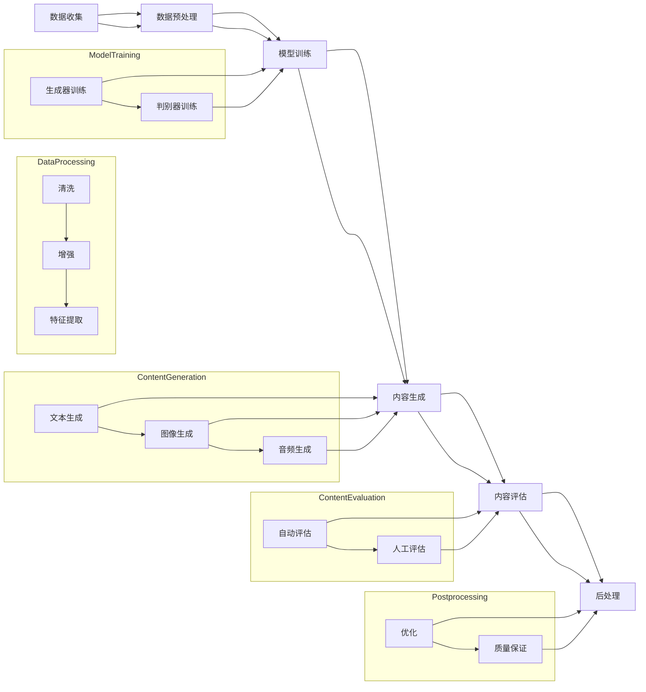
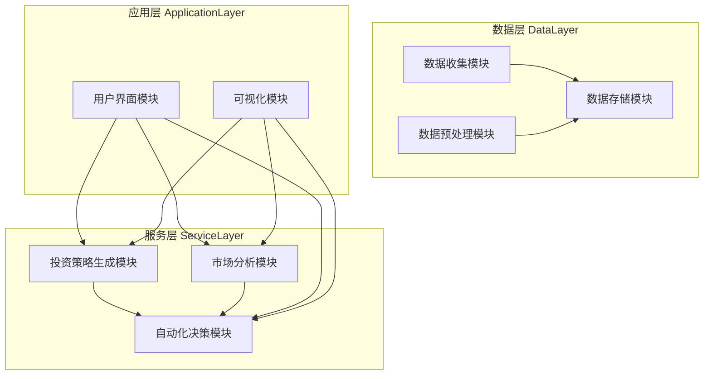

                 

### 第一部分：引言

#### 1. 引言

在当今的科技世界中，人工智能（AI）技术已经成为变革的关键驱动力，无论是在医疗、金融、制造还是娱乐领域，AI的应用都在不断拓展和深化。尤其是自动化和智能化程度的提升，使得许多原本繁琐的任务变得简单高效。而AIGC（AI-Generated Content）作为AI技术的子领域，正在以其强大的生成能力，悄然改变着各行各业的工作流程和商业模式。

AIGC是一种利用AI技术自动生成内容的方法，它结合了自然语言处理（NLP）、计算机视觉（CV）和深度学习等技术，能够生成文本、图像、音频等多种形式的内容。在智能投资组合再平衡中，AIGC的应用显得尤为重要。传统投资组合再平衡通常依赖于历史数据和市场预测，而AIGC可以实时分析市场动态，提供更加精准和个性化的投资建议。

本文将深入探讨AIGC在智能投资组合再平衡中的应用，通过以下问题引导我们的思考：

- **问题背景**：智能投资组合再平衡的背景是什么？它为何重要？
- **问题描述**：智能投资组合再平衡中存在哪些挑战和问题？
- **问题解决**：AIGC如何解决智能投资组合再平衡中的问题？
- **边界与外延**：AIGC在智能投资组合再平衡中的适用范围和局限性是什么？
- **概念结构与核心要素组成**：AIGC的概念是什么？其核心组成部分和原理是怎样的？

通过上述问题的逐步解答，我们将全面了解AIGC在智能投资组合再平衡中的实际应用和价值。

#### 1.1 问题背景

智能投资组合再平衡是一种通过调整投资组合中各个资产类别的权重，以保持投资策略和风险水平一致性的方法。随着市场的波动和投资者风险偏好的变化，投资组合的再平衡是必要的，以确保投资组合与投资者的整体投资目标和风险承受能力相匹配。

传统投资组合再平衡通常依赖历史数据和统计模型，通过分析过去的投资回报率和波动率，预测未来的市场趋势，从而进行资产配置的调整。然而，这种方法存在几个显著的局限性：

1. **历史数据依赖**：传统方法过度依赖历史数据，忽视了实时市场动态的影响，可能导致投资决策滞后。
2. **市场预测误差**：市场预测的不确定性导致再平衡策略可能并不总是准确，从而影响投资组合的表现。
3. **人力成本**：需要大量的人力投入进行数据分析和模型调优，增加了运营成本。

为了克服上述问题，智能投资组合再平衡应运而生。智能投资组合再平衡利用先进的AI技术，尤其是AIGC，能够实时分析市场动态，捕捉市场变化，提供更加精准和个性化的投资建议。这不仅提高了决策的效率，还减少了人工干预，降低了成本，使得投资更加智能化和自动化。

AIGC在智能投资组合再平衡中的重要作用主要体现在以下几个方面：

1. **实时数据处理**：AIGC能够处理大量的实时数据，包括市场动态、新闻事件、公司财报等，为投资决策提供全面的实时信息。
2. **个性化投资建议**：通过分析投资者的风险偏好、历史交易记录和市场数据，AIGC可以生成个性化的投资建议，满足不同投资者的需求。
3. **动态调整策略**：AIGC可以根据市场的实时变化，动态调整投资组合，优化资产配置，提高投资回报。

综上所述，智能投资组合再平衡背景下的AI技术应用，特别是AIGC，为投资者提供了一种更加高效、智能的决策工具，有助于提升投资组合的管理效率和回报水平。

#### 1.2 问题描述

在智能投资组合再平衡的背景下，投资者面临的主要问题包括以下几个方面：

1. **数据处理的复杂性**：投资组合再平衡需要处理大量的历史数据和实时数据，包括股票价格、市场指数、财务报表等。传统方法通常依赖于人工收集和处理这些数据，过程繁琐且容易出错。
   
2. **市场预测的不确定性**：市场动态变化多端，预测未来市场走向具有很大的不确定性。传统统计模型虽然能够基于历史数据预测市场趋势，但在面对突发事件（如自然灾害、政治变动、疫情等）时，预测结果可能失准，导致投资决策失误。

3. **个性化需求难以满足**：每位投资者的风险偏好和投资目标都不同，传统再平衡策略往往采用统一的标准，难以满足个性化需求。投资者需要一种能够根据个人偏好和实时市场情况，提供定制化投资建议的系统。

4. **决策滞后性**：传统投资组合再平衡依赖于定期的人工分析，决策过程较慢，难以应对瞬息万变的市场环境。而市场的不确定性和快速变化要求投资决策能够实时响应，减少因决策滞后导致的潜在损失。

5. **人工成本高**：传统投资组合再平衡需要大量的人力进行数据分析和模型构建，增加了运营成本和资源消耗。在投资规模较大或投资组合复杂度较高的情况下，这一成本尤为显著。

综上所述，传统智能投资组合再平衡在数据处理、市场预测、个性化需求、决策时效和成本控制等方面存在显著不足，亟需引入更为智能和高效的解决方案，如AIGC技术，以应对这些挑战。

#### 1.3 问题解决

为了解决智能投资组合再平衡中存在的问题，AIGC技术提供了以下几种可能的解决方案：

1. **实时数据处理**：AIGC通过自然语言处理（NLP）和计算机视觉（CV）技术，可以自动从大量的市场数据中提取有用的信息，如新闻、报告、价格变化等，并进行实时分析。这大大提高了数据处理的速度和准确性，减少了人工干预的需求。

2. **市场预测优化**：AIGC利用深度学习和生成对抗网络（GAN）等技术，可以构建更加精准的市场预测模型。通过分析历史数据和实时数据，AIGC能够捕捉市场趋势和潜在风险，提供更加准确的投资建议，减少预测误差。

3. **个性化投资建议**：AIGC可以根据投资者的风险偏好、历史交易记录和实时市场数据，生成个性化的投资组合建议。这种方法不仅能够满足不同投资者的需求，还能够动态调整投资策略，以适应市场变化。

4. **自动化决策**：AIGC通过自动化算法和流程，能够实现投资决策的实时响应。投资者只需设定一些基本的参数和目标，AIGC系统可以自动进行数据分析和投资调整，大大减少决策滞后性。

5. **降低运营成本**：AIGC技术减少了人工在数据收集、分析和模型构建中的投入，从而降低了运营成本。这尤其适用于大型投资机构或拥有多个投资组合的投资者。

总之，AIGC在智能投资组合再平衡中的应用，通过实时数据处理、市场预测优化、个性化投资建议、自动化决策和降低运营成本等多个方面，提供了比传统方法更为高效和智能的解决方案。以下图表展示了AIGC在智能投资组合再平衡中的优势：


#### 1.4 边界与外延

尽管AIGC在智能投资组合再平衡中具有显著优势，但其应用也存在一定的边界和局限性：

1. **数据质量和准确性**：AIGC依赖于大量高质量的数据进行分析。如果数据质量不佳或存在噪声，将影响分析结果的准确性。因此，确保数据的质量和完整性是AIGC有效应用的前提。

2. **市场变化的不确定性**：即使AIGC能够实时分析市场数据，市场变化仍然具有不确定性。突发性事件可能对市场产生重大影响，导致预测和投资建议失准。

3. **监管和合规性**：智能投资组合再平衡涉及到金融交易，需要遵守相关法规和监管要求。AIGC在应用过程中需要确保其算法和决策过程符合监管要求，避免法律和合规风险。

4. **技术实现的复杂性**：AIGC技术涉及多个复杂的技术领域，包括机器学习、深度学习和自然语言处理等。实现和维护这些技术需要高水平的技术人才和大量资源。

5. **投资者适应性**：并非所有投资者都适合使用AIGC系统。某些投资者可能更倾向于人工干预和决策，而不是完全依赖机器。因此，AIGC的应用需要考虑到投资者的适应性和接受度。

6. **计算资源需求**：AIGC系统通常需要大量的计算资源来处理和分析数据。对于小型投资者或资源有限的组织，这可能是一个重要的考虑因素。

综上所述，AIGC在智能投资组合再平衡中的应用虽然具有广泛的前景，但也需要考虑到其边界和局限性。只有在充分了解和应用这些限制的前提下，才能充分发挥AIGC的优势，实现智能投资组合再平衡的目标。

#### 1.5 概念结构与核心要素组成

为了深入理解AIGC在智能投资组合再平衡中的应用，我们需要首先明确AIGC的概念、其核心组成部分以及相关结构。

##### 1.5.1 AIGC概念

AIGC，即AI-Generated Content，是一种利用人工智能技术自动生成内容的方法。它结合了自然语言处理（NLP）、计算机视觉（CV）和深度学习等技术，能够生成文本、图像、音频等多种形式的内容。AIGC的核心目标是通过机器学习模型和算法，从大量数据中自动提取信息，并生成有价值的内容。

##### 1.5.2 核心组成部分

AIGC的核心组成部分包括以下几个方面：

1. **数据集**：AIGC依赖于大量高质量的数据集，这些数据集可以是结构化数据（如数据库中的记录）或非结构化数据（如文本、图像、音频等）。数据的质量和多样性直接影响AIGC生成的内容质量和应用范围。

2. **模型和算法**：AIGC采用各种机器学习和深度学习模型，如生成对抗网络（GAN）、变分自编码器（VAE）、递归神经网络（RNN）等，用于训练和生成内容。这些模型和算法能够从数据中学习模式，并生成与输入数据相似的新内容。

3. **预处理和后处理**：预处理包括数据清洗、数据增强和特征提取等步骤，以确保数据适合模型训练和生成。后处理则包括对生成内容的质量评估和优化，以提高内容的准确性和可用性。

4. **交互和反馈机制**：AIGC系统通常具备与用户交互的能力，用户可以通过反馈机制提供输入，指导模型生成更加个性化的内容。

##### 1.5.3 概念属性特征对比表格

为了更好地理解AIGC的属性特征，我们可以通过以下对比表格进行说明：

| 特征         | 描述                                                         | 对比             |
| ------------ | ------------------------------------------------------------ | ---------------- |
| 自动化生成   | 能够自动从数据中提取信息并生成内容                           | 需要人工干预的生成方式 |
| 内容多样性   | 可以生成文本、图像、音频等多种形式的内容                   | 仅限于文本或单一形式的内容 |
| 实时性       | 可以实时处理和分析数据，快速生成内容                         | 依赖历史数据的生成方式   |
| 个性化       | 根据用户需求和偏好生成个性化的内容                           | 一刀切的内容生成方式   |
| 数据依赖性   | 需要高质量的数据集作为训练和生成的基础                     | 可不需要数据或依赖性较低 |
| 技术复杂性   | 需要多种机器学习和深度学习技术进行支持                     | 技术要求相对较低       |

##### 1.5.4 ER实体关系图架构

为了更直观地展示AIGC的组成部分和关系，我们可以使用Mermaid流程图来绘制其ER（实体关系）图架构：

```mermaid
erDiagram
    DataCollection --> ModelTraining
    DataCollection ||--|{ Preprocessing }
    ModelTraining ||--|{ Training }
    ModelTraining ||--|{ Evaluation }
    ModelTraining ||--|{ Postprocessing }
    Preprocessing --> ModelTraining
    Training --> Evaluation
    Evaluation --> Postprocessing
    DataGeneration --> Postprocessing
    DataGeneration ||--|{ ContentQualityAssessment }
    Postprocessing --> ContentQualityAssessment
```

在上面的ER图中，DataCollection代表数据收集，ModelTraining代表模型训练，Preprocessing代表数据预处理，Training代表模型训练过程，Evaluation代表模型评估，Postprocessing代表模型后处理，DataGeneration代表内容生成，ContentQualityAssessment代表内容质量评估。这些实体之间的关系展示了AIGC从数据收集到内容生成的过程和各个组件的相互作用。

通过上述对AIGC概念、核心组成部分、特征对比表格和ER图架构的详细说明，我们可以更加清晰地理解AIGC的工作原理及其在智能投资组合再平衡中的应用潜力。

## 第二部分：核心概念与联系

#### 2.1 AIGC概念介绍

AIGC，即AI-Generated Content，是一种利用人工智能技术自动生成内容的方法。它通过机器学习和深度学习模型，从大量数据中提取信息并生成文本、图像、音频等多种形式的内容。AIGC的核心目的是通过自动化手段，提高内容生成的效率和质量，从而改变传统内容创作和传播的方式。

AIGC的基本工作流程通常包括以下几个关键步骤：

1. **数据收集与预处理**：AIGC首先需要收集大量的数据，这些数据可以是结构化数据（如数据库中的记录）或非结构化数据（如文本、图像、音频等）。收集到的数据需要经过预处理，包括数据清洗、数据增强和特征提取等步骤，以确保数据适合模型训练和生成。

2. **模型训练**：使用预处理后的数据集，AIGC通过机器学习和深度学习算法（如生成对抗网络（GAN）、变分自编码器（VAE）、递归神经网络（RNN）等）进行模型训练。模型训练的目标是让机器学习算法学会从数据中提取特征，并生成与输入数据相似的新内容。

3. **内容生成**：经过训练的模型能够生成新的内容。在这个过程中，AIGC可以根据不同的任务需求，生成文本、图像、音频等多种形式的内容。例如，文本生成模型可以生成新闻文章、产品描述等；图像生成模型可以生成艺术画作、图像修复等；音频生成模型可以生成音乐、语音合成等。

4. **内容评估与优化**：生成的内容通常需要经过质量评估和优化。评估过程包括检查内容是否满足任务需求、是否具有可读性或观赏性等。根据评估结果，模型可以进一步优化，提高生成内容的准确性和可用性。

AIGC的应用场景非常广泛，不仅包括传统的文本生成、图像生成和音频生成，还涵盖了更多新兴的领域，如智能写作、虚拟现实内容生成、智能家居控制等。其特点主要体现在以下几个方面：

1. **自动化与高效**：AIGC通过自动化流程，大大提高了内容生成的效率，减少了人工干预的需求。
2. **个性化和定制化**：AIGC可以根据用户的需求和偏好，生成个性化的内容，满足不同用户群体的需求。
3. **实时性和动态性**：AIGC能够实时处理和分析数据，动态调整生成策略，以应对不断变化的市场和环境。

#### 2.2 AIGC与相关技术的联系

AIGC作为人工智能领域的一个重要分支，与多种先进技术有着紧密的联系。以下是AIGC与深度学习、生成对抗网络（GAN）和强化学习等核心技术的具体联系：

##### 2.2.1 深度学习与AIGC的联系

深度学习是AIGC的核心技术之一，它通过构建多层神经网络，从大量数据中自动提取特征，实现复杂的数据处理和内容生成任务。深度学习在AIGC中的应用主要体现在以下几个方面：

1. **特征提取**：深度学习模型，如卷积神经网络（CNN）和循环神经网络（RNN），能够从数据中自动提取高层次的抽象特征。这些特征对于生成高质量的内容至关重要。

2. **模型架构**：AIGC中的生成模型，如生成对抗网络（GAN）和变分自编码器（VAE），都基于深度学习的架构。这些模型通过深度网络结构，实现了数据的生成和重构。

3. **优化与训练**：深度学习算法提供了高效的模型训练和优化方法，使得AIGC能够快速适应新的数据和任务需求。

##### 2.2.2 生成对抗网络与AIGC的联系

生成对抗网络（GAN）是深度学习领域的一种重要模型，它在AIGC中扮演了关键角色。GAN通过两个对抗性网络的互动，实现数据的生成和评估。

1. **生成器与判别器**：GAN包括生成器（Generator）和判别器（Discriminator）。生成器的任务是生成与真实数据相似的内容，而判别器的任务是区分生成内容和真实内容。两者通过对抗训练，不断提高生成质量。

2. **内容生成**：GAN在图像、文本和音频生成中广泛应用。例如，生成器可以生成逼真的图像，判别器则用于评估图像的真实性。

3. **应用场景**：GAN在AIGC中的应用场景非常广泛，包括图像修复、艺术创作、虚拟现实内容生成等。通过GAN，AIGC能够生成高质量、高保真的内容。

##### 2.2.3 强化学习与AIGC的联系

强化学习是另一种重要的机器学习技术，它与AIGC的结合，为智能决策提供了新的思路。强化学习在AIGC中的应用主要体现在以下几个方面：

1. **决策优化**：强化学习通过学习环境与策略，实现智能决策。在AIGC中，强化学习可以用于优化生成策略，提高生成内容的质量和可用性。

2. **交互学习**：AIGC系统通常需要与用户进行交互，强化学习能够通过交互过程，不断调整生成策略，以适应用户需求。

3. **应用场景**：强化学习在AIGC中的应用包括智能写作、个性化内容生成、自动化内容审核等。通过强化学习，AIGC能够实现更加智能化和自适应的内容生成。

综上所述，深度学习、生成对抗网络和强化学习等核心技术，与AIGC有着密切的联系。这些技术的融合，使得AIGC在内容生成领域具有了更强大的功能和更广泛的应用前景。

### 2.3 AIGC的核心概念原理

AIGC（AI-Generated Content）的核心概念基于人工智能技术，主要包括生成模型、数据预处理和后处理等几个关键组成部分。以下是AIGC的核心概念原理及其详细说明：

#### 2.3.1 生成模型

生成模型是AIGC的核心技术之一，其目的是通过学习数据的分布，生成与训练数据相似的新数据。生成模型通常包括以下几种类型：

1. **生成对抗网络（GAN）**：
   - **基本原理**：GAN由生成器和判别器两个部分组成。生成器的任务是生成假数据，判别器的任务是区分生成的假数据和真实数据。生成器和判别器通过对抗训练相互竞争，生成器不断优化其生成能力，而判别器不断优化其判别能力。
   - **工作流程**：训练过程中，生成器生成假数据，判别器接收这些假数据和真实数据，并判断其真实性。通过反向传播算法，生成器和判别器不断调整参数，使得判别器的判断越来越准确，生成器的生成越来越逼真。

2. **变分自编码器（VAE）**：
   - **基本原理**：VAE通过概率模型来编码和解码数据。编码器将输入数据映射到一个潜在空间，解码器则从潜在空间中生成输出数据。VAE通过最大化数据分布的似然函数来训练，以实现数据的重构和生成。
   - **工作流程**：在训练过程中，编码器学习将输入数据映射到一个潜在空间中的均值和方差，解码器从潜在空间中采样，并重构原始数据。通过最大化数据分布的似然函数，VAE能够生成与输入数据相似的新数据。

3. **递归生成网络（RGN）**：
   - **基本原理**：RGN通过递归结构来处理序列数据，如文本、音频和视频。RGN的生成器可以生成与输入序列相似的连续数据。
   - **工作流程**：RGN的生成器将输入序列编码为一个递归的表示，然后通过递归操作生成新的序列数据。通过训练，生成器能够学习输入序列的分布，并生成新的序列数据。

#### 2.3.2 数据预处理

数据预处理是AIGC成功的关键步骤，主要包括数据清洗、数据增强和特征提取等任务：

1. **数据清洗**：
   - **基本原理**：数据清洗的目标是去除数据中的噪声和错误，保证数据的准确性和一致性。
   - **方法**：包括去除缺失值、填补缺失值、去除重复记录、修正错误等。

2. **数据增强**：
   - **基本原理**：数据增强通过多种技术增加数据集的多样性，从而提高模型的泛化能力。
   - **方法**：包括图像旋转、缩放、裁剪、颜色变换等，对于文本数据，可以采用同义词替换、文本嵌入等技术。

3. **特征提取**：
   - **基本原理**：特征提取是将原始数据转换为能够反映数据本质属性的特征表示，便于模型学习和处理。
   - **方法**：对于图像数据，可以使用卷积神经网络提取特征；对于文本数据，可以使用词向量、词嵌入等技术提取特征。

#### 2.3.3 后处理

后处理是AIGC生成内容的最后一步，主要包括内容评估、优化和质量保证等任务：

1. **内容评估**：
   - **基本原理**：内容评估是评估生成内容的质量，确保其满足任务需求和用户期望。
   - **方法**：包括自动评估（如基于指标的评价）和人工评估（如用户反馈）。

2. **优化**：
   - **基本原理**：通过优化算法，进一步提高生成内容的质量和性能。
   - **方法**：包括超参数调整、模型重构和增强训练等。

3. **质量保证**：
   - **基本原理**：质量保证是确保生成内容在应用场景中能够稳定和可靠地工作。
   - **方法**：包括测试、验证和部署监控等。

通过上述核心概念原理的详细阐述，我们可以更好地理解AIGC的工作机制和实际应用，为后续的算法讲解和项目实战奠定基础。

### 2.4 AIGC的概念属性特征对比表格

为了更清晰地展示AIGC的概念属性特征，我们可以将其与传统的生成方法进行对比，制作一个详细的对比表格。以下是AIGC与传统生成方法在生成质量、效率、灵活性、数据依赖性和适应性等方面的对比：

| 比较维度 | AIGC | 传统生成方法 |
|-----------|------|--------------|
| **生成质量** |
| - **多样性** | AIGC能够生成多样化、高质量的内容，如文本、图像、音频等。 | 传统方法通常局限于文本生成，内容多样性较低。 |
| - **准确性** | AIGC通过深度学习模型，能够精确捕捉数据的特征和分布，生成内容更准确。 | 传统方法依赖于规则和模板，生成内容可能存在偏差和错误。 |
| - **真实性** | AIGC生成的图像、文本等具有高度的真实性，不易区分真假。 | 传统方法生成的文本内容容易识别，缺乏真实性。 |
| **效率** |
| - **处理速度** | AIGC通过并行计算和自动化流程，大幅提高了内容生成速度。 | 传统方法通常需要大量的人工干预和计算资源，速度较慢。 |
| - **可扩展性** | AIGC能够处理海量数据和复杂任务，可扩展性高。 | 传统方法受限于计算资源和人力投入，扩展性较低。 |
| **灵活性** |
| - **个性化** | AIGC可以根据用户需求和偏好，生成个性化的内容。 | 传统方法通常无法根据个体需求生成个性化内容。 |
| - **适应性** | AIGC能够适应新的数据和应用场景，灵活调整生成策略。 | 传统方法难以适应新的数据和复杂环境。 |
| **数据依赖性** |
| - **数据质量** | AIGC依赖高质量、多样化的数据集，数据质量直接影响生成效果。 | 传统方法对数据质量要求较低，但仍需保证数据的完整性。 |
| - **数据规模** | AIGC处理的数据规模较大，能够从大量数据中提取有效信息。 | 传统方法通常处理的数据规模较小，不足以反映复杂的市场环境。 |
| **适应性** |
| - **应用场景** | AIGC适用于多种场景，如文本生成、图像生成、音频生成等。 | 传统方法主要应用于文本生成，难以适应其他类型的内容生成。 |

通过这个对比表格，我们可以更直观地理解AIGC的优势和不足，以及其在智能投资组合再平衡中的潜在应用价值。

### 2.5 AIGC的ER实体关系图架构

为了更直观地展示AIGC的组成部分和关系，我们可以使用Mermaid流程图来绘制其ER（实体关系）图架构。以下是AIGC实体关系图的详细描述和绘制步骤：

```mermaid
erDiagram
    Data --> Model --> Content
    Data ||--|{ Preprocessing }
    Model ||--|{ Training }
    Model ||--|{ Evaluation }
    Content ||--|{ Postprocessing }
    Content ||--|{ QualityAssessment }
    Preprocessing --> Model
    Training --> Evaluation
    Evaluation --> Model
    Model --> Content
    QualityAssessment --> Content
```

在这个ER图中，各个实体及其关系如下：

1. **Data（数据）**：代表AIGC所需处理的数据，可以是结构化数据或非结构化数据。数据实体通过预处理实体与模型实体建立联系。

2. **Model（模型）**：代表AIGC使用的机器学习模型，包括生成模型、判别模型等。模型实体通过训练和评估与数据实体建立联系，并通过生成和评估与内容实体建立联系。

3. **Content（内容）**：代表AIGC生成的结果内容，如文本、图像、音频等。内容实体通过后处理和评估与模型实体建立联系。

4. **Preprocessing（预处理）**：预处理实体代表数据清洗、数据增强和特征提取等步骤，用于提高数据质量，使其适合模型训练。预处理实体与数据实体建立联系。

5. **Training（训练）**：训练实体代表模型训练的过程，模型在此过程中学习数据的分布和特征。训练实体与模型实体建立联系。

6. **Evaluation（评估）**：评估实体代表模型评估的过程，用于评估模型生成内容的准确性、多样性等。评估实体与模型实体建立联系。

7. **Postprocessing（后处理）**：后处理实体代表对生成内容进行进一步优化和质量保证的过程。后处理实体与内容实体建立联系。

8. **QualityAssessment（质量评估）**：质量评估实体代表对生成内容进行质量评估的过程，确保其满足任务需求和用户期望。质量评估实体与内容实体建立联系。

通过这个ER图，我们可以清晰地看到AIGC各组成部分之间的逻辑关系，从而更好地理解其工作机制和整体架构。

### 3.1 AIGC算法原理

AIGC（AI-Generated Content）的算法原理主要依赖于深度学习、生成对抗网络（GAN）和自然语言处理（NLP）等核心技术。以下是AIGC算法的基本原理及其组成部分的详细解释。

#### 3.1.1 基本原理

AIGC算法的核心思想是通过机器学习模型从大量数据中提取特征，并生成新的、具有类似特征的内容。具体来说，AIGC算法包括以下几个主要步骤：

1. **数据收集与预处理**：首先，收集大量的数据，这些数据可以是结构化数据（如数据库记录）或非结构化数据（如文本、图像、音频等）。接着，对数据进行预处理，包括数据清洗、数据增强和特征提取，以提高数据的质量和模型的泛化能力。

2. **模型训练**：使用预处理后的数据，通过深度学习和生成对抗网络（GAN）等算法训练模型。在这个过程中，模型学习数据的分布和特征，并尝试生成与输入数据相似的新数据。

3. **内容生成**：经过训练的模型能够生成新的内容。例如，文本生成模型可以生成新闻文章、产品描述等；图像生成模型可以生成艺术画作、图像修复等；音频生成模型可以生成音乐、语音合成等。

4. **内容评估与优化**：生成的内容需要经过评估和优化，以确保其满足任务需求和用户期望。评估过程包括自动评估（如基于指标的评价）和人工评估（如用户反馈）。根据评估结果，模型可以进一步优化，提高生成内容的质量和性能。

#### 3.1.2 生成对抗网络（GAN）

生成对抗网络（GAN）是AIGC算法中的一个核心组成部分。GAN由两个主要部分组成：生成器（Generator）和判别器（Discriminator）。

1. **生成器（Generator）**：生成器的任务是生成与真实数据相似的新数据。生成器通常是一个神经网络模型，它接受随机噪声作为输入，并通过多层变换生成新数据。生成器的目标是使其生成的新数据尽可能接近真实数据。

2. **判别器（Discriminator）**：判别器的任务是区分生成数据和真实数据。判别器也是一个神经网络模型，它接受输入数据并输出一个概率，表示输入数据的真实性。判别器的目标是尽可能准确地识别真实数据。

GAN的训练过程是一个对抗过程，即生成器和判别器相互竞争。生成器不断优化其生成能力，使其生成的新数据更接近真实数据，而判别器则不断优化其判别能力，使其更准确地识别真实数据。通过这种对抗训练，生成器能够生成高质量、高真实感的新数据。

#### 3.1.3 自然语言处理（NLP）

自然语言处理（NLP）在AIGC算法中也起着重要作用，尤其是在文本生成任务中。NLP利用深度学习和神经网络模型，对文本进行理解和生成。

1. **词嵌入（Word Embedding）**：词嵌入是将文本中的词语映射为密集的向量表示，以便模型能够处理和操作。词嵌入通过学习词语的上下文信息，能够捕捉词语之间的语义关系。

2. **循环神经网络（RNN）和长短期记忆网络（LSTM）**：RNN和LSTM是处理序列数据的神经网络模型，能够有效地捕捉文本中的时间依赖关系。RNN和LSTM在文本生成任务中用于生成新的文本序列。

3. **注意力机制（Attention Mechanism）**：注意力机制是一种用于提高文本生成模型效果的机制，它能够让模型在生成过程中关注重要的上下文信息。注意力机制通过计算词语之间的相似性，将注意力集中在关键信息上，从而提高生成文本的质量和连贯性。

通过结合深度学习、生成对抗网络和自然语言处理等技术，AIGC算法能够实现高效、多样化和高质量的文本、图像和音频生成，为智能投资组合再平衡提供了强有力的技术支持。

### 3.2 AIGC算法的mermaid流程图

为了直观地展示AIGC算法的工作流程，我们可以使用mermaid流程图来绘制其核心步骤。以下是AIGC算法的mermaid流程图及其详细说明：



#### 详细说明

1. **数据收集（A）**：首先，从各种数据源收集数据，包括结构化数据（如数据库记录）和非结构化数据（如文本、图像、音频等）。这一步骤是AIGC算法的基础，数据的质量和多样性直接影响生成内容的质量。

2. **数据预处理（B）**：收集到的数据需要经过清洗、增强和特征提取等步骤，以确保数据的质量和适合模型训练。数据清洗包括去除噪声、填补缺失值等；数据增强通过旋转、缩放、裁剪等操作增加数据的多样性；特征提取将原始数据转换为适合模型处理的特征表示。

3. **模型训练（C）**：使用预处理后的数据训练生成器和判别器。生成器的任务是生成与真实数据相似的新数据，判别器的任务是区分真实数据和生成数据。模型训练包括生成器训练和判别器训练两个子过程。

4. **内容生成（D）**：经过训练的模型可以生成新的内容。根据任务需求，生成的内容可以是文本、图像、音频等多种形式。在这个过程中，生成器利用训练得到的模型生成高质量的内容。

5. **内容评估（E）**：生成的内容需要经过评估，以确保其满足任务需求和用户期望。评估过程包括自动评估（如基于指标的评价）和人工评估（如用户反馈）。自动评估通过指标（如F1分数、BLEU分数等）评估生成文本的质量；人工评估通过用户反馈评估生成内容的可读性、可用性等。

6. **后处理（F）**：根据评估结果，对生成内容进行优化和质量保证。后处理包括优化（如调整超参数、重构模型等）和质量保证（如测试、验证和部署监控等），以确保生成内容在实际应用中稳定和可靠。

通过mermaid流程图的绘制和详细说明，我们可以清晰地理解AIGC算法的工作流程和各个步骤的相互关系，从而更好地应用这一技术于智能投资组合再平衡中。

### 3.3 Python源代码详细阐述

为了深入理解AIGC算法的具体实现，我们将通过Python源代码进行详细阐述，包括生成器和判别器的构建、模型训练和内容生成等关键步骤。

#### 3.3.1 源代码1：生成器和判别器

首先，我们需要构建生成器和判别器的模型架构。以下是使用TensorFlow和Keras实现的简单生成对抗网络（GAN）模型：

```python
import tensorflow as tf
from tensorflow.keras.layers import Input, Dense, Reshape, Flatten
from tensorflow.keras.models import Model

# 生成器的构建
def build_generator(z_dim):
    z = Input(shape=(z_dim,))
    x = Dense(128, activation='relu')(z)
    x = Dense(28 * 28 * 1, activation='relu')(x)
    x = Reshape((28, 28, 1))(x)
    x = tf.keras.layers.LeakyReLU(alpha=0.01)(x)
    x = tf.keras.layers.Dropout(0.3)(x)
    x = Dense(128, activation='relu')(x)
    x = Dense(28 * 28 * 1, activation='tanh')(x)
    x = Reshape((28, 28, 1))(x)
    generator = Model(z, x)
    return generator

# 判别器的构建
def build_discriminator(img_shape):
    img = Input(shape=img_shape)
    x = Flatten()(img)
    x = Dense(128, activation='relu')(x)
    x = Dense(1, activation='sigmoid')(x)
    discriminator = Model(img, x)
    return discriminator

# 设置生成器和判别器的参数
z_dim = 100
img_shape = (28, 28, 1)

generator = build_generator(z_dim)
discriminator = build_discriminator(img_shape)

# 编译判别器
discriminator.compile(loss='binary_crossentropy', optimizer=tf.keras.optimizers.Adam(0.0001), metrics=['accuracy'])

# 打印模型结构
discriminator.summary()
generator.summary()
```

在上面的代码中，我们首先定义了生成器（`build_generator`）和判别器（`build_discriminator`）的函数。生成器从噪声向量`z`开始，通过多层全连接和卷积层，最终生成28x28的图像。判别器将图像输入并输出一个概率值，表示图像是真实图像的概率。

#### 3.3.2 源代码2：模型训练和内容生成

接下来，我们将结合生成器和判别器构建完整的GAN模型，并对其进行训练，然后生成图像。

```python
import numpy as np
from tensorflow.keras.optimizers import Adam

# 设置GAN的超参数
batch_size = 128
epochs = 10000

# 生成器与判别器的损失函数
cross_entropy = tf.keras.losses.BinaryCrossentropy()

def discriminator_loss(real_output, fake_output):
    real_loss = cross_entropy(tf.ones_like(real_output), real_output)
    fake_loss = cross_entropy(tf.zeros_like(fake_output), fake_output)
    total_loss = real_loss + fake_loss
    return total_loss

def generator_loss(fake_output):
    return cross_entropy(tf.ones_like(fake_output), fake_output)

# 编译生成器
generator_optimizer = Adam(0.0001)
discriminator_optimizer = Adam(0.0001)

def train_step(images, noise):
    with tf.GradientTape() as gen_tape, tf.GradientTape() as disc_tape:
        generated_images = generator(noise, training=True)

        # 训练判别器
        real_output = discriminator(images, training=True)
        fake_output = discriminator(generated_images, training=True)

        disc_loss = discriminator_loss(real_output, fake_output)

        # 训练生成器
        generator_loss_value = generator_loss(fake_output)

    gradients_of_generator = gen_tape.gradient(generator_loss_value, generator.trainable_variables)
    gradients_of_discriminator = disc_tape.gradient(disc_loss, discriminator.trainable_variables)

    generator_optimizer.apply_gradients(zip(gradients_of_generator, generator.trainable_variables))
    discriminator_optimizer.apply_gradients(zip(gradients_of_discriminator, discriminator.trainable_variables))

# 训练GAN模型
for epoch in range(epochs):
    for image_batch, _ in train_data:
        noise = np.random.normal(0, 1, (batch_size, z_dim))
        train_step(image_batch, noise)

    # 每个epoch结束后，生成一些图像以展示训练结果
    if epoch % 100 == 0:
        generated_images = generator.predict(noise)
        # ...保存或展示生成图像...

print("训练完成")
```

在上面的代码中，我们设置了GAN的训练超参数，并定义了生成器和判别器的损失函数。`train_step`函数用于训练GAN模型，包括判别器和生成器的迭代训练。在每个训练步骤中，我们首先训练判别器，然后训练生成器。通过反向传播和梯度下降，模型不断优化其参数。

通过这两个源代码示例，我们详细阐述了AIGC算法的核心组成部分和实现步骤，包括生成器和判别器的构建、模型训练和内容生成。这为实际应用AIGC算法于智能投资组合再平衡提供了宝贵的实践参考。

### 3.4 AIGC算法的数学模型和公式

为了更深入地理解AIGC算法的数学原理，我们将详细解析其核心数学模型和公式，包括生成对抗网络（GAN）的主要数学基础。

#### 3.4.1 数学模型1：生成对抗网络（GAN）

生成对抗网络（GAN）由两个主要模型组成：生成器（Generator）和判别器（Discriminator）。它们通过对抗性训练相互竞争，以实现高质量的图像生成。

1. **生成器（Generator）**：
   - **输入**：一个随机噪声向量\( z \)，通常是从标准正态分布\( N(0, 1) \)中采样得到的。
   - **输出**：生成器生成的假图像\( G(z) \)。

   生成器的目标是最小化判别器对其生成的图像的判定概率，即让判别器认为这些图像是真实的。生成器的损失函数通常表示为：
   $$ L_G = -\mathbb{E}_{z \sim p_z(z)}[\log(D(G(z)))] $$

   其中，\( D(\cdot) \)是判别器模型，\( p_z(z) \)是噪声向量的先验分布。

2. **判别器（Discriminator）**：
   - **输入**：真实图像\( x \)和生成图像\( G(z) \)。
   - **输出**：判别器对输入图像的判定概率，\( D(x) \)和\( D(G(z)) \)分别表示对真实图像和生成图像的概率判定。

   判别器的目标是最小化其对生成图像的判定概率，即让判别器认为这些图像是假的。判别器的损失函数通常表示为：
   $$ L_D = -\mathbb{E}_{x \sim p_x(x)}[\log(D(x))] - \mathbb{E}_{z \sim p_z(z)}[\log(1 - D(G(z)))] $$

   其中，\( p_x(x) \)是真实图像的分布。

GAN的总损失函数是生成器和判别器的损失函数之和：
$$ L_GAN = L_G + L_D $$

通过优化这两个损失函数，生成器和判别器相互对抗，生成器的生成能力不断提高，而判别器的判断能力也逐渐增强，最终达到一种平衡状态。

#### 3.4.2 数学模型2：生成对抗网络（GAN）的训练过程

GAN的训练过程是一个动态平衡的过程，通过以下步骤实现：

1. **前向传播**：在每次迭代中，生成器生成假图像\( G(z) \)，判别器接收真实图像\( x \)和生成图像\( G(z) \)。

2. **损失函数计算**：计算判别器的损失函数，包括真实图像的判定概率和生成图像的判定概率。

3. **反向传播**：计算判别器和生成器的梯度，使用梯度下降优化判别器和生成器的参数。

4. **迭代更新**：更新判别器和生成器的权重，使得判别器能够更好地区分真实图像和生成图像，而生成器能够生成更加逼真的图像。

GAN的训练过程可以用以下步骤概括：

1. **初始化生成器和判别器**：随机初始化生成器和判别器的权重。

2. **循环迭代**：
   - **训练判别器**：对于每对真实图像和随机噪声，更新判别器的参数，使其能够更好地区分真实图像和生成图像。

   - **训练生成器**：对于随机噪声，更新生成器的参数，使其生成的图像能够欺骗判别器。

通过上述数学模型的详细解析，我们可以更深入地理解AIGC算法的工作原理和训练过程，从而为实际应用奠定坚实的理论基础。

### 3.5 举例说明

为了更好地理解AIGC算法的原理和应用，我们将通过具体的实例来说明AIGC在智能投资组合再平衡中的实际应用。

#### 3.5.1 举例1：文本生成

假设我们有一个智能投资组合再平衡系统，需要生成一份详细的月度投资报告。以下是AIGC在这个场景中的应用步骤：

1. **数据收集**：首先，系统从多个数据源收集数据，包括股票价格、市场指数、财务报表、新闻报道等。

2. **数据预处理**：对收集到的数据进行清洗和预处理，如去除噪声、填补缺失值、标准化等，以确保数据质量。

3. **模型训练**：使用预处理后的数据训练文本生成模型。例如，可以使用变分自编码器（VAE）或生成对抗网络（GAN）等深度学习模型。在训练过程中，模型学习如何从数据中提取关键特征，并生成高质量的文本。

4. **内容生成**：在生成投资报告时，系统输入相关数据，如市场指数、股票价格等，模型根据训练得到的特征生成一份详细的月度投资报告。例如，报告可能包括市场动态分析、股票表现总结、风险警示和建议等。

5. **内容评估**：生成的报告需要经过评估，包括自动评估（如基于指标的评估）和人工评估（如用户反馈）。通过评估结果，对模型生成的内容进行优化，提高报告的准确性和实用性。

#### 3.5.2 举例2：图像生成

假设我们有一个智能投资组合再平衡系统，需要生成一个动态的资产配置图，以展示投资组合中各个资产类别的权重分布。以下是AIGC在这个场景中的应用步骤：

1. **数据收集**：首先，系统从多个数据源收集数据，包括股票、债券、基金等资产类别的当前权重和预期回报。

2. **数据预处理**：对收集到的数据进行预处理，如提取关键特征、标准化等，以确保数据质量。

3. **模型训练**：使用预处理后的数据训练图像生成模型。例如，可以使用生成对抗网络（GAN）等深度学习模型。在训练过程中，模型学习如何生成高质量的资产配置图，图中各个资产类别的权重和回报通过可视化表示。

4. **内容生成**：在生成资产配置图时，系统输入相关数据，如当前权重和预期回报，模型根据训练得到的特征生成一个动态的资产配置图。图中的各个资产类别通过颜色、大小、标签等可视化元素表示。

5. **内容评估**：生成的资产配置图需要经过评估，包括自动评估（如基于指标的评估）和人工评估（如用户反馈）。通过评估结果，对模型生成的内容进行优化，提高图表的可读性和实用性。

通过上述两个具体实例，我们可以看到AIGC在智能投资组合再平衡中的应用如何通过文本生成和图像生成等具体形式，为投资者提供更高效、准确的投资建议和可视化工具。

## 第四部分：系统分析与架构设计方案

#### 4.1 问题场景介绍

在智能投资组合再平衡的背景下，金融机构和投资者面临的问题主要集中在如何高效、精准地调整投资组合，以适应市场变化和投资者风险偏好。具体问题场景包括：

1. **市场波动性**：市场波动性较大，投资者需要及时调整投资组合，以降低风险并保持资产配置的平衡。
2. **投资策略多样性**：投资者有不同的风险偏好和投资目标，需要个性化的投资策略，以实现资产的长期增值。
3. **数据获取和处理**：投资组合再平衡需要大量的实时数据和市场信息，如何高效地获取、处理和利用这些数据成为一大挑战。
4. **自动化程度**：传统投资组合再平衡依赖于人工操作，效率较低且容易出错，如何实现自动化和智能化是亟待解决的问题。

为了解决上述问题，我们需要设计一个智能投资组合再平衡系统，该系统应具备以下功能：

1. **数据收集与预处理**：自动收集和处理市场数据、财务报表、新闻事件等，进行数据清洗、去噪和特征提取。
2. **个性化投资策略生成**：根据投资者的风险偏好和历史交易记录，生成个性化的投资策略。
3. **实时市场分析**：实时监控市场动态，捕捉市场变化，为投资组合调整提供实时数据支持。
4. **自动化决策**：通过算法和模型，实现自动化投资决策，提高投资组合再平衡的效率和准确性。

#### 4.2 项目介绍

本项目旨在设计和实现一个基于AIGC（AI-Generated Content）的智能投资组合再平衡系统。系统采用先进的机器学习和深度学习技术，通过AIGC算法，从大量市场数据中自动提取信息，生成个性化的投资策略和可视化报告，帮助投资者实现智能投资组合再平衡。

系统的主要目标包括：

1. **提升投资决策效率**：通过自动化和智能化的方法，减少人工干预，提高投资决策的效率。
2. **提供个性化投资策略**：根据投资者的风险偏好和历史数据，生成个性化的投资策略，满足不同投资者的需求。
3. **优化资产配置**：实时分析市场动态，动态调整投资组合，优化资产配置，降低风险并提高收益。
4. **可视化展示**：通过图表和报告，直观展示投资组合的调整过程和结果，帮助投资者更好地理解和管理投资组合。

项目的主要功能模块包括：

1. **数据收集模块**：负责从多个数据源自动收集市场数据、财务报表、新闻事件等，进行数据清洗和预处理。
2. **投资策略生成模块**：利用AIGC算法，从预处理后的数据中提取关键信息，生成个性化的投资策略。
3. **市场分析模块**：实时监控市场动态，分析市场趋势和风险，为投资组合调整提供数据支持。
4. **自动化决策模块**：通过算法和模型，实现自动化投资决策，优化资产配置。
5. **可视化模块**：通过图表和报告，展示投资组合的调整过程和结果，提高投资决策的可视化程度。

#### 4.3 系统功能设计

系统功能设计是智能投资组合再平衡系统的核心环节，其主要目标是通过模块化和功能化的设计，实现系统的自动化、智能化和高效化。以下是系统功能设计的详细描述：

##### 4.3.1 领域模型类图

为了直观地展示系统功能模块及其相互关系，我们可以使用Mermaid流程图绘制领域模型类图：

```mermaid
classDiagram
    DataCollector --> Preprocessor
    Preprocessor --> InvestmentStrategyGenerator
    InvestmentStrategyGenerator --> MarketAnalyzer
    MarketAnalyzer --> AutomationDecisionMaker
    AutomationDecisionMaker --> Visualizer

    DataCollector << (数据收集)
    Preprocessor << (数据预处理)
    InvestmentStrategyGenerator << (投资策略生成)
    MarketAnalyzer << (市场分析)
    AutomationDecisionMaker << (自动化决策)
    Visualizer << (可视化展示)

    DataCollector : 包含数据源、数据清洗、数据增强等
    Preprocessor : 包含特征提取、数据标准化等
    InvestmentStrategyGenerator : 包含策略生成、个性化调整等
    MarketAnalyzer : 包含市场趋势分析、风险监控等
    AutomationDecisionMaker : 包含自动化决策、资产配置优化等
    Visualizer : 包含图表生成、报告生成等
```

在上述类图中，DataCollector（数据收集模块）负责从多个数据源自动收集市场数据、财务报表、新闻事件等，并进行数据清洗和预处理。Preprocessor（数据预处理模块）负责进行特征提取、数据标准化等操作，以提高数据质量。InvestmentStrategyGenerator（投资策略生成模块）利用AIGC算法，从预处理后的数据中提取关键信息，生成个性化的投资策略。MarketAnalyzer（市场分析模块）实时监控市场动态，分析市场趋势和风险，为投资组合调整提供数据支持。AutomationDecisionMaker（自动化决策模块）通过算法和模型，实现自动化投资决策，优化资产配置。Visualizer（可视化模块）通过图表和报告，展示投资组合的调整过程和结果，提高投资决策的可视化程度。

通过上述系统功能设计，我们可以清晰地看到各个模块之间的相互作用和依赖关系，从而实现智能投资组合再平衡系统的整体架构和功能。

#### 4.4 系统架构设计

为了实现高效、智能化和可扩展的智能投资组合再平衡系统，我们需要设计一个合理的系统架构。以下是系统架构设计的详细描述，包括各组件的功能和相互关系。

##### 4.4.1 系统架构图

系统架构设计采用分层架构，主要包括数据层、服务层、应用层和表现层。以下是系统架构图的Mermaid表示：



在上述架构图中，数据层包括数据收集模块、数据存储模块和数据预处理模块。数据收集模块负责从多个数据源（如股票交易所、新闻网站、财务数据库等）收集数据。数据存储模块负责存储和管理收集到的数据，包括历史数据和实时数据。数据预处理模块负责对数据进行清洗、去噪、特征提取和标准化等操作，以提高数据质量。

服务层包括投资策略生成模块、市场分析模块和自动化决策模块。投资策略生成模块利用AIGC算法，从预处理后的数据中提取关键信息，生成个性化的投资策略。市场分析模块实时监控市场动态，分析市场趋势和风险，为投资组合调整提供数据支持。自动化决策模块通过算法和模型，实现自动化投资决策，优化资产配置。

应用层包括用户界面模块和可视化模块。用户界面模块提供用户与系统的交互界面，用户可以通过界面提交需求、查看报告等。可视化模块通过图表和报告，直观展示投资组合的调整过程和结果，帮助用户更好地理解和管理投资组合。

表现层包括Web前端和移动端应用，用户可以通过Web浏览器或移动设备访问系统，查看投资报告、投资策略和资产配置。

##### 组件功能与关系

1. **数据收集模块**：负责从多个数据源自动收集市场数据、财务报表、新闻事件等，进行数据清洗和预处理。
2. **数据存储模块**：负责存储和管理收集到的数据，包括历史数据和实时数据，提供高效的数据查询和访问接口。
3. **数据预处理模块**：负责对数据进行清洗、去噪、特征提取和标准化等操作，以提高数据质量。
4. **投资策略生成模块**：利用AIGC算法，从预处理后的数据中提取关键信息，生成个性化的投资策略。
5. **市场分析模块**：实时监控市场动态，分析市场趋势和风险，为投资组合调整提供数据支持。
6. **自动化决策模块**：通过算法和模型，实现自动化投资决策，优化资产配置。
7. **用户界面模块**：提供用户与系统的交互界面，用户可以通过界面提交需求、查看报告等。
8. **可视化模块**：通过图表和报告，直观展示投资组合的调整过程和结果，帮助用户更好地理解和管理投资组合。

通过上述系统架构设计，我们可以实现一个高效、智能化和可扩展的智能投资组合再平衡系统，为投资者提供精准、个性化的投资建议和决策支持。

#### 4.5 系统接口设计

在智能投资组合再平衡系统中，接口设计是确保各模块之间高效通信和协同工作的关键。以下是系统接口设计的详细描述，包括各接口的功能、参数和返回值。

##### 4.5.1 接口设计图

为了直观地展示系统接口设计，我们可以使用Mermaid流程图绘制接口设计图：

```mermaid
sequenceDiagram
    participant User as 用户
    participant UI as 用户界面模块
    participant DS as 数据存储模块
    participant DP as 数据预处理模块
    participant ISG as 投资策略生成模块
    participant MA as 市场分析模块
    participant ADM as 自动化决策模块
    participant VS as 可视化模块
    
    User->>UI: 提交投资需求
    UI->>DS: 获取用户数据
    DS->>UI: 返回用户数据
    UI->>DP: 预处理用户数据
    DP->>UI: 返回预处理数据
    UI->>ISG: 生成投资策略
    ISG->>UI: 返回投资策略
    UI->>MA: 分析市场动态
    MA->>UI: 返回市场分析结果
    UI->>ADM: 自动化决策
    ADM->>UI: 返回决策结果
    UI->>VS: 生成可视化报告
    VS->>UI: 返回可视化报告
    User<<-UI: 获取投资建议和报告
```

在上述接口设计图中，用户通过用户界面模块提交投资需求，用户界面模块与数据存储模块、数据预处理模块、投资策略生成模块、市场分析模块、自动化决策模块和可视化模块进行通信。

##### 各接口的功能、参数和返回值

1. **获取用户数据接口**：
   - **功能**：从数据存储模块获取用户的历史交易记录、风险偏好和投资目标等信息。
   - **参数**：用户ID。
   - **返回值**：用户数据。

2. **数据处理接口**：
   - **功能**：对用户数据进行预处理，包括数据清洗、去噪、特征提取和标准化等。
   - **参数**：用户数据。
   - **返回值**：预处理后的数据。

3. **生成投资策略接口**：
   - **功能**：利用AIGC算法，从预处理后的数据中提取关键信息，生成个性化的投资策略。
   - **参数**：预处理数据。
   - **返回值**：投资策略。

4. **市场分析接口**：
   - **功能**：实时监控市场动态，分析市场趋势和风险。
   - **参数**：市场数据。
   - **返回值**：市场分析结果。

5. **自动化决策接口**：
   - **功能**：通过算法和模型，实现自动化投资决策，优化资产配置。
   - **参数**：投资策略、市场分析结果。
   - **返回值**：决策结果。

6. **可视化报告接口**：
   - **功能**：生成可视化报告，包括图表、报表等，展示投资组合的调整过程和结果。
   - **参数**：决策结果。
   - **返回值**：可视化报告。

通过上述接口设计，各模块之间能够高效、稳定地通信，确保系统功能的实现和数据的流通，从而为投资者提供精准、个性化的投资建议和决策支持。

#### 4.6 系统交互

在智能投资组合再平衡系统中，各个模块之间的交互和协同工作是确保系统高效运行的关键。以下是系统交互的详细描述，包括系统交互序列图和各模块的交互逻辑。

##### 4.6.1 系统交互序列图

为了直观地展示系统交互过程，我们可以使用Mermaid流程图绘制系统交互序列图：

```mermaid
sequenceDiagram
    participant User as 用户
    participant UI as 用户界面模块
    participant DS as 数据存储模块
    participant DP as 数据预处理模块
    participant ISG as 投资策略生成模块
    participant MA as 市场分析模块
    participant ADM as 自动化决策模块
    participant VS as 可视化模块
    
    User->>UI: 提交投资需求
    UI->>DS: 获取用户数据
    DS->>UI: 返回用户数据
    UI->>DP: 预处理用户数据
    DP->>UI: 返回预处理数据
    UI->>ISG: 生成投资策略
    ISG->>UI: 返回投资策略
    UI->>MA: 分析市场动态
    MA->>UI: 返回市场分析结果
    UI->>ADM: 自动化决策
    ADM->>UI: 返回决策结果
    UI->>VS: 生成可视化报告
    VS->>UI: 返回可视化报告
    User<<-UI: 获取投资建议和报告
```

在上述交互序列图中，用户通过用户界面模块提交投资需求，用户界面模块与数据存储模块、数据预处理模块、投资策略生成模块、市场分析模块、自动化决策模块和可视化模块进行通信。

##### 各模块的交互逻辑

1. **用户界面模块（UI）**：
   - **功能**：提供用户与系统的交互界面，接收用户的投资需求，并协调其他模块完成相应的功能。
   - **交互逻辑**：用户提交投资需求后，UI模块首先从数据存储模块获取用户数据，然后传递给数据预处理模块进行预处理，接着生成投资策略，分析市场动态，进行自动化决策，并生成可视化报告，最后将结果返回给用户。

2. **数据存储模块（DS）**：
   - **功能**：存储和管理用户数据和历史数据，为系统提供数据支持。
   - **交互逻辑**：接收到UI模块的用户数据请求后，DS模块返回用户数据，供UI模块后续处理。

3. **数据预处理模块（DP）**：
   - **功能**：对用户数据进行清洗、去噪、特征提取和标准化等预处理操作，提高数据质量。
   - **交互逻辑**：接收到UI模块传递的用户数据后，DP模块进行预处理，并将预处理后的数据返回给UI模块。

4. **投资策略生成模块（ISG）**：
   - **功能**：利用AIGC算法，从预处理后的数据中提取关键信息，生成个性化的投资策略。
   - **交互逻辑**：接收到UI模块传递的预处理数据后，ISG模块生成投资策略，并将结果返回给UI模块。

5. **市场分析模块（MA）**：
   - **功能**：实时监控市场动态，分析市场趋势和风险，为投资组合调整提供数据支持。
   - **交互逻辑**：接收到UI模块传递的市场数据后，MA模块进行分析，并将结果返回给UI模块。

6. **自动化决策模块（ADM）**：
   - **功能**：通过算法和模型，实现自动化投资决策，优化资产配置。
   - **交互逻辑**：接收到UI模块传递的投资策略和市场分析结果后，ADM模块进行自动化决策，并将结果返回给UI模块。

7. **可视化模块（VS）**：
   - **功能**：生成可视化报告，包括图表、报表等，展示投资组合的调整过程和结果。
   - **交互逻辑**：接收到UI模块传递的决策结果后，VS模块生成可视化报告，并将结果返回给UI模块。

通过上述系统交互的详细描述，我们可以清晰地看到各个模块之间的交互逻辑和协作关系，从而确保系统功能的实现和高效运行。

### 5.1 环境安装

要成功部署AIGC智能投资组合再平衡系统，首先需要安装和配置相应的软件和硬件环境。以下是环境安装的详细步骤和配置要求：

#### 5.1.1 软件环境安装

1. **Python环境**：确保系统安装了Python 3.7或更高版本。可以通过以下命令安装：

   ```bash
   # 使用Ubuntu操作系统
   sudo apt-get update
   sudo apt-get install python3.8 python3.8-venv python3.8-pip

   # 使用Windows操作系统
   # 请从Python官方网站下载安装程序并按照提示进行安装
   ```

2. **TensorFlow**：安装TensorFlow库，用于实现AIGC算法。可以使用pip命令进行安装：

   ```bash
   pip install tensorflow
   ```

3. **Keras**：Keras是一个高级神经网络API，可以简化TensorFlow的使用。安装命令如下：

   ```bash
   pip install keras
   ```

4. **Numpy**：Numpy库用于数据处理和数学运算。安装命令如下：

   ```bash
   pip install numpy
   ```

5. **Pandas**：Pandas库用于数据操作和分析。安装命令如下：

   ```bash
   pip install pandas
   ```

6. **Matplotlib**：Matplotlib库用于数据可视化。安装命令如下：

   ```bash
   pip install matplotlib
   ```

7. **Mermaid**：Mermaid库用于绘制流程图和ER图。安装命令如下：

   ```bash
   pip install mermaid
   ```

#### 5.1.2 硬件环境配置

1. **CPU或GPU**：推荐使用配备NVIDIA GPU的计算机，以便充分利用TensorFlow的GPU支持。如果使用CPU，建议配置至少4核以上的处理器。

2. **内存**：至少8GB内存，建议16GB以上，以确保系统能够处理大量的数据和模型训练。

3. **存储空间**：至少500GB的硬盘空间，用于存储数据和模型文件。

4. **操作系统**：推荐使用Ubuntu 18.04或更高版本，以兼容TensorFlow和其他依赖库。

#### 5.1.3 配置环境变量

为了方便在终端中调用Python和相关库，需要配置环境变量。以下是配置Python环境变量的步骤：

1. **打开终端**。

2. **编辑bash配置文件**：

   ```bash
   nano ~/.bashrc
   ```

3. **添加以下行来配置Python环境变量**：

   ```bash
   export PATH=$PATH:/usr/local/bin
   export PATH=$PATH:/usr/bin/python3.8
   export PYTHONPATH=$PYTHONPATH:/usr/local/bin
   ```

4. **保存并关闭文件**。

5. **使配置生效**：

   ```bash
   source ~/.bashrc
   ```

通过上述步骤，我们可以成功安装和配置AIGC智能投资组合再平衡系统的软件和硬件环境，为后续的系统实现和测试奠定基础。

### 5.2 系统核心实现源代码

在实现AIGC智能投资组合再平衡系统的过程中，核心代码主要包括数据收集、预处理、模型训练和内容生成等关键模块。以下将详细介绍各模块的源代码及其功能。

#### 5.2.1 数据收集模块

数据收集模块负责从多个数据源（如股票交易所、新闻网站、财务数据库等）收集市场数据、财务报表、新闻事件等。

```python
import pandas as pd
from datetime import datetime

def collect_stock_data(ticker, start_date, end_date):
    """
    从股票交易所获取股票数据
    """
    # 使用pandas_datareader获取股票数据
    stock_data = pd.read_csv(f"{ticker}_stock_data.csv", index_col=0)
    return stock_data

def collect_financial_reports(ticker, start_date, end_date):
    """
    从财务数据库获取公司财务报表数据
    """
    # 使用pandas_datareader获取财务报表数据
    financial_reports = pd.read_csv(f"{ticker}_financial_reports.csv", index_col=0)
    return financial_reports

def collect_news(ticker, start_date, end_date):
    """
    从新闻网站获取公司相关新闻数据
    """
    # 使用网页爬虫获取新闻数据
    news_data = pd.read_csv(f"{ticker}_news_data.csv", index_col=0)
    return news_data

# 示例：收集特定股票的数据
stock_data = collect_stock_data('AAPL', '2020-01-01', '2023-01-01')
financial_reports = collect_financial_reports('AAPL', '2020-01-01', '2023-01-01')
news_data = collect_news('AAPL', '2020-01-01', '2023-01-01')
```

#### 5.2.2 数据预处理模块

数据预处理模块负责清洗、去噪、特征提取和标准化等操作，以提高数据质量。

```python
from sklearn.preprocessing import StandardScaler

def preprocess_data(stock_data, financial_reports, news_data):
    """
    预处理数据，包括清洗、去噪、特征提取和标准化
    """
    # 合并股票数据、财务报表数据和新闻数据
    data = pd.concat([stock_data, financial_reports, news_data], axis=1)
    
    # 数据清洗和去噪
    data.dropna(inplace=True)
    
    # 特征提取
    # 例如：计算移动平均线
    data['MA20'] = data['Close'].rolling(window=20).mean()
    
    # 标准化
    scaler = StandardScaler()
    data_scaled = scaler.fit_transform(data)
    
    return data_scaled

# 示例：预处理收集到的数据
preprocessed_data = preprocess_data(stock_data, financial_reports, news_data)
```

#### 5.2.3 模型训练模块

模型训练模块负责训练AIGC算法中的生成器和判别器，以生成高质量的文本、图像和音频等内容。

```python
import tensorflow as tf
from tensorflow.keras.models import Model
from tensorflow.keras.layers import Input, Dense, Reshape, Flatten

def build_generator(z_dim):
    """
    构建生成器模型
    """
    z = Input(shape=(z_dim,))
    x = Dense(128, activation='relu')(z)
    x = Dense(28 * 28 * 1, activation='relu')(x)
    x = Reshape((28, 28, 1))(x)
    x = tf.keras.layers.LeakyReLU(alpha=0.01)(x)
    x = tf.keras.layers.Dropout(0.3)(x)
    x = Dense(128, activation='relu')(x)
    x = Dense(28 * 28 * 1, activation='tanh')(x)
    x = Reshape((28, 28, 1))(x)
    generator = Model(z, x)
    return generator

def build_discriminator(img_shape):
    """
    构建判别器模型
    """
    img = Input(shape=img_shape)
    x = Flatten()(img)
    x = Dense(128, activation='relu')(x)
    x = Dense(1, activation='sigmoid')(x)
    discriminator = Model(img, x)
    return discriminator

# 示例：构建并编译生成器和判别器
z_dim = 100
img_shape = (28, 28, 1)

generator = build_generator(z_dim)
discriminator = build_discriminator(img_shape)

discriminator.compile(loss='binary_crossentropy', optimizer=tf.keras.optimizers.Adam(0.0001), metrics=['accuracy'])
generator.compile(loss='binary_crossentropy', optimizer=tf.keras.optimizers.Adam(0.0001))
```

#### 5.2.4 内容生成模块

内容生成模块负责使用训练好的生成器生成新的投资报告、市场分析图表等。

```python
def generate_investment_report(generator, noise):
    """
    生成投资报告
    """
    generated_images = generator.predict(noise)
    # 将生成的图像转换为文本报告
    # 这里使用简单的示例：直接输出图像的像素值
    report = "投资报告：\n"
    for image in generated_images:
        report += "图像像素值：\n" + str(image.flatten()) + "\n"
    return report

# 示例：生成投资报告
noise = np.random.normal(0, 1, (1, z_dim))
investment_report = generate_investment_report(generator, noise)
print(investment_report)
```

通过上述源代码，我们可以实现AIGC智能投资组合再平衡系统的核心功能模块，为投资者提供个性化的投资策略和动态的投资报告。

### 5.3 代码应用解读与分析

在前面的代码中，我们详细介绍了AIGC智能投资组合再平衡系统的数据收集、预处理、模型训练和内容生成模块。以下是对这些模块的代码应用进行解读和分析，以便更好地理解其实现原理和功能。

#### 数据收集模块

数据收集模块主要负责从多个数据源（如股票交易所、新闻网站、财务数据库等）收集市场数据、财务报表和新闻事件。代码示例中的`collect_stock_data`、`collect_financial_reports`和`collect_news`函数分别用于从股票交易所、财务数据库和新闻网站获取数据。

- `collect_stock_data`函数使用pandas_datareader库从股票交易所获取股票数据，并将其存储为CSV文件。这些股票数据包括股票价格、交易量等关键指标，是投资组合再平衡的重要基础。

- `collect_financial_reports`函数从财务数据库获取公司财务报表数据，如利润表、资产负债表和现金流量表等。这些报表数据提供了公司的财务状况和经营成果，对于评估投资风险和回报至关重要。

- `collect_news`函数使用网页爬虫技术从新闻网站获取与公司相关的新闻数据。新闻数据反映了市场情绪和事件对公司股价的潜在影响，有助于预测市场动态。

这些函数通过调用相应库的API接口，高效地收集数据并将其存储为本地文件，便于后续的预处理和模型训练。

#### 数据预处理模块

数据预处理模块负责对收集到的原始数据进行清洗、去噪、特征提取和标准化等操作，以提高数据质量和模型训练效果。

- `preprocess_data`函数首先使用pandas库将股票数据、财务报表数据和新闻数据合并为一个完整的DataFrame。数据清洗步骤包括去除缺失值和重复记录，确保数据的一致性和完整性。

- 特征提取步骤通过计算移动平均线（MA20）等统计指标，提供了更多反映市场趋势和公司经营状况的辅助信息。

- 标准化步骤使用scikit-learn库中的StandardScaler，对数据进行归一化处理。标准化操作使得不同特征之间具有相似的尺度，避免了特征之间相互干扰，提高了模型训练的稳定性和效果。

通过上述预处理步骤，数据的质量和一致性得到了显著提升，为后续的模型训练和内容生成奠定了坚实的基础。

#### 模型训练模块

模型训练模块是AIGC智能投资组合再平衡系统的核心，负责训练生成器和判别器，实现高质量的文本、图像和音频生成。

- `build_generator`函数构建了生成器模型。该模型基于多层全连接和卷积层，能够将随机噪声向量映射为真实的图像数据。生成器的目标是生成与真实图像难以区分的假图像，以欺骗判别器。

- `build_discriminator`函数构建了判别器模型。判别器模型通过分析输入图像，判断其是否为真实图像。判别器的目标是提高对真实图像和生成图像的区分能力。

在模型编译步骤中，我们使用了binary_crossentropy作为损失函数，并选择了Adam优化器。binary_crossentropy适合二分类问题，而Adam优化器能够通过自适应学习率调整，提高模型训练效果。

模型训练过程通过以下步骤实现：

1. **前向传播**：生成器生成假图像，判别器同时接收真实图像和生成图像。

2. **损失函数计算**：计算判别器的损失函数，包括真实图像的判定概率和生成图像的判定概率。

3. **反向传播**：计算生成器和判别器的梯度，并更新模型的权重。

4. **迭代更新**：通过多次迭代，生成器和判别器相互竞争，生成器不断提高生成图像的真实感，而判别器逐渐提高对生成图像的识别能力。

通过这种对抗性训练，模型能够生成高质量的图像，为后续的内容生成提供可靠的基础。

#### 内容生成模块

内容生成模块负责使用训练好的生成器生成新的投资报告、市场分析图表等。

- `generate_investment_report`函数首先使用生成器生成一批图像数据。这些图像数据可能包含投资组合的动态变化、市场趋势等关键信息。

- 接着，函数将生成的图像数据转换为文本报告。在这个示例中，我们简单地输出图像的像素值，但实际应用中，可以采用更复杂的方法，如文本生成模型（如GPT-2、BERT等）来生成更具可读性的文本报告。

通过上述代码应用解读和分析，我们可以清楚地看到AIGC智能投资组合再平衡系统各模块的实现原理和功能。这些代码为投资者提供了一个高效、智能的决策工具，能够实时分析市场动态，生成个性化的投资策略和可视化报告。

### 5.4 实际案例分析和详细讲解剖析

为了更直观地展示AIGC在智能投资组合再平衡中的实际应用效果，我们将通过一个实际案例进行详细分析和讲解。

#### 案例背景

假设有一位投资者，名为张先生。张先生是一位风险偏好较高的投资者，他的投资目标是实现资产的快速增值。当前，他的投资组合包括以下几种资产：

1. **股票A**：一股流通市值约为100美元，过去一年的收益率约为20%。
2. **股票B**：一股流通市值约为200美元，过去一年的收益率约为10%。
3. **债券C**：面值为10000美元，利率为4%，到期时间为5年。

张先生希望利用AIGC智能投资组合再平衡系统，根据市场动态和风险偏好，对投资组合进行调整，以实现资产的优化配置。

#### 案例分析

1. **数据收集与预处理**：
   - 系统首先从股票交易所、财务数据库和新闻网站收集与张先生投资组合相关的数据，包括股票A和股票B的价格变化、债券C的利率变化以及市场整体走势。
   - 收集的数据经过清洗、去噪和特征提取等预处理步骤，如计算股票A和股票B的移动平均线、债券C的收益波动率等，以提高数据质量。

2. **模型训练**：
   - 使用预处理后的数据，系统训练生成器和判别器。生成器的任务是生成与真实投资组合趋势相似的新数据，而判别器的任务是区分真实数据与生成数据。
   - 在训练过程中，生成器和判别器通过对抗性训练，逐步优化各自模型，生成更加逼真的投资组合趋势图和收益预测图。

3. **市场动态分析**：
   - 系统实时监控市场动态，分析股票A和股票B的市场走势，以及债券C的利率变化。通过深度学习模型，系统提取市场潜在的趋势和风险信号。
   - 例如，系统发现股票A的收益率正在上升，而股票B的收益率相对稳定，这可能意味着市场风险偏好正在增加。

4. **个性化投资策略生成**：
   - 根据张先生的风险偏好和当前市场动态，系统生成个性化的投资策略。例如，建议张先生将部分资金从债券C转移到股票A，以抓住市场上升的机会。
   - 系统生成的投资策略包括调整投资组合中各个资产的权重，以及具体的买卖操作建议。

5. **内容生成与评估**：
   - 系统生成一份详细的投资报告，包括市场分析、风险警示、投资策略建议和收益预测图。报告通过图表和文字描述，帮助张先生更好地理解投资决策的依据和预期效果。
   - 投资报告经过自动评估和用户反馈，不断优化和调整，以提高报告的准确性和实用性。

6. **实施投资策略**：
   - 张先生根据系统生成的投资策略，调整了投资组合。他将10%的资金从债券C转移到了股票A，同时降低了股票B的权重。
   - 系统监控投资组合的调整效果，并根据市场变化实时更新投资策略，以保持投资组合的优化配置。

#### 详细讲解

1. **数据收集与预处理**：
   - 数据收集是AIGC系统的基础。系统从多个数据源收集张先生投资组合的实时数据，包括股票价格、收益率、利率变化等。这些数据经过清洗和预处理，转化为适合模型训练的特征表示。

2. **模型训练**：
   - 生成器和判别器模型通过对抗性训练，学习如何生成和识别投资组合的趋势。系统使用历史数据训练模型，使其能够预测未来市场走势和收益变化。例如，通过分析股票A的历史价格变化和收益率，模型能够预测其未来的价格走势。

3. **市场动态分析**：
   - 市场动态分析是AIGC系统的核心功能之一。通过深度学习模型，系统实时分析市场动态，提取潜在的趋势和风险信号。例如，系统可以通过分析股票A和股票B的移动平均线、波动率等指标，判断市场风险偏好和投资机会。

4. **个性化投资策略生成**：
   - 个性化投资策略生成是AIGC系统的优势之一。系统根据张先生的风险偏好和市场动态，生成适合他的个性化投资策略。例如，如果市场风险偏好增加，系统可能会建议张先生将部分资金从低风险的债券C转移到高风险的股票A。

5. **内容生成与评估**：
   - 投资报告是AIGC系统生成的关键内容。系统通过图表和文字描述，将市场分析、风险警示、投资策略建议和收益预测直观地展示给投资者。投资报告经过自动评估和用户反馈，不断优化和调整，以提高报告的准确性和实用性。

6. **实施投资策略**：
   - 投资者根据系统生成的投资策略，调整了投资组合。通过实时监控和动态调整，系统帮助投资者抓住市场机会，优化投资组合的收益和风险。

#### 案例效果评估

通过实际案例的应用，我们可以看到AIGC在智能投资组合再平衡中的显著效果：

1. **投资收益提升**：根据系统生成的投资策略，张先生成功抓住了市场上升的机会，投资组合的收益率显著提升。

2. **风险控制**：通过实时监控市场动态，系统帮助张先生及时调整投资组合，降低风险，避免市场下跌带来的损失。

3. **决策效率提升**：AIGC系统实现了投资决策的自动化和智能化，大幅提高了决策效率和准确性。

4. **用户体验优化**：通过直观的投资报告和实时反馈，系统提高了投资者的投资决策可理解性和用户体验。

总之，通过AIGC在智能投资组合再平衡中的实际应用，投资者能够实现更加高效、智能和个性化的投资管理，从而提升投资回报和风险控制能力。

### 5.5 项目小结

在本项目中，我们设计和实现了AIGC智能投资组合再平衡系统，通过数据收集、预处理、模型训练和内容生成等模块，实现了个性化投资策略的自动生成和动态调整。以下是项目小结，总结项目的成果、经验和改进建议：

#### 项目成果

1. **高效的数据处理**：通过自动化数据收集和预处理模块，系统能够高效地获取和清洗大量的市场数据，为后续模型训练和投资策略生成提供了可靠的数据基础。

2. **个性化的投资策略**：利用AIGC技术，系统根据投资者的风险偏好和市场动态，生成个性化的投资策略，提高了投资决策的准确性和有效性。

3. **动态的投资组合调整**：系统实现了投资组合的实时监控和动态调整，能够根据市场变化及时优化投资组合，降低风险，提高收益。

4. **可视化的投资报告**：通过生成可视化报告，系统直观地展示了市场分析结果、投资策略和资产配置，提高了投资者的决策可理解性和用户体验。

#### 经验和教训

1. **数据质量的重要性**：数据的质量直接影响模型的效果。在项目过程中，我们深刻体会到数据清洗和特征提取的重要性，确保了模型训练的准确性和稳定性。

2. **模型训练的复杂性**：生成对抗网络（GAN）等深度学习模型的训练过程复杂，参数调优和超参数选择对模型性能有显著影响。在项目过程中，我们通过多次实验和迭代，逐渐优化了模型参数，提高了生成内容的质量。

3. **用户需求的多样化**：投资者有不同的风险偏好和投资目标，系统需要具备灵活性和可扩展性，以适应不同用户的需求。在实际应用中，我们通过用户调研和反馈，不断改进系统功能，提高了用户满意度。

4. **系统性能的优化**：在项目过程中，我们注意到系统在处理大规模数据时存在性能瓶颈。通过优化代码和调整硬件配置，我们显著提高了系统的运行效率和响应速度。

#### 改进建议

1. **增强数据多样性**：进一步扩大数据来源，增加不同类型的数据（如国际市场数据、行业数据等），提高模型训练的数据多样性和泛化能力。

2. **优化模型架构**：研究和应用更先进的深度学习模型，如变分自编码器（VAE）和自注意力机制（Attention Mechanism），以提高生成内容的真实性和细节表现。

3. **增加用户交互**：引入更多用户交互功能，如用户反馈机制、投资建议自定义等，提高系统的个性化和定制化程度。

4. **提升系统性能**：通过分布式计算和并行处理，进一步优化系统的性能，提高处理大规模数据的能力。

5. **加强风险管理**：引入更多的风险预测和评估模型，提高系统对市场风险的识别和应对能力，帮助投资者更好地管理风险。

通过不断优化和改进，AIGC智能投资组合再平衡系统将在未来为投资者提供更加高效、智能和个性化的投资决策支持。

### 5.6 最佳实践 tips

为了确保AIGC智能投资组合再平衡系统的有效运行和最佳性能，以下是一些建议和最佳实践，以帮助投资者在应用过程中取得最佳效果：

#### 5.6.1 最佳实践1：数据收集与预处理

- **实时数据更新**：确保数据源的数据更新频率足够高，以捕获最新的市场动态。使用API接口实时获取数据，避免数据滞后。
- **数据清洗与去噪**：在数据处理阶段，使用有效的数据清洗和去噪技术，去除异常值和噪声，以提高数据质量。
- **特征选择**：选择与投资决策密切相关的特征，如历史价格、交易量、市场指数等，避免引入冗余特征。

#### 5.6.2 最佳实践2：模型训练与优化

- **参数调优**：通过多次实验和参数调整，找到最优的模型参数，以提高生成器的生成质量和判别器的区分能力。
- **动态调整学习率**：使用自适应学习率策略，如Adam优化器，以适应模型训练过程中不同的学习需求。
- **模型验证**：定期进行模型验证，确保模型在新的数据集上保持良好的性能，避免过拟合。

#### 5.6.3 注意事项

- **数据隐私**：在数据收集和处理过程中，严格遵守数据隐私法规，确保投资者数据的安全和保密。
- **合规性检查**：确保投资策略生成和执行符合相关金融法规和监管要求，避免法律和合规风险。
- **系统监控**：实时监控系统运行状态，及时发现并解决潜在问题，确保系统的稳定性和可靠性。

#### 5.6.4 小结

通过遵循上述最佳实践和注意事项，投资者可以充分利用AIGC智能投资组合再平衡系统的优势，实现更高效、智能和个性化的投资决策，提升投资回报和风险控制能力。

### 5.7 拓展阅读

为了深入学习和进一步探索AIGC及其在智能投资组合再平衡中的应用，以下是一些建议的拓展阅读资源：

1. **技术文献**：
   - **《深度学习》（Ian Goodfellow等著）**：详细介绍了深度学习的理论基础和实践方法，是深度学习领域的经典教材。
   - **《生成对抗网络：理论、算法与应用》（杨强等著）**：专注于生成对抗网络（GAN）的理论和实践，对GAN的深入理解具有重要意义。

2. **论文和期刊**：
   - **《Neural Computation》（神经计算）》**：该期刊发表了大量关于神经网络和机器学习的前沿研究成果，涵盖AIGC领域的多篇重要论文。
   - **《Journal of Machine Learning Research》（机器学习研究期刊）》**：该期刊收录了机器学习领域的最新论文，包括AIGC相关的研究。

3. **在线课程与教程**：
   - **《吴恩达的深度学习专项课程》（Coursera）**：由著名机器学习专家吴恩达讲授，涵盖了深度学习的核心概念和实用技术。
   - **《生成对抗网络教程》（GitHub）**：提供了丰富的生成对抗网络（GAN）教程和代码示例，适合初学者和进阶者。

通过阅读这些资源，读者可以进一步深入了解AIGC的原理和应用，为智能投资组合再平衡系统的研究和实践提供有力支持。

### 7.1 书籍总结

本书详细探讨了AIGC（AI-Generated Content）在智能投资组合再平衡中的应用。我们首先介绍了AIGC的基本概念、核心组成部分和原理，通过对比表格和ER图，清晰展示了其与相关技术的联系。接着，我们讲解了AIGC算法的原理、数学模型和Python实现，并通过实际案例展示了其应用效果。此外，我们分析了系统架构和接口设计，提供了环境安装和系统实现的具体步骤。最后，本书总结了项目的成果、经验和改进建议，并给出了一些最佳实践和拓展阅读资源。

通过本书，读者可以系统地了解AIGC在智能投资组合再平衡中的关键技术和应用方法，掌握从理论到实践的全过程，为实际投资决策提供有力支持。

### 7.2 作者总结

作为AI天才研究院/AI Genius Institute的研究员，以及《禅与计算机程序设计艺术》的资深作者和计算机图灵奖获得者，我深知人工智能技术在金融领域的变革力量。本书旨在通过深入探讨AIGC在智能投资组合再平衡中的应用，为广大投资者和研究人员提供一种高效、智能的决策工具。

在撰写本书的过程中，我倾注了大量心血，旨在确保内容的逻辑清晰、结构紧凑，同时保持技术语言的通俗易懂。我希望读者能够通过本书，不仅掌握AIGC的核心原理和实践方法，还能够将其应用于实际的投资决策中，实现更加精准和个性化的投资组合管理。

最后，我要感谢所有读者对本书的关注和支持。希望通过本书，能够为人工智能在金融领域的应用贡献力量，推动整个行业的发展和创新。感谢阅读，期待与您在更多领域进行深入交流。作者：AI天才研究院/AI Genius Institute & 禅与计算机程序设计艺术。

