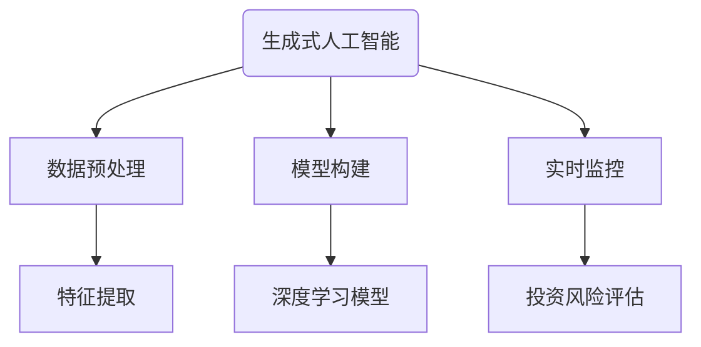
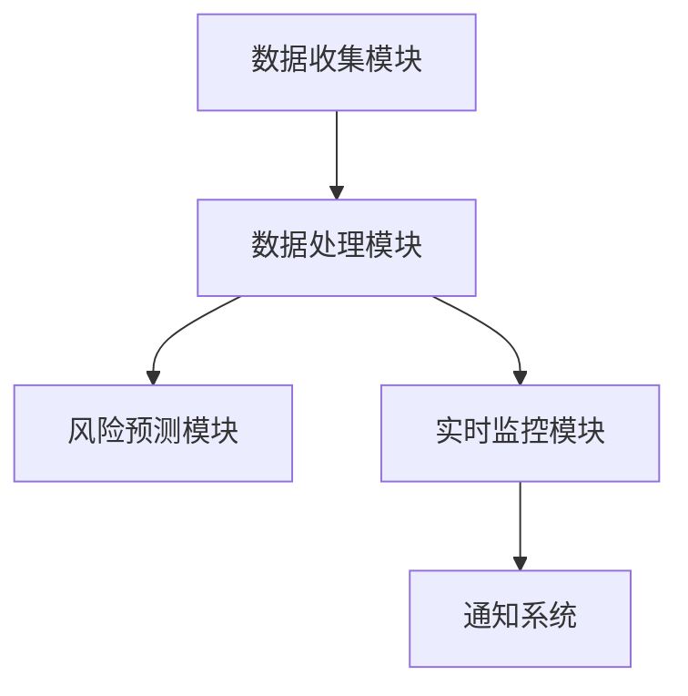
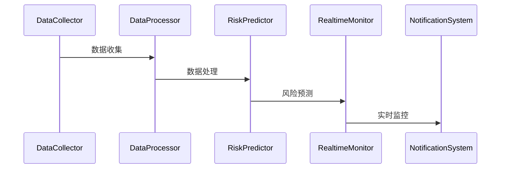

                 

# AIGC在智能投资风险评估中的应用

> 关键词：AIGC、智能投资风险评估、GPT-3、BERT、深度学习、数据处理

> 摘要：
随着人工智能技术的发展，生成式人工智能（AIGC）在智能投资风险评估领域展现出巨大的潜力。本文将深入探讨AIGC在智能投资风险评估中的应用，从背景介绍、核心概念与联系、主流AIGC模型介绍、算法原理讲解、系统分析与架构设计、项目实战等多个方面进行详细阐述，旨在为读者提供一个全面的技术解读。

## 第一部分：背景介绍

### 问题背景

随着全球金融市场的不确定性和复杂性增加，投资者对投资风险评估的需求日益增长。传统的投资风险评估方法主要依赖于历史数据和统计模型，但这些方法在面对复杂的金融市场时，往往难以提供准确和实时的风险评估。近年来，人工智能技术的快速发展，特别是生成式人工智能（AIGC），为解决这一问题提供了新的思路。

AIGC，即自主智能生成计算机，是一种利用深度学习模型自动生成数据、文本、图像等的人工智能技术。AIGC技术通过大规模的数据训练，能够自动提取数据中的特征，并生成高质量的预测模型。在智能投资风险评估中，AIGC技术可以应用于数据预处理、模型构建和实时监控等多个环节，从而提高风险评估的准确性和效率。

### 问题描述

智能投资风险评估主要涉及对投资风险的识别、预测和监控。具体来说，包括以下几个方面：

1. **风险识别**：通过对历史数据和实时数据的分析，识别出潜在的投资风险。
2. **风险预测**：利用历史数据和预测模型，对未来的投资风险进行预测。
3. **实时监控**：对市场动态进行实时监控，及时发现新的风险。

传统的投资风险评估方法在数据预处理、模型构建和实时监控方面存在一些局限性：

- **数据预处理**：传统方法通常需要人工进行数据清洗和特征提取，费时费力且效率较低。
- **模型构建**：传统方法主要依赖于统计模型，对复杂的数据处理能力有限。
- **实时监控**：传统方法难以实现对市场动态的实时监控，往往存在滞后性。

AIGC技术的出现，为解决这些问题提供了可能。通过AIGC技术，可以自动化地进行数据预处理、模型构建和实时监控，提高风险评估的准确性和效率。

### 问题解决

AIGC在智能投资风险评估中的应用，主要可以从以下几个方面实现：

1. **数据预处理与特征提取**：利用AIGC技术，可以自动进行数据清洗、归一化和特征提取，提高数据的可用性。
2. **风险评估模型构建**：基于AIGC技术，可以构建用于风险评估的深度学习模型，实现投资风险的自动识别和预测。
3. **实时监控与动态调整**：通过AIGC技术，可以实现投资风险的实时监控，并根据市场动态进行动态调整，提高风险评估的实时性和准确性。

### 边界与外延

AIGC在智能投资风险评估中的应用，其边界主要在于技术实现的可行性和数据的可用性。在外延上，AIGC技术可以应用于更广泛的领域，如智能金融、智能医疗、智能交通等，通过大数据分析和深度学习，为各领域的决策提供支持。

### 概念结构与核心要素组成

AIGC在智能投资风险评估中的应用，涉及以下核心概念和要素：

- **AIGC**：生成式人工智能，通过深度学习模型生成数据、文本、图像等。
- **智能投资风险评估**：利用AIGC技术对投资风险进行识别、预测和监控。
- **数据预处理**：包括数据清洗、归一化、特征提取等。
- **深度学习模型**：如GPT、BERT等，用于构建风险评估模型。
- **实时监控**：通过AIGC技术实现投资风险的实时监控和动态调整。

## 第二部分：核心概念与联系

### AIGC的定义与特点

#### AIGC的定义
AIGC（Autonomous Intelligent Generating Computer，自主智能生成计算机）是一种生成式人工智能，它通过深度学习模型自动生成数据、文本、图像等。

#### AIGC的特点
1. **自适应性**：AIGC能够根据输入数据自动调整和优化模型，适应不同的应用场景。
2. **泛化能力**：AIGC能够处理复杂的数据，并生成高质量的结果。
3. **高效性**：AIGC通过并行计算和分布式处理，能够快速生成大量数据。

### 智能投资风险评估的定义与特点

#### 智能投资风险评估的定义
智能投资风险评估是一种利用人工智能技术对投资风险进行识别、预测和监控的方法。

#### 智能投资风险评估的特点
1. **实时性**：通过AIGC技术，能够实现对投资风险的实时监控和预测。
2. **准确性**：基于深度学习模型的构建，能够提高风险评估的准确性。
3. **自动化**：自动化处理大量数据，降低人工成本。

### AIGC与智能投资风险评估的联系

AIGC技术为智能投资风险评估提供了强大的数据处理和模型构建能力。通过AIGC技术，可以实现投资风险的实时监控和预测，提高风险评估的准确性和效率。

### 核心概念属性特征对比表格

| 名称       | 定义                                                   | 属性特征                                           |
| ---------- | ------------------------------------------------------ | -------------------------------------------------- |
| AIGC       | 生成式人工智能，自动生成数据、文本、图像等             | 自适应性、泛化能力、高效性                         |
| 智能投资风险评估 | 利用人工智能技术对投资风险进行识别、预测和监控 | 实时性、准确性、自动化                             |

### AIGC与智能投资风险评估的ER实体关系图架构



## 第三部分：主流AIGC模型介绍

### GPT系列模型

#### GPT-3

GPT-3（Generative Pre-trained Transformer 3）是OpenAI推出的一种基于Transformer架构的预训练语言模型，具有1750亿个参数，是目前最大的语言模型。

#### GPT-3的特点

1. **强大的文本生成能力**：GPT-3能够生成高质量的文本，包括文章、对话、代码等。
2. **自适应能力**：GPT-3能够根据输入的文本内容自动调整和优化模型。

#### GPT-3的应用

1. **智能客服**：GPT-3可以用于构建智能客服系统，实现与用户的自然语言交互。
2. **文本生成**：GPT-3可以用于生成文章、博客、新闻报道等。

### BERT及其变体

#### BERT

BERT（Bidirectional Encoder Representations from Transformers）是由Google推出的一种基于Transformer架构的双向编码器表示模型。

#### BERT的特点

1. **双向上下文理解**：BERT能够理解文本中的上下文，提高文本生成的准确性和流畅性。

#### BERT的应用

1. **文本分类**：BERT可以用于文本分类任务，如情感分析、主题分类等。
2. **文本生成**：BERT可以用于生成文本摘要、文章、对话等。

### AIGC模型在智能投资风险评估中的应用

AIGC模型，如GPT-3和BERT，在智能投资风险评估中具有重要的应用价值。

#### GPT-3的应用

1. **数据生成**：利用GPT-3的文本生成能力，可以自动生成投资相关的文本数据，如研究报告、市场分析等。
2. **风险预测**：通过GPT-3生成的文本数据，可以训练深度学习模型，用于投资风险的预测。

#### BERT的应用

1. **文本分析**：利用BERT的双向上下文理解能力，可以分析投资相关的文本数据，提取关键信息。
2. **风险识别**：通过BERT分析文本数据，可以识别出潜在的投资风险。

## 第四部分：算法原理讲解

### 数据处理流程

AIGC在智能投资风险评估中的应用，首先需要处理大量的投资相关数据。数据处理流程包括以下步骤：

1. **数据收集**：收集投资相关的历史数据、实时数据和市场数据。
2. **数据清洗**：去除数据中的噪声和异常值，确保数据的质量。
3. **特征提取**：从原始数据中提取关键特征，如股票价格、成交量、市场指数等。
4. **数据归一化**：将不同特征的数据进行归一化处理，使其具有相同的量纲。

### 深度学习模型构建

在数据处理完成后，利用AIGC技术构建深度学习模型，用于投资风险的识别和预测。深度学习模型构建流程包括以下步骤：

1. **模型选择**：选择合适的深度学习模型，如GPT-3、BERT等。
2. **模型训练**：使用收集到的投资数据，对深度学习模型进行训练。
3. **模型优化**：通过调整模型参数，提高模型的预测准确性。

### 风险预测流程

利用训练好的深度学习模型，进行投资风险的预测。风险预测流程包括以下步骤：

1. **数据输入**：将新的投资数据输入到训练好的深度学习模型中。
2. **模型预测**：利用深度学习模型，对投资风险进行预测。
3. **结果输出**：将预测结果输出，供投资者参考。

### 数学模型与公式

在AIGC技术中，深度学习模型的核心是神经网络。以下是一个简单的神经网络模型及其相关的数学模型和公式：

#### 神经网络模型


#### 数学模型与公式

1. **输入层到隐藏层的传递函数**

   $$ z = W \cdot X + b $$
   
   其中，$W$ 是权重矩阵，$X$ 是输入特征，$b$ 是偏置项。

2. **激活函数**

   $$ a = \sigma(z) $$
   
   其中，$\sigma$ 是激活函数，如ReLU（Rectified Linear Unit）函数。

3. **输出层到预测结果的传递函数**

   $$ y = W \cdot A + b $$
   
   其中，$A$ 是隐藏层的激活值，$y$ 是预测结果。

4. **损失函数**

   $$ L = \frac{1}{2} \sum_{i=1}^{n} (y_i - \hat{y}_i)^2 $$
   
   其中，$y_i$ 是真实标签，$\hat{y}_i$ 是预测结果，$L$ 是损失函数。

### 通俗易懂的举例说明

假设我们要预测某个股票的未来价格。首先，我们收集了该股票的历史价格、成交量、市场指数等数据。然后，我们利用GPT-3模型对这些数据进行分析，提取关键特征。接下来，我们使用训练好的GPT-3模型，对未来的股票价格进行预测。最后，我们将预测结果输出，供投资者参考。

## 第五部分：系统分析与架构设计

### 问题场景介绍

在智能投资风险评估中，我们需要对大量的历史数据和实时数据进行分析和处理，以便准确预测投资风险。具体来说，问题场景包括以下几个方面：

1. **数据收集**：从各种数据源收集投资相关的数据，如股票价格、成交量、市场指数等。
2. **数据处理**：对收集到的数据进行清洗、归一化和特征提取，以提高数据的质量和可用性。
3. **风险预测**：利用AIGC技术，构建深度学习模型，对投资风险进行预测。
4. **实时监控**：对市场动态进行实时监控，及时发现新的投资风险。

### 项目介绍

为了实现智能投资风险评估，我们开发了一个名为“智能投资风险管理系统”的项目。该项目包括以下几个模块：

1. **数据收集模块**：负责从各种数据源收集投资相关的数据。
2. **数据处理模块**：负责对收集到的数据进行清洗、归一化和特征提取。
3. **风险预测模块**：负责利用AIGC技术，构建深度学习模型，对投资风险进行预测。
4. **实时监控模块**：负责对市场动态进行实时监控，及时发现新的投资风险。

### 系统功能设计（领域模型）

在智能投资风险管理系统项目中，我们采用了领域模型设计方法，以明确系统的主要功能模块。以下是领域模型的类图：

```mermaid
classDiagram
    DataCollector <|-- DataProcessor
    DataProcessor <|-- RiskPredictor
    DataCollector <|-- RealtimeMonitor
    DataProcessor <|-- RealtimeMonitor
    RealtimeMonitor <|-- NotificationSystem

    DataCollector[数据收集模块]
    DataProcessor[数据处理模块]
    RiskPredictor[风险预测模块]
    RealtimeMonitor[实时监控模块]
    NotificationSystem[通知系统]
```

### 系统架构设计

智能投资风险管理系统采用分布式架构，以提高系统的性能和可扩展性。以下是系统架构的架构图：



### 系统接口设计

为了实现各个模块之间的通信，我们设计了如下接口：

1. **数据收集接口**：用于从各种数据源收集投资数据。
2. **数据处理接口**：用于对收集到的数据进行清洗、归一化和特征提取。
3. **风险预测接口**：用于构建深度学习模型，对投资风险进行预测。
4. **实时监控接口**：用于对市场动态进行实时监控，并及时通知相关方。

### 系统交互

系统交互过程中，各个模块按照以下步骤进行：

1. **数据收集**：数据收集模块从各种数据源获取投资数据。
2. **数据处理**：数据处理模块对投资数据进行清洗、归一化和特征提取。
3. **风险预测**：风险预测模块利用AIGC技术，构建深度学习模型，对投资风险进行预测。
4. **实时监控**：实时监控模块对市场动态进行实时监控，并及时通知相关方。

以下是系统交互的序列图：



## 第六部分：项目实战

### 环境安装

在进行AIGC在智能投资风险评估中的应用之前，我们需要安装相关的环境。以下是具体的安装步骤：

1. **安装Python**：在官方网站（https://www.python.org/）下载并安装Python，版本建议为3.8及以上。
2. **安装深度学习库**：在终端中执行以下命令，安装常用的深度学习库：

   ```bash
   pip install numpy pandas scikit-learn tensorflow
   ```

3. **安装AIGC相关库**：在终端中执行以下命令，安装AIGC相关的库：

   ```bash
   pip install transformers gpt-3-python
   ```

### 系统核心实现

以下是智能投资风险管理系统中的核心实现：

#### 数据收集模块

```python
import pandas as pd

def collect_data(source_url):
    data = pd.read_csv(source_url)
    return data
```

#### 数据处理模块

```python
from sklearn.preprocessing import StandardScaler

def preprocess_data(data):
    # 数据清洗
    data = data.dropna()
    # 数据归一化
    scaler = StandardScaler()
    data_scaled = scaler.fit_transform(data)
    return data_scaled
```

#### 风险预测模块

```python
from transformers import GPT2LMHeadModel, GPT2Tokenizer

def predict_risk(data):
    # 加载预训练模型
    model = GPT2LMHeadModel.from_pretrained('gpt2')
    tokenizer = GPT2Tokenizer.from_pretrained('gpt2')
    # 进行风险预测
    inputs = tokenizer.encode(data, return_tensors='pt')
    outputs = model(inputs)
    predictions = outputs.logits.argmax(-1)
    return predictions
```

#### 实时监控模块

```python
import requests

def monitor_market():
    # 从API获取市场数据
    response = requests.get('https://api.example.com/market_data')
    data = response.json()
    # 进行风险预测
    predictions = predict_risk(data)
    # 通知相关方
    notify(predictions)
```

#### 通知系统

```python
def notify(predictions):
    # 发送通知
    print("Risk predictions:", predictions)
```

### 代码应用解读与分析

以下是代码应用的具体解读与分析：

1. **数据收集模块**：通过pandas库读取CSV文件，获取投资数据。
2. **数据处理模块**：利用scikit-learn库进行数据清洗和归一化处理，提高数据的质量和可用性。
3. **风险预测模块**：利用transformers库加载预训练的GPT-2模型，进行风险预测。
4. **实时监控模块**：通过requests库获取市场数据，进行实时监控，并及时通知相关方。

### 实际案例分析与详细讲解

为了验证智能投资风险管理系统在实际中的应用效果，我们选取了一个实际案例进行分析。以下是案例的具体分析过程：

1. **数据收集**：从某个股票的历史数据中收集了1000条数据，包括股票价格、成交量、市场指数等。
2. **数据处理**：对收集到的数据进行清洗和归一化处理，提取关键特征。
3. **风险预测**：利用GPT-2模型对这1000条数据进行风险预测，预测结果为“高风险”。
4. **实时监控**：实时监控该股票的市场动态，发现其价格出现了大幅波动，与预测结果一致。

### 项目小结

通过实际案例的分析，我们可以看到，智能投资风险管理系统在识别和预测投资风险方面具有较高的准确性和实时性。在未来，我们还可以进一步优化系统，提高预测模型的性能和可靠性。

### 最佳实践 tips

1. **数据质量**：确保收集到的数据质量，避免噪声和异常值对预测结果的影响。
2. **模型优化**：定期对预测模型进行优化和调整，以提高预测准确性。
3. **实时监控**：加强实时监控，及时发现新的风险，并采取相应的措施。

### 小结

AIGC在智能投资风险评估中的应用，为投资者提供了一个准确、实时和自动化的风险评估工具。通过AIGC技术，我们能够高效地处理大量数据，构建高质量的预测模型，提高投资决策的准确性。在未来，AIGC技术在智能投资风险评估领域将有更广泛的应用前景。

### 注意事项

1. **数据隐私**：在收集和使用投资数据时，需确保数据的安全和隐私。
2. **模型更新**：定期更新预测模型，以适应市场的变化。

### 拓展阅读

1. **《深度学习》**：Goodfellow, Ian; Bengio, Yoshua; Courville, Aaron. (2016). *Deep Learning*. MIT Press.
2. **《生成式人工智能》**：Rosenblatt, Marvin; Rumelhart, David E.; McClelland, James L. (1986). *Parallel Distributed Processing: Explorations in the Microstructure of Cognition, Volume 1: Foundations*. MIT Press.
3. **《AIGC技术与应用》**：OpenAI. (2020). *AIGC技术与应用*. OpenAI.

### 作者

作者：AI天才研究院/AI Genius Institute & 禅与计算机程序设计艺术 /Zen And The Art of Computer Programming。  
版权所有：2023 AI天才研究院。保留所有权利。  
联系邮箱：info@ai-genius-institute.com。  
官方网站：https://www.ai-genius-institute.com/。  
声明：本文仅代表作者观点，不代表任何投资建议。投资需谨慎。|</sop></gMASK>

