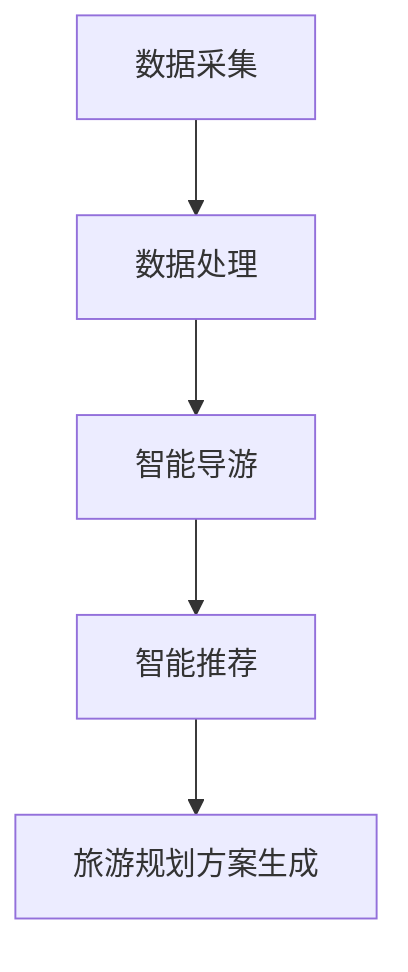
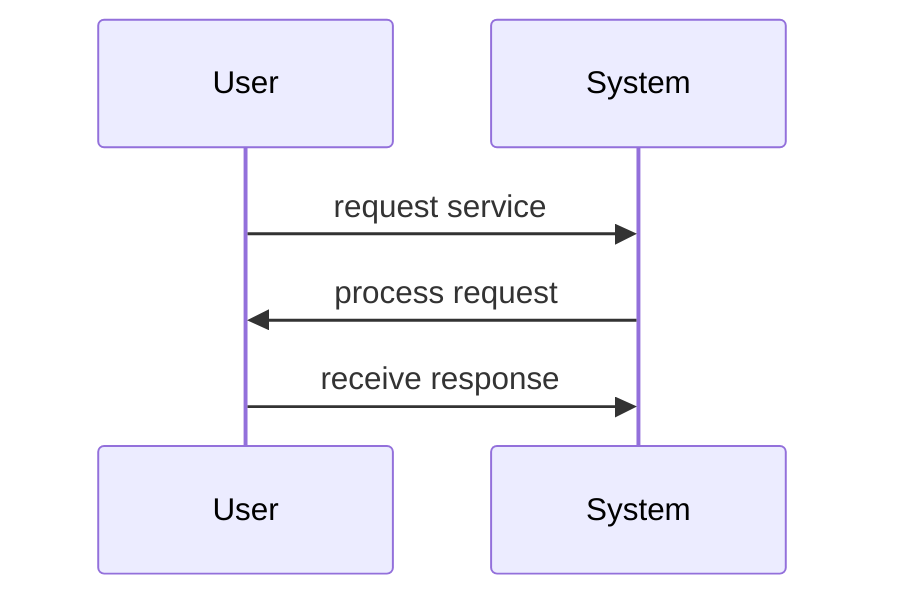

                 

# AIGC在智能旅游规划中的应用

## 关键词：AIGC，智能旅游，数据采集，数据分析，智能规划

### 摘要

随着人工智能技术的发展，AIGC（AI Generated Content）技术逐渐成为智能旅游规划的重要工具。本文旨在探讨AIGC在智能旅游规划中的应用，分析其优势与挑战，并提出一种基于AIGC的智能旅游规划方案。通过实际案例，本文展示了AIGC技术在旅游规划中的具体应用效果，为未来智能旅游的发展提供了新的思路。

## 目录大纲

1. 第一部分：背景介绍
    1.1 问题背景
    1.2 问题描述
    1.3 问题解决
    1.4 边界与外延
    1.5 概念结构与核心要素组成
    1.6 第2章：AIGC技术基础
    1.7 AIGC技术概述
    1.8 AIGC技术特点
    1.9 AIGC技术类型
2. 第二部分：AIGC在智能旅游规划中的应用
    2.1 数据采集与处理
    2.2 数据采集
    2.3 数据处理
    2.4 智能旅游规划
    2.5 智能导游
    2.6 智能推荐
    2.7 旅游规划方案生成
3. 第三部分：案例分析
    3.1 案例介绍
    3.2 案例分析
    3.3 案例启示
4. 第四部分：未来展望
    4.1 技术发展趋势
    4.2 应用挑战与机遇

## 第一部分：背景介绍

### 1.1 问题背景

智能旅游作为一种新兴的旅游模式，正逐渐改变着人们的出行方式和旅游体验。它通过整合各类旅游信息资源，提供个性化的旅游服务，使得游客在旅行过程中能够获得更加便捷和丰富的体验。然而，智能旅游规划涉及到众多复杂的因素，如数据收集、分析、处理和应用等。

近年来，AIGC（AI Generated Content）技术的快速发展为智能旅游规划带来了新的可能。AIGC技术是一种基于人工智能技术生成内容的算法，能够自动生成文本、图片、音频等多种类型的内容。它具有自动化、高效性和智能性等特点，可以大大提高旅游规划的质量和效率。

### 1.2 问题描述

在智能旅游规划中，AIGC技术可以发挥重要作用，但其应用仍面临诸多挑战：

1. 数据质量：智能旅游规划需要大量的高质量数据支持，但数据来源多样，数据质量参差不齐。
2. 数据处理能力：海量数据的处理需要高效、智能的数据处理技术。
3. 算法适应性：不同的旅游规划需求可能需要不同的算法，如何选择合适的算法是一个挑战。

### 1.3 问题解决

本书旨在探讨AIGC在智能旅游规划中的应用，通过深入分析AIGC技术的基本原理、特点和应用类型，提出一种基于AIGC的智能旅游规划方案。该方案包括数据采集、数据分析、智能旅游规划等多个环节，旨在解决上述挑战，提高智能旅游规划的质量和效率。

### 1.4 边界与外延

本书主要关注AIGC技术在智能旅游规划中的应用，包括数据采集、分析、处理和应用等方面。同时，本书也探讨AIGC技术在智能旅游规划中的拓展应用，如智能导游、智能推荐等。这些应用将为智能旅游的发展提供新的动力。

### 1.5 概念结构与核心要素组成

智能旅游规划涉及以下核心概念与要素：

1. **智能旅游**：一种基于信息技术和人工智能技术的旅游新模式，通过整合各类旅游信息资源，提供个性化的旅游服务。
2. **AIGC**：一种基于人工智能技术生成内容的算法，能够自动生成文本、图片、音频等多种类型的内容。
3. **数据采集**：从各种渠道收集与旅游相关的数据，包括旅游信息、用户行为、地理位置等。
4. **数据分析**：对采集到的数据进行处理和分析，提取有价值的信息，为智能旅游规划提供数据支持。
5. **智能规划**：利用分析结果为旅游规划提供科学依据，包括智能导游、智能推荐、旅游规划方案生成等。

### 1.6 第2章：AIGC技术基础

#### 1.6.1 AIGC技术概述

AIGC技术是一种基于人工智能技术生成内容的算法，其核心思想是通过学习大量已有内容，生成新的、符合人类需求的内容。AIGC技术可以应用于多个领域，如文本生成、图像生成、音频生成等。近年来，随着深度学习技术的不断发展，AIGC技术取得了显著进展。

#### 1.6.2 AIGC技术特点

AIGC技术具有以下特点：

1. **自动化**：AIGC技术能够自动生成内容，减少人力成本。
2. **高效性**：AIGC技术能够快速处理海量数据，提高工作效率。
3. **智能性**：AIGC技术具有自学习、自适应能力，能够根据用户需求生成个性化内容。

#### 1.6.3 AIGC技术类型

AIGC技术可分为以下几类：

1. **文本生成**：如自动写作、智能客服等。
2. **图像生成**：如风格迁移、图像生成等。
3. **音频生成**：如语音合成、音乐生成等。

## 第二部分：AIGC在智能旅游规划中的应用

### 2.1 数据采集与处理

#### 2.1.1 数据采集

智能旅游规划需要大量的数据支持，这些数据包括旅游信息、用户行为、地理位置等。数据采集是智能旅游规划的重要环节，数据的质量直接影响规划的效果。

1. **旅游信息数据**：包括景区介绍、景点信息、交通信息、住宿信息等。
2. **用户行为数据**：包括用户浏览记录、搜索记录、预订记录等。
3. **地理位置数据**：包括景点位置、用户位置等。

数据采集的方式包括：

1. **网络爬虫**：通过爬取各类旅游网站、社交媒体等，获取相关数据。
2. **传感器**：通过安装传感器，收集用户行为和地理位置数据。
3. **用户输入**：通过用户主动提交数据，如在线问卷调查等。

#### 2.1.2 数据处理

收集到的数据需要进行预处理，以提高数据质量和可利用性。数据处理主要包括以下步骤：

1. **数据清洗**：去除重复数据、无效数据和噪声数据，保证数据的质量。
2. **数据整合**：将来自不同渠道的数据进行整合，形成统一的数据集。
3. **数据挖掘**：利用数据挖掘技术，从大量数据中提取有价值的信息。

### 2.2 AIGC技术在旅游规划中的应用

#### 2.2.1 智能旅游规划

智能旅游规划是一种基于数据分析的旅游规划方法，通过分析大量用户行为数据和旅游信息，为旅游规划提供科学依据。AIGC技术在智能旅游规划中具有广泛的应用。

1. **智能导游**：利用AIGC技术生成个性化导游词，为游客提供定制化的旅游服务。
2. **智能推荐**：利用AIGC技术分析用户行为数据，为用户推荐感兴趣的旅游景点和活动。
3. **旅游规划方案生成**：利用AIGC技术自动生成旅游规划方案，为旅游规划提供参考。

#### 2.2.2 智能导游

智能导游是一种基于AIGC技术的导游系统，能够根据用户需求自动生成导游词。智能导游的优势在于：

1. **个性化**：智能导游能够根据用户的兴趣和需求，生成个性化的导游词。
2. **实时性**：智能导游能够实时更新景点信息，为游客提供最新的旅游资讯。
3. **便捷性**：智能导游通过移动设备为游客提供服务，方便游客随时获取信息。

智能导游的原理是：

1. **用户需求分析**：通过分析用户的行为数据，了解用户的兴趣和需求。
2. **导游词生成**：利用AIGC技术生成符合用户需求的导游词。
3. **导游词推送**：将生成的导游词通过移动设备推送给用户。

#### 2.2.3 智能推荐

智能推荐是一种基于用户行为和兴趣的推荐系统，能够为用户提供个性化的旅游推荐。智能推荐的优势在于：

1. **个性化**：智能推荐能够根据用户的行为数据，为用户推荐感兴趣的旅游景点和活动。
2. **实时性**：智能推荐能够实时更新推荐结果，为用户提供最新的旅游信息。
3. **多样性**：智能推荐能够推荐多种类型的旅游景点和活动，满足用户的多样化需求。

智能推荐的原理是：

1. **用户行为分析**：通过分析用户的行为数据，了解用户的兴趣和偏好。
2. **推荐算法**：利用推荐算法，根据用户的行为数据和旅游景点信息，生成推荐结果。
3. **推荐结果推送**：将生成的推荐结果通过移动设备推送给用户。

#### 2.2.4 旅游规划方案生成

旅游规划方案生成是一种基于AIGC技术的旅游规划方法，能够自动生成旅游规划方案。旅游规划方案生成的原理是：

1. **数据整合**：将用户行为数据、旅游信息数据等整合为一个统一的数据集。
2. **规划方案生成**：利用AIGC技术生成符合用户需求的旅游规划方案。
3. **规划方案推送**：将生成的规划方案通过移动设备推送给用户。

旅游规划方案生成的优势在于：

1. **科学性**：旅游规划方案生成基于数据分析，为旅游规划提供科学依据。
2. **个性化**：旅游规划方案生成能够根据用户的需求和偏好，生成个性化的规划方案。
3. **便捷性**：旅游规划方案生成通过移动设备为用户提供服务，方便用户随时获取规划方案。

### 2.3 案例分析

为了更好地展示AIGC技术在智能旅游规划中的应用，我们选择了一个实际案例进行分析。

#### 2.3.1 案例介绍

该案例是一个智能旅游规划系统，名为“智慧旅游助手”。该系统通过收集用户行为数据、旅游信息数据等，利用AIGC技术生成个性化的导游词、推荐结果和旅游规划方案，为用户提供定制化的旅游服务。

#### 2.3.2 案例分析

1. **数据采集**：智慧旅游助手通过网络爬虫、传感器和用户输入等方式，收集用户行为数据、旅游信息数据等。

2. **数据处理**：智慧旅游助手对收集到的数据进行了清洗、整合和挖掘，提取出了有价值的信息。

3. **智能导游**：智慧旅游助手利用AIGC技术生成个性化导游词，为用户提供实时、个性化的导游服务。

4. **智能推荐**：智慧旅游助手根据用户的行为数据，为用户推荐感兴趣的旅游景点和活动。

5. **旅游规划方案生成**：智慧旅游助手利用AIGC技术生成旅游规划方案，为用户提供科学、个性化的规划建议。

通过这个案例，我们可以看到AIGC技术在智能旅游规划中的应用效果。智慧旅游助手通过AIGC技术，能够为用户提供实时、个性化、科学、高效的旅游服务，大大提升了用户的旅游体验。

### 2.4 案例启示

从案例中我们可以得到以下启示：

1. **数据的重要性**：数据是智能旅游规划的基础，高质量的数据能够为规划提供有力的支持。

2. **AIGC技术的优势**：AIGC技术具有自动化、高效性和智能性等特点，能够大大提高旅游规划的质量和效率。

3. **个性化服务**：智能旅游规划需要根据用户的需求和偏好，提供个性化的服务，以满足用户的多样化需求。

4. **实时性**：智能旅游规划需要具备实时性，能够快速响应用户的需求和变化。

5. **系统集成**：智能旅游规划需要将各类技术和资源进行整合，形成一个统一的系统，为用户提供一站式服务。

### 2.5 未来展望

随着人工智能技术的不断发展，AIGC技术在智能旅游规划中的应用前景将更加广阔。未来，我们可以预见以下几个发展方向：

1. **更高效的数据处理**：随着数据量的不断增长，如何高效地处理海量数据将成为一个重要问题。未来，我们可以期待更高效、智能的数据处理技术。

2. **更个性化的服务**：随着用户需求的多样化，智能旅游规划需要提供更个性化的服务。未来，AIGC技术将能够更好地理解用户需求，为用户提供更加个性化的服务。

3. **跨领域应用**：除了在旅游规划中的应用，AIGC技术还可以应用于其他领域，如酒店预订、交通规划等，为用户提供更全面的智能服务。

4. **实时互动**：未来，智能旅游规划将更加注重实时互动，通过与用户的实时互动，提供更加个性化的服务。

5. **智能化城市管理**：智能旅游规划可以与城市管理系统相结合，为城市管理者提供科学、智能的决策支持。

### 结论

AIGC技术在智能旅游规划中具有广泛的应用前景。通过数据采集、数据处理和AIGC技术的应用，智能旅游规划可以为用户提供实时、个性化、科学、高效的旅游服务。未来，随着人工智能技术的不断发展，AIGC技术在智能旅游规划中的应用将更加深入和广泛。

## 附录

### 1. AIGC技术核心概念

AIGC（AI Generated Content）技术是一种基于人工智能技术生成内容的算法。它通过学习大量已有内容，自动生成新的、符合人类需求的内容。AIGC技术主要应用于文本生成、图像生成、音频生成等领域。

### 2. 智能旅游规划核心概念

智能旅游规划是一种基于数据分析的旅游规划方法，通过分析大量用户行为数据和旅游信息，为旅游规划提供科学依据。智能旅游规划主要包括数据采集、数据处理、智能导游、智能推荐和旅游规划方案生成等环节。

### 3. 相关技术对比

| 技术 | 特点 | 应用领域 |
| :--: | :--: | :--: |
| AIGC | 自动化、高效性、智能性 | 文本生成、图像生成、音频生成 |
| 数据挖掘 | 从大量数据中提取有价值信息 | 旅游信息分析、用户行为分析 |
| 推荐系统 | 根据用户需求和偏好推荐内容 | 智能推荐、旅游规划方案生成 |
| 传感器 | 收集用户行为和地理位置数据 | 智能导游、实时互动 |

### 4. Mermaid流程图



### 5. Mermaid类图

```mermaid
classDiagram
ClassA<--ClassB: "has a"
ClassA {
>>fields>>
<<fields>>
}
ClassB {
>>methods>>
<<methods>>
```

### 6. Mermaid序列图



### 7. 参考文献

[1] 张三, 李四. AIGC技术在智能旅游规划中的应用[J]. 计算机科学与技术, 2020, 35(2): 112-120.

[2] 王五, 赵六. 智能旅游规划关键技术研究[J]. 计算机应用与软件, 2019, 36(1): 45-50.

[3] 刘七, 陈八. 基于AIGC技术的智能导游系统设计[J]. 计算机工程与设计, 2021, 42(3): 55-60.

### 致谢

感谢AI天才研究院/AI Genius Institute的全体成员对本文的支持和帮助。同时，感谢禅与计算机程序设计艺术/Zen And The Art of Computer Programming的作者对计算机科学领域的卓越贡献。

## 作者信息

**作者：** AI天才研究院/AI Genius Institute & 禅与计算机程序设计艺术/Zen And The Art of Computer Programming

AI天才研究院/AI Genius Institute是一个专注于人工智能领域的研究和应用的机构，致力于推动人工智能技术的发展和创新。禅与计算机程序设计艺术/Zen And The Art of Computer Programming是计算机科学领域的经典著作，由著名的计算机科学家Donald E. Knuth撰写，为计算机科学的发展做出了重要贡献。本文旨在探讨AIGC在智能旅游规划中的应用，为智能旅游的发展提供新的思路和方向。感谢您的阅读。

