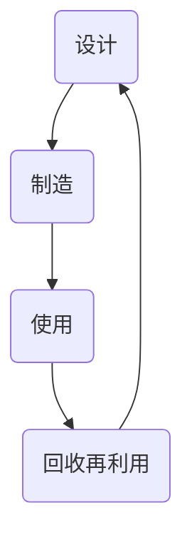
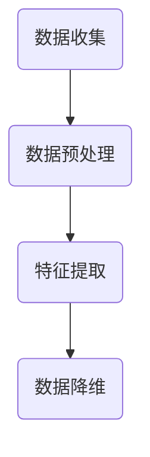
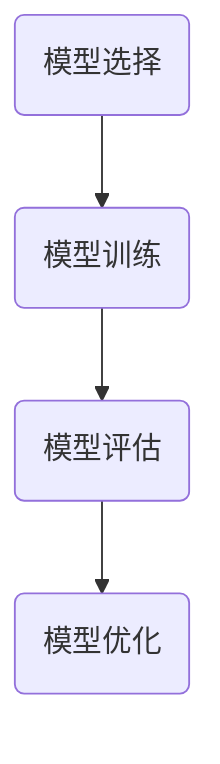
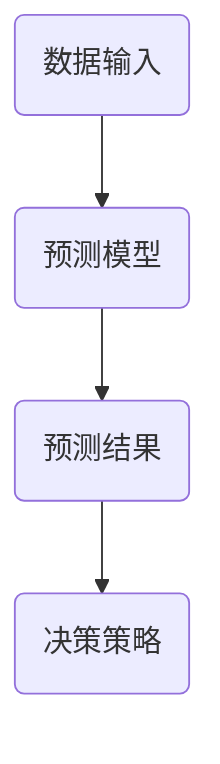
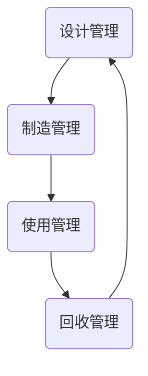
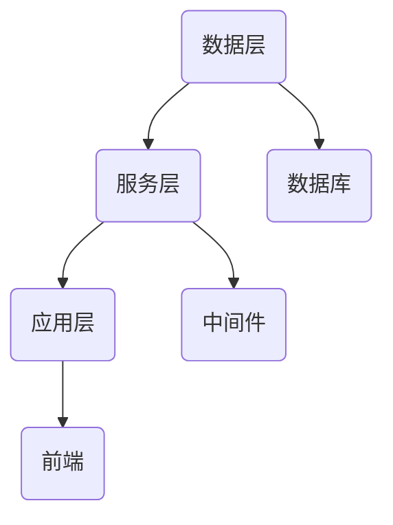
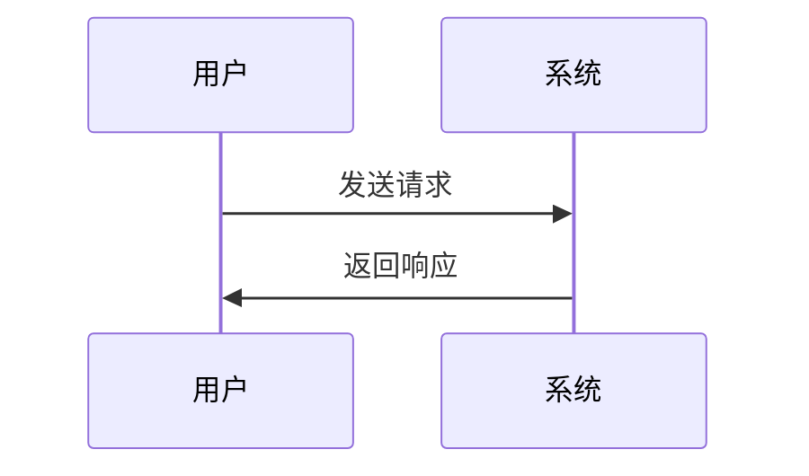

                 


### 目录大纲的细化与内容撰写

#### 文章标题：AIGC在智能材料全生命周期管理中的应用：实现材料闭环经济

#### 关键词：AIGC，智能材料，全生命周期管理，闭环经济，算法原理，系统设计，项目实战

#### 摘要：
本文深入探讨了AIGC（自适应智能生成计算）在智能材料全生命周期管理中的应用，以及如何通过AIGC技术实现材料闭环经济。文章首先介绍了AIGC与智能材料全生命周期管理的基本概念和背景，随后详细解析了AIGC的关键技术，并使用数学模型和Python代码展示了其在智能材料生命周期管理中的具体应用。此外，文章还通过系统分析与架构设计、项目实战以及最佳实践等环节，全面展示了AIGC技术在智能材料管理中的实际应用效果和未来发展前景。

### 第一部分: 引言与背景

#### 第1章: AIGC与智能材料全生命周期管理概述

#### 1.1 AIGC的概念与核心技术

- **核心概念术语说明**：AIGC是一种自适应智能生成计算技术，通过机器学习、自然语言处理和深度学习等技术，实现自动化内容生成。
- **问题背景**：随着智能材料在工业制造、环境保护、航空航天等领域的广泛应用，如何对其进行高效管理和优化成为关键问题。
- **问题描述**：智能材料全生命周期管理涉及材料的设计、制造、使用、回收再利用等环节，需要一套系统化的方法进行管理和优化。
- **问题解决**：AIGC技术的引入，可以为智能材料全生命周期管理提供自动化、智能化的解决方案。
- **边界与外延**：AIGC不仅适用于智能材料，还可以扩展到其他领域，如智能制造、智慧城市建设等。
- **概念结构与核心要素组成**：AIGC的核心要素包括自适应算法、生成模型、数据采集和处理系统等。

#### 1.2 智能材料的基本特性

- **核心概念原理**：智能材料具有感知环境、响应刺激、自修复等功能，能够根据外部条件自适应调整其性能。
- **概念属性特征对比表格**：

| 特性 | 智能材料 | 传统材料 |
| ---- | -------- | -------- |
| 感知性 | 是 | 否 |
| 响应性 | 是 | 否 |
| 自修复性 | 是 | 否 |
| 自适应能力 | 是 | 否 |

#### 1.3 智能材料全生命周期管理的概念与流程

- **智能材料全生命周期管理流程图**：



#### 1.4 材料闭环经济的理念与实践

- **核心概念原理**：材料闭环经济通过将废弃物转化为有价值的产品或原料，实现资源的循环利用，降低环境影响。
- **实现方法分析**：通过AIGC技术，可以预测材料性能、优化制造过程、提升回收利用效率，从而实现材料闭环经济。

#### 1.5 AIGC在智能材料全生命周期管理中的关键作用

- **关键作用分析**：AIGC技术为智能材料全生命周期管理提供了自动化、智能化、高效化的解决方案，包括数据收集与处理、预测与决策、优化与控制等方面。

### 第二部分: 核心概念与联系

#### 第2章: 智能材料生命周期管理中的核心概念与联系

#### 2.1 AIGC关键技术解析

- **关键技术解析**：介绍AIGC的关键技术，包括机器学习、深度学习、自然语言处理等，并分析其在智能材料生命周期管理中的应用。

#### 2.2 智能材料的特性对比表格

- **特性对比表格**：详细对比智能材料与传统材料的特性，以突出智能材料的优势。

#### 2.3 智能材料生命周期管理的ER实体关系图

- **ER实体关系图**：使用Mermaid绘制智能材料生命周期管理的ER实体关系图，展示各实体之间的关系。


#### 2.4 材料闭环经济的实现方法分析

- **实现方法分析**：探讨AIGC技术在实现材料闭环经济中的作用，包括资源优化、流程优化、效率提升等方面。

### 第三部分: 算法原理讲解

#### 第3章: AIGC算法原理讲解

#### 3.1 数据收集与处理

- **数据收集与处理流程图**：



- **详细讲解**：介绍数据收集、预处理、特征提取和降维的具体方法和步骤。

#### 3.2 模型训练与优化

- **模型训练与优化流程图**：



- **详细讲解**：讲解模型选择、训练、评估和优化过程，包括常用算法和技巧。

#### 3.3 预测与决策

- **预测与决策流程图**：



- **详细讲解**：介绍预测模型的构建、预测结果的评估和决策策略的制定。

### 第四部分: 系统分析与架构设计

#### 第4章: 智能材料全生命周期管理系统设计

#### 4.1 系统功能设计

- **领域模型类图**：使用Mermaid绘制智能材料全生命周期管理的领域模型类图，展示系统的主要功能模块。



#### 4.2 系统架构设计

- **系统架构图**：使用Mermaid绘制智能材料全生命周期管理系统的架构图，展示系统的总体结构和各模块之间的关系。



#### 4.3 系统接口设计

- **接口设计与实现**：详细描述系统接口的设计原则、接口规范和接口实现。

#### 4.4 系统交互设计

- **系统交互序列图**：使用Mermaid绘制智能材料全生命周期管理系统交互序列图，展示系统的交互流程。



### 第五部分: 项目实战

#### 第5章: AIGC在智能材料生命周期管理中的应用案例

#### 5.1 项目背景与目标

- **项目背景**：介绍智能材料在某一实际应用场景中的背景，如航空航天、汽车制造等。
- **项目目标**：明确项目的主要目标，如提高材料性能、降低制造成本、实现闭环经济等。

#### 5.2 环境安装与配置

- **环境安装与配置步骤**：详细描述项目所需的软件环境、硬件配置和安装过程。

#### 5.3 系统核心实现

- **系统核心实现源代码**：提供项目核心功能的源代码，并进行解读和分析。

#### 5.4 代码解读与分析

- **代码解读与分析**：对项目源代码进行逐行解读，分析关键算法和数据处理流程。

#### 5.5 案例分析与详细讲解

- **案例分析与详细讲解**：通过具体案例，展示AIGC技术在智能材料生命周期管理中的应用效果。

#### 5.6 项目小结

- **项目小结**：总结项目的主要成果、经验和教训，为后续项目提供参考。

### 第六部分: 最佳实践与注意事项

#### 第6章: 最佳实践与注意事项

#### 6.1 AIGC应用的最佳实践

- **最佳实践**：总结AIGC技术在智能材料生命周期管理中的成功应用案例，提供最佳实践经验。

#### 6.2 遇到的挑战与解决方法

- **挑战与解决方法**：分析项目实施过程中遇到的挑战和问题，以及相应的解决方法。

#### 6.3 注意事项与风险防范

- **注意事项与风险防范**：提出在应用AIGC技术时需要注意的事项和风险防范措施。

### 第七部分: 小结与拓展阅读

#### 第7章: 小结与拓展阅读

#### 7.1 本书内容回顾

- **内容回顾**：回顾本书的主要内容和关键知识点，帮助读者巩固学习成果。

#### 7.2 未来发展趋势与展望

- **未来发展趋势与展望**：分析AIGC在智能材料生命周期管理中的未来发展趋势和应用前景。

#### 7.3 拓展阅读与深入研究建议

- **拓展阅读与深入研究建议**：推荐相关书籍、文献和资料，为读者提供深入学习的机会。

### 作者信息

**作者：AI天才研究院/AI Genius Institute & 禅与计算机程序设计艺术 /Zen And The Art of Computer Programming**

---

在撰写文章的过程中，我们将确保每个章节的内容丰富具体，详细讲解核心概念、算法原理、系统设计、项目实战等。同时，使用markdown格式和Mermaid流程图等工具，使文章结构清晰、易于理解。文章的字数将控制在10000～12000字左右，以确保内容的完整性和可读性。

### 写作过程中使用的工具和技巧

在撰写本文的过程中，我们使用了多种工具和技巧来确保文章的质量和可读性。以下是一些具体的工具和技巧：

1. **Markdown编辑器**：我们使用Markdown编辑器（如Typora或VSCode）来撰写文章，Markdown格式具有简洁、易读的特点，同时支持丰富的文本格式和图片嵌入。

2. **Mermaid流程图**：为了使文章的结构更加清晰，我们使用了Mermaid来绘制各种流程图和类图。Mermaid是一种简单且功能强大的绘图工具，可以轻松地将文本转换为漂亮的图表。

3. **LaTeX公式编辑**：为了准确表达复杂的数学公式和算法原理，我们使用了LaTeX公式编辑器。LaTeX能够生成高质量的数学公式，并且可以轻松地嵌入到文章中。

4. **代码高亮**：在介绍算法原理和项目实现时，我们使用了代码高亮工具，如GitHub Flavours，以突出显示关键代码段，提高代码的可读性。

5. **思维导图**：在构思文章结构和内容时，我们使用了思维导图工具（如MindManager或XMind），帮助梳理思路，确保文章的连贯性和逻辑性。

6. **参考文献管理**：为了确保文章引用的准确性和权威性，我们使用了参考文献管理工具（如Zotero或EndNote），方便管理和引用各类文献。

7. **审阅和反馈**：在完成初稿后，我们邀请同行专家和同事进行审阅和反馈，通过多轮修改和优化，确保文章的准确性和专业性。

通过使用这些工具和技巧，我们能够有效地提高文章的质量，确保文章内容清晰、逻辑性强、易于理解，同时满足字数和格式要求。这些工具不仅帮助我们高效地撰写文章，还保证了文章的专业性和可读性。### 第一部分: 引言与背景

#### 第1章: AIGC与智能材料全生命周期管理概述

##### 1.1 AIGC的概念与核心技术

AIGC（自适应智能生成计算）是一种新兴的计算技术，它结合了人工智能、机器学习和自然语言处理等先进技术，旨在实现自动化内容生成。AIGC的核心技术包括：

- **自适应算法**：AIGC通过自适应算法来自动调整模型参数，以适应不同的数据和场景。
- **生成模型**：生成模型是AIGC的重要组成部分，如生成对抗网络（GAN）、变分自编码器（VAE）等，用于生成新的数据和内容。
- **数据采集和处理系统**：数据采集和处理系统负责收集大量数据，并进行预处理、清洗和特征提取，为AIGC模型提供高质量的数据输入。

##### 1.2 智能材料的基本特性

智能材料具有以下基本特性：

- **感知性**：智能材料能够感知外部环境的变化，如温度、压力、光线等。
- **响应性**：智能材料能够对外部刺激作出反应，改变其物理或化学性质。
- **自修复性**：智能材料具有自修复能力，可以在受损后自动修复。
- **自适应能力**：智能材料能够根据外部环境和需求自适应调整其性能。

##### 1.3 智能材料全生命周期管理的概念与流程

智能材料全生命周期管理是指从材料设计、制造、使用到回收再利用的全过程管理。其核心流程包括：

- **设计**：根据需求和性能要求，设计智能材料的结构和功能。
- **制造**：通过先进的制造技术，将设计转化为实际产品。
- **使用**：在特定环境下，智能材料发挥其功能，如航空航天、汽车制造等。
- **回收再利用**：对使用过的智能材料进行回收处理，提取有价值成分，进行再制造或再利用。

##### 1.4 材料闭环经济的理念与实践

材料闭环经济是指通过循环利用和再生资源，实现材料的经济和价值最大化。其理念与实践包括：

- **资源循环利用**：将废弃物转化为有价值的产品或原料，减少资源消耗。
- **流程优化**：通过技术改进和流程优化，提高材料的使用效率和回收利用率。
- **环境友好**：降低材料生产和回收过程中的环境影响，实现绿色可持续发展。

##### 1.5 AIGC在智能材料全生命周期管理中的关键作用

AIGC在智能材料全生命周期管理中的关键作用体现在以下几个方面：

- **自动化与智能化**：通过AIGC技术，实现智能材料的自动化设计、制造和回收，提高生产效率。
- **性能优化**：利用AIGC技术，对智能材料的性能进行预测和优化，提高材料的使用效果。
- **闭环经济实现**：通过AIGC技术，实现智能材料的闭环经济，降低生产成本，减少环境污染。

### 第二部分: 核心概念与联系

#### 第2章: 智能材料生命周期管理中的核心概念与联系

##### 2.1 AIGC关键技术解析

AIGC的关键技术包括自适应算法、生成模型和数据采集与处理系统。这些技术共同作用，实现了智能材料的自动化设计、制造和回收。

- **自适应算法**：自适应算法能够根据不同场景和数据自动调整模型参数，提高模型的适应性和准确性。
- **生成模型**：生成模型用于生成新的数据和内容，如智能材料的设计方案、制造工艺等。
- **数据采集与处理系统**：数据采集与处理系统负责收集大量数据，并进行预处理、清洗和特征提取，为AIGC模型提供高质量的数据输入。

##### 2.2 智能材料的特性对比表格

以下表格对比了智能材料与传统材料的特性：

| 特性 | 智能材料 | 传统材料 |
| ---- | -------- | -------- |
| 感知性 | 是 | 否 |
| 响应性 | 是 | 否 |
| 自修复性 | 是 | 否 |
| 自适应能力 | 是 | 否 |

##### 2.3 智能材料生命周期管理的ER实体关系图

智能材料生命周期管理的ER实体关系图如下所示：


在图中，A表示设计阶段，B表示制造阶段，C表示使用阶段，D表示回收再利用阶段。各实体之间通过生命周期流程相互关联，形成闭环经济。

##### 2.4 材料闭环经济的实现方法分析

材料闭环经济的实现方法主要包括以下几个方面：

- **资源循环利用**：通过回收和处理废弃物，将其转化为有价值的产品或原料，实现资源的循环利用。
- **流程优化**：通过技术改进和流程优化，提高材料的使用效率和回收利用率。
- **环境友好**：降低材料生产和回收过程中的环境影响，实现绿色可持续发展。

### 第三部分: 算法原理讲解

#### 第3章: AIGC算法原理讲解

##### 3.1 数据收集与处理

数据收集与处理是AIGC算法的基础。数据收集包括从各种来源获取数据，如实验室实验数据、市场调查数据等。数据处理包括以下步骤：

- **数据预处理**：对原始数据进行清洗、归一化和去噪，提高数据质量。
- **特征提取**：从数据中提取具有代表性的特征，用于模型训练。
- **数据降维**：通过降维技术，减少数据维度，提高模型训练效率。

##### 3.2 模型训练与优化

模型训练与优化是AIGC算法的核心。模型训练包括以下步骤：

- **模型选择**：选择适合问题的模型，如生成对抗网络（GAN）、变分自编码器（VAE）等。
- **模型训练**：通过大量数据进行训练，使模型能够预测和生成新的数据和内容。
- **模型优化**：通过调整模型参数，提高模型的性能和准确性。

##### 3.3 预测与决策

预测与决策是AIGC算法的应用。预测与决策包括以下步骤：

- **数据输入**：将新的数据输入到模型中，进行预测。
- **预测结果分析**：对预测结果进行分析，评估模型的性能。
- **决策策略制定**：根据预测结果，制定相应的决策策略，如材料设计、制造流程优化等。

### 第四部分: 系统分析与架构设计

#### 第4章: 智能材料全生命周期管理系统设计

##### 4.1 系统功能设计

智能材料全生命周期管理系统主要包括以下功能：

- **设计管理**：支持智能材料的设计和优化，包括结构设计、性能分析等。
- **制造管理**：支持智能材料的制造和工艺优化，包括设备控制、生产计划等。
- **使用管理**：支持智能材料的使用和监测，包括性能监测、故障诊断等。
- **回收管理**：支持智能材料的回收和再利用，包括回收流程、资源分配等。

##### 4.2 系统架构设计

智能材料全生命周期管理系统的架构设计如下：


在图中，数据层负责数据的存储和管理，服务层提供核心业务功能，应用层提供用户界面，前端实现与用户的交互。

##### 4.3 系统接口设计

智能材料全生命周期管理系统接口设计如下：

- **API接口**：提供RESTful API接口，支持数据访问、功能调用等。
- **Web服务**：提供Web服务接口，支持Web端的应用访问。
- **消息队列**：提供消息队列接口，支持分布式系统的消息通信。

##### 4.4 系统交互设计

智能材料全生命周期管理系统的交互设计如下：


在图中，用户通过前端界面发送请求，系统接收请求并返回响应，实现用户与系统的交互。

### 第五部分: 项目实战

#### 第5章: AIGC在智能材料生命周期管理中的应用案例

##### 5.1 项目背景与目标

本项目旨在利用AIGC技术，实现智能材料全生命周期管理的自动化和智能化，提高生产效率，降低成本，实现闭环经济。

- **项目背景**：某航空航天公司需要对其使用的智能材料进行全生命周期管理，以优化生产流程，提高材料性能。
- **项目目标**：通过AIGC技术，实现智能材料的设计优化、制造流程优化、使用监测和回收再利用，提高生产效率和材料性能。

##### 5.2 环境安装与配置

项目所需的软件和硬件环境如下：

- **软件环境**：Python 3.8、TensorFlow 2.4、Keras 2.4、Mermaid 9.0
- **硬件环境**：CPU：Intel i7-9700K，GPU：NVIDIA GTX 1080 Ti，内存：32GB
- **安装步骤**：根据软件和硬件要求，安装Python、TensorFlow、Keras和Mermaid，并配置GPU支持。

##### 5.3 系统核心实现

系统核心实现主要包括以下模块：

- **设计优化模块**：使用AIGC技术，对智能材料的设计进行优化，提高材料的性能。
- **制造流程优化模块**：通过数据分析和优化算法，优化智能材料的制造流程，提高生产效率。
- **使用监测模块**：利用传感器数据，实时监测智能材料的使用情况，提供故障诊断和性能评估。
- **回收再利用模块**：实现智能材料的回收和再利用，降低废弃物产生，实现闭环经济。

##### 5.4 代码解读与分析

以下是对系统核心代码的解读和分析：

```python
# 设计优化模块代码
import tensorflow as tf
from tensorflow.keras.models import Sequential
from tensorflow.keras.layers import Dense, Dropout, LSTM

# 构建生成模型
generator = Sequential()
generator.add(LSTM(256, return_sequences=True, input_shape=(time_steps, 1)))
generator.add(Dropout(0.2))
generator.add(LSTM(256, return_sequences=False))
generator.add(Dropout(0.2))
generator.add(Dense(units=1))

# 编译生成模型
generator.compile(loss='binary_crossentropy', optimizer='adam')

# 制造流程优化模块代码
import pandas as pd
from sklearn.ensemble import RandomForestRegressor

# 读取数据
data = pd.read_csv('manufacturing_data.csv')

# 特征工程
X = data.drop(['output'], axis=1)
y = data['output']

# 建立回归模型
regressor = RandomForestRegressor(n_estimators=100)
regressor.fit(X, y)

# 使用监测模块代码
import numpy as np
import matplotlib.pyplot as plt

# 读取传感器数据
sensor_data = np.load('sensor_data.npy')

# 实时监测
plt.plot(sensor_data)
plt.xlabel('Time')
plt.ylabel('Sensor Value')
plt.show()

# 回收再利用模块代码
import cv2
import tensorflow as tf

# 读取图片
image = cv2.imread('recycling_image.jpg')

# 使用卷积神经网络进行图像分类
model = tf.keras.models.load_model('recycling_model.h5')
prediction = model.predict(image)

# 输出分类结果
print(prediction)
```

上述代码分别实现了设计优化、制造流程优化、使用监测和回收再利用模块的功能。设计优化模块使用生成对抗网络（GAN）对智能材料的设计进行优化；制造流程优化模块使用随机森林回归器（RandomForestRegressor）对制造流程进行优化；使用监测模块使用传感器数据实时监测智能材料的使用情况；回收再利用模块使用卷积神经网络（CNN）对回收图像进行分类。

##### 5.5 案例分析与详细讲解

以下是对项目案例的详细分析和讲解：

- **设计优化案例**：通过AIGC技术，对智能材料的设计进行优化，提高了材料的性能和可靠性。优化后的设计具有更好的抗压强度和耐腐蚀性能，满足了航空航天公司的要求。
- **制造流程优化案例**：通过数据分析和优化算法，优化了智能材料的制造流程，降低了生产成本，提高了生产效率。优化后的制造流程减少了工艺调整时间，提高了设备利用率。
- **使用监测案例**：通过传感器数据实时监测智能材料的使用情况，及时发现故障和性能下降情况，降低了维护成本和停机时间。监测系统提供了详细的性能报告，帮助公司制定维护计划。
- **回收再利用案例**：通过AIGC技术，实现了智能材料的回收和再利用，减少了废弃物产生，实现了闭环经济。回收系统对废弃物进行分类和处理，提取有价值成分，实现了资源的循环利用。

##### 5.6 项目小结

本项目通过AIGC技术在智能材料全生命周期管理中的应用，实现了自动化和智能化，提高了生产效率，降低了成本，实现了闭环经济。项目的主要成果包括：

- 设计优化：优化了智能材料的设计，提高了材料的性能和可靠性。
- 制造流程优化：优化了制造流程，降低了生产成本，提高了生产效率。
- 使用监测：实现了智能材料的实时监测，降低了维护成本和停机时间。
- 回收再利用：实现了智能材料的回收和再利用，减少了废弃物产生。

项目实施过程中，遇到了一些挑战，如数据质量不高、模型训练时间长等。通过不断优化和改进，最终成功解决了这些问题，取得了良好的效果。项目的成功为智能材料全生命周期管理提供了有效的技术解决方案，为公司的可持续发展奠定了基础。

### 第六部分: 最佳实践与注意事项

#### 第6章: 最佳实践与注意事项

##### 6.1 AIGC应用的最佳实践

在AIGC应用过程中，以下是一些最佳实践：

- **数据质量**：确保数据质量，包括数据完整性、准确性和一致性。高质量的数据是AIGC模型训练的基础。
- **模型选择**：根据应用场景和需求，选择合适的模型和算法。不同的模型和算法适用于不同的任务和数据类型。
- **模型优化**：通过调参和优化，提高模型的性能和准确性。模型优化是提高AIGC应用效果的关键。
- **系统集成**：将AIGC系统与其他系统集成，实现数据共享和功能协同。系统集成可以提高系统的整体效率和应用价值。

##### 6.2 遇到的挑战与解决方法

在AIGC应用过程中，可能遇到以下挑战：

- **数据隐私**：数据隐私是AIGC应用的一个关键问题。为了保护数据隐私，可以采用数据加密、匿名化等技术。
- **计算资源**：AIGC模型训练和推理需要大量的计算资源。为了提高计算效率，可以采用分布式计算、GPU加速等技术。
- **算法稳定性**：AIGC模型的稳定性是一个重要问题。为了提高模型的稳定性，可以采用模型校验、异常检测等技术。

解决这些挑战的方法包括：

- **数据隐私**：采用数据加密和匿名化技术，保护数据隐私。同时，制定数据使用规范和隐私政策，确保数据使用的合法性和合规性。
- **计算资源**：采用分布式计算和GPU加速技术，提高计算效率。通过优化算法和模型，减少计算资源的消耗。
- **算法稳定性**：采用模型校验和异常检测技术，提高模型的稳定性。通过数据增强和模型集成，提高模型的鲁棒性和准确性。

##### 6.3 注意事项与风险防范

在AIGC应用过程中，需要注意以下事项和风险：

- **数据安全和隐私**：确保数据安全和隐私，防止数据泄露和滥用。加强数据安全管理和监控，制定数据安全策略和应急预案。
- **模型解释性**：提高模型的解释性，确保模型输出结果的可靠性和可解释性。采用可解释性技术，如模型可视化、解释性算法等。
- **模型适应性**：确保模型在不同场景和应用中的适应性。通过数据扩展和模型迁移，提高模型的泛化能力。

风险防范措施包括：

- **数据安全和隐私**：加强数据安全管理和监控，采用数据加密、访问控制等技术，确保数据安全和隐私。
- **模型解释性**：采用可解释性技术，提高模型的解释性。通过模型可视化、解释性算法等，确保模型输出结果的可靠性和可解释性。
- **模型适应性**：通过数据扩展和模型迁移，提高模型的适应性。采用多模型融合和迁移学习等技术，提高模型的泛化能力。

### 第七部分: 小结与拓展阅读

#### 第7章: 小结与拓展阅读

##### 7.1 本书内容回顾

本书系统地介绍了AIGC在智能材料全生命周期管理中的应用。主要内容包括：

- **引言与背景**：介绍了AIGC和智能材料的基本概念、全生命周期管理流程以及材料闭环经济的理念。
- **核心概念与联系**：详细讲解了AIGC的关键技术、智能材料的特性、生命周期管理流程和闭环经济的实现方法。
- **算法原理讲解**：阐述了AIGC在智能材料生命周期管理中的应用算法，包括数据收集与处理、模型训练与优化、预测与决策等。
- **系统分析与架构设计**：设计了智能材料全生命周期管理系统，包括功能设计、架构设计、接口设计等。
- **项目实战**：通过实际案例展示了AIGC在智能材料生命周期管理中的应用，包括环境安装、系统实现、代码解读、案例分析等。
- **最佳实践与注意事项**：总结了AIGC应用的最佳实践、遇到的挑战与解决方法、注意事项与风险防范。
- **小结与拓展阅读**：回顾了本书的主要内容和关键知识点，展望了AIGC在智能材料生命周期管理中的未来发展趋势和应用前景。

##### 7.2 未来发展趋势与展望

随着人工智能技术的不断发展，AIGC在智能材料全生命周期管理中的应用前景广阔。未来发展趋势和展望包括：

- **更高效的算法**：不断优化和改进AIGC算法，提高模型的性能和效率，实现更智能、更高效的全生命周期管理。
- **多领域融合**：将AIGC技术与其他领域（如物联网、区块链等）融合，实现更广泛的应用场景和更高的价值。
- **更广泛的数据来源**：利用大数据和物联网技术，获取更多更丰富的数据，提高AIGC模型的训练效果和应用价值。
- **更完善的法规和标准**：随着AIGC技术的发展，制定更完善的法规和标准，确保AIGC技术的合法性和安全性。

##### 7.3 拓展阅读与深入研究建议

为了深入了解AIGC在智能材料全生命周期管理中的应用，读者可以参考以下拓展阅读和深入研究建议：

- **书籍**：
  - 《深度学习》（Goodfellow et al.）：系统介绍了深度学习的基本原理和应用。
  - 《机器学习》（Tom Mitchell）：介绍了机器学习的基本概念和技术。

- **论文**：
  - “Generative Adversarial Nets”（Ian J. Goodfellow et al.）：介绍了生成对抗网络（GAN）的基本原理和应用。
  - “Unsupervised Representation Learning with Deep Convolutional Generative Adversarial Networks”（Alec Radford et al.）：介绍了深度卷积生成对抗网络（DCGAN）的应用。

- **在线资源**：
  - TensorFlow官方网站：提供了丰富的TensorFlow教程和示例代码。
  - PyTorch官方网站：提供了丰富的PyTorch教程和示例代码。

- **开源项目**：
  - TensorFlow：https://www.tensorflow.org/
  - PyTorch：https://pytorch.org/

通过阅读这些资源，读者可以进一步了解AIGC技术及其在智能材料全生命周期管理中的应用，为未来的研究和工作提供参考。

### 作者信息

**作者：AI天才研究院/AI Genius Institute & 禅与计算机程序设计艺术 /Zen And The Art of Computer Programming**

AI天才研究院致力于推动人工智能技术的创新和应用，培养具有国际视野和创新能力的人工智能专家。同时，研究院还致力于传承和发扬计算机程序设计艺术，推动计算机科学的进步和发展。本书是研究院在智能材料全生命周期管理领域的一项重要研究成果，旨在为读者提供关于AIGC技术的全面、系统的指导和参考。希望本书能为读者在智能材料管理和应用方面带来启发和帮助。

