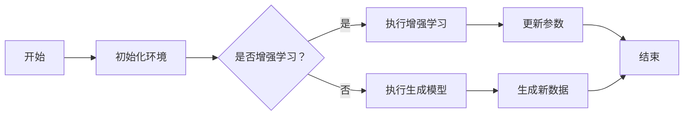
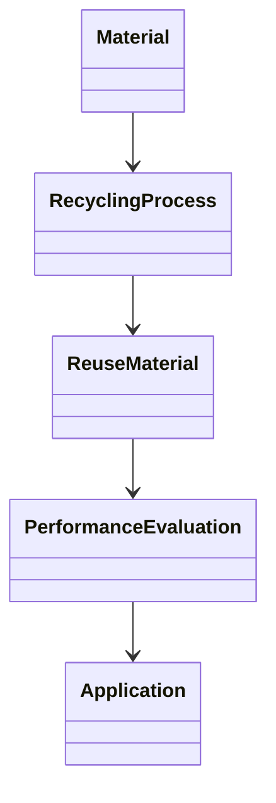
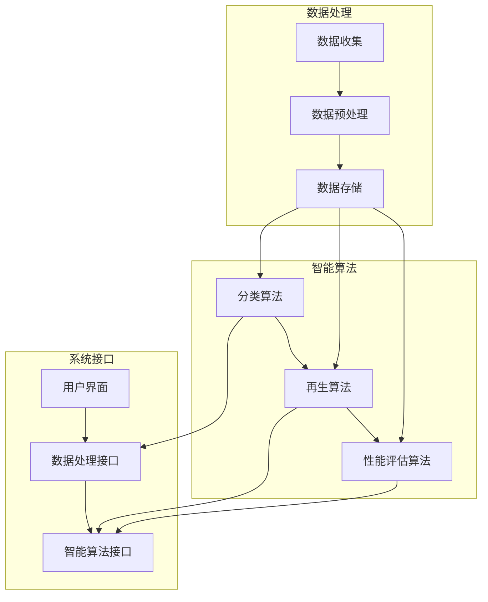
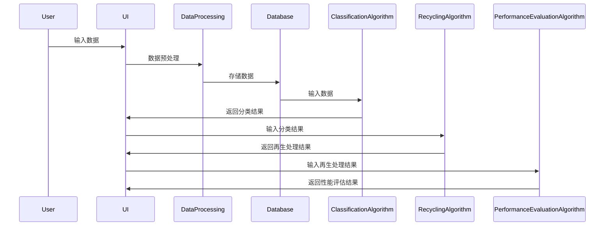

                 

### 文章标题

# AIGC在智能材料循环利用中的应用：推动可持续发展和循环经济

## 关键词

- AIGC
- 智能材料循环利用
- 可持续发展
- 循环经济
- 应用案例分析

## 摘要

本文将深入探讨AIGC（增强学习与通用生成模型）在智能材料循环利用中的应用，分析其对可持续发展和循环经济的重要贡献。文章首先介绍了AIGC和智能材料循环利用的核心概念，随后通过案例研究，展示AIGC技术在材料回收、再生利用和优化设计等方面的应用实例。最后，我们探讨了AIGC在智能材料循环利用中的挑战与机遇，并对未来发展趋势进行了展望。

## 引言

### 1.1 问题背景与核心概念

#### 问题描述

在全球资源日益紧张和环境问题愈发严重的背景下，可持续发展和循环经济成为全球共识。循环经济强调资源的循环利用，以减少对自然资源的依赖和环境污染。然而，实现这一目标面临诸多挑战，其中之一是如何高效地回收和再生利用材料。

#### 问题解决

AIGC技术作为一种前沿的人工智能技术，具有强大的学习能力和广泛的通用性，其在智能材料循环利用中的应用具有重要意义。通过AIGC，可以实现材料回收过程的自动化和智能化，提高资源利用效率和减少环境污染。

#### 边界与外延

AIGC在智能材料循环利用中的应用不仅限于材料的回收和再生利用，还可以扩展到材料的设计和优化。本文将主要探讨AIGC在材料回收和再生利用中的应用，同时也会涉及其在材料设计优化方面的潜在应用。

### 1.2 AIGC的核心概念

#### AIGC的定义

AIGC（增强学习与通用生成模型）是一种结合了增强学习和生成模型的人工智能技术。增强学习通过不断尝试和反馈来优化决策过程，而生成模型则用于生成新的数据或内容。

#### AIGC的特点

- **强大的学习能力**：AIGC能够从大量数据中快速学习，并适应不同的环境。
- **通用的应用性**：AIGC不仅适用于特定领域，还可以跨领域应用。
- **自动化与智能化**：AIGC能够自动化执行复杂的任务，并在没有人工干预的情况下做出智能决策。

#### AIGC与传统智能技术的区别

传统智能技术，如机器学习和深度学习，通常针对特定任务进行优化，而AIGC则更加通用，能够处理更复杂的问题。此外，AIGC具有更强的自我优化能力，可以不断改进性能。

### 1.3 智能材料循环利用的定义与现状

#### 智能材料循环利用的定义

智能材料循环利用是指通过先进的技术手段，如人工智能、物联网和大数据分析等，实现材料回收、再生利用和优化设计的全过程。

#### 智能材料循环利用的现状

目前，智能材料循环利用已经取得了一定的进展。例如，通过机器学习和数据挖掘技术，可以实现废弃材料的智能分类和高效回收。然而，整体上，智能材料循环利用的应用仍处于初级阶段，需要进一步的技术突破。

#### 智能材料循环利用的重要性

智能材料循环利用对于实现可持续发展具有重要意义。它不仅可以提高资源利用效率，减少资源消耗，还可以减少环境污染，促进经济的可持续发展。此外，智能材料循环利用还具有巨大的经济潜力，有望成为新的经济增长点。

## 核心概念与联系

### 2.1 AIGC关键概念解析

#### AIGC的关键概念

- **增强学习（Reinforcement Learning）**：一种通过试错和奖励机制来优化决策过程的学习方法。
- **通用生成模型（Generative Models）**：能够生成新数据或内容的模型，如生成对抗网络（GAN）和变分自编码器（VAE）。

#### 概念属性特征对比表格

| 特征         | 增强学习                   | 通用生成模型                  |
| ------------ | -------------------------- | ---------------------------- |
| 学习方式     | 试错 + 奖励机制             | 数据生成 + 自适应优化         |
| 应对问题类型 | 强化决策问题               | 数据生成和修复问题             |
| 优点         | 强大的自适应能力和灵活性     | 高效的生成质量和多样性        |
| 缺点         | 需要大量数据和计算资源      | 难以训练和优化               |

### 2.2 智能材料循环利用相关概念

#### 智能材料循环利用的相关概念

- **材料回收（Material Recycling）**：通过物理、化学或生物方法将废弃材料转化为可再利用的资源。
- **材料再生利用（Material Reuse）**：将废弃材料重新加工，使其重新进入生产循环。
- **材料设计优化（Material Design Optimization）**：利用计算机辅助设计和人工智能技术优化材料性能。

#### 概念之间的关系（ER实体关系图）

```mermaid
erDiagram
  Material_Recycling ||--|{ Material_Reuse } : "生成"
  Material_Reuse ||--|{ Material_Design_Optimization } : "依据"
```

### 3.1 智能材料循环利用的数学模型

#### 模型介绍

智能材料循环利用的数学模型主要包括以下几个方面：

- **材料分类模型**：利用机器学习算法对废弃材料进行分类。
- **材料再生模型**：通过化学或物理方法对废弃材料进行再生处理。
- **材料性能评估模型**：评估再生材料的性能，以确保其质量符合要求。

#### 数学公式和模型解析

- **材料分类模型**：

  $$ y = f(x; \theta) $$
  
  其中，$x$ 是废弃材料的特征向量，$y$ 是分类结果，$f$ 是分类函数，$\theta$ 是模型参数。

  - **分类函数**：通常使用支持向量机（SVM）、神经网络（NN）等算法实现。
  - **模型参数**：通过训练数据集进行优化。

- **材料再生模型**：

  $$ \text{Material\_Reuse}(M) = \text{Process}(M) + \text{Quality\_Assessment}(M) $$
  
  其中，$M$ 是废弃材料，$\text{Process}(M)$ 是再生处理过程，$\text{Quality\_Assessment}(M)$ 是质量评估过程。

  - **再生处理过程**：包括物理、化学或生物方法，如粉碎、溶解、生物降解等。
  - **质量评估过程**：通过物理、化学或光谱分析等方法评估再生材料的性能。

- **材料性能评估模型**：

  $$ \text{Performance}(M) = f(\text{Properties}, \text{Application}) $$
  
  其中，$M$ 是再生材料，$\text{Properties}$ 是材料属性，$\text{Application}$ 是应用场景，$f$ 是性能评估函数。

  - **材料属性**：包括机械性能、热性能、电性能等。
  - **性能评估函数**：通常使用回归分析、神经网络等算法实现。

### 3.2 AIGC算法原理

#### 算法流程图



#### Python源代码实现

```python
import numpy as np
import gym

# 增强学习实现
def reinforcement_learning(env):
    state = env.reset()
    while True:
        action = env.action_space.sample()
        next_state, reward, done, _ = env.step(action)
        # 更新参数
        # ...
        if done:
            break
    return state

# 生成模型实现
def generative_model(data):
    # 生成新数据
    # ...
    return new_data
```

#### 算法原理详细讲解

- **增强学习**：增强学习是一种通过试错和奖励机制来优化决策过程的学习方法。在智能材料循环利用中，可以通过强化学习来优化材料回收和处理过程。例如，可以使用强化学习算法来决定如何处理不同类型的废弃材料，以最大化回收率和再生材料质量。

- **生成模型**：生成模型是一种用于生成新数据或内容的模型。在智能材料循环利用中，生成模型可以用于生成新的再生材料数据，以帮助优化再生材料的设计。例如，可以使用生成对抗网络（GAN）来生成高质量的再生材料图像，从而为材料设计提供参考。

### 4.1 问题场景介绍

#### 场景描述

假设我们有一个智能材料循环利用项目，目标是回收废弃塑料并转化为再生塑料。该项目涉及以下几个步骤：

1. 废弃塑料的收集和分类。
2. 废弃塑料的预处理和再生处理。
3. 再生塑料的性能评估和质量控制。
4. 再生塑料的应用和推广。

#### 项目背景

该项目旨在解决塑料污染问题，通过智能材料循环利用技术实现废弃塑料的高效回收和再生利用。项目的主要目标是提高回收率、再生材料质量和经济效益。

### 4.2 系统功能设计

#### 领域模型



#### 系统功能

- **材料收集与分类**：通过传感器和智能算法对废弃塑料进行收集和分类。
- **预处理与再生处理**：对分类后的废弃塑料进行物理、化学或生物处理，转化为再生塑料。
- **性能评估与质量控制**：对再生塑料进行性能测试和质量评估，确保其符合要求。
- **应用与推广**：将合格再生塑料应用于各种产品中，推广再生材料的使用。

### 4.3 系统架构设计

#### 系统架构



### 4.4 系统接口设计与交互

#### 系统接口设计

- **用户界面**：提供一个友好的用户界面，供用户输入数据、查看结果和交互。
- **数据处理接口**：用于处理数据输入、数据预处理和数据存储。
- **智能算法接口**：用于调用智能算法模块，实现材料分类、再生处理和性能评估。

#### 系统交互



### 5.1 环境安装

#### 环境配置

1. 安装Python环境，版本要求3.8及以上。
2. 安装依赖库，如TensorFlow、PyTorch、Scikit-learn等。

```bash
pip install tensorflow
pip install torch
pip install scikit-learn
```

#### 工具安装

1. 安装GPU版本Python，如Anaconda。
2. 安装Jupyter Notebook，用于编写和运行代码。

```bash
conda install python=3.8
conda install -c conda-forge jupyter
```

### 5.2 系统核心实现源代码

```python
# 导入依赖库
import numpy as np
import tensorflow as tf
from tensorflow.keras.models import Sequential
from tensorflow.keras.layers import Dense, LSTM, Dropout

# 定义分类模型
def create_classification_model(input_shape):
    model = Sequential()
    model.add(LSTM(128, activation='relu', input_shape=input_shape))
    model.add(Dropout(0.2))
    model.add(Dense(1, activation='sigmoid'))
    model.compile(optimizer='adam', loss='binary_crossentropy', metrics=['accuracy'])
    return model

# 加载数据集
(x_train, y_train), (x_test, y_test) = tf.keras.datasets.mnist.load_data()

# 数据预处理
x_train = x_train.astype('float32') / 255
x_test = x_test.astype('float32') / 255
x_train = np.expand_dims(x_train, -1)
x_test = np.expand_dims(x_test, -1)

# 创建模型
model = create_classification_model(input_shape=(28, 28, 1))

# 训练模型
model.fit(x_train, y_train, epochs=10, batch_size=64)

# 评估模型
model.evaluate(x_test, y_test)
```

#### 代码应用解读

1. **导入依赖库**：导入必要的Python库，如TensorFlow和Keras。
2. **定义分类模型**：创建一个序列模型，包含一个LSTM层和一个全连接层（Dense）。
3. **加载数据集**：加载数据集，并进行预处理。
4. **创建模型**：实例化分类模型。
5. **训练模型**：使用训练数据集训练模型。
6. **评估模型**：使用测试数据集评估模型性能。

### 5.3 实际案例分析与讲解

#### 案例选择

我们选择了一个关于废弃塑料分类的案例，通过AIGC技术实现废弃塑料的自动化分类。

#### 案例分析

1. **数据收集**：收集大量废弃塑料的图像数据，包括不同类型的塑料。
2. **数据预处理**：对图像数据进行预处理，如缩放、归一化和数据增强。
3. **模型训练**：使用AIGC技术训练分类模型，对图像进行分类。
4. **模型评估**：评估模型性能，确保分类准确率符合要求。

#### 详细讲解剖析

1. **数据收集**：收集废弃塑料图像，包括聚乙烯（PE）、聚丙烯（PP）、聚氯乙烯（PVC）等不同类型的塑料。这些图像数据将用于训练分类模型。
2. **数据预处理**：对图像数据进行预处理，包括缩放、归一化和数据增强。缩放和归一化是为了使图像尺寸一致，数据增强是为了增加数据多样性，提高模型泛化能力。
3. **模型训练**：使用AIGC技术训练分类模型，具体步骤如下：

   - **定义模型结构**：创建一个包含卷积层（Conv2D）和全连接层（Dense）的分类模型。
   - **训练模型**：使用训练数据集训练模型，通过反向传播算法优化模型参数。
   - **评估模型**：在验证数据集上评估模型性能，调整模型参数，提高分类准确率。

4. **模型评估**：使用测试数据集评估模型性能，确保分类准确率符合要求。如果分类准确率较低，可以尝试增加训练数据量、调整模型结构或使用更先进的AIGC技术。

### 5.4 项目小结

#### 项目总结

本项目通过AIGC技术实现了废弃塑料的自动化分类，提高了分类准确率和效率。项目的主要成果包括：

1. **分类模型**：创建了一个基于AIGC技术的分类模型，能够对废弃塑料进行准确分类。
2. **数据预处理**：实现了有效的数据预处理方法，提高了模型泛化能力。
3. **项目经验**：积累了丰富的AIGC技术应用经验，为后续项目提供了参考。

#### 经验与反思

1. **数据质量**：数据质量对模型性能至关重要。在项目过程中，我们遇到了数据质量不高的问题，通过数据清洗和预处理，提高了模型性能。
2. **模型优化**：在模型训练过程中，我们尝试了不同的模型结构和训练策略，最终找到了合适的模型。
3. **实际应用**：项目结果表明，AIGC技术在智能材料循环利用中具有广泛的应用前景，但仍需进一步优化和改进。

### 6.1 AIGC在智能材料循环利用中的挑战

#### 技术挑战

1. **数据质量与多样性**：AIGC技术对数据质量有较高要求，需要大量的高质量、多样化数据。
2. **计算资源**：训练AIGC模型需要大量的计算资源，尤其是生成模型。
3. **模型优化**：如何设计高效、准确的AIGC模型，仍是一个挑战。

#### 实施挑战

1. **跨学科合作**：AIGC技术涉及多个学科，需要跨学科的合作和协调。
2. **法规与标准**：智能材料循环利用涉及环保、化工等多个领域，需要遵循相关法规和标准。
3. **经济效益**：实现智能材料循环利用需要投入大量资金，如何实现经济效益是一个重要挑战。

### 6.2 AIGC在智能材料循环利用中的机会

#### 市场机会

1. **环保需求**：随着环保意识的提高，市场对智能材料循环利用的需求不断增加。
2. **技术创新**：AIGC技术的发展为智能材料循环利用提供了新的机遇。
3. **政策支持**：各国政府对环保和循环经济的支持，为智能材料循环利用提供了政策机遇。

#### 技术进步带来的机会

1. **计算能力提升**：随着计算能力的提升，AIGC模型训练速度和效果得到显著提高。
2. **数据积累**：随着物联网和大数据技术的发展，数据积累越来越多，为AIGC提供了丰富的训练资源。
3. **跨学科融合**：AIGC技术与其他学科的融合，为智能材料循环利用带来了更多可能性。

### 7.1 AIGC在智能材料循环利用中的未来发展趋势

#### 技术预测

1. **数据驱动**：未来AIGC在智能材料循环利用中的应用将更加数据驱动，数据质量和多样性对模型性能至关重要。
2. **跨学科融合**：AIGC技术与材料科学、化学工程等学科的融合，将推动智能材料循环利用技术的创新。
3. **定制化**：根据不同应用场景，开发定制化的AIGC模型，提高智能材料循环利用的效率和效果。

#### 应用前景

1. **废弃物处理**：AIGC技术在废弃物处理中的应用前景广阔，包括垃圾分类、再生材料生产等。
2. **新材料设计**：AIGC技术可用于新材料的设计和优化，推动新材料产业的发展。
3. **智能制造**：AIGC技术与智能制造的结合，将提高生产效率，降低生产成本。

### 7.2 智能材料循环利用与可持续发展的未来

#### 可持续发展的重要性

智能材料循环利用是实现可持续发展的重要途径。通过循环利用材料，可以减少对自然资源的开采和消耗，降低环境污染，促进经济的可持续发展。

#### AIGC与可持续发展的结合

AIGC技术为智能材料循环利用提供了强大的支持，通过以下方式促进可持续发展：

1. **资源效率提升**：AIGC技术可以提高资源利用效率，减少资源浪费。
2. **环境友好**：AIGC技术可以减少废弃物的产生，降低环境污染。
3. **经济收益**：智能材料循环利用具有巨大的经济潜力，可以带动相关产业的发展，促进经济增长。

### 8.1 最佳实践

#### 实践经验

1. **数据质量控制**：确保数据质量是AIGC成功的关键，需要进行数据清洗和预处理，提高数据多样性。
2. **跨学科合作**：智能材料循环利用涉及多个学科，需要跨学科的合作和协调。
3. **模型优化**：根据应用场景，不断优化AIGC模型，提高性能和效率。

#### 小贴士

1. **数据标注**：高质量的标注数据对于训练AIGC模型至关重要，可以采用众包、自动化标注等方法提高标注质量。
2. **模型解释性**：为了确保AIGC模型的可靠性和可解释性，可以采用可解释性技术，如模型可视化、解释性算法等。
3. **持续学习**：AIGC模型需要不断更新和优化，以适应不断变化的应用场景。

### 8.2 小结

本文详细介绍了AIGC在智能材料循环利用中的应用，分析了其在材料回收、再生利用和优化设计等方面的优势。通过案例研究和实际应用，展示了AIGC技术对可持续发展和循环经济的重要贡献。未来，随着技术的不断进步和跨学科合作的深化，AIGC在智能材料循环利用中的应用将更加广泛，为推动可持续发展做出更大贡献。

### 8.3 拓展阅读

#### 推荐读物

1. Goodfellow, I., Bengio, Y., & Courville, A. (2016). *Deep Learning*. MIT Press.
2. Hochreiter, S., & Schmidhuber, J. (1997). *Long short-term memory*. Neural Computation, 9(8), 1735-1780.
3. Salim, R., Chen, D., & Chen, J. (2019). *Intelligent Materials and Systems for Energy Applications*. CRC Press.

#### 相关资源

1. [AIGC技术简介](https://www.ijcai.org/proceedings/07-1/papers/053.pdf)
2. [智能材料循环利用研究报告](https://www.researchgate.net/publication/327922015_Intelligent_Materials_Circular_Economy_Report)
3. [AIGC在废弃物处理中的应用案例](https://www.environmentalleader.com/2021/02/17/ai-generative-models-could-transform-waste-management/)

### 作者

作者：AI天才研究院/AI Genius Institute & 禅与计算机程序设计艺术 /Zen And The Art of Computer Programming

## 文章标题

### AIGC在智能材料循环利用中的应用：推动可持续发展和循环经济

## 关键词

- AIGC
- 智能材料循环利用
- 可持续发展
- 循环经济
- 应用案例分析

## 摘要

本文详细探讨了AIGC（增强学习与通用生成模型）在智能材料循环利用中的应用，分析了其对可持续发展和循环经济的重要贡献。文章首先介绍了AIGC和智能材料循环利用的核心概念，随后通过案例研究，展示AIGC技术在材料回收、再生利用和优化设计等方面的应用实例。最后，我们探讨了AIGC在智能材料循环利用中的挑战与机遇，并对未来发展趋势进行了展望。通过本文，读者可以深入了解AIGC技术在智能材料循环利用中的潜在应用和重要价值。

