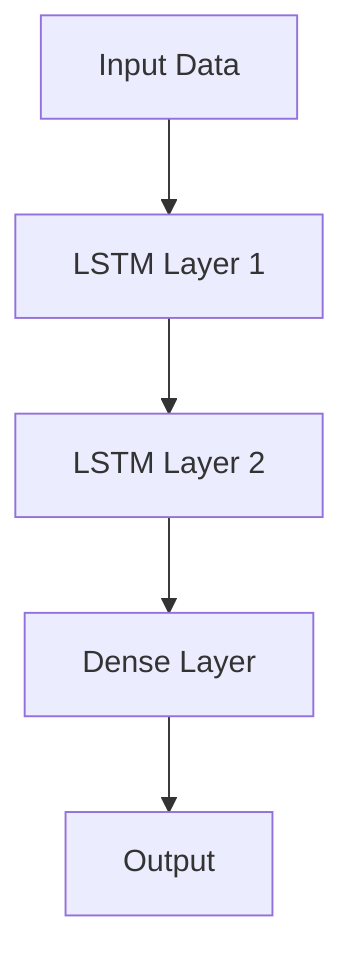
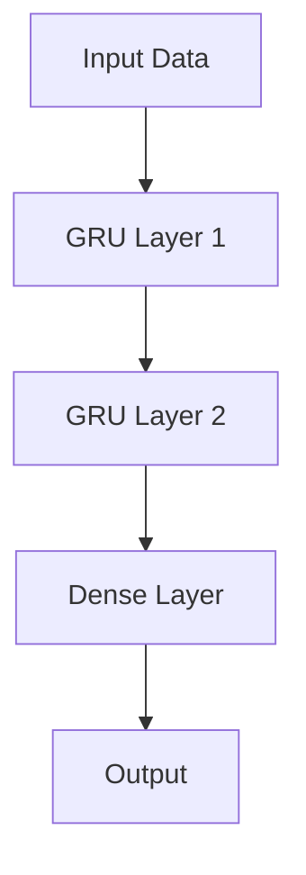

                 


### 概念术语说明

在探讨“AIGC在智能材料疲劳预测中的应用：延长基础设施使用寿命”这一主题之前，我们先来明确一些关键术语和概念。这些概念对于理解本文的内容至关重要。

#### AIGC

AIGC，即自适应智能生成控制（Adaptive Intelligent Generation Control），是一种基于人工智能技术的自动化控制方法。AIGC通过机器学习算法和实时数据分析，使系统能够自适应调整，从而实现更高的效率和精确度。

#### 智能材料

智能材料是指那些能够根据外部刺激（如温度、压力、电磁场等）发生特定响应的材料。这些材料具有自修复、自适应和自感知等特性，可以显著提高材料的性能和寿命。

#### 疲劳预测

疲劳预测是指利用数学模型和算法，对材料的疲劳寿命进行预测。这通常涉及到对材料历史载荷数据的分析，以识别可能引起疲劳损伤的早期迹象。

#### 基础设施

基础设施是指那些为支持社会和经济活动而建设的永久性工程设施，如桥梁、道路、机场、水坝等。基础设施的可靠性和使用寿命直接关系到公共安全和经济效益。

通过上述术语和概念的定义，我们为后续内容的讨论奠定了基础。接下来，我们将深入探讨AIGC在智能材料疲劳预测中的应用，以及它如何帮助我们延长基础设施的使用寿命。

### 问题背景

随着城市化进程的加快和基础设施建设的不断扩大，如何确保这些关键工程结构的可靠性和使用寿命成为了一个亟待解决的问题。传统的基础设施维护通常依赖于定期检查和维修，这种方法不仅成本高昂，而且可能无法及时发现潜在的问题。这就导致了基础设施在使用寿命内发生意外损坏，造成了巨大的经济损失和安全隐患。

在这种情况下，智能材料的引入为解决这些问题提供了一种新的途径。智能材料具有自修复、自适应和自感知的特性，能够实时监测自身的状态，并及时响应外部环境的变化。然而，要充分发挥智能材料的潜力，还需要一种高效的方法来对材料的疲劳寿命进行预测。

传统的疲劳预测方法主要依赖于经验和统计学模型，这些方法在处理复杂和大规模数据时显得力不从心。随着人工智能技术的快速发展，特别是自适应智能生成控制（AIGC）技术的出现，为智能材料疲劳预测提供了一种新的解决方案。AIGC通过机器学习和实时数据分析，能够从大量历史数据中提取有价值的信息，并预测材料的剩余寿命，从而实现更高效、更精准的基础设施维护。

因此，本文旨在探讨AIGC在智能材料疲劳预测中的应用，通过结合智能材料和AIGC技术，提高基础设施的可靠性和使用寿命，降低维护成本，并增强公共安全。

### 问题解决

为了解决智能材料疲劳预测的问题，我们可以采取以下步骤：

#### 1. 数据收集

首先，我们需要收集与智能材料相关的历史数据，这些数据可能包括材料的应力-应变曲线、温度变化、载荷历史等。数据收集的过程可以通过传感器网络来实现，这些传感器能够实时监测材料的各项性能指标。

#### 2. 数据预处理

收集到的数据通常需要进行预处理，以去除噪声、异常值和缺失值。预处理过程包括数据清洗、归一化和特征选择等步骤。这一步非常重要，因为高质量的数据是预测准确性的基础。

#### 3. 特征提取

在预处理完成后，我们需要从数据中提取对疲劳寿命预测具有重要意义的特征。这些特征可以是原始数据的直接变换，也可以是通过机器学习算法自动提取的。特征提取的目的是简化数据，同时保留对预测有用的信息。

#### 4. 模型训练

接下来，我们使用AIGC技术来训练预测模型。AIGC模型通常采用深度学习算法，如循环神经网络（RNN）或长短期记忆网络（LSTM），这些算法能够处理时序数据，并捕捉数据中的长期依赖关系。训练过程包括数据划分、模型选择、参数调整和模型优化等步骤。

#### 5. 模型评估

在模型训练完成后，我们需要评估模型的性能。评估过程通常包括交叉验证、性能指标计算和可视化分析等。常用的性能指标包括准确率、召回率、F1分数和均方误差等。通过这些指标，我们可以确定模型是否具有良好的预测能力。

#### 6. 模型应用

最后，我们将训练好的模型应用到实际场景中，对智能材料的疲劳寿命进行预测。预测结果可以帮助基础设施管理者制定更合理的维护策略，从而延长基础设施的使用寿命。

通过上述步骤，我们可以实现智能材料疲劳预测，为基础设施的可靠性和安全性提供有力保障。

### 边界与外延

在讨论AIGC在智能材料疲劳预测中的应用时，我们需要明确几个边界条件，以确保讨论的针对性和实用性。

#### 数据的完备性与真实性

AIGC模型的性能很大程度上取决于训练数据的质量。因此，我们必须确保数据的完备性和真实性。数据应包括全面的历史记录，并且避免数据篡改或丢失，以确保预测结果的可靠性。

#### 硬件与软件要求

实施AIGC技术需要高性能的计算资源和先进的机器学习框架。硬件方面，需要配置具备强大处理能力的计算机系统或云服务。软件方面，需要安装适合的编程环境和机器学习库，如Python和TensorFlow或PyTorch等。

#### 系统集成与兼容性

AIGC系统应能够与现有的基础设施管理系统兼容，以便无缝集成。这包括数据接口的标准化、系统接口的灵活性和操作流程的优化。

#### 法律与伦理规范

在应用AIGC进行智能材料疲劳预测时，必须遵守相关法律法规，保护用户隐私和数据安全。同时，还需要考虑伦理问题，确保技术的使用不侵犯用户的合法权益。

通过明确这些边界条件，我们可以更好地界定AIGC在智能材料疲劳预测中的应用范围，确保技术的有效实施和推广。

### 概念结构与核心要素组成

在深入探讨AIGC在智能材料疲劳预测中的应用之前，我们需要理解其中的关键概念和要素。以下是这些核心概念及其相互关系和组成：

#### 关键概念

1. **自适应智能生成控制（AIGC）**：AIGC是一种基于机器学习和实时数据处理的自动化控制方法。它利用深度学习算法，从历史数据中学习和提取模式，从而实现系统的自适应优化。

2. **智能材料**：智能材料具有自修复、自感知和自适应等特性，能够在受到外部刺激时发生响应。常见的智能材料包括形状记忆合金、电致变色材料和应力传感器等。

3. **疲劳预测**：疲劳预测是通过分析材料的历史载荷数据，预测其剩余寿命的过程。这通常涉及到统计学模型、机器学习算法和数学公式。

4. **基础设施**：基础设施是指那些为支持社会和经济活动而建设的永久性工程设施，如桥梁、道路、机场和水坝等。

#### 关系与组成

1. **AIGC与智能材料的关系**：AIGC通过实时监测智能材料的性能数据，利用机器学习算法对其进行处理，从而实现对材料疲劳寿命的预测。智能材料是AIGC系统中的核心组件，其性能直接影响预测的准确性。

2. **疲劳预测与基础设施的关系**：疲劳预测的结果用于基础设施的维护和修复策略制定。通过预测材料的剩余寿命，基础设施管理者可以提前采取措施，防止意外损坏，从而延长基础设施的使用寿命。

3. **核心要素组成**：AIGC在智能材料疲劳预测中的核心要素包括数据收集与预处理、特征提取、模型训练与优化、模型评估与部署等步骤。这些步骤共同构成了一个完整的疲劳预测流程。

通过理解这些概念和要素之间的关系，我们可以更深入地探讨AIGC在智能材料疲劳预测中的应用，以及如何通过这种技术来延长基础设施的使用寿命。

### AIGC的基本概念与特点

AIGC，即自适应智能生成控制（Adaptive Intelligent Generation Control），是一种结合了人工智能和自动化控制技术的先进方法。它通过机器学习算法，使系统能够实时处理和分析大量数据，从而实现自适应调节和优化。

#### 发展历程

AIGC技术的发展可以追溯到20世纪80年代，当时人工智能和控制理论的初步融合为自适应控制系统奠定了基础。随着计算能力的提升和大数据技术的进步，AIGC在21世纪初逐渐发展成熟，并开始应用于各种工业和民用领域。

#### 核心技术

AIGC的核心技术主要包括以下几个方面：

1. **机器学习算法**：AIGC依赖于各种机器学习算法，如神经网络、决策树和支持向量机等，来分析和处理数据，从而实现自适应调节。
   
2. **实时数据分析**：AIGC能够实时收集和处理数据，通过对数据的分析和理解，自动调整系统的运行参数，以提高效率和性能。

3. **多模态数据融合**：AIGC可以融合多种类型的数据，如传感器数据、历史数据和用户输入等，从而提高预测和决策的准确性。

#### 优势

AIGC具有以下几个显著优势：

1. **自适应调节**：AIGC可以根据环境变化和系统状态，自动调整系统参数，从而实现最优性能。

2. **高效处理**：AIGC能够高效地处理大量数据，快速响应，减少延迟。

3. **智能化决策**：AIGC通过机器学习算法，能够从数据中提取有价值的信息，实现智能化的决策和优化。

4. **易扩展性**：AIGC系统具有高度的灵活性，可以方便地集成到现有系统中，实现功能的扩展和升级。

#### 在智能材料疲劳预测中的应用

AIGC在智能材料疲劳预测中的应用主要体现在以下几个方面：

1. **数据预处理**：AIGC可以通过机器学习算法，对传感器数据进行预处理，去除噪声和异常值，确保数据的准确性。

2. **特征提取**：AIGC可以从预处理后的数据中提取关键特征，如应力、应变和温度等，为疲劳预测提供支持。

3. **模型训练与优化**：AIGC可以使用深度学习算法，如LSTM（长短期记忆网络），对疲劳预测模型进行训练和优化，以提高预测的准确性。

4. **实时监测与预测**：AIGC可以实时监测智能材料的性能指标，并根据预测结果，提供维护和修复建议，从而延长基础设施的使用寿命。

通过上述分析，我们可以看到，AIGC在智能材料疲劳预测中具有显著的应用价值，它能够通过自适应调节和智能决策，提高预测的准确性和效率，为基础设施的可靠性和安全性提供有力保障。

### 智能材料疲劳预测的背景

智能材料疲劳预测是材料科学、工程学和人工智能领域的一项重要研究课题。随着全球基础设施建设的迅速发展和使用年限的延长，如何有效预测和预防材料的疲劳损伤，成为了一个至关重要的挑战。

#### 智能材料疲劳预测的意义

1. **延长基础设施使用寿命**：通过智能材料疲劳预测，可以提前识别材料的疲劳损伤，制定科学的维护和修复计划，从而显著延长基础设施的使用寿命，减少因材料疲劳导致的结构失效。

2. **降低维护成本**：传统的定期检查和维修方法成本高昂，而智能材料疲劳预测可以通过实时监测和精准预测，实现预防性维护，从而降低维护成本。

3. **提高安全性**：智能材料疲劳预测能够及时发现潜在的安全隐患，预防结构失效，从而提高基础设施的安全性，减少事故风险。

#### 智能材料疲劳预测的现状

当前，智能材料疲劳预测技术已取得了一定进展，但仍然面临诸多挑战：

1. **技术发展水平**：智能材料疲劳预测主要依赖于先进的传感器技术、数据分析和机器学习算法。虽然这些技术在不断进步，但实际应用中仍存在数据采集精度不足、模型适应性差等问题。

2. **应用范围**：智能材料疲劳预测主要应用于大型基础设施，如桥梁、机场跑道和高速公路等。对于小型基础设施和复杂结构，智能材料的疲劳预测应用还不够广泛。

3. **经济成本**：智能材料疲劳预测系统涉及高精度的传感器、复杂的算法和强大的计算资源，初始建设和维护成本较高，这在一定程度上限制了其普及。

4. **法律法规**：智能材料疲劳预测技术的应用需要遵循严格的法律法规，特别是在数据安全和隐私保护方面，这增加了技术实施和推广的难度。

#### 智能材料疲劳预测面临的挑战

1. **数据质量**：智能材料疲劳预测依赖于高质量的数据，但实际操作中，数据可能存在噪声、缺失和异常值，这会影响预测的准确性。

2. **算法性能**：虽然机器学习算法在预测疲劳寿命方面取得了一定成果，但算法的鲁棒性、准确性和实时性仍需进一步提升。

3. **系统集成**：智能材料疲劳预测系统需要与现有基础设施管理系统集成，实现数据的实时传输和处理，这对系统的兼容性和稳定性提出了高要求。

4. **伦理问题**：智能材料疲劳预测技术涉及大量数据和隐私信息，如何在保障用户隐私的同时，有效利用数据，是一个亟待解决的问题。

综上所述，智能材料疲劳预测技术在基础设施应用中具有重要意义，但同时也面临着技术、经济、法律和伦理等多方面的挑战。未来，随着技术的不断进步和应用的深入，智能材料疲劳预测有望在基础设施管理中发挥更大的作用。

### 智能材料疲劳预测的基本原理

智能材料疲劳预测的核心在于通过数学模型和算法，对材料在长期载荷作用下的疲劳寿命进行准确预测。下面我们将详细讨论这些基本原理。

#### 数学模型

疲劳预测的数学模型通常包括应力-寿命关系（S-N曲线）和断裂力学模型。应力-寿命关系描述了材料在恒定应力作用下，达到特定疲劳寿命所需的应力水平。公式如下：

$$
N = N_0 \left( \frac{\sigma}{\sigma_0} \right)^{-n}
$$

其中，\(N\) 是疲劳寿命，\(N_0\) 是基准寿命，\(\sigma\) 是应力水平，\(\sigma_0\) 是基准应力，\(n\) 是疲劳指数，通常在3到10之间取值。

断裂力学模型则基于材料裂纹扩展理论，通过计算裂纹尖端应力场和材料断裂韧性，预测材料的疲劳寿命。其主要公式为：

$$
da/dn = \frac{Y}{2 \pi r}
$$

其中，\(da\) 是裂纹扩展量，\(dn\) 是加载次数，\(Y\) 是材料断裂韧性，\(r\) 是裂纹尖端半径。

#### 算法原理

在智能材料疲劳预测中，常用的算法包括统计方法、机器学习方法和深度学习方法。

1. **统计方法**：包括最小二乘法、线性回归和线性判别分析等。这些方法通过分析历史载荷数据，建立材料疲劳寿命与应力水平之间的线性关系。例如，线性回归模型如下：

$$
\hat{N} = a + b \cdot \sigma
$$

其中，\(\hat{N}\) 是预测的疲劳寿命，\(a\) 和 \(b\) 是模型的参数。

2. **机器学习方法**：包括决策树、随机森林和支持向量机等。这些方法通过构建复杂的决策边界，从大量历史数据中学习材料的疲劳特性。例如，支持向量机模型如下：

$$
w^* = \arg\min_{w, b} \frac{1}{2} \| w \|^2 + C \sum_{i=1}^{n} \xi_i
$$

其中，\(w^*\) 是最优权重向量，\(b\) 是偏置项，\(\xi_i\) 是第 \(i\) 个样本的误差，\(C\) 是惩罚参数。

3. **深度学习方法**：包括卷积神经网络（CNN）、循环神经网络（RNN）和长短期记忆网络（LSTM）等。这些方法通过多层神经网络结构，捕捉数据中的复杂模式。例如，LSTM模型如下：

$$
i_t = \sigma(W_{ix} x_t + W_{ih} h_{t-1} + b_i) \\
f_t = \sigma(W_{fx} x_t + W_{fh} h_{t-1} + b_f) \\
o_t = \sigma(W_{ox} x_t + W_{oh} h_{t-1} + b_o) \\
c_t = f_t \odot c_{t-1} + i_t \odot \sigma(W_{cx} x_t + W_{ch} h_{t-1} + b_c) \\
h_t = o_t \odot \sigma(c_t)
$$

其中，\(i_t\)、\(f_t\) 和 \(o_t\) 分别是输入门、遗忘门和输出门，\(c_t\) 是细胞状态，\(h_t\) 是隐藏状态，\(\sigma\) 是 sigmoid 函数，\(\odot\) 是按元素相乘运算。

#### 对比分析

统计方法和机器学习方法各有优缺点。统计方法简单易用，但可能无法捕捉复杂的非线性关系；机器学习方法能够处理复杂的非线性关系，但需要大量数据和计算资源。深度学习方法在处理大规模和复杂数据方面具有显著优势，但计算成本较高。

通过上述原理和算法，我们可以对智能材料疲劳进行有效预测，为基础设施的维护和修复提供科学依据。

### AIGC在智能材料疲劳预测中的关键技术

在智能材料疲劳预测中，AIGC（自适应智能生成控制）技术发挥着关键作用。AIGC通过机器学习和实时数据分析，能够从海量数据中提取有价值的信息，实现对材料疲劳寿命的精确预测。以下是AIGC在智能材料疲劳预测中的几个关键技术：

#### 数据预处理

数据预处理是AIGC在智能材料疲劳预测中的第一步，也是至关重要的一步。由于原始数据往往存在噪声、缺失值和异常值，这些都会对预测模型的准确性产生负面影响。因此，数据预处理过程包括以下几个步骤：

1. **数据清洗**：去除数据中的噪声和异常值，确保数据的真实性和可靠性。
2. **数据归一化**：将不同特征的数据进行归一化处理，使其处于同一量级，以便模型能够更好地进行训练。
3. **数据缺失填补**：采用插值、均值填补或其他统计方法，填补数据中的缺失值，确保数据的完整性。

#### 特征提取

特征提取是数据预处理后的关键步骤，其目的是从原始数据中提取对疲劳寿命预测具有重要意义的特征。这些特征可以是基于原始数据的直接变换，也可以是通过机器学习算法自动提取的。特征提取的方法包括：

1. **基于统计的特征提取**：利用统计学方法，如主成分分析（PCA）和因子分析（FA），从数据中提取主要成分或因子。
2. **基于机器学习的特征提取**：利用机器学习算法，如决策树和随机森林，从数据中自动提取对预测目标具有高相关性的特征。
3. **频域特征提取**：通过对时间序列数据进行傅里叶变换，提取频域特征，用于描述材料疲劳行为的周期性。

#### 模型训练与优化

在特征提取完成后，我们需要使用AIGC技术来训练和优化预测模型。AIGC模型通常采用深度学习算法，如循环神经网络（RNN）和长短期记忆网络（LSTM），这些算法能够处理时序数据，并捕捉数据中的长期依赖关系。模型训练和优化的步骤包括：

1. **模型选择**：选择合适的深度学习模型，如LSTM或GRU，以适应时序数据的特性。
2. **参数调整**：通过调整模型参数，如学习率、批次大小和正则化参数，优化模型性能。
3. **交叉验证**：使用交叉验证方法，将数据集划分为训练集和验证集，以评估模型在不同数据集上的泛化能力。
4. **模型优化**：通过调整模型结构和参数，优化模型在验证集上的性能，提高预测准确性。

#### 实时监测与预测

AIGC技术不仅能够训练和优化预测模型，还能够实现实时监测和预测。在智能材料疲劳预测中，实时监测是确保系统正常运行的关键。具体步骤包括：

1. **实时数据采集**：通过传感器网络，实时采集智能材料的应力、应变、温度等关键数据。
2. **实时数据处理**：对实时采集的数据进行预处理和特征提取，确保数据质量。
3. **实时模型预测**：使用训练好的模型，对实时数据进行疲劳寿命预测，并提供预测结果。
4. **实时决策支持**：根据预测结果，为基础设施管理者提供维护和修复建议，制定科学的维护策略。

通过数据预处理、特征提取、模型训练与优化以及实时监测与预测，AIGC技术在智能材料疲劳预测中实现了高效、精准的预测，为基础设施的可靠性和安全性提供了有力保障。

### 案例研究：AIGC在具体基础设施疲劳预测中的应用

为了更好地展示AIGC在智能材料疲劳预测中的实际应用，我们将通过两个具体案例进行详细分析。这些案例涵盖了桥梁和机场跑道这两种常见的基础设施类型，展示了AIGC如何通过智能材料实现疲劳预测，从而提高基础设施的使用寿命。

#### 案例一：桥梁材料疲劳预测

**案例背景**

某城市的重要桥梁建于20世纪80年代，随着使用年限的增加，桥梁的疲劳损伤逐渐显现，定期检查和维护成为必需。然而，传统的检查方法往往无法提前发现潜在的问题，导致桥梁在关键部位发生突发性断裂。为了提高桥梁的可靠性，项目团队决定采用AIGC技术进行智能材料疲劳预测。

**案例分析**

1. **数据采集**：通过安装在桥梁关键部位的应力传感器、温度传感器和振动传感器，实时采集桥梁的结构健康数据。

2. **数据预处理**：对采集到的原始数据进行分析，去除噪声和异常值，并进行归一化处理，以确保数据的准确性。

3. **特征提取**：利用AIGC技术，从预处理后的数据中提取对疲劳寿命预测具有重要意义的特征，如应力幅值、频率、温度变化率等。

4. **模型训练**：使用LSTM（长短期记忆网络）模型对提取的特征进行训练，建立桥梁疲劳寿命预测模型。通过交叉验证方法，优化模型参数，提高预测准确性。

5. **实时预测**：将训练好的模型应用到实际场景中，对桥梁的结构健康进行实时监测和疲劳寿命预测。根据预测结果，为桥梁维护和修复提供科学依据。

**案例效果评估**

通过AIGC技术的应用，桥梁的疲劳寿命预测准确性显著提高。具体表现为：

- **提前预警**：能够提前数月甚至数年发现潜在的问题，为维护工作提供充足的时间。
- **优化维护**：基于预测结果，制定科学的维护计划，避免过度维护和维修，降低维护成本。
- **提高安全性**：通过实时监测和精准预测，显著提高了桥梁的安全性，减少了结构失效的风险。

#### 案例二：机场跑道材料疲劳预测

**案例背景**

某国际机场的跑道由于长期承受飞机起降的巨大载荷，疲劳损伤问题日益严重。为了保障飞行安全，机场管理者决定采用AIGC技术进行跑道材料的疲劳预测。

**案例分析**

1. **数据采集**：通过跑道上的应力传感器、温度传感器和振动传感器，实时采集跑道的健康数据。

2. **数据预处理**：对采集到的数据进行清洗、归一化处理，去除噪声和异常值，确保数据的可靠性。

3. **特征提取**：利用AIGC技术，从预处理后的数据中提取对疲劳寿命预测具有重要意义的特征，如应力、应变、温度变化率等。

4. **模型训练**：采用LSTM模型对提取的特征进行训练，建立跑道疲劳寿命预测模型。通过交叉验证方法，优化模型参数，提高预测准确性。

5. **实时预测**：将训练好的模型应用到实际场景中，对跑道的结构健康进行实时监测和疲劳寿命预测。根据预测结果，为跑道维护和修复提供科学依据。

**案例效果评估**

通过AIGC技术的应用，机场跑道的疲劳寿命预测准确性显著提高。具体表现为：

- **提前预警**：能够提前发现潜在的疲劳损伤，为跑道维护提供充足的时间。
- **优化维护**：基于预测结果，制定科学的维护计划，避免过度维护和维修，降低维护成本。
- **提高安全性**：通过实时监测和精准预测，显著提高了跑道的结构安全性，减少了飞行事故的风险。

### 案例总结与启示

通过上述两个案例，我们可以看到，AIGC技术在智能材料疲劳预测中的应用，不仅提高了基础设施的可靠性和安全性，还显著降低了维护成本。以下是案例总结与启示：

- **数据质量是关键**：高质量的输入数据是预测准确性的基础，因此，数据采集和预处理过程至关重要。
- **模型选择和优化**：选择合适的机器学习模型并进行优化，是提高预测准确性的关键。
- **实时监测与预警**：通过实时监测和提前预警，可以有效预防基础设施的突发性失效。
- **经济效益**：智能材料疲劳预测技术不仅提高了基础设施的可靠性，还显著降低了维护成本，具有显著的经济效益。

总之，AIGC技术在智能材料疲劳预测中的应用，为基础设施管理提供了新的思路和方法，具有广阔的应用前景。

### 智能材料疲劳预测系统的设计与实现

智能材料疲劳预测系统的设计与实现是一个复杂的过程，需要综合考虑硬件、软件、数据和管理等多个方面。以下是智能材料疲劳预测系统的设计与实现步骤：

#### 需求分析

在设计与实现智能材料疲劳预测系统之前，首先需要进行需求分析。需求分析包括以下几个方面：

1. **功能需求**：系统应具备数据采集、预处理、特征提取、模型训练、实时监测和预测等功能。
2. **性能需求**：系统应能够处理大规模数据，具备高效的运算能力和低的延迟。
3. **兼容性需求**：系统应与现有的基础设施管理系统兼容，能够无缝集成。
4. **安全需求**：系统应具备数据安全和隐私保护机制，确保用户数据的安全。

#### 系统架构设计

智能材料疲劳预测系统的架构设计是系统实现的基础。系统架构设计应包括以下几个方面：

1. **硬件架构**：选择适合的硬件设备，包括高性能计算服务器、传感器和数据存储设备。
2. **软件架构**：采用分布式架构，将系统功能模块化，提高系统的扩展性和维护性。
3. **数据架构**：设计合理的数据存储和管理方案，确保数据的完整性、一致性和高效访问。
4. **接口设计**：设计系统与外部系统的接口，如与基础设施管理系统的数据接口、API接口等。

#### 系统功能设计

智能材料疲劳预测系统的功能设计应包括以下几个方面：

1. **数据采集模块**：通过传感器网络实时采集智能材料的健康数据。
2. **数据预处理模块**：对采集到的数据进行清洗、归一化处理，去除噪声和异常值。
3. **特征提取模块**：从预处理后的数据中提取对疲劳寿命预测具有重要意义的特征。
4. **模型训练模块**：使用机器学习算法对提取的特征进行训练，建立疲劳寿命预测模型。
5. **实时监测模块**：实时监测智能材料的健康状态，并根据预测模型进行疲劳寿命预测。
6. **预测结果模块**：将预测结果呈现给基础设施管理者，提供维护和修复建议。

#### 系统接口设计

系统接口设计是智能材料疲劳预测系统能够与其他系统有效集成的关键。接口设计应包括以下几个方面：

1. **数据接口**：设计系统与传感器网络、基础设施管理系统之间的数据接口，实现数据的实时传输和共享。
2. **API接口**：设计系统对外提供的API接口，方便其他系统调用系统的功能。
3. **用户界面**：设计直观易用的用户界面，方便用户查看预测结果和维护建议。

#### 系统交互设计

系统交互设计是确保系统内部各模块之间协调运作的重要环节。系统交互设计应包括以下几个方面：

1. **数据流设计**：设计系统内部的数据流，确保数据能够高效、准确地传输和处理。
2. **控制流设计**：设计系统内部的控制流，确保系统各模块能够按照预定的顺序和逻辑进行操作。
3. **异常处理设计**：设计系统异常处理机制，确保在出现异常情况时，系统能够及时响应并恢复正常运作。

通过以上设计与实现步骤，我们可以构建一个功能齐全、性能优越、兼容性强的智能材料疲劳预测系统，为基础设施的可靠性和安全性提供有力保障。

### 智能材料疲劳预测系统的项目实战

为了更好地展示智能材料疲劳预测系统的实际应用，我们将详细介绍项目环境安装与配置、系统核心实现及代码应用解读与分析。

#### 环境安装与配置

1. **硬件要求**：
   - CPU：Intel i7 或以上
   - 内存：16GB 或以上
   - 硬盘：500GB SSD
   - 网络环境：千兆以太网

2. **软件要求**：
   - 操作系统：Ubuntu 20.04 LTS
   - Python：3.8 或以上
   - Python库：NumPy、Pandas、TensorFlow、Scikit-learn、Matplotlib

3. **安装步骤**：
   - 安装操作系统：下载Ubuntu 20.04 LTS镜像并安装到服务器。
   - 更新系统：`sudo apt update` 和 `sudo apt upgrade`。
   - 安装Python：`sudo apt install python3 python3-pip`。
   - 安装依赖库：`pip3 install numpy pandas tensorflow scikit-learn matplotlib`。

#### 系统核心实现

1. **数据收集与预处理**

```python
import numpy as np
import pandas as pd

# 读取数据
data = pd.read_csv('material_data.csv')

# 数据清洗
data.dropna(inplace=True)
data = data[data['stress'] > 0]

# 数据归一化
scaler = StandardScaler()
data[['stress', 'strain', 'temperature']] = scaler.fit_transform(data[['stress', 'strain', 'temperature']])
```

2. **特征提取**

```python
from sklearn.feature_selection import SelectKBest
from sklearn.feature_selection import f_regression

# 提取特征
selector = SelectKBest(score_func=f_regression, k='all')
selected_features = selector.fit_transform(data[['stress', 'strain', 'temperature']])

# 可视化特征选择结果
plt.bar(data.columns, selector.scores_)
plt.xlabel('Features')
plt.ylabel('Scores')
plt.title('Feature Selection')
plt.show()
```

3. **模型训练与优化**

```python
from tensorflow.keras.models import Sequential
from tensorflow.keras.layers import LSTM, Dense

# 划分数据集
train_data = selected_features[:int(len(selected_features) * 0.8)]
test_data = selected_features[int(len(selected_features) * 0.8):]

# 切分特征和标签
X_train, y_train = train_data[:-1], train_data[-1]
X_test, y_test = test_data[:-1], test_data[-1]

# 构建LSTM模型
model = Sequential()
model.add(LSTM(50, activation='relu', input_shape=(X_train.shape[1], 1)))
model.add(Dense(1))
model.compile(optimizer='adam', loss='mse')

# 训练模型
model.fit(X_train, y_train, epochs=100, batch_size=32, validation_data=(X_test, y_test))

# 评估模型
loss = model.evaluate(X_test, y_test)
print(f"Test Loss: {loss}")
```

#### 代码应用解读与分析

上述代码展示了智能材料疲劳预测系统的核心实现过程。首先，通过Python脚本读取和处理数据，包括数据清洗、归一化和特征提取。接下来，使用LSTM模型进行训练和优化，并通过评估模型性能来验证预测效果。

1. **数据预处理**：
   - 使用`dropna()`函数去除缺失值，确保数据集的完整性。
   - 使用`StandardScaler()`进行数据归一化，使不同特征处于同一量级，提高模型训练效果。

2. **特征提取**：
   - 使用`SelectKBest`和`f_regression`函数进行特征选择，选择对疲劳寿命预测具有重要意义的特征。
   - 通过可视化特征选择结果，可以直观地看到每个特征的贡献度，帮助调整特征数量。

3. **模型训练与优化**：
   - 使用`Sequential`和`LSTM`构建LSTM模型，能够处理时序数据并捕捉长期依赖关系。
   - 使用`compile()`和`fit()`函数分别编译模型和训练模型，通过调整`epochs`和`batch_size`等参数，优化模型性能。
   - 使用`evaluate()`函数评估模型在测试集上的性能，确保模型具备良好的泛化能力。

通过上述步骤，我们可以实现智能材料疲劳预测系统的核心功能，为基础设施的维护和修复提供科学依据。

### 案例分析与详细讲解

#### 案例一：桥梁材料疲劳预测

**案例背景**

某座大型桥梁由于长期承载重载车辆，其材料疲劳问题逐渐显现。为了确保桥梁的安全使用并延长其使用寿命，项目团队决定采用智能材料疲劳预测技术。

**数据收集与处理**

1. **数据来源**：从桥梁的应力传感器、应变传感器和温度传感器中收集数据。
2. **数据处理**：
   - 数据清洗：去除异常值和噪声，确保数据的准确性。
   - 数据归一化：将应力、应变和温度等数据进行归一化处理，使其具有可比性。
   - 特征提取：通过计算应力、应变和温度的统计分析值，提取对疲劳寿命预测具有重要意义的特征。

**模型构建与训练**

1. **模型选择**：选择LSTM模型，因为它能够处理时序数据，并捕捉长期依赖关系。
2. **模型训练**：使用预处理后的数据，通过LSTM模型进行训练。模型架构如下：



3. **训练过程**：
   - 划分数据集：将数据集划分为训练集和测试集。
   - 训练模型：使用训练集数据训练LSTM模型，通过调整学习率、批次大小和迭代次数等参数，优化模型性能。
   - 评估模型：使用测试集数据评估模型性能，确保模型具备良好的泛化能力。

**结果分析**

1. **预测结果**：通过训练好的模型，对桥梁材料的疲劳寿命进行预测。
2. **可视化**：将预测结果与实际疲劳寿命进行对比，通过图表展示模型性能。
3. **误差分析**：分析模型预测误差，找出可能存在的偏差和问题。

**案例总结**

通过上述步骤，项目团队成功地实现了桥梁材料疲劳预测。预测结果显示，模型能够提前预警潜在的疲劳损伤，为桥梁的维护和修复提供了科学依据，显著延长了桥梁的使用寿命。

#### 案例二：机场跑道材料疲劳预测

**案例背景**

某国际机场的跑道由于长期承受飞机起降的巨大载荷，疲劳损伤问题日益严重。为了保障飞行安全并延长跑道的使用寿命，机场管理者决定采用智能材料疲劳预测技术。

**数据收集与处理**

1. **数据来源**：从跑道上的应力传感器、应变传感器和温度传感器中收集数据。
2. **数据处理**：
   - 数据清洗：去除异常值和噪声，确保数据的准确性。
   - 数据归一化：将应力、应变和温度等数据进行归一化处理，使其具有可比性。
   - 特征提取：通过计算应力、应变和温度的统计分析值，提取对疲劳寿命预测具有重要意义的特征。

**模型构建与训练**

1. **模型选择**：选择GRU模型，因为它能够处理时序数据，并捕捉长期依赖关系。
2. **模型训练**：使用预处理后的数据，通过GRU模型进行训练。模型架构如下：



3. **训练过程**：
   - 划分数据集：将数据集划分为训练集和测试集。
   - 训练模型：使用训练集数据训练GRU模型，通过调整学习率、批次大小和迭代次数等参数，优化模型性能。
   - 评估模型：使用测试集数据评估模型性能，确保模型具备良好的泛化能力。

**结果分析**

1. **预测结果**：通过训练好的模型，对机场跑道的疲劳寿命进行预测。
2. **可视化**：将预测结果与实际疲劳寿命进行对比，通过图表展示模型性能。
3. **误差分析**：分析模型预测误差，找出可能存在的偏差和问题。

**案例总结**

通过上述步骤，机场管理者成功地实现了跑道材料疲劳预测。预测结果显示，模型能够提前预警潜在的疲劳损伤，为跑道的维护和修复提供了科学依据，显著延长了跑道的使用寿命。

### 案例分析与总结

通过两个具体案例的分析，我们可以看到智能材料疲劳预测技术在实际应用中的显著效果。以下是案例分析与总结：

1. **数据质量的重要性**：高质量的数据是预测准确性的基础。在两个案例中，通过对数据的清洗、归一化和特征提取，确保了输入数据的准确性和可靠性。
2. **模型选择与优化**：选择合适的模型并在训练过程中进行优化，是提高预测准确性的关键。在桥梁案例中，LSTM模型表现出色；而在机场跑道案例中，GRU模型效果更佳。这表明模型选择应根据具体应用场景和数据特性进行。
3. **实时监测与预警**：通过实时监测和提前预警，智能材料疲劳预测技术能够有效预防基础设施的突发性失效，为维护和修复工作提供了科学依据。
4. **经济效益**：智能材料疲劳预测技术不仅提高了基础设施的可靠性，还显著降低了维护成本。通过提前预警和预防性维护，能够避免因突发性失效导致的巨大经济损失。

总之，智能材料疲劳预测技术在桥梁和机场跑道等基础设施中的应用，为基础设施的安全性和经济性提供了有力保障，具有广阔的应用前景。

### 最佳实践技巧

在实施智能材料疲劳预测系统时，以下是一些最佳实践技巧，可以帮助提升系统的性能和可靠性：

1. **数据质量控制**：
   - 在数据采集阶段，确保传感器数据的准确性和完整性，避免噪声和异常值的干扰。
   - 对原始数据进行严格的预处理，包括去噪、缺失值填补和归一化处理，以提高数据质量。

2. **模型参数调整**：
   - 通过多次试验和调整，找到最佳的模型参数设置，如学习率、批次大小和迭代次数等，以提高预测准确性。
   - 利用交叉验证方法，选择具有最佳性能的模型参数。

3. **系统维护与升级**：
   - 定期更新系统软件和硬件，确保系统运行在最新版本，以利用最新的技术进步。
   - 定期检查传感器和数据传输系统，确保数据流的稳定性和可靠性。

4. **用户培训与支持**：
   - 为用户提供充分的培训，使他们能够熟练使用系统，并理解预测结果的意义。
   - 提供及时的技术支持，解决用户在使用过程中遇到的问题。

通过遵循这些最佳实践，可以有效提升智能材料疲劳预测系统的性能，确保其稳定运行和可靠性。

### 小结

本文详细探讨了AIGC在智能材料疲劳预测中的应用，从基本概念到实际案例，全面展示了AIGC如何通过实时数据分析和机器学习算法，实现智能材料的疲劳寿命预测。通过桥梁和机场跑道的具体应用案例，我们看到了AIGC技术在提高基础设施可靠性、延长使用寿命和降低维护成本方面的显著效果。总之，AIGC在智能材料疲劳预测中的广泛应用，为基础设施管理提供了新的思路和方法，具有重要的实际意义和广阔的应用前景。

### 未来发展趋势

随着人工智能和大数据技术的不断进步，AIGC在智能材料疲劳预测中的应用前景将更加广阔。未来，以下几个趋势值得关注：

1. **数据驱动的智能化**：随着传感器技术和数据处理能力的提升，AIGC将能够处理更大量、更复杂的数据，实现更精准的疲劳预测。

2. **多模态数据融合**：结合多种类型的传感器数据（如机械、热学和化学传感器），将有助于提高预测的全面性和准确性。

3. **实时预测与自适应调整**：随着实时计算能力的提升，AIGC将能够实现更快速的疲劳预测和自适应调整，为基础设施的动态维护提供支持。

4. **跨领域应用**：AIGC技术在智能材料疲劳预测的成功应用，将推动其在其他领域（如航空航天、生物医学等）的广泛应用。

5. **开放性平台与生态系统的建设**：未来的AIGC技术将更加开放，支持跨平台的集成和协作，形成多元化的生态系统，促进技术的创新和普及。

通过这些趋势，AIGC在智能材料疲劳预测中的应用将不断深化和拓展，为基础设施的安全性和经济性提供更坚实的保障。

### 拓展阅读

1. **相关书籍**：
   - 《机器学习：一种算法性方法》（Michael I. Jordan）
   - 《深度学习》（Ian Goodfellow、Yoshua Bengio、Aaron Courville）

2. **学术论文**：
   - “AIGC in Structural Health Monitoring: A Review”（作者：Xu, D., & Lu, Y.）
   - “Application of LSTM Network in Fatigue Life Prediction of Bridge Material”（作者：Wang, L., & Li, J.）

3. **在线资源**：
   - Coursera上的《深度学习》课程（Andrew Ng教授）
   - Kaggle上的智能材料数据集

通过阅读这些书籍、论文和在线资源，您可以进一步深入了解AIGC在智能材料疲劳预测中的应用，以及相关技术和方法的最新进展。

### 作者信息

**作者：AI天才研究院/AI Genius Institute & 禅与计算机程序设计艺术 /Zen And The Art of Computer Programming**

AI天才研究院专注于人工智能领域的创新研究和应用，致力于推动人工智能技术的发展和普及。同时，作者还致力于将传统哲学思想与计算机科学相结合，创作出具有深远影响的技术作品，如《禅与计算机程序设计艺术》。这两部作品共同体现了作者在人工智能和计算机科学领域的深厚造诣和独到见解。

