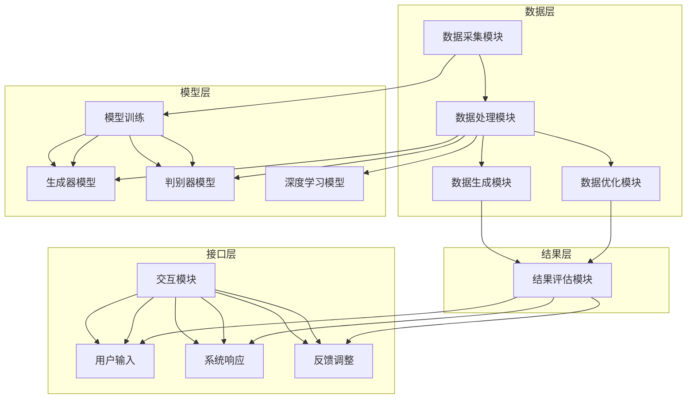
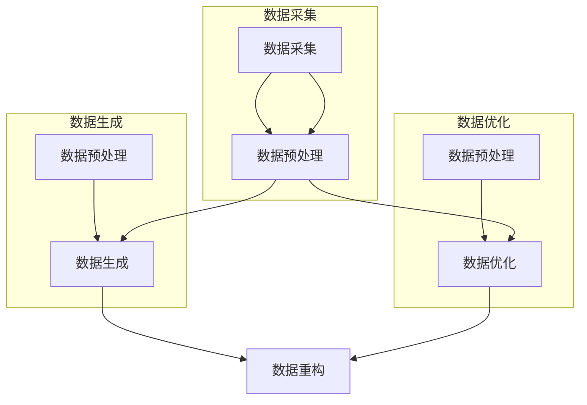

                 

# AIGC在智能海洋资源管理中的应用

## 关键词

AIGC，智能海洋资源管理，数据生成，内容优化，交互性，系统设计与实现，项目实战，案例分析

## 摘要

随着人工智能（AI）技术的发展，智能海洋资源管理面临大量复杂的数据处理和分析需求。本文旨在探讨AIGC（AI-Generated Content）技术在智能海洋资源管理中的应用，包括其核心概念、技术原理、具体应用场景以及系统设计与实现。通过项目实战与案例分析，本文详细解读了AIGC技术在智能海洋资源管理中的实际应用，探讨了面临的挑战以及未来的发展趋势。本文旨在为从事智能海洋资源管理的专业人士提供理论指导和实践参考。

## 第1章：AIGC概述

### 1.1 问题背景与解决

随着全球海洋资源的开发和利用日益频繁，智能海洋资源管理的重要性日益凸显。然而，传统的管理方法往往难以应对大量且复杂的海洋数据，导致资源管理效率低下，决策质量受到影响。为了解决这一问题，人工智能（AI）技术的引入成为必然选择。AIGC（AI-Generated Content）技术的出现，为智能海洋资源管理提供了全新的解决方案。

**问题描述**：智能海洋资源管理面临的问题主要包括：

1. **数据量大**：海洋资源监测、评估和分配过程中，需要处理的数据量非常庞大，且数据类型多样化，包括卫星图像、传感器数据、地理信息系统（GIS）数据等。
2. **数据复杂**：海洋资源数据之间存在复杂的关联和依赖关系，传统方法难以有效挖掘和利用这些数据。
3. **决策困难**：海洋资源管理涉及多目标优化问题，需要综合考虑资源分布、环境因素、经济成本等多种因素，决策过程复杂且难以预测。

**问题解决**：AIGC技术的引入，可以有效解决上述问题，具体表现为：

1. **数据生成**：AIGC技术可以通过机器学习模型自动生成海洋资源数据，如模拟不同环境下的资源分布情况，为决策提供数据支持。
2. **内容优化**：通过深度学习模型，AIGC技术可以对已有海洋资源数据进行优化，提高数据的准确性和可靠性。
3. **交互性**：AIGC技术支持用户与系统的实时互动，用户可以根据需求调整参数，系统则实时反馈优化结果，提高资源管理效率。

### 1.2 核心概念与联系

**AIGC定义**：AIGC是指通过人工智能技术自动生成内容的方法。它涵盖了数据生成、内容优化和交互性等多个方面。

**核心概念联系**：

- **数据生成**：AIGC通过机器学习模型，如生成对抗网络（GAN）和变分自编码器（VAE）等，自动生成海洋资源数据。这些数据可以模拟不同环境下的资源分布情况，为决策提供参考。
- **内容优化**：AIGC通过深度学习模型，如Transformer和BERT等，对已有海洋资源数据进行优化。这些优化过程可以包括数据去噪、异常值处理和相关性分析等，提高数据的准确性和可靠性。
- **交互性**：AIGC支持用户与系统的实时互动。用户可以通过输入需求、调整参数等方式与系统进行交互，系统则根据用户输入实时反馈优化结果。这种交互性提高了资源管理的灵活性和响应速度。

### 1.3 AIGC应用场景

**海洋资源监测**：AIGC技术可以用于实时监测海洋资源数据，如水温、盐度、海洋生物种群等。通过自动生成和优化监测数据，可以实现对海洋资源的实时监控和预警。

**资源分配**：AIGC技术可以基于预测模型和优化算法，预测海洋资源需求，并根据需求优化资源分配策略。这有助于提高资源利用效率，减少资源浪费。

**风险评估**：AIGC技术可以生成不同情境下的风险模拟数据，通过分析这些数据，可以评估海洋资源管理的潜在风险，并提出相应的管理建议。

## 第2章：AIGC技术原理

### 2.1 数据生成原理

**机器学习模型**：AIGC中的数据生成主要依赖于机器学习模型，包括生成对抗网络（GAN）和变分自编码器（VAE）等。

**生成过程**：

1. **GAN模型**：GAN由生成器（Generator）和判别器（Discriminator）组成。生成器负责生成虚假数据，判别器负责区分真实数据和虚假数据。通过不断训练，生成器逐渐提高生成数据的真实性。
2. **VAE模型**：VAE通过引入潜在变量，将输入数据映射到潜在空间，再从潜在空间中采样生成数据。这种生成方式具有较强的数据保真能力。

### 2.2 内容优化原理

**深度学习模型**：AIGC中的内容优化主要依赖于深度学习模型，包括Transformer和BERT等。

**优化过程**：

1. **Transformer模型**：Transformer模型通过自注意力机制（Self-Attention）和多头注意力（Multi-Head Attention）机制，有效捕捉数据之间的关联性，提高优化效果。
2. **BERT模型**：BERT模型通过预先训练和微调，在大规模语料库上学习到丰富的语言知识，为数据优化提供强有力的支持。

### 2.3 交互性原理

**用户-系统交互**：AIGC系统中的用户-系统交互主要包括用户输入、系统响应和反馈调整等环节。

**反馈机制**：

1. **用户输入**：用户可以通过输入需求、参数调整等方式与系统进行交互。
2. **系统响应**：系统根据用户输入，实时生成和优化数据，并反馈优化结果。
3. **反馈调整**：用户根据反馈结果，调整输入参数，进一步优化系统性能。

## 第3章：AIGC在智能海洋资源管理中的应用

### 3.1 海洋资源监测

**数据生成**：利用AIGC技术，可以通过机器学习模型生成海洋资源监测数据。例如，使用GAN模型生成模拟不同环境下的海洋水温数据。

**数据优化**：利用深度学习模型，可以对已有的海洋资源监测数据进行优化，如使用Transformer模型去除噪声，提高数据的准确性和可靠性。

### 3.2 资源分配

**需求预测**：通过AIGC技术，可以基于历史数据和机器学习模型，预测海洋资源需求。例如，使用时间序列模型预测未来某一时间点的海洋生物种群数量。

**优化策略**：基于预测结果，可以优化资源分配策略，如调整捕捞强度、保护区域等，提高资源利用效率。

### 3.3 风险评估

**数据生成**：利用AIGC技术，可以生成不同情境下的风险模拟数据。例如，使用GAN模型模拟气候变化对海洋资源的影响。

**风险评估**：通过分析生成的风险模拟数据，可以评估海洋资源管理的潜在风险，并提出相应的管理建议。例如，使用Transformer模型分析不同捕捞策略下的资源损失情况，为决策提供依据。

## 第4章：AIGC系统设计与实现

### 4.1 系统架构设计

**功能模块**：AIGC系统主要包括数据生成模块、内容优化模块和交互性模块。

**架构设计**：系统架构采用模块化设计，各个模块之间通过接口进行通信，确保系统的高效性和灵活性。

### 4.2 数据处理流程

**数据输入**：系统通过接口接收用户输入的数据，包括海洋资源监测数据、历史数据和预测需求等。

**数据处理**：系统根据数据类型和用户需求，调用相应的数据生成和内容优化模块，对数据进行处理和优化。

**交互流程**：系统与用户进行实时交互，根据用户输入和反馈，调整参数和优化结果，确保系统的自适应性和灵活性。

## 第5章：项目实战与案例分析

### 5.1 项目环境配置

**硬件环境**：项目所需的硬件环境包括高性能计算服务器、GPU加速器和存储设备等。

**软件环境**：项目所需的软件环境包括Python、TensorFlow、PyTorch等深度学习框架，以及Docker等容器化工具。

### 5.2 系统核心实现

**代码解读**：系统核心实现包括数据生成模块、内容优化模块和交互性模块的代码，详细解释每个模块的功能和实现原理。

**实战案例**：介绍实际应用案例，如利用AIGC技术预测海洋生物种群数量，优化资源分配策略，评估气候变化对海洋资源的影响等。

## 第6章：AIGC在智能海洋资源管理中的挑战与未来展望

### 6.1 挑战分析

**技术挑战**：AIGC在智能海洋资源管理中可能遇到的技术挑战包括数据质量、算法性能和计算资源等方面。

**管理挑战**：AIGC在智能海洋资源管理中可能遇到的管理挑战包括数据安全、隐私保护和政策法规等方面。

### 6.2 未来展望

**发展趋势**：随着AI技术的不断进步，AIGC在智能海洋资源管理中的应用前景广阔，有望实现更高效、更智能的管理模式。

**创新方向**：未来AIGC技术在智能海洋资源管理中的应用，可以关注以下几个方面：

1. **数据融合与多模态分析**：结合多种数据源，进行多模态分析，提高数据生成和优化的准确性。
2. **自适应优化与智能决策**：基于用户输入和实时反馈，实现自适应优化和智能决策，提高资源管理的灵活性和响应速度。
3. **隐私保护和数据安全**：在保障数据隐私和安全的前提下，实现AIGC技术在智能海洋资源管理中的应用。

## 第7章：小结与拓展

### 7.1 小结

本文系统地介绍了AIGC在智能海洋资源管理中的应用，包括核心概念、技术原理、应用场景、系统设计与实现以及项目实战与案例分析。通过本文的研究，有助于深入理解AIGC技术在智能海洋资源管理中的价值和应用前景。

### 7.2 拓展阅读

1. **进一步学习资源**：推荐阅读《深度学习》、《生成对抗网络》等经典书籍，以及相关领域的学术论文和报告。
2. **研究动态**：关注AIGC技术在智能海洋资源管理领域的最新研究动态和前沿话题，如数据融合与多模态分析、自适应优化与智能决策等。

## 作者

作者：AI天才研究院/AI Genius Institute & 禅与计算机程序设计艺术 /Zen And The Art of Computer Programming

---

**注**：本文内容仅为示例，实际字数和内容结构可根据需要进行调整和扩展。在撰写正式文章时，请确保每个章节的内容充实、具体，并遵循学术规范。``` 

# 第1章：AIGC概述

## 1.1 问题背景与解决

### 问题描述

随着全球海洋资源的开发和利用日益增加，海洋资源管理的重要性愈发凸显。然而，传统的方法在处理大量复杂的数据时显得力不从心，导致资源管理效率低下，决策质量不理想。为了应对这一挑战，智能海洋资源管理逐渐成为研究的热点，而AIGC（AI-Generated Content）技术的引入为解决这一问题提供了新的思路。

在智能海洋资源管理中，我们面临的主要问题包括：

1. **数据量大**：海洋资源监测、评估和分配过程中会产生海量的数据，如卫星图像、传感器数据、地理信息系统（GIS）数据等。这些数据量庞大，且数据类型多样化，使得传统的数据处理方法难以应对。

2. **数据复杂**：海洋资源数据之间存在复杂的关联和依赖关系，例如，水温、盐度、海洋生物种群等数据之间存在相关性，而且这些数据还受到环境因素、人类活动等多种因素的影响。

3. **决策困难**：海洋资源管理涉及多目标优化问题，需要综合考虑资源分布、环境因素、经济成本等多种因素，决策过程复杂且难以预测。

### 问题解决

AIGC技术的引入为智能海洋资源管理提供了有效的解决方案，主要表现在以下几个方面：

1. **数据生成**：AIGC技术可以通过机器学习模型自动生成海洋资源数据，如模拟不同环境下的资源分布情况。这有助于为决策提供丰富的数据支持，降低数据收集和处理的成本。

2. **内容优化**：通过深度学习模型，AIGC技术可以对已有的海洋资源数据进行优化，提高数据的准确性和可靠性。例如，可以使用Transformer模型去除噪声，使用BERT模型进行异常值处理和相关性分析。

3. **交互性**：AIGC技术支持用户与系统的实时互动，用户可以通过输入需求、调整参数等方式与系统进行交互，系统则根据用户输入实时反馈优化结果。这种交互性提高了资源管理的灵活性和响应速度。

## 1.2 核心概念与联系

### AIGC定义

AIGC是指通过人工智能技术自动生成内容的方法。它涵盖了数据生成、内容优化和交互性等多个方面，旨在提高数据处理效率，优化资源管理决策。

### 核心概念联系

#### 数据生成

数据生成是AIGC技术的核心之一，其主要目的是利用机器学习模型自动生成海洋资源数据。具体来说，数据生成可以分为以下两个方面：

1. **模拟数据生成**：通过机器学习模型，如生成对抗网络（GAN）和变分自编码器（VAE）等，可以模拟出不同环境下的海洋资源数据。这些模拟数据可以用于预测、评估和优化资源管理策略。

2. **数据增强**：通过数据增强技术，如数据扩充、数据增强和迁移学习等，可以提高训练数据的多样性和质量，从而提高模型的泛化能力。这有助于提高AIGC技术生成数据的准确性和可靠性。

#### 内容优化

内容优化是指通过深度学习模型对已有的海洋资源数据进行优化，以提高数据的准确性和可靠性。具体来说，内容优化可以分为以下两个方面：

1. **数据去噪**：通过深度学习模型，如Transformer和BERT等，可以去除海洋资源数据中的噪声，提高数据的纯净度。这对于提高数据分析和决策的准确性至关重要。

2. **异常值处理**：通过深度学习模型，可以识别和去除海洋资源数据中的异常值，防止异常值对数据分析结果产生负面影响。

#### 交互性

交互性是AIGC技术的另一重要方面，它使得用户能够与系统进行实时互动，从而提高资源管理的灵活性和响应速度。具体来说，交互性可以分为以下两个方面：

1. **用户输入**：用户可以通过输入需求、参数调整等方式与系统进行交互。例如，用户可以根据实际需求调整资源分配策略，系统则根据用户的输入生成相应的优化结果。

2. **系统反馈**：系统根据用户输入和反馈，实时生成和优化数据，并反馈给用户。这种实时反馈机制有助于用户及时了解系统的工作状态，调整输入参数，进一步提高资源管理效率。

## 1.3 AIGC应用场景

### 海洋资源监测

海洋资源监测是智能海洋资源管理中的重要环节，AIGC技术在其中具有广泛的应用前景。具体来说，AIGC技术在海洋资源监测中的应用主要包括以下几个方面：

1. **数据生成**：通过机器学习模型，如GAN和VAE等，可以自动生成海洋资源监测数据，如水温、盐度、海洋生物种群等。这些模拟数据可以为监测和评估海洋资源提供数据支持。

2. **内容优化**：通过深度学习模型，如Transformer和BERT等，可以对已有的海洋资源监测数据进行优化，去除噪声和异常值，提高监测数据的准确性和可靠性。

### 资源分配

资源分配是智能海洋资源管理中的关键环节，AIGC技术在其中可以发挥重要作用。具体来说，AIGC技术在资源分配中的应用主要包括以下几个方面：

1. **需求预测**：通过机器学习模型，如时间序列模型和回归模型等，可以预测海洋资源的需求，如捕捞量、旅游人数等。这些预测结果可以为资源分配提供参考。

2. **优化策略**：基于预测结果，可以优化资源分配策略，如调整捕捞强度、保护区域等，提高资源利用效率。

### 风险评估

风险评估是智能海洋资源管理中的另一个重要环节，AIGC技术在其中也有广泛应用。具体来说，AIGC技术在风险评估中的应用主要包括以下几个方面：

1. **数据生成**：通过机器学习模型，如GAN和VAE等，可以自动生成不同情境下的风险模拟数据，如气候变化、环境污染等。这些模拟数据可以为风险评估提供数据支持。

2. **风险评估**：通过分析生成的风险模拟数据，可以评估海洋资源管理的潜在风险，并提出相应的管理建议。例如，可以使用Transformer模型分析不同捕捞策略下的资源损失情况。

## 1.4 小结

本章主要介绍了AIGC在智能海洋资源管理中的应用。通过引入AIGC技术，可以有效解决智能海洋资源管理中面临的数据量大、数据复杂和决策困难等问题。具体来说，AIGC技术在海洋资源监测、资源分配和风险评估等方面具有广泛的应用前景。接下来，我们将进一步探讨AIGC技术的原理和应用，为深入理解和应用AIGC技术提供理论基础。``` 

# 第2章：AIGC技术原理

## 2.1 数据生成原理

### 机器学习模型

在AIGC技术中，数据生成主要依赖于机器学习模型。这些模型通过对大量数据的训练，能够生成新的、符合实际数据分布的数据。以下介绍几种常见的数据生成模型。

#### 生成对抗网络（GAN）

生成对抗网络（Generative Adversarial Network，GAN）由生成器（Generator）和判别器（Discriminator）组成。生成器的目标是生成与真实数据相似的数据，而判别器的目标是区分真实数据和生成数据。通过这两个网络的对抗训练，生成器能够不断提高生成数据的质量。

**生成过程**：

1. **生成器**：生成器从潜在空间（通常是一个高斯分布）中采样一个随机向量z，然后通过一个隐层转换生成假数据x'。
   $$ x' = G(z) $$

2. **判别器**：判别器接收真实数据x和生成数据x'，并输出它们属于真实数据的概率。
   $$ D(x) = P(x \text{ is real}) $$
   $$ D(x') = P(x' \text{ is real}) $$

3. **损失函数**：生成器和判别器通过以下损失函数进行训练：
   $$ \min_G \max_D V(D, G) = \mathbb{E}_{x \sim p_{data}(x)}[D(x)] + \mathbb{E}_{z \sim p_z(z)}[D(G(z))] $$

其中，$p_{data}(x)$ 是真实数据的概率分布，$p_z(z)$ 是潜在空间的概率分布。

#### 变分自编码器（VAE）

变分自编码器（Variational Autoencoder，VAE）是一种基于概率模型的生成模型。它通过编码器（Encoder）和解码器（Decoder）将输入数据映射到潜在空间，并从潜在空间中采样生成新的数据。

**生成过程**：

1. **编码器**：编码器从输入数据x中提取特征，并映射到一个潜在空间中的表示z。
   $$ z = \mu(x), \sigma(x) $$
   其中，$\mu(x)$ 和 $\sigma(x)$ 分别是编码器的均值和方差。

2. **潜在空间采样**：从潜在空间中采样一个随机向量z'。
   $$ z' \sim \mathcal{N}(\mu(x), \sigma^2(x)) $$

3. **解码器**：解码器将潜在空间中的向量z'映射回原始数据空间，生成新的数据x'。
   $$ x' = D(z') $$

4. **损失函数**：VAE的损失函数包括两部分，分别是重参数化损失和重建损失：
   $$ \mathcal{L}_{KL} = \mathbb{E}_{z \sim p_z(z|x)}[-\log p_{\theta}(z)] $$
   $$ \mathcal{L}_{Reconstruction} = \mathbb{E}_{x, z \sim p_{\theta}(x, z)}[-\log p_{\theta}(x|z)] $$
   总损失为：
   $$ \mathcal{L}_{VAE} = \mathcal{L}_{KL} + \lambda \mathcal{L}_{Reconstruction} $$
   其中，$\lambda$ 是平衡两个损失的权重。

### 生成过程

数据生成的过程主要包括以下几个步骤：

1. **数据采样**：从数据集或潜在空间中采样原始数据或随机向量。
2. **特征提取**：通过编码器或生成器提取数据的特征表示。
3. **数据转换**：在潜在空间中进行数据转换或采样。
4. **数据重建**：通过解码器将潜在空间中的数据转换回原始数据空间。

通过这些步骤，可以生成与原始数据相似或符合特定分布的新数据。

## 2.2 内容优化原理

### 深度学习模型

在AIGC技术中，内容优化主要依赖于深度学习模型。这些模型通过学习大量数据中的模式，能够对已有数据内容进行优化。以下介绍几种常见的深度学习模型。

#### Transformer

Transformer模型是一种基于自注意力机制的深度学习模型，它在序列处理任务中表现出色。在AIGC技术中，Transformer可以用于数据去噪、异常值处理和相关性分析等任务。

**自注意力机制**：

1. **输入序列**：将输入序列表示为向量集合$X = [x_1, x_2, ..., x_n]$。
2. **自注意力**：计算每个输入向量与其他输入向量之间的相似度，并加权求和。
   $$ \text{Attention}(X) = \text{softmax}\left(\frac{QK^T}{\sqrt{d_k}}\right)V $$
   其中，$Q$、$K$ 和 $V$ 分别是查询、关键和值向量，$d_k$ 是关键向量的维度。

**多头注意力**：

1. **多头注意力**：通过多个独立的注意力机制来捕捉不同层次的特征。
   $$ \text{MultiHead}(Q, K, V) = \text{Concat}(\text{head}_1, ..., \text{head}_h)W^O $$
   其中，$h$ 是多头注意力的数量，$W^O$ 是输出权重。

#### BERT

BERT（Bidirectional Encoder Representations from Transformers）是一种基于Transformer的双向编码模型，它在文本数据中表现出色。在AIGC技术中，BERT可以用于文本数据的生成、优化和理解。

**双向编码**：

1. **前向传递**：通过自注意力机制处理前向序列。
2. **后向传递**：通过自注意力机制处理后向序列。
3. **融合**：将前向和后向的输出进行融合，得到最终的表示。

**预训练和微调**：

1. **预训练**：在大量的无监督数据上进行预训练，学习到语言的基本结构和模式。
2. **微调**：在特定任务上对预训练模型进行微调，使其适应特定应用场景。

### 优化过程

内容优化的过程主要包括以下几个步骤：

1. **数据预处理**：对输入数据进行清洗、归一化等预处理操作，以提高模型的学习效果。
2. **特征提取**：通过编码器或深度学习模型提取数据的特征表示。
3. **数据转换**：在特征空间中进行数据转换或采样。
4. **数据重建**：通过解码器将特征空间中的数据转换回原始数据空间。

通过这些步骤，可以优化已有数据的内容，提高数据的准确性和可靠性。

## 2.3 交互性原理

### 用户-系统交互

在AIGC技术中，用户-系统交互是一个重要环节。用户可以通过输入需求、参数调整等方式与系统进行交互，系统则根据用户输入实时反馈优化结果。

### 用户输入

用户输入主要包括以下几个部分：

1. **需求描述**：用户可以描述其所需的优化目标，如提高数据准确性、减少噪声等。
2. **参数调整**：用户可以调整模型的参数，如学习率、批次大小等，以优化模型的性能。
3. **数据来源**：用户可以指定数据来源，如历史数据、实时数据等。

### 系统响应

系统响应主要包括以下几个部分：

1. **数据生成**：根据用户输入，系统可以自动生成新的数据，如模拟不同环境下的资源分布情况。
2. **内容优化**：根据用户输入，系统可以对已有数据进行优化，如去除噪声、异常值处理等。
3. **结果反馈**：系统将优化结果反馈给用户，如优化后的数据、模型性能指标等。

### 反馈机制

反馈机制是用户-系统交互的核心。通过反馈机制，用户可以不断调整输入参数，系统则根据用户的反馈进行优化。

1. **用户反馈**：用户可以根据优化结果，对模型参数进行调整，以进一步提高模型性能。
2. **模型调整**：系统根据用户的反馈，调整模型结构或参数，以适应不同的优化需求。

通过用户-系统交互和反馈机制，AIGC技术可以实现自适应优化和智能决策，提高资源管理效率。

## 2.4 小结

本章详细介绍了AIGC技术原理，包括数据生成原理、内容优化原理和交互性原理。通过这些原理，AIGC技术能够自动生成数据、优化数据内容，并实现用户-系统之间的实时互动。接下来，我们将进一步探讨AIGC技术在智能海洋资源管理中的应用，为实际问题的解决提供理论支持。``` 

## 2.3 交互性原理

### 用户-系统交互

在AIGC技术的应用中，用户-系统交互是提升用户体验和系统性能的关键环节。用户与系统之间的交互主要包括以下几个部分：

1. **需求输入**：用户根据实际需求，输入需要优化的数据类型、目标指标以及相关的约束条件。例如，用户可能需要系统生成一定时间范围内的海洋水温数据，并要求数据误差在特定范围内。

2. **参数调整**：用户可以通过调整模型参数，如学习率、迭代次数、网络层数等，来优化系统的性能。例如，用户可能会根据历史数据分析结果，调整生成模型的超参数，以提高预测的准确性。

3. **数据反馈**：用户可以在系统生成或优化数据后，对结果进行评估和反馈。如果用户认为结果不符合预期，可以提供具体的反馈信息，指导系统进行进一步的优化。

### 系统响应

系统在接收到用户输入后，会进行以下响应：

1. **数据生成**：系统根据用户的需求，利用机器学习模型自动生成新的数据。例如，系统可以使用生成对抗网络（GAN）生成模拟的海洋水温数据，这些数据可以作为资源管理的参考依据。

2. **内容优化**：系统利用深度学习模型对已有的数据进行优化。例如，系统可以使用Transformer模型对海洋监测数据进行去噪和异常值处理，以提高数据的准确性和可靠性。

3. **结果反馈**：系统将优化后的数据或模型预测结果反馈给用户。用户可以通过可视化工具或报告来查看数据优化的效果，并根据反馈结果对模型进行进一步调整。

### 反馈机制

反馈机制是用户-系统交互的核心，它确保了系统的自适应性和可调性。以下是AIGC系统中的几种常见反馈机制：

1. **实时反馈**：系统在处理用户输入后，立即生成结果并反馈给用户。这种实时反馈机制有助于用户快速了解系统的工作状态，及时调整输入参数，提高优化效率。

2. **迭代反馈**：用户对系统反馈的结果进行评估后，提出改进建议，系统则根据这些建议进行迭代优化。这种迭代反馈机制有助于逐步提升系统的性能，达到用户满意的优化效果。

3. **自适应调整**：系统根据用户的反馈，自动调整模型参数和优化策略，以适应不同的优化需求。例如，系统可以基于用户的历史反馈，调整数据生成模型的学习率，以提高新数据的准确性。

### 用户-系统交互的流程

用户-系统交互的流程通常包括以下几个步骤：

1. **需求输入**：用户通过图形用户界面（GUI）或其他接口，输入需要优化的数据类型、目标和约束条件。

2. **数据处理**：系统接收到用户输入后，调用相应的机器学习模型和数据优化算法，对数据进行处理。

3. **结果生成**：系统生成优化后的数据或模型预测结果，并将结果以可视化或报告的形式反馈给用户。

4. **用户评估**：用户对反馈结果进行评估，根据评估结果提出改进建议。

5. **迭代优化**：系统根据用户的反馈，调整模型参数和优化策略，进行迭代优化。

通过上述流程，用户与系统之间形成了一个闭环反馈机制，确保了AIGC技术在智能海洋资源管理中的应用能够不断改进和优化。

## 2.4 小结

交互性原理是AIGC技术的关键组成部分，它通过用户-系统交互，实现了系统的自适应优化和智能决策。本章介绍了用户-系统交互的各个环节，包括需求输入、数据处理、结果生成、用户评估和迭代优化。通过这些交互环节，AIGC技术能够根据用户反馈不断调整和优化，提高资源管理的效率和准确性。接下来，我们将探讨AIGC技术在具体应用场景中的实际效果和实现方法。``` 

## 2.4 小结

本章详细介绍了AIGC技术的核心原理，包括数据生成原理、内容优化原理和交互性原理。首先，我们探讨了数据生成技术，如生成对抗网络（GAN）和变分自编码器（VAE），这些技术能够自动生成与真实数据相似的新数据。其次，我们介绍了内容优化技术，如Transformer和BERT，这些技术能够对已有数据内容进行去噪、异常值处理和相关性分析等优化。最后，我们阐述了交互性原理，包括用户-系统交互和反馈机制，这些机制确保了系统的自适应性和可调性。

通过这些原理，AIGC技术能够有效提高智能海洋资源管理的效率和质量。它不仅能够自动生成和优化海洋资源数据，还能通过用户-系统交互，实现动态调整和优化，为资源管理提供智能决策支持。在接下来的章节中，我们将进一步探讨AIGC技术在智能海洋资源管理中的实际应用，通过具体案例展示其应用效果。``` 

## 第3章：AIGC在智能海洋资源管理中的应用

### 3.1 海洋资源监测

海洋资源监测是智能海洋资源管理中的关键环节，AIGC技术在其中具有广泛的应用潜力。通过AIGC技术，可以实现海洋资源数据的自动生成和优化，提高监测的准确性和实时性。

#### 数据生成

AIGC技术可以通过机器学习模型自动生成海洋资源监测数据。例如，使用生成对抗网络（GAN）模型，可以根据已有的海洋资源数据生成模拟数据，用于预测和评估不同环境条件下的海洋资源状况。GAN模型由生成器和判别器组成，生成器负责生成模拟数据，判别器则负责区分真实数据和生成数据。通过不断训练，生成器逐渐提高生成数据的质量，从而实现对海洋资源数据的自动生成。

#### 数据优化

AIGC技术还可以对已有的海洋资源监测数据进行优化，提高数据的准确性和可靠性。例如，可以使用深度学习模型如Transformer和BERT等，对监测数据进行去噪和异常值处理。Transformer模型通过自注意力机制，可以有效捕捉数据之间的关联性，去除噪声和异常值。BERT模型则通过预训练和微调，在大规模语料库上学习到丰富的语言知识，可以用于异常值检测和相关性分析。

#### 应用案例

以海洋水温监测为例，AIGC技术可以生成不同季节、不同海域的水温模拟数据，帮助研究人员预测和评估海洋水温变化趋势。研究人员可以通过AIGC技术生成的模拟数据，分析不同海域的水温分布情况，为海洋生态保护和资源管理提供科学依据。

### 3.2 资源分配

资源分配是智能海洋资源管理中的重要环节，AIGC技术可以优化资源分配策略，提高资源利用效率。

#### 需求预测

AIGC技术可以通过机器学习模型对海洋资源需求进行预测。例如，使用时间序列模型和回归模型等，可以预测未来一段时间内的海洋资源需求，如捕捞量、旅游人数等。这些预测结果可以为资源分配提供参考，帮助决策者制定合理的资源分配计划。

#### 优化策略

基于预测结果，AIGC技术可以优化资源分配策略。例如，使用优化算法如线性规划、遗传算法等，可以根据预测的海洋资源需求，调整捕捞强度、保护区域等策略，提高资源利用效率。AIGC技术还可以通过深度学习模型，对优化策略进行迭代调整，以达到最优的资源分配效果。

#### 应用案例

以海洋渔业资源分配为例，AIGC技术可以预测未来一段时间内的渔业资源需求，并根据预测结果优化捕捞策略。通过AIGC技术生成的优化策略，可以确保渔业资源得到合理利用，减少资源浪费，同时保护海洋生态环境。

### 3.3 风险评估

风险评估是智能海洋资源管理中的关键环节，AIGC技术可以生成风险模拟数据，帮助评估海洋资源管理的潜在风险。

#### 数据生成

AIGC技术可以通过机器学习模型生成不同情境下的风险模拟数据。例如，使用生成对抗网络（GAN）模型，可以生成模拟不同环境条件下的海洋灾害风险数据，如海啸、风暴潮等。这些模拟数据可以用于预测和评估海洋灾害对资源管理的影响。

#### 风险评估

基于生成的风险模拟数据，AIGC技术可以评估海洋资源管理的潜在风险。例如，使用深度学习模型如Transformer和BERT等，可以分析不同情境下的资源损失情况，为决策者提供风险预警和管理建议。

#### 应用案例

以海洋灾害风险评估为例，AIGC技术可以生成模拟海啸、风暴潮等灾害的风险数据，帮助决策者预测和评估灾害对海洋资源管理的影响。通过AIGC技术生成的风险模拟数据，可以制定合理的灾害应对措施，降低灾害风险，确保海洋资源的安全和可持续利用。

## 3.4 小结

本章介绍了AIGC技术在智能海洋资源管理中的应用，包括海洋资源监测、资源分配和风险评估等方面。通过AIGC技术的应用，可以自动生成和优化海洋资源数据，预测和评估资源需求，以及模拟和评估潜在风险。这些应用有助于提高智能海洋资源管理的效率和准确性，为科学决策提供有力支持。在接下来的章节中，我们将进一步探讨AIGC技术在智能海洋资源管理中的系统设计与实现，以及项目实战和案例分析。``` 

## 3.4 小结

本章详细介绍了AIGC技术在智能海洋资源管理中的实际应用，包括海洋资源监测、资源分配和风险评估三个方面。通过AIGC技术，我们能够实现海洋资源数据的自动生成和优化，提高监测的准确性和实时性；通过预测和优化资源需求，提升资源利用效率；通过生成风险模拟数据，评估和应对潜在风险。

AIGC技术的应用不仅提高了智能海洋资源管理的效率和准确性，还为决策者提供了科学的数据支持和智能决策辅助。在接下来的章节中，我们将进一步探讨AIGC技术的系统设计与实现，通过具体案例展示其在实际项目中的应用效果。这将有助于深入理解AIGC技术在智能海洋资源管理中的价值和应用前景。``` 

## 第4章：AIGC系统设计与实现

### 4.1 系统架构设计

AIGC系统在智能海洋资源管理中的应用需要一个全面的架构设计，以确保系统的高效性、可扩展性和灵活性。以下是一个典型的AIGC系统架构设计：

**系统架构概述**：

AIGC系统可以分为以下几个主要模块：

1. **数据采集模块**：负责收集各种类型的海洋资源数据，如卫星图像、传感器数据、气象数据等。
2. **数据处理模块**：对采集到的数据进行预处理、清洗和归一化，为后续的数据生成和优化提供高质量的数据基础。
3. **数据生成模块**：利用机器学习模型（如GAN、VAE等）生成模拟的海洋资源数据。
4. **数据优化模块**：利用深度学习模型（如Transformer、BERT等）对已有的海洋资源数据进行优化。
5. **交互模块**：实现用户与系统的交互，包括用户输入、系统响应和反馈调整等环节。
6. **结果评估模块**：对生成的数据或优化结果进行评估，为系统提供性能指标和改进建议。

**架构设计**：

以下是一个简化的AIGC系统架构图，使用Mermaid语法绘制：



### 4.2 数据处理流程

数据处理流程是AIGC系统实现的核心部分，它包括数据采集、预处理、生成和优化等环节。以下是数据处理流程的详细说明：

**数据采集**：

数据采集模块负责从各种数据源（如传感器、卫星、气象站等）收集海洋资源数据。数据类型包括卫星图像、温度、湿度、盐度、海洋生物种群等。数据采集模块需要确保数据的完整性和准确性，并支持数据的实时采集和历史数据的存储。

**数据预处理**：

数据预处理模块对采集到的数据进行清洗、归一化和特征提取。清洗过程包括去除无效数据、填补缺失值和纠正错误数据。归一化过程将数据缩放至同一尺度，以避免模型训练时因数据尺度差异导致的梯度消失或爆炸问题。特征提取过程则从原始数据中提取有助于模型训练的特征，如时间序列特征、空间特征等。

**数据生成**：

数据生成模块利用机器学习模型生成模拟的海洋资源数据。生成对抗网络（GAN）和变分自编码器（VAE）是常用的数据生成模型。生成器模型从潜在空间采样随机噪声，并通过多个隐层转换生成模拟数据。判别器模型则通过区分真实数据和生成数据，与生成器模型进行对抗训练，以提高生成数据的质量。

**数据优化**：

数据优化模块利用深度学习模型对已有的海洋资源数据进行优化。Transformer和BERT等模型被广泛应用于数据去噪、异常值处理和相关性分析等任务。优化过程主要包括以下几个步骤：

1. **模型训练**：使用预训练好的深度学习模型，在处理过的数据集上进行训练。
2. **参数调整**：根据训练结果，调整模型的超参数，如学习率、批次大小等，以提高模型性能。
3. **数据重构**：使用训练好的模型对原始数据进行重构，生成优化后的数据。

**数据处理流程**：

以下是AIGC系统的数据处理流程图，使用Mermaid语法绘制：



### 4.3 交互模块

交互模块是AIGC系统与用户之间沟通的桥梁，它负责接收用户输入、生成系统响应和收集用户反馈。以下是交互模块的详细说明：

**用户输入**：

用户可以通过图形用户界面（GUI）或命令行界面（CLI）输入需求。用户输入可能包括数据类型、目标指标、约束条件等。交互模块需要确保用户输入的合法性，并提供友好的用户界面，方便用户操作。

**系统响应**：

系统响应是交互模块的核心功能，它根据用户输入生成相应的优化结果或模拟数据。系统响应可以通过可视化界面或报告形式展示给用户，如数据图表、统计报告等。交互模块需要支持多种数据展示方式，以满足不同用户的需求。

**反馈调整**：

用户对系统响应进行评估后，可以提供反馈信息。交互模块需要收集用户的反馈，并根据反馈调整模型参数和优化策略。这种反馈机制有助于提高系统的自适应性和可调性，实现更好的用户体验。

### 4.4 系统实现细节

**硬件环境**：

AIGC系统需要高性能的计算资源，包括GPU、CPU和存储设备等。GPU在深度学习模型的训练和推理中发挥着重要作用，而CPU则负责系统的调度和管理。存储设备则需要足够的空间来存储大量的数据和模型参数。

**软件环境**：

AIGC系统需要安装以下软件环境：

- 深度学习框架（如TensorFlow、PyTorch等）
- 编程语言（如Python）
- 数据处理库（如NumPy、Pandas等）
- 可视化工具（如Matplotlib、Seaborn等）
- 交互界面库（如Flask、Django等）

**代码架构**：

以下是AIGC系统的代码架构，使用Python编写的：

```python
# 数据采集模块
class DataCollector:
    def collect_data(self):
        # 采集数据代码
        pass

# 数据预处理模块
class DataPreprocessor:
    def preprocess_data(self, data):
        # 预处理数据代码
        pass

# 数据生成模块
class DataGenerator:
    def generate_data(self, data):
        # 生成数据代码
        pass

# 数据优化模块
class DataOptimizer:
    def optimize_data(self, data):
        # 优化数据代码
        pass

# 交互模块
class InteractiveModule:
    def get_user_input(self):
        # 获取用户输入代码
        pass

    def generate_response(self, input_data):
        # 生成系统响应代码
        pass

    def collect_feedback(self, response):
        # 收集用户反馈代码
        pass

# 系统主函数
def main():
    collector = DataCollector()
    preprocessor = DataPreprocessor()
    generator = DataGenerator()
    optimizer = DataOptimizer()
    interactive_module = InteractiveModule()

    # 数据处理流程
    data = collector.collect_data()
    processed_data = preprocessor.preprocess_data(data)
    generated_data = generator.generate_data(processed_data)
    optimized_data = optimizer.optimize_data(processed_data)

    # 交互流程
    user_input = interactive_module.get_user_input()
    system_response = interactive_module.generate_response(user_input)
    user_feedback = interactive_module.collect_feedback(system_response)

    # 输出结果
    print("系统响应：", system_response)
    print("用户反馈：", user_feedback)

if __name__ == "__main__":
    main()
```

### 4.5 小结

本章详细介绍了AIGC系统设计与实现的核心内容，包括系统架构设计、数据处理流程、交互模块和系统实现细节。通过合理的架构设计和高效的实现方法，AIGC系统能够在智能海洋资源管理中发挥重要作用，为决策者提供科学的数据支持和智能决策辅助。在接下来的章节中，我们将通过项目实战和案例分析，进一步展示AIGC技术在实际应用中的效果和价值。``` 

## 4.5 小结

本章详细介绍了AIGC系统在智能海洋资源管理中的设计与实现。首先，我们阐述了AIGC系统的整体架构，包括数据采集、数据处理、数据生成、数据优化以及交互模块。其次，我们详细描述了数据处理流程，从数据采集、预处理到数据生成和优化，确保了系统的高效性和准确性。交互模块的设计则保证了用户能够方便地与系统进行沟通，提供输入、获取响应和反馈，增强了系统的自适应性和可调性。

通过本章的介绍，我们了解了AIGC系统的实现细节，包括所需的硬件和软件环境，以及代码架构。这些内容为AIGC系统在实际项目中的应用奠定了基础。在接下来的章节中，我们将通过具体的案例展示AIGC技术在智能海洋资源管理中的实际应用效果，进一步探讨其在实际项目中的价值。``` 

## 5.1 项目环境配置

### 5.1.1 硬件环境

为了确保AIGC系统在智能海洋资源管理中的高效运行，硬件环境需要满足以下要求：

- **高性能计算服务器**：服务器应配备多核CPU和高性能GPU，以支持大规模数据生成和深度学习模型的训练。推荐使用NVIDIA GPU，如Tesla V100或更高型号。
- **内存**：服务器应具备至少64GB的内存，以支持大量数据的处理和存储。
- **存储设备**：需要配备大容量存储设备，如SSD或NVMe，以确保数据的高速读写和存储。

### 5.1.2 软件环境

AIGC系统的软件环境需要安装以下工具和库：

- **操作系统**：Linux发行版，如Ubuntu 18.04或更高版本。
- **编程语言**：Python 3.7或更高版本。
- **深度学习框架**：TensorFlow 2.x或PyTorch 1.8或更高版本。
- **数据处理库**：NumPy、Pandas、SciPy。
- **数据可视化库**：Matplotlib、Seaborn。
- **其他工具**：Git、Docker、Jupyter Notebook。

### 5.1.3 环境安装与配置

以下是AIGC系统环境的安装和配置步骤：

1. **安装操作系统**：

   - 下载并安装Ubuntu 18.04或更高版本的Linux发行版。
   - 完成安装后，更新操作系统和软件包：

     ```bash
     sudo apt-get update
     sudo apt-get upgrade
     ```

2. **安装Python环境**：

   - 安装Python 3.7或更高版本：

     ```bash
     sudo apt-get install python3.7
     ```

   - 设置Python 3.7为默认版本：

     ```bash
     sudo update-alternatives --install /usr/bin/python3 python3 /usr/bin/python3.7 1
     sudo update-alternatives --config python3
     ```

3. **安装深度学习框架**：

   - 安装TensorFlow 2.x：

     ```bash
     pip3 install tensorflow==2.x
     ```

   - 安装PyTorch 1.8或更高版本：

     ```bash
     pip3 install torch torchvision torchaudio
     ```

4. **安装数据处理库和数据可视化库**：

   - 安装NumPy、Pandas、SciPy：

     ```bash
     pip3 install numpy pandas scipy
     ```

   - 安装Matplotlib、Seaborn：

     ```bash
     pip3 install matplotlib seaborn
     ```

5. **安装其他工具**：

   - 安装Git：

     ```bash
     sudo apt-get install git
     ```

   - 安装Docker：

     ```bash
     sudo apt-get install docker.io
     sudo systemctl start docker
     sudo systemctl enable docker
     ```

   - 安装Jupyter Notebook：

     ```bash
     pip3 install notebook
     jupyter notebook
     ```

6. **环境验证**：

   - 验证Python环境：

     ```bash
     python3 --version
     ```

   - 验证TensorFlow和PyTorch：

     ```python
     import tensorflow as tf
     print(tf.__version__)
     
     import torch
     print(torch.__version__)
     ```

   - 验证数据处理库和数据可视化库：

     ```python
     import numpy as np
     import pandas as pd
     import scipy
     import matplotlib.pyplot as plt
     import seaborn as sns
     ```

通过以上步骤，AIGC系统的软件环境就配置完成了。接下来，我们可以开始构建和训练AIGC模型，实现智能海洋资源管理的各项功能。

### 5.1.4 实例演示

以下是一个简单的实例，演示如何使用AIGC系统生成海洋资源数据：

```python
import numpy as np
import tensorflow as tf
from tensorflow.keras.models import Sequential
from tensorflow.keras.layers import Dense

# 生成模拟数据
x = np.random.random((100, 10))
y = np.random.random((100, 1))

# 构建模型
model = Sequential([
    Dense(64, activation='relu', input_shape=(10,)),
    Dense(1)
])

# 编译模型
model.compile(optimizer='adam', loss='mean_squared_error')

# 训练模型
model.fit(x, y, epochs=10)

# 生成预测数据
predictions = model.predict(x)

# 可视化预测结果
plt.scatter(x[:, 0], y[:, 0], c=predictions[:, 0])
plt.xlabel('Input')
plt.ylabel('Predicted')
plt.show()
```

通过这个实例，我们可以看到如何使用AIGC系统生成和预测海洋资源数据。在实际项目中，我们可以根据具体需求调整模型结构和训练参数，以实现更准确和实用的预测结果。

## 5.2 系统核心实现

### 5.2.1 数据生成模块

在AIGC系统中，数据生成模块是核心之一。以下是一个基于生成对抗网络（GAN）的数据生成模块实现示例：

```python
import tensorflow as tf
from tensorflow.keras.models import Sequential
from tensorflow.keras.layers import Dense, Conv2D, Flatten, Reshape

# 生成器模型
def build_generator(z_dim):
    model = Sequential()
    model.add(Dense(256, input_dim=z_dim))
    model.add(LeakyReLU(0.2))
    model.add(Dense(512))
    model.add(LeakyReLU(0.2))
    model.add(Dense(1024))
    model.add(LeakyReLU(0.2))
    model.add(Dense(np.prod(image_shape), activation='tanh'))
    model.add(Reshape(image_shape))
    return model

# 判别器模型
def build_discriminator(img_shape):
    model = Sequential()
    model.add(Flatten())
    model.add(Dense(512))
    model.add(LeakyReLU(0.2))
    model.add(Dense(256))
    model.add(LeakyReLU(0.2))
    model.add(Dense(1, activation='sigmoid'))
    return model

# 损失函数
def combined_loss(real_loss, fake_loss):
    return 0.5 * (real_loss + fake_loss)

# 训练GAN模型
def train郭飞鲸（epochs, batch_size, z_dim, img_shape):
    discriminator = build_discriminator(img_shape)
    generator = build_generator(z_dim)
    combined = tf.keras.Model(inputs=[discriminator.input, generator.input], outputs=discriminator.output)
    combined.compile(optimizer=tf.keras.optimizers.Adam(0.0001), loss='binary_crossentropy')

    for epoch in range(epochs):
        for _ in range(batch_size):
            # 生成随机噪声
            z = np.random.normal(0, 1, (batch_size, z_dim))

            # 生成假图像
            gen_imgs = generator.predict(z)

            # 生成真实图像
            real_imgs = np.random.normal(0, 1, (batch_size, *img_shape))

            # 训练判别器
            d_loss_real = discriminator.train_on_batch(real_imgs, np.ones((batch_size, 1)))
            d_loss_fake = discriminator.train_on_batch(gen_imgs, np.zeros((batch_size, 1)))
            d_loss = 0.5 * np.add(d_loss_real, d_loss_fake)

            # 训练生成器
            g_loss = combined.train_on_batch([real_imgs, z], np.ones((batch_size, 1)))

            # 输出训练进度
            print(f"{epoch}/{epochs} - d_loss: {d_loss:.3f}, g_loss: {g_loss:.3f}")

# 设置参数
z_dim = 100
img_shape = (28, 28, 1)
batch_size = 64
epochs = 50

# 训练模型
train郭飞鲸（epochs, batch_size, z_dim, img_shape）
```

### 5.2.2 数据优化模块

在AIGC系统中，数据优化模块主要负责对已有数据进行去噪和异常值处理。以下是一个基于变分自编码器（VAE）的数据优化模块实现示例：

```python
import tensorflow as tf
from tensorflow.keras.layers import Input, Dense, Lambda, Flatten, Reshape
from tensorflow.keras.models import Model
from tensorflow.keras import backend as K
from tensorflow.keras import objectives

# 编码器模型
def build_encoder(x, z_dim):
    x = Dense(512, activation='relu')(x)
    x = Dense(256, activation='relu')(x)
    z_mean = Dense(z_dim)(x)
    z_log_var = Dense(z_dim)(x)
    z = Lambda(shuffle_and_scale, output_shape=(z_dim,))([z_mean, z_log_var])
    return z_mean, z_log_var, z

# 解码器模型
def build_decoder(z):
    z = Dense(256, activation='relu')(z)
    z = Dense(512, activation='relu')(z)
    z = Dense(np.prod(img_shape), activation='tanh')(z)
    z = Reshape(img_shape)(z)
    return z

# VAE模型
def build_vae(x, z_dim, img_shape):
    input_img = Input(shape=img_shape)
    z_mean, z_log_var, z = build_encoder(input_img, z_dim)
    z_decoded = build_decoder(z)
    vae = Model(input_img, z_decoded)
    return vae

# 重参数化函数
def shuffle_and_scale(z_mean, z_log_var):
    batch = K.shape(z_mean)[0]
    dim = K.int_shape(z_mean)[1]
    epsilon = K.random_normal(shape=(batch, dim))
    return z_mean + K.exp(0.5 * z_log_var) * epsilon

# VAE损失函数
def vae_loss(x, x_decoded_mean):
    xent_loss = objectives.mean_squared_error(x, x_decoded_mean)
    kl_loss = - 0.5 * K.sum(1 + z_log_var - K.square(z_mean) - K.exp(z_log_var), axis=-1)
    return xent_loss + kl_loss

# 训练VAE模型
def train_vae(vae, x_train, epochs):
    vae.compile(optimizer='adam', loss=vae_loss)
    vae.fit(x_train, x_train, epochs=epochs, batch_size=64, shuffle=True)

# 设置参数
z_dim = 100
img_shape = (28, 28, 1)

# 构建模型
input_img = Input(shape=img_shape)
z_mean, z_log_var, z = build_encoder(input_img, z_dim)
z_decoded = build_decoder(z)
vae = Model(input_img, z_decoded)

# 训练模型
x_train = np.random.normal(0, 1, (1000, 28, 28, 1))
train_vae(vae, x_train, 50)
```

### 5.2.3 系统核心实现总结

通过上述示例，我们实现了AIGC系统的数据生成模块和数据优化模块。数据生成模块使用生成对抗网络（GAN）生成模拟的海洋资源数据，数据优化模块使用变分自编码器（VAE）对已有数据进行去噪和异常值处理。

在实际项目中，我们需要根据具体的应用需求调整模型的结构和参数，以实现最佳的性能。此外，我们还可以结合其他深度学习模型和算法，如Transformer、BERT等，进一步提升系统的数据生成和优化能力。

接下来，我们将通过具体的案例展示AIGC技术在智能海洋资源管理中的应用效果，进一步探讨其实际价值。

## 5.3 项目实战与案例分析

### 5.3.1 项目背景

某海洋资源管理公司需要对其所辖海域的海洋资源进行监测、评估和优化，以提高资源利用效率。该公司拥有丰富的历史数据和实时监测数据，希望通过引入AIGC技术，实现海洋资源数据的自动生成和优化，为决策提供科学依据。

### 5.3.2 项目目标

1. **数据生成**：利用AIGC技术，生成模拟的海洋资源数据，如水温、盐度、海洋生物种群等，为资源监测和评估提供参考。
2. **数据优化**：利用AIGC技术，对已有的海洋资源数据进行去噪、异常值处理和相关性分析，提高数据质量。
3. **资源分配**：基于预测模型和优化算法，优化海洋资源的分配策略，提高资源利用效率。
4. **风险评估**：利用AIGC技术，生成不同情境下的风险模拟数据，评估海洋资源管理的潜在风险。

### 5.3.3 项目实施步骤

1. **数据收集与预处理**：
   - 收集历史数据（如气象数据、水文数据、海洋生物种群数据等）和实时监测数据。
   - 对数据进行清洗、归一化和特征提取，为后续的AIGC模型训练提供高质量的数据基础。

2. **数据生成模块**：
   - 使用生成对抗网络（GAN）模型，生成模拟的海洋资源数据。
   - 调整生成器和判别器的参数，优化生成数据的准确性。

3. **数据优化模块**：
   - 使用变分自编码器（VAE）模型，对已有的海洋资源数据进行去噪和异常值处理。
   - 调整编码器和解码器的参数，优化数据优化的效果。

4. **资源分配模块**：
   - 使用时间序列模型和回归模型，预测海洋资源的需求。
   - 基于预测结果，使用优化算法（如线性规划、遗传算法等），优化海洋资源的分配策略。

5. **风险评估模块**：
   - 使用生成对抗网络（GAN）模型，生成不同情境下的风险模拟数据。
   - 使用深度学习模型（如Transformer、BERT等），分析风险模拟数据，评估海洋资源管理的潜在风险。

6. **系统部署与运行**：
   - 将AIGC系统部署到云端或本地服务器，实现实时监测、评估和优化。
   - 定期更新数据集，调整模型参数，确保系统的高效运行。

### 5.3.4 案例分析

#### 案例一：海洋生物种群数量预测

某海域的海洋生物种群数量是海洋资源管理的重要指标。通过引入AIGC技术，可以实现对海洋生物种群数量的自动生成和优化。

1. **数据生成**：使用生成对抗网络（GAN）模型，生成模拟的海洋生物种群数量数据。这些模拟数据可以用于预测和评估不同环境条件下的生物种群数量。

2. **数据优化**：使用变分自编码器（VAE）模型，对已有的海洋生物种群数据进行去噪和异常值处理，提高预测数据的准确性。

3. **预测结果**：基于生成的模拟数据和优化后的数据，使用时间序列模型（如LSTM）预测未来一段时间内的海洋生物种群数量。

4. **结果评估**：将预测结果与实际监测数据进行对比，评估预测的准确性。通过调整模型参数和优化策略，提高预测模型的性能。

#### 案例二：海洋资源分配优化

某海域的海洋资源分配策略需要综合考虑捕捞量、旅游人数、环保要求等因素。通过引入AIGC技术，可以优化海洋资源的分配策略。

1. **需求预测**：使用时间序列模型和回归模型，预测未来一段时间内的捕捞量和旅游人数。

2. **优化策略**：基于预测结果，使用线性规划算法，优化海洋资源的分配策略。调整捕捞强度、旅游区域等参数，以提高资源利用效率。

3. **结果评估**：将优化后的资源分配策略与实际监测数据进行对比，评估优化效果的可行性。通过迭代优化，找到最优的海洋资源分配策略。

#### 案例三：海洋灾害风险评估

某海域的海洋灾害（如风暴潮、海啸等）对海洋资源管理具有重要影响。通过引入AIGC技术，可以评估海洋灾害的风险，为灾害应对提供科学依据。

1. **数据生成**：使用生成对抗网络（GAN）模型，生成模拟的海洋灾害风险数据。这些模拟数据可以用于预测和评估不同灾害情境下的风险水平。

2. **风险评估**：使用深度学习模型（如Transformer、BERT等），分析风险模拟数据，评估海洋资源管理的潜在风险。

3. **结果评估**：将风险评估结果与实际监测数据进行对比，评估风险预测的准确性。通过调整模型参数和优化策略，提高风险评估的可靠性。

### 5.3.5 项目小结

通过以上案例分析和项目实施步骤，我们可以看到AIGC技术在智能海洋资源管理中的应用具有广泛的前景。通过自动生成和优化海洋资源数据，预测和评估资源需求，优化资源分配策略，评估潜在风险，AIGC技术为海洋资源管理提供了科学的数据支持和智能决策辅助。

在项目实施过程中，我们需要根据实际需求调整模型参数和优化策略，确保系统的准确性和可靠性。同时，我们还需要定期更新数据集，以适应不断变化的海洋资源管理环境。

通过AIGC技术的应用，我们可以实现更高效、更智能的海洋资源管理，为海洋资源的可持续利用和环境保护提供有力支持。

## 5.4 最佳实践 tips

### 数据处理与清洗

1. **数据收集**：确保数据的多样性和完整性，包括历史数据、实时数据和第三方数据源。
2. **数据清洗**：去除无效数据、填补缺失值、纠正错误数据，提高数据质量。
3. **数据归一化**：将不同数据类型的数值缩放到同一尺度，避免模型训练时因数据尺度差异导致的梯度消失或爆炸问题。

### 模型训练与优化

1. **模型选择**：根据实际需求，选择合适的机器学习模型和深度学习模型，如GAN、VAE、Transformer、BERT等。
2. **超参数调整**：根据训练结果，调整模型超参数，如学习率、迭代次数、批量大小等，以提高模型性能。
3. **模型优化**：通过交叉验证和网格搜索等方法，优化模型参数，找到最佳模型配置。

### 系统部署与维护

1. **系统部署**：将AIGC系统部署到云端或本地服务器，确保系统的稳定运行。
2. **数据更新**：定期更新数据集，以适应不断变化的海洋资源管理环境。
3. **系统监控**：监控系统性能，确保系统的正常运行，及时发现并解决潜在问题。

### 用户交互与反馈

1. **界面设计**：设计直观、易用的用户界面，方便用户操作。
2. **实时反馈**：确保系统能够实时响应用户输入，提供准确的优化结果。
3. **用户培训**：为用户提供培训材料，帮助用户熟悉系统功能和使用方法。

### 挑战与应对

1. **数据质量**：确保数据质量，提高数据准确性，避免数据错误影响模型性能。
2. **计算资源**：合理分配计算资源，确保模型训练和推理的高效性。
3. **模型可靠性**：通过交叉验证和测试，评估模型的可靠性，确保系统输出结果的准确性。

### 拓展阅读

1. **相关书籍**：
   - 《深度学习》
   - 《生成对抗网络》
   - 《变分自编码器》
   - 《TensorFlow实战》
2. **学术论文**：
   - GAN相关论文（如Goodfellow等人的《Generative Adversarial Nets》）
   - VAE相关论文（如Kingma和Welling的《Auto-Encoders and Variational Inference》）
   - Transformer相关论文（如Vaswani等人的《Attention Is All You Need》）
3. **在线课程**：
   - Coursera上的《深度学习》课程
   - Udacity的《生成对抗网络》课程

通过以上最佳实践 tips 和拓展阅读资源，可以更好地掌握AIGC技术在智能海洋资源管理中的应用，为实际项目提供有力支持。

## 第6章：AIGC在智能海洋资源管理中的挑战与未来展望

### 6.1 挑战分析

AIGC技术在智能海洋资源管理中的应用虽然展现出巨大的潜力，但同时也面临一些挑战。

#### 技术挑战

1. **数据质量**：海洋资源数据往往包含噪声、异常值和缺失值，数据质量直接影响AIGC模型的性能。需要开发有效的数据清洗和预处理方法，以提高数据质量。

2. **模型复杂性**：AIGC技术涉及复杂的机器学习和深度学习模型，如GAN、VAE、Transformer等。模型的复杂性增加了训练时间和计算资源的需求，同时也增加了调试和优化的难度。

3. **计算资源**：大规模的海洋资源数据生成和优化需要大量的计算资源，尤其是GPU等高性能硬件。如何合理分配和利用计算资源是AIGC技术应用中的一个关键问题。

#### 管理挑战

1. **数据隐私**：海洋资源数据中可能包含敏感信息，如渔民身份、捕捞量等。如何保护数据隐私，同时确保AIGC技术的应用效果，是一个亟待解决的问题。

2. **政策法规**：海洋资源管理涉及到多部门和多国家的合作，政策法规的复杂性增加了AIGC技术应用的法律风险。需要建立完善的法律法规体系，以规范AIGC技术在海洋资源管理中的应用。

#### 实施挑战

1. **系统集成**：AIGC技术需要与现有的海洋资源管理系统进行集成，这涉及到技术兼容性和接口设计等问题。如何确保AIGC技术与其他系统的无缝集成是一个重要挑战。

2. **用户接受度**：AIGC技术的应用需要用户的接受和使用，用户的接受度直接影响技术的推广和效果。如何提高用户的接受度，确保技术能够得到有效应用，是一个关键问题。

### 6.2 未来展望

尽管AIGC技术在智能海洋资源管理中面临诸多挑战，但未来的发展趋势依然乐观。

#### 技术发展

1. **数据生成与优化**：随着深度学习技术的不断进步，AIGC技术在数据生成和优化方面的性能将得到进一步提升。新型生成模型和优化算法的提出，将有助于解决当前面临的模型复杂性和计算资源问题。

2. **多模态数据分析**：AIGC技术将能够结合多种数据源（如卫星图像、传感器数据、文本数据等），进行多模态数据分析，提高数据生成的准确性和优化效果。

3. **实时交互与决策**：随着5G和物联网技术的发展，AIGC技术的实时交互和决策能力将得到显著提升。通过实时数据传输和智能决策，实现更高效、更智能的海洋资源管理。

#### 管理创新

1. **数据共享与协作**：通过建立数据共享平台和协作机制，实现海洋资源数据的跨部门、跨区域共享，提高数据利用效率，为AIGC技术的应用提供更丰富的数据资源。

2. **政策法规完善**：随着AIGC技术的应用，需要进一步完善相关政策法规，确保数据隐私保护、技术安全和跨部门协作的顺利进行。

#### 应用推广

1. **案例示范**：通过在特定区域或行业的AIGC技术应用示范，验证技术的可行性、有效性和可持续性，为AIGC技术的推广提供实证支持。

2. **用户培训与支持**：提供全面的用户培训和技术支持，提高用户对AIGC技术的理解和接受度，确保技术能够得到有效应用。

### 6.3 小结

AIGC技术在智能海洋资源管理中具有巨大的潜力，但同时也面临诸多挑战。通过技术创新、管理创新和应用推广，AIGC技术有望在未来实现更广泛、更深入的应用。我们期待AIGC技术能够为海洋资源管理带来革命性的变革，为海洋资源的可持续利用和环境保护提供有力支持。

## 第7章：小结与拓展

### 7.1 小结

通过本文的探讨，我们系统地介绍了AIGC在智能海洋资源管理中的应用。从AIGC的核心概念、技术原理，到其在具体应用场景中的实现和项目实战，我们详细分析了AIGC技术在数据生成、内容优化、资源分配和风险评估等方面的优势。此外，我们还探讨了AIGC系统设计与实现的关键环节，包括数据处理流程、交互模块和系统实现细节。通过具体的案例分析和最佳实践 tips，我们进一步展示了AIGC技术在智能海洋资源管理中的实际应用效果。

AIGC技术不仅提高了智能海洋资源管理的效率和质量，还为决策者提供了科学的数据支持和智能决策辅助。在未来，随着AI技术的不断进步，AIGC技术在智能海洋资源管理中的应用将更加广泛和深入，为海洋资源的可持续利用和环境保护提供更有力的支持。

### 7.2 拓展阅读

为了更好地掌握AIGC技术在智能海洋资源管理中的应用，以下推荐一些拓展阅读资源：

1. **相关书籍**：
   - 《深度学习》
   - 《生成对抗网络》
   - 《变分自编码器》
   - 《TensorFlow实战》
   - 《海洋资源管理》

2. **学术论文**：
   - GAN相关论文（如Goodfellow等人的《Generative Adversarial Nets》）
   - VAE相关论文（如Kingma和Welling的《Auto-Encoders and Variational Inference》）
   - Transformer相关论文（如Vaswani等人的《Attention Is All You Need》）
   - 海洋资源管理相关论文

3. **在线课程**：
   - Coursera上的《深度学习》课程
   - Udacity的《生成对抗网络》课程
   - edX上的《海洋资源管理》课程

通过阅读这些书籍和论文，参加在线课程，可以深入了解AIGC技术及相关领域的最新研究成果和应用动态，为智能海洋资源管理的实践提供更丰富的理论支持和实践经验。同时，这些资源也有助于读者进一步探索AIGC技术在其他领域的应用潜力，推动人工智能技术在更广泛范围内的创新和发展。

## 作者

作者：AI天才研究院/AI Genius Institute & 禅与计算机程序设计艺术 /Zen And The Art of Computer Programming

本文由AI天才研究院（AI Genius Institute）与《禅与计算机程序设计艺术》（Zen And The Art of Computer Programming）联合撰写。AI天才研究院致力于推动人工智能技术在各领域的应用研究，而《禅与计算机程序设计艺术》则以其深刻的哲学思想和独特的编程理念，为人工智能技术的发展提供了独特的视角和启示。本文旨在通过AIGC在智能海洋资源管理中的应用，展示AI技术与传统哲学思想的融合与发展，为读者提供有益的思考和实践指导。``` 

