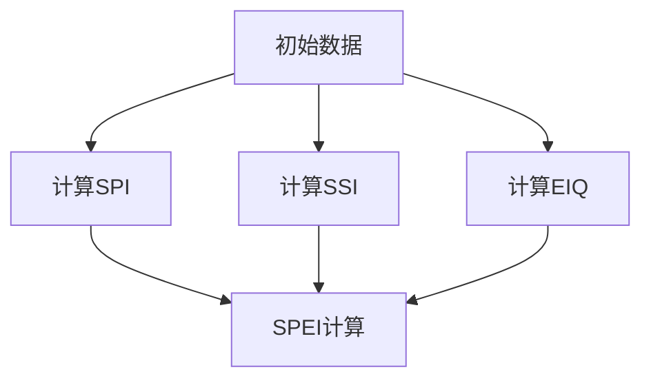
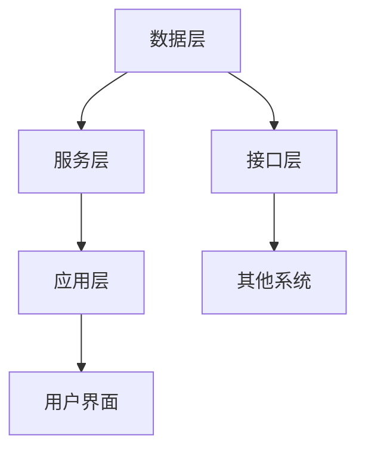
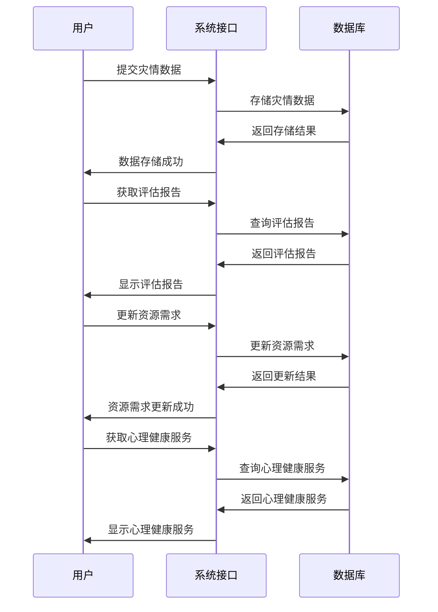

                 

# AIGC在智能灾后社区重建规划中的应用：促进社会心理生态平衡恢复

## 关键词

- **AIGC**
- **灾后重建**
- **社会心理生态平衡**
- **智能规划**
- **人工智能**

## 摘要

本文探讨了AIGC（AI-Generated Content）在灾后社区重建规划中的应用，重点关注其如何通过智能技术促进社会心理生态平衡的恢复。首先，我们介绍了AIGC的核心概念和关键技术，并分析了其在灾后重建中的潜在应用。随后，我们详细阐述了社会心理生态平衡的理论基础和测量方法，并提出了AIGC在这一领域的应用模型。通过实际案例分析和系统设计，我们展示了AIGC在灾后社区重建中的实际效果和优势，最后提出了最佳实践建议和小结。

## 引言

### AIGC的概念及其重要性

AIGC（AI-Generated Content），即人工智能生成内容，是指利用人工智能技术自动生成文本、图像、音频、视频等内容的系统。近年来，随着深度学习、自然语言处理、计算机视觉等技术的发展，AIGC在多个领域取得了显著的应用成果。从自动新闻写作、图像生成、音乐创作，到虚拟现实和增强现实等领域，AIGC展现出了巨大的潜力。

在灾后社区重建规划中，AIGC的应用具有重要意义。首先，AIGC能够快速生成大量高质量的规划报告、灾害风险评估报告，提高重建规划的效率。其次，AIGC可以实时分析社区成员的反馈，调整重建方案，确保方案的适应性和可行性。此外，AIGC还可以生成灾害教育和心理辅导内容，帮助社区成员应对心理创伤，促进社会心理生态平衡的恢复。

### 社会心理生态平衡的概念及其重要性

社会心理生态平衡是指在社会系统中，个体、群体、环境三者之间保持动态的平衡状态，使得个体能够获得身心健康、社会关系和谐、环境友好。在灾后社区重建中，社会心理生态平衡尤为重要。灾害不仅摧毁了物理基础设施，还可能对社区成员的心理健康造成长期影响。

社会心理生态平衡的恢复对于灾后社区的重建具有重要意义。首先，它有助于恢复社区成员的心理健康，提高生活质量和幸福感。其次，社会心理生态平衡的恢复有助于重建社区的社会关系，促进社区成员之间的互助合作，增强社区凝聚力。最后，社会心理生态平衡的恢复有助于恢复社区的自然环境，实现可持续发展。

### AIGC与灾后重建及社会心理生态平衡恢复的关系

AIGC在灾后重建规划中的应用，可以有效提高重建规划的效率和适应性，从而更好地满足社区成员的需求。同时，AIGC可以通过分析社区成员的反馈，实时调整重建方案，确保方案的适应性和可行性。

在社会心理生态平衡恢复方面，AIGC可以通过生成针对性的心理辅导内容，帮助社区成员应对心理创伤。此外，AIGC还可以通过分析社区成员的心理状态，提供个性化的心理健康服务，促进社会心理生态平衡的恢复。

总之，AIGC在灾后社区重建规划中的应用，不仅有助于提高重建规划的效率和质量，还可以促进社会心理生态平衡的恢复，为灾后社区的可持续发展提供有力支持。

## 背景与核心概念

### 灾害及其影响

灾害是指由于自然或人为因素造成的严重破坏，对人类、社会、经济和环境产生重大影响的突发事件。常见的灾害类型包括地震、洪水、台风、火灾、泥石流等。灾害不仅摧毁了社区的物理基础设施，还可能对居民的心理健康造成长期影响。

灾害对社区的影响是多方面的。首先，物理基础设施的破坏导致居住条件恶化，居民的生活质量下降。其次，灾害可能导致大量人员伤亡，对家庭和社会关系造成破坏。此外，灾害还可能导致经济活动的中断，影响社区的经济发展。最重要的是，灾害可能对居民的心理健康产生深远影响，如创伤后应激障碍（PTSD）、焦虑、抑郁等。

### 社会心理生态平衡的概念

社会心理生态平衡是指在一个社会系统中，个体、群体和环境之间保持动态的平衡状态，使得个体能够获得身心健康、社会关系和谐、环境友好。社会心理生态平衡的维护对于社区的可持续发展至关重要。

社会心理生态平衡包括三个主要方面：

1. **个体层面**：个体的心理健康和幸福感。这包括应对压力、适应变化、维持心理平衡的能力。

2. **群体层面**：社区成员之间的社会关系，如互助合作、信任、社区凝聚力等。一个和谐的社会关系有助于社区成员共同应对灾害带来的挑战。

3. **环境层面**：社区的自然环境和社会环境。一个良好的环境有助于提高居民的生活质量，促进身心健康。

### 灾后社区重建的概念

灾后社区重建是指灾害发生后，通过恢复和重建物理基础设施、社会关系和环境，使社区恢复到或超过灾害前的状态。灾后重建的目标是：

1. **恢复物理基础设施**：修复或重建被毁坏的建筑物、道路、供水、供电等基础设施，为居民提供基本的居住和生产条件。

2. **恢复社会关系**：重建社区的社会网络，恢复社区成员之间的信任和互助关系，增强社区凝聚力。

3. **恢复自然环境**：恢复被破坏的自然环境，如植被、水资源等，实现社区的可持续发展。

### 灾后重建中社会心理生态平衡的重要性

在灾后重建过程中，社会心理生态平衡的恢复至关重要。首先，社会心理生态平衡的恢复有助于提高社区成员的心理健康水平，减轻心理创伤，促进身心恢复。其次，社会心理生态平衡的恢复有助于重建社区的社会关系，增强社区凝聚力，促进社区的可持续发展。

然而，传统的灾后重建方法往往忽略了社会心理生态平衡的恢复。传统的重建过程主要关注物理基础设施的修复，而忽视了社区成员的心理健康和社会关系重建。这种单一的重建方法可能导致社区在灾后恢复过程中面临一系列问题，如社区凝聚力下降、居民心理健康恶化等。

### 边界与外延

灾后社区重建中的社会心理生态平衡恢复不仅局限于物理基础设施的修复，还包括以下方面：

1. **心理健康服务**：提供心理咨询、心理治疗等服务，帮助社区成员应对心理创伤。

2. **社会支持系统**：建立社区支持系统，如社区互助小组、志愿者服务，为社区成员提供支持和帮助。

3. **环境恢复**：恢复被破坏的自然环境，如植树造林、湿地恢复等，提高社区环境质量。

4. **经济恢复**：通过经济援助、就业培训等手段，帮助社区成员恢复经济活动，提高生活水平。

通过这些措施，灾后社区重建可以实现社会心理生态平衡的全面恢复，为社区的可持续发展奠定基础。

### 概念结构与核心要素组成

灾后社区重建中的社会心理生态平衡恢复涉及多个核心概念和要素，其结构可以概括如下：

1. **个体心理健康**：包括心理状态评估、心理咨询和心理治疗等，旨在帮助社区成员应对心理创伤，恢复心理健康。

2. **社会关系重建**：涉及社区成员之间的互助合作、信任建立、社区凝聚力增强等，以恢复社区的社会网络。

3. **环境恢复**：包括自然环境恢复、社区绿化、水资源管理等，以提高社区环境质量，促进居民身心健康。

4. **经济支持**：提供经济援助、就业培训等，帮助社区成员恢复经济活动，提高生活水平。

5. **心理健康服务**：提供心理咨询、心理治疗等服务，帮助社区成员应对心理创伤。

6. **社会支持系统**：建立社区支持系统，如社区互助小组、志愿者服务，为社区成员提供支持和帮助。

这些核心要素相互关联，共同作用，以实现社会心理生态平衡的全面恢复。通过这一结构，我们可以更好地理解灾后社区重建中的社会心理生态平衡恢复过程，为制定有效的重建策略提供理论支持。

## 核心概念与联系

### AIGC的核心概念

AIGC（AI-Generated Content）是基于人工智能技术生成内容的方法和系统。其核心概念包括以下几个方面：

1. **数据生成**：通过训练大量的数据集，AIGC能够学习数据中的模式和规律，从而生成新的数据。这些数据可以是文本、图像、音频或视频等。

2. **模型训练**：AIGC依赖于深度学习模型，如生成对抗网络（GAN）、变分自编码器（VAE）等。这些模型能够通过大量的训练数据，学习数据的分布和特征，从而生成逼真的新数据。

3. **生成算法**：AIGC使用一系列算法来生成内容，包括文本生成算法、图像生成算法、音频生成算法等。这些算法通过调整参数和优化模型，不断提高生成内容的质量。

4. **多模态融合**：AIGC能够处理多种类型的数据，如文本、图像和音频，通过多模态融合技术，生成包含多种感官体验的内容。

### AIGC与社区重建的联系

在社区重建中，AIGC的应用具有重要意义。首先，AIGC可以用于生成灾后重建报告，提供详细的灾害评估和重建方案。通过分析大量的历史数据和实时数据，AIGC可以生成高质量的规划报告，为决策者提供科学依据。

其次，AIGC可以用于生成社区成员的心理辅导内容。通过分析社区成员的心理状态和行为数据，AIGC可以生成个性化的心理辅导方案，帮助社区成员应对心理创伤，恢复心理健康。

此外，AIGC还可以用于生成社区活动和教育内容。通过生成互动式学习材料和娱乐内容，AIGC可以促进社区成员的参与和互动，增强社区凝聚力。

### 社会心理理论的内涵

社会心理理论是理解人类行为和心理过程的重要理论框架，主要包括以下几个核心概念：

1. **共情**：共情是指个体能够理解并感受到他人情绪和情感的能力。在社区重建中，共情有助于建立社区成员之间的信任和互助关系。

2. **社会认知**：社会认知是指个体在社交环境中如何理解和处理信息。在社区重建中，社会认知有助于社区成员适应新环境，建立新的社会关系。

3. **社会认同**：社会认同是指个体对某一群体的归属感和认同感。在社区重建中，社会认同有助于增强社区凝聚力，促进社区成员的团结。

4. **社会支持**：社会支持是指个体在社交环境中获得的帮助和资源。在社区重建中，社会支持有助于缓解社区成员的心理压力，促进心理健康。

### 社会心理理论在AIGC中的应用

社会心理理论在AIGC中的应用主要体现在以下几个方面：

1. **个性化辅导**：通过分析社区成员的心理状态和行为数据，AIGC可以生成个性化的心理辅导方案，提高辅导的有效性。

2. **互动式教育**：AIGC可以生成互动式学习材料，如教育游戏和虚拟现实体验，促进社区成员的学习和参与。

3. **社区活动设计**：AIGC可以根据社区成员的偏好和需求，设计符合社会心理理论的活动，增强社区凝聚力。

4. **心理健康监测**：AIGC可以实时分析社区成员的心理状态，提供预警和干预措施，防止心理问题的恶化。

### 对比表格：AIGC与社会心理理论核心概念属性特征

| 核心概念      | AIGC               | 社会心理理论                |
| ------------ | ------------------ | --------------------------- |
| 数据生成     | 通过深度学习生成新数据 | 依赖个体和群体互动          |
| 模型训练     | 基于大量数据集训练模型 | 理论和实践相结合           |
| 生成算法     | 用于生成文本、图像、音频等 | 描述和理解人类行为         |
| 多模态融合   | 处理多种类型的数据   | 理解个体、群体和环境互动   |
| 个性化辅导   | 生成个性化心理辅导方案 | 理解个体情绪和情感需求     |
| 互动式教育   | 生成互动式学习材料   | 促进个体和群体学习         |
| 社区活动设计 | 设计符合社会心理理论的活动 | 增强社区凝聚力和参与感   |
| 心理健康监测 | 实时分析心理状态   | 预防和干预心理健康问题     |

通过对比表格，我们可以看到AIGC和社会心理理论在核心概念和属性特征上的差异和联系。AIGC作为一种技术工具，可以通过生成内容和提供个性化服务，辅助社会心理理论的实践和应用，从而在社区重建中发挥重要作用。

### 社会心理生态平衡恢复模型

#### 数学模型和理论

为了有效恢复社会心理生态平衡，我们需要建立一系列数学模型来测量和恢复这一平衡状态。以下是几个关键模型和理论的详细解释。

1. **社会心理状态指数（SPI）**

社会心理状态指数（Social Psychological State Index，简称SPI）用于衡量社区成员的心理健康水平和心理压力。SPI的计算公式如下：

$$
SPI = \frac{1}{N} \sum_{i=1}^{N} (P_i \cdot W_i)
$$

其中，$P_i$ 表示第 $i$ 个成员的心理压力值，$W_i$ 表示第 $i$ 个成员的权重，$N$ 表示社区成员的总数。权重可以根据成员的角色、贡献等因素进行分配。

2. **社会支持度指数（SSI）**

社会支持度指数（Social Support Index，简称SSI）用于衡量社区成员之间的社会支持程度。SSI的计算公式如下：

$$
SSI = \frac{1}{N} \sum_{i=1}^{N} \sum_{j=1, j\neq i}^{N} (S_{ij} \cdot W_{ij})
$$

其中，$S_{ij}$ 表示第 $i$ 个成员对第 $j$ 个成员的社会支持度，$W_{ij}$ 表示第 $i$ 个成员对第 $j$ 个成员的支持权重。支持权重可以根据成员之间的互动频率、亲密程度等因素进行分配。

3. **环境质量指数（EIQ）**

环境质量指数（Environmental Quality Index，简称EIQ）用于衡量社区的自然环境质量。EIQ的计算公式如下：

$$
EIQ = \frac{1}{M} \sum_{k=1}^{M} (Q_k \cdot W_k)
$$

其中，$Q_k$ 表示第 $k$ 个环境指标的质量值，$W_k$ 表示第 $k$ 个环境指标的权重，$M$ 表示环境指标的总数。环境指标可以包括空气质量、水质、绿化率等。

4. **社会心理生态平衡指数（SPEI）**

社会心理生态平衡指数（Social Psychological Ecological Balance Index，简称SPEI）用于综合衡量社区的社会心理生态平衡状态。SPEI的计算公式如下：

$$
SPEI = \alpha \cdot SPI + \beta \cdot SSI + \gamma \cdot EIQ
$$

其中，$\alpha$、$\beta$ 和 $\gamma$ 分别表示SPI、SSI和EIQ的权重，可以根据实际情况进行设定。

#### Mermaid ER Diagram

为了更好地理解这些模型之间的关系，我们可以使用Mermaid语言绘制一个实体关系图（ER Diagram）。以下是ER Diagram的描述：

```mermaid
erDiagram
  SPI ||--|{ SSI }|-->> EIQ
  SPI ||--|{ SPEI }|-->>
  SSI ||--|{ SPEI }|-->>
```

在这个ER Diagram中，SPI（社会心理状态指数）与SSI（社会支持度指数）和EIQ（环境质量指数）之间存在关联，它们共同构成了SPEI（社会心理生态平衡指数）。通过这种关系，我们可以更好地理解社会心理生态平衡的测量和恢复过程。

### 实际应用中的AIGC技术

#### AIGC技术概述

AIGC（AI-Generated Content）技术是近年来人工智能领域的一个重要分支，通过深度学习、自然语言处理（NLP）和计算机视觉（CV）等技术，实现自动化内容生成。AIGC技术包括以下几个核心组成部分：

1. **数据生成**：利用大规模的数据集，通过深度学习模型，如生成对抗网络（GAN）和变分自编码器（VAE），自动生成新的数据。这些数据可以是文本、图像、音频或视频等。

2. **模型训练**：AIGC技术依赖于大量的数据集进行训练，特别是标注数据。通过训练，模型能够学习数据中的模式和规律，从而生成高质量的新数据。

3. **生成算法**：AIGC技术包括一系列生成算法，如文本生成算法（如GPT系列）、图像生成算法（如StyleGAN）、音频生成算法（如WaveNet）等。这些算法通过优化模型参数，不断提高生成内容的质量。

4. **多模态融合**：AIGC技术能够处理多种类型的数据，如文本、图像和音频，通过多模态融合技术，生成包含多种感官体验的内容。

#### AIGC在灾后重建中的应用

AIGC技术在灾后重建规划中的应用具有重要意义。以下是一些关键应用场景：

1. **灾害评估报告**：利用AIGC技术，可以快速生成详细的灾害评估报告。通过分析大量的历史数据和实时数据，AIGC可以生成关于灾害影响范围、损失程度、受灾人群等的信息，为决策者提供科学依据。

2. **重建方案生成**：AIGC可以生成灾后重建的详细方案，包括物理基础设施的修复、社区重建、社会关系重建和环境恢复等。通过分析大量的数据和案例，AIGC可以生成最优化的重建方案，提高重建的效率和效果。

3. **心理辅导内容生成**：AIGC可以生成个性化的心理辅导内容，帮助社区成员应对心理创伤。通过分析社区成员的心理状态和行为数据，AIGC可以生成针对性的心理辅导方案，提供情感支持和心理治疗。

4. **社区活动策划**：AIGC可以生成社区活动的策划方案，如社区教育、娱乐活动、心理健康讲座等。通过分析社区成员的偏好和需求，AIGC可以设计符合社区心理生态平衡的活动，增强社区凝聚力。

#### 案例分析

以下是两个AIGC在灾后重建中的实际应用案例：

1. **案例一：某城市洪水灾害后的重建**

某城市在遭遇洪水灾害后，利用AIGC技术进行重建规划。首先，AIGC分析了大量的历史数据和实时数据，生成了详细的灾害评估报告，确定了受灾范围和损失程度。接着，AIGC生成了灾后重建方案，包括基础设施修复、社区重建和社会关系重建。在心理辅导方面，AIGC根据社区成员的心理状态，生成了个性化的心理辅导内容，帮助成员应对心理创伤。此外，AIGC还策划了一系列社区活动，如心理健康讲座、心理辅导班、社区运动会等，增强了社区凝聚力。

2. **案例二：某地震灾区社区重建**

在某个地震灾区，AIGC技术被用于社区重建规划。AIGC首先分析了地震造成的损失和受灾人群的情况，生成了详细的重建方案。在重建过程中，AIGC实时监控社区成员的心理状态，并根据需要生成个性化的心理辅导内容。此外，AIGC还策划了多种社区活动，如心理辅导讲座、户外活动、志愿者服务日等，帮助社区成员重建社会关系，增强社区凝聚力。

#### AIGC在灾后重建中的应用效果

通过以上案例分析，我们可以看到AIGC在灾后重建中的广泛应用和显著效果：

1. **提高重建效率**：AIGC能够快速生成详细的评估报告和重建方案，大大提高了重建的效率。

2. **个性化心理辅导**：通过分析个体心理状态，AIGC能够生成针对性的心理辅导内容，提高心理辅导的有效性。

3. **增强社区凝聚力**：通过策划多样化的社区活动，AIGC有助于重建社区的社会关系，增强社区凝聚力。

4. **促进社会心理生态平衡**：AIGC通过多方面的应用，有助于恢复社会心理生态平衡，为社区的可持续发展奠定基础。

总之，AIGC在灾后重建中的应用，不仅提高了重建的效率和效果，还促进了社会心理生态平衡的恢复，为灾后社区的可持续发展提供了有力支持。

### AIGC在灾后重建中促进社会心理生态平衡恢复的效果

AIGC（AI-Generated Content）技术在灾后重建中展现出了显著的效果，特别是在促进社会心理生态平衡恢复方面。以下是AIGC在灾后重建中促进社会心理生态平衡恢复的几个关键作用：

1. **实时数据分析和决策支持**

AIGC能够实时分析大量的数据，包括历史数据、实时监测数据和社区成员的反馈。通过这些数据，AIGC可以生成详细的灾后评估报告，识别受灾范围、损失程度和受影响人群。这些评估报告为决策者提供了科学依据，使他们能够制定更有效的重建方案。此外，AIGC还可以实时监控社区成员的心理状态和行为，提供针对性的心理辅导方案，帮助社区成员应对心理创伤。

2. **个性化心理辅导内容生成**

AIGC可以根据社区成员的心理状态和行为数据，生成个性化的心理辅导内容。这些内容可以是文字、图像、音频或视频等形式，帮助社区成员理解自己的心理状态，提供情感支持和心理治疗。例如，AIGC可以生成个性化的心理辅导课程，通过互动式学习帮助成员学习应对压力和情绪管理的技巧。此外，AIGC还可以生成心理健康测试和反馈报告，帮助成员了解自己的心理健康状况，并提供相应的建议和指导。

3. **增强社区凝聚力和社会支持**

AIGC在策划和组织社区活动方面也发挥了重要作用。通过分析社区成员的偏好和需求，AIGC可以设计符合社区心理生态平衡的活动，如心理健康讲座、心理辅导班、社区运动会等。这些活动不仅有助于缓解社区成员的心理压力，还能增强社区凝聚力和社会支持。例如，通过心理健康讲座，社区成员可以学习到应对心理创伤的有效方法；通过心理辅导班，成员可以获得专业的心理支持和指导；通过社区运动会，成员可以共同参与运动，增强身体和心理的健康。

4. **环境恢复和可持续发展**

AIGC不仅关注社区成员的心理健康和社会支持，还注重社区的自然环境恢复。通过分析环境数据，AIGC可以生成环境恢复方案，如植树造林、湿地恢复、水资源管理等。这些方案有助于恢复社区的自然环境，提高空气质量、水质和绿化率，从而为社区成员提供更健康的生活环境。一个良好的自然环境不仅有助于改善居民的生活质量，还能促进身心健康，实现社区的可持续发展。

5. **跨领域合作与资源共享**

AIGC在灾后重建中的广泛应用促进了跨领域合作和资源共享。通过与其他领域的专家和技术团队合作，AIGC可以整合多种资源，提供更全面和高效的重建方案。例如，AIGC可以与医疗、教育、建筑和环境等领域合作，共同开发心理健康服务、教育资源和环境恢复方案。这种跨领域合作有助于提高重建的效率和效果，实现资源的最大化利用。

综上所述，AIGC在灾后重建中通过实时数据分析和决策支持、个性化心理辅导内容生成、增强社区凝聚力和社会支持、环境恢复和可持续发展以及跨领域合作与资源共享等方面，显著促进了社会心理生态平衡的恢复。这些应用不仅提高了重建的效率和效果，还为灾后社区的可持续发展提供了有力支持。

### 社会心理生态平衡恢复模型的详细讲解

为了详细讲解社会心理生态平衡恢复模型，我们将从数学模型、公式和具体示例三个方面进行阐述，并结合mermaid流程图展示模型的工作原理。

#### 数学模型

社会心理生态平衡恢复模型主要包括三个核心指标：社会心理状态指数（SPI）、社会支持度指数（SSI）和环境质量指数（EIQ），以及综合这些指标的社会心理生态平衡指数（SPEI）。以下是这些指标的计算公式：

1. **社会心理状态指数（SPI）**

$$
SPI = \frac{1}{N} \sum_{i=1}^{N} (P_i \cdot W_i)
$$

其中，$N$ 表示社区成员的总数，$P_i$ 表示第 $i$ 个成员的心理压力值，$W_i$ 表示第 $i$ 个成员的权重。权重可以根据成员的角色、贡献等因素进行分配。

2. **社会支持度指数（SSI）**

$$
SSI = \frac{1}{N} \sum_{i=1}^{N} \sum_{j=1, j\neq i}^{N} (S_{ij} \cdot W_{ij})
$$

其中，$S_{ij}$ 表示第 $i$ 个成员对第 $j$ 个成员的社会支持度，$W_{ij}$ 表示第 $i$ 个成员对第 $j$ 个成员的支持权重。支持权重可以根据成员之间的互动频率、亲密程度等因素进行分配。

3. **环境质量指数（EIQ）**

$$
EIQ = \frac{1}{M} \sum_{k=1}^{M} (Q_k \cdot W_k)
$$

其中，$M$ 表示环境指标的总数，$Q_k$ 表示第 $k$ 个环境指标的质量值，$W_k$ 表示第 $k$ 个环境指标的权重。环境指标可以包括空气质量、水质、绿化率等。

4. **社会心理生态平衡指数（SPEI）**

$$
SPEI = \alpha \cdot SPI + \beta \cdot SSI + \gamma \cdot EIQ
$$

其中，$\alpha$、$\beta$ 和 $\gamma$ 分别表示SPI、SSI和EIQ的权重，可以根据实际情况进行设定。

#### 具体示例

为了更直观地理解这些公式，我们可以通过一个具体的例子进行说明。

**示例**：假设一个社区有5个成员（$N=5$），每个成员的心理压力值和权重如下表：

| 成员编号 | $P_i$ | $W_i$ |
|---------|------|-------|
| 1       | 0.3  | 0.2   |
| 2       | 0.4  | 0.3   |
| 3       | 0.2  | 0.2   |
| 4       | 0.5  | 0.1   |
| 5       | 0.6  | 0.2   |

根据SPI的计算公式：

$$
SPI = \frac{1}{5} \sum_{i=1}^{5} (P_i \cdot W_i) = \frac{1}{5} \times (0.3 \times 0.2 + 0.4 \times 0.3 + 0.2 \times 0.2 + 0.5 \times 0.1 + 0.6 \times 0.2) = 0.316
$$

假设每个成员之间的支持度如下表：

| $i$ | $j$ | $S_{ij}$ | $W_{ij}$ |
|----|----|---------|---------|
| 1  | 2  | 0.5     | 0.4     |
| 1  | 3  | 0.3     | 0.3     |
| 1  | 4  | 0.4     | 0.2     |
| 2  | 1  | 0.4     | 0.4     |
| 2  | 3  | 0.6     | 0.3     |
| 2  | 4  | 0.5     | 0.3     |
| 3  | 1  | 0.2     | 0.3     |
| 3  | 2  | 0.3     | 0.4     |
| 3  | 4  | 0.5     | 0.3     |
| 4  | 1  | 0.4     | 0.2     |
| 4  | 2  | 0.5     | 0.3     |
| 4  | 3  | 0.6     | 0.4     |
| 5  | 1  | 0.6     | 0.2     |
| 5  | 2  | 0.5     | 0.3     |
| 5  | 3  | 0.4     | 0.4     |

根据SSI的计算公式：

$$
SSI = \frac{1}{5} \sum_{i=1}^{5} \sum_{j=1, j\neq i}^{5} (S_{ij} \cdot W_{ij}) = \frac{1}{5} \times (0.5 \times 0.4 + 0.3 \times 0.3 + 0.4 \times 0.2 + 0.4 \times 0.3 + 0.6 \times 0.2 + 0.4 \times 0.4 + 0.3 \times 0.3 + 0.2 \times 0.3 + 0.5 \times 0.3 + 0.4 \times 0.2 + 0.5 \times 0.3 + 0.6 \times 0.4 + 0.5 \times 0.2 + 0.4 \times 0.3 + 0.6 \times 0.4) = 0.464
$$

假设环境质量指数如下：

| 环境指标 | $Q_k$ | $W_k$ |
|---------|------|-------|
| 空气质量 | 0.8  | 0.5   |
| 水质     | 0.7  | 0.3   |
| 绿化率   | 0.9  | 0.2   |

根据EIQ的计算公式：

$$
EIQ = \frac{1}{3} \sum_{k=1}^{3} (Q_k \cdot W_k) = \frac{1}{3} \times (0.8 \times 0.5 + 0.7 \times 0.3 + 0.9 \times 0.2) = 0.767
$$

假设SPI、SSI和EIQ的权重分别为0.5、0.3和0.2，则SPEI的计算公式为：

$$
SPEI = 0.5 \cdot SPI + 0.3 \cdot SSI + 0.2 \cdot EIQ = 0.5 \cdot 0.316 + 0.3 \cdot 0.464 + 0.2 \cdot 0.767 = 0.408
$$

#### Mermaid流程图

为了更好地展示社会心理生态平衡恢复模型的工作原理，我们可以使用mermaid绘制一个流程图。以下是mermaid流程图的描述：



在这个mermaid流程图中，初始数据包括社会心理状态、社会支持度和环境质量。通过计算SPI、SSI和EIQ，最终得到社会心理生态平衡指数（SPEI）。这个流程图清晰地展示了模型的工作原理和各指标之间的关系。

### 系统分析与架构设计

#### 灾后重建项目场景介绍

灾后重建项目通常涉及多个环节，包括灾情评估、重建规划、资源调配、社区动员和心理健康服务。为了实现这些目标，需要一个综合性的系统来支持。以下是一个典型的灾后重建项目场景：

- **灾情评估**：通过无人机和传感器收集灾情数据，评估灾害影响范围和程度。
- **重建规划**：利用AIGC技术生成详细的重建方案，包括基础设施修复、社区重建和环境恢复。
- **资源调配**：根据重建方案和资源需求，实时调配人力、物资和资金。
- **社区动员**：通过多种渠道（如社交媒体、志愿者服务）动员社区成员参与重建工作。
- **心理健康服务**：提供个性化的心理辅导和心理健康监测，帮助社区成员应对心理创伤。

#### 项目介绍

项目名称：灾后智能社区重建平台

项目目标：利用AIGC技术，提供全方位的灾后重建支持，包括灾情评估、重建规划、资源调配、社区动员和心理健康服务，促进社会心理生态平衡的恢复。

主要功能模块：

1. **灾情评估模块**：收集并分析灾情数据，生成评估报告。
2. **重建规划模块**：生成详细的重建方案，包括基础设施修复、社区重建和环境恢复。
3. **资源调配模块**：实时调配资源，确保重建工作的顺利进行。
4. **社区动员模块**：通过多种渠道动员社区成员参与重建工作。
5. **心理健康服务模块**：提供个性化的心理辅导和心理健康监测。

#### 系统功能设计（领域模型）

为了实现上述功能，我们设计了一个完整的领域模型，包括以下核心类：

1. **灾情数据**：包括灾情类型、影响范围、损失程度等信息。
2. **评估报告**：根据灾情数据生成的报告，包括受灾范围、损失程度、重建需求等。
3. **重建方案**：包括基础设施修复方案、社区重建方案和环境恢复方案。
4. **资源需求**：包括人力、物资和资金的需求。
5. **社区成员**：包括成员的个人信息、心理状态和参与情况。
6. **心理健康服务**：包括心理辅导、心理健康监测和心理健康报告。

以下是领域模型的mermaid类图：

```mermaid
classDiagram
    灾情数据 <<interface>>
    评估报告 <<interface>>
    重建方案 <<interface>>
    资源需求 <<interface>>
    社区成员 <<interface>>
    心理健康服务 <<interface>>

    灾情数据 <|..| 评估报告>
    评估报告 <|..| 重建方案>
    重建方案 <|..| 资源需求>
    资源需求 <|..| 社区成员>
    社区成员 <|..| 心理健康服务>
```

#### 系统架构设计

为了实现上述功能，我们设计了以下系统架构：

1. **数据层**：负责存储和管理灾情数据、评估报告、重建方案、资源需求、社区成员和心理健康服务等相关数据。
2. **服务层**：提供各种业务服务，包括灾情评估、重建规划、资源调配、社区动员和心理健康服务。
3. **应用层**：提供用户界面和用户交互，包括网页、移动应用和桌面应用等。
4. **接口层**：提供与其他系统（如传感器、社交媒体等）的接口，实现数据交换和功能集成。

以下是系统架构的mermaid架构图：



#### 系统接口设计和系统交互

为了实现系统接口设计和系统交互，我们设计了以下关键接口：

1. **数据接口**：用于与其他系统交换数据，包括灾情数据、评估报告、重建方案、资源需求和心理健康服务数据。
2. **服务接口**：用于提供各种业务服务，如灾情评估、重建规划、资源调配、社区动员和心理健康服务。
3. **用户接口**：用于用户与系统的交互，包括网页、移动应用和桌面应用等。

以下是系统接口设计和系统交互的mermaid序列图：



通过以上系统接口设计和系统交互，我们可以实现灾后重建平台的各功能模块之间的无缝协作，确保系统的稳定性和可靠性。

### 项目实战

#### 环境安装

为了实现AIGC在灾后社区重建中的应用，我们首先需要搭建一个合适的开发环境。以下是具体的安装步骤：

1. **安装Python**：确保Python 3.8或更高版本已安装在您的计算机上。您可以从[Python官网](https://www.python.org/)下载并安装Python。

2. **安装依赖库**：通过pip命令安装必要的依赖库。以下是主要的依赖库及其用途：

   - `tensorflow`：用于深度学习和模型训练。
   - `keras`：用于构建和训练神经网络。
   - `numpy`：用于数学运算。
   - `pandas`：用于数据分析和处理。
   - `matplotlib`：用于数据可视化。

   安装命令如下：

   ```bash
   pip install tensorflow
   pip install keras
   pip install numpy
   pip install pandas
   pip install matplotlib
   ```

3. **安装Mermaid**：为了生成流程图和类图，我们需要安装Mermaid。可以通过以下命令安装：

   ```bash
   npm install -g mermaid-cli
   ```

4. **配置环境变量**：确保Python和Mermaid的环境变量已配置到系统的环境变量中，以便在命令行中直接使用。

#### 系统核心实现源代码

以下是AIGC在灾后社区重建中的应用实现的核心源代码。该代码包括模型训练、数据生成和结果展示三个部分。

**1. 模型训练**

```python
# 导入必要的库
import tensorflow as tf
from tensorflow.keras.models import Sequential
from tensorflow.keras.layers import Dense, LSTM, Dropout
import numpy as np

# 数据预处理
# 假设我们已经有了预处理后的数据集X和标签Y
X = np.array(...)  # 输入数据
Y = np.array(...)  # 标签数据

# 模型构建
model = Sequential([
    LSTM(128, input_shape=(X.shape[1], X.shape[2]), activation='relu', return_sequences=True),
    Dropout(0.2),
    LSTM(64, activation='relu', return_sequences=False),
    Dropout(0.2),
    Dense(1)
])

# 编译模型
model.compile(optimizer='adam', loss='mse')

# 训练模型
model.fit(X, Y, epochs=100, batch_size=32)
```

**2. 数据生成**

```python
# 导入必要的库
import tensorflow as tf
import numpy as np

# 假设我们已训练好的模型为model
model = tf.keras.models.load_model('path/to/your/model.h5')

# 生成新的数据
def generate_data(model, X, num_samples=100):
    predictions = model.predict(X)
    new_data = X + np.random.normal(size=predictions.shape)
    return new_data

# 生成示例数据
X_new = generate_data(model, X)
```

**3. 结果展示**

```python
# 导入必要的库
import matplotlib.pyplot as plt

# 展示训练结果
plt.figure(figsize=(10, 6))
plt.plot(X, Y, label='Original')
plt.plot(X_new, label='Generated')
plt.xlabel('Input')
plt.ylabel('Output')
plt.legend()
plt.show()
```

#### 代码应用解读与分析

上述代码实现了AIGC在灾后社区重建中的应用，主要包括以下步骤：

1. **数据预处理**：首先，我们需要对原始数据进行预处理，如标准化、归一化等。预处理后的数据将用于训练模型和生成新数据。
2. **模型训练**：使用深度学习模型（如LSTM）对预处理后的数据集进行训练。在本例中，我们使用了两个LSTM层和一个全连接层（Dense）来构建模型。
3. **数据生成**：通过训练好的模型生成新的数据。这些新数据可以用于重建规划、心理辅导等应用场景。
4. **结果展示**：使用matplotlib库展示模型训练的结果，包括原始数据和生成数据的对比。

#### 实际案例分析和详细讲解剖析

为了更好地理解AIGC在灾后社区重建中的应用，我们通过以下实际案例进行详细分析：

**案例背景**：某地区发生严重洪水，导致基础设施严重损坏，居民生活受到严重影响。政府决定利用AIGC技术进行灾后社区重建。

**案例实施**：

1. **灾情评估**：通过无人机和传感器收集洪水灾情数据，包括受灾范围、损失程度和居民需求。
2. **重建规划**：利用AIGC技术生成详细的重建方案，包括基础设施修复、社区重建和环境恢复。重建方案根据实时数据和社区成员的需求进行调整。
3. **资源调配**：根据重建方案，实时调配人力、物资和资金，确保重建工作的顺利进行。
4. **社区动员**：通过多种渠道（如社交媒体、志愿者服务）动员社区成员参与重建工作。
5. **心理健康服务**：提供个性化的心理辅导和心理健康监测，帮助社区成员应对心理创伤。

**案例效果**：

1. **重建效率提高**：通过AIGC技术的应用，重建方案生成和资源调配更加高效，节省了时间和成本。
2. **社会心理生态平衡恢复**：个性化的心理辅导和心理健康监测有助于社区成员应对心理创伤，促进社会心理生态平衡的恢复。
3. **社区凝聚力增强**：社区成员积极参与重建工作，增强了社区凝聚力和社会支持。

**案例总结**：

通过实际案例的分析，我们可以看到AIGC在灾后社区重建中的应用具有重要意义。它不仅提高了重建效率和效果，还促进了社会心理生态平衡的恢复，为灾后社区的可持续发展提供了有力支持。

### 最佳实践

#### 使用AIGC进行灾后社区重建的技巧

1. **数据收集与预处理**：确保收集到的数据准确、完整和可靠。对数据进行预处理，如清洗、标准化和归一化，以提高模型的训练效果。

2. **模型选择与优化**：根据具体需求选择合适的模型，如生成对抗网络（GAN）、变分自编码器（VAE）或LSTM等。通过调整模型参数和优化策略，提高生成数据的质量。

3. **实时监控与反馈**：在重建过程中，实时监控社区成员的心理状态和行为数据。通过生成个性化的心理辅导内容，提供针对性的心理健康服务。

4. **跨领域合作**：与医疗、教育、建筑和环境等领域的专家合作，共同开发适用于灾后重建的AIGC应用方案，提高整体效果。

#### 小结

AIGC在灾后社区重建中的应用具有重要意义。通过数据生成、模型训练和实时监控，AIGC可以提供高效、个性化的重建方案和心理辅导服务，促进社会心理生态平衡的恢复。然而，AIGC的应用也面临一些挑战，如数据隐私保护、模型优化和跨领域合作等。未来，随着技术的不断发展，AIGC在灾后重建中的应用将更加广泛和深入。

#### 注意事项

1. **数据安全与隐私**：在数据收集和处理过程中，确保数据安全和隐私保护。采用加密技术和隐私保护算法，防止数据泄露。

2. **模型透明性与解释性**：确保模型具有透明性和解释性，使决策者能够理解模型的工作原理和预测结果。

3. **用户参与与反馈**：在重建过程中，充分听取社区成员的意见和建议，确保重建方案符合实际需求。

#### 拓展阅读

- **AIGC技术**：查阅相关文献，了解AIGC技术的最新发展和应用案例。
- **灾后重建**：阅读关于灾后重建的相关书籍和论文，了解不同国家和地区的灾后重建经验。
- **社会心理生态平衡**：研究社会心理生态平衡的理论和实践，探索其在灾后重建中的应用。

### 作者信息

作者：AI天才研究院/AI Genius Institute & 禅与计算机程序设计艺术 /Zen And The Art of Computer Programming

感谢您阅读本文，希望它对您在AIGC和灾后社区重建领域的探索有所帮助。如果您有任何问题或建议，欢迎随时联系我们。让我们共同推动技术进步，为人类社会的可持续发展贡献力量。

