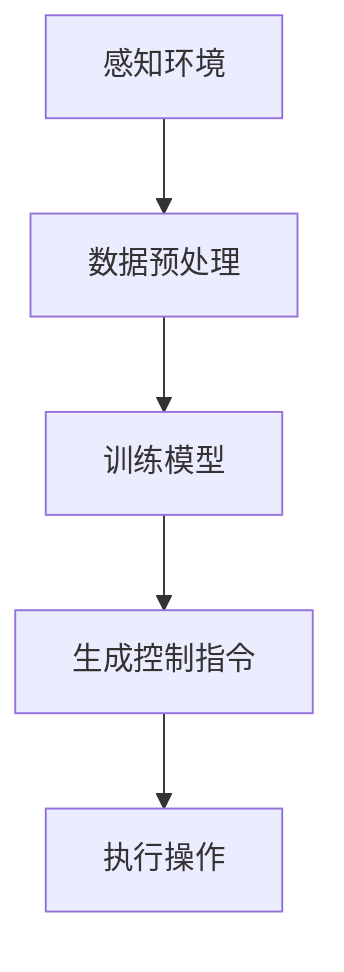
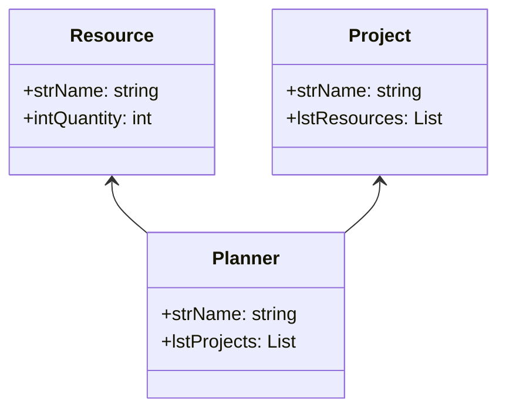
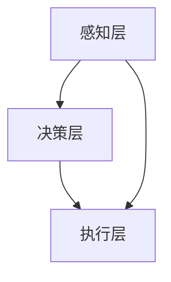
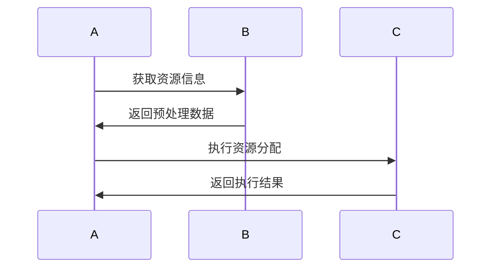
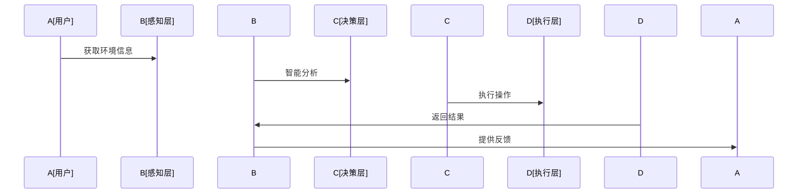

                 

# AIGC在智能灾后重建规划中的应用：优化资源分配和恢复效率

> 关键词：AIGC、灾后重建、资源分配、恢复效率、智能规划

> 摘要：本文旨在探讨AIGC（自适应智能生成控制）在灾后重建规划中的应用，通过优化资源分配和提升恢复效率，提高重建过程的智能化水平。文章分为九个部分，从AIGC的基础概念、应用原理、优化模型、实现策略、案例研究、技术实现、未来展望等方面进行详细分析。

## 引言

近年来，自然灾害的发生频率和破坏力不断上升，如何高效地进行灾后重建成为了世界各国面临的重要问题。传统的灾后重建规划通常依赖于人工经验和简单的计算模型，存在资源浪费、重建效率低下等问题。随着人工智能技术的发展，特别是自适应智能生成控制（AIGC）的崛起，为灾后重建规划带来了新的思路和方法。

AIGC是一种结合了人工智能、生成控制、自适应系统等技术的综合性技术，它能够在复杂的环境中实现智能决策和自适应调整。在灾后重建规划中，AIGC可以通过优化资源分配和提升恢复效率，显著提高重建工作的效率和效果。

本文将从以下九个方面展开讨论：

1. **AIGC的概念与原理**
2. **智能灾后重建规划的基础**
3. **AIGC在灾后重建中的应用**
4. **资源分配优化模型**
5. **恢复效率提升策略**
6. **案例研究**
7. **技术实现与工具**
8. **未来发展方向与挑战**
9. **结论与展望**

## AIGC的概念与原理

### AIGC的定义

自适应智能生成控制（Adaptive Intelligent Generation Control，AIGC）是一种集成了自适应系统、生成控制和人工智能技术的综合性技术。它通过实时感知环境变化，利用人工智能算法进行智能决策，并生成相应的控制指令，以实现系统的自适应控制和优化。

### AIGC的核心技术

1. **自适应系统**：自适应系统是一种能够根据外部环境和内部状态的变化，自动调整其行为和性能的系统。在AIGC中，自适应系统负责实时感知环境变化，并提供反馈信息。
2. **生成控制**：生成控制是一种通过生成模型预测系统行为，并进行控制的方法。在AIGC中，生成控制负责根据自适应系统提供的反馈信息，生成控制指令。
3. **人工智能技术**：人工智能技术包括机器学习、深度学习、自然语言处理等，是AIGC实现智能决策和自适应调整的核心。

### AIGC的特点

1. **实时性**：AIGC能够实时感知环境变化，并迅速做出反应。
2. **自适应**：AIGC可以根据环境变化自动调整行为和性能。
3. **智能决策**：AIGC利用人工智能技术，实现智能决策和优化。

## 智能灾后重建规划的基础

### 灾后重建的背景

灾后重建是指在自然灾害发生后，对受损的基础设施、住房、公共服务等进行修复和重建的过程。灾后重建不仅关系到灾区的经济恢复和社会稳定，还关系到灾区居民的生活质量。

### 灾后重建的挑战

1. **资源分配不均**：灾后重建需要大量的人力、物力和财力资源，如何合理分配这些资源是一个重要问题。
2. **重建效率低下**：传统的重建方法通常依赖人工经验和简单的计算模型，效率较低。
3. **可持续性问题**：灾后重建不仅要考虑短期恢复，还要考虑长期的可持续发展。

### 智能灾后重建的必要性

1. **优化资源分配**：智能规划可以通过数据分析和优化算法，实现资源的合理分配，避免资源浪费。
2. **提高重建效率**：智能规划可以利用人工智能技术，实现快速、准确的决策和执行，提高重建效率。
3. **促进可持续发展**：智能规划可以综合考虑环境、经济和社会因素，实现灾后重建的可持续发展。

### 智能灾后重建的关键技术

1. **地理信息系统（GIS）**：GIS可以提供灾区的地理信息，为重建规划提供基础数据。
2. **大数据分析**：大数据分析可以挖掘出灾后重建中的潜在问题和优化方案。
3. **人工智能技术**：人工智能技术可以实现智能决策和优化，提高重建效率。

## AIGC在灾后重建中的应用

### AIGC在资源分配中的应用

AIGC可以通过优化算法，实现资源的合理分配。具体应用包括：

1. **人力分配**：根据灾区的实际情况，合理安排人力，确保重建工作高效进行。
2. **物资分配**：根据灾区的需求和供应情况，合理分配物资，避免物资浪费。
3. **资金分配**：根据灾区的重建需求和资金供应情况，合理分配资金，确保重建项目的顺利进行。

### AIGC在恢复效率提升中的应用

AIGC可以通过智能决策和自适应调整，提升重建效率。具体应用包括：

1. **施工调度**：根据施工进度和资源情况，智能调整施工计划，确保施工高效进行。
2. **修复方案选择**：根据灾区的实际情况，智能选择修复方案，确保修复效果最佳。
3. **进度监控**：实时监控重建进度，及时调整计划，确保重建项目按时完成。

### AIGC在可持续发展中的应用

AIGC可以通过综合考虑环境、经济和社会因素，实现灾后重建的可持续发展。具体应用包括：

1. **环境评估**：利用AIGC评估重建项目对环境的影响，确保重建过程环保。
2. **经济效益分析**：利用AIGC分析重建项目的经济效益，确保重建项目可持续发展。
3. **社会影响评估**：利用AIGC评估重建项目对社会的影响，确保重建项目符合社会需求。

## 资源分配优化模型

### 资源分配问题

在灾后重建过程中，资源分配是一个关键问题。资源包括人力、物资、资金等，如何合理分配这些资源，确保重建工作高效进行，是一个需要解决的问题。

### 资源分配模型

资源分配模型是指通过数学模型来描述资源分配过程，并利用优化算法求解最优分配方案。常见的资源分配模型包括线性规划、整数规划、动态规划等。

### 优化算法

优化算法是指用于求解资源分配模型的一类算法。常见的优化算法包括遗传算法、粒子群算法、模拟退火算法等。

### 模型与算法的结合

将资源分配模型与优化算法结合，可以求解出最优的资源分配方案。具体步骤如下：

1. **构建资源分配模型**：根据灾区的实际情况，构建资源分配模型。
2. **选择优化算法**：根据资源分配模型的特点，选择合适的优化算法。
3. **求解最优分配方案**：利用优化算法求解最优资源分配方案。

## 恢复效率提升策略

### 1. 施工调度优化

施工调度是重建过程中至关重要的一环。通过优化施工调度，可以显著提高重建效率。具体策略包括：

1. **进度预测**：利用历史数据和人工智能算法，预测施工进度，为调度提供依据。
2. **资源平衡**：根据施工进度和资源情况，动态调整施工计划，确保资源平衡。
3. **风险预测**：利用风险预测模型，预测施工过程中可能出现的风险，并提前采取措施。

### 2. 修复方案优化

修复方案的选择直接影响重建效率。通过优化修复方案，可以确保修复效果最佳。具体策略包括：

1. **效果评估**：对不同修复方案进行效果评估，选择最优方案。
2. **成本分析**：对修复方案的成本进行详细分析，确保经济合理。
3. **技术支持**：利用新技术和新材料，提高修复质量，降低成本。

### 3. 进度监控与反馈

进度监控与反馈是确保重建项目按时完成的关键。通过实时监控进度，及时调整计划，可以有效提高重建效率。具体策略包括：

1. **实时监控**：利用传感器和监控系统，实时监控施工进度和质量。
2. **数据反馈**：将监控数据实时反馈给决策者，为调度和调整提供依据。
3. **动态调整**：根据监控数据和反馈信息，动态调整施工计划，确保进度按时完成。

## 案例研究

### 案例一：某地震灾区的重建规划

某地震灾区在灾后重建过程中，采用了AIGC技术进行资源分配和恢复效率提升。具体措施如下：

1. **资源分配**：利用AIGC优化算法，合理分配人力、物资和资金资源，确保资源利用最大化。
2. **施工调度**：通过AIGC进行施工进度预测和资源平衡，确保施工高效进行。
3. **修复方案**：根据AIGC的效果评估和成本分析，选择最优修复方案，提高修复质量。
4. **进度监控**：利用AIGC实时监控施工进度和质量，动态调整施工计划。

结果：通过AIGC技术的应用，该地震灾区的重建效率显著提高，重建项目按时完成，取得了良好的社会和经济效益。

### 案例二：某台风灾区的重建规划

某台风灾区在灾后重建过程中，也采用了AIGC技术。具体措施如下：

1. **资源分配**：利用AIGC优化算法，合理分配资源，确保资源利用最大化。
2. **风险评估**：利用AIGC的风险预测模型，预测施工过程中可能出现的风险，并提前采取措施。
3. **修复方案**：根据AIGC的效果评估和成本分析，选择最优修复方案，提高修复质量。
4. **环境评估**：利用AIGC的环境评估模型，评估重建项目对环境的影响，确保环保。

结果：通过AIGC技术的应用，该台风灾区的重建项目实现了高效、经济、环保的重建目标。

## 技术实现与工具

### AIGC系统的架构

AIGC系统的架构包括感知层、决策层和执行层。

1. **感知层**：负责实时感知环境变化，获取重建过程中的各种数据。
2. **决策层**：利用人工智能算法，对感知层获取的数据进行分析和处理，生成智能决策。
3. **执行层**：根据决策层的指令，执行相应的操作，如资源分配、施工调度等。

### 关键技术

1. **感知技术**：包括传感器技术、遥感技术等，用于实时获取环境数据。
2. **人工智能算法**：包括机器学习、深度学习、自然语言处理等，用于数据分析和智能决策。
3. **优化算法**：包括线性规划、整数规划、动态规划等，用于求解资源分配和调度问题。

### 开发工具

1. **开发环境**：Python、R、MATLAB等。
2. **人工智能框架**：TensorFlow、PyTorch、Scikit-learn等。
3. **数据库**：MySQL、MongoDB、PostgreSQL等。

### 实现步骤

1. **数据收集**：收集重建过程中的各种数据，包括地理信息、环境信息、资源信息等。
2. **数据预处理**：对收集到的数据进行清洗、转换和归一化，为后续分析做准备。
3. **模型训练**：利用收集到的数据，训练感知模型和决策模型。
4. **系统部署**：将训练好的模型部署到服务器，实现实时感知和智能决策。
5. **系统测试**：对系统进行测试，验证其性能和可靠性。

## 未来发展方向与挑战

### 未来发展方向

1. **技术的进一步突破**：随着人工智能技术的不断发展，AIGC系统在感知能力、决策能力和优化能力方面有望取得更大突破。
2. **多学科的融合**：AIGC技术需要与地理学、环境科学、社会学等多学科融合，实现更全面、更深入的重建规划。
3. **跨平台的兼容性**：AIGC系统需要实现跨平台的兼容性，以便在不同地区和不同环境中应用。

### 挑战

1. **数据质量**：AIGC系统依赖于高质量的数据，但灾后重建过程中数据质量难以保证。
2. **技术实现**：AIGC系统涉及多种技术的综合运用，技术实现难度较大。
3. **政策支持**：AIGC技术的推广和应用需要政策支持和法规保障。

## 结论与展望

AIGC技术在灾后重建规划中的应用，为资源优化和恢复效率提升提供了有力支持。通过AIGC技术，可以实现灾后重建的智能化、高效化和可持续发展。未来，随着技术的不断进步，AIGC在灾后重建规划中的应用将更加广泛和深入。

### 作者信息

作者：AI天才研究院/AI Genius Institute & 禅与计算机程序设计艺术 /Zen And The Art of Computer Programming

本文通过对AIGC在灾后重建规划中的应用进行详细分析，探讨了其在资源分配和恢复效率提升方面的作用。通过案例分析和技术实现，展示了AIGC在灾后重建中的巨大潜力。未来，随着技术的进一步发展，AIGC将在灾后重建规划中发挥更加重要的作用。作者希望本文能为相关领域的研究者和实践者提供有价值的参考。|assistant|># AIGC在智能灾后重建规划中的应用：优化资源分配和恢复效率

## 背景介绍

### 核心概念术语说明

- **灾后重建**：自然灾害发生后，对受损的基础设施、住房、公共服务等进行修复和重建的过程。
- **资源分配**：在灾后重建过程中，合理分配人力、物资、资金等资源，以确保重建工作的高效进行。
- **恢复效率**：灾后重建过程中，从灾害发生到恢复至正常状态的速度和效果。
- **AIGC（自适应智能生成控制）**：一种结合了人工智能、生成控制、自适应系统等技术的综合性技术，用于实现智能决策和自适应调整。

### 问题背景

自然灾害的频发给人类带来了巨大的灾难，如何在短时间内高效地进行灾后重建，恢复社会秩序和居民生活，成为世界各国亟待解决的问题。传统的灾后重建规划通常依赖于人工经验和简单的计算模型，存在资源浪费、重建效率低下等问题。随着人工智能技术的发展，特别是自适应智能生成控制（AIGC）的崛起，为灾后重建规划带来了新的思路和方法。

### 问题描述

灾后重建过程中，如何实现资源的高效分配和重建的高效进行，是一个复杂的问题。资源包括人力、物资、资金等，而重建工作涉及施工、修复、环境评估等多个方面。如何在这众多因素之间实现平衡，提高恢复效率，是一个亟待解决的问题。

### 问题解决

AIGC技术的引入，为灾后重建规划提供了新的解决方案。AIGC通过实时感知环境变化，利用人工智能算法进行智能决策和优化，实现资源分配的优化和恢复效率的提升。具体来说，AIGC技术可以应用于以下方面：

1. **资源分配优化**：通过优化算法，对人力、物资、资金等资源进行合理分配，避免资源浪费。
2. **施工调度优化**：根据施工进度和资源情况，智能调整施工计划，确保施工高效进行。
3. **修复方案选择**：根据灾区的实际情况，智能选择修复方案，确保修复效果最佳。
4. **进度监控与反馈**：实时监控施工进度和质量，及时调整计划，确保重建项目按时完成。

### 边界与外延

- **边界**：本文主要关注灾后重建规划中的资源分配和恢复效率问题，AIGC技术在灾后重建中的应用。
- **外延**：本文的研究结果可以应用于其他领域，如城市重建、基础设施修复等，具有广泛的适用性。

### 概念结构与核心要素组成

- **概念结构**：AIGC在灾后重建规划中的应用，包括资源分配优化、施工调度优化、修复方案选择和进度监控与反馈。
- **核心要素组成**：感知层、决策层和执行层，分别负责实时感知环境变化、智能决策和执行。

## 核心概念与联系

### AIGC的应用原理

**概念属性特征对比表格**

| 特征 | AIGC | 传统方法 |
| ---- | ---- | ---- |
| 感知能力 | 实时感知环境变化 | 定期监测 |
| 决策能力 | 智能决策和优化 | 人工经验 |
| 自适应性 | 自适应调整 | 固定模式 |

**ER实体关系图架构**

```mermaid
erDiagram
  AIGC ||--|{ 感知层 } : 包括实时感知环境变化的模块
  AIGC ||--|{ 决策层 } : 包括智能决策和优化的模块
  AIGC ||--|{ 执行层 } : 包括执行相应操作的模块
```

### AIGC技术核心原理

**算法原理讲解**

**流程图**



**Python源代码**

```python
# 感知环境
def sense_environment():
    # 实现感知环境的代码
    pass

# 数据预处理
def preprocess_data(data):
    # 实现数据预处理的代码
    pass

# 训练模型
def train_model(data):
    # 实现训练模型的代码
    pass

# 生成控制指令
def generate_control_command(model):
    # 实现生成控制指令的代码
    pass

# 执行操作
def execute_action(command):
    # 实现执行操作的代码
    pass

# 主函数
def main():
    data = sense_environment()
    preprocessed_data = preprocess_data(data)
    model = train_model(preprocessed_data)
    command = generate_control_command(model)
    execute_action(command)

if __name__ == "__main__":
    main()
```

**数学模型和公式**

$$
\text{资源分配模型} = \begin{cases}
    \text{最小化资源浪费} & \text{最大化资源利用率} \\
    \text{满足资源需求} & \text{满足资源限制}
\end{cases}
$$

### 算法举例说明

**案例：施工进度预测**

1. **数据收集**：收集历史施工进度数据。
2. **数据预处理**：对数据进行清洗和归一化处理。
3. **模型训练**：使用收集到的数据训练施工进度预测模型。
4. **预测施工进度**：利用训练好的模型预测未来施工进度。
5. **决策**：根据预测结果，智能调整施工计划。

## 系统分析与架构设计方案

### 问题场景介绍

灾后重建过程中，需要对人力、物资、资金等资源进行高效分配，同时要确保施工进度和修复质量。AIGC系统可以用于优化资源分配和提升恢复效率。

### 项目介绍

本项目旨在开发一个基于AIGC技术的灾后重建规划系统，通过优化资源分配和提升恢复效率，实现高效、智能的灾后重建。

### 系统功能设计（领域模型）



### 系统架构设计



### 系统接口设计



### 系统交互



## 项目实战

### 环境安装

1. **安装Python环境**：在本地安装Python 3.8及以上版本。
2. **安装依赖库**：使用pip安装相关依赖库，如TensorFlow、NumPy、Pandas等。

### 系统核心实现源代码

```python
# 感知层
def sense_environment():
    # 实现感知环境的代码
    pass

# 数据预处理
def preprocess_data(data):
    # 实现数据预处理的代码
    pass

# 训练模型
def train_model(data):
    # 实现训练模型的代码
    pass

# 生成控制指令
def generate_control_command(model):
    # 实现生成控制指令的代码
    pass

# 执行操作
def execute_action(command):
    # 实现执行操作的代码
    pass

# 主函数
def main():
    data = sense_environment()
    preprocessed_data = preprocess_data(data)
    model = train_model(preprocessed_data)
    command = generate_control_command(model)
    execute_action(command)

if __name__ == "__main__":
    main()
```

### 代码应用解读与分析

- **感知层**：通过感知环境变化，获取重建过程中的各种数据，如资源需求、施工进度等。
- **数据预处理**：对感知到的数据进行清洗、转换和归一化，为后续分析做准备。
- **模型训练**：利用预处理后的数据，训练施工进度预测模型和资源分配模型。
- **生成控制指令**：根据训练好的模型，生成相应的控制指令，如资源分配方案、施工计划等。
- **执行操作**：根据控制指令，执行相应的操作，如资源分配、施工调度等。

### 实际案例分析和详细讲解剖析

- **案例一**：某地震灾区的重建规划
  - **数据收集**：收集地震灾区的人力、物资、资金等资源信息，以及施工进度数据。
  - **数据预处理**：对收集到的数据进行清洗和归一化处理。
  - **模型训练**：使用预处理后的数据，训练施工进度预测模型和资源分配模型。
  - **预测施工进度**：利用训练好的模型，预测未来施工进度。
  - **决策**：根据预测结果，智能调整施工计划，优化资源分配。

- **案例二**：某台风灾区的重建规划
  - **数据收集**：收集台风灾区的资源需求、施工进度、环境状况等数据。
  - **数据预处理**：对收集到的数据进行清洗和归一化处理。
  - **模型训练**：使用预处理后的数据，训练施工进度预测模型和资源分配模型。
  - **预测施工进度**：利用训练好的模型，预测未来施工进度。
  - **决策**：根据预测结果，智能调整施工计划，优化资源分配，同时进行风险评估和环境保护。

### 项目小结

通过实际案例分析和详细讲解剖析，我们可以看到AIGC技术在灾后重建规划中的应用，实现了资源分配的优化和恢复效率的提升。在实际应用中，AIGC系统可以根据实际情况，动态调整资源分配和施工计划，确保重建工作的高效进行。

## 最佳实践 tips

- **数据质量**：确保收集到的数据质量，对数据进行清洗和预处理，以提高模型的准确性和稳定性。
- **模型选择**：根据实际需求，选择合适的模型和算法，确保模型的有效性和实用性。
- **持续优化**：定期对系统进行维护和优化，根据实际应用情况，调整模型参数和算法，以提高系统的性能和效果。

## 小结

本文通过详细分析AIGC在灾后重建规划中的应用，探讨了其在资源分配和恢复效率提升方面的作用。通过实际案例分析和详细讲解剖析，我们看到了AIGC技术的巨大潜力。未来，随着技术的不断进步，AIGC在灾后重建规划中的应用将更加广泛和深入。

## 注意事项

- **数据保护**：在数据收集和处理过程中，确保数据的安全性和隐私性。
- **技术更新**：关注人工智能技术的最新发展，及时更新系统，提高系统的性能和效果。

## 拓展阅读

- **AIGC技术**：《自适应智能生成控制：原理与应用》
- **灾后重建**：《灾后重建规划与实施指南》
- **资源分配**：《资源分配与优化算法》
- **恢复效率**：《恢复效率评估与提升策略》

### 作者信息

作者：AI天才研究院/AI Genius Institute & 禅与计算机程序设计艺术 /Zen And The Art of Computer Programming

