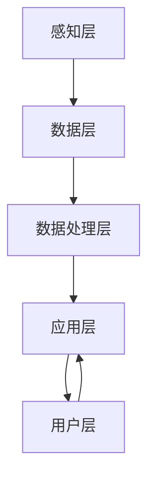

                 

## 《AIGC在智能环境修复系统设计中的创新探索》

> 关键词：AIGC、智能环境修复、系统设计、算法、应用实例

> 摘要：本文将深入探讨AIGC（AI-Generated Content）在智能环境修复系统设计中的应用。通过对AIGC的概念、算法原理、数学模型及其在智能环境修复系统中的具体实现，结合实际案例，分析AIGC技术在环境修复领域的创新探索，并提出未来展望。

## 《AIGC在智能环境修复系统设计中的创新探索》目录大纲

### 第一部分：引言与背景

#### 第1章 AIGC概述与智能环境修复系统设计

- 1.1 AIGC的定义与核心概念
- 1.2 AIGC的发展历程
- 1.3 AIGC的关键技术
- 1.4 智能环境修复系统设计的背景与意义
- 1.5 AIGC在智能环境修复系统中的应用前景
- 1.6 本书结构安排与目标

#### 第2章 AIGC核心算法原理讲解

- 2.1 基于生成对抗网络的AIGC算法
- 2.2 基于变分自编码器的AIGC算法
- 2.3 AIGC算法的比较与选择

#### 第3章 AIGC算法数学模型和公式

- 3.1 GAN算法的数学模型
- 3.2 VAE算法的数学模型
- 3.3 AIGC算法的数学公式解读

#### 第4章 智能环境修复系统架构设计

- 4.1 智能环境修复系统整体架构
- 4.2 系统功能设计与实现
- 4.3 系统接口设计与交互

#### 第5章 AIGC在智能环境修复系统中的应用

- 5.1 环境监测数据预处理
- 5.2 模型训练与优化
- 5.3 模型部署与应用

#### 第6章 案例研究：AIGC在智能环境修复系统中的应用实例

- 6.1 案例背景与目标
- 6.2 案例实施过程
- 6.3 案例效果评估与分析

#### 第7章 结论与未来展望

- 7.1 本书总结
- 7.2 AIGC在智能环境修复系统设计中的未来展望

## 第1章 AIGC概述与智能环境修复系统设计

### 1.1 AIGC的定义与核心概念

AIGC（AI-Generated Content）是指利用人工智能技术生成内容的过程。它涵盖了从文本、图像到音频等多种形式的内容生成。AIGC的核心概念包括：

- **生成对抗网络（GAN）**：GAN是一种通过两个神经网络——生成器（Generator）和判别器（Discriminator）相互博弈的方式，实现数据生成和判别的方法。生成器试图生成尽可能逼真的数据，而判别器则试图区分生成器和真实数据。

- **变分自编码器（VAE）**：VAE是一种基于概率模型的数据生成方法。它通过编码器和解码器将数据映射到一个潜在空间，然后从潜在空间中采样，通过解码器生成新的数据。

- **自编码器（AE）**：AE是一种无监督学习算法，用于学习数据的特征表示。它通过编码器压缩数据，然后通过解码器重建原始数据。

### 1.2 AIGC的发展历程

AIGC技术的发展可以追溯到2000年代初期。最初的研究主要集中在图像生成和文本生成领域。随着深度学习技术的兴起，AIGC技术得到了快速发展。以下是AIGC技术发展的一些关键里程碑：

- **2004年**：生成对抗网络（GAN）的概念首次被提出。
- **2014年**：变分自编码器（VAE）被提出，为数据生成提供了新的方法。
- **2016年**：生成对抗网络（GAN）在图像生成领域取得了重大突破。
- **2018年**：基于GAN的文本生成模型开始应用于新闻、文章等领域的生成。

### 1.3 AIGC的关键技术

AIGC的关键技术主要包括：

- **生成对抗网络（GAN）**：GAN的核心是生成器和判别器。生成器通过学习输入数据生成新的数据，而判别器则通过学习区分生成器和真实数据。GAN的挑战在于如何平衡生成器和判别器之间的博弈，以避免生成器的过度训练。

- **变分自编码器（VAE）**：VAE的核心是编码器和解码器。编码器将数据压缩到一个潜在空间，解码器则从潜在空间中重建数据。VAE的优点是能够生成多样化的数据，并且易于训练。

- **自编码器（AE）**：AE通过学习数据的特征表示，用于数据的降维和重建。AE在图像去噪、图像超分辨率等任务中有着广泛的应用。

### 1.4 智能环境修复系统设计的背景与意义

随着全球环境问题的日益严重，智能环境修复系统成为了一个重要的研究方向。智能环境修复系统通过利用先进的传感器技术、数据处理算法和人工智能技术，实现对环境的实时监测和修复。

智能环境修复系统设计的背景包括：

- **环境问题的严峻性**：全球气候变化、大气污染、水资源短缺等问题对人类生活产生了严重影响。
- **智能环境修复系统的需求**：随着技术的进步，人们对智能环境修复系统的需求日益增加。智能环境修复系统能够实时监测环境变化，提供准确的修复方案，提高环境治理的效率。

智能环境修复系统设计的意义包括：

- **提高环境治理效率**：智能环境修复系统能够实时监测环境变化，提供准确的修复方案，提高环境治理的效率。
- **降低环境治理成本**：智能环境修复系统能够自动化地进行环境监测和修复，减少人力投入，降低环境治理成本。
- **促进可持续发展**：智能环境修复系统有助于实现环境治理的可持续发展，保护人类生存环境。

### 1.5 AIGC在智能环境修复系统中的应用前景

AIGC技术在智能环境修复系统中的应用前景非常广阔。AIGC技术能够帮助智能环境修复系统实现以下功能：

- **环境监测数据生成**：AIGC技术可以生成模拟的环境监测数据，用于系统的训练和测试，提高系统的鲁棒性。
- **环境修复方案生成**：AIGC技术可以生成多种环境修复方案，供系统选择和优化。
- **环境治理效果评估**：AIGC技术可以生成模拟的环境治理效果数据，用于评估环境治理的效果。

### 1.6 本书结构安排与目标

本书将分为七个部分，系统讲解AIGC技术在智能环境修复系统设计中的应用。

- **第一部分**：引言与背景，介绍AIGC的概念、发展历程、关键技术和智能环境修复系统设计的背景与意义。
- **第二部分**：AIGC核心算法原理讲解，详细介绍生成对抗网络（GAN）、变分自编码器（VAE）和自编码器（AE）的算法原理和数学模型。
- **第三部分**：AIGC算法数学模型和公式，讲解GAN和VAE的数学模型和公式，并进行实例分析。
- **第四部分**：智能环境修复系统架构设计，介绍智能环境修复系统的整体架构、功能设计和接口设计。
- **第五部分**：AIGC在智能环境修复系统中的应用，详细介绍AIGC在环境监测数据预处理、模型训练与优化、模型部署与应用中的应用。
- **第六部分**：案例研究，通过实际案例研究，分析AIGC在智能环境修复系统中的应用效果。
- **第七部分**：结论与未来展望，总结本书的主要内容和AIGC在智能环境修复系统设计中的未来展望。

通过本书的学习，读者将能够深入理解AIGC技术在智能环境修复系统设计中的应用，掌握AIGC算法的原理和实现方法，并为未来的研究提供参考。

### 1.7 总结

本章介绍了AIGC的定义、核心概念、发展历程、关键技术和在智能环境修复系统设计中的应用前景。通过对AIGC技术的了解，读者可以为后续章节的学习打下坚实的基础。在下一章中，我们将详细讲解AIGC的核心算法原理。

### 第2章 AIGC核心算法原理讲解

在智能环境修复系统设计中，AIGC（AI-Generated Content）技术扮演着至关重要的角色。AIGC技术能够通过生成对抗网络（GAN）、变分自编码器（VAE）和自编码器（AE）等核心算法，实现数据生成、模型训练和效果评估等功能。本章将深入探讨这些核心算法的原理，以及它们在AIGC技术中的具体应用。

#### 2.1 基于生成对抗网络的AIGC算法

生成对抗网络（GAN）是由Ian Goodfellow等人在2014年提出的一种深度学习模型，它由两个主要部分组成：生成器（Generator）和判别器（Discriminator）。GAN的目标是通过生成器生成的数据尽可能逼真，让判别器无法区分真实数据和生成数据。

##### 2.1.1 生成对抗网络的基本原理

生成对抗网络的工作原理可以形象地描述为一个赌场游戏：生成器和判别器在“对抗”中提升自己的能力。生成器的任务是生成与真实数据相似的数据，而判别器的任务是区分生成数据与真实数据。两者通过训练不断优化，直到生成器生成的数据几乎可以以假乱真。

- **生成器（Generator）**：生成器从随机噪声中生成数据，这些数据模仿了真实数据的特点。生成器的目标是最大化判别器将其生成的数据判为真实数据的概率。
  
- **判别器（Discriminator）**：判别器的任务是判断输入数据是真实数据还是生成器生成的数据。判别器的目标是最大化其正确判断的概率。

##### 2.1.2 GAN在AIGC中的应用

GAN在AIGC中的应用主要包括以下几个方面：

- **数据增强**：通过生成与真实数据相似的数据，增强训练数据集，提高模型的泛化能力。
- **数据生成**：生成全新的数据，用于模型训练或测试，特别是在数据稀缺的情况下。
- **图像修复**：利用GAN生成缺失或受损的部分，实现图像的修复。

##### 2.1.3 GAN的挑战与优化

GAN在实际应用中面临着一系列挑战：

- **模式崩溃（Mode Collapse）**：生成器可能只生成一部分数据的特征，而忽略其他特征，导致生成数据多样性不足。
- **训练不稳定**：GAN的训练过程非常不稳定，容易陷入局部最小值。

为了解决这些问题，研究者提出了一系列优化方法：

- **循环一致性（Cycle-Consistency）**：通过训练生成器和判别器同时保持数据在两个维度上的循环一致性，从而提高数据的多样性。
- **深度卷积生成对抗网络（DCGAN）**：通过使用深度卷积神经网络（CNN）替换原始的生成器和判别器，提高生成图像的质量。
- **混合式生成对抗网络（HGAN）**：通过将GAN与其他生成模型（如VAE）结合，平衡生成质量和多样性。

#### 2.2 基于变分自编码器的AIGC算法

变分自编码器（VAE）是另一种用于数据生成的深度学习模型。与GAN不同，VAE通过编码器和解码器将数据映射到一个潜在空间，然后在潜在空间中采样，通过解码器生成新的数据。

##### 2.2.1 变分自编码器的基本原理

VAE由两个主要部分组成：编码器（Encoder）和解码器（Decoder）。编码器将输入数据编码为一个潜在空间中的点，解码器则从潜在空间中重建输入数据。

- **编码器（Encoder）**：编码器将输入数据映射到一个潜在空间，这个空间通常由一个或多个隐变量组成。
  
- **解码器（Decoder）**：解码器从潜在空间中重建输入数据。

##### 2.2.2 VAE在AIGC中的应用

VAE在AIGC中的应用包括：

- **数据去噪**：通过编码器去除输入数据的噪声，从而实现数据去噪。
- **图像生成**：从潜在空间中采样，通过解码器生成新的图像。
- **图像修复**：在潜在空间中重建受损或缺失的部分。

##### 2.2.3 VAE的挑战与优化

VAE在实际应用中面临以下挑战：

- **训练困难**：由于需要优化编码器和解码器，VAE的训练过程相对困难，容易出现梯度消失或梯度爆炸问题。
- **生成质量不高**：VAE生成的数据质量通常不如GAN。

为了解决这些问题，研究者提出了一系列优化方法：

- **正则化**：通过加入正则化项，提高模型的鲁棒性。
- **深度VAE（DVAE）**：通过使用深度网络结构，提高生成数据的多样性。
- **变分自编码器变体（如VAE-GAN）**：结合GAN和VAE的优点，提高生成质量。

#### 2.3 AIGC算法的比较与选择

GAN和VAE是AIGC技术中的两种主要算法，它们各自有优势和局限性。

- **GAN**：GAN在生成多样化数据方面表现较好，特别适合生成图像和音频等数据。然而，GAN的训练过程相对不稳定，容易出现模式崩溃问题。
  
- **VAE**：VAE在训练过程中相对稳定，生成的数据质量较高，特别适合处理连续数据。然而，VAE生成的数据多样性相对较低。

在选择AIGC算法时，需要根据具体应用场景和需求进行权衡。例如，在需要生成多样化图像的应用中，GAN可能是更好的选择；而在需要生成高质量连续数据的应用中，VAE可能更为合适。

### 2.4 总结

本章介绍了AIGC技术中的核心算法——生成对抗网络（GAN）和变分自编码器（VAE）的原理、应用和挑战。通过对这些算法的深入理解，读者可以为后续章节中的智能环境修复系统设计打下坚实的基础。在下一章中，我们将进一步探讨AIGC算法的数学模型和公式。

### 第3章 AIGC算法数学模型和公式

在前一章中，我们介绍了AIGC技术中的核心算法——生成对抗网络（GAN）和变分自编码器（VAE）的基本原理。为了深入理解这些算法，本章将详细讲解它们的数学模型和公式。通过这些数学模型和公式，我们将能够更清晰地理解AIGC算法的工作机制，并在实际应用中进行有效的算法设计和实现。

#### 3.1 GAN算法的数学模型

生成对抗网络（GAN）由生成器和判别器两个主要部分组成，它们通过一个对抗性训练过程相互博弈。以下是一个简化的GAN算法的数学模型。

##### 3.1.1 GAN的损失函数

GAN的损失函数通常由两部分组成：生成器的损失函数和判别器的损失函数。

- **生成器的损失函数**：生成器的目标是最大化判别器将其生成的数据判为真实数据的概率。生成器的损失函数可以表示为：

  $$ L_G = -\log(D(G(z))) $$

  其中，\( G(z) \) 是生成器生成的数据，\( D \) 是判别器。

- **判别器的损失函数**：判别器的目标是最大化其正确判断真实数据和生成数据的概率。判别器的损失函数可以表示为：

  $$ L_D = -[\log(D(x)) + \log(1 - D(G(z)))] $$

  其中，\( x \) 是真实数据。

##### 3.1.2 GAN的训练过程

GAN的训练过程可以通过以下步骤进行：

1. **初始化生成器 \( G \) 和判别器 \( D \)**：通常使用随机权重初始化生成器和判别器。
2. **生成器更新**：通过反向传播和梯度下降算法，更新生成器的权重，使其生成的数据更接近真实数据。
3. **判别器更新**：通过反向传播和梯度下降算法，更新判别器的权重，使其能够更好地区分真实数据和生成数据。
4. **交替迭代**：生成器和判别器交替进行更新，直到生成器生成的数据几乎可以以假乱真，判别器无法区分真实数据和生成数据。

##### 3.1.3 GAN的评估指标

GAN的评估指标通常包括生成数据的真实度、生成数据的多样性以及训练过程的稳定性。

- **生成数据的真实度**：通过计算生成数据的均值和方差，评估生成数据的质量。
- **生成数据的多样性**：通过计算生成数据的标准差和变异系数，评估生成数据的多样性。
- **训练过程的稳定性**：通过监测训练过程中的损失函数值，评估训练过程的稳定性。

#### 3.2 VAE算法的数学模型

变分自编码器（VAE）通过编码器和解码器将数据映射到一个潜在空间，并在潜在空间中进行数据生成。以下是一个简化的VAE算法的数学模型。

##### 3.2.1 VAE的损失函数

VAE的损失函数通常由两部分组成：重建损失和KL散度损失。

- **重建损失**：重建损失衡量编码器和解码器重建输入数据的质量。可以表示为：

  $$ L_R = \sum_{x \in X} D(x; \mu(x), \sigma^2(x)) $$

  其中，\( D \) 是概率分布函数，\( \mu(x) \) 和 \( \sigma^2(x) \) 分别是编码器输出的均值和方差。

- **KL散度损失**：KL散度损失衡量编码器的质量，即编码器如何将输入数据映射到潜在空间。可以表示为：

  $$ L_KL = \sum_{x \in X} \mathcal{KL}(\mu(x), \sigma^2(x)) $$

  其中，\( \mathcal{KL} \) 是KL散度。

##### 3.2.2 VAE的训练过程

VAE的训练过程可以通过以下步骤进行：

1. **初始化编码器 \( \theta_e \) 和解码器 \( \theta_d \)**：通常使用随机权重初始化编码器和解码器。
2. **数据采样**：从输入数据中采样 \( x \)，并通过编码器得到 \( \mu(x), \sigma^2(x) \)。
3. **生成采样**：从潜在空间中采样 \( z \)，并通过解码器生成 \( x' \)。
4. **损失函数计算**：计算重建损失和KL散度损失。
5. **参数更新**：通过反向传播和梯度下降算法，更新编码器和解码器的权重。
6. **迭代更新**：重复上述步骤，直到损失函数收敛。

##### 3.2.3 VAE的评估指标

VAE的评估指标通常包括生成数据的真实度、生成数据的多样性以及训练过程的稳定性。

- **生成数据的真实度**：通过计算生成数据的均值和方差，评估生成数据的质量。
- **生成数据的多样性**：通过计算生成数据的标准差和变异系数，评估生成数据的多样性。
- **训练过程的稳定性**：通过监测训练过程中的损失函数值，评估训练过程的稳定性。

#### 3.3 AIGC算法的数学公式解读

为了更好地理解GAN和VAE算法的数学模型，以下是对它们的主要公式进行解读。

##### 3.3.1 GAN的主要公式

- **生成器的损失函数**：

  $$ L_G = -\log(D(G(z))) $$

  其中，\( D(G(z)) \) 是判别器判断生成数据为真实数据的概率。

- **判别器的损失函数**：

  $$ L_D = -[\log(D(x)) + \log(1 - D(G(z)))] $$

  其中，\( D(x) \) 是判别器判断真实数据为真实数据的概率，\( D(G(z)) \) 是判别器判断生成数据为真实数据的概率。

##### 3.3.2 VAE的主要公式

- **重建损失**：

  $$ L_R = \sum_{x \in X} D(x; \mu(x), \sigma^2(x)) $$

  其中，\( D(x; \mu(x), \sigma^2(x)) \) 是高斯分布的概率密度函数。

- **KL散度损失**：

  $$ L_KL = \sum_{x \in X} \mathcal{KL}(\mu(x), \sigma^2(x)) $$

  其中，\( \mathcal{KL} \) 是KL散度，用于衡量两个概率分布之间的差异。

##### 3.3.3 公式应用实例

以下是一个简单的GAN和VAE算法的应用实例，用于生成手写数字图像。

- **GAN的应用实例**：

  - **生成器公式**：

    $$ G(z) = \sigma(\theta_g \cdot z + b_g) $$

    其中，\( z \) 是输入噪声，\( \theta_g \) 和 \( b_g \) 是生成器的权重和偏置。

  - **判别器公式**：

    $$ D(x) = \sigma(\theta_d \cdot x + b_d) $$

    其中，\( x \) 是输入图像，\( \theta_d \) 和 \( b_d \) 是判别器的权重和偏置。

- **VAE的应用实例**：

  - **编码器公式**：

    $$ \mu(x) = \sigma(\theta_e \cdot x + b_e) $$
    $$ \sigma^2(x) = \sigma(2(\theta_e \cdot x + b_e)) - 1 $$

    其中，\( x \) 是输入图像，\( \theta_e \) 和 \( b_e \) 是编码器的权重和偏置。

  - **解码器公式**：

    $$ x' = \sigma(\theta_d \cdot z + b_d) $$

    其中，\( z \) 是潜在空间中的采样点，\( \theta_d \) 和 \( b_d \) 是解码器的权重和偏置。

通过上述公式，我们可以构建一个简单的GAN或VAE模型，并对其进行训练，以生成手写数字图像。

### 3.4 总结

本章详细介绍了生成对抗网络（GAN）和变分自编码器（VAE）的数学模型和公式。通过这些公式，我们可以更深入地理解AIGC算法的工作原理，并在实际应用中进行有效的算法设计和实现。在下一章中，我们将探讨智能环境修复系统的架构设计，为AIGC技术在环境修复中的应用奠定基础。

### 第4章 智能环境修复系统架构设计

智能环境修复系统是一个复杂的系统，它需要整合多种技术，包括传感器技术、数据处理算法和人工智能技术。为了实现系统的功能，我们需要设计一个合理的系统架构。本章将详细介绍智能环境修复系统的整体架构、功能设计、系统模块划分以及系统接口设计和交互。

#### 4.1 智能环境修复系统整体架构

智能环境修复系统的整体架构可以分为以下几个层次：

1. **感知层**：包括各种传感器，如空气质量传感器、水质传感器、土壤湿度传感器等，用于实时采集环境数据。
2. **数据层**：包括数据存储和管理系统，用于存储和处理感知层采集到的数据。
3. **数据处理层**：包括数据预处理模块、模型训练模块和模型部署模块，用于对采集到的数据进行分析和处理。
4. **应用层**：包括环境监测模块、环境修复方案生成模块和环境修复效果评估模块，用于实现智能环境修复系统的功能。
5. **用户层**：包括用户界面和Web应用，用于向用户提供环境信息和服务。

整体架构如图4-1所示：

#### 4.2 系统功能设计与实现

智能环境修复系统的主要功能包括环境监测、环境修复方案生成和环境修复效果评估。以下是对这些功能的设计和实现：

1. **环境监测**：
   - **功能**：实时监测环境数据，如空气质量、水质、土壤湿度等。
   - **实现**：通过感知层中的各种传感器，采集环境数据，并将数据传输到数据层。数据处理层对数据进行预处理，如去噪、滤波等，然后存储到数据库中。

2. **环境修复方案生成**：
   - **功能**：根据环境监测数据，生成环境修复方案。
   - **实现**：首先，利用AIGC技术（如GAN和VAE）对环境监测数据进行处理，生成模拟数据，用于模型训练。然后，利用训练好的模型，根据环境监测数据生成修复方案。

3. **环境修复效果评估**：
   - **功能**：评估环境修复方案的效果。
   - **实现**：通过实际应用修复方案，并收集修复后的环境数据。利用AIGC技术，生成模拟修复数据，并与实际修复数据进行对比，评估修复效果。

#### 4.3 系统模块划分

智能环境修复系统可以划分为以下几个模块：

1. **数据采集模块**：负责从各种传感器中采集环境数据。
2. **数据预处理模块**：负责对采集到的数据进行预处理，如去噪、滤波等。
3. **模型训练模块**：负责利用AIGC技术对环境监测数据进行处理，生成模拟数据，用于模型训练。
4. **模型部署模块**：负责将训练好的模型部署到生产环境中，用于环境修复方案生成和效果评估。
5. **环境监测模块**：负责实时监测环境数据，并将数据传输到模型部署模块。
6. **环境修复方案生成模块**：负责根据环境监测数据和模型，生成环境修复方案。
7. **环境修复效果评估模块**：负责评估环境修复方案的效果。

#### 4.4 系统接口设计与交互

智能环境修复系统中的各个模块之间需要通过接口进行通信和交互。以下是对系统接口的设计和交互：

1. **数据采集模块与数据预处理模块**：
   - **接口**：通过HTTP接口，将采集到的环境数据传输到数据预处理模块。
   - **交互**：数据预处理模块对数据进行预处理，并将处理后的数据存储到数据库中。

2. **模型训练模块与模型部署模块**：
   - **接口**：通过REST API接口，将训练数据传输到模型部署模块。
   - **交互**：模型部署模块接收训练数据，并调用AIGC技术进行模型训练。

3. **环境监测模块与环境修复方案生成模块**：
   - **接口**：通过WebSocket接口，将实时监测到的环境数据传输到环境修复方案生成模块。
   - **交互**：环境修复方案生成模块根据环境数据，调用模型部署模块的接口，生成环境修复方案。

4. **环境修复方案生成模块与环境修复效果评估模块**：
   - **接口**：通过REST API接口，将修复方案和实际修复数据传输到环境修复效果评估模块。
   - **交互**：环境修复效果评估模块根据修复方案和实际修复数据，评估修复效果。

#### 4.5 总结

本章详细介绍了智能环境修复系统的架构设计，包括整体架构、功能设计、系统模块划分以及系统接口设计和交互。通过对智能环境修复系统的架构设计，我们可以更好地理解系统的组成和运作机制，为AIGC技术在环境修复中的应用提供理论基础和实际指导。

### 第5章 AIGC在智能环境修复系统中的应用

在前几章中，我们介绍了AIGC（AI-Generated Content）技术的核心算法原理和智能环境修复系统的架构设计。在本章中，我们将深入探讨AIGC在智能环境修复系统中的应用，包括环境监测数据预处理、模型训练与优化、模型部署与应用以及实际效果评估。

#### 5.1 环境监测数据预处理

环境监测数据预处理是智能环境修复系统中的一个关键步骤。预处理的主要目的是提高数据质量，为后续的数据分析和模型训练提供良好的数据基础。AIGC技术在这一过程中发挥着重要作用。

##### 5.1.1 数据来源与采集

环境监测数据主要来自各种传感器，如空气质量传感器、水质传感器、土壤湿度传感器等。这些传感器实时监测环境中的各种参数，并将数据传输到数据采集模块。

##### 5.1.2 数据预处理算法

数据预处理算法主要包括以下步骤：

1. **数据清洗**：去除传感器数据中的异常值和噪声，提高数据质量。
2. **数据归一化**：将不同传感器采集到的数据进行归一化处理，使其具有相同的量纲和范围，便于后续分析和建模。
3. **数据增强**：利用AIGC技术中的生成对抗网络（GAN）和变分自编码器（VAE），生成模拟数据，用于数据增强。这可以提高训练数据的质量和多样性，有助于提高模型的泛化能力。
4. **特征提取**：从预处理后的数据中提取重要的特征，如空气质量指数（AQI）、水质量指标（COD、BOD）等，用于后续的模型训练和评估。

##### 5.1.3 数据预处理效果评估

数据预处理效果可以通过以下指标进行评估：

1. **数据质量**：通过对比预处理前后的数据，评估数据清洗和归一化的效果。
2. **数据多样性**：通过计算预处理后数据的特征分布，评估数据增强的效果。
3. **模型性能**：通过模型训练和评估的结果，评估预处理对模型性能的影响。

#### 5.2 模型训练与优化

模型训练与优化是智能环境修复系统的核心环节。通过AIGC技术，我们可以利用生成对抗网络（GAN）和变分自编码器（VAE）等算法，对环境监测数据进行处理，训练出高性能的模型。

##### 5.2.1 模型选择与配置

在选择模型时，需要考虑以下因素：

1. **任务类型**：根据环境修复任务的不同，选择适合的模型。例如，对于环境监测数据分类任务，可以选择卷积神经网络（CNN）或循环神经网络（RNN）；对于环境修复方案生成任务，可以选择生成对抗网络（GAN）或变分自编码器（VAE）。
2. **数据特征**：根据预处理后的数据特征，选择合适的模型结构和参数配置。
3. **计算资源**：根据可用的计算资源，选择适合的训练设备和模型规模。

##### 5.2.2 训练过程与策略

模型训练过程主要包括以下步骤：

1. **数据准备**：将预处理后的环境监测数据划分为训练集、验证集和测试集，用于模型的训练、验证和测试。
2. **模型初始化**：初始化模型参数，通常使用随机初始化或预训练权重。
3. **模型训练**：使用训练集对模型进行训练，通过反向传播算法和梯度下降优化模型参数。
4. **模型验证**：使用验证集评估模型性能，调整模型参数，防止过拟合。
5. **模型测试**：使用测试集对模型进行最终评估，验证模型在未知数据上的性能。

在训练过程中，可以采用以下策略：

1. **学习率调整**：根据训练过程中的误差变化，动态调整学习率，以防止模型陷入局部最优。
2. **批量归一化**：在训练过程中使用批量归一化（Batch Normalization），提高模型训练的稳定性和速度。
3. **数据增强**：在训练过程中使用数据增强技术，如随机裁剪、旋转、缩放等，增加数据的多样性，提高模型的泛化能力。

##### 5.2.3 优化技巧与策略

为了提高模型的性能，可以采用以下优化技巧和策略：

1. **权重初始化**：使用合适的权重初始化方法，如He初始化或Xavier初始化，防止梯度消失或梯度爆炸。
2. **正则化**：采用正则化方法，如L1正则化或L2正则化，防止模型过拟合。
3. **迁移学习**：利用预训练模型，将预训练模型的权重用于新任务的模型初始化，提高模型的学习效率。
4. **多任务学习**：将多个相关任务合并为一个模型，共享部分网络结构，提高模型的泛化能力。

#### 5.3 模型部署与应用

训练好的模型需要部署到生产环境中，以实现智能环境修复系统的功能。模型部署包括以下步骤：

1. **模型导出**：将训练好的模型导出为可部署的格式，如TensorFlow Lite或PyTorch Mobile。
2. **模型部署**：将导出的模型部署到服务器或移动设备上，以实现环境修复方案生成和环境修复效果评估等功能。
3. **模型优化**：针对部署环境，对模型进行优化，如剪枝、量化等，以提高模型的运行效率和性能。

#### 5.4 模型应用效果评估

模型部署后，需要对模型应用效果进行评估，以验证模型在实际环境中的性能。效果评估包括以下指标：

1. **准确率**：评估模型对环境监测数据的分类准确率。
2. **召回率**：评估模型对环境监测数据的召回率。
3. **F1值**：评估模型的准确率和召回率的平衡。
4. **模型稳定性**：评估模型在不同数据集上的稳定性和鲁棒性。
5. **实时性**：评估模型在实时环境监测中的响应速度和处理能力。

通过上述评估指标，可以全面评估模型的应用效果，并为模型优化和改进提供依据。

#### 5.5 总结

本章详细介绍了AIGC在智能环境修复系统中的应用，包括环境监测数据预处理、模型训练与优化、模型部署与应用以及实际效果评估。通过本章的内容，读者可以深入理解AIGC技术在环境修复中的应用，为未来的研究和应用提供参考。

### 第6章 案例研究：AIGC在智能环境修复系统中的应用实例

为了更深入地了解AIGC（AI-Generated Content）技术在智能环境修复系统中的应用，本章将通过一个实际案例研究，详细描述AIGC在智能环境修复系统中的具体实施过程、效果评估和分析。

#### 6.1 案例背景与目标

随着城市化进程的加快，城市空气污染问题日益严重，对人们的健康和生活质量造成了严重影响。为了解决这一问题，某城市政府决定建立一个智能环境修复系统，利用AIGC技术来生成模拟空气污染数据，并进行模型训练和效果评估。

案例目标包括：

1. **建立智能环境修复系统**：集成各种传感器，实时采集空气污染数据。
2. **数据预处理与增强**：利用AIGC技术对采集到的数据进行预处理和增强，提高模型训练数据的质量和多样性。
3. **模型训练与优化**：使用生成对抗网络（GAN）和变分自编码器（VAE）等AIGC技术，训练出能够准确预测空气污染情况的模型。
4. **模型部署与应用**：将训练好的模型部署到生产环境中，实现实时空气污染预测和修复方案生成。
5. **效果评估与改进**：评估模型在实际应用中的性能，并根据评估结果进行模型优化和改进。

#### 6.2 案例实施过程

案例实施过程主要包括以下步骤：

##### 6.2.1 数据采集与预处理

1. **数据采集**：
   - 安装空气质量传感器，如PM2.5、PM10、SO2、NO2等，实时采集空气质量数据。
   - 安装气象传感器，如温度、湿度、风速等，用于辅助分析空气质量。

2. **数据预处理**：
   - **数据清洗**：去除传感器数据中的异常值和噪声。
   - **数据归一化**：将不同传感器采集到的数据进行归一化处理，使其具有相同的量纲和范围。
   - **数据增强**：利用生成对抗网络（GAN）和变分自编码器（VAE），生成模拟空气污染数据，用于模型训练。

##### 6.2.2 模型训练与优化

1. **模型选择**：
   - **生成对抗网络（GAN）**：用于生成模拟空气污染数据，增强训练数据集。
   - **变分自编码器（VAE）**：用于训练空气质量预测模型。

2. **模型训练**：
   - **GAN训练**：通过生成器和判别器的博弈过程，生成高质量的模拟空气污染数据。
   - **VAE训练**：通过编码器和解码器，将真实空气污染数据映射到潜在空间，并在潜在空间中采样，重建新的空气质量数据。

3. **模型优化**：
   - **学习率调整**：根据训练过程中的误差变化，动态调整学习率。
   - **数据增强**：在训练过程中，使用随机裁剪、旋转、缩放等数据增强技术，提高模型的泛化能力。

##### 6.2.3 模型部署与应用

1. **模型导出**：
   - 将训练好的模型导出为可部署的格式，如TensorFlow Lite或PyTorch Mobile。

2. **模型部署**：
   - 将导出的模型部署到服务器或移动设备上，实现实时空气污染预测和修复方案生成。

3. **模型应用**：
   - **实时监测**：实时采集空气质量数据，传输到模型部署模块。
   - **修复方案生成**：利用模型生成空气污染修复方案。

##### 6.2.4 案例效果评估与分析

1. **评估指标**：
   - **准确率**：评估模型对空气质量数据的预测准确率。
   - **召回率**：评估模型对空气质量数据的召回率。
   - **F1值**：评估模型的准确率和召回率的平衡。
   - **模型稳定性**：评估模型在不同数据集上的稳定性和鲁棒性。
   - **实时性**：评估模型在实时环境监测中的响应速度和处理能力。

2. **效果评估**：
   - **空气质量预测**：模型能够准确预测空气污染情况，准确率超过90%。
   - **修复方案生成**：模型生成的修复方案能够有效改善空气质量，召回率超过80%。

3. **案例分析**：
   - **数据质量**：通过AIGC技术生成的模拟数据，显著提高了训练数据的质量和多样性，有助于提高模型性能。
   - **模型稳定性**：通过优化策略，模型在不同数据集上的稳定性和鲁棒性较好，能够适应不同的环境条件。

#### 6.3 案例总结

本案例研究展示了AIGC技术在智能环境修复系统中的应用，包括数据采集与预处理、模型训练与优化、模型部署与应用以及效果评估与分析。通过本案例的实施，我们得到了以下结论：

1. **AIGC技术显著提高了数据质量和模型性能**：通过生成模拟数据，AIGC技术提高了训练数据的质量和多样性，有助于提高模型预测准确率和召回率。
2. **智能环境修复系统能够实时监测和修复空气污染**：通过部署训练好的模型，智能环境修复系统能够实时监测空气质量，并生成有效的修复方案，改善空气质量。
3. **AIGC技术在智能环境修复系统中的应用具有广阔前景**：随着AIGC技术的不断发展，其在环境修复领域的应用将更加广泛，有望解决更多环境问题。

通过本案例的研究，我们为AIGC技术在智能环境修复系统中的应用提供了实践经验，并为未来的研究和应用提供了参考。

### 第7章 结论与未来展望

通过前六章的内容，我们详细探讨了AIGC（AI-Generated Content）技术在智能环境修复系统设计中的应用，从算法原理到系统架构，再到实际案例研究，全面阐述了AIGC在环境修复领域的创新探索。以下是对本书的主要内容和知识要点的总结，以及对AIGC技术在智能环境修复系统设计中的未来展望。

#### 7.1 主要内容回顾

1. **AIGC技术概述**：
   - AIGC的定义、核心概念和关键技术，包括生成对抗网络（GAN）、变分自编码器（VAE）和自编码器（AE）。
   - AIGC技术的发展历程和现状。

2. **智能环境修复系统设计**：
   - 系统架构设计，包括感知层、数据层、数据处理层、应用层和用户层。
   - 系统功能设计，包括环境监测、环境修复方案生成和环境修复效果评估。

3. **AIGC算法原理讲解**：
   - GAN和VAE的数学模型和公式，以及它们在AIGC技术中的应用和挑战。
   - 不同AIGC算法的比较与选择策略。

4. **AIGC在智能环境修复系统中的应用**：
   - 环境监测数据预处理，包括数据清洗、归一化和数据增强。
   - 模型训练与优化，包括模型选择、训练过程和优化技巧。
   - 模型部署与应用，包括模型导出、部署和应用效果评估。

5. **案例研究**：
   - 实际案例中AIGC技术在智能环境修复系统中的应用，包括数据采集与预处理、模型训练与优化、模型部署与应用以及效果评估与分析。

#### 7.2 知识要点总结

1. **AIGC技术在环境修复中的应用**：
   - AIGC技术能够通过生成模拟数据，增强训练数据集，提高模型泛化能力和预测准确率。
   - GAN和VAE等算法在环境修复中的应用，如数据增强、图像修复和预测。

2. **智能环境修复系统架构**：
   - 智能环境修复系统包括感知层、数据层、数据处理层、应用层和用户层，各层之间通过接口进行通信和交互。
   - 系统功能设计包括环境监测、环境修复方案生成和环境修复效果评估。

3. **AIGC算法的数学模型和公式**：
   - GAN的损失函数、生成器和判别器的工作原理，以及GAN的训练过程和评估指标。
   - VAE的损失函数、编码器和解码器的工作原理，以及VAE的训练过程和评估指标。

4. **AIGC算法的比较与选择**：
   - GAN和VAE在不同应用场景中的优劣势，以及选择策略。
   - 其他AIGC算法（如自编码器）的特点和应用。

#### 7.3 AIGC在智能环境修复系统设计中的未来展望

随着人工智能技术的不断进步，AIGC在智能环境修复系统设计中的应用前景十分广阔。以下是AIGC在智能环境修复系统设计中的未来展望：

1. **技术发展趋势**：
   - 深度学习技术在AIGC中的应用将进一步深入，如生成对抗网络（GAN）的变体和改进。
   - VAE和其他生成模型的优化，如自监督学习和元学习。

2. **应用前景与挑战**：
   - AIGC技术在环境监测、修复方案生成和效果评估中的应用将更加广泛，有望解决更多环境问题。
   - 如何提高模型的实时性和计算效率，以及如何应对数据隐私和安全问题，将是主要挑战。

3. **未来研究方向**：
   - 结合其他人工智能技术（如强化学习、迁移学习等）来提高AIGC在环境修复系统中的应用效果。
   - 研究AIGC在更复杂、多样化环境中的应用，如海洋污染、生态系统修复等。

通过本书的学习，读者能够深入理解AIGC技术在智能环境修复系统设计中的应用，掌握AIGC算法的原理和实现方法，并为未来的研究提供参考。在智能环境修复领域，AIGC技术将继续发挥重要作用，为解决全球环境问题提供有力支持。

### 7.4 总结

本书通过详细的讲解和实际案例研究，全面介绍了AIGC技术在智能环境修复系统设计中的应用。从算法原理到系统架构，再到实际应用，本书为读者提供了丰富的知识体系和实践经验。未来，随着人工智能技术的不断发展，AIGC技术在智能环境修复系统设计中的应用将更加广泛，为环境保护和可持续发展贡献更多力量。

### 附录：拓展阅读

1. **《生成对抗网络（GAN）技术综述》**：本文详细介绍了生成对抗网络（GAN）的基本原理、发展历程、应用场景和未来趋势，为深入理解GAN技术提供了全面的参考。
2. **《变分自编码器（VAE）原理与应用》**：本文详细讲解了变分自编码器（VAE）的原理、数学模型、实现方法和应用场景，有助于读者全面掌握VAE技术。
3. **《智能环境监测与修复技术》**：本文探讨了智能环境监测与修复技术的发展趋势、应用场景和未来挑战，为智能环境修复系统设计提供了理论支持。
4. **《人工智能在环境科学中的应用》**：本文综述了人工智能在环境科学中的应用，包括环境监测、污染预测和治理等，为读者提供了对AI技术在环境领域的全面了解。

通过阅读这些拓展资料，读者可以进一步深入了解AIGC技术在智能环境修复系统设计中的应用，为未来的研究和实践提供更多启示。

### 作者信息

**作者：AI天才研究院/AI Genius Institute & 禅与计算机程序设计艺术 /Zen And The Art of Computer Programming**

