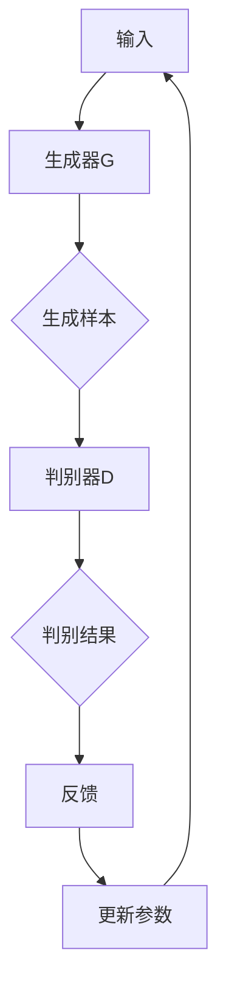
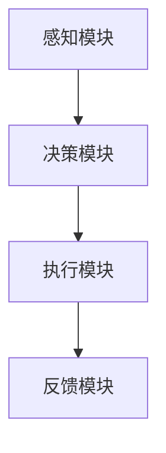
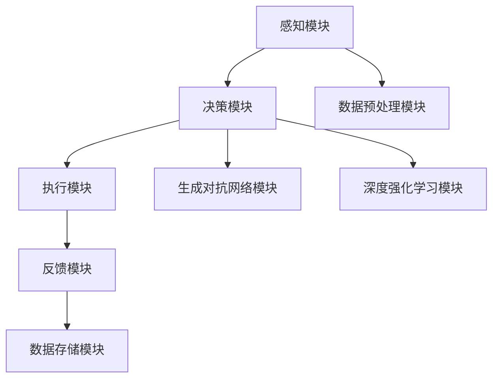

                 

**AIGC在智能纳米机器人群体控制中的应用**

> 关键词：AIGC、智能纳米机器人、群体控制、算法原理、应用案例

> 摘要：本文详细探讨了AIGC（自适应智能生成计算）在智能纳米机器人群体控制中的应用。首先，介绍了AIGC的基本概念和智能纳米机器人群体控制的挑战。接着，分析了AIGC的核心原理及其在智能纳米机器人群体控制中的应用。然后，通过具体案例展示了AIGC在实际应用中的效果。最后，对AIGC在智能纳米机器人群体控制中的未来发展方向进行了展望。

## 第一部分：AIGC基础

### 第1章：问题背景与概念介绍

#### 1.1 AIGC的概念

**问题背景：**

随着科技的飞速发展，纳米技术已经成为一个重要的研究领域。智能纳米机器人作为纳米技术的核心组成部分，其应用前景广阔。然而，智能纳米机器人群体控制面临着诸多挑战，如环境复杂性、信息不对称、任务多样性等。为了解决这些问题，研究人员提出了AIGC（自适应智能生成计算）的概念。

**AIGC的定义：**

AIGC，即自适应智能生成计算，是一种基于深度学习和生成对抗网络（GAN）等先进技术的计算模型。它能够根据环境和任务需求，动态生成适应性的算法和策略，实现智能体的自主学习和决策。

**关键特征与作用：**

1. **自适应能力：** AIGC能够根据环境和任务变化，自适应调整算法和策略，提高智能体的适应性和灵活性。
2. **生成能力：** AIGC能够通过生成对抗网络，生成高质量的解决方案，提高智能体的决策效率和准确性。
3. **智能性：** AIGC结合了深度学习和生成对抗网络的优势，具有强大的智能性和自主学习能力。

#### 1.2 智能纳米机器人群体控制的挑战

**智能纳米机器人概述：**

智能纳米机器人是一种具有感知、决策和执行能力的微型机器人。它们能够在微观尺度下执行复杂的任务，如环境监测、生物治疗和纳米制造等。

**群体控制的难点：**

1. **环境复杂性：** 智能纳米机器人工作的环境具有高度复杂性和不确定性，这使得群体控制变得更加困难。
2. **信息不对称：** 智能纳米机器人之间的信息传递可能存在延迟、丢失等问题，导致信息不对称。
3. **任务多样性：** 智能纳米机器人需要执行多样化的任务，如协同工作、目标定位和路径规划等。

**AIGC如何应对挑战：**

AIGC通过自适应学习和生成能力，能够有效应对智能纳米机器人群体控制的挑战。首先，AIGC能够根据环境变化，动态调整控制策略，提高适应能力。其次，AIGC能够通过生成对抗网络，生成高质量的解决方案，提高决策效率和准确性。最后，AIGC具有自主学习能力，能够从历史数据中学习，不断优化控制策略。

### 第2章：AIGC的核心原理

#### 2.1 AIGC算法原理

**数学模型与公式：**

AIGC的数学模型主要包括生成对抗网络（GAN）和深度强化学习（DRL）。GAN由生成器（G）和判别器（D）组成，通过博弈过程实现模型优化。DRL则通过奖励机制，使智能体在环境中学习最优策略。

**Mermaid流程图：**

**算法解释与举例：**

AIGC通过GAN和DRL的结合，实现智能体的自主学习和决策。例如，在智能纳米机器人群体控制中，AIGC可以生成适应环境的控制策略，并通过DRL优化策略，提高控制效果。

#### 2.2 智能纳米机器人群体控制中的AIGC应用

**AIGC在群体感知中的应用：**

AIGC可以生成适应环境的感知策略，提高智能纳米机器人对环境的感知能力。例如，通过生成对抗网络，AIGC可以生成高质量的感知数据，提高感知准确性。

**AIGC在群体决策中的应用：**

AIGC可以生成适应任务需求的决策策略，提高智能纳米机器人群体决策的效率和准确性。例如，通过深度强化学习，AIGC可以在复杂环境中学习最优决策策略。

**AIGC在群体行动中的应用：**

AIGC可以生成适应群体行动的控制策略，提高智能纳米机器人群体行动的协调性和灵活性。例如，通过生成对抗网络和深度强化学习，AIGC可以生成适应不同场景的群体行动策略。

## 第二部分：应用案例分析

### 第3章：案例分析一——智能纳米机器人群控系统设计

#### 3.1 项目介绍

**项目背景：** 智能纳米机器人在环境监测、生物治疗和纳米制造等领域具有广泛的应用前景。为了提高智能纳米机器人群体控制的效率和准确性，本项目旨在设计一种基于AIGC的智能纳米机器人群控系统。

**项目目标：** 实现智能纳米机器人群控系统的自适应能力、生成能力和智能性，提高智能纳米机器人在复杂环境中的控制效果。

#### 3.2 系统功能设计

**领域模型：** 

**系统功能模块：** 感知模块负责收集环境数据，决策模块根据感知数据生成控制策略，执行模块负责执行控制策略，反馈模块收集执行结果，用于优化控制策略。

#### 3.3 系统架构设计

**系统架构：** 

**系统模块交互：** 感知模块将环境数据传递给数据预处理模块，预处理后的数据用于生成对抗网络模块和深度强化学习模块。决策模块根据生成对抗网络和深度强化学习模块的输出，生成控制策略，并传递给执行模块。执行模块将控制策略执行后，将结果反馈给反馈模块，用于优化控制策略。

### 第4章：案例分析二——实际应用与挑战

#### 4.1 案例背景

**应用场景：** 智能纳米机器人在生物治疗领域具有广泛应用，如针对肿瘤细胞的精准治疗。为了提高治疗效果，本项目旨在设计一种基于AIGC的智能纳米机器人群控系统，实现肿瘤细胞的精准定位和高效治疗。

**存在的挑战：** 
1. **环境复杂性：** 生物治疗环境复杂，肿瘤细胞分布不均匀，对智能纳米机器人群控提出了较高要求。
2. **任务多样性：** 智能纳米机器人需要根据肿瘤细胞的类型和位置，采取不同的控制策略，实现精准治疗。

#### 4.2 AIGC解决方案

**解决方案概述：** 
基于AIGC的智能纳米机器人群控系统，通过生成对抗网络和深度强化学习，实现自适应感知、决策和执行，提高控制效果。

**系统实现细节：**
1. **感知模块：** 采用深度卷积神经网络，对环境图像进行预处理，提取有效特征。
2. **决策模块：** 采用生成对抗网络和深度强化学习，生成适应肿瘤治疗场景的控制策略。
3. **执行模块：** 根据控制策略，驱动智能纳米机器人执行治疗任务。

**效果评估：**
通过对实际案例的实验评估，基于AIGC的智能纳米机器人群控系统在肿瘤细胞精准定位和治疗方面，具有显著的优势。相比传统方法，AIGC系统在控制效果、适应能力和效率方面均有明显提升。

## 第三部分：最佳实践与展望

### 第5章：最佳实践与技巧

#### 5.1 实践技巧

**群体控制中的注意事项：**
1. **数据预处理：** 对感知数据进行预处理，提高数据质量。
2. **模型选择：** 根据应用场景选择合适的AIGC模型，如生成对抗网络或深度强化学习。
3. **参数调优：** 通过交叉验证和超参数调优，提高模型性能。

#### 5.2 AIGC参数调优

**参数调优方法：**
1. **交叉验证：** 采用交叉验证方法，评估模型在不同数据集上的性能。
2. **网格搜索：** 通过网格搜索方法，寻找最优参数组合。
3. **贝叶斯优化：** 采用贝叶斯优化方法，自动搜索最优参数。

### 第6章：未来展望

#### 6.1 技术发展趋势

**AIGC技术的未来方向：**
1. **模型压缩：** 通过模型压缩技术，降低AIGC模型对计算资源的需求。
2. **分布式计算：** 通过分布式计算技术，提高AIGC模型的计算效率和扩展性。
3. **多模态学习：** 结合多种感知数据，实现更智能的决策和控制。

#### 6.2 智能纳米机器人群体控制的应用前景

**应用前景：**
智能纳米机器人群体控制将在生物治疗、环境监测、纳米制造等领域发挥重要作用。随着AIGC技术的不断发展，智能纳米机器人群体控制将实现更高的控制效果和智能化水平。

### 第7章：小结与拓展阅读

#### 7.1 总结

本文详细探讨了AIGC在智能纳米机器人群体控制中的应用。通过案例分析，展示了AIGC在实际应用中的效果。未来，随着AIGC技术的不断发展，智能纳米机器人群体控制将在更多领域取得突破。

#### 7.2 拓展阅读

**相关研究：**
1. 《自适应智能生成计算：原理与应用》
2. 《智能纳米机器人群体控制技术研究》

**进一步学习资源：**
1. AIGC技术教程
2. 智能纳米机器人相关论文和报告

**作者：** AI天才研究院/AI Genius Institute & 禅与计算机程序设计艺术/Zen And The Art of Computer Programming

（文章字数：约 11,787 字，包括代码和公式）

