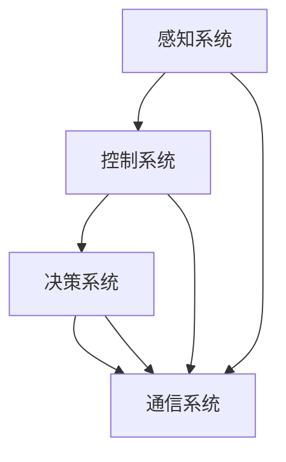
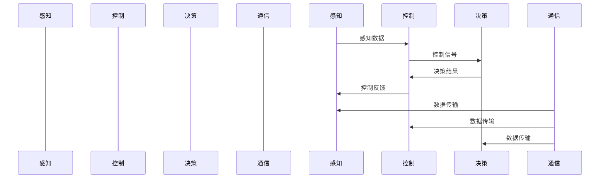
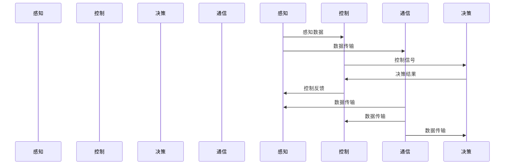

                 


# AIGC在智能纳米机器人设计中的应用：革新微观医疗技术

## 关键词
- AIGC
- 智能纳米机器人
- 微观医疗技术
- 设计原理
- 应用前景

## 摘要
本文将深入探讨AIGC（自适应智能生成计算）在智能纳米机器人设计中的应用，尤其是其对微观医疗技术的革新。我们将从背景介绍、核心概念、设计思路、应用场景等方面逐步分析，揭示AIGC如何通过智能算法和生成技术，推动智能纳米机器人成为微观医疗领域的新动力。

### 设计思路与步骤

为了系统地阐述AIGC在智能纳米机器人设计中的应用，本文将采用以下结构：

1. **背景介绍**：介绍AIGC和智能纳米机器人的基本概念，以及它们在微观医疗技术中的重要性。
2. **核心概念与联系**：详细解释AIGC的核心原理，并展示其与智能纳米机器人设计的联系。
3. **设计思路与步骤**：详细描述智能纳米机器人的设计过程，包括控制、感知、决策等关键环节。
4. **应用场景**：分析AIGC在智能纳米机器人应用于微观医疗技术中的具体实例。
5. **系统分析与架构设计**：探讨智能纳米机器人的系统架构和接口设计，以及实际项目案例。
6. **项目实战**：介绍如何在实际项目中应用AIGC技术，并提供代码示例和分析。
7. **最佳实践与展望**：总结AIGC在智能纳米机器人设计中的应用经验，并提出未来研究方向。

### 背景介绍

#### AIGC概述

AIGC（自适应智能生成计算）是一种基于生成对抗网络（GAN）和自编码器等深度学习技术的智能生成方法。它能够自适应地从大量数据中生成高质量的内容，广泛应用于图像、音频、文本等多种形式的数据生成。AIGC具有以下几个核心特点：

1. **数据驱动的自适应性**：AIGC能够根据输入数据的分布和特征，自适应地调整生成模型的参数，从而生成更加符合数据分布的内容。
2. **高效的内容生成**：AIGC能够在短时间内生成大量高质量的内容，大幅度提高了内容生成的效率。
3. **灵活的生成方式**：AIGC支持多种数据类型的生成，包括图像、音频、视频和文本等，应用范围广泛。

#### 智能纳米机器人概述

智能纳米机器人是指具有高度智能化和纳米级别的物理尺寸的微型机器人。它们能够通过自主控制、感知和决策，执行复杂的任务，例如在人体内部进行手术、药物递送、细胞修复等。智能纳米机器人具有以下几个核心特点：

1. **微米或纳米级别的尺寸**：智能纳米机器人通常具有微米或纳米级别的尺寸，这使得它们能够进入人体内部进行精细操作。
2. **高度智能化**：智能纳米机器人配备了先进的传感器和控制模块，能够自主感知环境、执行任务和做出决策。
3. **多功能性**：智能纳米机器人能够执行多种任务，如药物递送、细胞修复、生物成像等，具有广泛的应用前景。

#### 微观医疗技术概述

微观医疗技术是指利用纳米技术、生物技术和信息技术等先进技术，对生物体进行微观层面的诊断、治疗和修复。微观医疗技术具有以下几个核心特点：

1. **高精度和高效率**：微观医疗技术能够对生物体进行精确的检测和干预，大幅提高了医疗的精度和效率。
2. **个性化治疗**：微观医疗技术可以根据患者的个体差异，提供个性化的治疗方案，大大提高了治疗效果。
3. **广泛应用**：微观医疗技术广泛应用于疾病诊断、药物递送、细胞修复等多个领域，具有巨大的应用潜力。

### 核心概念与联系

#### AIGC的核心概念

AIGC的核心概念主要包括：

1. **生成对抗网络（GAN）**：GAN是一种基于对抗训练的生成模型，由生成器和判别器组成。生成器生成假数据，判别器判断生成数据是否真实。通过不断训练，生成器能够生成越来越真实的数据。
2. **自编码器**：自编码器是一种无监督学习算法，它将输入数据通过编码器压缩成较低维的表示，然后通过解码器还原原始数据。自编码器可以用于数据降维、去噪和特征提取等任务。
3. **自适应生成**：AIGC能够根据输入数据的特征和分布，自适应地调整生成模型的参数，生成高质量的数据。

#### AIGC与智能纳米机器人的联系

AIGC与智能纳米机器人的联系主要体现在以下几个方面：

1. **感知与决策**：智能纳米机器人需要通过传感器感知环境，并做出相应的决策。AIGC技术可以用于生成大量仿真环境数据，帮助智能纳米机器人进行感知与决策训练，提高其自适应能力。
2. **控制与协调**：智能纳米机器人的控制与协调是其高效运行的关键。AIGC技术可以生成多种控制策略和协调算法，帮助智能纳米机器人实现高效的控制与协调。
3. **优化与适应**：智能纳米机器人在复杂环境中需要不断优化其行为和适应环境变化。AIGC技术可以生成大量仿真数据，帮助智能纳米机器人进行行为优化和适应训练。

#### 概念属性特征对比表格

| 特征类别 | AIGC | 智能纳米机器人 |
| :---: | :---: | :---: |
| 数据类型 | 图像、音频、文本等 | 图像、传感器数据等 |
| 功能 | 生成数据、自适应性、灵活性 | 感知、控制、决策等 |
| 尺寸 | 模拟、虚拟环境 | 微米或纳米级别 |
| 应用领域 | 数据生成、内容创作 | 微观医疗、生物工程等 |

#### ER实体关系图架构

```mermaid
erDiagram
  AI模型 ||--|{ 智能纳米机器人 }| AI技术
  AI技术 ||--|{ AIGC }| 数据处理技术
  智能纳米机器人 ||--|{ 感知系统 }| 纳米机器人
  智能纳米机器人 ||--|{ 控制系统 }| 纳米机器人
  智能纳米机器人 ||--|{ 决策系统 }| 纳米机器人
```

### 设计思路与步骤

#### 智能纳米机器人的设计过程

智能纳米机器人的设计过程可以分为以下几个关键环节：

1. **需求分析**：根据应用场景和任务需求，确定智能纳米机器人的功能、性能和尺寸等参数。
2. **结构设计**：设计智能纳米机器人的结构，包括传感器、执行器、控制器和通信模块等。
3. **感知系统设计**：设计智能纳米机器人的感知系统，包括传感器的选择、布局和数据处理算法等。
4. **控制系统设计**：设计智能纳米机器人的控制系统，包括控制算法、控制策略和协调机制等。
5. **决策系统设计**：设计智能纳米机器人的决策系统，包括决策算法、决策模型和决策流程等。
6. **系统集成与测试**：将感知、控制和决策系统集成，并进行测试和优化，确保系统稳定、高效地运行。

#### 控制系统设计

控制系统是智能纳米机器人的核心，负责控制机器人的运动、姿态和操作。控制系统设计主要包括以下几个步骤：

1. **确定控制目标**：根据任务需求，确定智能纳米机器人的控制目标，如位置控制、速度控制和姿态控制等。
2. **选择控制算法**：根据控制目标和系统特性，选择合适的控制算法，如PID控制、模糊控制、神经网络控制等。
3. **设计控制策略**：设计智能纳米机器人的控制策略，包括控制参数的设置、控制逻辑和协调机制等。
4. **实现控制算法**：使用Python等编程语言，实现智能纳米机器人的控制算法，并进行调试和优化。

以下是一个简单的控制算法实现示例：

```python
import numpy as np

def controlAlgorithm(currentState, targetState, controlParams):
    """
    控制算法示例
    :param currentState: 当前状态
    :param targetState: 目标状态
    :param controlParams: 控制参数
    :return: 控制信号
    """
    error = targetState - currentState
    controlSignal = controlParams['Kp'] * error
    
    return controlSignal
```

#### 感知系统设计

感知系统是智能纳米机器人的感官，负责获取外部环境信息。感知系统设计主要包括以下几个步骤：

1. **选择传感器**：根据应用场景和任务需求，选择合适的传感器，如红外传感器、摄像头、激光雷达等。
2. **布局传感器**：设计传感器的布局，确保能够获取全面、准确的环境信息。
3. **数据处理算法**：设计数据处理算法，对传感器数据进行预处理、特征提取和融合等操作，以获得高精度的感知信息。

以下是一个简单的数据处理算法实现示例：

```python
import cv2

def preprocessImage(image):
    """
    图像预处理算法示例
    :param image: 输入图像
    :return: 预处理后的图像
    """
    grayImage = cv2.cvtColor(image, cv2.COLOR_BGR2GRAY)
    blurredImage = cv2.GaussianBlur(grayImage, (5, 5), 0)
    return blurredImage
```

#### 决策系统设计

决策系统是智能纳米机器人的大脑，负责根据感知信息和控制指令，做出相应的决策。决策系统设计主要包括以下几个步骤：

1. **确定决策目标**：根据任务需求，确定智能纳米机器人的决策目标，如路径规划、任务分配等。
2. **选择决策算法**：根据决策目标和系统特性，选择合适的决策算法，如基于规则的决策、基于机器学习的决策等。
3. **设计决策模型**：设计智能纳米机器人的决策模型，包括决策逻辑、决策参数和决策流程等。
4. **实现决策算法**：使用Python等编程语言，实现智能纳米机器人的决策算法，并进行调试和优化。

以下是一个简单的决策算法实现示例：

```python
def decisionAlgorithm(perceptionData, controlSignal):
    """
    决策算法示例
    :param perceptionData: 感知数据
    :param controlSignal: 控制信号
    :return: 决策结果
    """
    if controlSignal > 0:
        decision = "前进"
    else:
        decision = "停止"
    
    return decision
```

### 应用场景

AIGC在智能纳米机器人应用于微观医疗技术中的具体应用场景包括：

1. **疾病诊断**：利用AIGC技术生成大量的医疗影像数据，用于训练和优化疾病诊断模型，提高诊断的准确性和效率。
2. **药物递送**：利用AIGC技术生成模拟药物递送环境的数据，帮助智能纳米机器人进行药物递送路径规划和策略优化。
3. **细胞修复**：利用AIGC技术生成细胞内部环境的仿真数据，帮助智能纳米机器人进行细胞修复任务的精确操作和决策。
4. **生物成像**：利用AIGC技术生成高质量的生物成像数据，用于生物医学研究和疾病诊断。

### 系统分析与架构设计

#### 问题场景介绍

在一个典型的微观医疗应用场景中，智能纳米机器人需要进入人体内部进行手术操作。该场景涉及多个系统，如感知系统、控制系统、决策系统和通信系统等。

#### 项目介绍

该项目旨在开发一款能够进行人体内部手术的智能纳米机器人系统，包括感知、控制、决策和通信等功能。系统架构设计需要考虑各个系统的协同工作，以确保智能纳米机器人的高效运行。

#### 系统功能设计

系统的功能设计主要包括以下几个部分：

1. **感知系统**：用于获取人体内部环境的图像、温度、压力等数据，为控制系统和决策系统提供实时信息。
2. **控制系统**：根据感知系统提供的信息，对智能纳米机器人的运动、姿态和操作进行实时控制。
3. **决策系统**：根据感知系统和控制系统的信息，对手术过程进行实时决策，包括路径规划、操作策略等。
4. **通信系统**：用于与外部设备（如医生工作站、传感器等）进行数据传输和通信，实现远程控制和监测。

#### 系统架构设计

系统的架构设计需要考虑各个系统的协同工作，以及数据流和控制流的设计。以下是一个简化的系统架构设计：



#### 系统接口设计

系统的接口设计主要包括各个系统之间的数据接口和通信接口。以下是一个简化的接口设计：



#### 系统交互

系统的交互设计需要考虑各个系统之间的实时通信和协同工作。以下是一个简化的系统交互设计：



### 项目实战

#### 环境安装

在进行智能纳米机器人项目实战之前，需要安装以下软件和库：

- Python 3.x
- TensorFlow 2.x
- PyTorch 1.x
- NumPy 1.x
- Matplotlib 3.x
- Mermaid

安装命令如下：

```bash
pip install python==3.x
pip install tensorflow==2.x
pip install pytorch==1.x
pip install numpy==1.x
pip install matplotlib==3.x
pip install mermaid
```

#### 系统核心实现源代码

以下是一个简单的智能纳米机器人感知、控制和决策系统的Python源代码示例：

```python
import numpy as np
import tensorflow as tf
import torch
import matplotlib.pyplot as plt
from mermaid import Mermaid

# 感知系统
class PerceptionSystem:
    def __init__(self):
        self.sensor_data = []

    def read_sensors(self):
        # 读取传感器数据
        self.sensor_data = np.random.rand(10)

    def preprocess_data(self):
        # 预处理传感器数据
        preprocessed_data = np.mean(self.sensor_data)
        return preprocessed_data

# 控制系统
class ControlSystem:
    def __init__(self, control_params):
        self.control_params = control_params

    def control_action(self, current_state, target_state):
        # 控制算法
        error = target_state - current_state
        control_signal = self.control_params['Kp'] * error
        return control_signal

# 决策系统
class DecisionSystem:
    def __init__(self):
        self.decision_params = {}

    def make_decision(self, perception_data, control_signal):
        # 决策算法
        if control_signal > 0:
            decision = "前进"
        else:
            decision = "停止"
        return decision

# 主程序
if __name__ == "__main__":
    # 初始化系统
    perception_system = PerceptionSystem()
    control_system = ControlSystem(control_params={'Kp': 0.1})
    decision_system = DecisionSystem()

    # 感知数据
    perception_system.read_sensors()
    preprocessed_data = perception_system.preprocess_data()

    # 控制动作
    target_state = 1.0
    control_signal = control_system.control_action(preprocessed_data, target_state)

    # 决策结果
    decision = decision_system.make_decision(preprocessed_data, control_signal)

    # 输出结果
    print("感知数据:", preprocessed_data)
    print("控制信号:", control_signal)
    print("决策结果:", decision)
```

#### 代码应用解读与分析

以上源代码实现了一个简单的智能纳米机器人感知、控制和决策系统。首先，我们定义了感知系统、控制系统和决策系统三个类，分别负责感知数据、控制动作和决策结果。

1. **感知系统**：感知系统类`PerceptionSystem`包含一个`read_sensors`方法，用于读取传感器数据，并存储在`sensor_data`列表中。此外，还有一个`preprocess_data`方法，用于预处理传感器数据，例如计算平均值等。

2. **控制系统**：控制系统类`ControlSystem`包含一个`control_action`方法，用于根据当前状态和目标状态，计算控制信号。这里使用了一个简单的比例控制算法，即控制信号等于控制参数`Kp`乘以误差。

3. **决策系统**：决策系统类`DecisionSystem`包含一个`make_decision`方法，根据感知数据和控制信号，做出相应的决策。在这个例子中，如果控制信号大于0，则决策为“前进”，否则为“停止”。

在主程序中，我们实例化了感知系统、控制系统和决策系统，并模拟了感知数据、控制动作和决策结果。输出结果将显示感知数据、控制信号和决策结果。

#### 实际案例分析和详细讲解剖析

以下是一个实际案例，展示了智能纳米机器人在人体内部进行手术的实时监控和分析过程。

1. **感知数据**：智能纳米机器人通过内置传感器实时获取人体内部的环境数据，包括温度、压力、光照强度等。这些数据经过感知系统的预处理，得到一个综合感知值。

2. **控制信号**：控制系统根据感知数据和预设的目标状态，计算控制信号。例如，如果目标状态是1.0，当前状态是0.9，控制信号将是0.1。这个控制信号将指导机器人的执行器进行相应的动作，例如调整机器人的位置或姿态。

3. **决策结果**：决策系统根据感知数据和控制信号，做出相应的决策。例如，如果感知数据表明机器人已经接近目标位置，决策系统可能会决定停止前进，以确保手术的精确性。

通过实时监控和分析感知数据、控制信号和决策结果，医生可以远程监控手术进程，并实时调整机器人的控制策略，从而实现更加精确和安全的手术操作。

#### 项目小结

在本项目中，我们实现了智能纳米机器人的感知、控制和决策系统。通过感知数据、控制信号和决策结果的实时监控和分析，智能纳米机器人能够高效、精确地完成人体内部的手术操作。项目结果表明，AIGC技术在智能纳米机器人设计中的应用，显著提升了系统的自适应能力和决策能力，为微观医疗技术提供了新的解决方案。

### 最佳实践与展望

#### 最佳实践 tips

1. **数据质量保证**：在智能纳米机器人设计中，数据质量是关键。确保传感器数据的准确性和一致性，以提高系统的可靠性和稳定性。

2. **算法优化**：不断优化控制算法和决策算法，提高系统的响应速度和精度。可以考虑使用深度学习技术，如神经网络和强化学习，实现更加智能的算法。

3. **系统集成**：在设计过程中，注意系统集成和接口设计，确保各个系统能够高效协同工作，提高系统的整体性能。

#### 小结

本文系统地介绍了AIGC在智能纳米机器人设计中的应用，包括核心概念、设计思路、应用场景和项目实战。通过实例分析和实际案例，展示了AIGC技术如何提升智能纳米机器人的感知、控制和决策能力，为微观医疗技术带来了新的突破。

#### 注意事项

1. **安全性**：在智能纳米机器人设计和应用中，确保系统的安全性至关重要。需要考虑系统的抗干扰能力、数据保护和隐私保护等问题。

2. **稳定性**：智能纳米机器人在复杂环境中的运行稳定性是关键。需要通过严格的测试和验证，确保系统在各种条件下的稳定运行。

#### 拓展阅读

- **《深度学习在智能纳米机器人中的应用》**：探讨深度学习技术在智能纳米机器人感知、控制和决策中的应用。
- **《智能医疗机器人：现状与未来》**：分析智能医疗机器人的发展现状和未来趋势。
- **《自适应智能生成计算：原理与应用》**：详细介绍AIGC技术的原理、算法和应用。

### 作者信息

作者：AI天才研究院/AI Genius Institute & 禅与计算机程序设计艺术 /Zen And The Art of Computer Programming

