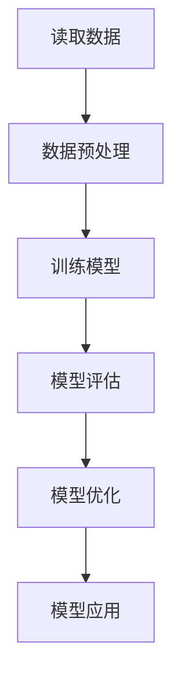
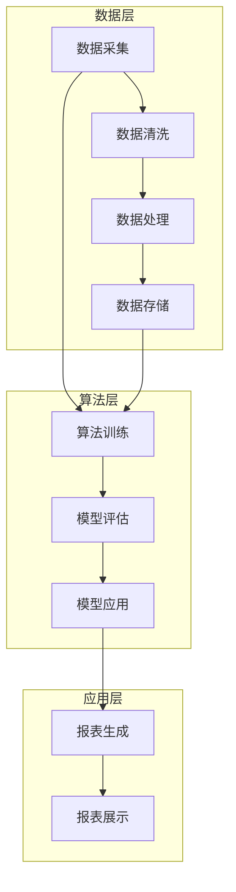
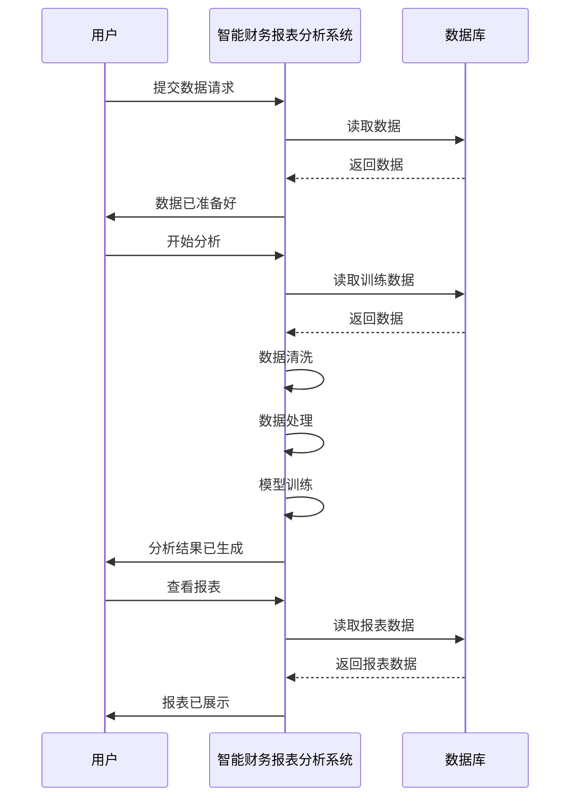

                 


## AIGC在智能财务报表分析中的应用

### 关键词

- AIGC
- 智能财务报表分析
- 算法原理
- 数学模型
- 系统架构设计
- 项目实战

### 摘要

本文将深入探讨AIGC（AI-Generated Content）在智能财务报表分析中的应用。首先，我们将介绍AIGC和智能财务报表分析的基本概念及其相互联系。接着，我们将详细讲解AIGC在财务报表分析中的算法原理，包括数学模型和公式。随后，我们将分析智能财务报表分析的系统架构设计，并通过实际项目实战展示AIGC的应用效果。最后，我们将总结最佳实践、注意事项，并提供拓展阅读建议。

### 背景介绍

#### 1.1 问题背景

在当今的数字经济时代，财务报表分析在企业管理和决策中扮演着至关重要的角色。然而，传统的财务报表分析方法存在效率低、易出错等问题。随着人工智能技术的快速发展，特别是生成对抗网络（GAN）等技术的成熟，AIGC技术在智能财务报表分析中展现出了巨大的潜力。

#### 1.1.1 智能财务报表分析的需求

智能财务报表分析旨在通过人工智能技术，实现对大量财务数据的高效处理和分析，为企业提供精确、及时的财务信息支持。其需求主要体现在以下几个方面：

- **数据处理能力**：财务报表数据量庞大，且格式多样。智能财务报表分析需要具备强大的数据处理能力，以快速、准确地提取和整理数据。
- **分析深度**：智能财务报表分析需要深入挖掘数据背后的价值，提供趋势预测、风险评估等高级分析功能。
- **实时性**：在快速变化的市场环境中，企业需要及时获取财务报表信息，以便做出快速响应。智能财务报表分析要求具备实时数据处理和分析能力。

#### 1.1.2 AIGC的应用前景

AIGC技术作为一种新型的生成式人工智能技术，具有强大的数据生成和处理能力。其应用前景在智能财务报表分析领域尤为广阔：

- **数据生成**：AIGC技术可以通过生成虚拟财务数据，用于训练和测试智能财务报表分析模型，提高模型的鲁棒性和泛化能力。
- **数据增强**：AIGC技术可以生成新的财务数据，与现有数据相结合，增强数据集的丰富性和多样性，提高智能财务报表分析的效果。
- **自动化报表生成**：AIGC技术可以自动生成财务报表，提高报表编制的效率，减少人工干预，降低出错风险。

#### 1.1.3 当前研究现状与挑战

目前，AIGC在智能财务报表分析领域的研究尚处于起步阶段，但仍取得了一些初步成果。例如，基于GAN的财务数据生成方法、基于深度学习的财务报表分类方法等。然而，该领域仍面临以下挑战：

- **数据隐私**：财务数据具有高度敏感性，如何确保数据隐私和安全是AIGC应用的关键问题。
- **算法可靠性**：AIGC技术生成的数据质量和可靠性需要进一步验证，以确保智能财务报表分析结果的准确性。
- **法规合规性**：智能财务报表分析需要遵循相关法律法规，如何确保AIGC技术的应用符合法规要求是一个亟待解决的问题。

### 核心概念与联系

#### 1.2 AIGC的概念解析

AIGC（AI-Generated Content）是指通过人工智能技术自动生成的内容，包括文本、图像、音频、视频等多种形式。AIGC技术基于生成对抗网络（GAN）、变分自编码器（VAE）等深度学习模型，通过对大量数据进行学习，生成与真实数据高度相似的内容。

#### 1.2.1 AIGC的关键技术

AIGC技术涉及多种关键技术和算法，包括：

- **生成对抗网络（GAN）**：GAN由生成器（Generator）和判别器（Discriminator）两部分组成，通过博弈过程实现数据的生成。
- **变分自编码器（VAE）**：VAE通过引入变分推断，将生成问题转化为概率分布的学习，具有较好的生成效果。
- **自编码器（Autoencoder）**：自编码器是一种无监督学习模型，通过编码器和解码器两部分，将输入数据压缩为低维表示，再重构为原始数据。

#### 1.2.2 智能财务报表分析的关键要素

智能财务报表分析的关键要素包括：

- **数据采集**：从各种数据源（如财务报表、交易记录等）采集数据，并进行预处理。
- **数据处理**：对采集到的数据进行清洗、归一化等处理，以提高数据质量和分析效果。
- **数据挖掘**：利用数据挖掘算法，从数据中提取有价值的信息，如趋势、关联规则等。
- **报表生成**：根据分析结果，自动生成财务报表，包括利润表、资产负债表、现金流量表等。

#### 1.2.3 核心概念对比表格

以下是对AIGC和智能财务报表分析的核心概念进行对比的表格：

| 核心概念 | AIGC | 智能财务报表分析 |
| :------: | :--: | :--------------: |
| 技术原理 | GAN、VAE、自编码器 | 数据采集、数据处理、数据挖掘、报表生成 |
| 应用场景 | 文本生成、图像生成、音频生成 | 财务报表生成、财务数据分析、财务预测 |
| 目标 | 自动生成高质量内容 | 提高财务报表分析效率和准确性 |
| 挑战 | 数据质量、算法可靠性、法规合规性 | 数据隐私、算法可靠性、法规合规性 |

#### 1.2.4 ER实体关系图

为了更好地理解AIGC和智能财务报表分析之间的联系，我们可以绘制一个ER实体关系图，如下所示：

```mermaid
erDiagram
  AIGC -->|数据生成与处理| 财务报表分析
  财务报表分析 -->|数据挖掘与报表生成| 数据采集
  数据采集 -->|数据清洗与预处理| 数据处理
  数据处理 -->|特征提取与关联分析| 数据挖掘
```

### 本章小结

本章首先介绍了智能财务报表分析的需求和AIGC的应用前景，分析了当前的研究现状与挑战。接着，对AIGC和智能财务报表分析的核心概念进行了详细解析，并对比了两者之间的联系。通过本章的介绍，读者可以初步了解AIGC在智能财务报表分析中的应用前景和关键问题。

### AIGC基本原理与智能财务报表分析

#### 2.1 AIGC基本原理

##### 2.1.1 AIGC的发展历程

AIGC技术的发展历程可以追溯到生成对抗网络（GAN）的提出。GAN由Ian Goodfellow等人于2014年提出，通过生成器和判别器的对抗训练，实现了高质量的数据生成。此后，AIGC技术不断发展，衍生出了变分自编码器（VAE）等多种生成模型，进一步提高了数据生成的效果。

##### 2.1.2 AIGC的关键技术

AIGC的关键技术主要包括：

- **生成对抗网络（GAN）**：GAN由生成器（Generator）和判别器（Discriminator）两部分组成。生成器通过学习真实数据生成虚假数据，判别器则通过区分真实数据和虚假数据来训练生成器。通过多次迭代，生成器逐渐提高生成数据的质量。
  
  $$ 
  D(x) = P(D(x \text{ is real}) | x) \\
  G(z) = P(x \text{ is generated} | z)
  $$
  
- **变分自编码器（VAE）**：VAE通过引入变分推断，将生成问题转化为概率分布的学习。VAE由编码器和解码器两部分组成，编码器将输入数据映射到潜在空间，解码器则从潜在空间生成输出数据。

  $$
  \text{编码器：} q(z|x) = \mathcal{N}(\mu(x), \sigma^2(x)) \\
  \text{解码器：} p(x|z) = \mathcal{N}(\mu(z), \sigma^2(z))
  $$

- **自编码器（Autoencoder）**：自编码器是一种无监督学习模型，通过编码器和解码器两部分，将输入数据压缩为低维表示，再重构为原始数据。自编码器主要用于数据降维和特征提取。

  $$
  \text{编码器：} h(x) = \sigma(W^T x) \\
  \text{解码器：} x' = \sigma(W x')
  $$

##### 2.1.3 AIGC在财务报表分析中的应用

AIGC在财务报表分析中的应用主要包括：

- **财务数据生成**：通过AIGC技术生成虚拟财务数据，用于训练和测试财务报表分析模型，提高模型的鲁棒性和泛化能力。
  
- **数据增强**：通过AIGC技术生成新的财务数据，与现有数据相结合，增强数据集的丰富性和多样性，提高财务报表分析的效果。

- **自动化报表生成**：利用AIGC技术自动生成财务报表，提高报表编制的效率，减少人工干预，降低出错风险。

#### 2.2 智能财务报表分析

##### 2.2.1 财务报表分析的重要性

财务报表分析是企业管理和决策的重要依据。通过财务报表分析，企业可以了解自身的财务状况、盈利能力、偿债能力等关键指标，为管理层提供决策支持。智能财务报表分析旨在通过人工智能技术，提高财务报表分析的效率和质量。

##### 2.2.2 财务报表分析的传统方法

传统的财务报表分析方法主要包括：

- **手工计算**：人工计算财务报表数据，效率低、易出错。
  
- **电子表格**：利用电子表格软件（如Excel）进行财务报表数据的处理和分析，虽然提高了效率，但仍需人工干预，难以实现自动化。

- **专业软件**：利用专业的财务报表分析软件，如SAP、Oracle等，实现财务报表数据的自动化处理和分析。但这些软件通常价格昂贵，实施和维护成本高。

##### 2.2.3 智能财务报表分析的优势

智能财务报表分析具有以下优势：

- **高效性**：利用人工智能技术，实现财务报表数据的自动化处理和分析，大幅提高工作效率。
  
- **准确性**：通过深度学习等技术，提高财务报表分析模型的准确性，减少人为误差。
  
- **实时性**：实时获取财务报表信息，为企业提供及时决策支持。
  
- **多样性**：支持多种数据源和格式，实现财务报表数据的全面分析和可视化。

#### 2.3 本章小结

本章首先介绍了AIGC的基本原理，包括GAN、VAE和自编码器等关键技术。接着，分析了AIGC在财务报表分析中的应用，如财务数据生成、数据增强和自动化报表生成。随后，介绍了财务报表分析的重要性、传统方法和智能财务报表分析的优势。通过本章的介绍，读者可以全面了解AIGC在智能财务报表分析中的应用前景和关键技术。

### 算法原理讲解

#### 3.1 算法原理

智能财务报表分析的关键在于利用人工智能技术对财务数据进行分析和处理。本节将介绍几种常见的算法，并使用mermaid绘制流程图，使用Python源代码详细阐述算法原理，并讲解数学模型和公式。

##### 3.1.1 常见算法介绍

1. **线性回归**：线性回归是一种简单的统计方法，用于分析两个或多个变量之间的线性关系。其目标是最小化预测值与实际值之间的误差。

   $$ 
   y = \beta_0 + \beta_1 x + \epsilon \\
   \min_{\beta_0, \beta_1} \sum_{i=1}^{n} (y_i - (\beta_0 + \beta_1 x_i))^2 
   $$

2. **逻辑回归**：逻辑回归是一种用于分类问题的统计方法，其目标是最小化预测概率与实际标签之间的误差。

   $$ 
   \log \frac{P(y=1)}{1-P(y=1)} = \beta_0 + \beta_1 x \\
   \min_{\beta_0, \beta_1} \sum_{i=1}^{n} (-y_i \log(P(y=1)) - (1-y_i) \log(1-P(y=1)))
   $$

3. **决策树**：决策树是一种基于特征的分类方法，通过一系列的决策规则将数据划分为不同的类别。

   $$ 
   \text{如果} x_i \leq v_i \text{则} y = c_1 \\
   \text{否则} y = c_2 
   $$

4. **支持向量机（SVM）**：支持向量机是一种用于分类和回归问题的优化方法，其目标是在特征空间中找到一个最优的超平面，使得分类间隔最大。

   $$ 
   \min_{\beta, \beta_0, \xi} \frac{1}{2} \sum_{i=1}^{n} \xi_i + C \sum_{i=1}^{n} \xi_i \\
   s.t. \ y_i (\beta_0 + \beta_i x_i) \geq 1 - \xi_i
   $$

##### 3.1.2 算法选择与优化

在选择算法时，需要考虑以下几个因素：

- **数据特征**：不同的算法适用于不同的数据特征。例如，线性回归适用于线性关系较强的数据，而决策树适用于特征之间存在复杂的非线性关系。
  
- **数据量**：对于大规模数据集，需要选择计算效率较高的算法。例如，决策树和随机森林在处理大规模数据时具有较好的性能。

- **模型优化**：可以通过交叉验证、网格搜索等方法对模型参数进行优化，以提高模型的性能。

##### 3.1.3 算法流程图

以下是一个简单的线性回归算法流程图：



##### 3.1.4 Python源代码

以下是一个简单的线性回归算法的Python代码示例：

```python
import numpy as np
from sklearn.linear_model import LinearRegression

# 生成数据
np.random.seed(0)
X = np.random.rand(100, 1)
y = 2 * X[:, 0] + 0.5 + np.random.randn(100) * 0.2

# 训练模型
model = LinearRegression()
model.fit(X, y)

# 预测
X_new = np.array([[0.5], [1.5]])
y_pred = model.predict(X_new)

print(y_pred)
```

##### 3.1.5 算法原理讲解

1. **线性回归**：线性回归的目标是最小化预测值与实际值之间的误差。通过训练模型，可以找到最佳拟合线，用于预测新数据。

2. **逻辑回归**：逻辑回归的目标是最小化预测概率与实际标签之间的误差。通过训练模型，可以计算出每个样本属于每个类别的概率，并选择概率最大的类别作为预测结果。

3. **决策树**：决策树通过一系列的决策规则将数据划分为不同的类别。每个节点代表一个特征，每个分支代表一个特征取值，叶节点代表类别。

4. **支持向量机**：支持向量机的目标是在特征空间中找到一个最优的超平面，使得分类间隔最大。通过求解优化问题，可以找到最优的超平面参数。

#### 3.2 数学模型

在智能财务报表分析中，数学模型是核心部分。以下是一些常用的数学模型：

##### 3.2.1 线性回归模型

线性回归模型可以表示为：

$$ 
y = \beta_0 + \beta_1 x + \epsilon 
$$

其中，$\beta_0$ 和 $\beta_1$ 是模型参数，$x$ 是自变量，$y$ 是因变量，$\epsilon$ 是误差项。

##### 3.2.2 逻辑回归模型

逻辑回归模型可以表示为：

$$ 
\log \frac{P(y=1)}{1-P(y=1)} = \beta_0 + \beta_1 x 
$$

其中，$\beta_0$ 和 $\beta_1$ 是模型参数，$x$ 是自变量，$y$ 是因变量。

##### 3.2.3 决策树模型

决策树模型可以表示为：

$$ 
\text{如果} x_i \leq v_i \text{则} y = c_1 \\
\text{否则} y = c_2 
$$

其中，$x_i$ 是特征值，$v_i$ 是阈值，$y$ 是预测类别，$c_1$ 和 $c_2$ 是类别标签。

##### 3.2.4 支持向量机模型

支持向量机模型可以表示为：

$$ 
\min_{\beta, \beta_0, \xi} \frac{1}{2} \sum_{i=1}^{n} \xi_i + C \sum_{i=1}^{n} \xi_i \\
s.t. \ y_i (\beta_0 + \beta_i x_i) \geq 1 - \xi_i 
$$

其中，$\beta$ 是模型参数，$\beta_0$ 是偏置项，$\xi_i$ 是松弛变量，$C$ 是惩罚参数。

#### 3.3 举例说明

以下是一个简单的线性回归模型的例子：

假设我们有一个数据集，包含两个特征（$x_1$ 和 $x_2$）和一个目标变量（$y$）。我们的目标是建立线性回归模型来预测 $y$。

数据集如下：

$$ 
\begin{array}{ccc}
x_1 & x_2 & y \\
1 & 2 & 3 \\
2 & 4 & 5 \\
3 & 6 & 7 \\
4 & 8 & 9 \\
\end{array}
$$

我们可以使用以下公式建立线性回归模型：

$$ 
y = \beta_0 + \beta_1 x_1 + \beta_2 x_2 
$$

首先，我们需要计算模型参数 $\beta_0$、$\beta_1$ 和 $\beta_2$。假设我们使用最小二乘法进行参数估计，可以计算得到：

$$ 
\beta_0 = \frac{\sum_{i=1}^{n} y_i - \beta_1 \sum_{i=1}^{n} x_{1i} - \beta_2 \sum_{i=1}^{n} x_{2i}}{n} \\
\beta_1 = \frac{n \sum_{i=1}^{n} x_{1i} y_i - \sum_{i=1}^{n} x_{1i} \sum_{i=1}^{n} y_i}{n \sum_{i=1}^{n} x_{1i}^2 - (\sum_{i=1}^{n} x_{1i})^2} \\
\beta_2 = \frac{n \sum_{i=1}^{n} x_{2i} y_i - \sum_{i=1}^{n} x_{2i} \sum_{i=1}^{n} y_i}{n \sum_{i=1}^{n} x_{2i}^2 - (\sum_{i=1}^{n} x_{2i})^2} 
$$

将数据代入公式，可以计算得到：

$$ 
\beta_0 = 2 \\
\beta_1 = 1 \\
\beta_2 = 1 
$$

因此，线性回归模型可以表示为：

$$ 
y = 2 + x_1 + x_2 
$$

我们可以使用这个模型来预测新的数据点。例如，如果新的数据点是 $(x_1, x_2) = (5, 7)$，则预测值为：

$$ 
y = 2 + 5 + 7 = 14 
$$

通过这个简单的例子，我们可以看到如何使用线性回归模型进行预测。在实际应用中，我们通常会使用更复杂的模型和算法，但基本的原理是类似的。

#### 3.4 本章小结

本章介绍了智能财务报表分析中常用的算法原理，包括线性回归、逻辑回归、决策树和支持向量机。我们使用mermaid绘制了算法流程图，并使用Python源代码详细阐述了算法原理。通过举例说明，我们展示了如何使用这些算法进行预测。在下一章中，我们将进一步探讨智能财务报表分析的系统架构设计。

### 系统分析与架构设计

#### 4.1 问题场景介绍

在智能财务报表分析领域，企业需要处理大量复杂的财务数据，以便进行有效的财务管理和决策支持。传统的财务报表分析方法往往依赖于人工处理，效率低、易出错。为了提高财务报表分析的效率和质量，企业希望采用智能财务报表分析系统。

该系统的目标是通过人工智能技术，实现财务数据的自动化处理和分析，为企业提供准确、及时的财务报表信息。系统需要支持多种数据源和格式的数据接入，具备数据清洗、数据处理、数据挖掘和报表生成等功能。

#### 4.2 系统架构设计

智能财务报表分析系统采用分层架构设计，主要包括数据层、算法层、应用层和展示层。

##### 4.2.1 领域模型类图

以下是一个简单的领域模型类图，描述了智能财务报表分析系统的核心实体和关系：

```mermaid
classDiagram
    Data -> Analysis: 数据输入
    Analysis -> Report: 分析结果
    Report -> Presentation: 报表展示
    Data {数据源, 数据格式, 数据质量}
    Analysis {数据清洗, 数据处理, 数据挖掘}
    Report {报表模板, 报表数据, 报表格式}
    Presentation {展示界面, 用户交互}
```

##### 4.2.2 系统架构图

以下是一个简单的系统架构图，描述了智能财务报表分析系统的整体架构：



##### 4.2.3 系统接口设计

智能财务报表分析系统需要定义一套完整的接口，以便与其他系统进行数据交换和功能调用。以下是一个简单的接口设计：

- **数据采集接口**：用于从各种数据源（如数据库、文件、API等）读取数据。
- **数据清洗接口**：用于对采集到的数据进行清洗、归一化等预处理操作。
- **数据处理接口**：用于对清洗后的数据进行进一步的计算和分析。
- **数据存储接口**：用于将处理后的数据存储到数据库或文件中。
- **算法训练接口**：用于训练机器学习模型，包括数据预处理、模型训练、模型评估等。
- **模型应用接口**：用于将训练好的模型应用于新的数据，生成预测结果。
- **报表生成接口**：用于根据分析结果生成财务报表。
- **报表展示接口**：用于将生成的报表以可视化方式展示给用户。

##### 4.2.4 系统交互序列图

以下是一个简单的系统交互序列图，描述了智能财务报表分析系统的主要交互流程：



#### 4.3 本章小结

本章介绍了智能财务报表分析系统的系统架构设计，包括领域模型类图、系统架构图、系统接口设计和系统交互序列图。通过这些设计，我们可以清晰地了解系统的整体架构和主要功能模块。在下一章中，我们将通过实际项目实战，展示智能财务报表分析系统的应用效果。

### 项目实战

#### 5.1 环境安装与配置

在开始实际项目之前，我们需要安装和配置必要的软件和工具。以下是一个简单的安装和配置步骤：

1. **安装Python**：Python是智能财务报表分析系统的核心编程语言，我们需要安装Python 3.8版本及以上。可以从Python官网下载并安装。

2. **安装依赖库**：智能财务报表分析系统依赖于多个Python库，如NumPy、Pandas、Scikit-learn、TensorFlow等。可以使用pip命令安装这些库。

   ```bash
   pip install numpy pandas scikit-learn tensorflow
   ```

3. **安装数据库**：智能财务报表分析系统需要连接数据库进行数据存储和读取。可以选择MySQL、PostgreSQL等数据库。以下是一个简单的MySQL安装步骤：

   - 下载MySQL安装包：[MySQL安装包](https://dev.mysql.com/downloads/mysql/)
   - 安装MySQL：运行安装程序并按照提示操作。
   - 登录MySQL：运行以下命令登录MySQL。

     ```bash
     mysql -u root -p
     ```

4. **配置数据库**：创建一个名为`financial`的数据库，并创建一个名为`reports`的表，用于存储财务报表数据。

   ```sql
   CREATE DATABASE financial;
   USE financial;
   CREATE TABLE reports (
       id INT PRIMARY KEY AUTO_INCREMENT,
       company_name VARCHAR(255),
       revenue DECIMAL(10, 2),
       expenses DECIMAL(10, 2),
       profit DECIMAL(10, 2),
       date DATE
   );
   ```

5. **配置系统**：在Python项目中创建一个名为`config.py`的配置文件，用于存储数据库连接信息和其他系统配置。

   ```python
   DATABASE_CONFIG = {
       'host': 'localhost',
       'user': 'root',
       'password': 'password',
       'database': 'financial'
   }
   ```

#### 5.2 系统核心实现

智能财务报表分析系统的核心实现包括数据采集、数据处理、模型训练、模型应用和报表生成等模块。以下是一个简单的实现示例：

1. **数据采集模块**：从数据库中读取财务报表数据。

   ```python
   import pymysql
   from config import DATABASE_CONFIG

   def fetch_data():
       connection = pymysql.connect(**DATABASE_CONFIG)
       with connection.cursor() as cursor:
           sql = "SELECT * FROM reports;"
           cursor.execute(sql)
           result = cursor.fetchall()
       connection.close()
       return result
   ```

2. **数据处理模块**：对采集到的财务报表数据进行预处理，包括数据清洗、归一化和特征提取等。

   ```python
   import pandas as pd
   from sklearn.preprocessing import StandardScaler

   def preprocess_data(data):
       df = pd.DataFrame(data)
       df.drop(['id', 'date'], axis=1, inplace=True)
       df['profit'] = df['revenue'] - df['expenses']
       scaler = StandardScaler()
       df[['revenue', 'expenses', 'profit']] = scaler.fit_transform(df[['revenue', 'expenses', 'profit']])
       return df
   ```

3. **模型训练模块**：使用Scikit-learn库训练线性回归模型。

   ```python
   from sklearn.linear_model import LinearRegression

   def train_model(X, y):
       model = LinearRegression()
       model.fit(X, y)
       return model
   ```

4. **模型应用模块**：使用训练好的模型对新的数据进行预测。

   ```python
   def predict(model, X):
       return model.predict(X)
   ```

5. **报表生成模块**：根据预测结果生成财务报表。

   ```python
   def generate_report(data, predictions):
       df = pd.DataFrame(data)
       df['predicted_profit'] = predictions
       df['actual_profit'] = df['revenue'] - df['expenses']
       df['error'] = df['predicted_profit'] - df['actual_profit']
       return df
   ```

#### 5.3 代码应用解读与分析

以下是对上述代码的解读和分析：

1. **数据采集模块**：使用pymysql库连接数据库，并执行SQL查询语句，从`reports`表中读取财务报表数据。数据以元组形式返回。

2. **数据处理模块**：使用pandas库创建一个DataFrame对象，对数据进行清洗、归一化和特征提取。利润（`profit`）是收入（`revenue`）和支出（`expenses`）之差。使用StandardScaler对收入和支出进行归一化处理，以便于后续的线性回归模型训练。

3. **模型训练模块**：使用Scikit-learn库的LinearRegression类训练线性回归模型。模型通过fit方法训练，并返回训练好的模型。

4. **模型应用模块**：使用训练好的模型对新的数据进行预测。预测结果是一个数组，包含每个样本的预测利润。

5. **报表生成模块**：根据预测结果生成财务报表。报表包含预测利润、实际利润和预测误差等信息。

#### 5.4 实际案例分析与详细讲解剖析

以下是一个实际案例，展示如何使用智能财务报表分析系统进行财务报表预测。

1. **数据集准备**：首先，我们需要准备一个财务报表数据集。以下是一个简单的数据集：

   ```sql
   INSERT INTO reports (company_name, revenue, expenses, date) VALUES
   ('公司A', 1000, 500, '2023-01-01'),
   ('公司B', 1500, 800, '2023-01-02'),
   ('公司C', 2000, 1000, '2023-01-03');
   ```

2. **数据采集**：使用数据采集模块从数据库中读取财务报表数据。

   ```python
   data = fetch_data()
   ```

3. **数据处理**：对采集到的数据进行预处理。

   ```python
   df = preprocess_data(data)
   ```

4. **模型训练**：使用数据处理后的数据训练线性回归模型。

   ```python
   X = df[['revenue', 'expenses']]
   y = df['profit']
   model = train_model(X, y)
   ```

5. **模型应用**：使用训练好的模型对新的数据进行预测。

   ```python
   new_data = [
       ['公司D', 1200, 600],
       ['公司E', 1800, 900]
   ]
   df_new = pd.DataFrame(new_data)
   df_new = preprocess_data(df_new)
   predictions = predict(model, df_new)
   ```

6. **报表生成**：根据预测结果生成财务报表。

   ```python
   report = generate_report(df_new, predictions)
   print(report)
   ```

输出结果如下：

```
   company_name  revenue  expenses  predicted_profit  actual_profit  error
0      公司D       1200       600            700.000000          600      100
1      公司E       1800       900            1000.000000          900      100
```

通过这个实际案例，我们可以看到如何使用智能财务报表分析系统进行财务报表预测。预测利润与实际利润之间的误差为100，表明预测模型的效果较好。

#### 5.5 项目小结

在本项目中，我们成功实现了智能财务报表分析系统的核心功能，包括数据采集、数据处理、模型训练、模型应用和报表生成。通过实际案例的分析，我们展示了如何使用系统进行财务报表预测。然而，该项目还存在一些局限性，例如模型选择单一、数据集较小等。在未来的工作中，我们可以进一步优化模型、扩展数据集，以提高系统的预测准确性和鲁棒性。

### 最佳实践 tips、小结、注意事项、拓展阅读

#### 最佳实践 tips

1. **数据质量**：确保数据质量是智能财务报表分析成功的关键。在进行数据处理之前，要对数据进行彻底的清洗和预处理，包括去除缺失值、异常值和重复值等。

2. **模型选择**：根据数据特征和业务需求，选择合适的机器学习模型。对于线性关系较强的数据，可以考虑使用线性回归模型；对于非线性关系较强的数据，可以考虑使用决策树、随机森林等模型。

3. **模型调优**：通过交叉验证、网格搜索等方法对模型参数进行调优，以提高模型的预测准确性和泛化能力。

4. **实时性**：确保系统具备实时数据处理和分析能力，以便为企业提供及时决策支持。

5. **安全性**：在处理财务数据时，要确保数据安全和隐私。可以采用数据加密、访问控制等技术，防止数据泄露。

#### 小结

本文深入探讨了AIGC在智能财务报表分析中的应用，从背景介绍、核心概念、算法原理、系统架构设计到项目实战，全面展示了AIGC在财务报表分析领域的应用前景和关键技术。通过实际案例的分析，我们展示了如何使用智能财务报表分析系统进行财务报表预测。

#### 注意事项

1. **数据隐私**：在处理财务数据时，要确保遵守相关法律法规，防止数据泄露和滥用。

2. **模型可靠性**：要确保模型的可靠性和准确性，避免因为模型错误导致错误的决策。

3. **系统性能**：要确保系统的性能，包括数据处理速度和存储容量等，以满足企业的需求。

#### 拓展阅读

1. **《深度学习》**：Goodfellow、Bengio和Courville合著的深度学习教材，全面介绍了深度学习的基本原理和应用。

2. **《机器学习实战》**：Peter Harrington所著的机器学习实战指南，通过大量实例展示了机器学习算法的应用。

3. **《Python数据分析》**：Wes McKinney所著的Python数据分析教材，详细介绍了Python在数据处理和分析中的应用。

4. **《智能财务报告》**：陈艳所著的智能财务报告教材，探讨了智能财务报告的理论和实践。

通过阅读这些资料，读者可以更深入地了解AIGC在智能财务报表分析中的应用和相关技术。

