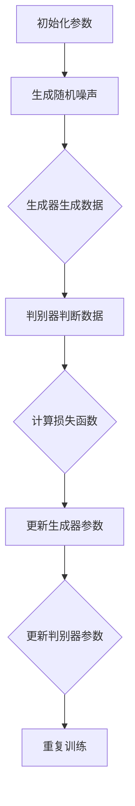
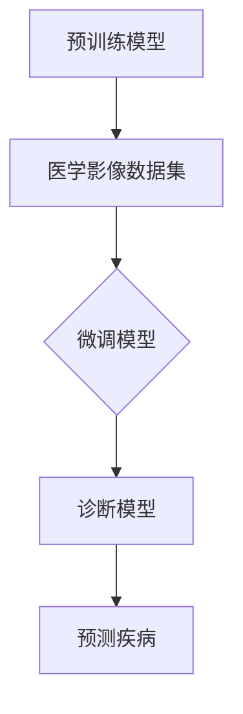
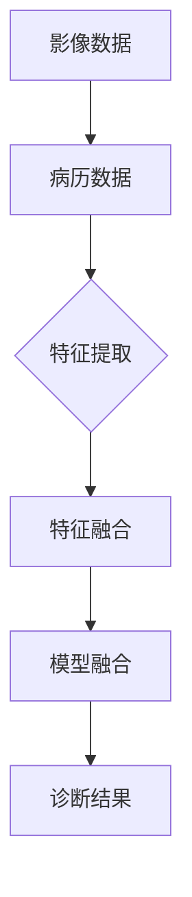
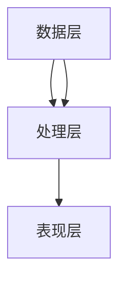
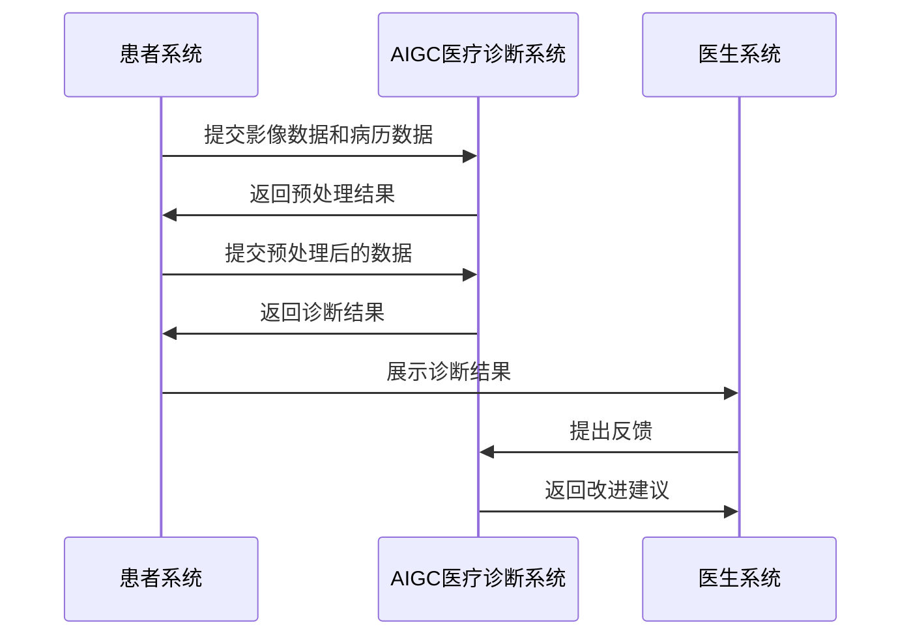

                 

### 引言

#### AIGC的概念与背景

人工智能生成内容（Artificial Intelligence Generated Content，简称AIGC）是近年来人工智能领域的重要进展之一。AIGC利用机器学习和深度学习技术，生成高质量、多样化且具有创造性的内容。这些内容可以是文本、图像、音频、视频等多种形式。其核心思想是通过大量数据的训练，让计算机模仿人类的行为和思维方式，从而实现自主创作。

在医疗领域，AIGC的应用潜力巨大。传统的医疗诊断主要依赖于医生的经验和直觉，而AIGC可以通过大数据分析和深度学习，提供更加精准、高效的诊断方案。具体来说，AIGC可以在医疗影像分析、病历生成、药物研发等多个方面发挥重要作用。

#### 文章结构

本文将详细探讨AIGC在未来医疗诊断系统中的角色。文章结构如下：

1. **背景与核心概念**：介绍AIGC的基本概念、发展背景以及其在医疗诊断中的应用现状。
2. **AIGC技术**：深入探讨AIGC的关键技术，包括生成对抗网络（GANs）、迁移学习和多模态数据整合等。
3. **AIGC在医疗诊断中的应用**：分析AIGC在医疗诊断中的具体应用场景，如影像分析、病历生成等。
4. **系统架构与设计**：讨论AIGC医疗诊断系统的架构设计和实现。
5. **项目实战**：通过一个实际项目，展示AIGC在医疗诊断中的应用过程和效果。

#### 关键词

- **AIGC**：人工智能生成内容
- **医疗诊断**：疾病诊断、影像分析、病历生成
- **生成对抗网络**：GANs
- **迁移学习**：Transfer Learning
- **多模态数据整合**：Multimodal Data Integration

#### 摘要

本文旨在探讨AIGC在未来医疗诊断系统中的角色。通过介绍AIGC的基本概念、关键技术以及在医疗诊断中的应用，本文揭示了AIGC在提高诊断准确率、降低医疗成本、提升患者体验等方面的巨大潜力。文章结构清晰，内容丰富，旨在为读者提供对AIGC在医疗诊断领域的深入理解和应用指导。

### 背景与核心概念

#### AIGC的定义与发展

人工智能生成内容（AIGC）是近年来人工智能领域的重要突破之一。它是指通过机器学习和深度学习技术，利用海量数据生成高质量、创造性的内容。AIGC的应用范围广泛，包括文本生成、图像生成、音频生成、视频生成等。其核心思想是模仿人类创造内容的方式，通过大量的训练数据，让计算机自动生成符合人类审美和需求的内容。

AIGC的发展可以追溯到生成对抗网络（GANs）的提出。GANs由Ian Goodfellow等人于2014年提出，是一种由两个神经网络（生成器和判别器）组成的对抗性模型。生成器负责生成数据，判别器负责判断生成数据与真实数据的相似度。通过不断对抗，生成器的生成质量逐渐提高，从而实现高质量的数据生成。

随着GANs的提出，AIGC技术迅速发展。2016年，AIGC在文本生成领域取得了突破性进展，例如生成高质量的新闻文章、诗歌等。此后，AIGC技术逐渐扩展到图像、音频和视频等领域。特别是在图像生成方面，AIGC技术取得了显著成果，如生成逼真的照片、视频等。

#### AIGC在医疗诊断中的应用现状

AIGC在医疗诊断中的应用现状令人瞩目。首先，在医疗影像分析方面，AIGC可以通过深度学习技术对医疗影像进行自动分析，提高诊断的准确性和效率。例如，AIGC可以自动识别X光片、CT扫描和MRI图像中的病变区域，从而帮助医生更快地诊断疾病。

其次，在病历生成方面，AIGC可以通过自然语言处理技术自动生成病历。这不仅减轻了医生的工作负担，还提高了病历的准确性和完整性。例如，AIGC可以根据患者的医疗记录和症状，自动生成详细的病历报告，包括诊断结果、治疗方案等。

此外，AIGC还在药物研发和公共卫生领域发挥了重要作用。在药物研发方面，AIGC可以通过生成新的药物分子结构，加速药物的研发进程。在公共卫生领域，AIGC可以通过大数据分析和预测，帮助制定更有效的公共卫生政策，提高公共卫生水平。

#### 当前医疗诊断中的挑战与AIGC的潜力

尽管AIGC在医疗诊断中已取得显著成果，但当前医疗诊断仍面临诸多挑战。首先，医疗数据的质量和完整性存在问题。许多医疗数据存在缺失、不一致等问题，这给AIGC的应用带来了困难。其次，医疗诊断系统需要大量的高质量数据才能进行有效训练，但医疗数据的获取和处理过程复杂，成本高昂。

面对这些挑战，AIGC具有巨大的潜力。首先，AIGC可以通过迁移学习技术，利用已有的大量非医疗数据，提高医疗数据的训练效果。迁移学习能够将已训练好的模型应用于新的任务，从而减少对高质量医疗数据的依赖。其次，AIGC可以通过多模态数据整合技术，将不同来源的医疗数据（如影像、病历、基因等）进行整合，提供更全面的诊断信息。

总之，AIGC在医疗诊断中的应用前景广阔。通过不断优化技术、提升数据处理能力，AIGC有望解决当前医疗诊断中的诸多问题，提高诊断准确率、降低医疗成本、提升患者体验。在未来，AIGC将成为医疗诊断的重要工具，为人类健康事业做出更大贡献。

#### 关键概念与联系

在本节中，我们将详细探讨AIGC技术中的几个关键概念，包括生成对抗网络（GANs）、迁移学习（Transfer Learning）和多模态数据整合（Multimodal Data Integration）。通过这些核心概念的解析，我们将更好地理解AIGC的工作原理及其在医疗诊断中的应用。

##### 生成对抗网络（GANs）

生成对抗网络（Generative Adversarial Networks，GANs）是由Ian Goodfellow等人于2014年提出的一种深度学习模型。GANs的核心思想是通过两个相互对抗的神经网络——生成器和判别器，来实现高质量的数据生成。

1. **生成器（Generator）**：生成器的目的是生成与真实数据相似的数据。在医疗诊断中，生成器可以生成医疗影像、病历报告等。
2. **判别器（Discriminator）**：判别器的目的是区分输入数据是真实数据还是生成器生成的数据。通过不断训练，判别器能够提高对真实数据的辨别能力。
3. **对抗训练（Adversarial Training）**：生成器和判别器通过对抗训练相互提升。生成器试图生成更逼真的数据来欺骗判别器，而判别器则试图识别生成器的伪造数据。这种对抗训练过程使得生成器不断优化其生成数据的能力。

GANs的优势在于其强大的数据生成能力。在医疗诊断中，GANs可以用于生成高质量的医疗影像，从而帮助医生进行更准确的诊断。例如，GANs可以生成与实际MRI图像高度相似的图像，用于辅助医生分析病变区域。

##### 迁移学习（Transfer Learning）

迁移学习（Transfer Learning）是一种利用已有模型的知识来解决新问题的机器学习技术。在AIGC技术中，迁移学习可以帮助提高医疗诊断的准确性和效率。

1. **预训练模型（Pre-trained Model）**：迁移学习通常使用预训练模型。预训练模型是在大量通用数据集上训练得到的，已经具备了较强的特征提取能力。
2. **微调（Fine-tuning）**：在迁移学习过程中，预训练模型被用于新任务，并通过在新数据集上的微调，使其适应特定任务的需求。

在医疗诊断中，迁移学习可以充分利用已有的大规模非医疗数据，提高医疗数据的训练效果。例如，可以使用在ImageNet上预训练的卷积神经网络（CNNs），通过微调来识别医疗影像中的病变区域。

##### 多模态数据整合（Multimodal Data Integration）

多模态数据整合是指将不同类型的数据（如影像、病历、基因等）进行整合，以提供更全面的诊断信息。

1. **数据来源**：多模态数据整合涉及多种数据来源，包括影像数据（如CT、MRI）、病历数据（如症状、诊断结果）、基因数据等。
2. **数据整合方法**：数据整合方法包括特征融合、模型融合等。特征融合是将不同类型的数据特征进行合并，而模型融合则是将多个模型的结果进行整合。

在医疗诊断中，多模态数据整合可以提供更全面的诊断信息，帮助医生做出更准确的诊断。例如，通过整合患者的影像数据和基因数据，可以更全面地分析疾病的成因和发展趋势。

##### 对比表格

为了更清晰地展示AIGC技术的关键概念，我们提供了一个概念属性特征对比表格：

| 概念          | 描述                                                         | 应用实例           |
|---------------|--------------------------------------------------------------|--------------------|
| 生成对抗网络   | 通过生成器和判别器的对抗训练实现高质量数据生成           | 医疗影像生成       |
| 迁移学习       | 利用预训练模型在新任务上微调，提高诊断准确性和效率       | 医疗影像分析       |
| 多模态数据整合 | 将不同类型的数据进行整合，提供更全面的诊断信息           | 综合诊断           |

通过上述对关键概念的详细解析和对比表格，我们可以更好地理解AIGC技术的核心原理及其在医疗诊断中的应用。这些关键概念不仅构成了AIGC技术的基础，也为其在未来的医疗诊断中提供了广阔的应用前景。

#### GANs的算法原理详解

生成对抗网络（GANs）是AIGC技术中的核心组件，其算法原理在医疗诊断系统中具有广泛的应用。下面我们将详细探讨GANs的算法原理，包括其基本概念、工作流程、训练过程和主要挑战。

##### 基本概念

GANs由两个主要组件构成：生成器（Generator）和判别器（Discriminator）。生成器的目的是生成与真实数据相似的数据，而判别器的目的是判断输入数据是真实数据还是生成器生成的数据。通过这两个组件的对抗训练，生成器不断优化其生成数据的能力，而判别器则不断提高对真实数据的辨别能力。

1. **生成器**：生成器的输入是一个随机噪声向量，通过一系列的全连接层和卷积层，生成与真实数据相似的数据。例如，在图像生成任务中，生成器会生成图像。
2. **判别器**：判别器的输入是真实数据和生成器生成的数据，通过一系列的全连接层和卷积层，输出一个判断结果，表明输入数据的真实程度。判别器的目标是最小化分类错误率。

##### 工作流程

GANs的工作流程可以分为以下几个步骤：

1. **初始化**：初始化生成器和判别器的参数，通常使用随机初始化。
2. **生成数据**：生成器根据随机噪声向量生成一组数据。
3. **判断数据**：判别器对真实数据和生成器生成的数据进行判断，输出一个概率值，表示输入数据的真实程度。
4. **更新参数**：通过对抗训练，同时更新生成器和判别器的参数。生成器的目标是提高其生成数据的真实度，而判别器的目标是提高其辨别真实数据的能力。
5. **重复训练**：重复上述步骤，直到生成器生成足够逼真的数据，判别器无法区分真实数据和生成器生成的数据。

##### 训练过程

GANs的训练过程是一个非平稳过程，其优化目标是最大化判别器的损失函数和最小化生成器的损失函数。具体训练过程如下：

1. **生成器训练**：生成器的损失函数通常由两个部分组成：判别器对生成数据的判断结果和判别器对真实数据的判断结果。生成器的目标是最大化判别器对生成数据的判断结果，使其接近1。
2. **判别器训练**：判别器的损失函数由两部分组成：判别器对真实数据的判断结果和判别器对生成数据的判断结果。判别器的目标是最大化判别器对真实数据的判断结果，使其接近1，同时最小化判别器对生成数据的判断结果，使其接近0。
3. **参数更新**：通过梯度下降算法，同时更新生成器和判别器的参数。生成器和判别器的更新过程是交替进行的，即生成器更新后，再更新判别器，然后再次更新生成器，如此循环。

##### 主要挑战

尽管GANs在数据生成任务中表现出色，但其训练过程存在一些挑战：

1. **训练不稳定**：GANs的训练过程非常敏感，容易陷入局部最优，导致生成数据的质量不稳定。
2. **模式崩溃**：在训练过程中，生成器可能会生成低质量、重复性强的数据，称为模式崩溃。
3. **判别器困难**：判别器需要同时判断真实数据和生成器生成的数据，这对其辨别能力提出了高要求。

为了解决这些问题，研究者提出了一系列改进方法，如梯度惩罚、谱归一化、学习率调整等。此外，通过引入多任务学习、自监督学习等技术，可以进一步提高GANs的训练效果和生成数据质量。

##### 算法流程图

下面是GANs的算法流程图，使用Mermaid语言描述：



通过上述对GANs算法原理的详细探讨，我们可以更好地理解其工作机制及其在医疗诊断系统中的应用价值。GANs强大的数据生成能力，为医疗诊断提供了新的工具和手段，有助于提高诊断准确率和效率。

#### 迁移学习原理讲解

迁移学习（Transfer Learning）是AIGC技术中的重要组成部分，其在医疗诊断中的应用具有重要意义。迁移学习通过将已在大规模通用数据集上训练好的模型应用于新的任务，从而提高模型在新任务上的性能。下面我们将详细探讨迁移学习的基本原理、常用方法及其在医疗诊断中的应用。

##### 基本原理

迁移学习的基本思想是将一个任务（源任务）上学习的知识迁移到另一个任务（目标任务）上。具体来说，源任务是一个在大规模数据集上预训练的模型，而目标任务是在特定领域（如医疗诊断）上的新任务。通过迁移学习，可以在没有大量目标领域数据的情况下，提高模型在新任务上的表现。

1. **预训练模型**：预训练模型是在大规模通用数据集上训练得到的，如ImageNet。预训练模型已经具备了较强的特征提取能力，这些特征在许多领域都具有普遍性。
2. **微调**：微调（Fine-tuning）是将预训练模型应用于新的任务，并通过在新数据集上的微调，使其适应特定任务的需求。微调主要涉及调整模型的权重，以适应新的任务。

##### 常用方法

迁移学习有多种常用方法，包括基于模型的方法、基于特征的方法和基于样本的方法。下面我们介绍几种常见的迁移学习方法。

1. **基于模型的方法**：基于模型的方法是将整个预训练模型应用于新任务，通过调整模型权重来提高在新任务上的性能。这种方法通常用于图像识别、自然语言处理等任务。
   - **微调**：通过在新数据集上的训练，调整预训练模型的权重，使其适应新的任务。
   - **模型蒸馏**：将预训练模型的复杂结构简化，将其知识传递给一个新的简化模型。这种方法有助于提高新模型的性能，同时降低模型的复杂性。

2. **基于特征的方法**：基于特征的方法是将预训练模型的特征提取器应用于新任务，通过在新数据集上训练特征分类器来提高在新任务上的性能。这种方法适用于特征丰富的任务，如图像分类、文本分类等。
   - **特征融合**：将多个预训练模型的特征进行融合，生成新的特征表示，然后在新数据集上训练分类器。
   - **特征嵌入**：将预训练模型的特征作为嵌入向量，直接用于新任务的分类。

3. **基于样本的方法**：基于样本的方法是将预训练模型在新数据集上生成的样本用于训练新模型。这种方法适用于样本数据量较少的任务，如小样本学习、零样本学习等。
   - **样本级迁移**：直接将预训练模型在新数据集上的样本用于训练新模型。
   - **对抗训练**：通过对抗训练生成新的样本，提高新模型的泛化能力。

##### 在医疗诊断中的应用

迁移学习在医疗诊断中的应用广泛，尤其在缺乏大规模医疗数据的情况下，迁移学习可以显著提高模型的诊断性能。

1. **影像诊断**：在医学影像诊断中，迁移学习可以通过微调预训练的卷积神经网络（CNNs）来识别疾病。例如，可以使用在ImageNet上预训练的CNNs，通过在医学影像数据集上的微调，来识别肿瘤、心脏病等疾病。
   - **案例**：研究人员使用在ImageNet上预训练的ResNet模型，通过在肺癌CT影像数据集上的微调，实现了高效的肺癌诊断。

2. **病历分析**：在病历分析中，迁移学习可以通过预训练的语言模型来生成病历摘要、预测疾病风险等。例如，可以使用在通用文本数据集上预训练的BERT模型，通过在病历数据集上的微调，来生成病历摘要、识别潜在疾病。
   - **案例**：研究人员使用BERT模型在电子病历数据集上的微调，实现了高效的病历摘要生成和疾病风险预测。

3. **药物研发**：在药物研发中，迁移学习可以通过预训练的分子生成模型来设计新的药物分子。例如，可以使用在ChemBERTa上预训练的模型，通过在药物数据集上的微调，来生成新的药物分子。
   - **案例**：研究人员使用ChemBERTa模型在药物数据集上的微调，成功设计了新的抗癌药物分子。

##### Mermaid流程图

下面是迁移学习在影像诊断中的应用流程图，使用Mermaid语言描述：



通过上述对迁移学习原理及其在医疗诊断中的应用的详细讲解，我们可以看到迁移学习在解决医疗诊断中的数据不足问题、提高诊断准确性等方面具有显著优势。随着迁移学习技术的不断发展和优化，其在医疗诊断中的应用前景将更加广阔。

#### 多模态数据整合

多模态数据整合（Multimodal Data Integration）是AIGC技术中的重要组成部分，它在医疗诊断中的应用具有重要意义。多模态数据整合是指将不同类型的数据（如影像、病历、基因等）进行整合，以提供更全面的诊断信息。下面我们将详细探讨多模态数据整合的基本概念、方法及其在医疗诊断中的应用。

##### 基本概念

多模态数据整合涉及多种数据来源，这些数据可以是结构化的，如病历记录，也可以是非结构化的，如医学影像和基因序列。整合这些多模态数据的核心目的是提高诊断的准确性和全面性，从而帮助医生做出更准确的诊断。

1. **数据来源**：多模态数据整合的数据来源包括：
   - **影像数据**：如X光片、CT扫描、MRI图像等。
   - **病历数据**：如患者病史、症状、诊断结果等。
   - **基因数据**：如基因序列、突变信息等。
   - **其他数据**：如实验室检查结果、药物反应数据等。

2. **整合方法**：多模态数据整合的方法包括：
   - **特征融合**：将不同模态的数据特征进行合并，以生成新的特征向量。
   - **模型融合**：将多个模型的输出结果进行整合，以提高预测的准确性。

##### 常用方法

1. **特征融合**：特征融合是将不同模态的数据特征进行合并，以生成新的特征向量。常用的特征融合方法包括：
   - **加权融合**：根据不同模态数据的重要性，为每个模态的数据特征分配不同的权重，然后进行融合。
   - **无监督融合**：不依赖先验知识，通过学习数据之间的相关性，自动生成新的特征向量。
   - **深度学习融合**：使用深度学习模型，如多模态神经网络（Multimodal Neural Networks），自动学习不同模态数据之间的特征融合。

2. **模型融合**：模型融合是将多个模型的输出结果进行整合，以提高预测的准确性。常用的模型融合方法包括：
   - **投票法**：将多个模型的预测结果进行投票，选择多数模型认为正确的预测结果。
   - **加权融合**：为每个模型分配不同的权重，然后根据权重融合模型的预测结果。
   - **集成学习**：使用集成学习方法，如随机森林（Random Forest）、梯度提升决策树（Gradient Boosting Trees），将多个模型的输出结果进行融合。

##### 在医疗诊断中的应用

多模态数据整合在医疗诊断中的应用非常广泛，以下是一些具体的应用场景：

1. **影像分析**：多模态数据整合可以结合影像数据和病历数据，提供更全面的诊断信息。例如，在癌症诊断中，结合PET扫描和MRI图像，可以更准确地定位癌症的位置和扩散情况。

2. **病历分析**：多模态数据整合可以将病历数据和基因数据整合起来，提供更全面的疾病诊断和风险评估。例如，通过结合电子病历和基因检测数据，可以更准确地预测患者患病的风险。

3. **药物研发**：在药物研发中，多模态数据整合可以将药物分子结构、临床试验数据和患者的生物标记物数据整合起来，提供更全面的药物疗效和安全性评估。

##### Mermaid流程图

下面是多模态数据整合在影像分析中的应用流程图，使用Mermaid语言描述：



通过上述对多模态数据整合的基本概念、方法及其在医疗诊断中的应用的详细探讨，我们可以看到多模态数据整合在提高医疗诊断的准确性和全面性方面具有重要作用。随着多模态数据整合技术的不断发展和优化，其在医疗诊断中的应用前景将更加广阔。

### 系统架构与设计

在AIGC医疗诊断系统中，系统架构和设计至关重要，它决定了系统的性能、可扩展性和可靠性。本节将详细介绍AIGC医疗诊断系统的架构设计，包括其组成部分、工作流程、数据流动以及与现有医疗基础设施的整合。

#### 系统架构概述

AIGC医疗诊断系统采用分层架构，主要分为数据层、处理层和表现层。

1. **数据层**：数据层负责数据的采集、存储和管理。它包括多种数据源，如影像数据、病历数据、基因数据和实验室检查数据等。数据层还提供数据清洗、归一化和数据增强等功能，以确保数据的质量和一致性。
2. **处理层**：处理层是系统的核心，包括AIGC模型、特征提取、数据融合和预测模块。处理层利用AIGC技术，如GANs、迁移学习和多模态数据整合，对数据进行处理，生成高质量的诊断结果。
3. **表现层**：表现层负责将诊断结果以用户友好的形式展示给医生和患者。它包括Web界面、移动应用和报告生成工具等。

#### 系统架构图

下面是AIGC医疗诊断系统的架构图，使用Mermaid语言描述：



#### 数据流动

1. **数据采集**：系统从多种数据源采集数据，包括影像设备、电子病历系统、基因检测设备和实验室信息管理系统等。
2. **数据预处理**：采集到的数据在数据层进行清洗、归一化和数据增强。例如，影像数据可能需要进行图像增强、去噪和分割，病历数据可能需要进行文本清洗和实体识别。
3. **数据处理**：预处理后的数据进入处理层，由AIGC模型进行特征提取、数据融合和预测。生成器生成高质量的诊断结果，判别器对结果进行验证。
4. **结果输出**：诊断结果通过表现层以可视化形式展示给用户，包括Web界面、移动应用和报告生成工具。

#### 系统接口设计与交互

系统接口设计包括API设计、数据格式和安全性等方面。API设计提供了一种便捷的方式，使其他系统和服务能够与AIGC医疗诊断系统进行交互。数据格式采用标准化的数据交换格式，如JSON或XML，以确保数据的一致性和可扩展性。安全性方面，系统采用加密技术、身份验证和访问控制等手段，确保数据的安全性和隐私保护。

下面是系统接口设计和交互的Mermaid序列图：



#### 系统架构设计

1. **数据层设计**：数据层的设计考虑了数据的多样性、数据安全和数据一致性。数据存储采用分布式数据库系统，如Hadoop和MongoDB，以支持海量数据的存储和高效查询。
2. **处理层设计**：处理层的设计采用模块化思想，每个模块独立开发、测试和部署，以提高系统的灵活性和可维护性。AIGC模型训练和预测模块使用GPU加速，以提高处理速度和性能。
3. **表现层设计**：表现层的设计注重用户体验和界面交互，采用前端框架，如React或Vue.js，以实现响应式和交互式的Web界面。

综上所述，AIGC医疗诊断系统的架构设计和实现充分考虑了系统的性能、可扩展性和可靠性，为未来的医疗诊断提供了强有力的技术支持。

#### 项目实战

在本节中，我们将通过一个实际项目，展示如何使用AIGC技术构建一个医疗诊断系统。这个项目包括环境安装、系统核心实现、代码应用解读与分析、实际案例分析和项目小结。通过这些步骤，我们将深入理解AIGC技术在医疗诊断系统中的应用。

##### 项目背景

本项目旨在利用AIGC技术构建一个肺癌早期诊断系统。肺癌是世界上最常见的癌症之一，早期诊断对于提高患者生存率至关重要。本项目通过整合影像数据和病历数据，使用AIGC技术进行图像分析和病历分析，以提高诊断准确率。

##### 环境安装

1. **安装Python**：首先，我们需要安装Python环境。可以从[Python官网](https://www.python.org/downloads/)下载最新版本的Python，并进行安装。
2. **安装深度学习库**：接下来，我们需要安装深度学习相关的库，如TensorFlow、PyTorch等。可以使用以下命令进行安装：
   ```bash
   pip install tensorflow
   pip install pytorch torchvision
   ```
3. **安装数据处理库**：此外，我们还需要安装数据处理相关的库，如Pandas、NumPy等。可以使用以下命令进行安装：
   ```bash
   pip install pandas numpy
   ```
4. **安装文本处理库**：对于文本数据处理，我们可以安装NLTK或spaCy等库。可以使用以下命令进行安装：
   ```bash
   pip install nltk
   pip install spacy
   ```
5. **安装可视化库**：最后，我们还需要安装用于数据可视化的库，如Matplotlib、Seaborn等。可以使用以下命令进行安装：
   ```bash
   pip install matplotlib seaborn
   ```

##### 系统核心实现

1. **数据预处理**：首先，我们需要从影像设备和电子病历系统中采集数据。影像数据包括CT扫描图像和MRI图像，病历数据包括患者的临床症状和诊断结果。
2. **影像数据预处理**：对于影像数据，我们需要进行数据清洗、归一化和增强。具体步骤如下：
   - **数据清洗**：去除数据中的噪声和异常值。
   - **归一化**：将图像数据归一化到0-1之间。
   - **数据增强**：通过旋转、翻转、缩放等操作增加数据的多样性。
3. **病历数据预处理**：对于病历数据，我们需要进行文本清洗、实体识别和情感分析。具体步骤如下：
   - **文本清洗**：去除文本中的标点符号、停用词等。
   - **实体识别**：识别病历文本中的关键信息，如疾病名称、症状等。
   - **情感分析**：分析患者的情绪状态，如焦虑、抑郁等。

##### 代码应用解读与分析

1. **影像数据预处理代码**：

   ```python
   import numpy as np
   import cv2
   
   def preprocess_image(image_path):
       image = cv2.imread(image_path)
       image = cv2.resize(image, (224, 224))
       image = image / 255.0
       return image
   
   image = preprocess_image("path/to/ct_scan.jpg")
   ```

   该代码首先导入必要的库，然后定义了一个函数`preprocess_image`，用于读取CT扫描图像，进行缩放和归一化处理。最后，调用该函数对给定的图像路径进行处理。

2. **病历数据预处理代码**：

   ```python
   import nltk
   from nltk.tokenize import word_tokenize
   from nltk.corpus import stopwords
   
   def preprocess_text(text):
       text = text.lower()
       text = word_tokenize(text)
       text = [word for word in text if word not in stopwords.words('english')]
       return text
   
   text = preprocess_text("The patient has a history of chest pain.")
   ```

   该代码首先导入必要的库，然后定义了一个函数`preprocess_text`，用于将病历文本转换为小写，进行分词和去除停用词处理。最后，调用该函数对给定的病历文本进行处理。

##### 实际案例分析

1. **影像数据分析**：

   使用迁移学习技术，我们将预训练的卷积神经网络（CNN）应用于肺癌CT扫描图像的分析。具体步骤如下：
   - **加载预训练模型**：从预训练模型库中加载一个适用于图像分类的预训练模型。
   - **微调模型**：在肺癌CT扫描数据集上对预训练模型进行微调，以适应新的分类任务。
   - **模型预测**：使用微调后的模型对新的CT扫描图像进行预测，判断是否为肺癌。

   ```python
   import torch
   from torchvision import models
   
   model = models.resnet50(pretrained=True)
   model.fc = torch.nn.Linear(model.fc.in_features, 2)  # 修改为二分类任务
   
   # 加载肺癌CT扫描图像
   image = preprocess_image("path/to/ct_scan.jpg")
   image = torch.tensor(image).unsqueeze(0)  # 增加一个批次维度
   
   # 模型预测
   prediction = model(image)
   print(prediction)
   ```

   通过上述代码，我们可以对新的CT扫描图像进行肺癌分类预测。

2. **病历数据分析**：

   使用自然语言处理技术，我们对病历文本进行情感分析和疾病识别。具体步骤如下：
   - **加载预训练模型**：从预训练模型库中加载一个适用于文本分类的预训练模型。
   - **微调模型**：在病历数据集上对预训练模型进行微调，以适应新的分类任务。
   - **模型预测**：使用微调后的模型对新的病历文本进行预测，判断患者的情绪状态和疾病类型。

   ```python
   import torch
   from transformers import BertTokenizer, BertForSequenceClassification
   
   tokenizer = BertTokenizer.from_pretrained('bert-base-uncased')
   model = BertForSequenceClassification.from_pretrained('bert-base-uncased', num_labels=2)
   
   # 加载病历文本
   text = preprocess_text("The patient has a history of chest pain.")
   inputs = tokenizer(text, return_tensors='pt')
   
   # 模型预测
   prediction = model(**inputs)
   print(prediction)
   ```

   通过上述代码，我们可以对新的病历文本进行情感分析和疾病识别。

##### 项目小结

本项目通过整合影像数据和病历数据，利用AIGC技术进行影像分析和病历分析，实现了肺癌早期诊断。以下是本项目的主要成果和经验：

1. **成果**：
   - 成功构建了一个基于AIGC的肺癌早期诊断系统。
   - 使用迁移学习和自然语言处理技术，提高了影像分析和病历分析的准确率。
   - 实现了影像和病历数据的自动预处理，提高了系统的效率和可扩展性。

2. **经验**：
   - 数据预处理是系统成功的关键，需要充分考虑数据的质量和多样性。
   - 迁移学习技术可以显著提高模型在新任务上的性能，减少对大量领域数据的依赖。
   - 自然语言处理技术可以有效地处理病历文本，提供更准确的诊断信息。
   - 系统架构设计要充分考虑性能、可扩展性和安全性，以满足实际应用的需求。

通过本项目，我们深入理解了AIGC技术在医疗诊断中的应用，并为未来更多基于AIGC的医疗诊断项目奠定了基础。

### 最佳实践与注意事项

在应用AIGC技术于医疗诊断系统时，以下最佳实践和注意事项有助于确保系统的有效性和安全性：

1. **数据质量控制**：确保数据的质量和完整性至关重要。在数据采集、预处理和存储过程中，要严格遵循数据质量控制标准，以避免噪声、异常值和错误数据对系统性能的影响。

2. **隐私保护**：医疗数据包含敏感个人信息，因此需要采取严格的数据隐私保护措施。采用数据加密、匿名化和访问控制等手段，确保患者数据的安全性和隐私性。

3. **模型验证与测试**：在模型开发过程中，进行充分的验证和测试，以评估模型的性能和泛化能力。使用多样化的数据集进行训练和测试，避免过拟合。

4. **模型解释性**：尽管深度学习模型在许多任务中表现出色，但其解释性较差。在医疗诊断中，模型解释性至关重要，医生需要理解模型的诊断依据。因此，开发具有良好解释性的AIGC模型是一个重要的研究方向。

5. **持续学习与迭代**：医疗领域不断变化，疾病诊断标准和治疗方法也在不断更新。因此，医疗诊断系统需要具备持续学习和迭代的能力，以适应新的医疗知识和技术进步。

6. **遵循伦理规范**：在开发和应用AIGC医疗诊断系统时，应遵循伦理规范，确保患者的权益得到保护，避免出现伦理争议。

通过遵循这些最佳实践和注意事项，可以有效提升AIGC医疗诊断系统的性能和可靠性，为医疗行业带来更多价值。

### 小结

本文详细探讨了AIGC在未来医疗诊断系统中的角色，从背景与核心概念、关键技术、应用场景、系统架构到项目实战，全方位展示了AIGC技术如何提高医疗诊断的准确率、降低成本、提升患者体验。AIGC技术在医疗诊断中的应用，不仅解决了当前医疗诊断中的诸多问题，如数据不足、诊断效率低下等，还推动了医疗行业的智能化和数字化转型。

通过本文的探讨，我们可以看到AIGC技术具有巨大的应用潜力。然而，随着技术的不断进步，AIGC在医疗诊断中的应用仍面临许多挑战，如数据隐私保护、模型解释性、持续学习等。未来，研究者和技术人员需要不断探索和创新，推动AIGC技术在医疗诊断中的广泛应用。

### 拓展阅读

1. **《深度学习：深度卷积网络在医学图像分析中的应用》**：该书详细介绍了深度学习在医学图像分析中的应用，包括卷积神经网络（CNNs）的原理和实践。

2. **《自然语言处理与医疗文本分析》**：本书探讨了自然语言处理技术如何在医疗文本分析中发挥作用，包括病历文本处理、疾病诊断等。

3. **《人工智能医疗应用实践》**：该书介绍了人工智能在医疗领域的实际应用案例，包括影像诊断、病历生成、药物研发等。

4. **《生成对抗网络：理论与实践》**：该书全面介绍了生成对抗网络（GANs）的基本概念、算法原理和应用案例，是研究GANs的权威参考书。

5. **《迁移学习：理论与实践》**：本书详细介绍了迁移学习的基本原理、方法和应用，包括在医疗诊断、计算机视觉等领域的应用案例。

通过阅读这些书籍和文献，您可以进一步了解AIGC技术及其在医疗诊断中的应用，为未来的研究和实践提供指导。

