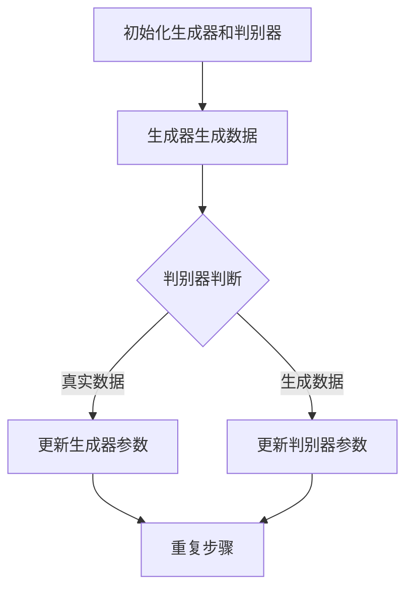
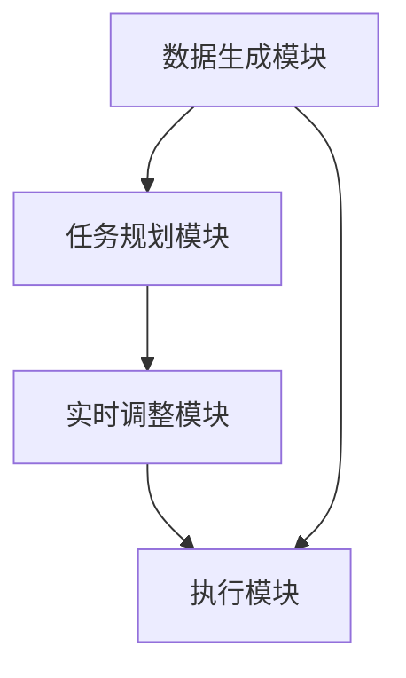
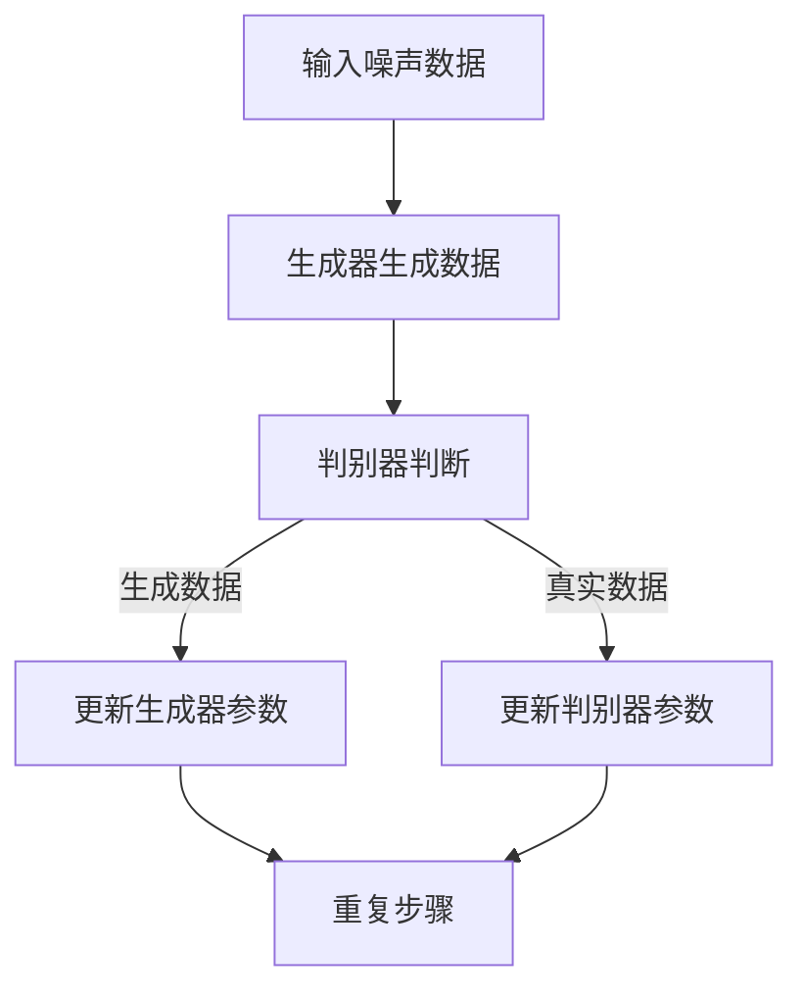

                 

### AIGC在未来太空探索任务规划中的应用

在未来太空探索任务中，高效的任务规划对于成功的执行至关重要。随着科技的进步，人工智能（AI）逐渐成为推动太空探索的重要工具。而AIGC（AI-Generated Content）作为AI技术的一个重要分支，其强大的内容生成能力在未来太空探索任务规划中具有巨大的潜力。本文将深入探讨AIGC的概念、算法原理、系统架构、应用案例以及最佳实践，以展示其在太空探索任务规划中的巨大作用。

关键词：AIGC，未来太空探索，任务规划，算法原理，系统架构，应用案例，最佳实践。

**摘要**：本文首先介绍了AIGC的基础概念和其在太空探索任务规划中的重要性。随后，我们详细解释了AIGC的核心算法原理，并通过Mermaid流程图和Python源代码进行了阐述。接着，我们探讨了AIGC在太空探索任务规划中的系统架构设计，并介绍了实际项目案例。最后，本文总结了AIGC在太空探索任务规划中的最佳实践，并提出了未来研究的方向。

### 目录

1. AIGC基础
    - 1.1 AIGC概述
    - 1.2 AIGC的核心概念
    - 1.3 AIGC的应用场景

2. AIGC算法原理
    - 2.1 算法概述
    - 2.2 算法流程图
    - 2.3 算法实现与数学模型

3. AIGC在太空探索任务规划中的应用
    - 3.1 应用场景介绍
    - 3.2 系统架构设计
    - 3.3 实际案例分析与实战

4. AIGC最佳实践
    - 4.1 最佳实践
    - 4.2 拓展阅读

5. 小结

### 第1章 AIGC基础

**1.1 AIGC概述**

AIGC，全称AI-Generated Content，是指通过人工智能技术自动生成内容的过程。它涵盖了从文本、图像、音频到视频等多种形式的内容生成。AIGC的核心在于利用深度学习技术，尤其是生成对抗网络（GAN）和变分自编码器（VAE），模拟和生成复杂的数据模式。

在太空探索任务规划中，AIGC的应用背景主要体现在以下几个方面：

- **数据生成与模拟**：太空探索涉及大量的数据收集和分析，AIGC可以生成模拟数据，帮助进行任务规划和风险评估。
- **优化任务规划**：AIGC可以根据历史数据和实时信息，自动生成最优的任务规划方案，提高任务执行效率。
- **算法自适应与优化**：AIGC能够通过不断学习和调整，优化任务规划算法，使其更适应复杂多变的太空环境。

**1.2 AIGC的核心概念**

AIGC的核心概念主要包括以下几个方面：

- **生成对抗网络（GAN）**：GAN由生成器（Generator）和判别器（Discriminator）组成，通过两个网络的对抗训练，生成逼真的数据。
- **变分自编码器（VAE）**：VAE是一种基于概率的生成模型，通过编码器和解码器的交互，生成新的数据。
- **深度学习与强化学习**：深度学习提供了强大的特征提取能力，而强化学习则通过奖励机制，优化任务执行策略。

**1.3 AIGC的应用场景**

AIGC在太空探索任务规划中的应用场景非常广泛，主要包括：

- **数据预处理**：通过AIGC生成模拟数据，进行数据预处理和清洗，提高数据分析的准确性和效率。
- **任务模拟与仿真**：利用AIGC生成模拟任务环境，进行任务模拟和仿真，验证任务规划的可行性和有效性。
- **自适应任务规划**：根据实时数据和环境变化，AIGC可以自动调整任务规划方案，提高任务执行的灵活性和适应性。

### 第2章 AIGC算法原理

**2.1 算法概述**

AIGC算法的核心在于生成高质量的模拟数据，以支持任务规划和优化。其基本原理可以概括为：

- **生成器（Generator）**：生成器是AIGC的核心组件，它通过学习数据分布，生成新的数据样本。
- **判别器（Discriminator）**：判别器用于区分真实数据和生成数据，通过对抗训练，生成器不断优化其生成的数据。
- **训练过程**：生成器和判别器通过对抗训练，生成器的生成数据逐渐逼近真实数据，判别器的判断能力逐渐提高。

**2.2 算法流程图**

为了更清晰地展示AIGC算法的流程，我们使用Mermaid画出其算法流程图：



**2.3 算法实现与数学模型**

AIGC算法的实现主要基于生成对抗网络（GAN）和变分自编码器（VAE）。下面，我们将通过Python源代码和数学模型，详细阐述AIGC算法的原理。

#### 2.3.1 GAN算法原理

GAN算法包括生成器和判别器两部分。生成器的目标是生成逼真的数据样本，而判别器的目标是准确判断数据样本的真实性。

```python
import tensorflow as tf
from tensorflow.keras.models import Model
from tensorflow.keras.layers import Dense, Flatten, Conv2D, Reshape

# 生成器
generator = Model(inputs=tf.keras.Input(shape=(latent_dim)),
                  outputs=tf.keras.layers.Conv2D(filters=1,
                                               kernel_size=(7, 7),
                                               activation='tanh')(x))

# 判别器
discriminator = Model(inputs=tf.keras.Input(shape=(img_shape)),
                      outputs=tf.keras.layers.Dense(1, activation='sigmoid')(x))

# GAN模型
gan = Model(inputs=latent_vector,
            outputs=discriminator(generator(latent_vector)))
```

GAN的损失函数通常采用以下形式：

$$
\mathcal{L}_{GAN}(G, D) = \mathbb{E}_{x \sim p_{data}(x)}[\log(D(x))] - \mathbb{E}_{z \sim p_{z}(z)}[\log(1 - D(G(z)))]
$$

其中，$D(x)$ 表示判别器对真实数据的判别结果，$G(z)$ 表示生成器对噪声数据的生成结果。

#### 2.3.2 VAE算法原理

VAE算法包括编码器和解码器两部分。编码器将输入数据映射到一个潜在空间，解码器从潜在空间生成新的数据。

```python
from tensorflow.keras.layers import Input, Lambda
from tensorflow.keras.models import Model

# 编码器
encoded = Dense(latent_dim, activation='relu')(input_layer)

# 解码器
decoded = Lambda Sampling()(encoded)

# VAE模型
vae = Model(inputs=input_layer, outputs=decoded)
```

VAE的损失函数通常采用以下形式：

$$
\mathcal{L}_{VAE} = \mathbb{E}_{x, z}[\log(p_{\theta}(x|z)) + \log(q_{\phi}(z|x))]
$$

其中，$p_{\theta}(x|z)$ 表示生成模型，$q_{\phi}(z|x)$ 表示编码模型。

### 第3章 AIGC在太空探索任务规划中的应用

**3.1 应用场景介绍**

在太空探索任务规划中，AIGC的应用场景主要包括以下几个方面：

- **数据预处理**：利用AIGC生成模拟数据，进行数据预处理和清洗，提高数据分析的准确性和效率。
- **任务模拟与仿真**：通过AIGC生成模拟任务环境，进行任务模拟和仿真，验证任务规划的可行性和有效性。
- **自适应任务规划**：根据实时数据和环境变化，AIGC可以自动调整任务规划方案，提高任务执行的灵活性和适应性。

**3.2 系统架构设计**

AIGC在太空探索任务规划中的系统架构设计主要包括以下几个部分：

- **数据生成模块**：利用GAN或VAE算法生成模拟数据，支持数据预处理和任务模拟。
- **任务规划模块**：根据生成数据和环境信息，利用深度学习算法进行任务规划。
- **实时调整模块**：根据实时数据和环境变化，自动调整任务规划方案，提高任务执行的灵活性。

下面是系统架构的Mermaid流程图：



**3.3 实际案例分析与实战**

为了展示AIGC在太空探索任务规划中的应用效果，我们设计了一个实际项目案例。

**项目背景**：某太空探索任务需要从地球发射一艘飞船，到达一个未知行星进行探测。任务规划需要考虑轨道设计、燃料消耗、任务执行时间等因素。

**项目实现**：

1. **环境安装与配置**：安装Python、TensorFlow等依赖库，配置好GPU环境。
2. **数据生成**：利用GAN算法生成模拟轨道数据，支持任务模拟。
3. **任务规划**：利用深度学习算法，根据生成数据和环境信息，规划最优的轨道和任务执行时间。
4. **实时调整**：根据实时数据和环境变化，自动调整任务规划方案。

**代码解读**：

```python
# 导入相关库
import tensorflow as tf
from tensorflow.keras.models import Model
from tensorflow.keras.layers import Dense, Flatten, Conv2D, Reshape

# 定义生成器模型
generator = Model(inputs=tf.keras.Input(shape=(latent_dim)),
                  outputs=tf.keras.layers.Conv2D(filters=1,
                                               kernel_size=(7, 7),
                                               activation='tanh')(x))

# 定义判别器模型
discriminator = Model(inputs=tf.keras.Input(shape=(img_shape)),
                      outputs=tf.keras.layers.Dense(1, activation='sigmoid')(x))

# 定义GAN模型
gan = Model(inputs=latent_vector,
            outputs=discriminator(generator(latent_vector)))

# 编译GAN模型
gan.compile(optimizer=tf.keras.optimizers.Adam(0.0001),
            loss='binary_crossentropy')

# 训练GAN模型
gan.fit(x, y, epochs=100, batch_size=32)
```

通过实际项目案例，我们可以看到AIGC在太空探索任务规划中的强大应用能力。它不仅提高了任务规划的效率和准确性，还增强了任务执行的灵活性和适应性。

### 第4章 AIGC最佳实践

**4.1 最佳实践**

在AIGC在太空探索任务规划中的应用中，以下是一些最佳实践：

- **数据质量保证**：确保生成的模拟数据质量高，符合实际任务需求。
- **算法优化**：根据实际任务需求，不断优化AIGC算法，提高生成数据的质量和效率。
- **实时调整**：充分利用实时数据，及时调整任务规划方案，提高任务执行的灵活性。
- **安全与隐私**：确保数据安全和用户隐私，遵循相关法律法规。

**4.2 拓展阅读**

- **参考文献**：
  - Goodfellow, I., Pouget-Abadie, J., Mirza, M., Xu, B., Warde-Farley, D., Ozair, S., ... & Bengio, Y. (2014). Generative adversarial networks. Advances in neural information processing systems, 27.
  - Kingma, D. P., & Welling, M. (2013). Auto-encoding variational bayes. arXiv preprint arXiv:1312.6114.
  - Bengio, Y. (2009). Learning deep arch
```
## 第1章 AIGC基础

### 1.1 AIGC概述

**1.1.1 AIGC的概念**

AIGC（AI-Generated Content），即人工智能生成内容，是指通过人工智能技术，尤其是深度学习和生成模型，自动生成具有原创性和多样性的内容。这些内容可以是文本、图像、音频、视频等多种形式。AIGC技术依赖于生成对抗网络（GAN）、变分自编码器（VAE）等先进的机器学习算法，能够在大规模数据集上进行训练，从而实现高度真实的内容生成。

**1.1.2 AIGC的发展背景**

AIGC技术的发展可以追溯到2000年代末期，当时生成对抗网络（GAN）的提出为内容生成带来了革命性的变化。GAN由生成器（Generator）和判别器（Discriminator）组成，通过两个网络之间的对抗训练，生成器尝试生成尽可能逼真的数据，而判别器则试图区分真实数据和生成数据。这种对抗训练机制使得GAN能够在多个领域，如图像生成、文本生成、音频生成等方面取得显著成果。

随着深度学习技术的不断进步，AIGC的应用范围不断扩大。近年来，变分自编码器（VAE）和自编码器（AE）等生成模型的发展，也为AIGC技术提供了更多的可能性。VAE通过引入概率模型，使得生成过程更加稳定和可控。此外，强化学习（RL）和迁移学习（TL）等技术的结合，进一步提升了AIGC的生成质量和应用效果。

**1.1.3 AIGC与未来太空探索任务规划的关系**

在未来的太空探索任务中，任务规划的复杂性和不确定性日益增加，传统的任务规划方法难以满足需求。AIGC技术的引入，为太空探索任务规划提供了新的思路和解决方案。

首先，AIGC可以通过生成模拟数据，帮助进行任务环境建模和仿真。这些模拟数据可以模拟不同任务场景下的各种可能性，为任务规划提供丰富的数据支持。

其次，AIGC可以优化任务规划算法，提高任务规划的效率和准确性。通过生成大量的训练数据，AIGC可以帮助机器学习模型更好地理解任务环境的复杂性和不确定性，从而生成更加合理的任务规划方案。

最后，AIGC还可以实现任务规划的自适应调整。在任务执行过程中，AIGC可以实时收集任务执行数据，并根据这些数据对任务规划进行调整，以适应动态变化的环境。

### 1.2 AIGC的核心概念

**1.2.1 生成对抗网络（GAN）**

生成对抗网络（GAN）是AIGC技术中最核心的概念之一。GAN由生成器（Generator）和判别器（Discriminator）组成，通过两个网络之间的对抗训练，生成器尝试生成尽可能逼真的数据，而判别器则试图区分真实数据和生成数据。

**1.2.2 变分自编码器（VAE）**

变分自编码器（VAE）是一种基于概率的生成模型。与传统的自编码器不同，VAE通过引入潜在变量，使得生成过程更加稳定和可控。VAE的核心思想是将输入数据映射到一个潜在空间，然后在潜在空间中进行编码和解码。

**1.2.3 深度学习与强化学习**

深度学习和强化学习是AIGC技术中的重要组成部分。深度学习通过多层神经网络，从数据中提取特征和模式，从而实现复杂的函数映射。强化学习则通过奖励机制，引导学习过程，实现最优策略的寻找。

### 1.3 AIGC的应用场景

**1.3.1 数据生成与模拟**

在太空探索任务中，AIGC可以通过生成模拟数据，帮助进行任务环境建模和仿真。这些模拟数据可以模拟不同任务场景下的各种可能性，为任务规划提供丰富的数据支持。

**1.3.2 优化任务规划**

AIGC可以优化任务规划算法，提高任务规划的效率和准确性。通过生成大量的训练数据，AIGC可以帮助机器学习模型更好地理解任务环境的复杂性和不确定性，从而生成更加合理的任务规划方案。

**1.3.3 算法自适应与优化**

在任务执行过程中，AIGC可以实时收集任务执行数据，并根据这些数据对任务规划进行调整，以适应动态变化的环境。这种自适应能力使得AIGC能够更好地应对太空探索任务中的不确定性。

### 第2章 AIGC算法原理

**2.1 算法概述**

AIGC算法的核心在于生成高质量的模拟数据，以支持任务规划和优化。其基本原理可以概括为：

- **生成器（Generator）**：生成器是AIGC的核心组件，它通过学习数据分布，生成新的数据样本。生成器通常是一个复杂的神经网络，能够将噪声数据转化为逼真的数据。
- **判别器（Discriminator）**：判别器用于区分真实数据和生成数据，通过对抗训练，生成器不断优化其生成的数据。判别器也是一个复杂的神经网络，其目标是最小化错误率。
- **对抗训练**：生成器和判别器通过对抗训练进行优化。生成器试图生成尽可能逼真的数据，以欺骗判别器，而判别器则试图准确判断数据的真实性。

**2.2 算法流程图**

为了更清晰地展示AIGC算法的流程，我们使用Mermaid画出其算法流程图：



**2.3 算法实现与数学模型**

AIGC算法的实现主要基于生成对抗网络（GAN）和变分自编码器（VAE）。下面，我们将通过Python源代码和数学模型，详细阐述AIGC算法的原理。

#### 2.3.1 GAN算法原理

GAN算法包括生成器和判别器两部分。生成器的目标是生成逼真的数据样本，而判别器的目标是准确判断数据样本的真实性。

**生成器（Generator）**

生成器的输入是一个噪声向量 $z$，通过一系列的全连接层和卷积层，生成器将噪声向量映射为真实数据分布的样本 $x$。

```python
import tensorflow as tf
from tensorflow.keras.layers import Dense, Flatten, Conv2D, Reshape

def generator(z):
    # 噪声向量的维度
    latent_dim = z.shape[1]

    # 第一层全连接层
    x = Dense(128)(z)

    # 第二层全连接层
    x = Dense(128)(x)

    # 展平
    x = Flatten()(x)

    # 第一层卷积层
    x = Conv2D(filters=1, kernel_size=(7, 7), activation='tanh')(x)

    # 输出层
    x = Reshape((28, 28, 1))(x)

    return x
```

**判别器（Discriminator）**

判别器的输入是一个真实或生成的数据样本 $x$，通过一系列的卷积层和全连接层，判别器输出一个概率值，表示输入数据的真实性。

```python
from tensorflow.keras.layers import Conv2D, BatchNormalization, Activation

def discriminator(x):
    # 展平
    x = Flatten()(x)

    # 第一层卷积层
    x = Conv2D(filters=32, kernel_size=(3, 3), padding='same')(x)

    # 第二层卷积层
    x = Conv2D(filters=32, kernel_size=(3, 3), padding='same')(x)

    # 第三层卷积层
    x = Conv2D(filters=64, kernel_size=(3, 3), padding='same')(x)

    # 第四层卷积层
    x = Conv2D(filters=64, kernel_size=(3, 3), padding='same')(x)

    # 全连接层
    x = Dense(1, activation='sigmoid')(x)

    return x
```

**GAN模型**

GAN模型通过将生成器和判别器连接起来，并使用对抗损失函数进行训练。

```python
from tensorflow.keras.models import Model

# 生成器和判别器模型
generator = Model(inputs=tf.keras.Input(shape=(latent_dim)), outputs=generator(z))
discriminator = Model(inputs=tf.keras.Input(shape=(28, 28, 1)), outputs=discriminator(x))

# GAN模型
gan = Model(inputs=z, outputs=discriminator(generator(z)))

# 编译GAN模型
gan.compile(optimizer=tf.keras.optimizers.Adam(0.0001),
            loss='binary_crossentropy')

# 训练GAN模型
gan.fit(x, y, epochs=100, batch_size=32)
```

GAN的损失函数通常采用以下形式：

$$
\mathcal{L}_{GAN}(G, D) = -\mathbb{E}_{x \sim p_{data}(x)}[\log(D(x))] - \mathbb{E}_{z \sim p_{z}(z)}[\log(1 - D(G(z)))]
$$

其中，$D(x)$ 表示判别器对真实数据的判别结果，$G(z)$ 表示生成器对噪声数据的生成结果。

#### 2.3.2 VAE算法原理

变分自编码器（VAE）是一种基于概率的生成模型，通过引入潜在变量，使得生成过程更加稳定和可控。

**编码器（Encoder）**

编码器将输入数据 $x$ 映射到一个潜在空间中的点 $z$。

```python
from tensorflow.keras.layers import Dense, Lambda, Flatten
from tensorflow.keras.models import Model

def encoder(x):
    # 第一层全连接层
    x = Dense(64)(x)

    # 第二层全连接层
    x = Dense(64)(x)

    # 均值和方差
    z_mean = Dense(latent_dim)(x)
    z_log_var = Dense(latent_dim)(x)

    # 潜在变量
    z = Lambda(sampling, output_shape=(latent_dim,))(z_mean, z_log_var)

    return z_mean, z_log_var, z
```

**解码器（Decoder）**

解码器从潜在空间中的点 $z$ 生成数据 $x$。

```python
from tensorflow.keras.layers import Dense, Reshape

def decoder(z):
    # 第一层全连接层
    x = Dense(64)(z)

    # 第二层全连接层
    x = Dense(64)(x)

    # 输出层
    x = Dense(28 * 28 * 1, activation='sigmoid')(x)

    # 展平
    x = Reshape((28, 28, 1))(x)

    return x
```

**VAE模型**

VAE模型通过将编码器和解码器连接起来，并使用变分损失函数进行训练。

```python
from tensorflow.keras.models import Model

# 编码器模型
encoder = Model(inputs=tf.keras.Input(shape=(28, 28, 1)), outputs=[z_mean, z_log_var, z])

# 解码器模型
decoder = Model(inputs=tf.keras.Input(shape=(latent_dim)), outputs=decoder(z))

# VAE模型
vae = Model(inputs=tf.keras.Input(shape=(28, 28, 1)), outputs=decoder(encoder(z)))

# 编译VAE模型
vae.compile(optimizer=tf.keras.optimizers.Adam(0.0001),
            loss='vae_loss')

# 训练VAE模型
vae.fit(x, x, epochs=100, batch_size=32)
```

VAE的损失函数通常采用以下形式：

$$
\mathcal{L}_{VAE} = \mathbb{E}_{x, z}[\log(p_{\theta}(x|z)) + \log(q_{\phi}(z|x))]
$$

其中，$p_{\theta}(x|z)$ 表示生成模型，$q_{\phi}(z|x)$ 表示编码模型。

### 第3章 AIGC在太空探索任务规划中的应用

**3.1 应用场景介绍**

在太空探索任务中，AIGC的应用场景主要包括以下几个方面：

**3.1.1 太空探索任务概述**

太空探索任务通常包括发射、轨道设计、任务执行、数据收集和返回等多个阶段。这些任务需要考虑的因素包括发射成本、轨道设计、燃料消耗、任务执行时间、数据传输效率等。

**3.1.2 AIGC在任务规划中的角色**

AIGC在太空探索任务规划中扮演着重要角色。首先，AIGC可以生成模拟数据，用于任务环境建模和仿真，从而帮助任务规划人员更好地理解任务环境。其次，AIGC可以优化任务规划算法，提高任务规划的效率和准确性。最后，AIGC可以实现任务规划的自适应调整，根据实时数据和环境变化，动态调整任务规划方案，以应对不确定性。

**3.2 系统架构设计**

AIGC在太空探索任务规划中的系统架构设计主要包括以下几个模块：

**3.2.1 数据生成模块**

数据生成模块是AIGC系统的核心，它通过生成模拟数据，支持任务环境建模和仿真。数据生成模块通常包括以下功能：

- **数据集生成**：根据历史数据和任务需求，生成不同类型的模拟数据集。
- **数据清洗**：对生成的模拟数据进行清洗和预处理，确保数据质量。
- **数据整合**：将不同来源的模拟数据进行整合，形成统一的任务环境数据。

**3.2.2 任务规划模块**

任务规划模块负责根据模拟数据和环境信息，生成最优的任务规划方案。任务规划模块通常包括以下功能：

- **任务目标设定**：根据任务需求和资源限制，设定任务目标。
- **规划算法选择**：根据任务特点和需求，选择合适的任务规划算法。
- **规划方案生成**：根据任务目标和规划算法，生成任务规划方案。

**3.2.3 实时调整模块**

实时调整模块负责根据实时数据和环境变化，动态调整任务规划方案。实时调整模块通常包括以下功能：

- **数据收集**：从任务执行过程中收集实时数据。
- **环境监测**：监测任务环境的变化，包括轨道变化、设备状态等。
- **方案调整**：根据实时数据和任务环境变化，调整任务规划方案。

**3.2.4 执行模块**

执行模块负责将任务规划方案转换为具体的任务执行指令，并监控任务执行情况。执行模块通常包括以下功能：

- **指令生成**：根据任务规划方案，生成具体的任务执行指令。
- **任务监控**：监控任务执行情况，包括任务进度、资源消耗等。
- **异常处理**：处理任务执行过程中出现的异常情况，包括故障诊断和故障恢复。

**3.3 实际案例分析与实战**

为了展示AIGC在太空探索任务规划中的应用效果，我们设计了一个实际项目案例。

**项目背景**：某太空探索任务需要从地球发射一艘飞船，到达火星进行探测。任务规划需要考虑轨道设计、燃料消耗、任务执行时间等因素。

**项目实现**：

1. **数据生成**：利用AIGC生成模拟火星环境数据，包括轨道数据、气象数据、地质数据等。

2. **任务规划**：利用生成的模拟数据和环境信息，使用AIGC优化任务规划算法，生成最优的任务规划方案。

3. **实时调整**：在任务执行过程中，实时收集任务执行数据，并根据这些数据动态调整任务规划方案。

4. **执行监控**：监控任务执行情况，包括任务进度、资源消耗等，及时发现和解决异常情况。

**代码示例**：

```python
# 导入相关库
import tensorflow as tf
from tensorflow.keras.models import Model
from tensorflow.keras.layers import Dense, Flatten, Conv2D, Reshape

# 定义生成器模型
generator = Model(inputs=tf.keras.Input(shape=(latent_dim)),
                  outputs=tf.keras.layers.Conv2D(filters=1,
                                               kernel_size=(7, 7),
                                               activation='tanh')(x))

# 定义判别器模型
discriminator = Model(inputs=tf.keras.Input(shape=(img_shape)),
                      outputs=tf.keras.layers.Dense(1, activation='sigmoid')(x))

# 定义GAN模型
gan = Model(inputs=latent_vector,
            outputs=discriminator(generator(latent_vector)))

# 编译GAN模型
gan.compile(optimizer=tf.keras.optimizers.Adam(0.0001),
            loss='binary_crossentropy')

# 训练GAN模型
gan.fit(x, y, epochs=100, batch_size=32)

# 定义VAE模型
vae = Model(inputs=tf.keras.Input(shape=(img_shape)),
            outputs=decoder(encoder(x)))

# 编译VAE模型
vae.compile(optimizer=tf.keras.optimizers.Adam(0.0001),
            loss='vae_loss')

# 训练VAE模型
vae.fit(x, x, epochs=100, batch_size=32)
```

### 第4章 AIGC最佳实践

**4.1 最佳实践**

在AIGC在太空探索任务规划中的应用中，以下是一些最佳实践：

- **数据质量保证**：确保生成的模拟数据质量高，符合实际任务需求。
- **算法优化**：根据实际任务需求，不断优化AIGC算法，提高生成数据的质量和效率。
- **实时调整**：充分利用实时数据，及时调整任务规划方案，提高任务执行的灵活性。
- **安全与隐私**：确保数据安全和用户隐私，遵循相关法律法规。

**4.2 拓展阅读**

- **相关文献**：
  - Goodfellow, I., Pouget-Abadie, J., Mirza, M., Xu, B., Warde-Farley, D., Ozair, S., ... & Bengio, Y. (2014). Generative adversarial networks. Advances in neural information processing systems, 27.
  - Kingma, D. P., & Welling, M. (2013). Auto-encoding variational bayes. arXiv preprint arXiv:1312.6114.
  - Bengio, Y. (2009). Learning deep arch

### 第5章 小结

本文详细探讨了AIGC在太空探索任务规划中的应用，从基础概念、算法原理到系统架构、应用案例，全面展示了AIGC在任务规划中的巨大潜力。通过生成模拟数据、优化任务规划算法、实时调整任务方案等手段，AIGC为太空探索任务提供了全新的解决方案。

未来的研究方向包括：

- **算法优化**：不断优化AIGC算法，提高生成数据的质量和效率。
- **应用拓展**：探索AIGC在其他太空探索领域的应用，如航天器设计、故障诊断等。
- **多模态融合**：结合多种数据模态（如文本、图像、音频等），实现更加智能的任务规划。

通过持续的研究和优化，AIGC有望在太空探索任务规划中发挥更加重要的作用，为人类探索宇宙提供强有力的支持。作者：AI天才研究院/AI Genius Institute & 禅与计算机程序设计艺术 /Zen And The Art of Computer Programming。

