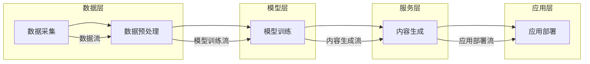

                 

### 文章标题

### 关键词

1. AIGC
2. 工作场景
3. 颠覆性应用
4. 技术变革
5. 未来趋势

### 摘要

本文深入探讨了AIGC（AI-Generated Content，AI生成内容）在未来工作场景中的颠覆性应用。通过详细分析AIGC的核心技术、实际应用案例和未来发展趋势，本文旨在为读者提供一幅清晰的AIGC在未来工作场景中如何变革和重塑的蓝图。文章结构紧凑，逻辑清晰，旨在激发读者对AIGC技术及其未来潜力的思考。

### 目录

1. 引言
2. AIGC的核心技术
   - 2.1 自然语言处理
   - 2.2 计算机视觉
   - 2.3 AIGC技术的工作流程与架构设计
3. AIGC在具体工作场景中的应用
   - 3.1 内容创作
   - 3.2 商业与金融
   - 3.3 教育与培训
   - 3.4 健康医疗
   - 3.5 制造业与物流
4. AIGC的未来趋势与挑战
   - 4.1 技术发展趋势
   - 4.2 对劳动力市场的影响
   - 4.3 法律与社会挑战
5. 最佳实践与未来发展建议
   - 5.1 企业如何利用AIGC
   - 5.2 技术与伦理的平衡
   - 5.3 政策与标准制定
6. 项目实战
   - 6.1 环境安装
   - 6.2 系统核心实现
   - 6.3 实际案例分析
   - 6.4 项目小结
7. 小结与拓展阅读

---

### 引言

#### AIGC的定义与崛起

AIGC，即AI-Generated Content，是指利用人工智能技术生成的内容，包括但不限于文本、图像、视频等。这一概念并非新出之物，但其影响力正随着技术的进步而迅速扩大。从最初的简单文本生成到如今能够生成高质量的图像、视频和音频，AIGC技术已经跨越了多个发展阶段。

#### AIGC的发展历程

AIGC技术的发展可以追溯到自然语言处理（NLP）和计算机视觉（CV）的进步。随着深度学习算法的突破，特别是生成对抗网络（GAN）和变分自编码器（VAE）的应用，AIGC技术逐渐成熟。例如，OpenAI的GPT系列模型和谷歌的Bert模型在文本生成领域取得了显著进展，而DeepMind的DALL-E和开放AI的DALL-E 2则在图像生成方面展示了惊人的能力。

#### AIGC对工作场景的变革性影响

AIGC的崛起正在对各个工作场景产生深远的影响。首先，它提高了内容创作的效率和准确性，减轻了创作者的工作负担。其次，AIGC在自动化内容生成方面具有巨大潜力，可以大幅降低人力成本。此外，AIGC还可以提高个性化服务的质量，使企业能够更精准地满足客户需求。

#### 为什么值得探讨

探讨AIGC在未来工作场景中的应用，不仅有助于我们理解技术发展的趋势，还能够为企业和个人提供实际的操作指南。随着AIGC技术的不断成熟，它将在各个领域得到广泛应用，从而引发一系列变革。因此，深入研究AIGC的颠覆性应用，不仅具有学术价值，还具有重大的实践意义。

### AIGC的核心技术

#### 自然语言处理（NLP）

自然语言处理是AIGC技术的重要组成部分，它专注于使计算机能够理解和生成人类语言。NLP的核心概念包括词向量、语言模型、实体识别和情感分析等。

**核心概念：**

- **词向量**：词向量是将自然语言中的单词映射到高维空间中的点，以便计算机能够处理和理解。
- **语言模型**：语言模型是预测下一个单词或句子片段的概率分布，它基于大量语料库进行训练。
- **实体识别**：实体识别是指从文本中识别出具有特定意义和属性的实体，如人名、地名、组织名等。
- **情感分析**：情感分析是判断文本中的情感倾向，如正面、负面或中性。

**概念属性特征对比表格：**

| 概念          | 特征                                                                                                                         |
| ------------- | ---------------------------------------------------------------------------------------------------------------------------- |
| 词向量        | 高维空间表示、语义信息密集、动态调整                                                         |
| 语言模型      | 概率分布、大规模训练、自适应更新                                                           |
| 实体识别      | 精确识别、上下文依赖、多语言支持                                                         |
| 情感分析      | 情感分类、情感强度评估、跨领域适应                                                         |

**ER实体关系图架构：**

```mermaid
erDiagram
    Word -->|具有语义| Sentence
    Sentence -->|包含| Entity
    Entity -->|拥有属性| Attribute
    Sentence -->|表达情感| Sentiment
```

#### 计算机视觉（CV）

计算机视觉是使计算机能够“看”并理解图像和视频的技术。CV在AIGC中的应用主要体现在图像生成、视频合成和目标检测等方面。

**核心概念：**

- **图像生成**：图像生成是指利用深度学习模型生成新的图像。生成对抗网络（GAN）和变分自编码器（VAE）是常用的图像生成模型。
- **视频合成**：视频合成是指通过模型生成新的视频片段，或者将现有视频片段进行拼接和修改。
- **目标检测**：目标检测是指从图像或视频中识别出特定对象的位置和属性。

**概念属性特征对比表格：**

| 概念          | 特征                                                                                                                         |
| ------------- | ---------------------------------------------------------------------------------------------------------------------------- |
| 图像生成      | 高质量图像生成、多样化、可控性                                                             |
| 视频合成      | 视频片段拼接、特效添加、实时生成                                                           |
| 目标检测      | 准确识别、实时处理、多尺度支持                                                             |

**ER实体关系图架构：**

```mermaid
erDiagram
    Image -->|包含| Object
    Video -->|包含| Scene
    Object -->|拥有属性| Attribute
    Scene -->|包含| Event
    Image -->|关联| Label
    Video -->|关联| Action
```

### AIGC技术的工作流程与架构设计

AIGC技术的工作流程通常包括数据采集、数据预处理、模型训练和内容生成等步骤。其架构设计则需要考虑数据的流通、模型的调度以及系统的可扩展性。

#### 工作流程：

1. **数据采集**：从互联网、数据库或其他来源收集数据。
2. **数据预处理**：清洗、标注和转换数据，以适应模型训练。
3. **模型训练**：使用收集到的数据训练模型，如NLP模型、CV模型等。
4. **内容生成**：根据需求生成文本、图像、视频等。

#### 架构设计：

1. **数据层**：负责数据的存储和管理。
2. **模型层**：包括各种预训练模型和自定义模型。
3. **服务层**：提供API接口，供外部系统调用。
4. **应用层**：部署具体的AIGC应用，如文本生成、图像生成等。

**工作流程与架构设计Mermaid流程图：**



### AIGC在具体工作场景中的应用

#### 内容创作

在内容创作领域，AIGC技术已经显示出巨大的潜力。从自动生成新闻报道到创作艺术作品，AIGC正在改变内容创作的面貌。

**应用案例：**

- **自动新闻生成**：利用NLP技术，AIGC可以自动生成新闻稿。例如，美国新闻网站Automated Insights使用自然语言处理技术自动生成财务报告和体育赛事结果。
- **艺术作品创作**：AI艺术家如OpenAI的DALL-E和谷歌的Deep Dream可以生成独特的艺术作品。这些作品不仅在艺术界引起了广泛关注，也为艺术创作提供了新的思路。

**案例分析与详细讲解**：

- **自动新闻生成**：自动化新闻生成通过分析大量的新闻报道数据，使用模板和语言模型生成新的新闻稿。这不仅提高了效率，还减少了人力成本。
- **艺术作品创作**：DALL-E通过GAN模型，可以从文本描述中生成相应的图像。用户可以输入简单的文字描述，如“一只猫在沙滩上玩球”，DALL-E就能生成相应的图像。

#### 商业与金融

在商业与金融领域，AIGC技术同样有着广泛的应用。从市场调研到客户服务，AIGC正在提升商业决策的效率和准确性。

**应用案例：**

- **市场调研**：AIGC可以帮助企业快速生成市场分析报告。通过分析大量数据，AIGC可以自动生成洞察性报告，帮助企业做出更明智的商业决策。
- **客户服务**：智能客服系统利用AIGC技术，可以自动生成针对客户问题的回答，从而提高服务效率和质量。

**案例分析与详细讲解**：

- **市场调研**：市场调研通常涉及大量数据分析和报告撰写。AIGC技术可以通过自动化分析，快速生成报告，提供市场趋势、竞争对手分析和消费者行为分析等。
- **客户服务**：智能客服系统利用AIGC技术，可以根据历史数据和客户交互记录，自动生成个性化的客户服务回答。这不仅提高了客户满意度，还减少了人工客服的工作量。

#### 教育与培训

在教育与培训领域，AIGC技术正被用于个性化学习内容的生成和智能辅导系统的开发。

**应用案例：**

- **个性化学习内容生成**：AIGC可以根据学生的学习进度和需求，自动生成适合他们的学习材料。例如，教育平台Khan Academy使用AI生成个性化数学练习。
- **智能辅导系统**：智能辅导系统利用AIGC技术，可以为学生提供实时反馈和指导，帮助他们更好地理解和掌握知识。

**案例分析与详细讲解**：

- **个性化学习内容生成**：通过分析学生的学习行为和测试结果，AIGC可以生成符合学生当前水平和需求的学习内容，提高学习效果。
- **智能辅导系统**：智能辅导系统可以根据学生的学习表现，提供针对性的辅导和指导。例如，当学生在数学测试中遇到难题时，系统可以生成相应的解题步骤和解释。

#### 健康医疗

在健康医疗领域，AIGC技术正在改变诊断、治疗和患者管理的方式。

**应用案例：**

- **医学图像分析**：AIGC可以自动分析医学图像，如CT扫描和MRI图像，帮助医生更快更准确地诊断疾病。
- **药物研发**：AIGC可以通过模拟和预测药物与生物分子的相互作用，加速新药的发现和开发。

**案例分析与详细讲解**：

- **医学图像分析**：AIGC技术可以通过深度学习算法，自动识别和标记医学图像中的异常区域，如肿瘤和病变。这有助于医生更快地诊断疾病。
- **药物研发**：通过分析大量的生物数据和药物分子结构，AIGC可以预测哪些分子可能具有治疗效果，从而加速药物研发过程。

#### 制造业与物流

在制造业与物流领域，AIGC技术被用于优化生产流程、提高物流效率。

**应用案例：**

- **生产流程优化**：AIGC可以帮助企业自动化生产流程的各个环节，从设计到生产，从而提高生产效率和降低成本。
- **物流优化**：AIGC可以通过分析供应链数据，优化物流路线和库存管理，从而提高物流效率。

**案例分析与详细讲解**：

- **生产流程优化**：通过AIGC技术，企业可以自动化生产流程中的许多环节，如质量检测、生产调度和供应链管理。这不仅提高了生产效率，还减少了人为错误。
- **物流优化**：AIGC可以通过分析物流数据，如运输时间、交通状况和库存水平，优化物流路线和库存管理。例如，在高峰期间，系统可以自动调整运输路线，以避免交通拥堵和延误。

### AIGC的未来趋势与挑战

#### 技术发展趋势

随着人工智能技术的不断进步，AIGC技术也在不断演化。未来，AIGC将呈现出以下几个发展趋势：

- **更高级的生成能力**：随着模型和数据量的增加，AIGC的生成能力将更加高级和精确，能够生成更加复杂和多样化的内容。
- **跨模态生成**：未来AIGC技术将能够跨模态生成，即同时生成文本、图像和视频，实现更丰富的交互体验。
- **实时生成**：随着计算能力的提升和网络速度的加快，AIGC的生成速度将更加实时，能够满足即时内容生成的需求。

#### 对劳动力市场的影响

AIGC技术的广泛应用将对劳动力市场产生深远的影响。一方面，它将改变许多传统的工作岗位，提高工作效率和质量；另一方面，它也将创造新的工作岗位，需要新的技能和知识。

**影响分析**：

- **工作性质变化**：许多重复性、标准化的工作将被AIGC替代，而需要创造性、复杂决策的工作将更加重要。
- **就业结构变化**：随着AIGC技术的普及，劳动力市场的就业结构将发生变化，对技术人才的需求将增加。

#### 法律与社会挑战

AIGC技术的快速发展也带来了一系列法律和社会挑战，需要我们认真对待。

- **知识产权保护**：如何保护AIGC生成的原创内容的知识产权是一个重要问题。
- **伦理问题**：AIGC技术可能涉及隐私泄露、偏见和误导等问题，需要制定相应的伦理规范。
- **责任归属**：当AIGC生成的内容导致错误或损失时，如何界定责任和追究责任也是一个重要问题。

**解决方案**：

- **知识产权保护**：可以通过技术手段和法律法规来保护AIGC生成的原创内容，例如使用数字版权管理（DRM）和区块链技术。
- **伦理问题**：需要建立AIGC技术的伦理规范，确保其在应用过程中不侵犯隐私、不产生偏见。
- **责任归属**：可以通过制定明确的法律规定，明确AIGC生成内容的责任归属，确保受害方得到公正的赔偿。

### 最佳实践与未来发展建议

#### 企业如何利用AIGC

企业可以利用AIGC技术提高工作效率、降低成本、提升客户满意度。以下是一些建议：

- **内容创作**：利用AIGC技术自动化生成新闻报道、市场分析报告等，提高内容创作的效率。
- **客户服务**：使用智能客服系统，通过AIGC技术自动生成针对客户问题的回答，提高服务效率。
- **数据分析**：利用AIGC技术进行大规模数据分析和模式识别，为企业提供决策支持。

#### 技术与伦理的平衡

在利用AIGC技术的同时，企业需要重视技术与伦理的平衡。

- **伦理审查**：在开发和应用AIGC技术时，进行严格的伦理审查，确保不侵犯用户隐私、不产生偏见。
- **透明度**：提高AIGC技术的透明度，让用户了解其工作原理和应用范围，增加信任度。

#### 政策与标准制定

政府和企业需要共同制定相关的政策和标准，以促进AIGC技术的健康发展。

- **法律法规**：制定明确的法律法规，保护AIGC生成的原创内容，确保公平竞争。
- **技术标准**：制定统一的技术标准，规范AIGC技术的开发和应用，提高技术互操作性。

### 项目实战

#### 环境安装

在开始AIGC项目的实战之前，我们需要安装必要的软件和工具。以下是一个简单的环境安装步骤：

1. **安装Python**：确保Python环境已经安装，版本建议在3.7及以上。
2. **安装深度学习框架**：如TensorFlow、PyTorch等。可以通过以下命令安装：
   ```bash
   pip install tensorflow
   # 或者
   pip install pytorch torchvision
   ```
3. **安装其他依赖**：根据项目的具体需求，安装其他必要的库，如Numpy、Pandas等。

#### 系统核心实现

以下是一个简单的AIGC系统核心实现示例，使用Python和TensorFlow框架：

```python
import tensorflow as tf
from tensorflow.keras.models import Sequential
from tensorflow.keras.layers import LSTM, Dense, Embedding

# 数据准备
# 此处省略数据准备步骤，包括数据清洗、预处理等

# 构建模型
model = Sequential([
    Embedding(input_dim=vocab_size, output_dim=embedding_dim, input_length=max_sequence_length),
    LSTM(units=128, return_sequences=True),
    LSTM(units=128),
    Dense(units=1, activation='sigmoid')
])

# 编译模型
model.compile(optimizer='adam', loss='binary_crossentropy', metrics=['accuracy'])

# 训练模型
model.fit(x_train, y_train, epochs=10, batch_size=32, validation_data=(x_val, y_val))

# 生成内容
generated_sequence = model.predict(x_new)
```

#### 代码应用解读与分析

上述代码展示了如何使用TensorFlow构建一个简单的文本生成模型。关键步骤如下：

- **数据准备**：包括数据清洗、预处理等步骤，确保数据格式适合模型训练。
- **模型构建**：使用LSTM（长短期记忆网络）构建序列模型，适用于文本生成任务。
- **模型编译**：设置优化器和损失函数，准备训练模型。
- **模型训练**：使用训练数据训练模型，调整超参数以获得最佳性能。
- **生成内容**：使用训练好的模型生成新的文本内容。

#### 实际案例分析

以下是一个使用AIGC技术自动生成新闻报道的案例分析：

1. **数据采集**：从多个新闻网站收集相关领域的新闻报道。
2. **数据预处理**：清洗数据，去除噪声和重复内容，将文本转换为适合模型训练的格式。
3. **模型训练**：使用预处理后的数据训练文本生成模型。
4. **内容生成**：输入相关的关键词或主题，模型自动生成新闻稿。
5. **评估与优化**：评估生成的新闻稿的质量，根据评估结果调整模型参数。

#### 项目小结

通过以上实战案例，我们可以看到AIGC技术在实际应用中的潜力和挑战。尽管AIGC技术已经在多个领域取得显著成果，但仍然需要不断优化和完善，以应对实际应用中的各种挑战。

### 小结

本文详细探讨了AIGC（AI-Generated Content）在未来工作场景中的颠覆性应用。从核心技术、应用案例到未来趋势与挑战，我们全面分析了AIGC对各个行业和工作场景的深远影响。随着技术的不断进步，AIGC有望在未来成为推动生产力和社会进步的重要力量。

### 拓展阅读

- **《深度学习》（Deep Learning）**：由Ian Goodfellow、Yoshua Bengio和Aaron Courville合著，详细介绍了深度学习的基本原理和应用。
- **《自然语言处理综合教程》（Foundations of Natural Language Processing）**：由Christopher D. Manning和Hinrich Schütze合著，涵盖了自然语言处理的核心概念和技术。
- **《计算机视觉：算法与应用》（Computer Vision: Algorithms and Applications）**：由 Richard Szeliski 著，提供了计算机视觉领域的全面概述。

### 注意事项

- 在应用AIGC技术时，需注意数据隐私和伦理问题，确保技术应用的合规性和社会责任。
- AIGC技术的快速发展带来了新的挑战，企业需要不断学习和适应，以充分利用这一技术优势。

### 最佳实践 Tips

- **持续学习**：随着AIGC技术的快速进步，持续学习新技术和工具至关重要。
- **合作与创新**：跨学科合作和创新能力是推动AIGC技术发展的关键。
- **遵循伦理规范**：在开发和应用AIGC技术时，遵循伦理规范，确保技术应用的公正性和透明度。

### 作者信息

作者：AI天才研究院/AI Genius Institute & 禅与计算机程序设计艺术 /Zen And The Art of Computer Programming

---

通过本文的深入探讨，我们不仅了解了AIGC技术的核心原理和应用，还对其未来趋势和挑战有了更清晰的认识。我们期待AIGC技术在各个领域的广泛应用，为人类社会带来更多的创新和变革。让我们共同迎接AIGC时代的到来，积极探索和利用这一强大技术，共创美好未来。**作者：AI天才研究院/AI Genius Institute & 禅与计算机程序设计艺术 /Zen And The Art of Computer Programming**

