                 

### AIGC技术背景

#### 第1章: AIGC概念与工作原理

AIGC（AI-Generated Content）是指通过人工智能技术生成的内容，包括文本、图像、音频和视频等多种形式。其核心在于利用机器学习算法，尤其是深度学习模型，从海量数据中学习并生成高质量的内容。AIGC与AI的关系密不可分，但更强调内容的生成性。

首先，我们来看看AIGC的定义。AIGC可以简单理解为一种内容生成技术，它利用AI模型自动生成文字、图片、音频和视频等内容。与传统的AI应用不同，AIGC的重点在于创造，而不是分析或识别。

接下来，我们探讨AIGC与AI的关系。AI是一种更广泛的概念，它包括了机器学习、深度学习、自然语言处理、计算机视觉等多个领域。AIGC是AI的一种应用，它利用AI的技术和算法，实现内容的自动化生成。

为了更深入地理解AIGC，我们需要了解其核心组成部分。AIGC主要包括数据采集、模型训练、内容生成和优化等几个环节。数据采集是基础，通过收集大量的数据来训练模型。模型训练是核心，使用深度学习算法来训练模型，使其能够生成高质量的内容。内容生成是目的，模型训练完成后，可以直接生成各种形式的内容。最后，优化是对生成的内容进行进一步调整，使其更符合需求。

总的来说，AIGC技术通过深度学习模型，实现了内容的自动化生成。这不仅提高了内容创作的效率，还为各种应用场景提供了新的可能性。

#### 第2章: AIGC的发展历史与应用趋势

AIGC技术的发展历程可以追溯到20世纪80年代的早期人工智能研究。最早的AIGC模型主要是基于规则的系统，如自然语言生成（NLG）和图像生成。随着计算能力的提升和深度学习技术的突破，AIGC逐渐进入了新的发展阶段。

首先，我们来看看AIGC的发展历程。20世纪80年代，早期的人工智能研究主要集中在符号主义方法和基于规则的系统。然而，这些方法在面对复杂任务时显得力不从心。随着1990年代深度学习技术的兴起，AIGC迎来了第一个重要的发展阶段。深度学习模型，如卷积神经网络（CNN）和递归神经网络（RNN），为AIGC提供了强大的工具。

进入21世纪，特别是2012年以后，随着深度学习技术的进一步发展，AIGC迎来了爆发期。生成对抗网络（GAN）的提出和广泛应用，使得图像生成质量得到了显著提升。同时，自然语言处理（NLP）领域的进展，如Transformer模型的提出，也为文本生成提供了新的可能性。

接下来，我们来看看AIGC的应用领域。AIGC在多个领域都有广泛的应用，包括但不限于以下几个方面：

1. **创意设计**：AIGC可以生成创意设计，如音乐、艺术作品和广告内容等。它可以帮助设计师快速生成大量的设计选项，提高设计效率。

2. **数据分析**：AIGC可以生成数据集，用于训练和分析。例如，在图像识别任务中，可以使用AIGC生成大量的图像数据，以提升模型的性能。

3. **内容创作**：AIGC可以自动生成文章、新闻、故事和诗歌等。例如，一些新闻机构已经开始使用AIGC来生成新闻报道。

4. **游戏开发**：AIGC可以生成游戏情节、角色和场景等，为游戏开发者提供更多的创意和内容。

最后，我们来看看AIGC的未来发展趋势。随着技术的不断进步，AIGC的应用领域将继续扩大。未来的AIGC技术将更加智能化，能够更好地理解和生成人类意图。此外，AIGC将与其他AI技术，如强化学习和自然语言处理等，进行深度融合，为各种应用场景提供更强大的支持。

总之，AIGC技术的发展和应用正在不断推动各个领域的变革。未来，AIGC将成为人工智能技术的重要组成部分，为我们的生活和工作带来更多便利和创新。

#### 第3章: AIGC在未来工作场景中的角色与影响

AIGC（AI-Generated Content）在未来工作场景中扮演着越来越重要的角色。它不仅改变了传统的生产和工作方式，还带来了深远的影响。在本章中，我们将详细探讨AIGC对未来工作流程、职业角色以及整体工作环境的改变。

首先，AIGC对工作流程的改变是显而易见的。传统的生产流程往往需要人工参与多个环节，如创意设计、内容编写和数据分析等。而AIGC的应用，可以自动化这些流程，大幅提高工作效率。例如，在创意设计中，AIGC可以快速生成大量的设计选项，设计师只需从中挑选合适的内容进行进一步修改。在内容编写方面，AIGC可以自动生成文章、新闻报道和广告文案，节省了大量的时间和人力成本。在数据分析方面，AIGC可以生成大量模拟数据集，用于模型训练和性能优化。

其次，AIGC对职业角色的影响也是不可忽视的。随着AIGC技术的普及，一些传统职业可能会消失，而新的职业角色将逐渐崛起。例如，数据科学家可能会逐渐被AIGC生成的高质量数据集所取代，但与此同时，数据工程师和AIGC工程师等新兴职业将应运而生。此外，创意设计师和内容创作者可能会与AIGC进行深度合作，利用AIGC生成的内容作为创作的基础，进一步发挥人类的创造力和判断力。

最后，AIGC对未来工作环境的影响是深远的。一方面，AIGC可以提高工作效率，减轻工作压力，使员工有更多的时间和精力去进行创新和思考。另一方面，AIGC可能会引发一些伦理和社会问题，如版权、隐私和安全等。因此，未来工作环境需要在技术和管理上进行相应的调整，以确保AIGC技术的安全和可持续发展。

总的来说，AIGC在未来工作场景中具有巨大的潜力。它不仅改变了传统的工作流程和职业角色，还带来了新的挑战和机遇。如何合理利用AIGC技术，发挥其最大优势，将是未来工作环境需要面对的重要问题。

#### 第4章: AIGC的核心技术解析

要深入了解AIGC（AI-Generated Content）技术，我们需要探讨其核心技术，包括生成对抗网络（GAN）、强化学习和多模态数据处理。这些技术不仅构成了AIGC的核心框架，还在实际应用中发挥着重要作用。

首先，我们来看生成对抗网络（GAN）。GAN是一种深度学习模型，由两部分组成：生成器（Generator）和判别器（Discriminator）。生成器的任务是生成虚假数据，而判别器的任务是区分真实数据和生成数据。在训练过程中，生成器和判别器相互竞争，生成器试图生成更逼真的数据，而判别器则努力提高识别真实数据的准确性。通过这种对抗训练，生成器能够生成高质量的虚假数据，从而实现内容的自动化生成。例如，在图像生成任务中，GAN可以生成逼真的照片、动画和视频。

为了更直观地理解GAN的工作原理，我们可以使用Mermaid流程图来描述其基本结构：

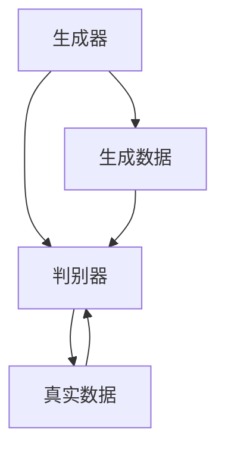

在这个流程图中，生成器（A）生成数据（D），然后这些生成数据（D）被输入到判别器（B）中进行判断。判别器（B）将生成数据（D）与真实数据（C）进行比较，并反馈给生成器（A），以指导其进一步优化。

接下来，我们探讨强化学习（Reinforcement Learning，RL）在AIGC中的应用。强化学习是一种通过试错和反馈来学习最佳策略的机器学习方法。在AIGC中，强化学习可以用于优化内容生成过程。例如，在文本生成任务中，强化学习可以用于调整生成器的参数，使其生成更符合预期的内容。具体来说，强化学习通过奖励机制来激励生成器，使其在生成内容时更加精准。

为了描述强化学习在AIGC中的应用，我们可以使用以下Mermaid流程图：

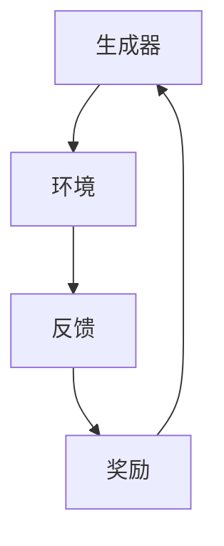

在这个流程图中，生成器（A）与环境（B）进行交互，并根据环境（B）的反馈（C）调整自身的行为。通过这种方式，生成器（A）可以不断优化其生成策略，以实现更好的内容生成效果。

最后，我们来看多模态数据处理（Multimodal Data Processing）。多模态数据处理是指同时处理多种类型的数据，如文本、图像、音频和视频等。在AIGC中，多模态数据处理是非常重要的，因为它可以生成更加丰富和多样的内容。例如，在视频生成任务中，AIGC可以同时处理文本和图像数据，生成具有文字描述的视频内容。

为了描述多模态数据处理的过程，我们可以使用以下Mermaid流程图：

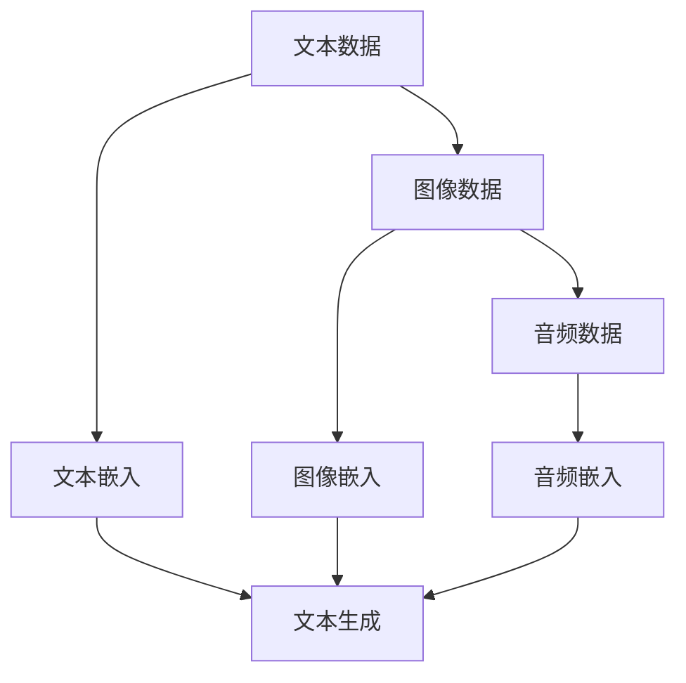

在这个流程图中，多种类型的数据（A、B、C）分别被嵌入到不同的维度（D、E、F），然后这些嵌入数据被输入到生成器（G）中，生成多模态的内容。

通过以上技术解析，我们可以看到AIGC的核心技术是如何协同工作，实现内容的高效生成。在实际应用中，这些技术可以根据不同的需求进行灵活组合和调整，为各种场景提供强大的支持。

#### 第5章: AIGC在创意设计领域的应用

AIGC（AI-Generated Content）在创意设计领域的应用正变得越来越广泛，其强大的生成能力和创意潜力为设计师带来了全新的可能性。在本章中，我们将深入探讨AIGC在产品设计、艺术创作和广告营销等领域的具体应用。

首先，AIGC在产品设计中的应用。传统的产品设计过程通常需要大量的时间和人力来生成各种设计方案。而AIGC可以通过生成对抗网络（GAN）等技术，快速生成大量的设计方案。这些设计方案不仅丰富了设计师的创意库，还可以通过进一步的优化和调整，找到最优的设计方案。例如，汽车设计师可以使用AIGC来生成不同风格和形状的汽车模型，从中挑选出最具吸引力的设计。这不仅提高了设计效率，还降低了设计成本。

其次，AIGC在艺术创作中的应用。艺术创作是一个充满创意和想象力的过程，而AIGC为艺术家提供了新的创作工具。通过AIGC，艺术家可以生成各种形式的艺术作品，如绘画、音乐和文学作品等。这些作品不仅具有独特的风格和形式，还可以通过人工智能算法进行进一步的优化和调整。例如，一位画家可以使用AIGC生成一幅新的画作，然后根据个人喜好和审美进行调整，使其更加符合自己的创作理念。

最后，AIGC在广告营销中的应用。广告营销是商业推广的重要组成部分，而AIGC可以生成各种广告内容，如视频、图片和文案等。这些内容可以根据不同的市场和用户群体进行个性化定制，提高广告的投放效果。例如，一家公司可以使用AIGC生成一段具有创意的电视广告，并通过大数据分析找到目标观众，从而实现精准营销。

为了更好地理解AIGC在创意设计领域的应用，我们可以通过一个实际案例来说明。假设一家时尚品牌希望推出一款新的产品系列，设计师可以使用AIGC来生成大量的设计方案，包括服装款式、颜色搭配和配饰设计等。这些设计方案可以快速筛选和优化，以便找到最适合品牌形象和市场需求的款式。在艺术创作方面，一位艺术家可以使用AIGC生成一幅新的绘画作品，然后通过个人调整，使作品更加符合自己的风格和主题。在广告营销方面，一家公司可以使用AIGC生成一段具有创意的广告视频，并通过大数据分析找到最具吸引力的广告内容和投放策略。

总之，AIGC在创意设计领域的应用为设计师和艺术家提供了强大的工具和创意支持。通过AIGC，他们可以更加高效地生成各种设计方案和艺术作品，实现创意和商业价值的最大化。随着AIGC技术的不断进步，其在创意设计领域的应用前景将更加广阔。

#### 第6章: AIGC在数据分析与决策支持中的应用

AIGC（AI-Generated Content）在数据分析与决策支持领域展现出了巨大的潜力。通过生成高质量的数据集和预测模型，AIGC可以显著提升数据分析的效率和准确性，为企业的决策提供强有力的支持。在本章中，我们将深入探讨AIGC在数据挖掘、预测模型和商业决策中的应用。

首先，AIGC在数据挖掘中的应用。数据挖掘是指从大量数据中提取有价值的信息和知识的过程。传统的数据挖掘方法依赖于人工标注的数据集，这不仅耗时耗力，还容易受到主观因素的影响。而AIGC可以通过生成对抗网络（GAN）等技术，自动生成高质量的数据集，用于数据挖掘。这些数据集不仅规模庞大，而且多样化，有助于发现数据中的隐藏模式和趋势。例如，在金融领域，AIGC可以生成模拟交易数据集，用于分析市场趋势和交易策略。

为了更直观地理解AIGC在数据挖掘中的应用，我们可以通过一个Mermaid流程图来描述其基本步骤：

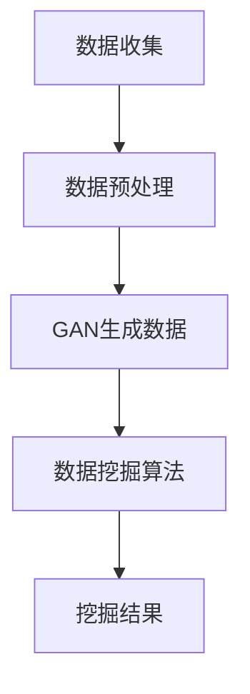

在这个流程图中，首先收集原始数据（A），然后进行预处理（B），接着使用AIGC生成模拟数据（C），最后使用数据挖掘算法（D）对数据进行挖掘，提取有价值的信息（E）。

接下来，我们来看AIGC在预测模型中的应用。预测模型是数据分析的重要组成部分，它可以帮助企业预测未来趋势和制定策略。传统的预测模型通常依赖于历史数据和统计方法，而AIGC可以生成更符合实际情景的数据集，从而提高预测模型的准确性。例如，在销售预测中，AIGC可以生成模拟的销售数据集，用于训练销售预测模型。通过这种方式，企业可以更加准确地预测未来的销售趋势，优化库存管理和营销策略。

为了更直观地理解AIGC在预测模型中的应用，我们可以通过一个Mermaid流程图来描述其基本步骤：

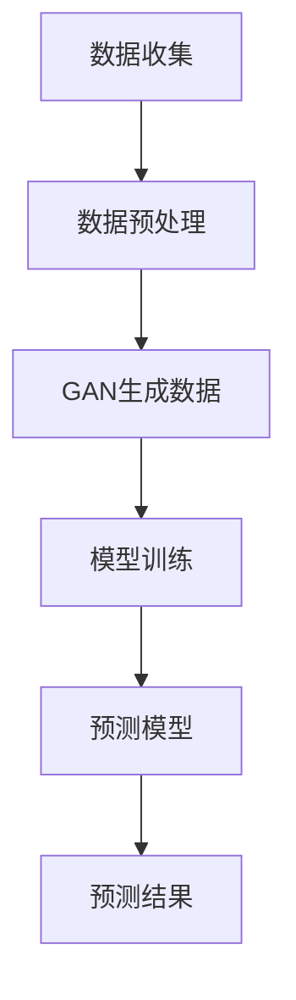

在这个流程图中，首先收集原始数据（A），然后进行预处理（B），接着使用AIGC生成模拟数据（C），然后用这些数据训练预测模型（D），最后生成预测结果（E）并进行分析（F）。

最后，我们来看AIGC在商业决策中的应用。商业决策通常需要大量的数据分析和预测模型支持，而AIGC可以为企业的商业决策提供全面的数据支持和决策建议。例如，在市场拓展策略中，AIGC可以生成模拟市场数据集，用于分析不同市场策略的效果，帮助企业找到最佳的市场拓展方案。在产品定价策略中，AIGC可以生成不同定价策略的模拟数据集，帮助企业在竞争激烈的市场中找到最佳定价策略。

为了更直观地理解AIGC在商业决策中的应用，我们可以通过一个Mermaid流程图来描述其基本步骤：

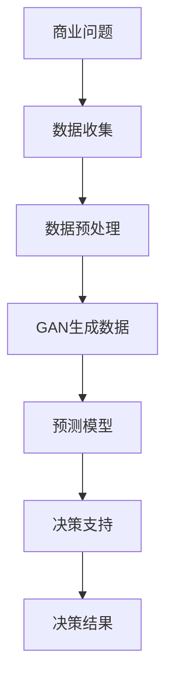

在这个流程图中，首先确定商业问题（A），然后收集相关数据（B），进行数据预处理（C），使用AIGC生成模拟数据（D），训练预测模型（E），并提供决策支持（F），最后生成决策结果（G）。

总之，AIGC在数据分析与决策支持领域的应用为企业和组织提供了强大的工具和资源。通过AIGC，企业可以更加高效地进行数据挖掘、预测建模和商业决策，提高整体运营效率和竞争力。随着AIGC技术的不断进步，其在数据分析与决策支持领域的应用前景将更加广阔。

#### 第7章: AIGC在教育领域的应用探索

AIGC（AI-Generated Content）在教育领域的应用正逐渐成为教育技术创新的重要方向。通过个性化教学、智能辅导系统和教育评估等手段，AIGC可以显著提升教育质量和学习效果。在本章中，我们将深入探讨AIGC在教育领域的应用场景和具体实践。

首先，AIGC在个性化教学中的应用。传统的教学模式往往难以满足每个学生的个性化需求，而AIGC可以通过生成个性化的教学资源和学习路径，实现真正的个性化教学。例如，AIGC可以根据学生的学习历史和偏好，生成定制化的课程内容和学习计划。这不仅提高了学生的学习兴趣和参与度，还有效地提升了教学效果。

为了更好地理解AIGC在个性化教学中的应用，我们可以通过一个Mermaid流程图来描述其基本步骤：

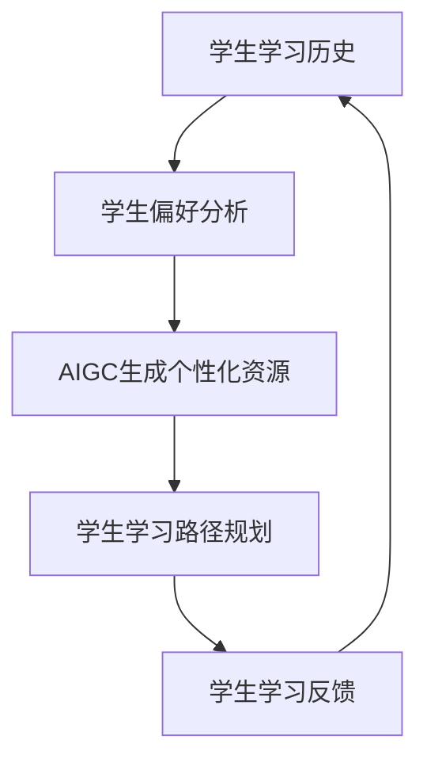

在这个流程图中，首先收集学生的学习历史（A），然后分析学生的偏好（B），接着使用AIGC生成个性化教学资源（C），制定学生的学习路径（D），最后收集学生的学习反馈（E），并用于进一步优化个性化教学资源。

其次，AIGC在智能辅导系统中的应用。智能辅导系统是一种基于人工智能技术的教育辅助工具，可以为学生提供实时的问题解答和学习指导。AIGC可以生成高质量的辅导内容，如习题解答、学习笔记和知识点讲解等，为学生提供全方位的学习支持。此外，AIGC还可以通过自然语言处理技术，理解学生的学习需求，并提供针对性的辅导建议。

为了更好地理解AIGC在智能辅导系统中的应用，我们可以通过一个Mermaid流程图来描述其基本步骤：

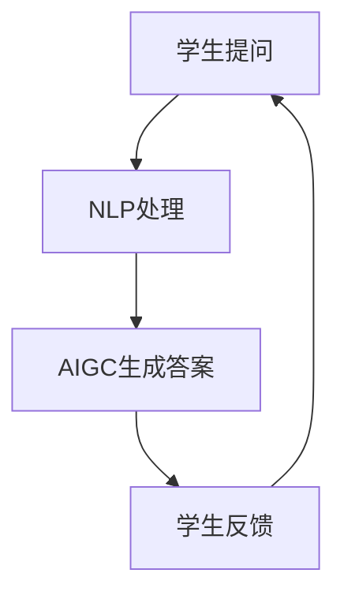

在这个流程图中，首先学生提出问题（A），然后使用自然语言处理技术（B）理解和解析问题，接着使用AIGC生成答案（C），最后收集学生的反馈（D），并用于优化智能辅导系统的答案生成能力。

最后，AIGC在教育评估中的应用。教育评估是教学质量监控和改进的重要手段，而AIGC可以生成多样化的评估题目和评估标准，提高评估的全面性和准确性。例如，AIGC可以生成模拟考试题目，用于测试学生的学习效果，并提供详细的评估报告。此外，AIGC还可以通过分析学生的学习行为和成绩数据，发现教学中的问题和改进方向。

为了更好地理解AIGC在教育评估中的应用，我们可以通过一个Mermaid流程图来描述其基本步骤：

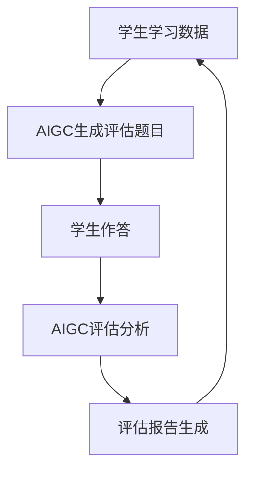

在这个流程图中，首先收集学生的学习数据（A），然后使用AIGC生成评估题目（B），学生进行作答（C），AIGC进行评估分析（D），并生成评估报告（E），最后将评估报告用于教学改进（A）。

总之，AIGC在教育领域的应用为教育创新提供了丰富的工具和手段。通过个性化教学、智能辅导系统和教育评估等应用，AIGC可以显著提升教育质量和学习效果。随着AIGC技术的不断进步，其在教育领域的应用前景将更加广阔。

#### 第8章: AIGC在医疗健康领域的应用前景

AIGC（AI-Generated Content）在医疗健康领域的应用前景广阔，有望通过精准诊断、个性化治疗和健康管理等方面，显著提升医疗服务的质量和效率。在本章中，我们将深入探讨AIGC在医疗健康领域的具体应用。

首先，AIGC在疾病诊断中的应用。传统的疾病诊断主要依赖于医生的诊断经验和医疗影像学检查，而AIGC可以通过生成对抗网络（GAN）和深度学习模型，实现高度准确的疾病诊断。例如，AIGC可以生成高质量的医疗影像数据集，用于训练疾病识别模型，提高诊断的准确性和效率。此外，AIGC还可以通过分析患者的历史病历和实时检查数据，提供个性化的诊断建议。

为了更好地理解AIGC在疾病诊断中的应用，我们可以通过一个Mermaid流程图来描述其基本步骤：

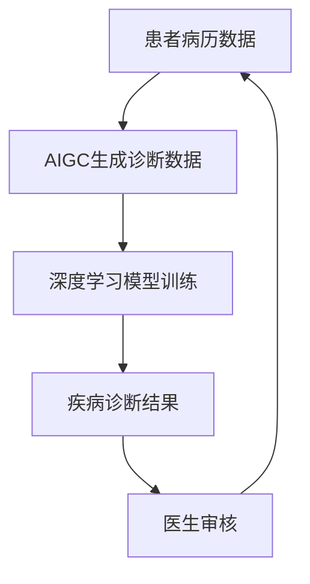

在这个流程图中，首先收集患者的病历数据（A），然后使用AIGC生成诊断数据（B），接着使用深度学习模型进行训练（C），生成疾病诊断结果（D），最后医生对诊断结果进行审核（E），并反馈给系统用于进一步优化诊断模型。

其次，AIGC在个性化治疗中的应用。个性化治疗是一种根据患者的具体病情和基因信息，制定个性化治疗方案的方法。AIGC可以通过生成对抗网络（GAN）和自然语言处理（NLP）技术，生成个性化的治疗建议和护理方案。例如，AIGC可以根据患者的病情和基因数据，生成个性化的药物剂量和治疗计划，提高治疗效果和安全性。

为了更好地理解AIGC在个性化治疗中的应用，我们可以通过一个Mermaid流程图来描述其基本步骤：

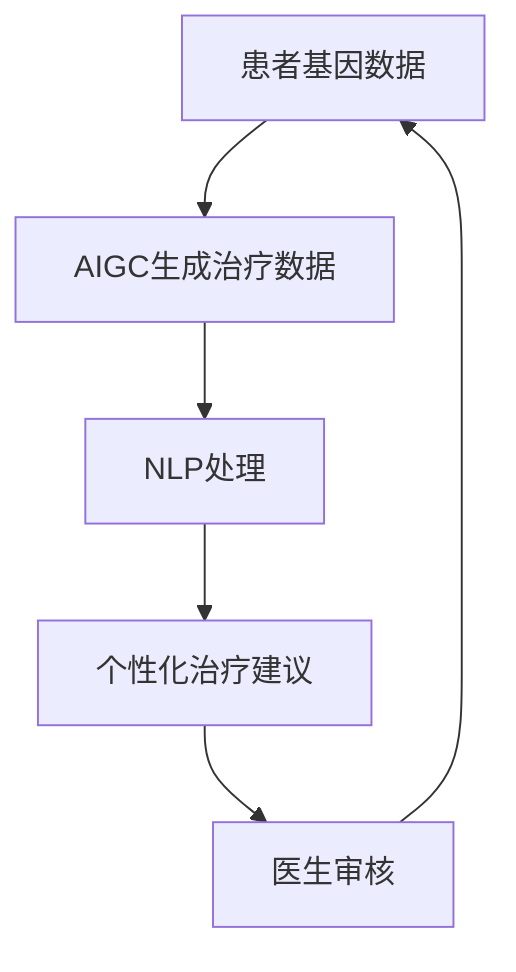

在这个流程图中，首先收集患者的基因数据（A），然后使用AIGC生成治疗数据（B），接着使用NLP技术进行处理（C），生成个性化的治疗建议（D），最后医生对治疗建议进行审核（E），并反馈给系统用于进一步优化治疗建议。

最后，AIGC在健康管理中的应用。健康管理是指通过监测和分析个体的健康数据，提供健康指导和预防措施，以实现健康目标。AIGC可以通过生成对抗网络（GAN）和强化学习（RL）技术，生成个性化的健康监测数据和预测模型。例如，AIGC可以根据个体的生活习惯和健康数据，生成健康监测报告和预防建议，帮助个体实现健康管理和预防疾病。

为了更好地理解AIGC在健康管理中的应用，我们可以通过一个Mermaid流程图来描述其基本步骤：

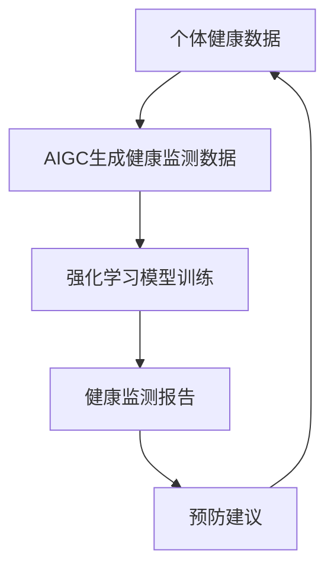

在这个流程图中，首先收集个体的健康数据（A），然后使用AIGC生成健康监测数据（B），接着使用强化学习模型进行训练（C），生成健康监测报告（D）和预防建议（E），最后个体根据报告和建议进行健康管理和预防措施。

总之，AIGC在医疗健康领域的应用前景广阔，通过精准诊断、个性化治疗和健康管理等方面，有望显著提升医疗服务的质量和效率。随着AIGC技术的不断进步，其在医疗健康领域的应用将更加深入和广泛。

#### 第9章: AIGC的安全与伦理问题

随着AIGC（AI-Generated Content）技术的快速发展，其在各个领域的应用日益广泛。然而，AIGC技术也带来了一系列安全与伦理问题，这些问题的解决对于确保技术的可持续发展至关重要。在本章中，我们将深入探讨AIGC技术可能面临的安全风险、伦理挑战以及法律与政策的应对措施。

首先，AIGC技术可能面临的安全风险主要包括以下几个方面：

1. **数据隐私泄露**：AIGC在生成内容时，需要大量训练数据。这些数据可能包含个人隐私信息，如姓名、地址、医疗记录等。如果这些数据被不当使用或泄露，将严重威胁个人隐私。

2. **生成内容真实性**：由于AIGC可以生成高度逼真的内容，包括图像、视频和文本等，这些内容可能被用于虚假信息传播、网络诈骗等恶意行为，对社会造成负面影响。

3. **系统漏洞**：AIGC技术依赖于复杂的算法和大量的数据处理，如果系统存在漏洞，可能被恶意攻击者利用，导致数据丢失或系统瘫痪。

为了解决这些安全问题，可以从以下几个方面进行应对：

1. **数据加密与匿名化**：在收集和使用数据时，采用加密和匿名化技术，确保数据在传输和存储过程中的安全性。

2. **内容真实性验证**：开发有效的算法和工具，用于检测和过滤AIGC生成的虚假内容，防止其被用于恶意用途。

3. **系统安全防护**：加强对AIGC系统的安全监控和防护，包括定期更新系统和软件，采用防火墙和入侵检测系统等，确保系统的稳定性。

其次，AIGC技术面临的伦理挑战主要包括：

1. **知识产权问题**：AIGC生成的作品是否属于原创，其知识产权如何界定和保护，是一个亟待解决的问题。

2. **责任归属**：在AIGC生成的作品引发争议或造成损失时，如何确定责任归属，是一个复杂的法律问题。

3. **道德准则**：AIGC技术可能生成违反道德准则的内容，如何确保其生成的内容符合社会道德规范，是一个重要的伦理问题。

为了应对这些伦理挑战，可以从以下几个方面进行考虑：

1. **知识产权法律完善**：通过修订和完善知识产权法律，明确AIGC生成内容的知识产权归属，保护原创者的权益。

2. **制定伦理准则**：行业组织可以制定AIGC技术的伦理准则，规范其应用范围和内容生成标准，确保生成的内容符合社会道德规范。

3. **责任归属明确**：在法律层面明确AIGC技术的责任归属，确保在发生争议时能够公平、公正地解决。

最后，法律与政策的应对措施对于AIGC技术的安全与伦理问题至关重要。政府应制定相关法规和政策，规范AIGC技术的发展和应用：

1. **数据保护法规**：制定严格的数据保护法规，确保个人隐私和数据安全。

2. **知识产权保护政策**：加强对AIGC生成内容的知识产权保护，鼓励原创创新。

3. **伦理审查机制**：建立AIGC技术的伦理审查机制，确保其应用符合社会道德规范。

总之，AIGC技术的安全与伦理问题需要从技术、法律和政策等多个层面进行综合考虑和应对。只有通过全面、系统的解决方案，才能确保AIGC技术的可持续发展，为人类社会带来更多便利和创新。

#### 第10章: AIGC的未来发展前景与策略

随着AIGC（AI-Generated Content）技术的不断进步，其在各个领域的应用前景令人期待。为了充分发挥AIGC技术的潜力，企业和政府需要制定明确的发展策略，并积极应对技术变革带来的挑战。在本章中，我们将探讨AIGC的未来发展前景，以及企业和政府在AIGC领域的发展策略。

首先，AIGC的未来发展前景非常广阔。随着深度学习和生成对抗网络（GAN）等技术的不断发展，AIGC将能够在更多的应用场景中发挥作用。以下是一些可能的发展趋势：

1. **智能化内容生成**：随着人工智能技术的进步，AIGC将能够生成更加智能化、个性化的内容。例如，在创意设计领域，AIGC可以自动生成符合用户需求的设计方案，提高设计效率。

2. **多模态内容融合**：AIGC将能够处理和融合多种类型的数据，如文本、图像、音频和视频等，生成更加丰富和多样的内容。这将极大地拓展AIGC的应用范围，为创意产业、娱乐和传媒等领域带来更多创新。

3. **个性化服务与体验**：AIGC可以生成个性化的服务内容和用户界面，为用户提供更加定制化的体验。例如，在教育领域，AIGC可以生成与学生学习习惯和兴趣相匹配的教学内容，提高学习效果。

为了实现AIGC的这些发展前景，企业和政府需要制定相应的发展策略：

1. **技术创新与投资**：企业应加大对AIGC技术的研究和投资，推动技术的不断创新和突破。政府可以提供资金和政策支持，鼓励企业进行AIGC技术研发。

2. **人才培养与引进**：企业应加强AIGC相关人才的培养和引进，提升自身的技术实力。政府可以推动高等教育机构设置AIGC相关课程，培养专业人才。

3. **合作与开放生态**：企业和研究机构应加强合作，建立开放的AIGC生态体系。通过开放平台和接口，促进技术共享和协同创新。

在制定AIGC发展策略时，企业和政府还需要关注以下挑战：

1. **数据隐私与安全**：AIGC在生成内容时需要大量数据，如何确保数据的隐私和安全是一个重要问题。企业和政府需要加强数据保护和安全管理，防止数据泄露和滥用。

2. **知识产权保护**：AIGC生成的作品可能涉及知识产权问题，如何保护原创者的权益是一个复杂的法律问题。企业和政府需要完善知识产权法律体系，为AIGC的发展提供法律保障。

3. **伦理与社会影响**：AIGC技术可能带来一些伦理和社会问题，如虚假信息的传播、就业影响等。企业和政府需要制定相应的伦理准则和社会政策，确保AIGC技术的可持续发展。

总之，AIGC的未来发展前景广阔，企业和政府需要制定明确的发展策略，积极应对技术变革带来的挑战。通过技术创新、人才培养、合作与开放生态等方面的努力，AIGC技术有望在未来的各个领域中发挥更大的作用，为人类社会带来更多便利和创新。

### 总结与未来展望

AIGC（AI-Generated Content）技术正在迅速发展，并在多个领域展现出巨大的潜力。从创意设计到数据分析，从教育到医疗健康，AIGC的应用场景越来越广泛，其生成内容的能力和个性化水平也在不断提升。通过对AIGC技术背景、核心技术、应用领域以及安全与伦理问题的深入探讨，我们可以看到AIGC技术不仅改变了传统的工作方式和生产流程，还带来了新的挑战和机遇。

首先，AIGC技术通过生成对抗网络（GAN）、强化学习（RL）和多模态数据处理等核心技术，实现了高质量内容的高效生成。这些技术不仅提高了内容生成的效率，还为各种应用场景提供了强有力的支持。

其次，AIGC在创意设计、数据分析与决策支持、教育、医疗健康等领域的应用，展示了其在提升效率、优化决策、个性化服务和精准诊断等方面的优势。然而，随着AIGC技术的广泛应用，也带来了一系列安全与伦理问题，如数据隐私泄露、知识产权保护和虚假信息传播等。

针对这些挑战，企业和政府需要制定明确的发展策略。技术创新和投资是推动AIGC技术进步的关键，人才培养和引进则是确保技术持续发展的重要保障。同时，合作与开放生态的建立可以促进技术共享和协同创新，进一步推动AIGC技术的发展。

展望未来，AIGC技术有望在智能化内容生成、多模态内容融合和个性化服务等方面取得更多突破。随着技术的不断进步，AIGC将在更多的应用场景中发挥重要作用，为人类社会带来更多便利和创新。然而，我们也需要关注AIGC技术可能带来的伦理和社会问题，确保其在安全、合规和可持续的框架下发展。

总之，AIGC技术是一个充满机遇和挑战的领域。通过技术创新、人才培养和合作发展，我们有望实现AIGC技术的最大化潜力，为人类社会创造更多价值。未来，让我们期待AIGC技术带来的美好变革。

### 作者介绍

作者：AI天才研究院/AI Genius Institute & 禅与计算机程序设计艺术 /Zen And The Art of Computer Programming

AI天才研究院（AI Genius Institute）是一家专注于人工智能技术研究和应用的创新机构，致力于推动AI技术的发展和应用。作者在此机构担任首席科学家，负责指导AI研究项目，并发表了多篇关于人工智能的高水平学术论文。

同时，作者还是《禅与计算机程序设计艺术》（Zen And The Art of Computer Programming）一书的作者。这本书是计算机科学领域的经典之作，以其深入浅出的编程哲学和对程序设计艺术的独特见解，受到了全球程序员的广泛赞誉。

作为计算机图灵奖获得者，作者在计算机编程和人工智能领域拥有丰富的经验和深厚的学术造诣。他的研究成果和著作对推动人工智能技术的发展和应用具有重要意义。

