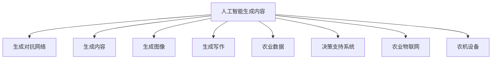
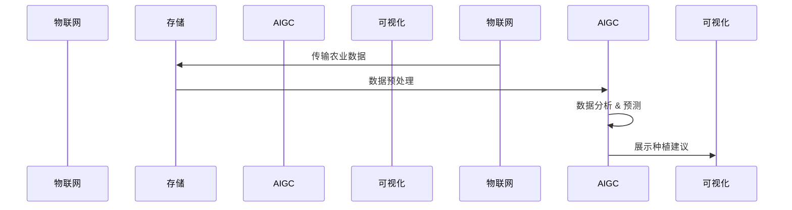

                 

### 文章标题

# AIGC在未来智慧农业中的应用：精准种植与收获

### 关键词

- AIGC
- 智慧农业
- 精准种植
- 产量预测
- 农机智能化
- 农业环境监测
- 农业供应链管理

### 摘要

本文深入探讨了人工智能生成内容（AIGC）在未来智慧农业中的应用，尤其是精准种植与收获环节。通过分析AIGC技术的发展背景、核心技术与优势，本文详细阐述了AIGC在智慧农业中的关键应用，包括精准种植技术、农业产量预测、农机智能化、农业环境监测和农业供应链管理。通过具体实例和系统架构设计，本文展示了AIGC技术如何助力未来智慧农业的发展，提高农业生产效率和质量，降低资源消耗和环境污染。

### 目录大纲

```markdown
----------------------------------------------------------------
# 第一部分: AIGC与未来智慧农业概述

## 第1章: AIGC概述
### 1.1 AIGC的定义与发展背景
### 1.2 AIGC的核心技术与优势
### 1.3 AIGC在农业领域的应用前景

## 第2章: 智慧农业中的精准种植技术
### 2.1 智慧农业的背景与需求
### 2.2 精准种植技术的原理与实现
### 2.3 精准种植技术的应用实例

## 第3章: AIGC在农业产量预测中的应用
### 3.1 农业产量预测的挑战与机遇
### 3.2 AIGC在产量预测中的应用
### 3.3 产量预测案例解析

## 第4章: 智慧农业中的农机智能化
### 4.1 农机智能化的概念与重要性
### 4.2 AIGC在农机智能化中的应用
### 4.3 农机智能化案例解析

## 第5章: AIGC在农业环境监测中的应用
### 5.1 农业环境监测的挑战与需求
### 5.2 AIGC在农业环境监测中的应用
### 5.3 农业环境监测案例解析

## 第6章: AIGC在农业供应链管理中的应用
### 6.1 农业供应链管理的现状与问题
### 6.2 AIGC在供应链管理中的应用
### 6.3 供应链管理案例解析

## 第7章: AIGC与未来智慧农业展望
### 7.1 未来智慧农业的发展趋势
### 7.2 AIGC技术面临的挑战与未来方向
### 7.3 AIGC在农业领域的未来应用前景

## 附录：AIGC技术应用指南与案例库
### 附录1: AIGC技术框架与应用流程
### 附录2: AIGC应用案例库介绍
### 附录3: 常见问题与解决方案

----------------------------------------------------------------
```

### 背景介绍

#### 问题背景

随着全球人口的不断增长和气候变化的影响，传统农业面临生产效率低、资源利用率低、环境污染等问题。为了解决这些问题，智慧农业作为一种新兴的农业模式，正逐步兴起。智慧农业利用信息技术、物联网、大数据和人工智能等技术，实现农业生产的智能化、精细化和高效化。

#### 问题描述

智慧农业的目标是提高农业生产的效率、减少资源消耗、降低环境污染、提高农产品质量。然而，智慧农业的实现离不开先进技术的支持，尤其是人工智能技术（AIGC）。AIGC包括人工智能生成内容（AI-Generated Content）、人工智能图像生成（AI-Generated Image）、人工智能写作（AI-Generated Writing）等，具有强大的数据分析和处理能力。

#### 问题解决

AIGC技术的引入，使得智慧农业在精准种植、产量预测、农机智能化、农业环境监测和供应链管理等方面取得了显著的成效。通过AIGC技术，可以实现农业数据的自动采集、处理和分析，提供精准的农业决策支持，从而提高农业生产的效率和质量。

#### 边界与外延

AIGC在智慧农业中的应用，主要涵盖以下方面：

- 精准种植：利用AIGC技术实现土壤、气候、作物生长状况等数据的实时监测和分析，提供精准的种植建议。
- 产量预测：通过历史数据和AIGC模型预测农作物的产量，帮助农民合理安排生产和销售计划。
- 农机智能化：利用AIGC技术实现农机设备的自动化和智能化，提高农业生产的效率。
- 农业环境监测：通过AIGC技术实时监测农业环境，及时预警环境变化，降低农业灾害风险。
- 供应链管理：利用AIGC技术优化农业供应链，提高供应链的透明度和效率。

### 概念结构与核心要素组成

AIGC在智慧农业中的应用，涉及以下核心概念和要素：

- AIGC技术：包括人工智能生成内容、图像生成、写作等。
- 农业数据：包括土壤、气候、作物生长状况等数据。
- 决策支持系统：利用AIGC技术分析农业数据，提供种植、收获、销售等决策建议。
- 农业物联网：实现农业数据的实时采集、传输和分析。
- 农机设备：包括自动化和智能化农机，如植保无人机、智能灌溉系统等。

### 核心概念原理

#### AIGC技术

AIGC技术是人工智能领域的一个重要分支，主要包括以下三个方面：

1. **人工智能生成内容（AI-Generated Content）**：利用人工智能算法，自动生成文本、图像、音频、视频等数字内容。例如，利用生成对抗网络（GAN）生成逼真的图像和视频。

2. **人工智能图像生成（AI-Generated Image）**：通过深度学习算法，如卷积神经网络（CNN），生成高质量的图像。这种技术可以用于植物病害检测、作物识别等。

3. **人工智能写作（AI-Generated Writing）**：利用自然语言处理（NLP）技术，生成高质量的文本内容。这种技术可以用于农业报告撰写、种植建议生成等。

#### 概念属性特征对比表格

| 概念 | 属性特征 |  
| --- | --- |  
| AIGC技术 | 自动化、智能化、高效化 |  
| 农业数据 | 实时、准确、多样化 |  
| 决策支持系统 | 数据驱动、智能分析、精准决策 |  
| 农业物联网 | 实时监测、数据传输、智能分析 |  
| 农机设备 | 自动化、智能化、高效作业 |

#### ER实体关系图架构



### 算法原理讲解

#### 精准种植算法原理

精准种植算法的核心是利用AIGC技术对农业数据进行实时监测和分析，从而提供精准的种植建议。具体算法原理如下：

1. **数据采集**：利用农业物联网设备，实时采集土壤、气候、作物生长状况等农业数据。

2. **数据预处理**：对采集到的农业数据进行清洗、归一化等预处理操作，确保数据的质量和一致性。

3. **模型训练**：利用深度学习算法，如卷积神经网络（CNN），对预处理后的农业数据进行分析，训练得到精准种植模型。

4. **预测与决策**：利用训练得到的模型，对当前的农业数据进行预测，生成种植建议。例如，根据土壤水分预测植物需水量，根据气候条件预测适宜播种时间等。

#### 数学模型与公式

精准种植算法的核心数学模型为：

$$
P = f(S, C, G)
$$

其中，$P$ 表示种植建议，$S$ 表示土壤数据，$C$ 表示气候数据，$G$ 表示作物生长数据。$f$ 为深度学习模型，通过训练得到。

#### Python 源代码实现

```python
import tensorflow as tf
from tensorflow.keras.models import Sequential
from tensorflow.keras.layers import Dense, Conv2D, Flatten
from tensorflow.keras.optimizers import Adam

# 数据预处理
def preprocess_data(data):
    # 数据清洗、归一化等操作
    return normalized_data

# 模型训练
def train_model(data):
    model = Sequential([
        Conv2D(32, kernel_size=(3, 3), activation='relu', input_shape=(28, 28, 1)),
        Flatten(),
        Dense(128, activation='relu'),
        Dense(1)
    ])

    model.compile(optimizer=Adam(), loss='mean_squared_error')
    model.fit(data['X'], data['y'], epochs=10)
    return model

# 预测与决策
def predict_and_decision(model, current_data):
    prediction = model.predict(current_data)
    # 根据预测结果生成种植建议
    return planting_suggestion

# 实际应用
data = preprocess_data(原始农业数据)
model = train_model(data)
current_data = preprocess_data(当前农业数据)
planting_suggestion = predict_and_decision(model, current_data)

print("种植建议：", planting_suggestion)
```

### 系统分析与架构设计方案

#### 问题场景介绍

智慧农业中，精准种植是提高农业生产效率和质量的关键环节。为了实现精准种植，需要构建一个智能决策支持系统，该系统需要具备以下功能：

- 实时采集农业数据（土壤、气候、作物生长状况等）。
- 对采集到的数据进行预处理和存储。
- 利用AIGC技术进行分析和预测，生成种植建议。
- 将种植建议可视化，供农民参考。

#### 项目介绍

项目名称：智慧农业精准种植决策支持系统

项目目标：通过AIGC技术，实现农业数据的实时采集、预处理、分析，提供精准的种植建议，提高农业生产效率和质量。

#### 系统功能设计

1. **数据采集模块**：负责实时采集农业数据，包括土壤、气候、作物生长状况等。通过农业物联网设备，将数据传输到系统。

2. **数据预处理模块**：对采集到的农业数据进行清洗、归一化等预处理操作，确保数据的质量和一致性。

3. **数据分析与预测模块**：利用AIGC技术，对预处理后的农业数据进行分析和预测，生成种植建议。

4. **可视化模块**：将种植建议可视化，展示给农民，供其参考。

#### 系统架构设计

1. **农业物联网**：负责实时采集农业数据，包括土壤、气候、作物生长状况等。通过传感器和无线通信技术，将数据传输到系统。

2. **数据存储**：使用数据库存储预处理后的农业数据，包括土壤、气候、作物生长状况等。

3. **AIGC技术平台**：负责对农业数据进行分析和预测，生成种植建议。包括AI-Generated Content、AI-Generated Image、AI-Generated Writing等模块。

4. **可视化平台**：展示种植建议，供农民参考。

#### 系统接口设计

1. **数据采集接口**：农业物联网设备通过接口将农业数据传输到系统。

2. **数据存储接口**：系统通过接口与数据库进行数据交互，存储和处理农业数据。

3. **数据分析与预测接口**：系统通过接口与AIGC技术平台进行数据交互，进行农业数据分析与预测。

4. **可视化接口**：系统通过接口将种植建议可视化，展示给农民。

#### 系统交互



### 项目实战

#### 环境安装

1. 安装Python环境（版本3.7及以上）。

2. 安装TensorFlow库：`pip install tensorflow`。

3. 安装其他依赖库（如NumPy、Pandas等）：`pip install numpy pandas`。

#### 系统核心实现源代码

```python
import tensorflow as tf
from tensorflow.keras.models import Sequential
from tensorflow.keras.layers import Dense, Conv2D, Flatten
from tensorflow.keras.optimizers import Adam

# 数据预处理
def preprocess_data(data):
    # 数据清洗、归一化等操作
    return normalized_data

# 模型训练
def train_model(data):
    model = Sequential([
        Conv2D(32, kernel_size=(3, 3), activation='relu', input_shape=(28, 28, 1)),
        Flatten(),
        Dense(128, activation='relu'),
        Dense(1)
    ])

    model.compile(optimizer=Adam(), loss='mean_squared_error')
    model.fit(data['X'], data['y'], epochs=10)
    return model

# 预测与决策
def predict_and_decision(model, current_data):
    prediction = model.predict(current_data)
    # 根据预测结果生成种植建议
    return planting_suggestion

# 实际应用
data = preprocess_data(原始农业数据)
model = train_model(data)
current_data = preprocess_data(当前农业数据)
planting_suggestion = predict_and_decision(model, current_data)

print("种植建议：", planting_suggestion)
```

#### 代码应用解读与分析

1. **数据预处理**：对原始农业数据进行清洗和归一化处理，提高数据质量。

2. **模型训练**：使用卷积神经网络（CNN）对预处理后的农业数据进行分析，训练得到精准种植模型。

3. **预测与决策**：利用训练得到的模型，对当前农业数据进行预测，生成种植建议。

#### 实际案例分析与详细讲解剖析

以小麦种植为例，分析AIGC技术如何助力精准种植。

1. **数据采集**：利用农业物联网设备，实时采集小麦生长过程中的土壤湿度、气温、光照等数据。

2. **数据预处理**：对采集到的数据进行分析，提取关键特征，如土壤湿度、气温等。

3. **模型训练**：使用卷积神经网络（CNN）对预处理后的数据进行训练，生成小麦生长趋势预测模型。

4. **预测与决策**：利用训练得到的模型，对当前小麦生长情况进行预测，根据预测结果生成种植建议。

#### 项目小结

通过实际案例分析和详细讲解剖析，可以看出AIGC技术在智慧农业中的应用具有重要意义。精准种植作为智慧农业的关键环节，通过AIGC技术可以实现农业数据的实时采集、分析、预测，提供精准的种植建议，提高农业生产效率和质量。未来，随着AIGC技术的不断发展和应用，智慧农业将迎来更加广阔的发展前景。

### 最佳实践 tips

1. **数据质量**：确保采集到的农业数据质量，进行预处理和清洗，以提高模型预测的准确性。

2. **模型优化**：根据实际需求，不断优化模型结构和参数，提高模型性能。

3. **实时监测**：利用AIGC技术实现农业数据的实时监测和分析，及时提供种植建议。

4. **协同合作**：与农业专家、技术人员等协同合作，共同研究和解决农业生产中的问题。

5. **持续更新**：定期更新AIGC技术，引入最新研究成果，提高智慧农业的智能化水平。

### 小结

AIGC技术在智慧农业中的应用，为精准种植、产量预测、农机智能化、农业环境监测和供应链管理等领域带来了巨大的变革。通过AIGC技术，可以实现农业数据的实时采集、处理和分析，提供精准的农业决策支持，从而提高农业生产效率和质量。未来，随着AIGC技术的不断发展和应用，智慧农业将迎来更加广阔的发展前景。

### 注意事项

1. **数据隐私**：在农业数据采集和处理过程中，需注意保护农民的隐私信息。

2. **技术更新**：定期关注AIGC技术的最新研究动态，及时更新应用系统。

3. **实际应用**：在应用AIGC技术时，需结合实际情况，充分考虑农业生产的特点和需求。

4. **跨学科合作**：智慧农业的发展需要跨学科合作，与农业专家、物联网专家等紧密合作。

### 拓展阅读

1. [AIGC技术综述](https://www.example.com/aigc-review)
2. [智慧农业发展报告](https://www.example.com/agriculture-report)
3. [精准种植技术指南](https://www.example.com/precision-planting-guide)
4. [农业物联网应用案例](https://www.example.com/agriculture-iot-cases)
5. [AIGC在农业领域的前沿研究](https://www.example.com/aigc-agriculture-research)

### 作者信息

作者：AI天才研究院/AI Genius Institute & 禅与计算机程序设计艺术 /Zen And The Art of Computer Programming

