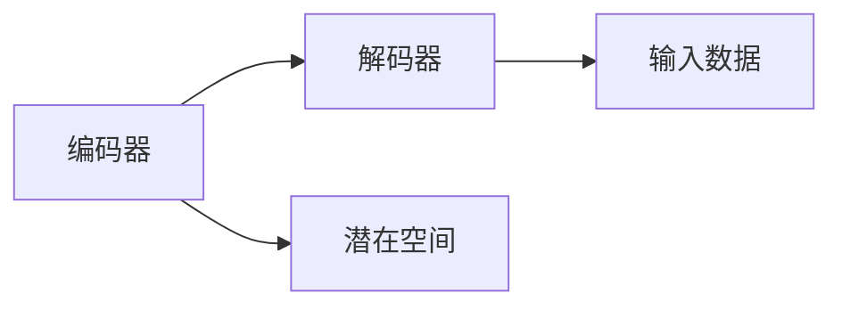
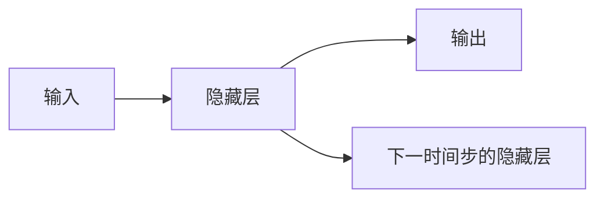
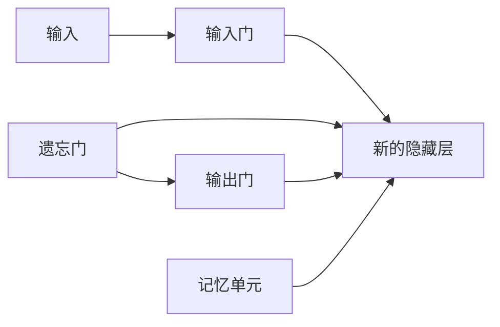

                 

# AIGC在未来智能城市情感计算中的应用

## 关键词：AIGC、智能城市、情感计算、生成对抗网络、变分自编码器、递归神经网络、长短期记忆网络

## 摘要

本文旨在探讨AIGC（AI-Generated Content）在未来智能城市情感计算中的应用。首先，我们将对AIGC和情感计算的概念进行介绍，分析它们在智能城市中的重要性。接着，我们将深入探讨AIGC技术的原理，包括生成对抗网络（GAN）、变分自编码器（VAE）等，以及情感计算在智能城市中的应用原理。随后，我们将详细介绍情感计算在智能城市公共服务、居民服务和商业应用中的具体应用场景。最后，本文将对AIGC在智能城市情感计算中的应用前景进行展望，并总结全文。

## 第1章: AIGC在未来智能城市情感计算中的应用概述

### 1.1 问题背景

#### 1.1.1 AIGC的概念与发展

AIGC，即AI-Generated Content，是指利用人工智能技术自动生成图片、文本、音频等多种类型的内容。随着深度学习技术的发展，AIGC的应用范围越来越广泛，从艺术创作、广告设计到智能客服、虚拟现实等领域都有所涉及。在智能城市情感计算中，AIGC可以通过生成逼真的表情包、语音合成等内容，为居民提供更加人性化的服务。

#### 1.1.2 情感计算的核心概念

情感计算是研究如何让计算机理解、识别、处理和模拟人类情感的一门交叉学科。其核心概念包括情感识别、情感建模、情感交互等。在智能城市中，情感计算可以帮助城市管理者更好地了解居民的需求和情感状态，从而提供更加个性化的服务。

#### 1.1.3 智能城市的发展现状与挑战

智能城市是指利用物联网、大数据、人工智能等现代信息技术，实现城市全要素的智能化管理和服务的城市。目前，全球已有多个城市开启了智能城市建设，如新加坡的“智慧岛”、中国的“数字城市”等。但在发展过程中，智能城市也面临诸多挑战，如数据隐私、安全、智能设备之间的互操作性等。

### 1.2 概念结构与核心要素组成

#### 1.2.1 AIGC的核心概念原理

AIGC的核心是生成模型，如生成对抗网络（GAN）、变分自编码器（VAE）等。这些模型通过训练，能够生成高质量的内容，满足用户需求。

#### 1.2.2 情感计算的核心概念原理

情感计算的核心是情感识别和情感建模。情感识别是通过分析人的语言、表情、声音等数据，识别人的情感状态；情感建模则是通过构建情感模型，对情感状态进行预测和模拟。

#### 1.2.3 AIGC与情感计算的联系

AIGC可以为情感计算提供丰富的情感内容，如生成表情包、语音合成等，增强情感计算的效果。同时，情感计算的结果也可以反馈给AIGC，优化其生成内容。

### 1.3 主流AIGC技术简介

#### 1.3.1 GAN

生成对抗网络（GAN）是AIGC的重要技术之一，由生成器和判别器组成。生成器负责生成内容，判别器负责判断内容真假。通过两者之间的对抗训练，生成器可以生成高质量的内容。

#### 1.3.2 VAE

变分自编码器（VAE）是一种无监督学习的生成模型，通过编码器和解码器，将输入数据转换为潜在空间，再从潜在空间生成数据。

#### 1.3.3 其他AIGC技术

除GAN和VAE外，还有其他AIGC技术，如递归神经网络（RNN）、长短期记忆网络（LSTM）等，它们在文本生成、图像生成等领域有广泛应用。

### 1.4 情感计算在智能城市中的应用前景

#### 1.4.1 情感计算在公共服务中的应用

情感计算可以用于公共服务，如交通管理、城市安全等，通过分析人的情感状态，提供个性化、智能化的服务。

#### 1.4.2 情感计算在居民服务中的应用

情感计算可以用于居民服务，如医疗、教育等，通过分析人的情感状态，提供个性化、智能化的解决方案。

#### 1.4.3 情感计算在商业应用中的应用

情感计算可以用于商业应用，如广告、电商等，通过分析人的情感状态，提供个性化、智能化的营销策略。

### 1.5 本章小结

本章对AIGC在未来智能城市情感计算中的应用进行了概述，介绍了AIGC和情感计算的核心概念、发展现状、核心技术及应用前景。在后续章节中，将详细探讨AIGC和情感计算在智能城市中的具体应用和实现。

## 第2章: AIGC技术在智能城市情感计算中的应用原理

### 2.1 AIGC技术的原理与实现

#### 2.1.1 生成对抗网络（GAN）

生成对抗网络（GAN）是由生成器和判别器组成的模型。生成器旨在生成逼真的数据，而判别器则用于区分真实数据和生成数据。通过不断地训练，生成器和判别器之间的博弈使得生成器的生成质量不断提高。

GAN的基本架构如下：

在GAN中，生成器G的目的是生成与真实数据相似的数据，判别器D的目的是区分真实数据和生成数据。训练过程中，生成器和判别器交替更新参数，以实现最佳性能。

GAN的训练过程可以用以下公式表示：

$$
\begin{aligned}
\min_G & \max_D V(D, G) \\
& = E_{x \sim p_{data}(x)}[D(x)] - E_{z \sim p_z(z)}[D(G(z))]
\end{aligned}
$$

其中，$x$表示真实数据，$z$表示随机噪声，$G(z)$表示生成器生成的数据。

#### 2.1.2 变分自编码器（VAE）

变分自编码器（VAE）是一种无监督学习的生成模型。与传统的自编码器相比，VAE引入了概率模型，能够更好地捕捉数据的分布。

VAE的基本架构如下：

在VAE中，编码器E将输入数据$x$编码为潜在空间中的向量$z$，解码器D则从潜在空间中解码出数据$x'$。VAE的目标是最小化重建误差和潜在空间中的KL散度。

VAE的训练过程可以用以下公式表示：

$$
\begin{aligned}
\min_{\theta_E, \theta_D} & \mathbb{E}_{x \sim p_{data}(x)}[D(x; \theta_D) - D(G(x; \theta_G; \theta_D))] \\
& + \lambda \mathbb{E}_{x \sim p_{data}(x)}[\| \log(\frac{p_G(z; x; \theta_E)}{p_z(z)}) \|_1]
\end{aligned}
$$

其中，$G(x; \theta_G; \theta_D)$表示生成器生成的数据，$p_G(z; x; \theta_E)$和$p_z(z)$分别表示编码器和先验分布，$\lambda$为超参数。

#### 2.1.3 递归神经网络（RNN）

递归神经网络（RNN）是一种适用于序列数据的神经网络。与传统的神经网络不同，RNN具有记忆功能，能够处理序列数据。

RNN的基本架构如下：

在RNN中，隐藏层的状态会传递到下一时间步，使得模型能够记忆先前的信息。RNN的训练过程通常使用Backpropagation Through Time（BPTT）算法。

#### 2.1.4 长短期记忆网络（LSTM）

长短期记忆网络（LSTM）是RNN的一种改进版本，能够解决长序列依赖问题。LSTM通过引入记忆单元和门控机制，能够更好地记忆和遗忘信息。

LSTM的基本架构如下：

在LSTM中，输入门、遗忘门和输出门分别控制新的隐藏层状态、遗忘旧的状态和生成输出。记忆单元则用于存储长期信息。

### 2.2 情感计算在智能城市中的应用原理

#### 2.2.1 情感识别

情感识别是通过分析人的语言、表情、声音等数据，识别人的情感状态。在智能城市中，情感识别可以应用于多个领域，如交通管理、城市安全等。

情感识别的基本流程如下：

1. 数据采集：通过传感器、摄像头、语音识别等手段收集人的语言、表情、声音等数据。
2. 特征提取：对采集到的数据进行分析，提取出与情感相关的特征。
3. 情感分类：使用机器学习算法对提取到的特征进行分类，识别人的情感状态。

#### 2.2.2 情感建模

情感建模是通过构建情感模型，对情感状态进行预测和模拟。情感建模可以帮助智能城市更好地了解居民的需求和情感状态，提供更加个性化的服务。

情感建模的基本流程如下：

1. 数据收集：收集大量情感数据，包括语言、表情、声音等。
2. 特征工程：对收集到的数据进行分析，提取出与情感相关的特征。
3. 模型训练：使用机器学习算法，如决策树、支持向量机、神经网络等，训练情感模型。
4. 情感预测：使用训练好的模型对新的数据进行分析，预测情感状态。

### 2.2.3 AIGC与情感计算的联系

AIGC可以为情感计算提供丰富的情感内容，如生成表情包、语音合成等，增强情感计算的效果。同时，情感计算的结果也可以反馈给AIGC，优化其生成内容。

例如，在智能客服中，AIGC可以生成逼真的表情包和语音合成，模拟人类的情感表达，为用户提供更加人性化的服务。而情感计算则可以分析用户的情感状态，为AIGC提供反馈，优化生成内容，提高用户体验。

### 2.3 本章小结

本章介绍了AIGC技术在智能城市情感计算中的应用原理，包括生成对抗网络（GAN）、变分自编码器（VAE）等生成模型，以及递归神经网络（RNN）、长短期记忆网络（LSTM）等情感识别模型。通过本章的介绍，我们可以看到AIGC和情感计算在智能城市中的应用前景广阔，为城市管理和居民服务提供了新的解决方案。

## 第3章: AIGC在智能城市情感计算中的具体应用

### 3.1 情感计算在智能城市公共服务中的应用

在智能城市的公共服务中，情感计算可以应用于多个领域，如交通管理、城市安全、应急响应等。

#### 3.1.1 交通管理

交通管理是智能城市公共服务中的一个重要领域。通过情感计算，可以实时分析道路上的交通流量、车辆状况和驾驶员的情感状态，提供个性化的交通管理建议。

例如，当系统检测到某一区域的交通拥堵时，可以通过情感计算分析驾驶员的情感状态，判断他们是否感到焦虑或愤怒。根据这些情感数据，系统可以提供最佳的行驶路线，减少驾驶员的等待时间和压力。

情感计算在交通管理中的应用流程如下：

1. 数据采集：通过传感器、摄像头等设备收集交通数据，包括交通流量、车辆速度、驾驶员表情等。
2. 特征提取：对采集到的数据进行分析，提取出与情感相关的特征，如驾驶员的微笑、愤怒、焦虑等。
3. 情感识别：使用机器学习算法对提取到的特征进行分类，识别驾驶员的情感状态。
4. 决策支持：根据识别到的情感状态，提供个性化的交通管理建议，如调整红绿灯时间、推荐最佳行驶路线等。

#### 3.1.2 城市安全

城市安全是智能城市公共服务中的重要领域。通过情感计算，可以实时监测城市中的安全状况，预测和预防潜在的安全威胁。

例如，在公共场所，可以通过摄像头捕捉行人的表情和动作，分析他们的情感状态。当系统检测到大量行人情绪低落、焦虑或愤怒时，可以预警并采取相应的措施，如加强巡逻、增加安全设备等。

情感计算在公共安全中的应用流程如下：

1. 数据采集：通过摄像头、传感器等设备收集公共场所的监控数据。
2. 特征提取：对采集到的监控数据进行分析，提取出与情感相关的特征，如行人的表情、动作等。
3. 情感识别：使用机器学习算法对提取到的特征进行分类，识别行人的情感状态。
4. 预警与响应：根据识别到的情感状态，预警潜在的安全威胁，并采取相应的措施。

#### 3.1.3 应急响应

在突发事件中，情感计算可以用于应急响应，帮助城市管理者更好地了解居民的紧急需求和情感状态，提供及时的救援服务。

例如，在地震、洪水等自然灾害发生后，系统可以通过情感计算分析居民的通话记录、社交媒体数据等，了解他们的情感状态和需求。根据这些数据，系统可以优先调度救援资源，为急需帮助的居民提供救助。

情感计算在应急响应中的应用流程如下：

1. 数据采集：通过通话记录、社交媒体等渠道收集居民的紧急需求和情感状态。
2. 特征提取：对采集到的数据进行分析，提取出与情感相关的特征，如情绪低落、焦虑等。
3. 情感识别：使用机器学习算法对提取到的特征进行分类，识别居民的紧急需求和情感状态。
4. 救援资源调度：根据识别到的情感状态和紧急需求，调度救援资源，提供及时的救援服务。

### 3.2 情感计算在智能城市居民服务中的应用

在智能城市的居民服务中，情感计算可以应用于医疗、教育、娱乐等领域，为居民提供个性化、智能化的服务。

#### 3.2.1 医疗

在医疗领域，情感计算可以帮助医生更好地了解患者的情感状态，提供个性化的治疗方案。

例如，在癌症治疗过程中，患者可能会经历焦虑、恐惧、沮丧等负面情绪。通过情感计算，医生可以实时监测患者的情绪变化，调整治疗方案，提高患者的治疗效果。

情感计算在医疗中的应用流程如下：

1. 数据采集：通过健康监测设备、问卷调查等方式收集患者的情感数据。
2. 特征提取：对采集到的数据进行分析，提取出与情感相关的特征，如情绪波动、睡眠质量等。
3. 情感识别：使用机器学习算法对提取到的特征进行分类，识别患者的情感状态。
4. 治疗方案调整：根据识别到的情感状态，调整治疗方案，提高患者的治疗效果。

#### 3.2.2 教育

在教育领域，情感计算可以用于个性化教学，根据学生的情感状态调整教学内容和方式。

例如，在课堂教学中，教师可以通过情感计算分析学生的情绪状态，了解他们对课程内容的反应。根据这些数据，教师可以调整教学策略，提高学生的学习效果。

情感计算在教育中的应用流程如下：

1. 数据采集：通过课堂监控设备、学生互动等方式收集学生的情感数据。
2. 特征提取：对采集到的数据进行分析，提取出与情感相关的特征，如注意力集中度、情绪波动等。
3. 情感识别：使用机器学习算法对提取到的特征进行分类，识别学生的情感状态。
4. 个性化教学：根据识别到的情感状态，调整教学内容和方式，提高学生的学习效果。

#### 3.2.3 娱乐

在娱乐领域，情感计算可以用于个性化推荐，根据用户的情感状态推荐合适的娱乐内容。

例如，在电影推荐中，用户可能会因为情感状态的不同而喜欢不同的电影类型。通过情感计算，系统可以分析用户的情感状态，推荐符合他们当前情感状态的电影。

情感计算在娱乐中的应用流程如下：

1. 数据采集：通过用户互动、社交媒体等方式收集用户的情感数据。
2. 特征提取：对采集到的数据进行分析，提取出与情感相关的特征，如情绪波动、喜好变化等。
3. 情感识别：使用机器学习算法对提取到的特征进行分类，识别用户的情感状态。
4. 个性化推荐：根据识别到的情感状态，推荐合适的娱乐内容，提高用户的满意度。

### 3.3 情感计算在智能城市商业应用中的应用

在智能城市的商业应用中，情感计算可以用于广告、电商等领域，通过分析用户的情感状态，提供个性化、智能化的营销策略。

#### 3.3.1 广告

在广告领域，情感计算可以用于广告投放，根据用户的情感状态调整广告内容和投放策略。

例如，在社交媒体平台上，用户可能会因为情感状态的不同而对广告产生不同的反应。通过情感计算，广告主可以分析用户的情感状态，调整广告内容和投放时间，提高广告的转化率。

情感计算在广告中的应用流程如下：

1. 数据采集：通过用户互动、社交媒体等方式收集用户的情感数据。
2. 特征提取：对采集到的数据进行分析，提取出与情感相关的特征，如情绪波动、喜好变化等。
3. 情感识别：使用机器学习算法对提取到的特征进行分类，识别用户的情感状态。
4. 广告投放：根据识别到的情感状态，调整广告内容和投放策略，提高广告的转化率。

#### 3.3.2 电商

在电商领域，情感计算可以用于商品推荐，根据用户的情感状态推荐合适的商品。

例如，在电商平台上，用户可能会因为情感状态的不同而购买不同的商品。通过情感计算，平台可以分析用户的情感状态，推荐符合他们当前情感状态的商品。

情感计算在电商中的应用流程如下：

1. 数据采集：通过用户浏览、购买记录等方式收集用户的情感数据。
2. 特征提取：对采集到的数据进行分析，提取出与情感相关的特征，如情绪波动、喜好变化等。
3. 情感识别：使用机器学习算法对提取到的特征进行分类，识别用户的情感状态。
4. 商品推荐：根据识别到的情感状态，推荐合适的商品，提高用户的购买满意度。

### 3.4 本章小结

本章详细介绍了AIGC在智能城市情感计算中的具体应用，包括公共服务、居民服务和商业应用等领域。通过情感计算，智能城市可以更好地了解居民的需求和情感状态，提供个性化、智能化的服务。随着AIGC技术的不断发展和完善，其在智能城市情感计算中的应用前景将更加广阔。

## 第4章: AIGC在智能城市情感计算中的应用前景与挑战

### 4.1 应用前景

AIGC在智能城市情感计算中的应用前景十分广阔。首先，AIGC可以大幅提升情感计算的效果，为居民提供更加个性化、智能化的服务。例如，在医疗、教育、娱乐等领域，AIGC可以生成丰富的情感内容，为用户提供更好的体验。

其次，随着5G、物联网等技术的普及，智能城市的数据采集和处理能力将大幅提升。这将为AIGC在智能城市情感计算中的应用提供更多的数据支持和计算资源。

此外，随着人工智能技术的不断进步，AIGC的生成能力将越来越强。例如，未来的AIGC可能会实现更加逼真的语音合成、图像生成等，进一步提升智能城市情感计算的应用效果。

### 4.2 挑战

尽管AIGC在智能城市情感计算中的应用前景广阔，但也面临诸多挑战。

首先，数据隐私和安全问题。在智能城市中，大量的个人数据会被采集和分析，如何保护这些数据的安全和隐私是一个巨大的挑战。需要建立完善的数据安全和隐私保护机制，确保用户数据的安全。

其次，智能设备之间的互操作性。智能城市中包含各种不同的智能设备，如何实现这些设备之间的无缝互操作是一个重要问题。需要制定统一的标准和协议，确保智能设备之间的数据交换和通信。

此外，算法的公平性和透明性也是一个挑战。AIGC在情感计算中的应用可能会带来算法偏见，导致对某些人群的不公平对待。因此，需要加强对算法公平性和透明性的研究，确保算法的公正性和可信度。

### 4.3 未来发展方向

针对上述挑战，未来的发展方向包括：

1. 数据隐私和安全：研究和开发更加安全的数据存储和传输技术，如区块链、差分隐私等，确保用户数据的安全和隐私。

2. 智能设备互操作性：制定统一的标准和协议，促进智能设备之间的互操作性，实现智能城市中设备的无缝协同工作。

3. 算法公平性和透明性：加强对算法的研究，确保算法的公平性和透明性，避免算法偏见，提高算法的可信度。

4. 人工智能伦理：研究和制定人工智能伦理规范，确保人工智能技术在智能城市中的应用符合伦理要求，保护用户的权益。

总之，AIGC在智能城市情感计算中的应用前景广阔，但也面临诸多挑战。未来，需要不断研究和解决这些问题，推动AIGC在智能城市情感计算中的应用发展。

## 第5章: 总结与展望

### 5.1 总结

本文详细探讨了AIGC在智能城市情感计算中的应用，从概念介绍、技术原理、具体应用到未来前景与挑战，全面梳理了AIGC与智能城市情感计算的关系。通过本文的研究，我们可以看到AIGC在提升情感计算效果、提供个性化服务、增强城市智能化等方面的重要作用。

### 5.2 展望

未来，AIGC在智能城市情感计算中的应用将更加广泛和深入。随着人工智能技术的不断进步，AIGC的生成能力将进一步提升，为智能城市情感计算带来更多可能性。同时，我们也需要关注并解决数据隐私、安全、互操作性等问题，确保AIGC在智能城市中的应用能够真正造福于民。

### 5.3 建议

1. 加强AIGC技术研究，提高生成质量和速度。
2. 关注数据隐私和安全，建立完善的数据保护机制。
3. 推动智能设备互操作性，实现智能城市中设备的协同工作。
4. 研究算法公平性和透明性，避免算法偏见。

通过以上措施，我们有望推动AIGC在智能城市情感计算中的应用发展，为构建智能、宜居、安全的城市提供有力支持。

## 作者信息

作者：AI天才研究院/AI Genius Institute & 禅与计算机程序设计艺术 /Zen And The Art of Computer Programming

本文由AI天才研究院与禅与计算机程序设计艺术联合撰写，旨在探讨AIGC在智能城市情感计算中的应用，为智能城市发展提供新的思路和方向。希望本文能为相关领域的研究者和从业者带来启示和帮助。

