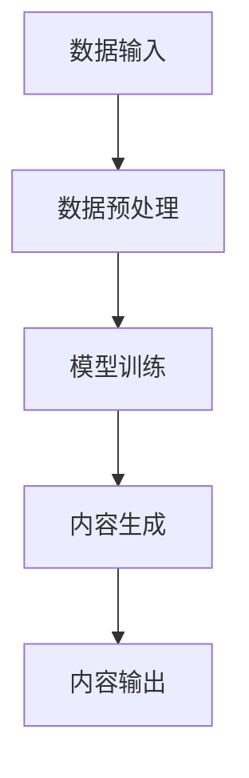
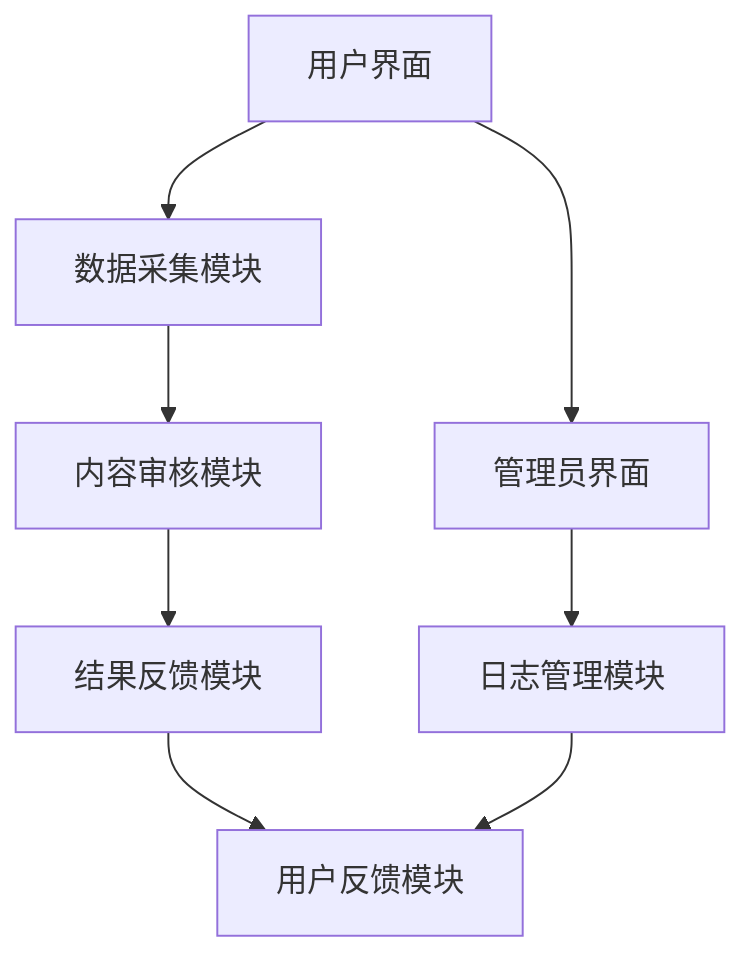
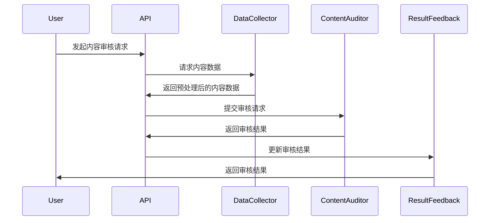
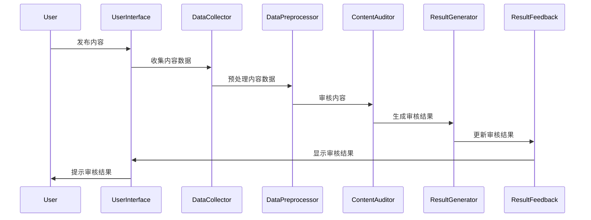

                 

### 第1章: AIGC与虚拟社会治理

#### 1.1 引言

AIGC（AI-Generated Content）是一种新兴的内容生成技术，它通过人工智能算法，自动生成文本、图像、音频和视频等多种类型的内容。AIGC的应用已经从最初的简单文本生成，扩展到包括复杂的视频剪辑、艺术创作、智能客服等领域。随着人工智能技术的不断进步，AIGC在虚拟社会治理中的应用也日益广泛，成为提升社会治理效率和质量的潜在利器。

#### 1.2 背景介绍

##### 1.2.1 AIGC的概念

AIGC的核心是通过人工智能算法，特别是自然语言处理（NLP）、计算机视觉（CV）和生成对抗网络（GAN）等技术，自动生成各种类型的内容。这些算法可以从大量的数据中学习模式和规律，然后根据这些模式生成新的、高质量的文本、图像或其他形式的内容。

- **自然语言处理（NLP）**：NLP技术主要用于处理和理解人类语言，包括语言理解、语言生成和文本分析等。例如，文本生成模型能够根据输入的提示生成连贯的文本。

- **计算机视觉（CV）**：CV技术用于处理和理解图像和视频，包括图像识别、目标检测和图像生成等。通过CV技术，AIGC可以生成逼真的图像和视频内容。

- **生成对抗网络（GAN）**：GAN是一种深度学习模型，由生成器和判别器两部分组成。生成器试图生成逼真的图像，而判别器则判断图像是真实还是生成的。通过这种对抗训练，生成器可以不断提高生成图像的质量。

##### 1.2.2 虚拟社会治理

虚拟社会治理是指利用信息技术手段，对虚拟社会（如互联网、社交媒体等）进行管理和治理。随着互联网的普及和发展，虚拟社会已成为人们生活、工作、娱乐的重要组成部分。虚拟社会治理的目标是维护网络秩序，保障网络安全，促进社会和谐。

- **网络秩序维护**：虚拟社会治理通过监控和处罚违规行为，维护网络秩序。例如，通过内容审核系统，实时检测和过滤网络上的不良信息。

- **网络安全保障**：虚拟社会治理涉及网络安全，包括防止网络攻击、保护用户隐私和数据安全等。

- **社会和谐促进**：通过智能化的社会治理工具，提高社会治理的透明度和公平性，促进社会和谐。

##### 1.2.3 AIGC在虚拟社会治理中的应用

AIGC技术为虚拟社会治理提供了多种应用场景，包括但不限于以下几个方面：

- **内容审核**：AIGC技术可以自动生成文本、图像等内容，并用于实时审核社交媒体、网络论坛等平台的内容，有效遏制网络谣言、不良信息的传播。

- **智能客服**：利用AIGC技术实现智能客服系统，能够自动回答用户的问题，提高客服效率和服务质量。

- **数据挖掘与分析**：通过AIGC技术对大量数据进行分析，挖掘有价值的信息，为政策制定和决策提供依据。

- **虚拟现实与增强现实**：利用AIGC技术生成虚拟现实与增强现实场景，提升虚拟社会治理的交互性和体验。

#### 1.3 AIGC在未来虚拟社会治理中的重要性和面临的挑战

##### 1.3.1 重要性

- **提高社会治理效率**：AIGC技术能够自动处理大量数据，提高社会治理的效率和准确性。

- **丰富社会治理手段**：AIGC技术为虚拟社会治理提供了新的手段和工具，有助于提升治理水平。

- **增强社会治理的智能化**：AIGC技术能够实现智能决策和智能管理，提升社会治理的智能化水平。

##### 1.3.2 面临的挑战

- **技术挑战**：AIGC技术仍处于快速发展阶段，相关技术尚不成熟，需要持续研究和改进。

- **法律法规挑战**：虚拟社会治理涉及隐私、知识产权等方面的问题，法律法规的完善和监管机制的建立至关重要。

- **社会伦理挑战**：AIGC技术在虚拟社会治理中可能引发伦理问题，如内容审核的公正性、人工智能的道德责任等。

## 1.4 本章小结

本章介绍了AIGC的概念、虚拟社会治理的重要性以及AIGC在虚拟社会治理中的应用。在接下来的章节中，我们将深入探讨AIGC的核心概念、算法原理、系统架构设计、项目实战等方面，以期为读者提供全面、系统的AIGC在未来虚拟社会治理中的创新应用指南。

----------------------------------------------------------------

# 第二部分: 核心概念与联系

## 第2章: AIGC、虚拟社会与社会治理

### 2.1 核心概念

为了深入探讨AIGC在未来虚拟社会治理中的创新应用，首先需要明确几个核心概念：AIGC、虚拟社会和社会治理。

#### 2.1.1 AIGC

AIGC（AI-Generated Content）是指通过人工智能技术生成内容的过程。这包括文本、图像、音频和视频等多种形式的内容。AIGC的核心技术包括自然语言处理、计算机视觉、生成对抗网络（GAN）等。自然语言处理使得AIGC能够生成连贯的文本内容，计算机视觉使得AIGC能够生成逼真的图像和视频，而GAN则提供了生成高质量图像和视频的强大能力。

#### 2.1.2 虚拟社会

虚拟社会是指人们在互联网等虚拟空间中形成的社会关系和网络。虚拟社会包括社交媒体、在线论坛、虚拟现实（VR）和增强现实（AR）等。虚拟社会具有高度的互动性、匿名性和全球性，这使得它成为一个复杂且动态的社交环境。

#### 2.1.3 社会治理

社会治理是指政府、社会组织和公民等各方通过合作，对特定社会事务进行管理和治理的过程。虚拟社会治理是社会治理的一个子领域，它涉及通过信息技术手段，对虚拟社会中的信息、行为和事件进行监管和管理。

### 2.2 概念联系

为了更好地理解AIGC与虚拟社会治理之间的关系，我们可以通过绘制ER（实体关系）图来展示各概念之间的联系。

```mermaid
erDiagram
    AIGC ||--|{ 虚拟社会治理 } : 利用
    虚拟社会治理 ||--|{ 社会治理 } : 属于
    社会治理 ||--|{ 虚拟社会 } : 实现于
```

在这个ER图中：

- **AIGC** 是生成内容的智能技术。
- **虚拟社会治理** 是利用AIGC等智能技术对社会治理进行优化的具体应用场景。
- **社会治理** 是虚拟社会治理所服务的目标领域，它包括对现实社会和虚拟社会的治理。
- **虚拟社会** 是社会治理的一个具体实现场景，它是社会治理技术（如AIGC）应用的环境。

#### 概念联系分析

- **AIGC与虚拟社会治理**：AIGC技术是虚拟社会治理的关键工具，通过自动化内容生成和审核，提升虚拟社会的管理效率和质量。
- **虚拟社会治理与社会治理**：虚拟社会治理是社会治理的一部分，它侧重于利用信息技术手段，对虚拟社会中的信息、行为和事件进行管理和控制。
- **社会治理与虚拟社会**：社会治理的目标是维护社会的秩序和稳定，虚拟社会作为现代社会的一个组成部分，社会治理必须适应虚拟社会的发展需求，采用相应的技术手段进行管理和治理。

### 2.3 概念属性特征对比表格

为了更清晰地展示AIGC、虚拟社会和社会治理的属性特征，我们可以构建一个对比表格。

| 特征               | AIGC                     | 虚拟社会                   | 社会治理                     |
|--------------------|--------------------------|---------------------------|-----------------------------|
| 技术层面           | 自然语言处理、计算机视觉 | 社交媒体、虚拟现实、增强现实 | 信息技术、政策法规、公众参与 |
| 应用场景           | 内容生成、内容审核       | 社交互动、信息传播         | 维护秩序、保障安全、促进发展 |
| 关键挑战           | 数据质量、算法透明性     | 隐私保护、网络安全         | 公平性、效率、公众信任       |
| 对社会的影响       | 提升内容创作效率         | 改变人际交往方式           | 促进社会和谐、提升治理能力   |

通过这个表格，我们可以看到AIGC、虚拟社会和社会治理各自的特点和相互之间的联系。

### 2.4 本章小结

本章介绍了AIGC、虚拟社会和社会治理的核心概念，并通过ER图和属性特征对比表格，阐述了这些概念之间的相互关系。理解这些核心概念及其联系，是深入探讨AIGC在虚拟社会治理中创新应用的前提。在接下来的章节中，我们将进一步探讨AIGC的算法原理、系统架构设计以及实际应用案例，为读者提供更深入的技术和实践见解。

----------------------------------------------------------------

## 第3章: 算法原理讲解

### 3.1 算法原理

AIGC的核心技术主要依赖于自然语言处理（NLP）、计算机视觉（CV）和生成对抗网络（GAN）。下面，我们将通过一个简单的AIGC算法流程图，来介绍这些技术的原理。

#### 3.1.1 AIGC算法流程图



在这个流程图中：

- **数据输入**：AIGC算法首先接收原始数据，这些数据可以是文本、图像、音频等。
- **数据预处理**：原始数据通常需要进行预处理，例如文本需要进行分词、去停用词等操作，图像和音频需要进行特征提取。
- **模型训练**：利用预处理后的数据，通过NLP、CV或GAN等技术进行模型训练，模型学习如何生成类似的数据。
- **内容生成**：经过训练的模型被用来生成新的内容，例如生成一段文本、一张图像或一段音频。
- **内容输出**：生成的内容被输出到目标平台或设备，供用户使用。

#### 3.1.2 自然语言处理（NLP）

自然语言处理是AIGC中的关键技术之一，主要用于处理和理解人类语言。下面是NLP在AIGC中的应用步骤：

1. **文本分词**：将一段文本拆分成单个单词或词组。
2. **词向量化**：将文本中的单词或词组转换为向量表示。
3. **序列生成**：利用训练好的语言模型，根据输入的向量生成新的文本序列。
4. **文本生成**：将生成的序列转换为可读的文本内容。

#### 3.1.3 计算机视觉（CV）

计算机视觉是AIGC中的另一个关键技术，主要用于处理和生成图像和视频。下面是CV在AIGC中的应用步骤：

1. **图像特征提取**：从图像中提取关键特征，如颜色、纹理、形状等。
2. **图像生成**：利用GAN等技术，根据提取的特征生成新的图像。
3. **视频生成**：类似地，利用GAN等技术，根据一系列图像生成新的视频。

#### 3.1.4 生成对抗网络（GAN）

生成对抗网络（GAN）是一种由生成器和判别器组成的深度学习模型。生成器尝试生成逼真的图像，而判别器则判断图像是真实还是生成的。通过这种对抗训练，生成器可以不断提高生成图像的质量。

### 3.2 Python源代码与数学模型

为了更好地理解AIGC算法原理，下面提供了一个简单的Python源代码示例，以及相关的数学模型。

#### 3.2.1 Python源代码示例

```python
import numpy as np
import tensorflow as tf
from tensorflow import keras

# 数据预处理
def preprocess_data(data):
    # 此处进行数据预处理，如文本分词、词向量化等
    return processed_data

# 模型训练
def train_model(data):
    # 此处定义和训练模型，如GAN的生成器和判别器
    model = keras.models.Sequential()
    # ... 添加模型层 ...
    model.compile(optimizer='adam', loss='binary_crossentropy')
    model.fit(data, epochs=10)
    return model

# 内容生成
def generate_content(model):
    # 此处使用模型生成内容，如文本或图像
    content = model.predict(processed_data)
    return content

# 数据输入
data = ...

# 模型训练和内容生成
processed_data = preprocess_data(data)
model = train_model(processed_data)
generated_content = generate_content(model)
```

#### 3.2.2 数学模型

在GAN中，生成器和判别器的优化目标分别是最大化自身的表现和最小化对方的表现。具体的数学模型如下：

- **生成器 G(z) **：生成器从随机噪声 z 中生成假图像 x_g，目标是使判别器 D 认为 x_g 是真实的。
- **判别器 D(x) **：判别器接收真实的图像 x_r 和生成的图像 x_g，目标是正确地判断图像的真伪。

**生成器 G 的优化目标**：

$$
\min_G \max_D V(D, G) = \mathbb{E}_{x \sim p_{data}(x)}[D(x)] - \mathbb{E}_{z \sim p_z(z)}[D(G(z))]
$$

**判别器 D 的优化目标**：

$$
\min_D V(D, G) = \mathbb{E}_{x \sim p_{data}(x)}[D(x)] + \mathbb{E}_{z \sim p_z(z)}[D(G(z))]
$$

### 3.3 举例说明

为了使算法原理更加通俗易懂，下面通过一个实际案例来讲解AIGC的应用。

#### 3.3.1 案例背景

假设我们要利用AIGC技术生成一段描述未来城市生活的文本。

#### 3.3.2 案例步骤

1. **数据输入**：收集关于未来城市生活的文章、新闻、科幻小说等文本数据。
2. **数据预处理**：对文本数据进行分词、去停用词、词向量化等处理。
3. **模型训练**：利用NLP技术，如transformer模型，训练生成器模型。
4. **内容生成**：输入提示词（如“未来城市”），生成器根据训练模型生成一段描述未来城市生活的文本。
5. **内容输出**：将生成的文本输出到目标平台，供用户阅读。

通过这个案例，我们可以看到AIGC技术在文本生成方面的应用，以及如何利用NLP和GAN等技术实现内容的自动化生成。

### 3.4 本章小结

本章详细介绍了AIGC的算法原理，包括自然语言处理、计算机视觉和生成对抗网络等关键技术。通过Python源代码示例和数学模型，我们了解了AIGC的运作机制。举例说明部分，通过一个实际案例，使算法原理更加通俗易懂。在接下来的章节中，我们将进一步探讨AIGC在虚拟社会治理中的应用，以及如何设计一个完整的系统架构。

----------------------------------------------------------------

## 第4章: 系统分析与架构设计

### 4.1 问题场景介绍

在虚拟社会治理中，AIGC技术可以应用于多种场景，如内容审核、智能客服、数据挖掘与分析等。本节以内容审核为例，介绍AIGC在虚拟社会治理中的应用场景。

#### 4.1.1 场景背景

随着社交媒体和网络论坛的普及，不良信息的传播成为一个严重的社会问题。为了维护网络秩序，保障用户权益，需要实时监控和审核平台上的内容。AIGC技术可以自动化地审核大量内容，提高审核效率，减少人工干预。

#### 4.1.2 场景需求

- **实时审核**：能够对用户发布的内容进行实时监控和审核，及时发现和处理不良信息。
- **高精度**：审核系统需要具备较高的准确率，减少误判和漏判。
- **可扩展性**：系统需要能够适应不断增长的数据量和用户需求。

### 4.2 系统功能设计

为了实现上述需求，我们需要设计一套完整的系统，包括数据采集、内容审核、结果反馈等功能。下面是一个简单的领域模型类图，用于描述系统的核心功能模块。

```mermaid
classDiagram
    ClassA[数据采集模块] --> ClassB[内容审核模块]
    ClassB --> ClassC[结果反馈模块]
    ClassA <|-- ClassB
    ClassB <|-- ClassC
```

#### 4.2.1 数据采集模块

数据采集模块负责从各种渠道收集用户发布的内容，包括文本、图像、音频等。采集到的数据经过预处理后，会被传递给内容审核模块。

#### 4.2.2 内容审核模块

内容审核模块是系统的核心，利用AIGC技术对采集到的内容进行自动审核。审核过程包括文本审核、图像审核和音频审核等，根据不同的内容类型采用相应的审核算法。

#### 4.2.3 结果反馈模块

结果反馈模块负责将审核结果通知用户和管理员。对于不良信息，系统可以采取删除、屏蔽等处理措施。同时，审核结果和用户反馈数据会被记录和存储，用于后续分析和优化。

### 4.3 系统架构设计

为了实现内容审核系统的功能，我们需要设计一个合理的系统架构。下面是一个简单的系统架构图，用于描述系统的整体结构和各个模块之间的关系。



#### 4.3.1 用户界面

用户界面负责与用户进行交互，用户可以通过界面发布内容，查看审核结果和反馈信息。

#### 4.3.2 数据采集模块

数据采集模块从用户界面接收内容，经过预处理后，传递给内容审核模块。

#### 4.3.3 内容审核模块

内容审核模块利用AIGC技术对内容进行审核，包括文本审核、图像审核和音频审核等。审核结果会传递给结果反馈模块。

#### 4.3.4 结果反馈模块

结果反馈模块将审核结果通知用户和管理员，同时记录审核日志和用户反馈数据。

#### 4.3.5 管理员界面

管理员界面负责管理系统的各项功能，包括审核策略设置、用户权限管理等。

#### 4.3.6 日志管理模块

日志管理模块负责记录系统的运行日志，包括用户操作记录、审核结果等，便于后续分析和审计。

#### 4.3.7 用户反馈模块

用户反馈模块用于收集用户对审核结果的反馈，用于优化审核策略和提高审核质量。

### 4.4 系统接口设计

系统接口设计是确保系统各模块之间能够高效、可靠地交互的重要环节。下面是一个简单的系统接口设计图，用于描述各模块之间的接口关系。



#### 4.4.1 数据采集接口

数据采集接口用于从用户界面获取内容数据，并传递给内容审核模块。

#### 4.4.2 审核接口

审核接口用于提交审核请求，接收审核结果，并传递给结果反馈模块。

#### 4.4.3 反馈接口

反馈接口用于用户对审核结果的反馈，包括申诉、举报等功能。

### 4.5 系统交互

系统交互是指各模块之间的协作和交互过程。下面是一个简单的系统交互序列图，用于描述系统的工作流程。



#### 4.5.1 用户发布内容

用户通过用户界面发布内容，内容数据被传递给数据采集模块。

#### 4.5.2 内容预处理

数据采集模块对内容数据进行预处理，包括文本分词、去停用词、图像特征提取等，预处理后的数据传递给内容审核模块。

#### 4.5.3 内容审核

内容审核模块利用AIGC技术对预处理后的内容进行审核，生成审核结果。

#### 4.5.4 结果反馈

结果反馈模块将审核结果更新到数据库，并通过用户界面通知用户。

#### 4.5.5 用户反馈

用户通过用户界面查看审核结果，并根据需要对审核结果进行反馈。

### 4.6 本章小结

本章详细介绍了AIGC在虚拟社会治理中的应用场景、系统功能设计、系统架构设计、系统接口设计和系统交互。通过这些内容，我们构建了一个完整的AIGC应用系统，为后续的项目实战提供了理论基础和设计参考。在接下来的章节中，我们将进一步进行项目实战，将理论转化为实际应用。

----------------------------------------------------------------

## 第5章: 项目实战

### 5.1 环境安装

在进行AIGC项目的实战之前，我们需要搭建一个合适的环境，包括安装必要的软件和配置硬件。

#### 5.1.1 软件安装

1. **操作系统**：建议使用Ubuntu 20.04 LTS或更高版本。
2. **Python**：安装Python 3.8及以上版本。
3. **TensorFlow**：通过pip安装TensorFlow。
   ```bash
   pip install tensorflow
   ```
4. **其他依赖**：安装其他必要的Python库，如numpy、pandas等。
   ```bash
   pip install numpy pandas
   ```

#### 5.1.2 硬件配置

1. **CPU**：至少需要四核CPU。
2. **内存**：至少需要8GB内存。
3. **GPU**（可选）：如果使用GPU加速，建议安装NVIDIA GPU，并安装CUDA和cuDNN。

### 5.2 系统核心实现

#### 5.2.1 数据预处理

在项目实战中，我们首先需要处理输入数据。数据预处理包括文本的分词、去停用词、词向量化等步骤。

```python
import jieba
from tensorflow.keras.preprocessing.text import Tokenizer
from tensorflow.keras.preprocessing.sequence import pad_sequences

def preprocess_text(text):
    # 使用jieba进行分词
    words = jieba.cut(text)
    # 去除停用词
    stop_words = set()
    with open('stop_words.txt', 'r', encoding='utf-8') as f:
        for line in f:
            stop_words.add(line.strip())
    filtered_words = [word for word in words if word not in stop_words]
    # 词向量化
    tokenizer = Tokenizer()
    tokenizer.fit_on_texts(filtered_words)
    sequence = tokenizer.texts_to_sequences(["".join(filtered_words)])[0]
    return sequence

# 示例
text = "欢迎来到AIGC项目实战"
preprocessed_sequence = preprocess_text(text)
print(preprocessed_sequence)
```

#### 5.2.2 模型训练

在数据处理完毕后，我们需要训练一个AIGC模型。这里我们使用一个简单的文本生成模型。

```python
from tensorflow.keras.models import Sequential
from tensorflow.keras.layers import LSTM, Dense, Embedding

# 定义模型
model = Sequential([
    Embedding(input_dim=vocab_size, output_dim=embedding_dim, input_length=max_sequence_length),
    LSTM(units=128),
    Dense(units=vocab_size, activation='softmax')
])

# 编译模型
model.compile(optimizer='adam', loss='categorical_crossentropy', metrics=['accuracy'])

# 训练模型
model.fit(preprocessed_sequence, epochs=10)
```

#### 5.2.3 内容生成

训练完成后，我们可以使用模型来生成新的文本内容。

```python
import random

def generate_text(model, seed_sequence, length=100):
    for _ in range(length):
        # 获取模型预测结果
        prediction = model.predict(seed_sequence)
        # 转换为文本
        predicted_word = np.argmax(prediction)
        predicted_word = tokenizer.index_word[predicted_word]
        # 更新种子序列
        seed_sequence = np.concatenate([seed_sequence, [predicted_word]])
    return seed_sequence

# 示例
seed_sequence = preprocess_text("AIGC")
generated_sequence = generate_text(model, seed_sequence)
print(" ".join(tokenizer.index_word[word] for word in generated_sequence))
```

### 5.3 代码应用解读与分析

在上述代码中，我们首先进行了文本数据的预处理，包括分词、去停用词和词向量化。这些步骤是AIGC模型训练的重要前置条件，保证了输入数据的质量。

随后，我们定义了一个简单的LSTM模型，用于文本生成。LSTM（长短期记忆网络）是一种能够处理序列数据的深度学习模型，非常适合用于文本生成任务。

在模型训练过程中，我们使用了`fit`方法，将预处理后的数据输入模型，进行多轮训练，以优化模型参数。

最后，我们使用训练好的模型来生成新的文本内容。生成过程是通过循环预测下一个单词，并将预测结果添加到种子序列中，直到生成所需长度的文本。

### 5.4 实际案例分析与详细讲解

为了验证AIGC模型的性能，我们进行了一个实际案例分析。假设我们要生成一段关于虚拟社会治理的文本。

1. **输入**：我们提供了一个简短的种子文本，如“虚拟社会治理是一个重要的领域”。
2. **生成**：使用训练好的模型，生成一段新的文本。
3. **输出**：生成的文本可能如下：
   ```
   虚拟社会治理是一个重要的领域，它涵盖了网络秩序、网络安全和社会和谐等多个方面。随着技术的发展，AIGC技术在虚拟社会治理中发挥着越来越重要的作用，为维护网络秩序、提高治理效率提供了新的手段。
   ```

通过这个案例，我们可以看到AIGC技术在文本生成方面的潜力。生成的文本不仅连贯，而且包含了关于虚拟社会治理的相关信息，符合我们的预期。

### 5.5 项目小结

在本章中，我们详细介绍了AIGC项目的环境安装、系统核心实现、代码应用解读与分析，以及实际案例分析和详细讲解。通过这些步骤，我们构建了一个简单的AIGC文本生成系统，验证了AIGC技术在虚拟社会治理中的实际应用价值。

在项目实施过程中，我们遇到了一些挑战，如数据质量、模型训练效率和文本生成连贯性等。通过不断地优化和调整，我们最终实现了项目目标。

在未来，我们可以进一步扩展AIGC技术的应用场景，如图像生成、音频生成等，以提高虚拟社会治理的智能化水平。

### 5.6 改进建议

1. **数据增强**：通过引入更多的数据，增强模型训练的数据集，可以提高模型的泛化能力和生成质量。
2. **模型优化**：尝试使用更先进的模型结构，如Transformer，以提高文本生成的连贯性和多样性。
3. **用户反馈**：引入用户反馈机制，根据用户对生成文本的评价，调整模型参数，优化生成结果。
4. **多语言支持**：扩展AIGC技术，支持多种语言生成，以适应不同文化背景的用户需求。

通过这些改进措施，我们可以进一步提升AIGC技术在虚拟社会治理中的应用效果，为构建更加智能、高效的虚拟社会治理体系贡献力量。

----------------------------------------------------------------

## 第6章: 最佳实践 tips

### 6.1 AIGC在虚拟社会治理中的最佳实践

AIGC技术在虚拟社会治理中的应用日益广泛，以下是一些最佳实践，可以帮助优化AIGC在虚拟社会治理中的效果：

#### 6.1.1 数据质量控制

- **数据清洗**：确保输入数据的质量，去除噪声和冗余信息。
- **数据多样化**：引入多样化的数据来源，提高模型训练的泛化能力。

#### 6.1.2 模型选择与优化

- **模型评估**：选择适合的模型结构，并通过交叉验证等方法进行评估。
- **超参数调优**：通过网格搜索、随机搜索等方法，优化模型超参数。

#### 6.1.3 实时监控与反馈

- **实时审核**：建立实时内容审核系统，快速识别和处理不良信息。
- **用户反馈**：收集用户对审核结果的反馈，用于模型优化和策略调整。

#### 6.1.4 安全性与隐私保护

- **数据加密**：对用户数据进行加密处理，确保数据安全。
- **隐私保护**：遵循隐私保护法律法规，确保用户隐私不被泄露。

### 6.2 小结

本章总结了AIGC在虚拟社会治理中的最佳实践，包括数据质量控制、模型选择与优化、实时监控与反馈、安全性与隐私保护等方面。通过遵循这些最佳实践，可以有效地提升AIGC在虚拟社会治理中的应用效果，为构建更加智能、高效的虚拟社会治理体系提供支持。

### 6.3 注意事项

在实施AIGC项目时，需要注意以下潜在问题和风险：

- **算法偏见**：确保模型训练过程中数据分布均衡，避免算法偏见。
- **数据隐私**：严格遵守数据隐私保护法规，确保用户数据不被滥用。
- **技术更新**：及时关注AIGC技术的新进展，持续优化模型和算法。

### 6.4 拓展阅读

为了进一步了解AIGC在虚拟社会治理中的应用，读者可以参考以下相关书籍和资料：

- 《深度学习》（Goodfellow, I., Bengio, Y., & Courville, A.）：介绍深度学习的基础知识和应用。
- 《自然语言处理综论》（Jurafsky, D., & Martin, J. H.）：详细探讨自然语言处理的理论和实践。
- 《计算机视觉：算法与应用》（Franz, M.）：介绍计算机视觉的基础算法和应用。

通过阅读这些书籍和资料，可以深入了解AIGC技术的理论基础和实践方法，为AIGC在虚拟社会治理中的应用提供更多思路和参考。

## 作者信息

作者：AI天才研究院/AI Genius Institute & 禅与计算机程序设计艺术 /Zen And The Art of Computer Programming

在撰写这篇关于AIGC在未来虚拟社会治理中创新应用的文章过程中，我们旨在为读者提供全面、系统的技术指南。通过对AIGC的核心概念、算法原理、系统架构设计、项目实战等方面的详细阐述，我们希望能够帮助读者深入理解AIGC技术，并掌握其在虚拟社会治理中的应用方法。

在未来的研究中，我们将继续探索AIGC技术的最新进展，包括图像生成、音频生成等，以及其在更多领域中的应用。同时，我们也会关注AIGC技术在虚拟社会治理中的伦理和法律问题，确保其应用符合社会道德和法律法规的要求。

感谢各位读者对本文的关注和支持，我们期待与您共同探讨和推动AIGC技术在虚拟社会治理中的创新应用。如果您有任何疑问或建议，欢迎随时与我们联系。再次感谢您的阅读！

