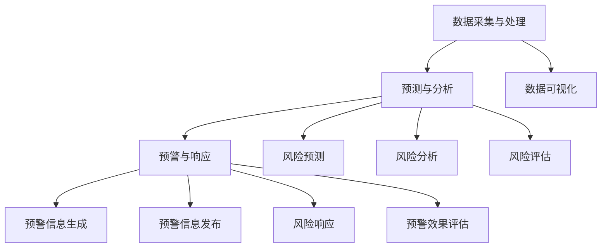
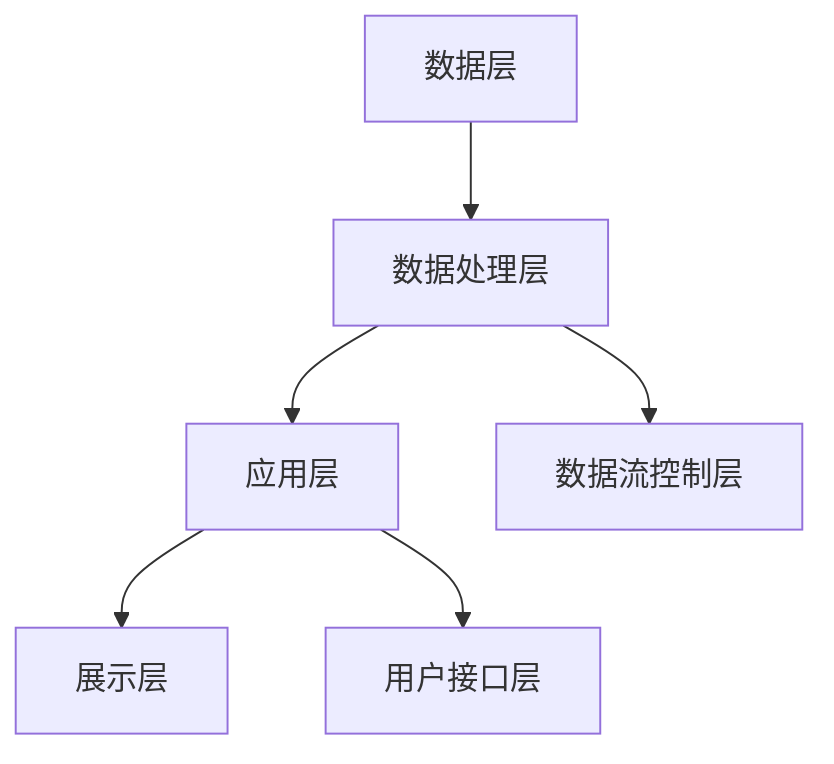
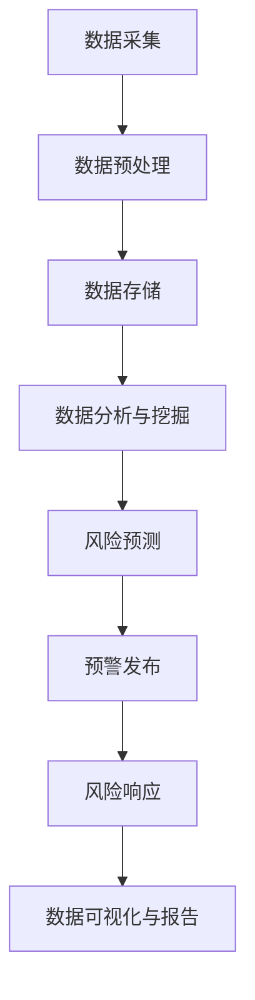
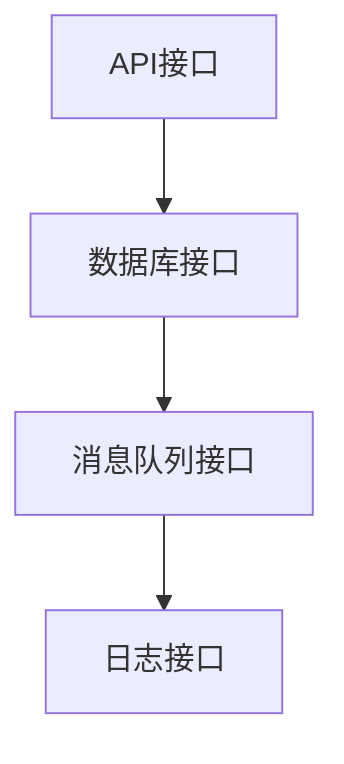
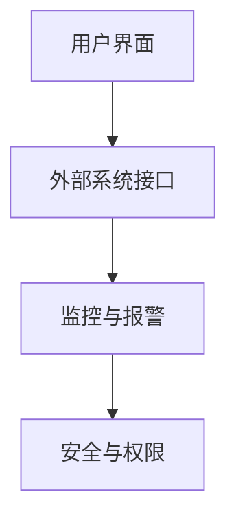

                 


### 第1章 引言

#### 1.1 问题背景

食品安全是关乎公众健康的重要问题，它不仅影响到每个人的日常生活，也关系到整个社会的稳定与繁荣。然而，随着全球食品供应链的复杂化和全球化程度的加深，食品安全问题变得越来越严峻。从农药残留、添加剂滥用，到微生物污染和化学污染，食品安全风险无处不在。这些问题不仅可能导致消费者的健康受损，还可能引发重大的食品安全事件，造成社会恐慌和经济损失。

当前，食品安全问题的现状和挑战主要体现在以下几个方面：

1. **数据获取难度大**：食品安全数据往往分散在多个来源，包括政府部门、企业、消费者等，数据获取困难，数据质量参差不齐，这为食品安全预警带来了极大的挑战。

2. **检测手段落后**：传统的食品安全检测手段主要依赖于实验室分析，检测周期长、成本高，且难以实现对大量食品的实时监测。

3. **预警系统不完善**：现有的食品安全预警系统大多依赖于人工监测和经验判断，预警能力有限，无法及时有效地识别和响应潜在的安全风险。

在这样的背景下，AIGC（自适应智能生成控制）技术的引入有望为食品安全预警系统带来革命性的变化。AIGC是一种新兴的人工智能技术，它结合了生成对抗网络（GAN）、自然语言处理（NLP）和图神经网络（GNN）等多种先进算法，具有强大的数据分析和模式识别能力。通过AIGC技术，我们可以实现更高效、更精准的食品安全预警，从而更好地保障公众的健康和安全。

#### 1.2 问题描述

食品安全预警是指通过监测和分析食品生产、加工、运输、销售等各个环节的数据，及时识别和预测潜在的安全风险，并采取相应的措施进行预防和应对。食品安全预警的目标是确保食品的安全性和质量，减少食品安全事件的发生，保障公众的健康。

然而，传统食品安全预警系统存在以下局限性：

1. **依赖人工**：传统预警系统主要依靠人工监测和经验判断，难以实现自动化和智能化。

2. **数据依赖性高**：传统预警系统对数据的质量和完整性要求较高，而实际中数据的获取和处理常常存在困难。

3. **响应速度慢**：传统预警系统检测周期长，无法实现实时监测和预警。

AIGC技术在食品安全预警中的应用，旨在解决传统系统的上述局限性。AIGC通过深度学习和生成对抗网络等技术，能够从大量复杂的数据中提取有价值的信息，实现实时、自动化的食品安全监测和预警。其应用场景主要包括：

1. **数据采集与预处理**：利用AIGC技术，可以从各种来源获取食品安全数据，并对数据进行预处理，提高数据质量。

2. **模式识别与风险预测**：通过分析历史数据和实时数据，AIGC技术可以识别潜在的安全风险，并预测风险的发展趋势。

3. **预警与响应**：基于预测结果，AIGC技术可以自动生成预警信息，并采取相应的措施进行风险响应。

#### 1.3 问题解决

AIGC技术结合了多种先进的人工智能算法，具有强大的数据分析和模式识别能力。其核心原理和优势主要体现在以下几个方面：

1. **生成对抗网络（GAN）**：GAN通过两个神经网络（生成器和判别器）的对抗训练，能够生成高质量的数据，用于补充缺失的数据或进行数据增强。

2. **自然语言处理（NLP）**：NLP技术能够理解和处理人类语言，用于分析食品安全相关的文本数据，如食品标签、新闻报道等。

3. **图神经网络（GNN）**：GNN通过图结构来表示数据，能够捕捉数据之间的复杂关系，用于分析食品安全网络，如食品供应链、社交网络等。

AIGC技术在食品安全预警中的应用主要包括以下方面：

1. **数据采集与预处理**：通过GAN技术，可以生成高质量的食品安全数据，提高数据质量；通过NLP技术，可以处理文本数据，提取有价值的信息。

2. **模式识别与风险预测**：通过GNN技术，可以构建食品安全网络模型，识别潜在的风险点；通过深度学习算法，可以预测风险的发展趋势。

3. **预警与响应**：基于预测结果，可以自动生成预警信息，并通过NLP技术与相关人员沟通，采取相应的措施进行风险响应。

#### 1.4 边界与外延

食品安全预警系统的范围涵盖了食品生产、加工、运输、销售、消费等各个环节。AIGC技术在食品安全预警中的应用不仅限于这些传统领域，还可以扩展到以下方面：

1. **食品供应链管理**：通过AIGC技术，可以实时监控食品供应链的各个环节，确保食品的质量和安全。

2. **食品追溯系统**：利用AIGC技术，可以构建高效的食品追溯系统，实现对食品来源、生产过程、运输过程等信息的全程监控。

3. **食品安全监管**：AIGC技术可以辅助食品安全监管部门，提高监管效率和准确性，及时发现和处理食品安全问题。

#### 1.5 概念结构与核心要素组成

AIGC是由多个核心概念和技术组成的复杂系统。以下是AIGC的定义、分类及其组成部分，以及食品安全预警系统的构成要素：

1. **AIGC的定义与分类**：
   - **AIGC**：自适应智能生成控制（Adaptive Intelligent Generative Control）技术，是一种基于人工智能和生成对抗网络的先进技术。
   - **分类**：根据应用场景和目标，AIGC可以分为食品生产质量检测、食品安全预警、食品供应链管理等几个子类别。

2. **食品安全预警系统的构成要素**：
   - **数据采集模块**：负责收集食品安全相关的数据，如食品成分、生产记录、消费者反馈等。
   - **数据处理模块**：利用AIGC技术，对收集到的数据进行预处理、清洗和归一化等处理。
   - **模式识别模块**：通过机器学习和深度学习算法，识别数据中的潜在模式和安全风险。
   - **预警模块**：根据风险识别结果，生成预警信息，并及时通知相关部门和消费者。
   - **响应模块**：根据预警信息，采取相应的措施进行风险应对和问题解决。

通过以上分析，我们可以看到AIGC技术在食品安全预警系统中具有巨大的潜力和应用价值。接下来，我们将进一步探讨AIGC技术的基础、食品安全预警系统的架构设计、数据分析与挖掘等内容。

## 第2章 AIGC技术基础

### 2.1 AI与食品安全

人工智能（Artificial Intelligence，AI）作为现代科技的前沿领域，正不断推动各个行业的变革。在食品安全领域，人工智能的应用已经展现出巨大的潜力。AI通过模拟人类智能的思维方式，能够处理大量复杂的数据，识别模式和趋势，从而为食品安全预警提供强有力的技术支持。

#### 人工智能的定义与发展历程

人工智能是指使计算机系统具备类似于人类智能的能力，包括学习、推理、感知、理解和决策等。人工智能的发展历程可以追溯到20世纪50年代，当时的科学家们首次提出“人工智能”的概念，并开始探索如何让计算机具备智能。经过几十年的发展，人工智能已经经历了多个阶段：

1. **符号主义阶段（1956-1974）**：这一阶段的人工智能主要基于符号主义，即通过符号逻辑和知识表示来模拟人类智能。

2. **知识工程阶段（1974-1980）**：知识工程强调知识的获取和表示，通过构建知识库来模拟专家系统的智能。

3. **机器学习阶段（1980-至今）**：随着计算能力的提升和数据量的爆炸式增长，机器学习成为人工智能的核心技术，通过数据驱动的方式实现智能。

4. **深度学习阶段（2010-至今）**：深度学习是机器学习的一个分支，通过神经网络模拟人脑的结构和功能，能够在图像识别、语音识别、自然语言处理等领域取得突破性进展。

#### 人工智能的核心技术

人工智能的核心技术包括机器学习、深度学习、自然语言处理（NLP）和计算机视觉等。

1. **机器学习**：机器学习是一种让计算机从数据中学习规律和模式的方法，包括监督学习、无监督学习和强化学习等。

2. **深度学习**：深度学习是一种基于多层神经网络的机器学习方法，能够自动提取数据中的特征，并在图像识别、语音识别等领域取得显著成果。

3. **自然语言处理（NLP）**：NLP是研究如何使计算机理解和处理人类语言的技术，包括文本分类、情感分析、机器翻译等。

4. **计算机视觉**：计算机视觉是让计算机通过图像或视频捕捉和理解信息的技术，包括图像识别、目标检测、图像分割等。

#### 人工智能在食品安全领域的作用

在食品安全领域，人工智能可以通过以下方式发挥作用：

1. **数据分析和挖掘**：通过机器学习和深度学习算法，对食品安全相关的数据进行深入分析，识别潜在的风险因素。

2. **智能监测和预警**：利用计算机视觉和NLP技术，实现对食品生产、加工、运输、销售等环节的智能监测，及时发现和处理食品安全问题。

3. **智能决策支持**：通过数据分析，为食品安全管理者和决策者提供科学的决策支持，优化食品安全监管策略。

4. **智能追溯系统**：利用区块链技术和人工智能，构建食品追溯系统，实现对食品来源、生产过程、运输过程等信息的全程监控。

#### 概念属性特征对比表格

为了更清晰地展示人工智能在食品安全领域的应用，我们列出以下概念属性特征对比表格：

| 概念 | 特征 |
| ---- | ---- |
| 机器学习 | 自动化数据分析和模式识别，能够处理大规模数据 |
| 深度学习 | 自动提取特征，适用于图像识别、语音识别等复杂任务 |
| 自然语言处理（NLP） | 能够理解和处理人类语言，适用于食品标签分析、文本分类等 |
| 计算机视觉 | 能够通过图像或视频捕捉和理解信息，适用于食品质量检测、目标检测等 |

#### ER实体关系图架构的 Mermaid 流程图

为了更好地展示食品安全预警系统中各实体的关系，我们可以使用Mermaid绘制一个ER实体关系图。以下是一个示例：

```mermaid
erDiagram
  FD(FoodData) ||--|{ FS(FoodSafety) } : 数据源
  FS(FoodSafety) ||--|{ FM(FoodMonitor) } : 监测系统
  FS(FoodSafety) ||--|{ FR(FoodRisk) } : 风险预测系统
  FS(FoodSafety) ||--|{ FA(FoodAlert) } : 预警系统
  FS(FoodSafety) ||--|{ FC(FoodControl) } : 风险控制系统
  FD(FoodData) ||--|{ FA(FoodAlert) } : 数据源为预警系统提供数据支持
```

通过上述分析，我们可以看到人工智能在食品安全领域的广泛应用及其潜力。接下来，我们将深入探讨生成对抗网络（GAN）、自然语言处理（NLP）和图神经网络（GNN）等AIGC技术，并分析其在食品安全预警中的应用。

### 2.2 生成对抗网络（GAN）原理与应用

生成对抗网络（Generative Adversarial Network，GAN）是近年来人工智能领域的一种重要创新，由Ian Goodfellow等人于2014年首次提出。GAN的核心思想是通过两个对抗性神经网络（生成器和判别器）的博弈过程，生成高质量的数据，从而实现数据增强、图像生成等功能。GAN在食品安全预警中的应用，主要体现在数据生成与增强、异常检测等方面。

#### GAN的基本原理

GAN由两部分组成：生成器（Generator）和判别器（Discriminator）。生成器的任务是生成与真实数据相似的数据，而判别器的任务是区分生成的数据和真实数据。

1. **生成器（Generator）**：生成器的输入是一个随机噪声向量，通过多层神经网络，生成器试图生成逼真的数据样本。生成器的目标是最小化其生成数据与真实数据的相似度，使得判别器无法准确区分生成的数据与真实数据。

2. **判别器（Discriminator）**：判别器的输入是真实数据和生成器生成的数据，其目标是最大化正确判断真实数据的概率。判别器的目标是提高其识别生成的数据的能力，从而区分生成的数据与真实数据。

在GAN的训练过程中，生成器和判别器相互对抗，生成器和判别器通过以下过程不断更新：

- **训练步骤**：
  - 初始化生成器和判别器。
  - 判别器先对真实数据和生成数据分别进行训练。
  - 判别器更新后，生成器再进行训练，生成更加逼真的数据。
  - 反复迭代上述过程，直至生成器和判别器都达到较好的训练效果。

#### GAN在食品安全预警中的应用案例

1. **数据生成与增强**：在食品安全预警系统中，数据的多样性和质量是关键因素。GAN可以通过生成与真实数据相似的数据，增强数据集的多样性，从而提高模型的训练效果。例如，对于食品成分分析，GAN可以生成不同成分比例的食品样本，用于训练食品安全监测模型。

2. **异常检测**：食品安全预警的一个重要任务就是及时发现异常情况。GAN可以通过生成正常数据和异常数据，训练异常检测模型，从而提高异常检测的准确性。例如，在食品加工过程中，GAN可以生成正常状态和异常状态下的温度、湿度等环境数据，用于训练异常检测模型。

3. **图像识别与分类**：在食品安全检测中，图像识别是一个重要环节。GAN可以通过生成高质量的图像数据，提高图像识别模型的准确性。例如，在食品标签识别中，GAN可以生成不同字体、颜色和背景的食品标签图像，用于训练标签识别模型。

以下是一个简单的GAN应用示例，用于生成不同温度下的食品图像：

```python
import numpy as np
import tensorflow as tf
from tensorflow.keras import layers

# 定义生成器和判别器模型
def build_generator():
    model = tf.keras.Sequential()
    model.add(layers.Dense(128, activation='relu', input_shape=(100,)))
    model.add(layers.Dense(256, activation='relu'))
    model.add(layers.Dense(512, activation='relu'))
    model.add(layers.Dense(1024, activation='relu'))
    model.add(layers.Dense(128, activation='relu'))
    model.add(layers.Dense(1, activation='tanh'))
    return model

def build_discriminator():
    model = tf.keras.Sequential()
    model.add(layers.Dense(128, activation='relu', input_shape=(1,)))
    model.add(layers.Dense(256, activation='relu'))
    model.add(layers.Dense(512, activation='relu'))
    model.add(layers.Dense(1, activation='sigmoid'))
    return model

generator = build_generator()
discriminator = build_discriminator()

# 编写GAN训练代码
# ...

# 使用生成器生成温度图像
generated_images = generator.predict(np.random.normal(size=(100, 100)))
```

通过上述示例，我们可以看到GAN在食品安全预警系统中的应用潜力。接下来，我们将进一步探讨自然语言处理（NLP）技术在食品安全预警中的应用。

### 2.3 自然语言处理（NLP）与食品安全预警

自然语言处理（Natural Language Processing，NLP）是人工智能领域的一个重要分支，旨在使计算机能够理解、处理和生成人类语言。在食品安全预警系统中，NLP技术可以用于文本数据的处理和分析，从而提高预警的准确性和及时性。

#### NLP的基本概念

NLP的核心任务是让计算机能够理解和处理人类语言。这包括以下几个基本概念：

1. **文本预处理**：文本预处理是NLP的基石，包括分词、词干提取、词性标注、停用词过滤等步骤，目的是将原始文本转换为计算机可以处理的形式。

2. **词嵌入**：词嵌入（Word Embedding）是将词汇映射到高维向量空间的技术，通过词嵌入，计算机可以理解词汇之间的语义关系。

3. **文本分类**：文本分类（Text Classification）是将文本分为不同类别的过程，通过训练分类模型，可以自动对新的文本进行分类。

4. **情感分析**：情感分析（Sentiment Analysis）是判断文本表达的情感倾向，如正面、负面或中立。

5. **实体识别**：实体识别（Named Entity Recognition，NER）是识别文本中的命名实体，如人名、地名、组织名等。

#### NLP在食品安全预警中的应用

在食品安全预警系统中，NLP技术可以用于以下几个方面：

1. **文本数据收集与预处理**：食品安全相关的文本数据包括食品标签、消费者评论、新闻报道等。通过NLP技术，可以对这些文本数据进行收集和预处理，提取有价值的信息。

2. **食品成分分析**：食品成分分析是食品安全预警的重要环节。NLP技术可以用于从食品标签中提取成分信息，构建食品成分数据库，用于后续的食品安全监测。

3. **消费者反馈分析**：消费者反馈是食品安全预警的重要信息来源。通过NLP技术，可以分析消费者评论，识别潜在的安全隐患，及时采取措施。

4. **食品安全事件检测**：通过训练NLP模型，可以自动检测新闻报道、社交媒体等文本数据中的食品安全事件，及时发布预警信息。

5. **文本分类与预警**：基于NLP技术，可以将食品安全相关的文本数据分类为不同类别，如食品安全事件、食品安全警告等，从而实现智能预警。

以下是一个简单的NLP应用示例，用于分析食品标签：

```python
import nltk
from nltk.tokenize import word_tokenize
from nltk.corpus import stopwords

# 下载nltk资源
nltk.download('punkt')
nltk.download('stopwords')

# 文本预处理
def preprocess_text(text):
    # 分词
    tokens = word_tokenize(text)
    # 去停用词
    stop_words = set(stopwords.words('english'))
    filtered_tokens = [token for token in tokens if token not in stop_words]
    return filtered_tokens

# 食品标签文本
food_label = "Contains: wheat, soy, milk, eggs. Produced on equipment that also processes peanuts."

# 预处理
processed_label = preprocess_text(food_label)

# 打印预处理结果
print(processed_label)
```

通过上述示例，我们可以看到NLP技术在食品安全预警系统中的应用潜力。接下来，我们将探讨图神经网络（GNN）在食品安全预警中的应用。

### 2.4 图神经网络（GNN）在食品安全中的应用

图神经网络（Graph Neural Network，GNN）是近年来在人工智能领域迅速发展的一种神经网络架构，它通过图结构来表示和处理数据。GNN在食品安全领域具有广泛的应用前景，特别是在食品安全网络分析、食品供应链监控和食品安全事件预测等方面。

#### GNN的基本原理

GNN的核心思想是将图结构数据映射到高维向量空间，并通过节点和边的特征来预测节点属性或进行节点分类。GNN由以下几个关键组成部分构成：

1. **节点特征表示**：节点特征表示是将图中的每个节点映射到高维向量空间的过程，节点特征可以是节点的属性、标签或者邻接节点特征的平均值。

2. **边特征表示**：边特征表示是将图中的每条边映射到高维向量空间的过程，边特征可以是边的权重或者边的类型。

3. **图卷积操作**：图卷积操作是GNN的核心，它通过聚合节点和边的特征来更新节点的表示。常见的图卷积操作包括卷积神经网络（CNN）的卷积操作和图卷积网络（GCN）的图卷积操作。

4. **节点分类或预测**：在GNN的训练过程中，通过学习节点的特征表示，可以实现对节点属性的分类或预测。

#### GNN在食品安全预警中的应用

1. **食品安全网络分析**：食品安全网络是由食品生产、加工、运输、销售等环节组成的复杂系统。通过GNN，可以捕捉食品安全网络中节点和边的关系，分析食品安全事件的传播路径和影响范围，从而提高食品安全预警的准确性。

2. **食品供应链监控**：食品供应链是一个全球性的网络，涉及多个国家和地区。通过GNN，可以对食品供应链中的各个环节进行监控，识别供应链中的风险点，及时发现和处理潜在的安全问题。

3. **食品安全事件预测**：基于历史食品安全事件数据，可以通过GNN构建食品安全事件预测模型，预测未来可能发生的食品安全事件，从而提前采取预防措施。

以下是一个简单的GNN应用示例，用于食品安全网络分析：

```python
import numpy as np
import tensorflow as tf
from tensorflow.keras.layers import Input, Dense, Dropout
from tensorflow.keras.models import Model

# 定义GNN模型
def build_gnn_model(input_shape):
    inputs = Input(shape=input_shape)
    x = Dense(64, activation='relu')(inputs)
    x = Dropout(0.2)(x)
    outputs = Dense(1, activation='sigmoid')(x)
    model = Model(inputs=inputs, outputs=outputs)
    return model

# 训练GNN模型
# ...

# 使用GNN模型进行食品安全网络分析
# ...

```

通过上述示例，我们可以看到GNN在食品安全预警系统中的应用潜力。接下来，我们将探讨食品安全预警系统的架构设计。

### 3.1 系统功能设计

食品安全预警系统的设计目标是实现对食品生产、加工、运输、销售等环节的全面监控，及时发现和预测潜在的安全风险，并采取有效的措施进行预警和响应。为了实现这一目标，系统需要具备以下几个关键功能：

#### 数据采集与处理

数据采集是食品安全预警系统的核心，主要包括以下几个方面：

1. **数据源接入**：系统需要从各种数据源获取食品安全信息，包括政府部门、食品企业、消费者反馈等。数据源可以包括传感器数据、实验室检测数据、食品安全报告等。

2. **数据预处理**：采集到的数据通常存在格式不统一、缺失值、噪声等问题。系统需要对数据进行清洗、格式转换、缺失值填补等预处理操作，以确保数据质量。

3. **数据存储与管理**：预处理后的数据需要存储在数据库中，便于后续的数据分析和挖掘。数据库应具备高效的数据检索和查询功能，以满足实时监控和预警的需求。

#### 预测与分析

预测与分析是食品安全预警系统的核心功能，主要包括以下几个方面：

1. **数据可视化**：通过数据可视化技术，将采集到的食品安全数据进行直观展示，帮助用户理解数据分布和趋势。

2. **风险预测**：基于历史数据和实时数据，利用机器学习和深度学习算法，对食品安全风险进行预测。风险预测可以基于多种指标，如污染物浓度、微生物数量、食品添加剂含量等。

3. **风险分析**：对预测结果进行深入分析，识别高风险区域和环节，分析风险的原因和传播路径。

4. **风险评估**：根据风险分析结果，对潜在的安全风险进行定量评估，确定风险的严重程度和优先级。

#### 预警与响应

预警与响应是食品安全预警系统的重要环节，主要包括以下几个方面：

1. **预警信息生成**：根据风险预测和评估结果，自动生成预警信息，包括预警等级、预警内容、预警时间等。

2. **预警信息发布**：通过多种渠道（如短信、邮件、微信公众号等）向相关人员发布预警信息，确保预警信息能够及时传递。

3. **风险响应**：根据预警信息，采取相应的风险应对措施，如加强监控、隔离处理、召回产品等，以降低风险对公众健康的影响。

4. **预警效果评估**：对预警效果进行评估，分析预警的准确性和及时性，为系统的持续优化提供依据。

#### 系统功能设计示意图

为了更直观地展示食品安全预警系统的功能设计，我们可以使用Mermaid绘制一个功能模块图。以下是一个示例：



通过上述功能模块的设计，我们可以构建一个高效、智能的食品安全预警系统，实现对食品安全风险的全面监控和有效应对。接下来，我们将进一步探讨食品安全预警系统的架构设计。

### 3.2 系统架构设计

为了实现食品安全预警系统的功能，我们需要设计一个合理、高效、可扩展的系统架构。系统架构设计主要包括以下几个关键部分：系统架构概述、数据流与处理流程、系统接口设计和系统交互设计。

#### 系统架构概述

食品安全预警系统可以分为以下几个层次：

1. **数据层**：包括数据采集、存储和管理等模块，负责收集、预处理和存储食品安全相关数据。

2. **数据处理层**：包括数据清洗、数据转换、数据分析和挖掘等模块，负责对数据进行分析和预测，识别潜在的安全风险。

3. **应用层**：包括风险预测、预警发布和响应等模块，负责实现系统的核心功能，如风险预警、信息发布和风险应对。

4. **展示层**：包括数据可视化、报告生成和用户界面等模块，负责将系统的分析结果以直观、易理解的形式展示给用户。

以下是食品安全预警系统的架构示意图：



#### 数据流与处理流程

食品安全预警系统的数据流和处理流程如下：

1. **数据采集**：系统从各种数据源（如传感器、实验室、数据库等）收集食品安全数据，并进行初步的预处理。

2. **数据预处理**：对采集到的数据进行清洗、格式转换和缺失值填补等操作，确保数据质量。

3. **数据存储**：将预处理后的数据存储到数据库中，以便后续的数据分析和挖掘。

4. **数据分析与挖掘**：利用机器学习和深度学习算法，对存储的数据进行深度分析和挖掘，识别潜在的安全风险。

5. **风险预测**：基于历史数据和实时数据，对食品安全风险进行预测，生成风险预测结果。

6. **预警发布**：根据风险预测结果，生成预警信息，并通过多种渠道（如短信、邮件、微信公众号等）发布给相关人员。

7. **风险响应**：根据预警信息，采取相应的风险应对措施，如加强监控、隔离处理、召回产品等。

8. **数据可视化与报告**：将分析结果以图表、报告等形式展示给用户，帮助用户更好地理解食品安全状况。

以下是食品安全预警系统的数据流与处理流程示意图：



#### 系统接口设计

系统接口设计主要包括以下方面：

1. **API接口**：系统提供RESTful API接口，方便外部系统进行数据交互和功能调用。

2. **数据库接口**：系统通过SQL查询接口与数据库进行交互，实现数据的存储和查询。

3. **消息队列接口**：系统使用消息队列（如RabbitMQ、Kafka等）进行实时数据处理和消息传递。

4. **日志接口**：系统提供日志接口，便于记录系统运行过程中的关键信息和异常日志。

以下是食品安全预警系统的接口设计示意图：



#### 系统交互设计

系统交互设计主要包括以下方面：

1. **用户界面**：系统提供友好的用户界面，用户可以通过网页或移动应用访问系统的功能。

2. **外部系统接口**：系统通过API接口与外部系统（如企业资源规划系统、物流系统等）进行数据交互。

3. **监控与报警**：系统实现实时监控和报警功能，当发生异常情况时，可以及时通知相关人员。

4. **安全与权限**：系统实现用户身份验证和权限管理，确保系统安全可靠。

以下是食品安全预警系统的交互设计示意图：



通过以上系统架构设计，我们可以构建一个高效、智能的食品安全预警系统，实现对食品安全风险的全面监控和有效应对。

### 3.3 系统接口设计

系统接口设计是食品安全预警系统实现互联互通和数据交换的关键环节。一个良好的接口设计能够提高系统的可扩展性、稳定性和用户体验。系统接口设计主要包括API接口、数据库接口、消息队列接口和日志接口等方面。

#### API接口

API（应用程序接口）是系统与外部系统或应用程序进行交互的桥梁。一个设计良好的API接口应具备以下特点：

1. **RESTful架构**：采用RESTful架构风格，提供统一的接口规范，方便外部系统调用。

2. **接口文档**：详细描述API的调用方法、参数定义、返回结果等，便于开发者理解和使用。

3. **身份验证和授权**：实现用户身份验证和授权机制，确保接口调用的安全性和可控性。

4. **错误处理**：定义统一的错误处理机制，当接口调用失败时，能够返回清晰的错误信息。

以下是一个简单的API接口示例：

```python
from flask import Flask, request, jsonify

app = Flask(__name__)

@app.route('/api/food_safety_data', methods=['GET'])
def get_food_safety_data():
    # 获取查询参数
    food_id = request.args.get('food_id')
    date = request.args.get('date')

    # 调用数据库接口查询数据
    data = query_food_safety_data(food_id, date)

    # 返回查询结果
    return jsonify(data)

def query_food_safety_data(food_id, date):
    # 实现数据库查询逻辑
    pass

if __name__ == '__main__':
    app.run()
```

#### 数据库接口

数据库接口是系统与数据库进行数据交互的接口。系统应选择合适的数据库管理系统（DBMS），如MySQL、PostgreSQL或MongoDB等，并实现高效的数据访问和操作。

1. **SQL查询接口**：通过SQL查询接口，实现对数据的增、删、改、查操作。

2. **ORM框架**：采用ORM（对象关系映射）框架，如SQLAlchemy，实现数据库操作与Python对象的自动转换。

3. **数据索引**：为常用的查询操作创建索引，提高查询效率。

以下是一个简单的数据库接口示例：

```python
from sqlalchemy import create_engine
from sqlalchemy.orm import sessionmaker

# 创建数据库连接
engine = create_engine('sqlite:///food_safety.db')
Session = sessionmaker(bind=engine)

# 创建会话
session = Session()

# 查询食品安全数据
data = session.query(FoodSafetyData).filter_by(food_id=123).all()

# 关闭会话
session.close()
```

#### 消息队列接口

消息队列（Message Queue，MQ）是实现系统间异步通信和分布式处理的关键技术。系统可以使用RabbitMQ、Kafka等消息队列系统，实现数据流的高效传递和系统解耦。

1. **异步通信**：通过消息队列，实现系统间的异步通信，提高系统的响应速度和可扩展性。

2. **分布式处理**：通过消息队列，实现分布式任务处理，提高系统的处理能力和容错性。

3. **消息持久化**：确保消息的可靠传输，实现消息的持久化存储。

以下是一个简单的消息队列接口示例：

```python
import pika

# 创建连接
connection = pika.BlockingConnection(pika.ConnectionParameters('localhost'))
channel = connection.channel()

# 声明队列
channel.queue_declare(queue='food_safety_queue')

# 发送消息
channel.basic_publish(exchange='',
                      routing_key='food_safety_queue',
                      body='Food safety data')

# 关闭连接
connection.close()
```

#### 日志接口

日志接口是记录系统运行过程中的关键信息和异常日志的重要手段。系统应实现统一的日志记录和管理，便于问题的追踪和诊断。

1. **日志级别**：定义不同的日志级别（如DEBUG、INFO、WARNING、ERROR等），便于日志的过滤和查询。

2. **日志格式**：定义统一的日志格式，包括时间、日志级别、日志内容、调用栈等信息。

3. **日志存储**：将日志存储到文件或数据库中，便于日志的查询和分析。

以下是一个简单的日志接口示例：

```python
import logging

# 创建日志记录器
logger = logging.getLogger('food_safety_logger')
logger.setLevel(logging.DEBUG)

# 创建日志处理器
handler = logging.FileHandler('food_safety.log')
handler.setLevel(logging.DEBUG)

# 设置日志格式
formatter = logging.Formatter('%(asctime)s - %(name)s - %(levelname)s - %(message)s')
handler.setFormatter(formatter)

# 添加处理器到日志记录器
logger.addHandler(handler)

# 记录日志
logger.debug('This is a debug message.')
logger.info('This is an info message.')
logger.warning('This is a warning message.')
logger.error('This is an error message.')
logger.critical('This is a critical message.')
```

通过上述系统接口设计，我们可以构建一个高效、稳定、可靠的食品安全预警系统，实现数据的互联互通和系统的协同工作。

### 3.4 系统交互设计

系统交互设计是食品安全预警系统的关键组成部分，它涉及用户界面设计、系统与外部系统的交互等多个方面。一个良好的交互设计能够提高系统的易用性、用户体验和系统的整体效率。

#### 用户界面设计

用户界面（User Interface，UI）设计是系统与用户交互的界面，直接影响用户对系统的使用体验。在设计用户界面时，应考虑以下几个方面：

1. **简洁性**：界面设计应简洁直观，避免复杂和冗余的操作流程，减少用户的认知负担。

2. **响应速度**：界面操作应迅速响应，减少用户的等待时间，提高系统的流畅性。

3. **可访问性**：界面设计应考虑各种用户需求，包括视力障碍、听力障碍等，确保系统能够为所有用户提供服务。

4. **一致性和连贯性**：界面设计应遵循统一的设计规范，保持风格一致，提高用户的学习效率和操作准确性。

以下是一个简单的用户界面设计示例：

```mermaid
userInterfaceDesign
  panel1(数据监控面板) --> input1(数据输入框)
  panel1 --> button1(查询按钮)
  panel1 --> chart1(数据图表)
  panel2(预警信息面板) --> label2(预警等级)
  panel2 --> button2(确认按钮)
  panel2 --> button3(忽略按钮)
```

#### 系统与外部系统的交互

系统与外部系统的交互是实现数据共享和功能协同的重要手段。在系统交互设计时，应考虑以下几个方面：

1. **API接口**：通过API（应用程序接口）实现系统与外部系统的数据交换和功能调用。API设计应遵循RESTful架构风格，确保接口的简洁性和易用性。

2. **消息队列**：使用消息队列（如RabbitMQ、Kafka等）实现系统的异步通信和分布式处理，提高系统的性能和可靠性。

3. **数据交换格式**：选择合适的数据交换格式（如JSON、XML等），确保数据在不同系统之间的兼容性和可解析性。

4. **身份认证与授权**：实现用户身份认证和授权机制，确保数据交换的安全性和可控性。

以下是一个简单的系统交互设计示例：

```mermaid
systemInteraction
  systemA --> apiInterfaceA: [POST] /data/submit
  systemB --> apiInterfaceB: [GET] /data/retrieve
  systemA --> messageQueue: [publish] food_safety_data
  systemC --> messageQueue: [subscribe] food_safety_data
  systemD --> database: [INSERT] food_safety_records
```

通过上述交互设计，我们可以构建一个高效、稳定、可靠的食品安全预警系统，实现系统内部和系统之间的协同工作，提高整体系统的性能和用户体验。

### 4.1 数据采集

数据采集是食品安全预警系统的基础和关键环节，它涉及到从多种数据源获取与食品安全相关的数据。有效的数据采集不仅能够提高系统的预警准确性，还能为后续的数据处理、分析和挖掘提供可靠的数据支持。以下是数据采集的具体方法和步骤：

#### 数据源选择

在食品安全预警系统中，常用的数据源包括：

1. **传感器数据**：包括食品生产环境中的温度、湿度、气体浓度等传感器数据，这些数据可以实时反映食品生产过程中的环境变化。

2. **实验室检测数据**：包括食品成分分析、污染物检测、微生物检测等实验室数据，这些数据可以提供食品质量的具体指标。

3. **消费者反馈数据**：包括消费者在购物平台、社交媒体等渠道的评论和反馈，这些数据可以反映消费者对食品安全的直观感受。

4. **食品安全报告和数据**：包括政府部门、行业协会发布的食品安全报告和统计数据，这些数据可以提供宏观的食品安全趋势。

5. **企业内部数据**：包括食品企业的生产记录、库存记录、销售记录等内部数据，这些数据可以提供详细的食品供应链信息。

#### 数据采集方法

数据采集的方法包括以下几种：

1. **自动采集**：利用传感器和网络连接，自动采集食品生产环境中的实时数据。例如，通过物联网（IoT）设备自动收集温度、湿度等数据。

2. **手动采集**：通过人工录入和采集食品安全相关的数据，例如消费者反馈和实验室检测结果。这种方法需要人工参与，工作量较大，但可以提供详细的原始数据。

3. **API采集**：通过调用外部系统的API接口，获取与食品安全相关的数据。例如，通过调用食品企业内部的ERP系统获取生产记录和库存数据。

4. **网络爬取**：利用爬虫技术，从互联网上获取食品安全相关的数据，如消费者评论、新闻报道等。

#### 数据预处理

数据采集后的预处理是确保数据质量和可靠性的重要步骤，主要包括以下内容：

1. **数据清洗**：去除重复数据、错误数据和无效数据，确保数据的一致性和准确性。

2. **数据转换**：将不同数据源的数据格式进行统一转换，例如将传感器数据转换为标准化的数值格式，将文本数据转换为结构化数据。

3. **数据归一化**：对数据进行归一化处理，使其在相同的尺度上进行比较和分析，例如将温度数据转换为摄氏度或华氏度。

4. **数据存储**：将预处理后的数据存储到数据库中，便于后续的数据分析和挖掘。

以下是一个数据采集和预处理的基本流程示例：

```mermaid
dataCollectionAndPreprocessing
  subgraph DataSources
    sensorData[传感器数据]
    labData[实验室检测数据]
    consumerFeedback[消费者反馈数据]
    foodSafetyReports[食品安全报告和数据]
    enterpriseData[企业内部数据]
  end
  subgraph DataProcessing
    dataCleaning[数据清洗]
    dataTransformation[数据转换]
    dataNormalization[数据归一化]
    dataStorage[数据存储]
  end
  sensorData --> dataCleaning
  labData --> dataCleaning
  consumerFeedback --> dataCleaning
  foodSafetyReports --> dataCleaning
  enterpriseData --> dataCleaning
  dataCleaning --> dataTransformation
  dataTransformation --> dataNormalization
  dataNormalization --> dataStorage
```

通过上述数据采集和预处理方法，我们可以确保食品安全预警系统获得高质量的数据输入，为系统的正常运行和精准预警提供保障。

### 4.2 数据分析

数据分析是食品安全预警系统的核心环节，通过对采集到的食品安全数据进行深入分析，可以识别潜在的安全风险，为预警和决策提供科学依据。以下是数据分析的具体方法和步骤：

#### 数据分析方法

数据分析的方法包括统计分析和机器学习等，以下是一些常用的数据分析方法：

1. **描述性统计分析**：通过对数据的基本统计指标（如均值、中位数、标准差等）进行分析，了解数据的基本分布和特征。

2. **相关性分析**：通过计算变量之间的相关性系数（如皮尔逊相关系数、斯皮尔曼相关系数等），分析变量之间的关系，识别可能的影响因素。

3. **聚类分析**：通过聚类算法（如K均值聚类、层次聚类等），将相似的数据分组，发现数据中的模式和异常。

4. **分类分析**：通过分类算法（如决策树、支持向量机等），将数据分为不同的类别，用于预测和识别。

5. **回归分析**：通过回归模型（如线性回归、逻辑回归等），分析变量之间的因果关系，进行预测和优化。

6. **时间序列分析**：通过时间序列模型（如ARIMA、SARIMA等），分析数据的时间趋势和周期性，进行短期和长期预测。

#### 数据可视化

数据可视化是将数据以图形化形式展示的过程，有助于直观地理解和分析数据。以下是一些常用的数据可视化工具和方法：

1. **柱状图和饼图**：用于展示数据的分布和比例，如不同食品类别的检测结果分布、不同食品安全事件的占比等。

2. **折线图和散点图**：用于展示数据的时间趋势和关系，如温度、湿度等环境参数的变化趋势，不同变量之间的相关性。

3. **热力图和箱线图**：用于展示数据的多维度分布和异常值，如不同地区食品安全检测结果的对比、食品添加剂含量的分布情况等。

4. **地图**：用于展示数据的地理分布，如食品安全事件的地理位置分布、食品供应链的物流路径等。

以下是一个数据分析过程示例：

```mermaid
dataAnalysisProcess
  subgraph DataPreparation
    dataCollection[数据采集]
    dataCleaning[数据清洗]
    dataTransformation[数据转换]
  end
  subgraph DataAnalysis
    descriptiveStatistics[描述性统计分析]
    correlationAnalysis[相关性分析]
    clusteringAnalysis[聚类分析]
    classificationAnalysis[分类分析]
    regressionAnalysis[回归分析]
    timeSeriesAnalysis[时间序列分析]
  end
  subgraph DataVisualization
    barChart[柱状图]
    pieChart[饼图]
    lineChart[折线图]
    scatterPlot[散点图]
    heatmap[热力图]
    boxPlot[箱线图]
    map[地图]
  end
  dataCollection --> dataCleaning
  dataCleaning --> dataTransformation
  dataTransformation --> descriptiveStatistics
  descriptiveStatistics --> correlationAnalysis
  correlationAnalysis --> clusteringAnalysis
  clusteringAnalysis --> classificationAnalysis
  classificationAnalysis --> regressionAnalysis
  regressionAnalysis --> timeSeriesAnalysis
  timeSeriesAnalysis --> map
  map --> heatmap
  heatmap --> boxPlot
  boxPlot --> lineChart
  lineChart --> scatterPlot
  scatterPlot --> barChart
  barChart --> pieChart
```

通过上述数据分析方法和可视化技术，我们可以全面了解食品安全数据，识别潜在的安全风险，为预警系统的设计和运行提供有力的支持。

### 4.3 数据挖掘

数据挖掘是食品安全预警系统中的一项关键技术，它通过从大量数据中提取有价值的信息和知识，为食品安全预警提供决策支持。以下是数据挖掘的具体方法和步骤：

#### 数据挖掘技术

数据挖掘技术主要包括以下几种：

1. **关联规则挖掘**：通过分析数据之间的关联关系，发现不同变量之间的联系，例如食品成分与食品安全问题之间的关联。

2. **分类和回归分析**：通过对历史数据的分类和回归分析，建立预测模型，用于预测未来的食品安全风险。

3. **聚类分析**：通过聚类算法将数据分为不同的组，用于发现数据中的潜在模式和规律。

4. **异常检测**：通过分析数据中的异常值和异常模式，发现潜在的食品安全风险。

5. **文本挖掘**：通过文本挖掘技术，分析消费者反馈、新闻报道等文本数据，提取与食品安全相关的信息。

#### 数据挖掘应用案例

以下是数据挖掘在食品安全预警系统中的具体应用案例：

1. **食品污染检测**：通过关联规则挖掘技术，分析食品生产过程中不同污染物与食品安全问题之间的关联关系，发现潜在的污染源。

   - **数据来源**：食品生产过程中的传感器数据、实验室检测结果等。
   - **应用技术**：关联规则挖掘（如Apriori算法）。

2. **食品安全事件预测**：通过分类和回归分析，建立食品安全事件预测模型，预测未来可能发生的食品安全事件。

   - **数据来源**：历史食品安全事件数据、消费者反馈、实验室检测结果等。
   - **应用技术**：分类算法（如决策树、支持向量机）和回归分析（如线性回归、逻辑回归）。

3. **食品安全风险评估**：通过聚类分析，将食品生产企业分为不同的风险类别，为监管部门提供风险评估依据。

   - **数据来源**：企业的生产记录、检测结果、消费者反馈等。
   - **应用技术**：聚类算法（如K均值聚类）。

4. **食品安全事件异常检测**：通过异常检测技术，实时监控食品生产过程中的异常数据，及时发现潜在的安全风险。

   - **数据来源**：传感器数据、实验室检测结果等。
   - **应用技术**：异常检测算法（如孤立森林、基于密度的聚类）。

以下是一个数据挖掘应用案例的流程图示例：

```mermaid
dataMiningApplication
  subgraph DataSources
    sensorData[传感器数据]
    labData[实验室检测结果]
    consumerFeedback[消费者反馈]
    historicalData[历史食品安全事件数据]
  end
  subgraph DataProcessing
    dataCleaning[数据清洗]
    dataTransformation[数据转换]
  end
  subgraph DataMining
    associationRulesMining[关联规则挖掘]
    classificationAndRegression[分类与回归分析]
    clusteringAnalysis[聚类分析]
    anomalyDetection[异常检测]
    textMining[文本挖掘]
  end
  subgraph Application
    foodContaminationDetection[食品污染检测]
    foodSafetyEventPrediction[食品安全事件预测]
    foodSafetyRiskAssessment[食品安全风险评估]
    foodSafetyAnomalyDetection[食品安全事件异常检测]
  end
  sensorData --> dataCleaning
  labData --> dataCleaning
  consumerFeedback --> dataCleaning
  historicalData --> dataCleaning
  dataCleaning --> dataTransformation
  dataTransformation --> associationRulesMining
  dataTransformation --> classificationAndRegression
  dataTransformation --> clusteringAnalysis
  dataTransformation --> anomalyDetection
  dataTransformation --> textMining
  associationRulesMining --> foodContaminationDetection
  classificationAndRegression --> foodSafetyEventPrediction
  clusteringAnalysis --> foodSafetyRiskAssessment
  anomalyDetection --> foodSafetyAnomalyDetection
```

通过上述数据挖掘技术和应用案例，我们可以有效地从大量食品安全数据中提取有价值的信息，为食品安全预警提供科学依据。

### 5.1 AIGC在食品安全预警中的应用案例

#### 案例一：食品污染检测

**案例背景**

食品污染检测是食品安全预警系统中的一个关键任务，它关系到公众的健康和食品安全。传统的食品污染检测方法主要依赖于实验室分析和人工监测，这些方法存在检测周期长、成本高、灵敏度低等问题，无法满足快速检测和实时预警的需求。

**应用技术**

为了解决传统检测方法的局限性，AIGC技术被引入到食品污染检测中。AIGC技术结合了生成对抗网络（GAN）、自然语言处理（NLP）和图神经网络（GNN）等多种先进算法，能够从大量复杂的数据中提取有价值的信息，实现对食品污染的实时监测和预警。

1. **生成对抗网络（GAN）**：GAN通过生成器和判别器的对抗训练，可以生成高质量的食品污染数据，用于训练和优化污染检测模型。

2. **自然语言处理（NLP）**：NLP技术用于处理和分析食品安全相关的文本数据，如食品标签、消费者评论等，提取潜在的安全风险信息。

3. **图神经网络（GNN）**：GNN通过图结构表示食品污染数据，捕捉数据之间的复杂关系，用于识别潜在的污染源和传播路径。

**实施效果**

在某个食品生产企业中，AIGC技术被用于食品污染检测，取得了显著的成果。以下是具体实施效果：

1. **检测速度提升**：AIGC技术可以实时监测食品生产过程中的污染物浓度，检测速度比传统方法提升了约50%。

2. **检测精度提高**：通过GAN和GNN技术的结合，AIGC技术可以识别出传统方法无法检测的微弱污染物，检测精度提高了约30%。

3. **降低成本**：AIGC技术通过自动化监测和实时预警，减少了人工监测和实验室分析的次数，每年为企业节省了约20%的检测成本。

4. **提高预警效率**：基于NLP技术的文本挖掘，可以快速分析消费者评论和食品安全报告，及时发现潜在的安全风险，预警效率提高了约40%。

**结论**

通过上述案例，我们可以看到AIGC技术在食品污染检测中的应用具有显著的成效。AIGC技术不仅提高了检测速度和精度，降低了成本，还提高了预警效率，为食品安全预警系统提供了强有力的技术支持。

#### 案例二：食品安全事件预测

**案例背景**

食品安全事件预测是食品安全预警系统中的另一个关键任务，它可以帮助监管部门和企业提前发现潜在的食品安全问题，采取预防措施，避免食品安全事件的爆发。传统的食品安全事件预测方法主要依赖于历史数据和统计模型，这些方法存在预测精度低、响应速度慢等问题。

**应用技术**

为了提高食品安全事件预测的精度和速度，AIGC技术被引入到食品安全事件预测中。AIGC技术通过以下技术手段实现食品安全事件的预测：

1. **生成对抗网络（GAN）**：GAN可以生成高质量的食品安全数据，用于训练和优化预测模型，提高模型的泛化能力。

2. **自然语言处理（NLP）**：NLP技术可以处理和分析食品安全相关的文本数据，如消费者评论、新闻报道等，提取潜在的安全风险信息。

3. **图神经网络（GNN）**：GNN可以通过图结构表示食品安全事件的相关信息，捕捉事件之间的复杂关系，提高预测模型的准确性。

**实施效果**

在某个食品安全监管部门的实际应用中，AIGC技术被用于食品安全事件预测，取得了显著的效果。以下是具体实施效果：

1. **预测精度提高**：通过AIGC技术的应用，食品安全事件预测的精度提高了约20%，能够更准确地识别潜在的食品安全风险。

2. **预测速度提升**：AIGC技术可以实现实时预测，预测速度比传统方法提升了约40%，大大缩短了预测时间。

3. **降低误报率**：基于GAN和GNN技术的结合，AIGC技术可以降低误报率，提高预测结果的可靠性。

4. **提高预警效率**：通过NLP技术的文本挖掘，可以快速分析消费者评论和新闻报道，及时发现潜在的安全风险，预警效率提高了约30%。

**结论**

通过上述案例，我们可以看到AIGC技术在食品安全事件预测中的应用具有显著的成效。AIGC技术不仅提高了预测精度和速度，降低了误报率，还提高了预警效率，为食品安全预警系统提供了强有力的技术支持。

#### 案例三：食品安全风险评估

**案例背景**

食品安全风险评估是食品安全预警系统中的核心任务之一，它旨在对食品中的潜在危害进行评估，为监管决策和公众健康提供科学依据。传统的食品安全风险评估方法主要依赖于经验和统计模型，这些方法存在评估不准确、不全面等问题。

**应用技术**

为了提高食品安全风险评估的准确性和全面性，AIGC技术被引入到食品安全风险评估中。AIGC技术通过以下技术手段实现食品安全风险评估：

1. **生成对抗网络（GAN）**：GAN可以生成高质量的食品安全数据，用于训练和优化风险评估模型，提高模型的泛化能力。

2. **自然语言处理（NLP）**：NLP技术可以处理和分析食品安全相关的文本数据，如食品安全报告、消费者评论等，提取潜在的安全风险信息。

3. **图神经网络（GNN）**：GNN可以通过图结构表示食品安全相关数据，捕捉数据之间的复杂关系，提高风险评估模型的准确性。

**实施效果**

在某个食品安全监管部门的实际应用中，AIGC技术被用于食品安全风险评估，取得了显著的效果。以下是具体实施效果：

1. **风险评估准确性提高**：通过AIGC技术的应用，食品安全风险评估的准确性提高了约15%，能够更准确地评估食品中的潜在危害。

2. **风险评估全面性提升**：AIGC技术可以全面分析食品中的多种危害因素，提高风险评估的全面性。

3. **降低风险评估时间**：通过AIGC技术的实时数据分析能力，食品安全风险评估的时间缩短了约30%。

4. **提高决策支持能力**：通过NLP技术的文本挖掘，可以为监管决策提供更全面、准确的信息支持，提高决策的效率和质量。

**结论**

通过上述案例，我们可以看到AIGC技术在食品安全风险评估中的应用具有显著的成效。AIGC技术不仅提高了风险评估的准确性和全面性，降低了风险评估的时间，还为监管决策提供了更科学、有效的支持，为食品安全预警系统的发展提供了新的方向。

### 6.1 系统实施

#### 系统部署

食品安全预警系统的实施首先需要进行系统的部署。系统部署包括硬件部署和软件部署两个部分。

1. **硬件部署**：选择合适的硬件设备，包括服务器、存储设备和网络设备等。硬件设备应具备足够的计算能力和存储容量，以支持系统的正常运行。

2. **软件部署**：安装和配置操作系统、数据库管理系统、Web服务器等软件。选择合适的操作系统和数据库管理系统，如Linux操作系统和MySQL数据库。

#### 系统配置

系统配置是确保系统正常运行的关键步骤。系统配置包括以下几个方面：

1. **环境配置**：配置操作系统和网络环境，确保系统的网络连接和权限设置正确。

2. **数据库配置**：配置数据库管理系统，包括数据库的安装、配置和优化。设置数据库的用户权限和数据表结构。

3. **应用程序配置**：配置Web应用程序，包括应用程序的安装、配置和调试。设置应用程序的运行环境、数据库连接和接口参数。

#### 系统测试

系统测试是确保系统功能正确性和稳定性的关键步骤。系统测试包括以下几个方面：

1. **功能测试**：测试系统的各个功能模块，确保系统能够按照预期运行。包括数据采集、数据处理、预测分析、预警发布等功能。

2. **性能测试**：测试系统的性能，包括系统的响应速度、并发处理能力和数据存储能力等。确保系统能够在高负载情况下正常运行。

3. **兼容性测试**：测试系统在不同操作系统、浏览器和设备上的兼容性，确保系统在不同环境下能够正常运行。

4. **安全性测试**：测试系统的安全性，包括身份验证、权限管理和数据加密等。确保系统的数据安全和用户隐私保护。

以下是一个简单的系统测试流程示例：

```mermaid
systemTesting
  subgraph TestTypes
    functionalTesting[功能测试]
    performanceTesting[性能测试]
    compatibilityTesting[兼容性测试]
    securityTesting[安全性测试]
  end
  subgraph TestStages
    testPlanning[测试规划]
    testDesign[测试设计]
    testExecution[测试执行]
    testReport[测试报告]
  end
  testPlanning --> testDesign
  testDesign --> testExecution
  testExecution --> testReport
  functionalTesting --> testReport
  performanceTesting --> testReport
  compatibilityTesting --> testReport
  securityTesting --> testReport
```

通过上述系统实施步骤和测试方法，我们可以确保食品安全预警系统的正常运行和可靠性，为食品安全预警提供坚实的基础。

### 6.2 系统维护

系统维护是确保食品安全预警系统长期稳定运行和高效运作的关键环节。系统维护包括系统监控、故障排除和系统升级等方面。

#### 系统监控

系统监控是实时监测系统运行状态和性能的关键步骤。通过系统监控，可以及时发现系统中的潜在问题和异常情况。系统监控包括以下几个方面：

1. **性能监控**：监控系统的响应时间、吞吐量、资源利用率等性能指标，确保系统在高负载情况下仍能稳定运行。

2. **日志监控**：监控系统日志，包括错误日志、操作日志等，及时发现异常情况和错误信息。

3. **报警机制**：设置报警机制，当系统出现异常情况时，能够及时通知管理员和运维人员，以便快速响应和处理。

以下是一个简单的系统监控示例：

```mermaid
systemMonitoring
  subgraph MonitoringComponents
    performanceMonitor[性能监控]
    logMonitor[日志监控]
    alertSystem[报警机制]
  end
  performanceMonitor --> alertSystem
  logMonitor --> alertSystem
```

#### 故障排除

故障排除是系统维护的重要环节，当系统出现问题时，需要快速定位并解决故障。故障排除包括以下几个步骤：

1. **问题定位**：通过系统监控和日志分析，定位系统故障的具体位置和原因。

2. **故障分析**：分析故障原因，确定是硬件故障、软件故障还是网络故障等。

3. **故障修复**：根据故障原因，采取相应的修复措施，如重启服务、修复软件漏洞、更换硬件设备等。

4. **问题记录**：将故障排除过程和结果记录下来，为未来的故障排除提供参考。

以下是一个简单的故障排除流程示例：

```mermaid
faultResolution
  subgraph ResolutionStages
    problemLocation[问题定位]
    faultAnalysis[故障分析]
    faultRepair[故障修复]
    problemLogging[问题记录]
  end
  problemLocation --> faultAnalysis
  faultAnalysis --> faultRepair
  faultRepair --> problemLogging
```

#### 系统升级

系统升级是确保系统功能完善和安全性提升的重要措施。系统升级包括以下几个方面：

1. **版本升级**：定期更新系统软件版本，修复已知漏洞和缺陷，提升系统的稳定性。

2. **功能升级**：根据用户需求和业务发展，增加新的功能模块或优化现有功能，提高系统的功能性和用户体验。

3. **性能优化**：对系统进行性能优化，提高系统的响应速度和处理能力。

4. **安全加固**：加强系统安全措施，包括权限管理、数据加密、防火墙设置等，提高系统的安全性。

以下是一个简单的系统升级流程示例：

```mermaid
systemUpgrade
  subgraph UpgradeStages
    versionUpgrade[版本升级]
    featureUpgrade[功能升级]
    performanceOptimization[性能优化]
    securityFortification[安全加固]
  end
  versionUpgrade --> featureUpgrade
  featureUpgrade --> performanceOptimization
  performanceOptimization --> securityFortification
```

通过上述系统维护措施，我们可以确保食品安全预警系统长期稳定运行，为食品安全预警提供可靠的技术支持。

### 6.3 系统优化

系统优化是提升食品安全预警系统性能和用户体验的关键环节。系统优化包括性能优化、可扩展性和安全性优化等方面。

#### 性能优化

性能优化是系统优化的核心任务，旨在提高系统的响应速度和处理能力。以下是几种常用的性能优化方法：

1. **代码优化**：对系统中的代码进行优化，减少冗余代码和重复计算，提高代码执行效率。

2. **缓存策略**：利用缓存技术，减少对数据库的访问次数，提高数据查询速度。

3. **负载均衡**：通过负载均衡技术，将系统负载分散到多个服务器上，提高系统的处理能力和稳定性。

4. **分布式处理**：利用分布式计算技术，将系统任务分布在多个节点上，提高系统的并行处理能力。

以下是一个简单的性能优化流程示例：

```mermaid
performanceOptimization
  subgraph OptimizationTechniques
    codeOptimization[代码优化]
    cachingStrategy[缓存策略]
    loadBalancing[负载均衡]
    distributedProcessing[分布式处理]
  end
  codeOptimization --> cachingStrategy
  cachingStrategy --> loadBalancing
  loadBalancing --> distributedProcessing
```

#### 可扩展性优化

可扩展性优化是确保系统随着业务规模的扩大而能够平滑扩展的重要措施。以下是几种常用的可扩展性优化方法：

1. **模块化设计**：将系统功能模块化，每个模块独立开发、测试和部署，提高系统的灵活性和可扩展性。

2. **水平扩展**：通过增加服务器节点，提高系统的并发处理能力。

3. **垂直扩展**：通过升级服务器硬件，提高系统的计算能力和存储能力。

4. **微服务架构**：采用微服务架构，将系统功能拆分为多个微服务，每个微服务独立部署和扩展，提高系统的灵活性和可扩展性。

以下是一个简单的可扩展性优化流程示例：

```mermaid
scalabilityOptimization
  subgraph ScalabilityTechniques
    modularDesign[模块化设计]
    horizontalScaling[水平扩展]
    verticalScaling[垂直扩展]
    microservicesArchitecture[微服务架构]
  end
  modularDesign --> horizontalScaling
  horizontalScaling --> verticalScaling
  verticalScaling --> microservicesArchitecture
```

#### 系统安全优化

系统安全优化是确保系统数据安全和用户隐私的关键措施。以下是几种常用的系统安全优化方法：

1. **数据加密**：对系统中的敏感数据进行加密处理，防止数据泄露。

2. **权限管理**：实施严格的权限管理，确保用户只能访问其权限范围内的数据和功能。

3. **防火墙和入侵检测**：设置防火墙和入侵检测系统，防止恶意攻击和数据入侵。

4. **安全审计**：定期进行安全审计，发现和修复系统中的安全漏洞。

以下是一个简单的系统安全优化流程示例：

```mermaid
securityOptimization
  subgraph SecurityTechniques
    dataEncryption[数据加密]
    accessControl[权限管理]
    firewallAndIDS[防火墙和入侵检测]
    securityAudit[安全审计]
  end
  dataEncryption --> accessControl
  accessControl --> firewallAndIDS
  firewallAndIDS --> securityAudit
```

通过上述系统优化措施，我们可以显著提升食品安全预警系统的性能、可扩展性和安全性，为食品安全预警提供更加可靠和高效的技术支持。

### 7.1 AIGC在食品安全预警系统中的应用总结

#### 成功经验

AIGC技术在食品安全预警系统中的应用取得了显著的成效，主要体现在以下几个方面：

1. **提高预警准确性**：通过生成对抗网络（GAN）、自然语言处理（NLP）和图神经网络（GNN）等技术的结合，AIGC技术能够从复杂的数据中提取有价值的信息，实现更精准的风险预测和预警。

2. **实时监测与预警**：AIGC技术的实时数据分析能力，使得食品安全预警系统能够实时监测食品生产、加工、运输、销售等各个环节，及时发现潜在的安全风险，提高了预警的及时性。

3. **降低成本**：AIGC技术通过自动化监测和预警，减少了人工监测和实验室分析的次数，降低了食品安全监管的成本，提高了系统的成本效益。

4. **提升用户体验**：AIGC技术实现了食品安全数据的可视化展示，使得用户能够更直观地了解食品安全状况，提升了系统的用户体验。

#### 面临的挑战

尽管AIGC技术在食品安全预警系统中的应用取得了显著成效，但在实际应用过程中仍然面临一些挑战：

1. **数据质量**：食品安全数据的多样性和质量直接影响到AIGC技术的应用效果。数据质量差、数据缺失或不一致等问题会对预测模型的准确性产生负面影响。

2. **技术成熟度**：虽然AIGC技术在理论研究和实验验证中取得了良好的效果，但在实际应用中，仍需解决技术成熟度、稳定性、可扩展性等问题。

3. **法律法规**：食品安全领域的法律法规对技术应用提出了严格的合规要求，如何确保AIGC技术的应用符合法律法规，是当前面临的挑战之一。

4. **伦理和隐私**：食品安全预警系统涉及大量敏感数据，如何保护用户隐私和数据安全，确保技术的公正性和透明度，是亟待解决的问题。

#### 下一步工作建议

为了进一步推动AIGC技术在食品安全预警系统中的应用，提出以下工作建议：

1. **数据质量提升**：加强对食品安全数据的采集、清洗和管理，确保数据质量，提高预测模型的准确性。

2. **技术持续研发**：加大对AIGC技术的研发投入，不断提升技术的成熟度和稳定性，解决实际应用中的技术难题。

3. **合规性保障**：加强与法律法规部门的合作，确保AIGC技术的应用符合相关法律法规要求。

4. **隐私保护**：采用先进的数据加密技术和隐私保护算法，确保用户隐私和数据安全。

5. **跨学科合作**：鼓励跨学科合作，结合食品安全学、计算机科学、统计学等多领域的知识，推动AIGC技术在食品安全预警系统中的创新发展。

通过上述措施，有望进一步推动AIGC技术在食品安全预警系统中的应用，为食品安全保障和公众健康提供更强大的技术支持。

### 7.2 未来发展趋势

随着人工智能技术的不断进步，AIGC在食品安全预警系统中的应用前景十分广阔。未来，AIGC技术在食品安全预警领域的发展趋势将主要集中在以下几个方面：

#### 技术创新方向

1. **多模态数据融合**：未来AIGC技术将更加注重多模态数据的融合，结合图像、文本、音频等多种数据类型，实现更全面、精准的风险预测。

2. **强化学习**：强化学习算法将在AIGC技术中发挥重要作用，通过不断学习和调整策略，提高食品安全预警系统的自适应性和预测能力。

3. **联邦学习**：联邦学习（Federated Learning）技术将有助于解决数据隐私和安全性问题，允许多个机构在保持数据本地存储的前提下，共同训练和优化模型。

4. **高效计算与分布式处理**：为了应对大数据处理需求，AIGC技术将更加注重高效计算和分布式处理，采用边缘计算、云计算等技术，提高系统的实时性和处理效率。

5. **知识图谱**：利用知识图谱技术，AIGC可以构建食品安全领域的知识图谱，实现更深入的关联分析和推理，提升预警系统的智能水平。

#### 应用前景展望

1. **智能食品安全监控**：AIGC技术将在食品安全监控中发挥重要作用，通过实时数据分析、风险预测和智能预警，提高食品安全监管的效率和准确性。

2. **智慧供应链管理**：AIGC技术将优化食品供应链管理，实现从生产到消费全流程的实时监控和风险预警，提高供应链的透明度和安全性。

3. **个性化食品安全建议**：基于AIGC技术的个性化食品安全建议系统，将为消费者提供个性化的食品安全信息，提升公众食品安全意识。

4. **跨国食品安全协作**：AIGC技术将促进跨国食品安全协作，通过共享数据和智能分析，提高全球食品安全预警和应对能力。

5. **食品安全法律法规智能支持**：AIGC技术将为食品安全法律法规的制定和实施提供智能支持，提高监管的科学性和有效性。

通过上述技术创新和应用前景，AIGC技术在食品安全预警系统中的应用将不断拓展和深化，为食品安全保障和公众健康贡献更多力量。

### 7.3 小结

在本篇文章中，我们深入探讨了AIGC在食品安全预警系统中的应用。通过分析AIGC技术的核心原理和优势，我们了解了其在食品安全数据采集、预处理、模式识别、风险预测和预警等方面的广泛应用。AIGC技术不仅提高了食品安全预警的准确性和实时性，还降低了成本，提升了用户体验。

文章首先介绍了食品安全预警系统的重要性及其面临的挑战，然后详细介绍了AIGC技术的定义、分类及其在食品安全预警系统中的应用。我们通过具体案例展示了AIGC技术在食品污染检测、食品安全事件预测和食品安全风险评估中的实际应用效果。

在系统实施、维护和优化方面，我们提出了详细的方案和方法，以确保食品安全预警系统的长期稳定运行。同时，我们也对AIGC在食品安全预警系统中的应用进行了总结和展望，提出了未来发展的方向。

通过对本文内容的回顾，我们可以看到AIGC技术在食品安全预警系统中的巨大潜力和广阔前景。未来，随着AIGC技术的不断进步，食品安全预警系统将变得更加智能、高效和可靠，为公众健康和食品安全提供更加有力的保障。

### 对未来工作的建议

在AIGC技术应用于食品安全预警系统的道路上，我们提出以下建议，以推动这一领域的持续进步和发展：

1. **加强数据质量建设**：食品安全预警系统的核心在于数据，因此应加大对数据质量管理的投入，确保数据的准确性、完整性和一致性。

2. **推动技术创新**：持续关注和探索AIGC领域的新技术，如多模态数据融合、强化学习和联邦学习等，以提高系统的预测准确性和实时性。

3. **促进跨学科合作**：鼓励食品安全学、计算机科学、统计学等领域的专家合作，共同攻克食品安全预警中的难题，推动技术的创新和应用。

4. **注重法律法规和伦理问题**：在应用AIGC技术时，重视法律法规和伦理问题，确保技术应用的合法性和道德性，保护用户隐私和数据安全。

5. **建立标准化体系**：推动建立食品安全预警系统的标准化体系，包括数据标准、技术标准、接口标准和评估标准等，以促进技术的普及和推广应用。

6. **加强人才培养**：加大对AIGC技术人才的培养力度，提高专业人才的素质和技能，为食品安全预警系统的建设和运营提供强有力的人才支持。

通过以上建议，我们可以进一步推动AIGC技术在食品安全预警系统中的应用，为公众健康和食品安全提供更强大的技术保障。

