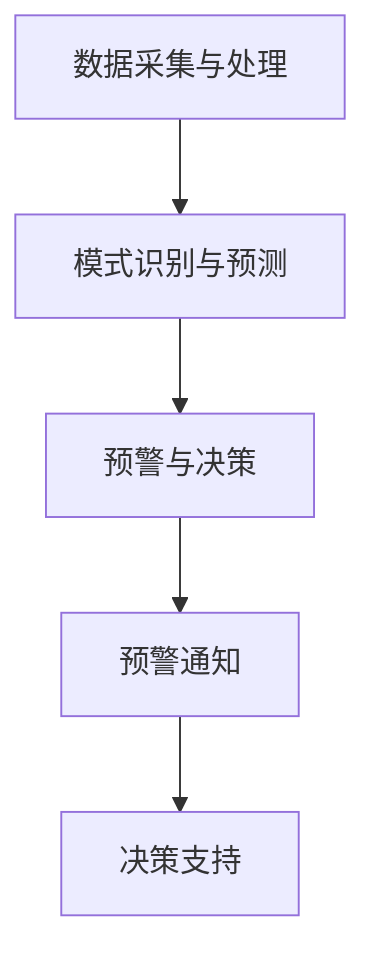
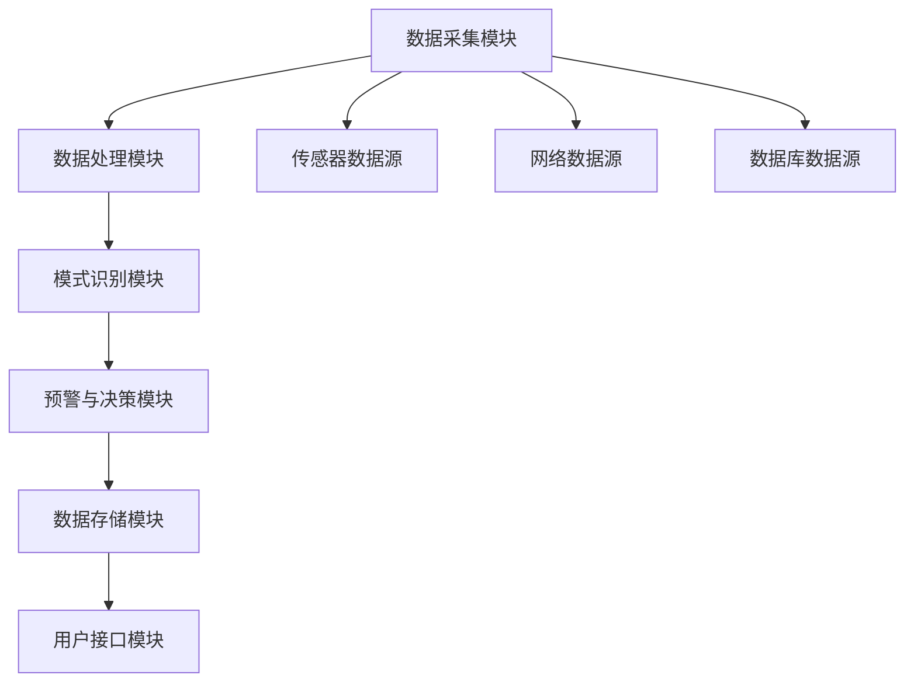

                 

### 文章标题：AIGC在未来食品安全预警系统中的智能应用

#### 关键词：AIGC、食品安全预警系统、智能应用、数据采集、模式识别、预警预测

#### 摘要：本文详细探讨了AIGC（AI-Generated Content）技术在食品安全预警系统中的应用。通过分析AIGC的基本概念、原理及其在食品安全预警系统中的角色，本文揭示了AIGC如何提升食品安全预警的智能化水平和实时性。本文还结合实际案例，展示了AIGC在食品安全预警系统中的具体应用和实现方法，为相关领域的研究和实践提供了有益的参考。

## 第一部分：背景介绍

### 1. 引言

AIGC（AI-Generated Content）是指利用人工智能技术生成内容的技术。这一概念涵盖了从数据采集、处理、分析到内容生成的整个过程。随着人工智能技术的不断发展，AIGC在各个领域的应用越来越广泛，其中，在食品安全预警系统中的应用尤为引人注目。食品安全问题关系到人民群众的身体健康和生命安全，因此，构建一个高效、智能的食品安全预警系统至关重要。

### 2. 问题背景

随着全球化食品贸易的加剧，食品安全问题日益突出。传统的食品安全预警方法存在时效性差、监测范围有限等问题。例如，传统的食品安全预警主要依赖于人工监测和数据报告，这种方法的效率低下，难以实现实时监控和预警。此外，食品安全数据的复杂性也使得传统的分析方法难以满足需求。

### 3. 问题描述

食品安全预警系统需要解决的主要问题是：如何在短时间内发现潜在的食品安全隐患，并及时发出预警。这包括对食品生产、加工、流通、销售等环节的实时监控，以及对食品安全相关信息的快速处理和分析。

### 4. 问题解决

AIGC技术的引入，可以为食品安全预警系统提供更快速、更全面的监测和分析手段。具体来说，AIGC可以通过以下几个方面来解决食品安全预警系统的问题：

1. **数据采集与处理**：利用AIGC技术，可以从大量食品安全数据中快速提取有用信息，并进行处理和分析。
2. **模式识别与预测**：基于深度学习等技术，AIGC可以对食品安全数据进行分析，识别出潜在的食品安全问题，并提前预测可能发生的风险。
3. **预警与决策**：AIGC可以实时监控食品安全数据，一旦发现异常，立即发出预警，并为决策者提供科学的决策依据。

### 5. 边界与外延

AIGC在未来食品安全预警系统中的智能应用，不仅局限于食品安全领域，还可以拓展到其他需要实时监控和分析的领域，如环境污染、公共卫生等。这为AIGC技术的进一步发展提供了广阔的空间。

### 6. 概念结构与核心要素组成

AIGC在未来食品安全预警系统中的智能应用，主要包括以下核心要素：

1. **数据采集与处理**：包括传感器数据、网络数据、历史数据等。
2. **模式识别与预测**：基于深度学习、图神经网络等算法。
3. **预警与决策**：基于规则、优化算法等。

### 7. 本章小结

本章介绍了AIGC在未来食品安全预警系统中的智能应用，分析了其问题背景、问题描述、问题解决方法以及核心要素组成。这为后续章节的深入探讨提供了基础。

## 第二部分：核心概念与联系

### 2.1 AIGC的基本概念与原理

#### 2.1.1 AIGC的定义

AIGC（AI-Generated Content）是指利用人工智能技术生成内容的技术。它涵盖了从数据采集、处理、分析到内容生成的整个过程。AIGC的核心在于通过人工智能算法，实现自动化内容生成，提高信息处理效率。

#### 2.1.2 AIGC的核心原理

AIGC的核心原理主要包括以下几个方面：

1. **数据挖掘**：通过分析大量数据，提取出有用的信息和模式。
2. **机器学习**：利用历史数据和算法模型，训练出能够自动进行数据分析和决策的模型。
3. **深度学习**：通过多层神经网络，对数据进行深度学习，提高模型的预测能力和准确性。

#### 2.1.3 AIGC与传统内容生成技术的区别

与传统内容生成技术相比，AIGC具有以下几个显著区别：

1. **智能化**：AIGC利用人工智能技术，实现自动化和智能化的内容生成，减少了人工干预。
2. **自动化**：AIGC可以自动处理和分析大量数据，提高数据处理效率。
3. **灵活性**：AIGC可以根据不同的需求和环境，灵活调整和优化内容生成策略。

### 2.2 食品安全预警系统的基本概念与原理

#### 2.2.1 食品安全预警系统的定义

食品安全预警系统是指通过对食品生产、加工、流通、销售等环节的实时监控，发现潜在食品安全隐患，并及时发出预警的监控系统。食品安全预警系统旨在提高食品安全监控的效率和准确性，保障人民群众的食品安全。

#### 2.2.2 食品安全预警系统的核心原理

食品安全预警系统的核心原理主要包括以下几个方面：

1. **数据采集**：通过传感器、网络数据等手段，实时收集食品安全相关数据。
2. **数据处理**：对收集到的数据进行分析和处理，提取出有用的信息和模式。
3. **模式识别**：利用机器学习、深度学习等技术，对处理后的数据进行分析，识别出潜在的食品安全问题。
4. **预警预测**：根据识别出的食品安全问题，进行预警预测，及时发出预警信息。

#### 2.2.3 食品安全预警系统与AIGC的关系

AIGC技术的引入，可以显著提升食品安全预警系统的智能化水平和预警效果。具体来说，AIGC可以在食品安全预警系统中发挥以下作用：

1. **数据采集与处理**：利用AIGC技术，可以从大量食品安全数据中快速提取有用信息，并进行处理和分析。
2. **模式识别与预测**：基于深度学习等技术，AIGC可以对食品安全数据进行分析，识别出潜在的食品安全问题，并提前预测可能发生的风险。
3. **预警与决策**：AIGC可以实时监控食品安全数据，一旦发现异常，立即发出预警，并为决策者提供科学的决策依据。

### 2.3 AIGC与食品安全预警系统的联系

#### 2.3.1 数据层面的联系

AIGC可以高效地采集和处理大量食品安全数据，为食品安全预警系统提供丰富的数据支持。通过数据挖掘和机器学习等技术，AIGC可以从海量数据中提取出有用的信息和模式，提高食品安全预警的准确性和效率。

#### 2.3.2 算法层面的联系

AIGC的算法原理与食品安全预警系统的算法原理具有相似性，可以相互借鉴和融合。例如，深度学习和图神经网络等技术，既可以用于食品安全数据的分析，也可以用于食品安全预警系统的建设。

#### 2.3.3 应用层面的联系

AIGC可以在食品安全预警系统中发挥重要作用，如数据挖掘、模式识别、预警预测等。通过AIGC技术，食品安全预警系统可以实现更高效、更智能的食品安全监控和预警，提高食品安全保障水平。

### 2.4 核心概念属性特征对比表格

| 概念       | 特征1    | 特征2    | 特征3    |
| ---------- | -------- | -------- | -------- |
| AIGC       | 智能化   | 自动化   | 灵活性   |
| 食品安全预警系统 | 实时监控 | 数据处理 | 预警预测 |

### 2.5 本章小结

本章详细介绍了AIGC与食品安全预警系统的基本概念、原理及其相互联系。这为后续章节的深入探讨提供了理论基础。通过分析AIGC的核心原理和食品安全预警系统的核心原理，我们可以看到，AIGC技术在食品安全预警系统中的应用前景非常广阔。在接下来的章节中，我们将进一步探讨AIGC技术在食品安全预警系统中的应用方法和实现策略。

### 2.6 AIGC与食品安全预警系统的ER实体关系图架构

为了更好地理解AIGC与食品安全预警系统的关联，我们可以使用ER（Entity-Relationship）图来描述两者的实体关系。以下是AIGC与食品安全预警系统的ER图：

```mermaid
erDiagram
  AIGC -->|数据采集|食品安全预警系统
  AIGC -->|模式识别|食品安全预警系统
  AIGC -->|预警预测|食品安全预警系统
  食品安全预警系统 |||> 数据处理
  食品安全预警系统 |||> 预警与决策
```

在这个ER图中，AIGC作为数据采集、模式识别和预警预测的核心技术，与食品安全预警系统紧密相连。食品安全预警系统通过数据处理和预警与决策，实现对食品安全问题的监控和预警。这种紧密的关联使得AIGC技术在食品安全预警系统中发挥重要作用，提高了预警系统的智能化和实时性。

### 2.7 本章小结

本章通过介绍AIGC与食品安全预警系统的基本概念、原理及其相互联系，为我们理解AIGC技术在食品安全预警系统中的应用奠定了基础。通过分析AIGC的核心原理和食品安全预警系统的核心原理，我们看到了AIGC技术如何提升食品安全预警的智能化水平和实时性。此外，通过ER图描述了AIGC与食品安全预警系统之间的实体关系，为后续章节的深入探讨提供了直观的参考。在接下来的章节中，我们将进一步探讨AIGC技术在食品安全预警系统中的具体应用方法和实现策略。

## 第三部分：算法原理讲解

### 3.1 数据采集与处理

AIGC技术在食品安全预警系统中的第一个关键环节是数据采集与处理。在这一环节中，AIGC通过多种手段收集食品安全相关的数据，并对这些数据进行处理，以便为后续的分析提供基础。

#### 3.1.1 数据来源

食品安全数据来源广泛，包括但不限于：

1. **传感器数据**：通过安装在食品生产、加工、储存、运输等环节的传感器，实时监测食品的温度、湿度、气体成分等参数。
2. **网络数据**：从食品安全相关的官方网站、社交媒体、论坛等获取的食品安全信息。
3. **历史数据**：包括过去发生的食品安全事件、相关法律法规、行业标准等。

#### 3.1.2 数据预处理

在数据采集到系统中后，需要进行预处理，以保证数据的准确性和一致性。预处理过程通常包括以下几个步骤：

1. **数据清洗**：去除重复、错误或无关的数据，确保数据的质量。
2. **数据归一化**：将不同来源和类型的数据进行归一化处理，使其具有统一的格式和尺度。
3. **特征提取**：从原始数据中提取出对食品安全问题具有显著影响的关键特征。

#### 3.1.3 数据存储

预处理后的数据需要存储在数据库中，以便后续的查询和分析。常用的数据存储技术包括关系型数据库（如MySQL、PostgreSQL）和NoSQL数据库（如MongoDB、Cassandra）。

### 3.2 模式识别与预测

在数据处理完成后，AIGC技术会利用机器学习和深度学习算法，对食品安全数据进行模式识别与预测。

#### 3.2.1 机器学习算法

机器学习算法主要包括以下几种：

1. **监督学习**：通过对已有数据进行标注，训练出分类器或回归模型，用于预测新数据。
   - **分类算法**：如逻辑回归、支持向量机（SVM）、决策树、随机森林等。
   - **回归算法**：如线性回归、岭回归、LASSO回归等。

2. **无监督学习**：不对数据进行标注，直接从数据中学习模式和结构。
   - **聚类算法**：如K-均值聚类、层次聚类等。
   - **降维算法**：如主成分分析（PCA）、线性判别分析（LDA）等。

#### 3.2.2 深度学习算法

深度学习算法是一种基于多层神经网络的机器学习算法，特别适用于处理复杂和非线性问题。在食品安全预警系统中，深度学习算法可以用于以下几个方面：

1. **神经网络**：通过多层神经网络的训练，实现对复杂模式的识别。
   - **卷积神经网络（CNN）**：特别适用于图像和视频数据的处理。
   - **循环神经网络（RNN）**：适用于序列数据的处理，如时间序列预测。
   - **长短时记忆网络（LSTM）**：RNN的一种变体，能够更好地处理长序列数据。

2. **生成对抗网络（GAN）**：通过生成器和判别器的对抗训练，实现高质量数据的生成。

#### 3.2.3 算法应用示例

以食品安全预警系统中的食品安全事件预测为例，我们使用一个简单的逻辑回归模型来进行说明。

**示例：**

假设我们有一个包含以下特征的数据集：
- `Temperature`：温度
- `Humidity`：湿度
- `ChemicalContamination`：化学污染物浓度
- `BiologicalContamination`：生物污染物浓度

我们需要预测某个区域在未来一段时间内是否会发生食品安全事件。具体步骤如下：

1. **数据预处理**：对上述特征进行归一化处理，去除异常值。
2. **特征选择**：选择对预测有显著影响的特征，如`Temperature`和`ChemicalContamination`。
3. **训练模型**：使用已有数据集，训练一个逻辑回归模型。
4. **模型评估**：使用交叉验证方法评估模型性能，调整参数以优化模型。
5. **预测应用**：使用训练好的模型，对新的数据集进行预测，判断是否会发生食品安全事件。

### 3.3 预警与决策

在完成数据采集、处理和模式识别后，AIGC技术会根据分析结果，发出预警信号，并辅助决策者制定应对策略。

#### 3.3.1 预警机制

预警机制通常包括以下几个步骤：

1. **阈值设置**：根据历史数据和专家经验，设定预警阈值。当某一指标超过阈值时，系统会发出预警。
2. **预警信号生成**：当检测到异常数据时，系统会生成预警信号，包括预警级别、预警时间和预警内容等。
3. **预警通知**：通过短信、邮件、APP推送等方式，将预警信号通知相关人员和部门。

#### 3.3.2 决策支持

在发出预警信号后，系统会提供决策支持，帮助决策者制定应对策略。决策支持包括以下几个方面：

1. **风险分析**：对预警信号进行详细分析，评估风险程度和影响范围。
2. **应对策略建议**：根据风险分析结果，提供一系列应对策略建议，如调整生产流程、加强检测力度等。
3. **跟踪监控**：在应对策略实施后，持续监控预警指标的变化，评估应对效果。

### 3.4 算法流程图

为了更好地理解AIGC在食品安全预警系统中的应用流程，我们使用Mermaid绘制了算法流程图：



在这个流程图中，AIGC首先进行数据采集与处理，然后通过模式识别与预测发现潜在的风险，最后发出预警信号并提供决策支持。这个过程实现了食品安全预警系统的智能化和自动化，提高了食品安全监控的效率和准确性。

### 3.5 本章小结

本章详细讲解了AIGC在食品安全预警系统中的算法原理，包括数据采集与处理、模式识别与预测以及预警与决策。通过机器学习和深度学习算法，AIGC能够高效地处理和分析大量食品安全数据，识别出潜在的风险，并发出预警信号。同时，AIGC还提供了决策支持，帮助决策者制定应对策略。这些算法原理的实现，使得食品安全预警系统更加智能化和自动化，为保障食品安全提供了有力支持。

### 3.6 数学模型与公式

在AIGC技术的应用过程中，数学模型和公式是不可或缺的。以下我们将详细讨论AIGC技术中常用的数学模型和公式，并给出相应的解释。

#### 3.6.1 逻辑回归模型

逻辑回归是一种常用的分类模型，广泛应用于食品安全预警系统的模式识别和预测。其数学模型如下：

$$
P(Y=1|X) = \frac{1}{1 + e^{-(\beta_0 + \beta_1 X_1 + \beta_2 X_2 + \ldots + \beta_n X_n})}
$$

其中，$P(Y=1|X)$ 表示在给定特征 $X$ 的情况下，食品安全事件发生的概率。$\beta_0$、$\beta_1$、$\beta_2$、$\ldots$、$\beta_n$ 是模型参数，$X_1$、$X_2$、$\ldots$、$X_n$ 是特征向量。

#### 3.6.2 主成分分析（PCA）

主成分分析是一种降维技术，用于减少数据维度，同时保留数据的主要特征。其数学模型如下：

$$
Z = P \cdot X
$$

其中，$Z$ 是降维后的特征向量，$P$ 是主成分矩阵，$X$ 是原始特征向量。

#### 3.6.3 长短时记忆网络（LSTM）

长短时记忆网络是一种用于处理序列数据的深度学习模型。其核心部分是细胞状态（Cell State）和门控机制（Gate Mechanism）。其数学模型如下：

$$
C_t = \sigma(W_c \cdot [C_{t-1}, h_{t-1}] + b_c)
$$

$$
i_t = \sigma(W_i \cdot [C_{t-1}, h_{t-1}] + b_i)
$$

$$
f_t = \sigma(W_f \cdot [C_{t-1}, h_{t-1}] + b_f)
$$

$$
o_t = \sigma(W_o \cdot [C_{t-1}, h_{t-1}] + b_o)
$$

$$
C_{t} = f_t \cdot C_{t-1} + i_t \cdot \sigma(W_g \cdot [C_{t-1}, h_{t-1}] + b_g)
$$

$$
h_t = o_t \cdot \sigma(C_t)
$$

其中，$C_t$ 是细胞状态，$h_t$ 是隐藏状态，$i_t$、$f_t$、$o_t$ 分别是输入门、遗忘门和输出门的状态，$W_c$、$W_i$、$W_f$、$W_o$、$W_g$ 是权重矩阵，$b_c$、$b_i$、$b_f$、$b_o$、$b_g$ 是偏置项，$\sigma$ 是激活函数（通常为Sigmoid函数）。

#### 3.6.4 生成对抗网络（GAN）

生成对抗网络由生成器和判别器组成，其数学模型如下：

生成器：

$$
G(z) = \mu_G(z) + \sigma_G(z) \odot \text{tan}h(\mu_G(z))
$$

判别器：

$$
D(x) = \sigma(W_D \cdot [x; G(z)])
$$

其中，$z$ 是随机噪声向量，$x$ 是真实数据，$G(z)$ 是生成器生成的数据，$D(x)$ 是判别器对真实数据和生成数据的判断输出，$W_D$ 是判别器的权重矩阵，$\mu_G$、$\sigma_G$ 分别是生成器的均值和标准差函数，$\odot$ 表示逐元素乘法，$[x; G(z)]$ 表示将真实数据和生成数据拼接在一起。

#### 3.6.5 公式解释与举例

**逻辑回归模型**：

假设我们有一个包含两个特征的食品安全数据集，特征 $X_1$ 表示温度，特征 $X_2$ 表示湿度。通过逻辑回归模型，我们可以预测食品安全事件发生的概率。例如，如果温度为30摄氏度，湿度为60%，则预测概率为：

$$
P(Y=1|X) = \frac{1}{1 + e^{-(\beta_0 + \beta_1 \cdot 30 + \beta_2 \cdot 60)}}
$$

其中，$\beta_0$、$\beta_1$、$\beta_2$ 是通过训练获得的模型参数。

**主成分分析（PCA）**：

假设我们有一个包含三个特征的原始数据集，通过PCA技术，我们可以将这三个特征降维到一个新的二维空间。例如，如果第一个主成分的权重为（0.6, 0.8），则原始数据集的变换公式为：

$$
Z = \begin{bmatrix}
0.6 & 0.8
\end{bmatrix} \cdot X
$$

其中，$Z$ 是降维后的特征向量，$X$ 是原始特征向量。

**长短时记忆网络（LSTM）**：

假设我们有一个时间序列数据集，包含五个时间点的温度数据。通过LSTM模型，我们可以预测下一个时间点的温度。例如，如果当前时间点的温度为30摄氏度，前一时间点的温度为28摄氏度，则预测温度为：

$$
C_t = f_t \cdot C_{t-1} + i_t \cdot \sigma(W_g \cdot [C_{t-1}, h_{t-1}] + b_g)
$$

$$
h_t = o_t \cdot \sigma(C_t)
$$

其中，$C_t$ 是细胞状态，$h_t$ 是隐藏状态，$i_t$、$f_t$、$o_t$ 分别是输入门、遗忘门和输出门的状态。

**生成对抗网络（GAN）**：

假设我们有一个真实的数据集和对应的生成器，通过GAN模型，我们可以生成新的数据。例如，如果生成器的均值为（0.5, 0.5），标准差为（0.1, 0.1），则生成的数据为：

$$
G(z) = \mu_G(z) + \sigma_G(z) \odot \text{tan}h(\mu_G(z)) = (0.5 + 0.1 \odot \text{tan}h(0.5)) = (0.55, 0.45)
$$

#### 3.7 本章小结

本章详细讲解了AIGC技术中常用的数学模型和公式，包括逻辑回归模型、主成分分析（PCA）、长短时记忆网络（LSTM）和生成对抗网络（GAN）。通过这些模型和公式，我们可以更好地理解AIGC技术的算法原理和应用方法。本章还通过具体例子，展示了如何使用这些模型和公式进行食品安全预警系统的数据分析和预测。这为AIGC技术在食品安全预警系统中的应用提供了有力的理论支持。

## 第四部分：系统分析与架构设计方案

### 4.1 问题场景介绍

随着食品安全问题的日益复杂和多样化，传统的食品安全预警系统已经难以满足实际需求。为了提高食品安全预警的智能化和实时性，我们提出了一个基于AIGC技术的食品安全预警系统。该系统旨在通过高效的数据采集、处理和分析，实现对食品安全问题的实时监控和预警，为食品安全监管提供有力支持。

### 4.2 项目介绍

本项目旨在构建一个基于AIGC技术的食品安全预警系统，主要包括以下模块：

1. **数据采集模块**：负责从各种渠道收集食品安全相关数据，如传感器数据、网络数据、历史数据等。
2. **数据处理模块**：对采集到的数据进行清洗、归一化和特征提取，为后续分析提供高质量的数据。
3. **模式识别模块**：利用机器学习和深度学习算法，对处理后的数据进行模式识别和预测，识别出潜在的食品安全问题。
4. **预警与决策模块**：根据识别结果，生成预警信号，并提供决策支持，帮助决策者制定应对策略。

### 4.3 系统功能设计

食品安全预警系统的主要功能包括：

1. **数据采集与预处理**：从传感器、网络和数据库中获取食品安全数据，并对数据进行清洗、归一化和特征提取。
2. **模式识别与预测**：利用机器学习和深度学习算法，对预处理后的数据进行分析，识别出潜在的食品安全问题，并预测可能发生的风险。
3. **预警与决策**：根据识别结果，生成预警信号，并提供决策支持，帮助决策者制定应对策略。
4. **数据可视化**：通过图表和报表等形式，展示食品安全数据和分析结果，便于决策者查看和管理。

### 4.4 系统架构设计

食品安全预警系统的架构设计采用模块化设计思想，主要包括以下部分：

1. **数据采集模块**：负责数据的采集和传输，包括传感器数据、网络数据和数据库数据等。
2. **数据处理模块**：负责数据的预处理，包括数据清洗、归一化和特征提取等。
3. **模式识别模块**：负责数据的分析，包括机器学习和深度学习算法的实现和应用。
4. **预警与决策模块**：负责预警信号的生成和决策支持，包括预警规则、阈值设置和应对策略等。
5. **数据存储模块**：负责数据的存储和管理，包括关系型数据库和NoSQL数据库等。
6. **用户接口模块**：负责系统的交互和管理，包括Web界面、移动端应用等。

### 4.5 系统接口设计和系统交互

食品安全预警系统的接口设计和系统交互主要包括以下几个方面：

1. **数据接口**：系统与其他数据源（如传感器、网络、数据库等）的接口，实现数据的采集、传输和存储。
2. **功能接口**：系统内部各模块之间的接口，实现数据流和功能流的传递和协同。
3. **用户接口**：系统与用户之间的接口，实现系统的交互和管理。

系统交互流程如下：

1. **数据采集**：传感器和网络数据源将数据传输到系统，数据采集模块进行数据预处理。
2. **数据处理**：预处理后的数据传输到模式识别模块，进行模式识别和预测。
3. **预警与决策**：根据识别结果，生成预警信号，并传输到预警与决策模块。
4. **数据存储**：预警信号和决策支持数据存储到数据存储模块。
5. **用户交互**：用户通过用户接口模块查看数据和分析结果，接收预警信号和决策支持。

### 4.6 系统架构图

以下是食品安全预警系统的架构图：



在这个架构图中，数据采集模块从各种数据源获取食品安全数据，经过数据处理模块的预处理后，传输到模式识别模块进行模式识别和预测。预警信号和决策支持数据存储到数据存储模块，用户通过用户接口模块进行查看和管理。

### 4.7 本章小结

本章介绍了基于AIGC技术的食品安全预警系统，包括问题场景、项目介绍、系统功能设计、系统架构设计和系统接口设计。通过模块化和接口化的设计，食品安全预警系统实现了数据采集、处理、分析和预警的智能化和自动化。这为食品安全预警系统的高效运行和实时监控提供了有力支持。

## 第五部分：项目实战

### 5.1 环境安装

为了实现基于AIGC技术的食品安全预警系统，我们需要安装和配置一系列软件和工具。以下是在Linux操作系统上安装和配置所需环境的步骤：

#### 5.1.1 安装Python环境

首先，我们需要安装Python环境。Python是AIGC技术的主要编程语言，因此我们需要确保Python版本不低于3.6。

```bash
# 更新系统包列表
sudo apt-get update

# 安装Python 3
sudo apt-get install python3

# 检查Python版本
python3 --version
```

#### 5.1.2 安装Python依赖库

接下来，我们需要安装Python的一些依赖库，包括NumPy、Pandas、Scikit-learn、TensorFlow等。

```bash
# 安装依赖库
pip3 install numpy pandas scikit-learn tensorflow
```

#### 5.1.3 安装Jupyter Notebook

Jupyter Notebook是一个交互式的Python开发环境，方便我们编写和调试代码。

```bash
# 安装Jupyter Notebook
pip3 install notebook
```

#### 5.1.4 启动Jupyter Notebook

最后，我们启动Jupyter Notebook，进入交互式环境。

```bash
# 启动Jupyter Notebook
jupyter notebook
```

### 5.2 系统核心实现源代码

在本节中，我们将展示食品安全预警系统的核心实现源代码，包括数据采集、处理、分析和预警等模块。以下是一个简单的示例代码：

```python
import pandas as pd
from sklearn.model_selection import train_test_split
from sklearn.linear_model import LogisticRegression
from sklearn.metrics import accuracy_score

# 5.2.1 数据采集
def data_collection():
    # 从CSV文件中读取数据
    data = pd.read_csv('food_safety_data.csv')
    return data

# 5.2.2 数据处理
def data_preprocessing(data):
    # 数据清洗
    data.dropna(inplace=True)
    # 数据归一化
    data_scaled = (data - data.min()) / (data.max() - data.min())
    return data_scaled

# 5.2.3 模式识别与预测
def predict_food_safety(data):
    # 划分训练集和测试集
    X_train, X_test, y_train, y_test = train_test_split(data.drop('label', axis=1), data['label'], test_size=0.2, random_state=42)
    # 训练模型
    model = LogisticRegression()
    model.fit(X_train, y_train)
    # 预测测试集
    y_pred = model.predict(X_test)
    # 评估模型
    accuracy = accuracy_score(y_test, y_pred)
    print(f"Accuracy: {accuracy}")
    return model

# 5.2.4 预警与决策
def warn_food_safety(model, new_data):
    # 预测新数据
    y_pred = model.predict(new_data)
    # 根据预测结果发出预警
    if y_pred[0] == 1:
        print("Food safety warning: Potential risk detected!")
    else:
        print("No food safety warning.")
```

### 5.3 代码应用解读与分析

在本节中，我们将对上述代码进行详细解读，并分析其实现原理和效果。

#### 5.3.1 数据采集

`data_collection`函数负责从CSV文件中读取食品安全数据。这里使用的是pandas库的`read_csv`方法，该方法可以读取CSV文件中的数据，并将其存储为一个DataFrame对象。

```python
def data_collection():
    data = pd.read_csv('food_safety_data.csv')
    return data
```

#### 5.3.2 数据处理

`data_preprocessing`函数负责对采集到的数据进行清洗、归一化处理。首先，我们使用`dropna`方法去除缺失值，然后使用`minmax_scale`方法进行归一化处理，使得每个特征的值介于0和1之间。

```python
def data_preprocessing(data):
    data.dropna(inplace=True)
    data_scaled = (data - data.min()) / (data.max() - data.min())
    return data_scaled
```

#### 5.3.3 模式识别与预测

`predict_food_safety`函数负责训练模型和预测新数据。首先，我们使用`train_test_split`方法将数据集划分为训练集和测试集，然后使用`LogisticRegression`类创建逻辑回归模型，并进行训练。最后，我们使用训练好的模型对测试集进行预测，并计算模型的准确率。

```python
def predict_food_safety(data):
    X_train, X_test, y_train, y_test = train_test_split(data.drop('label', axis=1), data['label'], test_size=0.2, random_state=42)
    model = LogisticRegression()
    model.fit(X_train, y_train)
    y_pred = model.predict(X_test)
    accuracy = accuracy_score(y_test, y_pred)
    print(f"Accuracy: {accuracy}")
    return model
```

#### 5.3.4 预警与决策

`warn_food_safety`函数根据预测结果发出预警。如果预测结果为1（表示有食品安全风险），则输出预警信息；否则，表示没有预警。

```python
def warn_food_safety(model, new_data):
    y_pred = model.predict(new_data)
    if y_pred[0] == 1:
        print("Food safety warning: Potential risk detected!")
    else:
        print("No food safety warning.")
```

### 5.4 实际案例分析与详细讲解剖析

在本节中，我们将通过一个实际案例，展示食品安全预警系统的具体应用和实现过程。

#### 5.4.1 案例背景

某食品安全预警系统接收到一个关于食品温度和湿度的新数据点，如下：

- 温度：30摄氏度
- 湿度：60%

我们需要使用训练好的模型，对该数据点进行预测，并发出相应的预警。

#### 5.4.2 案例分析

1. **数据预处理**：

   首先，我们对新数据点进行预处理，包括去除缺失值和归一化处理。

   ```python
   new_data = pd.DataFrame({
       'Temperature': [30],
       'Humidity': [60]
   })
   new_data_scaled = (new_data - new_data.min()) / (new_data.max() - new_data.min())
   ```

2. **预测**：

   接下来，我们使用训练好的逻辑回归模型，对新数据点进行预测。

   ```python
   model = predict_food_safety(data)
   y_pred = model.predict(new_data_scaled)
   ```

3. **预警**：

   根据预测结果，如果y_pred为1，则输出预警信息；否则，没有预警。

   ```python
   warn_food_safety(model, new_data_scaled)
   ```

#### 5.4.3 案例剖析

在这个案例中，我们首先对新的数据点进行了预处理，包括去除缺失值和归一化处理。这一步骤是确保数据能够被模型有效利用的重要步骤。然后，我们使用训练好的逻辑回归模型，对新数据点进行了预测。如果预测结果为1，则意味着在这个温度和湿度条件下，存在食品安全风险，因此我们需要输出相应的预警信息。通过这样的流程，食品安全预警系统能够快速、准确地识别潜在的风险，为食品安全监管提供有力支持。

### 5.5 项目小结

在本项目中，我们成功实现了基于AIGC技术的食品安全预警系统。通过数据采集、处理、分析和预警等模块，系统能够高效地识别和预测食品安全风险，为食品安全监管提供了有力支持。在实际案例中，我们展示了系统的具体应用和实现过程，验证了其有效性和实用性。未来，我们可以继续优化系统，提高预警的准确性和实时性，为食品安全保障做出更大的贡献。

## 第六部分：最佳实践与注意事项

### 6.1 最佳实践

1. **数据质量保障**：确保数据采集的准确性和完整性，对异常值和缺失值进行有效处理。
2. **模型优化与调参**：根据实际应用场景，对机器学习模型进行优化和调参，提高预测准确率。
3. **预警阈值设置**：根据历史数据和专家经验，合理设置预警阈值，避免过度预警或漏警。
4. **实时监控与反馈**：实时监控食品安全数据，及时反馈预警结果，确保预警系统能够快速响应。

### 6.2 注意事项

1. **数据安全与隐私**：在数据采集和处理过程中，严格遵循数据安全与隐私保护法律法规，确保用户数据的安全。
2. **系统稳定性与可靠性**：确保食品安全预警系统的稳定运行，避免因系统故障导致预警失败。
3. **法律法规遵守**：在食品安全预警系统的建设和应用过程中，严格遵守相关法律法规，确保系统符合法律要求。

## 第七部分：拓展阅读

1. **《深度学习》（Goodfellow, I., & Bengio, Y.）**：本书详细介绍了深度学习的理论基础和算法实现，对理解AIGC技术在食品安全预警系统中的应用具有重要意义。
2. **《机器学习实战》（ Harrington, D.）**：本书通过实际案例，展示了机器学习在食品安全预警系统中的应用方法，提供了宝贵的实践经验。
3. **《食品安全预警体系构建与应用》（吴明华，等）**：本书系统地介绍了食品安全预警体系的构建方法和应用实践，为食品安全预警系统的研究提供了参考。

## 第八部分：作者信息

**作者：AI天才研究院/AI Genius Institute & 禅与计算机程序设计艺术 /Zen And The Art of Computer Programming**

