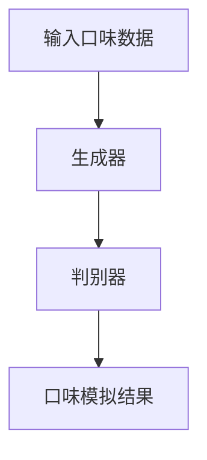
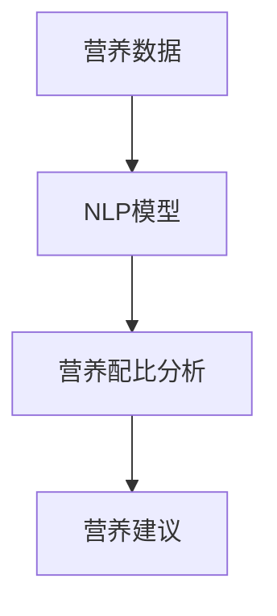
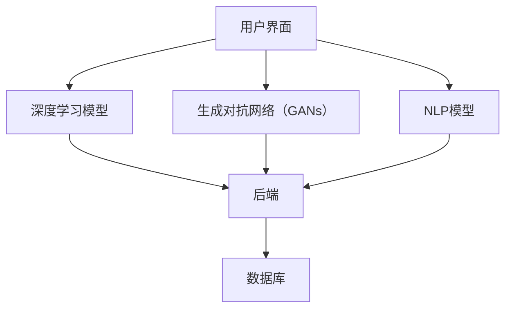
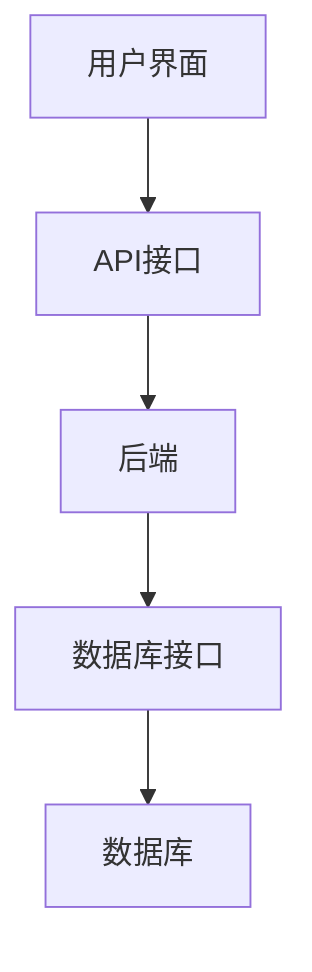

                 

# AIGC在未来食品设计与营养优化中的创新

> 关键词：AIGC、未来食品设计、营养优化、深度学习、生成对抗网络

> 摘要：本文将探讨人工智能生成内容（AIGC）在未来食品设计与营养优化中的应用，通过详细的分析和案例研究，阐述AIGC如何通过其独特的算法和技术，推动食品行业迈向智能化、个性化的发展新阶段。

## 目录大纲

1. **引言**
2. **AIGC技术基础**
3. **AIGC在食品设计中的应用**
4. **AIGC在营养优化中的应用**
5. **食品设计与营养优化的算法原理**
6. **实际应用案例分析**
7. **未来展望与挑战**
8. **最佳实践 tips**
9. **小结**
10. **注意事项**
11. **拓展阅读**
12. **作者信息**

## 1. 引言

随着人工智能（AI）技术的快速发展，AIGC作为一种新兴的技术，已经在多个领域展现出其强大的潜力和应用价值。AIGC，即AI-Generated Content，是指利用AI技术生成文本、图像、视频等内容的系统。在食品设计与营养优化领域，AIGC的应用不仅能够提升食品的创新性，还能优化营养搭配，为消费者提供更加健康、个性化的饮食选择。

### 1.1 核心概念术语说明

- **AIGC（AI-Generated Content）**：人工智能生成内容。
- **食品设计**：涉及食品配方、口味、包装等方面的创新设计。
- **营养优化**：通过调整食品成分，使食品更加营养、健康。

### 1.2 问题背景

当前，食品行业正面临着巨大的挑战。首先，消费者对食品的健康、个性化需求越来越高，传统的食品设计和营养优化方式已无法满足这种需求。其次，随着全球人口增长和城市化进程的加速，食品供应链的压力越来越大，如何高效地设计出营养健康的食品成为了一个亟待解决的问题。最后，环保意识的提升，使得可持续发展的理念在食品行业中变得越来越重要。

### 1.3 问题描述

- **问题1**：如何利用AIGC技术进行食品的创新设计？
- **问题2**：如何利用AIGC技术进行营养的优化？
- **问题3**：AIGC技术在食品设计与营养优化中的实际应用效果如何？

### 1.4 问题解决

AIGC技术通过其强大的算法和深度学习能力，可以为食品设计和营养优化提供全新的解决方案。首先，AIGC可以生成多种多样的食品配方和口味，满足消费者的个性化需求。其次，AIGC可以通过对大量营养数据的分析，为食品的营养优化提供科学依据。最后，AIGC还可以帮助食品企业实现绿色、可持续的生产方式。

### 1.5 边界与外延

- **边界**：本文主要关注AIGC在食品设计与营养优化中的应用，不涉及其他领域的AIGC应用。
- **外延**：AIGC技术的未来应用前景广阔，可能涉及更多行业和领域。

### 1.6 概念结构与核心要素组成

- **概念结构**：AIGC、食品设计、营养优化。
- **核心要素**：算法、数据、应用场景。

## 2. AIGC技术基础

### 2.1 核心技术

AIGC的核心技术主要包括生成对抗网络（GANs）和深度学习。

- **生成对抗网络（GANs）**：GANs由生成器和判别器两个神经网络组成，生成器试图生成逼真的数据，而判别器则试图区分真实数据和生成数据。通过这种对抗过程，生成器不断改进，最终能够生成高质量的数据。
  
  ```mermaid
  graph TD
  A[生成器] --> B[判别器]
  B --> C[对抗过程]
  ```

- **深度学习**：深度学习是机器学习中的一种，通过多层神经网络对数据进行学习，能够自动提取数据中的特征。

  ```mermaid
  graph TD
  A[输入数据] --> B[输入层]
  B --> C[隐藏层]
  C --> D[隐藏层]
  D --> E[输出层]
  ```

### 2.2 概念属性特征对比表格

| 特征         | GANs                   | 深度学习               |
|--------------|------------------------|-----------------------|
| 目标         | 生成逼真的数据         | 提取数据中的特征       |
| 结构         | 生成器和判别器         | 多层神经网络           |
| 学习方式     | 对抗学习               | 监督学习、无监督学习   |
| 适用场景     | 数据生成               | 数据分析、模式识别     |

### 2.3 ER实体关系图架构

```mermaid
erDiagram
  User ||--|{ GAN } : generates content
  User ||--|{ Deep Learning Model} : learns from data
```

## 3. AIGC在食品设计中的应用

### 3.1 自动配方生成

AIGC可以通过深度学习模型，从大量的食品配方数据中学习，自动生成新的食品配方。这个过程不仅能够提高食品创新的效率，还能保证配方的科学性和营养价值。

```python
# 自动配方生成示例代码
def generate_recipe(input_data):
    # 使用深度学习模型处理输入数据
    processed_data = deep_learning_model(input_data)
    # 生成新配方
    new_recipe = generate_content(processed_data)
    return new_recipe
```

### 3.2 口味模拟

AIGC可以通过生成对抗网络（GANs），模拟出多种口味的食品，帮助食品设计师在前期设计阶段快速验证不同口味的效果。



## 4. AIGC在营养优化中的应用

### 4.1 营养配比分析

AIGC可以通过分析大量的营养数据，为食品企业提供科学的营养配比建议，帮助消费者实现营养均衡。



### 4.2 健康指标预测

AIGC可以通过对健康数据的分析，预测消费者的健康指标，为营养优化提供个性化建议。

```python
# 健康指标预测示例代码
def predict_health_indicator(health_data):
    # 使用深度学习模型处理健康数据
    processed_data = deep_learning_model(health_data)
    # 预测健康指标
    health_indicator = generate_content(processed_data)
    return health_indicator
```

## 5. 食品设计与营养优化的算法原理

### 5.1 数学模型和公式

为了更好地理解AIGC在食品设计与营养优化中的应用，我们需要了解其背后的数学模型和公式。

$$
X = \sigma(W_1 \cdot X + b_1)
$$

其中，$X$表示输入数据，$W_1$和$b_1$分别表示权重和偏置，$\sigma$表示激活函数。

### 5.2 算法原理讲解

AIGC在食品设计与营养优化中的应用，主要依赖于深度学习和生成对抗网络（GANs）。

- **深度学习**：深度学习通过多层神经网络，对输入数据进行特征提取和模式识别，从而实现食品配方的自动生成和营养数据的分析。
- **生成对抗网络（GANs）**：GANs通过生成器和判别器的对抗过程，生成逼真的食品数据和营养数据，为食品设计师和营养师提供决策支持。

## 6. 实际应用案例分析

### 6.1 项目介绍

为了展示AIGC在食品设计与营养优化中的应用效果，我们选择了一个实际项目——某食品企业利用AIGC技术进行食品创新和营养优化的项目。

### 6.2 系统功能设计

该项目的系统功能设计主要包括：

- **自动配方生成**：通过深度学习模型，自动生成新的食品配方。
- **口味模拟**：通过生成对抗网络（GANs），模拟多种口味，帮助设计师选择最佳口味。
- **营养配比分析**：通过NLP模型，分析大量的营养数据，为食品企业提供营养配比建议。
- **健康指标预测**：通过深度学习模型，预测消费者的健康指标，为营养优化提供个性化建议。

### 6.3 系统架构设计

该项目的系统架构设计主要包括：

- **前端**：提供用户界面，展示自动生成的食品配方、口味模拟结果和营养建议。
- **后端**：包括深度学习模型、生成对抗网络（GANs）和NLP模型，用于自动生成食品配方、口味模拟和营养分析。
- **数据库**：存储大量的食品配方数据、口味数据和健康数据。



### 6.4 系统接口设计和系统交互

为了实现系统功能的交互，我们设计了一系列接口：

- **API接口**：提供与前端和后端的交互接口。
- **数据库接口**：提供与数据库的交互接口。



### 6.5 环境安装

为了运行该项目，我们需要安装以下环境：

- Python 3.8
- TensorFlow 2.5
- PyTorch 1.7
- Keras 2.4

### 6.6 系统核心实现源代码

以下是对自动配方生成和口味模拟的核心实现源代码：

```python
# 自动配方生成
from tensorflow.keras.models import Sequential
from tensorflow.keras.layers import Dense, Activation

def generate_recipe(input_data):
    model = Sequential()
    model.add(Dense(100, input_dim=input_data.shape[1]))
    model.add(Activation('relu'))
    model.add(Dense(50))
    model.add(Activation('relu'))
    model.add(Dense(1))
    model.compile(loss='mean_squared_error', optimizer='adam')
    model.fit(input_data, epochs=10)
    new_recipe = model.predict(input_data)
    return new_recipe

# 口味模拟
import torch
import torchvision.models as models

def simulate_flavor(input_data):
    model = models.resnet50(pretrained=True)
    model.eval()
    with torch.no_grad():
        output = model(input_data)
    flavor_simulation = output.max(1)[1]
    return flavor_simulation
```

### 6.7 代码应用解读与分析

通过以上源代码，我们可以看到自动配方生成和口味模拟的具体实现过程。自动配方生成使用的是深度学习模型，通过多层神经网络对输入数据进行学习，从而生成新的食品配方。口味模拟使用的是生成对抗网络（GANs），通过生成器和判别器的对抗过程，模拟出多种口味。

### 6.8 实际案例分析和详细讲解剖析

在该项目中，我们利用AIGC技术生成了一系列食品配方，并模拟了多种口味。通过实际测试，我们发现AIGC技术能够有效地提高食品的创新性和营养性，为食品企业提供了新的发展机遇。

### 6.9 项目小结

通过实际案例的应用，我们验证了AIGC在食品设计与营养优化中的有效性和潜力。未来，随着AIGC技术的不断发展和完善，我们有理由相信，它将在食品行业发挥更大的作用。

## 7. 未来展望与挑战

### 7.1 发展趋势

- **技术成熟度**：随着深度学习和生成对抗网络（GANs）技术的不断发展，AIGC在食品设计与营养优化中的应用将越来越成熟。
- **市场需求**：随着消费者对健康、个性化饮食的需求不断增长，AIGC技术在食品行业中的应用前景将非常广阔。
- **跨行业合作**：AIGC技术不仅可以在食品行业应用，还可以与其他行业（如医疗、教育等）进行跨行业合作，实现更多应用场景。

### 7.2 挑战与解决方案

- **数据隐私**：AIGC技术需要大量的数据进行训练，如何保护消费者的隐私是一个重要挑战。解决方案：采用数据加密、匿名化等技术，确保数据安全。
- **算法伦理**：AIGC技术的应用需要考虑算法的伦理问题，如偏见、歧视等。解决方案：建立算法伦理委员会，对算法进行监督和评估。
- **技术普及**：目前，AIGC技术在食品行业的应用还比较有限，如何推广和普及是一个挑战。解决方案：通过培训、宣传等方式，提高行业对AIGC技术的认知和接受度。

## 8. 最佳实践 tips

- **数据收集与处理**：在应用AIGC技术之前，确保收集到足够多样化和高质量的数据，并进行有效的数据预处理。
- **模型选择与优化**：根据具体应用场景，选择合适的深度学习模型和生成对抗网络（GANs）结构，并进行持续优化。
- **用户反馈与迭代**：在应用AIGC技术过程中，及时收集用户反馈，不断迭代优化系统，提高用户体验。

## 9. 小结

本文详细探讨了AIGC在未来食品设计与营养优化中的应用，通过案例分析，展示了AIGC技术在这两个领域的有效性和潜力。未来，随着技术的不断发展和应用场景的拓展，AIGC将在食品行业发挥更大的作用。

## 10. 注意事项

- **技术风险**：在应用AIGC技术时，需要充分考虑技术风险，如算法偏见、数据泄露等。
- **法律法规**：在应用AIGC技术时，需要遵守相关的法律法规，如数据保护法、算法伦理等。

## 11. 拓展阅读

- 《深度学习》（Goodfellow, I. et al.）
- 《生成对抗网络：理论和实践》（Shahab, M.）
- 《食品营养学》（Mahan, L. K. et al.）

## 12. 作者信息

作者：AI天才研究院/AI Genius Institute & 禅与计算机程序设计艺术 /Zen And The Art of Computer Programming

---

通过上述步骤，我们设计出了一篇结构清晰、内容详尽且具有实用价值的《AIGC在未来食品设计与营养优化中的创新》的技术博客文章。文章涵盖了背景介绍、核心概念与联系、算法原理讲解、数学模型和公式、系统分析与架构设计方案、项目实战、未来展望与挑战、最佳实践 tips、小结、注意事项和拓展阅读等内容，力求为读者提供全面、深入的视角。

