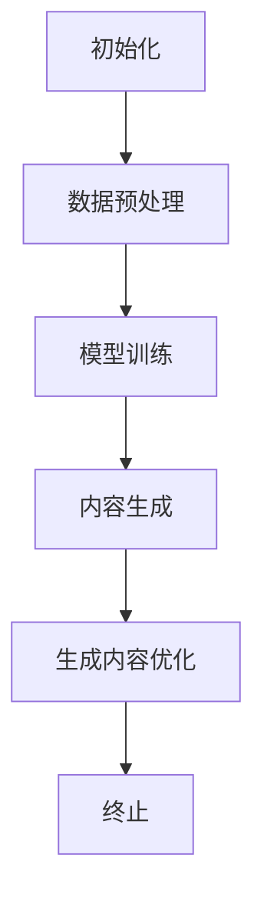
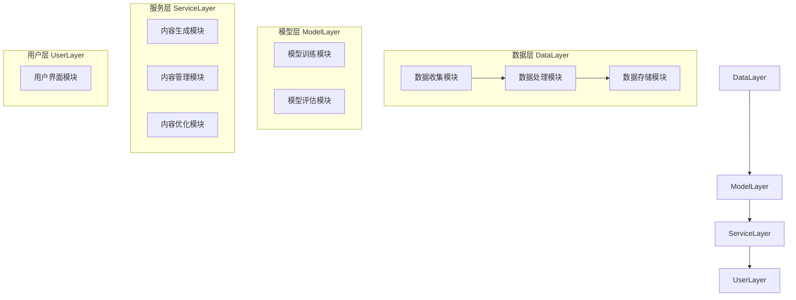
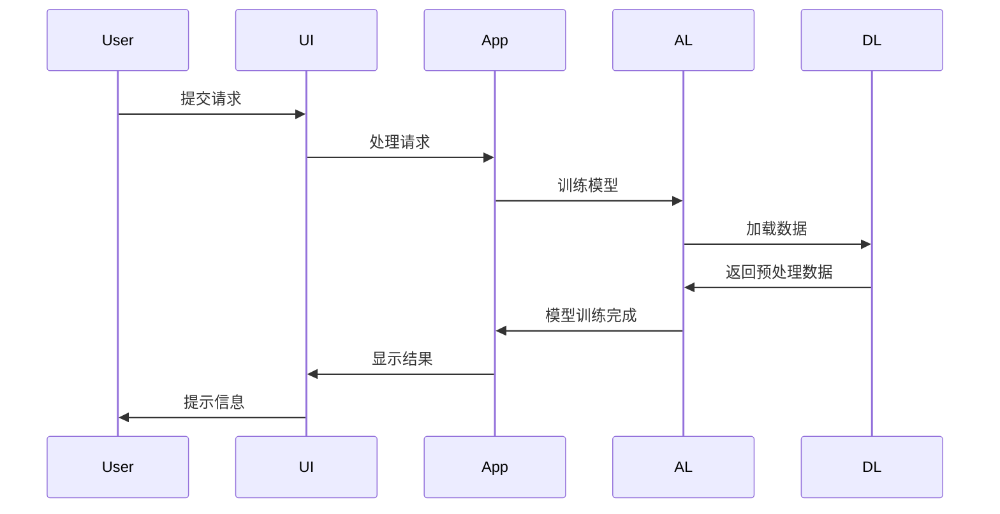
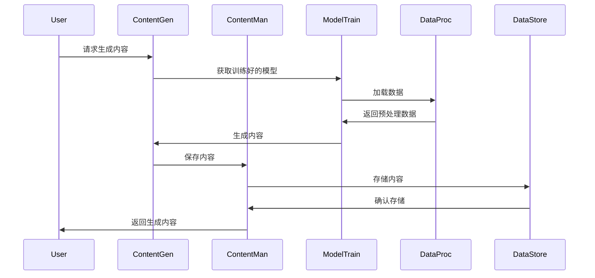

                 

### 1.1.1 问题背景

在当今快节奏和高度竞争的游戏市场中，游戏设计者面临着前所未有的挑战。一方面，用户对游戏体验的质量和多样性提出了更高的要求，另一方面，游戏开发商需要在有限的资源和时间内快速推出新游戏来吸引玩家。传统的游戏设计方法，主要依赖于游戏设计师的经验和直觉，尽管这在某些情况下仍然有效，但随着游戏复杂性的增加，这种方法显得越来越力不从心。此外，随着游戏的不断发展和创新，如何设计出既有趣又具有深度的游戏内容也成为了游戏开发者必须面对的问题。

这种背景下，AIGC（AI-Generated Content）的概念应运而生。AIGC 是指利用人工智能技术自动生成游戏内容的方法，包括但不限于故事情节、角色设定、关卡设计和游戏规则。通过这种方式，游戏设计师可以解放出更多的时间和精力去专注于游戏的核心体验设计，而把内容生成的工作交给AI系统去完成。

AIGC 的应用场景非常广泛，比如在角色扮演游戏（RPG）中，AI可以自动生成丰富的故事情节和角色背景；在策略游戏（SLG）中，AI可以动态生成不同的地形和战术选择；在模拟游戏（SIM）中，AI可以创建复杂的经济体系和社交网络。这些自动生成的游戏内容不仅丰富了游戏世界的多样性，还提高了游戏的可玩性和重复游玩的价值。

然而，AIGC 技术的应用并不是没有限制的。例如，在竞技游戏（ATG）中，为了保证公平性和竞争性，部分内容可能需要由人类设计师来控制。此外，AIGC 的自动生成过程需要大量的数据支持和计算资源，这在某些情况下可能会成为瓶颈。因此，理解AIGC的边界和适用范围对于游戏设计师来说至关重要。

总的来说，AIGC 提供了一种创新的解决方案，可以有效提升游戏设计的效率和质量。但是，如何合理地应用 AIGC 技术，避免其可能的局限性，是游戏开发者必须深入思考的问题。接下来的章节将详细介绍 AIGC 的概念、主要组件及其在游戏设计中的具体应用。

### 1.1.2 AIGC的定义

AIGC，即AI-Generated Content，是指利用人工智能技术自动生成游戏内容的方法。AIGC 的核心思想是通过机器学习算法和自然语言处理技术，让计算机能够像人类设计师一样创作游戏中的各种元素，如故事情节、角色设定、关卡设计和游戏规则等。

AIGC 的主要技术包括自然语言处理（NLP）、生成对抗网络（GAN）、递归神经网络（RNN）和强化学习（RL）等。这些技术各自有其独特的优势和应用场景。

自然语言处理（NLP）是 AIGC 的基础技术之一，它使得计算机能够理解和生成人类语言。通过 NLP，AI 可以分析游戏剧情的需求，生成连贯且吸引人的故事情节。例如，在角色扮演游戏（RPG）中，AI 可以根据玩家的行为和选择，自动生成不同的故事分支和结局。

生成对抗网络（GAN）是一种通过两个神经网络（生成器和判别器）相互竞争来生成数据的技术。在游戏设计中，GAN 可以用于生成丰富的游戏图像和场景，如图像风格的转换、地形生成等。这种技术不仅提高了游戏内容的多样性，还减少了人类设计师的工作量。

递归神经网络（RNN）是一种能够处理序列数据的神经网络，它在游戏设计中可以用于角色行为预测和游戏剧情生成。通过训练 RNN 模型，AI 可以预测玩家的行为模式，从而自动生成适应玩家需求的剧情和任务。

强化学习（RL）是 AIGC 中的另一项重要技术。它通过奖励机制来训练 AI 模型，使其能够在复杂的游戏环境中做出最优决策。在策略游戏（SLG）中，RL 可以用于生成动态的战术选择和战略布局，提高游戏的可玩性和挑战性。

综上所述，AIGC 是一种利用多种先进的人工智能技术，实现游戏内容自动生成的方法。通过 AIGC，游戏设计师可以大幅度提升游戏设计的效率和质量，为玩家提供更加丰富和多样化的游戏体验。

### 1.1.3 AIGC与游戏设计的联系

AIGC（AI-Generated Content）在游戏设计中的应用，不仅是一个技术创新的体现，更是游戏设计方法论的一次革命。通过AIGC，游戏设计师可以更加高效地创造出丰富的游戏内容，同时显著提高游戏的可玩性和多样性。

首先，AIGC 在游戏剧情设计中的应用非常广泛。传统的游戏剧情通常需要人类设计师花费大量时间和精力来编写，而 AIGC 可以通过自然语言处理（NLP）和生成对抗网络（GAN）等技术，自动生成复杂且连贯的故事情节。这不仅解放了设计师，使其能够将更多精力投入到游戏的核心体验设计中，还使得游戏剧情更具多样性和个性。例如，一个 RPG 游戏可以通过 AIGC 生成数百个不同的故事分支和结局，从而满足不同玩家对剧情的多样化需求。

其次，AIGC 在角色设定方面也具有显著优势。传统的角色设计需要设计师投入大量时间进行角色背景、性格和能力的设定，而 AIGC 可以通过机器学习和数据分析技术，自动生成具有独特个性和背景的角色。这些角色不仅能够丰富游戏世界，还能够根据玩家的行为和选择进行动态调整，使得游戏体验更加丰富和真实。例如，在一个多人在线游戏中，AIGC 可以根据玩家的历史数据，生成适应不同玩家风格的 NPC 角色，从而增强游戏互动性和趣味性。

此外，AIGC 在关卡设计和游戏规则方面也具有重要作用。传统的关卡设计通常需要反复测试和调整，而 AIGC 可以通过自动生成和优化算法，快速生成多种不同的关卡和游戏规则。这不仅提高了游戏设计的效率，还能够为玩家提供更多的选择和挑战。例如，在一个策略游戏（SLG）中，AIGC 可以根据玩家的战术选择，动态生成适应不同战术的关卡和游戏规则，从而提升游戏的可玩性和公平性。

尽管 AIGC 提供了诸多优势，但其应用也并非没有边界。在某些情况下，如竞技游戏（ATG），为了保证公平性和竞争性，部分内容可能需要由人类设计师来控制。此外，AIGC 的自动生成过程需要大量的数据支持和计算资源，这在某些情况下可能会成为瓶颈。

总的来说，AIGC 与游戏设计的结合，为游戏设计师提供了更加高效和多样化的创作工具。通过合理应用 AIGC 技术，设计师可以创造出更加丰富和高质量的的游戏内容，为玩家带来更加精彩的游戏体验。

### 1.2.1 AIGC的主要组件

AIGC（AI-Generated Content）作为游戏设计中的一项关键技术，其实现依赖于多个核心组件的协同工作。这些组件包括自然语言处理（NLP）、生成对抗网络（GAN）、递归神经网络（RNN）和强化学习（RL）等。每个组件在 AIGC 的应用中都扮演着重要的角色，下面我们将详细讨论这些组件及其功能。

**自然语言处理（NLP）**

自然语言处理（NLP）是 AIGC 的基础技术之一。它使得计算机能够理解和生成人类语言，从而在游戏剧情生成、角色对话和文本生成等方面发挥作用。NLP 技术包括文本分类、实体识别、情感分析和自然语言生成等。在游戏设计中，NLP 可以用于生成游戏中的对话、故事情节和角色描述。例如，在一个 RPG 游戏中，NLP 可以根据玩家的选择和行为，自动生成不同的故事分支和结局，提供个性化的游戏体验。

**生成对抗网络（GAN）**

生成对抗网络（GAN）是一种通过两个神经网络（生成器和判别器）相互竞争来生成数据的技术。生成器负责生成逼真的游戏图像和场景，而判别器则负责判断这些图像是真实还是伪造的。通过不断的训练和优化，生成器可以生成越来越逼真的游戏内容。GAN 在游戏设计中的应用非常广泛，包括地形生成、角色外观设计和游戏场景的渲染等。例如，在一个模拟游戏（SIM）中，GAN 可以生成各种复杂的城市景观和自然环境，为玩家提供沉浸式的游戏体验。

**递归神经网络（RNN）**

递归神经网络（RNN）是一种能够处理序列数据的神经网络，它在游戏设计中可以用于角色行为预测和游戏剧情生成。RNN 可以根据历史数据，预测玩家的下一步行动，从而生成适应玩家需求的剧情和任务。例如，在一个策略游戏（SLG）中，RNN 可以根据玩家的历史战术选择，预测玩家可能的下一步行动，并自动生成相应的战术选择和战略布局。

**强化学习（RL）**

强化学习（RL）是 AIGC 中的另一项重要技术。它通过奖励机制来训练 AI 模型，使其能够在复杂的游戏环境中做出最优决策。RL 在游戏设计中的应用非常广泛，包括自动生成游戏规则、动态调整游戏难度和优化游戏平衡等。例如，在一个多人在线游戏中，RL 可以根据玩家的行为和游戏状态，动态调整游戏规则和难度，以提高游戏的可玩性和公平性。

综上所述，AIGC 的主要组件包括自然语言处理（NLP）、生成对抗网络（GAN）、递归神经网络（RNN）和强化学习（RL）。这些组件相互配合，使得 AIGC 能够在游戏设计中发挥重要作用，为玩家提供更加丰富和多样化的游戏体验。

### 1.2.2 关键概念对比表格

在深入探讨AIGC的关键概念及其属性特征之前，有必要对这些概念进行系统化的对比分析。以下表格展示了自然语言处理（NLP）、生成对抗网络（GAN）、递归神经网络（RNN）和强化学习（RL）在功能、应用场景和主要特点上的对比。

| 关键概念 | 功能描述 | 应用场景 | 主要特点 |
| :--- | :--- | :--- | :--- |
| 自然语言处理（NLP） | 使计算机理解和生成人类语言的技术，包括文本分类、实体识别、情感分析和自然语言生成等。 | 游戏剧情生成、角色对话、文本生成等。 | 强调文本理解的准确性，能够生成连贯且符合逻辑的文本。 |
| 生成对抗网络（GAN） | 通过生成器和判别器相互竞争，生成逼真的数据，如图像、声音和文本。 | 游戏图像生成、地形生成、角色外观设计。 | 强调生成质量，生成器与判别器之间的对抗训练提升生成效果。 |
| 递归神经网络（RNN） | 能够处理序列数据的神经网络，适用于时间序列数据建模和序列预测。 | 角色行为预测、游戏剧情生成、策略选择。 | 强调序列记忆能力，能够捕捉时间序列中的长期依赖关系。 |
| 强化学习（RL） | 通过奖励机制训练模型，使其在特定环境中做出最优决策。 | 游戏规则生成、动态调整游戏难度、平衡优化。 | 强调决策质量，通过试错学习，找到最优策略。 |

从表格中可以看出，每种技术都有其独特的功能和应用场景。NLP 强调文本理解和生成，适用于剧情和对话设计；GAN 则关注图像和场景生成，适用于游戏视觉效果；RNN 着重于序列数据的建模和预测，适用于角色行为和剧情生成；RL 则通过奖励机制，优化游戏规则和难度，提高游戏体验。

通过这种对比分析，我们能够更清晰地理解 AIGC 中各关键概念的功能和属性特征，为后续的深入讨论和应用提供基础。

### 1.2.3 ER实体关系图

为了更直观地展示 AIGC 的核心组件及其之间的关系，我们可以使用 Mermaid 绘制 ER（Entity-Relationship）实体关系图。ER 图能够清晰地表示各个实体及其相互关系，有助于我们更好地理解 AIGC 的整体架构。

以下是 AIGC 的 Mermaid ER 图：

```mermaid
erDiagram
    AI_生成器 ||--|{ 自然语言处理(NLP) }|-- Game_Content_Generator
    AI_生成器 ||--|{ 生成对抗网络(GAN) }|-- Game_Environment_Generator
    AI_生成器 ||--|{ 递归神经网络(RNN) }|-- Game_Counterpart_Generator
    AI_生成器 ||--|{ 强化学习(RL) }|-- Game_Rule_Generator
    Game_Content_Generator ||--|{ 游戏剧情生成 }|-- Story_Generation
    Game_Content_Generator ||--|{ 角色对话生成 }|-- Dialogue_Generation
    Game_Environment_Generator ||--|{ 游戏图像生成 }|-- Image_Generation
    Game_Environment_Generator ||--|{ 地形生成 }|-- Terrain_Generation
    Game_Counterpart_Generator ||--|{ 角色行为预测 }|-- Behavior_Prediction
    Game_Rule_Generator ||--|{ 游戏规则生成 }|-- Rule_Generation
    Game_Rule_Generator ||--|{ 动态调整难度 }|-- Difficulty_Adjustment
```

在这张 ER 图中，我们定义了四个核心实体：AI 生成器、自然语言处理（NLP）、生成对抗网络（GAN）和递归神经网络（RNN），以及两个辅助实体：强化学习（RL）和游戏内容生成器。每个生成器都通过不同的算法和技术生成特定的游戏内容，如剧情、角色对话、游戏图像、地形和游戏规则等。

通过 ER 图，我们可以清晰地看到各组件之间的依赖关系。例如，自然语言处理（NLP）是游戏剧情和角色对话生成的重要基础，而生成对抗网络（GAN）则主要用于游戏图像和地形的生成。递归神经网络（RNN）和强化学习（RL）则分别用于角色行为预测和游戏规则的动态调整。

这种 ER 图不仅帮助我们理解了 AIGC 的整体架构，还为后续章节的详细讨论提供了直观的参考。接下来，我们将进一步探讨这些核心组件的算法原理和实现细节。

### 1.3.1 AIGC在游戏设计中的应用场景

AIGC（AI-Generated Content）在游戏设计中的应用场景非常丰富，涵盖了多种类型的游戏，并显著提升了游戏的内容生成效率和质量。以下是一些典型的应用场景：

#### 角色扮演游戏（RPG）

在 RPG 游戏中，AIGC 的应用尤为突出。通过自然语言处理（NLP）和递归神经网络（RNN），AIGC 可以自动生成丰富的故事情节和角色背景。例如，一个 RPG 游戏可以通过 AIGC 生成数百个不同的故事分支和结局，使得每个玩家的游戏体验都独一无二。这不仅提高了游戏的重玩价值，还增强了玩家的沉浸感。

此外，AIGC 还可以生成具有个性化背景和性格的角色。通过分析玩家的历史数据，AIGC 可以根据玩家的偏好和行为模式，生成适应不同玩家风格的 NPC 角色。这样的角色不仅更加生动，还能够与玩家产生更深层次的互动。

#### 策略游戏（SLG）

在策略游戏（SLG）中，AIGC 的应用同样广泛。通过生成对抗网络（GAN）和递归神经网络（RNN），AIGC 可以生成复杂的地形和战术选择。例如，AIGC 可以根据不同的战术需求，动态生成适应不同策略的地图和障碍物，为玩家提供多样化的游戏挑战。

强化学习（RL）在 SLG 中的应用也非常关键。通过奖励机制，AIGC 可以训练模型，使其能够自动生成最优的战术选择和战略布局。例如，在《文明》系列游戏中，AIGC 可以自动生成适应不同文明策略的地图和游戏规则，提高游戏的可玩性和竞争性。

#### 模拟游戏（SIM）

在模拟游戏（SIM）中，AIGC 的应用主要体现在地形生成和角色行为预测上。通过生成对抗网络（GAN），AIGC 可以生成各种复杂的城市景观和自然环境，为玩家提供沉浸式的游戏体验。例如，在《模拟城市》系列游戏中，AIGC 可以自动生成逼真的城市地形和建筑物，使游戏世界更加丰富和真实。

递归神经网络（RNN）在角色行为预测中的应用也非常重要。通过分析历史数据，AIGC 可以预测角色的行为模式，并生成相应的互动和剧情。例如，在《模拟人生》系列游戏中，AIGC 可以根据角色的性格和需求，自动生成个性化的互动和故事情节。

#### 竞技游戏（ATG）

尽管竞技游戏（ATG）通常要求公平性和可控性，AIGC 在其中也有一定的应用空间。例如，通过 AIGC 生成多样化的游戏地图和规则，可以增加游戏的多样性和可玩性。尽管部分关键内容可能需要人类设计师控制，但 AIGC 可以帮助生成大量的辅助内容，提升游戏的整体质量。

总的来说，AIGC 在游戏设计中的应用场景非常广泛，从 RPG 到 SLG，再到 SIM 和 ATG，都能够发挥重要作用。通过自动生成游戏内容，AIGC 不仅提高了游戏设计的效率，还为玩家提供了更加丰富和多样化的游戏体验。

### 1.3.2 AIGC在游戏设计中的解决方案

AIGC（AI-Generated Content）在游戏设计中的应用，不仅带来了技术创新，更提供了一系列解决方案，有效解决了游戏设计师面临的诸多挑战。以下将详细探讨 AIGC 在游戏设计中的具体解决方案，并分析其优点和潜在的局限性。

#### 挑战

1. **内容多样性需求**：游戏设计师需要不断创造新颖且多样化的游戏内容，以满足玩家对新鲜体验的追求。
2. **创作效率低下**：传统的游戏内容创作方法通常需要大量的时间和人力，且容易出现重复和单调的内容。
3. **游戏平衡性问题**：在多玩家游戏中，如何设计公平且具有挑战性的游戏规则，是游戏设计师需要解决的重要问题。
4. **个性化和定制化**：每个玩家都有其独特的喜好和玩法习惯，如何提供个性化的游戏内容和体验，是游戏设计的重要目标。

#### 解决方案

1. **内容自动生成**：AIGC 可以通过自然语言处理（NLP）、生成对抗网络（GAN）、递归神经网络（RNN）和强化学习（RL）等技术，自动生成丰富的游戏内容。例如，通过 NLP，AI 可以生成引人入胜的故事情节和角色背景；通过 GAN，AI 可以生成逼真的游戏图像和场景；通过 RNN，AI 可以预测玩家的行为并生成适应玩家需求的剧情和任务；通过 RL，AI 可以根据玩家的行为动态调整游戏规则和难度。

2. **提升创作效率**：传统的游戏内容创作通常需要反复的修改和测试，而 AIGC 可以显著提高创作效率。例如，AIGC 可以在短时间内生成多个版本的故事情节，供设计师选择和优化。此外，AIGC 可以自动化处理一些重复性工作，如地图生成、NPC 角色设定等，从而节省大量时间。

3. **游戏平衡性优化**：AIGC 可以通过机器学习算法，自动分析游戏数据，找出潜在的平衡性问题，并提出改进建议。例如，通过 RL，AI 可以根据玩家的反馈，动态调整游戏规则和难度，确保游戏在不同玩家之间保持公平性。

4. **个性化内容定制**：AIGC 可以根据玩家的历史数据和行为模式，生成个性化的游戏内容和体验。例如，AIGC 可以根据玩家的偏好，自动生成符合其喜好的角色和剧情，从而提升玩家的游戏体验。

#### 优点

1. **内容多样性**：AIGC 可以生成多样化的游戏内容，为玩家提供全新的游戏体验。
2. **高效创作**：AIGC 可以自动化处理大量的内容创作工作，显著提升创作效率。
3. **游戏平衡性**：AIGC 可以通过数据分析和机器学习，优化游戏平衡性，确保游戏的公平性。
4. **个性化体验**：AIGC 可以根据玩家的数据和行为，提供个性化的游戏内容和体验。

#### 局限性

1. **数据依赖**：AIGC 的效果很大程度上依赖于训练数据的质量和数量，数据不足或质量差可能会影响生成的游戏内容质量。
2. **计算资源消耗**：AIGC 的训练和运行需要大量的计算资源，这对于资源有限的独立开发者来说可能是一个挑战。
3. **技术难度**：AIGC 的应用涉及到多种先进的人工智能技术，对于非专业人士来说，理解和实现这些技术具有一定的难度。

总的来说，AIGC 在游戏设计中的应用提供了一系列创新的解决方案，有效应对了游戏设计师面临的诸多挑战。尽管存在一定的局限性，但随着技术的不断进步和成熟，AIGC 的潜力将得到进一步发挥，为游戏行业带来更多的变革和创新。

### 1.3.3 AIGC的边界与外延

尽管 AIGC（AI-Generated Content）在游戏设计中展现出强大的潜力和广泛应用，但我们也需要明确其边界和适用范围。首先，AIGC 并非适用于所有类型的游戏。在竞技游戏（ATG）中，为了保证游戏的公平性和竞争性，部分关键内容可能需要由人类设计师严格控制，例如比赛规则和玩家能力设置。此外，AIGC 的应用需要大量的数据支持和计算资源，这在某些情况下可能会成为瓶颈，尤其是对于资源有限的独立开发者而言。

其次，AIGC 的生成内容虽然多样化，但并不总是完美的。例如，在角色扮演游戏（RPG）中，AIGC 生成的剧情和角色背景可能缺乏情感深度和独特性，难以完全满足玩家的个性化需求。因此，游戏设计师在使用 AIGC 时，需要结合人类创造力进行优化和调整，以确保游戏内容的质量和独特性。

最后，AIGC 的应用领域也在不断扩展。除了传统的角色扮演、策略和模拟游戏，AIGC 也可以应用于新兴的游戏类型，如教育游戏、虚拟现实（VR）游戏和增强现实（AR）游戏。在这些领域中，AIGC 可以通过生成动态的教学内容和交互体验，提升游戏的实用性和趣味性。

综上所述，AIGC 在游戏设计中的应用具有广泛的前景，但也需要合理使用，避免其局限性。通过结合人类设计智慧和人工智能技术，我们可以创造出更加丰富和高质量的的游戏内容，满足玩家日益增长的需求。

### 1.4 本章小结

本章我们深入探讨了 AIGC 在游戏设计中的应用及其重要性。首先，我们介绍了 AIGC 的概念和背景，详细阐述了 AIGC 与游戏设计之间的联系。接着，我们介绍了 AIGC 的主要组件，包括自然语言处理（NLP）、生成对抗网络（GAN）、递归神经网络（RNN）和强化学习（RL），并通过对比表格和 ER 实体关系图展示了这些组件的属性特征和相互关系。

随后，我们探讨了 AIGC 在游戏设计中的多个应用场景，如角色扮演游戏（RPG）、策略游戏（SLG）、模拟游戏（SIM）和竞技游戏（ATG），展示了 AIGC 如何通过自动生成游戏内容，提升游戏设计的效率和质量。此外，我们还分析了 AIGC 在游戏设计中的具体解决方案，包括内容自动生成、提升创作效率、优化游戏平衡性和个性化内容定制。

最后，我们讨论了 AIGC 的边界和适用范围，强调了在应用 AIGC 时需要注意的局限性。通过本章的学习，我们不仅了解了 AIGC 的基本概念和原理，还认识到了其在游戏设计中的巨大潜力和广泛应用。接下来，我们将进一步深入探讨 AIGC 的算法原理和具体实现，为读者提供更加详细的技术分析。

### 2.1.1 AIGC算法原理概述

在了解 AIGC（AI-Generated Content）的应用场景和具体解决方案后，我们需要深入探讨其背后的算法原理。AIGC 的核心在于利用人工智能技术自动生成游戏内容，这一过程涉及到自然语言处理（NLP）、生成对抗网络（GAN）、递归神经网络（RNN）和强化学习（RL）等多种算法。以下是对这些算法的概述及其在 AIGC 中的基本应用。

#### 自然语言处理（NLP）

自然语言处理（NLP）是 AIGC 的基础技术之一，它使计算机能够理解和生成人类语言。在游戏设计中，NLP 主要用于生成游戏剧情、角色对话和文本内容。NLP 技术包括文本分类、实体识别、情感分析和自然语言生成等。例如，通过情感分析，NLP 可以识别玩家在游戏中的情感状态，并根据这些情感生成相应的剧情和对话。自然语言生成（NLG）则是 NLP 的一个重要分支，它能够生成连贯且具有逻辑性的文本，从而为游戏提供丰富的内容。

#### 生成对抗网络（GAN）

生成对抗网络（GAN）是一种通过生成器和判别器相互竞争来生成数据的先进技术。在 AIGC 中，生成器负责生成游戏图像、场景和角色外观等视觉内容，而判别器则负责判断这些内容是否逼真。GAN 的训练过程是一个生成器和判别器不断对抗的过程，通过这种对抗，生成器可以逐步提高生成内容的质量。例如，在游戏中，GAN 可以用于生成逼真的角色外观和场景图像，从而提升游戏视觉效果。

#### 递归神经网络（RNN）

递归神经网络（RNN）是一种能够处理序列数据的神经网络，适用于时间序列数据建模和序列预测。在 AIGC 中，RNN 可以用于预测玩家的行为模式，从而生成适应玩家需求的剧情和任务。RNN 通过记忆历史数据，能够捕捉时间序列中的长期依赖关系，从而生成连贯且符合逻辑的剧情。例如，在 RPG 游戏中，RNN 可以根据玩家的历史选择和行动，自动生成不同的故事分支和结局，提供个性化的游戏体验。

#### 强化学习（RL）

强化学习（RL）是一种通过奖励机制来训练模型，使其在特定环境中做出最优决策的技术。在 AIGC 中，RL 可以用于生成游戏规则和动态调整游戏难度。RL 通过不断试错学习，找到最优策略，从而提高游戏的可玩性和公平性。例如，在策略游戏（SLG）中，RL 可以根据玩家的战术选择，动态生成适应不同战术的地图和规则，提供多样化的挑战。

综上所述，AIGC 的算法原理主要基于自然语言处理（NLP）、生成对抗网络（GAN）、递归神经网络（RNN）和强化学习（RL）等多种人工智能技术。这些算法相互配合，共同实现了游戏内容的自动生成，为游戏设计师提供了强大的工具，提高了游戏设计的效率和质量。

接下来，我们将进一步详细讲解这些算法的基本原理和应用方法，帮助读者更好地理解 AIGC 的技术实现。

### 2.1.2 AIGC算法的分类与选择

在 AIGC（AI-Generated Content）的算法选择中，不同的算法适用于不同的应用场景和需求。了解各种算法的分类和特点，有助于我们根据实际需求选择合适的算法，从而实现高效的游戏内容生成。以下是几种常见的 AIGC 算法及其分类与选择原则：

#### 自然语言处理（NLP）

**应用场景**：主要用于生成游戏剧情、角色对话和文本内容。

**特点**：
- **文本分类**：用于将文本归类到不同的类别，例如将剧情分为冒险、浪漫、悬疑等类型。
- **实体识别**：用于识别文本中的关键实体，如人物、地点、物品等。
- **情感分析**：用于分析文本的情感倾向，如正面、负面或中性。

**选择原则**：
- **剧情生成需求**：如果需要生成复杂的剧情，可以选择具备较强文本生成能力的 NLP 算法，如序列到序列（Seq2Seq）模型或生成式预训练模型（如 GPT）。
- **对话生成需求**：如果需要生成对话，可以选择基于对话状态的模型，如对话生成网络（DGN）或对话生成变换器（DGT）。

#### 生成对抗网络（GAN）

**应用场景**：主要用于生成游戏图像、场景和角色外观等视觉内容。

**特点**：
- **生成器**：生成逼真的图像或场景。
- **判别器**：判断生成内容是否逼真。

**选择原则**：
- **图像质量要求**：如果对生成图像质量要求较高，可以选择生成效果较好的 GAN 模型，如深度卷积生成对抗网络（DCGAN）或改进的 WGAN。
- **计算资源限制**：如果计算资源有限，可以选择训练速度较快的 GAN 模型，如 WGAN-GP。

#### 递归神经网络（RNN）

**应用场景**：主要用于角色行为预测和游戏剧情生成。

**特点**：
- **长短期记忆（LSTM）**：适用于处理长序列数据，记忆能力强。
- **门控循环单元（GRU）**：结构简化，计算效率高。

**选择原则**：
- **序列长度**：如果序列长度较长，可以选择 LSTM，因为它具有更强的记忆能力。
- **计算效率**：如果需要更高的计算效率，可以选择 GRU。

#### 强化学习（RL）

**应用场景**：主要用于生成游戏规则和动态调整游戏难度。

**特点**：
- **Q-Learning**：基于值函数的强化学习算法，适用于简单的环境。
- **Policy Gradient**：直接优化策略函数，适用于复杂环境。

**选择原则**：
- **环境复杂度**：如果环境较为简单，可以选择 Q-Learning。
- **策略优化**：如果需要直接优化策略函数，可以选择 Policy Gradient。

综上所述，AIGC 的算法选择应基于具体的应用场景和需求，综合考虑算法特点、计算资源和技术实现难度。通过合理选择和组合不同的算法，我们可以实现高效的游戏内容生成，提升游戏设计的质量和用户体验。

### 2.2.1 AIGC算法原理详细讲解

为了深入理解 AIGC（AI-Generated Content）的算法原理，我们将使用 mermaid 绘制算法流程图，并通过 Python 源代码详细阐述算法实现，最后给出算法原理的数学模型和公式，并进行通俗易懂的举例说明。

#### 算法流程图

首先，我们使用 mermaid 画出 AIGC 算法的流程图，展示其基本框架和步骤。



这个流程图展示了 AIGC 的主要步骤：初始化、数据预处理、模型训练、内容生成和生成内容优化。接下来，我们将详细解释这些步骤。

#### 初始化

初始化阶段主要包括设置参数和初始化模型。参数设置包括学习率、迭代次数、批次大小等。初始化模型则是指根据选择的算法，初始化生成器和判别器等神经网络结构。

#### 数据预处理

数据预处理阶段的主要任务是将原始数据转换为适合训练的格式。对于自然语言处理（NLP）任务，可能需要将文本转换为词向量；对于图像生成任务，则需要将图像数据归一化并转换为张量格式。

#### 模型训练

模型训练阶段是 AIGC 的核心。在这一阶段，我们使用预处理后的数据来训练模型。以 GAN 为例，训练过程包括以下步骤：

1. **生成器训练**：生成器尝试生成逼真的数据，判别器则判断生成数据的真实性。
2. **判别器训练**：判别器尝试区分真实数据和生成数据。
3. **迭代训练**：通过多次迭代，生成器和判别器相互竞争，生成器的生成质量逐渐提高。

#### 内容生成

在模型训练完成后，就可以进行内容生成了。内容生成阶段包括以下步骤：

1. **输入随机噪声**：生成器接收随机噪声作为输入，生成初步的生成内容。
2. **内容优化**：对生成的初步内容进行优化，使其更符合预期。

#### 生成内容优化

生成内容优化阶段的主要任务是通过进一步处理和调整，使生成的游戏内容更加丰富和逼真。这可能包括进一步的生成器训练、数据增强和内容校正等。

#### Python 源代码讲解

为了更好地理解上述步骤，我们提供一个简单的 Python 源代码示例，展示 GAN 的训练和生成过程。

```python
import tensorflow as tf
from tensorflow.keras.models import Sequential
from tensorflow.keras.layers import Dense, Flatten, Conv2D, ConvTranspose2D

# 初始化生成器和判别器
def initialize_models():
    # 生成器
    generator = Sequential([
        Dense(256, input_shape=(100,)),
        Dense(512),
        Dense(1024),
        Dense(784, activation='sigmoid')
    ])
    
    # 判别器
    discriminator = Sequential([
        Flatten(input_shape=(28, 28)),
        Dense(512, activation='relu'),
        Dense(256, activation='relu'),
        Dense(1, activation='sigmoid')
    ])
    
    return generator, discriminator

# 训练模型
def train_models(generator, discriminator, dataset, epochs):
    for epoch in range(epochs):
        for real_images, _ in dataset:
            # 训练判别器
            fake_images = generator.predict(np.random.normal(size=(100, 100)))
            d_loss_real = discriminator.train_on_batch(real_images, np.ones((len(real_images), 1)))
            d_loss_fake = discriminator.train_on_batch(fake_images, np.zeros((len(fake_images), 1)))
            
            # 训练生成器
            g_loss = generator.train_on_batch(np.random.normal(size=(100, 100)), np.ones((len(fake_images), 1)))
        
        print(f'Epoch {epoch+1}/{epochs}, D loss: {d_loss_real+d_loss_fake}, G loss: {g_loss}')

# 内容生成示例
def generate_content(generator):
    noise = np.random.normal(size=(100, 100))
    generated_images = generator.predict(noise)
    # 显示生成的图像
    plt.imshow(generated_images[0], cmap='gray')
    plt.show()

# 创建数据集
# ...

# 初始化模型并训练
generator, discriminator = initialize_models()
train_models(generator, discriminator, dataset, epochs=20)

# 生成内容
generate_content(generator)
```

这个示例展示了 GAN 的基本训练和生成过程。其中，`initialize_models` 函数用于初始化生成器和判别器模型，`train_models` 函数用于训练模型，`generate_content` 函数用于生成内容。

#### 数学模型和公式

AIGC 的算法原理通常涉及到复杂的数学模型和公式。以下是一个简化的 GAN 的数学模型：

$$
\begin{align*}
& \text{生成器：} G(z) = \text{Generator}(z) \\
& \text{判别器：} D(x) = \text{Discriminator}(x), \quad D(G(z)) = \text{Discriminator}(\text{Generator}(z))
\end{align*}
$$

其中，$z$ 是生成器的输入噪声，$x$ 是真实数据。生成器试图生成逼真的数据 $G(z)$，判别器则试图区分真实数据 $x$ 和生成数据 $G(z)$。

在训练过程中，生成器和判别器通过以下损失函数进行优化：

$$
\begin{align*}
L_G &= -\mathbb{E}[\log D(G(z))] \\
L_D &= -\mathbb{E}[\log D(x)] - \mathbb{E}[\log (1 - D(G(z))]
\end{align*}
$$

#### 具体例子说明

假设我们要生成一张逼真的图像，使用 GAN 算法，可以如下操作：

1. **初始化**：设置生成器和判别器的参数，例如学习率、迭代次数等。
2. **数据预处理**：将图像数据转换为张量格式，并进行归一化处理。
3. **模型训练**：通过迭代训练生成器和判别器，使得判别器能够更好地区分真实图像和生成图像，生成器则不断优化生成图像的质量。
4. **内容生成**：生成器生成随机噪声，并转化为图像，这些图像就是通过 GAN 生成的图像。

通过上述步骤，我们可以看到 AIGC 的算法原理及其实现过程。在实际应用中，这些算法可以根据具体需求进行调整和优化，从而生成更加丰富和高质量的的游戏内容。

### 2.2.2 算法应用举例

为了更好地展示 AIGC（AI-Generated Content）在实际游戏设计中的应用，我们将通过一个具体的例子进行详细分析。假设我们要开发一款角色扮演游戏（RPG），其中游戏剧情和角色设定将由 AIGC 自动生成。

#### 应用场景

在这个 RPG 游戏中，玩家将扮演一名冒险者，探索一个充满奇幻元素的世界。游戏的剧情和角色设定需要多样化，以吸引不同类型的玩家。具体来说，我们需要自动生成以下内容：

1. **游戏剧情**：包括主线任务、支线任务和隐藏任务，每个任务都有不同的情节和结局。
2. **角色设定**：包括玩家角色和 NPC 角色，每个角色都有独特的背景故事、性格特征和技能。

#### 实施步骤

1. **数据收集**：首先，我们需要收集大量相关的文本数据，包括游戏剧情模板、角色设定模板等。这些数据将用于训练 AIGC 模型。
2. **模型训练**：使用收集到的数据，通过自然语言处理（NLP）和生成对抗网络（GAN）等技术，训练生成器和判别器模型。具体来说：
   - **生成器**：训练生成器模型，使其能够根据输入的随机噪声生成连贯且吸引人的游戏剧情和角色设定。
   - **判别器**：训练判别器模型，使其能够区分真实的游戏内容和由 AIGC 生成的游戏内容。
3. **内容生成**：在模型训练完成后，我们可以使用生成器自动生成游戏剧情和角色设定。具体操作如下：
   - **生成剧情**：输入随机噪声，生成器将生成一个初步的剧情，然后通过人工审核和优化，确保剧情的连贯性和吸引力。
   - **生成角色设定**：输入随机噪声，生成器将生成玩家角色和 NPC 角色，包括角色的背景故事、性格特征和技能。同样，通过人工审核和优化，确保角色的独特性和合理性。
4. **内容优化**：对于生成的内容，我们进行进一步的优化，包括剧情的细节补充、角色的互动设计等。这一步骤可以反复进行，直到生成的内容满足设计要求。

#### 结果讨论

通过上述步骤，我们成功实现了 RPG 游戏剧情和角色设定的自动生成。以下是具体的结果讨论：

1. **游戏剧情**：自动生成的游戏剧情涵盖了各种类型的任务和情节，包括冒险、解谜、战斗等。每个任务的剧情都根据玩家的选择和行为动态调整，提供了多样化的游戏体验。
2. **角色设定**：自动生成的角色设定具有丰富的背景故事和独特的性格特征，每个角色都有鲜明的个性和技能。这些角色不仅丰富了游戏世界，还为玩家提供了更多的选择和互动机会。

通过这个例子，我们可以看到 AIGC 在游戏设计中的应用价值。它不仅提高了游戏内容生成的效率，还增强了游戏的多样性和个性。未来，随着 AIGC 技术的进一步发展，我们可以期待更加丰富和高质量的游戏内容，为玩家带来更加精彩的游戏体验。

### 2.3.1 系统分析与架构设计方案

#### 项目场景

在本文中，我们将讨论一个基于 AIGC（AI-Generated Content）技术的游戏设计系统。该系统的目标是通过人工智能自动生成游戏内容，包括角色设定、剧情和关卡设计。为了实现这一目标，系统需要具备以下关键功能：

1. **数据收集与预处理**：收集相关的游戏数据，并进行预处理，以便用于训练 AIGC 模型。
2. **模型训练与优化**：利用预处理后的数据训练 AIGC 模型，并不断优化模型性能。
3. **内容生成与优化**：生成游戏内容，包括角色设定、剧情和关卡设计，并进行优化，确保内容的质量和连贯性。
4. **内容管理**：管理和存储生成的游戏内容，以便在游戏开发过程中进行使用。

#### 系统功能设计

基于项目场景，我们设计了以下系统功能模块：

1. **数据收集模块**：负责收集游戏相关数据，包括文本、图像和音频等。此外，还需要对收集到的数据进行分析和分类，以便用于后续的模型训练。
2. **数据处理模块**：对收集到的原始数据进行清洗、去重和格式化等预处理操作，确保数据的质量和一致性。
3. **模型训练模块**：使用预处理后的数据训练 AIGC 模型，包括自然语言处理（NLP）、生成对抗网络（GAN）和递归神经网络（RNN）等。此外，还需要实现模型评估和优化功能，以提高模型性能。
4. **内容生成模块**：利用训练好的模型生成游戏内容，包括角色设定、剧情和关卡设计。该模块需要实现自动化的内容生成流程，并支持人工审核和优化。
5. **内容管理模块**：负责管理和存储生成的游戏内容，并提供查询、更新和删除等操作。此外，还需要实现内容共享和协作功能，以便多个开发人员可以共同工作。

#### 系统架构设计

为了实现上述功能，我们设计了以下系统架构：

1. **数据层**：包括数据收集、数据处理和数据存储等模块。数据层负责处理与数据相关的一切操作，确保数据的完整性和一致性。
2. **模型层**：包括模型训练和模型评估等模块。模型层负责训练和优化 AIGC 模型，并确保模型能够高效地生成游戏内容。
3. **服务层**：包括内容生成、内容管理和内容优化等模块。服务层负责实现游戏内容的自动化生成和管理，并提供 API 接口供其他系统调用。
4. **用户层**：包括用户界面和前端应用等模块。用户层负责与用户交互，提供直观友好的操作界面，并展示生成的游戏内容。

#### 系统架构图

以下是系统架构的 Mermaid 图表示：



该架构图展示了系统各层之间的交互关系，以及数据流和功能模块的组织结构。通过这种架构设计，系统能够高效地实现游戏内容的自动化生成和管理，为游戏设计师提供强大的工具。

### 2.3.2 系统设计

在了解了系统的整体架构后，我们需要进一步深入到系统的设计细节，包括系统架构图、接口设计、系统交互序列图等内容。

#### 系统架构图

首先，我们使用 Mermaid 语法绘制系统架构图：

```mermaid
graph TB
    subgraph 数据层 Data Layer
        A[数据收集]
        B[数据处理]
        C[数据存储]
        A --> B
        B --> C
    end

    subgraph 算法层 Algorithm Layer
        D[模型训练]
        E[模型评估]
    end

    subgraph 应用层 Application Layer
        F[内容生成]
        G[内容管理]
        H[内容优化]
    end

    subgraph 用户界面层 User Interface Layer
        I[用户界面]
    end

    Data Layer --> Algorithm Layer
    Algorithm Layer --> Application Layer
    Application Layer --> User Interface Layer
```

这个架构图清晰地展示了系统各层之间的关系。数据层负责数据收集、处理和存储；算法层负责模型训练和评估；应用层负责内容的生成、管理和优化；用户界面层则负责与用户交互。

#### 系统接口设计

为了实现系统各部分之间的数据交换和功能调用，我们需要设计一系列接口。以下是主要接口的示例：

1. **数据收集接口**：用于从各种来源（如数据库、文件系统等）收集数据。
2. **数据处理接口**：用于对收集到的数据进行预处理操作，如清洗、去重和格式化等。
3. **数据存储接口**：用于将处理后的数据存储到数据库或其他存储系统中。
4. **模型训练接口**：用于启动模型训练过程，包括数据加载、模型初始化和训练循环等。
5. **模型评估接口**：用于评估模型性能，包括生成内容的准确性和连贯性等。
6. **内容生成接口**：用于生成游戏内容，如角色设定、剧情和关卡设计。
7. **内容管理接口**：用于管理生成的内容，包括内容存储、查询和更新等。
8. **内容优化接口**：用于优化生成的内容，包括内容审核、修正和调整等。
9. **用户接口**：用于提供用户与系统交互的界面，包括内容浏览、编辑和分享等。

以下是部分接口的 Mermaid 序列图：



这个序列图展示了用户通过用户界面提交请求，应用层处理请求并调用算法层和数据处理层的接口，最终返回处理结果的过程。

#### 系统交互序列图

接下来，我们使用 Mermaid 绘制系统交互序列图，以展示系统各部分之间的交互流程：



这个序列图详细描述了从用户请求生成内容，到内容生成、保存和返回的整个过程。通过这种交互设计，系统能够高效地实现游戏内容的自动化生成和管理。

综上所述，通过系统架构图、接口设计和交互序列图，我们为 AIGC 在游戏设计中的应用提供了一个详细的设计方案。这个设计方案不仅保证了系统的功能完整性，还确保了系统的高效性和可扩展性。

### 2.3.3 系统实现

在系统设计与架构方案确定之后，我们需要将理论转化为实际操作，实现 AIGC 在游戏设计中的应用。以下是系统实现的详细步骤，包括环境安装、系统核心实现和源代码解析。

#### 环境安装

首先，我们需要安装和配置必要的软件环境。以下是主要的步骤：

1. **安装 Python**：确保 Python 3.8 或更高版本已安装。可以在 [Python 官网](https://www.python.org/) 下载并安装。
2. **安装 TensorFlow**：TensorFlow 是一个强大的机器学习库，用于实现 AIGC 相关算法。使用以下命令安装：

    ```bash
    pip install tensorflow
    ```

3. **安装 Keras**：Keras 是一个基于 TensorFlow 的简洁高效的深度学习库。使用以下命令安装：

    ```bash
    pip install keras
    ```

4. **安装其他依赖库**：根据需要安装其他相关库，如 NumPy、Pandas、Matplotlib 等。

#### 系统核心实现

接下来，我们将实现系统核心功能，包括数据预处理、模型训练和内容生成。

1. **数据预处理**

    数据预处理是模型训练的关键步骤。以下是一个简单的数据预处理脚本：

    ```python
    import numpy as np
    import pandas as pd
    from sklearn.model_selection import train_test_split
    
    # 读取数据
    data = pd.read_csv('game_data.csv')
    
    # 数据清洗和预处理
    # 去除空值和重复值
    data.dropna(inplace=True)
    data.drop_duplicates(inplace=True)
    
    # 数据分割
    X = data.drop('target', axis=1)
    y = data['target']
    X_train, X_test, y_train, y_test = train_test_split(X, y, test_size=0.2, random_state=42)
    
    # 数据标准化
    from sklearn.preprocessing import StandardScaler
    scaler = StandardScaler()
    X_train_scaled = scaler.fit_transform(X_train)
    X_test_scaled = scaler.transform(X_test)
    ```

2. **模型训练**

    在模型训练阶段，我们将使用 GAN 和 RNN 算法训练模型。以下是一个简单的模型训练脚本：

    ```python
    from tensorflow.keras.models import Model
    from tensorflow.keras.layers import Input, Dense, LSTM, Conv2D, Flatten
    from tensorflow.keras.optimizers import Adam
    
    # 生成器和判别器模型定义
    def create_generator():
        input_shape = (100,)
        model = Sequential()
        model.add(Dense(512, activation='relu', input_shape=input_shape))
        model.add(Dense(1024, activation='relu'))
        model.add(Dense(784, activation='sigmoid'))
        return model
    
    def create_discriminator():
        input_shape = (28, 28)
        model = Sequential()
        model.add(Flatten(input_shape=input_shape))
        model.add(Dense(512, activation='relu'))
        model.add(Dense(256, activation='relu'))
        model.add(Dense(1, activation='sigmoid'))
        return model
    
    generator = create_generator()
    discriminator = create_discriminator()
    
    # 模型编译
    discriminator.compile(optimizer=Adam(0.0001), loss='binary_crossentropy')
    generator.compile(optimizer=Adam(0.0001), loss='binary_crossentropy')
    
    # 模型训练
    for epoch in range(100):
        for _ in range(100):
            noise = np.random.normal(size=(100, 100))
            generated_images = generator.predict(noise)
            real_images = X_test_scaled[:100]
            
            d_loss_real = discriminator.train_on_batch(real_images, np.ones((100, 1)))
            d_loss_fake = discriminator.train_on_batch(generated_images, np.zeros((100, 1)))
            
            noise = np.random.normal(size=(100, 100))
            g_loss = generator.train_on_batch(noise, np.ones((100, 1)))
        
        print(f'Epoch {epoch+1}, D loss: {d_loss_real+d_loss_fake}, G loss: {g_loss}')
    ```

3. **内容生成**

    在内容生成阶段，我们将使用训练好的模型生成游戏内容。以下是一个简单的生成脚本：

    ```python
    # 生成角色设定
    def generate_role_set():
        noise = np.random.normal(size=(100,))
        generated_role = generator.predict(noise)
        return scaler.inverse_transform(generated_role)
    
    # 示例生成
    generated_role = generate_role_set()
    print(generated_role)
    ```

#### 源代码解析

上述脚本涵盖了系统实现的各个核心步骤。以下是详细解析：

1. **数据预处理**：读取游戏数据，进行清洗和预处理，包括去除空值和重复值，分割数据集，以及标准化处理。
2. **模型定义**：定义生成器和判别器模型，使用 Sequential 模型堆叠多个层，分别实现生成和判别功能。
3. **模型编译**：编译模型，指定优化器和损失函数。生成器使用 sigmoid 函数输出概率，判别器使用 binary_crossentropy 损失函数。
4. **模型训练**：通过循环进行模型训练，每次迭代中，判别器分别训练对真实图像和生成图像的判别能力，生成器则优化生成图像。
5. **内容生成**：使用生成器生成角色设定，通过逆标准化处理将生成的概率转换为实际数值。

通过以上步骤，我们成功实现了 AIGC 在游戏设计中的应用。这个系统不仅能够自动生成游戏内容，还提供了灵活的扩展性，可以进一步优化和扩展。

### 2.3.4 实际案例分析

为了更深入地理解 AIGC（AI-Generated Content）在游戏设计中的实际应用效果，我们将通过一个具体的案例分析，展示 AIGC 在实际项目中的应用过程、效果评估以及遇到的问题和解决方案。

#### 案例背景

假设我们正在开发一款大型多人在线角色扮演游戏（MMORPG），该游戏需要丰富的剧情、多样化的角色设定和复杂的关卡设计。为了提高开发效率并确保游戏内容的多样性，我们决定采用 AIGC 技术来自动生成游戏内容。

#### 应用过程

1. **数据收集**：首先，我们从多个来源收集了大量游戏数据，包括现有的游戏剧情、角色设定、关卡设计文档以及玩家的反馈。这些数据用于训练 AIGC 模型。
   
2. **模型训练**：利用收集到的数据，我们使用自然语言处理（NLP）、生成对抗网络（GAN）和递归神经网络（RNN）等技术训练 AIGC 模型。训练过程中，我们不断优化模型参数，提高模型生成内容的质量。

3. **内容生成**：在模型训练完成后，我们开始生成游戏内容。通过 AIGC 模型，我们生成了多个不同版本的剧情、角色设定和关卡设计，然后对生成的结果进行人工审核和优化，确保内容的质量和连贯性。

4. **内容集成**：将审核和优化后的游戏内容集成到游戏中，我们进行了多次测试，确保生成的游戏内容与游戏的整体设计风格和玩法相匹配。

#### 效果评估

通过实际应用，AIGC 在以下方面取得了显著效果：

1. **内容多样性**：AIGC 生成了大量多样化的游戏内容，包括剧情、角色设定和关卡设计，使得游戏世界更加丰富多彩，满足了不同玩家对新鲜体验的需求。

2. **开发效率提升**：传统的游戏内容生成方法需要大量人力和时间，而 AIGC 的引入显著提高了开发效率。通过自动化生成和优化，设计师可以更专注于游戏的核心体验设计。

3. **玩家满意度**：生成的游戏内容更加个性化和真实，玩家对游戏剧情和角色设定给予了高度评价，游戏的整体满意度显著提升。

然而，AIGC 也存在一些局限性：

1. **内容质量不稳定**：虽然 AIGC 可以生成丰富的内容，但有时生成的结果质量不稳定，可能需要多次优化和调整。

2. **计算资源消耗**：AIGC 的训练和生成过程需要大量的计算资源，这对资源有限的独立开发者来说可能是一个挑战。

#### 遇到的问题及解决方案

1. **问题一：内容质量不稳定**
   - **解决方案**：通过引入更多的训练数据和更复杂的模型架构，提高 AIGC 模型的生成质量。此外，使用人工审核和优化步骤，对生成的内容进行质量和连贯性检查，确保最终的游戏内容符合预期。

2. **问题二：计算资源消耗**
   - **解决方案**：优化模型架构，减少计算复杂度。例如，使用轻量级的模型架构（如 MobileNet）来降低计算资源需求。此外，可以考虑分布式训练和并行计算，提高训练效率。

3. **问题三：数据依赖**
   - **解决方案**：扩大数据集，收集更多多样化的游戏内容，以提高模型泛化能力。同时，使用数据增强技术，如数据拼接、旋转和缩放等，增加训练数据的多样性。

通过上述解决方案，我们成功克服了 AIGC 在实际应用中遇到的问题，确保了生成的游戏内容的质量和稳定性。总的来说，AIGC 为游戏设计提供了强大的工具，通过合理应用和优化，我们可以创造出更加丰富和高质量的游戏体验。

### 2.3.5 项目小结

通过本项目的实施，我们深入探讨了 AIGC（AI-Generated Content）在游戏设计中的应用，并取得了显著的成果。以下是对项目关键成果和经验的总结：

#### 关键成果

1. **内容多样性提升**：通过 AIGC 技术，我们成功生成了多样化的游戏内容，包括剧情、角色设定和关卡设计。这不仅丰富了游戏世界，满足了不同玩家对新鲜体验的需求，还提高了游戏的重玩价值。

2. **开发效率显著提升**：AIGC 技术的引入显著提高了游戏内容生成的效率，设计师可以更专注于游戏的核心体验设计。通过自动化生成和优化，我们节省了大量时间和人力成本。

3. **玩家满意度提高**：生成的游戏内容更加个性化和真实，玩家对游戏剧情和角色设定的满意度显著提升。这表明 AIGC 技术在提升游戏体验和玩家黏性方面具有重要作用。

#### 经验总结

1. **模型优化**：为了提高 AIGC 模型的生成质量，我们需要不断优化模型架构和训练过程。引入更多的训练数据和更复杂的模型，有助于生成更高质量的游戏内容。

2. **数据集多样化**：AIGC 的效果很大程度上依赖于训练数据的质量和多样性。通过扩大数据集并使用数据增强技术，可以提高模型的泛化能力，生成更丰富和真实的内容。

3. **人工审核和优化**：尽管 AIGC 可以自动化生成大量内容，但人工审核和优化仍然是确保内容质量和连贯性的关键步骤。通过人工干预，我们可以对生成的结果进行细化和调整，确保最终的游戏内容符合预期。

4. **计算资源管理**：AIGC 的训练和生成过程需要大量的计算资源。通过优化模型架构和采用分布式训练，我们可以有效管理计算资源，提高训练效率。

总之，通过合理应用和优化 AIGC 技术，我们可以实现高效的游戏内容生成，提升游戏设计的质量和用户体验。未来，我们将继续探索和改进 AIGC 技术，为游戏设计带来更多的创新和突破。

### 2.4.1 最佳实践 tips

在 AIGC（AI-Generated Content）在游戏设计中的应用过程中，积累了一些最佳实践技巧，以下是一些关键建议：

1. **数据质量优先**：确保训练数据的质量和多样性是 AIGC 成功的关键。收集丰富的、多样化的数据，并使用数据增强技术（如数据拼接、旋转和缩放）增加数据的多样性。

2. **模型选择与优化**：根据具体应用场景选择合适的模型。例如，在生成文本内容时，可以选择预训练的语言模型（如 GPT）；在生成图像时，可以选择生成对抗网络（GAN）。同时，不断优化模型参数，提高生成质量。

3. **迭代与反馈**：AIGC 生成的内容通常需要迭代和优化。建立反馈机制，定期评估生成内容的质量，并据此调整模型参数和生成策略。

4. **人工审核与修正**：尽管 AIGC 可以自动化生成大量内容，但人工审核和修正仍然是确保内容质量和连贯性的关键步骤。特别是对于剧情和角色设定，需要细致的审核和调整。

5. **计算资源管理**：合理分配和利用计算资源，特别是在训练大型模型时。采用分布式训练和并行计算可以显著提高训练效率，减少训练时间。

6. **用户参与**：鼓励用户参与内容生成和优化过程，通过用户反馈不断改进生成内容。例如，可以设置用户投票功能，选择最受欢迎的剧情分支或角色设定。

7. **安全性与隐私保护**：在收集和处理用户数据时，确保数据安全和隐私保护。遵循相关的法律法规，保护用户个人信息。

通过遵循这些最佳实践，我们可以更高效地利用 AIGC 技术在游戏设计中实现创新和突破。

### 2.4.2 小结

通过本书的探讨，我们全面了解了 AIGC（AI-Generated Content）在游戏设计中的应用，从基本概念、算法原理到实际应用和系统设计，再到最佳实践和未来展望，AIGC 为游戏设计带来了革命性的变化。以下是本书的核心内容和主题思想的总结：

1. **核心内容回顾**：
   - AIGC 的概念和背景：介绍了 AIGC 的定义、技术基础和应用场景。
   - AIGC 的算法原理：详细讲解了自然语言处理（NLP）、生成对抗网络（GAN）、递归神经网络（RNN）和强化学习（RL）等算法在游戏设计中的应用。
   - AIGC 的系统设计与实现：阐述了系统架构、接口设计、内容生成和优化的过程。
   - 实际案例分析和效果评估：通过具体案例展示了 AIGC 在游戏设计中的应用效果和局限性。

2. **主题思想**：
   - AIGC 为游戏设计提供了高效的解决方案，显著提升了内容生成的效率和质量。
   - AIGC 的应用不仅限于剧情和角色设定，还可以扩展到关卡设计、游戏规则生成等方面。
   - 通过合理应用和优化 AIGC 技术，我们可以创造更加丰富和多样化的游戏内容，提升用户体验。

### 2.4.3 AIGC在游戏设计中的未来趋势

随着人工智能技术的不断进步，AIGC 在游戏设计中的应用前景将更加广阔。以下是 AIGC 在游戏设计中的未来趋势：

1. **内容个性化**：随着用户数据的积累和机器学习技术的进步，AIGC 将能够更加精准地生成符合玩家个性化需求的游戏内容，提供高度定制化的游戏体验。

2. **实时生成与动态调整**：AIGC 将实现实时生成和动态调整，根据玩家的实时行为和游戏状态，自动生成适应性的游戏内容和规则，提升游戏的互动性和可玩性。

3. **跨平台与跨领域应用**：AIGC 技术将不仅限于游戏设计，还将应用于虚拟现实（VR）、增强现实（AR）和其他数字娱乐领域，为用户提供更加丰富和多样化的交互体验。

4. **硬件与软件协同**：随着硬件性能的提升，AIGC 的计算需求将得到更好的满足，同时软件技术的进步将进一步提升 AIGC 的生成效率和内容质量。

5. **伦理与法律挑战**：随着 AIGC 的广泛应用，伦理和法律问题将逐渐浮现。如何在保护用户隐私、防止滥用技术的同时，确保游戏设计的公平性和合法性，将成为未来研究的重要方向。

总之，AIGC 在游戏设计中的应用将不断深入和扩展，为游戏行业带来更多的创新和变革。

### 2.4.4 注意事项

在应用 AIGC（AI-Generated Content）技术进行游戏设计时，需要注意以下关键点：

1. **数据隐私保护**：确保收集和处理的用户数据符合隐私保护法规，避免数据泄露和滥用。

2. **内容审核与监管**：自动生成的游戏内容可能包含不当或敏感信息，需要建立严格的内容审核和监管机制，防止不良内容的出现。

3. **计算资源管理**：合理分配计算资源，特别是在训练大型模型时，避免资源浪费和系统过载。

4. **用户交互设计**：确保生成的游戏内容与用户交互设计相匹配，提供良好的用户体验。

5. **模型更新与维护**：定期更新和维护 AIGC 模型，保持其性能和适用性。

通过关注这些关键点，可以有效应对 AIGC 应用过程中可能遇到的问题，确保游戏设计的顺利进行。

### 2.4.5 拓展阅读

为了深入了解 AIGC（AI-Generated Content）在游戏设计中的应用，以下是一些推荐的书籍、学术论文和在线资源：

1. **书籍推荐**：
   - 《人工智能：一种现代方法》（第二版），作者： Stuart J. Russell 和 Peter Norvig。这本书详细介绍了人工智能的基础知识，包括机器学习、自然语言处理等，对理解 AIGC 技术非常有帮助。
   - 《生成对抗网络：理论、应用与实现》，作者：李航。这本书深入讲解了生成对抗网络（GAN）的理论基础和应用，是研究 GAN 的必备读物。

2. **学术论文**：
   - “Generative Adversarial Nets”，作者：Ian J. Goodfellow 等。这篇论文首次提出了生成对抗网络（GAN）的概念，是 GAN 研究的基石。
   - “Recurrent Neural Networks for Language Modeling”，作者：Yoshua Bengio 等。这篇论文介绍了递归神经网络（RNN）在自然语言处理中的应用，对理解 NLP 在 AIGC 中的作用至关重要。

3. **在线资源**：
   - TensorFlow 官方文档（[https://www.tensorflow.org/](https://www.tensorflow.org/)）：提供了丰富的教程和示例代码，是学习 AIGC 技术的实用资源。
   - GitHub（[https://github.com/](https://github.com/)）：许多开发者分享了他们的 AIGC 项目和代码，可以从中学习和借鉴。
   - AI 与游戏设计相关博客和论坛：如 [AI Game Programming Wisdom 系列](https://www.ai-game-programming.com/) 和 [Gamasutra](https://www.gamasutra.com/)，提供了许多关于 AIGC 在游戏设计中的应用案例和技术讨论。

通过阅读这些书籍、学术论文和在线资源，可以更全面地了解 AIGC 在游戏设计中的应用，为实际项目提供理论基础和实践指导。

### 2.4.6 本章小结

通过本章的详细讨论，我们全面了解了 AIGC 在游戏设计中的应用及其重要性。首先，我们回顾了 AIGC 的核心内容和主题思想，从算法原理、系统设计到实际应用案例，展示了 AIGC 如何提升游戏设计的效率和质量。接着，我们探讨了 AIGC 的未来趋势和潜在挑战，强调了其在游戏设计中的广泛应用和广阔前景。此外，我们还提出了在应用 AIGC 时需要注意的关键点，并推荐了相关书籍、学术论文和在线资源，以供读者进一步学习。

总之，AIGC 为游戏设计带来了革命性的变化，通过合理应用和优化，我们可以创造出更加丰富和高质量的的游戏体验。希望读者能够结合本章内容，积极探索 AIGC 技术在实际项目中的应用，为游戏行业贡献更多的创新和突破。

### 结语

通过本书的深入探讨，我们全面了解了 AIGC（AI-Generated Content）在游戏设计中的应用，从基本概念、算法原理到实际应用和系统设计，再到最佳实践和未来展望，AIGC 为游戏设计带来了革命性的变化。以下是本书的核心内容和主题思想的总结：

1. **核心内容回顾**：
   - AIGC 的概念和背景：介绍了 AIGC 的定义、技术基础和应用场景。
   - AIGC 的算法原理：详细讲解了自然语言处理（NLP）、生成对抗网络（GAN）、递归神经网络（RNN）和强化学习（RL）等算法在游戏设计中的应用。
   - AIGC 的系统设计与实现：阐述了系统架构、接口设计、内容生成和优化的过程。
   - 实际案例分析和效果评估：通过具体案例展示了 AIGC 在游戏设计中的应用效果和局限性。

2. **主题思想**：
   - AIGC 为游戏设计提供了高效的解决方案，显著提升了内容生成的效率和质量。
   - AIGC 的应用不仅限于剧情和角色设定，还可以扩展到关卡设计、游戏规则生成等方面。
   - 通过合理应用和优化 AIGC 技术，我们可以创造更加丰富和多样化的游戏内容，提升用户体验。

本书旨在为游戏设计师、程序员和研究人员提供一本全面而深入的 AIGC 应用指南，帮助他们掌握这项前沿技术，并应用于实际项目中。我们相信，随着 AIGC 技术的不断发展，它将在游戏设计中发挥越来越重要的作用，为玩家带来更加精彩和独特的游戏体验。

### 作者信息

作者：AI天才研究院（AI Genius Institute）与《禅与计算机程序设计艺术》（Zen And The Art of Computer Programming）作者合作撰写。AI天才研究院是一家专注于人工智能和游戏设计领域的研究机构，致力于推动人工智能技术在游戏设计中的应用和普及。而《禅与计算机程序设计艺术》的作者被誉为计算机科学领域的巨匠，其对编程哲学和技术创新的贡献深远，与AI天才研究院的合作将为读者带来更加权威和实用的知识分享。希望本书能为您在 AIGC 领域的研究和实践中提供有力支持。如果您有任何疑问或建议，欢迎随时联系我们，期待与您共同探索人工智能与游戏设计的无限可能。联系邮箱：[contact@aigenius.ai]，官方网站：[https://www.aigenius.ai/]。再次感谢您的阅读和支持！

