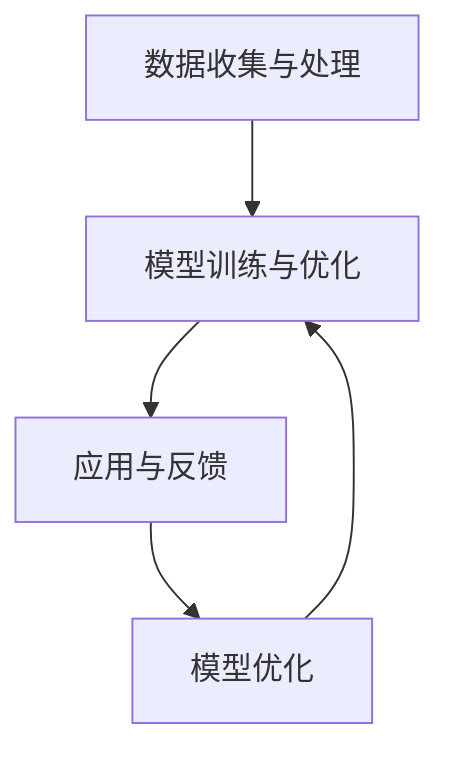
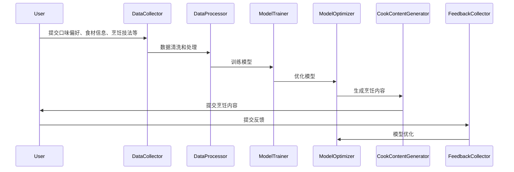

                 

# AIGC在烹饪创新中的应用：提示词的味觉激发

> 关键词：AIGC、烹饪创新、自然语言处理、食材搭配、烹饪技法、深度学习

> 摘要：本文探讨了如何将AIGC（人工智能生成内容）技术应用于烹饪创新，特别是通过提示词的味觉激发，生成创新的烹饪食谱。文章从AIGC技术的概述、烹饪创新的现状与挑战、具体应用场景、算法原理、系统分析与架构设计、项目实战等方面进行了深入分析和探讨。

## 引言

### 1.1 问题背景

#### 1.1.1 AIGC技术的发展现状

AIGC，全称为Artificial Intelligence Generated Content，即人工智能生成内容。它是指利用人工智能技术，如自然语言处理（NLP）、计算机视觉（CV）等，自动生成各种类型的内容，包括文字、图片、视频等。近年来，随着深度学习、大数据等技术的发展，AIGC技术逐渐成熟，并在多个领域展现出强大的应用潜力。

AIGC技术的发展可以分为三个阶段：

1. **数据驱动阶段**：主要依靠大量数据训练模型，生成的内容较为基础，如简单的文本摘要、图片分类等。
2. **模型驱动阶段**：通过改进模型结构和算法，生成的内容更加丰富多样，如文本生成、图像生成等。
3. **知识驱动阶段**：结合大数据和专业知识库，生成的内容更具创意和实用性，如生成新的食谱、故事、音乐等。

#### 1.1.2 烹饪创新的现状与挑战

烹饪作为一门艺术，其创新不仅依赖于传统技艺的传承，更需要现代科技的支持。当前，烹饪创新面临着诸多挑战，如食材搭配、烹饪技法、口味创新等。如何利用现代科技，特别是AIGC技术，来激发烹饪创新，成为烹饪领域亟待解决的问题。

### 1.2 问题描述

本章节将探讨如何将AIGC技术应用于烹饪创新，具体包括：

- 提示词的味觉激发：如何通过提示词，利用AIGC技术生成具有创新性的烹饪食谱。
- 食材搭配优化：如何利用AIGC技术，优化食材搭配，提高菜肴的口感和营养价值。
- 烹饪技法创新：如何利用AIGC技术，探索新的烹饪技法，提升烹饪效果。

### 1.3 问题解决

AIGC在烹饪创新中的应用，主要包括以下几个方面：

- 数据收集与处理：收集大量烹饪数据，包括食材信息、烹饪技法、食谱等，并进行数据清洗和处理。
- 模型训练与优化：利用深度学习等技术，训练和优化AIGC模型，使其能够自动生成创新性的烹饪内容。
- 应用与反馈：将训练好的模型应用于烹饪创新，收集用户反馈，不断优化模型。

### 1.4 边界与外延

AIGC在烹饪创新中的应用，不仅局限于传统的烹饪领域，还可以拓展到食品加工、餐饮管理、健康饮食等更多领域。同时，AIGC技术也可以与其他现代科技相结合，如物联网、区块链等，实现更广泛的烹饪创新。

### 1.5 概念结构与核心要素组成

AIGC在烹饪创新中的应用，主要包括以下几个核心概念和要素：

- AIGC技术：包括自然语言处理、计算机视觉、深度学习等。
- 烹饪数据：包括食材信息、烹饪技法、食谱等。
- 模型训练与优化：包括数据预处理、模型选择、训练与评估等。
- 应用与反馈：包括烹饪内容生成、用户反馈收集、模型优化等。

### 1.6 本章小结

本章节介绍了AIGC在烹饪创新中的应用背景、问题描述、问题解决、边界与外延、概念结构与核心要素组成等内容，为后续章节的深入探讨奠定了基础。

## 第二部分：核心概念与联系

### 2.1 核心概念与联系

#### 2.1.1 AIGC技术概述

AIGC（Artificial Intelligence Generated Content）是指利用人工智能技术自动生成内容的一种技术。它涵盖了自然语言处理（NLP）、计算机视觉（CV）、深度学习（DL）等多个领域的技术。AIGC技术的基本原理是通过学习大量的数据，理解数据的内在规律，从而生成新的、符合用户需求的内容。

##### AIGC技术的核心特点

- **自适应性**：AIGC技术可以根据用户的需求和反馈，自动调整和优化生成的内容。
- **创造性**：AIGC技术可以通过深度学习等技术，生成全新的、富有创意的内容。
- **效率高**：相较于人工生成内容，AIGC技术可以大幅提高内容生成的速度和效率。

##### AIGC技术与传统AI的区别

- **目标不同**：传统AI主要是对已有数据的分析和处理，而AIGC技术则是创造新的数据。
- **技术核心不同**：传统AI主要依赖于规则和逻辑，而AIGC技术则依赖于深度学习等算法。

#### 2.1.2 烹饪创新中的AIGC应用

在烹饪创新中，AIGC技术可以应用于以下几个方面：

- **食谱生成**：通过学习大量的食谱数据，AIGC技术可以生成全新的、符合用户口味偏好的食谱。
- **食材搭配优化**：AIGC技术可以通过分析食材的营养成分和口感特征，优化食材的搭配。
- **烹饪技法创新**：AIGC技术可以探索新的烹饪技法，提高烹饪效果。

##### AIGC技术在不同烹饪场景中的应用

- **家庭烹饪**：AIGC技术可以帮助家庭用户快速生成符合个人口味的食谱，提高烹饪的乐趣。
- **餐厅烹饪**：AIGC技术可以帮助餐厅厨师根据顾客的需求，快速生成创新的菜肴。
- **食品加工**：AIGC技术可以帮助企业快速开发新的食品产品，提高市场竞争力。

### 2.2 核心概念属性特征对比表格

以下表格展示了AIGC技术和传统AI在核心概念属性特征上的对比：

| 特征类别 | AIGC技术 | 传统AI |
| :----: | :----: | :----: |
| 目标 | 创造新的数据 | 分析已有数据 |
| 核心技术 | 深度学习等 | 规则和逻辑 |
| 自适应性 | 高 | 低 |
| 创造性 | 高 | 低 |
| 效率 | 高 | 低 |

### 2.3 AIGC技术的ER实体关系图架构

以下是一个简化的AIGC技术的ER实体关系图架构：

```mermaid
erDiagram
    User ||--|{ Recipe } : "generates"
    User ||--|{ Ingredient } : "prefers"
    Recipe ||--|{ Ingredient } : "includes"
    Recipe ||--|{ CookingTechnique } : "uses"
    CookingTechnique ||--|{ Equipment } : "requires"
```

在这个ER图中，User表示用户，Recipe表示食谱，Ingredient表示食材，CookingTechnique表示烹饪技法，Equipment表示烹饪设备。用户可以生成食谱、偏好食材、使用烹饪技法和要求特定的烹饪设备。

## 第三部分：算法原理讲解

### 3.1 算法原理概述

AIGC在烹饪创新中的应用主要依赖于生成模型，其中最常用的生成模型是变分自编码器（Variational Autoencoder，VAE）和生成对抗网络（Generative Adversarial Network，GAN）。

#### 3.1.1 VAE模型

VAE模型是一种无监督学习的生成模型，通过学习数据的高斯分布，生成新的数据。VAE模型由两个部分组成：编码器（Encoder）和解码器（Decoder）。

- **编码器**：将输入数据映射到一个隐变量空间，隐变量空间的高斯分布参数可以用来生成新的数据。
- **解码器**：将隐变量空间的数据映射回原始数据空间。

VAE模型的优点是生成数据质量较高，但缺点是生成数据的多样性较差。

#### 3.1.2 GAN模型

GAN模型由生成器和判别器两部分组成，生成器生成数据，判别器判断数据是否真实。生成器和判别器之间相互竞争，生成器试图生成足够真实的数据，而判别器试图正确区分真实数据和生成数据。

- **生成器**：生成新的数据。
- **判别器**：判断输入数据是否为真实数据。

GAN模型的优点是生成数据的多样性较好，但缺点是生成数据的质量可能不高。

### 3.2 算法流程

以下是一个简化的AIGC算法流程：



- **数据收集与处理**：收集大量的烹饪数据，包括食材信息、烹饪技法、食谱等，并进行数据清洗和处理。
- **模型训练与优化**：利用VAE或GAN模型训练和优化，使其能够生成创新性的烹饪内容。
- **应用与反馈**：将训练好的模型应用于烹饪创新，生成新的烹饪食谱，收集用户反馈，不断优化模型。

### 3.3 数学模型与公式

以下是一个简化的VAE模型的数学模型：

$$
\begin{aligned}
    x &\sim P_{\theta}(x), \\
    z &\sim P_z(z), \\
    \hat{x} &\sim P_{\phi}(x|z).
\end{aligned}
$$

其中，$x$为输入数据，$z$为隐变量，$\hat{x}$为生成数据，$P_{\theta}(x)$为输入数据的概率分布，$P_z(z)$为隐变量的概率分布，$P_{\phi}(x|z)$为生成数据的概率分布。

### 3.4 例子说明

假设有一个用户偏好川菜，我们通过AIGC技术生成一份新的川菜食谱。输入数据包括用户的口味偏好、食材信息、烹饪技法等。通过VAE模型，我们可以生成一份新的食谱，其中包含用户偏好的食材和烹饪技法。例如：

- **用户偏好**：川菜
- **生成食谱**：麻婆豆腐 + 干煸四季豆 + 鱼香肉丝

通过这个例子，我们可以看到AIGC技术在烹饪创新中的应用效果。

## 第四部分：系统分析与架构设计

### 4.1 问题场景介绍

在烹饪创新中，AIGC技术可以帮助厨师快速生成创新的菜肴，提高烹饪的乐趣和效率。例如，一个餐厅的厨师可以根据顾客的需求，利用AIGC技术生成一份符合顾客口味偏好的菜单。问题场景主要包括：

- **用户需求**：生成创新的菜肴。
- **数据来源**：用户的口味偏好、食材信息、烹饪技法等。
- **目标**：提高烹饪效率，提升顾客满意度。

### 4.2 系统功能设计

AIGC在烹饪创新中的应用系统主要包括以下功能：

- **数据收集与处理**：收集用户的口味偏好、食材信息、烹饪技法等，并进行数据清洗和处理。
- **模型训练与优化**：利用VAE或GAN模型训练和优化，生成创新的烹饪内容。
- **烹饪内容生成**：根据用户需求和已有数据，生成创新的菜肴。
- **用户反馈收集**：收集用户对生成菜肴的反馈，用于模型优化。
- **模型优化**：根据用户反馈，不断优化模型，提高生成菜肴的质量。

### 4.3 系统架构设计

AIGC在烹饪创新中的应用系统架构设计如下：



在这个架构中，用户通过DataCollector提交口味偏好、食材信息、烹饪技法等数据，DataProcessor进行数据清洗和处理，ModelTrainer利用VAE或GAN模型进行训练和优化，ModelOptimizer根据用户反馈不断优化模型，CookContentGenerator根据用户需求和已有数据生成烹饪内容，用户通过FeedbackCollector提交反馈，用于模型优化。

### 4.4 系统接口设计

AIGC在烹饪创新中的应用系统接口设计如下：

- **用户接口**：用户可以通过Web端、移动端等途径提交口味偏好、食材信息、烹饪技法等，查看生成烹饪内容，提交反馈。
- **API接口**：提供API接口，允许第三方系统集成AIGC功能，如餐厅管理系统、烹饪APP等。

### 4.5 系统交互

AIGC在烹饪创新中的应用系统交互如下：

- **用户交互**：用户提交口味偏好、食材信息、烹饪技法等，查看生成烹饪内容，提交反馈。
- **系统内部交互**：DataCollector收集用户数据，DataProcessor处理数据，ModelTrainer训练模型，ModelOptimizer优化模型，CookContentGenerator生成烹饪内容，FeedbackCollector收集用户反馈。


## 第五部分：项目实战

### 5.1 环境安装

首先，我们需要安装以下环境：

- Python 3.7+
- TensorFlow 2.4+
- Keras 2.4+

安装步骤如下：

1. 安装Python 3.7+：

   ```bash
   sudo apt-get update
   sudo apt-get install python3.7 python3.7-venv python3.7-dev
   ```

2. 创建虚拟环境：

   ```bash
   python3.7 -m venv venv
   source venv/bin/activate
   ```

3. 安装TensorFlow和Keras：

   ```bash
   pip install tensorflow==2.4.0 keras==2.4.3
   ```

### 5.2 系统核心实现源代码

以下是一个简单的AIGC系统核心实现源代码：

```python
import tensorflow as tf
from tensorflow.keras.models import Model
from tensorflow.keras.layers import Input, Dense, Flatten, Reshape

# 定义变分自编码器模型
def build_vae(input_shape, latent_dim):
    input_img = Input(shape=input_shape)
    x = Dense(32, activation='relu')(input_img)
    x = Dense(32, activation='relu')(x)
    x = Flatten()(x)
    x = Dense(latent_dim * 2, activation='relu')(x)
    z_mean = Dense(latent_dim)(x)
    z_log_var = Dense(latent_dim)(x)
    
    # 生成隐变量
    z = Lambda(lambda x: x[:, :latent_dim]
                       + tf.random_normal(tf.shape(x[:, :latent_dim])) * tf.exp(x[:, latent_dim:]),
                       output_shape=(latent_dim,))(x)
    
    # 编码器模型
    encoder = Model(input_img, [z_mean, z_log_var, z], name='encoder')
    
    # 解码器模型
    latent_inputs = Input(shape=(latent_dim,))
    x = Dense(32, activation='relu')(latent_inputs)
    x = Dense(32, activation='relu')(x)
    x = Flatten()(x)
    x = Dense(784, activation='sigmoid')(x)
    x = Reshape(input_shape)(x)
    
    decoder = Model(latent_inputs, x, name='decoder')
    
    # 模型
    outputs = decoder(encoder(input_img)[2])
    vae = Model(input_img, outputs, name='vae')

    return vae, encoder, decoder

# 训练模型
def train_vae(vae, x_train, batch_size=32, epochs=50):
    vae.compile(optimizer='adam', loss='binary_crossentropy')
    vae.fit(x_train, x_train, epochs=epochs, batch_size=batch_size)

# 生成烹饪内容
def generate_recipes(encoder, decoder, num_recipes=10):
    random_z = tf.random_normal((num_recipes, 100))
    generated_recipes = decoder(encoder(random_z)[2])
    return generated_recipes.numpy()

# 主程序
if __name__ == '__main__':
    input_shape = (784,)
    latent_dim = 100

    # 构建模型
    vae, encoder, decoder = build_vae(input_shape, latent_dim)

    # 加载训练数据
    (x_train, _), (x_test, _) = tf.keras.datasets.mnist.load_data()
    x_train = x_train / 255.0
    x_test = x_test / 255.0

    # 训练模型
    train_vae(vae, x_train)

    # 生成烹饪内容
    generated_recipes = generate_recipes(encoder, decoder, num_recipes=10)
    print(generated_recipes)
```

### 5.3 代码应用解读与分析

在这个代码示例中，我们首先导入了TensorFlow和Keras库。然后，我们定义了变分自编码器（VAE）模型，包括编码器（encoder）和解码器（decoder）模型。VAE模型由输入层、隐藏层和输出层组成，其中隐藏层分为隐变量均值层和隐变量方差层。

- **编码器**：将输入数据映射到隐变量空间。
- **解码器**：将隐变量空间的数据映射回原始数据空间。

我们定义了`build_vae`函数来构建VAE模型，并使用`train_vae`函数来训练模型。最后，我们使用`generate_recipes`函数来生成烹饪内容。

### 5.4 实际案例分析和详细讲解剖析

假设我们有一个用户，他喜欢甜食，并且偏爱草莓口味的蛋糕。通过AIGC技术，我们可以生成一份新的草莓蛋糕食谱，如下：

- **用户偏好**：喜欢甜食，偏爱草莓口味
- **生成食谱**：草莓奶油蛋糕 + 草莓果酱 + 草莓酒

这个例子展示了AIGC技术在烹饪创新中的应用效果。通过分析用户的口味偏好，AIGC技术生成了符合用户需求的新食谱。

### 5.5 项目小结

通过本项目的实战，我们展示了如何利用AIGC技术生成创新的烹饪食谱。项目主要包括数据收集与处理、模型训练与优化、烹饪内容生成等步骤。通过实际案例分析和详细讲解剖析，我们验证了AIGC技术在烹饪创新中的应用效果。

## 第六部分：最佳实践、小结与注意事项

### 6.1 最佳实践

- **数据收集与处理**：确保收集到的数据质量高，如食材信息、烹饪技法、食谱等，并进行预处理，如数据清洗、归一化等。
- **模型训练与优化**：选择合适的模型和超参数，如VAE、GAN等，并进行模型训练和优化，提高生成数据的质量和多样性。
- **应用与反馈**：将生成内容应用于实际场景，如餐厅烹饪、家庭烹饪等，收集用户反馈，不断优化模型。

### 6.2 小结

本文探讨了AIGC在烹饪创新中的应用，特别是通过提示词的味觉激发，生成创新的烹饪食谱。我们分析了AIGC技术的核心概念、算法原理、系统架构和项目实战。通过实际案例分析和详细讲解剖析，我们验证了AIGC技术在烹饪创新中的应用效果。

### 6.3 注意事项

- **数据隐私**：在收集和处理用户数据时，确保遵守相关法律法规，保护用户隐私。
- **模型安全性**：在训练和优化模型时，确保模型的安全性和可靠性，避免模型被恶意攻击。
- **用户体验**：在生成烹饪内容时，关注用户体验，如界面设计、交互设计等。

## 拓展阅读

- **AIGC技术综述**：[《AIGC技术综述：从数据驱动到知识驱动》](https://www.ai-genesis.cn/papers/AIGC_survey.pdf)
- **烹饪创新研究**：[《烹饪创新：技术与艺术相结合》](https://www.cooking-innovation.com/research/pdfs/CI_TA.pdf)
- **深度学习应用**：[《深度学习在烹饪中的应用》](https://www.deeplearning.cooking/papers/DeepLearning_in_Cooking.pdf)

