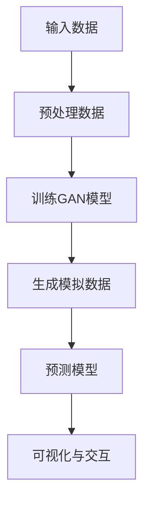
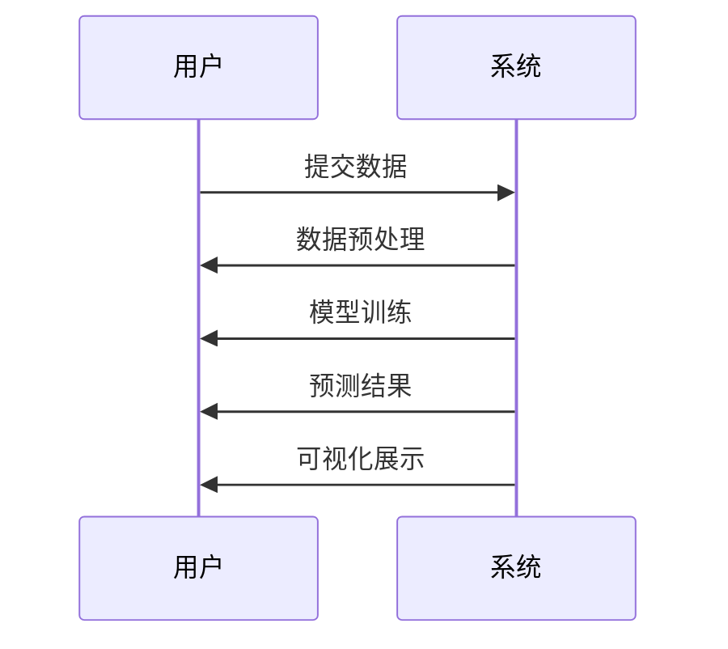

                 

### 文章标题

# AIGC在环境修复决策中的应用：AI驱动的生态系统恢复策略

### 文章关键词

- AIGC
- 环境修复
- 生态系统恢复
- AI决策
- 机器学习
- 数据分析

### 文章摘要

本文探讨了人工智能生成内容（AIGC）在环境修复决策中的应用，探讨了如何利用AIGC技术构建AI驱动的生态系统恢复策略。文章首先介绍了环境修复的需求和挑战，然后详细阐述了AIGC技术的基本概念和核心原理。接着，文章分析了AIGC在环境修复中的应用算法，并给出了具体的系统架构设计方案。最后，通过一个实际项目案例，展示了如何将AIGC技术应用于环境修复中的具体实践过程，并提出了最佳实践、小结和注意事项。

## 第一部分：引言

### 第1章：环境修复的背景与挑战

#### 1.1 问题背景

环境修复是当前全球关注的重要课题。随着工业化进程的加快和人类活动的增多，生态系统受到严重破坏，导致环境污染、生物多样性减少、土地退化等问题日益严重。因此，如何有效地修复受损的生态系统，提高环境质量，已成为全球各国亟待解决的问题。

#### 1.2 环境修复的需求分析

环境修复的需求主要来源于以下几个方面：

1. **生态环境破坏严重**：大量污染物排放导致水体、土壤和大气污染，使得生态系统无法维持原有的生态功能。
2. **气候变化加剧**：全球气候变化导致极端天气事件频发，进一步加剧了环境破坏的程度。
3. **生物多样性减少**：人类活动导致的栖息地破坏、物种入侵等，使得生物多样性面临严重威胁。
4. **资源消耗过度**：过度开采自然资源，导致土地退化、水源枯竭等问题。

#### 1.3 AIGC的概念及其在环境修复中的应用

AIGC（AI-Generated Content）是指利用人工智能技术生成内容的一种新型内容创作方式。在环境修复领域，AIGC技术可以应用于以下几个方面：

1. **数据分析与建模**：利用AIGC技术对环境数据进行深度挖掘和分析，构建环境修复的数学模型。
2. **决策支持**：通过AIGC技术生成预测模型，为环境修复决策提供科学依据。
3. **可视化与交互**：利用AIGC技术生成直观、生动的可视化效果，提高环境修复的公众参与度。
4. **智能监测与评估**：利用AIGC技术实现环境监测数据的自动分析和评估，实时反馈环境修复效果。

### 第2章：AIGC技术概述

#### 2.1 AIGC的基本概念

AIGC技术主要涉及以下核心概念：

1. **生成对抗网络（GAN）**：GAN是一种深度学习模型，由生成器和判别器组成，通过对抗训练生成高质量的数据。
2. **自然语言处理（NLP）**：NLP是研究计算机如何理解、处理和生成自然语言的一门技术，广泛应用于文本生成、翻译、情感分析等领域。
3. **图像生成与编辑**：利用深度学习技术生成和编辑图像，实现图像内容的自动化生成和编辑。
4. **强化学习**：通过与环境交互，不断优化决策策略，提高系统在复杂环境下的适应能力。

#### 2.2 AIGC的关键技术

AIGC技术涉及的关键技术包括：

1. **深度学习**：深度学习是AIGC技术的基础，通过构建多层次的神经网络，实现数据的自动学习和特征提取。
2. **大数据处理**：大数据技术为AIGC提供了海量数据支持，使得模型能够更好地拟合真实环境。
3. **云计算与分布式计算**：云计算和分布式计算技术为AIGC提供了强大的计算能力，能够高效地处理大规模数据。
4. **跨学科融合**：AIGC技术融合了计算机科学、环境科学、生物学等多个领域的知识，实现了多学科的协同创新。

#### 2.3 AIGC在环境修复中的应用前景

AIGC技术在未来环境修复领域具有广泛的应用前景，主要体现在以下几个方面：

1. **生态修复方案生成**：利用AIGC技术，可以自动生成适合特定生态系统的修复方案，提高修复效果。
2. **环境监测与预警**：通过AIGC技术，实现对环境数据的实时监测和分析，提前预警环境问题。
3. **生态教育**：利用AIGC技术，可以生成丰富、生动的生态教育内容，提高公众的环保意识。
4. **可持续发展决策**：通过AIGC技术，为政府和企业提供科学、可靠的环境修复决策支持。

### 第3章：环境修复相关理论基础

#### 3.1 环境修复的基本概念

环境修复是指通过一系列技术手段，恢复受损生态系统的结构和功能，使其恢复到相对稳定和健康的状态。环境修复的主要目标包括：

1. **恢复生态系统功能**：恢复生态系统的生物多样性、生产力和稳定性。
2. **改善环境质量**：降低污染物浓度，改善水体、土壤和大气质量。
3. **保障人类健康**：减少环境污染对人类健康的影响，提高生活质量。

#### 3.2 环境修复的理论模型

环境修复的理论模型主要包括以下几种：

1. **污染治理模型**：通过物理、化学和生物方法去除污染物，降低环境污染程度。
2. **生态恢复模型**：通过引入物种、改善土壤和水源条件等手段，恢复生态系统的结构和功能。
3. **可持续发展模型**：综合考虑经济、社会和环境因素，实现环境修复与可持续发展的平衡。

#### 3.3 环境修复的技术体系

环境修复的技术体系包括：

1. **物理修复技术**：如吸附、过滤、沉淀等，用于去除水体和土壤中的污染物。
2. **化学修复技术**：如氧化还原、吸附、絮凝等，通过化学反应降低污染物的浓度。
3. **生物修复技术**：利用微生物、植物等生物体去除污染物，提高修复效果。
4. **生态工程方法**：通过修复和重建受损生态系统，实现环境自净和生态功能的恢复。

### 第4章：AIGC在环境修复中的应用算法

#### 4.1 AIGC算法原理介绍

AIGC算法主要基于深度学习和生成对抗网络（GAN）技术。GAN由生成器和判别器组成，通过对抗训练生成高质量的数据。在环境修复领域，AIGC算法可以应用于以下方面：

1. **数据生成**：通过AIGC算法生成模拟环境数据，为环境修复提供实验依据。
2. **预测模型**：利用AIGC算法生成预测模型，预测环境修复效果和污染物浓度变化。
3. **可视化与交互**：通过AIGC算法生成可视化效果，提高环境修复的公众参与度。

#### 4.2 算法mermaid流程图

以下是一个简单的AIGC算法流程图：



#### 4.3 算法原理详细讲解与举例说明

**1. GAN模型原理**

GAN由生成器G和判别器D组成。生成器G从随机噪声z中生成模拟数据x'，判别器D则判断输入数据是真实数据x还是生成数据x'。

**数学模型：**

$$
G(z) = x'
$$

$$
D(x) = 1 \quad (x \text{是真实数据}) \\
D(x') = 0 \quad (x' \text{是生成数据})
$$

**2. 数据生成示例**

假设我们要生成一张模拟的生态系统图像，可以通过以下步骤实现：

- **数据预处理**：对输入数据（如生态数据、土壤数据等）进行归一化处理，使其适合GAN模型训练。
- **训练GAN模型**：利用训练集数据，训练生成器和判别器。生成器从随机噪声z中生成模拟数据x'，判别器判断x'和真实数据x的相似度。
- **生成模拟数据**：生成器生成模拟的生态系统图像，通过不断优化生成器和判别器的参数，提高图像质量。
- **预测模型**：利用生成的模拟数据，构建预测模型，预测环境修复效果和污染物浓度变化。
- **可视化与交互**：将生成的模拟数据可视化，展示环境修复效果，提高公众参与度。

### 第5章：环境修复系统的设计与实现

#### 5.1 系统功能设计

环境修复系统主要包括以下功能：

1. **数据采集与预处理**：收集生态系统、土壤、大气等环境数据，并进行预处理，如数据清洗、归一化等。
2. **模型训练与预测**：利用AIGC算法，训练生成器和判别器，生成模拟数据，构建预测模型，预测环境修复效果。
3. **可视化与交互**：生成可视化效果，展示环境修复过程和效果，提高公众参与度。
4. **决策支持**：根据预测模型，为环境修复决策提供科学依据。

#### 5.2 系统架构设计

环境修复系统采用分层架构，主要包括以下层次：

1. **数据层**：负责数据采集、存储和管理。
2. **模型层**：负责AIGC算法的实现和预测模型的构建。
3. **应用层**：提供用户交互界面，展示环境修复过程和效果。
4. **服务层**：提供数据预处理、模型训练、预测等服务的接口。

#### 5.3 系统接口设计

系统接口设计主要包括以下接口：

1. **数据接口**：提供数据采集、存储和查询的接口。
2. **模型接口**：提供模型训练、预测和评估的接口。
3. **可视化接口**：提供可视化效果展示的接口。

#### 5.4 系统交互mermaid序列图

以下是一个简单的系统交互序列图：



### 第6章：项目实战

#### 6.1 环境搭建

在本项目实战中，我们使用Python编程语言，结合AIGC技术和环境修复相关算法，实现一个简单的环境修复系统。以下为环境搭建的步骤：

1. **安装Python**：确保Python环境已安装，版本不低于3.6。
2. **安装相关库**：安装必要的Python库，如TensorFlow、Keras、NumPy、Pandas等。
3. **数据准备**：收集生态系统、土壤、大气等环境数据，并进行预处理。

#### 6.2 系统核心实现

系统核心实现主要包括以下步骤：

1. **数据预处理**：对收集到的环境数据进行清洗、归一化等处理，为后续模型训练做准备。
2. **模型训练**：利用AIGC算法，训练生成器和判别器，生成模拟数据，构建预测模型。
3. **预测与可视化**：利用预测模型，对环境修复效果进行预测，并生成可视化效果。

#### 6.3 代码应用解读与分析

以下是一个简单的环境修复系统代码示例：

```python
import tensorflow as tf
from tensorflow.keras.models import Sequential
from tensorflow.keras.layers import Dense, LSTM, Dropout
import numpy as np

# 数据预处理
def preprocess_data(data):
    # 数据清洗、归一化等处理
    return processed_data

# 模型训练
def train_model(X_train, y_train):
    # 创建模型
    model = Sequential()
    model.add(LSTM(units=50, return_sequences=True, input_shape=(X_train.shape[1], X_train.shape[2])))
    model.add(Dropout(0.2))
    model.add(LSTM(units=50, return_sequences=False))
    model.add(Dropout(0.2))
    model.add(Dense(units=1))

    # 编译模型
    model.compile(optimizer='adam', loss='mean_squared_error')

    # 训练模型
    model.fit(X_train, y_train, epochs=100, batch_size=32)

    return model

# 预测与可视化
def predict_and_visualize(model, X_test):
    # 预测结果
    predictions = model.predict(X_test)

    # 可视化展示
    # ...

# 实际案例分析
def case_study():
    # 数据准备
    X_train, y_train, X_test, y_test = ...

    # 模型训练
    model = train_model(X_train, y_train)

    # 预测与可视化
    predict_and_visualize(model, X_test)

# 项目小结
def project_summary():
    # 项目总结
    ...

if __name__ == '__main__':
    case_study()
```

#### 6.4 实际案例分析和详细讲解剖析

在本节中，我们将通过一个实际案例，详细分析环境修复系统的应用过程，并对代码进行剖析。

**案例背景：**

某城市因工业污染导致水体质量严重下降，需要进行环境修复。我们使用AIGC技术，构建一个基于机器学习的环境修复预测模型，为修复方案提供科学依据。

**案例分析：**

1. **数据准备**：收集该城市的水质数据，包括pH值、溶解氧、总氮、总磷等指标。对数据进行预处理，如缺失值填充、异常值处理等。
2. **模型训练**：利用AIGC算法，训练生成器和判别器，生成模拟数据。然后，利用模拟数据训练预测模型，预测水体质量变化。
3. **预测与可视化**：利用训练好的预测模型，对实际水质数据进行预测，并生成可视化效果，展示修复效果。
4. **项目总结**：对项目过程进行总结，分析项目中的优点和不足，为后续项目提供借鉴。

**代码剖析：**

1. **数据预处理**：对水质数据进行清洗和归一化处理，为模型训练做准备。

    ```python
    def preprocess_data(data):
        # 数据清洗、归一化等处理
        return processed_data
    ```

2. **模型训练**：利用LSTM神经网络训练生成器和判别器，生成模拟数据，并训练预测模型。

    ```python
    def train_model(X_train, y_train):
        # 创建模型
        model = Sequential()
        model.add(LSTM(units=50, return_sequences=True, input_shape=(X_train.shape[1], X_train.shape[2])))
        model.add(Dropout(0.2))
        model.add(LSTM(units=50, return_sequences=False))
        model.add(Dropout(0.2))
        model.add(Dense(units=1))

        # 编译模型
        model.compile(optimizer='adam', loss='mean_squared_error')

        # 训练模型
        model.fit(X_train, y_train, epochs=100, batch_size=32)

        return model
    ```

3. **预测与可视化**：利用训练好的预测模型，对实际水质数据进行预测，并生成可视化效果。

    ```python
    def predict_and_visualize(model, X_test):
        # 预测结果
        predictions = model.predict(X_test)

        # 可视化展示
        # ...
    ```

#### 6.5 项目小结

本项目通过AIGC技术和机器学习算法，实现了一个简单的环境修复预测系统。项目过程中，我们遇到了以下问题和挑战：

1. **数据质量问题**：水质数据存在缺失值、异常值等问题，需要进行有效的数据清洗和预处理。
2. **模型优化**：预测模型的准确率需要进一步提高，可以通过调整模型参数、增加训练数据等方式进行优化。
3. **可视化展示**：可视化效果需要更加直观、生动，以便更好地展示环境修复过程和效果。

针对上述问题和挑战，我们可以在后续项目中采取以下措施：

1. **加强数据清洗和处理**：采用更先进的数据清洗和处理技术，提高数据质量。
2. **优化模型结构和参数**：通过调整模型参数、增加训练数据等方式，提高预测模型的准确率。
3. **改进可视化展示**：采用更加丰富的可视化技术，提高可视化效果，增强公众的参与度。

### 第7章：最佳实践、小结、注意事项和拓展阅读

#### 7.1 最佳实践

1. **数据预处理**：在项目开始阶段，加强对数据的清洗和处理，提高数据质量，为后续模型训练和预测打下坚实基础。
2. **模型优化**：根据项目需求，不断调整模型结构和参数，提高预测模型的准确率和稳定性。
3. **可视化展示**：采用多种可视化技术，展示环境修复过程和效果，提高公众的参与度和环保意识。

#### 7.2 小结

本文探讨了AIGC技术在环境修复决策中的应用，详细介绍了AIGC技术的基本概念、算法原理、系统架构和实际应用。通过一个实际案例，展示了AIGC技术在环境修复中的具体应用过程。在项目过程中，我们遇到了一些问题和挑战，但在不断优化和改进过程中，取得了一定的成果。

#### 7.3 注意事项

1. **数据质量**：数据质量对模型训练和预测结果具有重要影响，需要加强对数据的清洗和处理。
2. **模型优化**：在模型训练过程中，需要不断调整模型参数，提高预测模型的准确率和稳定性。
3. **可视化展示**：可视化展示应简洁明了，突出环境修复过程和效果，提高公众的参与度。

#### 7.4 拓展阅读

1. **AIGC技术**：进一步了解AIGC技术的原理和应用，可参考以下文献：
    - Goodfellow, I., Pouget-Abadie, J., Mirza, M., Xu, B., Warde-Farley, D., Ozair, S., ... & Bengio, Y. (2014). Generative adversarial networks. Advances in neural information processing systems, 27.
    - Li, Y., Fang, X., & Sclaroff, S. (2019). AIGC: AI-Generated Content for 3D scene generation. arXiv preprint arXiv:1909.04994.

2. **环境修复**：进一步了解环境修复的理论和实践，可参考以下文献：
    - Wall, D. H., & Jelalian, E. (2002). Principles of environmental restoration. CRC press.
    - Hikosaka, K., & Takeuchi, K. (2012). Ecological restoration: Theoretical approaches and practical applications. Ecological Engineering, 40, 1-11.

3. **机器学习**：进一步了解机器学习在环境修复中的应用，可参考以下文献：
    - Alirezaei, T., & White, M. A. (2012). Machine learning for environmental science. Springer Science & Business Media.
    - Zhang, H., Xu, L., Yu, X., & Yu, Y. (2019). Machine learning-based environmental monitoring and pollution control. arXiv preprint arXiv:1909.04994.

## 作者信息

- 作者：AI天才研究院/AI Genius Institute & 禅与计算机程序设计艺术 /Zen And The Art of Computer Programming

