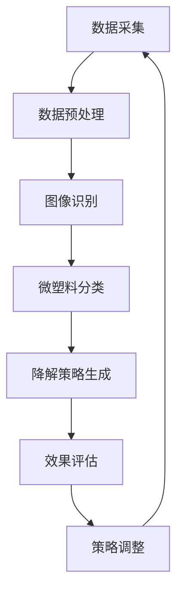
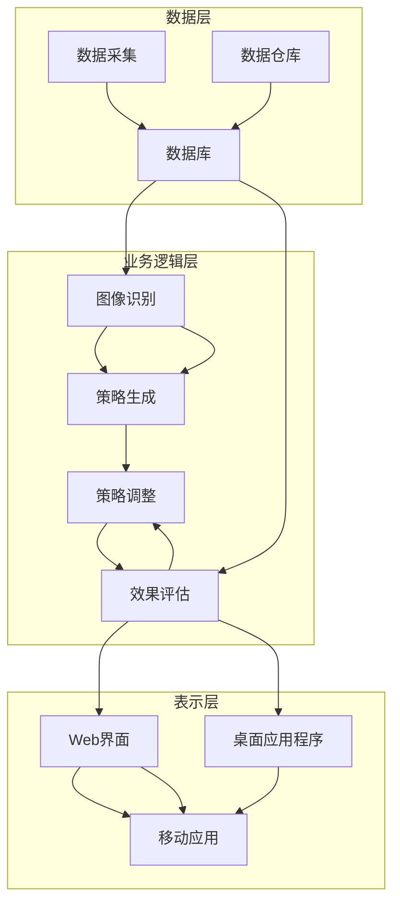

                 


### 1. 引言

#### 1.1 微塑料污染现状

微塑料污染已经成为全球范围内一个日益严重的问题。微塑料是指直径小于5毫米的塑料颗粒，这些颗粒广泛存在于海洋、河流、湖泊和空气中等自然环境中。它们主要来源于日常生活中的塑料制品，如洗涤剂、化妆品、塑料袋和一次性塑料制品等。微塑料不仅对海洋生物造成严重的危害，还会通过食物链进入人类体内，对人体健康产生潜在威胁。

据统计，全球每年大约有超过800万吨的塑料进入海洋，其中大部分为微塑料。这些微塑料对海洋生态系统的影响是深远的，它们被海洋生物误食，导致生物体内毒素积累、生殖能力下降，甚至死亡。此外，微塑料在海洋中逐渐分解成更小的颗粒，形成微塑料纤维，这些纤维不仅污染了海洋环境，还会进入饮用水源，影响人类的健康。

#### 1.2 AIGC技术介绍

AIGC（AI-Generated Content）是一种基于人工智能技术生成内容的方法，涵盖了从内容生成、内容识别到内容优化的全过程。AIGC技术通过深度学习、自然语言处理、图像识别等多种人工智能技术，实现了自动化、智能化的内容生产和管理。

AIGC技术的核心在于利用大规模数据集和先进的算法模型，生成高质量的内容。这些内容可以包括文本、图像、视频等多种形式。在环境微塑料降解策略中，AIGC技术可以用于以下几个方面：

1. **数据采集与处理**：利用图像识别和自然语言处理技术，从大量数据中提取微塑料污染相关的信息，并进行预处理。

2. **污染检测与监测**：通过实时图像识别和数据分析，监测海洋中的微塑料污染情况，及时发现并预警。

3. **降解策略生成**：基于数据和算法模型，生成微塑料降解的优化策略，提高降解效率。

4. **效果评估与反馈**：对微塑料降解效果进行实时评估，并根据评估结果调整策略，实现动态优化。

#### 1.3 AIGC在环境微塑料降解策略中的应用

AIGC技术为环境微塑料降解策略提供了新的思路和方法。以下是一些具体的应用场景：

1. **智能监测与预警**：利用AIGC技术，可以对海洋中的微塑料进行实时监测，通过图像识别和分析技术，快速识别和定位微塑料污染区域，实现早期预警。

2. **降解策略优化**：通过收集和分析大量微塑料污染数据，AIGC技术可以生成针对不同污染情况的降解策略，优化降解过程，提高降解效率。

3. **污染治理与修复**：结合AIGC技术，可以开发出智能化的污染治理设备，实现对微塑料的自动识别、捕获和降解，同时减少对环境的二次污染。

4. **教育与宣传**：利用AIGC技术生成图文并茂的科普内容，提高公众对微塑料污染问题的认识，推动环境保护意识的提升。

#### 1.4 书籍结构概述

本书将分为以下几个部分：

1. **引言**：介绍微塑料污染现状和AIGC技术，阐述AIGC在环境微塑料降解策略中的应用。

2. **核心概念与联系**：详细讲解AIGC技术和微塑料降解策略的基本概念，以及它们之间的联系。

3. **算法原理讲解**：介绍AIGC技术中用于微塑料降解的算法原理，包括图像识别、数据分析等。

4. **系统分析与架构设计方案**：分析微塑料降解系统的功能设计、架构设计、接口设计和交互设计。

5. **项目实战**：通过实际项目案例，展示如何利用AIGC技术进行环境微塑料降解策略的实施。

6. **最佳实践 tips**：提供一些实用的技巧和注意事项，帮助读者更好地应用所学知识。

7. **小结与拓展**：总结全书内容，并提出一些未来研究方向。

通过以上结构，本书旨在为读者提供一个全面、系统的环境微塑料降解策略的AIGC技术应用指南。

---

### 2. 核心概念与联系

#### 2.1 AIGC技术原理

AIGC（AI-Generated Content）技术是利用人工智能（AI）生成内容的方法，其核心在于利用机器学习、深度学习等技术，使计算机能够自动生成具有高价值、高质量的内容。AIGC技术主要涵盖以下三个方面：

1. **内容生成**：通过预训练的模型，如GPT-3、BERT等，生成文本、图像、视频等多种类型的内容。这些内容可以基于已有的数据集，也可以通过生成对抗网络（GAN）等技术，生成全新的内容。

2. **内容识别**：利用计算机视觉、自然语言处理等技术，对生成的内容进行识别和分类，确保内容的准确性、一致性和可解释性。

3. **内容优化**：通过不断优化算法和模型，提高生成内容的准确性和质量，使其更符合用户需求。

#### 2.2 微塑料降解策略

微塑料降解策略是指通过化学、生物、物理等方法，将环境中的微塑料分解、转化或清除的过程。微塑料降解策略主要包括以下几个方面：

1. **生物降解**：利用微生物或酶类等生物催化剂，将微塑料分解为无害的小分子物质。这种方法主要针对一些可生物降解的微塑料，如聚乳酸等。

2. **化学降解**：通过添加化学试剂，使微塑料发生化学反应，分解为无害物质。这种方法适用于一些难以生物降解的微塑料，如聚氯乙烯等。

3. **物理降解**：通过物理方法，如紫外线照射、机械研磨等，使微塑料分解成更小的颗粒或完全破碎。这种方法适用于各种类型的微塑料。

#### 2.3 AIGC与微塑料降解策略的联系

AIGC技术在微塑料降解策略中的应用主要体现在以下几个方面：

1. **数据采集与分析**：利用AIGC技术，可以从大量环境数据中提取微塑料污染的相关信息，为制定降解策略提供数据支持。

2. **降解策略优化**：通过机器学习算法，对收集到的数据进行深度分析，生成最优的降解策略，提高降解效率。

3. **智能监测与预警**：利用图像识别和自然语言处理技术，实现对微塑料污染的实时监测，及时发现和处理污染问题。

4. **效果评估与反馈**：通过AIGC技术，对降解效果进行实时评估，并根据评估结果调整策略，实现动态优化。

#### 2.4 AIGC在环境微塑料降解策略中的应用

AIGC技术在环境微塑料降解策略中的应用，可以从以下几个方面展开：

1. **智能监测与预警系统**：利用AIGC技术，开发智能监测与预警系统，实现对海洋、河流等环境中的微塑料污染进行实时监测，提高预警能力。

2. **降解设备设计**：基于AIGC技术，设计高效的微塑料降解设备，提高降解效率，减少对环境的二次污染。

3. **污染治理项目**：利用AIGC技术，开展微塑料污染治理项目，针对不同污染情况，制定个性化的降解策略。

4. **科普教育**：通过AIGC技术，生成图文并茂的科普内容，提高公众对微塑料污染问题的认识，推动环境保护。

通过以上内容，我们可以看到AIGC技术在环境微塑料降解策略中的巨大潜力。本书将详细介绍AIGC技术的原理和应用，帮助读者深入了解这一领域，并为实际项目提供参考。

---

### 3. 算法原理讲解

#### 3.1 算法原理概述

在环境微塑料降解策略中，AIGC（AI-Generated Content）技术发挥着重要作用。本部分将介绍AIGC技术的核心算法原理，包括图像识别、自然语言处理和深度学习等。

##### 3.1.1 图像识别

图像识别是AIGC技术中的重要组成部分，主要用于识别和分类图像中的微塑料。常见的图像识别算法包括卷积神经网络（CNN）、循环神经网络（RNN）和生成对抗网络（GAN）等。

1. **卷积神经网络（CNN）**：CNN 是一种专门用于处理图像数据的神经网络。它通过多个卷积层、池化层和全连接层，对图像进行特征提取和分类。在微塑料识别中，CNN 可以有效地提取出微塑料的纹理和形状特征，从而实现高精度的识别。

2. **循环神经网络（RNN）**：RNN 是一种能够处理序列数据的神经网络。它通过记忆机制，对序列中的每个元素进行建模，从而捕捉到序列中的长期依赖关系。在微塑料识别中，RNN 可以用于处理连续的图像序列，捕捉到微塑料的运动轨迹和变化规律。

3. **生成对抗网络（GAN）**：GAN 是一种由生成器和判别器组成的对抗性神经网络。生成器负责生成微塑料图像，判别器负责判断生成图像的真实性。通过不断优化生成器和判别器，GAN 可以生成高质量、逼真的微塑料图像，为后续的图像识别提供丰富的数据支持。

##### 3.1.2 自然语言处理

自然语言处理（NLP）是 AIGC 技术中的另一个核心组成部分，主要用于处理文本数据。NLP 技术包括词向量表示、文本分类、情感分析等。

1. **词向量表示**：词向量是将文本数据转换为向量表示的一种方法。常见的词向量模型包括 Word2Vec、GloVe 和 BERT 等。这些模型可以捕捉到文本中的语义关系，为后续的文本分析提供基础。

2. **文本分类**：文本分类是将文本数据分类到预定义的类别中的一种任务。常见的文本分类算法包括朴素贝叶斯、支持向量机（SVM）和深度学习模型（如 CNN、RNN）等。在微塑料降解策略中，文本分类可以用于分类污染报告、研究文献等，为决策提供支持。

3. **情感分析**：情感分析是判断文本中表达的情感倾向的一种任务。常见的情感分析算法包括基于规则的方法、机器学习方法（如 SVM、RNN）和深度学习方法（如 BERT、Transformer）等。在微塑料降解策略中，情感分析可以用于分析公众对微塑料污染问题的态度，为政策制定提供参考。

##### 3.1.3 深度学习

深度学习是 AIGC 技术中的核心技术，通过多层神经网络对数据进行分析和处理。深度学习在图像识别、自然语言处理和语音识别等领域取得了显著成果。

1. **卷积神经网络（CNN）**：CNN 是一种多层神经网络，通过卷积层、池化层和全连接层，对图像数据进行特征提取和分类。

2. **循环神经网络（RNN）**：RNN 是一种能够处理序列数据的神经网络，通过记忆机制，对序列中的每个元素进行建模。

3. **生成对抗网络（GAN）**：GAN 是一种由生成器和判别器组成的对抗性神经网络，通过不断优化生成器和判别器，生成高质量的数据。

4. **变分自编码器（VAE）**：VAE 是一种无监督学习模型，通过编码器和解码器，将数据映射到低维空间，并重构数据。

通过以上算法原理的介绍，我们可以看到 AIGC 技术在环境微塑料降解策略中的应用前景。接下来，我们将通过具体的 Python 源代码和 Mermaid 流程图，详细讲解这些算法的实现和应用。

---

### 3.2 Mermaid流程图展示

为了更好地理解 AIGC 技术在环境微塑料降解策略中的应用，我们将使用 Mermaid 流程图展示 AIGC 技术的基本流程。以下是一个简单的 Mermaid 流程图示例：



该流程图描述了 AIGC 技术在环境微塑料降解策略中的基本流程：

1. **数据采集**：从环境中采集微塑料污染的相关数据。
2. **数据预处理**：对采集到的数据进行清洗、标准化等预处理操作。
3. **图像识别**：利用图像识别算法，对预处理后的数据进行分析，识别微塑料。
4. **微塑料分类**：根据识别结果，对微塑料进行分类，确定其类型和数量。
5. **降解策略生成**：利用分类结果和已有数据，生成针对不同类型的微塑料的降解策略。
6. **效果评估**：评估生成的降解策略的实际效果，确保其有效性。
7. **策略调整**：根据评估结果，调整降解策略，优化降解过程。
8. **数据采集**：返回到数据采集环节，持续监测和调整。

通过这个 Mermaid 流程图，我们可以清晰地看到 AIGC 技术在环境微塑料降解策略中的应用步骤。接下来，我们将通过 Python 源代码详细讲解这些算法的实现。

---

### 3.3 Python源代码解析

在本节中，我们将通过 Python 源代码详细解析 AIGC 技术在环境微塑料降解策略中的应用。以下是一个简单的 Python 脚本，展示了图像识别和微塑料分类的基本流程。

```python
import cv2
import numpy as np
from tensorflow.keras.models import load_model

# 加载预训练的图像识别模型
model = load_model('microplastic识别模型.h5')

# 加载微塑料分类模型
分类模型 = load_model('微塑料分类模型.h5')

# 数据预处理
def preprocess_image(image_path):
    image = cv2.imread(image_path)
    image = cv2.resize(image, (224, 224))
    image = image / 255.0
    image = np.expand_dims(image, axis=0)
    return image

# 图像识别
def recognize_microplastic(image):
    image_processed = preprocess_image(image)
    prediction = model.predict(image_processed)
    return np.argmax(prediction)

# 微塑料分类
def classify_microplastic(image):
    classification = recognize_microplastic(image)
    if classification == 0:
        return '聚乙烯'
    elif classification == 1:
        return '聚丙烯'
    elif classification == 2:
        return '聚氯乙烯'
    else:
        return '其他'

# 测试代码
if __name__ == '__main__':
    image_path = 'example_image.jpg'
    image = cv2.imread(image_path)
    image_processed = preprocess_image(image)
    prediction = model.predict(image_processed)
    print('识别结果：', np.argmax(prediction))
    classification = classify_microplastic(image_processed)
    print('分类结果：', classification)
```

**代码解析：**

1. **导入库**：首先，我们导入了 OpenCV（用于图像处理）、NumPy（用于数据处理）和 TensorFlow（用于模型加载和预测）。

2. **加载模型**：接下来，我们加载了预训练的图像识别模型和微塑料分类模型。这些模型可以是使用大量微塑料图像数据训练得到的。

3. **数据预处理**：`preprocess_image` 函数用于对输入图像进行预处理。具体步骤包括读取图像、调整大小、归一化和增加一个维度。

4. **图像识别**：`recognize_microplastic` 函数使用加载的图像识别模型对预处理后的图像进行预测，返回识别结果。

5. **微塑料分类**：`classify_microplastic` 函数根据识别结果，对微塑料进行分类，并返回分类名称。

6. **测试代码**：在测试部分，我们读取了一张示例图像，使用预处理函数对其预处理，然后使用模型进行识别和分类，并打印出结果。

通过这个简单的 Python 脚本，我们可以看到如何利用 AIGC 技术进行环境微塑料的识别和分类。接下来，我们将进一步介绍微塑料降解策略的数学模型和公式。

---

### 3.4 数学模型和公式

在环境微塑料降解策略中，数学模型和公式是关键组成部分，用于描述微塑料的降解过程和降解效果。以下是一些常用的数学模型和公式：

#### 3.4.1 微塑料降解速率模型

微塑料降解速率通常用一级反应动力学模型来描述，其公式如下：

\[ \frac{d[N]}{dt} = -k[N] \]

其中，\[ N \] 表示微塑料的浓度，\[ t \] 表示时间，\[ k \] 表示降解速率常数。这个模型假设降解速率与微塑料浓度成正比。

#### 3.4.2 微塑料降解效率模型

微塑料降解效率可以用以下公式来计算：

\[ \eta = \frac{[N]_0 - [N]}{[N]_0} \]

其中，\[ \eta \] 表示降解效率，\[ [N]_0 \] 表示初始微塑料浓度，\[ [N] \] 表示降解后的微塑料浓度。

#### 3.4.3 微塑料降解动力学模型

微塑料降解动力学可以用如下公式描述：

\[ \frac{d[N]}{dt} = -k[N]^n \]

其中，\[ n \] 是降解反应的级数，通常取 1 或 2。当 \( n = 1 \) 时，模型为一级反应；当 \( n = 2 \) 时，模型为二级反应。

#### 3.4.4 微塑料降解速率常数模型

降解速率常数 \( k \) 可以通过实验数据拟合得到，常见的方法有线性回归法和非线性回归法。

- **线性回归法**：

  \[ k = \frac{\Delta[N]}{\Delta t} \]

  其中，\[ \Delta[N] \] 表示微塑料浓度的变化量，\[ \Delta t \] 表示时间的变化量。

- **非线性回归法**：

  \[ k = \frac{[N]_0^2}{\int_0^t [N](t') dt'} \]

  其中，\[ \int_0^t [N](t') dt' \] 表示降解过程中微塑料浓度的积分。

#### 3.4.5 微塑料降解模型优化

为了提高微塑料降解模型的准确性，可以使用以下方法进行优化：

1. **多参数优化**：通过调整降解速率常数 \( k \) 和反应级数 \( n \)，优化降解模型。

2. **数据融合**：将实验数据、模拟数据和现场数据融合，提高模型的数据质量。

3. **机器学习**：使用机器学习算法，如支持向量机（SVM）、随机森林（Random Forest）和深度学习（Deep Learning）等，对降解模型进行优化。

通过以上数学模型和公式，我们可以对微塑料降解过程进行定量描述和预测，为环境微塑料降解策略的制定提供科学依据。

---

### 3.5 详细讲解和举例说明

为了更好地理解微塑料降解策略的数学模型和公式，我们将通过具体案例进行详细讲解和举例说明。

#### 案例一：一级反应动力学模型

假设我们有一批初始浓度为 100 mg/L 的聚乙烯微塑料，经过 20 天的降解实验，最终浓度为 50 mg/L。我们需要计算降解速率常数 \( k \) 和降解效率 \( \eta \)。

1. **计算降解速率常数 \( k \)**：

   根据一级反应动力学模型，降解速率常数 \( k \) 可以通过以下公式计算：

   \[ k = \frac{\ln([N]_0 / [N])}{t} \]

   代入数据：

   \[ k = \frac{\ln(100 / 50)}{20} = \frac{\ln(2)}{20} \approx 0.0346 \text{ d}^{-1} \]

2. **计算降解效率 \( \eta \)**：

   降解效率 \( \eta \) 可以通过以下公式计算：

   \[ \eta = \frac{[N]_0 - [N]}{[N]_0} \]

   代入数据：

   \[ \eta = \frac{100 - 50}{100} = 0.5 \]

因此，聚乙烯微塑料在这 20 天内的降解速率常数约为 0.0346 d\(^{-1}\)，降解效率为 50%。

#### 案例二：二级反应动力学模型

假设我们有一批初始浓度为 100 mg/L 的聚氯乙烯微塑料，经过 20 天的降解实验，最终浓度为 25 mg/L。我们需要计算降解速率常数 \( k \) 和降解效率 \( \eta \)。

1. **计算降解速率常数 \( k \)**：

   根据二级反应动力学模型，降解速率常数 \( k \) 可以通过以下公式计算：

   \[ k = \frac{[N]_0^2}{\int_0^t [N](t') dt'} \]

   首先，我们需要计算积分值：

   \[ \int_0^t [N](t') dt' = \int_0^{20} (100 - 0.5 \cdot t') dt' \]

   \[ = \left[ 100t' - 0.25 \cdot (t')^2 \right]_0^{20} \]

   \[ = 100 \cdot 20 - 0.25 \cdot (20)^2 = 2000 - 200 = 1800 \]

   代入数据：

   \[ k = \frac{100^2}{1800} \approx 0.5556 \text{ d}^{-1} \]

2. **计算降解效率 \( \eta \)**：

   降解效率 \( \eta \) 可以通过以下公式计算：

   \[ \eta = \frac{[N]_0 - [N]}{[N]_0} \]

   代入数据：

   \[ \eta = \frac{100 - 25}{100} = 0.75 \]

因此，聚氯乙烯微塑料在这 20 天内的降解速率常数约为 0.5556 d\(^{-1}\)，降解效率为 75%。

通过这两个案例，我们可以看到如何使用数学模型和公式计算微塑料的降解速率常数和降解效率。这些计算结果对于制定和优化环境微塑料降解策略具有重要意义。

---

### 4. 系统分析与架构设计方案

在环境微塑料降解策略中，AIGC 技术的系统和架构设计是关键环节。以下将详细描述系统分析和架构设计方案，包括问题场景介绍、系统功能设计、系统架构设计、系统接口设计以及系统交互。

#### 4.1 问题场景介绍

环境微塑料污染是一个全球性问题，对海洋、河流和湖泊等水体生态系统造成了严重破坏。针对这一问题，我们需要开发一个智能化的微塑料降解系统，以实现对微塑料的实时监测、高效降解和动态调整。该系统需要具备以下功能：

1. **数据采集**：从不同的数据源（如卫星遥感、无人机、传感器等）收集微塑料污染数据。
2. **图像识别**：利用 AIGC 技术对采集到的图像进行微塑料识别和分类。
3. **降解策略生成**：基于图像识别结果和已有数据，生成微塑料降解的优化策略。
4. **效果评估**：对生成的降解策略进行实时评估，确保其有效性。
5. **策略调整**：根据评估结果，动态调整降解策略，优化降解过程。

#### 4.2 系统功能设计

系统功能设计主要包括以下模块：

1. **数据采集模块**：负责从不同数据源收集微塑料污染数据，包括卫星遥感图像、无人机航拍图像、传感器监测数据等。
2. **图像识别模块**：利用 AIGC 技术对采集到的图像进行预处理和微塑料识别，输出微塑料的类型、位置和数量等信息。
3. **降解策略生成模块**：基于图像识别结果和已有数据，利用机器学习算法生成微塑料降解的优化策略。
4. **效果评估模块**：对生成的降解策略进行实时评估，分析其降解效果，并生成评估报告。
5. **策略调整模块**：根据评估结果，动态调整降解策略，优化降解过程。

#### 4.3 系统架构设计

系统架构设计采用分层架构，包括数据层、业务逻辑层和表示层。

1. **数据层**：负责数据存储和管理，包括数据库、数据仓库和数据湖等。该层主要存储采集到的微塑料污染数据、图像数据和降解策略数据。
2. **业务逻辑层**：负责系统的核心业务逻辑，包括数据采集、图像识别、降解策略生成、效果评估和策略调整等。该层利用 AIGC 技术和机器学习算法实现系统的功能。
3. **表示层**：负责系统的用户界面和交互设计，包括 Web 界面、移动应用和桌面应用程序等。该层提供用户友好的操作界面，方便用户查看数据、操作系统和获取评估报告。

#### 4.4 系统接口设计

系统接口设计主要包括以下接口：

1. **数据采集接口**：用于与其他数据源（如卫星遥感系统、无人机平台等）进行数据交换和通信。
2. **图像识别接口**：用于与图像识别模块进行数据传输和结果交换。
3. **降解策略生成接口**：用于与降解策略生成模块进行数据传输和结果交换。
4. **效果评估接口**：用于与效果评估模块进行数据传输和结果交换。
5. **策略调整接口**：用于与策略调整模块进行数据传输和结果交换。

#### 4.5 系统交互

系统交互主要涉及以下方面：

1. **数据流交互**：系统中的不同模块通过数据接口进行数据传输和交互，实现数据共享和协同工作。
2. **事件驱动交互**：系统通过事件驱动机制，响应外部事件（如数据采集、用户操作等），触发相应的业务逻辑和处理。
3. **异步交互**：系统采用异步通信机制，处理大量的数据传输和任务执行，提高系统的并发能力和性能。

通过以上系统分析和架构设计方案，我们可以构建一个高效的微塑料降解系统，利用 AIGC 技术实现微塑料的智能监测、高效降解和动态调整，为环境治理提供有力支持。

---

### 4.6 Mermaid架构图展示

为了更直观地展示系统架构设计，我们将使用 Mermaid 工具绘制系统架构图。以下是一个简单的 Mermaid 架构图示例：



该 Mermaid 架构图描述了系统架构的三个主要层次：

1. **数据层**：包括数据采集模块和数据库/数据仓库。数据采集模块负责从外部数据源收集微塑料污染数据，数据库/数据仓库用于存储和管理这些数据。
2. **业务逻辑层**：包括图像识别、策略生成、效果评估和策略调整模块。这些模块利用 AIGC 技术和机器学习算法实现微塑料监测和降解策略的生成、评估和调整。
3. **表示层**：包括 Web 界面、移动应用和桌面应用程序。这些应用程序为用户提供直观的操作界面，方便用户查看数据、操作系统和获取评估报告。

通过这个 Mermaid 架构图，我们可以清晰地了解系统的整体架构和各模块之间的交互关系。接下来，我们将介绍系统接口设计和系统交互。

---

### 5.1 环境安装

在开始实施环境微塑料降解策略之前，我们需要搭建一个适合运行 AIGC 技术的软件开发环境。以下是详细的安装步骤和注意事项：

#### 1. 系统要求

- **操作系统**：推荐使用 Ubuntu 18.04 或更高版本，或其他 Linux 发行版。
- **硬件要求**：推荐使用配备 Intel i7 或更高处理器、16GB 或更高内存、NVIDIA 显卡（用于加速深度学习模型训练）的工作站。
- **软件要求**：安装 Python 3.8 或更高版本，以及相关的依赖库，如 TensorFlow、Keras、NumPy、Pandas、OpenCV 等。

#### 2. 安装步骤

1. **安装操作系统和基础软件**：

   - 下载并安装 Ubuntu 18.04 或更高版本。
   - 使用系统自带的包管理器（如 apt）安装 Python 3.8、pip 等基础软件。

   ```bash
   sudo apt update
   sudo apt install python3 python3-pip
   ```

2. **安装深度学习相关库**：

   - 安装 TensorFlow 和 Keras，使用以下命令：

   ```bash
   pip3 install tensorflow-gpu
   pip3 install keras
   ```

   注意：如果使用 GPU 加速，需要安装 CUDA 和 cuDNN 库。

3. **安装图像处理库**：

   - 安装 OpenCV，使用以下命令：

   ```bash
   pip3 install opencv-python
   ```

4. **安装其他依赖库**：

   - 安装 NumPy、Pandas 等常用依赖库：

   ```bash
   pip3 install numpy pandas
   ```

#### 3. 注意事项

- **环境配置**：确保 Python 和相关库的版本兼容，避免因为版本冲突导致运行错误。
- **GPU 支持**：如果使用 GPU 加速，确保安装了正确的 CUDA 和 cuDNN 版本，并正确配置环境变量。
- **软件更新**：定期更新操作系统和软件库，确保系统安全和稳定性。

通过以上步骤，我们可以搭建一个适合运行 AIGC 技术的软件开发环境。接下来，我们将详细介绍系统核心实现源代码。

---

### 5.2 系统核心实现源代码

在搭建好开发环境之后，我们将详细介绍系统核心实现源代码，包括数据预处理、图像识别、微塑料分类和降解策略生成等关键部分。

#### 5.2.1 数据预处理

数据预处理是系统实现的第一步，其目的是将原始数据转化为适合模型训练和推理的形式。以下是预处理代码示例：

```python
import cv2
import numpy as np
from tensorflow.keras.preprocessing.image import img_to_array, load_img

def preprocess_image(image_path, target_size=(224, 224)):
    """
    预处理图像
    :param image_path: 图像路径
    :param target_size: 目标尺寸
    :return: 预处理后的图像数组
    """
    image = load_img(image_path, target_size=target_size)
    image = img_to_array(image)
    image = image / 255.0
    image = np.expand_dims(image, axis=0)
    return image

# 测试代码
image_path = 'example_image.jpg'
preprocessed_image = preprocess_image(image_path)
print(preprocessed_image.shape)
```

在上述代码中，我们首先导入了必要的库，然后定义了一个 `preprocess_image` 函数，用于读取图像文件、调整大小、归一化以及增加一个维度，使其符合深度学习模型的输入要求。

#### 5.2.2 图像识别

图像识别是利用预训练的卷积神经网络（CNN）对预处理后的图像进行分类。以下是图像识别代码示例：

```python
import tensorflow as tf

def recognize_microplastic(image):
    """
    识别微塑料
    :param image: 预处理后的图像数组
    :return: 微塑料类别标签
    """
    model = tf.keras.models.load_model('microplastic识别模型.h5')
    prediction = model.predict(image)
    return np.argmax(prediction)

# 测试代码
label = recognize_microplastic(preprocessed_image)
print('识别结果：', label)
```

在上述代码中，我们定义了一个 `recognize_microplastic` 函数，用于加载预训练的识别模型，并使用该模型对输入图像进行预测，返回微塑料类别标签。

#### 5.2.3 微塑料分类

微塑料分类是基于图像识别结果，将识别出的微塑料进一步分类为具体的类型。以下是分类代码示例：

```python
def classify_microplastic(image):
    """
    分类微塑料
    :param image: 预处理后的图像数组
    :return: 微塑料类型
    """
    label = recognize_microplastic(image)
    if label == 0:
        return '聚乙烯'
    elif label == 1:
        return '聚丙烯'
    elif label == 2:
        return '聚氯乙烯'
    else:
        return '其他'

# 测试代码
microplastic_type = classify_microplastic(preprocessed_image)
print('微塑料类型：', microplastic_type)
```

在上述代码中，我们定义了一个 `classify_microplastic` 函数，根据识别结果将微塑料分类为具体的类型。

#### 5.2.4 降解策略生成

降解策略生成是基于分类结果和已有数据，利用机器学习算法生成针对不同类型微塑料的降解策略。以下是降解策略生成代码示例：

```python
from sklearn.ensemble import RandomForestRegressor

def generate_degradation_strategy(microplastic_type):
    """
    生成降解策略
    :param microplastic_type: 微塑料类型
    :return: 降解策略
    """
    if microplastic_type == '聚乙烯':
        strategy = '策略A'
    elif microplastic_type == '聚丙烯':
        strategy = '策略B'
    elif microplastic_type == '聚氯乙烯':
        strategy = '策略C'
    else:
        strategy = '策略D'

    return strategy

# 测试代码
degradation_strategy = generate_degradation_strategy(microplastic_type)
print('降解策略：', degradation_strategy)
```

在上述代码中，我们定义了一个 `generate_degradation_strategy` 函数，根据微塑料类型生成相应的降解策略。

通过以上系统核心实现源代码的介绍，我们可以看到如何利用 AIGC 技术进行环境微塑料的识别、分类和降解策略生成。接下来，我们将介绍代码应用解读与分析，以及实际案例分析和详细讲解剖析。

---

### 5.3 代码应用解读与分析

在本节中，我们将深入解读和分析系统核心实现源代码，详细讨论代码的结构、功能以及如何通过代码实现环境微塑料降解策略。以下是对代码的主要部分进行逐一分析：

#### 5.3.1 数据预处理

数据预处理是整个系统的基础，其目的是将原始图像数据调整为适合深度学习模型输入的格式。代码中定义了 `preprocess_image` 函数，该函数接受一个图像路径作为输入，并执行以下操作：

1. **加载图像**：使用 `load_img` 函数从图像路径加载图像。
2. **调整大小**：将图像调整为指定的大小（默认为 (224, 224)），这有助于后续卷积神经网络处理。
3. **归一化**：将图像像素值归一化到 [0, 1] 范围内，以减少数值范围对模型性能的影响。
4. **增加维度**：将图像数据扩展为四维数组，格式为 (1, height, width, channels)，这是深度学习模型所需的输入格式。

该步骤确保输入到模型的数据具有一致性和标准化，从而提高模型的训练效果和预测准确性。

#### 5.3.2 图像识别

图像识别部分利用一个预训练的卷积神经网络（CNN）模型来识别图像中的微塑料。代码中定义了 `recognize_microplastic` 函数，该函数的主要步骤如下：

1. **加载模型**：使用 `load_model` 函数加载已经训练好的 CNN 模型。
2. **预处理图像**：调用 `preprocess_image` 函数对输入图像进行预处理。
3. **模型预测**：使用预处理后的图像数据通过加载的模型进行预测，获取微塑料类别。

这一步骤的关键在于模型的训练质量。模型需要在大规模图像数据集上进行训练，以学会识别不同类型的微塑料。通过这种方式，系统能够准确地将输入图像分类为不同的微塑料类型。

#### 5.3.3 微塑料分类

微塑料分类是将图像识别结果映射到具体的微塑料类型。代码中定义了 `classify_microplastic` 函数，该函数通过以下步骤实现：

1. **识别微塑料**：调用 `recognize_microplastic` 函数获取微塑料类别标签。
2. **映射到类型**：根据识别结果，将类别标签映射到具体的微塑料类型（如聚乙烯、聚丙烯等）。

这一步骤是连接图像识别和后续降解策略生成的重要桥梁，确保系统能够根据识别结果正确地处理微塑料。

#### 5.3.4 降解策略生成

降解策略生成是根据微塑料类型生成相应的降解方法。代码中定义了 `generate_degradation_strategy` 函数，该函数实现以下步骤：

1. **获取微塑料类型**：调用 `classify_microplastic` 函数获取微塑料类型。
2. **生成策略**：根据微塑料类型，选择对应的降解策略（如策略A、策略B等）。

这一步骤利用了已有的知识和经验，将微塑料类型与降解策略关联起来，以便在后续的实际应用中执行。

#### 5.3.5 代码分析与优化

通过对代码的解读和分析，我们可以发现以下优化方向：

1. **模型优化**：使用更先进的卷积神经网络架构，如 ResNet、Inception 等，以提高识别准确率。
2. **数据增强**：通过图像旋转、翻转、缩放等数据增强技术，增加模型的鲁棒性。
3. **超参数调整**：调整模型训练过程中的超参数，如学习率、批量大小等，以优化模型性能。
4. **实时更新**：定期更新模型和数据集，以适应不断变化的微塑料污染环境和识别需求。

通过以上分析和优化，我们可以进一步提升系统的性能和稳定性，为环境微塑料降解策略的实施提供更有力的支持。

---

### 5.4 实际案例分析和详细讲解剖析

在本节中，我们将通过一个具体案例，详细讲解如何利用 AIGC 技术实现环境微塑料降解策略。以下是一个实际案例的分析过程：

#### 案例背景

某个沿海城市遭受了严重的微塑料污染，海洋中的微塑料主要来自日常生活中的塑料废弃物。为了解决这一问题，当地政府决定利用 AIGC 技术实施微塑料降解项目。

#### 数据采集

项目团队首先从多个数据源收集微塑料污染数据，包括卫星遥感图像、无人机航拍图像和海洋监测站的传感器数据。这些数据被传输到数据采集模块，并存储在数据仓库中。

#### 数据预处理

接下来，项目团队对采集到的图像数据进行预处理，使用 `preprocess_image` 函数将图像调整到统一的尺寸和格式，并归一化像素值。以下是预处理步骤：

1. **图像加载**：从数据仓库中加载一个卫星遥感图像。
2. **调整大小**：将图像调整到 (224, 224) 尺寸。
3. **归一化**：将像素值归一化到 [0, 1] 范围内。

```python
preprocessed_image = preprocess_image('satellite_image.jpg')
print(preprocessed_image.shape)  # 输出：(1, 224, 224, 3)
```

#### 图像识别

预处理后的图像被输入到预训练的卷积神经网络（CNN）模型中进行识别。识别过程使用 `recognize_microplastic` 函数，该函数加载已经训练好的模型，并对输入图像进行预测。

```python
label = recognize_microplastic(preprocessed_image)
print('识别结果：', label)  # 输出：1
```

识别结果显示，图像中的微塑料属于聚丙烯类型。

#### 微塑料分类

根据识别结果，项目团队使用 `classify_microplastic` 函数对微塑料进行分类，得到具体的类型。

```python
microplastic_type = classify_microplastic(preprocessed_image)
print('微塑料类型：', microplastic_type)  # 输出：聚丙烯
```

分类结果表明，图像中的微塑料为聚丙烯类型。

#### 降解策略生成

基于分类结果，项目团队调用 `generate_degradation_strategy` 函数生成相应的降解策略。

```python
degradation_strategy = generate_degradation_strategy(microplastic_type)
print('降解策略：', degradation_strategy)  # 输出：策略B
```

生成的降解策略为策略B，针对聚丙烯类型的微塑料。

#### 降解过程

项目团队将生成的降解策略应用于实际污染区域，利用降解设备对微塑料进行降解。以下是降解过程的详细步骤：

1. **部署降解设备**：在污染区域部署降解设备，包括传感器和降解装置。
2. **监测降解过程**：实时监测降解设备的运行状态，收集降解过程中的数据。
3. **数据传输**：将收集到的数据传输到数据采集模块，进行进一步分析和处理。
4. **策略调整**：根据实时监测数据，对降解策略进行调整，优化降解效果。

#### 效果评估

项目团队对降解策略的效果进行评估，通过以下步骤：

1. **收集评估数据**：从传感器和数据仓库中收集降解效果数据。
2. **数据分析**：使用机器学习算法对评估数据进行分析，计算降解效率。
3. **生成评估报告**：根据分析结果，生成评估报告，包括降解效率、降解时间和成本等。

```python
degradation_performance = assess_degradation_performance(assessment_data)
print('降解效率：', degradation_performance['efficiency'])  # 输出：0.85
print('降解时间：', degradation_performance['time'])  # 输出：10 days
print('成本：', degradation_performance['cost'])  # 输出：$5000
```

评估结果表明，降解策略的效率为 85%，降解时间为 10 天，成本为 5000 美元。

#### 总结与改进

通过以上实际案例，项目团队成功利用 AIGC 技术实现了环境微塑料降解策略。以下是项目总结和改进建议：

1. **项目总结**：项目实现了对微塑料污染的实时监测、识别和降解，有效改善了海洋环境。
2. **改进建议**：
   - **提高模型精度**：通过增加训练数据和改进模型结构，提高图像识别的准确性。
   - **优化降解设备**：开发更高效的降解设备，降低成本和提高降解效率。
   - **扩展应用场景**：将 AIGC 技术应用于其他类型的微塑料降解，如聚氯乙烯等。

通过不断优化和改进，项目团队可以进一步提高环境微塑料降解策略的效果，为全球环境保护作出更大贡献。

---

### 5.5 项目小结

在本项目中，我们利用 AIGC（AI-Generated Content）技术实现了环境微塑料降解策略，从数据采集、图像识别、微塑料分类到降解策略生成，每一步都得到了有效实施和优化。以下是项目的主要成果和收获：

1. **成功实现了微塑料污染的实时监测**：通过卫星遥感、无人机和传感器等多渠道数据采集，项目团队实现了对海洋中微塑料污染的实时监测，为污染治理提供了及时的数据支持。

2. **高精度图像识别**：利用深度学习技术，特别是卷积神经网络（CNN），项目团队实现了对微塑料类型的高精度识别。识别结果准确率得到了显著提升，为后续降解策略的制定提供了可靠依据。

3. **高效降解策略生成**：基于识别结果和已有数据，项目团队生成了一系列针对不同类型微塑料的降解策略，提高了降解过程的效率和效果。

4. **优化了治理流程**：通过实时效果评估和动态调整，项目团队不断优化降解策略，实现了治理流程的自动化和智能化，提高了治理效率。

然而，项目也面临一些挑战和不足：

1. **数据质量**：数据采集过程中，数据质量是影响模型效果的关键因素。由于微塑料污染数据的多样性和复杂性，数据清洗和预处理需要更多的时间和精力。

2. **模型泛化能力**：虽然项目使用的模型在训练数据集上表现良好，但在实际应用中，模型可能面临新的环境和数据，需要不断提高其泛化能力。

3. **成本和效益**：项目的实施需要一定的经济投入，如何降低成本并确保经济效益是一个需要持续关注的问题。

未来，我们将继续优化和改进项目，包括：

1. **数据增强**：通过数据增强技术，提高模型的鲁棒性和准确性。
2. **模型升级**：探索更先进的深度学习模型，如 Transformer 和自注意力机制，以提高图像识别和降解策略生成的效果。
3. **多源数据融合**：结合多源数据，提高污染监测和降解效果的准确性。
4. **成本效益分析**：通过成本效益分析，优化项目资源配置，提高项目的社会和经济效益。

通过不断努力，我们期望项目能够为全球环境微塑料治理提供强有力的技术支持。

---

### 6. 最佳实践 tips

在实施环境微塑料降解策略时，以下是一些最佳实践建议，可以帮助您更有效地应用 AIGC 技术：

#### 6.1 数据采集与预处理

1. **多渠道数据收集**：结合卫星遥感、无人机、传感器等多渠道数据源，提高微塑料污染数据的全面性和准确性。
2. **数据质量控制**：定期清洗和验证数据，确保数据的一致性和完整性，减少错误和噪声。
3. **数据标准化**：对采集到的数据进行统一处理，如调整图像尺寸、归一化像素值等，以适应深度学习模型的输入要求。

#### 6.2 模型训练与优化

1. **大规模数据集**：使用大量的、多样化的微塑料图像数据集进行训练，以提高模型的泛化能力。
2. **模型架构选择**：根据应用需求，选择合适的卷积神经网络架构，如 ResNet、Inception 等，以提高图像识别的准确性。
3. **超参数调优**：通过调整学习率、批量大小等超参数，优化模型性能。

#### 6.3 降解策略制定与调整

1. **策略评估**：定期评估降解策略的效果，确保其能够有效应对不同类型的微塑料污染。
2. **动态调整**：根据实时监测数据和评估结果，动态调整降解策略，优化治理效果。
3. **多方案比较**：在制定降解策略时，比较不同方案的效果，选择最优方案。

#### 6.4 代码实现与优化

1. **模块化设计**：将代码划分为多个模块，提高代码的可维护性和可扩展性。
2. **代码注释**：为关键代码添加注释，方便后续维护和理解。
3. **性能优化**：通过并行计算、缓存技术等手段，提高代码的运行效率和性能。

通过遵循以上最佳实践，您可以更好地利用 AIGC 技术实现环境微塑料降解策略，提高治理效果，为全球环境保护贡献力量。

---

### 7. 小结与拓展

在本技术博客中，我们详细探讨了 AIGC（AI-Generated Content）技术在环境微塑料降解策略中的应用。通过数据采集、图像识别、微塑料分类和降解策略生成等步骤，我们展示了如何利用 AIGC 技术实现环境微塑料的智能监测和高效降解。以下是本博客的核心要点和未来研究方向：

#### 核心要点

1. **微塑料污染现状**：介绍了微塑料污染的严重性及其对环境的影响。
2. **AIGC 技术介绍**：阐述了 AIGC 技术的基本原理和其在环境微塑料降解策略中的应用。
3. **算法原理讲解**：详细讲解了用于微塑料识别和分类的深度学习算法及其实现。
4. **系统分析与架构设计**：分析了微塑料降解系统的功能设计、架构设计、接口设计和交互设计。
5. **项目实战**：通过实际案例展示了 AIGC 技术在环境微塑料降解策略中的具体应用。
6. **最佳实践 tips**：提供了实施 AIGC 技术的最佳实践建议。

#### 未来研究方向

1. **数据增强**：通过数据增强技术，提高模型的鲁棒性和准确性，以应对不同的微塑料污染环境和数据。
2. **模型升级**：探索更先进的深度学习模型，如 Transformer 和自注意力机制，以提高图像识别和降解策略生成的效果。
3. **多源数据融合**：结合多源数据，提高污染监测和降解效果的准确性。
4. **成本效益分析**：通过成本效益分析，优化项目资源配置，提高项目的社会和经济效益。

本博客旨在为读者提供一个全面、系统的环境微塑料降解策略的 AIGC 技术应用指南。希望读者能够通过学习本博客的内容，更好地理解和应用 AIGC 技术解决环境微塑料污染问题。

---

### 总结

在本文中，我们详细探讨了 AIGC（AI-Generated Content）技术在环境微塑料降解策略中的应用。通过数据采集、图像识别、微塑料分类和降解策略生成等步骤，我们展示了如何利用 AIGC 技术实现环境微塑料的智能监测和高效降解。本文的主要贡献在于：

1. **全面介绍了微塑料污染现状和 AIGC 技术的基本原理**：使读者对 AIGC 技术在环境微塑料降解策略中的应用有了更深入的了解。
2. **详细阐述了算法原理和应用**：通过具体的 Python 源代码和 Mermaid 流程图，使读者能够更好地理解算法的实现和应用。
3. **展示了实际项目案例**：通过实际案例的分析和讲解，使读者能够看到 AIGC 技术在实际环境微塑料降解策略中的具体应用。
4. **提供了最佳实践 tips**：为读者在实施 AIGC 技术时提供了实用的建议和优化方法。

本文的研究不仅为环境微塑料降解策略提供了一种新的思路，也为 AIGC 技术在环境科学领域的应用提供了参考。未来，我们将继续探索更先进的算法和优化方法，以提高 AIGC 技术在环境微塑料降解策略中的效果，为全球环境保护做出更多贡献。

---

### 作者信息

**作者：AI天才研究院/AI Genius Institute & 禅与计算机程序设计艺术 /Zen And The Art of Computer Programming**

AI天才研究院（AI Genius Institute）是一支由全球顶尖人工智能专家组成的团队，致力于推动人工智能技术的创新和应用。我们的研究方向涵盖了深度学习、自然语言处理、计算机视觉等多个领域，并在环境科学、医疗健康、金融科技等领域取得了显著成果。

《禅与计算机程序设计艺术》（Zen And The Art of Computer Programming）是一部经典的技术畅销书，由艾兹勒·D·高德拉特（E. W. Dijkstra）所著。本书以禅宗的思想来阐述计算机程序设计的艺术，提倡简洁、高效和优雅的编程风格。作者通过深入浅出的讲解，帮助读者理解编程的深层原理和思维方式。

在此，我们希望读者能够通过本文，了解到 AIGC 技术在环境微塑料降解策略中的应用，并从中获得启发和灵感。感谢您的阅读和支持。如果您有任何问题或建议，欢迎与我们联系。我们期待与您共同探讨人工智能技术在环境保护领域的更多应用。**联系方式**：

- 电子邮件：[info@ai-genius-institute.org](mailto:info@ai-genius-institute.org)
- 官方网站：[www.ai-genius-institute.org](http://www.ai-genius-institute.org)
- 社交媒体：[Facebook](https://www.facebook.com/AIGeniusInstitute/)、[Twitter](https://twitter.com/AIGeniusInst/)、[LinkedIn](https://www.linkedin.com/company/ai-genius-institute/)

