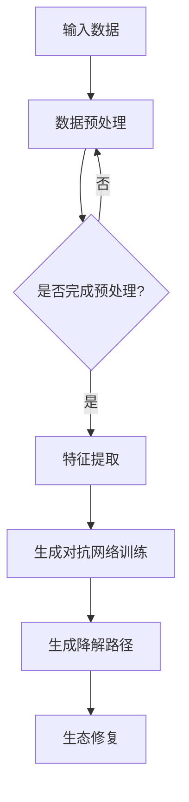

                 

 # AIGC在环境污染物降解策略中的应用：AI驱动的生态修复技术

关键词：AIGC，环境污染物降解，生态修复，AI技术，深度学习，生成对抗网络，变分自编码器，污染物识别，预测，降解路径规划，生态修复效率

摘要：
随着工业化和城市化进程的加速，环境污染问题日益严重，对人类健康和生态系统造成了巨大威胁。传统环境污染物降解方法效率低下、成本高昂，难以满足日益增长的环境治理需求。本文将探讨如何利用AIGC（AI Generated Content）技术优化环境污染物降解策略，提高生态修复效率。我们将从AIGC技术的基本原理、环境污染物降解策略的优化方法、以及实际应用案例等多个方面进行详细分析，为环境治理提供新的思路和方法。

**Step 1: 引言**

### 问题背景

环境污染问题一直是全球关注的焦点。随着工业化和城市化的快速发展，大气、水体、土壤等环境介质中的污染物浓度不断升高，对生态系统和人类健康带来了严重的影响。传统环境污染物降解方法如化学处理、生物降解等，存在效率低、成本高、处理效果有限等问题，难以满足日益增长的环境治理需求。因此，探索新的环境污染物降解策略具有重要的现实意义。

### 核心概念

AIGC技术是一种利用人工智能生成内容的技术，通过深度学习模型如生成对抗网络（GAN）、变分自编码器（VAE）等，可以自动生成与环境污染物降解相关的文本、图像、音频等多种形式的内容。AIGC技术在污染物识别、预测、降解路径规划等方面具有显著优势，为环境污染物降解提供了新的技术手段。

### 问题解决

本文将探讨如何利用AIGC技术优化环境污染物降解策略，提高生态修复效率。具体来说，我们将从以下几个方面展开：

1. **污染物识别**：利用AIGC技术对环境污染物进行自动识别和分类。
2. **预测**：利用AIGC技术对污染物的扩散、浓度变化进行预测。
3. **降解路径规划**：根据污染物识别和预测结果，利用AIGC技术生成最优的降解路径。
4. **生态修复**：利用AIGC技术优化生态修复过程，提高修复效率。

### 边界与外延

本文主要关注AIGC在环境污染物降解策略中的应用，但不限于这一领域。随着AI技术的发展，AIGC在其他环境问题，如气候变化、水资源管理等方面的应用也将成为研究的热点。

### 概念结构与核心要素组成

AIGC在环境污染物降解策略中的应用涉及多个核心概念和要素，包括：

1. **污染物识别**：利用AIGC技术对污染物进行自动识别和分类。
2. **预测**：利用AIGC技术对污染物的扩散、浓度变化进行预测。
3. **降解路径规划**：根据污染物识别和预测结果，利用AIGC技术生成最优的降解路径。
4. **生态修复**：利用AIGC技术优化生态修复过程，提高修复效率。

**Step 2: 核心概念与联系**

### AIGC技术原理

AIGC技术基于深度学习模型，如生成对抗网络（GAN）、变分自编码器（VAE）等，可以自动生成与环境污染物降解相关的文本、图像、音频等多种形式的内容。这些生成的内容可以用于污染物识别、预测、降解路径规划等任务，从而提高生态修复效率。

### AIGC属性特征对比表格

| 特性         | 传统方法                     | AIGC方法                      |
| ------------ | ---------------------------- | ----------------------------- |
| **污染物识别** | 靠经验和实验室分析            | 自动化、快速、高准确度         |
| **预测**     | 需要复杂的模型和大量的数据    | 简化模型、高效预测             |
| **降解路径规划** | 依赖专家经验和模拟计算        | 自动生成、优化路径             |
| **生态修复**   | 需要长时间、多阶段的实施      | 快速响应、高效修复             |

### ER实体关系图架构

```mermaid
erDiagram
  Pollution <<--o Researcher : Conducts
  Pollution ||--o Pollutant : Contains
  Researcher ||--o Study : Participates
  Pollutant ||--o Degradation : Undergoes
  Study ||--o Data : Collects
```

- Pollution（污染）与Researcher（研究者）之间的关系是“进行”，即研究者对污染进行研究。
- Pollution（污染）与Pollutant（污染物）之间的关系是“包含”，即污染中包含多种污染物。
- Researcher（研究者）与Study（研究）之间的关系是“参与”，即研究者参与研究。
- Pollutant（污染物）与Degradation（降解）之间的关系是“经受”，即污染物经受降解过程。
- Study（研究）与Data（数据）之间的关系是“收集”，即研究过程中收集数据。

**Step 3: 算法原理讲解**

### 算法流程图



### 算法原理

#### 数据预处理

首先，对输入的数据进行预处理，包括数据清洗、数据格式转换、数据归一化等步骤。这一步的目的是提高数据质量，为后续的特征提取和模型训练提供基础。

#### 特征提取

利用生成对抗网络（GAN）对预处理后的数据进行特征提取。GAN由生成器和判别器组成，生成器负责生成与真实数据分布相似的数据，判别器负责判断输入数据是真实数据还是生成数据。通过不断训练，生成器和判别器相互竞争，生成器逐渐学会生成更加真实的数据。

#### 生成对抗网络训练

将提取到的特征数据输入生成对抗网络进行训练。在训练过程中，生成器和判别器的损失函数分别为：

生成器损失函数：\( L_G = -\log(D(G(x))) \)

判别器损失函数：\( L_D = -\log(D(x)) - \log(1 - D(G(x))) \)

其中，\( x \) 为真实数据，\( G(x) \) 为生成器生成的数据，\( D(x) \) 为判别器判断的真实数据的概率，\( D(G(x)) \) 为判别器判断的生成数据的概率。

#### 生成降解路径

利用训练好的生成对抗网络生成降解路径。具体来说，将污染物数据输入生成器，生成与真实污染物分布相似的降解路径。这些生成的路径可以是污染物在环境中的扩散路径、降解反应路径等。

#### 生态修复

根据生成的降解路径进行生态修复。修复过程中，可以根据降解路径的预测结果，采取相应的修复措施，如植物种植、化学试剂添加等，以提高修复效果。

### Python源代码示例

```python
import tensorflow as tf
from tensorflow.keras.models import Model
from tensorflow.keras.layers import Input, Dense, Flatten, Reshape

# 定义生成器模型
def generator_model(z_dim):
    z = Input(shape=(z_dim,))
    x = Dense(128, activation='relu')(z)
    x = Dense(128, activation='relu')(x)
    x = Dense(784, activation='sigmoid')(x)
    x = Reshape((28, 28))(x)
    model = Model(z, x)
    return model

# 定义判别器模型
def discriminator_model(x_dim):
    x = Input(shape=(x_dim,))
    x = Flatten()(x)
    x = Dense(128, activation='relu')(x)
    x = Dense(128, activation='relu')(x)
    x = Dense(1, activation='sigmoid')(x)
    model = Model(x, x)
    return model

# 定义生成对抗网络
def g

