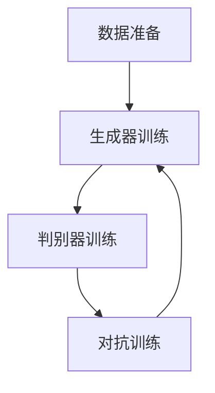
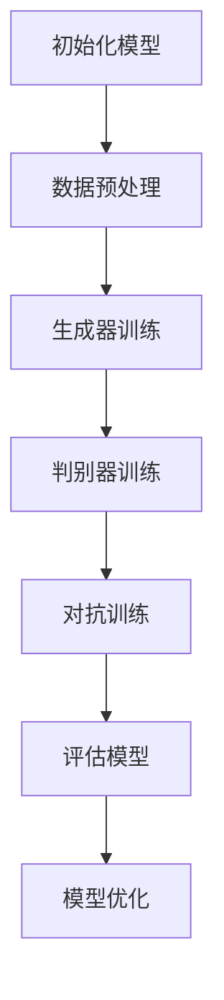
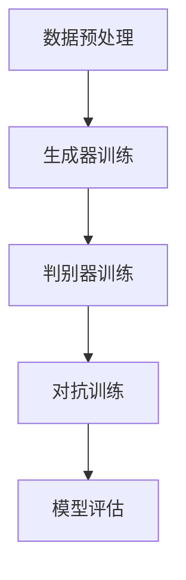
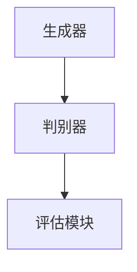
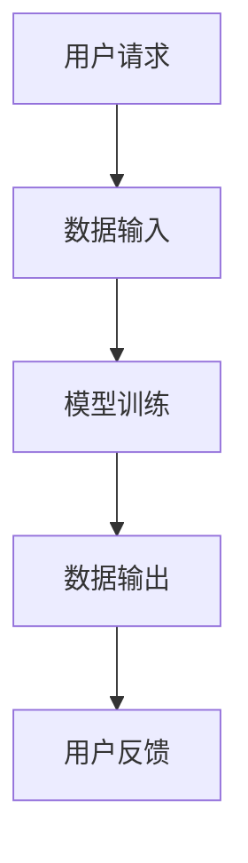

                 

### AIGC在艺术创作中的角色与争议

#### 关键词：AIGC、艺术创作、人工智能、争议

#### 摘要：
本文将探讨AIGC（自适应智能生成内容）在艺术创作中的角色及其引发的争议。我们将首先介绍AIGC的概念和其在艺术创作中的应用，然后深入分析其技术原理，最后讨论围绕AIGC的艺术创作所带来的社会和文化影响。

---

### 1. AIGC的背景与艺术创作的变革

#### 1.1 AIGC的概念与定义

AIGC（Adaptive Intelligent Generation of Content）是一种基于人工智能的自适应内容生成技术。它通过学习大量的数据集，能够自动生成高质量、多样化的内容，包括图像、文本、音频等。AIGC的核心在于其“适应性”，它可以根据用户的需求和环境的变化，实时调整生成的内容。

#### 1.2 AIGC的发展历程

AIGC的发展可以追溯到深度学习和生成对抗网络（GAN）的兴起。GAN的出现为生成式模型提供了强大的工具，而深度学习的发展则为这些模型提供了更强大的计算能力。随着计算资源和算法的进步，AIGC逐渐从理论研究走向实际应用，特别是在艺术创作领域。

#### 1.3 艺术创作中AIGC的应用现状

在艺术创作中，AIGC已经被广泛应用于图像生成、音乐创作、文学写作等领域。例如，DALL-E和GANdissey等模型可以生成逼真的图像，而MuseNet和WaveNet等模型则能够创作出风格独特的音乐和诗歌。这些应用不仅展示了AIGC的潜力，也引发了关于艺术创作本质和价值的讨论。

### 2. AIGC的核心概念与联系

#### 2.1 AIGC的核心原理

AIGC的核心原理是基于生成对抗网络（GAN）和其他生成模型。GAN由一个生成器（Generator）和一个判别器（Discriminator）组成。生成器负责生成假数据，而判别器则负责判断生成数据与真实数据的相似度。通过不断的对抗训练，生成器的生成能力不断提高。

#### 2.2 AIGC的关键特征

AIGC的关键特征包括自适应性和灵活性。它可以根据输入的数据和任务需求，实时调整生成策略，从而生成符合要求的内容。此外，AIGC还具有强大的泛化能力，能够处理不同类型和风格的数据。

#### 2.3 AIGC与其他技术的比较

与传统的生成技术相比，AIGC具有更高的生成质量和更强的适应性。例如，与GAN相比，AIGC引入了自适应机制，能够更好地处理复杂和多变的数据。与文本生成模型如GPT-3相比，AIGC在图像和音频生成方面具有更强的能力。

### 3. AIGC的算法原理讲解

#### 3.1 AIGC的算法概述

AIGC的算法主要基于生成对抗网络（GAN）。GAN由生成器和判别器组成，两者通过对抗训练来提高生成器的生成能力。生成器尝试生成与真实数据相似的数据，而判别器则试图区分生成数据和真实数据。通过这种对抗过程，生成器不断改进，最终能够生成高质量的内容。

#### 3.2 算法原理详细讲解

AIGC的算法原理可以简化为以下步骤：

1. **数据准备**：首先需要准备大量的训练数据，这些数据包括图像、文本、音频等。
2. **生成器训练**：生成器通过学习数据分布来生成假数据。在训练过程中，生成器不断尝试生成更真实的数据，以欺骗判别器。
3. **判别器训练**：判别器负责判断输入数据是真实数据还是生成数据。在训练过程中，判别器不断学习，以提高判断的准确性。
4. **生成器和判别器的对抗**：生成器和判别器通过对抗训练来提高自身的性能。生成器试图生成更真实的数据，而判别器则试图准确判断数据的真实性。

以下是一个简单的mermaid流程图来描述AIGC的算法流程：



#### 3.3 算法流程与mermaid流程图



### 4. 数学模型和数学公式讲解

AIGC的数学模型主要涉及生成器和判别器的损失函数。以下是一个简化的数学模型：

生成器损失函数（G）：

$$
L_G = -\log(D(G(z)))
$$

其中，$D$是判别器，$G(z)$是生成器的输出，$z$是随机噪声。

判别器损失函数（D）：

$$
L_D = -\log(D(x)) - \log(1 - D(G(z)))
$$

其中，$x$是真实数据，$G(z)$是生成器生成的假数据。

以下是一个简单的mermaid流程图来描述AIGC的数学模型：

```mermaid
graph TD
    A[输入噪声z] --> B[生成器G(z)]
    B --> C[判别器D(G(z))]
    C --> D[生成器损失L_G]
    C --> E[判别器损失L_D]
```

### 5. 系统分析与架构设计方案

#### 5.1 系统背景与介绍

AIGC系统是一个复杂的人工智能系统，它需要处理大量的数据，并实时生成高质量的内容。为了实现这一目标，系统需要具备高效的计算能力、强大的数据处理能力和灵活的适应性。

#### 5.2 系统功能设计

AIGC系统的功能包括数据预处理、生成器训练、判别器训练、对抗训练和模型评估。以下是一个简化的mermaid类图来描述系统的功能设计：



#### 5.3 系统架构设计

AIGC系统采用分布式架构，包括生成器、判别器和评估模块。以下是一个简化的mermaid架构图来描述系统的架构设计：



#### 5.4 系统接口设计与交互

AIGC系统提供了一系列API，用于数据的输入和输出，以及模型的训练和评估。以下是一个简化的mermaid序列图来描述系统的接口设计和交互：



### 6. 项目实战

#### 6.1 环境安装与准备

在开始AIGC项目之前，我们需要安装和配置必要的软件和工具。这包括Python环境、TensorFlow或PyTorch库、以及GPU加速卡。

#### 6.2 系统核心实现

AIGC系统的核心实现包括生成器和判别器的训练。以下是一个简单的Python代码示例，展示了生成器和判别器的训练过程：

```python
import tensorflow as tf
from tensorflow.keras.layers import Dense, Flatten
from tensorflow.keras.models import Sequential

# 生成器模型
generator = Sequential([
    Dense(128, input_shape=(100,), activation='relu'),
    Dense(128, activation='relu'),
    Flatten()
])

# 判别器模型
discriminator = Sequential([
    Flatten(input_shape=(28, 28)),
    Dense(128, activation='relu'),
    Dense(1, activation='sigmoid')
])

# 编译模型
generator.compile(loss='binary_crossentropy', optimizer='adam')
discriminator.compile(loss='binary_crossentropy', optimizer='adam')

# 训练模型
for epoch in range(100):
    for image in images:
        noise = np.random.normal(0, 1, (100,))
        generated_image = generator.predict(noise)
        real_image = image
        X = np.vstack((real_image, generated_image))
        y = np.array([1, 0])
        discriminator.train_on_batch(X, y)
        generator.train_on_batch(noise, np.array([1.0]))
```

#### 6.3 代码应用解读与分析

在上面的代码中，我们首先定义了生成器和判别器的模型结构。生成器模型负责将随机噪声转换为图像，而判别器模型负责判断图像是真实的还是生成的。通过对抗训练，生成器试图生成更真实的图像，而判别器则试图准确判断图像的真实性。

#### 6.4 实际案例分析与详细讲解

以下是一个实际案例，展示了如何使用AIGC系统生成图像：

```python
# 生成图像
noise = np.random.normal(0, 1, (100,))
generated_image = generator.predict(noise)

# 显示生成图像
plt.imshow(generated_image.reshape(28, 28), cmap='gray')
plt.show()
```

这段代码首先生成随机噪声，然后使用生成器模型将噪声转换为图像。最后，我们将生成的图像显示出来。

### 7. 最佳实践与小结

#### 7.1 最佳实践技巧

1. **数据准备**：确保数据集的质量和多样性，这有助于提高生成器的生成能力。
2. **模型优化**：根据实际需求调整生成器和判别器的参数，以获得更好的生成效果。
3. **计算资源**：充分利用GPU等计算资源，以加速模型训练过程。

#### 7.2 小结与展望

AIGC在艺术创作中具有巨大的潜力，它能够生成高质量、多样化的内容，为艺术家和设计师提供新的工具。然而，AIGC也面临一些挑战，如数据隐私、版权保护和创作伦理等。未来，随着技术的不断进步，AIGC将在艺术创作中发挥更大的作用。

#### 7.3 注意事项与拓展阅读

1. **数据隐私**：在使用AIGC进行艺术创作时，务必注意数据隐私问题，避免泄露敏感信息。
2. **版权保护**：在使用他人的数据或作品时，要确保遵循版权法律。
3. **伦理道德**：在艺术创作中，要遵循伦理道德规范，避免生成有害或不合适的内容。

拓展阅读：
- [深度学习与艺术创作](https://www.nature.com/articles/s41586-019-0212-7)
- [AI与艺术：新的创作方式](https://www.technologyreview.com/s/612879/how-artificial-intelligence-is-changing-creativity/)
- [AIGC：从理论到实践](https://arxiv.org/abs/2006.05918)

### 作者

作者：AI天才研究院/AI Genius Institute & 禅与计算机程序设计艺术 /Zen And The Art of Computer Programming

---

本文由AI天才研究院/AI Genius Institute撰写，旨在探讨AIGC在艺术创作中的角色与争议。文章结合了最新的研究和技术，提供了深入的分析和实用的建议。希望本文能为读者在理解AIGC和其在艺术创作中的应用方面提供有益的参考。

