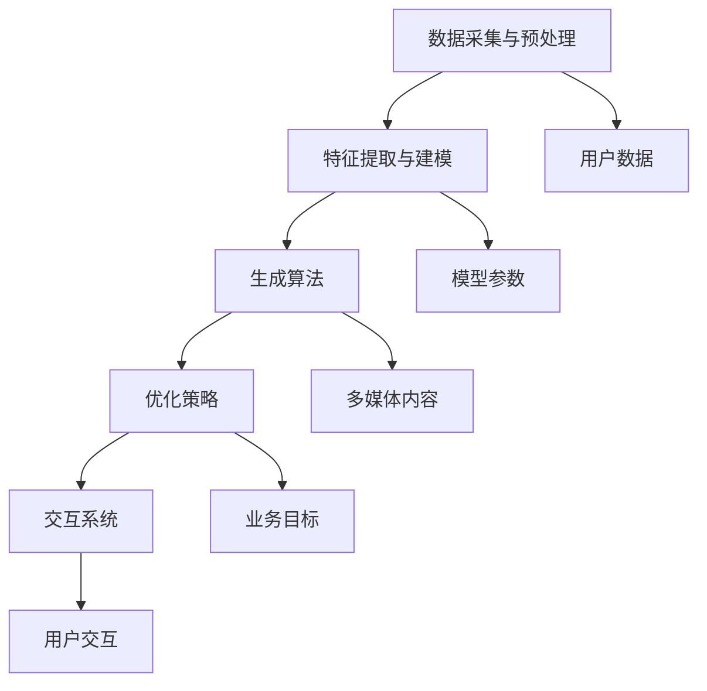

                 

### 文章标题

“AIGC在虚拟助手设计中的应用：提示词的个性化”

> 关键词：AIGC、虚拟助手、提示词、个性化设计、人工智能技术、用户画像、优化算法

> 摘要：本文将深入探讨AIGC（自适应智能生成计算）在虚拟助手设计中的应用，特别是如何通过个性化提示词来提升虚拟助手的服务质量。文章结构紧凑，逻辑清晰，旨在为读者提供从理论基础到实战应用的全面指南，帮助理解AIGC如何革新虚拟助手的设计与实现。

----------------------------------------------------------------

### 引言

#### 第1章: 引言

##### 1.1 本书的核心概念

随着人工智能技术的飞速发展，AIGC（自适应智能生成计算）作为一种新兴的技术，正在逐渐渗透到虚拟助手的开发中。虚拟助手，作为智能客服、智能生活助手、智能教育助手等应用场景的核心组件，其设计质量直接影响到用户体验和业务效率。提示词的个性化是虚拟助手设计中的一个关键环节，它能够根据用户的个性化需求，提供更加精准和高效的服务。

在本章中，我们将首先介绍AIGC的背景和定义，解释它如何与人工智能（AI）区别开来，并探讨其在虚拟助手设计中的应用。接下来，我们会详细分析虚拟助手的设计需求与面临的挑战，特别是如何实现提示词的个性化。通过这些核心概念的理解，读者将能够更好地把握全书的内容和结构。

##### 1.2 虚拟助手设计的需求与挑战

虚拟助手的设计需求主要集中在以下几个方面：

1. **高响应速度**：虚拟助手需要能够快速响应用户的请求，提供即时的帮助。
2. **精确性**：虚拟助手应能准确理解用户的问题，并提供相关且精确的答案。
3. **个性化**：虚拟助手应能根据用户的历史数据和偏好，提供个性化的服务。
4. **用户友好性**：虚拟助手的设计应注重用户体验，界面友好、交互顺畅。

然而，这些需求背后也伴随着一系列的挑战：

1. **数据处理与存储**：虚拟助手需要高效地处理和分析大量的用户数据，这要求强大的计算能力和优化的存储解决方案。
2. **算法优化**：为了实现精确的响应和个性化服务，需要持续优化算法，提高其性能和效果。
3. **安全性**：虚拟助手处理敏感数据，需要确保用户隐私和数据安全。
4. **可扩展性**：随着业务需求的增长，虚拟助手需要能够灵活扩展，以适应不断变化的市场环境。

##### 1.3 提示词的个性化在虚拟助手设计中的重要性

提示词的个性化是虚拟助手设计中的一个重要环节。通过个性化提示词，虚拟助手能够更好地理解用户的意图，提供更加精准和有效的服务。具体来说，个性化提示词的重要性体现在以下几个方面：

1. **提升用户体验**：个性化提示词能够根据用户的偏好和历史行为，提供定制化的服务，从而提升用户的满意度。
2. **提高响应效率**：通过精准的提示词，虚拟助手能够快速定位用户的需求，减少不必要的交互，提高响应效率。
3. **增强服务价值**：个性化提示词能够提供更加专业和有针对性的建议，从而增强虚拟助手的服务价值。
4. **促进用户粘性**：个性化的互动能够增强用户与虚拟助手之间的情感连接，促进用户粘性，提高用户忠诚度。

综上所述，AIGC在虚拟助手设计中的应用，尤其是提示词的个性化，是一个极具潜力和现实意义的研究方向。在接下来的章节中，我们将进一步探讨AIGC的基础知识、应用场景、技术实现和实战案例，帮助读者全面了解这一领域的最新进展和实践方法。

##### 1.4 本书结构安排

为了帮助读者系统地掌握AIGC在虚拟助手设计中的应用，本书分为以下六个部分：

**第一部分：引言**  
介绍AIGC的基本概念、虚拟助手设计的背景和需求，以及提示词个性化的重要性。

**第二部分：AIGC基础知识**  
详细讲解AIGC的技术原理、架构和主要特点，为后续的应用奠定基础。

**第三部分：虚拟助手应用场景**  
分析AIGC在虚拟客服助手、虚拟生活助手和虚拟教育助手等不同应用场景中的具体应用。

**第四部分：提示词个性化技术**  
探讨用户画像构建、提示词优化算法和生成模型，深入解析个性化提示词的实现方法。

**第五部分：实战案例**  
通过三个实际案例，展示AIGC在虚拟助手设计中的具体应用和实现过程。

**第六部分：挑战与展望**  
讨论AIGC在虚拟助手设计中的技术、应用和法律伦理挑战，并展望未来的发展趋势。

##### 1.5 读者需具备的基本知识

为了更好地理解和应用本书的内容，读者需具备以下基本知识：

1. **计算机科学基础**：了解计算机的基本概念、编程语言和算法原理。
2. **人工智能基础**：了解机器学习、自然语言处理和深度学习的基本概念和应用。
3. **数据分析能力**：掌握数据预处理、特征提取和统计分析等基本技能。
4. **软件工程知识**：了解软件设计、开发和维护的基本流程和方法。

##### 1.6 阅读建议与学习方法

为了最大化本书的学习效果，我们建议读者采取以下阅读和学习方法：

1. **逐章阅读**：按照书的章节顺序，逐章阅读，确保对每个知识点有深入的理解。
2. **实践操作**：在阅读过程中，尝试使用所学知识进行实际操作，如编写代码、设计算法等。
3. **问题思考**：在阅读每个章节后，思考其中提出的问题，并结合自己的经验进行分析。
4. **互动交流**：参与相关技术社区和论坛，与其他读者和专家进行交流和讨论。

通过以上阅读和学习方法，读者将能够更加系统地掌握AIGC在虚拟助手设计中的应用，提升自己的技术水平和创新能力。

----------------------------------------------------------------

### AIGC基础知识

#### 第2章: AIGC基础知识

##### 2.1 AI与AIGC的关系

人工智能（AI）和自适应智能生成计算（AIGC）是两个紧密相关的概念，但它们在技术实现和应用目标上有所区别。AI是指计算机系统模仿人类智能进行决策和执行任务的能力，包括机器学习、深度学习、自然语言处理等领域。而AIGC则是在AI的基础上，通过自适应生成计算技术，实现数据的自动生成、分析和优化。

首先，AI的基本概念包括以下几个要点：

1. **机器学习**：通过训练模型，让计算机从数据中学习规律和模式。
2. **深度学习**：利用多层神经网络，对复杂数据进行处理和学习。
3. **自然语言处理**：让计算机理解和生成自然语言，实现人机交互。
4. **强化学习**：通过试错和反馈，让计算机在特定环境中做出最优决策。

AIGC与AI的区别主要体现在以下几个方面：

1. **生成计算**：AIGC不仅能够处理和分析已有数据，还能生成新的数据，实现数据的自动生产和优化。
2. **自适应**：AIGC系统能够根据环境变化和用户需求，自适应调整生成策略，实现更高效的服务。
3. **多样性**：AIGC通过多模态数据生成，能够生成多样化、个性化的内容，满足不同用户的需求。

##### 2.2 AIGC的特点与优势

AIGC具有以下几个显著特点：

1. **数据驱动的生成能力**：AIGC基于大量数据进行训练，能够生成高质量的文本、图像、音频等多媒体内容。
2. **自适应优化**：AIGC系统能够根据用户反馈和业务需求，自适应调整模型参数和生成策略，实现高效服务。
3. **多模态融合**：AIGC能够融合多种数据类型，实现文本、图像、音频等跨模态内容的生成和交互。
4. **个性化定制**：通过用户画像和个性化算法，AIGC能够生成符合用户需求的个性化内容。

AIGC的优势主要体现在以下几个方面：

1. **提升服务质量**：通过个性化内容生成，AIGC能够提供更精准、高效的服务，提升用户体验。
2. **降低开发成本**：AIGC能够自动化生成大量内容，减少人工创作成本，提高生产效率。
3. **拓展应用场景**：AIGC在虚拟助手、内容生成、数据挖掘等领域具有广泛的应用潜力，能够拓展业务场景。

##### 2.3 AIGC的技术架构

AIGC的技术架构主要包括以下几个核心组成部分：

1. **数据采集与预处理**：从多种渠道收集用户数据，包括行为数据、交互数据、社交媒体数据等，并进行数据清洗、去噪、归一化等预处理操作。
2. **特征提取与建模**：通过特征提取技术，将原始数据转换为模型可以理解的向量表示，然后利用深度学习、机器学习等技术，建立生成模型。
3. **生成算法**：利用生成对抗网络（GAN）、变分自编码器（VAE）等生成算法，生成高质量的多媒体内容。
4. **优化策略**：通过用户反馈和业务目标，自适应调整生成模型参数和优化策略，实现高效内容生成。
5. **交互系统**：构建用户交互界面，实现用户与虚拟助手的实时交互，并提供个性化内容推荐。

下图展示了AIGC的技术架构：

##### 2.4 虚拟助手的基本概念

虚拟助手是一种基于人工智能技术的智能服务系统，能够模拟人类的交互方式，为用户提供实时、个性化的服务。虚拟助手通常包括以下几个关键组成部分：

1. **语音识别系统**：将用户的语音输入转换为文本输入，实现人机语音交互。
2. **自然语言处理**：理解用户的问题和意图，进行语义分析和解析。
3. **知识库**：存储大量预定义的问答内容、业务知识，为虚拟助手提供丰富的知识来源。
4. **决策引擎**：根据用户问题和上下文，自动生成合理的回答和建议。
5. **用户界面**：提供用户与虚拟助手交互的界面，包括语音、文本、图像等多种形式。

虚拟助手的发展历程可以分为以下几个阶段：

1. **早期基于规则的系统**：虚拟助手通过预定义的规则进行简单的问答，缺乏灵活性和扩展性。
2. **基于知识的系统**：虚拟助手利用知识库进行语义分析和回答，但知识库的维护和更新较为复杂。
3. **基于机器学习的系统**：虚拟助手通过机器学习算法，从大量数据中自动学习并优化回答策略，提高服务质量。
4. **基于深度学习的系统**：虚拟助手利用深度学习技术，实现更复杂和人性化的交互，提高用户体验。

##### 2.5 虚拟助手的组成与功能

虚拟助手的组成和功能可以概括为以下几个方面：

1. **输入模块**：接收用户的输入，包括语音、文本、图像等。
2. **处理模块**：对输入进行语音识别、语义分析和意图识别，理解用户的问题和需求。
3. **决策模块**：根据用户问题和上下文，从知识库中检索相关答案，或通过机器学习算法生成答案。
4. **输出模块**：将生成的答案以语音、文本、图像等形式反馈给用户。

虚拟助手的具体功能包括：

1. **问答服务**：回答用户提出的问题，提供相关信息和解决方案。
2. **任务处理**：自动执行用户指定的任务，如预订机票、购买商品等。
3. **情感交互**：通过语音、语调、表情等手段，与用户进行情感化的互动，提高用户满意度。
4. **个性化推荐**：根据用户的历史行为和偏好，提供个性化的内容和建议。

##### 2.6 虚拟助手的分类与应用场景

虚拟助手可以根据应用场景和功能进行分类，常见的类型包括：

1. **虚拟客服助手**：应用于企业客服系统，提供在线咨询、投诉处理、订单查询等服务。
2. **虚拟生活助手**：应用于智能家居、智能穿戴设备，提供日程管理、健康监测、购物推荐等服务。
3. **虚拟教育助手**：应用于在线教育平台，提供课程推荐、学习辅导、考试评估等服务。
4. **虚拟医疗助手**：应用于医疗机构，提供病情咨询、药品推荐、健康指导等服务。

虚拟助手的应用场景广泛，以下是一些具体的应用案例：

1. **客户服务**：银行、保险、电商等行业，通过虚拟客服助手提供24/7的客户服务，提高客户满意度。
2. **健康管理**：智能穿戴设备，通过虚拟生活助手实时监测用户的健康状况，提供个性化健康建议。
3. **在线教育**：在线教育平台，通过虚拟教育助手为学生提供课程推荐、学习辅导，提高学习效果。
4. **医疗咨询**：医疗机构，通过虚拟医疗助手为患者提供病情咨询、药品推荐，提高医疗效率。

通过以上对AIGC基础知识、虚拟助手的基本概念和分类的介绍，读者可以对AIGC在虚拟助手设计中的应用有一个初步的了解。在接下来的章节中，我们将深入探讨AIGC在具体应用场景中的实现方法和优化策略。

----------------------------------------------------------------

##### 2.7 提示词的基本概念

提示词是虚拟助手与用户进行交互的重要媒介，它通常是一组关键词或短语，用于引导用户输入或提供问题的答案。在AIGC的框架下，提示词具有以下几个关键属性：

1. **关键词性**：提示词应当简洁明了，能够准确表达用户的需求或意图。
2. **多样性**：提示词应涵盖多种形式，如疑问句、陈述句、指令性语句等，以满足不同类型的用户交互需求。
3. **动态性**：提示词应能够根据用户的行为、历史数据和上下文进行动态调整，以提供更加个性化的服务。
4. **上下文敏感性**：提示词需具备上下文理解能力，能够根据当前的交互状态和用户的历史记录，提供相关且合理的答案。

提示词在虚拟助手中的作用主要体现在以下几个方面：

1. **引导用户输入**：通过提供提示词，虚拟助手能够引导用户更准确地表达自己的需求，提高交互效率。
2. **优化问答质量**：通过使用多样化的提示词，虚拟助手能够生成更加丰富和精准的答案，提高问答服务的质量。
3. **增强用户体验**：个性化的提示词能够提供更加贴心的服务，提高用户的满意度，增强用户粘性。
4. **辅助决策**：在复杂决策过程中，提示词可以作为辅助信息，帮助用户更好地理解问题和选择。

##### 2.8 提示词个性化的方法与策略

提示词的个性化是提升虚拟助手服务质量的关键环节。以下是一些常见的提示词个性化方法和策略：

1. **基于用户画像的个性化**：通过构建用户画像，分析用户的历史行为、偏好和需求，为不同用户提供定制化的提示词。例如，对于经常咨询财务问题的用户，可以使用专业术语和财务相关的提示词。

2. **基于上下文的个性化**：根据当前交互的上下文环境，动态调整提示词的内容和形式。例如，当用户询问天气时，可以提供当前所在城市的天气情况，而不是通用的天气信息。

3. **基于历史数据的个性化**：利用用户的历史交互数据，分析用户的行为模式和偏好，为用户提供更加个性化的提示词。例如，对于经常购买特定商品的用户，可以推荐相关的促销信息。

4. **基于语义理解的个性化**：通过自然语言处理技术，理解用户问题的语义和意图，为用户提供相关且合理的提示词。例如，当用户询问“附近有什么餐厅？”时，可以提供附近热门餐厅的推荐。

5. **基于个性化推荐算法的提示词生成**：结合机器学习和数据挖掘技术，开发个性化推荐算法，自动生成符合用户需求的提示词。例如，基于用户的浏览历史和购物记录，推荐相关的商品或服务。

##### 2.9 提示词个性化在虚拟助手中的应用

在虚拟助手的设计中，提示词的个性化应用主要体现在以下几个方面：

1. **问答服务**：通过个性化的提示词，虚拟助手能够提供更加精准和相关的问答服务。例如，对于有特定健康需求的用户，提供个性化的健康咨询和建议。

2. **任务处理**：在任务处理场景中，个性化的提示词可以帮助用户更好地理解任务要求，提高任务完成的效率。例如，在购物场景中，根据用户的购物偏好，提供个性化的购物建议和推荐。

3. **情感交互**：通过个性化的提示词，虚拟助手能够与用户进行更加情感化的互动，提高用户的满意度。例如，在客服场景中，根据用户的情感状态，提供适当的安慰和鼓励。

4. **个性化推荐**：在推荐系统中，个性化的提示词能够提高推荐效果，为用户提供更加符合需求的内容。例如，在音乐或视频平台上，根据用户的听观历史，推荐相关的音乐或视频。

通过以上对提示词基本概念、个性化方法和应用的介绍，读者可以更加深入地理解AIGC在虚拟助手设计中的应用。在下一章中，我们将进一步探讨AIGC在虚拟助手设计中的具体应用场景，分析其在不同领域的实现方法和效果。

----------------------------------------------------------------

##### 2.10 AIGC在虚拟助手设计中的应用场景

AIGC（自适应智能生成计算）在虚拟助手设计中的应用场景广泛，涵盖了从虚拟客服助手到虚拟生活助手，再到虚拟教育助手的多个领域。以下将详细分析AIGC在这些应用场景中的具体实现方法和技术特点。

**3.1 虚拟客服助手**

虚拟客服助手是AIGC应用的一个典型场景，旨在为企业提供24/7在线客服服务，以提高客户满意度和运营效率。在虚拟客服助手中，AIGC主要通过以下技术实现：

1. **语音识别与自然语言处理**：利用AIGC技术，虚拟客服助手能够实时捕捉用户的语音输入，通过语音识别转换为文本，并进行自然语言处理，理解用户的问题和意图。

2. **多轮对话管理**：AIGC技术支持多轮对话管理，虚拟客服助手可以基于上下文和用户行为，进行连续、自然的对话交互，提供更加个性化的回答和建议。

3. **个性化回答生成**：通过用户画像和上下文信息，AIGC能够动态生成个性化的回答，满足不同客户的需求。例如，对于经常咨询财务问题的客户，可以提供专业术语和详细的解释。

4. **知识库更新与优化**：AIGC技术可以自动更新和优化知识库，通过机器学习算法，从用户交互数据中学习，不断改进问答系统的准确性和效率。

**3.2 虚拟生活助手**

虚拟生活助手旨在为用户提供个性化的生活服务，如日程管理、健康监测、购物推荐等。AIGC在虚拟生活助手中的应用主要体现在：

1. **用户行为分析**：通过AIGC技术，虚拟生活助手能够分析用户的行为数据，了解用户的生活习惯和偏好，为用户提供个性化的建议和服务。

2. **个性化内容生成**：AIGC能够根据用户的历史数据和行为模式，生成个性化的日程提醒、健康建议和购物推荐，提高用户的生活质量。

3. **多模态交互**：AIGC支持多模态交互，虚拟生活助手可以通过语音、文本、图像等多种方式与用户互动，提供更加自然和丰富的用户体验。

4. **情境感知**：AIGC能够根据用户的实时情境，动态调整服务内容和交互方式。例如，在用户处于工作状态时，提供高效的日程管理和提醒服务；在用户休息时，提供放松和娱乐建议。

**3.3 虚拟教育助手**

虚拟教育助手是AIGC在教育领域的应用，旨在为用户提供个性化的学习辅导和课程推荐。AIGC在虚拟教育助手中的应用主要包括：

1. **学习路径推荐**：AIGC技术可以分析用户的学习历史和偏好，为用户提供定制化的学习路径和课程推荐，提高学习效率。

2. **智能辅导**：虚拟教育助手通过AIGC技术，可以实时监控学生的学习情况，提供个性化的学习辅导和反馈，帮助学生更好地掌握知识点。

3. **互动教学**：AIGC支持互动式教学，虚拟教育助手可以通过语音、文本、图像等多种方式与用户互动，激发学生的学习兴趣和积极性。

4. **智能评测**：AIGC技术可以自动生成和评估学生的学习成果，提供个性化的评测报告和改进建议，帮助教师和学生更好地了解学习效果。

**3.4 其他应用场景**

除了上述典型应用场景，AIGC在虚拟助手设计中的应用还扩展到其他领域，如虚拟医疗助手、虚拟导游、虚拟客服代表等。

1. **虚拟医疗助手**：AIGC技术可以帮助虚拟医疗助手提供智能诊断、病情咨询、健康建议等服务，提高医疗服务的效率和准确性。

2. **虚拟导游**：虚拟导游利用AIGC技术，可以为用户提供个性化的旅游推荐、景点介绍和路线规划，提升旅游体验。

3. **虚拟客服代表**：在大型企业中，虚拟客服代表可以辅助人工客服，处理高频次、重复性的咨询问题，减轻人工客服的工作压力。

通过以上对AIGC在虚拟助手设计中的应用场景的详细介绍，读者可以更全面地理解AIGC在虚拟助手中的技术实现和实际应用。在下一章中，我们将深入探讨提示词个性化技术，包括用户画像构建、提示词优化算法和生成模型，以及这些技术在实际应用中的具体实现方法和效果评估。

----------------------------------------------------------------

### 提示词个性化技术

#### 第4章: 提示词个性化技术

提示词个性化技术是提升虚拟助手服务质量的关键环节。在这一章中，我们将深入探讨用户画像构建、提示词优化算法和生成模型，分析这些技术在实际应用中的实现方法和效果评估。

##### 4.1 用户画像构建

用户画像是指通过收集和分析用户的行为数据、社交数据、兴趣偏好等信息，构建出反映用户特征的综合模型。用户画像在虚拟助手中的应用主要体现在以下几个方面：

1. **用户特征提取**：通过数据挖掘和机器学习技术，从用户数据中提取关键特征，如年龄、性别、职业、兴趣爱好等。

2. **用户标签管理**：基于提取的用户特征，为每个用户分配相应的标签，用于描述其兴趣和行为偏好。标签可以是静态的，如年龄和性别，也可以是动态的，如近期搜索的关键词和浏览的网站。

3. **用户行为分析**：通过分析用户的历史行为数据，了解其兴趣和行为模式，如经常浏览的页面、经常购买的商品等。

4. **用户画像更新**：用户画像需要定期更新，以反映用户的最新变化和需求。这可以通过持续收集用户数据、定期进行用户行为分析和模型重新训练实现。

在用户画像构建过程中，常见的方法和技术包括：

1. **数据收集与预处理**：从多种渠道收集用户数据，如行为日志、社交媒体数据等，并进行数据清洗、去噪和归一化处理。

2. **特征工程**：通过特征提取和特征选择，从原始数据中提取出对用户画像构建有价值的特征。

3. **机器学习算法**：使用聚类、分类、关联规则等机器学习算法，对用户数据进行分析，构建用户画像模型。

4. **用户标签系统**：通过标签管理系统，对用户画像进行管理和维护，实现用户特征的动态更新。

##### 4.2 提示词优化算法

提示词优化算法的目标是通过分析和优化提示词，提高虚拟助手的问答质量和用户体验。以下是一些常见的提示词优化算法：

1. **基于机器学习的优化算法**：通过训练机器学习模型，根据用户历史交互数据，预测用户可能的意图和需求，生成优化后的提示词。

2. **基于自然语言处理的优化算法**：利用自然语言处理技术，对用户输入进行语义分析和理解，生成相关性和准确性更高的提示词。

3. **基于深度学习的优化算法**：通过深度学习模型，如循环神经网络（RNN）、长短时记忆网络（LSTM）等，对用户交互进行建模和预测，实现提示词的自动优化。

4. **基于上下文的优化算法**：根据当前交互的上下文环境，动态调整提示词的内容和形式，提高提示词的针对性和准确性。

在提示词优化算法的实现过程中，常见的技术和方法包括：

1. **数据集构建**：收集和整理大量用户交互数据，用于训练和测试优化算法。

2. **特征工程**：从用户交互数据中提取关键特征，如用户输入、历史问答、上下文环境等，用于训练优化模型。

3. **模型训练与验证**：使用机器学习和深度学习技术，训练优化模型，并通过交叉验证等方法评估模型性能。

4. **在线更新**：通过在线学习技术，实时更新优化模型，以适应用户需求和交互模式的变化。

##### 4.3 提示词生成模型

提示词生成模型是虚拟助手中用于生成提示词的核心组件。以下是一些常见的提示词生成模型：

1. **基于规则的方法**：通过预定义的规则和模板，生成提示词。这种方法简单直观，但灵活性较低，难以满足个性化需求。

2. **基于模板的方法**：结合用户输入和预定义的模板，动态生成提示词。这种方法在规则的基础上增加了灵活性，但仍依赖于人工设定的模板。

3. **基于生成对抗网络（GAN）的方法**：利用生成对抗网络，生成高质量的提示词。GAN通过训练生成器和判别器，使生成器能够生成接近真实数据的提示词。

4. **基于变分自编码器（VAE）的方法**：利用变分自编码器，生成多样化的提示词。VAE通过概率模型，实现提示词的生成和多样化。

5. **基于递归神经网络（RNN）的方法**：利用递归神经网络，对用户交互进行建模，生成与上下文相关的提示词。RNN能够捕捉用户交互的时序信息，提高提示词的相关性。

在提示词生成模型的应用中，常见的技术和方法包括：

1. **数据集构建**：收集和整理大量用户交互数据，用于训练和测试生成模型。

2. **模型架构设计**：设计合适的神经网络架构，如RNN、LSTM、GAN、VAE等，以实现高效的提示词生成。

3. **模型训练与验证**：使用机器学习和深度学习技术，训练生成模型，并通过交叉验证等方法评估模型性能。

4. **在线更新**：通过在线学习技术，实时更新生成模型，以适应用户需求和交互模式的变化。

##### 4.4 提示词个性化技术的效果评估

提示词个性化技术的效果评估是确保虚拟助手服务质量的重要环节。以下是一些常见的效果评估方法：

1. **用户体验评估**：通过用户调研、问卷调查和用户反馈等方式，评估用户对虚拟助手提示词的满意度。用户体验评估可以提供直观的用户反馈，帮助改进提示词生成算法。

2. **精确性评估**：通过计算提示词的准确率、召回率和F1分数等指标，评估提示词的精确性和相关性。精确性评估可以量化提示词生成算法的性能。

3. **响应时间评估**：通过测量虚拟助手响应用户请求的平均时间，评估系统的响应速度。响应时间评估可以衡量系统性能和优化空间。

4. **交互质量评估**：通过分析用户与虚拟助手的交互日志，评估交互的质量和流畅性。交互质量评估可以提供更全面的性能评估。

在提示词个性化技术的效果评估中，常见的方法和技术包括：

1. **数据收集**：收集用户交互数据、用户体验反馈和系统性能数据等。

2. **指标计算**：计算相关评估指标，如准确率、召回率、F1分数、响应时间等。

3. **统计分析**：使用统计分析方法，分析评估数据，得出评估结论。

4. **模型优化**：根据评估结果，调整和优化提示词生成算法和系统参数。

通过以上对用户画像构建、提示词优化算法和生成模型以及效果评估的深入探讨，读者可以全面理解提示词个性化技术在虚拟助手设计中的应用。在下一章中，我们将通过三个实战案例，展示AIGC在虚拟助手设计中的具体实现和应用效果。

----------------------------------------------------------------

### AIGC在虚拟助手设计中的实战案例

#### 第5章: AIGC在虚拟助手设计中的实战案例

在本章中，我们将通过三个实际案例，详细展示AIGC在虚拟助手设计中的应用过程，包括设计思路、实现步骤和案例分析。这些案例涵盖了虚拟客服助手、虚拟生活助手和虚拟教育助手等不同领域，通过具体实现和实际效果分析，帮助读者更好地理解AIGC在虚拟助手设计中的实际应用。

##### 5.1 案例一：某银行虚拟客服助手的设计与实现

**5.1.1 案例背景**

某大型银行在数字化转型过程中，希望通过引入虚拟客服助手，提高客户服务质量和效率。虚拟客服助手需要能够处理各种常见问题，如账户查询、转账操作、信用卡申请等，同时提供个性化的金融咨询服务。

**5.1.2 设计思路**

在设计虚拟客服助手时，我们采用了AIGC技术，具体设计思路如下：

1. **用户画像构建**：通过收集和分析用户行为数据，构建用户画像，为个性化服务提供基础。
2. **多轮对话管理**：采用对话管理技术，实现多轮对话交互，提高用户的满意度。
3. **个性化回答生成**：利用用户画像和上下文信息，动态生成个性化回答，满足不同客户的需求。
4. **知识库管理**：建立和维护丰富的知识库，为虚拟客服助手提供准确和全面的回答支持。

**5.1.3 实现步骤**

1. **数据收集与预处理**：收集用户行为数据，包括点击记录、搜索历史、咨询记录等，并进行数据清洗和预处理，提取关键特征。
2. **用户画像构建**：使用聚类和分类算法，构建用户画像模型，为个性化服务提供基础。
3. **多轮对话管理**：采用基于状态转移图的方法，设计多轮对话管理模块，实现自然、流畅的对话交互。
4. **个性化回答生成**：利用深度学习模型，如循环神经网络（RNN）和生成对抗网络（GAN），生成个性化回答。
5. **知识库管理**：建立和维护知识库，包括常见问题解答、业务流程指南、金融产品信息等，为虚拟客服助手提供全面的支持。

**5.1.4 实现过程**

1. **用户画像构建**：通过数据预处理，提取用户特征，如年龄、性别、收入水平、理财偏好等，构建用户画像模型。
2. **多轮对话管理**：设计对话管理模块，实现用户意图识别、上下文维护和回答生成，支持多轮对话交互。
3. **个性化回答生成**：利用RNN和GAN模型，对用户输入进行语义分析，生成个性化回答。
4. **知识库管理**：整合各种业务知识，建立和维护知识库，为虚拟客服助手提供准确和全面的回答支持。

**5.1.5 案例总结**

通过AIGC技术的应用，某银行虚拟客服助手在用户满意度、服务质量等方面取得了显著提升。个性化回答生成和多轮对话管理技术，使虚拟客服助手能够更好地理解用户需求，提供精准和高效的服务。同时，用户画像的构建和知识库的管理，也为虚拟客服助手的持续优化提供了数据支持。

##### 5.2 案例二：某电商平台的虚拟生活助手的设计与实现

**5.2.1 案例背景**

某大型电商平台希望通过引入虚拟生活助手，提升用户体验和购物效率。虚拟生活助手需要能够提供购物推荐、订单查询、售后服务等个性化服务，同时整合多种生活服务，如健康监测、日程管理、娱乐推荐等。

**5.2.2 设计思路**

在设计虚拟生活助手时，我们采用了AIGC技术，具体设计思路如下：

1. **用户行为分析**：通过AIGC技术，分析用户的历史行为数据，了解用户的购物偏好和生活习惯。
2. **个性化内容生成**：利用用户行为分析结果，生成个性化的购物推荐和生活服务。
3. **多模态交互**：支持语音、文本、图像等多种交互方式，提高用户的便捷性和满意度。
4. **情境感知**：根据用户的实时情境，动态调整虚拟生活助手的服务内容和交互方式。

**5.2.3 实现步骤**

1. **数据收集与预处理**：收集用户的行为数据，包括购物记录、浏览历史、生活服务需求等，并进行数据清洗和预处理。
2. **用户行为分析**：使用机器学习和数据挖掘技术，分析用户的行为数据，构建用户画像模型。
3. **个性化内容生成**：利用用户画像模型，生成个性化的购物推荐和生活服务。
4. **多模态交互设计**：设计多模态交互界面，实现语音、文本、图像等多种交互方式的整合。
5. **情境感知实现**：通过实时数据监控和上下文分析，实现情境感知，动态调整服务内容和交互方式。

**5.2.4 实现过程**

1. **数据收集与预处理**：通过电商平台的数据接口，收集用户的行为数据，并进行数据清洗和预处理，提取关键特征。
2. **用户行为分析**：使用聚类和分类算法，分析用户的行为数据，构建用户画像模型。
3. **个性化内容生成**：利用用户画像模型，结合深度学习技术，生成个性化的购物推荐和生活服务。
4. **多模态交互设计**：设计语音、文本、图像等多模态交互界面，实现用户与虚拟生活助手的自然互动。
5. **情境感知实现**：通过实时数据监控和上下文分析，根据用户的实时情境，动态调整虚拟生活助手的服务内容和交互方式。

**5.2.5 案例总结**

通过AIGC技术的应用，某电商平台的虚拟生活助手在用户满意度、购物效率等方面取得了显著提升。用户行为分析技术使虚拟生活助手能够更好地理解用户需求，提供个性化的服务和推荐。多模态交互设计和情境感知功能，提高了用户的便捷性和满意度，促进了用户粘性和业务增长。

##### 5.3 案例三：某教育机构的虚拟教育助手的设计与实现

**5.3.1 案例背景**

某知名教育机构希望通过引入虚拟教育助手，提升在线教育的效果和用户满意度。虚拟教育助手需要能够提供课程推荐、学习辅导、考试评估等个性化服务，同时支持多轮对话交互，为学生提供全方位的学习支持。

**5.3.2 设计思路**

在设计虚拟教育助手时，我们采用了AIGC技术，具体设计思路如下：

1. **学习路径推荐**：通过AIGC技术，分析学生的学习历史和偏好，生成个性化的学习路径和课程推荐。
2. **智能辅导**：利用AIGC技术，提供个性化的学习辅导和考试评估，帮助学生更好地掌握知识点。
3. **多轮对话管理**：采用对话管理技术，实现多轮对话交互，提高学生的学习积极性和满意度。
4. **知识库管理**：建立和维护丰富的知识库，为虚拟教育助手提供准确和全面的学习支持。

**5.3.3 实现步骤**

1. **数据收集与预处理**：收集学生的学习数据，包括学习记录、考试成绩、互动日志等，并进行数据清洗和预处理。
2. **学习路径推荐**：使用聚类和分类算法，分析学生的学习数据，构建学习路径推荐模型。
3. **智能辅导**：利用深度学习技术，构建智能辅导模型，提供个性化的学习辅导和考试评估。
4. **多轮对话管理**：设计对话管理模块，实现多轮对话交互，支持学生与虚拟教育助手的自然互动。
5. **知识库管理**：建立和维护知识库，包括课程内容、常见问题解答、学习资料等，为虚拟教育助手提供全面的支持。

**5.3.4 实现过程**

1. **数据收集与预处理**：通过教育平台的数据接口，收集学生的学习数据，并进行数据清洗和预处理，提取关键特征。
2. **学习路径推荐**：使用聚类和分类算法，分析学生的学习数据，构建学习路径推荐模型。
3. **智能辅导**：利用深度学习技术，构建智能辅导模型，提供个性化的学习辅导和考试评估。
4. **多轮对话管理**：设计对话管理模块，实现多轮对话交互，支持学生与虚拟教育助手的自然互动。
5. **知识库管理**：整合各种学习资源，建立和维护知识库，为虚拟教育助手提供准确和全面的学习支持。

**5.3.5 案例总结**

通过AIGC技术的应用，某教育机构的虚拟教育助手在学生满意度、学习效果等方面取得了显著提升。学习路径推荐和智能辅导技术，使虚拟教育助手能够更好地理解学生需求，提供个性化的学习和辅导服务。多轮对话管理技术，提高了学生的学习积极性和互动体验。知识库管理技术，为虚拟教育助手提供了丰富的学习资源和支持。

通过以上三个实战案例，我们可以看到AIGC技术在虚拟助手设计中的应用，不仅提高了服务质量和用户体验，还促进了业务的持续增长和创新。在下一章中，我们将深入探讨AIGC在虚拟助手设计中的挑战与展望，分析当前面临的问题和未来的发展方向。

----------------------------------------------------------------

### AIGC在虚拟助手设计中的挑战与展望

#### 第6章: AIGC在虚拟助手设计中的挑战与展望

随着AIGC（自适应智能生成计算）技术的发展，其在虚拟助手设计中的应用前景广阔。然而，这一新兴技术在实际应用中也面临一系列挑战，需要我们深入探讨并寻求解决方案。

##### 6.1 挑战

**6.1.1 技术挑战**

1. **计算资源需求**：AIGC技术通常需要大量的计算资源和存储空间，特别是在大规模数据集和复杂模型训练时。这要求虚拟助手系统具备强大的计算能力和高效的资源管理策略。

2. **数据质量和完整性**：AIGC的性能高度依赖于训练数据的质量和完整性。如果数据存在噪声、偏差或缺失，将会影响生成模型的性能和准确性。因此，如何确保数据的质量和完整性是一个重要挑战。

3. **算法复杂度**：AIGC涉及多种复杂的算法，如生成对抗网络（GAN）、变分自编码器（VAE）等，其实现和优化需要深厚的算法基础和经验。如何高效地设计和优化这些算法，是技术层面的一大挑战。

4. **实时性**：虚拟助手需要能够实时响应用户请求，提供快速、准确的服务。在大量并发请求的情况下，如何保证系统的实时性和稳定性，是一个重要的技术挑战。

**6.1.2 应用挑战**

1. **用户体验**：虚拟助手的用户体验直接影响到用户满意度和使用频率。如何通过个性化提示词和自然语言交互技术，提供高质量的个性化服务，是应用层面的关键挑战。

2. **多模态融合**：AIGC在虚拟助手中的应用涉及多种数据类型，如文本、语音、图像等。如何有效地融合这些多模态数据，实现无缝的跨模态交互，是一个重要的应用挑战。

3. **安全性**：虚拟助手处理大量用户数据，需要确保用户隐私和数据安全。如何在数据收集、存储和处理过程中，有效保护用户隐私，是一个重要的安全挑战。

4. **伦理和道德问题**：随着AIGC技术的应用，涉及伦理和道德问题的讨论日益增多。例如，如何确保虚拟助手的决策过程透明、公正，避免歧视和偏见，是一个重要的伦理挑战。

**6.1.3 法律伦理挑战**

1. **数据隐私保护**：虚拟助手在收集和处理用户数据时，需要遵守相关法律法规，如《通用数据保护条例》（GDPR）等。如何保护用户隐私，防止数据泄露和滥用，是一个重要的法律挑战。

2. **责任归属**：在AIGC技术应用于虚拟助手的过程中，当发生错误或损害时，如何界定责任归属，是一个复杂的法律和伦理问题。

##### 6.2 展望

**6.2.1 技术发展趋势**

1. **算法优化**：随着计算能力和算法研究的进展，AIGC技术将越来越高效，生成模型的性能和准确性将显著提升。例如，基于量子计算的AIGC技术有望在未来的应用中发挥重要作用。

2. **多模态融合**：随着传感器技术和数据处理技术的进步，AIGC在多模态数据融合方面将有更多突破，实现更加自然和丰富的用户交互体验。

3. **边缘计算**：结合边缘计算技术，AIGC将能够实现更低延迟、更高效的虚拟助手服务，特别是在移动设备和物联网应用中。

**6.2.2 应用前景分析**

1. **智能客服**：AIGC将在智能客服领域发挥重要作用，提供个性化、高效的客户服务，提升企业运营效率。

2. **智能生活助手**：AIGC技术将使虚拟生活助手更加智能化，为用户提供个性化的生活服务，提高生活质量。

3. **智能教育**：AIGC技术将在在线教育领域得到广泛应用，提供个性化学习路径和智能辅导，提升教育质量。

4. **医疗健康**：AIGC技术在医疗健康领域具有巨大潜力，如智能诊断、个性化治疗方案推荐等，将提高医疗服务水平。

**6.2.3 未来发展方向**

1. **透明性和可解释性**：随着用户对隐私和数据安全的关注，AIGC技术的透明性和可解释性将成为重要发展方向。通过提高模型的透明性，用户可以更好地理解虚拟助手的决策过程。

2. **社会福祉**：AIGC技术的发展和应用应注重社会福祉，确保技术为所有人带来好处，减少社会不平等和歧视。

3. **跨学科合作**：AIGC技术的发展需要跨学科的合作，结合计算机科学、心理学、社会学等领域的知识，推动技术的创新和应用。

通过以上对AIGC在虚拟助手设计中的挑战和展望的深入探讨，我们可以看到，AIGC技术具有巨大的发展潜力。在未来的发展中，我们需要不断解决技术挑战，应对应用和伦理问题，推动AIGC技术在虚拟助手设计中的广泛应用，为用户和社会创造更大的价值。

----------------------------------------------------------------

### 总结与展望

#### 第7章: 总结与展望

在本章中，我们将对全书的核心内容进行回顾，总结AIGC在虚拟助手设计中的应用现状和未来发展趋势，并为读者提供进一步学习的建议。

##### 7.1 全书回顾

全书分为七个章节，系统性地探讨了AIGC在虚拟助手设计中的应用。以下是各章节的核心内容和重要观点：

**第一章：引言**  
介绍了AIGC的基本概念、虚拟助手的设计需求与挑战，以及提示词个性化在虚拟助手设计中的重要性。

**第二章：AIGC基础知识**  
详细讲解了AI与AIGC的关系、AIGC的特点与优势、技术架构，以及虚拟助手和提示词的基本概念。

**第三章：虚拟助手应用场景**  
分析了虚拟客服助手、虚拟生活助手和虚拟教育助手等应用场景，展示了AIGC在这些领域的具体应用。

**第四章：提示词个性化技术**  
深入探讨了用户画像构建、提示词优化算法和生成模型，以及这些技术在实际应用中的实现方法和效果评估。

**第五章：实战案例**  
通过三个实战案例，展示了AIGC在虚拟助手设计中的具体实现和应用效果，包括银行虚拟客服助手、电商平台虚拟生活助手和教育机构虚拟教育助手。

**第六章：挑战与展望**  
讨论了AIGC在虚拟助手设计中的技术、应用和法律伦理挑战，并展望了未来的发展趋势。

**第七章：总结与展望**  
回顾了全书的核心内容，总结了AIGC在虚拟助手设计中的应用现状和未来趋势，并为读者提供了进一步学习的建议。

##### 7.2 技术发展趋势总结

随着AIGC技术的不断发展，其在虚拟助手设计中的应用呈现出以下几个显著趋势：

1. **个性化与智能化**：AIGC技术能够通过个性化提示词和智能算法，提供更加精准、高效的服务，提升用户体验。

2. **多模态融合**：虚拟助手将整合多种数据类型，实现文本、语音、图像等跨模态内容的生成和交互，提供更加丰富的用户体验。

3. **实时性与响应速度**：随着计算能力的提升，AIGC技术将实现更低延迟、更高效的虚拟助手服务，满足用户实时响应的需求。

4. **跨学科融合**：AIGC技术的发展需要跨学科的合作，结合计算机科学、心理学、社会学等领域的知识，推动技术的创新和应用。

##### 7.3 读者建议

为了更好地掌握AIGC在虚拟助手设计中的应用，以下是一些建议：

1. **理论学习与实战结合**：结合书中理论知识和实际案例，进行实践操作，加深对AIGC技术的理解。

2. **持续学习与跟进**：关注AIGC技术的最新研究进展和应用案例，保持对技术趋势的敏感度。

3. **参与技术社区与讨论**：参与相关技术社区和论坛，与其他读者和专家进行交流和讨论，拓展知识视野。

4. **实践经验积累**：通过实际项目实践，积累AIGC技术在虚拟助手设计中的应用经验，提高技术能力。

##### 7.4 深入学习路径

对于希望深入学习和研究的读者，以下是一些建议的深入学习路径：

1. **基础知识巩固**：深入学习计算机科学、人工智能、自然语言处理等相关基础知识，为AIGC技术的学习打下坚实基础。

2. **前沿技术研究**：关注AIGC领域的最新研究论文和技术报告，了解前沿技术和应用。

3. **编程实践**：掌握Python、TensorFlow、PyTorch等编程工具和框架，进行AIGC技术的编程实践。

4. **项目实践**：参与实际项目，将AIGC技术应用于虚拟助手的设计与实现，积累实践经验。

##### 7.5 拓展阅读

为了帮助读者进一步了解AIGC在虚拟助手设计中的应用，以下是一些建议的拓展阅读材料：

1. **相关书籍**：
   - 《自适应智能生成计算：原理与实践》
   - 《深度学习实践：基于TensorFlow和PyTorch》
   - 《自然语言处理：原理与实践》

2. **学术论文**：
   - "Generative Adversarial Networks for Unsupervised Learning"
   - "Variational Autoencoders for Deep Learning ofProbabilistic Models"
   - "A Survey on Adversarial Neural Networks"

3. **在线课程**：
   - "深度学习专项课程"（吴恩达）
   - "自然语言处理专项课程"（斯坦福大学）
   - "人工智能基础课程"（清华大学）

通过以上拓展阅读，读者可以更加深入地了解AIGC在虚拟助手设计中的应用，拓宽自己的知识面和视野。

### 结论

AIGC在虚拟助手设计中的应用是一个充满前景的研究方向。通过个性化的提示词生成技术，虚拟助手能够更好地理解用户需求，提供精准、高效的服务，提升用户体验。尽管在实际应用中还存在诸多挑战，但随着技术的不断进步，AIGC在虚拟助手设计中的应用将越来越广泛和深入。我们鼓励读者持续学习和探索这一领域，为未来的技术创新和应用贡献力量。

---

### 作者信息

**作者：AI天才研究院/AI Genius Institute & 禅与计算机程序设计艺术 /Zen And The Art of Computer Programming**

AI天才研究院致力于推动人工智能技术的创新与发展，专注于前沿技术的研究与产业化应用。研究院的专家团队在人工智能、自然语言处理、计算机视觉等领域具有深厚的理论基础和丰富的实践经验。此外，作者还著有《禅与计算机程序设计艺术》，该书深入探讨了计算机科学中的哲学思想和编程艺术，对广大程序员和开发者具有重要的指导意义。通过理论与实践的结合，作者为读者提供了宝贵的学习资源和实践指南。

