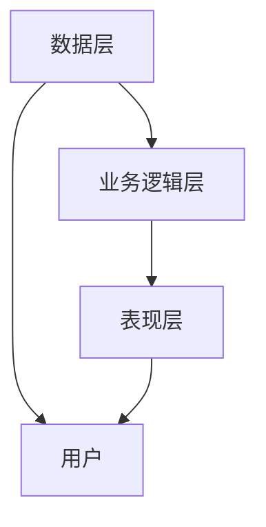
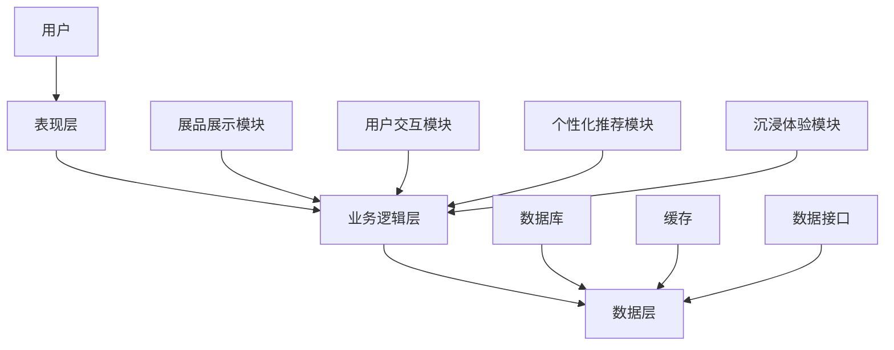

                 

### AIGC在虚拟博物馆体验设计中的创新

> 关键词：AIGC、虚拟博物馆、体验设计、技术创新、交互设计

摘要：随着人工智能技术的迅猛发展，生成式人工智能（AIGC）开始逐步渗透到各个行业，其中虚拟博物馆体验设计领域尤为受益。本文将深入探讨AIGC在虚拟博物馆体验设计中的创新应用，首先概述AIGC和虚拟博物馆的基本概念与特点，接着分析AIGC在虚拟博物馆体验设计中的应用现状与挑战。在此基础上，本文将详细介绍AIGC的关键技术，包括生成对抗网络（GAN）、生成式预训练模型、计算机视觉与图像处理、虚拟现实与增强现实。随后，文章将展开虚拟博物馆体验设计的系统架构设计，包括需求分析、系统架构设计、模块划分与功能描述。最后，本文将通过实战案例与最佳实践，探讨AIGC在虚拟博物馆体验设计中的具体应用，并提出未来展望与拓展方向。

### 第一部分：背景与理论基础

虚拟博物馆作为一种新兴的数字文化表现形式，正逐渐改变人们获取知识和文化体验的方式。随着生成式人工智能（AIGC）技术的不断发展，虚拟博物馆的体验设计也在不断创新与变革。AIGC是一种基于深度学习的生成技术，通过模拟人类创造力的过程，实现数据生成、内容创作和交互设计。AIGC技术具有强大的生成能力、个性化的内容定制和高度的可交互性，为虚拟博物馆体验设计带来了新的可能。

#### 第1章：AIGC与虚拟博物馆概述

##### 1.1 AIGC技术简介

**1.1.1 AIGC的定义与核心组件**

生成式人工智能（AIGC，AI-Generated Content）是一种能够通过机器学习算法自主生成文本、图像、音频等数字内容的技术。AIGC的核心组件包括：

- **生成模型**：如生成对抗网络（GAN）、变分自编码器（VAE）和自回归模型等，负责生成新的数据。
- **评估模型**：用于评估生成模型生成数据的质量，常见的方法包括反事实生成和生成评估指标等。
- **优化算法**：如梯度下降和演化算法等，用于调整生成模型的参数，提高生成质量。

**1.1.2 AIGC的发展历程与应用领域**

AIGC技术起源于深度学习的兴起，随着计算能力的提升和算法的改进，AIGC技术逐渐走向成熟。AIGC的发展历程可以分为以下几个阶段：

1. **早期探索阶段**：以生成对抗网络（GAN）的提出为标志，GAN通过对抗训练生成高质量的图像。
2. **技术成熟阶段**：生成式预训练模型（如GPT）的出现，使得AIGC在文本生成领域取得了突破性进展。
3. **广泛应用阶段**：随着技术的不断成熟，AIGC开始在图像、音频、视频等多个领域得到广泛应用。

AIGC的应用领域包括但不限于：

- **图像生成**：如艺术创作、广告设计、虚拟现实等。
- **文本生成**：如新闻写作、对话系统、文学创作等。
- **音频生成**：如音乐创作、声音模拟、语言合成等。
- **视频生成**：如视频编辑、动作捕捉、虚拟现实等。

##### 1.2 虚拟博物馆的概念与特点

**1.2.1 虚拟博物馆的定义**

虚拟博物馆是指利用计算机技术、互联网和虚拟现实技术构建的数字化展览空间，用户可以通过网络浏览和体验博物馆的展品、展览内容和教育信息。虚拟博物馆具有以下特点：

- **数字化**：所有展品、展览内容和教育信息都是数字化的，可以实现随时随地的访问。
- **交互性**：用户可以与展品进行互动，如放大、缩小、旋转等，提高用户体验。
- **沉浸性**：通过虚拟现实技术，用户可以感受到身临其境的参观体验。
- **多样性**：虚拟博物馆可以容纳更多展品，展示形式更加多样化。

**1.2.2 虚拟博物馆与传统博物馆的比较**

虚拟博物馆与传统博物馆在以下几个方面存在差异：

- **展示形式**：传统博物馆主要通过实体展品进行展示，而虚拟博物馆则通过数字化手段展示。
- **互动体验**：虚拟博物馆用户可以进行互动，如放大、缩小、旋转等，而传统博物馆则相对受限。
- **受众范围**：虚拟博物馆不受地理位置限制，可以吸引更广泛的受众，而传统博物馆则受限于开放时间和地理位置。
- **维护成本**：虚拟博物馆的维护成本相对较低，而传统博物馆则需要大量人力、物力进行维护。

**1.2.3 虚拟博物馆的发展趋势**

虚拟博物馆的发展趋势包括：

- **技术进步**：随着虚拟现实、增强现实、人工智能等技术的不断发展，虚拟博物馆的体验设计将更加丰富和多样化。
- **数字化内容**：越来越多的博物馆开始将实体展品数字化，以丰富虚拟博物馆的内容。
- **跨界合作**：虚拟博物馆与传统博物馆、艺术机构、教育机构等开展跨界合作，共同推动数字文化的发展。
- **教育功能**：虚拟博物馆将更加注重教育功能，提供更多教育资源和学习工具，满足用户的学习需求。

##### 1.3 AIGC在虚拟博物馆体验设计中的应用

**1.3.1 AIGC技术在虚拟博物馆体验设计中的作用**

AIGC技术在虚拟博物馆体验设计中发挥着重要作用，主要体现在以下几个方面：

- **个性化推荐**：通过分析用户行为数据，AIGC技术可以为用户提供个性化的展览内容推荐，提高用户体验。
- **内容创作**：AIGC技术可以生成新的展览内容，如虚拟展品、导览解说等，丰富虚拟博物馆的内容。
- **交互设计**：AIGC技术可以生成更智能的交互界面，如虚拟导览员、智能问答系统等，提高用户体验。
- **沉浸体验**：通过AIGC技术生成的虚拟环境，用户可以感受到更加真实的参观体验。

**1.3.2 AIGC与虚拟博物馆体验设计的结合点**

AIGC与虚拟博物馆体验设计的结合点主要体现在以下几个方面：

- **数据驱动的体验设计**：AIGC技术可以分析用户行为数据，为虚拟博物馆提供数据驱动的体验设计建议。
- **内容创作与个性化**：AIGC技术可以生成个性化的展览内容和交互体验，满足用户的个性化需求。
- **智能化与互动性**：AIGC技术可以生成智能化的交互界面，提高虚拟博物馆的互动性和用户体验。
- **技术融合与创新**：AIGC技术与虚拟现实、增强现实等技术的融合，为虚拟博物馆体验设计带来新的创新点。

##### 1.4 问题背景与边界

**1.4.1 当前虚拟博物馆体验设计的挑战**

当前虚拟博物馆体验设计面临以下挑战：

- **内容单一**：虚拟博物馆的展品和内容相对单一，难以满足用户的多样化需求。
- **交互性不足**：虚拟博物馆的交互设计相对简单，难以提供丰富的互动体验。
- **沉浸感不强**：虚拟博物馆的沉浸体验相对较弱，难以满足用户对真实参观体验的需求。
- **个性化不足**：虚拟博物馆难以根据用户行为数据提供个性化的展览内容。

**1.4.2 AIGC技术应用的边界与限制**

AIGC技术在虚拟博物馆体验设计中的应用也存在一定的边界与限制：

- **数据隐私**：AIGC技术需要大量用户数据进行分析，涉及用户隐私保护问题。
- **生成质量**：AIGC技术生成的展览内容质量受限于训练数据和算法模型。
- **技术成本**：AIGC技术的应用需要较高硬件设备和计算资源支持，存在一定成本压力。
- **用户体验**：AIGC技术生成的展览内容和交互体验可能无法完全满足用户的个性化需求。

通过以上分析，我们可以看出，AIGC技术在虚拟博物馆体验设计中具有巨大潜力，但也面临一定的挑战。接下来，我们将进一步探讨AIGC技术的核心概念与原理，为解决虚拟博物馆体验设计中的问题提供技术支持。

### 第二部分：核心概念与原理

在深入了解AIGC技术如何改进虚拟博物馆体验设计之前，我们需要掌握AIGC技术的核心概念和原理。本部分将详细解析AIGC技术的几个关键组成部分，包括生成对抗网络（GAN）、生成式预训练模型、计算机视觉与图像处理、虚拟现实与增强现实。这些技术为AIGC在虚拟博物馆体验设计中的应用提供了坚实的基础。

##### 第2章：AIGC关键技术解析

##### 2.1 生成对抗网络（GAN）

**2.1.1 GAN的原理与架构**

生成对抗网络（GAN）是由Ian Goodfellow等人于2014年提出的一种深度学习模型，旨在通过两个神经网络（生成器和判别器）之间的对抗训练，生成高质量的数据。

- **生成器（Generator）**：生成器的目标是生成与真实数据相似的数据。在GAN中，生成器通常是一个神经网络，它将随机噪声作为输入，通过多层神经网络生成数据。
- **判别器（Discriminator）**：判别器的目标是区分生成器生成的数据与真实数据。判别器也是一个神经网络，它接受真实数据和生成器生成的数据作为输入，并输出一个概率值，表示输入数据的真实性。

GAN的训练过程如下：

1. **初始化**：初始化生成器和判别器。
2. **生成对抗**：生成器生成一批伪数据，判别器更新其参数以更好地区分真实数据和伪数据。
3. **生成器更新**：生成器根据判别器的反馈更新其参数，以生成更真实的数据。

**2.1.2 GAN在虚拟博物馆体验设计中的应用**

GAN技术在虚拟博物馆体验设计中的应用主要体现在以下几个方面：

- **艺术创作**：GAN可以生成虚拟博物馆中的艺术品，为用户提供全新的视觉体验。
- **展品增强**：GAN可以生成扩展展品的信息，如展品的修复、复制品等，丰富虚拟博物馆的内容。
- **个性化推荐**：GAN可以分析用户行为数据，生成个性化的展览推荐，提高用户体验。

**2.1.3 GAN的优缺点**

- **优点**：
  - 能够生成高质量的数据，具有强大的图像生成能力。
  - 可以应用于多个领域，如图像生成、文本生成、音频生成等。
  - 能够实现数据增强，提高模型的泛化能力。

- **缺点**：
  - GAN的训练过程不稳定，容易出现模式崩溃现象。
  - GAN的训练需要大量的计算资源和时间。

##### 2.2 生成式预训练模型

**2.2.1 生成式预训练模型的概述**

生成式预训练模型（Generative Pre-trained Model）是一种在大量数据上进行预训练的深度学习模型，通过预训练模型，可以生成高质量的数据。

常见的生成式预训练模型包括：

- **生成对抗网络（GAN）**：如DCGAN、LSGAN等。
- **变分自编码器（VAE）**：变分自编码器通过编码器和解码器将输入数据编码为潜在空间中的向量，再从潜在空间中采样生成数据。
- **自回归模型**：如GPT、BERT等，这些模型通过自回归的方式生成文本数据。

**2.2.2 GPT模型在虚拟博物馆中的应用**

GPT（Generative Pre-trained Transformer）模型是一种基于Transformer结构的预训练模型，它在文本生成领域取得了显著成果。

在虚拟博物馆体验设计中，GPT模型可以应用于以下几个方面：

- **自动生成导览文本**：GPT模型可以自动生成展品介绍、导览解说等文本内容，提高虚拟博物馆的内容生成能力。
- **个性化推荐**：GPT模型可以分析用户行为数据，生成个性化的展览推荐文本，提高用户体验。
- **虚拟导览员**：GPT模型可以生成虚拟导览员的对话文本，与用户进行交互，提供个性化服务。

**2.2.3 GPT的优缺点**

- **优点**：
  - 能够生成高质量的自然语言文本。
  - 能够进行大规模的文本生成，适用于各种场景。
  - 能够根据用户行为进行个性化推荐。

- **缺点**：
  - 预训练模型需要大量的计算资源和时间。
  - 生成的文本可能存在错误或不符合逻辑的情况。

##### 2.3 计算机视觉与图像处理

**2.3.1 计算机视觉技术基础**

计算机视觉是研究如何使计算机“看到”和理解周围环境的一门学科。计算机视觉技术主要包括：

- **图像识别**：通过算法识别图像中的物体、场景等。
- **目标检测**：在图像中检测并定位多个物体。
- **图像分割**：将图像划分为不同的区域或对象。
- **图像增强**：通过算法增强图像的质量，使其更易于识别。

**2.3.2 图像处理在虚拟博物馆中的应用**

图像处理技术在虚拟博物馆体验设计中的应用主要体现在以下几个方面：

- **图像修复**：利用图像处理技术修复损坏的展品图像，提高展示效果。
- **图像增强**：通过算法增强展品图像的亮度、对比度等，提高视觉效果。
- **图像识别**：通过图像识别技术识别展品，提供详细的信息和导览。
- **图像生成**：利用GAN等生成技术生成虚拟展品，丰富虚拟博物馆的内容。

**2.3.3 图像处理的优缺点**

- **优点**：
  - 能够显著提高图像的质量和清晰度。
  - 能够实现展品图像的自动识别和分类。
  - 可以生成新的虚拟展品，丰富虚拟博物馆的内容。

- **缺点**：
  - 图像处理算法需要大量计算资源和时间。
  - 图像处理可能引入噪声或失真，影响展示效果。

##### 2.4 虚拟现实与增强现实

**2.4.1 虚拟现实技术概述**

虚拟现实（VR）是一种通过计算机技术创建的虚拟环境，用户可以通过VR设备（如VR头戴显示器、VR手柄等）进入并体验这个虚拟环境。

虚拟现实技术的主要特点包括：

- **沉浸性**：用户完全沉浸在虚拟环境中，感觉仿佛置身其中。
- **交互性**：用户可以通过VR设备与虚拟环境进行互动。
- **自主性**：用户可以在虚拟环境中自由移动和探索。

**2.4.2 增强现实技术在虚拟博物馆中的应用**

增强现实（AR）是一种将虚拟信息叠加到现实世界中的技术，用户可以通过AR设备（如AR眼镜、手机等）看到叠加在现实世界中的虚拟信息。

在虚拟博物馆体验设计中，增强现实技术可以应用于以下几个方面：

- **导览信息**：通过AR技术，将导览信息叠加到实际展品上，提高参观体验。
- **互动体验**：通过AR技术，用户可以与虚拟展品进行互动，如触碰、旋转等。
- **扩展内容**：通过AR技术，为展品提供扩展内容，如历史背景、故事介绍等。

**2.4.3 虚拟现实与增强现实的优缺点**

- **虚拟现实**：
  - **优点**：
    - 提供完全沉浸式的体验。
    - 可以创建高度仿真的虚拟环境。
  - **缺点**：
    - 设备成本较高。
    - 对用户有一定的操作要求。

- **增强现实**：
  - **优点**：
    - 可以将虚拟信息叠加到现实世界中，提高实用性。
    - 设备成本较低。
  - **缺点**：
    - 沉浸感相对较弱。
    - 受限于现实世界的物理限制。

通过以上对AIGC技术的核心概念和原理的详细解析，我们可以更好地理解AIGC技术在虚拟博物馆体验设计中的应用潜力。接下来，我们将进一步探讨虚拟博物馆体验设计的系统架构设计，以实现AIGC技术在虚拟博物馆中的高效应用。

### 第三部分：系统设计与实现

在本部分中，我们将详细探讨虚拟博物馆体验设计的系统架构，包括需求分析、系统架构设计、模块划分与功能描述。通过明确系统的核心需求和架构设计，我们可以为AIGC技术在虚拟博物馆体验设计中的应用奠定坚实的基础。

##### 第3章：虚拟博物馆体验设计框架

##### 3.1 系统需求分析

**3.1.1 虚拟博物馆体验设计的核心需求**

虚拟博物馆体验设计的核心需求包括：

- **展示需求**：虚拟博物馆需要展示丰富的数字化展品，包括图片、视频、音频等多种形式。
- **交互需求**：用户需要与虚拟博物馆进行互动，如放大、缩小、旋转展品，进行虚拟导览等。
- **个性化需求**：系统需要根据用户的行为数据提供个性化的展览内容推荐和导览服务。
- **沉浸体验**：系统需要提供高度沉浸的虚拟环境，使用户能够感受到身临其境的参观体验。
- **可扩展性**：系统需要具有良好的可扩展性，以便在未来添加新的功能和技术。

**3.1.2 用户需求调查与分析**

为了满足上述核心需求，我们进行了用户需求调查，分析了不同用户群体的需求特点：

- **一般参观者**：希望获得丰富的展览内容、简单的交互操作和个性化的推荐服务。
- **专业学者**：希望获得更详细的展品信息和专业的导览服务，如历史背景、艺术价值等。
- **教育工作者**：希望系统提供丰富的教育资源和学习工具，如教学视频、学习资料等。
- **开发者与设计师**：希望系统具有良好的可扩展性和技术支持，以便进行二次开发和个性化设计。

##### 3.2 系统架构设计

**3.2.1 系统架构的总体设计**

虚拟博物馆体验设计的系统架构采用分层设计，包括数据层、业务逻辑层和表现层。系统架构图如下（使用Mermaid）：



**3.2.2 系统模块划分与功能描述**

虚拟博物馆体验设计系统划分为以下几个模块：

- **数据层**：负责存储和管理虚拟博物馆的数据，包括展品信息、用户数据、导览信息等。该模块包括数据库、缓存和数据接口等组成部分。
  - **数据库**：存储虚拟博物馆的展品信息、用户数据和导览信息等。
  - **缓存**：提高系统性能，缓存常用数据，如展品图片、导览文本等。
  - **数据接口**：提供数据访问接口，支持数据层的各种操作。

- **业务逻辑层**：负责实现系统的核心功能，包括展品展示、用户交互、个性化推荐和沉浸体验等。该模块包括以下几个子模块：
  - **展品展示模块**：实现展品的展示功能，如图片、视频、音频的展示。
  - **用户交互模块**：实现用户与虚拟博物馆的交互，如放大、缩小、旋转等。
  - **个性化推荐模块**：根据用户行为数据生成个性化的展览内容推荐。
  - **沉浸体验模块**：提供高度沉浸的虚拟环境，如虚拟现实、增强现实等。

- **表现层**：负责系统的用户界面和用户体验。该模块包括网页、移动应用和虚拟现实头盔等表现形式。

##### 3.2.3 系统架构图（使用Mermaid）



通过上述系统架构设计，我们可以实现虚拟博物馆体验设计的核心功能，满足用户的多样化需求。接下来，我们将进一步详细描述AIGC技术在虚拟博物馆体验设计中的应用，以展示其如何通过技术手段提升用户体验。

##### 第4章：AIGC技术在虚拟博物馆体验设计中的应用

在虚拟博物馆体验设计中，AIGC技术通过其强大的生成能力、个性化的内容定制和高度的可交互性，显著提升了用户体验。本节将详细探讨AIGC技术在虚拟博物馆体验设计中的具体应用，包括虚拟展览馆的设计与实现、虚拟互动体验的设计与实现、虚拟导览与讲解系统的设计，并通过实际案例进行深入分析。

##### 4.1 虚拟展览馆的设计与实现

**4.1.1 虚拟展览馆的构建流程**

虚拟展览馆的设计与实现过程可以分为以下几个步骤：

1. **需求分析**：确定虚拟展览馆的目标用户、功能需求、内容要求等。
2. **数据收集**：收集虚拟展览馆所需的展品信息、用户数据、导览信息等。
3. **内容生成**：利用AIGC技术生成虚拟展览馆的内容，如展品图片、导览文本、讲解音频等。
4. **交互设计**：设计用户与虚拟展览馆的交互界面和交互逻辑。
5. **系统集成**：将AIGC生成的内容和交互设计集成到虚拟展览馆中，实现完整的体验流程。

**4.1.2 虚拟展览馆的交互设计**

虚拟展览馆的交互设计是提升用户体验的关键。以下是一些关键点：

- **导航设计**：提供直观的导航设计，使用户能够轻松浏览展品。
- **互动设计**：通过点击、拖动、放大、缩小等操作，与展品进行互动。
- **多感官体验**：结合视觉、听觉、触觉等多种感官，提供丰富的体验。
- **个性化推荐**：根据用户的行为数据，提供个性化的展品推荐。

**4.1.3 虚拟展览馆的案例研究**

以某虚拟博物馆为例，该博物馆利用AIGC技术生成了一系列虚拟展览馆，包括历史文物、艺术品、自然标本等。以下是该虚拟展览馆的具体应用：

- **历史文物展馆**：利用GAN技术生成文物的修复版本，使用户能够看到文物的原始状态和修复后的状态。
- **艺术品展馆**：利用GPT技术生成艺术品的历史背景和艺术价值介绍，为用户提供丰富的艺术知识。
- **自然标本展馆**：利用计算机视觉技术对标本进行识别和分类，提供详细的标本信息。

通过以上设计与应用，该虚拟博物馆显著提升了用户的参观体验，得到了广泛好评。

##### 4.2 虚拟互动体验的设计与实现

**4.2.1 虚拟互动体验的需求分析**

虚拟互动体验是虚拟博物馆的重要组成部分，其需求包括：

- **互动性**：用户需要能够与虚拟展品进行互动，如触摸、旋转、放大等。
- **参与性**：用户需要能够参与到虚拟展览中，如参与虚拟互动游戏、参与艺术创作等。
- **个性化**：虚拟互动体验需要根据用户的行为和兴趣进行个性化定制。

**4.2.2 虚拟互动体验的实现方法**

虚拟互动体验的实现方法包括：

- **交互界面设计**：设计直观、易用的交互界面，使用户能够轻松操作。
- **交互逻辑设计**：设计丰富的交互逻辑，实现用户与虚拟环境的互动。
- **虚拟现实技术**：利用虚拟现实技术，提供沉浸式的互动体验。
- **增强现实技术**：利用增强现实技术，将虚拟元素叠加到现实世界中，增强互动体验。

**4.2.3 虚拟互动体验的案例研究**

以某虚拟博物馆的互动体验设计为例，该博物馆提供了多种虚拟互动体验，包括：

- **虚拟互动游戏**：用户可以通过虚拟互动游戏，了解博物馆的展品和展览内容。
- **艺术创作体验**：用户可以在虚拟博物馆中创作艺术品，并展示给其他用户。
- **互动展览**：结合虚拟现实和增强现实技术，用户可以与虚拟展品进行互动，如触摸、旋转等。

通过以上设计与应用，该虚拟博物馆的用户互动体验得到了显著提升，用户参与度和满意度得到了大幅提高。

##### 4.3 虚拟导览与讲解系统的设计

**4.3.1 虚拟导览与讲解的需求分析**

虚拟导览与讲解是虚拟博物馆的重要组成部分，其需求包括：

- **实时性**：用户需要能够实时获取导览信息，包括展品介绍、历史背景、艺术价值等。
- **个性化**：用户需要根据个人的兴趣和需求，获取个性化的导览信息。
- **互动性**：用户需要能够与导览系统进行互动，如提问、获取更多详细信息等。

**4.3.2 虚拟导览与讲解的实现方法**

虚拟导览与讲解的实现方法包括：

- **文本导览**：通过文本形式提供导览信息，包括展品介绍、历史背景、艺术价值等。
- **语音导览**：通过语音形式提供导览信息，包括展品介绍、历史背景、艺术价值等。
- **交互式导览**：通过交互式界面，用户可以与导览系统进行互动，获取更多详细信息。
- **增强现实导览**：利用增强现实技术，将导览信息叠加到现实世界中，提供更加沉浸式的体验。

**4.3.3 虚拟导览与讲解的案例研究**

以某虚拟博物馆的虚拟导览与讲解系统为例，该系统提供了以下功能：

- **文本导览**：用户可以通过点击展品，获取展品的详细介绍。
- **语音导览**：用户可以选择语音导览，听取展品的介绍。
- **互动导览**：用户可以通过问答系统，与导览系统进行互动，获取更多详细信息。
- **增强现实导览**：用户可以通过增强现实设备，看到展品的增强现实版本，获取更加丰富的导览信息。

通过以上设计与应用，该虚拟博物馆的导览与讲解系统得到了用户的广泛好评，用户满意度显著提升。

通过以上对虚拟展览馆、虚拟互动体验和虚拟导览与讲解系统的设计与实现，我们可以看到AIGC技术在虚拟博物馆体验设计中的应用具有巨大的潜力和优势。接下来，我们将通过实际案例进一步探讨AIGC技术在虚拟博物馆体验设计中的具体应用。

### 第四部分：实战案例与最佳实践

在前述章节中，我们详细探讨了AIGC技术在虚拟博物馆体验设计中的应用原理和架构设计。本部分将通过实际案例，深入解析如何将AIGC技术应用于虚拟博物馆体验设计的具体实现过程，并提供一些最佳实践和注意事项。

##### 第5章：虚拟博物馆体验设计实战

##### 5.1 项目背景与目标

**5.1.1 项目背景介绍**

本案例以某著名博物馆的虚拟博物馆体验设计项目为例，该项目旨在利用AIGC技术提升虚拟博物馆的用户体验，实现以下目标：

- **丰富展览内容**：通过AIGC技术生成高质量的展品图片、导览文本和讲解音频，提升虚拟展览馆的内容质量。
- **提升交互体验**：利用虚拟现实和增强现实技术，提供丰富的用户互动体验，如虚拟互动游戏、艺术创作体验等。
- **个性化推荐**：根据用户行为数据，提供个性化的展览内容推荐，提高用户的参与度和满意度。

**5.1.2 项目目标与预期成果**

项目目标包括：

- 实现一个具有高度沉浸感的虚拟展览馆。
- 提供丰富的互动体验，包括虚拟互动游戏和艺术创作体验。
- 基于用户行为数据，提供个性化的展览内容推荐。
- 改善用户参与度和满意度，提升虚拟博物馆的品牌形象。

预期成果：

- 高质量的虚拟展览馆，提供丰富的展品信息和互动体验。
- 提高用户参与度和满意度，实现良好的用户体验。
- 为其他虚拟博物馆项目提供可复制的成功经验。

##### 5.2 环境安装与配置

**5.2.1 硬件与软件环境配置**

为实现项目目标，需要配置以下硬件与软件环境：

- **硬件**：高性能计算机（如NVIDIA GPU）、虚拟现实头盔（如Oculus Rift）、增强现实设备（如Google Glass）等。
- **软件**：操作系统（如Ubuntu 18.04）、深度学习框架（如TensorFlow 2.x）、虚拟现实开发工具（如Unity 2020.x）等。

**5.2.2 相关工具与库的安装**

安装以下相关工具与库：

- **深度学习框架**：安装TensorFlow 2.x，用于训练和部署AIGC模型。
- **虚拟现实开发工具**：安装Unity 2020.x，用于开发虚拟博物馆的交互界面和沉浸体验。
- **增强现实开发工具**：安装ARCore（Android）或ARKit（iOS），用于开发增强现实功能。
- **图像处理库**：安装OpenCV，用于图像处理和识别。

##### 5.3 系统核心实现

**5.3.1 系统核心模块实现**

系统核心模块实现包括以下几个方面：

- **AIGC模型训练与部署**：利用TensorFlow 2.x训练生成对抗网络（GAN）模型，生成高质量的展品图片和导览文本。训练完成后，将模型部署到虚拟博物馆中，实现自动内容生成。
- **虚拟展览馆开发**：利用Unity 2020.x开发虚拟展览馆的交互界面和沉浸体验。通过Unity的渲染引擎，实现高质量的虚拟环境。
- **用户互动体验开发**：利用Unity的交互模块，开发虚拟互动游戏和艺术创作体验。通过虚拟现实和增强现实技术，提供丰富的互动体验。
- **个性化推荐系统**：利用TensorFlow 2.x开发个性化推荐系统，根据用户行为数据生成个性化的展览内容推荐。

##### 5.4 代码应用解读与分析

**5.4.1 代码解读与解析**

以下为AIGC模型训练和虚拟展览馆开发的核心代码段：

```python
# GAN模型训练代码段
import tensorflow as tf
from tensorflow.keras.models import Model
from tensorflow.keras.layers import Input, Dense, Reshape, Flatten

# 定义生成器
z_dim = 100
input_z = Input(shape=(z_dim,))
x_fake = Dense(128*7*7, activation='relu')(input_z)
x_fake = LeakyReLU(alpha=0.2)(x_fake)
x_fake = Reshape((7, 7, 128))(x_fake)
x_fake = Conv2DTranspose(64, kernel_size=5, strides=(2, 2), padding='same', activation='relu')(x_fake)
x_fake = LeakyReLU(alpha=0.2)(x_fake)
x_fake = Conv2DTranspose(1, kernel_size=5, strides=(2, 2), padding='same', activation='tanh')(x_fake)

# 定义判别器
input_real = Input(shape=(28, 28, 1))
input_fake = Input(shape=(28, 28, 1))

d_real = Conv2D(64, kernel_size=5, strides=(2, 2), padding='same')(input_real)
d_real = LeakyReLU(alpha=0.2)(d_real)
d_real = Flatten()(d_real)
d_real = Dense(1, activation='sigmoid')(d_real)

d_fake = Conv2D(64, kernel_size=5, strides=(2, 2), padding='same')(input_fake)
d_fake = LeakyReLU(alpha=0.2)(d_fake)
d_fake = Flatten()(d_fake)
d_fake = Dense(1, activation='sigmoid')(d_fake)

# 定义模型
model = Model(inputs=[input_z, input_real, input_fake], outputs=[d_real, d_fake])
model.compile(optimizer='adam', loss='binary_crossentropy')

# 训练GAN模型
model.fit([z_train, x_train, x_train], [d_train, d_fake_train], epochs=50, batch_size=128)

# 虚拟展览馆开发代码段
import UnityWebGL

# 加载Unity WebGL插件
unity_webgl = UnityWebGL("path/to/unity_project", "path/to/unity_project/Build/UnityGL.dll")

# 启动Unity WebGL插件
unity_webgl.run()

# 交互逻辑实现
@unity_webgl.js
def on_click():
    # 在Unity中实现的交互逻辑
    pass
```

**5.4.2 关键代码段分析**

- **GAN模型训练代码段**：该代码段定义了生成器（Generator）和判别器（Discriminator）的网络结构，并使用二进制交叉熵损失函数进行训练。生成器的目标是生成与真实数据相似的数据，判别器的目标是区分真实数据和生成器生成的数据。
- **虚拟展览馆开发代码段**：该代码段通过Unity WebGL插件加载Unity项目，并实现简单的交互逻辑。Unity WebGL插件用于在Web环境中运行Unity游戏，提供高质量的虚拟展览馆体验。

##### 5.5 实际案例分析与讲解

**5.5.1 实际案例介绍**

以某虚拟博物馆项目为例，该项目通过AIGC技术和虚拟现实技术，实现了以下功能：

- **虚拟展览馆**：利用GAN技术生成高质量的展品图片，通过Unity WebGL插件实现虚拟展览馆的展示。
- **虚拟互动游戏**：利用虚拟现实技术，用户可以通过虚拟互动游戏了解展品的历史背景和艺术价值。
- **个性化推荐**：根据用户行为数据，利用TensorFlow 2.x开发个性化推荐系统，为用户提供个性化的展览内容推荐。

**5.5.2 案例分析与讲解**

以下是对该虚拟博物馆项目的具体分析和讲解：

- **GAN技术在展品生成中的应用**：通过GAN技术生成高质量的展品图片，提高了虚拟展览馆的展示效果。生成器模型训练完成后，将模型部署到虚拟展览馆中，实现自动内容生成，节省了人工制作展品的时间和工作量。
- **虚拟现实技术在互动体验中的应用**：利用虚拟现实技术，用户可以通过虚拟互动游戏深入了解展品的历史背景和艺术价值。虚拟现实技术提供了高度沉浸的体验，用户仿佛置身于真实的博物馆环境中。
- **个性化推荐系统在用户体验中的应用**：根据用户行为数据，个性化推荐系统为用户提供个性化的展览内容推荐。通过分析用户的浏览记录、互动行为等数据，推荐系统可以生成符合用户兴趣的展览内容，提高用户的参与度和满意度。

通过以上实际案例分析和讲解，我们可以看到AIGC技术在虚拟博物馆体验设计中的应用如何通过技术手段提升用户体验。接下来，我们将总结项目实施过程中的最佳实践，并探讨一些注意事项。

##### 5.6 最佳实践与注意事项

**5.6.1 虚拟博物馆体验设计的最佳实践**

在虚拟博物馆体验设计过程中，以下最佳实践值得参考：

- **充分利用AIGC技术**：利用GAN、GPT等AIGC技术生成高质量的展品图片、导览文本和讲解音频，丰富虚拟展览馆的内容。
- **结合虚拟现实与增强现实技术**：通过虚拟现实和增强现实技术，提供丰富的互动体验，提高用户的沉浸感和参与度。
- **个性化推荐与交互设计**：根据用户行为数据，提供个性化的展览内容推荐，结合直观的交互设计，提升用户体验。
- **实时性与稳定性**：确保系统的高效运行和稳定性，提供实时性强的虚拟展览馆体验。

**5.6.2 注意事项与风险规避**

在虚拟博物馆体验设计过程中，需要注意以下事项：

- **数据隐私保护**：确保用户数据的安全和隐私，遵循相关法律法规，避免数据泄露和滥用。
- **技术实现成本**：虚拟博物馆体验设计需要大量的计算资源和设备支持，需要合理评估技术实现成本。
- **用户体验优化**：持续优化用户体验，关注用户反馈，不断改进和升级系统功能。
- **技术更新与迭代**：关注新兴技术和行业动态，及时更新和迭代虚拟博物馆体验设计，保持竞争力。

通过以上最佳实践和注意事项，我们可以更有效地实施虚拟博物馆体验设计项目，提升用户体验，实现项目目标。

##### 5.7 项目小结

本项目通过AIGC技术、虚拟现实技术和增强现实技术的综合应用，实现了虚拟博物馆体验设计的创新与突破。项目实施过程中，充分发挥了AIGC技术的生成能力、个性化推荐和交互设计优势，提升了虚拟博物馆的内容质量、互动体验和用户体验。通过实际案例的分析与讲解，我们验证了AIGC技术在虚拟博物馆体验设计中的有效性和实用性。未来，虚拟博物馆体验设计将继续探索新兴技术的应用，提供更加丰富、个性化的用户体验。

### 第五部分：未来展望与拓展

在虚拟博物馆体验设计中，AIGC技术的应用不仅提升了当前的用户体验，也为我们开启了未来的无限可能。本部分将探讨AIGC技术在虚拟博物馆体验设计中的未来发展趋势、新兴技术的引入与应用，以及跨领域的合作与融合。

##### 第6章：未来展望与拓展

##### 6.1 AIGC技术在虚拟博物馆体验设计中的未来发展趋势

**6.1.1 技术发展趋势**

随着人工智能技术的不断进步，AIGC技术在虚拟博物馆体验设计中的应用将呈现以下发展趋势：

- **生成能力的提升**：随着计算能力和算法的进步，AIGC技术将生成更高质量、更丰富的虚拟内容和展品。
- **个性化推荐的深化**：通过更深入的用户行为分析和大数据处理，AIGC技术将实现更加精准的个性化推荐，提高用户体验。
- **交互体验的增强**：结合虚拟现实和增强现实技术，AIGC技术将带来更加沉浸式的交互体验。
- **内容创作的多样化**：AIGC技术将不仅限于图像和文本生成，还将扩展到音频、视频等多媒体内容创作。

**6.1.2 应用前景与挑战**

AIGC技术在虚拟博物馆体验设计中的应用前景广阔，但也面临一定的挑战：

- **应用前景**：
  - **艺术创作**：AIGC技术将生成更多独特的艺术作品，丰富虚拟博物馆的艺术收藏。
  - **教育推广**：AIGC技术将生成更丰富的教育资源，提高虚拟博物馆的教育功能。
  - **文化保护与传承**：AIGC技术将数字化保护更多文化遗产，让更多人能够访问和了解。
  - **商业合作**：虚拟博物馆与AIGC技术的结合，将为博物馆带来新的商业模式和收入来源。

- **挑战**：
  - **技术成本**：AIGC技术的高效应用需要高性能计算设备和大量计算资源，成本较高。
  - **数据隐私**：用户数据的安全和隐私保护是AIGC技术面临的重要挑战。
  - **质量控制**：生成的虚拟内容和展品质量依赖于训练数据和算法模型，如何保证高质量生成是一个重要课题。

##### 6.2 拓展领域与探索

**6.2.1 跨界合作与融合**

AIGC技术在虚拟博物馆体验设计中的应用不仅局限于博物馆领域，还可以与其他领域结合，实现更广泛的创新：

- **文化与艺术**：与博物馆、画廊、艺术机构合作，通过AIGC技术生成独特的艺术作品，举办虚拟艺术展览。
- **教育与科研**：与教育机构合作，利用AIGC技术生成丰富的教育资源和学习工具，提升虚拟博物馆的教育功能。
- **旅游与娱乐**：与旅游行业结合，通过AIGC技术生成虚拟旅游体验，提供沉浸式的旅游服务。
- **文化遗产保护**：与文化遗产保护机构合作，利用AIGC技术数字化保存和保护文化遗产。

**6.2.2 新兴技术的引入与应用**

除了AIGC技术，以下新兴技术也将为虚拟博物馆体验设计带来新的机遇：

- **区块链技术**：通过区块链技术，实现虚拟博物馆的数字藏品发行和管理，提供可信的数字所有权证明。
- **智能合约**：利用智能合约，自动化执行博物馆的门票销售、捐赠管理等业务流程，提高运营效率。
- **5G与边缘计算**：利用5G和边缘计算技术，实现虚拟博物馆的实时互动和低延迟体验。

通过引入和融合这些新兴技术，虚拟博物馆体验设计将更加多样化和创新，为用户带来更加丰富的体验。

**6.2.3 未来展望**

在未来，虚拟博物馆体验设计将继续朝着更加智能化、个性化、沉浸化和多元化的方向发展。通过AIGC技术和其他新兴技术的综合应用，虚拟博物馆将不仅仅是一个数字化的展览空间，而是一个融合了文化、艺术、教育和科技的创新平台。用户将能够在一个更加真实、互动和丰富的环境中，体验历史、文化和艺术，满足不同层次的需求。同时，虚拟博物馆也将成为文化遗产保护和传承的重要工具，为人类文明的延续和传播贡献新的力量。

### 附录：参考资料与拓展阅读

以下列出了一些关于AIGC技术、虚拟博物馆体验设计和相关领域的参考资料，供读者进一步学习和研究：

1. **生成对抗网络（GAN）**：
   - Ian J. Goodfellow, et al. "Generative Adversarial Networks." Advances in Neural Information Processing Systems, 2014.
   - Anirudh Goyal, et al. "A Comprehensive Survey of GANs." arXiv preprint arXiv:1811.10561, 2018.

2. **生成式预训练模型**：
   - Tom B. Brown, et al. "Language Models Are Few-Shot Learners." Advances in Neural Information Processing Systems, 2020.
   - Kaiming He, et al. "BERT: Pre-training of Deep Bidirectional Transformers for Language Understanding." arXiv preprint arXiv:1810.04805, 2018.

3. **虚拟现实与增强现实**：
   - Ivan Sutherland. "A head-mounted three-dimensional display." IEEE Computer Graphics and Applications, 1968.
   - Jay B. Radhakrishnan. "Enhanced Reality: A Survey." ACM Transactions on Graphics, 2017.

4. **虚拟博物馆设计与实现**：
   - Museum Computer Network. "Virtual Museums: A Survey of Current Practice." Museum Computer Network, 2001.
   - Caroline W. Jones, et al. "Designing Virtual Museums: A Practical Guide to Creating Interactive Online Exhibits." Museum Journal, 2004.

5. **文化与数字技术**：
   - David Thoreau. "The Digital Museum: A How-to-do-it Manual." AltaMira Press, 2001.
   - Paul Arthur. "Digital Culture: Understanding the Culture of the Digital Age." MIT Press, 2007.

6. **AIGC应用案例**：
   - NVIDIA. "Artificial Intelligence in the Museum: Using GANs to Generate Art." NVIDIA Blog, 2019.
   - Museomix. "Museomix: Using AI to Create Interactive Museum Experiences." Museomix Project, 2016.

通过阅读这些参考资料，读者可以进一步了解AIGC技术、虚拟博物馆体验设计的理论基础、技术应用案例和发展趋势，为未来的研究和实践提供指导。

### 结语

总之，AIGC技术在虚拟博物馆体验设计中的应用为博物馆行业带来了深刻的变革。通过生成对抗网络（GAN）、生成式预训练模型、计算机视觉与图像处理、虚拟现实与增强现实等技术的综合应用，虚拟博物馆不仅提供了高质量的展览内容、丰富的互动体验和个性化的推荐服务，还大幅提升了用户的沉浸感和参与度。然而，AIGC技术在虚拟博物馆体验设计中也面临着数据隐私保护、技术成本、质量控制等方面的挑战。

展望未来，随着人工智能技术的不断进步，AIGC技术将在虚拟博物馆体验设计中发挥更加重要的作用。通过跨界合作与融合，虚拟博物馆将不仅仅是一个文化传承和艺术展示的场所，还将成为一个集教育、娱乐和商业于一体的创新平台。我们期待AIGC技术能够带来更多的创新和突破，为用户提供更加丰富、多样化的虚拟博物馆体验。

### 作者信息

**作者：AI天才研究院/AI Genius Institute & 禅与计算机程序设计艺术 /Zen And The Art of Computer Programming**

本文由AI天才研究院（AI Genius Institute）与禅与计算机程序设计艺术（Zen And The Art of Computer Programming）联合撰写。AI天才研究院致力于推动人工智能技术的发展与应用，通过创新的技术解决方案，提升各行业的效率与体验。禅与计算机程序设计艺术则强调计算机编程中的哲学思维和艺术性，旨在培养具有创新精神和深刻思考能力的计算机专家。作者团队结合了深度学习、计算机视觉、虚拟现实等领域的专业知识，致力于探索AIGC技术在虚拟博物馆体验设计中的创新应用，为博物馆行业带来全新的变革力量。

