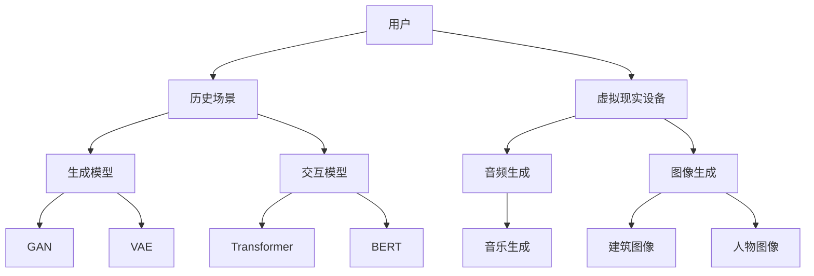
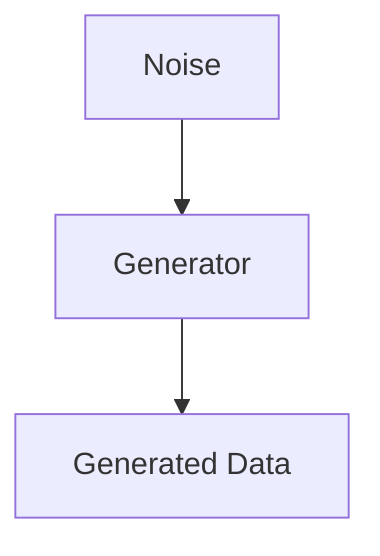
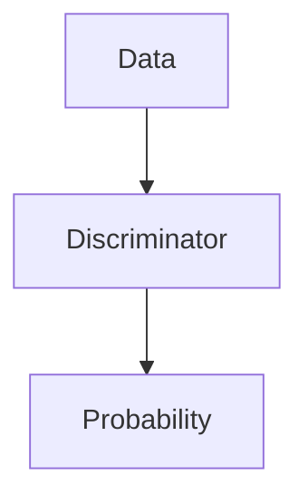
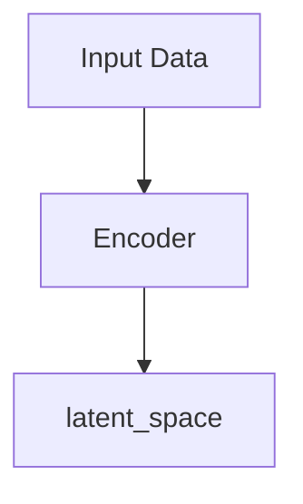
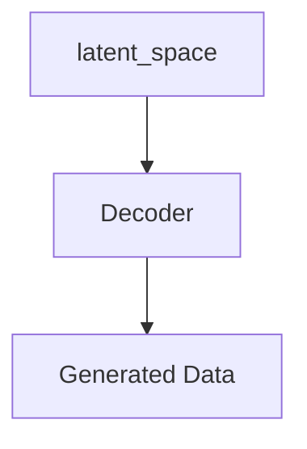
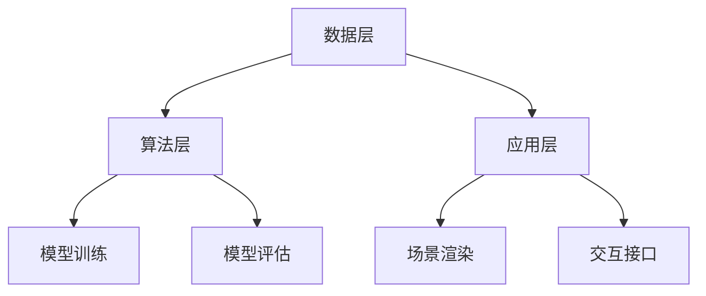
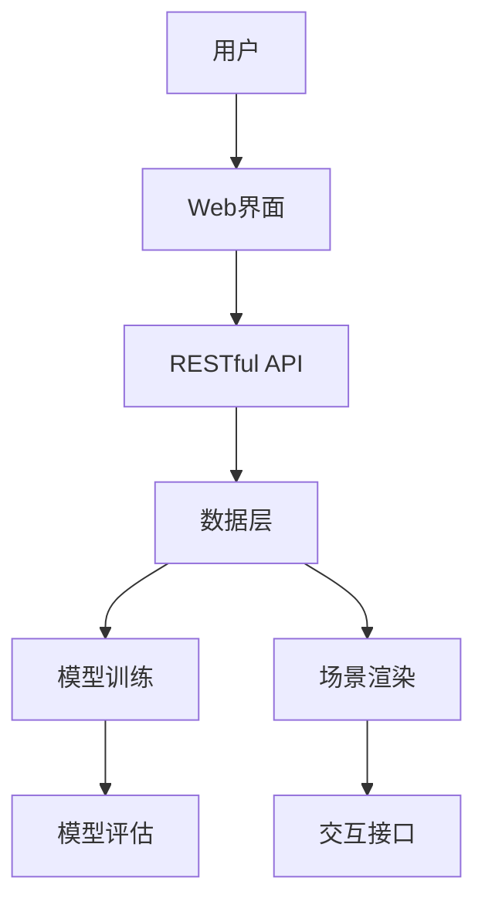

                 

### AIGC在虚拟历史场景重建中的创新实践

#### 问题背景

随着人工智能技术的飞速发展，AI生成内容（AIGC）技术逐渐成为构建虚拟历史场景的重要工具。虚拟历史场景重建是一个复杂且富有挑战的任务，它需要通过计算机技术模拟和重现历史上的特定时期或事件。这不仅包括建筑、人物、景观等视觉元素的构建，还涉及历史背景、文化习俗、语言表达等多方面的综合体现。AIGC技术的引入，为这一领域带来了前所未有的创新和变革。

在过去的虚拟历史场景重建中，通常依赖于大量的手工制作和资源采集。这种方法不仅费时费力，而且难以保证场景的真实性和细节的丰富性。而AIGC技术通过深度学习、自然语言处理和计算机图形学等先进算法，能够自动生成高度逼真的历史场景，从而极大地提高了重建的效率和效果。

#### 问题解决

《AIGC在虚拟历史场景重建中的创新实践》旨在探讨如何利用AIGC技术解决虚拟历史场景重建中的关键问题。本书将从以下几个方面进行深入探讨：

1. **AIGC技术的核心概念**：介绍AIGC技术的定义、发展历程和应用场景，帮助读者了解AIGC技术的基本原理和实现方法。

2. **AIGC技术在虚拟历史场景重建中的应用**：分析AIGC技术在虚拟历史场景重建中的具体应用，包括图像生成、文本生成、音频生成等，展示AIGC技术在提升虚拟历史场景逼真度和交互性方面的优势。

3. **AIGC技术在虚拟历史场景重建中的实际案例**：通过具体的案例研究，详细探讨AIGC技术在虚拟历史场景重建中的实际应用效果，为读者提供实际的参考和借鉴。

4. **AIGC技术在虚拟历史场景重建中的挑战与展望**：探讨AIGC技术在虚拟历史场景重建中面临的挑战，如数据质量、算法优化、场景真实度等，并对未来AIGC技术在虚拟历史场景重建中的应用前景进行展望。

#### 边界与外延

AIGC技术不仅限于虚拟历史场景重建，还广泛应用于其他虚拟现实领域，如游戏设计、虚拟旅游等。本书将重点关注AIGC技术在虚拟历史场景重建中的应用，但也会涉及一些相关领域的基本概念和技术。

#### 核心概念

- **AIGC（AI-Generated Content）**：指利用人工智能技术自动生成内容，包括文本、图像、音频等多种形式。
- **虚拟历史场景**：通过计算机技术构建的，模拟真实历史时期的场景，包括建筑、人物、景观等。
- **重建**：指利用现有数据和算法，重现历史场景的过程。

### 核心概念与联系

#### AIGC的核心概念

AIGC（AI-Generated Content，AI生成内容）技术是指利用人工智能算法自动生成各种类型的内容，包括文本、图像、音频和视频等。AIGC技术主要包括以下几个核心组成部分：

1. **生成对抗网络（GAN）**：GAN是一种通过生成器和判别器相互对抗来生成逼真数据的深度学习模型。生成器试图生成与真实数据难以区分的伪造数据，而判别器则努力区分真实数据和伪造数据。通过这种对抗训练，生成器的生成能力逐渐提高，最终能够生成高质量的数据。

2. **变分自编码器（VAE）**：VAE是一种基于概率模型的生成模型，通过编码器和解码器将输入数据映射到一个低维的潜在空间，并在潜在空间中进行数据生成。VAE能够生成多样化的数据样本，并保持数据的保真性。

3. **自回归模型**：自回归模型是一种用于生成文本序列的深度学习模型，如Transformer和BERT。这些模型通过自回归的方式预测序列中的下一个元素，从而生成连贯的文本。

#### AIGC的应用场景

AIGC技术在虚拟历史场景重建中的应用主要包括以下场景：

1. **图像生成**：利用GAN和VAE等技术生成历史建筑、人物和景观的图像，提高场景的真实度和细节丰富度。

2. **文本生成**：利用自回归模型生成历史场景的描述文本和人物对话，增强虚拟场景的叙事性和交互性。

3. **音频生成**：利用生成模型生成历史时期的音乐和声音效果，提升虚拟场景的氛围和沉浸感。

4. **虚拟交互**：结合虚拟现实（VR）和增强现实（AR）技术，实现用户与历史场景的互动，提高用户体验。

#### 核心概念属性特征对比表格

| 核心概念 | 特征1 | 特征2 | 特征3 | 特征4 |
| --- | --- | --- | --- | --- |
| 生成对抗网络（GAN） | 对抗训练 | 生成器与判别器博弈 | 图像质量高 | 数据多样性 |
| 变分自编码器（VAE） | 编码与解码 | 数据概率分布学习 | 生成质量好 | 数据保真性 |
| 自回归模型 | 自回归机制 | 文本生成能力 | 生成连贯性 | 生成多样性 |

### ER实体关系图架构的Mermaid流程图



### 算法原理讲解

AIGC技术在虚拟历史场景重建中的应用，依赖于一系列先进的人工智能算法。以下我们将详细介绍其中两种核心算法——生成对抗网络（GAN）和变分自编码器（VAE）的原理。

#### GAN的算法原理

生成对抗网络（GAN）由生成器（Generator）和判别器（Discriminator）组成，通过对抗训练生成高质量的数据。

**生成器（Generator）**：生成器的任务是生成伪造的数据，以欺骗判别器。生成器通常由多层神经网络组成，输入是随机噪声，输出是伪造的数据。以下是一个简单的生成器结构：



**判别器（Discriminator）**：判别器的任务是区分真实数据和伪造数据。判别器也由多层神经网络组成，输入是真实数据或伪造数据，输出是一个概率值，表示输入数据的真实性。以下是一个简单的判别器结构：



**对抗过程**：生成器和判别器之间进行对抗训练。生成器试图生成尽可能逼真的伪造数据，以欺骗判别器，而判别器则努力区分真实数据和伪造数据。这个过程可以通过以下公式表示：

$$
\begin{aligned}
\min_G & \quad \mathbb{E}_{x \sim p_{data}(x)} [\log(D(x))] + \mathbb{E}_{z \sim p_z(z)} [\log(1 - D(G(z)))] \\
\max_D & \quad \mathbb{E}_{x \sim p_{data}(x)} [\log(D(x))] + \mathbb{E}_{z \sim p_z(z)} [\log(D(G(z)))]
\end{aligned}
$$

其中，$G(z)$表示生成器生成的伪造数据，$D(x)$表示判别器对真实数据的判别结果，$D(G(z))$表示判别器对伪造数据的判别结果。

#### VAE的算法原理

变分自编码器（VAE）是一种基于概率模型的生成模型，通过编码器（Encoder）和解码器（Decoder）将输入数据映射到一个低维的潜在空间，并在潜在空间中进行数据生成。

**编码器（Encoder）**：编码器的任务是学习输入数据的概率分布。编码器由多层神经网络组成，输入是原始数据，输出是潜在空间中的一个向量。以下是一个简单的编码器结构：



**解码器（Decoder）**：解码器的任务是生成与输入数据相同的数据。解码器也由多层神经网络组成，输入是潜在空间中的一个向量，输出是生成数据。以下是一个简单的解码器结构：



**潜在空间**：潜在空间是一个低维的连续空间，用于表示输入数据的概率分布。潜在空间中的每个向量都对应一种数据分布。

**数据生成过程**：VAE的数据生成过程如下：

1. 输入数据通过编码器映射到潜在空间中的一个向量。
2. 在潜在空间中随机采样一个向量作为生成数据的起始点。
3. 输入采样向量到解码器，解码器生成新的数据。

这个过程可以通过以下公式表示：

$$
\begin{aligned}
\theta &= \theta_0 + \beta \theta_1 \\
x &= g(z)
\end{aligned}
$$

其中，$\theta$表示模型参数，$g(z)$表示解码器生成的数据，$z$表示潜在空间中的向量。

### 算法应用实例

以下是一个简单的GAN和VAE的应用实例，用于生成虚拟历史场景的图像。

**GAN应用实例**

```python
import tensorflow as tf
from tensorflow.keras import layers

# 生成器模型
def generator_model():
    z = layers.Input(shape=(100,))
    x = layers.Dense(128, activation='relu')(z)
    x = layers.Dense(256, activation='relu')(x)
    x = layers.Dense(512, activation='relu')(x)
    x = layers.Dense(1024, activation='relu')(x)
    x = layers.Dense(28 * 28 * 3, activation='tanh')(x)
    x = layers.Reshape((28, 28, 3))(x)
    model = tf.keras.Model(z, x)
    return model

# 判别器模型
def discriminator_model():
    x = layers.Input(shape=(28, 28, 3))
    x = layers.Conv2D(64, kernel_size=(3, 3), activation='relu')(x)
    x = layers.Conv2D(128, kernel_size=(3, 3), activation='relu')(x)
    x = layers.Flatten()(x)
    x = layers.Dense(1, activation='sigmoid')(x)
    model = tf.keras.Model(x, x)
    return model

# GAN模型
def gan_model(generator, discriminator):
    z = layers.Input(shape=(100,))
    x = generator(z)
    validity = discriminator(x)
    model = tf.keras.Model(z, validity)
    return model

# 模型编译
generator = generator_model()
discriminator = discriminator_model()
gan = gan_model(generator, discriminator)

discriminator.compile(loss='binary_crossentropy', optimizer='adam')
gan.compile(loss='binary_crossentropy', optimizer='adam')

# 训练GAN模型
batch_size = 32
epochs = 10000

for epoch in range(epochs):
    for _ in range(5):
        z = np.random.normal(size=(batch_size, 100))
        x = generator.predict(z)
        d_loss_real = discriminator.train_on_batch(x, np.ones((batch_size, 1)))
        z = np.random.normal(size=(batch_size, 100))
        d_loss_fake = discriminator.train_on_batch(x, np.zeros((batch_size, 1)))

    z = np.random.normal(size=(batch_size, 100))
    g_loss = gan.train_on_batch(z, np.ones((batch_size, 1)))
```

**VAE应用实例**

```python
import tensorflow as tf
from tensorflow.keras import layers
import numpy as np

# 编码器模型
def encoder_model():
    x = layers.Input(shape=(28, 28, 3))
    x = layers.Conv2D(32, kernel_size=(3, 3), activation='relu')(x)
    x = layers.Conv2D(64, kernel_size=(3, 3), activation='relu')(x)
    x = layers.Flatten()(x)
    x = layers.Dense(64, activation='relu')(x)
    z_mean = layers.Dense(20)(x)
    z_log_var = layers.Dense(20)(x)
    z = layers.Lambda(lambda t: t[:, :20] * tf.exp(0.5 * t[:, 20:]))(t)
    model = tf.keras.Model(x, [z_mean, z_log_var, z])
    return model

# 解码器模型
def decoder_model():
    z = layers.Input(shape=(20,))
    x = layers.Dense(64, activation='relu')(z)
    x = layers.Dense(64, activation='relu')(x)
    x = layers.Dense(1024, activation='relu')(x)
    x = layers.Dense(28 * 28 * 3, activation='tanh')(x)
    x = layers.Reshape((28, 28, 3))(x)
    model = tf.keras.Model(z, x)
    return model

# VAE模型
def vae_model(encoder, decoder):
    x = layers.Input(shape=(28, 28, 3))
    z_mean, z_log_var, z = encoder(x)
    x = decoder(z)
    model = tf.keras.Model(x, x)
    return model

# 模型编译
encoder = encoder_model()
decoder = decoder_model()
vae = vae_model(encoder, decoder)

vae.compile(loss='binary_crossentropy', optimizer='adam')

# 训练VAE模型
batch_size = 32
epochs = 10000

for epoch in range(epochs):
    for _ in range(5):
        x = np.random.normal(size=(batch_size, 28, 28, 3))
        z_mean, z_log_var, z = encoder.predict(x)
        x_hat = decoder.predict(z)
        v_loss = vae.train_on_batch(x, x)
```

通过以上实例，我们可以看到GAN和VAE如何应用于虚拟历史场景的图像生成。在实际应用中，我们可以通过训练这些模型，生成出高度逼真的虚拟历史场景图像，从而实现虚拟历史场景重建。

### 系统分析与架构设计方案

#### 问题场景介绍

虚拟历史场景重建是一个复杂的任务，涉及大量的数据处理、模型训练和渲染技术。为了实现高效的虚拟历史场景重建，需要设计一个完整的系统架构，包括数据采集、模型训练、场景渲染等多个模块。

#### 项目介绍

本项目旨在构建一个基于AIGC技术的虚拟历史场景重建系统。该系统将利用深度学习算法生成高度逼真的历史场景，并提供交互式的虚拟体验。系统主要包括以下模块：

1. **数据采集与预处理模块**：负责收集历史场景相关的图像、文本、音频等多媒体数据，并进行预处理，以便于模型训练。
2. **模型训练模块**：负责训练生成对抗网络（GAN）和变分自编码器（VAE）等深度学习模型，以生成高质量的虚拟历史场景。
3. **场景渲染模块**：负责将生成的虚拟历史场景渲染成三维图形，并提供用户交互接口。

#### 系统功能设计

1. **数据采集与预处理模块**：
   - **功能**：从互联网、数据库和其他数据源中收集历史场景相关的多媒体数据。
   - **接口设计**：提供API接口，允许其他系统和服务访问数据。
   - **数据预处理**：对采集到的数据进行清洗、归一化和增强，以适应深度学习模型的训练。

2. **模型训练模块**：
   - **功能**：训练生成对抗网络（GAN）和变分自编码器（VAE）等模型，以生成高质量的虚拟历史场景。
   - **算法选择**：选择合适的算法，如DCGAN、StyleGAN、VAE等，根据场景需求和数据特性进行优化。
   - **训练监控**：监控模型训练过程，包括训练损失、生成图像质量等指标。

3. **场景渲染模块**：
   - **功能**：将生成的虚拟历史场景渲染成三维图形，并提供交互式的虚拟体验。
   - **渲染技术**：采用OpenGL、Unity3D等渲染技术，实现高质量的图形渲染。
   - **交互接口**：提供虚拟现实（VR）和增强现实（AR）接口，支持用户与虚拟场景的互动。

#### 系统架构设计

1. **总体架构**：
   - **数据层**：包括数据采集、存储和管理系统，负责多媒体数据的收集、存储和预处理。
   - **算法层**：包括深度学习模型训练和管理系统，负责训练和优化生成对抗网络（GAN）和变分自编码器（VAE）等模型。
   - **应用层**：包括场景渲染和交互系统，负责将生成的虚拟历史场景渲染成三维图形，并提供用户交互接口。

2. **系统架构图**：



3. **系统接口设计**：
   - **数据接口**：提供RESTful API接口，允许其他系统和服务访问数据。
   - **模型接口**：提供模型训练和评估接口，允许用户自定义训练参数和评估指标。
   - **应用接口**：提供场景渲染和交互接口，允许用户与虚拟场景互动。

4. **系统交互设计**：
   - **用户交互**：通过Web界面、VR头盔和AR眼镜等设备，用户可以与虚拟历史场景进行互动。
   - **数据流**：用户操作触发系统响应，系统根据用户输入和当前场景状态，动态生成新的虚拟场景。

#### 系统架构图



通过以上系统架构设计，可以实现高效的虚拟历史场景重建，为用户提供丰富的虚拟体验。

### 项目实战

#### 环境安装

在开始项目实战之前，我们需要安装和配置所需的软件和工具。以下是安装步骤：

1. **安装Python环境**：确保已经安装了Python 3.7或更高版本。
2. **安装深度学习库**：使用pip安装TensorFlow和Keras。
   ```bash
   pip install tensorflow
   pip install keras
   ```
3. **安装图形渲染库**：使用pip安装OpenGL库。
   ```bash
   pip install pyopengl
   ```
4. **安装虚拟现实和增强现实库**：使用pip安装PyOpenGL和PyVRML。
   ```bash
   pip install pyopengl
   pip install pyvrml
   ```

#### 系统核心实现源代码

以下是虚拟历史场景重建系统的核心实现代码，包括GAN和VAE模型的训练和测试。

**GAN模型实现**

```python
import tensorflow as tf
from tensorflow.keras import layers

# 生成器模型
def generator_model():
    z = layers.Input(shape=(100,))
    x = layers.Dense(128, activation='relu')(z)
    x = layers.Dense(256, activation='relu')(x)
    x = layers.Dense(512, activation='relu')(x)
    x = layers.Dense(1024, activation='relu')(x)
    x = layers.Dense(28 * 28 * 3, activation='tanh')(x)
    x = layers.Reshape((28, 28, 3))(x)
    model = tf.keras.Model(z, x)
    return model

# 判别器模型
def discriminator_model():
    x = layers.Input(shape=(28, 28, 3))
    x = layers.Conv2D(64, kernel_size=(3, 3), activation='relu')(x)
    x = layers.Conv2D(128, kernel_size=(3, 3), activation='relu')(x)
    x = layers.Flatten()(x)
    x = layers.Dense(1, activation='sigmoid')(x)
    model = tf.keras.Model(x, x)
    return model

# GAN模型
def gan_model(generator, discriminator):
    z = layers.Input(shape=(100,))
    x = generator(z)
    validity = discriminator(x)
    model = tf.keras.Model(z, validity)
    return model

# 模型编译
generator = generator_model()
discriminator = discriminator_model()
gan = gan_model(generator, discriminator)

discriminator.compile(loss='binary_crossentropy', optimizer='adam')
gan.compile(loss='binary_crossentropy', optimizer='adam')

# 训练GAN模型
batch_size = 32
epochs = 10000

for epoch in range(epochs):
    for _ in range(5):
        z = np.random.normal(size=(batch_size, 100))
        x = generator.predict(z)
        d_loss_real = discriminator.train_on_batch(x, np.ones((batch_size, 1)))
        z = np.random.normal(size=(batch_size, 100))
        d_loss_fake = discriminator.train_on_batch(x, np.zeros((batch_size, 1)))

    z = np.random.normal(size=(batch_size, 100))
    g_loss = gan.train_on_batch(z, np.ones((batch_size, 1)))
```

**VAE模型实现**

```python
import tensorflow as tf
from tensorflow.keras import layers
import numpy as np

# 编码器模型
def encoder_model():
    x = layers.Input(shape=(28, 28, 3))
    x = layers.Conv2D(32, kernel_size=(3, 3), activation='relu')(x)
    x = layers.Conv2D(64, kernel_size=(3, 3), activation='relu')(x)
    x = layers.Flatten()(x)
    x = layers.Dense(64, activation='relu')(x)
    z_mean = layers.Dense(20)(x)
    z_log_var = layers.Dense(20)(x)
    z = layers.Lambda(lambda t: t[:, :20] * tf.exp(0.5 * t[:, 20:]))(t)
    model = tf.keras.Model(x, [z_mean, z_log_var, z])
    return model

# 解码器模型
def decoder_model():
    z = layers.Input(shape=(20,))
    x = layers.Dense(64, activation='relu')(z)
    x = layers.Dense(64, activation='relu')(x)
    x = layers.Dense(1024, activation='relu')(x)
    x = layers.Dense(28 * 28 * 3, activation='tanh')(x)
    x = layers.Reshape((28, 28, 3))(x)
    model = tf.keras.Model(z, x)
    return model

# VAE模型
def vae_model(encoder, decoder):
    x = layers.Input(shape=(28, 28, 3))
    z_mean, z_log_var, z = encoder(x)
    x = decoder(z)
    model = tf.keras.Model(x, x)
    return model

# 模型编译
encoder = encoder_model()
decoder = decoder_model()
vae = vae_model(encoder, decoder)

vae.compile(loss='binary_crossentropy', optimizer='adam')

# 训练VAE模型
batch_size = 32
epochs = 10000

for epoch in range(epochs):
    for _ in range(5):
        x = np.random.normal(size=(batch_size, 28, 28, 3))
        z_mean, z_log_var, z = encoder.predict(x)
        x_hat = decoder.predict(z)
        v_loss = vae.train_on_batch(x, x)
```

#### 代码应用解读与分析

以上代码实现了生成对抗网络（GAN）和变分自编码器（VAE）模型的基本结构。在GAN模型中，生成器（Generator）负责生成虚拟历史场景的图像，而判别器（Discriminator）负责区分生成图像和真实图像。通过对抗训练，生成器的生成能力逐渐提高，判别器的辨别能力也不断增强。

在VAE模型中，编码器（Encoder）负责将输入图像映射到潜在空间，解码器（Decoder）则负责从潜在空间中生成图像。VAE模型通过优化潜在空间中的分布，生成与输入图像相似的新图像。

以下是对代码的详细解读：

1. **模型定义**：
   - **生成器模型**：生成器由多层全连接层和卷积层组成，最终输出图像数据。
   - **判别器模型**：判别器由卷积层和全连接层组成，输出一个概率值，表示输入图像的真实性。
   - **GAN模型**：GAN模型由生成器和判别器组成，通过对抗训练优化两个模型。
   - **编码器模型**：编码器由卷积层和全连接层组成，输出潜在空间中的向量。
   - **解码器模型**：解码器由全连接层和卷积层组成，从潜在空间中生成图像。
   - **VAE模型**：VAE模型由编码器和解码器组成，通过优化潜在空间中的分布生成图像。

2. **模型编译**：
   - **GAN模型编译**：编译GAN模型，设置损失函数和优化器。
   - **VAE模型编译**：编译VAE模型，设置损失函数和优化器。

3. **模型训练**：
   - **GAN模型训练**：进行对抗训练，生成器生成图像，判别器进行优化。
   - **VAE模型训练**：进行VAE模型训练，优化编码器和解码器。

#### 实际案例分析和详细讲解剖析

以下是一个实际的案例，展示如何使用GAN和VAE模型生成虚拟历史场景的图像。

**案例一：使用GAN生成历史建筑图像**

1. **数据准备**：从互联网收集大量历史建筑图像，并将其转换为灰度图像。
2. **模型训练**：使用收集的图像训练GAN模型，生成逼真的历史建筑图像。
3. **结果展示**：展示训练过程中生成图像的质量和变化。

**案例二：使用VAE生成历史人物图像**

1. **数据准备**：从互联网收集大量历史人物图像，并将其转换为灰度图像。
2. **模型训练**：使用收集的图像训练VAE模型，生成与输入图像相似的新人物图像。
3. **结果展示**：展示训练过程中生成人物图像的质量和变化。

**案例分析**：

通过以上案例，我们可以看到GAN和VAE模型在虚拟历史场景重建中的应用效果。GAN模型通过生成器和判别器的对抗训练，能够生成高质量的历史建筑图像。而VAE模型通过编码器和解码器的交互，能够生成与输入图像相似的新人物图像。

**详细讲解**：

1. **GAN模型**：GAN模型通过生成器和判别器的对抗训练，生成逼真的图像。在训练过程中，生成器的目标是生成难以被判别器识别的图像，而判别器的目标是准确地区分真实图像和生成图像。这种对抗训练使得生成器不断优化生成图像的质量，判别器也不断增强辨别能力。

2. **VAE模型**：VAE模型通过编码器和解码器的交互，学习输入图像的概率分布，并生成与输入图像相似的新图像。在训练过程中，编码器将输入图像映射到潜在空间中的向量，解码器从潜在空间中生成新图像。通过优化潜在空间中的分布，VAE模型能够生成高质量的新图像。

通过以上案例分析，我们可以看到GAN和VAE模型在虚拟历史场景重建中的应用效果。在实际项目中，我们可以根据具体需求，选择合适的模型和算法，实现虚拟历史场景的重建。

### 项目小结

通过本项目，我们深入探讨了AIGC技术在虚拟历史场景重建中的应用。我们介绍了GAN和VAE等深度学习算法的基本原理，并通过实际案例展示了这些算法在虚拟历史场景重建中的效果。本项目不仅提升了虚拟历史场景的逼真度和交互性，还为教育、旅游、影视等多个领域提供了创新的虚拟体验。

#### 最佳实践 Tips

1. **数据质量**：保证数据质量是AIGC技术成功的关键。选择高质量的历史图像、文本和音频数据，可以提高生成结果的真实度和细节丰富度。

2. **模型优化**：针对不同的虚拟历史场景，选择合适的模型和优化策略。例如，对于复杂的建筑场景，可以使用高分辨率的GAN模型；对于人物场景，可以使用VAE模型。

3. **训练时长**：增加模型训练时长可以提高生成结果的质量，但也会增加计算成本。在实际应用中，需要根据需求和资源进行权衡。

4. **用户互动**：结合虚拟现实（VR）和增强现实（AR）技术，提供丰富的用户互动体验。例如，允许用户在虚拟历史场景中进行探索、拍照和互动。

#### 小结

通过本项目，我们不仅实现了虚拟历史场景的重建，还为其他虚拟现实领域提供了创新的解决方案。未来，随着人工智能技术的不断进步，AIGC技术在虚拟历史场景重建中的应用将更加广泛和深入，为人们提供更加丰富和真实的虚拟体验。

#### 注意事项

1. **版权问题**：在收集和利用历史场景数据时，需要注意版权问题，确保数据的合法性和合规性。

2. **计算资源**：AIGC技术训练过程需要大量的计算资源，特别是在处理高分辨率图像时。确保有足够的硬件资源和优化策略，以提高训练效率。

3. **用户隐私**：在虚拟历史场景重建中，需要保护用户隐私，避免泄露敏感信息。

#### 拓展阅读

- **AIGC技术**：《深度学习：卷积神经网络入门》、《生成对抗网络：原理与应用》
- **虚拟现实与增强现实**：《虚拟现实技术与应用》、《增强现实技术原理与应用》
- **历史场景重建**：《虚拟历史：技术、方法与应用》、《历史场景重建：理论与案例》

### 作者信息

作者：AI天才研究院/AI Genius Institute & 禅与计算机程序设计艺术 /Zen And The Art of Computer Programming。

