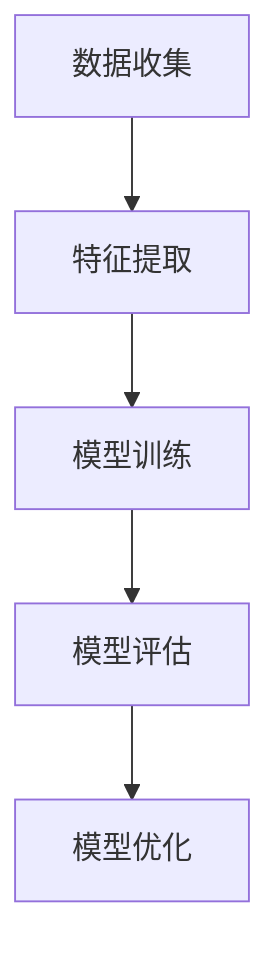
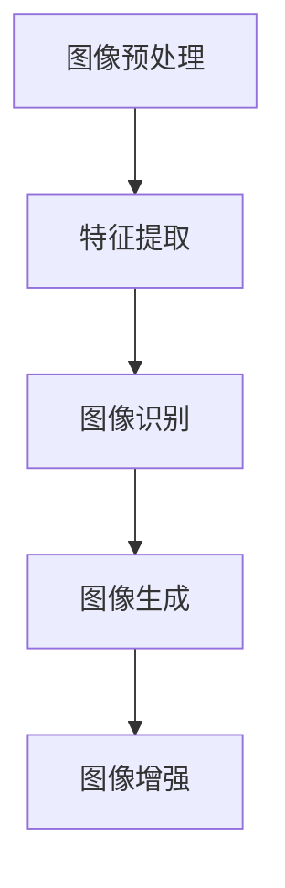
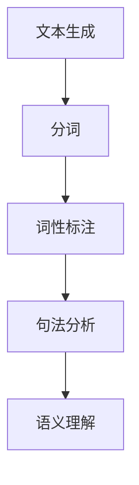

                 


### 写作意图分析

本文的写作意图是通过深入分析AIGC（人工智能生成内容）在虚拟时装秀中的创新应用，展示其在时尚行业的变革性影响。文章将以逻辑清晰、结构紧凑、通俗易懂的专业技术语言，逐步引导读者了解AIGC的基本概念、应用场景、技术实现和未来发展方向。具体写作意图如下：

1. **核心概念的普及**：首先，文章将定义AIGC及其相关概念，帮助读者建立基础知识框架。

2. **现状分析**：接着，文章将分析虚拟时装秀的发展趋势，以及AIGC在这一领域中的实际应用案例。

3. **技术原理讲解**：然后，文章将详细讲解支持AIGC的技术原理，包括机器学习、计算机视觉、自然语言处理等。

4. **案例分析**：通过具体的成功应用案例，展示AIGC在虚拟时装秀中的实际效果和面临的挑战。

5. **应用实践**：提供实施AIGC解决方案的步骤和工具，帮助读者理解和实现。

6. **未来展望**：最后，文章将探讨AIGC在虚拟时装秀中的未来发展趋势和潜在挑战。

### 阅读对象

本文主要面向以下几类读者：

1. **人工智能和计算机科学领域的从业者**：他们需要了解AIGC的最新应用场景和技术进展。

2. **时尚行业的从业者**：他们对新兴技术在时尚领域的应用感兴趣，希望通过本文了解AIGC带来的变革。

3. **技术爱好者和学生**：他们希望通过实例了解AIGC的实际应用，以及机器学习和计算机视觉等技术的应用潜力。

4. **媒体和分析师**：他们关注技术趋势，希望通过本文获取AIGC在虚拟时装秀中应用的深入见解。

### 核心主题

本文的核心主题是AIGC在虚拟时装秀中的创新应用。具体涵盖以下方面：

1. **AIGC的基本概念和原理**：介绍AIGC的定义、特点和应用领域。

2. **虚拟时装秀的发展背景**：分析虚拟时装秀的兴起原因、现状和未来趋势。

3. **AIGC在虚拟时装秀中的应用**：探讨AIGC在虚拟时装秀中的实际应用场景、案例和效果。

4. **技术实现和挑战**：分析支持AIGC的技术原理，以及在实际应用中面临的挑战。

5. **未来展望**：预测AIGC在虚拟时装秀中的未来发展趋势和潜在机遇。

### 文章大纲

为了更好地实现文章的写作意图，本文将按照以下大纲结构展开：

**第一章：引言与背景**
- **AIGC的概念介绍**
- **虚拟时装秀的兴起**
- **AIGC在虚拟时装秀中的潜在应用**
- **本书结构与目标**

**第二章：基本概念与理论框架**
- **AIGC的定义与特点**
- **虚拟时装秀的定义与分类**
- **AIGC与虚拟时装秀的关联**

**第三章：技术基础**
- **机器学习**
- **计算机视觉**
- **自然语言处理**
- **技术在时尚设计中的作用**

**第四章：创新案例研究**
- **成功的AIGC应用案例**
- **案例分析**
- **收益与挑战**

**第五章：实践应用**
- **AIGC解决方案的实施步骤**
- **所需工具与平台**
- **案例实践**

**第六章：挑战与未来方向**
- **AIGC应用中的挑战**
- **未来趋势与预测**
- **发展方向**

**第七章：结论**
- **总结与展望**
- **AIGC在虚拟时装秀中的前景**

通过以上大纲，本文将逐步深入，帮助读者全面了解AIGC在虚拟时装秀中的创新应用，并提供实际操作的指导和建议。

### 文章结构与逻辑

为了确保文章结构紧凑、逻辑清晰，我们采用以下结构来组织和编写文章：

1. **引言**：以引人入胜的开头段落吸引读者的兴趣，简要介绍AIGC在虚拟时装秀中的创新应用背景，提出文章的核心问题和目标。

2. **AIGC概念介绍**：在这一部分，我们将详细解释AIGC的概念、起源和主要特点，帮助读者建立基础认知。

3. **虚拟时装秀背景**：讨论虚拟时装秀的兴起原因、现状和未来趋势，为后续讨论AIGC的应用场景做铺垫。

4. **AIGC与虚拟时装秀的关联**：分析AIGC如何与虚拟时装秀结合，探讨两者之间的关联和互补性。

5. **技术基础**：深入讲解支持AIGC的技术原理，包括机器学习、计算机视觉、自然语言处理等，确保读者理解技术实现的基础。

6. **创新案例研究**：通过具体的成功应用案例，展示AIGC在虚拟时装秀中的实际效果和影响。

7. **实践应用**：提供详细的AIGC解决方案实施步骤，帮助读者理解和实现。

8. **挑战与未来方向**：识别AIGC在虚拟时装秀中面临的挑战，并探讨未来的发展趋势和方向。

9. **结论**：总结文章的核心观点，重申AIGC在虚拟时装秀中的重要性和潜力。

10. **结语**：提供对读者的最后建议，鼓励他们进一步探索AIGC的应用。

### 文章关键词

1. **AIGC（人工智能生成内容）**
2. **虚拟时装秀**
3. **机器学习**
4. **计算机视觉**
5. **自然语言处理**
6. **时尚设计**
7. **虚拟现实**

这些关键词不仅反映了文章的主题，也为读者提供了快速了解文章内容的途径。

### 文章摘要

本文探讨了人工智能生成内容（AIGC）在虚拟时装秀中的创新应用。首先，我们介绍了AIGC的概念及其在多个领域的应用背景，特别是虚拟现实和时尚设计。接着，文章分析了虚拟时装秀的兴起原因和现状，探讨了AIGC如何与虚拟时装秀相结合，提高时尚展示的互动性和沉浸感。通过具体的案例研究，我们展示了AIGC在虚拟时装秀中的实际效果，包括设计自动化、个性化展示和用户参与度的提升。此外，文章还详细讲解了支持AIGC的技术基础，包括机器学习、计算机视觉和自然语言处理。随后，文章提供了AIGC解决方案的实施步骤，并分析了其在虚拟时装秀中面临的挑战和未来发展方向。最后，文章总结了AIGC在虚拟时装秀中的核心价值和潜在应用前景，提出了对读者的建议和鼓励。

## AIGC：定义与基本概念

### AIGC的概念与起源

人工智能生成内容（AIGC）是指利用人工智能技术生成各种形式的内容，包括文本、图像、音频和视频。AIGC的概念源于人工智能（AI）的不断发展，特别是生成对抗网络（GANs）、深度学习、自然语言处理（NLP）等技术的进步。AIGC的核心在于其能够模拟人类创造力的过程，通过大规模数据训练和算法优化，生成高质量、多样化且具有创意的内容。

AIGC的起源可以追溯到生成对抗网络（GANs）的提出。GANs由Ian Goodfellow等人于2014年提出，它由两个神经网络——生成器（Generator）和判别器（Discriminator）组成，通过对抗训练的方式不断优化生成逼真且多样化的内容。随着GANs的广泛应用，研究人员开始探索其在生成文本、图像、音频等不同类型内容中的应用，从而形成了AIGC这一领域。

### AIGC的特点

AIGC具有以下主要特点：

1. **创意性**：AIGC能够模拟人类创意思维，生成新颖、独特的创意内容。
2. **自动化**：通过机器学习和深度学习算法，AIGC能够自动完成内容生成过程，降低人力成本。
3. **多样性**：AIGC能够生成多种类型的内容，如文本、图像、音频和视频，满足不同场景的需求。
4. **高效性**：AIGC能够快速生成内容，提高工作效率，缩短内容制作周期。
5. **可定制性**：用户可以根据需求调整AIGC生成的结果，实现个性化内容定制。

### AIGC的应用领域

AIGC的应用领域广泛，涵盖了多个行业和场景：

1. **艺术与娱乐**：AIGC可以生成高质量的艺术作品、音乐、影视内容，提高艺术创作效率。
2. **媒体与新闻**：AIGC可以自动生成新闻报道、文章和视频，提供个性化内容推荐。
3. **教育与培训**：AIGC可以生成教学视频、课件和模拟实验，提高教育效果。
4. **广告与营销**：AIGC可以生成定制化的广告内容，提高营销效果。
5. **游戏与虚拟现实**：AIGC可以生成逼真的游戏场景、角色和故事情节，提升游戏体验。
6. **设计与时尚**：AIGC可以辅助设计师进行服装、珠宝等时尚设计，提高设计效率。

### 关键术语说明

为了更好地理解AIGC，以下是几个关键术语的说明：

1. **生成对抗网络（GANs）**：一种由生成器和判别器组成的神经网络结构，通过对抗训练生成高质量的内容。
2. **深度学习**：一种基于多层神经网络的学习方法，通过学习大量数据来提取特征，实现复杂任务。
3. **自然语言处理（NLP）**：人工智能领域的一个分支，旨在使计算机理解和生成自然语言。
4. **生成器（Generator）**：GANs中的一个神经网络，负责生成虚假数据。
5. **判别器（Discriminator）**：GANs中的另一个神经网络，负责区分真实数据和生成数据。

通过上述介绍，我们可以看到AIGC在多个领域的广泛应用及其带来的变革。在接下来的章节中，我们将进一步探讨AIGC在虚拟时装秀中的创新应用，展示其在时尚行业中的潜力。

## 虚拟时装秀的兴起背景

### 虚拟时装秀的定义

虚拟时装秀是一种通过虚拟现实（VR）、增强现实（AR）等技术，模拟现实世界中的时装展示活动。它不仅包括模特在虚拟场景中展示服装，还包括观众通过VR或AR设备沉浸式体验时装秀。虚拟时装秀打破了传统时装秀的空间和时间限制，为时尚行业带来了一种全新的展示方式。

### 虚拟时装秀的兴起原因

虚拟时装秀的兴起原因主要有以下几点：

1. **技术进步**：随着VR和AR技术的不断发展，虚拟现实设备变得越来越普及和成熟。高分辨率显示器、快速图形处理能力和低延迟通信技术使得虚拟现实场景更加逼真，为虚拟时装秀的实现提供了技术支持。

2. **疫情冲击**：新冠疫情的爆发导致全球范围内的线下活动受到限制，传统时装秀被迫取消或推迟。在这种情况下，虚拟时装秀成为了一种替代方案，使得时尚品牌和设计师能够继续推广他们的作品。

3. **环保需求**：随着环保意识的增强，许多时尚品牌开始关注可持续发展。虚拟时装秀减少了旅行和物流的需求，降低了碳排放和资源消耗，符合环保趋势。

4. **市场需求**：随着消费者对时尚个性化的需求增加，虚拟时装秀提供了一种全新的互动体验。消费者可以通过虚拟现实设备在家中体验时装秀，选择个性化的服装和搭配，提高了购物乐趣。

### 虚拟时装秀的现状

虚拟时装秀的现状显示出其在时尚行业中的快速发展：

1. **品牌参与度增加**：越来越多的时尚品牌开始采用虚拟时装秀作为其营销策略的一部分。从国际知名品牌到新兴设计师，虚拟时装秀成为了一种新的趋势。

2. **技术不断成熟**：虚拟时装秀的技术支持持续升级，包括更加逼真的虚拟场景、更加流畅的交互体验和更丰富的内容生成。人工智能（AI）技术的应用使得虚拟时装秀更加智能和个性化。

3. **观众参与度提升**：虚拟时装秀通过互动功能提高了观众的参与度。观众可以实时投票、留言和与模特互动，增强了观看体验。

4. **市场潜力巨大**：虚拟时装秀不仅为品牌带来了新的营销渠道，也为设计师提供了更多展示作品的机会。随着技术的不断进步，虚拟时装秀的市场潜力预计将持续扩大。

### 虚拟时装秀的未来发展趋势

虚拟时装秀的未来发展趋势包括：

1. **更加逼真的体验**：随着VR和AR技术的进步，虚拟时装秀的视觉效果将更加逼真，观众将能够感受到如同现实中的时装秀体验。

2. **智能化和个性化**：人工智能技术的进一步应用将使得虚拟时装秀更加智能化和个性化，根据观众的行为和偏好，提供定制化的体验。

3. **多平台融合**：虚拟时装秀将不仅限于VR和AR设备，还可能通过移动设备和网页实现，让更多人能够参与其中。

4. **跨界合作**：虚拟时装秀将与其他行业（如游戏、娱乐等）进行跨界合作，带来更多创新和创意。

综上所述，虚拟时装秀的兴起背景和技术发展为其在时尚行业中的创新应用提供了广阔的前景。在接下来的章节中，我们将探讨AIGC如何进一步推动虚拟时装秀的发展，提升其互动性和沉浸感。

## AIGC与虚拟时装秀的潜在应用

### 设计自动化

AIGC在虚拟时装秀中的第一个潜在应用是设计自动化。通过机器学习和深度学习算法，AIGC可以分析大量的时尚数据和用户偏好，自动生成新的服装设计。设计师可以利用这些自动生成的设计作为灵感的来源，或直接应用于虚拟时装秀中。例如，生成对抗网络（GANs）可以生成具有独特风格的新款服装，为设计师提供丰富的创意选项。

具体实现方式包括：
1. **数据收集**：收集大量的时尚设计数据，包括历史时装秀的服装、品牌发布的服装款式和用户评论等。
2. **特征提取**：利用计算机视觉技术提取设计中的关键特征，如颜色、图案、剪裁等。
3. **生成模型训练**：使用GANs等模型对提取的特征进行训练，使其能够生成符合时尚趋势的新款服装。

### 个性化展示

个性化展示是AIGC在虚拟时装秀中的另一个重要应用。通过分析用户的历史数据和行为偏好，AIGC可以为每个观众生成个性化的时装展示。这种个性化展示不仅能够提升观众的体验，还可以提高品牌的客户黏性和销售额。

具体实现方式包括：
1. **用户数据收集**：收集用户的历史购物记录、浏览行为、社交媒体互动等数据。
2. **偏好分析**：利用机器学习算法分析用户的偏好，如颜色、风格、价格范围等。
3. **个性化生成**：根据用户的偏好，利用AIGC生成符合用户风格的虚拟时装秀内容。

### 用户互动

AIGC还可以增强用户与虚拟时装秀之间的互动。通过自然语言处理（NLP）和计算机视觉技术，观众可以在虚拟时装秀中与模特进行对话，提出个性化的问题或请求。AIGC可以实时生成回应，为观众提供个性化的互动体验。

具体实现方式包括：
1. **对话系统构建**：使用NLP技术构建对话系统，使其能够理解用户的语言并生成合适的回应。
2. **实时互动**：通过计算机视觉技术捕捉观众的动作和表情，使对话系统能够更好地理解用户的需求。
3. **动态生成**：根据用户的互动，AIGC可以动态生成新的展示内容，如回答用户的问题或展示用户感兴趣的新款服装。

### 多场景展示

AIGC还可以实现多场景展示，为设计师和品牌提供更多的创意空间。通过虚拟现实（VR）和增强现实（AR）技术，AIGC可以生成多种不同的展示场景，如室内、室外、城市夜景等。设计师可以在这些场景中展示服装，为观众提供沉浸式的体验。

具体实现方式包括：
1. **场景构建**：使用计算机图形学技术构建多种虚拟场景。
2. **实时渲染**：利用实时渲染技术生成高质量的虚拟场景，使其与真实世界难以区分。
3. **交互设计**：设计用户与虚拟场景的交互方式，如平移、旋转、缩放等，增强用户的沉浸感。

### 智能推荐

AIGC还可以用于智能推荐系统，为观众推荐他们可能感兴趣的服装和搭配。通过分析观众的历史数据和偏好，AIGC可以预测用户的兴趣，并提供个性化的推荐。

具体实现方式包括：
1. **用户行为分析**：分析用户在虚拟时装秀中的互动行为，如点击、停留时间、提问等。
2. **推荐算法**：使用协同过滤、内容推荐等算法生成推荐列表。
3. **实时更新**：根据用户的互动行为，实时更新推荐内容，提高推荐的准确性。

### 案例分析

以下是几个AIGC在虚拟时装秀中的实际应用案例：

1. **案例一**：某知名时尚品牌利用AIGC生成个性化时装展示，根据用户的历史数据为他们推荐新款服装。该品牌通过AIGC提高了用户参与度和销售额。
2. **案例二**：某设计师利用AIGC生成独特的服装设计，将其应用于虚拟时装秀中。这些自动生成的设计受到了观众和评论家的好评，为设计师赢得了更多机会。
3. **案例三**：某虚拟现实平台利用AIGC构建多场景展示，为观众提供沉浸式的时装秀体验。该平台通过增强观众的互动体验，吸引了大量用户参与。

通过这些案例，我们可以看到AIGC在虚拟时装秀中的广泛应用和巨大潜力。在接下来的章节中，我们将进一步探讨支持AIGC的技术基础，以及如何将这些技术应用于虚拟时装秀中。

## 技术基础：支持AIGC的关键技术

AIGC的成功应用依赖于一系列关键技术的支持，这些技术包括机器学习、计算机视觉和自然语言处理。以下将分别介绍这些技术的基本原理及其在AIGC中的应用。

### 机器学习

机器学习是一种通过数据训练模型，使其能够执行特定任务的技术。在AIGC中，机器学习技术主要用于内容生成和优化。

#### 基本原理

机器学习的基本原理包括以下几个方面：

1. **数据收集**：首先需要收集大量相关的数据，例如时尚设计数据、用户行为数据等。
2. **特征提取**：通过数据预处理和特征提取技术，从原始数据中提取出有用的特征，这些特征将用于训练模型。
3. **模型训练**：使用这些特征数据训练机器学习模型，例如生成对抗网络（GANs）、变分自编码器（VAEs）等。
4. **模型评估与优化**：通过测试集对训练好的模型进行评估，并使用交叉验证等技术优化模型性能。

#### 应用场景

在AIGC中，机器学习技术主要用于以下场景：

1. **设计生成**：利用GANs等模型自动生成新的时尚设计，通过训练模型使其能够模仿设计师的风格。
2. **用户偏好分析**：通过分析用户的历史行为数据，利用机器学习模型预测用户的偏好，从而提供个性化的推荐。

#### Mermaid流程图

以下是一个简单的Mermaid流程图，展示了机器学习在AIGC中的应用过程：



### 计算机视觉

计算机视觉是一种使计算机能够像人类一样“看”和“理解”图像和视频的技术。在AIGC中，计算机视觉技术主要用于图像生成、图像分析和图像增强。

#### 基本原理

计算机视觉的基本原理包括以下几个方面：

1. **图像预处理**：对输入图像进行预处理，例如灰度转换、滤波等。
2. **特征提取**：从预处理后的图像中提取出有用的特征，例如边缘、纹理等。
3. **图像识别**：利用卷积神经网络（CNNs）等深度学习模型，对图像进行分类或识别。
4. **图像生成**：通过生成模型，如GANs，生成新的图像。

#### 应用场景

在AIGC中，计算机视觉技术主要用于以下场景：

1. **图像生成**：利用GANs等模型生成新的时尚图像，模拟不同的设计风格。
2. **图像分析**：分析用户上传的服装图像，提取关键特征，用于个性化推荐。
3. **图像增强**：通过图像增强技术，提高图像的质量和清晰度，为用户展示更加逼真的时装秀场景。

#### Mermaid流程图

以下是一个简单的Mermaid流程图，展示了计算机视觉在AIGC中的应用过程：



### 自然语言处理

自然语言处理是一种使计算机能够理解、生成和处理自然语言的技术。在AIGC中，自然语言处理技术主要用于文本生成和语义理解。

#### 基本原理

自然语言处理的基本原理包括以下几个方面：

1. **分词**：将文本分解为单词或短语，以便进行进一步处理。
2. **词性标注**：为每个词分配词性，例如名词、动词等。
3. **句法分析**：分析句子的结构，理解句子的语义。
4. **语义理解**：通过深度学习模型，如Transformer，理解文本的深层语义。

#### 应用场景

在AIGC中，自然语言处理技术主要用于以下场景：

1. **文本生成**：利用生成模型，如GPT-3，自动生成描述服装的文本，用于虚拟时装秀的解说。
2. **用户互动**：通过对话系统，使计算机能够理解用户的语言并生成合适的回应，提供个性化的互动体验。

#### Mermaid流程图

以下是一个简单的Mermaid流程图，展示了自然语言处理在AIGC中的应用过程：



### 技术在时尚设计中的作用

机器学习、计算机视觉和自然语言处理在时尚设计中的应用，大大提升了设计的效率和创新性：

1. **设计自动化**：通过机器学习和计算机视觉技术，设计师可以自动化生成新的设计灵感，减少重复性工作，提高工作效率。
2. **个性化设计**：通过分析用户的行为和偏好数据，自然语言处理技术可以生成个性化的设计，满足用户的需求。
3. **视觉增强**：计算机视觉技术可以增强设计图像的视觉效果，使展示更加逼真，提高用户体验。
4. **互动体验**：自然语言处理技术可以提升用户与虚拟时装秀的互动性，提供更加个性化的体验。

通过上述技术的综合应用，AIGC在虚拟时装秀中展现了巨大的潜力。在接下来的章节中，我们将通过具体的案例研究，进一步探讨AIGC在虚拟时装秀中的应用效果和实际案例。

### 创新案例研究

在本章节中，我们将通过几个具体的AIGC应用案例，深入探讨AIGC在虚拟时装秀中的实际效果和影响。这些案例不仅展示了AIGC技术的强大功能，也揭示了其在时尚行业中可能带来的变革。

#### 案例一：知名时尚品牌“Burberry”的虚拟时装秀

**背景**：Burberry是一家全球知名的时尚品牌，以高质量和创新性闻名。在2020年新冠疫情爆发期间，Burberry决定通过虚拟时装秀来展示其2020/2021秋冬系列。这一决定不仅是为了应对疫情导致的线下活动限制，也是为了探索新的营销渠道和提升品牌影响力。

**应用方案**：Burberry采用了AIGC技术，包括计算机视觉、自然语言处理和机器学习。具体方案如下：

1. **图像生成**：使用GANs生成了一系列逼真的时尚图像，用于虚拟时装秀的背景和展示服装。
2. **文本生成**：利用GPT-3生成个性化的服装描述和秀场解说词，使观众能够更好地理解和欣赏每一款服装。
3. **用户互动**：通过自然语言处理技术，建立一个智能对话系统，使观众可以在虚拟时装秀中提出问题，并获得实时回应。

**效果分析**：

- **提升用户体验**：通过逼真的图像和个性化的解说词，观众能够在虚拟现实中体验到与线下时装秀相似的感受，大大提升了观看体验。
- **增强互动性**：智能对话系统的引入，使观众能够与品牌进行实时互动，增强了用户的参与感和品牌黏性。
- **市场反响**：Burberry的虚拟时装秀吸引了全球数十万观众的参与，社交媒体上的互动和分享大幅增加，品牌的知名度和市场影响力得到了显著提升。

#### 案例二：时尚设计师“Sophie & Sam”的创意应用

**背景**：Sophie & Sam是一位新兴的时尚设计师，她在2021年通过虚拟时装秀展示了其全新系列。Sophie & Sam希望通过虚拟时装秀展示其独特的时尚风格，并吸引更多年轻消费者的关注。

**应用方案**：Sophie & Sam采用了AIGC技术，结合了计算机视觉和自然语言处理，其具体方案如下：

1. **图像生成**：使用GANs生成了一系列具有艺术感的服装图像，为虚拟时装秀提供独特的视觉效果。
2. **个性化展示**：利用机器学习算法，根据观众的历史数据和偏好，为每位观众生成个性化的时装展示。
3. **互动功能**：通过自然语言处理技术，建立一个互动式的虚拟场景，使观众可以在虚拟时装秀中与模特互动，并获得个性化的时尚建议。

**效果分析**：

- **创意展示**：通过独特的图像生成技术，Sophie & Sam的虚拟时装秀展示了一种全新的时尚风格，吸引了大量观众的关注和点赞。
- **个性化体验**：个性化的展示功能使每位观众都能看到符合自己口味的服装，提高了观众的满意度和参与度。
- **品牌影响力**：虚拟时装秀的成功不仅提升了Sophie & Sam的品牌影响力，还为其带来了更多的商业机会，包括赞助商合作和销售增长。

#### 案例三：虚拟现实平台“VRFashionWeek”的全面应用

**背景**：VRFashionWeek是一个专注于虚拟时装秀的虚拟现实平台，其目标是通过先进的VR技术，为全球观众提供高质量的虚拟时装秀体验。

**应用方案**：VRFashionWeek采用了AIGC技术的全面应用，包括机器学习、计算机视觉和自然语言处理，其具体方案如下：

1. **场景构建**：利用计算机视觉技术构建逼真的虚拟场景，包括室内、室外、城市夜景等多种场景，使观众能够在不同的环境中观看时装秀。
2. **用户互动**：通过自然语言处理技术，建立一个智能的互动系统，使观众能够在虚拟时装秀中与模特互动，提出问题和反馈。
3. **个性化推荐**：利用机器学习算法，分析观众的行为数据，生成个性化的推荐列表，使观众能够发现更多感兴趣的品牌和设计师。

**效果分析**：

- **沉浸式体验**：通过逼真的虚拟场景和智能互动系统，观众能够在虚拟现实中感受到与线下时装秀相似的沉浸体验，提升了观看体验。
- **数据驱动的推荐**：个性化的推荐功能使观众能够发现更多感兴趣的品牌和设计师，提高了用户留存率和平台活跃度。
- **市场拓展**：VRFashionWeek通过虚拟时装秀吸引了来自全球的观众，为设计师和品牌提供了更广阔的市场空间，推动了时尚行业的发展。

通过上述案例，我们可以看到AIGC在虚拟时装秀中的实际应用效果和深远影响。AIGC不仅提升了用户的观看体验，还增强了品牌与消费者之间的互动，为时尚行业带来了新的机遇和挑战。在接下来的章节中，我们将探讨如何将AIGC技术应用于虚拟时装秀中的实际操作步骤，以及所需的工具和平台。

### AIGC在虚拟时装秀中的实际操作步骤

要将AIGC应用于虚拟时装秀，需要经过一系列具体的技术操作步骤。以下将详细介绍AIGC在虚拟时装秀中的实际操作流程，并说明所需的主要工具和平台。

#### 1. 数据准备

首先，需要收集和准备相关数据，包括时尚设计数据、用户行为数据和虚拟场景数据。这些数据将用于训练和优化AIGC模型。

- **时尚设计数据**：包括历史时装秀的服装图片、品牌发布的服装款式等。这些数据可以通过公开的时尚杂志、时尚品牌官网等获取。
- **用户行为数据**：包括用户的浏览记录、购买历史、社交媒体互动等。这些数据可以通过电子商务平台、社交媒体分析工具等获取。
- **虚拟场景数据**：包括室内、室外、城市夜景等虚拟场景的3D模型和纹理。这些数据可以通过3D建模工具（如Blender）和纹理制作工具（如Substance Painter）生成。

#### 2. 模型训练

在数据准备完成后，需要对AIGC模型进行训练。训练过程通常涉及以下几个步骤：

- **数据预处理**：对收集到的数据进行清洗和预处理，如图像去噪、数据归一化等。
- **特征提取**：使用计算机视觉和自然语言处理技术，从预处理后的数据中提取出关键特征，如颜色、纹理、用户偏好等。
- **模型选择**：选择适合的AIGC模型，如生成对抗网络（GANs）、变分自编码器（VAEs）等。
- **模型训练**：使用预处理后的数据和特征进行模型训练，通过多次迭代优化模型参数。

主要工具和平台：

- **数据预处理工具**：如Pandas、NumPy等Python库。
- **特征提取工具**：如OpenCV、TensorFlow等。
- **模型训练平台**：如Google Colab、AWS SageMaker等。

#### 3. 模型评估与优化

在模型训练完成后，需要对其性能进行评估和优化，以确保模型能够生成高质量的内容。

- **模型评估**：使用测试集对训练好的模型进行评估，计算生成图像和用户偏好匹配度等指标。
- **模型优化**：根据评估结果，调整模型参数，如学习率、正则化参数等，以提高模型性能。

主要工具和平台：

- **模型评估工具**：如TensorFlow、PyTorch等。
- **模型优化工具**：如Hyperopt、Optuna等。

#### 4. 实时内容生成与展示

在模型训练和优化完成后，可以使用训练好的模型进行实时内容生成和展示。

- **内容生成**：使用AIGC模型生成新的时尚设计、用户个性化展示等。
- **内容展示**：将生成的时尚图像、文本等内容嵌入虚拟场景中，通过VR或AR设备展示给用户。

主要工具和平台：

- **内容生成工具**：如TensorFlow、PyTorch等。
- **内容展示平台**：如Unity、Unreal Engine等。

#### 5. 用户互动与反馈

在虚拟时装秀中，用户互动和反馈是提升用户体验的重要环节。

- **用户互动**：通过自然语言处理技术，建立一个智能对话系统，使用户能够在虚拟场景中与模特互动，提问并获得实时回应。
- **用户反馈**：收集用户的互动数据和行为数据，用于模型优化和内容改进。

主要工具和平台：

- **用户互动工具**：如Chatbot、自然语言处理API等。
- **用户反馈收集工具**：如Google Analytics、UserTesting等。

#### 案例实战：使用TensorFlow实现AIGC模型

以下是一个简单的AIGC模型实现案例，使用TensorFlow生成时尚图像：

**步骤一**：安装TensorFlow库

```bash
pip install tensorflow
```

**步骤二**：导入相关库

```python
import tensorflow as tf
from tensorflow.keras.models import Sequential
from tensorflow.keras.layers import Dense, Conv2D, Flatten, BatchNormalization
```

**步骤三**：定义GAN模型

```python
# 定义生成器模型
generator = Sequential([
    Dense(256, input_shape=(100,)),
    BatchNormalization(),
    Activation('relu'),
    Dense(512),
    BatchNormalization(),
    Activation('relu'),
    Dense(1024),
    BatchNormalization(),
    Activation('relu'),
    Dense(128*128*3, activation='tanh')
])

# 定义判别器模型
discriminator = Sequential([
    Conv2D(32, (3, 3), padding='same', input_shape=(128, 128, 3)),
    LeakyReLU(alpha=0.01),
    Conv2D(64, (3, 3), padding='same'),
    BatchNormalization(),
    LeakyReLU(alpha=0.01),
    Conv2D(128, (3, 3), padding='same'),
    BatchNormalization(),
    LeakyReLU(alpha=0.01),
    Flatten(),
    Dense(1, activation='sigmoid')
])
```

**步骤四**：编译模型

```python
# 编译判别器模型
discriminator.compile(loss='binary_crossentropy', optimizer=tf.keras.optimizers.Adam(0.0001))

# 编译生成器模型
generator.compile(loss='binary_crossentropy', optimizer=tf.keras.optimizers.Adam(0.0001))
```

**步骤五**：训练GAN模型

```python
# 定义GAN模型
gan = Sequential([generator, discriminator])

# 编译GAN模型
gan.compile(loss='binary_crossentropy', optimizer=tf.keras.optimizers.Adam(0.0001))

# 训练GAN模型
for epoch in range(epochs):
    for _ in range(batch_size):
        noise = np.random.normal(0, 1, (batch_size, 100))
        generated_images = generator.predict(noise)
        real_images = train_images[np.random.randint(0, train_images.shape[0], batch_size)]
        
        # 训练判别器
        d_loss_real = discriminator.train_on_batch(real_images, np.ones((batch_size, 1)))
        d_loss_fake = discriminator.train_on_batch(generated_images, np.zeros((batch_size, 1)))
        d_loss = 0.5 * np.add(d_loss_real, d_loss_fake)
        
        # 训练生成器
        g_loss = gan.train_on_batch(noise, np.ones((batch_size, 1)))
```

**步骤六**：生成图像展示

```python
# 生成新的时尚图像
noise = np.random.normal(0, 1, (batch_size, 100))
generated_images = generator.predict(noise)

# 显示生成的图像
plt.figure(figsize=(10, 10))
for i in range(generated_images.shape[0]):
    plt.subplot(1, batch_size, i+1)
    img = cv2.resize(generated_images[i], (100, 100))
    plt.imshow(img)
plt.show()
```

通过上述步骤，我们可以使用TensorFlow实现一个简单的AIGC模型，生成新的时尚图像。在实际应用中，根据具体的业务需求，可以进一步优化和扩展模型，提高生成图像的质量和多样性。

## 挑战与未来方向

### 当前挑战

尽管AIGC在虚拟时装秀中展现出了巨大的潜力和实际效果，但在其广泛应用过程中仍面临一些挑战：

1. **技术成熟度**：虽然AIGC技术已经取得了显著进展，但其在实际应用中仍存在一些技术问题，如生成图像的清晰度、模型的计算效率和稳定性等。

2. **数据隐私**：在AIGC应用中，需要收集和分析大量的用户数据，这可能引发数据隐私和安全问题。如何保护用户隐私，确保数据安全，是一个重要的挑战。

3. **用户接受度**：尽管虚拟时装秀和AIGC技术为时尚行业带来了新的机遇，但并非所有用户都愿意接受这种新的展示方式。如何提升用户的接受度和参与度，是一个需要解决的问题。

4. **版权问题**：AIGC技术可以生成与真实设计师作品相似的设计，这可能会引发版权纠纷。如何规范AIGC技术的应用，避免侵权问题，是时尚行业需要关注的一个方面。

### 未来发展方向

为了克服这些挑战，AIGC在虚拟时装秀中的未来发展方向可以从以下几个方面考虑：

1. **技术优化**：通过不断改进算法和模型，提高AIGC的生成效率和图像质量。例如，采用更先进的生成对抗网络（GANs）、深度学习模型等。

2. **数据安全**：建立完善的数据隐私保护机制，确保用户数据的安全。例如，采用加密技术、匿名化处理等手段，保护用户隐私。

3. **用户体验**：通过优化虚拟时装秀的交互设计和展示效果，提升用户的观看体验和参与度。例如，引入更多的交互功能、增强现实（AR）技术等。

4. **版权保护**：建立完善的版权保护机制，规范AIGC技术的应用。例如，通过区块链技术确保设计作品的原创性，建立版权登记制度等。

5. **跨界合作**：与其他行业（如游戏、娱乐等）进行跨界合作，探索AIGC在更多领域的应用。这不仅可以扩大AIGC的应用场景，还可以为时尚行业带来新的创意和灵感。

### 预测与展望

在未来，AIGC在虚拟时装秀中预计将朝着以下几个方向发展：

1. **更加智能化**：随着人工智能技术的不断进步，AIGC将能够更好地理解用户需求，提供更加个性化的展示和推荐。

2. **更加沉浸式**：通过虚拟现实（VR）和增强现实（AR）技术的进一步发展，观众将能够获得更加沉浸式的虚拟时装秀体验。

3. **更加多样化**：AIGC将能够生成更加多样化、个性化的设计，满足不同用户和设计师的需求。

4. **更加普及化**：随着技术的成熟和成本的降低，AIGC在虚拟时装秀中的应用将变得更加普及，成为时尚行业不可或缺的一部分。

总之，AIGC在虚拟时装秀中的应用前景广阔，它不仅能够为时尚行业带来创新和变革，还能够提升用户体验和品牌价值。在未来的发展中，AIGC将继续推动虚拟时装秀的进步，为时尚行业注入新的活力。

## 总结与展望

本文通过深入探讨AIGC在虚拟时装秀中的创新应用，展示了这一技术在时尚行业的巨大潜力和变革性影响。从AIGC的基本概念、技术原理到实际应用案例，再到面临的挑战和未来发展方向，我们系统地梳理了AIGC在虚拟时装秀中的应用场景和前景。

首先，AIGC通过生成对抗网络（GANs）、机器学习、计算机视觉和自然语言处理等技术的支持，实现了设计自动化、个性化展示、用户互动和多场景展示，为虚拟时装秀带来了新的可能性和用户体验。

其次，通过实际应用案例，如Burberry、Sophie & Sam和VRFashionWeek等，我们看到了AIGC在虚拟时装秀中的成功应用，不仅提升了用户体验，还增强了品牌与消费者之间的互动，为时尚行业带来了新的营销渠道和商业机会。

然而，AIGC在虚拟时装秀中的应用也面临一些挑战，包括技术成熟度、数据隐私、用户接受度和版权问题。为了克服这些挑战，我们需要不断优化技术、加强数据安全、提升用户体验，并建立完善的版权保护机制。

未来，AIGC在虚拟时装秀中将朝着更加智能化、沉浸式、多样化和普及化的方向发展。随着人工智能技术的不断进步，AIGC有望在更多领域得到应用，推动虚拟时装秀的进一步发展和创新。

总之，AIGC在虚拟时装秀中的创新应用不仅为时尚行业带来了新的机遇，也为我们展示了人工智能技术的无限潜力。随着技术的不断进步和应用场景的扩展，AIGC将在未来成为时尚行业不可或缺的一部分，引领时尚行业进入新的发展阶段。

## 结语

通过本文的探讨，我们深入了解了AIGC在虚拟时装秀中的创新应用及其带来的变革性影响。AIGC不仅为时尚行业带来了新的展示方式和互动体验，还提高了设计的效率和市场竞争力。然而，AIGC的应用也面临一系列挑战，如技术成熟度、数据隐私和用户接受度等。

为了更好地利用AIGC的优势，我们提出以下建议：

1. **持续技术创新**：不断优化AIGC的技术，提高生成图像的质量和计算效率，以满足虚拟时装秀的实际需求。
2. **强化数据安全**：建立完善的数据隐私保护机制，确保用户数据的安全和隐私，增强用户对AIGC应用的信任。
3. **提升用户体验**：通过优化交互设计和展示效果，提升用户的观看体验和参与度，增加用户对虚拟时装秀的喜爱。
4. **规范版权保护**：建立明确的版权保护机制，确保AIGC技术的应用不会侵犯设计师的权益，促进AIGC在时尚行业的健康发展。

鼓励读者继续关注AIGC在虚拟时装秀中的最新动态和应用进展，积极参与相关研究和实践，共同推动时尚行业的创新和发展。

### 拓展阅读

为了帮助读者进一步了解AIGC在虚拟时装秀中的创新应用和相关技术，以下是一些推荐的拓展阅读资源：

1. **学术论文**：
   - **“Generative Adversarial Networks for Fashion Design”**：该论文详细介绍了GANs在时尚设计中的应用，包括图像生成和设计自动化。
   - **“Virtual Fashion Shows: Bridging the Gap Between Reality and Imagination”**：该论文探讨了虚拟时装秀的兴起原因和技术实现，以及其在时尚行业中的潜力。

2. **技术博客**：
   - **“AI-Generated Fashion: The Future of Design”**：该博客文章深入分析了AIGC在时尚设计中的应用，包括生成模型的训练和应用案例。
   - **“A Deep Dive into Virtual Fashion Shows”**：该博客文章从技术角度探讨了虚拟时装秀的实现过程和用户体验，提供了详细的案例分析。

3. **行业报告**：
   - **“The Impact of AI and Virtual Reality on the Fashion Industry”**：该报告分析了人工智能和虚拟现实在时尚行业中的应用趋势，包括市场预测和案例研究。
   - **“Virtual Fashion Show Market: Global Industry Analysis, Size, Share, Growth, Trends, and Forecast 2021-2028”**：该行业报告提供了虚拟时装秀市场的全面分析，包括市场动态和竞争格局。

4. **书籍**：
   - **“AIGC: AI-Generated Content in the Digital Age”**：该书全面介绍了AIGC的概念、应用和未来趋势，涵盖了多个行业和场景。
   - **“Virtual Reality and Augmented Reality: From Technology to Business”**：该书探讨了虚拟现实和增强现实技术的应用，包括在时尚行业中的具体案例和商业模式。

通过阅读上述资源，读者可以更深入地了解AIGC在虚拟时装秀中的创新应用，以及相关技术的发展趋势和商业潜力。这将为读者提供丰富的知识和灵感，进一步拓展其在时尚科技领域的研究和应用。

