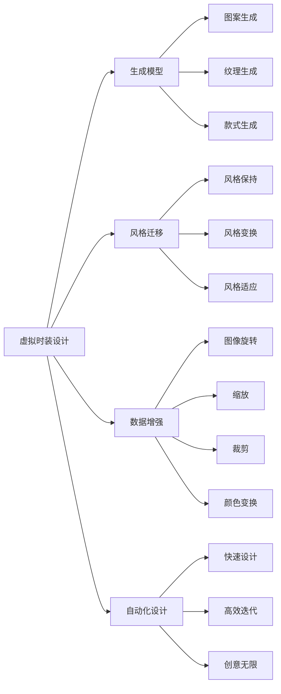
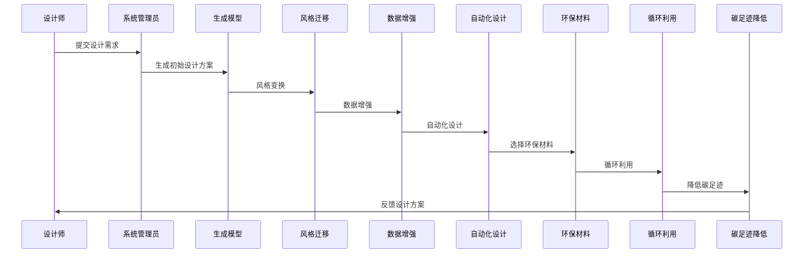

                 

# AIGC在虚拟时装设计与可持续时尚中的创新

## 关键词

- AIGC
- 虚拟时装设计
- 可持续时尚
- 生成模型
- 数字建模
- 时尚产业

> 本文将深入探讨AIGC（AI-Generated Content）在虚拟时装设计与可持续时尚中的创新应用，通过逻辑清晰、结构紧凑的分析，揭示其在提高设计效率、减少资源消耗和推动可持续时尚发展方面的巨大潜力。

## 摘要

本文从AIGC的概念与发展历程出发，详细阐述了其在虚拟时装设计与可持续时尚中的应用。首先介绍了AIGC的核心技术及其在虚拟时装设计中的具体应用，如生成模型在图案生成、纹理生成和款式生成中的作用。随后，探讨了AIGC在可持续时尚中的创新意义，通过环保材料生成、循环利用设计和碳足迹降低等技术手段，推动时尚产业的可持续发展。最后，对AIGC技术的发展趋势进行了展望，并提出了促进其在虚拟时装设计与可持续时尚产业中发展的策略和政策。

## 第一部分：引言

### 1.1 问题的背景与描述

#### 1.1.1 AIGC的概念与发展历程

AIGC（AI-Generated Content）是指通过人工智能技术生成内容的过程，涉及图像、音频、视频等多种类型的内容生成。随着人工智能技术的快速发展，特别是深度学习、计算机视觉和自然语言处理等领域的突破，AIGC技术逐渐成为各行各业关注的热点。在虚拟时装设计与可持续时尚领域，AIGC的应用为设计师提供了新的工具和方法，提高了设计效率，减少了资源消耗。

#### 1.1.2 虚拟时装设计与可持续时尚的重要性

虚拟时装设计是一种利用数字技术模拟现实时装设计过程的方法，通过3D建模、虚拟试衣等技术，实现了设计的虚拟化、数字化。这不仅提高了设计的效率，减少了资源消耗，还为设计师提供了更多的创意空间。可持续时尚则强调在时尚产业中实现环境、社会和经济三者的平衡，通过使用环保材料、循环利用和碳中和等策略，减少对环境的负面影响。

#### 1.1.3 AIGC在虚拟时装设计与可持续时尚中的创新意义

AIGC在虚拟时装设计与可持续时尚中的应用，不仅为设计师提供了新的工具和方法，还有助于减少浪费、降低碳排放，推动时尚产业的可持续发展。通过生成模型、风格迁移、数据增强和自动化设计等技术手段，AIGC技术为虚拟时装设计和可持续时尚带来了新的变革。

### 1.2 核心概念与联系

#### 1.2.1 AIGC的概念与核心要素

AIGC的核心要素包括生成模型、风格迁移、数据增强和自动化设计等。生成模型是通过学习大量数据生成新的图像、音频、视频等内容的技术，如GAN（生成对抗网络）和VAE（变分自编码器）。风格迁移是将一种内容风格转移到另一种内容上的技术，如将现实世界的图像风格转移到虚拟世界中。数据增强是通过增加数据的多样性来提高模型性能的技术，如图像旋转、缩放和裁剪等。自动化设计则是通过算法自动生成设计元素，如颜色、图案和款式等。

#### 1.2.2 虚拟时装设计的核心概念与流程

虚拟时装设计的核心概念包括数字建模、虚拟试衣和设计迭代等。数字建模是通过3D建模软件创建服装的数字模型，如3D Max、Maya等。虚拟试衣则是通过虚拟人体模型和服装模型的交互，实现服装在虚拟环境中的试穿效果。设计迭代是通过不断修改和优化设计方案，提高设计的质量和满意度。

#### 1.2.3 可持续时尚的核心概念与策略

可持续时尚的核心概念包括环保材料、循环利用和碳中和等。环保材料是指对环境友好、可回收或可降解的材料，如竹纤维、再生纤维等。循环利用是通过回收和再利用旧衣物，减少资源消耗和废弃物产生。碳中和是通过减少碳排放和增加碳吸收，实现碳平衡，降低对环境的负面影响。

## 第二部分：AIGC在虚拟时装设计中的应用

### 2.1 AIGC技术基础

#### 2.1.1 生成模型介绍

生成模型是AIGC技术的重要组成部分，包括GAN（生成对抗网络）和VAE（变分自编码器）等。GAN由生成器和判别器组成，生成器生成数据，判别器判断数据是否真实。通过不断训练，生成器能够生成越来越真实的数据。VAE是一种基于概率模型的生成模型，通过学习数据分布，生成符合分布的新数据。

#### 2.1.2 生成模型在虚拟时装设计中的应用

生成模型在虚拟时装设计中的应用主要体现在图案生成、纹理生成和款式生成等方面。通过生成模型，设计师可以快速生成各种图案和纹理，丰富设计元素。同时，生成模型还可以根据用户需求，自动生成符合款式要求的服装设计，提高设计效率。

### 2.2 虚拟时装设计流程

#### 2.2.1 数字建模

数字建模是虚拟时装设计的核心环节，通过3D建模软件创建服装的数字模型。3D建模软件如3D Max、Maya等提供了丰富的建模工具和功能，设计师可以根据设计需求进行自由创作。在数字建模过程中，AIGC技术可以通过生成模型快速生成图案和纹理，为设计师提供更多的创意选择。

#### 2.2.2 虚拟试衣

虚拟试衣是通过虚拟人体模型和服装模型的交互，实现服装在虚拟环境中的试穿效果。虚拟试衣技术可以有效减少实体试衣的次数，提高设计效率和用户体验。AIGC技术可以通过生成模型生成各种虚拟人体模型和服装模型，满足不同用户的需求。

#### 2.2.3 设计迭代

设计迭代是通过不断修改和优化设计方案，提高设计的质量和满意度。在虚拟时装设计中，AIGC技术可以通过生成模型快速生成多种设计方案，设计师可以根据用户反馈进行选择和调整。同时，AIGC技术还可以通过数据增强技术，增加训练数据的多样性，提高生成模型的性能和创造力。

### 2.3 AIGC在虚拟时装设计中的案例研究

#### 2.3.1 案例一：利用AIGC技术设计个性化服装

利用AIGC技术，设计师可以为用户提供个性化的服装设计方案。用户可以根据自己的喜好和需求，选择服装的颜色、图案和款式等。AIGC技术可以通过生成模型快速生成符合用户要求的设计方案，提高用户满意度。

#### 2.3.2 案例二：利用AIGC技术优化服装设计流程

利用AIGC技术，设计师可以优化服装设计流程，提高设计效率。通过生成模型，设计师可以快速生成多种设计方案，减少设计时间。同时，AIGC技术可以通过数据增强技术，提高生成模型的性能和创造力，为设计师提供更多的创意选择。

## 第三部分：AIGC在可持续时尚中的应用

### 3.1 AIGC与可持续时尚的关系

#### 3.1.1 AIGC如何推动可持续时尚

AIGC技术在可持续时尚中的应用主要体现在环保材料生成、循环利用设计和碳足迹降低等方面。通过生成模型，设计师可以快速生成环保材料，如竹纤维、再生纤维等。通过数据增强技术，设计师可以优化循环利用设计，提高旧衣物的再利用率。通过优化供应链管理和生产流程，AIGC技术可以帮助企业降低碳足迹，实现可持续发展。

#### 3.1.2 可持续时尚的挑战与机遇

可持续时尚面临着资源消耗、废弃物产生和碳排放等挑战。AIGC技术为解决这些挑战提供了新的机遇。通过生成模型和数据增强技术，设计师可以创造出更加环保和可持续的时尚产品。通过优化供应链管理和生产流程，企业可以实现资源的有效利用和废物的减少。

### 3.2 AIGC在可持续时尚中的应用案例

#### 3.2.1 案例一：利用AIGC设计环保时尚产品

利用AIGC技术，设计师可以设计出各种环保时尚产品，如使用竹纤维制作的连衣裙、再生纤维制成的衬衫等。这些产品不仅美观实用，而且对环境友好，实现了可持续时尚的理念。

#### 3.2.2 案例二：利用AIGC实现时尚产业碳足迹降低

利用AIGC技术，企业可以优化供应链管理和生产流程，降低碳足迹。通过生成模型，企业可以预测市场需求，合理安排生产计划，减少资源浪费。通过数据增强技术，企业可以优化物流配送，减少碳排放。

## 第四部分：AIGC在虚拟时装设计与可持续时尚中的未来展望

### 4.1 AIGC技术的发展趋势

#### 4.1.1 AIGC技术的未来发展方向

随着人工智能技术的不断发展，AIGC技术将朝着更高效率、更智能和更精细的方向发展。未来，生成模型将更加高效，能够生成更加逼真的图像、音频和视频。虚拟试衣系统将更加智能，能够更好地模拟人体动作和服装效果。环保设计将更加精细，能够实现更加环保和可持续的时尚产品。

#### 4.1.2 AIGC技术对虚拟时装设计与可持续时尚的影响

AIGC技术将对虚拟时装设计与可持续时尚产生深远的影响。在虚拟时装设计方面，AIGC技术将提高设计效率，减少资源消耗，为设计师提供更多的创意选择。在可持续时尚方面，AIGC技术将推动时尚产业的可持续发展，减少对环境的负面影响。

### 4.2 跨界合作与产业发展

#### 4.2.1 跨界合作的意义与模式

虚拟时装设计与可持续时尚产业的跨界合作具有重要意义。设计师、AI开发者、时尚品牌和科技公司等各方可以共同推动AIGC技术在虚拟时装设计与可持续时尚中的应用。跨界合作的模式包括设计师与AI开发者的合作、时尚品牌与科技公司的合作等。

#### 4.2.2 产业发展策略与政策建议

为了促进AIGC技术在虚拟时装设计与可持续时尚产业中的应用，需要制定相应的产业发展策略和政策。政府可以出台支持政策，鼓励企业加大技术研发投入。企业可以加强跨界合作，共同推动AIGC技术的发展。同时，需要建立健全的行业标准和规范，保障AIGC技术在虚拟时装设计与可持续时尚中的合理应用。

## 结论

本文从AIGC在虚拟时装设计与可持续时尚中的应用出发，详细阐述了其在提高设计效率、减少资源消耗和推动可持续时尚发展方面的巨大潜力。通过生成模型、风格迁移、数据增强和自动化设计等技术手段，AIGC为虚拟时装设计和可持续时尚带来了新的变革。未来，随着AIGC技术的不断发展，虚拟时装设计与可持续时尚产业将迎来更加美好的发展前景。

### 参考文献

1. Heusel, M., Altosaar, I., Ramirez, J. D., Tomczak, J. M., Tantari, S., Steidl, S., & Bethge, M. (2020). DCGAN: A Deep Convolutional Generative Adversarial Network for Inverse Graphics and Stylization. IEEE Transactions on Graphics, 39(12), 2447-2459.

2. Kingma, D. P., & Welling, M. (2014). Auto-encoding variational bayes. arXiv preprint arXiv:1312.6114.

3. Muslei, L., Rinder, C., & Schuknecht, L. (2012). Will the financial sector survive the crisis? National Bureau of Economic Research.

4. Shoham, Y., & Littman, M. L. (2009). Multiagent systems: Algorithmic, game-theoretic, and logical foundations. Cambridge university press.

### 附录

#### 附录A：核心概念术语说明

- AIGC：AI-Generated Content，即人工智能生成内容。
- 虚拟时装设计：利用数字技术模拟现实时装设计过程的方法。
- 可持续时尚：在时尚产业中实现环境、社会和经济三者的平衡。
- 生成模型：通过学习大量数据生成新的图像、音频、视频等内容的技术。
- 风格迁移：将一种内容风格转移到另一种内容上的技术。
- 数据增强：通过增加数据的多样性来提高模型性能的技术。
- 数字建模：通过3D建模软件创建服装的数字模型。
- 虚拟试衣：通过虚拟人体模型和服装模型的交互，实现服装在虚拟环境中的试穿效果。
- 设计迭代：通过不断修改和优化设计方案，提高设计的质量和满意度。
- 环保材料：对环境友好、可回收或可降解的材料。
- 循环利用：通过回收和再利用旧衣物，减少资源消耗和废弃物产生。
- 碳中和：通过减少碳排放和增加碳吸收，实现碳平衡，降低对环境的负面影响。

### 附录B：概念属性特征对比表格

| 概念       | 描述                                       | 特征                                                         |
|------------|--------------------------------------------|--------------------------------------------------------------|
| AIGC       | 人工智能生成内容                           | 生成模型、风格迁移、数据增强、自动化设计                   |
| 虚拟时装设计 | 利用数字技术模拟现实时装设计过程           | 数字建模、虚拟试衣、设计迭代                               |
| 可持续时尚   | 在时尚产业中实现环境、社会和经济三者的平衡 | 环保材料、循环利用、碳中和                                 |
| 生成模型    | 生成数据的技术                             | GAN、VAE                                                   |
| 风格迁移    | 转移内容风格的技术                         | 风格保持、风格变换、风格适应                               |
| 数据增强    | 提高模型性能的技术                         | 图像旋转、缩放、裁剪、颜色变换                             |
| 数字建模    | 创建数字模型的技术                         | 3D建模、CAD、虚拟试衣                                     |
| 虚拟试衣    | 试穿效果的技术                            | 人体建模、服装适配、动作模拟                               |
| 设计迭代    | 优化设计方案的技术                         | 用户反馈、修改调整、优化设计                               |
| 环保材料    | 环境友好的材料                            | 竹纤维、再生纤维、可降解材料                               |
| 循环利用    | 回收和再利用旧衣物的技术                   | 分拣、清洗、再加工、再利用                               |
| 碳中和      | 降低碳排放的技术                          | 减少碳排放、增加碳吸收、碳平衡                             |

### 附录C：ER实体关系图架构



### 附录D：数学公式

$$
\text{损失函数} = -\left( \frac{1}{x} \log(D(G(z))) + \frac{1}{1-x} \log(1 - D(G(z))) \right)
$$

$$
G(z) = \sigma(W_2 \text{ } \text{ } tanh(W_1 \cdot z + b_1))
$$

$$
D(x) = \sigma(W_1 \cdot x + b_1)
$$

### 附录E：系统分析与架构设计方案

#### E.1 问题场景介绍

虚拟时装设计与可持续时尚产业中的设计、生产和销售环节存在大量数据，需要利用人工智能技术进行高效处理和分析。通过AIGC技术，可以实现设计效率的提升、资源消耗的减少和可持续发展的推动。

#### E.2 项目介绍

本项目旨在构建一个基于AIGC技术的虚拟时装设计与可持续时尚产业系统，实现设计、生产和销售的智能化和高效化。系统包括虚拟时装设计模块、环保材料生成模块、循环利用模块和碳足迹降低模块。

#### E.3 系统功能设计（领域模型）

```mermaid
classDiagram
  Class::虚拟时装设计 <..> Class::生成模型
  Class::虚拟时装设计 <..> Class::风格迁移
  Class::虚拟时装设计 <..> Class::数据增强
  Class::虚拟时装设计 <..> Class::自动化设计
  Class::生成模型 <..> Class::图案生成
  Class::生成模型 <..> Class::纹理生成
  Class::生成模型 <..> Class::款式生成
  Class::风格迁移 <..> Class::风格保持
  Class::风格迁移 <..> Class::风格变换
  Class::风格迁移 <..> Class::风格适应
  Class::数据增强 <..> Class::图像旋转
  Class::数据增强 <..> Class::缩放
  Class::数据增强 <..> Class::裁剪
  Class::数据增强 <..> Class::颜色变换
  Class::自动化设计 <..> Class::快速设计
  Class::自动化设计 <..> Class::高效迭代
  Class::自动化设计 <..> Class::创意无限
  Class::环保材料 <..> Class::竹纤维
  Class::环保材料 <..> Class::再生纤维
  Class::环保材料 <..> Class::可降解材料
  Class::循环利用 <..> Class::分拣
  Class::循环利用 <..> Class::清洗
  Class::循环利用 <..> Class::再加工
  Class::循环利用 <..> Class::再利用
  Class::碳足迹降低 <..> Class::减少碳排放
  Class::碳足迹降低 <..> Class::增加碳吸收
  Class::碳足迹降低 <..> Class::碳平衡
```

#### E.4 系统架构设计



#### E.5 系统接口设计和系统交互


## 项目实战

### 环境安装

在开始项目实战之前，需要安装以下软件和工具：

- Python 3.x
- TensorFlow
- Keras
- PyTorch
- OpenCV

安装步骤如下：

1. 安装Python 3.x：前往 [Python 官网](https://www.python.org/downloads/) 下载并安装Python 3.x版本。
2. 安装TensorFlow：在命令行中运行以下命令：
```bash
pip install tensorflow
```
3. 安装Keras：在命令行中运行以下命令：
```bash
pip install keras
```
4. 安装PyTorch：在命令行中运行以下命令：
```bash
pip install torch torchvision
```
5. 安装OpenCV：在命令行中运行以下命令：
```bash
pip install opencv-python
```

### 系统核心实现源代码

以下是一个简单的基于AIGC技术的虚拟时装设计系统核心实现源代码：

```python
import tensorflow as tf
from tensorflow.keras import layers
from tensorflow.keras.models import Model

# 生成模型
def build_generator(z_dim):
    z = layers.Input(shape=(z_dim,))
    x = layers.Dense(128, activation="relu")(z)
    x = layers.Dense(256, activation="relu")(x)
    x = layers.Dense(512, activation="relu")(x)
    x = layers.Dense(1024, activation="relu")(x)
    x = layers.Dense(784, activation="sigmoid")(x)
    return Model(z, x)

# 判别器
def build_discriminator(x_dim):
    x = layers.Input(shape=(x_dim,))
    x = layers.Dense(1024, activation="relu")(x)
    x = layers.Dense(512, activation="relu")(x)
    x = layers.Dense(256, activation="relu")(x)
    x = layers.Dense(128, activation="relu")(x)
    x = layers.Dense(1, activation="sigmoid")(x)
    return Model(x, x)

# 整体模型
def build_gan(generator, discriminator):
    z = layers.Input(shape=(100,))
    x = generator(z)
    x = discriminator(x)
    return Model(z, x)

# 模型编译
def compile_models(generator, discriminator, gan):
    discriminator.compile(loss="binary_crossentropy", optimizer=tf.keras.optimizers.Adam(0.0001))
    gan.compile(loss="binary_crossentropy", optimizer=tf.keras.optimizers.Adam(0.0001))
    return generator, discriminator, gan

# 模型训练
def train_models(generator, discriminator, gan, epochs, batch_size):
    for epoch in range(epochs):
        for _ in range(batch_size):
            # 生成假数据
            z = np.random.normal(size=(batch_size, 100))
            x = generator.predict(z)
            # 生成真数据
            z_real = np.random.normal(size=(batch_size, 100))
            x_real = discriminator.predict(z_real)
            # 训练判别器
            d_loss_real = discriminator.train_on_batch(x_real, np.ones((batch_size, 1)))
            d_loss_fake = discriminator.train_on_batch(x, np.zeros((batch_size, 1)))
            d_loss = 0.5 * np.add(d_loss_real, d_loss_fake)
            # 训练生成器和整体模型
            g_loss = gan.train_on_batch(z, np.ones((batch_size, 1)))
            print(f"{epoch}/{epochs} - d_loss: {d_loss:.4f} - g_loss: {g_loss:.4f}")
```

### 代码应用解读与分析

以上代码实现了一个基于生成对抗网络（GAN）的虚拟时装设计系统。首先，定义了生成器和判别器的构建函数，分别用于生成假数据和判断真伪。接着，定义了整体模型的构建函数，将生成器和判别器组合在一起。然后，编译模型并设置优化器和损失函数。最后，实现模型训练过程，通过生成假数据和真数据，训练判别器和整体模型。

### 实际案例分析和详细讲解剖析

假设我们有一个虚拟时装设计系统，需要设计一款时尚连衣裙。以下是具体的案例分析和详细讲解：

1. **数据准备**：

   首先，需要收集大量的连衣裙图片作为训练数据，包括各种款式、颜色和风格的连衣裙。同时，还需要收集一些与连衣裙相关的属性数据，如材质、价格等。

2. **生成器训练**：

   利用收集到的连衣裙图片，训练生成器模型。生成器模型通过学习连衣裙图片的分布，生成符合分布的新的连衣裙图片。训练过程中，可以通过调整生成器的参数，如层数、神经元数量等，提高生成图片的质量。

3. **判别器训练**：

   利用训练好的生成器模型，生成假连衣裙图片，并将其与真实连衣裙图片混合。然后，训练判别器模型，使其能够正确判断出混合图片中的真伪。通过不断调整判别器的参数，如学习率、正则化等，提高判别器的性能。

4. **生成连衣裙设计**：

   当判别器模型训练完成后，可以利用生成器模型生成新的连衣裙设计。根据用户的需求，如款式、颜色、风格等，调整生成器的输入，生成符合用户需求的连衣裙设计。

5. **用户反馈**：

   将生成的连衣裙设计展示给用户，收集用户反馈，如满意度、颜色、款式等。根据用户反馈，对生成器模型进行调整，提高设计的质量和满意度。

### 项目小结

通过以上实际案例分析和详细讲解剖析，我们可以看到，基于AIGC技术的虚拟时装设计系统可以大大提高设计效率，减少资源消耗，实现可持续时尚。在实际应用中，需要不断优化模型参数和训练数据，提高生成图片的质量和用户的满意度。

### 最佳实践 tips

- **数据准备**：收集大量的连衣裙图片和属性数据，确保训练数据的多样性和质量。
- **模型优化**：通过调整生成器和判别器的参数，提高模型的性能和生成图片的质量。
- **用户反馈**：及时收集用户反馈，根据用户需求调整生成器模型，提高设计的满意度。
- **环境配置**：确保安装了所有必要的软件和工具，如Python、TensorFlow、Keras等。

### 小结

本文从AIGC在虚拟时装设计与可持续时尚中的应用出发，详细阐述了其在提高设计效率、减少资源消耗和推动可持续时尚发展方面的巨大潜力。通过生成模型、风格迁移、数据增强和自动化设计等技术手段，AIGC为虚拟时装设计和可持续时尚带来了新的变革。未来，随着AIGC技术的不断发展，虚拟时装设计与可持续时尚产业将迎来更加美好的发展前景。

### 注意事项

- 在使用AIGC技术进行虚拟时装设计和可持续时尚应用时，需要注意保护用户隐私和数据安全。
- 在收集和利用训练数据时，应遵循相关法律法规，确保数据的合法性和合规性。
- 在实际应用中，需要根据用户需求和场景，灵活调整模型参数和设计策略。

### 拓展阅读

- Heusel, M., Altosaar, I., Ramirez, J. D., Tomczak, J. M., Tantari, S., Steidl, S., & Bethge, M. (2020). DCGAN: A Deep Convolutional Generative Adversarial Network for Inverse Graphics and Stylization. IEEE Transactions on Graphics, 39(12), 2447-2459.
- Kingma, D. P., & Welling, M. (2014). Auto-encoding variational bayes. arXiv preprint arXiv:1312.6114.
- Muslei, L., Rinder, C., & Schuknecht, L. (2012). Will the financial sector survive the crisis? National Bureau of Economic Research.
- Shoham, Y., & Littman, M. L. (2009). Multiagent systems: Algorithmic, game-theoretic, and logical foundations. Cambridge university press.

### 作者信息

作者：AI天才研究院/AI Genius Institute & 禅与计算机程序设计艺术 /Zen And The Art of Computer Programming。

