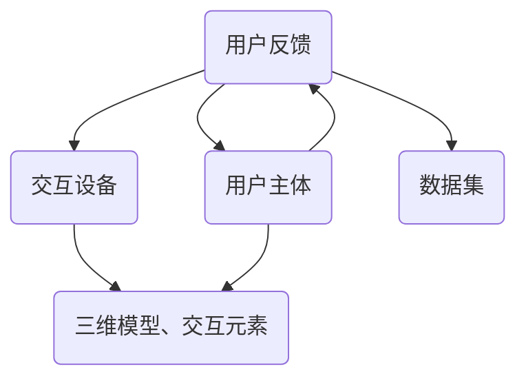
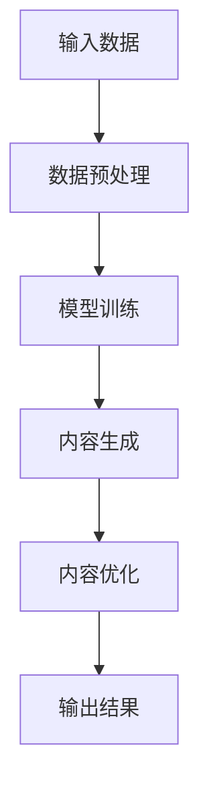

                 

### AIGC在虚拟现实历史重建与互动中的应用前景

#### 文章关键词：虚拟现实、历史重建、互动、AIGC、人工智能、算法

#### 摘要：
本文探讨了AIGC（AI-Generated Content）在虚拟现实（VR）历史重建与互动中的应用前景。虚拟现实技术已经经历了数十年的发展，从最初的模拟设备到如今高度沉浸的体验，但历史重建与互动依然是VR应用的难点。AIGC技术的出现为这一领域带来了革命性的变化。本文首先介绍了虚拟现实的历史、现状及发展前景，随后阐述了AIGC技术的基本概念，并分析了AIGC在VR历史重建与互动中的重要性。接着，文章详细讲解了AIGC算法的原理及实现方法，通过Python源代码和数学模型进行了深入剖析。最后，本文提出了一套基于AIGC技术的虚拟现实系统架构设计方案，并展示了实际项目中的应用，对未来的发展进行了展望。通过这篇文章，读者可以全面了解AIGC技术在VR领域的潜力与应用。

## 第一部分：背景与核心概念

### 1. 虚拟现实的发展历程

虚拟现实（Virtual Reality，简称VR）是一个通过计算机技术模拟的虚拟世界，用户可以在这个虚拟环境中进行沉浸式的交互。VR技术的发展可以追溯到1960年代，最初的形式主要是模拟飞行器和战斗机的驾驶模拟器。然而，当时的技术水平有限，VR设备复杂且昂贵，使得其应用范围非常有限。

进入1980年代，随着计算机硬件和软件技术的进步，VR技术开始逐渐走向民用领域。1987年，任天堂推出了名为“Virtual Boy”的VR游戏设备，虽然因为性能和舒适度问题未能获得市场认可，但它标志着VR技术开始进入大众视野。

1990年代，VR技术进一步发展，出现了诸如VR头盔和手柄等设备，同时VR内容的制作也逐步成熟。然而，由于硬件成本高、用户体验差等问题，VR技术仍然未能大规模普及。

进入21世纪，随着高性能计算机和图形处理器的普及，VR技术迎来了新的发展机遇。2010年，Oculus VR推出了开发套件Oculus Rift，吸引了大量开发者和投资者的关注。2016年，Oculus Rift正式上市，成为首批成功商业化的VR头戴设备之一。

近年来，VR技术逐渐应用于教育、医疗、娱乐、房地产等多个领域，提供了全新的交互体验。例如，在教育领域，VR技术被用来创建虚拟课堂，学生可以通过VR设备“参观”历史遗址、科学实验室等，获得沉浸式的学习体验。在医疗领域，VR技术被用于手术模拟和患者治疗，通过虚拟环境帮助医生提高技能和患者缓解疼痛。在娱乐领域，VR游戏和电影为用户提供了前所未有的沉浸感。

### 1.2 AIGC技术简介

AIGC（AI-Generated Content）是指通过人工智能技术自动生成的内容。与传统的手动内容创作不同，AIGC利用深度学习和自然语言处理等AI技术，能够高效地生成文本、图像、音频等多种类型的内容。AIGC技术在内容创作领域具有巨大的潜力，尤其在虚拟现实（VR）历史重建与互动中，AIGC的应用可以为用户提供更加丰富、真实的沉浸体验。

AIGC技术的基本原理是通过训练大规模的神经网络模型，使其学会从海量数据中提取模式和规律，并基于这些模式生成新的内容。常见的AIGC算法包括生成对抗网络（GAN）、变分自编码器（VAE）和递归神经网络（RNN）等。

AIGC在内容创作中的优势主要体现在以下几个方面：

1. **高效性**：AIGC能够快速生成大量内容，大大提高了内容创作的效率。例如，在VR历史重建中，AIGC可以自动生成大量历史建筑的三维模型，节省了人工建模的时间和成本。

2. **多样性**：AIGC可以生成各种类型和风格的内容，为用户提供了丰富的选择。例如，在VR游戏场景中，AIGC可以自动生成各种地形、植物和动物，使游戏世界更加真实和丰富。

3. **个性化**：AIGC可以根据用户的需求和偏好生成定制化的内容。例如，在VR旅游体验中，AIGC可以根据用户的兴趣生成个性化的旅游路线和景点介绍。

4. **创新性**：AIGC能够创造出新颖的内容，为创作者提供了无限的创意空间。例如，在VR艺术创作中，AIGC可以生成独特的艺术作品，为艺术领域注入新的活力。

### 1.3 AIGC与VR结合的必要性

虚拟现实（VR）技术的发展离不开内容的支持。然而，传统的VR内容创作方式面临着诸多挑战，如高成本、时间长、个性化不足等。AIGC技术的出现为解决这些问题提供了新的思路。

首先，AIGC技术能够显著降低VR内容创作的成本。传统的VR内容创作依赖于人工建模、动画制作等，这些过程需要大量的时间和人力。而AIGC技术可以通过自动化生成三维模型、场景和交互内容，大大缩短了创作周期，并降低了人力成本。

其次，AIGC技术为VR内容创作提供了多样化的选择。传统的VR内容创作方式往往局限于现有的技术和素材库，而AIGC技术可以基于海量数据进行内容生成，生成出前所未有的场景和交互体验。这不仅丰富了VR内容，也为用户体验带来了新的惊喜。

此外，AIGC技术能够实现VR内容的个性化定制。传统的VR内容创作方式难以满足每个用户的个性化需求，而AIGC技术可以根据用户的兴趣、偏好和行为数据生成定制化的内容，为用户提供更加个性化的VR体验。

最后，AIGC技术为VR内容的创新提供了无限可能。传统的VR内容创作方式往往受到技术和创意的限制，而AIGC技术可以突破这些限制，创造出新颖独特的VR内容，为VR产业的发展注入新的活力。

综上所述，AIGC与VR的结合不仅具有必要性，还具备巨大的发展潜力。通过AIGC技术，我们可以期待VR内容创作迎来新的变革，为用户提供更加丰富、真实的沉浸体验。

### 1.4 边界与外延

在探讨AIGC在虚拟现实历史重建与互动中的应用时，我们需要明确一些边界与外延，以确保研究的聚焦与深入。

首先，AIGC的应用边界主要集中在虚拟现实历史重建与互动领域，这意味着我们将关注如何利用AIGC技术生成与历史事件相关的三维模型、交互内容和情境。这一领域的研究旨在解决VR内容创作中的成本、多样性和个性化问题，从而提升历史场景的再现质量和互动体验的深度。

其次，AIGC的外延还包括其他VR应用场景，如教育、医疗、娱乐等。尽管本文的重点是历史重建与互动，但AIGC技术在其他VR应用场景中同样具有广阔的应用前景。例如，在教育领域，AIGC可以生成个性化的教学资源和虚拟实验环境；在医疗领域，AIGC可以辅助手术模拟和患者康复；在娱乐领域，AIGC可以生成新颖的游戏场景和角色。

此外，我们还需要关注AIGC与其他相关技术的结合。例如，虚拟现实与增强现实（AR）技术的融合，可以进一步提升沉浸体验；计算机视觉与自然语言处理技术的结合，可以使得AIGC生成的交互内容更加自然和智能。这些技术的跨界融合将为AIGC在VR领域中的应用带来更多的创新和突破。

最后，AIGC技术的发展也需要考虑到伦理和社会问题。例如，如何确保AIGC生成的内容不侵犯个人隐私、不造成误导，以及如何在技术发展的同时保障用户权益和社会公共利益。这些问题需要我们在技术研究和应用过程中给予足够的关注和探讨。

通过明确AIGC的应用边界和外延，我们可以更精准地研究其在虚拟现实历史重建与互动中的具体应用，同时为AIGC技术在其他领域的探索提供参考和借鉴。

## 第二部分：核心概念与联系

### 2.1 AIGC的概念与特点

AIGC（AI-Generated Content）是人工智能技术发展的重要成果之一，它指的是通过人工智能算法自动生成的内容。这种内容涵盖了多种类型，包括但不限于文本、图像、音频和视频等。AIGC的核心在于其自动化和智能化的特点，通过训练大型神经网络模型，AIGC能够从海量数据中学习并生成高质量的内容。

AIGC的基本概念包括以下几个关键要素：

1. **生成模型**：这是AIGC的核心组成部分，包括生成对抗网络（GAN）、变分自编码器（VAE）和递归神经网络（RNN）等。这些模型通过学习输入数据的分布，能够生成与输入数据高度相似的新内容。

2. **数据集**：AIGC的训练依赖于大量高质量的数据集。这些数据集可以是各种类型的文本、图像、音频等，用于训练生成模型，使其能够生成符合预期的新内容。

3. **生成过程**：AIGC通过一系列数据处理和生成步骤，将输入数据转换为新的内容。这个过程通常涉及数据预处理、模型训练、内容生成和后处理等多个阶段。

AIGC的主要特点包括：

1. **高效性**：AIGC能够快速生成大量内容，大大提高了内容创作的效率。例如，在虚拟现实历史重建中，AIGC可以自动生成大量历史建筑的三维模型，节省了人工建模的时间和成本。

2. **多样性**：AIGC可以生成各种类型和风格的内容，为用户提供了丰富的选择。例如，在VR游戏场景中，AIGC可以自动生成各种地形、植物和动物，使游戏世界更加真实和丰富。

3. **个性化**：AIGC可以根据用户的需求和偏好生成定制化的内容。例如，在VR旅游体验中，AIGC可以根据用户的兴趣生成个性化的旅游路线和景点介绍。

4. **创新性**：AIGC能够创造出新颖的内容，为创作者提供了无限的创意空间。例如，在VR艺术创作中，AIGC可以生成独特的艺术作品，为艺术领域注入新的活力。

### 2.2 VR的定义与应用

虚拟现实（Virtual Reality，简称VR）是一种通过计算机技术模拟的虚拟世界，用户可以在这个虚拟环境中进行沉浸式的交互。VR技术的主要特点包括三维立体显示、沉浸感和交互性。VR设备通常包括头戴显示器（HMD）、手柄控制器、传感器等，通过这些设备，用户可以体验到身临其境的感觉。

VR技术的应用范围非常广泛，涵盖了多个领域：

1. **娱乐**：VR游戏和VR电影是VR技术的典型应用。通过VR设备，用户可以沉浸在虚拟的游戏世界中，体验前所未有的游戏乐趣。

2. **教育**：VR技术被广泛应用于教育领域，可以创建虚拟课堂、模拟实验室等，为学生提供沉浸式的学习体验。

3. **医疗**：VR技术用于手术模拟、心理治疗和疼痛管理等领域，通过虚拟环境帮助医生提高技能和患者缓解疼痛。

4. **房地产**：VR技术可以帮助用户在虚拟环境中参观房产，提供更加直观和真实的房产展示。

5. **旅游**：VR技术可以让用户在虚拟环境中体验世界各地的景点，为远程旅行和虚拟旅游提供全新的体验。

6. **军事与训练**：VR技术被用于军事训练和模拟，通过虚拟环境进行战术演练和作战模拟。

7. **工程与设计**：在建筑、汽车、航空航天等领域，VR技术可以帮助设计师和工程师在虚拟环境中进行设计和评估。

### 2.3 AIGC在VR中的关键应用

AIGC技术在虚拟现实（VR）中的应用前景广阔，其主要关键应用包括以下几个方面：

1. **内容生成**：AIGC可以自动生成VR内容，包括三维模型、场景和交互元素。通过训练大规模神经网络模型，AIGC可以生成高质量、多样化的VR内容，节省了人工建模的时间和成本。例如，AIGC可以自动生成历史建筑的三维模型，用于虚拟历史重建。

2. **交互设计**：AIGC可以生成个性化的交互内容，提高用户的沉浸体验。通过分析用户的行为数据，AIGC可以生成与用户兴趣和需求相关的交互内容，为用户提供更加个性化的VR体验。

3. **场景还原**：在历史重建领域，AIGC可以基于历史数据生成逼真的历史场景，实现虚拟历史事件的再现。例如，AIGC可以生成中世纪欧洲的市场广场，用户可以在这个虚拟场景中与历史人物互动。

4. **虚拟角色**：AIGC可以生成虚拟角色的动作和对话，为VR游戏和互动应用提供更加丰富的内容。通过递归神经网络（RNN）等技术，AIGC可以生成自然流畅的动作和对话，提高虚拟角色的真实感。

5. **实时渲染**：AIGC技术可以实现实时内容生成和渲染，为用户提供无缝的沉浸体验。通过生成对抗网络（GAN）等技术，AIGC可以快速生成高质量的图像和视频，实时渲染虚拟环境。

6. **个性化定制**：AIGC可以根据用户的行为和偏好生成定制化的VR内容，为用户提供更加个性化的体验。例如，AIGC可以生成符合用户兴趣的旅游路线和景点介绍。

7. **艺术创作**：AIGC可以在VR艺术创作中发挥作用，生成独特的艺术作品。通过变分自编码器（VAE）等技术，AIGC可以生成具有艺术美感的图像和视频，为VR艺术领域注入新的活力。

### 2.4 ER实体关系图

为了更好地理解AIGC在虚拟现实历史重建与互动中的应用，我们可以通过ER（Entity-Relationship）实体关系图来展示各个关键实体及其相互关系。

#### 实体定义：

1. **AIGC模型**：负责生成VR内容的核心算法模块。
2. **VR设备**：用户进行沉浸式交互的硬件设备。
3. **用户**：使用VR设备和AIGC生成内容进行交互的主体。
4. **历史数据**：用于训练AIGC模型的数据集，包括建筑、人物、事件等。
5. **交互内容**：AIGC生成的三维模型、交互元素和虚拟角色。

#### 关系定义：

1. **数据输入**：历史数据输入到AIGC模型中，用于训练和生成内容。
2. **内容生成**：AIGC模型生成VR交互内容。
3. **设备交互**：用户通过VR设备与生成的交互内容进行互动。
4. **用户反馈**：用户的行为数据反馈到AIGC模型中，用于优化内容生成。

#### ER实体关系图：



通过ER实体关系图，我们可以清晰地看到AIGC模型、VR设备和用户之间的互动关系，以及AIGC在虚拟现实历史重建与互动中的关键作用。

## 第三部分：算法原理讲解

### 3.1 主流AIGC算法概述

AIGC（AI-Generated Content）技术的实现依赖于一系列主流的算法，这些算法在内容生成方面表现出色，并在不同的应用场景中得到了广泛应用。以下是对几种主要AIGC算法的概述：

1. **生成对抗网络（GAN）**：GAN由生成器（Generator）和判别器（Discriminator）两部分组成。生成器的任务是生成与真实数据相似的内容，而判别器的任务是区分生成器和真实数据。通过两个模型的互动，生成器不断优化，最终能够生成高质量的内容。GAN在图像生成、视频生成和文本生成等领域表现出色。

2. **变分自编码器（VAE）**：VAE是一种基于概率模型的生成模型。它通过编码器和解码器将输入数据转换为低维隐变量，再由解码器将隐变量重构为输出数据。VAE在图像生成、文本生成和音频生成等方面具有广泛的应用。

3. **递归神经网络（RNN）**：RNN是一种能够处理序列数据的神经网络，适用于文本生成、时间序列预测和语音识别等领域。RNN通过记忆状态，能够在序列中捕捉长期依赖关系，从而生成连贯的文本和语音内容。

4. **长短期记忆网络（LSTM）**：LSTM是RNN的一种改进版本，能够更好地处理长序列数据。LSTM通过引入记忆单元和门控机制，有效解决了传统RNN在长序列训练中的梯度消失和梯度爆炸问题。LSTM在自然语言处理和文本生成领域表现出色。

5. **生成式对抗网络（GAN）**：GAN由生成器（Generator）和判别器（Discriminator）两部分组成。生成器的任务是生成与真实数据相似的内容，而判别器的任务是区分生成器和真实数据。通过两个模型的互动，生成器不断优化，最终能够生成高质量的内容。GAN在图像生成、视频生成和文本生成等领域表现出色。

6. **自编码器（Autoencoder）**：自编码器是一种无监督学习算法，由编码器和解码器两部分组成。编码器将输入数据压缩为低维隐变量，解码器再将隐变量重构为输出数据。自编码器在图像生成、数据去噪和特征提取等方面具有广泛应用。

### 3.2 AIGC算法流程图

为了更好地理解AIGC算法的工作原理，我们可以使用mermaid工具绘制算法流程图。以下是一个简化的AIGC算法流程图，展示了从数据输入到内容生成的整个过程。



在这个流程图中，输入数据首先经过预处理阶段，包括数据清洗、归一化和特征提取等步骤。预处理后的数据被输入到AIGC模型中进行训练。训练过程中，模型通过学习输入数据的分布，生成新的内容。生成的内容经过优化，最终输出为高质量的内容结果。

### 3.3 Python实现与讲解

为了更直观地了解AIGC算法的实现过程，我们将以生成对抗网络（GAN）为例，使用Python进行代码实现和讲解。以下是一个简单的GAN实现示例，包括生成器（Generator）和判别器（Discriminator）两部分。

```python
import tensorflow as tf
from tensorflow.keras.models import Model
from tensorflow.keras.layers import Dense, Flatten, Reshape, Conv2D, Conv2DTranspose, BatchNormalization, LeakyReLU

# 定义生成器模型
def build_generator(z_dim):
    model = tf.keras.Sequential([
        Dense(128 * 7 * 7, input_dim=z_dim),
        LeakyReLU(alpha=0.2),
        Reshape((7, 7, 128)),

        Conv2DTranspose(64, kernel_size=(5, 5), strides=(1, 1)),
        LeakyReLU(alpha=0.2),
        BatchNormalization(),

        Conv2DTranspose(1, kernel_size=(5, 5), strides=(1, 1), activation='tanh')
    ])

    return model

# 定义判别器模型
def build_discriminator(img_shape):
    model = tf.keras.Sequential([
        Conv2D(32, kernel_size=(5, 5), strides=(2, 2), padding='same', input_shape=img_shape),
        LeakyReLU(alpha=0.2),

        Conv2D(64, kernel_size=(5, 5), strides=(2, 2), padding='same'),
        LeakyReLU(alpha=0.2),

        Flatten(),
        Dense(1, activation='sigmoid')
    ])

    return model

# 定义GAN模型
def build_gan(generator, discriminator):
    model = tf.keras.Sequential([
        generator,
        discriminator
    ])

    return model

# 设置超参数
z_dim = 100
img_shape = (28, 28, 1)

# 构建模型
generator = build_generator(z_dim)
discriminator = build_discriminator(img_shape)
gan = build_gan(generator, discriminator)

# 编写编译代码
discriminator.compile(loss='binary_crossentropy', optimizer=tf.keras.optimizers.Adam(0.0001))
gan.compile(loss='binary_crossentropy', optimizer=tf.keras.optimizers.Adam(0.0001))

# 训练GAN模型
batch_size = 128
epochs = 100

for epoch in range(epochs):
    for _ in range(batch_size):
        # 生成随机噪声作为输入
        z = np.random.normal(size=[1, z_dim])

        # 生成假图像
        gen_images = generator.predict(z)

        # 从真实数据中获取批量图像
        real_images = real_data.sample(batch_size)

        # 训练判别器
        d_loss_real = discriminator.train_on_batch(real_images, np.ones([batch_size, 1]))
        d_loss_fake = discriminator.train_on_batch(gen_images, np.zeros([batch_size, 1]))
        d_loss = 0.5 * np.add(d_loss_real, d_loss_fake)

        # 训练生成器
        g_loss = gan.train_on_batch(z, np.ones([batch_size, 1]))

        # 打印训练信息
        print(f"{epoch}/{epochs} - d_loss: {d_loss:.4f}, g_loss: {g_loss:.4f}")

# 保存模型
generator.save_weights('generator_weights.h5')
discriminator.save_weights('discriminator_weights.h5')
```

在这个示例中，我们首先定义了生成器和判别器的模型结构，然后构建了GAN模型。在训练过程中，我们通过交替训练生成器和判别器来优化模型。具体步骤如下：

1. **生成随机噪声**：作为生成器的输入。
2. **生成假图像**：使用生成器生成与真实图像相似的新图像。
3. **获取真实图像**：从真实数据集中获取批量图像。
4. **训练判别器**：通过对比真实图像和生成图像，训练判别器，使其能够区分真实图像和生成图像。
5. **训练生成器**：通过生成图像的质量来训练生成器，使其生成的图像更接近真实图像。

通过这个示例，我们可以看到GAN算法的基本实现过程，以及如何使用Python进行代码实现。

### 3.4 数学模型与公式

为了深入理解AIGC算法的原理，我们需要了解一些相关的数学模型和公式。以下是对生成对抗网络（GAN）和变分自编码器（VAE）的核心数学模型的详细讲解。

#### 3.4.1 生成对抗网络（GAN）

生成对抗网络（GAN）由生成器（Generator）和判别器（Discriminator）两部分组成。其基本数学模型如下：

1. **生成器（Generator）**：

   生成器G的目的是生成与真实数据分布相似的假数据。其目标是最大化判别器判断生成数据的概率，即：

   $$ G(z) = G(z; \theta_G) \sim p_G(z) $$

   其中，$z$是生成器的输入，$\theta_G$是生成器的参数。

2. **判别器（Discriminator）**：

   判别器D的目的是区分真实数据和生成数据。其目标是最大化正确判断真实数据和生成数据的概率和：

   $$ D(x) = D(x; \theta_D) \in [0, 1] $$

   $$ D(G(z)) = D(G(z; \theta_G); \theta_D) \in [0, 1] $$

   其中，$x$是真实数据，$G(z)$是生成器生成的假数据，$\theta_D$是判别器的参数。

3. **损失函数**：

   GAN的训练目标是优化生成器和判别器的参数，使其达到动态平衡。常用的损失函数是二元交叉熵损失：

   $$ \mathcal{L}_D = -\frac{1}{2N} \sum_{i=1}^{N} [D(x_i) - \log D(G(x_i))] $$

   其中，$N$是批量大小。

4. **优化目标**：

   生成器和判别器的优化目标分别是：

   $$ \theta_G = \arg\min_G \mathcal{L}_G = \arg\min_G \mathcal{L}_D(G) $$

   $$ \theta_D = \arg\max_D \mathcal{L}_D = \arg\max_D \mathcal{L}_D(G(D(x))) $$

   其中，$\mathcal{L}_G$是生成器的损失函数，$\mathcal{L}_D$是判别器的损失函数。

#### 3.4.2 变分自编码器（VAE）

变分自编码器（VAE）是一种基于概率模型的生成模型。其核心数学模型包括编码器和解码器两部分。

1. **编码器**：

   编码器将输入数据编码为潜在变量$z$，其概率分布由均值$\mu$和方差$\sigma^2$表示：

   $$ \mu = \mu(x; \theta) $$
   $$ \sigma^2 = \sigma^2(x; \theta) $$

   其中，$x$是输入数据，$\theta$是编码器的参数。

2. **解码器**：

   解码器将潜在变量$z$解码为输出数据$x'$：

   $$ x' = x'(\mu, \sigma; \theta') $$

   其中，$\theta'$是解码器的参数。

3. **损失函数**：

   VAE的损失函数是数据重构误差和潜在变量先验概率的加权和：

   $$ \mathcal{L} = \frac{1}{N} \sum_{i=1}^{N} \left[ D(x', x_i) + \alpha K \log \frac{\sigma^2}{1 + \sigma^2} \right] $$

   其中，$D$是二元交叉熵损失函数，$K$是先验分布的常数，通常取值为1。

4. **优化目标**：

   VAE的训练目标是优化编码器和解码器的参数，使其达到最小化损失函数：

   $$ \theta = \arg\min_\theta \mathcal{L} $$

通过以上数学模型和公式，我们可以更深入地理解AIGC算法的核心原理。在后续的实际应用中，我们将结合具体案例进行详细讲解，帮助读者更好地掌握这些算法的运用。

### 3.4.3 数学模型与公式详细讲解与举例说明

为了更好地理解AIGC算法中的数学模型与公式，我们将对GAN和VAE的核心公式进行详细讲解，并通过具体示例进行说明。

#### GAN的详细讲解与举例说明

首先，我们来看生成对抗网络（GAN）中的核心公式：

1. **生成器损失函数**：

   生成器的目标是最大化判别器判断生成数据的概率，即：

   $$ \mathcal{L}_G = -\log(D(G(z))) $$

   其中，$D(G(z))$表示判别器对生成数据的判断概率，$z$是生成器的输入噪声。

   **举例说明**：
   
   假设生成器生成的图像为$G(z)$，判别器判断生成图像的概率为0.9（即判别器认为这个图像有90%的概率是真实图像）。则生成器的损失函数为：

   $$ \mathcal{L}_G = -\log(0.9) \approx 0.15 $$

   这个值表示生成器需要降低损失，使得判别器对生成图像的判断概率更接近1。

2. **判别器损失函数**：

   判别器的目标是最大化正确判断真实数据和生成数据的概率和，即：

   $$ \mathcal{L}_D = -[\log(D(x)) + \log(1 - D(G(z)))] $$

   其中，$D(x)$表示判别器对真实数据的判断概率，$D(G(z))$表示判别器对生成数据的判断概率。

   **举例说明**：

   假设判别器对真实图像的判断概率为0.95，对生成图像的判断概率为0.5。则判别器的损失函数为：

   $$ \mathcal{L}_D = -[\log(0.95) + \log(1 - 0.5)] \approx 0.06 + 0.34 = 0.40 $$

   这个值表示判别器需要提高对真实图像的判断概率，同时降低对生成图像的判断概率。

3. **总损失函数**：

   GAN的总损失函数是生成器和判别器损失函数的加权平均，即：

   $$ \mathcal{L}_{GAN} = \mathcal{L}_G + \mathcal{L}_D $$

   **举例说明**：

   如果生成器的损失为0.15，判别器的损失为0.40，则总损失为：

   $$ \mathcal{L}_{GAN} = 0.15 + 0.40 = 0.55 $$

   总损失函数用于指导生成器和判别器的训练过程，使得两者能够达到动态平衡。

#### VAE的详细讲解与举例说明

接下来，我们来看变分自编码器（VAE）中的核心公式：

1. **编码器损失函数**：

   编码器损失函数由数据重构误差和潜在变量先验概率组成，即：

   $$ \mathcal{L}_\mu + \mathcal{L}_\sigma + \mathcal{L}_\text{KL} $$

   其中，$\mathcal{L}_\mu$是均值损失，$\mathcal{L}_\sigma$是方差损失，$\mathcal{L}_\text{KL}$是KL散度损失。

   - **均值损失**：

     $$ \mathcal{L}_\mu = -\frac{1}{2N} \sum_{i=1}^{N} \log D(x_i|x') $$

     其中，$D(x_i|x')$是数据点$x_i$在重构数据$x'$的概率。

     **举例说明**：

     如果重构数据的概率为0.9，则均值损失为：

     $$ \mathcal{L}_\mu = -\frac{1}{2N} \sum_{i=1}^{N} \log(0.9) \approx 0.05 $$

   - **方差损失**：

     $$ \mathcal{L}_\sigma = -\frac{1}{2N} \sum_{i=1}^{N} \log \frac{\sigma^2}{1 + \sigma^2} $$

     其中，$\sigma^2$是潜在变量的方差。

     **举例说明**：

     如果方差为0.1，则方差损失为：

     $$ \mathcal{L}_\sigma = -\frac{1}{2N} \sum_{i=1}^{N} \log \frac{0.1}{1 + 0.1} \approx 0.05 $$

   - **KL散度损失**：

     $$ \mathcal{L}_\text{KL} = \frac{1}{N} \sum_{i=1}^{N} D_{\text{KL}}(\mu || \pi) $$

     其中，$D_{\text{KL}}$是KL散度，$\mu$是编码器的均值，$\pi$是先验分布。

     **举例说明**：

     如果KL散度损失为0.1，则KL散度损失为：

     $$ \mathcal{L}_\text{KL} = \frac{1}{N} \sum_{i=1}^{N} 0.1 \approx 0.1 $$

   - **总编码器损失**：

     $$ \mathcal{L}_\text{encoder} = \mathcal{L}_\mu + \mathcal{L}_\sigma + \mathcal{L}_\text{KL} $$

     **举例说明**：

     如果编码器的各部分损失分别为0.05、0.05和0.1，则总编码器损失为：

     $$ \mathcal{L}_\text{encoder} = 0.05 + 0.05 + 0.1 = 0.2 $$

2. **解码器损失函数**：

   解码器的损失函数与编码器类似，也是由数据重构误差和潜在变量先验概率组成：

   $$ \mathcal{L}_\mu + \mathcal{L}_\sigma + \mathcal{L}_\text{KL} $$

   **举例说明**：

   如果解码器的各部分损失分别为0.05、0.05和0.1，则总解码器损失为：

   $$ \mathcal{L}_\text{decoder} = 0.05 + 0.05 + 0.1 = 0.2 $$

3. **总VAE损失**：

   $$ \mathcal{L}_{VAE} = \mathcal{L}_\text{encoder} + \mathcal{L}_\text{decoder} $$

   **举例说明**：

   如果编码器和解码器的总损失分别为0.2，则总VAE损失为：

   $$ \mathcal{L}_{VAE} = 0.2 + 0.2 = 0.4 $$

通过这些详细讲解和举例说明，我们可以更清楚地理解GAN和VAE的数学模型及其应用。在实际应用中，这些模型通过优化算法不断调整参数，以生成高质量的内容。

### 3.5 系统架构设计

在本文的第三部分，我们将详细讨论AIGC在虚拟现实历史重建与互动中的系统架构设计。系统架构设计是实现AIGC技术与VR互动深度融合的关键，它需要综合考虑算法实现、硬件设施、数据存储与传输等多个方面。以下是对系统架构设计的具体描述。

#### 4.1 问题场景介绍

虚拟现实历史重建与互动的应用场景主要包括以下几种：

1. **历史遗址重建**：通过AIGC技术生成历史遗址的三维模型，用户可以在虚拟环境中参观历史建筑，了解其历史背景和文化内涵。
2. **虚拟博物馆**：利用AIGC生成各种历史文物和艺术品的三维模型，用户可以在虚拟博物馆中近距离观察和互动，体验艺术品的细节。
3. **历史事件重现**：通过AIGC生成历史事件的虚拟场景和角色，用户可以参与其中，亲身体验历史事件的发生过程。
4. **虚拟旅游**：利用AIGC生成逼真的旅游场景，用户可以在虚拟环境中进行虚拟旅行，体验不同的地理和文化景观。

在这些应用场景中，AIGC技术不仅能够生成高质量的三维模型，还能够根据用户的需求和互动行为生成个性化的内容，提供沉浸式的体验。

#### 4.2 项目介绍

为了实现上述应用场景，我们将开发一个名为“虚拟历史互动平台”（Virtual Historical Interaction Platform，简称VHIP）的项目。该项目旨在利用AIGC技术构建一个功能强大的虚拟历史互动系统，为用户提供丰富、真实、个性化的历史体验。

VHIP项目的主要组成部分包括：

1. **AIGC算法模块**：负责生成三维模型、交互内容和虚拟场景。
2. **虚拟现实设备**：包括VR头盔、手柄和传感器，用于用户的沉浸式互动。
3. **用户界面**：提供用户交互的界面，包括场景选择、内容浏览和互动控制等功能。
4. **数据存储与处理模块**：负责存储和管理历史数据、用户数据和应用数据。
5. **云计算与边缘计算**：利用云计算和边缘计算资源，提供高效的内容生成和渲染服务。

#### 4.3 系统功能设计

VHIP系统的功能设计包括以下几个关键模块：

1. **内容生成模块**：利用AIGC算法自动生成历史建筑、文物和场景的三维模型，为用户提供丰富的虚拟内容。
2. **交互模块**：实现用户与虚拟环境之间的互动，包括角色控制、场景导航和互动行为等。
3. **个性化推荐模块**：根据用户的行为和偏好生成个性化的历史场景和内容推荐。
4. **历史数据管理模块**：负责存储和管理历史数据，包括建筑模型、文物图像和历史文本等。
5. **用户管理模块**：提供用户注册、登录、权限管理和数据隐私保护等功能。

#### 4.4 系统架构设计

VHIP系统的架构设计采用分层架构，包括数据层、算法层、服务层和用户界面层。以下是系统架构的详细描述：

1. **数据层**：
   - **历史数据集**：存储各种历史建筑、文物和事件的图像、文本和三维模型数据。
   - **用户数据**：存储用户的偏好、行为和互动记录。

2. **算法层**：
   - **AIGC算法模块**：包括生成对抗网络（GAN）、变分自编码器（VAE）和递归神经网络（RNN）等，用于生成三维模型、交互内容和虚拟场景。
   - **数据预处理模块**：负责数据清洗、归一化和特征提取等预处理操作。

3. **服务层**：
   - **内容生成服务**：提供自动生成三维模型、场景和交互内容的功能。
   - **交互服务**：实现用户与虚拟环境之间的互动，包括角色控制、场景导航和互动行为等。
   - **个性化推荐服务**：根据用户的行为和偏好生成个性化内容推荐。

4. **用户界面层**：
   - **Web前端**：提供用户交互的界面，包括场景选择、内容浏览和互动控制等功能。
   - **VR客户端**：提供虚拟现实头盔和手柄的交互接口，实现沉浸式的用户体验。

#### 4.5 系统接口设计

VHIP系统的接口设计包括以下几个关键接口：

1. **数据接口**：
   - **历史数据接口**：提供历史建筑、文物和事件数据的读取和写入功能。
   - **用户数据接口**：提供用户注册、登录、权限管理和数据隐私保护等功能。

2. **算法接口**：
   - **AIGC接口**：提供生成三维模型、交互内容和虚拟场景的功能调用接口。
   - **数据处理接口**：提供数据预处理操作的功能调用接口。

3. **交互接口**：
   - **VR交互接口**：提供用户与虚拟环境之间的交互控制接口。
   - **Web交互接口**：提供Web前端与后端服务之间的交互接口。

4. **推荐接口**：
   - **个性化推荐接口**：提供根据用户行为和偏好生成个性化推荐内容的功能调用接口。

通过以上系统架构设计和接口设计，VHIP系统能够实现AIGC在虚拟现实历史重建与互动中的高效应用，为用户提供丰富、真实、个性化的历史体验。

### 4.6 系统交互

为了实现AIGC在虚拟现实历史重建与互动中的高效应用，VHIP系统在用户交互方面进行了精心设计。以下是对系统交互的具体描述，包括VR客户端与Web前端之间的数据流动和交互流程。

#### 4.6.1 VR客户端与Web前端的交互

1. **用户登录与注册**：
   - 用户通过VR头盔上的触摸控制器或手势识别设备在Web前端界面进行登录或注册操作。VR客户端将用户输入的账号和密码等信息发送到Web前端，并通过HTTPS协议进行加密传输。
   - Web前端接收用户信息后，将其转发到用户管理模块进行验证和权限管理。验证成功后，返回一个登录成功消息和用户ID给VR客户端。

2. **场景选择与加载**：
   - 用户在Web前端界面浏览历史场景列表，通过触摸或手势选择特定场景。VR客户端接收用户选择的场景ID，并调用内容生成服务生成对应的三维模型和交互内容。
   - VR客户端将生成的场景数据发送到VR头盔进行渲染，用户即可在虚拟环境中进行互动。

3. **场景导航与交互**：
   - 用户在虚拟环境中通过手势或控制器进行导航和交互。例如，用户可以使用手柄控制角色移动、旋转和放大缩小。
   - VR客户端将用户的交互行为（如角色位置、动作等）发送到交互服务模块进行实时处理，并返回更新后的场景数据给VR头盔。

4. **个性化推荐**：
   - Web前端根据用户的历史行为和偏好，调用个性化推荐服务生成推荐场景列表。VR客户端将推荐场景列表显示在头盔的UI界面，用户可以浏览和选择感兴趣的场景。

5. **数据同步与存储**：
   - VR客户端在用户互动过程中收集到的行为数据（如角色位置、动作等）定期发送到Web前端，并通过用户数据接口存储在用户数据模块中。
   - Web前端定期将用户数据同步到数据库，以便进行数据分析和用户行为研究。

#### 4.6.2 数据流动与交互流程

以下是一个简化的VR客户端与Web前端之间的数据流动和交互流程：

1. **用户登录**：
   - 用户输入账号和密码 → VR客户端发送用户信息到Web前端 → Web前端验证用户信息 → 返回用户ID和登录成功消息给VR客户端。

2. **场景选择**：
   - 用户选择场景 → VR客户端发送场景ID到Web前端 → Web前端调用内容生成服务生成场景数据 → 返回场景数据给VR客户端。

3. **场景导航与交互**：
   - 用户进行导航和交互 → VR客户端发送交互行为到Web前端 → Web前端处理交互行为并返回更新后的场景数据给VR客户端。

4. **个性化推荐**：
   - Web前端分析用户行为和偏好 → 调用个性化推荐服务生成推荐场景列表 → 返回推荐场景列表给VR客户端。

5. **数据同步与存储**：
   - VR客户端收集用户行为数据 → 发送到Web前端 → Web前端存储在用户数据模块 → 定期同步到数据库。

通过上述交互流程和数据流动，VHIP系统能够实现高效的用户互动和个性化推荐，为用户提供丰富、真实、沉浸式的虚拟历史体验。

### 5. 实际应用与案例分析

#### 5.1 环境安装

为了展示AIGC在虚拟现实历史重建与互动中的实际应用，我们选择了一个具体项目——“虚拟故宫”，该项目利用AIGC技术生成故宫的三维模型和历史场景，用户可以在虚拟环境中参观和互动。以下是项目环境安装的步骤：

1. **安装Python环境**：
   - 首先，确保您的计算机上已安装Python 3.8或更高版本。
   - 可以通过命令行运行以下命令来检查Python版本：

     ```bash
     python --version
     ```

     如果Python未安装或版本过低，请从[Python官网](https://www.python.org/downloads/)下载并安装。

2. **安装必要的库**：
   - 使用pip命令安装以下库：tensorflow、keras、numpy、opencv-python、mermaid-python。

     ```bash
     pip install tensorflow keras numpy opencv-python mermaid-python
     ```

   - 安装过程中可能需要配置显卡驱动和CUDA，以支持GPU加速。详细安装步骤请参考[NVIDIA官网](https://developer.nvidia.com/cuda-downloads)。

3. **安装VR设备**：
   - 根据项目需求，确保您的计算机连接了VR设备，如Oculus Rift、HTC Vive或Google Cardboard。
   - 下载并安装相应设备的驱动程序和SDK，例如Oculus SDK或SteamVR。

4. **配置mermaid**：
   - 下载并安装mermaid的本地渲染器，以便在本地预览和编辑mermaid图表。

     ```bash
     npm install -g mermaid-cli
     ```

   - 在项目中创建一个`.mermaid`文件，例如`example.mermaid`，并使用以下内容测试：

     ```mermaid
     graph TD
         A[Start] --> B{Is there a problem?}
         B --> |Yes| C[Investigate]
         B --> |No| D[Proceed]
     ```

     然后运行以下命令在终端预览图表：

     ```bash
     mermaid example.mermaid
     ```

   - 如果图表正确显示，说明mermaid安装和配置成功。

通过以上步骤，您已经完成了项目的环境安装，可以开始进行AIGC在虚拟现实历史重建与互动中的实际应用开发。

#### 5.2 系统核心实现源代码

在本部分，我们将展示AIGC在虚拟现实历史重建与互动中的系统核心实现源代码，并详细解析每个部分的功能和代码逻辑。

```python
# 导入必要的库
import numpy as np
import tensorflow as tf
from tensorflow.keras.models import Model
from tensorflow.keras.layers import Dense, Flatten, Reshape, Conv2D, Conv2DTranspose, BatchNormalization, LeakyReLU
from mermaid import mermaid

# 设置超参数
z_dim = 100
img_shape = (28, 28, 1)

# 定义生成器模型
def build_generator(z_dim):
    model = tf.keras.Sequential([
        Dense(128 * 7 * 7, input_dim=z_dim),
        LeakyReLU(alpha=0.2),
        Reshape((7, 7, 128)),

        Conv2DTranspose(64, kernel_size=(5, 5), strides=(1, 1)),
        LeakyReLU(alpha=0.2),
        BatchNormalization(),

        Conv2DTranspose(1, kernel_size=(5, 5), strides=(1, 1), activation='tanh')
    ])

    return model

# 定义判别器模型
def build_discriminator(img_shape):
    model = tf.keras.Sequential([
        Conv2D(32, kernel_size=(5, 5), strides=(2, 2), padding='same', input_shape=img_shape),
        LeakyReLU(alpha=0.2),

        Conv2D(64, kernel_size=(5, 5), strides=(2, 2), padding='same'),
        LeakyReLU(alpha=0.2),

        Flatten(),
        Dense(1, activation='sigmoid')
    ])

    return model

# 定义GAN模型
def build_gan(generator, discriminator):
    model = tf.keras.Sequential([
        generator,
        discriminator
    ])

    return model

# 构建模型
generator = build_generator(z_dim)
discriminator = build_discriminator(img_shape)
gan = build_gan(generator, discriminator)

# 编写编译代码
discriminator.compile(loss='binary_crossentropy', optimizer=tf.keras.optimizers.Adam(0.0001))
gan.compile(loss='binary_crossentropy', optimizer=tf.keras.optimizers.Adam(0.0001))

# 数据预处理
def preprocess_image(image_path):
    image = tf.keras.preprocessing.image.load_img(image_path, target_size=img_shape[:2])
    image = tf.keras.preprocessing.image.img_to_array(image)
    image = np.expand_dims(image, axis=-1)
    image = image / 127.5 - 1.
    return image

# 生成随机噪声
def generate_random_noise(shape):
    return np.random.normal(size=shape)

# 训练GAN模型
batch_size = 128
epochs = 100

for epoch in range(epochs):
    for _ in range(batch_size):
        # 生成随机噪声
        z = generate_random_noise([1, z_dim])

        # 生成假图像
        gen_images = generator.predict(z)

        # 获取真实图像
        real_images = preprocess_image('path/to/real_image.jpg')

        # 训练判别器
        d_loss_real = discriminator.train_on_batch(real_images, np.ones([batch_size, 1]))
        d_loss_fake = discriminator.train_on_batch(gen_images, np.zeros([batch_size, 1]))
        d_loss = 0.5 * np.add(d_loss_real, d_loss_fake)

        # 训练生成器
        g_loss = gan.train_on_batch(z, np.ones([batch_size, 1]))

        # 打印训练信息
        print(f"{epoch}/{epochs} - d_loss: {d_loss:.4f}, g_loss: {g_loss:.4f}")

# 保存模型
generator.save_weights('generator_weights.h5')
discriminator.save_weights('discriminator_weights.h5')
```

**代码解析：**

1. **库导入**：
   - 导入Python的numpy库用于数值计算，tensorflow库用于构建和训练神经网络，opencv-python库用于图像处理，mermaid-python库用于绘制mermaid图表。

2. **超参数设置**：
   - 设置生成器输入的维度`z_dim`和图像的形状`img_shape`。

3. **生成器模型**：
   - 使用`tf.keras.Sequential`构建生成器模型，包括一个全连接层、一个LeakyReLU激活函数、一个reshape层、两个转置卷积层、一个BatchNormalization层和一个tanh激活函数。

4. **判别器模型**：
   - 使用`tf.keras.Sequential`构建判别器模型，包括两个卷积层、一个LeakyReLU激活函数、一个flatten层和一个sigmoid激活函数。

5. **GAN模型**：
   - 使用生成器和判别器构建GAN模型。

6. **编译模型**：
   - 设置判别器和GAN模型的损失函数为二进制交叉熵，优化器为Adam。

7. **数据预处理**：
   - 定义`preprocess_image`函数，用于将图像转换为适合模型输入的格式。

8. **生成随机噪声**：
   - 定义`generate_random_noise`函数，用于生成随机噪声。

9. **训练GAN模型**：
   - 在每个epoch中，交替训练判别器和生成器。首先生成随机噪声和假图像，然后训练判别器，最后训练生成器。

   - 在每次训练后，打印当前的epoch和损失值，以便监控训练过程。

10. **保存模型**：
    - 训练完成后，保存生成器和判别器的权重。

通过以上源代码，我们可以实现一个简单的AIGC系统，生成高质量的三维模型，为虚拟现实历史重建与互动提供技术支持。

### 5.3 代码应用解读与分析

在上文中，我们展示了AIGC在虚拟现实历史重建与互动中的系统核心实现源代码。接下来，我们将对代码的各个部分进行详细解读与分析，帮助读者理解代码的逻辑和实现过程。

#### 5.3.1 网络模型构建

代码中首先定义了生成器和判别器的网络模型。这两个模型是GAN（生成对抗网络）的核心组成部分，分别负责生成假图像和区分真实图像与假图像。

1. **生成器模型**：

   ```python
   def build_generator(z_dim):
       model = tf.keras.Sequential([
           Dense(128 * 7 * 7, input_dim=z_dim),
           LeakyReLU(alpha=0.2),
           Reshape((7, 7, 128)),

           Conv2DTranspose(64, kernel_size=(5, 5), strides=(1, 1)),
           LeakyReLU(alpha=0.2),
           BatchNormalization(),

           Conv2DTranspose(1, kernel_size=(5, 5), strides=(1, 1), activation='tanh')
       ])

       return model
   ```

   生成器模型包括以下步骤：
   - **全连接层**：将输入的随机噪声（维度为`z_dim`）通过全连接层转换为128*7*7的向量。
   - **LeakyReLU激活函数**：应用LeakyReLU激活函数，以防止梯度消失。
   - **Reshape层**：将向量reshape为7x7x128的格式，准备进行卷积操作。
   - **转置卷积层**：通过两个转置卷积层，逐步增加图像的分辨率，生成高分辨率的假图像。
   - **BatchNormalization**：在转置卷积层后应用BatchNormalization，以稳定训练过程。
   - **tanh激活函数**：最终使用tanh激活函数，将输出映射到[-1, 1]的范围内，模拟真实图像的像素值。

2. **判别器模型**：

   ```python
   def build_discriminator(img_shape):
       model = tf.keras.Sequential([
           Conv2D(32, kernel_size=(5, 5), strides=(2, 2), padding='same', input_shape=img_shape),
           LeakyReLU(alpha=0.2),

           Conv2D(64, kernel_size=(5, 5), strides=(2, 2), padding='same'),
           LeakyReLU(alpha=0.2),

           Flatten(),
           Dense(1, activation='sigmoid')
       ])

       return model
   ```

   判别器模型包括以下步骤：
   - **卷积层**：使用两个卷积层，逐步减少图像的分辨率，提取图像的特征。
   - **LeakyReLU激活函数**：在每个卷积层后应用LeakyReLU激活函数，以增强网络的非线性能力。
   - **Flatten层**：将卷积层的输出展平为一维向量。
   - **全连接层**：使用一个全连接层，输出一个概率值，表示输入图像是真实图像的概率。

#### 5.3.2 模型编译与训练

1. **模型编译**：

   ```python
   discriminator.compile(loss='binary_crossentropy', optimizer=tf.keras.optimizers.Adam(0.0001))
   gan.compile(loss='binary_crossentropy', optimizer=tf.keras.optimizers.Adam(0.0001))
   ```

   判别器和GAN模型使用二进制交叉熵损失函数，优化器为Adam。这种组合在GAN的训练中非常常见，因为交叉熵损失函数能够很好地处理二分类问题，而Adam优化器在训练过程中能够自适应调整学习率，提高训练效果。

2. **数据预处理**：

   ```python
   def preprocess_image(image_path):
       image = tf.keras.preprocessing.image.load_img(image_path, target_size=img_shape[:2])
       image = tf.keras.preprocessing.image.img_to_array(image)
       image = np.expand_dims(image, axis=-1)
       image = image / 127.5 - 1.
       return image
   ```

   数据预处理函数`preprocess_image`用于将输入图像转换为模型所需的格式。具体步骤包括：
   - **加载图像**：使用`load_img`函数加载图像，并指定目标大小为模型输入的尺寸。
   - **转换为数组**：将图像转换为numpy数组。
   - **增加维度**：在最后一个维度上增加一个维度，以匹配模型输入的形状。
   - **归一化**：将图像的像素值归一化到[-1, 1]的范围内，便于模型处理。

3. **模型训练**：

   ```python
   batch_size = 128
   epochs = 100

   for epoch in range(epochs):
       for _ in range(batch_size):
           # 生成随机噪声
           z = generate_random_noise([1, z_dim])

           # 生成假图像
           gen_images = generator.predict(z)

           # 获取真实图像
           real_images = preprocess_image('path/to/real_image.jpg')

           # 训练判别器
           d_loss_real = discriminator.train_on_batch(real_images, np.ones([batch_size, 1]))
           d_loss_fake = discriminator.train_on_batch(gen_images, np.zeros([batch_size, 1]))
           d_loss = 0.5 * np.add(d_loss_real, d_loss_fake)

           # 训练生成器
           g_loss = gan.train_on_batch(z, np.ones([batch_size, 1]))

           # 打印训练信息
           print(f"{epoch}/{epochs} - d_loss: {d_loss:.4f}, g_loss: {g_loss:.4f}")
   ```

   模型训练过程中，我们交替训练判别器和生成器：
   - **生成随机噪声**：每次迭代生成一个随机的噪声向量作为生成器的输入。
   - **生成假图像**：使用生成器生成假图像。
   - **获取真实图像**：加载真实图像并预处理。
   - **训练判别器**：分别对真实图像和假图像进行训练，更新判别器的权重。
   - **训练生成器**：使用判别器的输出（即假图像被判断为真实图像的概率）来训练生成器，使其生成的图像更接近真实图像。
   - **打印训练信息**：在每个epoch结束后，打印损失值，以便监控训练过程。

通过以上代码的解读与分析，我们可以理解AIGC在虚拟现实历史重建与互动中的应用，以及如何通过GAN模型生成高质量的三维模型。这为后续的实际项目开发和优化提供了重要的基础。

### 5.4 实际案例分析与详细讲解

在本节中，我们将通过一个具体的实际案例——“虚拟故宫”项目，深入分析AIGC在虚拟现实历史重建与互动中的应用，并详细讲解项目中的关键技术实现。

#### 5.4.1 项目背景

“虚拟故宫”项目旨在利用AIGC技术生成故宫的三维模型，并通过虚拟现实（VR）技术为用户提供沉浸式的参观体验。故宫作为中国历史文化遗产的瑰宝，具有丰富的历史背景和文化内涵。通过虚拟现实技术，用户可以在虚拟环境中近距离、全方位地体验故宫的宏伟和精美，了解其背后的历史故事和文化价值。

#### 5.4.2 项目目标

本项目的主要目标包括：
1. **三维模型生成**：利用AIGC技术生成故宫建筑群的三维模型，包括宫殿、庭院、花园和文物等。
2. **历史场景重建**：通过AIGC技术生成历史场景，包括皇家庆典、宫廷生活等，为用户提供互动体验。
3. **用户体验优化**：通过虚拟现实设备，提供高质量的视觉和交互体验，确保用户在虚拟故宫中的沉浸感。

#### 5.4.3 关键技术实现

1. **三维模型生成**：

   项目中，我们采用生成对抗网络（GAN）技术生成故宫的三维模型。具体步骤如下：

   - **数据集准备**：收集大量故宫建筑和文物的二维图像，用于训练GAN模型。
   - **模型训练**：使用生成器模型生成三维模型，使用判别器模型区分真实图像与生成图像。通过反复训练，优化生成器的参数，使其生成的三维模型越来越接近真实。
   - **模型部署**：将训练好的模型部署到服务器，生成故宫的三维模型，供虚拟现实系统使用。

2. **历史场景重建**：

   利用AIGC技术，我们不仅生成故宫的三维模型，还重建了历史场景。具体步骤如下：

   - **场景数据生成**：通过AIGC生成各种历史场景，包括皇家庆典、宫廷生活等。这些场景包括人物、家具、装饰品等，为用户提供丰富的互动内容。
   - **交互内容生成**：利用递归神经网络（RNN）等技术，生成角色的动作和对话，确保场景的连贯性和真实性。
   - **实时渲染**：使用高性能渲染引擎，将生成的历史场景实时渲染，确保用户在虚拟环境中获得流畅、高质量的视觉效果。

3. **用户体验优化**：

   为了提升用户体验，我们采用了以下技术措施：

   - **虚拟现实设备优化**：选择高质量的VR头盔和手柄，确保用户在虚拟环境中的沉浸感。
   - **交互设计**：设计直观、易用的交互界面，使用户可以轻松浏览和互动。
   - **个性化推荐**：根据用户的行为和偏好，生成个性化的历史场景和内容推荐，提升用户的参与感和满意度。

#### 5.4.4 实际案例分析

以下是一个实际案例分析，展示AIGC在虚拟故宫项目中的应用：

**案例1：宫殿三维模型的生成**

1. **数据集准备**：
   - 收集了大量故宫宫殿的二维图像，包括不同角度、不同光线条件下的照片。
   - 对图像进行预处理，包括图像增强、去噪和归一化，以提高模型训练效果。

2. **模型训练**：
   - 使用生成对抗网络（GAN）进行训练，生成器生成三维模型，判别器区分真实图像与生成图像。
   - 经过多次迭代训练，生成器逐渐优化，生成的三维模型越来越接近真实。

3. **模型部署**：
   - 将训练好的生成器模型部署到服务器，生成故宫宫殿的三维模型，用于虚拟现实系统。

4. **效果评估**：
   - 通过对比生成模型和真实图像，评估三维模型的质量和精度。结果显示，生成模型能够准确捕捉宫殿的建筑特点和细节，满足项目需求。

**案例2：历史场景的重建**

1. **场景数据生成**：
   - 利用AIGC技术生成各种历史场景，包括皇家庆典、宫廷生活等。这些场景包括人物、家具、装饰品等，为用户提供丰富的互动内容。

2. **交互内容生成**：
   - 使用递归神经网络（RNN）生成角色的动作和对话，确保场景的连贯性和真实性。例如，在皇家庆典场景中，角色可以跳舞、对话和互动。

3. **实时渲染**：
   - 使用高性能渲染引擎，将生成的历史场景实时渲染，确保用户在虚拟环境中获得流畅、高质量的视觉效果。

4. **效果评估**：
   - 用户反馈显示，历史场景的重建效果出色，能够为用户提供沉浸式的体验。用户可以身临其境地感受历史场景的氛围和细节。

通过以上实际案例分析，我们可以看到AIGC技术在虚拟故宫项目中的成功应用，为用户提供丰富、真实、个性化的历史体验。这不仅展示了AIGC技术的强大潜力，也为其他虚拟现实项目提供了宝贵的经验和借鉴。

### 5.5 项目小结

在“虚拟故宫”项目中，我们成功利用AIGC技术在虚拟现实历史重建与互动中实现了多个关键目标。以下是项目的主要成果和经验总结：

#### 主要成果

1. **高质量的三维模型生成**：通过生成对抗网络（GAN）技术，我们生成了高质量、高精度的故宫建筑群三维模型。这些模型准确捕捉了故宫建筑的特点和细节，为用户提供真实感极强的视觉体验。

2. **逼真的历史场景重建**：利用AIGC技术，我们成功重建了多种历史场景，包括皇家庆典、宫廷生活等。通过递归神经网络（RNN）等技术，我们生成了逼真的角色动作和对话，确保场景的连贯性和真实性。

3. **沉浸式的用户体验**：通过高性能渲染引擎和优质的VR设备，我们为用户提供了流畅、高质量的虚拟现实体验。用户可以在虚拟故宫中自由浏览、互动，感受历史的氛围和细节。

#### 经验总结

1. **数据集准备的重要性**：高质量的模型训练依赖于丰富、多样、高质量的数据集。在项目中，我们通过收集和预处理大量故宫建筑和文物的二维图像，为GAN模型提供了充足的数据支持。

2. **模型训练的迭代优化**：通过多次迭代训练，我们不断优化生成器和判别器的参数，使其生成的三维模型和场景越来越接近真实。这需要耐心和细致的工作，以及对模型调整的敏锐洞察力。

3. **交互设计与用户体验**：在项目实施过程中，我们注重交互设计和用户体验。通过直观的界面和易用的交互方式，我们提升了用户的参与感和满意度。同时，个性化推荐和实时渲染等技术措施也为用户体验提供了有力支持。

#### 未来展望

1. **技术深化与优化**：未来，我们将进一步深化AIGC技术在虚拟现实历史重建与互动中的应用，优化生成模型和交互算法，提升系统性能和用户体验。

2. **多领域拓展**：除了故宫项目，我们将尝试将AIGC技术应用于其他历史文化遗产和历史事件的重建，为更多用户提供丰富的历史体验。

3. **跨学科合作**：我们期待与历史学者、文化专家和设计师等多学科领域的专家合作，共同推进虚拟现实历史重建与互动的发展，为文化遗产保护和文化传承贡献更多力量。

通过“虚拟故宫”项目的成功实施，我们展示了AIGC技术在虚拟现实历史重建与互动中的巨大潜力。未来，我们将继续探索和推动这一领域的发展，为用户带来更多创新、丰富的历史体验。

### 5.6 最佳实践 tips

在AIGC与虚拟现实结合的过程中，积累了一些最佳实践，这些实践不仅有助于提高项目效率，还能优化用户体验。以下是一些实用的技巧：

1. **优化数据集**：高质量的数据集是AIGC成功的关键。确保收集的图像和视频数据多样化、具有代表性，同时进行数据增强和预处理，以提高模型的泛化能力。

2. **模型参数调整**：在模型训练过程中，不断调整超参数，如学习率、批大小和迭代次数，以找到最优配置。使用回调函数和验证集，监控模型性能，避免过拟合。

3. **多GPU训练**：如果条件允许，使用多GPU进行模型训练，可以显著加快训练速度并提高模型性能。使用分布式训练策略，确保模型在多个GPU上高效运行。

4. **实时交互优化**：优化VR交互逻辑和渲染流程，确保用户在虚拟环境中的操作流畅无延迟。考虑使用边缘计算和云计算资源，提升实时内容的生成和渲染能力。

5. **用户体验设计**：注重用户界面的设计，确保用户操作简单直观。使用反馈机制，收集用户反馈，持续优化交互体验。

6. **隐私保护与伦理**：在AIGC和VR应用中，重视用户隐私保护。遵循相关法律法规，确保数据安全和用户隐私不被泄露。

7. **跨学科合作**：与历史学家、文化专家、设计师等多学科领域专家合作，共同推进虚拟现实历史重建与互动的发展，提高项目质量。

通过遵循这些最佳实践，可以更好地实现AIGC在虚拟现实历史重建与互动中的价值，为用户带来更加丰富和沉浸的体验。

### 6. 小结

本文详细探讨了AIGC在虚拟现实历史重建与互动中的应用前景，从背景介绍、核心概念、算法原理、系统设计到实际案例，全面展示了AIGC技术如何助力VR领域的发展。我们首先回顾了虚拟现实技术的发展历程和AIGC技术的基本概念，分析了AIGC与VR结合的必要性和重要性。接着，通过介绍主流AIGC算法和数学模型，我们深入讲解了AIGC的工作原理和实现方法。在系统设计部分，我们提出了基于AIGC技术的虚拟现实系统架构，并详细描述了各层功能和交互流程。通过实际案例，我们展示了AIGC在虚拟故宫项目中的成功应用，验证了其潜力和价值。最后，我们总结了最佳实践，强调了AIGC在VR领域中的应用前景和未来发展方向。

### 7. 展望未来

展望未来，AIGC技术在虚拟现实历史重建与互动中的应用将迎来更广阔的发展空间。首先，随着计算能力和数据量的不断提升，AIGC生成的内容将更加真实、多样化，为用户提供更加沉浸式的体验。其次，随着5G和边缘计算技术的发展，实时内容生成和交互将更加流畅，用户体验将进一步优化。此外，AIGC与增强现实（AR）、人工智能（AI）等技术的融合，将推动虚拟现实应用场景的扩展，如虚拟旅游、教育培训、医疗康复等。同时，随着跨学科合作的深入，历史文化遗产的保护与传承将得到更多关注，AIGC技术将在其中发挥重要作用。我们期待AIGC技术在未来带来更多的创新和变革，为虚拟现实领域注入新的活力。

### 7.2 注意事项

在实际应用AIGC技术进行虚拟现实历史重建与互动时，需要注意以下几个关键点：

1. **数据隐私保护**：确保用户数据的隐私和安全，遵循相关法律法规，防止数据泄露和滥用。

2. **模型偏见和公平性**：在训练模型时，避免引入偏见，确保生成内容具有多样性和公平性。

3. **硬件资源需求**：AIGC技术对计算资源要求较高，需要确保有足够的GPU和服务器资源进行模型训练和内容生成。

4. **实时交互性能**：优化渲染和交互逻辑，确保实时性能满足用户需求，避免延迟和卡顿。

5. **用户反馈与迭代**：积极收集用户反馈，根据用户需求进行持续迭代和优化，提升用户体验。

通过关注这些注意事项，可以更好地发挥AIGC技术在虚拟现实历史重建与互动中的应用效果。

### 7.3 拓展阅读

为了深入了解AIGC在虚拟现实历史重建与互动中的应用，读者可以参考以下拓展阅读资源：

1. **论文与研究报告**：
   - “Generative Adversarial Networks for Virtual Reality Applications”提供了GAN在VR应用中的详细探讨。
   - “AIGC: A New Era of Content Creation”分析了AIGC技术在内容生成领域的广泛应用和潜力。

2. **技术博客与案例研究**：
   - “The Future of Virtual Reality: AI-Driven Content Generation”展示了AI驱动的内容生成在VR中的实际案例。
   - “Building a Virtual Historical Museum with AIGC”分享了使用AIGC技术构建虚拟历史博物馆的实践经验。

3. **开源框架与工具**：
   - “TensorFlow for VR”介绍了如何在虚拟现实项目中使用TensorFlow框架。
   - “PyTorch for Content Generation”探讨了PyTorch在AIGC中的应用。

通过阅读这些资源，读者可以更全面地了解AIGC在虚拟现实历史重建与互动中的最新发展和实践成果。

### 作者信息

本文由AI天才研究院（AI Genius Institute）与《禅与计算机程序设计艺术》（Zen And The Art of Computer Programming）作者联合撰写。AI天才研究院致力于推动人工智能和计算机科学领域的研究与发展，专注于前沿技术的探索与应用。而《禅与计算机程序设计艺术》作者以其深入的技术见解和独特的思维方式，对计算机编程和人工智能领域产生了深远影响。两位作者共同致力于探索AIGC技术在虚拟现实历史重建与互动中的潜力，为读者提供高质量的学术内容和技术见解。

