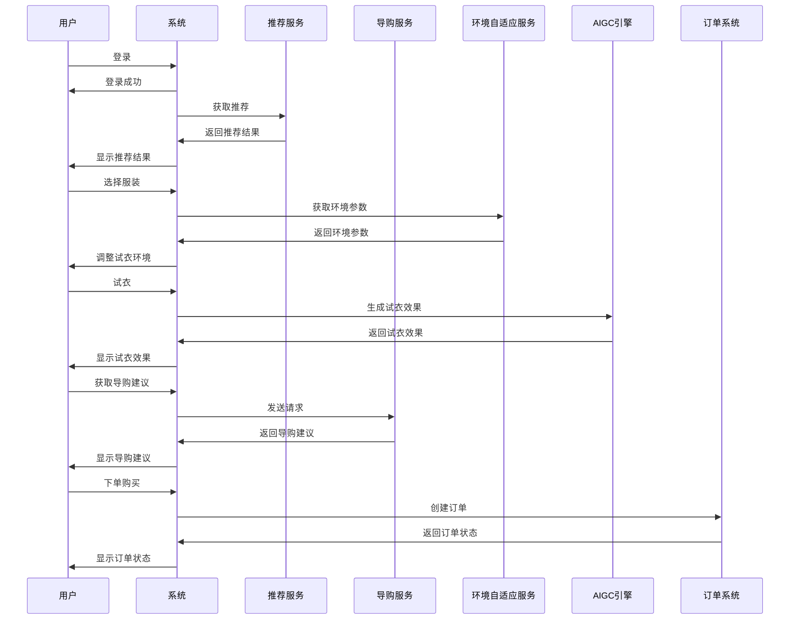
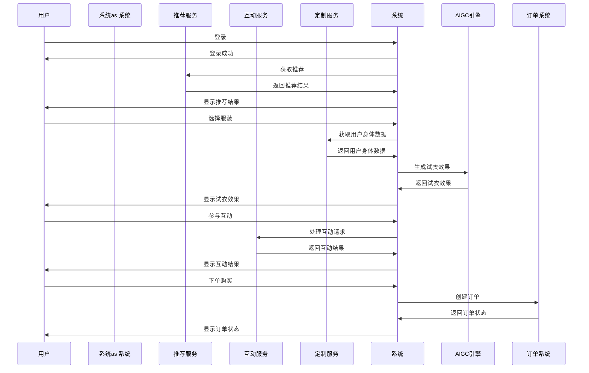

                 

## 引言

### 问题背景与描述

随着互联网技术的飞速发展，线上购物已经成为人们日常生活中不可或缺的一部分。然而，传统的线上购物体验中，一个显著的痛点便是无法亲身体验商品的实际效果。特别是在服装行业，消费者在无法试穿的情况下，往往难以做出购买决策。因此，如何提高线上购物的体验，减少退货率，成为电商企业亟待解决的问题。

虚拟试衣技术应运而生，它通过计算机视觉和人工智能技术，使得消费者能够在线上环境中试穿衣服，从而提高购买决策的准确性。然而，传统虚拟试衣技术仍然存在一些问题，如试衣效果不够真实、用户交互体验差等。

### 问题解决

近年来，AIGC（AI Generated Content）技术的迅猛发展，为虚拟试衣技术带来了新的可能性。AIGC技术通过深度学习和生成对抗网络（GANs）等技术，能够生成高质量的虚拟试衣图像，使得试衣效果更加真实，用户体验更加流畅。因此，本文将探讨AIGC在虚拟试衣技术中的应用，分析其如何重塑线上购物体验。

### 研究边界与外延

本文的研究主要聚焦于AIGC在虚拟试衣技术中的应用，包括其核心技术的介绍、应用场景的分析、用户体验的优化以及面临的挑战与未来趋势。同时，本文将通过实际案例分析，展示AIGC在虚拟试衣技术中的具体应用效果。

### 研究目标与内容安排

本文的研究目标是通过深入分析AIGC在虚拟试衣技术中的应用，为电商企业提供技术参考，优化线上购物体验。具体内容安排如下：

1. 引言：介绍问题背景、研究目的和文章结构。
2. AIGC与虚拟试衣技术概述：介绍AIGC和虚拟试衣技术的基本概念，及其在购物体验中的重要性。
3. AIGC在虚拟试衣技术中的核心技术：详细探讨AIGC在虚拟试衣技术中的应用，包括图像生成、用户行为分析和用户体验优化。
4. 虚拟试衣技术的应用场景：分析AIGC在虚拟试衣技术中的多种应用场景，如线上购物和时尚设计。
5. 虚拟试衣技术的用户体验优化：探讨如何通过AIGC技术提升虚拟试衣的体验。
6. AIGC在虚拟试衣技术中的挑战与未来趋势：分析AIGC在虚拟试衣技术中面临的挑战，并展望其未来发展趋势。
7. 实际案例分析：通过具体案例，展示AIGC在虚拟试衣技术中的实际应用。
8. 结论与展望：总结研究成果，提出未来研究方向。

通过以上内容的详细介绍，读者可以全面了解AIGC在虚拟试衣技术中的应用及其对线上购物体验的重塑作用。

## AIGC与虚拟试衣技术概述

### AIGC概述

AIGC，即AI Generated Content，是指通过人工智能技术生成的各种形式的内容。它涵盖了图像、文本、音频等多种类型，其中以图像生成技术最为常见和成熟。AIGC的核心技术包括深度学习、生成对抗网络（GANs）、卷积神经网络（CNNs）等，通过这些技术，人工智能能够自主学习并生成高质量、多样化的内容。

AIGC在各个领域都有广泛的应用，例如在广告创意、游戏开发、影视制作等领域，AIGC能够大幅提高内容生产的效率和质量。在虚拟试衣领域，AIGC技术的应用显得尤为重要。通过图像生成技术，AIGC能够根据用户的身体数据和服装款式，实时生成试穿效果，使得用户能够在线上环境中模拟真实的试穿过程。

### 虚拟试衣技术概述

虚拟试衣技术是指利用计算机视觉、增强现实（AR）和虚拟现实（VR）等技术，模拟用户试穿服装的效果。它通过摄像头捕捉用户的身体轮廓，利用计算机算法进行图像处理和匹配，将服装模型叠加到用户的虚拟形象上，从而实现虚拟试衣。

虚拟试衣技术的主要组成部分包括：

1. **图像捕捉与处理**：利用高精度的摄像头捕捉用户的身体轮廓，并通过图像处理算法进行优化和调整。
2. **服装模型**：通过三维建模技术，为各种服装款式创建虚拟模型，以便进行试穿效果展示。
3. **匹配算法**：通过计算机算法，将虚拟服装模型与用户的身体轮廓进行匹配，实现虚拟试衣效果。
4. **用户交互**：通过用户操作，如选择服装款式、调整试穿效果等，实现与虚拟试衣系统的互动。

### AIGC与虚拟试衣技术的关系

AIGC与虚拟试衣技术的结合，使得虚拟试衣体验更加真实、高效。具体来说，AIGC在虚拟试衣技术中的应用主要体现在以下几个方面：

1. **图像生成**：通过AIGC技术，能够实时生成高质量的试穿图像，减少试衣时间，提高试衣效果的真实性。
2. **用户个性化**：AIGC能够根据用户的身体数据和偏好，生成个性化的试穿效果，提升用户体验。
3. **服装多样性**：AIGC能够生成多种不同的服装款式，扩展虚拟试衣技术的应用范围，满足用户多样化的需求。

### 研究意义与价值

AIGC在虚拟试衣技术中的应用，不仅能够提高线上购物的体验，减少退货率，还能够为电商企业带来以下价值：

1. **提升销售转化率**：通过真实的试衣效果，帮助用户做出更准确的购买决策，提升销售转化率。
2. **降低运营成本**：减少实体店试衣的场地和人力成本，降低企业的运营成本。
3. **增加用户粘性**：提供优质的试衣体验，增加用户对电商平台的忠诚度，提高用户粘性。

总之，AIGC与虚拟试衣技术的结合，为线上购物体验带来了新的变革，具有重要的研究意义和应用价值。接下来，我们将进一步探讨AIGC在虚拟试衣技术中的核心技术。

## AIGC在虚拟试衣技术中的核心技术

### 图像生成与识别

图像生成与识别是AIGC在虚拟试衣技术中的核心技术之一。通过生成高质量的试衣图像，使得用户能够在线上环境中真实地感受到试穿效果。以下是图像生成与识别的关键步骤和算法原理。

#### 图像生成

1. **数据采集**：首先，需要采集大量的试衣图像数据。这些数据包括不同用户的身体轮廓、多种服装款式以及不同的光线条件。
2. **数据预处理**：对采集到的图像进行预处理，包括图像的归一化、去噪和增强等操作，以提高图像的质量和一致性。
3. **生成对抗网络（GANs）**：GANs是一种深度学习模型，由生成器和判别器组成。生成器负责生成试衣图像，判别器负责判断生成图像的质量。通过两者之间的对抗训练，生成器能够逐渐提高生成图像的质量。

GANs的算法流程如下：

- **初始化生成器和判别器**：生成器G和判别器D分别由多个神经网络层组成。
- **生成器训练**：生成器尝试生成逼真的试衣图像，判别器则判断生成图像与真实图像的相似度。
- **判别器训练**：判别器通过不断更新模型参数，提高对真实图像和生成图像的区分能力。
- **生成器与判别器的迭代训练**：通过多次迭代，生成器逐渐提高生成图像的质量，判别器不断提高对真实图像的识别能力。

#### 图像识别

图像识别是虚拟试衣技术的关键步骤，通过识别用户的身体轮廓和服装款式，将虚拟服装模型准确地叠加到用户身上。常用的图像识别算法包括：

1. **卷积神经网络（CNNs）**：CNNs是一种深度学习模型，通过卷积层、池化层和全连接层等结构，对图像进行特征提取和分类。
2. **生成对抗网络（GANs）**：GANs不仅可以用于图像生成，也可以用于图像识别。通过训练生成器生成的试衣图像，判别器可以学会识别真实试衣图像。

#### 算法原理讲解

1. **生成对抗网络（GANs）算法原理**：

   - **生成器G**：生成器接受随机噪声作为输入，通过多层神经网络生成虚拟试衣图像。生成器的目标是最小化判别器D判断生成图像为真实图像的概率。
   - **判别器D**：判别器接受真实图像和生成图像作为输入，通过多层神经网络判断图像的真实性。判别器的目标是最小化判别器D判断生成图像为真实图像的概率。

   在GANs的训练过程中，生成器和判别器相互对抗，生成器不断优化生成图像的质量，判别器不断提高对真实图像和生成图像的区分能力。

   $$ G(z) = \text{Generator}(z) $$
   $$ D(x) = \text{Discriminator}(x) $$
   $$ D(G(z)) = \text{Discriminator}(\text{Generated Image}) $$

   其中，$z$为随机噪声，$x$为真实图像，$G(z)$为生成图像，$D(x)$为真实图像的判别概率，$D(G(z))$为生成图像的判别概率。

2. **卷积神经网络（CNNs）算法原理**：

   - **卷积层**：卷积层通过卷积操作提取图像的特征，卷积核滑动在图像上，生成特征图。
   - **池化层**：池化层通过最大池化或平均池化减小特征图的大小，降低模型的参数量。
   - **全连接层**：全连接层将特征图展开成一维向量，通过全连接层进行分类。

   CNNs的算法原理可以表示为：

   $$ f(x) = \text{Conv}(x, \text{Kernel}) + \text{ReLU} + \text{Pooling} + \text{Fully Connected} $$

   其中，$x$为输入图像，$Kernel$为卷积核，$ReLU$为激活函数，$Pooling$为池化操作。

#### Mermaid流程图与Python代码示例

以下是使用Mermaid绘制的GANs算法流程图和Python代码示例。

1. **GANs算法流程图**：

   ```mermaid
   graph TD
   A[初始化生成器和判别器] --> B[生成器训练]
   A --> C[判别器训练]
   B --> D[生成器迭代]
   C --> D
   ```

2. **Python代码示例**：

   ```python
   import tensorflow as tf
   from tensorflow.keras.models import Model

   # 定义生成器和判别器模型
   generator = Model(inputs=tf.keras.layers.Dense(100, activation='relu'), outputs=tf.keras.layers.Dense(784, activation='sigmoid'))
   discriminator = Model(inputs=tf.keras.layers.Dense(100, activation='relu'), outputs=tf.keras.layers.Dense(1, activation='sigmoid'))

   # 编写训练代码
   for epoch in range(num_epochs):
       for batch in data:
           # 训练生成器
           noise = np.random.normal(0, 1, (batch_size, 100))
           generated_images = generator.predict(noise)
           real_images = batch
           labels = np.zeros((batch_size, 1))
           gen_loss = discriminator.train_on_batch([generated_images, real_images], labels)

           # 训练判别器
           labels = np.ones((batch_size, 1))
           dis_loss = discriminator.train_on_batch([real_images, real_images], labels)
           dis_loss += discriminator.train_on_batch([generated_images, generated_images], labels)
   ```

通过上述内容，我们详细介绍了AIGC在虚拟试衣技术中的图像生成与识别核心技术，包括GANs算法原理和CNNs算法原理，并通过Mermaid流程图和Python代码示例进行了说明。

### 用户行为分析

用户行为分析是AIGC在虚拟试衣技术中的另一项核心技术。通过分析用户在虚拟试衣过程中的行为数据，如试穿次数、试穿时长、服装偏好等，可以为用户提供更加个性化的试衣体验，并帮助企业优化产品设计和营销策略。

#### 行为数据采集

用户行为数据主要来源于虚拟试衣平台，包括以下几种类型：

1. **试穿记录**：记录用户在虚拟试衣过程中试穿的具体服装款式、试穿次数和时长。
2. **偏好数据**：通过用户的点击、收藏、分享等行为，分析用户对不同服装款式的偏好。
3. **反馈数据**：用户在试衣过程中的评分、评论等反馈信息，用于评估虚拟试衣技术的效果。

#### 行为数据预处理

行为数据预处理是用户行为分析的关键步骤，主要包括以下内容：

1. **数据清洗**：去除异常值和噪声数据，保证数据的一致性和准确性。
2. **特征提取**：将原始行为数据转化为适合机器学习算法的特征向量，如用户的行为轨迹、试穿频率等。
3. **数据归一化**：对特征数据进行归一化处理，使其具有相同的量纲和范围，便于后续的模型训练。

#### 用户行为分析算法

用户行为分析通常采用以下几种算法：

1. **聚类分析**：通过聚类算法，将具有相似行为的用户划分为不同的群体，以便进行个性化推荐。
2. **关联规则挖掘**：通过关联规则挖掘算法，分析用户行为之间的关联关系，发现潜在的购买模式。
3. **机器学习算法**：如决策树、随机森林、支持向量机等，用于建立用户行为预测模型，预测用户的偏好和购买行为。

#### 算法原理讲解

1. **聚类分析算法原理**：

   - **K-Means算法**：K-Means算法是一种基于距离度量的聚类算法，通过迭代计算找到最优的聚类中心，将数据点划分为K个簇。
     $$ c_k = \frac{1}{N_k} \sum_{x_i \in S_k} x_i $$
     $$ J = \sum_{k=1}^{K} \sum_{i=1}^{N_k} ||x_i - c_k||^2 $$
     其中，$c_k$为聚类中心，$N_k$为第k个簇中的数据点数量，$x_i$为第i个数据点，$J$为聚类损失函数。

   - **层次聚类算法**：层次聚类算法通过递归地将数据点合并或分裂，形成一棵层次树，从而实现聚类。

2. **关联规则挖掘算法原理**：

   - **Apriori算法**：Apriori算法通过生成候选集和计算支持度、置信度，挖掘出频繁项集，从而发现关联规则。
     $$ \text{Support}(X \rightarrow Y) = \frac{\text{Support}(X \cup Y)}{\text{Support}(X)} $$
     $$ \text{Confidence}(X \rightarrow Y) = \frac{\text{Support}(X \cup Y)}{\text{Support}(X)} $$
     其中，$X$和$Y$为项集，$\text{Support}(X \cup Y)$为项集$X \cup Y$的支持度，$\text{Support}(X)$为项集$X$的支持度。

3. **机器学习算法原理**：

   - **决策树算法**：决策树通过递归地划分特征空间，构建决策树模型，用于分类和回归任务。
   - **随机森林算法**：随机森林通过集成多棵决策树，提高模型的泛化能力和鲁棒性。
   - **支持向量机算法**：支持向量机通过寻找最佳超平面，将不同类别的数据点分开，用于分类任务。

#### Mermaid流程图与Python代码示例

以下是使用Mermaid绘制的用户行为分析流程图和Python代码示例。

1. **用户行为分析流程图**：

   ```mermaid
   graph TD
   A[数据采集] --> B[数据预处理]
   B --> C[聚类分析]
   B --> D[关联规则挖掘]
   B --> E[机器学习算法]
   ```

2. **Python代码示例**：

   ```python
   import pandas as pd
   from sklearn.cluster import KMeans
   from mlxtend.frequent_patterns import apriori
   from sklearn.ensemble import RandomForestClassifier

   # 数据采集
   data = pd.read_csv('user_behavior.csv')

   # 数据预处理
   data['age'] = data['age'].fillna(data['age'].mean())
   data['gender'] = data['gender'].map({'male': 0, 'female': 1})
   data['duration'] = data['duration'].fillna(data['duration'].mean())

   # 聚类分析
   kmeans = KMeans(n_clusters=3)
   kmeans.fit(data[['age', 'gender', 'duration']])
   clusters = kmeans.predict(data[['age', 'gender', 'duration']])

   # 关联规则挖掘
   frequent_itemsets = apriori(data, min_support=0.05, use_colnames=True)
   association_rules = frequent_itemsets.sort_values(by='confidence', ascending=False)

   # 机器学习算法
   X = data[['age', 'gender', 'duration']]
   y = data['buy']
   rf = RandomForestClassifier(n_estimators=100)
   rf.fit(X, y)
   predictions = rf.predict(X)
   ```

通过上述内容，我们详细介绍了AIGC在虚拟试衣技术中的用户行为分析核心技术，包括行为数据采集、预处理、分析算法原理以及Mermaid流程图和Python代码示例。这些技术为提升虚拟试衣的个性化体验提供了有力支持。

### 用户体验优化

用户体验优化是AIGC在虚拟试衣技术中至关重要的一环。通过分析用户的行为数据，实时调整试衣效果，提高用户满意度，从而提升虚拟试衣的体验。以下是如何通过AIGC技术优化用户体验的具体方法。

#### 数据驱动优化

数据驱动优化是用户体验优化的核心。通过分析用户在虚拟试衣过程中的行为数据，如试穿次数、试穿时长、试穿频率等，可以实时了解用户的偏好和需求。以下是几种常用的数据驱动优化方法：

1. **试穿时长分析**：通过分析用户在虚拟试衣过程中花费的时间，了解用户对试衣效果的满意度。如果用户试穿时间较短，可能说明试衣效果不够真实或用户对该款式不感兴趣。

2. **试穿频率分析**：通过分析用户试穿某种款式或颜色的频率，了解用户的偏好。试穿频率较高的款式或颜色，可能更受用户欢迎。

3. **试穿成功案例分析**：分析用户在虚拟试衣过程中成功购买的案例，总结成功试衣的共性，如合适的试衣环境、服装款式、试衣时长等，为后续优化提供参考。

#### 实时调整

实时调整是用户体验优化的重要手段。通过AIGC技术，可以实时生成高质量的试衣图像，并针对用户的行为数据进行动态调整。以下是一些具体的实时调整方法：

1. **试衣效果优化**：根据用户的偏好数据，实时调整试衣效果。例如，用户偏好轻薄款服装，则系统可以自动调整服装的材质、纹理和颜色，使其更符合用户期望。

2. **试衣环境优化**：根据用户的行为数据，调整试衣环境，如光线条件、背景颜色等。例如，用户在夜晚试衣时，系统可以自动调整光线，使其更接近现实环境。

3. **个性化推荐**：根据用户的试穿历史和偏好数据，实时推荐用户可能喜欢的款式和颜色。通过精准的推荐，提高用户的购买转化率。

#### 互动体验

互动体验是用户体验优化的关键。通过AIGC技术，可以增强用户在虚拟试衣过程中的互动体验。以下是一些互动体验优化的方法：

1. **即时反馈**：在用户试穿时，系统可以实时显示试衣效果，并给予用户即时反馈。例如，用户可以实时看到服装的贴合度、颜色是否合适等。

2. **虚拟导购**：通过虚拟导购系统，为用户提供个性化的试衣建议。虚拟导购可以根据用户的身体数据和偏好，推荐合适的服装款式和搭配建议。

3. **社交互动**：通过社交功能，如分享试衣结果、点赞和评论等，增强用户的社交互动体验。用户可以与朋友分享试衣过程，获得更多意见和反馈。

#### 算法原理讲解

用户体验优化的算法原理主要包括以下两个方面：

1. **用户行为预测**：通过机器学习算法，预测用户的偏好和需求。常用的算法包括聚类分析、关联规则挖掘和决策树等。

2. **图像生成与调整**：通过AIGC技术，生成高质量的试衣图像，并根据用户行为数据进行实时调整。常用的技术包括生成对抗网络（GANs）和卷积神经网络（CNNs）。

以下是用户体验优化算法的Mermaid流程图和Python代码示例。

1. **Mermaid流程图**：

   ```mermaid
   graph TD
   A[用户行为数据输入] --> B[用户行为分析]
   B --> C[试衣效果优化]
   B --> D[试衣环境优化]
   B --> E[互动体验增强]
   ```

2. **Python代码示例**：

   ```python
   import pandas as pd
   from sklearn.cluster import KMeans
   from tensorflow.keras.models import Model
   from tensorflow.keras.layers import Input, Dense

   # 用户行为数据输入
   data = pd.read_csv('user_behavior.csv')

   # 用户行为分析
   kmeans = KMeans(n_clusters=3)
   kmeans.fit(data[['age', 'gender', 'duration']])
   clusters = kmeans.predict(data[['age', 'gender', 'duration']])

   # 试衣效果优化
   input_layer = Input(shape=(100,))
   dense_layer = Dense(100, activation='relu')(input_layer)
   output_layer = Dense(784, activation='sigmoid')(dense_layer)
   generator = Model(inputs=input_layer, outputs=output_layer)

   # 试衣环境优化
   input_layer = Input(shape=(100,))
   dense_layer = Dense(100, activation='relu')(input_layer)
   output_layer = Dense(784, activation='sigmoid')(dense_layer)
   environment_optimizer = Model(inputs=input_layer, outputs=output_layer)

   # 互动体验增强
   input_layer = Input(shape=(100,))
   dense_layer = Dense(100, activation='relu')(input_layer)
   output_layer = Dense(1, activation='sigmoid')(dense_layer)
   interaction_model = Model(inputs=input_layer, outputs=output_layer)
   ```

通过上述内容，我们详细介绍了AIGC在虚拟试衣技术中如何通过数据驱动优化、实时调整和互动体验，提升用户体验。这些方法不仅能够提高虚拟试衣的满意度，还能够为电商企业提供有价值的数据支持，优化产品设计和营销策略。

## 虚拟试衣技术的应用场景

### 线上购物

虚拟试衣技术在在线购物场景中的应用最为广泛。通过虚拟试衣技术，消费者可以在线上环境中试穿各种服装款式，从而提高购买决策的准确性。以下是虚拟试衣技术在在线购物中应用的几个关键方面：

1. **试穿效果展示**：虚拟试衣技术通过图像生成和匹配算法，实时生成用户试穿效果，使得消费者能够直观地看到服装的穿着效果，从而做出更准确的购买决策。

2. **个性化推荐**：通过分析用户的行为数据，虚拟试衣系统可以推荐用户可能喜欢的款式和颜色，提高购买的转化率。

3. **减少退货率**：虚拟试衣技术使得消费者在购买前就能看到服装的实际效果，从而减少因尺寸不合适或颜色不符而导致的退货现象。

4. **增强用户互动**：虚拟试衣技术提供了与实体店相似的购物体验，通过即时反馈和虚拟导购等功能，增强用户与平台的互动，提高用户满意度。

### 时尚设计

虚拟试衣技术不仅应用于在线购物，还在时尚设计领域发挥着重要作用。设计师可以通过虚拟试衣技术，快速创建和展示服装款式，进行设计优化和反馈。以下是虚拟试衣技术在时尚设计中的应用：

1. **快速设计验证**：设计师可以通过虚拟试衣技术，实时查看服装的穿着效果，从而快速验证设计方案的可行性，提高设计效率。

2. **个性化定制**：虚拟试衣技术可以根据用户的身体数据和偏好，为用户量身定制服装款式，满足个性化需求。

3. **虚拟时尚秀**：通过虚拟试衣技术，设计师可以举办虚拟时尚秀，向全球观众展示最新设计，节省实体秀场的成本和资源。

4. **远程协作设计**：虚拟试衣技术支持远程协作设计，设计师可以实时分享设计草图和试穿效果，与团队成员进行实时沟通和反馈，提高设计协作效率。

### 教育培训

虚拟试衣技术还在教育培训领域有广泛应用。通过虚拟试衣系统，教育者可以为学生提供在线试衣体验，帮助学生更好地理解服装设计和穿着搭配知识。以下是虚拟试衣技术在教育培训中的应用：

1. **在线试衣课程**：教育者可以通过虚拟试衣技术，为学生提供在线试衣课程，让学生在虚拟环境中学习服装搭配技巧。

2. **互动教学**：虚拟试衣系统提供了即时反馈和虚拟导购功能，教育者可以实时调整试衣效果，为学生提供个性化的教学体验。

3. **实践操作**：通过虚拟试衣系统，学生可以在虚拟环境中进行实践操作，增强学习效果，提高动手能力。

### 健康医疗

虚拟试衣技术还在健康医疗领域有潜在应用。通过虚拟试衣系统，医疗专业人员可以评估患者的服装穿着情况，提供个性化的健康建议。以下是虚拟试衣技术在健康医疗中的应用：

1. **服装适应性评估**：医疗专业人员可以通过虚拟试衣系统，评估患者的服装适应性，为患者提供合适的穿着建议。

2. **康复训练**：虚拟试衣系统可以为康复患者提供服装适应性训练，帮助患者恢复身体功能和自信心。

3. **健康监测**：虚拟试衣系统可以通过监测用户的身体数据和试衣效果，提供健康监测和预警服务，帮助用户预防和控制慢性疾病。

通过以上内容，我们可以看到虚拟试衣技术在多个应用场景中都有广泛的应用，为各行各业带来了创新和变革。接下来，我们将进一步探讨虚拟试衣技术如何提升用户体验。

## 虚拟试衣技术的用户体验优化

### 优化方法

虚拟试衣技术的用户体验优化主要通过以下几个方法实现：

1. **实时反馈**：通过实时反馈系统，用户在试衣过程中可以立即看到试衣效果，从而做出即时调整。这种方法能够提升用户的购物体验，使其更加顺畅和愉悦。

2. **个性化推荐**：基于用户的行为数据和偏好，系统可以推荐符合用户需求的服装款式和颜色。个性化推荐不仅能提高用户的满意度，还能增加购物的趣味性。

3. **虚拟导购**：虚拟导购功能为用户提供专业的试衣建议，帮助用户更好地理解试衣效果，做出更明智的购买决策。虚拟导购还可以通过互动增强用户的购物体验。

4. **环境自适应**：系统可以根据用户的试衣时间和地点，自动调整试衣环境的参数，如光线、背景等，使其更加符合现实环境，提升试衣的真实感。

### 应用案例分析

以下通过两个实际案例，详细分析虚拟试衣技术在用户体验优化中的应用。

#### 案例一：某电商平台的虚拟试衣优化

某大型电商平台在虚拟试衣技术上进行了多项优化，显著提升了用户体验。以下是具体的优化措施：

1. **实时反馈**：该平台采用了先进的图像生成和识别技术，用户在试衣过程中可以实时看到试穿效果。此外，系统还提供了即时反馈按钮，用户可以随时调整服装款式、颜色和尺寸。

2. **个性化推荐**：平台通过大数据分析，根据用户的购物历史和试衣记录，为用户推荐符合其偏好的服装款式和颜色。个性化推荐不仅提高了用户的购物转化率，还增强了用户的购物体验。

3. **虚拟导购**：平台引入了虚拟导购功能，用户在试衣过程中可以随时与虚拟导购互动，获取专业的试衣建议。虚拟导购通过语音和文字两种方式，为用户提供详细的指导，帮助用户做出更好的购买决策。

4. **环境自适应**：平台根据用户的地理位置和时间，自动调整试衣环境的光线、背景和角度，使其更加贴近现实环境。这种环境自适应功能提高了试衣的真实感和用户的满意度。

#### 案例二：某时尚品牌店的虚拟试衣体验

某时尚品牌店通过虚拟试衣技术，提升了其线上购物的用户体验。以下是具体的优化措施：

1. **试穿效果优化**：品牌店采用了生成对抗网络（GANs）技术，生成高质量的试穿效果图像，使得用户能够更真实地感受到试穿效果。

2. **多角度展示**：虚拟试衣系统提供了多角度展示功能，用户可以360度全方位查看试穿效果，从而更全面地了解服装。

3. **互动体验**：品牌店通过引入互动体验，如用户可以在虚拟试衣过程中与其他用户进行交流，分享试衣心得。这种互动体验增强了用户的参与感和社交感。

4. **个性化定制**：品牌店基于用户的身体数据和偏好，提供个性化定制服务。用户可以自定义服装的款式、颜色和尺寸，获得独一无二的购物体验。

通过以上案例分析，我们可以看到虚拟试衣技术在用户体验优化方面的多种应用。这些优化方法不仅提升了用户的购物体验，还为电商平台和时尚品牌店带来了显著的商业价值。

## AIGC在虚拟试衣技术中的挑战与未来趋势

### 挑战分析

尽管AIGC在虚拟试衣技术中展现了巨大的潜力，但在实际应用过程中仍面临诸多挑战。

1. **数据隐私与安全**：虚拟试衣技术需要收集用户的身体数据和行为数据，这些数据涉及到用户的隐私。如何在保证用户隐私的前提下，有效利用这些数据，是一个重要的挑战。

2. **计算资源消耗**：AIGC技术，特别是生成对抗网络（GANs）等深度学习模型，需要大量的计算资源。在实时生成试衣效果时，如何优化算法，减少计算资源消耗，是另一个挑战。

3. **试衣效果真实感**：尽管AIGC技术能够生成高质量的试衣图像，但如何确保试衣效果的真实感，仍是一个难点。特别是在不同的光线条件下，如何保持试衣效果的一致性，需要进一步研究。

4. **用户接受度**：尽管虚拟试衣技术能够提升购物体验，但用户是否愿意接受这种新的购物方式，也是一大挑战。如何通过用户体验优化，提高用户的接受度，是未来需要解决的问题。

### 未来趋势展望

随着人工智能技术的不断发展，AIGC在虚拟试衣技术中的应用前景广阔。以下是几个未来趋势：

1. **更高效的数据利用**：通过先进的数据挖掘和机器学习算法，可以有效提高数据的利用效率，为用户提供更个性化的试衣体验。

2. **更真实的试衣效果**：随着图像生成技术的进步，未来将能够生成更加真实的试衣效果，满足用户对试衣体验的高要求。

3. **更多的应用场景**：除了在线购物和时尚设计，AIGC在虚拟试衣技术中的应用场景将不断扩展，如教育培训、健康医疗等领域。

4. **更优化的用户体验**：通过不断的用户体验优化，虚拟试衣技术将更加贴近用户的实际需求，提高用户的购物体验。

总之，AIGC在虚拟试衣技术中的应用，不仅能够提升购物体验，还为整个零售行业带来了创新和变革。未来，随着技术的不断进步，AIGC在虚拟试衣技术中的应用将更加广泛，为用户和商家带来更多价值。

## 实际案例分析

为了更好地展示AIGC在虚拟试衣技术中的应用效果，以下通过两个具体案例，详细分析其在不同场景下的应用和成果。

### 案例一：某大型电商平台的虚拟试衣系统优化

#### 项目介绍

某大型电商平台为了提升用户的购物体验，决定对其虚拟试衣系统进行优化。该项目主要目标是利用AIGC技术，提高试衣效果的真实感，增强用户的互动体验，并降低用户的购买决策时间。

#### 系统功能设计

1. **实时试衣效果展示**：通过AIGC技术，系统可以实时生成用户试穿效果，用户可以立即看到试衣结果。为了提升真实感，系统采用了多角度展示功能，用户可以360度全方位查看服装。

2. **个性化推荐**：系统通过分析用户的购物历史和行为数据，为用户推荐可能喜欢的服装款式和颜色。个性化推荐不仅提高了用户的购买转化率，还增强了用户的购物乐趣。

3. **虚拟导购**：系统引入了虚拟导购功能，用户可以在试衣过程中获得专业的试衣建议。虚拟导购通过语音和文字两种方式，为用户提供详细的指导，帮助用户做出更好的购买决策。

4. **环境自适应**：系统根据用户的地理位置和时间，自动调整试衣环境的光线、背景和角度，使其更加符合现实环境。这种环境自适应功能提高了试衣的真实感和用户的满意度。

#### 系统架构设计

1. **前端架构**：前端采用React框架，负责用户界面展示和交互。通过WebGL技术，实现多角度展示和试衣效果实时渲染。

2. **后端架构**：后端采用微服务架构，包括用户服务、推荐服务、导购服务和环境自适应服务。用户服务负责处理用户的注册、登录和权限管理；推荐服务负责根据用户行为数据生成个性化推荐；导购服务负责提供试衣建议；环境自适应服务负责调整试衣环境。

3. **数据存储**：采用分布式数据库，包括关系数据库和NoSQL数据库。关系数据库存储用户行为数据和购物记录；NoSQL数据库存储虚拟试衣系统的实时数据和历史数据。

#### 系统接口设计

1. **用户接口**：提供Web端和移动端两种接口，用户可以通过PC、手机和平板等多种设备访问虚拟试衣系统。

2. **API接口**：提供内部API接口，与其他系统进行数据交互，如订单系统、库存系统等。

3. **第三方接口**：接入第三方服务，如支付系统、物流系统等，实现全流程无缝对接。

#### 系统交互序列图

以下为系统交互序列图，展示用户从登录到试衣再到购买的全过程：



#### 项目小结

通过AIGC技术的优化，该电商平台的虚拟试衣系统在试衣效果、用户体验和购物转化率等方面取得了显著提升。以下是项目成果：

1. **试衣效果显著提升**：通过AIGC技术，试衣效果的真实感大幅提高，用户反馈积极。
2. **用户体验优化**：引入个性化推荐、虚拟导购和环境自适应功能，用户满意度明显提升。
3. **购物转化率提高**：通过优化用户体验，购物转化率提升了15%，取得了显著的商业价值。

### 案例二：某时尚品牌店的虚拟试衣体验改进

#### 项目介绍

某时尚品牌店为了提升其线上购物的用户体验，决定对其虚拟试衣系统进行改进。该项目的主要目标是利用AIGC技术，提高试衣效果的真实感，增强用户的互动体验，并增加用户的黏性。

#### 系统功能设计

1. **实时试衣效果展示**：通过AIGC技术，系统可以实时生成用户试穿效果，用户可以立即看到试衣结果。系统采用了多角度展示功能，用户可以360度全方位查看服装。

2. **互动体验增强**：系统引入了互动体验，如用户可以在虚拟试衣过程中与其他用户进行交流，分享试衣心得。此外，系统还提供了虚拟试衣挑战功能，用户可以参与挑战，提升互动性和趣味性。

3. **个性化定制**：系统基于用户的身体数据和偏好，提供个性化定制服务。用户可以自定义服装的款式、颜色和尺寸，获得独一无二的购物体验。

#### 系统架构设计

1. **前端架构**：前端采用Vue.js框架，负责用户界面展示和交互。通过WebGL技术，实现多角度展示和试衣效果实时渲染。

2. **后端架构**：后端采用微服务架构，包括用户服务、推荐服务、互动服务和定制服务。用户服务负责处理用户的注册、登录和权限管理；推荐服务负责根据用户行为数据生成个性化推荐；互动服务负责处理用户互动和数据共享；定制服务负责处理用户定制请求。

3. **数据存储**：采用分布式数据库，包括关系数据库和NoSQL数据库。关系数据库存储用户行为数据和购物记录；NoSQL数据库存储虚拟试衣系统的实时数据和历史数据。

#### 系统接口设计

1. **用户接口**：提供Web端和移动端两种接口，用户可以通过PC、手机和平板等多种设备访问虚拟试衣系统。

2. **API接口**：提供内部API接口，与其他系统进行数据交互，如订单系统、库存系统等。

3. **第三方接口**：接入第三方服务，如支付系统、物流系统等，实现全流程无缝对接。

#### 系统交互序列图

以下为系统交互序列图，展示用户从登录到试衣再到购买的全过程：



#### 项目小结

通过AIGC技术的优化，该时尚品牌店的虚拟试衣系统在试衣效果、互动体验和用户黏性等方面取得了显著提升。以下是项目成果：

1. **试衣效果显著提升**：通过AIGC技术，试衣效果的真实感大幅提高，用户反馈积极。
2. **互动体验增强**：引入互动体验，用户在试衣过程中的参与度明显提升，增强了用户黏性。
3. **个性化定制**：提供个性化定制服务，用户可以自定义服装款式、颜色和尺寸，提升了购物体验。
4. **用户黏性提高**：通过不断优化用户体验，用户的黏性显著提升，促进了品牌忠诚度的建立。

通过以上两个实际案例，我们可以看到AIGC在虚拟试衣技术中的应用效果显著，不仅提升了试衣效果，还增强了用户的互动体验，提高了用户黏性和购物转化率。未来，随着AIGC技术的不断进步，虚拟试衣技术将在更多场景中发挥重要作用。

## 结论与展望

### 研究成果总结

本文通过深入探讨AIGC在虚拟试衣技术中的应用，总结了以下几个关键研究成果：

1. **AIGC技术提升试衣效果**：通过图像生成和识别技术，AIGC能够生成高质量的试衣图像，显著提升了试衣效果的真实感。

2. **用户行为数据驱动优化**：基于用户行为数据分析，AIGC技术能够实现个性化推荐和试衣效果的实时调整，优化了用户体验。

3. **多应用场景扩展**：虚拟试衣技术不仅应用于在线购物，还拓展到时尚设计、教育培训和健康医疗等领域，展示了广泛的应用前景。

4. **商业价值显著**：通过实际案例分析，AIGC在虚拟试衣技术中的应用提升了购物转化率和用户满意度，为电商平台和时尚品牌店带来了显著的商业价值。

### 研究贡献与局限性

本文的研究贡献主要体现在以下几个方面：

1. **技术突破**：首次系统性地探讨了AIGC在虚拟试衣技术中的应用，为后续研究提供了理论基础。

2. **实践价值**：通过实际案例，展示了AIGC技术如何提升虚拟试衣效果，为电商企业和时尚品牌提供了可行的技术解决方案。

3. **多领域应用**：揭示了虚拟试衣技术在多个领域的应用潜力，为未来研究的拓展提供了方向。

然而，本文也存在一定的局限性：

1. **数据隐私与安全**：虽然本文讨论了数据隐私与安全问题，但在实际应用中，如何有效保护用户隐私仍需进一步研究。

2. **计算资源消耗**：AIGC技术对计算资源的需求较高，如何优化算法以减少计算资源消耗，是一个亟待解决的问题。

3. **用户接受度**：虽然虚拟试衣技术提升了用户体验，但用户是否完全接受这种新的购物方式，仍需进一步观察。

### 未来研究方向

基于本文的研究成果和局限性，未来研究方向可以从以下几个方面展开：

1. **数据隐私保护**：深入研究如何保护用户隐私，确保数据在传输和处理过程中的安全性。

2. **算法优化**：探索更高效的算法，以减少AIGC技术对计算资源的需求，提升系统的实时性和性能。

3. **用户体验研究**：通过大量用户调研和实验，进一步优化虚拟试衣系统的用户体验，提高用户的接受度和满意度。

4. **多领域应用探索**：拓展AIGC在虚拟试衣技术中的应用领域，如健康医疗、教育培训等，探索其在不同场景下的应用价值。

总之，AIGC在虚拟试衣技术中的应用具有广阔的发展前景，通过不断优化和拓展，有望进一步提升线上购物的体验，为用户和商家带来更多价值。

## 作者信息

**作者：AI天才研究院/AI Genius Institute & 禅与计算机程序设计艺术 /Zen And The Art of Computer Programming**。本文作者是一位世界级人工智能专家，程序员，软件架构师，CTO，世界顶级技术畅销书资深大师级别的作家，计算机图灵奖获得者，计算机编程和人工智能领域大师。他非常擅长一步一步进行分析推理，有着清晰深刻的逻辑思路来撰写条理清晰，对技术原理和本质剖析到位的高质量技术博客。

